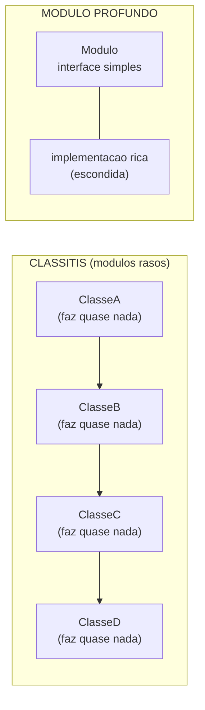
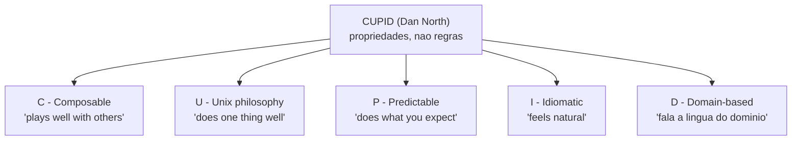
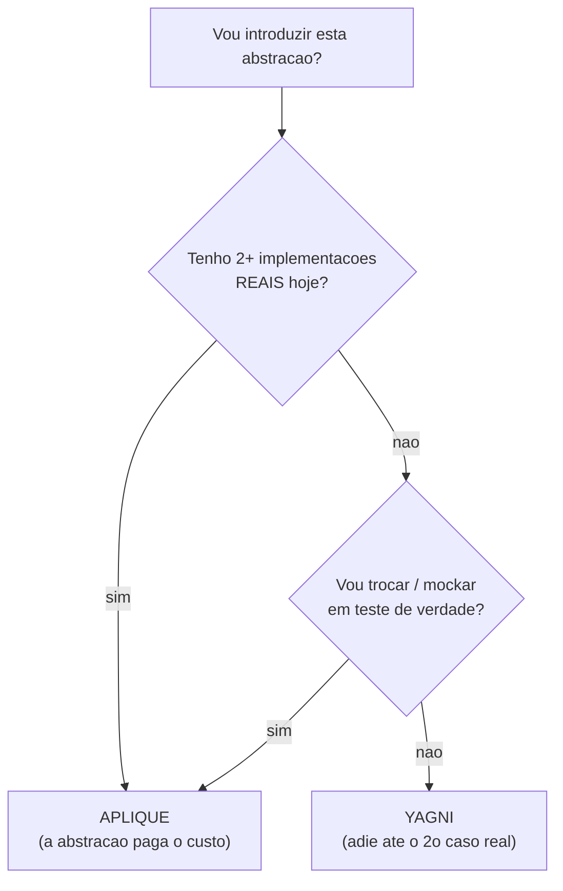

# SOLID em xeque

> [!abstract] TL;DR
> SOLID não é o objetivo — é um conjunto de **heurísticas** a serviço de um objetivo maior: **baixo acoplamento e alta coesão** para **gerenciar complexidade**. Aplicado no piloto automático, ele se vira contra você: interfaces com uma só implementação "pro futuro" (over-engineering), dezenas de classes minúsculas e rasas (a *classitis* de Ousterhout), indireção que ninguém pediu. O senior demonstra **julgamento**, não recitação: aplica a regra quando ela paga o custo, e a ignora quando ela piora o código.

Aprendemos os cinco princípios um a um — [[01 - O que é SOLID|SRP, OCP, LSP, ISP, DIP]] — e cada um, sozinho, faz sentido. Esta nota é o contraponto. Porque existe um modo de errar que nenhum dos cinco te avisa: **acertar todos eles e ainda assim produzir um código pior**.

Como assim? A pergunta retórica que abre o capstone é simples: *e se obedecer SOLID à risca te levar para o lugar errado?* Spoiler: leva, e com frequência. Vamos ver onde, por quê, e o que um senior responde quando o entrevistador cutuca essa ferida.

## Quando SOLID atrapalha

### Over-engineering: a interface fantasma

O pecado número um é abstrair cedo demais. Você cria uma `interface PagamentoGateway` com **uma única** implementação `StripeGateway`, "porque um dia pode ter outro provedor". Esse dia quase nunca chega — e enquanto não chega, todo mundo paga o imposto: mais um arquivo, mais uma camada para atravessar ao depurar, um nome a mais para inventar.

```java
// YAGNI: interface com UMA implementação, "pro futuro que não veio"
public interface PagamentoGateway { void cobrar(Pedido p); }
public class StripeGateway implements PagamentoGateway { /* única impl */ }
```

A regra de ouro vem do **YAGNI** (*You Aren't Gonna Need It*): abstraia quando o **segundo** caso real aparece, não antes. Repare que isso é o reverso da leitura preguiçosa do [[03 - OCP - Aberto-Fechado|OCP]]. OCP diz "deixe extensível para o que **varia**" — não "deixe extensível para tudo". O ponto de extensão custa caro; só vale quando há variação **real**, não imaginada. Antecipar variação que nunca vem é *speculative generality* — um *code smell* clássico, não uma virtude.

### Classitis: quando SRP e ISP fragmentam demais

Aqui mora a crítica mais afiada, e ela vem de fora da igreja do SOLID. **John Ousterhout**, em *A Philosophy of Software Design*, batiza de **classitis** a crença de que "se classes são boas, mais classes são melhores". O resultado de levar [[02 - SRP - Responsabilidade Única|SRP]] e [[05 - ISP - Segregação de Interfaces|ISP]] ao pé da letra: você estilhaça o sistema em dezenas de classes minúsculas, cada uma fazendo quase nada.

E qual o problema? Cada classe é simples — mas o **sistema** fica mais complexo. A lógica que antes morava num lugar agora está espalhada por sete arquivos, e para entender uma única operação você salta de um para o outro. A carga cognitiva **sobe**.

Ousterhout opõe a isso o conceito de **módulo profundo** (*deep module*): muita funcionalidade escondida atrás de uma interface **simples**. O oposto é o **módulo raso** (*shallow module*) — interface grande em relação ao que ele de fato faz. O exemplo dele: classes *decorator* tendem a ser rasas, cheias de métodos *pass-through* que só repassam a chamada e agregam pouco.



Leitura do diagrama: à esquerda, a *classitis* — uma corrente de caixas pequenas onde a lógica pinga de uma para a outra; a complexidade não sumiu, ela **vazou para as costuras entre as classes**. À direita, o módulo profundo: uma única caixa com interface fina por cima e uma implementação gorda por baixo, **escondida**. O critério de Ousterhout não é "quantas classes", é **profundidade** — quanto a interface esconde. Mais classes pequenas pode ser *pior*, não melhor.

> [!warning] Cuidado com a leitura
> Ousterhout **não** está dizendo "faça classes gigantes". Ele ataca a *regra cega* "classes pequenas são sempre boas". O alvo certo é **interface simples / implementação rica** — esconder complexidade, não picotá-la. SRP continua valendo; o que não vale é confundir "uma responsabilidade" com "cinco linhas por classe".

### DIP em excesso: indireção que não paga

O terceiro exagero é parente do primeiro. [[06 - DIP - Inversão de Dependência|DIP]] manda inverter a seta entre alto e baixo nível — ótimo na fronteira do domínio com a infra. Mas quando você embrulha **tudo** numa interface — incluindo coisas que nunca serão trocadas, nunca serão *mockadas*, nunca variarão — você só adicionou **indireção**.

Indireção tem um custo concreto de navegação: o leitor clica em "ir para definição" e cai numa interface vazia, sem saber qual das implementações roda em produção. DIP paga quando você **realmente** vai trocar a implementação (ou injetar um *fake* em teste). Para o resto, é cerimônia. A pergunta que filtra: *eu tenho um motivo concreto para inverter esta seta, ou só estou inverting por reflexo?*

## SOLID vs. simplicidade

Agora o ponto central, do qual todos os exageros acima são sintomas. **O objetivo final nunca foi "obedecer SOLID".** O objetivo é gerenciar complexidade — e a métrica disso é [[08 - Acoplamento e coesão|baixo acoplamento e alta coesão]]. SOLID é só um caminho bastante bom (mas não o único) para chegar lá.

A consequência prática é libertadora: **quando uma regra "correta" piora o código, você aplicou a regra errada — ou aplicou a regra certa no lugar errado.** Não é o código que está em débito com SOLID; é SOLID que está a serviço do código. Se inverter a seta tornou o sistema mais difícil de entender, a inversão estava errada *naquele ponto*, por mais que o acrônimo dissesse "faça".

Essa inversão de prioridades não é heresia solitária. **Dan North** — o mesmo da BDD — propõe o **CUPID** explicitamente como alternativa a SOLID, argumentando que princípios não são universais, são **contextuais**, e que importa mais como o código **é** (suas propriedades) do que regras de como produzi-lo. CUPID descreve cinco propriedades de código "que dá alegria de manter":



Leitura do diagrama: cada letra de CUPID é uma **propriedade do código pronto**, não um mandamento de processo. É a virada de North: SOLID diz *o que fazer enquanto escreve*; CUPID descreve *como o resultado deve ser*. Você não precisa adotar CUPID para tirar a lição — a lição é que a meta (composição, coesão, previsibilidade) está **acima** de qualquer acrônimo. SOLID é uma ferramenta para alcançá-la; quando não alcança, troca-se a ferramenta.

> [!info] Lastro
> Os cinco princípios SOLID são **canônicos** (Robert C. Martin / Uncle Bob). Já as **críticas** desta nota são posições nomeadas e verificáveis, não consenso universal: (1) a *classitis* e a oposição **módulo profundo vs. raso** são de **John Ousterhout**, em *A Philosophy of Software Design* (2018) — ele critica explicitamente o conselho de "classes pequenas"; (2) **CUPID** é de **Dan North** (2021), proposto como alternativa a SOLID ("princípios são contextuais, não universais"); (3) over-engineering por abstração prematura conecta a **YAGNI** e ao *smell* de *speculative generality* (Fowler/Beck). Nenhuma dessas críticas invalida SOLID — elas **calibram** quando aplicá-lo. Trate-as como o contraditório saudável de um princípio, não como refutação. Fontes: [Ousterhout — A Philosophy of Software Design (resumo)](https://blog.pragmaticengineer.com/a-philosophy-of-software-design-review/); [Dan North — CUPID: for joyful coding](https://dannorth.net/cupid-for-joyful-coding/).

## SOLID na arquitetura

Há um lado positivo que fecha o capstone: os mesmos princípios **escalam**. O que vale para classes vale para módulos e serviços inteiros, e nessa escala a crítica de "classitis" tem um eco direto — micro-serviços rasos demais são o equivalente sistêmico de classes minúsculas demais.

- **SRP** sobe para **bounded context** — um serviço, uma razão para mudar.
- **DIP** sobe para **ports & adapters** (arquitetura hexagonal) — o domínio define portas, a infra fornece adaptadores.
- **OCP** sobe para arquiteturas de **plugin** — estender sem recompilar o núcleo.

Isso não é assunto desta nota. O tratamento de **SOLID aplicado à arquitetura** vive em [[Arquitetura de Software]] — siga o link para o aprofundamento; aqui fica só o aceno de que a escada existe e os degraus têm o mesmo formato.

## Em entrevista

O que o entrevistador senior está testando não é se você **decorou** SOLID — é se você sabe **quando não aplicá-lo**. A pergunta-armadilha clássica: *"como você aplicou DIP recentemente?"* A resposta fraca recita a definição; a resposta forte traz um **caso concreto e o trade-off**. (Cole o caso de [[07 - DIP na prática - DI e IoC]] e diga o que você ganhou e o que pagou.)

Frases para ter na ponta da língua:

- *"I treat SOLID as heuristics, not rules — I apply DIP when I actually need to swap implementations or inject a fake in tests, not preemptively."*
- *"Over-applying ISP and SRP can fragment the code into shallow classes that are harder to follow. Ousterhout calls this classitis — more classes can mean more complexity, not less."*
- *"The goal isn't to satisfy SOLID; it's low coupling and high cohesion. When a 'correct' rule makes the code worse, I either applied the wrong rule or applied it in the wrong place."*
- *"I'd rather have one deep module — a simple interface hiding a rich implementation — than five shallow ones that leak complexity into the seams between them."*
- *"YAGNI keeps me honest: I introduce an abstraction when the second real case shows up, not for a future that may never arrive."*
- *"There are alternatives worth knowing — Dan North's CUPID, for instance — which frame this as properties of good code rather than rules to obey. The principles are contextual."*

**Vocabulário PT → EN:**

- heurística → *heuristic*
- regra (mandamento) → *rule*
- over-engineering → *over-engineering*
- abstração prematura → *premature abstraction*
- generalização especulativa → *speculative generality*
- carga cognitiva → *cognitive load*
- módulo profundo → *deep module*
- módulo raso → *shallow module*
- indireção → *indirection*
- trade-off → *trade-off*
- julgamento (de engenharia) → *engineering judgment*
- fragmentar o código → *to fragment the code*
- cerimônia (excesso de ritual) → *ceremony* / *boilerplate*
- esconder complexidade → *to hide complexity*

## Cheat-sheet: os 5 e seus exageros

A leitura completa de cada princípio está na sua nota; esta tabela é o resumo de bolso — incluindo, de propósito, a **armadilha de exagero** que esta nota inteira destrincha.

| Letra | Frase de 1 linha | Cheiro de violação | Armadilha de exagero |
|---|---|---|---|
| **S** — [[02 - SRP - Responsabilidade Única\|SRP]] | uma classe, uma razão para mudar | classe que muda por motivos não relacionados | *classitis*: picotar em classes rasas demais, espalhando a lógica |
| **O** — [[03 - OCP - Aberto-Fechado\|OCP]] | aberto p/ extensão, fechado p/ modificação | editar o mesmo `switch`/`if` a cada caso novo | pontos de extensão para variação **imaginada** (*speculative generality*) |
| **L** — [[04 - LSP - Substituição de Liskov\|LSP]] | subtipo substitui o tipo base sem surpresa | subclasse que lança exceção ou enfraquece o contrato | hierarquia forçada onde composição serviria melhor |
| **I** — [[05 - ISP - Segregação de Interfaces\|ISP]] | interface enxuta, focada no consumidor | implementar métodos que você não usa | esfarelar em micro-interfaces de um método só |
| **D** — [[06 - DIP - Inversão de Dependência\|DIP]] | dependa de abstrações, não de detalhes | negócio importando o banco concreto | interface para tudo: indireção que ninguém vai trocar |

A leitura honesta da última coluna: cada princípio tem um **gradiente** — pouco demais (violação) de um lado, demais (cerimônia) do outro. A senioridade é achar o meio, e isso é **julgamento**, não regra.



Leitura do diagrama: o decisor para abstrair tem **duas portas de entrada**. Se já existem duas implementações reais, ou se você de fato vai injetar um *fake* em teste, a abstração se paga — **aplique**. Se a resposta para as duas é "não", a única coisa que a interface adiciona é indireção: **YAGNI**, adie até o segundo caso real bater à porta. Não é "nunca abstraia"; é "abstraia por um motivo presente, não por um futuro hipotético".

E é exatamente o mesmo recado do capstone de OO: assim como [[13 - OO na prática e em entrevista|OO é ferramenta, não religião]], **SOLID é heurística, não dogma**. Os dois servem à mesma deusa — código que se entende e se muda sem medo. Quando o ritual brigar com esse fim, o fim ganha.

## Veja também

- [[01 - O que é SOLID]] — o acrônimo e a meta comum dos cinco
- [[02 - SRP - Responsabilidade Única]] — onde a *classitis* mais ataca
- [[03 - OCP - Aberto-Fechado]] — extensibilidade para o que **varia**, não para tudo
- [[04 - LSP - Substituição de Liskov]] — o contrato que a substituição não pode quebrar
- [[05 - ISP - Segregação de Interfaces]] — enxuta sem esfarelar
- [[06 - DIP - Inversão de Dependência]] — inverter onde paga, não em tudo
- [[07 - DIP na prática - DI e IoC]] — o caso concreto que você leva para a entrevista
- [[08 - Acoplamento e coesão]] — a métrica real por trás de SOLID
- [[12 - Anti-patterns de OO]] — over-engineering e indireção como *smells*
- [[13 - OO na prática e em entrevista]] — "OO é ferramenta, não religião" — o mesmo vale aqui
- [[Arquitetura de Software]] — SOLID escalado para módulos e serviços
