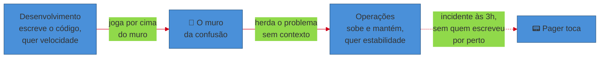
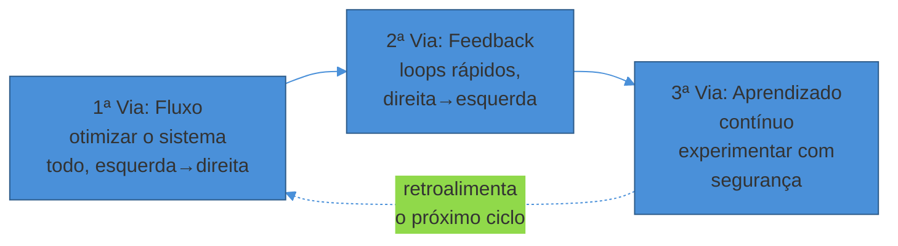
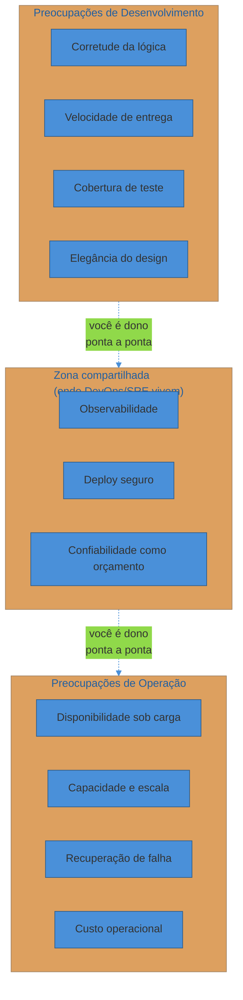

# O que é operar um sistema

> [!abstract] TL;DR
> Passar nos testes e rodar na sua máquina não é o mesmo que **estar vivo em produção**. O gap entre os dois é o assunto desta trilha inteira. **DevOps** é a resposta cultural a esse gap: derrubar o muro entre quem constrói e quem mantém no ar, orientado pelos **Three Ways** — fluxo, feedback e aprendizado contínuo (Kim et al., *The DevOps Handbook*). **SRE** é a implementação que o Google deu a essa cultura: tratar operação como um problema de engenharia de software, com orçamentos explícitos de risco (error budget) e de trabalho manual (toil) — o Google resume isso na frase "class SRE implements DevOps". O princípio organizador é **"you build it, you run it"** (Werner Vogels, Amazon, 2006): quem escreve o código também carrega o pager. Operar inclui fazer deploy, observar, escalar e responder a incidentes — e a maturidade nisso se mede, historicamente, pelas **quatro métricas DORA**: frequência de deploy, lead time, MTTR e change failure rate. Esta nota assume que você já sabe usar as ferramentas (Docker, K8s, CI/CD); o que ela ensina é o ofício de mantê-las no ar.

São 3h da manhã. O pager toca.

Você abre o laptop ainda meio dormindo. O dashboard mostra latência de p99 em 8 segundos — devia estar em 200ms. Metade dos requests está retornando 502. O time de suporte já tem sete tickets abertos.

Você olha o código que subiu há duas horas. A suite de testes passou, verde, 100%. Você mesmo rodou localmente antes do merge — funcionou perfeito. Nenhum teste falhou no CI. O deploy foi automático, sem drama.

E mesmo assim, aqui está você, às 3h, tentando entender por que um serviço "correto" está derrubando produção.

A resposta, quase sempre, não está no código. Está em tudo que o código *não sabe sobre si mesmo* quando roda sozinho, sob carga real, ao lado de outros cem serviços, num cluster que também está sob pressão, servindo usuários reais que não seguem o roteiro de nenhum teste. O código estava correto para o mundo pequeno onde foi validado. Produção é um mundo diferente — maior, mais hostil, e sem paciência para reprocessar a mesma pergunta duas vezes.

Essa distância entre "passa nos testes" e "está vivo em produção" é o assunto desta trilha inteira. E o nome que a indústria deu para a disciplina de fechar essa distância — cultural, técnica e organizacionalmente — é **operação**.

## O gap que "funciona na minha máquina" não fecha

Todo engenheiro backend conhece bem as outras trilhas deste vault: como desenhar um sistema (System Design), como estruturar o código (arquitetura, padrões), como testar (Testes JS, testes de unidade e integração), como orquestrar containers (Kubernetes), como montar um pipeline (CI/CD). Cada uma dessas peças, isoladamente, já é bem coberta.

O que falta — e é o vazio que esta trilha existe para preencher — é a pergunta seguinte: **o que muda quando o código deixa de ser um artefato e vira um serviço vivo, rodando 24 horas por dia, que alguém precisa manter no ar?**

Um teste unitário valida uma função contra entradas que você antecipou. Produção apresenta entradas que ninguém antecipou — tráfego 50x acima do esperado numa Black Friday, um cliente que manda um payload de 40MB onde todo mundo manda 2KB, uma dependência externa que começa a responder em 30 segundos em vez de 30 milissegundos. Nenhum desses cenários aparece automaticamente numa suite de testes. Eles aparecem em produção, na cara do usuário, e frequentemente de madrugada.

> [!question]- Isso não é só "faltou cobertura de teste"?
> Em parte, sim — e cada incidente vira, depois, uma nova hipótese de teste ou de guard-rail. Mas a lição maior é outra: **não existe cobertura de teste que simule o ambiente inteiro de produção** — a carga real, a topologia de rede real, os vizinhos barulhentos no mesmo cluster, a degradação gradual de uma dependência ao longo de semanas. Testes reduzem a superfície de surpresa; não a eliminam. É por isso que operação não é "escrever mais testes até parar de quebrar" — é construir a capacidade de **observar, reagir e se recuperar** quando, inevitavelmente, algo que nenhum teste cobriu acontece. As próximas notas deste sub-galho (12-Factor, ciclo de vida do deploy, confiabilidade como feature) constroem exatamente essa capacidade peça por peça.

Historicamente, a indústria de software resolveu esse gap organizando o trabalho em dois times separados. **Desenvolvimento** escreve features e as joga por cima do muro. **Operações** recebe o artefato, sobe em produção e lida com o que quebrar — sem ter escrito uma linha do código, e frequentemente sem entender por que ele se comporta do jeito que se comporta.

Esse "muro da confusão" (termo cunhado por Patrick Debois, um dos criadores do movimento DevOps) é a raiz de boa parte do sofrimento operacional clássico: quem escreveu o código não sente a dor de operá-lo, e quem sente a dor não tem contexto para consertar a causa raiz — só o sintoma.

## DevOps: a resposta cultural

**DevOps** nasceu como resposta direta a esse muro. Não é uma ferramenta, nem um cargo, nem um pipeline de CI/CD — é uma mudança de cultura e de incentivos que junta as duas responsabilidades numa mesma pessoa ou num mesmo time.

*The DevOps Handbook* (Kim, Debois, Willis e Humble, 2016) organiza essa cultura em três princípios — os **Three Ways**:

**A Primeira Via — Fluxo.** Otimizar o sistema inteiro (do código ao usuário final), não silos isolados. Uma feature "pronta" no laptop do dev que fica três semanas esperando um handoff para Operações não gerou valor nenhum — gerou trabalho em progresso parado. O objetivo é o fluxo de trabalho da esquerda (requisito) para a direita (produção) sem filas escondidas.

**A Segunda Via — Feedback.** Criar loops de retorno rápidos, da direita para a esquerda. Se um deploy quebra algo em produção, quem escreveu o código precisa saber *na hora*, não numa reunião de retrospectiva duas semanas depois. Quanto mais curto o loop entre causa e sintoma percebido, mais barato o conserto.

**A Terceira Via — Aprendizado contínuo.** Cultivar uma cultura onde experimentar e falhar é seguro, e onde cada falha vira conhecimento institucionalizado — não vira caça às bruxas. Isso é o que sustenta postmortems sem culpa e a prática deliberada de injetar falha (chaos engineering) para aprender antes que o incidente real aconteça.

As três vias não são uma lista — são um ciclo que se retroalimenta. Fluxo sem feedback rápido é uma esteira cega, entregando rápido sem saber se está entregando certo. Feedback sem aprendizado institucionalizado é ruído que se repete: o time descobre o mesmo problema mês após mês e nunca constrói a defesa permanente contra ele. E aprendizado sem fluxo de volta ao trabalho do dia a dia vira slide de retrospectiva que ninguém aplica.

> [!warning] DevOps não é "dar acesso de deploy ao dev"
> **O que acontece:** um time lê sobre DevOps e conclui que a mudança é técnica — dar aos desenvolvedores acesso de produção, automatizar o pipeline, e pronto. **Por quê:** confunde o sintoma (quem aperta o botão de deploy) com a causa (quem *carrega a responsabilidade* pelo resultado). Automação sem a cultura de fluxo/feedback/aprendizado só acelera o jeito antigo de errar. **Como evitar:** a métrica que importa não é "quem tem permissão", é "quando algo quebra às 3h, quem é chamado, e essa pessoa tem contexto e autoridade para consertar?" DevOps é sobre alinhar quem decide com quem sofre a consequência da decisão.

## SRE: a implementação do Google

Se DevOps é o *princípio* cultural, **Site Reliability Engineering (SRE)** é uma das *implementações* mais influentes desse princípio — a versão que o Google construiu internamente a partir de 2003 e documentou publicamente no livro *Site Reliability Engineering* (2016).

A frase que resume a relação entre os dois virou clichê no bom sentido: **"class SRE implements DevOps"** — numa analogia de programação, SRE é uma classe concreta que implementa a interface abstrata DevOps. DevOps diz *o quê* (juntar dev e ops, otimizar o sistema todo); SRE diz *como*, com práticas específicas e mensuráveis.

A ideia central do livro é simples de enunciar e difícil de executar: **tratar operação como um problema de engenharia de software**, não como um trabalho manual repetitivo. Em vez de um time de operações que aplica runbooks manualmente, o Google forma engenheiros de software para automatizar tudo que é repetível — e mede explicitamente o que não conseguiu automatizar ainda.

A esse trabalho manual dá-se um nome preciso: **toil**. O livro define toil como o tipo de trabalho operacional que é manual, repetitivo, automatizável, tático, sem valor duradouro e que cresce linearmente junto com o serviço — reiniciar um processo travado à mão, aplicar o mesmo patch em vinte máquinas, resolver o mesmo ticket pela centésima vez. O teste prático que o livro sugere: se, depois de terminar a tarefa, o serviço está exatamente no mesmo estado de antes (só que "consertado" de novo), foi toil; se a tarefa deixou uma melhoria permanente, não foi.

O Google formaliza isso com um teto explícito: **toil não deve ultrapassar 50% do tempo de um SRE**; os outros 50%, no mínimo, precisam ir para trabalho de engenharia que elimine a causa do toil — não que apenas aplique o curativo de novo. A justificativa é operacional, não burocrática: toil tende a se expandir sozinho se ninguém o contiver, e pode facilmente engolir 100% do tempo de um time que nunca para para consertar a causa raiz.

O segundo mecanismo, que só será detalhado a fundo no sub-galho 4 desta trilha (Observar e responder), é o **error budget**: em vez de perseguir 100% de disponibilidade — meta cara e, como veremos na próxima nota, contraproducente — a organização define um SLO (ex: 99,9%) e trata a folga até 100% como um *orçamento de risco* que times de produto podem gastar lançando features mais rápido. Zerou o orçamento, a prioridade vira estabilidade até o mês recalibrar.

Repare como os dois orçamentos — toil e erro — compartilham a mesma lógica: SRE converte algo que costumava ser julgamento subjetivo ("estamos operando bem?", "podemos arriscar esse deploy?") em um **número com teto explícito**, negociável entre engenharia e produto. É essa tradução de cultura em métrica que faz de SRE, de fato, uma *implementação* de DevOps — não apenas um rótulo alternativo para a mesma coisa.

> [!warning] Confundir "estar ocupado" com "estar operando bem"
> **O que acontece:** um time de plantão vive apagando incêndio — reinicia serviços, aplica patches manuais, responde ao mesmo alerta todo fim de semana — e interpreta esse volume de atividade como sinal de dedicação. **Por quê:** toil é *invisível como problema* porque parece trabalho real (e é: cada reinício individualmente resolve algo). O que ele esconde é a ausência de investimento em eliminar a causa. **Como evitar:** aplique o teste do livro SRE: a tarefa deixou o sistema permanentemente melhor, ou ele volta ao mesmo estado amanhã? Se voltar, meça quanto do tempo do time é gasto nisso — e trate como um teto orçamentário (o Google usa 50%), não como "é assim que é operar".

> [!question]- Se SRE é "melhor" que DevOps, por que essa trilha não é só sobre SRE?
> Porque SRE é uma *implementação específica*, não a única, e traz junto decisões organizacionais que nem toda empresa replica (um time dedicado de SREs, um processo formal de error budget, um veto de deploy quando o orçamento zera). Muitas empresas praticam a cultura DevOps — dev e ops integrados, fluxo, feedback — sem montar a estrutura formal de SRE do Google. Esta trilha ensina os **conceitos e práticas** (deploy seguro, observabilidade, confiabilidade, resposta a incidente) que valem nos dois modelos, porque o problema que eles resolvem — manter um sistema vivo em produção — é o mesmo independente do rótulo organizacional que sua empresa usa.

## "You build it, you run it"

Se há uma frase-âncora para o que esta trilha ensina, é a de Werner Vogels, CTO da Amazon, numa entrevista de 2006 para a ACM Queue:

> "The traditional model is that you take your software to the wall that separates development and operations, and throw it over and then forget about it. Not at Amazon. **You build it, you run it.**"

A ideia é radical na sua simplicidade: o time que escreve o serviço é o mesmo time que carrega o pager quando ele quebra. Não há "outro time" para culpar, nem um handoff que dilui a responsabilidade. Vogels descreve isso como o motor por trás da adoção de arquitetura orientada a serviços na Amazon — cada serviço tem um dono claro, ponta a ponta.

O efeito colateral é o que mais importa para você, leitor desta trilha: quando você sabe que vai ser *você* acordado às 3h se esse serviço cair, você escreve código diferente. Você instrumenta logs pensando em quem vai debugar às 3h (você mesmo). Você projeta timeouts e circuit breakers pensando em modos de falha, não só no caminho feliz. A responsabilidade operacional retroalimenta o design — e é exatamente esse loop de retroalimentação que o "muro da confusão" quebrava.

## O que "operar" inclui, na prática

Com a cultura estabelecida, vale nomear o escopo concreto do ofício — o que esta trilha, sub-galho por sub-galho, vai destrinchar:

- **Fazer deploy** com segurança — não só "rodar o pipeline", mas escolher a estratégia certa (rolling, blue-green, canary) e saber reverter rápido quando algo dá errado (sub-galho 2).
- **Manter o sistema rodando** sob carga real — containers e Kubernetes com a ótica operacional (probes, limites de recurso, zero-downtime), escala e capacidade (sub-galho 3).
- **Observar** — não só coletar métricas e logs, mas instrumentar de um jeito que responda perguntas que você ainda não sabia que ia precisar fazer.
- **Responder a incidentes** — o processo ao vivo quando o pager toca: mitigar antes de investigar a causa raiz, comunicar, aprender depois sem caçar culpados (sub-galho 4).
- **Garantir confiabilidade** como uma característica do sistema tão real quanto uma feature — com um orçamento e um custo explícitos, não uma aspiração vaga de "sempre no ar" (próxima nota desta série).

Repare no padrão: cada um desses itens é uma prática contínua, não um evento único. Deploy não é "terminou quando o CI ficou verde" — release e deploy são coisas diferentes, como a nota 03 deste sub-galho vai detalhar. Observabilidade não é "temos um Grafana" — é a capacidade de fazer perguntas novas sem reimplantar código. Confiabilidade não é um estado ("está no ar") — é um orçamento que se gasta e se repõe.

## Medindo maturidade: as quatro métricas DORA

Cultura sem medição vira slogan. O grupo de pesquisa **DORA** (DevOps Research and Assessment), formado por Nicole Forsgren, Jez Humble e Gene Kim, passou anos coletando dados de milhares de organizações para responder uma pergunta prática: **o que realmente diferencia times de alta performance?** O resultado virou o livro *Accelerate* (2018) e quatro métricas que se tornaram o vocabulário padrão da indústria para medir capacidade de entrega:

| Métrica | O que mede | Categoria |
|---|---|---|
| **Deployment frequency** | Com que frequência a organização coloca código em produção | Tempo (velocidade) |
| **Lead time for changes** | Tempo do commit até esse código rodar em produção | Tempo (velocidade) |
| **Change failure rate** | Percentual de deploys que causam falha em produção | Estabilidade |
| **Mean time to recovery (MTTR)** | Tempo médio para restaurar o serviço após uma falha | Estabilidade |

O achado contraintuitivo — e é por isso que essas métricas romperam o senso comum da época — é que **velocidade e estabilidade não são opostos**. Antes do *Accelerate*, a crença dominante era a de um trade-off: ir rápido implicava quebrar mais; ser estável implicava ir devagar e revisar tudo com cuidado redobrado. Os dados de milhares de organizações mostraram o oposto — os times de alta performance não trocam uma coisa pela outra, eles são bons nas duas ao mesmo tempo, porque deploys pequenos e frequentes são inerentemente mais fáceis de reverter e diagnosticar do que deploys grandes e raros.

O relatório anual *State of DevOps*, publicado pelo Google Cloud/DORA, traduz essas quatro métricas em clusters de maturidade. O relatório de 2023 (que trouxe de volta a categoria "Elite", ausente na coleta do ano anterior) descreve a distância entre os extremos:

| Cluster | Lead time (commit→prod) | Change failure rate | Tempo de recuperação |
|---|---|---|---|
| **Elite** | menos de 1 hora | ~5% | menos de 1 hora |
| **High** | menos de 1 dia | ~10% | menos de 1 dia |
| **Medium** | entre 1 dia e 1 semana | ~15% | entre 1 dia e 1 semana |
| **Low** | entre 1 mês e 6 meses | ~64% | entre 1 mês e 6 meses |

O salto entre Low e Elite não é incremental — é de ordem de grandeza. O relatório de 2024 quantificou essa distância de outro ângulo: performers elite entregam mudanças com um lead time cerca de **127 vezes mais rápido** que performers de baixa performance, mantendo change failure rate de 5% ou menos e deploys múltiplas vezes por dia. Não é "um pouco melhor" — é operar em uma categoria de risco completamente diferente, porque cada mudança individual é pequena o suficiente para ser entendida, testada e revertida em minutos.

> [!question]- Deploy frequente não aumenta o risco de quebrar produção?
> Contraintuitivamente, o dado histórico do *Accelerate* mostra o oposto: deploys menores e mais frequentes têm *change failure rate* menor, não maior. A explicação é de superfície de mudança: um deploy que altera 20 linhas é fácil de revisar, testar e — se algo der errado — apontar a causa e reverter em segundos. Um deploy que acumula duas semanas de mudanças é uma caixa-preta: quando quebra, ninguém sabe qual das cem alterações foi a culpada, e o rollback vira uma decisão de risco em si. É por isso que "deploy pequeno e frequente" é uma prática central do sub-galho 2 desta trilha, não um detalhe de otimização.

> [!question]- Essas quatro métricas ainda são o padrão hoje?
> São o vocabulário-base — todo engenheiro sênior precisa reconhecê-las. Mas o próprio grupo DORA evoluiu: no relatório de 2025, a pesquisa saiu de quatro tiers fixos (baixo/médio/alto/elite) e passou a descrever sete "arquétipos" de organização a partir de métricas ampliadas, incluindo confiabilidade como dimensão própria. O motivo é que "elite" numa métrica só (ex.: deploys por dia) sem olhar confiabilidade e experiência do time contava uma história incompleta. Isso não invalida as quatro métricas clássicas — continuam o ponto de entrada — mas mostra que medir maturidade operacional é, ela mesma, uma disciplina em evolução.

> [!warning] Otimizar uma métrica DORA isoladamente
> **O que acontece:** um time decide "melhorar deployment frequency" e passa a fazer micro-deploys automatizados sem gate de qualidade, só para inflar o número. **Por quê:** trata a métrica como meta em si, não como proxy de uma capacidade real (entregar valor com segurança). Goodhart's law: quando uma métrica vira alvo, ela deixa de ser boa métrica. **Como evitar:** as quatro métricas se equilibram em pares — velocidade (frequência, lead time) só é sinal de saúde se acompanhada de estabilidade (change failure rate, MTTR) estável ou melhorando junto. Olhar uma sem a outra é meio do quadro.

## Um exemplo trabalhado: anatomia de um dia operando

A teoria fica abstrata sem uma cena para ancorar. Veja como os conceitos desta nota se encadeiam num dia comum de um serviço em produção — a mesma sequência que os quatro sub-galhos desta trilha vão detalhar, um de cada vez.

**09h00 — Deploy.** O time termina uma feature pequena: ajustar o algoritmo de recomendação de produtos. O pipeline de CI/CD roda os testes, passa, e o deploy sobe via *canary*: 5% do tráfego vai para a versão nova, 95% continua na antiga. Ninguém aperta um botão de "confio cegamente" — a estratégia de deploy (sub-galho 2 desta trilha) existe exatamente para permitir observar antes de comprometer 100% do tráfego.

**09h15 — Observação.** O dashboard de métricas (sub-galho 4) mostra o canary saudável: latência igual, taxa de erro igual, nenhuma anomalia. Depois de 15 minutos de sinal limpo, o pipeline promove o canary para 100% automaticamente. Isso não seria possível sem instrumentação prévia — sem métricas de latência e erro por versão, ninguém saberia se os 5% estavam bem ou mal.

**14h30 — Alerta.** Horas depois, sem relação com o deploy da manhã, um alerta dispara: a fila de processamento de pedidos está crescendo sem parar. Não é um erro explícito — é um sintoma (RED: taxa de erro, latência, tráfego — sub-galho 4) que aponta para algo degradando silenciosamente. O SRE de plantão não sabe ainda a causa raiz; sabe que o sintoma é real e que a fila, se continuar crescendo, vai estourar SLA de entrega em duas horas.

**14h35 — Decisão de escalar.** Em vez de investigar a fundo primeiro, a decisão imediata é **mitigar o sintoma**: escalar o número de workers que consomem a fila (sub-galho 3, autoscaling e capacidade). A fila para de crescer. O incidente está contido — não resolvido, contido. Essa ordem de prioridade (mitigar antes de entender a causa raiz) é deliberada, não impaciência: cada minuto de fila crescendo é pedido de cliente atrasado, e a causa raiz pode esperar minutos a mais sem custo adicional.

**15h10 — Causa raiz.** Com o sintoma controlado, a investigação (sub-galho 4) encontra a causa: uma dependência externa começou a responder 3x mais devagar desde as 13h, e o serviço não tinha timeout configurado — cada worker ficava preso esperando a resposta lenta, reduzindo a capacidade efetiva de processamento.

**Semana seguinte — Postmortem.** Sem caçar culpados (Terceira Via do DevOps, aprendizado contínuo), o time documenta o incidente: o que aconteceu, por que o timeout ausente não foi pego antes, e a ação concreta — adicionar timeout com circuit breaker para essa dependência, e um alerta específico de latência de dependência externa, não só de tamanho de fila. A melhoria vira parte permanente do sistema; não foi *toil* porque deixou o serviço genuinamente mais resiliente, não apenas resolveu o incidente de hoje.

Repare que nenhuma dessas seis etapas dependeu de "escrever mais código de feature". Deploy seguro, observação instrumentada, decisão de escalar, mitigação antes de causa raiz, e aprendizado sem culpa — esse é o ofício de operar, e é exatamente o roteiro que os sub-galhos 2, 3 e 4 desta trilha vão aprofundar, cada um pegando um pedaço desse dia e destrinchando a fundo.

## Em entrevista

Perguntas sobre "o que é DevOps" ou "diferença entre DevOps e SRE" aparecem com frequência em entrevistas de nível sênior e staff — não como trivia de definição, mas como teste de maturidade sobre como você pensa responsabilidade operacional.

O que um entrevistador sênior está de fato avaliando quando pergunta isso:

- Se você trata operação como responsabilidade **sua**, não de "um outro time" — sinaliza se você já carregou pager de verdade ou só escreveu código que outros operam.
- Se você sabe distinguir **cultura** (DevOps, os Three Ways) de **implementação específica** (SRE, error budgets) — mostra que você entende o conceito além do buzzword.
- Se você consegue citar **como mede** maturidade operacional — as métricas DORA são a resposta padrão esperada, e saber que "deploy frequente ≠ mais risco" é um sinal de profundidade real, não decorado.
- Em perguntas de troubleshoot/operação (arquétipo já visto no sub-galho de System Design), se sua narrativa de incidente prioriza **mitigar o sintoma primeiro** e investigar depois — postura de quem já esteve na trincheira, não de quem só leu sobre.

A resposta fraca é recitar a definição de dicionário. A resposta forte amarra o conceito a uma decisão concreta: "nosso time adota you-build-it-you-run-it — isso mudou como eu desenho timeouts, porque sei que serei eu debugando às 3h se errar."

## How to explain in English

"Operating a system" in English carries the same weight it does in Portuguese, but a few terms are used almost exclusively in their English form even in PT-BR technical conversations — worth locking in early.

> "There's a real gap between code that passes tests and code that survives production — real load, noisy neighbors, dependencies degrading over weeks. DevOps is the cultural answer to that gap: breaking down the wall between dev and ops, guided by the Three Ways — flow, feedback, and continuous learning. SRE is Google's concrete implementation of that culture, treating operations as a software engineering problem with explicit budgets for toil and risk. The organizing principle is 'you build it, you run it' — whoever writes the service also carries the pager. And we measure operational maturity with the four DORA metrics: deployment frequency, lead time, change failure rate, and MTTR."

| PT | EN |
|----|----|
| Operar um sistema | Operate a system / run a system in production |
| O muro da confusão | The wall of confusion |
| Você constrói, você opera | You build it, you run it |
| Orçamento de erro | Error budget |
| Trabalho manual repetitivo | Toil |
| Frequência de deploy | Deployment frequency |
| Tempo de espera (commit→prod) | Lead time for changes |
| Taxa de falha de mudança | Change failure rate |
| Tempo médio de recuperação | Mean time to recovery (MTTR) |
| Pager tocou / estou de plantão | Paged / on-call |
| Time de plantão | On-call rotation |

## O que vem a seguir

Estabelecemos o *porquê* — o gap dev→prod e as respostas culturais que a indústria construiu para fechá-lo. A próxima nota entra no *o quê*: quais características, concretamente, fazem uma aplicação ser fácil ou difícil de operar. É o contrato que separa um serviço "que dá pra rodar" de um serviço "que dá pra manter no ar" — o modelo Doze Fatores (12-Factor App), lido não como checklist de startup, mas como o alicerce técnico de tudo que este sub-galho e os próximos vão construir em cima.

- [[02 - O contrato de uma app operável (12-Factor)]] — config no ambiente, logs como stream, processos stateless e descartáveis: o que torna um serviço operável desde o design
- [[03 - O ciclo de vida de um deploy]] — do commit ao tráfego: o mapa que os sub-galhos 2, 3 e 4 desta trilha vão detalhar
- [[04 - Confiabilidade como feature]] — por que 100% de disponibilidade é a meta errada, e o que colocar no lugar

## Veja também

- [[Operação/index|Operação]] — o galho-pai e o mapa completo da trilha
- [[1 - O ofício de operar/index|O ofício de operar]] — este sub-galho
- [[03-Dominios/Tecnologia/Infraestrutura/index|Infraestrutura]] — as ferramentas (Docker, Kubernetes, CI/CD, Observabilidade) que esta trilha assume conhecidas e aplica em produção
- [[System Design/index|System Design]] — o par que ensina a desenhar o sistema; esta trilha ensina a mantê-lo vivo depois de desenhado

## Fontes

- **Google** — [*Site Reliability Engineering* — Introduction](https://sre.google/sre-book/introduction/) (sre.google/books, 2016) — a definição de SRE por Ben Treynor Sloss e a relação "class SRE implements DevOps".
- **Google** — [*Site Reliability Engineering* — Eliminating Toil](https://sre.google/sre-book/eliminating-toil/) (sre.google/books, 2016) — a definição formal de toil e o teto de 50% do tempo de um SRE.
- **Gene Kim, Jez Humble, Patrick Debois, John Willis** — *The DevOps Handbook: How to Create World-Class Agility, Reliability, and Security in Technology Organizations* (2016) — os Three Ways (fluxo, feedback, aprendizado contínuo) e o "muro da confusão".
- **Nicole Forsgren, Jez Humble, Gene Kim** — *Accelerate: The Science of Lean Software and DevOps* (2018) — a pesquisa original por trás das quatro métricas DORA e o desmonte do falso trade-off velocidade×estabilidade.
- **Google Cloud / DORA** — [*Announcing the 2023 State of DevOps Report*](https://cloud.google.com/blog/products/devops-sre/announcing-the-2023-state-of-devops-report) — os clusters Elite/High/Medium/Low com os números de lead time, change failure rate e tempo de recuperação citados nesta nota.
- **DORA / Google Cloud** — [*DORA Metrics Guide*](https://dora.dev/guides/dora-metrics/) (dora.dev, atualizado com o relatório 2025 que introduziu os sete arquétipos além dos tiers clássicos).
- **Jim Gray (entrevistador)** — [*A Conversation with Werner Vogels*](https://queue.acm.org/detail.cfm?id=1142065), ACM Queue, vol. 4, nº 4 (maio de 2006) — a origem da frase "you build it, you run it".
