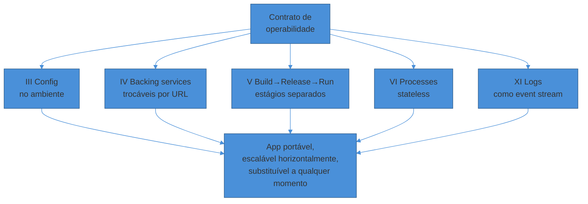
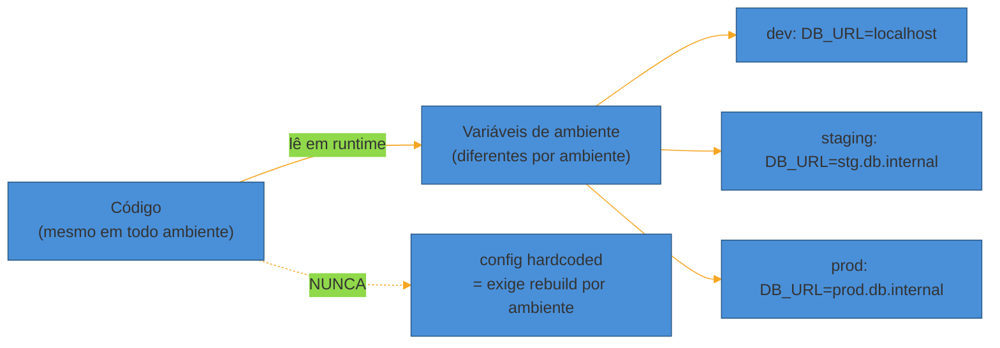
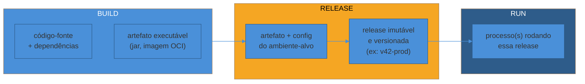
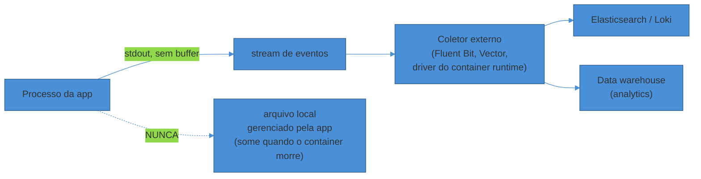

# O contrato de uma app operável (12-Factor)

> [!abstract] TL;DR
> Uma app que roda perfeitamente na máquina do dev pode ser um pesadelo pra operar em produção — e o motivo quase nunca é o código de negócio. É **config hardcoded** que exige rebuild pra trocar de ambiente, é **estado guardado em memória** que impede escalar horizontalmente, são **logs escritos em arquivo local** que somem quando o container morre. O **12-Factor App** (Heroku, 2011) é um contrato de doze regras que evita exatamente essas armadilhas. Não são doze regras igualmente importantes — pra quem opera, cinco delas carregam o peso real: **III Config** (fora do código), **IV Backing services** (trocáveis por URL), **V Build/release/run** (estágios imutáveis e separados), **VI Processes** (stateless) e **XI Logs** (stream, não arquivo). O 12-Factor é de 2011, era pré-Kubernetes — hoje ele é revisitado ("Beyond the Twelve-Factor App", telemetria como fator explícito), mas o núcleo continua sendo o vocabulário comum entre quem escreve código e quem sustenta o serviço às 3h da manhã.

## Uma cena que todo operador já viveu

Terça-feira, 14h. Um serviço passa no dev, passa no CI, passa no staging. Sobe pra produção. Vinte minutos depois, o time de plantão recebe um alerta: memória subindo sem parar, um pod reiniciando em loop.

Investigação: o serviço guarda sessões de usuário num `Map` em memória. Funcionou em staging porque só havia uma réplica. Em produção, o autoscaler subiu para quatro réplicas — e cada uma tem sua própria cópia do `Map`, nenhuma sabe da sessão que foi criada nas outras três. Metade dos usuários é deslogada aleatoriamente a cada request.

O segundo problema aparece na sequência: pra debugar, alguém tenta puxar os logs. Mas o container que travou já foi substituído por um novo — o `Pod` antigo, e o arquivo de log dentro dele, não existem mais. Nenhum rastro do que aconteceu.

Nenhum desses dois bugs é "difícil" de resolver. Nenhum é sequer um bug de lógica de negócio. São violações de duas regras muito antigas e muito conhecidas: **processos são stateless** e **logs são um stream, não um arquivo**. O código estava certo. O *contrato de operabilidade* é que foi quebrado.

Esse contrato tem nome: **the Twelve-Factor App**.

> [!question]- Por que confiar num documento de 2011, escrito pensando no Heroku?
> Porque o Heroku de 2011 já era, essencialmente, uma plataforma de deploy multi-tenant com scaling horizontal automático — o mesmo problema que Kubernetes resolve hoje, só que antes do vocabulário "cloud-native" existir. Adam Wiggins e o time do Heroku destilaram o 12-Factor observando **centenas de apps SaaS reais** rodando na plataforma deles, catalogando os padrões que causavam dor operacional recorrente. O documento sobreviveu porque descreve física, não moda: processo com estado não escala horizontalmente, seja em 2011 num dyno do Heroku ou em 2026 num pod do Kubernetes. A crítica legítima (que a nota trata mais à frente) não é que o núcleo esteja errado — é que faltam fatores que a era de APIs e observabilidade tornou centrais.

## O que "12-Factor" quer dizer, em uma frase

Doze regras que, seguidas juntas, produzem uma app que pode ser **build-uma-vez, deploy-em-qualquer-lugar, escalada-sem-coordenação e substituída-a-qualquer-momento** sem ninguém precisar tocar no código pra isso acontecer.

Repare no verbo em cada cláusula: *pode ser*, *sem coordenação*, *sem tocar no código*. O 12-Factor não é sobre arquitetura de negócio — é sobre **remover fricção operacional**. Ele responde à pergunta "o que essa app precisa fazer sozinha, sem que um humano intervenha, pra rodar bem numa plataforma que não conhece os detalhes dela"?

Os doze fatores completos, na ordem original, são: **I** Codebase, **II** Dependencies, **III** Config, **IV** Backing services, **V** Build/release/run, **VI** Processes, **VII** Port binding, **VIII** Concurrency, **IX** Disposability, **X** Dev/prod parity, **XI** Logs, **XII** Admin processes. Esta nota passa rápido pelos seis primeiros (a maioria você já pratica sem pensar) e aprofunda os cinco que mais determinam se um serviço é operável ou não: III, IV, V, VI, XI — mais IX e X, que fecham o quadro.

## Os fatores "básicos", em uma passada rápida

Cinco deles você provavelmente já segue por hábito de engenharia moderna — vale nomeá-los porque eles aparecem em entrevista e porque o resto da nota assume que estão resolvidos.

**I. Codebase** — um repositório versionado, muitos deploys (dev, staging, N produções) a partir dele. Se duas apps compartilham código, é uma dependência, não a mesma codebase — ela devia virar uma lib.

**II. Dependencies** — declare todas as dependências explicitamente (`package.json`, `pom.xml`, `go.mod`) e nunca confie em algo que "já está instalado no sistema". Um build reprodutível não pode depender de que o SO tenha `curl` ou uma versão específica de `libssl` por acaso.

**VII. Port binding** — a app é autocontida: ela mesma escuta numa porta (via um servidor embutido, tipo Tomcat embarcado no Spring Boot ou o `http.Server` do Node), em vez de depender de um container externo tipo Apache pra existir. É o que permite uma app virar backing service de outra.

**VIII. Concurrency** — escale adicionando processos, não threads dentro de um processo monolítico. É o modelo `web=4, worker=2` do Procfile do Heroku, ou `replicas: 4` no Kubernetes — escala horizontal via múltiplas cópias do mesmo processo, cada uma pequena e descartável.

**XII. Admin processes** — tarefas administrativas (migração de schema, console REPL, script de correção de dados) rodam como processos *one-off*, no mesmo código e config do processo principal — nunca um script solto que só alguém lembra de rodar manualmente com uma versão desatualizada do código.

Esses cinco são disciplina de engenharia. Os cinco a seguir são onde a **operação** vive ou morre.

## III. Config — tudo que varia entre ambientes, fora do código

A regra central: **config é tudo que muda entre deploys** — URL do banco, credenciais de API externa, feature flags por ambiente, hostname. Código é o que **não** muda entre deploys.

O teste prático do 12-Factor pra saber se algo é config: você conseguiria abrir seu código-fonte publicamente agora, sem vazar credencial nenhuma? Se a resposta é não, tem config vazando pra dentro do código.

A forma canônica prescrita é **variáveis de ambiente**. Não porque env vars sejam elegantes — são, na verdade, um formato meio grosseiro (tudo string, sem namespacing nativo) — mas porque são **universalmente suportadas** por qualquer linguagem e qualquer SO, ao contrário de um arquivo de config em formato proprietário que cada framework lê de um jeito.

O erro mais caro aqui não é técnico, é de **hábito**: commitar um `.env` "só dessa vez", ou deixar uma credencial de teste hardcoded "porque é só pra debugar local". Esse hábito é o vetor nº 1 de vazamento de segredo em repositórios públicos e privados. Gestão de segredo em profundidade — rotação, injeção via Vault/sealed-secrets, o ciclo de vida de uma credencial — é o assunto da nota canônica desta trilha (SG2-06); aqui o que importa é o **princípio de fronteira**: config nunca mora no código, e segredo é um caso especial de config que exige tratamento ainda mais estrito.

> [!warning] Config "por perfil" dentro do jar/artefato
> **O que acontece:** o time cria `application-dev.yml`, `application-staging.yml`, `application-prod.yml` dentro do próprio artefato e escolhe qual carregar via flag de build. **Por quê:** parece organizado, mas embute os valores de *todos* os ambientes no mesmo artefato — inclusive credenciais de produção, dentro do build de dev. **Como evitar:** o artefato é único e não sabe em que ambiente vai rodar. O `application.yml` define *placeholders* (`${DB_URL}`); os valores concretos entram via variável de ambiente ou ConfigMap/Secret no deploy — nunca dentro do jar. É a diferença entre "a config está no código, parametrizada" e "a config está no ambiente, e o código só lê".

## IV. Backing services — recursos que se conectam por URL, não por acoplamento

Um *backing service* é qualquer coisa que sua app consome pela rede como parte do funcionamento normal: banco de dados, fila, cache, serviço de e-mail, API de terceiros. A regra do 12-Factor: **o código não distingue** um serviço local de um gerenciado por terceiros — ambos são um recurso anexado, identificado por uma URL guardada em config.

A consequência prática é a mais valiosa: trocar de Postgres local pra RDS gerenciado, ou de Redis próprio pra um Redis Cloud, deveria exigir **zero mudança de código** — só trocar a variável de ambiente que aponta pro novo endereço. Se trocar o backing service obriga a mexer em código, o acoplamento está no lugar errado.

Esse fator é o que sustenta o **dev/prod parity** (fator X, adiante): rodar o mesmo tipo de banco em dev e em produção — mesmo que versões ou tamanhos diferentes — evita a classe de bug "funcionou no SQLite local, quebrou no Postgres de produção" por causa de uma diferença sutil de comportamento entre os dois.

## V. Build, release, run — três estágios, nunca misturados

Este é o fator que mais estrutura *como* um deploy deveria ser pensado — e a base conceitual pra próxima nota deste sub-galho, sobre o ciclo de vida completo de um deploy.

A regra: **build**, **release** e **run** são estágios estritamente separados, e nenhum deploy pode pular ou fundir eles.

**Build** transforma o código-fonte num artefato executável — compila, resolve dependências, empacota (um `.jar`, uma imagem de container). O build **não sabe** em que ambiente vai rodar.

**Release** combina esse artefato com a config de um ambiente específico, gerando uma **release imutável e identificável** — `v42` em produção não é a mesma coisa que `v42` em staging, mesmo que o build seja idêntico, porque a config anexada é diferente. Toda release tem um ID único, e o sistema deveria conseguir apontar exatamente qual release está rodando onde.

**Run** executa essa release num ambiente de execução — inicia o(s) processo(s), nada além disso. **Run não deveria fazer nada que altere o comportamento do sistema além de rodar** — nenhuma mudança de código acontece nesse estágio.

A regra derivada, e a mais violada em produção real: **mudanças no código sempre passam pela fase de build**. Nunca existe um "hotfix direto em produção" editando o código de um container rodando — isso quebra a rastreabilidade (qual código está de fato rodando?) e a reprodutibilidade (esse fix sobrevive ao próximo deploy?).

> [!question]- Qual a diferença prática entre "release" e "deploy"?
> **Release** é o artefato versionado e imutável — o *o quê* vai rodar. **Deploy** é o *ato* de colocar essa release pra rodar em algum lugar, e **rollback** é o ato de trocar de volta pra uma release anterior. Separar os dois conceitos é o que torna rollback trivial: se a release `v41` e a `v42` já existem, prontas e imutáveis, "reverter" é só apontar o `run` de volta pra `v41` — sem rebuild, sem re-deploy do zero. É exatamente a distinção que a próxima nota deste sub-galho ([[03 - O ciclo de vida de um deploy]]) usa como eixo central, e que reaparece com mais peso ainda em Progressive Delivery (SG2-03), onde deploy e release **deliberadamente** deixam de ser sinônimos.

## VI. Processes — stateless e share-nothing

A regra mais violada por quem vem de um mundo de app monolítica de servidor único: **processos são stateless e share-nothing**. Qualquer dado que precise sobreviver além de uma request individual vai pra um backing service com estado (banco, cache distribuído) — nunca em memória local do processo, nunca em disco local.

É a cena de abertura desta nota. O `Map` de sessão em memória funciona com uma réplica e quebra com quatro, porque cada réplica é um universo isolado — nada é compartilhado entre processos, nem *deveria* ser, porque **é isso que permite escalar horizontalmente sem coordenação**.

O corolário é sutil e importa em entrevista: statelessness não significa "a aplicação não tem estado" — significa "o estado não mora dentro do processo". Sessão vai pra Redis. Upload de arquivo vai pra um object store (S3-like), nunca pro disco local do container. Cache de aplicação, se precisar sobreviver a um restart ou ser compartilhado entre réplicas, vai pra um cache distribuído.

Esse é o mesmo princípio que sustenta a discussão de escalabilidade em [[System Design/index|System Design]]: um sistema só escala horizontalmente sem esforço de coordenação se as unidades que você replica são, de fato, intercambiáveis e sem memória própria.

> [!warning] "Sticky sessions" como remendo pra processo com estado
> **O que acontece:** em vez de tirar a sessão do processo, o time configura o load balancer pra sempre mandar o mesmo usuário pra mesma réplica ("sticky session" / affinity). **Por quê:** parece resolver o sintoma sem mexer no código — e resolve, no curto prazo. **Como evitar:** sticky session é uma dívida técnica disfarçada de solução. Ela quebra o autoscaling (uma réplica pode ficar sobrecarregada enquanto outras ficam ociosas, porque os usuários "grudados" nela não se distribuem), quebra o rolling deploy (matar a réplica derruba a sessão de todo mundo grudado nela) e reintroduz acoplamento exatamente onde o 12-Factor pede independência. O fix correto é sempre mover o estado pra um backing service compartilhado — mesmo que dê mais trabalho inicial.

## XI. Logs — event stream, não arquivo gerenciado

A regra: cada processo escreve seu stream de eventos, sem buffer, pro **stdout**. Ponto final. **A app nunca gerencia arquivo de log** — não decide onde ele fica, não faz rotação, não decide formato de armazenamento de longo prazo.

Isso parece contraintuitivo pra quem vem de um mundo onde "configurar logging" significa escolher um appender de arquivo com rotação diária. O 12-Factor inverte a responsabilidade: **a app só produz o stream; o ambiente de execução é quem coleta, roteia e armazena.**

Na segunda cena de abertura desta nota, o log sumiu porque foi escrito num arquivo *dentro* do container que morreu. Se em vez disso o processo tivesse escrito no stdout, o coletor de logs da plataforma (o driver de log do Docker, o DaemonSet do Fluent Bit no Kubernetes, o agent do Cloud Run) já teria capturado e encaminhado esse stream pra um destino durável **antes** do container morrer — o container é descartável, mas o stream que ele produziu não precisa ser.

A prática moderna acrescenta uma camada que o 12-Factor de 2011 não previa em detalhe: **structured logging** — cada linha do stream é JSON, não texto livre, pra que o coletor consiga indexar campos (nível, trace-id, usuário) sem parsing frágil de regex. É a mesma lente do fator XI, um passo à frente: o formato do evento também deveria ser pensado pra consumo por máquina, não só por humano. Instrumentação em profundidade — os 3 pilares, cardinalidade, correlação entre logs e traces — é o assunto do sub-galho 4 desta trilha (Observar e responder); aqui, o contrato é só: **stdout, sem gerenciar arquivo.**

## IX. Disposability — start rápido, shutdown gracioso

Processos são **descartáveis**: podem ser iniciados ou terminados a qualquer momento, sem aviso prévio. Duas consequências práticas.

**Startup rápido.** Um processo que demora minutos pra ficar pronto trava scaling elástico (o autoscaler precisa esperar) e trava deploys (a plataforma não sabe se o processo travou ou só está demorando). Segundos, não minutos, é o alvo.

**Shutdown gracioso.** Ao receber `SIGTERM`, o processo para de aceitar requests novos, termina o que já estava em andamento, e só então encerra — nunca derruba conexões em voo abruptamente. Um processo que ignora `SIGTERM` e só morre no `SIGKILL` (depois do timeout da plataforma) descarta trabalho em andamento a cada deploy ou reinício.

O detalhe fino de graceful shutdown — o que exatamente acontece nos segundos entre `SIGTERM` e a morte do processo, como isso se coordena com o `readinessProbe` do Kubernetes pra parar de receber tráfego novo *antes* de sinalizar shutdown — é aprofundado no SG3 desta trilha (o contrato de produção do Kubernetes). Aqui, o contrato é só o princípio: **um processo bem-comportado morre rápido quando pedem, mas nunca de supetão.**

> [!warning] Ignorar SIGTERM e deixar o orquestrador matar na marra
> **O que acontece:** o processo não trata `SIGTERM` — ou trata, mas leva mais tempo que o `terminationGracePeriodSeconds` configurado. O orquestrador espera o prazo e manda `SIGKILL`, que não dá chance de encerrar nada com cuidado. **Por quê:** frameworks costumam vir com shutdown gracioso desligado por padrão, ou o time nunca testou o comportamento de shutdown fora do `ctrl+C` local — que é um sinal diferente (`SIGINT`) do que o orquestrador manda em produção. **Como evitar:** teste explicitamente o comportamento sob `SIGTERM` (não `SIGINT`) antes de ir a produção — `docker stop` local é um jeito rápido de simular, porque ele manda `SIGTERM` e espera antes do `SIGKILL`. Frameworks modernos (Spring Boot 3+, com `server.shutdown=graceful`; qualquer server Node que escute `process.on('SIGTERM', ...)`) suportam isso nativamente — é questão de habilitar e testar, não de escrever do zero.

## X. Dev/prod parity — ambientes parecidos, não idênticos-em-teoria-diferentes-na-prática

Historicamente havia três gaps entre dev e produção: **de tempo** (código levava semanas pra ir a produção), **de pessoal** (quem escrevia não era quem operava) e **de ferramentas** (SQLite local, Postgres em produção; Nginx em produção, servidor de dev embutido diferente).

O 12-Factor prescreve fechar os três gaps: deploys **frequentes** (horas, não semanas), **o mesmo time** escreve e opera ("you build it, you run it" — o tema da nota anterior deste sub-galho), e — o gap que mais importa tecnicamente — **os mesmos backing services** em dev e produção, mesmo que em escala menor.

A armadilha clássica: rodar SQLite em dev "porque é mais simples" e Postgres em produção "porque é mais robusto". Os dois falam SQL, mas têm diferenças de comportamento reais (tipos, locking, funções) que produzem bugs que só aparecem em produção — exatamente o tipo de surpresa que dev/prod parity existe pra eliminar. Containers resolveram boa parte disso na prática: rodar o mesmo Postgres containerizado em dev (via docker-compose) e em produção fecha o gap de ferramentas quase de graça.

## Os doze fatores, de relance

Uma tabela de referência rápida — útil pra revisão antes de uma entrevista ou pra checar um serviço novo contra o contrato completo. A coluna "peso operacional" reflete a ênfase desta nota, não uma hierarquia oficial do documento original.

| # | Fator | Regra em uma frase | Peso operacional |
|---|-------|---------------------|-------------------|
| I | Codebase | Um repositório versionado, muitos deploys | Baixo — disciplina básica de engenharia |
| II | Dependencies | Declare tudo explicitamente, nunca confie no ambiente | Baixo — disciplina básica de engenharia |
| III | Config | Tudo que varia entre ambientes vive fora do código | **Alto** — vetor nº 1 de incidente e vazamento |
| IV | Backing services | Recursos anexados por URL, trocáveis sem mudar código | **Alto** — determina o custo de trocar de infra |
| V | Build, release, run | Três estágios estritamente separados, releases imutáveis | **Alto** — base de rollback confiável |
| VI | Processes | Stateless e share-nothing | **Alto** — pré-condição de escalar horizontalmente |
| VII | Port binding | A app expõe a si mesma via porta, autocontida | Médio |
| VIII | Concurrency | Escale via mais processos, não mais threads num processo só | Médio |
| IX | Disposability | Start rápido, shutdown gracioso via SIGTERM | **Alto** — todo deploy e todo autoscale depende disso |
| X | Dev/prod parity | Ambientes o mais parecidos possível, deploys frequentes | Médio-alto — reduz "funcionou aqui, quebrou lá" |
| XI | Logs | Event stream pro stdout, nunca arquivo gerenciado pela app | **Alto** — sem isso, não há o que investigar num incidente |
| XII | Admin processes | Tarefas administrativas rodam no mesmo código/config, one-off | Médio |

## Um exemplo trabalhado: a mesma app, dois graus de conformidade

**Versão não-conforme.** Um serviço de checkout guarda o carrinho do usuário num `HashMap` em memória (viola VI). A URL do banco está hardcoded em `application.properties`, commitada no repo (viola III). Os logs vão pra `/var/log/app/checkout.log` dentro do container, com um `logrotate` cron configurado manualmente (viola XI). Deploy é: SSH na VM, `git pull`, `mvn package`, reiniciar o processo manualmente — sem separação entre build e run (viola V).

Esse serviço *funciona* — até o dia em que alguém tenta escalar pra duas réplicas (sessões quebram), até o dia em que o segredo do banco vaza no GitHub (config no código), até o incidente em que ninguém consegue investigar porque o log sumiu com o container.

**Versão conforme.** O carrinho vive no Redis, identificado por um cookie de sessão — o processo da app não guarda nada entre requests (VI ok). A URL do Redis e do Postgres vem de variáveis de ambiente injetadas pelo orquestrador; o `application.properties` só tem placeholders (III ok). O processo escreve JSON estruturado no stdout; o DaemonSet de logging da plataforma coleta e indexa (XI ok). O deploy constrói uma imagem OCI versionada (build), gera um manifest do Kubernetes com essa imagem + os ConfigMaps do ambiente-alvo (release), e o `kubectl apply` só troca qual release está rodando (run) — rollback é reaplicar o manifest anterior, sem rebuild.

A segunda versão não é "melhor código" no sentido de lógica de negócio — o carrinho, o checkout, as regras de preço são idênticos nas duas. A diferença inteira é **operabilidade**: a primeira versão exige um humano tomando decisões manuais toda vez que algo muda de escala ou de ambiente; a segunda deixa a plataforma fazer isso sozinha.

## Além do 12-Factor: o que mudou desde 2011

O 12-Factor nasceu observando apps num PaaS (Heroku) numa era pré-Kubernetes, pré-microsserviços em escala massiva, pré-observabilidade como disciplina própria. Ele não está errado — mas ficou incompleto.

Kevin Hoffman, em *Beyond the Twelve-Factor App* (O'Reilly/Pivotal, 2016), propõe uma revisão pra **15 fatores**, reordenando e acrescentando três: **API first** (a app deveria ser desenhada como uma API consumível desde o início, não como uma UI que acidentalmente expõe endpoints), **Telemetria** (métricas, health checks e logging de domínio deveriam ser um requisito de primeira classe do deploy, não um afterthought — especialmente relevante porque, num PaaS como Heroku, o operador tinha acesso de shell ao dyno; num cluster Kubernetes gerenciado por outro time, isso raramente é verdade) e **Autenticação/autorização** (segurança como fator explícito, não implícito).

Mais recentemente, o Google Cloud propôs uma extensão ainda mais nova — de doze para **dezesseis fatores** — voltada especificamente pra apps que incorporam LLMs, endereçando problemas que o 12-Factor original nunca poderia ter previsto: memória conversacional, comportamento não-determinístico do modelo, riscos de segurança específicos de IA generativa.

O padrão de todas essas extensões é o mesmo: o **núcleo operacional** do 12-Factor (config fora do código, processos stateless, logs como stream, build/release/run separados) segue sendo a base — nenhuma revisão joga esses cinco fora. O que muda é o que se soma em cima, conforme a plataforma e o tipo de app evoluem. Pra quem está entrando em produção hoje, num mundo majoritariamente Kubernetes: trate os doze fatores originais como o piso inegociável, e telemetria/observabilidade como o décimo terceiro fator implícito que o sub-galho 4 desta trilha cobre em detalhe.

> [!question]- Vale a pena estudar o documento original de 2011 ou só as versões atualizadas?
> Vale ler os dois, mas o original primeiro — ele é curto (12 páginas de fato, uma por fator), gratuito em [12factor.net](https://12factor.net), e continua sendo o vocabulário compartilhado que aparece em entrevista e em discussão de arquitetura ("essa app é 12-factor?" é uma pergunta que qualquer engenheiro sênior reconhece). As extensões (Hoffman, Google Cloud) são leitura complementar pra entender *onde* o modelo original mostra a idade — não substitutas. Pense nele como um paper fundacional: você não pula o original só porque existem revisões mais recentes.

## Em entrevista

Config, statelessness e logs-como-stream aparecem com frequência em entrevistas de nível sênior — não como "cite os 12 fatores", mas embutidos em perguntas de design ou de troubleshoot: "como você lidaria com sessão de usuário num sistema com múltiplas réplicas?" é, na prática, uma pergunta sobre o fator VI. "Por que você não deixaria a app escrever em arquivo de log?" é sobre o fator XI.

A resposta que sinaliza senioridade não é recitar o nome do fator — é explicar a **consequência operacional**. Não diga "isso viola o fator VI do 12-Factor"; diga "se eu guardar isso em memória do processo, perco a capacidade de escalar horizontalmente sem sticky session, e sticky session quebra rolling deploy — então isso precisa ir pra um backing service compartilhado". O entrevistador está testando se você entende *por que* a regra existe, não se você decorou a lista.

Um sinal de nível ainda mais alto: reconhecer os *limites* do 12-Factor. Se o entrevistador perguntar sobre telemetria ou sobre design de API, mencionar que essas preocupações são tratadas por extensões mais recentes do modelo (Hoffman, "Beyond the Twelve-Factor App") mostra que você não trata o documento de 2011 como escritura sagrada — você sabe onde ele foi complementado pela prática cloud-native.

## How to explain in English

The Twelve-Factor App is a 2011 methodology from Heroku's engineering team, distilled from observing hundreds of real SaaS deployments, that codifies what makes an application *operable* — portable across environments, horizontally scalable, and disposable without a human having to intervene.

Five factors matter most for day-to-day operations: **Config** (everything that varies between environments lives in the environment, never hardcoded — the litmus test is "could I open-source this repo right now without leaking a credential?"), **Backing services** (databases, caches, queues are attached resources swappable via a URL in config, with zero code change), **Build/release/run** (three strictly separated stages — build produces an artifact, release combines it with environment config into an immutable, versioned unit, run just executes it), **Processes** (stateless and share-nothing — any state that needs to persist goes to a backing service, which is what makes horizontal scaling possible without coordination), and **Logs** (treated as an unbuffered event stream to stdout — the app never manages its own log files; an external collector routes them).

> "The bug wasn't in the business logic — it was that the process kept session state in memory. That broke horizontal scaling, because each replica had its own isolated copy. Moving that state into a shared backing service is what the Twelve-Factor App calls out as factor six."

| PT | EN |
|----|----|
| Contrato de operabilidade | Operability contract |
| Config no ambiente | Config in the environment |
| Backing service | Backing service |
| Build, release, run | Build, release, run |
| Processo stateless / share-nothing | Stateless / share-nothing process |
| Logs como event stream | Logs as an event stream |
| Descartabilidade | Disposability |
| Paridade dev/prod | Dev/prod parity |
| Shutdown gracioso | Graceful shutdown |
| Release imutável e versionada | Immutable, versioned release |
| Escalar horizontalmente | Scale horizontally |

## O que vem a seguir

Esta nota deu o contrato — o que uma app precisa fazer sozinha pra ser operável. A próxima olha pro **processo** que leva essa app do commit ao tráfego real: build, artefato, deploy, release, observação. É o mapa que os sub-galhos seguintes (Entrega e release, Rodar em produção, Observar e responder) detalham etapa por etapa.

- [[03 - O ciclo de vida de um deploy]] — do commit ao tráfego: onde o fator V (build/release/run) desta nota vira um processo completo

## Veja também

- [[Operação/index|Operação]] — o galho-pai e o mapa da trilha
- [[1 - O ofício de operar/index|O ofício de operar]] — o sub-galho que enquadra o POV desta trilha
- [[Node.js]] — config por ambiente na prática (dotenv, `process.env`, os padrões do ecossistema Node)
- [[Spring Boot]] — config por ambiente na prática (profiles, `application.yml`, `@ConfigurationProperties`)
- [[System Design/index|System Design]] — statelessness como pré-condição de escalabilidade horizontal, a mesma lente do fator VI aplicada a design de sistemas

## Fontes

- **Adam Wiggins et al.** — [*The Twelve-Factor App*](https://12factor.net/) — o documento original, Heroku, 2011; fonte primária de todos os 12 fatores.
- **12factor.net** — [*III. Config*](https://12factor.net/config) — o critério do "poderia abrir o repo agora sem vazar credencial".
- **12factor.net** — [*V. Build, release, run*](https://12factor.net/build-release-run) — a separação estrita dos três estágios.
- **12factor.net** — [*XI. Logs*](https://12factor.net/logs) — logs como stream não-bufferizado pro stdout.
- **12factor.net** — [*IX. Disposability*](https://12factor.net/disposability) — startup rápido e shutdown gracioso via SIGTERM.
- **12factor.net** — [*X. Dev/prod parity*](https://12factor.net/dev-prod-parity) — os três gaps (tempo, pessoal, ferramentas).
- **Kevin Hoffman** — *Beyond the Twelve-Factor App* (O'Reilly/Pivotal, 2016) — a revisão pra 15 fatores (API first, telemetria, autenticação/autorização); ver também o resumo em [IBM Developer — Beyond the 12 factors: 15-factor cloud-native Java applications](https://developer.ibm.com/articles/15-factor-applications/).
- **Google Cloud** — [*Rethinking the Twelve-Factor App framework for AI*](https://cloud.google.com/transform/from-the-twelve-to-sixteen-factor-app) (2026) — extensão para 16 fatores endereçando apps com LLM (memória conversacional, não-determinismo, segurança de IA generativa).
