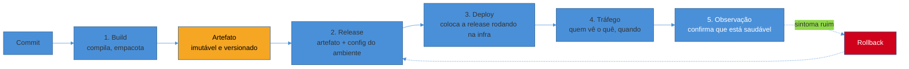
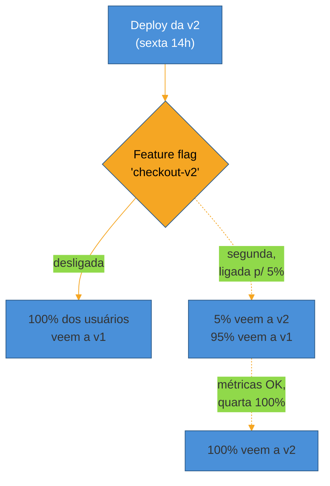
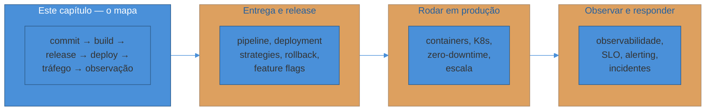

# O ciclo de vida de um deploy

> [!abstract] TL;DR
> "Deploy" costuma significar `git push` num branch e torcer. Um deploy de verdade é um **ciclo com cinco etapas** — build, release, deploy, liberação de tráfego e observação — separadas por fronteiras deliberadas: um **artefato imutável e versionado** (build once, deploy many), uma **release** que combina esse artefato com a config do ambiente, um **deploy** que coloca a release rodando na infra sem necessariamente expô-la, uma **liberação de tráfego** que decide quem vê o quê (e é aqui que **deploy ≠ release** vira a distinção mais importante do capítulo), e uma **observação** que só termina quando alguém confirma que o sistema está saudável — não quando o pipeline fica verde. O contraintuitivo, confirmado ano após ano pelos relatórios DORA: **deployar com mais frequência é mais seguro**, não menos. Este é o mapa; os próximos três sub-galhos (Entrega e release, Rodar em produção, Observar e responder) são o zoom em cada etapa.

Sexta-feira, 18h07. Alguém termina uma correção pequena — um typo na mensagem de erro do checkout — e roda `git push origin main`. O CI compila, os testes passam, e um script no fim do pipeline faz SSH no servidor de produção, sobrescreve os arquivos e reinicia o processo. Sem tag, sem changelog, sem plano de reversão. Às 18h12 o time já fechou os laptops.

Às 18h19 o site cai. Não por causa do typo — por uma dependência transitiva que tinha uma versão diferente em produção e nunca foi testada nesse ambiente. Ninguém sabe qual foi o "último deploy que funcionou", porque não existe registro de qual código estava rodando antes. Reverter significa adivinhar um commit, torcer para que o build ainda funcione com o `HEAD` de duas horas atrás, e repetir o mesmo processo manual — desta vez sob pressão, às 18h30 de uma sexta.

Esse cenário não é hipotético nem raro: é o estado-padrão de times que tratam "deploy" como sinônimo de "subir código". A distância entre isso e um deploy maduro não é uma questão de ferramenta — dá para ter esse mesmo desastre com Kubernetes, Docker e um pipeline de CI caro. É uma questão de **quantas etapas distintas existem entre o commit e o tráfego real do usuário**, e se cada uma delas produz algo que pode ser inspecionado, versionado e revertido.

Este capítulo é o mapa dessas etapas. Ele não ensina a configurar um pipeline (isso é [[2 - Entrega e release/index|Entrega e release]]), nem como manter um serviço no ar sob carga (isso é [[3 - Rodar em produção/index|Rodar em produção]]), nem como saber se ele está saudável (isso é [[4 - Observar e responder/index|Observar e responder]]). Ele existe para que você tenha, antes de entrar em qualquer um desses três, o desenho completo de onde cada peça se encaixa — e por que a peça que quase todo mundo esquece (observação) não é opcional.

## As cinco etapas: do commit ao tráfego

Um deploy maduro não é um evento — é um **pipeline com estágios que produzem artefatos intermediários**, cada um inspecionável e, idealmente, reproduzível. *Continuous Delivery*, de Jez Humble e David Farley, formalizou essa ideia há mais de quinze anos sob o nome de **deployment pipeline**: um processo automatizado que administra toda mudança, do commit ao lançamento, tornando visível a todo o time o estado de cada versão do software.

Vale nomear as cinco etapas com precisão, porque a confusão de vocabulário é justamente onde os deploys ruins nascem — "deploy" vira um guarda-chuva que esconde decisões distintas.

**1. Build.** O código-fonte de um commit específico é compilado, empacotado e transformado num **artefato**: uma imagem de container, um JAR, um binário. O ponto crítico desta etapa não é a compilação em si — é a **imutabilidade**. O artefato que sai do build recebe um identificador único (uma tag de imagem com o SHA do commit, um número de versão semântico) e, a partir daí, **nunca é recompilado**. Esse é o princípio que Humble e Farley chamam de "build once, deploy many": o mesmo binário testado em staging é, byte a byte, o binário que roda em produção. Se você recompila em cada ambiente, você não sabe mais se um bug é do código ou de uma diferença sutil de toolchain entre as máquinas — o clássico "funciona na minha máquina" institucionalizado em escala.

**2. Release.** Um artefato sozinho não é executável em lugar nenhum — ele precisa de config: strings de conexão, feature flags, limites de recursos, endpoints de serviços dependentes. **Release é a combinação do artefato imutável com a configuração de um ambiente específico**, também versionada e também imutável depois de criada. Se o artefato é "a aplicação", a release é "a aplicação pronta para rodar em produção, hoje, com esta config". A mesma imagem de container pode virar releases diferentes conforme o ambiente — mas a imagem em si nunca muda entre elas. (O 12-Factor, coberto em [[02 - O contrato de uma app operável (12-Factor)]], é o que torna essa separação possível: config vive fora do artefato, não embutida nele.)

**3. Deploy.** Colocar a release **rodando na infraestrutura de destino** — os pods sobem, os processos iniciam, os health checks começam a passar. Repare que isso ainda não diz nada sobre quem está *vendo* essa versão. Deploy é uma operação de infraestrutura: a nova versão existe e está de pé, ao lado (ou no lugar) da anterior.

**4. Liberação de tráfego.** Decidir **quem recebe requisições para a versão nova**. Pode ser tudo de uma vez (deploy direto), gradual (canary, começando em 5% do tráfego), segmentado (só usuários internos, só uma região) ou controlado por uma flag que nada tem a ver com o deploy em si. Esta etapa é o coração da distinção que o resto desta nota desenvolve: **ela pode acontecer minutos, horas ou dias depois do deploy** — ou nem acontecer, se a versão for revertida antes de qualquer usuário real vê-la.

**5. Observação.** A etapa que o cenário da sexta-feira pulou inteira. Depois que o tráfego migra, alguém — uma pessoa ou um sistema automatizado — precisa confirmar que as métricas de saúde (taxa de erro, latência, saturação) continuam dentro do esperado. Um deploy não termina quando o pipeline mostra ✅; termina quando esse sinal de saúde é confirmado, minutos ou horas depois. É a etapa que fecha o loop e decide se o próximo passo é "seguir em frente" ou "reverter agora".

> [!question]- Por que separar build e release em vez de só falar em "publicar o código"?
> Porque cada separação existe para eliminar uma classe de incerteza. Separar build de release elimina a incerteza "esse bug é do código ou da config do ambiente?" — como o artefato é o mesmo em todo lugar, você já sabe que não é o binário. Separar release de deploy elimina "a versão nova está rodando, ou está rodando *e visível pro usuário*?" — pergunta que, sem a distinção, vira motivo de pânico toda vez que alguém vê algo estranho em produção sem saber se é a versão nova ou velha respondendo. Cada fronteira é uma pergunta que deixa de precisar ser respondida por adivinhação.

## Deploy ≠ release: a distinção que muda tudo

Se há um conceito que este capítulo quer deixar cravado, é este: **fazer deploy de uma versão e liberá-la para os usuários são duas decisões diferentes, tomadas por pessoas diferentes, em momentos diferentes.**

A confusão entre os dois termos é tão comum que vale nomear o antipadrão: tratar "subiu em produção" como sinônimo de "os usuários já estão usando". Nos deploys tradicionais — sobrescrever um servidor, reiniciar o processo — essa confusão era inevitável, porque *era* a mesma operação. Mas assim que a infra permite rodar duas versões lado a lado, ela deixa de ser inevitável e vira uma escolha de arquitetura.

**Deployment é quando você instala uma versão de software num ambiente. Release é quando você a disponibiliza para um usuário.** Um deploy pode acontecer sem nenhuma release: você sobe a versão nova, ela fica de pé, respondendo só a tráfego sintético ou a um punhado de contas internas, enquanto a versão antiga continua atendendo todo mundo.

O mecanismo mais comum para essa separação são **feature flags**: a versão nova já está deployada, rodando, mas o código que expõe o comportamento novo fica atrás de um toggle. O deploy acontece no ritmo do time de engenharia — várias vezes ao dia, sem coordenação especial. A release acontece no ritmo do negócio: quando o time de produto decide que é hora, ligando a flag para 1%, depois 10%, depois todo mundo — sem precisar de um novo deploy para isso.

O ganho prático dessa separação é grande o suficiente para justificar o esforço de implementá-la: **o deploy deixa de ser um evento de risco.** Se subir código já não expõe ninguém a nada, a pergunta "e se der errado?" perde a urgência que tinha — porque "dar errado" agora significa, na pior das hipóteses, uma versão deployada e nunca liberada. O risco migra inteiro para a etapa de liberação de tráfego, que pode ser controlada de forma incremental e monitorada — o assunto central de [[2 - Entrega e release/index|Entrega e release]], em particular canary releases e progressive delivery.

> [!warning] Confundir "está no ar" com "está sendo usado"
> **O que acontece:** um time sobe uma versão nova, ela aparece saudável nos health checks, e todo mundo assume que "o deploy funcionou" — sem checar se algum usuário real passou por aquele código ainda. **Por quê:** health checks testam se o processo está de pé, não se a lógica de negócio nova está correta sob tráfego real. Sem uma etapa de liberação gradual e observação dedicada, o primeiro sinal de um bug é um usuário real, em produção, sem rede de proteção. **Como evitar:** trate liberação de tráfego como uma etapa distinta, com seu próprio critério de sucesso (taxa de erro, latência, métricas de negócio) — não assuma que "subiu" implica "funciona". Deployment strategies como canary (ver [[2 - Entrega e release/index|Entrega e release]]) formalizam exatamente esse gradiente.

## O artefato imutável: por que "build once" importa

Voltando à primeira etapa: por que a imutabilidade do artefato é tratada como princípio, e não como detalhe de implementação?

Porque a alternativa — recompilar em cada ambiente, ou pior, editar arquivos direto em produção — introduz uma variável que nenhuma quantidade de teste consegue eliminar: **você para de saber se o que está rodando é o que foi testado.** Um pipeline que builda uma vez em CI, produz uma imagem com um SHA imutável, e promove essa *mesma* imagem através de staging → produção, garante uma coisa que parece óbvia mas raramente é verdadeira em setups improvisados: o binário que passou nos testes é, literalmente, byte a byte, o binário que está atendendo usuários.

Isso também é o que torna o rollback trivial em vez de heroico. Se cada release é uma combinação nomeada e imutável de artefato + config, reverter não é "tentar lembrar o que estava rodando antes e recriar manualmente" — é apontar de volta para uma release anterior, que já existe, já foi validada, e já está guardada em algum registro (um registry de imagens, um histórico de releases do Argo CD, uma tag de deploy). Rollback deixa de ser um evento de pânico às 18h30 de sexta e vira uma operação rotineira, do tipo que um sistema automatizado pode disparar sozinho ao detectar uma métrica ruim — o tema de [[4 - Observar e responder/index|Observar e responder]].

> [!question]- Isso não é só reinventar "versionar o Docker image"?
> Em parte, sim — containerização tornou a imutabilidade de artefato quase gratuita, porque uma imagem já é, por natureza, um pacote versionado e read-only. Mas o princípio é mais antigo que Docker (Humble e Farley escreveram sobre isso em 2010, quando "artefato imutável" muitas vezes significava um `.war` ou um pacote `.deb` versionado) e mais amplo do que containers — vale igual para uma função serverless empacotada com hash de conteúdo, ou um binário Go compilado com a versão embutida no nome do arquivo. O que importa não é a tecnologia de empacotamento, é a **disciplina**: nunca editar o que já foi testado, sempre criar uma versão nova e promovê-la.

## O contraintuitivo do DORA: deployar mais é mais seguro

Existe uma intuição quase universal em times que ainda não passaram por essa maturação: deploys são arriscados, então o jeito de reduzir risco é deployar com menos frequência — agrupar mudanças, testar mais, soltar um "release grande" a cada duas semanas ou mês.

A pesquisa de mais de uma década do **DORA** (DevOps Research and Assessment, hoje parte do Google Cloud) mostra sistematicamente o oposto. Os times classificados como de melhor desempenho — hoje descritos por perfis de arquétipo no relatório de 2025, historicamente pela faixa "elite" — não só deployam com frequência muito maior (times elite históricos deployam sob demanda, muitas vezes múltiplas vezes ao dia; equipes de ponta em empresas como Google, Netflix e Amazon chegam a milhares de deploys diários por serviço), como também apresentam **taxa de falha de mudança mais baixa** e **tempo de recuperação mais curto** do que times que deployam raramente.

A explicação não é mágica, é estatística e organizacional. Um deploy que empacota duas semanas de mudanças tem uma superfície enorme de coisas que podem ter dado errado, e identificar qual mudança específica causou o problema, no meio de centenas de commits, é lento e caro. Um deploy que empacota um commit — ou poucos — tem uma superfície de risco pequena, o troubleshooting é quase imediato ("foi essa mudança, óbvio"), e o rollback é barato porque reverte pouca coisa. Deployar com frequência não é o oposto de estabilidade — **é o que produz** estabilidade, porque cada deploy individual fica pequeno, testável e reversível.

Isso conecta diretamente com o resto deste capítulo: só é seguro deployar com frequência alta se as cinco etapas acima existem de verdade — artefato imutável, release rastreável, liberação de tráfego controlada, observação automática. Frequência sem essa disciplina não é agilidade, é a mesma sexta-feira 18h07 repetida várias vezes ao dia.

> [!warning] Reduzir a frequência de deploy para "ser mais seguro"
> **O que acontece:** depois de um incidente, o time decide passar a deployar só uma vez por semana, com revisão extra e uma janela de manutenção agendada. **Por quê:** parece intuitivo — menos deploys, menos chance de algo dar errado. Mas isso aumenta o tamanho médio de cada deploy (mais mudanças acumuladas), o que aumenta a superfície de risco por deploy e torna o troubleshooting mais lento quando algo falha. **Como evitar:** investir na causa raiz do incidente — normalmente falta de artefato imutável, de observação, ou de um caminho de rollback rápido — em vez de reduzir a cadência. Os dados do DORA são consistentes ao longo dos anos: frequência alta e estabilidade andam juntas, não em tensão. Ver dados atualizados em [dora.dev](https://dora.dev/guides/dora-metrics/).

## Rollback como cidadão de primeira classe

Um efeito colateral das quatro etapas anteriores merece ser nomeado à parte, porque muda a postura mental do time inteiro: se artefato e release são imutáveis e versionados, **reverter deixa de ser um plano de emergência e vira um caminho testado do pipeline**, tão comum quanto o caminho de ir para frente.

Isso é uma inversão cultural, não só técnica. Em times sem essa disciplina, "rollback" é uma palavra que só aparece durante um incidente, escrita às pressas num runbook que ninguém testou. Em times maduros, o rollback é exercitado com a mesma regularidade que o deploy — porque, se ele só é testado pela primeira vez no meio de uma crise às 18h30 de sexta, a chance de ele próprio falhar é alta o suficiente para não valer a pena confiar nele.

Na prática, isso significa algumas coisas concretas:

- **Toda release fica endereçável.** Não existe "a versão que estava rodando antes" como um conceito vago — existe a release `v2026.07.07-3`, com seu artefato e sua config, guardada em algum lugar (o histórico de revisões do Argo CD, as tags de um registry de imagens, o histórico de releases do Helm).
- **Reverter é uma operação simétrica ao deploy**, não um processo diferente. Se subir a versão nova é "apontar a infra para a release N", reverter é "apontar a infra para a release N-1" — o mesmo mecanismo, only backwards.
- **O gatilho para reverter pode ser automático.** Quando a observação (etapa 5) detecta que uma métrica de saúde saiu do normal depois de um deploy, o sistema pode iniciar o rollback sozinho, sem esperar uma pessoa notar e decidir — o assunto de rollback automatizado por métricas em [[2 - Entrega e release/index|Entrega e release]].

O ganho psicológico de tratar rollback como rotina, não exceção, é medido em quantos deploys o time está disposto a fazer. Um time que confia no botão de reverter deploya com muito mais frequência do que um time que sabe, no fundo, que reverter vai ser uma aventura manual — e frequência, como vimos, é o que compra estabilidade.

## Um exemplo trabalhado: o mesmo typo, um ano depois

Vale fechar o mapa reescrevendo a cena de abertura com as cinco etapas em funcionamento, para deixar concreto o que muda na prática — não só no vocabulário.

Mesma equipe, mesmo tipo de mudança pequena: um ajuste na mensagem de erro do checkout. Mas agora, um ano depois de terem investido no pipeline maduro descrito aqui.

**Build.** O commit dispara o CI. Os testes rodam, e uma imagem Docker nova é buildada e taggeada com o SHA do commit — `checkout:a3f92c1`. Essa imagem é publicada num registry e nunca mais será recompilada; toda promoção daqui pra frente reaproveita exatamente esse binário.

**Release.** Um manifesto declarativo (o tipo de artefato que o GitOps versiona — assunto de [[2 - Entrega e release/index|Entrega e release]]) combina a imagem `checkout:a3f92c1` com a config de produção: réplicas, limites de recursos, variáveis de ambiente. Esse manifesto é commitado, versionado, revisável em um PR — a release em si já existe antes de qualquer coisa rodar.

**Deploy.** O controlador de entrega contínua detecta o manifesto novo e começa a subir pods com a imagem `a3f92c1`, lado a lado com os pods da versão anterior. Os health checks passam. Nesse ponto, zero usuários viram qualquer mudança — os pods novos ainda não recebem tráfego de produção real.

**Liberação de tráfego.** Um controlador de progressive delivery (o exemplo real citado nas Fontes é o Argo Rollouts) começa a desviar uma fatia pequena do tráfego — digamos 10% — para os pods novos, enquanto os outros 90% continuam na versão anterior.

**Observação.** Durante os minutos seguintes, o controlador consulta métricas de erro e latência dos pods novos automaticamente. Se elas ficarem dentro do esperado, o tráfego avança em incrementos — 25%, 50%, 100% — cada avanço condicionado ao anterior ter passado. Se em qualquer ponto a taxa de erro dos pods novos disparar, o rollback é automático: o tráfego volta inteiro para a versão anterior, sem ninguém precisar ser acordado.

O typo, nesse fluxo, é indistinguível de qualquer outra mudança pequena — porque a maturidade do pipeline não depende do *tamanho* da mudança, depende de todas as mudanças passarem pelas mesmas cinco etapas, sempre. É essa uniformidade que permite deployar dezenas de vezes por dia sem que cada deploy vire um evento.

> [!question]- Isso não é caro e lento demais para uma correção trivial como um typo?
> Do ponto de vista de tempo de relógio, o pipeline automatizado inteiro — build, release, deploy, rollout gradual até 100% — normalmente termina em minutos, não horas; a "lentidão" percebida é sobretudo a espera consciente entre os incrementos de tráfego, que existe *de propósito* para dar tempo da observação detectar um problema antes que ele afete todo mundo. Comparado ao cenário de abertura — SSH manual, sem plano de reversão, risco de um incidente que consome a noite inteira de alguém — o pipeline automatizado é objetivamente mais rápido *em expectativa*, porque o custo de uma falha (raro, mas caro) é dramaticamente menor. A pergunta certa não é "isso é rápido para o caso feliz?", é "isso é rápido *e seguro* em todos os casos, incluindo quando dá errado?".

> [!warning] Pipeline maduro, mas sem disciplina de observação automática
> **O que acontece:** um time investe pesado nas quatro primeiras etapas — artefato imutável, release versionada, deploy automatizado, rollout gradual — mas a decisão de avançar de 10% para 25% de tráfego ainda depende de alguém olhar um dashboard manualmente. **Por quê:** observação automática (métricas com threshold, análise estatística do canary) é a etapa mais nova e a que exige mais investimento em instrumentação — é comum ficar para depois, "quando der tempo". **Como evitar:** tratar a observação como parte do pipeline desde o início, não como um extra. Um rollout gradual sem gate automático de métricas ainda depende de um humano estar acordado, olhando o dashboard certo, no momento certo — o que, numa sexta às 18h, é exatamente a garantia que faltava no cenário de abertura. Ver [[4 - Observar e responder/index|Observar e responder]] para o desenho dessa instrumentação.

## Onde os próximos galhos entram

O mapa desta nota é deliberadamente raso em cada etapa — cada uma delas é grande o suficiente para um sub-galho inteiro. Veja onde cada peça é aprofundada:

| Etapa deste capítulo | Sub-galho que aprofunda | O que você vai encontrar lá |
|---|---|---|
| Build → artefato | [[2 - Entrega e release/index\|Entrega e release]] | pipeline de CI/CD como decisão de design, estágios, gates |
| Release, deploy, tráfego | [[2 - Entrega e release/index\|Entrega e release]] | deployment strategies (rolling/blue-green/canary), progressive delivery, feature flags, rollback |
| Deploy na infra | [[3 - Rodar em produção/index\|Rodar em produção]] | containers, o contrato de produção do Kubernetes, zero-downtime |
| Observação | [[4 - Observar e responder/index\|Observar e responder]] | os três pilares de observabilidade, SLI/SLO, alerting, incident response |

## Em entrevista

Este mapa aparece com frequência em perguntas de troubleshoot e de operação de system design ("como você desenharia o pipeline de deploy?", "o que acontece entre um `git merge` e o usuário ver a mudança?"). O sinal que separa uma resposta júnior de uma sênior aqui é quase sempre o mesmo do resto da entrevista: **componentes nomeados vs. trade-offs justificados**.

Uma resposta fraca lista as ferramentas: "a gente usa GitHub Actions, builda uma imagem Docker, sobe pro ECR e o Kubernetes puxa a imagem nova." Tecnicamente correto, zero sinal de maturidade.

Uma resposta forte nomeia as fronteiras e o porquê de cada uma: "o artefato é imutável e versionado pelo SHA do commit — isso significa que o que testamos em staging é byte a byte o que roda em produção. Deploy e release são desacoplados: a versão nova sobe atrás de uma feature flag, e só liberamos tráfego gradualmente depois de confirmar as métricas de erro e latência. Se algo degradar, o rollback é apontar pra release anterior, que já existe versionada — não é uma operação manual sob pressão." Isso toca imutabilidade, deploy≠release, observação e rollback em um parágrafo — exatamente os quatro conceitos que esta nota trava.

Um bom deep dive a oferecer proativamente: "posso detalhar como faria a liberação gradual de tráfego" (puxa canary/progressive delivery) ou "posso falar de como decido quando reverter automaticamente" (puxa SLO e alerting) — sinalizando que você sabe onde a complexidade real mora.

## How to explain in English

> "A real deploy isn't a single event — it's a pipeline with five distinct stages: build (compile into an immutable, versioned artifact), release (combine that artifact with environment-specific config), deploy (get the release running on the infrastructure), traffic release (decide who actually sees it), and observation (confirm it's healthy). The stage most teams skip is the last one — a deploy doesn't end when the pipeline goes green, it ends when you've confirmed the system is healthy under real traffic.
>
> The single most important distinction is that **deploy and release are not the same operation**. You can deploy a new version behind a feature flag without releasing it to anyone — that decouples engineering's deploy cadence from the business's release cadence, and it's what makes deploying multiple times a day safe instead of reckless. And counterintuitively, the DORA research consistently shows that deploying more often correlates with *lower* change failure rate, not higher — because each deploy carries a smaller, easier-to-troubleshoot, easier-to-roll-back blast radius."

| PT | EN |
|----|----|
| Artefato imutável | Immutable artifact |
| Build once, deploy many | Build once, deploy many |
| Liberar/liberação de tráfego | Traffic release / rollout |
| Deploy ≠ release | Deployment is not release |
| Feature flag / toggle | Feature flag / toggle |
| Reverter / reversão | Roll back / rollback |
| Superfície de risco | Blast radius |
| Cadência de deploy | Deploy cadence / deployment frequency |
| Frequência de deploy (métrica DORA) | Deployment frequency |
| Taxa de falha de mudança (métrica DORA) | Change failure rate |
| Tempo de recuperação (métrica DORA) | Time to restore service (MTTR) |

## O que vem a seguir

Este mapa fixou o vocabulário — build, release, deploy, tráfego, observação — e a distinção que mais importa dentro dele, deploy ≠ release. O que ele não respondeu é a pergunta que fecha este sub-galho: se deploys frequentes são mais seguros, o que exatamente estamos comprando com toda essa disciplina? A resposta é confiabilidade — e a próxima nota mostra por que ela deve ser tratada como uma *feature* explícita do sistema, não como um efeito colateral de "não ter bugs".

- [[04 - Confiabilidade como feature]] — disponibilidade, o custo dos "noves" e por que 100% é a meta errada

## Veja também

- [[Operação/index|Operação]] — o galho-pai e o mapa da trilha
- [[1 - O ofício de operar/index|O ofício de operar]] — o sub-galho atual
- [[CI-CD]] — a ferramenta e a sintaxe de pipeline por trás deste mapa conceitual
- [[2 - Entrega e release/index|Entrega e release]] — deep dive em pipeline, deployment strategies e rollback
- [[3 - Rodar em produção/index|Rodar em produção]] — deep dive em como manter a release rodando sob carga
- [[4 - Observar e responder/index|Observar e responder]] — deep dive na etapa de observação

## Fontes

- Jez Humble & David Farley — *Continuous Delivery: Reliable Software Releases through Build, Test, and Deployment Automation* (2010) — origem do conceito de deployment pipeline e do princípio "build once, deploy many". [O'Reilly](https://www.oreilly.com/library/view/continuous-delivery-reliable/9780321670250/)
- Gene Kim, Jez Humble, Patrick Debois, John Willis — *The DevOps Handbook* — o deployment pipeline como implementação do "First Way" (fluxo de trabalho da esquerda para a direita).
- Flagsmith — [*Deployment is not a release: a step-by-step guide with feature flags*](https://www.flagsmith.com/blog/deployment-is-not-a-release) — a distinção deploy≠release e o papel de feature flags no desacoplamento.
- Octopus Deploy — [*The Difference Between Deployments And Releases*](https://octopus.com/devops/continuous-delivery/deployments-vs-releases/) — definição prática da fronteira entre as duas operações.
- DORA (Google Cloud) — [*DORA's software delivery performance metrics*](https://dora.dev/guides/dora-metrics/) — deployment frequency, change failure rate e as métricas que sustentam o argumento "deployar mais é mais seguro"; relatório 2025 substituiu o modelo Elite/High/Medium/Low por perfis de arquétipo.
- Argo Rollouts (Argo Project) — [documentação de canary](https://argo-rollouts.readthedocs.io/en/stable/features/canary/) — exemplo concreto de liberação gradual de tráfego automatizada por métricas, ferramental que materializa a etapa 4 deste capítulo.
