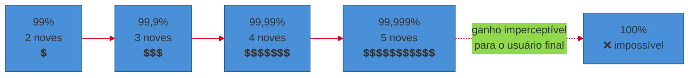
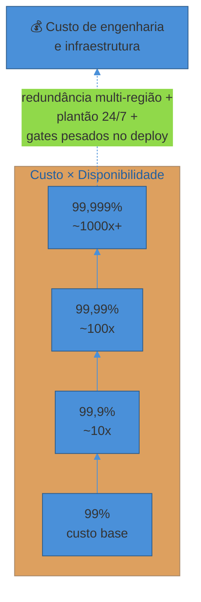
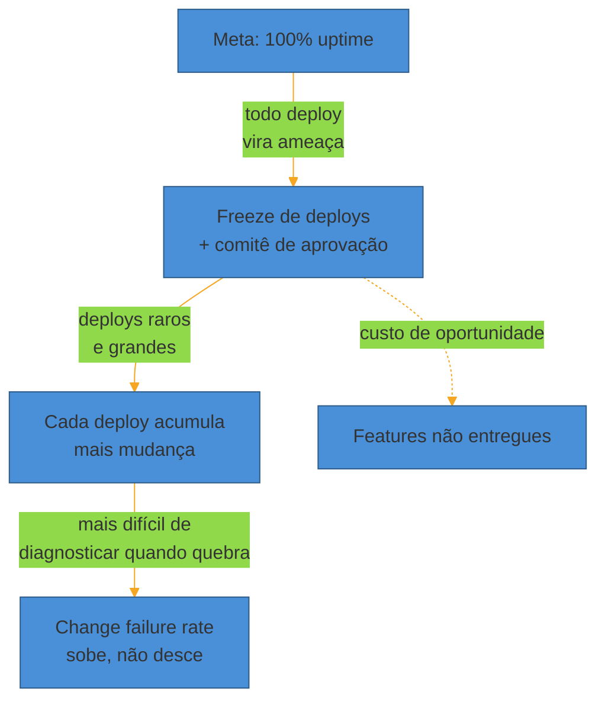
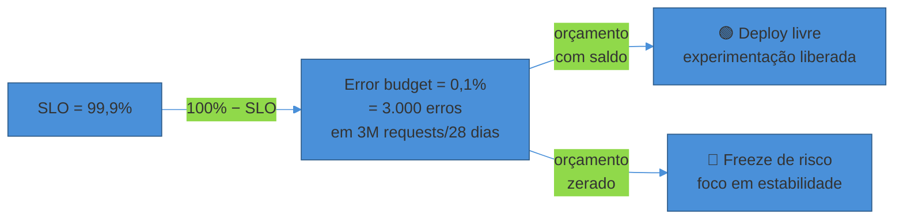

# Confiabilidade como feature

> [!abstract] TL;DR
> "100% de uptime" soa como a meta óbvia — e é a meta errada. Confiabilidade tem um **custo que cresce exponencialmente** a cada 9 adicional (99% → 99,9% → 99,99% → 99,999%), porque cada nove exige mais redundância, mais complexidade e menos velocidade de mudança. Além de caro, 100% é **impossível de garantir** de qualquer forma — dependências de terceiros, a rede, o datacenter, tudo fora do seu controle também falha. E perseguir esse número trava a organização: se todo deploy é risco de furar a meta, a resposta racional é parar de fazer deploy. A saída não é "confiabilidade máxima", é **confiabilidade suficiente**: escolher o nível que o usuário percebe e o negócio precisa, formalizar num **SLO** (meta interna), medir com um **SLI** (a métrica), e — se houver contrato externo com consequência — colocar num **SLA**. A folga entre 100% e o SLO vira um **error budget**: um orçamento de risco explícito que dev e ops compartilham, e que resolve a tensão entre estabilidade e velocidade dando um número comum aos dois times em vez de um cabo de guerra. O cálculo fino de SLI/SLO/error budget fica para o sub-galho 4; esta nota estabelece por que esse orçamento precisa existir.

Um time de e-commerce de médio porte decide, depois de um trimestre ruim, que "confiabilidade é prioridade número um". A decisão, na prática, vira uma política: nenhum deploy nas sextas-feiras, um comitê de aprovação para qualquer mudança em produção, e uma meta anunciada em all-hands — "100% de uptime este trimestre".

Três meses depois, o time cumpriu a política à risca. Deploys caíram de quinze por semana para três. Toda mudança passou por três aprovadores antes de subir. E mesmo assim, o serviço caiu duas vezes: uma quando o provedor de pagamento externo teve uma instabilidade de 40 minutos, outra quando uma zona de disponibilidade inteira da nuvem ficou fora do ar por vinte minutos — nenhuma das duas causas tinha uma linha de código do time envolvida.

O resultado líquido do trimestre: menos features entregues, um comitê de aprovação que virou gargalo permanente, moral baixa (ninguém gosta de pedir permissão para consertar um bug pequeno), e a mesma quantidade de incidentes de antes — porque as causas que realmente derrubaram o serviço nunca estiveram sob o controle direto do time, e a política de freeze não fazia nada contra elas.

Esse é o padrão que esta nota desmonta. **Perseguir 100% não é ambição saudável — é um erro categórico de engenharia**, e entender por que é um dos sinais mais confiáveis de maturidade sênior numa conversa sobre operação.

## Por que 100% é matematicamente uma miragem

Comece pela definição mais simples possível: disponibilidade é a fração do tempo em que um serviço responde corretamente. 99% de disponibilidade significa que, de cada 100 unidades de tempo, uma está fora do ar (ou respondendo errado). O problema começa quando você tenta transformar essa fração numa quantidade concreta de minutos por ano — porque o tamanho da fatia de tempo permitido para falhar encolhe muito mais rápido do que a intuição sugere.

| Disponibilidade | Downtime permitido por ano | Downtime por mês | Downtime por dia |
|---|---|---|---|
| **99%** ("duas noves") | ~3,65 dias | ~7h18min | ~14min 24s |
| **99,9%** ("três noves") | ~8h 46min | ~43min 50s | ~1min 26s |
| **99,99%** ("quatro noves") | ~52min 36s | ~4min 23s | ~8,6s |
| **99,999%** ("cinco noves") | ~5min 15s | ~26s | ~0,86s |

Cada nove adicional corta o downtime permitido por um fator de 10 — é aritmética direta, não tem mistério nisso. O que *não* é intuitivo é o custo de conseguir cada corte.

> [!question]- De onde vêm exatamente esses números?
> É conversão direta de porcentagem para tempo. 99,9% de disponibilidade num ano de 365 dias = 8.760 horas significa que 0,1% desse tempo (8.760 × 0,001 = 8,76 horas) pode estar fora do ar sem violar a meta. O mesmo cálculo em 99,99% dá 0,876 horas ≈ 52,6 minutos. A progressão geométrica (cada nove divide o downtime por 10) é só reflexo de que cada nove multiplica a *disponibilidade restante* por 10 — de 1% de indisponibilidade para 0,1%, de 0,1% para 0,01%, e assim por diante.

O Google SRE Book — a fonte mais citada da indústria sobre esse tema — chama atenção para uma faixa em que aumentar a confiabilidade deixa de ser positivo: *"past a certain point, however, increasing reliability is worse for a service (and its users) rather than better!"* O argumento é de percepção, não de engenharia pura: um usuário rodando um smartphone com 99% de disponibilidade própria simplesmente **não consegue perceber a diferença** entre um backend com 99,99% e um com 99,999% — o elo mais fraco da cadeia (a rede do usuário, o próprio aparelho) já mascara qualquer ganho acima de um certo patamar. Investir engenharia ali é dinheiro queimado em algo que ninguém vai notar.

## O custo exponencial: onde o dinheiro vai

A regra prática mais citada na indústria — inclusive por engenheiros do próprio ecossistema SRE — é que **cada nove adicional custa cerca de 10x mais** que o anterior para conseguir, e alguns autores argumentam que essa estimativa é conservadora, não exagerada. O SRE Book formaliza a mesma ideia em termos mais gerais: *"as we build systems, cost does not increase linearly as reliability increments — an incremental improvement in reliability may cost 100x more than the previous increment."*

Por que o custo escala assim? Não é um único fator — são vários se somando ao mesmo tempo, cada um crescendo junto com o nível de confiabilidade alvo:

- **Redundância física.** Para eliminar um ponto único de falha, você não dobra — você multiplica. Sair de uma zona de disponibilidade para múltiplas zonas já é caro; sair de múltiplas zonas para múltiplas *regiões* geograficamente distantes (para sobreviver a um desastre regional) multiplica de novo o custo de infraestrutura, e ainda introduz o problema de replicação de dados com consistência entre regiões distantes — um problema de engenharia genuinamente difícil, não só "mais máquinas".
- **Complexidade operacional.** Cada camada de redundância (failover automático, replicação síncrona, health checks distribuídos) é código e configuração a mais — e código a mais é superfície a mais para bugs, inclusive bugs que só aparecem durante o failover que deveria salvar o sistema.
- **Velocidade de mudança reduzida.** Quanto mais alto o SLO, mais processo protege cada deploy — testes de regressão mais extensos, canary mais longo, mais aprovações. Isso é *custo de oportunidade*: horas de engenharia que iriam para features acabam em gates de segurança.
- **Equipe de plantão.** Cinco noves não se sustentam com um engenheiro checando o Slack de vez em quando — exigem rotação de on-call structured, muitas vezes 24/7 com múltiplos fusos, o que é custo de pessoas, não só de máquina.

Um exemplo numérico ancora isso melhor do que qualquer curva abstrata. Imagine um serviço de e-commerce com **1 milhão de requests por dia**, faturando em média **US$ 2 por request bem-sucedido** (carrinho fechado, ticket médio). A tabela abaixo projeta o custo de infraestrutura necessário para sustentar cada nível de disponibilidade — não são números de um caso real, são uma estimativa didática de ordem de grandeza, coerente com a regra dos ~10x por nove:

| SLO | Downtime/ano | Receita potencialmente perdida/ano* | Infra estimada para sustentar (relativa) |
|---|---|---|---|
| 99% | 3,65 dias | ~US$ 7,3M (em risco) | 1x (baseline: 1 região, sem redundância) |
| 99,9% | 8h 46min | ~US$ 0,73M | ~3-5x (multi-zona, health checks, canary) |
| 99,99% | 52,6min | ~US$ 87k | ~15-30x (multi-região ativa-ativa, on-call formal) |
| 99,999% | 5,26min | ~US$ 8,7k | ~100x+ (replicação cross-region síncrona, plantão 24/7 multi-fuso) |

*\*Assumindo (de forma simplificada) que todo minuto fora do ar é receita 100% perdida, não adiada — na prática parte dela volta quando o usuário tenta de novo depois.*

Repare no cruzamento das duas curvas: a receita em risco cai numa progressão de 10x por nove (proporcional ao downtime), mas o custo de infraestrutura para evitar esse risco sobe numa progressão *pior* que 10x por nove, porque a partir de certo ponto você não está mais só comprando redundância — está comprando engenharia de sistemas distribuídos genuinamente difícil (consistência cross-region, coordenação de failover, testes de chaos engineering para validar que o failover funciona de verdade). Em algum ponto dessa tabela, o custo marginal de subir um nove passa a exceder a receita que esse nove protege — e é exatamente aí que "mais confiabilidade" deixa de ser um investimento e vira desperdício.

> [!warning] Tratar disponibilidade como uma escala só de "para cima é melhor"
> **O que acontece:** um time de infraestrutura propõe subir o SLO de 99,9% para 99,99% "porque mais é sempre melhor", sem calcular o custo marginal nem perguntar se o negócio percebe a diferença. **Por quê:** confiabilidade é tratada como virtude abstrata, não como investimento com retorno mensurável. Isso ignora tanto o custo exponencial quanto o teto de percepção do usuário (a "smartphone rule" do SRE Book). **Como evitar:** todo SLO proposto deveria vir acompanhado de duas perguntas: "o usuário consegue perceber essa diferença?" e "o custo desse nove extra é menor que o valor de negócio que ele protege?" Se a resposta a qualquer uma for não, o SLO certo é o atual — subir seria over-engineering, o irmão gêmeo da negligência técnica, só que mais caro.

## 100% também é impossível — não só caro

Mesmo que o orçamento fosse infinito, **100% de disponibilidade não é um alvo alcançável**, porque a maior parte das causas de indisponibilidade não está sob controle direto de nenhum time de aplicação:

- **Dependências de terceiros.** Um provedor de pagamento, um serviço de autenticação externo, uma API de terceiros — cada dependência externa que seu sistema chama importa a disponibilidade *dela* para dentro da sua. Se sua dependência crítica tem 99,9% de disponibilidade, o teto matemático da sua própria disponibilidade — mesmo com seu código perfeito — já está limitado por essa cadeia.
- **A rede.** Falhas de rede entre datacenters, entre regiões de nuvem, ou simplesmente entre o usuário e seu serviço, acontecem por razões completamente fora do seu código — cabo cortado, roteador com problema, instabilidade de BGP.
- **O provedor de nuvem inteiro.** Zonas de disponibilidade caem. Regiões inteiras já caíram, publicamente, por horas — episódios documentados de grandes provedores de nuvem enfrentando outages regionais são recorrentes o suficiente para não serem tratados como "cisne negro", e sim como parte do modelo de risco normal de operar em nuvem pública.
- **Hardware físico.** Discos falham, memória tem bit flip, fontes de alimentação queimam — em escala, isso não é exceção, é estatística garantida.

O time do exemplo da abertura desta nota tropeçou exatamente aqui: congelou deploys (a única causa que estava, de fato, sob seu controle direto) e mesmo assim caiu duas vezes, por causas inteiramente fora desse controle. A política de freeze atacou o problema errado.

Um episódio real ilustra bem a escala desse risco residual. Em 20 de outubro de 2025, a região `us-east-1` da AWS sofreu uma interrupção de cerca de **15 horas**, causada por uma condição de corrida no sistema automatizado de gerenciamento de DNS do DynamoDB — uma falha interna da própria AWS, não de nenhum cliente. O efeito em cascata atingiu mais de 70 serviços da AWS e, por tabela, mais de mil serviços de terceiros ao redor do mundo (Slack, Atlassian e Snapchat entre os nomes mais visíveis), porque serviços globais como IAM, CloudFront e Route 53 dependem, na prática, de endpoints hospedados nessa região específica mesmo quando o cliente pensa que está "fora" dela. Nenhum time de aplicação rodando em cima da AWS — por mais disciplinado que fosse seu processo de deploy, por melhor que fosse seu SLO interno — tinha qualquer alavanca para evitar esse incidente. O máximo que engenharia própria compra, nesse cenário, é *mitigar o dano* (failover para outra região, degradação graciosa) — não *prevenir* a causa.

> [!question]- Então não vale a pena investir em confiabilidade nenhuma, já que sempre vai ter algo fora de controle?
> Não é essa a conclusão — é o oposto de um extremo, não ausência de investimento. A resposta certa não é "desistir de confiabilidade porque 100% é impossível", é **investir proporcionalmente ao que está sob seu controle e ao que o negócio precisa**: redundância contra falha de dependência (circuit breakers, fallback), redundância contra falha de zona (multi-AZ), e aceitar explicitamente o risco residual que nenhuma engenharia sua elimina (uma região inteira de nuvem fora do ar, como no episódio de outubro de 2025 acima). O "aceitar explicitamente" é o ponto central — é isso que um SLO bem escolhido formaliza: uma meta que já contabilizou esse risco residual, em vez de fingir que ele não existe.

## O efeito paralisante de perseguir 100%

O dano mais caro de perseguir 100% não é só o custo de infraestrutura — é o que essa meta faz com o *comportamento* da organização. Se a meta é "nunca cair", a leitura racional de qualquer engenheiro é: **todo deploy é uma ameaça à meta**. A resposta racional a essa leitura é reduzir deploys ao mínimo — exatamente o que o time do exemplo de abertura fez.

Isso cria uma armadilha que a métrica *change failure rate*, apresentada na nota 01 deste sub-galho, já deixou entrever: deploys menos frequentes e maiores tendem a ter *mais* chance de causar falha, não menos, porque cada deploy carrega mais mudança acumulada e é mais difícil de diagnosticar quando quebra. Uma política de "confiabilidade máxima" que reduz frequência de deploy tende, na prática, a piorar exatamente a estabilidade que tentava proteger — e ainda destrói a velocidade de entrega de valor. É perder nos dois lados do trade-off ao mesmo tempo.

A saída não é abandonar a disciplina de confiabilidade — é trocar a meta binária ("nunca cair") por um **orçamento** que dá margem explícita para experimentar, e que fica claro quando essa margem acabou. É exatamente esse mecanismo que o error budget formaliza, e que fecha esta nota.

> [!warning] Confundir "reduzir deploy" com "aumentar confiabilidade"
> **O que acontece:** depois de um incidente, a resposta reflexa da liderança é apertar o processo de deploy — mais aprovações, janelas de mudança mais curtas, freeze em datas sensíveis (Black Friday, fim de ano). **Por quê:** trata frequência de deploy como *causa* de instabilidade, quando o dado histórico do DORA (nota 01 deste sub-galho) mostra a correlação oposta: deploys menores e mais frequentes tendem a ter *menor* change failure rate, porque cada mudança é mais fácil de isolar e reverter. Freeze ataca o sintoma errado na maioria dos incidentes reais — a causa raiz quase nunca é "deployamos rápido demais", é observabilidade insuficiente, timeout ausente, ou dependência sem fallback. **Como evitar:** antes de propor um freeze, pergunte se a causa raiz do incidente que motivou a proposta está de fato relacionada à *frequência* de deploy, ou se está em outro lugar (como os dois incidentes do exemplo de abertura desta nota, nenhum causado por um deploy). Se não estiver, o freeze é teatro de segurança — parece disciplina, mas não ataca a causa real, e ainda cobra o preço de menos entrega de valor.

## Confiabilidade suficiente: SLI, SLO, SLA em nível conceitual

A alternativa a "100% sempre" não é "sem meta nenhuma" — é uma meta **explícita, mensurável e deliberadamente menor que 100%**. O vocabulário que a indústria usa para isso, formalizado no Google SRE Book, tem três siglas que se confundem com frequência, mas que respondem perguntas diferentes:

- **SLI (Service Level Indicator)** — a *métrica*. Uma medida quantitativa cuidadosamente definida de algum aspecto do serviço: latência de request, taxa de erro, throughput. É o termômetro, não a meta.
- **SLO (Service Level Objective)** — a *meta interna*. Um valor-alvo (ou faixa) para um SLI: "latência p99 abaixo de 300ms", "99,9% dos requests bem-sucedidos num período de 28 dias". É o número que dev e ops concordam em perseguir juntos.
- **SLA (Service Level Agreement)** — o *contrato externo, com consequência*. A forma mais simples de diferenciar SLO de SLA, segundo o próprio SRE Book, é perguntar: *"o que acontece se o SLO não for cumprido?"* Se não há consequência explícita (crédito financeiro, penalidade contratual), você está olhando para um SLO, não um SLA.

A relação entre os três é hierárquica e prática: você **mede** com o SLI, **mira** com o SLO, e — só se o negócio decidir formalizar isso num contrato com cliente — **promete** uma versão (tipicamente mais frouxa, com margem de segurança) desse SLO num SLA. Um SLA típico de nuvem promete, por exemplo, 99,9% com crédito de fatura se violado; internamente, o time frequentemente mira um SLO mais apertado (ex.: 99,95%) exatamente para ter folga antes de a violação virar dinheiro saindo do caixa.

> [!question]- Por que o SLA costuma ser mais frouxo que o SLO interno?
> Porque o SLO interno precisa incluir margem de segurança antes de a violação do SLA gerar consequência financeira ou contratual. Se o SLA promete 99,9% e o time mira internamente também 99,9%, qualquer variação normal do sistema já é uma violação de contrato. Miranda um SLO interno mais apertado (ex.: 99,95%) dá ao time um sinal de alerta *antes* de cruzar a linha que custa dinheiro — é o mesmo princípio de dirigir com uma margem de segurança acima do limite de velocidade real da via.

## O error budget: o orçamento que resolve o trade-off

Uma vez que o SLO existe e é menor que 100% — digamos, 99,9% — a matemática simples revela algo poderoso: **a folga entre o SLO e 100% é, por definição, um orçamento**. Se a meta é 99,9%, existe 0,1% de "espaço para falhar" que o serviço pode gastar num período (tipicamente 28 ou 30 dias, alinhado a um ciclo de negócio) sem violar a meta. Esse espaço tem nome: **error budget**, formalmente definido como **1 menos o SLO**.

O SRE Workbook do Google torna isso concreto com um exemplo de ordem de grandeza: um serviço com SLO de 99,9% que recebe 3 milhões de requests ao longo de quatro semanas tem um orçamento de **3.000 requests com erro** nesse período — não é uma sensação vaga de "estamos bem ou mal", é um contador que decrementa a cada erro.

O que esse número muda na prática organizacional é o ponto central desta nota: o error budget converte a tensão entre **velocidade** (deploy, features novas, experimentação) e **estabilidade** (não quebrar produção) de um cabo de guerra político em uma **negociação orçamentária compartilhada**. Enquanto o orçamento tem saldo, o time de produto tem luz verde para deployar rápido, experimentar, arriscar — cada erro consumido é um "gasto" aceitável. Quando o orçamento zera, a prioridade vira, automaticamente e sem drama, estabilizar o sistema até o próximo ciclo recalibrar — deploys de risco pausam, e o esforço de engenharia migra para reduzir a causa dos erros que estouraram o budget.

Note o que esse mecanismo *não* faz: não elimina risco, e não promete 100%. Ele faz algo mais valioso — torna o risco **visível, quantificado e negociável**, em vez de uma discussão de sentimento entre "dev quer mais velocidade" e "ops quer mais estabilidade". Os dois times, nesse modelo, estão olhando para o mesmo número.

> [!warning] Definir SLO sem consultar quem vai consumir o orçamento
> **O que acontece:** um time de plataforma define um SLO de 99,99% "porque parece profissional", sem conversar com o time de produto sobre quantos deploys por semana isso vai custar em processo e gate. **Por quê:** o SLO não é só uma meta técnica — é um contrato de velocidade implícito. Um SLO apertado demais consome o orçamento rápido com o ritmo normal de deploy, forçando freezes constantes que ninguém esperava. **Como evitar:** o SLO certo nasce de uma conversa entre quem opera (qual nível é sustentável de manter) e quem constrói (qual nível permite o ritmo de entrega que o negócio precisa) — não de uma decisão unilateral de nenhum dos dois lados. Essa negociação, e como fazê-la, é o assunto central da nota 02 do sub-galho 4 desta trilha.

Esta nota **não** entra no cálculo de como escolher um SLI representativo, como definir a janela de medição, ou como desenhar uma política de error budget (o que acontece exatamente quando ele zera — quem decide, com que autoridade). Isso é o núcleo do sub-galho 4, "Observar e responder" — a engenharia fina de SLI/SLO/error budget é substancial o suficiente para merecer sua própria nota dedicada. O que fica estabelecido aqui é o *porquê* filosófico: confiabilidade não é um estado a maximizar, é uma feature a **dimensionar deliberadamente**, com um custo explícito e um orçamento que se gasta.

## Um exemplo trabalhado: recalculando a meta de um serviço real

Volte ao e-commerce da abertura desta nota, agora com os conceitos no lugar. Depois do trimestre ruim, em vez de anunciar "100% de uptime", o time faz o exercício que deveria ter feito desde o início:

**Passo 1 — Que SLI importa de verdade?** O time descarta "uptime do servidor" (métrica de infraestrutura, não de experiência) e escolhe um SLI centrado no usuário: a proporção de requests de checkout que completam com sucesso em menos de 2 segundos.

**Passo 2 — Que SLO é sustentável e suficiente?** Em vez de mirar o máximo técnico possível, o time olha dados históricos: nos últimos seis meses, mesmo sem nenhuma política especial de confiabilidade, o serviço já rodava perto de 99,9% nesse SLI na maior parte do tempo — e os dois incidentes recentes (pagamento externo, zona de nuvem) foram exatamente os tipos de falha que nenhum SLO mais apertado teria evitado. O time mira 99,9% como SLO — não porque é o teto técnico possível, mas porque é o nível que o histórico de comportamento do usuário (dados de suporte, pesquisas de satisfação) mostra que já é imperceptível de melhorias adicionais.

**Passo 3 — Que SLA, se algum, promete isso para fora?** Para clientes enterprise com contrato, o time promete um SLA de 99,5% com crédito de fatura — mais frouxo que o SLO interno de 99,9%, dando margem de segurança antes de qualquer violação custar dinheiro.

**Passo 4 — Que orçamento isso libera?** Com SLO de 99,9% e ~3 milhões de requests de checkout por período de 28 dias, o error budget é de ~3.000 falhas nesse período. O comitê de aprovação de deploy é extinto; no lugar, entra uma regra simples: enquanto o orçamento tiver saldo, qualquer squad pode deployar quantas vezes quiser, sem aprovação central. Quando o orçamento cai abaixo de 20% do total no período, alertas automáticos avisam os squads e a prioridade muda para estabilidade até o próximo ciclo.

O resultado, ainda no mesmo trimestre seguinte: frequência de deploy volta a subir, o comitê de aprovação — que era o verdadeiro gargalo, não a causa raiz dos incidentes — desaparece, e a disponibilidade real do serviço, medida pelo SLI centrado em usuário, permanece estatisticamente igual à do trimestre anterior. A "confiabilidade" não piorou por abandonar o freeze; ela nunca dependia do freeze para começo de conversa.

## Em entrevista

Perguntas sobre disponibilidade, SLA/SLO, ou "como você definiria a meta de confiabilidade para este sistema" são comuns em entrevistas de system design e de operação em nível sênior — e a resposta que sinaliza maturidade não é a mais ambiciosa numericamente, é a mais **justificada**.

O que um entrevistador sênior está de fato avaliando quando faz essa pergunta:

- Se você sabe que **100% não é uma resposta válida** — propor 100% ou "o máximo possível" sem qualificação é, na prática, um sinal de júnior nessa pergunta específica.
- Se você consegue **justificar um número com trade-off explícito**: por que esse SLO e não um mais alto ou mais baixo, amarrado a custo, a percepção de usuário, ou a criticidade do sistema.
- Se você distingue **SLI de SLO de SLA** com clareza — misturar os três, ou tratá-los como sinônimos, é o erro mais comum nessa pergunta.
- Se você sabe articular **como o error budget resolve o trade-off velocidade×estabilidade** — mostrar que você entende o mecanismo organizacional, não só a fórmula matemática, é o que separa uma resposta de manual de uma resposta de quem já operou sistema real.

A resposta fraca cita a fórmula de downtime de cabeça e para por aí. A resposta forte amarra o número a uma decisão: "para um checkout de e-commerce eu miraria algo perto de 99,9%-99,95% no SLI de sucesso do checkout, porque a queda entre 99,9% e 99,99% já é imperceptível para o usuário e o custo de redundância multi-região não se paga nesse contexto — eu prefiro esse orçamento de erro liberando o time para deployar rápido."

## How to explain in English

Availability and reliability vocabulary is used almost exclusively in English even inside PT-BR technical conversations — this is one of the areas where switching mid-sentence to English terms is the norm, not an exception.

> "Chasing 100% uptime is the wrong target — it's exponentially expensive, practically impossible because of dependencies and infrastructure outside your control, and it paralyzes the org, because every deploy starts looking like a threat to the number. The right approach is to pick a Service Level Indicator that reflects what users actually experience, set a Service Level Objective that's deliberately below 100% — 99.9% is often plenty, since users can't perceive the difference beyond a certain point — and, if there's an external contract, back it with a looser Service Level Agreement that has consequences if missed. The gap between 100% and the SLO becomes your error budget: as long as it has balance, ship fast; once it's spent, shift focus to stability. That's what turns velocity versus reliability from a political fight into a shared number both dev and ops look at."

| PT | EN |
|----|----|
| Disponibilidade | Availability / uptime |
| Indisponibilidade | Downtime |
| Nove(s) de disponibilidade | Nine(s) of availability |
| Indicador de nível de serviço | Service Level Indicator (SLI) |
| Objetivo de nível de serviço | Service Level Objective (SLO) |
| Acordo de nível de serviço | Service Level Agreement (SLA) |
| Orçamento de erro | Error budget |
| Congelamento de deploy | Deploy freeze / change freeze |
| Redundância | Redundancy |
| Ponto único de falha | Single point of failure (SPOF) |
| Failover | Failover |
| Multi-região / multi-zona | Multi-region / multi-AZ |

## O que vem a seguir

Este sub-galho estabeleceu o ofício de operar por completo: o gap dev→prod e as respostas culturais DevOps/SRE ([[01 - O que é operar um sistema]]), o contrato que torna uma app operável ([[02 - O contrato de uma app operável (12-Factor)]]), o mapa macro do ciclo de vida de um deploy ([[03 - O ciclo de vida de um deploy]]), e agora — fechando o arco — o porquê da confiabilidade ser um orçamento deliberado, não uma aspiração vaga.

O próximo sub-galho entra na primeira etapa concreta desse ciclo de vida: como levar código a produção com segurança e velocidade — pipeline como decisão de design, estratégias de deploy (rolling, blue-green, canary), progressive delivery, migrations, GitOps e secrets.

- [[2 - Entrega e release/index|Entrega e release]] — o sub-galho seguinte: como o código sai do commit e chega ao usuário sem virar o incidente de sexta à noite

## Veja também

- [[Operação/index|Operação]] — o galho-pai e o mapa completo da trilha
- [[1 - O ofício de operar/index|O ofício de operar]] — este sub-galho
- [[01 - O que é operar um sistema]] — onde DORA e error budget (como conceito de SRE) foram introduzidos pela primeira vez
- [[4 - Observar e responder/index|Observar e responder]] — onde o cálculo fino de SLI/SLO/error budget policy é aprofundado

## Fontes

- **Google** — [*Site Reliability Engineering* — Embracing Risk](https://sre.google/sre-book/embracing-risk/) (sre.google/sre-book, 2016) — por que 100% é a meta errada, a "smartphone rule" de percepção do usuário, e o custo não-linear de cada nove adicional.
- **Google** — [*Site Reliability Engineering* — Service Level Objectives](https://sre.google/sre-book/service-level-objectives/) (sre.google/sre-book, 2016) — as definições formais de SLI, SLO e SLA, e o teste prático "o que acontece se o SLO não for cumprido?" para diferenciar SLO de SLA.
- **Google** — [*The SRE Workbook* — Implementing SLOs](https://sre.google/workbook/implementing-slos/) (sre.google/workbook) — a fórmula do error budget (1 − SLO) e o exemplo numérico de 3.000 erros permitidos em 3 milhões de requests com SLO de 99,9%.
- **Google** — [*The SRE Workbook* — Error Budget Policy](https://sre.google/workbook/error-budget-policy/) (sre.google/workbook) — como o orçamento de erro vira política organizacional que libera ou trava deploys.
- **fivenines.io** — [SLA Uptime Calculator — 99.9%, 99.99%, 99.999% Downtime Table](https://fivenines.io/tools/sla-uptime-calculator) — a tabela de conversão de percentual de disponibilidade para downtime anual/mensal/diário citada nesta nota.
- **Jack Shirazi, Expedia Group Technology** — [The Cost of 100% Reliability](https://medium.com/expedia-group-tech/the-cost-of-100-reliability-ecb2901f23a4) (Medium, Expedia Group Tech) — a discussão sobre o custo ~10x por nove adicional e por que essa estimativa é, se algo, conservadora.
