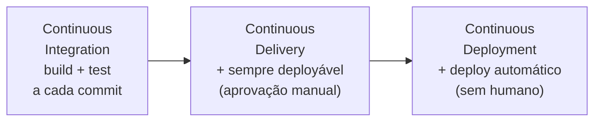
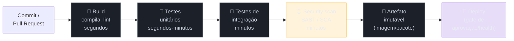
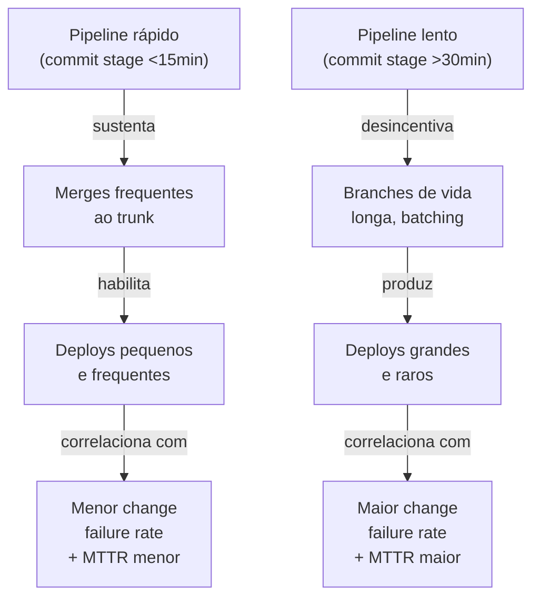

# Pipeline de CI/CD como decisão de design

> [!abstract] TL;DR
> Um pipeline de CI/CD não é um arquivo YAML — é uma **decisão de engenharia sobre risco e velocidade**, disfarçada de automação. Ele é uma sequência de **estágios com gates**: cada estágio testa uma hipótese mais cara e mais lenta que a anterior (build → testes unitários → integração → scan de segurança → empacotamento → deploy), e cada gate decide se o release candidate morre ali ou segue adiante. O princípio que organiza tudo é **fast feedback** (Humble & Farley, *Continuous Delivery*, 2010; Kim et al., *The DevOps Handbook*, 2016): estágios baratos e rápidos primeiro, para matar builds ruins em segundos, não em horas. **CI**, **Continuous Delivery** e **Continuous Deployment** são três compromissos diferentes com esse pipeline — a diferença está em quem aperta o botão do último estágio, não na tecnologia. A decisão sênior real não é "qual ferramenta" (GitHub Actions, GitLab CI — você já sabe usar as duas), é: **quais gates bloqueiam, quais só avisam, e quanto tempo total o time tolera entre commit e feedback** antes que a disciplina de commitar pequeno comece a apodrecer.

São 8h47 da manhã. Você fez um commit de três linhas — corrigiu um typo numa mensagem de erro. Abre o pipeline pra acompanhar. 8h47... 8h52... 9h10... 9h31. Quarenta e cinco minutos depois, verde. Você já esqueceu o que a mudança fazia; já abriu outras duas branches enquanto esperava.

Ninguém decidiu, num dia só, que o pipeline devia levar 45 minutos. Ele cresceu assim: alguém adicionou um scan de segurança "só pra garantir". Alguém mais adicionou testes E2E completos a cada push, "porque testes E2E pegam bugs que unitário não pega". Alguém mais colocou um deploy de staging automático antes mesmo dos testes de integração rodarem, "porque é mais rápido testar direto lá". Cada decisão, isolada, parecia prudente. Juntas, elas produziram um pipeline que ninguém mais espera de verdade — as pessoas commitam, saem pra tomar café, voltam depois, e se o vermelho aparecer, apertam "re-run" antes mesmo de ler o log, torcendo pra ter sido só um teste flaky.

Esse é o padrão mais comum de pipeline mal desenhado: não é um pipeline *quebrado*, é um pipeline **lento demais para o hábito que devia sustentar**. E o hábito que ele devia sustentar — commits pequenos, integrados com frequência, com feedback rápido — é o próprio motor da prática que a indústria chama de CI. Um pipeline de 45 minutos não é "CI mais lento". É a ausência de CI disfarçada de automação: ele desincentiva exatamente o comportamento (commit pequeno e frequente) que o justificaria existir.

O oposto também quebra, de um jeito mais silencioso. Um pipeline que passa sempre — porque não tem gate nenhum que realmente barre um merge, só reporta métricas que ninguém olha — dá a mesma sensação de segurança de um alarme de incêndio desligado: silencioso até o dia em que o prédio já está pegando fogo. E existe um terceiro modo de falha, mais insidioso que os dois: o gate que existe, bloqueia, mas ninguém mais confia nele — porque falha aleatoriamente por motivos que não têm nada a ver com o código (um teste flaky, um serviço de terceiro instável no ambiente de CI). Nesse pipeline, "re-run" virou reflexo, não exceção. E um gate em que ninguém confia é pior que nenhum gate: ele consome tempo e ainda treina o time a ignorar vermelho.

Esta nota trata o pipeline como o que ele de fato é: uma cadeia de decisões sobre **onde investir tempo de máquina para economizar tempo de gente**, e sobre **quanto risco cada gate está autorizado a barrar**. Você já sabe escrever um workflow `.yml`. O que esta nota ensina é como decidir a forma desse workflow — não a sintaxe dele.

## CI, Delivery e Deployment não são sinônimos

A confusão mais comum em entrevista — e no dia a dia — é tratar "CI/CD" como uma sigla única, quando na verdade descreve três compromissos progressivamente mais ousados com o mesmo pipeline.

**Continuous Integration (CI)** é a prática de **integrar código com frequência** — várias vezes ao dia — numa branch compartilhada, com build e testes automatizados validando cada integração. A ideia, formalizada por Kent Beck e popularizada por Martin Fowler no início dos anos 2000, é simples: quanto mais tempo o código de uma pessoa fica isolado antes de integrar, mais caro fica o conflito quando ele finalmente integra. CI ataca isso reduzindo o intervalo entre "escrevi código" e "descobri se ele quebra alguma coisa" para minutos, não semanas.

**Continuous Delivery** vai um passo além: garante que **toda mudança que passa no pipeline está em estado deployável a qualquer momento** — mas o deploy em si continua sendo uma decisão humana, geralmente um clique de aprovação. O ponto central não é automatizar o clique; é a garantia de que, quando alguém decidir clicar, não vai haver surpresa.

**Continuous Deployment** remove até esse clique: toda mudança que passa em todos os gates **vai para produção automaticamente**, sem intervenção humana. É o compromisso mais exigente dos três — requer confiança real na suite de testes, feature flags para desacoplar deploy de exposição ao usuário, e monitoramento capaz de detectar e reverter problemas mais rápido do que um humano perceberia.

Repare que os três formam uma escada de confiança, não uma escolha binária de ferramenta. Cada degrau exige mais do degrau anterior: você não consegue fazer Continuous Deployment responsável sem antes ter Continuous Delivery confiável, e não tem Delivery confiável sem CI disciplinado. A maioria das empresas maduras — mesmo empresas grandes e sofisticadas — para no degrau de Continuous Delivery para produção, com deploy automático apenas até staging. Netflix, Amazon e algumas equipes do Google praticam Continuous Deployment completo para parte do seu tráfego, mas isso é resultado de anos investindo em test suite confiável e rollback automático, não um padrão default que qualquer time deveria copiar sem essa base.

> [!question]- Se meu time faz deploy manual, ainda estou fazendo CI/CD de verdade?
> Sim — e essa é uma distinção que vale entender bem antes de uma entrevista. "CI/CD" descreve um espectro, não um destino único. Um time que faz CI rigoroso (build+teste automatizado a cada commit, branches curtas, feedback em minutos) e Continuous Delivery (sempre deployável, deploy manual com um clique) já está praticando as duas primeiras letras da sigla plenamente. O que ele não pratica é Continuous *Deployment* — a parte totalmente automática. Isso não é "CI/CD incompleto"; para a maioria das organizações, é o ponto de equilíbrio certo entre velocidade e controle humano sobre o momento exato de expor produção. Forçar deploy automático sem a maturidade de teste e observabilidade que ele exige é pior do que ficar no degrau de baixo.

## O pipeline como sequência de estágios com gates

O conceito central que Jez Humble e David Farley formalizaram em *Continuous Delivery* (2010) é o **deployment pipeline**: uma sequência de estágios automatizados pelos quais toda mudança de código passa, do commit até produção, onde cada estágio aumenta a confiança na mudança e cada falha para o pipeline imediatamente, dando feedback ao autor.

O livro descreve o pipeline canônico em estágios que ficam progressivamente mais lentos e mais abrangentes: **commit stage** (build + testes unitários + smoke tests rápidos, minutos), depois **acceptance stage** (testes de aceitação automatizados que validam comportamento, mais lentos), depois estágios manuais e de capacidade antes de produção. A lógica por trás da ordem não é arbitrária: o estágio de commit existe para eliminar rapidamente builds obviamente quebrados, e só builds que sobrevivem a ele merecem o investimento de tempo de máquina — e de atenção humana — dos estágios seguintes, mais caros.

Adaptado ao vocabulário de pipeline moderno (GitHub Actions, GitLab CI), a mesma lógica se traduz numa cadeia como esta:

Cada seta nesse diagrama esconde uma decisão de gate: o estágio anterior *precisa* passar para o próximo rodar, ou eles podem rodar em paralelo? A resposta certa depende do custo relativo. Build e lint são baratos e determinam se vale a pena rodar qualquer outra coisa — sempre bloqueantes, sempre primeiro. Testes unitários são baratos o suficiente para rodar sempre, e caros o bastante em falso-negativo (um bug óbvio passando) para também bloquear. Já testes de integração e scan de segurança frequentemente **podem rodar em paralelo** entre si, já que um não depende logicamente do resultado do outro — a única razão para serializá-los seria economizar recursos de CI compartilhados, não uma dependência real.

O ponto que separa um pipeline bem desenhado de um mal desenhado não é ter mais estágios — é ter a **ordem certa entre eles**. *The DevOps Handbook* chama isso de um dos pilares da Primeira Via (fluxo): otimizar o sistema inteiro do commit à produção, o que inclui deliberadamente colocar o teste mais barato e mais provável de pegar erro comum **primeiro**, mesmo que ele seja "menos abrangente" que um teste mais lento.

## Fast feedback: o princípio que organiza tudo

Se há um único princípio que decide a forma de um pipeline, é este: **o objetivo do pipeline inteiro é dar ao autor da mudança o feedback mais rápido possível de que algo está errado** — não o feedback mais completo, o mais **rápido**. Kim, Debois, Willis e Humble são explícitos sobre isso em *The DevOps Handbook*: o objetivo é permitir que qualquer membro do time feche o loop de feedback o mais cedo possível, para que erros sejam descobertos e corrigidos enquanto ainda estão baratos.

Esse princípio tem uma consequência prática direta e simples de enunciar, difícil de manter disciplinadamente: **estágios rápidos e baratos vêm antes de estágios lentos e caros**, mesmo quando isso significa rodar testes "menos importantes" primeiro. Lint e testes unitários (segundos) antes de testes de integração (minutos). Testes de integração antes de testes end-to-end (minutos a dezenas de minutos). Testes end-to-end antes de testes manuais de exploração (horas a dias, se existirem). A justificativa não é estética — é econômica: um bug pego por um teste unitário custa segundos de espera e uma correção trivial; o mesmo bug, se só for pego num teste E2E dez minutos depois, já custou dez minutos de espera do autor (que provavelmente já mudou de contexto) e um debug mais caro, porque o teste E2E aponta *que* algo quebrou, não necessariamente *onde*.

O motivo pelo qual isso realmente importa para a prática de commitar pequeno e frequente (o próprio fundamento do trunk-based development, que a próxima seção retoma) é numérico: pesquisas de times que praticam merge para trunk diariamente mostram que a viabilidade dessa prática depende diretamente da duração do ciclo commit→feedback. Um pipeline que responde em 10-15 minutos mantém o hábito de merges frequentes vivo; um pipeline de 45 minutos o mata, porque ninguém consegue fazer quatro merges por dia esperando 45 minutos cada.

> [!warning] Adicionar gate sem medir o custo em tempo total
> **O que acontece:** o time adiciona um novo estágio ao pipeline — um scanner de segurança, uma bateria extra de testes de contrato — porque "é importante ter isso". Ninguém mede quanto tempo esse estágio soma ao pipeline total, nem se ele pode rodar em paralelo com o resto. **Por quê:** cada gate individual parece justificável isoladamente. O problema nunca é um gate — é a soma. Um pipeline de 45 minutos raramente nasceu de uma decisão; nasceu de dez decisões de "só mais um estágio", cada uma razoável no momento em que foi tomada. **Como evitar:** trate o tempo total do pipeline como um orçamento explícito, do mesmo jeito que um SRE trata error budget. Defina um teto (ex.: commit stage abaixo de 10 minutos) e, ao adicionar um novo gate, pergunte: ele pode rodar em paralelo com o que já existe? Ele pode rodar só em parte dos commits (ex.: nightly, não a cada push)? Se a resposta pra ambas for não, o novo gate precisa competir por espaço no orçamento tirando algo de menos valor — não é grátis.

> [!question]- "Fail fast" não é a mesma coisa que "falhar sempre no menor detalhe"?
> Não, e essa confusão é comum. Fail fast é sobre **velocidade de detecção**, não sobre **rigidez de critério**. Um pipeline fail-fast bem desenhado ainda decide deliberadamente que tipo de problema bloqueia o merge (um teste unitário falhando, uma vulnerabilidade crítica) e que tipo apenas informa (um warning de lint estilístico, uma vulnerabilidade de baixa severidade num pacote de dev-dependency). "Fail fast" diz *quando* você descobre o problema; a política de gate bloqueante vs informativo (próxima seção) diz *se* aquele tipo de problema deveria travar alguém.

## O trade-off central: o que bloqueia, o que avisa, o que vira teatro

Aqui está a decisão que realmente separa um engenheiro sênior discutindo pipeline de alguém que só sabe escrever YAML: **nem todo gate deveria ser bloqueante**, e decidir isso errado tem dois custos simétricos e igualmente reais.

Um gate **bloqueante demais** — que trava o merge por qualquer coisa, incluindo achados de baixa severidade ou testes que falham por motivos não relacionados ao código — ensina o time a **contornar o gate**, não a respeitá-lo. É o padrão descrito em análises recentes de pipelines de segurança: scanners que bloqueiam o build a cada achado de severidade média treinam desenvolvedores a simplesmente burlar o check, seja ignorando o resultado, seja pressionando por uma exceção manual toda vez. Depois de algumas dessas exceções concedidas "só dessa vez", o gate perdeu a autoridade moral — ele ainda existe no YAML, mas ninguém mais o trata como um veto de verdade.

Um gate **frouxo demais** — que só reporta, nunca bloqueia — vira **teatro de segurança**: o dashboard mostra "scan executado ✓", a auditoria de compliance fica satisfeita, e nada na prática impede que uma vulnerabilidade crítica vá para produção. É pior do que não ter o scan, porque cria uma falsa sensação de cobertura.

A resolução prática que a literatura de DevSecOps recomenda — e que bate com a intuição de qualquer time que já viveu os dois extremos — é **graduar o gate pela severidade e pelo contexto**, não tratá-lo como binário:

| Severidade / tipo de achado | Ação recomendada |
|---|---|
| Vulnerabilidade crítica/alta em dependência exposta ao usuário | **Bloqueia o merge** — sem exceção manual sem aprovação explícita de segurança |
| Vulnerabilidade média, dependência interna/dev-only | Cria ticket, não bloqueia o pipeline atual |
| Vulnerabilidade baixa, código legado já conhecido | Loga para revisão periódica, não bloqueia |
| Teste unitário/integração falhando | **Bloqueia sempre** — é sinal direto de regressão funcional |
| Lint/formatação | Auto-corrige ou bloqueia só em CI (nunca surpreende localmente) |
| Cobertura de teste abaixo do limiar | Depende — ver aviso abaixo |

O mesmo raciocínio de contexto se aplica à severidade em si: uma CVE crítica numa dependência que roda em serviço exposto à internet merece bloquear o deploy imediatamente; a mesma CVE numa ferramenta interna de uso restrito pode esperar o próximo ciclo de patch sem o mesmo nível de urgência. Tratar toda vulnerabilidade com o mesmo peso, independente de onde ela vive, é a raiz de boa parte do "gate que virou teatro" — o time aprende a ignorar o alerta porque a maioria deles nunca importou de verdade.

> [!warning] Gate de cobertura de teste como meta em si (Goodhart's law)
> **O que acontece:** o pipeline bloqueia qualquer PR que baixe a cobertura de teste abaixo de um número fixo (80%, por exemplo). Times, sob pressão de prazo, passam a escrever testes que só existem para *bater a métrica* — testes sem assert real, ou que testam getters/setters triviais. **Por quê:** cobertura de teste é uma métrica proxy para "o código está bem testado", não a coisa em si. Quando ela vira um gate rígido e a única forma de passar é subir o número, o time otimiza o número, não a qualidade real do teste — o clássico "quando uma métrica vira meta, ela deixa de ser boa métrica". **Como evitar:** trate cobertura como sinal de alerta, não como veto automático — um PR que baixa cobertura significativamente merece revisão humana no code review, não um bloqueio automático de máquina. Combine com revisão de qualidade dos testes (mutation testing, se o time tiver maturidade para isso) em vez de perseguir só a porcentagem.

## Fast feedback exige trunk-based, não o contrário

O pipeline não vive isolado da estratégia de branching — e aqui está uma causa raiz que muita gente inverte: **não é "porque temos CI bom que fazemos trunk-based"; é que trunk-based development só funciona se o CI for rápido o suficiente para sustentá-lo**.

Trunk-based development — todo mundo integrando direto (ou quase direto) na branch principal, com branches de vida curta (idealmente menos de um dia) e feature flags cobrindo trabalho incompleto — é a prática que pesquisas do grupo DORA identificam repetidamente como um dos sinais mais fortes de correlação com alta performance nas quatro métricas clássicas (frequência de deploy, lead time, change failure rate, MTTR). Times que fazem merge para o trunk pelo menos diariamente superam consistentemente times que não fazem, nas quatro métricas ao mesmo tempo — não é um trade-off de "vai mais rápido, quebra mais": os dados mostram os dois lados melhorando juntos.

Mas essa prática tem uma pré-condição incontornável: **o pipeline precisa terminar rápido o suficiente para caber dentro do ciclo de "mudar, subir, esperar, integrar" várias vezes por dia**. Se o commit stage leva 45 minutos, ninguém consegue de fato integrar quatro vezes ao dia — o "trunk-based" vira de fachada, com branches que na prática ficam abertas o dia inteiro esperando o pipeline liberar. A referência prática que a comunidade de trunk-based development converge é manter o **commit stage abaixo de 10-15 minutos**; acima disso, a prática de merge frequente começa a se corroer silenciosamente, porque o custo de esperar passa a competir com o benefício de integrar cedo.

É por isso que "paralelizar e cachear o pipeline" não é otimização prematura — é manutenção de uma pré-condição estrutural. As duas alavancas mais diretas para manter o commit stage rápido conforme o codebase cresce:

**Paralelização.** Rodar estágios independentes ao mesmo tempo em vez de em série. Um pipeline com testes unitários, lint, e um scan leve de SCA que não dependem uns dos outros deveria rodar os três em paralelo, não sequencialmente — GitHub Actions e GitLab CI suportam isso nativamente via jobs paralelos (matrix strategy no GitHub Actions, por exemplo, permite rodar a mesma suíte de testes fatiada em N runners simultâneos). O ganho não é linear com o número de runners — sempre existe um estágio mais lento que vira o teto —, mas normalmente é significativo o suficiente para justificar o custo extra de infraestrutura de CI.

**Cache.** Reaproveitar entre execuções o que não mudou — dependências instaladas, camadas de build, resultados de testes que não tocaram em código relevante (test impact analysis, em times mais maduros). Um build que reinstala todas as dependências do zero a cada push desperdiça minutos que um cache bem configurado elimina quase por completo. A armadilha comum é cache mal invalidado — build usando uma versão de dependência desatualizada porque a chave de cache não capturou a mudança no lockfile —, o que troca velocidade por reprodutibilidade quebrada silenciosamente.

## Build once, deploy many: o artefato imutável

Uma decisão de design que separa pipelines maduros de pipelines ingênuos, e que raramente aparece em tutoriais de sintaxe: **o mesmo artefato binário que passou nos testes deve ser o mesmo artefato que vai para staging e, depois, para produção** — sem rebuild entre ambientes.

A tentação natural, especialmente em pipelines simples, é rodar `build` de novo em cada ambiente: builda para staging, testa, depois builda de novo (com uma flag de produção diferente) para produção. O problema é sutil e corrosivo: se você rebuilda entre staging e produção, **você não está mais testando o artefato que vai para produção** — está testando um artefato irmão, compilado com dependências que podem ter mudado entre os dois builds (um patch de segurança publicado no intervalo, uma versão de imagem base atualizada), configurações de build diferentes, ou simplesmente a não-garantia de que o processo de build é determinístico.

A alternativa — **build once, deploy many** — resolve isso invertendo a ordem: o pipeline builda **uma única vez**, produz um artefato versionado e imutável (uma imagem de container com tag específica, um pacote assinado), e esse mesmo artefato é promovido — não reconstruído — através de staging, homologação e produção. O que muda entre ambientes é configuração externa ao artefato (variáveis de ambiente, secrets, feature flags), nunca o binário em si. Isso fecha exatamente o gap que testes de staging existem para prevenir: garantir que "funcionou em staging" signifique, literalmente, o mesmo artefato que vai rodar em produção — não um primo dele.

O padrão moderno reforça isso com **artefatos assinados e catalogados com SBOM** (Software Bill of Materials) — um inventário de tudo que compõe aquele artefato, dependências incluídas — permitindo rastrear, em caso de vulnerabilidade descoberta depois, exatamente quais versões em produção contêm o componente afetado. Rollback, nesse modelo, também muda de forma: em vez de reverter código e rebuildar, você simplesmente **redeploya a versão anterior do artefato**, que já existe pronta no registro — uma operação de minutos, não de um novo ciclo de pipeline completo.

> [!question]- Isso não é só "usar Docker"?
> Containerização é a implementação mais comum hoje do princípio, mas o princípio é mais antigo e mais amplo do que Docker — vale igualmente para um `.jar` versionado, um pacote npm publicado, um binário Go compilado uma vez. A pergunta que importa não é "usamos container?", é "o artefato que testamos é bit-a-bit o mesmo que vai rodar em produção, ou alguma etapa entre o teste e a produção reconstrói (e potencialmente altera) esse artefato?". Times que usam container mas rebuildam a imagem em cada ambiente caíram na mesma armadilha que times sem container nenhum — a ferramenta não garante a disciplina.

## Testes flaky: o imposto invisível sobre a confiança do pipeline

Todo pipeline eventualmente desenvolve **testes flaky** — testes que falham de forma intermitente, sem relação com uma mudança real no código, geralmente por dependência de timing, estado compartilhado entre testes, ou chamadas de rede não mockadas de forma confiável. O dado que a equipe de testes do Google publicou é revelador de escala: cerca de 16% dos testes na base do Google já exibiram algum comportamento flaky em algum momento, e falhas por flakiness responderam por 1,5% de todas as execuções de teste falhando incorretamente — que, na escala do Google, significa milhões de horas de computação desperdiçadas.

Mas o custo que mais importa para um time comum não é o de CPU — é o custo de **confiança**. Pesquisa empírica sobre flaky tests mostra um efeito comportamental consistente: desenvolvedores que encontram um teste flaky ficam significativamente menos propensos a investigar a próxima falha de teste com cuidado — o reflexo vira "provavelmente é flaky de novo, dá re-run". O problema é que esse reflexo não distingue entre "flaky de verdade" e "achei um bug real que parece com os flakies de sempre". Uma vez que o time perde a capacidade de confiar no vermelho do pipeline, a suite de testes para de cumprir sua função — ela ainda roda, mas ninguém mais a escuta.

A resposta correta, sob a ótica de design de pipeline, não é "ignorar os flaky e seguir em frente" nem "banir re-run" — é tratar flakiness como **defeito de primeira classe**, do mesmo jeito que se trataria um bug funcional: identificar o teste, colocá-lo em quarentena (removido do gate bloqueante, mas ainda rodando e reportando, para não perder o sinal) até a causa raiz ser corrigida, e medir a taxa de flakiness do pipeline como uma métrica de saúde contínua — não um problema pontual que se resolve uma vez e esquece.

> [!warning] "Re-run" como política de tolerância a flaky
> **O que acontece:** o time normaliza clicar em "re-run" sempre que um pipeline falha, sem investigar se a falha foi um flaky conhecido ou um bug real introduzido pela mudança. **Por quê:** parece pragmático no curto prazo — desbloqueia o merge rápido — mas erode a função do gate: se toda falha vira re-run automático até passar, o gate deixou de bloquear coisa nenhuma, só adiciona latência. **Como evitar:** trate cada re-run como um evento a ser contado e revisado — se um teste específico está sendo re-executado com frequência, ele é candidato a quarentena imediata, não a mais re-runs. Alguns times automatizam essa contagem e abrem ticket automático quando um teste passa de um limiar de re-runs por semana.

## Automatizar vs revisar manualmente: onde a máquina não deveria decidir sozinha

Nem toda decisão do pipeline deveria ser automática — e saber onde deliberadamente manter um humano no loop é parte do design, não uma concessão à imaturidade do time.

O padrão saudável, que emerge da combinação de tudo visto até aqui, separa três categorias:

**Sempre automatizado, sempre bloqueante** — corretude objetiva e mensurável: build compila, testes passam, lint não quebra estilo acordado, vulnerabilidade crítica não entra. Aqui não há julgamento de contexto a fazer; a máquina decide mais rápido e mais consistentemente que qualquer humano.

**Automatizado, mas informativo** — sinais que exigem contexto humano para virar decisão: cobertura caindo, complexidade ciclomática subindo, uma dependência nova sendo introduzida. A máquina relata; a decisão de bloquear ou seguir fica no code review humano.

**Deliberadamente manual** — decisões que carregam julgamento de negócio, não só técnico: aprovar o deploy final para produção numa mudança de alto risco (mudança de schema de banco, por exemplo — tema da nota 04 deste sub-galho), ou uma decisão de release que depende de timing de negócio (não fazer deploy sexta à tarde, não é regra técnica, é gestão de risco organizacional). Automatizar esse tipo de gate — removendo o humano — não acelera a entrega de forma responsável; apenas transfere o risco para um sistema que não tem contexto para avaliá-lo.

A armadilha oposta também existe e é tão comum quanto: manter manual um gate que já deveria estar automatizado há muito tempo, porque "sempre foi assim" — um checklist de deploy em planilha que um script resolveria em segundos, uma aprovação manual de segurança que poderia ser um scan automatizado com os thresholds certos. Esse tipo de manual residual não é prudência, é **toil disfarçado de controle** — o mesmo conceito que a nota anterior desta trilha descreveu para SRE, aplicado especificamente ao pipeline.

## Um exemplo trabalhado: redesenhando o pipeline de 45 minutos

Voltando à cena de abertura: um pipeline que leva 45 minutos, com testes E2E completos a cada push e um deploy de staging automático antes mesmo da integração terminar. Como um redesenho, estágio por estágio, aplicaria os princípios desta nota?

**Passo 1 — Medir antes de mexer.** Antes de qualquer mudança, o time instrumenta o pipeline (a métrica é trivial de coletar em GitHub Actions/GitLab CI: duração por job) e descobre a distribuição real: build (3min), testes unitários (4min), testes de integração (6min), scan de segurança (5min, rodando em série depois da integração), testes E2E completos (22min), deploy de staging (5min). Total: 45min, quase metade só nos E2E.

**Passo 2 — Reordenar por custo, não por "importância percebida".** Os 22 minutos de E2E completo a cada push são o maior ofensor, e a pergunta certa não é "os E2E são importantes?" (são), é "eles precisam rodar a cada push, no caminho bloqueante do merge, ou podem rodar em outro momento?" A resposta: uma suíte reduzida de E2E — cobrindo os fluxos críticos, não tudo — roda no commit stage; a suíte completa roda de forma assíncrona, após o merge, num pipeline separado que não bloqueia ninguém. Se ela pegar um problema depois do merge, o time reverte — o custo de reverter um merge pequeno é baixo, e o benefício de não bloquear todo mundo por 22 minutos a cada push é alto.

**Passo 3 — Paralelizar o que é independente.** Testes de integração e scan de segurança não dependem um do outro — rodam em paralelo, não em série, cortando 5 minutos do caminho crítico.

**Passo 4 — Remover o deploy de staging do caminho bloqueante do PR.** O deploy automático de staging só faz sentido depois que o código já está no trunk (não antes, durante o PR) — movê-lo para rodar pós-merge tira mais 5 minutos do ciclo commit→feedback que o autor da mudança está de fato esperando.

Resultado: commit stage cai de 45 minutos para algo perto de 10-13 minutos (build + unit + integração/scan em paralelo + E2E reduzido), com a suíte completa de E2E e o deploy de staging seguindo em pipelines assíncronos pós-merge, que ninguém precisa esperar olhando a tela. Nenhuma cobertura de teste foi removida — só reordenada por quando ela precisa bloquear alguém versus quando ela só precisa existir e reportar.

## Métricas do pipeline como sinal de saúde contínua

Um pipeline bem desenhado hoje se degrada silenciosamente se ninguém medir sua saúde ao longo do tempo — o mesmo padrão de erosão gradual que produziu o pipeline de 45 minutos da cena de abertura. As métricas que valem instrumentar, além das quatro DORA clássicas (já vistas na nota anterior deste sub-galho):

- **Duração do commit stage** — a métrica mais direta de fast feedback; um teto explícito (10-15 minutos) tratado como orçamento, não como aspiração.
- **Taxa de sucesso do pipeline** — % de execuções que terminam verde na primeira tentativa; uma queda sustentada é sinal de flakiness crescente ou de gates mal calibrados.
- **Taxa de re-run** — quantas execuções precisaram de nova tentativa; alta taxa é sintoma direto de flaky tests corroendo confiança.
- **Tempo até primeira falha** — quando o pipeline falha, ele falha rápido (no estágio barato) ou tarde (no estágio caro)? Falhas tardias recorrentes indicam que a ordem dos estágios está errada.

Nenhuma dessas métricas vale nada olhada uma vez — o ponto é tratá-las como um painel contínuo, revisado periodicamente, do mesmo jeito que se trataria latência ou taxa de erro de um serviço em produção. O pipeline é, ele mesmo, um sistema em produção — só que o "usuário" dele é o time de engenharia.

## Em entrevista

Perguntas sobre CI/CD em entrevistas sênior raramente pedem definição de sigla — elas testam se você trata o pipeline como uma decisão de engenharia com trade-offs, ou como uma lista de ferramentas que você sabe configurar.

O que um entrevistador sênior está de fato avaliando:

- Se você distingue **CI, Continuous Delivery e Continuous Deployment** como um espectro de compromisso crescente, não sinônimos intercambiáveis — e se você sabe justificar em que degrau seu time real está e por quê.
- Se você sabe articular **fast feedback** como o princípio organizador (estágios baratos primeiro), não só "automatizar tudo".
- Se você consegue discutir o trade-off de **gate bloqueante vs informativo** com exemplos concretos — não "tudo deveria bloquear" nem "nada deveria bloquear", mas uma política graduada por severidade e contexto.
- Se você entende **build once, deploy many** como princípio de reprodutibilidade, e consegue explicar por que rebuildar entre ambientes quebra a garantia que o pipeline existe para dar.
- Se você trata **testes flaky** como um problema de confiança do time, não um incômodo técnico isolado.

A resposta fraca lista ferramentas ("uso GitHub Actions, com jobs de build, test e deploy"). A resposta forte amarra a uma decisão real: "nosso commit stage tinha 45 minutos porque rodava E2E completo a cada push; movi a suíte completa para pós-merge assíncrono e mantive só os fluxos críticos no caminho bloqueante — caiu para 12 minutos e a taxa de merges por dia mais que dobrou."

## How to explain in English

CI/CD vocabulary in English carries specific, standardized terms that differ subtly from a literal PT-BR translation — worth locking these in before an interview.

> "A CI/CD pipeline is a sequence of stages with gates — build, unit tests, integration tests, security scanning, packaging, deploy — each one increasing confidence in a release candidate, and each one designed to fail fast and cheap before a slower, more expensive stage runs. The organizing principle is fast feedback: cheap stages first, so a broken build gets caught in minutes, not hours. Not every gate should be blocking — I calibrate severity: critical vulnerabilities and failing tests block the merge, lower-severity findings get logged for review instead of training the team to bypass the gate. I also build once and promote the same immutable artifact through every environment, rather than rebuilding per stage — that's what makes 'it passed staging' actually mean something in production."

| PT | EN |
|----|----|
| Pipeline de entrega | Deployment pipeline |
| Estágio (do pipeline) | Stage |
| Gate bloqueante / gate informativo | Blocking gate / advisory (non-blocking) gate |
| Feedback rápido | Fast feedback |
| Integração contínua | Continuous Integration (CI) |
| Entrega contínua | Continuous Delivery |
| Implantação contínua | Continuous Deployment |
| Estágio de commit | Commit stage |
| Artefato imutável | Immutable artifact |
| Buildar uma vez, promover em todos os ambientes | Build once, promote everywhere / build once, deploy many |
| Teste instável / intermitente | Flaky test |
| Colocar em quarentena (um teste) | Quarantine a test |
| Pipeline como código | Pipeline as code |
| Desenvolvimento baseado em trunk | Trunk-based development |

## O que vem a seguir

Este pipeline termina num artefato imutável pronto para ir a produção — mas *como* ele chega lá, com que estratégia de exposição ao tráfego real, é uma decisão separada e igualmente carregada de trade-offs. A próxima nota entra exatamente nesse ponto: rolling, blue-green, canary, shadow — quando cada estratégia de deploy vale o custo e o risco que ela implica.

- [[02 - Deployment strategies]] — rolling, blue-green, canary, shadow: as estratégias de expor o artefato ao tráfego real, e o trade-off custo×risco×velocidade de rollback de cada uma

Se você chegou aqui vindo da visão macro do ciclo de vida de um deploy, vale revisitar onde este pipeline se encaixa no mapa completo:

- [[03 - O ciclo de vida de um deploy]] — a visão de commit ao tráfego que esta nota detalha na etapa de build/test/gate

## Veja também

- [[Operação/index|Operação]] — o galho-pai e o mapa completo da trilha
- [[2 - Entrega e release/index|Entrega e release]] — este sub-galho
- [[CI-CD]] — o monólito de ferramenta (GitHub Actions, GitLab CI, sintaxe de workflow); esta nota assume esse conhecimento e foca na decisão de design por trás dele
- [[Testes JS]] — o galho que detalha os testes que rodam dentro de cada estágio deste pipeline (unitário, integração, E2E, flaky tests)

## Fontes

- **Jez Humble, David Farley** — *Continuous Delivery: Reliable Software Releases through Build, Test, and Deployment Automation* (Addison-Wesley, 2010) — o conceito de deployment pipeline, commit stage e acceptance stage.
- **Dave Farley** — [*The Deployment Pipeline*](https://continuousdelivery.com/wp-content/uploads/2010/01/The-Deployment-Pipeline-by-Dave-Farley-2007.pdf) (continuousdelivery.com, 2007) — o paper original que precede o livro, descrevendo a lógica de estágios progressivos.
- **Gene Kim, Jez Humble, Patrick Debois, John Willis** — *The DevOps Handbook: How to Create World-Class Agility, Reliability, and Security in Technology Organizations* (2016) — a Primeira Via (fluxo) e fast feedback como objetivo do pipeline.
- **DORA** — [*Trunk-based development*](https://dora.dev/capabilities/trunk-based-development/) (dora.dev, atualizado 2026) — a correlação entre merges frequentes ao trunk e as quatro métricas de performance.
- **Google Testing Blog** — [*Flaky Tests at Google and How We Mitigate Them*](https://testing.googleblog.com/2016/05/flaky-tests-at-google-and-how-we.html) (2016) e [*Where do our flaky tests come from?*](https://testing.googleblog.com/2017/04/where-do-our-flaky-tests-come-from.html) (2017) — os dados de escala sobre taxa de flakiness e seu custo.
- **GitLab** — [*CI/CD pipelines*](https://docs.gitlab.com/ci/pipelines/) (docs.gitlab.com, acessado em julho de 2026) — pipeline as code via `.gitlab-ci.yml` versionado.
- **GitHub** — [*Running variations of jobs in a workflow*](https://docs.github.com/actions/writing-workflows/choosing-what-your-workflow-does/running-variations-of-jobs-in-a-workflow) (docs.github.com, acessado em julho de 2026) — matrix strategy e paralelização de jobs.
- **Snyk** — [*SAST vs. SCA testing: Strengths, Limitations, Implementation Best Practices*](https://snyk.io/articles/application-security/sast-vs-sca-testing/) (snyk.io, acessado em julho de 2026) — a política graduada de gate bloqueante por severidade.
- **MinimumCD** — [*Immutable Artifacts*](https://beyond.minimumcd.org/docs/reference/practices/immutable-artifacts/) (beyond.minimumcd.org, acessado em julho de 2026) — build once, deploy many e a garantia de reprodutibilidade entre ambientes.
