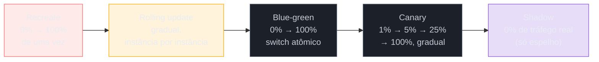
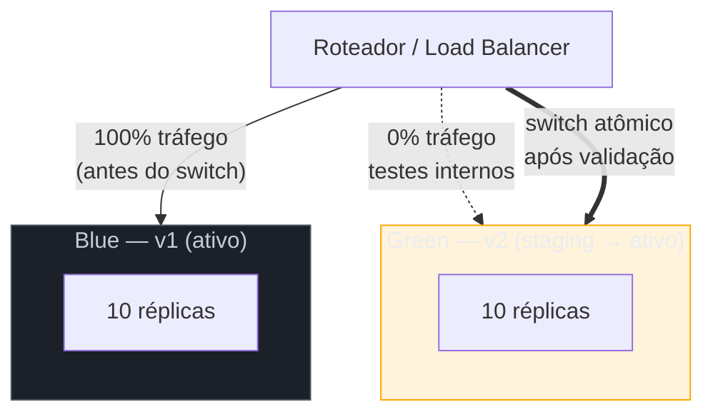
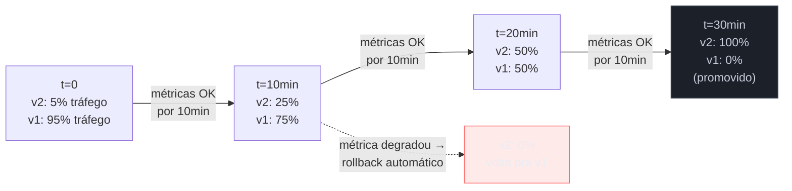

# Deployment strategies

> [!abstract] TL;DR
> Existe mais de um jeito de colocar código novo em produção, e a escolha não é estética — é uma decisão explícita de **quanto raio de explosão você tolera se a nova versão tiver um bug**. **Recreate/big-bang** derruba tudo e sobe a versão nova de uma vez — downtime garantido, só serve pra ambientes sem SLA. **Rolling update** (default do Kubernetes) substitui instâncias aos poucos, sem downtime, mas por um período duas versões coexistem servindo tráfego — exige compatibilidade retroativa de API e schema. **Blue-green** mantém dois ambientes idênticos e troca o tráfego de uma vez no roteador — rollback quase instantâneo, ao custo de 2x a infraestrutura e do mesmo problema de estado/migrations. **Canary** libera a versão nova pra uma fatia pequena do tráfego, observa métricas, e aumenta gradualmente — minimiza o raio de explosão ao preço de exigir observabilidade de verdade e tolerar duas versões rodando por mais tempo. **Shadow/mirroring** espelha tráfego real pra versão nova sem que ela responda ao usuário — o teste de carga mais realista que existe, caro e complicado quando há escrita com efeito colateral. Nenhuma estratégia resolve sozinha o problema de schema — isso é assunto da próxima nota.

São 14h32 de uma terça-feira comum. O time termina um ajuste no serviço de checkout — nada dramático, uma correção de arredondamento no cálculo de frete. Testes passam, CI fica verde, alguém aperta o botão de deploy.

O pipeline substitui, de uma vez, os vinte containers que respondem pelo checkout. Em trinta segundos, a versão antiga não existe mais em lugar nenhum — só a nova, em todos os vinte containers ao mesmo tempo.

Só que o arredondamento novo tem um bug sutil: para pedidos com desconto acima de 50%, o frete calcula negativo. O erro não aparece em nenhum teste, porque ninguém testou esse combo específico. Em produção, sob tráfego real, aparece em 3% dos carrinhos — e como **100% dos usuários já estão na versão nova**, 3% de todo o tráfego de checkout do país está, agora, quebrado. Ao mesmo tempo. Sem ninguém ainda saber.

Esse é o "deploy big bang": substituir tudo de uma vez. Ele não é incompetência — é a forma mais simples e óbvia de fazer deploy, e durante anos foi a única. O problema não é o bug (bugs sempre vão existir); o problema é que o big bang **amplifica qualquer bug para 100% do tráfego instantaneamente**, sem nenhuma chance de pegar o problema antes que ele afete todo mundo, e sem rota de volta rápida — reverter significa repetir o mesmo processo abrupto, na direção contrária, enquanto o suporte já recebe tickets.

As estratégias de deployment que esta nota cobre existem para responder a uma pergunta única: **se a versão nova tiver um bug que nenhum teste pegou, quantos usuários são afetados, por quanto tempo, e quão rápido dá pra voltar atrás?** Cada estratégia é um ponto diferente nesse espectro de risco — e escolher a estratégia certa é, na prática, decidir o tamanho do raio de explosão que você está disposto a aceitar.

> [!question]- Isso não é problema resolvido pelos testes automatizados?
> Testes provam que o código faz o que você *pensou* em testar. O bug do frete negativo não apareceu porque ninguém escreveu um teste para "desconto acima de 50%" — e é impossível escrever testes para toda combinação que a produção vai apresentar (a mesma lição da nota 01 do sub-galho anterior, sobre operar um sistema). Deployment strategy não substitui teste — ela é a **rede de segurança para quando o teste não pegou**, permitindo que o bug apareça e seja detectado com o menor número possível de usuários expostos, antes de se tornar incidente de escala total.

## O espectro: do mais arriscado ao mais cauteloso

Cada estratégia mexe em dois botões independentes: **quantas instâncias rodam a versão nova ao mesmo tempo** e **por quanto tempo as duas versões coexistem**. Do mais abrupto ao mais gradual:



Repare que essa ordem não é "pior para melhor" em linha reta — blue-green e canary resolvem problemas diferentes, e shadow nem chega a ser uma estratégia de *release* no sentido estrito, é uma técnica de validação que roda em paralelo a uma das outras.

## Recreate (big-bang)

**O que é:** derruba todas as instâncias da versão antiga, depois sobe todas as instâncias da versão nova. Existe uma janela — segundos a minutos, dependendo do tempo de boot — em que **nenhuma** versão está servindo tráfego.

**Quando usar:** ambientes de desenvolvimento e staging, jobs em batch que não têm usuário esperando resposta em tempo real, ou o caso específico em que a versão nova **não pode** coexistir com a antiga por incompatibilidade de schema tão profunda que nem vale tentar rolling (uma migration destrutiva, por exemplo). Em produção com usuário ativo, é raramente a escolha certa — mas conhecer o cenário em que ela é aceitável evita cargo-culting a estratégia mais sofisticada quando ela não agrega nada.

**Trade-off central:** simplicidade máxima, downtime garantido. Não há meio-termo — ou você aceita a janela de indisponibilidade, ou você usa outra estratégia.

Vale notar um detalhe contraintuitivo: recreate às vezes é a escolha **mais honesta**, não a mais preguiçosa. Se a v2 exige uma migration destrutiva — uma coluna removida que a v1 ainda lê, por exemplo — tentar forçar um rolling update ou um blue-green sem resolver essa incompatibilidade primeiro não elimina o downtime, só o disfarça como uma cascata de erros 500 intermitentes durante a janela de coexistência. Nesse caso específico, um recreate coordenado (com uma janela de manutenção anunciada) é mais seguro do que fingir zero-downtime com uma estratégia que a v1/v2 não suportam de verdade. A alternativa correta de longo prazo — desenhar a migration para não exigir essa incompatibilidade — é o assunto da nota 04.

> [!question]- Existe alguma métrica que ajuda a decidir entre recreate e as outras estratégias?
> Sim: pergunte se o serviço tem SLA de disponibilidade e se a mudança em questão é compatível com coexistência de versões. Um job de batch noturno sem usuário esperando não tem motivo para pagar a complexidade operacional de canary. Já um serviço com SLA de 99,9% não pode considerar recreate exceto em casos excepcionais e bem comunicados (uma migration destrutiva planejada, por exemplo) — e mesmo aí, normalmente dentro de uma janela de manutenção anunciada, não como deploy do dia a dia.

## Rolling update

**O que é:** a instância se torna o default do Kubernetes (`RollingUpdate`) e do ECS por um motivo — substitui as réplicas **gradualmente**, uma ou algumas de cada vez, sem nunca zerar a capacidade de servir tráfego.

```yaml
strategy:
  type: RollingUpdate
  rollingUpdate:
    maxSurge: 25%       # quantas réplicas extras acima do desejado
    maxUnavailable: 0   # quantas réplicas podem ficar indisponíveis
```

Os dois parâmetros controlam a curva de risco. `maxUnavailable: 0` com `maxSurge: 1` é o ponto de partida seguro para a maioria das apps: sobe uma réplica nova primeiro, espera ela ficar pronta (via readiness probe), só então derruba uma réplica antiga — nunca reduzindo a capacidade total. O trade-off é velocidade: rolling update conservador é mais lento que um `maxUnavailable` mais alto, porque menos réplicas trocam por vez.

**O problema que ninguém pode ignorar:** durante a janela do rollout — que pode ser minutos com poucas réplicas, ou dezenas de minutos com centenas — **as duas versões coexistem, servindo tráfego real ao mesmo tempo**, e o load balancer não sabe nem se importa qual versão está atendendo qual request. Isso significa que a v1 e a v2 precisam:

- Falar o **mesmo protocolo de API** — se a v2 muda o formato de um payload que a v1 não entende (e vice-versa em caso de retry), requests quebram durante a janela.
- Ler e escrever o **mesmo schema de banco** — se a v2 espera uma coluna que a v1 ainda não escreve, ou a v1 quebra ao ler uma coluna que a v2 já preencheu diferente, o rolling update vira uma roleta de erros intermitentes, difíceis de reproduzir porque só acontecem quando a request cai na combinação errada de versões.

Esse é o preço do rolling update: ele elimina o downtime do big-bang, mas introduz a exigência de **compatibilidade retroativa temporária** — a nota 04 deste sub-galho (migrations de banco em produção) é inteiramente dedicada a resolver esse problema de forma sistemática (expand/contract).

> [!warning] Rolling update sem readiness probe configurada
> **O que acontece:** o Kubernetes considera uma réplica nova "pronta" assim que o container inicia, mesmo que a aplicação ainda esteja carregando cache, conectando ao banco ou aquecendo pools de conexão — e já manda tráfego real pra ela. **Por quê:** sem readiness probe, o kubelet usa o sinal mais fraco possível (container rodando ≠ aplicação pronta para servir). O resultado é uma fatia de erros 5xx logo no início de cada deploy, sistematicamente, e ninguém percebe a causa porque "o deploy terminou sem erro". **Como evitar:** toda rolling update em produção depende de uma readiness probe que reflita prontidão real (conexões estabelecidas, cache aquecido) — sem ela, rolling update não é mais seguro que recreate, só esconde o downtime dentro do rollout em vez de concentrá-lo no início. Aprofundado na nota 02 do sub-galho 3 (o contrato de produção do Kubernetes).

## Blue-green

**O que é:** dois ambientes de produção completos e idênticos — "blue" (ativo, recebendo 100% do tráfego) e "green" (a versão nova, rodando mas sem tráfego real ainda). Depois que a equipe valida green — smoke tests, verificação manual, tráfego sintético — o roteador (load balancer, DNS, ou Service do Kubernetes) troca de blue para green **de uma vez**, atomicamente. Martin Fowler descreve a técnica assim: "once the software is working in the green environment, you switch the router so that all incoming requests go to the green environment" — e se algo der errado, "you switch the router back to your blue environment" ([Fowler, *BlueGreenDeployment*](https://martinfowler.com/bliki/BlueGreenDeployment.html), atualizado 2010, referência canônica ainda citada).



**A vantagem que ninguém rebate:** rollback é trivial e rápido — trocar o roteador de volta para blue, sem re-deploy, sem esperar containers subirem de novo. Isso também torna blue-green, como observa Fowler, uma forma barata de **testar seu processo de disaster recovery** a cada release — você exercita o switch de ambiente com frequência, em vez de só na hora de uma catástrofe real.

**O custo que ninguém escapa:** manter dois ambientes de produção completos, ao mesmo tempo, custa **2x a infraestrutura** — mesmo que só por uma janela curta. Para serviços grandes, isso não é trivial: dobrar 200 nodes por uma hora, todo deploy, soma.

**O problema que blue-green não resolve sozinho:** estado. Se blue e green compartilham o mesmo banco de dados (o caso comum — replicar o banco também dobraria a complexidade de sincronização), a v2 do green já está escrevendo no schema de produção **antes** do switch, durante os testes de validação. Um switch atômico de tráfego não desfaz escritas que já aconteceram. E se o switch volta para blue depois que green já processou pedidos reais, blue não sabe desses pedidos — a AWS documenta essa mesma dificuldade em seu whitepaper de blue-green: mudanças de schema precisam ser desenhadas para funcionar nos dois ambientes simultaneamente ([AWS, *Blue/Green Deployments on AWS*](https://docs.aws.amazon.com/whitepapers/latest/blue-green-deployments/introduction.html)). É o mesmo problema de compatibilidade do rolling update, só que concentrado no momento do switch em vez de espalhado ao longo do rollout.

**Ferramentas comuns em Kubernetes:** Argo Rollouts e Flagger implementam blue-green como um controller declarativo — o Argo Rollouts mantém dois Services (`active` e `preview`) e move o seletor entre ReplicaSets, incluindo um passo opcional de teste automatizado no preview antes de promover ([Argo Rollouts docs](https://argo-rollouts.readthedocs.io/)).

## Canary

**O que é:** em vez de trocar tráfego de uma vez, o canary libera a versão nova para **uma fatia pequena** do tráfego real — 1%, 5%, 10% — observa métricas de erro e latência por um período, e só então aumenta a fatia, repetindo o ciclo até chegar a 100%. O nome vem dos canários usados em minas de carvão: o sinal de perigo aparece num organismo pequeno e sacrificável antes de afetar todo o grupo.

Martin Fowler descreve o objetivo central: "reduce the risk of introducing a new software version in production by slowly rolling out the change to a small subset of users before rolling it out to the entire infrastructure" ([Fowler, *CanaryRelease*](https://martinfowler.com/bliki/CanaryRelease.html)).



Um exemplo declarativo com Argo Rollouts (o controller mais usado para canary sofisticado em Kubernetes):

```yaml
apiVersion: argoproj.io/v1alpha1
kind: Rollout
spec:
  replicas: 10
  strategy:
    canary:
      steps:
        - setWeight: 10
        - pause: { duration: 5m }
        - setWeight: 25
        - pause: { duration: 5m }
        - setWeight: 50
        - pause: { duration: 10m }
        - setWeight: 100
```

**A vantagem central:** o **raio de explosão é limitado por design**. Se o bug do frete negativo do exemplo de abertura tivesse subido via canary em 5%, o problema teria afetado 5% de 3% dos carrinhos — uma fração pequena, detectável e reversível antes de virar incidente nacional.

**O preço dessa vantagem:** canary exige duas coisas que nem todo time tem prontas. Primeiro, **observabilidade real** — sem métricas de erro e latência segmentadas por versão, ninguém sabe se o canary está saudável ou não; "aumentar o tráfego gradualmente" sem olhar métrica nenhuma não é canary, é rolling update disfarçado. Segundo, **tempo** — um canary bem-feito passa minutos a horas em cada degrau, o que significa que duas versões coexistem por muito mais tempo que num rolling update convencional, ampliando a janela em que o problema de compatibilidade de API/schema (o mesmo do rolling update) precisa se sustentar.

> [!question]- Canary decide sozinho quando promover ou reverter?
> Pode ser manual (um humano olha o dashboard e aperta "promover") ou automatizado (o controller compara métricas do canary contra o baseline e decide sozinho, com um `AnalysisTemplate` no Argo Rollouts, por exemplo). A versão automatizada — canary health-gated, promoção e rollback sem intervenção humana — é o assunto central da próxima nota deste sub-galho, [[03 - Progressive delivery e rollback]]. Esta nota cobre o *padrão* canary; a automação dele é uma camada por cima.

> [!warning] Canary "de 5 minutos" sem tráfego suficiente para significância estatística
> **O que acontece:** um serviço com baixo volume roda um canary de 5% por 5 minutos e conclui "sem erro, promove" — mas 5% de um tráfego já baixo pode significar 3 requests no período observado. **Por quê:** com amostra pequena, "zero erros observados" não é evidência forte de "zero erros existentes" — é só ausência de dado suficiente. Um bug que aparece em 1 a cada 200 requests pode nunca aparecer numa amostra de 3. **Como evitar:** dimensionar o degrau (% de tráfego) e a duração da pausa pelo volume real do serviço, não por um número redondo copiado de outro time. Serviços de baixo tráfego frequentemente precisam de degraus maiores ou pausas mais longas do que serviços de alto tráfego para colher amostra suficiente antes de decidir.

## Shadow / traffic mirroring

**O que é:** a versão nova roda em paralelo à versão em produção, recebendo uma **cópia espelhada** do tráfego real — mas a resposta dela nunca chega ao usuário; só a versão em produção responde de verdade. O objetivo não é liberar a versão nova, é **observá-la sob carga e diversidade de tráfego reais** antes de expor qualquer usuário a ela.

Isso resolve um problema que nenhuma outra estratégia resolve bem: staging nunca reproduz fielmente o volume, a diversidade de payload e os casos de borda de produção — não importa o quanto se invista nele. Shadow deployment testa contra a coisa real, sem risco de exposição, porque o usuário nunca vê a resposta da versão sombra.

**Onde brilha:** trocas de algoritmo de recomendação, reescritas de motor de precificação, validação de uma migration de banco antes de cortar de vez — qualquer mudança onde "vai se comportar diferente sob carga real" é a pergunta central, e comparar resposta-a-resposta entre v1 e v2 no mesmo request vale mais que qualquer teste sintético.

**O limite que a maioria dos guias de shadow deployment aponta em 2026:** operações com **efeito colateral** — escrita em banco, cobrança, envio de e-mail — não podem simplesmente ser espelhadas, porque a versão sombra executaria a operação duas vezes (double-write, cobrança duplicada, e-mail duplicado). Times que usam shadow deployment em produção filtram esses caminhos de escrita antes de espelhar, ou isolam a versão sombra num banco separado — o que reduz a fidelidade do teste exatamente na parte que mais importa validar.

**O custo:** rodar duas versões completas sob o mesmo volume de tráfego, mesmo que uma delas não sirva resposta nenhuma, ainda consome CPU, memória e I/O equivalentes — na prática, shadow custa perto do dobro de infraestrutura, como o blue-green, só que sem o benefício de já estar pronto pra receber tráfego real no switch.

**Como o espelhamento é implementado, na prática:** a maioria das implementações mexe na camada de rede, não na aplicação. Um service mesh (Istio, Linkerd) ou um proxy reverso (Envoy, NGINX) pode duplicar cada request recebido — uma cópia segue o caminho normal até a versão em produção, outra cópia é enviada de forma assíncrona (fire-and-forget, sem esperar resposta afetar o usuário) para a versão sombra. A observabilidade fica a cargo do time: instrumentar ambas as versões com telemetria comparável (mesma métrica, mesmo formato de log) é o que permite, depois, comparar divergência de comportamento entre v1 e v2 request a request — sem essa comparação estruturada, shadow deployment vira só "rodar a versão nova de graça, sem aprender nada com isso".

> [!warning] Shadow deployment em endpoint com efeito colateral, sem filtrar
> **O que acontece:** um time sobe uma versão sombra do serviço de pedidos para validar uma reescrita do motor de cálculo de frete, espelha 100% do tráfego sem revisar quais endpoints o serviço expõe — e a versão sombra também processa `POST /pedidos/confirmar`, gerando uma cobrança duplicada de cartão de crédito para cada pedido real. **Por quê:** o mecanismo de espelhamento de rede não distingue entre um `GET` que só lê dados e um `POST` que debita um cartão — ele copia a request inteira, headers e corpo, para os dois lados. A responsabilidade de filtrar caminhos com efeito colateral é do time, não do proxy. **Como evitar:** antes de ligar o espelhamento, mapear explicitamente quais rotas têm efeito colateral (escrita em banco, cobrança, envio de notificação) e excluí-las do mirror — ou isolar a versão sombra atrás de um banco/gateway de pagamento de teste que absorve a escrita sem efeito real. Shadow deployment sem essa filtragem prévia é um dos erros mais caros e mais comuns citados em guias de 2026 sobre a técnica.

## Tabela comparativa

| Estratégia | Downtime | Custo de infra | Velocidade de rollback | Complexidade operacional | Exige observabilidade forte? | Exige compatibilidade v1↔v2? |
|---|---|---|---|---|---|---|
| **Recreate** | Sim (janela de boot) | 1x | Lenta (re-deploy) | Baixa | Não | Não (não coexistem) |
| **Rolling update** | Não | ~1x + surge | Média (rolling reverso) | Baixa-média | Recomendada | **Sim, obrigatória** |
| **Blue-green** | Não | 2x (durante transição) | Instantânea (switch) | Média | Recomendada | Sim, no momento do switch |
| **Canary** | Não | ~1x + fração do canary | Rápida (zera o weight) | Alta | **Obrigatória** | Sim, durante toda a janela |
| **Shadow** | Não (nem chega a servir) | ~2x | N/A (não está em produção real) | Alta | Obrigatória (é o próprio propósito) | Sim, se houver escrita |

O padrão que emerge: **downtime e complexidade puxam para lados opostos**. Recreate é simples e tem downtime; as três estratégias que eliminam downtime (rolling, blue-green, canary) pagam com mais infraestrutura, mais operação, ou ambos. Não existe estratégia "estritamente melhor" — existe a estratégia certa para o perfil de risco, orçamento e maturidade de observabilidade do time.

## A questão da compatibilidade, resumida

Um fio conecta rolling update, blue-green e canary: em algum momento — seja durante todo o rollout (rolling, canary) ou só no instante do switch (blue-green) — **duas versões do código coexistem falando com o mesmo banco e/ou a mesma API**. Se a v2 espera uma coluna que a v1 não escreve, ou muda o formato de um campo que a v1 não entende, a janela de coexistência vira uma fonte de erros intermitentes que não aparecem em nenhum teste isolado — só aparecem quando uma request real cai na combinação errada de versões.

Isso não é detalhe de implementação — é a razão pela qual "escolher a estratégia de deploy certa" nunca é suficiente sozinho. A estratégia limita o *raio de explosão de um bug de lógica*; ela não resolve, por si só, o *problema de schema*. Esse segundo problema tem solução própria — a técnica de expand/contract (parallel change) — que é o assunto inteiro da [[04 - Migrations de banco em produção|nota 04]] deste sub-galho.

## Quando usar cada uma

- **Recreate:** dev/staging, jobs batch sem usuário esperando, ou quando a incompatibilidade entre v1 e v2 é tão profunda que coexistência não é opção.
- **Rolling update:** o default sensato para a maioria dos serviços stateless com API/schema retrocompatíveis — é o que você usa quando não tem razão especial para outra coisa.
- **Blue-green:** quando rollback instantâneo importa mais que o custo de 2x infra — serviços críticos, mudanças grandes o suficiente para justificar validação completa antes do switch, ou quando você quer testar seu processo de disaster recovery de brinde.
- **Canary:** quando o raio de explosão precisa ser mínimo e você já tem observabilidade por versão — o padrão em empresas com alto volume de deploy e SLA apertado (é o caso citado na nota 01 do sub-galho 1: o exemplo do canary de 5% às 09h15).
- **Shadow:** validar uma reescrita de lógica de negócio (algoritmo, precificação, motor de recomendação) sob carga real antes de expor qualquer usuário — normalmente como etapa *anterior* a um canary, não substituto dele.

## Um exemplo trabalhado: escolhendo a estratégia certa

Volte ao serviço de checkout do início desta nota. Depois do incidente do frete negativo, o time revisita a estratégia de deploy — e a decisão não é "qual é a melhor estratégia", é "qual estratégia cabe no perfil de risco desse serviço específico".

Checkout processa pagamento — cada erro tem custo financeiro direto e visível. O time decide: **canary com análise automatizada**, começando em 2% do tráfego, com um `AnalysisTemplate` do Argo Rollouts comparando taxa de erro e latência p99 do canary contra o baseline a cada 2 minutos. Se a taxa de erro do canary subir mais de 0,5 ponto percentual acima do baseline, rollback automático — sem esperar um humano notar.

Na primeira vez que rodam essa configuração com uma correção real (o mesmo bug de arredondamento, corrigido), o canary sobe para 2%. Em quatro minutos, a análise detecta um aumento de 0,3% na taxa de erro do grupo canary — abaixo do threshold de rollback automático, mas visível no dashboard. Um SRE de plantão investiga manualmente antes do próximo degrau, encontra um segundo bug (dessa vez em desconto acima de 80%, um caso ainda mais raro), e reverte manualmente o rollout — 2% de tráfego afetado, por quatro minutos, em vez de 100% por horas.

Esse é o valor concreto que a escolha de estratégia entrega: não elimina bugs, elimina a **amplificação automática** de um bug para todo o tráfego antes que alguém tenha chance de notar.

## Em entrevista

"Como você faz deploy sem downtime" e "explique blue-green vs canary" são perguntas recorrentes em entrevistas de nível pleno a staff — testando se o candidato entende deploy como uma decisão de risco, não como um comando de CLI.

O que um entrevistador sênior está de fato avaliando:

- Se você sabe articular o **trade-off**, não só a definição — "blue-green dá rollback instantâneo mas custa 2x infra" vale muito mais que recitar o mecanismo.
- Se você conecta a estratégia ao **problema de compatibilidade** — candidatos que mencionam "duas versões coexistindo, então preciso de retrocompatibilidade de API/schema" sinalizam experiência real com produção, não conhecimento de livro.
- Se você sabe que **canary exige observabilidade** como pré-requisito, não como acessório — "eu faria canary" sem mencionar como você mede se o canary está saudável é resposta incompleta.
- Em perguntas de design de sistema com deploy no escopo, se você propõe a estratégia proporcional ao **risco real do serviço** (checkout ≠ dashboard interno), não a estratégia "mais impressionante" por padrão.

Uma resposta fraca lista as cinco estratégias como decoreba de glossário. Uma resposta forte amarra a escolha a uma decisão real: "eu usaria canary com análise automatizada para o serviço de pagamento, porque o custo de um bug afetando 100% do tráfego é alto o suficiente para justificar a complexidade de manter observabilidade por versão — mas eu não pagaria esse mesmo custo operacional para um serviço interno de baixo risco, onde rolling update simples já é suficiente." Isso sinaliza que você pensa em deploy como orçamento de risco, o mesmo vocabulário que a nota 01 do sub-galho anterior introduziu para SRE de forma mais ampla.

## How to explain in English

> "We don't deploy all at once — that's a big-bang deploy, and it means one bug affects one hundred percent of users simultaneously, with no fast way back. Rolling updates replace instances gradually, which avoids downtime but means two versions coexist for a while, so the API and schema need to stay backward-compatible during that window. Blue-green keeps two full environments and switches traffic atomically — rollback is nearly instant, but you pay for double infrastructure. Canary releases route a small percentage of traffic to the new version first, watch the metrics, and ramp up gradually — it limits blast radius, but it only works if you have per-version observability. Shadow deployment mirrors real traffic to the new version without ever serving its response to users — the most realistic test you can run, but it breaks down for anything with a write side effect."

| PT | EN |
|----|----|
| Raio de explosão | Blast radius |
| Deploy big-bang / recreate | Big-bang deploy / recreate deployment |
| Substituição gradual | Rolling update |
| Ambiente ativo / ambiente de preparo | Active environment / preview environment |
| Troca de tráfego (switch) | Traffic cutover / traffic switch |
| Lançamento canário | Canary release |
| Peso de tráfego | Traffic weight |
| Espelhamento de tráfego | Traffic mirroring / shadow deployment |
| Retrocompatibilidade | Backward compatibility |
| Coexistência de versões | Version coexistence |
| Reversão / rollback | Rollback |

## O que vem a seguir

Esta nota cobriu o **padrão** de cada estratégia — o mecanismo e o trade-off. O que fica de fora, deliberadamente, é a automação: quem decide promover ou reverter um canary, com que sinal, e o que acontece quando esse processo roda sem humano no loop. É o assunto da próxima nota.

- [[03 - Progressive delivery e rollback]] — feature flags como kill switch, canary automatizado health-gated, rollback automático, e a distinção entre *deploy* e *release* que torna tudo isso possível.
- [[04 - Migrations de banco em produção]] — a solução sistemática (expand/contract) para o problema de compatibilidade que toda estratégia desta nota, exceto recreate, precisa enfrentar.

## Veja também

- [[Operação/index|Operação]] — o galho-pai e o mapa completo da trilha
- [[2 - Entrega e release/index|Entrega e release]] — este sub-galho
- [[01 - Pipeline de CI-CD como decisão de design]] — a nota anterior: os estágios e gates que decidem *se* um código chega a ser candidato a deploy
- [[03 - O ciclo de vida de um deploy]] — onde deployment strategy se encaixa no mapa completo de commit até tráfego
- [[Kubernetes]] — a implementação concreta (`RollingUpdate`, `Recreate`, Services, Argo Rollouts) que esta nota assume como pré-requisito

## Fontes

- **Martin Fowler** — [*BlueGreenDeployment*](https://martinfowler.com/bliki/BlueGreenDeployment.html) (martinfowler.com) — definição canônica de blue-green, o mecanismo de switch de roteador e o uso como teste de disaster recovery.
- **Martin Fowler** — [*CanaryRelease*](https://martinfowler.com/bliki/CanaryRelease.html) (martinfowler.com) — definição canônica de canary release e a comparação com blue-green.
- **AWS** — [*Blue/Green Deployments on AWS*](https://docs.aws.amazon.com/whitepapers/latest/blue-green-deployments/introduction.html) (AWS Whitepapers) — o trade-off de custo de infraestrutura e o problema de schema compartilhado entre ambientes blue e green.
- **AWS** — [*Canary deployments — Overview of Deployment Options on AWS*](https://docs.aws.amazon.com/whitepapers/latest/overview-deployment-options/canary-deployments.html) (AWS Whitepapers, acessado em 2026-07-08) — canary como variação em duas etapas do rolling deployment.
- **Argo Rollouts** — [documentação oficial](https://argo-rollouts.readthedocs.io/) e [argoproj.github.io/rollouts](https://argoproj.github.io/rollouts/) (acessado em 2026-07-08) — os controllers `BlueGreen` e `Canary`, `AnalysisTemplate`, e o exemplo de steps com `setWeight`/`pause`.
- **OneUptime** — [*How to Create Shadow Deployment*](https://oneuptime.com/blog/post/2026-01-30-shadow-deployment/view) (2026-01-30) — mecanismo de traffic mirroring, limitações com efeito colateral (escrita/pagamento) e práticas de espelhamento parcial.
- **Kubernetes / comunidade** — discussão consolidada sobre `maxSurge`/`maxUnavailable` e o papel da readiness probe em rolling updates sem downtime (referência de configuração cruzada com [[Kubernetes]], seção Deployment strategies).
