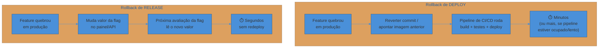
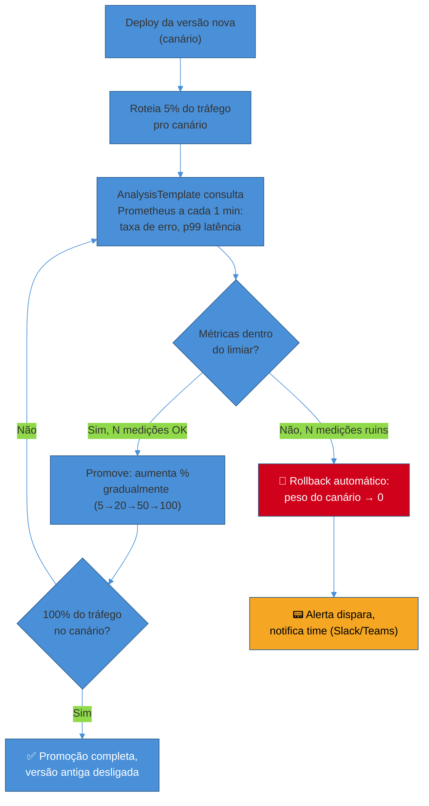

# Progressive delivery e rollback

> [!abstract] TL;DR
> **Deploy ≠ release.** Deploy é código novo chegando aos servidores de produção; release é esse código passando a afetar o comportamento que o usuário vê. A ferramenta que desacopla os dois é a **feature flag**: o binário sobe com a feature inteira dentro, mas desligada — quem decide "ligar" não é mais o pipeline de CI/CD, é uma config runtime, trocável em segundos, sem redeploy. Isso muda a natureza do rollback: **rollback de deploy** (voltar pra versão anterior do binário, minutos) e **rollback de release** (desligar a flag, milissegundos) resolvem problemas diferentes — e o segundo é sempre mais rápido quando disponível. **Progressive delivery** é o nome que James Governor (RedMonk) deu, em 2018, à combinação dessas duas ideias com a nota 02 desta trilha (deployment strategies): em vez de um humano decidindo manualmente "promove o canary" olhando um dashboard, um controlador (Argo Rollouts, Flagger) observa SLIs de erro e latência automaticamente e **promove ou reverte sozinho**, sem intervenção. O canário deixou de ser vigiado por gente; passou a ser vigiado por métrica.

Imagine que sua empresa fechou uma parceria de marketing: a nova feature de checkout via carteira digital só pode aparecer para o público às 9h de segunda-feira, sincronizada com uma campanha paga que já está agendada, comprada e paga adiantado. O código está pronto na quinta-feira. Passou em todos os testes. O time quer fazer merge e seguir com o fluxo normal de deploy contínuo — mas não pode: se o pipeline de CI/CD fizer o que sempre faz (merge → build → deploy → tráfego real vendo o código novo), a feature vaza três dias antes da campanha. Amarelo pisca. Alguém no Slack sugere: "então segura o merge até segunda de manhã."

Segurar o merge é a resposta errada, e é a resposta que times sem feature flags são forçados a dar. Ela trava branches por dias, aumenta o risco de conflito, e — pior — significa que na segunda de manhã, às 9h, alguém vai ter que fazer um deploy ao vivo, sob pressão de horário, torcendo para que o build que ficou parado há três dias ainda funcione contra a infra atual. É exatamente o cenário que a nota 01 deste sub-galho (CI/CD como decisão de design) e a nota 02 (deployment strategies) tentam evitar: deploys grandes, raros, sob pressão de calendário, são os que mais quebram.

A resposta certa é fazer merge e deploy normalmente na quinta — só que com a feature inteira escondida atrás de um `if`. O código sobe para produção, roda, é exercitado por testes de fumaça e até por um pequeno grupo interno via *permission toggle* — mas para o usuário final, o comportamento não mudou nada. Na segunda às 9h, ninguém faz deploy: alguém aperta um botão num painel de administração (ou dispara uma chamada de API) que muda um valor de configuração de `false` para `true`. A feature "vai ao ar" sem uma única linha de código nova subindo naquele momento.

Essa separação — código chega aos servidores (**deploy**) vs. código passa a afetar o usuário (**release**) — é o conceito que esta nota assume construído (a nota 03 do sub-galho 1, "O ciclo de vida de um deploy", nomeia o contrato; aqui a gente constrói a *ferramenta* que o viabiliza).

## Feature flags: a config que desacopla deploy de release

Uma **feature flag** (ou *feature toggle* — os termos são usados como sinônimos na prática, embora Martin Fowler prefira "toggle" por descrever melhor o mecanismo, e "flag" tenha vencido no vocabulário popular) é, na sua forma mais simples, um `if` cuja condição não está hardcoded no código — está numa fonte de configuração externa, lida em runtime, que pode mudar sem redeploy.

```
if (featureFlags.isEnabled("nova-carteira-digital", contexto_do_usuario)) {
    return renderizarCheckoutComCarteira();
} else {
    return renderizarCheckoutAntigo();
}
```

O que parece trivial no código esconde uma mudança estrutural grande: **quem decide quando uma feature aparece deixa de ser o pipeline de deploy e passa a ser uma decisão de negócio, tomada em runtime, por quem tem contexto de negócio** — não por quem tem acesso ao `kubectl`. Martin Fowler, no artigo canônico sobre o tema ("Feature Toggles (aka Feature Flags)", martinfowler.com), descreve isso como uma técnica que "permite times modificarem o comportamento do sistema sem alterar código" — e insiste num ponto que times iniciantes costumam ignorar: **flags diferentes servem propósitos diferentes e devem ser tratadas, geridas e removidas de formas diferentes.** Ele descreve quatro categorias principais:

| Categoria | Propósito | Ciclo de vida típico |
|---|---|---|
| **Release toggle** | Esconder feature incompleta/arriscada até estar pronta pra ir ao ar | Curto — dias a semanas; removida assim que 100% dos usuários veem a nova versão |
| **Ops toggle** (kill switch) | Dar a operação um controle de emergência sobre uma funcionalidade | Longo — pode viver anos como salvaguarda permanente |
| **Experiment toggle** | A/B testing — rotear frações de usuários para variantes e medir | Curto/médio — dura o tempo do experimento |
| **Permission toggle** | Controlar acesso por segmento (plano pago, beta tester, região) | Pode ser permanente (é regra de negócio, não só de deploy) |

Esta nota foca nas duas primeiras — **release toggle** e **ops toggle/kill switch** — porque são as que participam diretamente da mecânica de deploy e rollback. Experiment toggles pertencem mais ao domínio de produto/growth; permission toggles são regra de negócio duradoura, não uma técnica de entrega.

> [!question]- Feature flag não é só um "if com config"? Por que tanta cerimônia?
> Tecnicamente, sim — a implementação mínima é isso mesmo. A cerimônia entra na *gestão*: uma flag isolada é trivial; um sistema com 200 flags ativas, cada uma com seu próprio ciclo de vida, público-alvo e data de expiração, é um problema de engenharia por si só. É por isso que existe uma indústria de ferramentas dedicadas (LaunchDarkly, Flagsmith, Unleash, Split) em vez de todo mundo reimplementar um dicionário de booleanos: elas resolvem avaliação de flag por segmento de usuário (targeting), rollout percentual controlado, auditoria de quem mudou o quê e quando, e — cada vez mais — *flag triggers* que automatizam a resposta a incidente (ver a seção de kill switch adiante).

### O kill switch: rollback sem deploy

O caso de uso mais valioso operacionalmente — mais até do que esconder features incompletas — é o **ops toggle usado como kill switch**. A ideia: envolver qualquer funcionalidade não-essencial (uma integração com terceiro, um algoritmo de recomendação, uma feature nova arriscada) numa flag permanente, com duas variações — ligado/desligado — e mantê-la lá indefinidamente como interruptor de emergência.

A LaunchDarkly descreve o padrão assim: um kill switch é "um mecanismo de segurança permanente que você usa para desligar funcionalidade não-essencial ou ferramentas de terceiros numa emergência" — útil especificamente para desligamento de emergência de APIs externas, resposta a picos inesperados de tráfego ou spam, e qualquer incidente operacional onde você precisa "pisar no freio" sem causar disrupção adicional (redeploy sob pressão é, ele mesmo, uma fonte de risco).

A diferença prática entre um kill switch e um rollback de deploy tradicional é de ordem de grandeza no tempo de resposta:



A LaunchDarkly documenta o caso concreto: usando o client de JavaScript, é possível reverter instantaneamente uma feature problemática — sem passar pelo pipeline, sem esperar build, sem torcer para o rollback do orquestrador (K8s, ECS) terminar de drenar pods. A flag já está no cliente; muda o valor no servidor de configuração de flags e a próxima avaliação já reflete o novo estado.

Isso não substitui o rollback de deploy — substitui *quando a causa do problema está dentro do controle de uma flag*. Se o bug está no código de infraestrutura, num vazamento de memória, numa migration de banco malfeita (a nota 04 desta trilha detalha esse caso, que é justamente onde flag *não* resolve sozinha), a flag não ajuda: o bug não está atrás de nenhum `if` de feature. Kill switch é uma ferramenta cirúrgica para features específicas, não um substituto universal de rollback de infraestrutura.

Vale ainda notar uma armadilha operacional específica do kill switch: ele só é rápido se a avaliação da flag também for rápida. Em arquiteturas onde o client (mobile, front-end) faz *cache local* do valor da flag e só revalida a cada N minutos, ou onde a flag é lida uma única vez na inicialização do processo e nunca mais, o "segundos" da tabela acima vira "minutos até o próximo ciclo de cache" ou, pior, "só depois do próximo deploy" — que é exatamente o cenário que a flag deveria evitar. Projetar o mecanismo de propagação da flag (streaming/SSE, polling curto, ou reavaliação por request) é parte do trabalho de tornar o kill switch de fato instantâneo, não um detalhe de implementação a ignorar.

> [!warning] Tratar toda flag como kill switch — e nunca remover nenhuma
> **O que acontece:** o time adota feature flags, sente o poder do desligamento instantâneo, e começa a envolver *tudo* em flag — inclusive coisas que nunca vão precisar ser desligadas. Meses depois, ninguém lembra por que metade das flags existe.
> **Por quê:** confundir "toda flag é permanentemente valiosa" com "algumas flags (kill switches deliberados) são permanentemente valiosas" gera uma acumulação sem controle. Cada flag nova multiplica os caminhos de código possíveis — com N flags booleanas independentes, existem até 2^N combinações de comportamento, a maioria das quais nunca é testada explicitamente.
> **Como evitar:** trate release toggles como código com prazo de validade — defina uma data de remoção *no momento em que a flag é criada*, não "depois a gente limpa". Kill switches são a exceção deliberada: documente explicitamente que aquela flag é permanente e por quê. Revisões periódicas (mensais/trimestrais) de flags ativas, cruzando "quando foi a última mudança de valor" contra "para que serve", evitam que o painel de flags vire um cemitério que ninguém ousa mexer.

### O custo: dívida de flags e complexidade combinatória

O lado sombrio das feature flags não é técnico — é organizacional. A LaunchDarkly e várias empresas de flag-management descrevem o padrão de "dívida de feature flag" quase da mesma forma que se descreve dívida técnica de código morto: uma flag nasceu com propósito legítimo (rollout seguro, teste A/B), cumpriu a função, e ninguém a removeu — porque remover código sempre carrega algum risco percebido e o time já mudou de prioridade. O resultado, meses depois: caminhos de código que nunca são exercitados (a variante "desligada" de uma flag 100% ligada há um ano), documentação esparsa sobre por que a flag existe, e um medo crescente de tocar em qualquer coisa perto dela.

O problema fica pior porque flags não vivem isoladas — interagem entre si. Um sistema com dez flags booleanas independentes tem, em teoria, 1024 combinações de estado possíveis; na prática, a maioria nunca é testada, e bugs que só aparecem quando a flag A está ligada *e* a flag B está desligada só são descobertos em produção, pela pior via possível: um usuário real batendo numa combinação que ninguém pensou em testar. É o mesmo argumento que justifica manter o número de branches de deploy baixo (nota 02) — cada dimensão de variação multiplica o espaço de estados que alguém precisa raciocinar sobre.

A mitigação canônica (LaunchDarkly, Unleash, CloudBees documentam variações da mesma prática): tratar a remoção de flag como parte do "definition of done" da feature, não como um item de backlog que nunca sobe de prioridade — algumas equipes adotam a regra de sempre adicionar uma tarefa de remoção de toggle ao backlog no momento em que o release toggle é criado, e algumas ferramentas de flag-management oferecem datas de expiração configuráveis que forçam essa conversa quando o prazo vence.

## Progressive delivery: quando a flag encontra a métrica

Feature flags resolvem *quem decide* quando uma feature liga. Deployment strategies (nota 02) resolvem *como* o tráfego migra entre versões — canary, blue-green, rolling. Até aqui, em ambos os casos, um humano olha um dashboard e decide "promove" ou "reverte". **Progressive delivery** é o passo seguinte: automatizar essa decisão, substituindo o julgamento humano por uma análise automatizada de métricas.

O termo foi cunhado por **James Governor**, cofundador da RedMonk, num post de agosto de 2018 ("Towards Progressive Delivery", redmonk.com) para descrever exatamente essa combinação: "uma cesta de abordagens de entrega de aplicação que reduzem risco roteando tráfego para segmentos de usuário ou infraestrutura selecionados e alvejados antes de um lançamento mais amplo, permitindo mais flexibilidade para experimentação e maior segurança" — pensando em A/B testing, canário, feature management e blue/green juntos, não isolados. Governor descreveu o *progressive delivery* como construído sobre as fundações de Continuous Delivery/Continuous Integration — não uma substituição, um degrau seguinte.

Na prática de 2026, o degrau seguinte é implementado por operadores dedicados de Kubernetes que fecham o loop automaticamente:

- **Argo Rollouts** (projeto CNCF, parte do ecossistema Argo/GitOps): substitui o objeto `Deployment` padrão do K8s por um `Rollout` que sabe fazer canário e blue-green nativamente, e integra com provedores de métricas (Prometheus, Datadog, entre outros) via `AnalysisTemplate` — uma definição declarativa de "qual métrica olhar e qual limiar aceitar".
- **Flagger** (também CNCF, do ecossistema Flux/GitOps): implementa um *control loop* que desloca tráfego gradualmente para o canário enquanto mede indicadores-chave — taxa de sucesso de requisições HTTP, duração média de requisição, saúde dos pods — e, com base nessa análise, **promove ou aborta o canário automaticamente**, publicando o resultado num canal de notificação (Slack, Teams).

O padrão de configuração é sempre o mesmo formato: defina um SLI (o quê medir — ver o sub-galho 4 desta trilha para a engenharia por trás de escolher SLIs), um limiar aceitável (ex.: taxa de sucesso ≥ 95%), uma janela de observação (ex.: medições a cada minuto) e um critério de falha (ex.: três medições consecutivas abaixo do limiar). Documentação e casos reais de Argo Rollouts descrevem exatamente esse padrão: se a métrica cair abaixo de 95% em três medições, a análise é marcada como falha, o Rollout aborta automaticamente, o peso do canário volta a zero, e o objeto entra em estado degradado — sem ninguém precisar estar de plantão olhando um gráfico àquela hora exata.



Repare no que mudou em relação à nota 02: lá, canário era uma *estratégia de deploy* — a decisão de rotear tráfego em fatias. Aqui, a promoção e o rollback dessa estratégia deixam de ser um botão apertado por um humano vigiando um dashboard e viram um **loop de controle fechado**, guiado por métrica, sem intervenção manual no caminho feliz. O humano só entra quando o loop falha e alguém precisa investigar a causa raiz — exatamente o padrão de "mitigar o sintoma automaticamente, investigar depois" que a nota 01 do sub-galho 1 já havia esboçado.

> [!warning] Automatizar a promoção sem métricas boas o suficiente pra confiar
> **O que acontece:** o time configura um `AnalysisTemplate` olhando só a taxa de erro HTTP 5xx, com um limiar genérico copiado de um tutorial, e passa a confiar cegamente que "se o Argo Rollouts não abortou, está tudo bem".
> **Por quê:** um canário automatizado só é tão bom quanto os SLIs que ele observa. Erro HTTP não pega degradação de negócio (conversão caindo sem erro técnico nenhum), não pega efeitos que só aparecem sob carga de pico que uma fatia de 5% de tráfego nunca reproduz, e não pega regressões lentas que ficam abaixo do limiar em cada medição individual mas se acumulam ao longo de horas. Um limiar mal calibrado também gera falsos positivos — abortos automáticos por ruído estatístico normal, que erodem a confiança do time no mecanismo e levam a desabilitá-lo "temporariamente" (e esse temporário vira permanente).
> **Como evitar:** trate o desenho do `AnalysisTemplate` como trabalho de engenharia de primeira classe, não config-e-esquece — combine múltiplas métricas (erro, latência p99, e ao menos uma métrica de negócio quando possível), calibre limiares com dados históricos reais do serviço, e mantenha análise em segundo plano (*background analysis*) durante toda a janela do rollout, não só no momento da promoção. A nota do sub-galho 4 sobre SLI/SLO é o aprofundamento dessa engenharia.

> [!question]- Progressive delivery elimina a necessidade de rollback manual?
> Reduz drasticamente, mas não elimina. O loop automatizado cobre o caso onde o problema aparece *nas métricas que você já pensou em monitorar* — erro HTTP, latência, health de pod. Ele não cobre degradação lenta e sutil (uma métrica de negócio que só é percebida horas depois, tipo taxa de conversão caindo sem nenhum erro técnico), nem falhas correlacionadas que só acontecem sob carga de pico que o canário de 5% nunca viu. Progressive delivery move o trabalho humano de "vigiar o dashboard durante o rollout" para "desenhar bem quais métricas o `AnalysisTemplate` observa" — que é um trabalho de engenharia mais valioso, mas ainda é trabalho.

> [!question]- Por que não simplesmente automatizar 100% sem feature flag — só com deploy canário automatizado?
> Porque resolvem problemas diferentes e complementares. Canário automatizado (Argo Rollouts/Flagger) protege contra **regressões técnicas** — o código novo tem um bug de performance ou está quebrando requests. Feature flag protege contra **decisões de negócio** — a feature está tecnicamente correta, mas não deve aparecer ainda (falta aprovação de marketing, é uma mudança sensível que precisa de comunicação antes). Um sistema maduro de progressive delivery usa os dois: o deploy sobe via canário health-gated (proteção técnica) *e* a feature nova chega escondida atrás de flag (controle de negócio) — desligar por métrica ruim é uma decisão do sistema; desligar por decisão de produto é uma decisão de humano, mas ambas usam o mesmo mecanismo de "sem redeploy".

> [!question]- Preciso de Argo Rollouts/Flagger pra fazer progressive delivery, ou dá pra fazer sem Kubernetes?
> Não é exclusivo de K8s — é um padrão, não uma ferramenta específica. Fora do ecossistema Kubernetes, service meshes e API gateways (Istio, Linkerd, e ofertas gerenciadas de nuvem) oferecem primitivas equivalentes de roteamento ponderado + análise; plataformas de feature flag como LaunchDarkly e Flagsmith também oferecem *rollout percentual progressivo* combinado com monitoramento de métrica de negócio (não só técnica) diretamente no produto de flags, sem depender de um controlador do Kubernetes. O que importa conceitualmente é sempre o mesmo tripé: **roteamento gradual + métrica observada + decisão automatizada de promover ou reverter** — a implementação varia com a stack.

## Rollback quando tem migration no meio

Há um caso em que nem kill switch nem canário automatizado resolvem sozinhos, e vale nomear aqui porque é a fronteira exata com a próxima nota: **quando o deploy inclui uma mudança de schema de banco de dados**.

Se a versão nova do código espera uma coluna nova que a versão antiga não conhece, um rollback de deploy simples — voltar para o binário anterior — pode quebrar contra o schema já alterado. E um rollback de release via flag não ajuda: a flag controla o comportamento da aplicação, não reverte uma `ALTER TABLE` que já rodou. Esse é o motivo pelo qual a estratégia de migration segura (o padrão *expand/contract*, que a próxima nota detalha) precisa ser desenhada em conjunto com a estratégia de deploy e release — não como um passo separado. Progressive delivery e feature flags resolvem o comportamento da aplicação; migrations resolvem a compatibilidade do dado por trás dela. Os dois problemas coexistem no mesmo deploy e exigem, juntos, que a versão antiga *e* a versão nova do código consigam conviver com o mesmo schema por uma janela de tempo — regra que vale independente de você estar usando flag, canário manual ou canário automatizado.

## O ring deployment: ligar % de usuários gradual, além do canário técnico

Uma variação do rollout percentual, mais próxima do controle de negócio do que da análise de SLI, é o **ring deployment** (ou *rollout em anéis*) — popularizado pela Microsoft nos updates do Windows e do Microsoft 365, e hoje aplicado por várias plataformas de feature flag para expor releases progressivamente por *segmento de público*, não só por porcentagem aleatória de tráfego.

A lógica: em vez de rotear 5%-20%-50%-100% do tráfego *aleatoriamente* como faz um canário técnico, você define **anéis nomeados de usuários** — por exemplo, "funcionários internos" (ring 0) → "beta testers que optaram por entrar" (ring 1) → "5% de usuários gerais escolhidos por região" (ring 2) → "todo mundo" (ring final). Cada anel é promovido manualmente ou por critério de tempo/qualidade, e cada um serve a um propósito diferente: o ring 0 pega bugs óbvios antes de qualquer usuário externo ver; o ring 1 pega feedback qualitativo de gente que topou testar; o ring 2 mede impacto real em escala pequena antes do "todo mundo".

A diferença de ring deployment para canário automatizado (Argo Rollouts/Flagger) é o critério de promoção: canário promove com base em **métrica técnica objetiva** (taxa de erro, latência) e pode ser 100% automatizado; ring deployment tipicamente combina métrica com **critério de produto/UX** (feedback qualitativo do ring 1, aprovação de negócio) e por isso costuma manter um humano no loop em pelo menos um dos anéis — a automação total é possível, mas menos comum, porque o que se está testando muitas vezes não é só "o serviço não caiu", é "os usuários gostaram".

Vale notar que ring deployment e canário técnico não são mutuamente exclusivos — na prática, times maduros aplicam os dois ao mesmo tempo, em camadas diferentes do mesmo rollout. O ring define *quem* pode ver a feature (segmentação por público, controlada por flag); o canário health-gated define *quão rápido e com que segurança* o tráfego daquele anel específico migra para a versão nova do código. Um pode falhar sem o outro: um ring de usuários beta pode adorar a feature (critério de produto satisfeito) enquanto o serviço por trás dela degrada sob a carga desse mesmo ring (critério técnico falhando) — e é o canário automatizado, não o feedback qualitativo, que vai pegar isso a tempo.

> [!warning] Vazar uma flag pro público errado por regra de targeting mal escrita
> **O que acontece:** uma flag de ring deployment é configurada pra atingir "5% dos usuários de uma região específica", mas a regra de segmentação usa um atributo de contexto que nem todo cliente envia corretamente (ex.: geolocalização ausente em alguns clientes), e o sistema de flags trata "atributo ausente" como "qualquer valor serve" — a feature vaza para 100% dos usuários sem atributo de região, não 5%.
> **Por quê:** regras de targeting são código de produção como qualquer outro, mas frequentemente são editadas num painel de UI por quem não tem o hábito de revisão de código, testes ou pull request — o rigor de engenharia que se aplica ao resto do pipeline não é aplicado à configuração da flag.
> **Como evitar:** trate a definição de regra de targeting com o mesmo rigor de qualquer mudança de produção — revisão por segunda pessoa, teste em ambiente de staging antes de aplicar em produção, e um comportamento padrão explícito e conservador para "atributo de contexto ausente" (tratar como *fora* do público-alvo, nunca como "dentro por padrão"). Ferramentas maduras de flag management (LaunchDarkly, Flagsmith, Unleash) versionam mudanças de targeting e permitem auditoria de "quem mudou o quê" — usar esse histórico é o que transforma uma flag mal configurada de incidente silencioso em erro rapidamente identificável.

## Um exemplo trabalhado: o checkout de carteira digital, do deploy à promoção automática

Voltando ao cenário de abertura — a integração de carteira digital que não pode vazar antes da campanha de marketing — eis como as peças desta nota se encaixam numa timeline real:

**Quinta-feira, 14h — Deploy.** O código da nova opção de pagamento sobe para produção via pipeline normal de CI/CD. A feature inteira está atrás de uma release toggle chamada `checkout-carteira-digital`, hoje avaliada como `false` para 100% dos usuários. O binário em produção já contém o código novo; nenhum usuário externo vê diferença.

**Quinta-feira, 14h30 — Validação interna.** O time ativa a flag apenas para o segmento `funcionarios-internos` (um permission toggle sobreposto ao release toggle, na prática comum de combinar categorias). QA interno testa o fluxo completo em produção real, sem risco pro público — exatamente o *ring 0* do ring deployment.

**Segunda-feira, 08h55 — Preparação.** Cinco minutos antes do horário combinado com marketing, o time confirma que o `AnalysisTemplate` do Argo Rollouts está ativo para o serviço de checkout, monitorando taxa de erro 5xx e p99 de latência com limiar de 2% de erro e 800ms.

**Segunda-feira, 09h00 — Release.** Alguém muda a flag `checkout-carteira-digital` de `false` para `true` para 10% dos usuários (rollout percentual gradual, não 100% de uma vez — mesma lógica de canário, agora aplicada no nível de release, não de deploy). Nenhum redeploy acontece. A campanha de marketing começa a rodar simultaneamente.

**Segunda-feira, 09h05 — Loop de análise.** O `AnalysisTemplate` mede a cada minuto. Erro em 0,8%, latência em 340ms — dentro do limiar. Depois de cinco medições limpas, a flag é promovida (manual ou por automação de flag trigger, dependendo da maturidade do time) para 50% dos usuários.

**Segunda-feira, 09h20 — Anomalia.** A taxa de erro sobe para 4% — acima do limiar de 2%. Três medições consecutivas ruins. Se isso fosse uma falha de deploy (canário técnico do Argo Rollouts), o Rollout abortaria sozinho, voltando o peso pro pod antigo. Mas aqui a causa é diferente: o provedor de pagamento da carteira digital está com uma instabilidade pontual, não o código. A resposta certa não é reverter o deploy — é usar o **kill switch**: alguém desliga a flag `checkout-carteira-digital` de volta para `false`. Em segundos, ninguém mais vê a opção de pagamento problemática. Sem redeploy, sem pipeline, sem esperar rollout de Kubernetes.

**Segunda-feira, 10h30 — Causa raiz e reativação.** O provedor de pagamento confirma que resolveu a instabilidade. O time reativa a flag, volta a 10%, deixa o `AnalysisTemplate` reconfirmar saúde, e promove gradualmente de novo até 100% ao longo da tarde.

Note o que aconteceu: **dois mecanismos de rollback diferentes, para duas causas diferentes, ambos evitando redeploy.** Se o bug estivesse no próprio código (uma regressão de latência introduzida pela nova versão), o canário automatizado do Argo Rollouts teria pego e revertido sozinho, sem ninguém acionar nada. Como o problema era numa dependência externa fora do controle do deploy, o kill switch de release resolveu — instantâneo, sem depender de infraestrutura de deploy nenhuma. As duas ferramentas coexistem porque cobrem categorias de falha diferentes.

## Em entrevista

Progressive delivery e feature flags aparecem em entrevistas sênior de duas formas: como pergunta de definição ("o que é deploy vs release, e por que separar") e como pergunta de design de sistema ("como você faria rollout seguro de uma feature arriscada").

O que o entrevistador está de fato avaliando:

- Se você distingue **deploy de release** com precisão — a resposta fraca trata os dois como sinônimos; a resposta forte explica o desacoplamento e cita feature flags como o mecanismo concreto.
- Se você sabe que **existem tipos diferentes de flag** com ciclos de vida diferentes — citar "release toggle" e "ops toggle/kill switch" como categorias distintas, não "flag" como conceito único, sinaliza que você já operou isso de verdade, não só leu sobre.
- Se você entende o **custo** das flags, não só o benefício — mencionar dívida de flag e complexidade combinatória sem ser perguntado mostra maturidade; quem só elogia feature flags parece ter lido um blog post de vendor, não ter vivido a manutenção.
- Se você consegue explicar **por que rollback de release é mais rápido que rollback de deploy** e em que casos um não substitui o outro (migration de banco é o exemplo clássico de "flag não resolve") — essa é a pergunta que separa quem decorou o conceito de quem entende o mecanismo por baixo.
- Em progressive delivery automatizado, se você sabe articular que a automação **desloca** trabalho humano (de "vigiar dashboard" para "desenhar bons SLIs de análise") em vez de eliminá-lo — mostra que você não trata automação como mágica.

## How to explain in English

> "We treat deploy and release as separate events. Deploy just means the new binary is running in production; release means it's actually affecting user-visible behavior — and we control that gap with feature flags. A release toggle hides an incomplete feature until it's ready; an ops toggle, or kill switch, is a permanent safety valve we can flip to instantly disable something risky without a redeploy — that's rollback at the release level, and it's orders of magnitude faster than rolling back a deploy. On top of that we run progressive delivery: instead of a human watching a dashboard during a canary rollout, a controller like Argo Rollouts or Flagger automatically analyzes error rate and latency against a threshold, and promotes or rolls back the canary on its own. The two mechanisms are complementary — canary analysis catches regressions in our own code, kill switches handle failures in things outside our control, like a third-party dependency."

| PT | EN |
|----|----|
| Implantação vs lançamento | Deploy vs release |
| Feature flag / feature toggle | Feature flag / feature toggle |
| Toggle de lançamento | Release toggle |
| Interruptor de emergência | Kill switch / ops toggle |
| Toggle de permissão | Permission toggle |
| Toggle de experimento | Experiment toggle |
| Dívida de feature flag | Feature flag debt |
| Entrega progressiva | Progressive delivery |
| Canário guiado por métrica | Metrics-driven / health-gated canary |
| Promoção automática | Automated promotion |
| Reversão automática | Automated rollback |
| Rollout em anéis | Ring deployment |
| Loop de controle | Control loop |
| Raio de explosão (impacto limitado) | Blast radius |

## O que vem a seguir

Esta nota resolveu o comportamento da aplicação — flags e canário automatizado desacoplam quando o código sobe de quando ele afeta o usuário, e dão dois mecanismos de rollback independentes e rápidos. Mas há uma categoria de mudança que nenhum dos dois resolve sozinha: **mudança de schema de banco de dados**. Quando o deploy inclui uma migration, tanto a versão antiga quanto a nova do código podem precisar conviver com o mesmo schema por uma janela — e reverter uma migration já aplicada não é tão simples quanto desligar uma flag.

- [[04 - Migrations de banco em produção]] — o padrão expand/contract, zero-downtime schema change, backfill e o problema do rollback quando teve migration no meio

Nota anterior: [[02 - Deployment strategies]] — as estratégias de deploy (rolling, blue-green, canary, shadow) que esta nota assume conhecidas e automatiza.

## Veja também

- [[Operação/index|Operação]] — o galho-pai e o mapa completo da trilha
- [[2 - Entrega e release/index|Entrega e release]] — este sub-galho
- [[03 - O ciclo de vida de um deploy]] — onde a distinção deploy≠release é definida pela primeira vez, no sub-galho 1
- [[4 - Observar e responder/index|Observar e responder]] — as métricas (SLI/SLO) que alimentam o `AnalysisTemplate` do canário automatizado; esta nota assume "medir erro e latência" como dado, o sub-galho 4 ensina a engenharia de escolher e definir essas métricas

## Fontes

- **Martin Fowler** — [*Feature Toggles (aka Feature Flags)*](https://martinfowler.com/articles/feature-toggles.html) (martinfowler.com, artigo com Pete Hodgson, atualizado) — as quatro categorias de toggle (release, ops, experiment, permission) e a orientação de gerenciar cada categoria separadamente.
- **James Governor** — [*Towards Progressive Delivery*](https://redmonk.com/jgovernor/2018/08/06/towards-progressive-delivery/) (RedMonk, agosto de 2018) — a origem do termo "progressive delivery" como combinação de canário, feature flags, A/B testing e blue/green sobre a fundação de CI/CD.
- **Argo Project** — [*Argo Rollouts — Analysis & Progressive Delivery*](https://argo-rollouts.readthedocs.io/en/stable/features/analysis/) (argo-rollouts.readthedocs.io, acessado em 2026) — `AnalysisTemplate`, critérios de sucesso/falha e promoção/rollback automatizados via métricas.
- **Flagger / CNCF** — [*Flagger — Progressive Delivery Kubernetes Operator*](https://flagger.app/) e [repositório](https://github.com/fluxcd/flagger) (acessado em 2026) — o control loop de canário guiado por KPIs (taxa de sucesso HTTP, duração, saúde de pods) e promoção/aborto automáticos.
- **LaunchDarkly** — [*What is a Kill Switch in Software Development?*](https://launchdarkly.com/blog/what-is-a-kill-switch-software-development/) e [*Kill switch flags*](https://launchdarkly.com/docs/home/flags/killswitch) (launchdarkly.com, acessado em 2026) — definição de kill switch/ops toggle como salvaguarda permanente e o caso de rollback instantâneo sem redeploy.
- **LaunchDarkly** — [*Reducing technical debt from feature flags*](https://launchdarkly.com/docs/guides/flags/technical-debt) (launchdarkly.com, acessado em 2026) — a prática de prazo de expiração e remoção de release toggles como parte do "definition of done".
- **Microsoft Learn** — [*Manage Windows Update Ring Policies*](https://learn.microsoft.com/en-us/intune/device-updates/windows/manage-update-rings) (learn.microsoft.com, acessado em 2026) — o modelo de rollout em anéis (rings) nomeados, origem do padrão de ring deployment.
