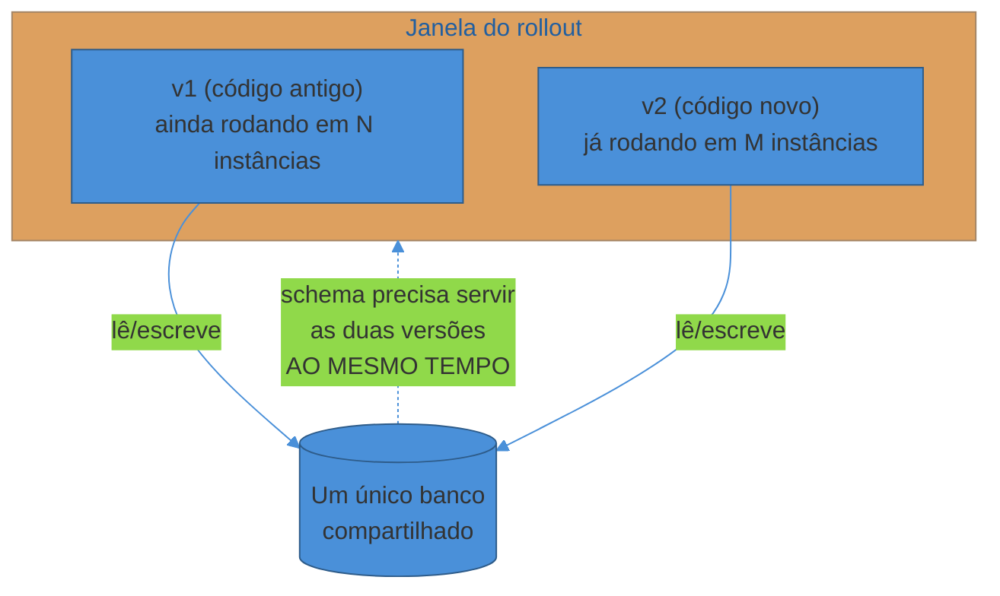
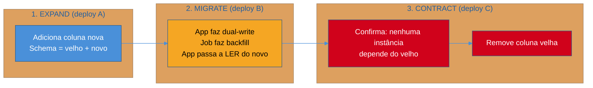
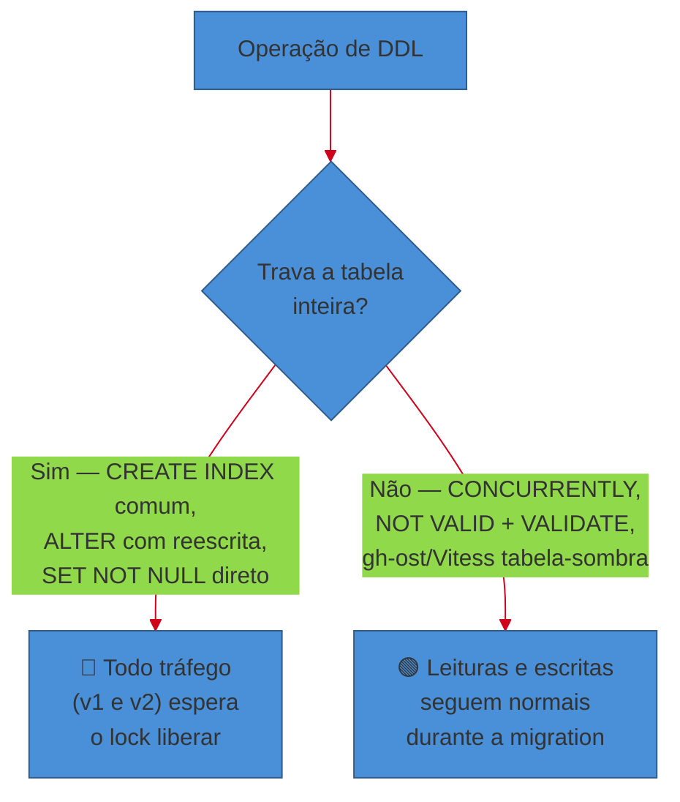

# Migrations de banco em produção

> [!abstract] TL;DR
> Um deploy rolling coloca **duas versões da aplicação rodando ao mesmo tempo** contra o **mesmo banco** — e um `ALTER TABLE RENAME COLUMN` que parecia trivial no ambiente local vira um incidente em produção, porque a versão antiga quebra quando a coluna que ela espera desaparece. O padrão que resolve isso é **expand/contract** (também chamado de *parallel change*, cunhado por Martin Fowler): (1) **expand** — adiciona o novo sem remover o velho, retrocompatível; (2) **migrate/backfill** — copia e preenche os dados, com dual-write se necessário; (3) **contract** — só depois que 100% do tráfego usa o novo, remove o velho, num deploy separado. Junto disso: cuidado com **locks** (um `ALTER` mal escrito trava a tabela inteira e derruba o site), **backfill em batches** para não sobrecarregar produção, e a lição mais traiçoeira de todas — **"down migration" não é um botão de desfazer seguro**, porque dados já migrados não voltam sozinhos. A defesa preferida da indústria não é reverter, é **seguir em frente com uma correção** (fix forward).

Duas da tarde, deploy rolling em andamento. A v2 do serviço sobe aos poucos — 10%, 30%, 60% das instâncias — enquanto a v1 ainda atende o resto do tráfego. Faz parte do plano: é assim que um rolling deployment evita downtime, trocando pods um a um em vez de derrubar tudo de uma vez (você já viu essa mecânica na [[02 - Deployment strategies|nota sobre deployment strategies]]).

O problema é que essa migration, feita às pressas na sexta à tarde, renomeou uma coluna: `nome` virou `nome_completo`. A migration rodou primeiro, porque "afinal, o schema precisa estar pronto antes do código novo". Ela terminou em 200 milissegundos — parecia inofensiva.

Só que agora **as duas versões da aplicação leem o mesmo banco ao mesmo tempo**. A v2, que já sabe da coluna nova, funciona bem. A v1, que ainda está rodando em 40% das instâncias e vai continuar rodando até o rollout terminar, faz `SELECT nome FROM usuarios` — e recebe um erro de coluna inexistente. Metade do tráfego começa a retornar 500.

Pior ainda: em bancos mais antigos ou em tabelas gigantes, o próprio `ALTER TABLE` pode não ser instantâneo — ele pode **travar a tabela inteira** enquanto reescreve dados em disco, e todo o tráfego (das duas versões) fica esperando esse lock. Nesse cenário não é só a v1 que quebra: o site inteiro trava, porque ninguém — nem v1, nem v2 — consegue mais fazer uma query naquela tabela.

Esse é o assunto desta nota: **como o schema do banco sobrevive a um deploy em que duas versões da aplicação coexistem**, sem downtime e sem lock generalizado. Não é sobre sintaxe de `ALTER TABLE` ou sobre como configurar réplicas — é sobre a disciplina de sequenciar mudanças de schema para que elas nunca quebrem a versão da aplicação que ainda está rodando.

> [!question]- Por que não simplesmente rodar a migration e o deploy juntos, na mesma janela, e aceitar um downtime curto?
> Algumas empresas aceitam exatamente esse trade-off — uma janela de manutenção agendada, onde o tráfego é pausado, a migration roda, e o serviço volta. É uma escolha legítima quando o SLA permite (ex.: um sistema interno B2B fora do horário comercial). Mas para qualquer serviço com SLA de disponibilidade contínua — e-commerce, pagamentos, qualquer coisa com usuário ativo 24/7 — essa janela é exatamente o tipo de downtime planejado que a [[04 - Confiabilidade como feature|confiabilidade como feature]] tenta evitar. Expand/contract existe para transformar uma mudança "big bang" (migration + deploy simultâneos, tudo ou nada) numa sequência de passos pequenos e reversíveis, cada um seguro para rodar com o tráfego ativo.

## Por que a coexistência de versões é o cerne do problema

Voltando ao princípio: qualquer estratégia de deploy que não seja "desligar tudo e ligar de novo" — rolling, blue-green, canary — implica, por definição, um período em que **mais de uma versão do código está lendo e escrevendo no mesmo banco**. Isso já foi estabelecido na nota anterior sobre [[02 - Deployment strategies|deployment strategies]]; aqui a pergunta é: o que isso exige do schema?

A resposta é uma restrição simples de enunciar e fácil de esquecer sob pressão: **o schema em produção precisa, durante toda a janela de rollout, ser compatível com a versão antiga E com a versão nova ao mesmo tempo.** Não "eventualmente compatível" — compatível *agora*, enquanto os dois códigos coexistem.

Isso descarta de cara qualquer migration que seja **destrutiva e imediata**: remover uma coluna que o código antigo ainda lê, renomear algo sem deixar o nome antigo disponível, mudar o tipo de uma coluna de forma que quebre a serialização que o código antigo espera. Cada uma dessas operações, se feita "de uma vez", assume implicitamente que só existe uma versão de código rodando — uma premissa que rolling/blue-green/canary já invalidaram.



> [!warning] "A migration é rápida, então não tem risco de coexistência"
> **O que acontece:** o time roda a migration de renomear a coluna, ela termina em 200ms, e assume que o risco passou — afinal foi "rápido". **Por quê:** o risco não é o tempo que a *migration* leva para rodar — é o tempo que o **rollout do deploy** leva para completar. Um `ALTER TABLE RENAME COLUMN` pode ser instantâneo e ainda assim deixar a v1 quebrada por 5, 10, 20 minutos, enquanto o Kubernetes ainda está trocando pods um a um. **Como evitar:** trate a pergunta certa como "quanto tempo as duas versões vão coexistir?", não "quanto tempo a migration leva". Se a resposta for "minutos a mais que zero" — e quase sempre é — a migration precisa ser retrocompatível com a versão antiga durante essa janela inteira.

## O padrão: expand / migrate / contract (parallel change)

O nome mais citado para esse padrão vem de Martin Fowler, que o descreve como **Parallel Change** — a técnica de quebrar uma mudança incompatível numa interface em três fases distintas, de forma que o sistema nunca fique quebrado em nenhum momento intermediário ([martinfowler.com/bliki/ParallelChange](https://martinfowler.com/bliki/ParallelChange.html)). Fowler é explícito sobre a aplicação a bancos de dados: "a maioria dos refactorings de banco de dados segue o padrão de parallel change, onde a fase de *migrate* é o período de transição entre o schema original e o novo, até que todo o código de acesso ao banco tenha sido atualizado para trabalhar com o novo schema". O mesmo padrão é discutido em profundidade, com Pramod Sadalage, no livro/artigo *Evolutionary Database Design* (martinfowler.com/articles/evodb.html) — a referência canônica para tratar o schema como algo que evolui em pequenos passos versionados, não como um artefato fixo desenhado de uma vez.

Aplicado a schema de banco, o padrão vira três fases, cada uma um **deploy separado** (não um único script):

**1. Expand.** Adiciona o novo — coluna, tabela, índice — sem tocar no velho. O schema resultante é a **união** do antigo e do novo: ambos existem, ambos funcionam. A v1 continua lendo/escrevendo a coluna velha exatamente como sempre fez; nada nela precisa mudar. Essa é a fase que garante retrocompatibilidade.

**2. Migrate (backfill).** Copia e preenche os dados: um job de backfill popula a coluna nova a partir da velha para as linhas que já existiam antes do expand. Se a aplicação continuar recebendo escritas nesse meio-tempo, ela precisa gravar **nos dois lugares** (dual-write) para que nenhuma linha nova fique só no lado velho. Só depois que o backfill termina e é validado — e só depois que 100% das instâncias já rodam código que lê do lado novo — a próxima fase pode começar.

**3. Contract.** Remove o velho. Só é seguro quando **nenhuma instância em produção ainda depende dele** — nem para ler, nem para escrever. Essa é, tipicamente, a operação mais rápida de todas (remover uma coluna é metadado, não reescrita de dados), mas é a que mais gente executa cedo demais, antes de confirmar que o velho está realmente órfão.



Repare no detalhe estrutural: **são três deploys, não um.** Cada fase só avança depois que a anterior foi confirmada estável em produção — geralmente com dias de intervalo entre elas, não minutos. É o oposto do impulso natural de "resolver tudo numa migration só, de uma vez, e seguir em frente".

> [!question]- Isso não deixa o processo de mudar um schema absurdamente mais lento?
> Deixa, e é exatamente essa lentidão deliberada que compra a segurança. Compare com o custo do outro lado: uma migration "rápida" que quebra produção custa um incidente, um rollback às pressas, possivelmente dados corrompidos por uma janela de escrita inconsistente. Expand/contract troca "uma operação arriscada e rápida" por "três operações seguras e mais lentas" — o mesmo trade-off, em espírito, das métricas DORA discutidas na [[1 - O ofício de operar/01 - O que é operar um sistema|nota 01 do sub-galho 1]]: mudanças pequenas e frequentes batem mudanças grandes e raras, mesmo sendo "mais devagar" isoladamente. Times maduros automatizam boa parte disso (linters de migration, ferramentas como o `pg_ha_migrations` da Braintree que barram DDL perigoso por padrão) para que a disciplina não dependa de lembrança manual a cada PR.

## Exemplo trabalhado: renomear uma coluna sem downtime

Voltando à cena de abertura — renomear `nome` para `nome_completo` numa tabela `usuarios` com milhões de linhas, num serviço com deploy rolling e SLA de disponibilidade contínua. Eis a sequência completa, cada passo um deploy independente:

**Passo 1 — Expand: adicionar a coluna nova.**

```sql
ALTER TABLE usuarios ADD COLUMN nome_completo TEXT;
```

Sem `DEFAULT` e sem `NOT NULL` — isso é proposital, não descuido. Em PostgreSQL moderno, adicionar uma coluna sem valor default é uma operação de metadado, praticamente instantânea, porque o Postgres não precisa reescrever as linhas existentes. Se você adicionar um `DEFAULT` não nulo numa tabela grande, versões antigas de MySQL (e mesmo Postgres, se o default depender de expressão volátil) reescrevem a tabela inteira — minutos ou horas de operação bloqueante numa tabela de centenas de milhões de linhas. A tática segura: adicionar a coluna sem default, preencher com `UPDATE` depois (passo 3), e só então — se realmente precisar de um `NOT NULL` — aplicar a constraint.

A aplicação, na v1, nem sabe que essa coluna existe. Ela continua lendo e escrevendo `nome` normalmente. Zero impacto.

**Passo 2 — Deploy da app: dual-write.**

A v2 do código passa a escrever nas **duas** colunas em todo `INSERT`/`UPDATE`:

```sql
-- pseudocódigo do que o ORM/repositório faz agora
UPDATE usuarios SET nome = $1, nome_completo = $1 WHERE id = $2;
```

Ela ainda **lê** de `nome` (a versão antiga do dado é a fonte de verdade até o backfill terminar). Durante o rollout desse deploy, a v1 (que só escreve em `nome`) e a v2 (que escreve nas duas) coexistem sem conflito — a coluna nova só fica temporariamente desatualizada para linhas que a v1 tocar, o que o backfill do próximo passo resolve.

**Passo 3 — Backfill: preencher o histórico.**

Um job separado — não parte do deploy da aplicação, rodado sob controle, geralmente fora do horário de pico — copia `nome` para `nome_completo` nas linhas que existiam antes do dual-write começar, em lotes pequenos:

```sql
UPDATE usuarios
SET nome_completo = nome
WHERE nome_completo IS NULL
  AND id BETWEEN :lote_inicio AND :lote_fim;
```

O motivo de fazer em batches (em vez de um `UPDATE` sem `WHERE` que toca a tabela inteira de uma vez) é duplo: um único `UPDATE` gigante mantém uma transação longa aberta, o que segura locks e infla o WAL/binlog por todo esse tempo; e ele compete diretamente com o tráfego de produção pelos mesmos recursos de I/O e CPU. A prática comum é: lotes de alguns milhares de linhas, um pequeno intervalo de espera entre lotes, monitorar a réplica (se o lag de replicação subir, pausar), e checkpoints que permitem retomar de onde parou se o job cair.

**Passo 4 — Deploy da app: virar a leitura para o novo.**

Com o backfill validado (uma query de sanidade: `SELECT count(*) FROM usuarios WHERE nome_completo IS NULL` deve ser zero, ou perto disso), a v3 do código passa a **ler** de `nome_completo` em vez de `nome` — mas continua escrevendo nas duas, por segurança, caso alguma instância antiga do deploy anterior ainda esteja no ar.

**Passo 5 — Deploy da app: parar de escrever no velho.**

Depois que 100% do tráfego roda a v3 (ou posterior) por tempo suficiente para dar confiança, a v4 para de escrever em `nome`. Agora `nome` está órfão: nenhum código em produção lê nem escreve nele.

**Passo 6 — Contract: remover a coluna velha.**

```sql
ALTER TABLE usuarios DROP COLUMN nome;
```

Só chega aqui depois de confirmar, com uma margem de segurança generosa (dias, não minutos — o suficiente para saber que nenhum job em background, relatório, ou serviço satélite esquecido ainda depende de `nome`), que o velho está mesmo morto. Esse `DROP COLUMN` é rápido — remover metadado, não dado — mas é irreversível sem restaurar de um backup, então a paciência das etapas anteriores é o que faz dele seguro.

Seis deploys para renomear uma coluna. É deliberadamente mais devagar do que um `ALTER TABLE ... RENAME COLUMN` de uma linha só — e é exatamente essa lentidão que evita o incidente descrito na abertura desta nota.

> [!warning] Pular o dual-write "porque o backfill é rápido"
> **O que acontece:** o time faz o expand, roda o backfill, e já assume que terminou — sem nunca ter implementado o dual-write do passo 2. **Por quê:** entre o momento em que o backfill começou e o momento em que ele terminou, a aplicação continuou recebendo escritas novas em `nome`. Sem dual-write, todo `INSERT`/`UPDATE` que aconteceu durante essa janela ficou de fora do backfill — silenciosamente, sem erro nenhum, porque a coluna nova simplesmente ficou `NULL` para essas linhas. **Como evitar:** trate dual-write como obrigatório sempre que existir uma janela de escrita concorrente com o backfill — o que é o caso em praticamente qualquer tabela que recebe tráfego de escrita ativo. Rode uma query de reconciliação ao final do backfill (contar `NULL`s remanescentes) antes de declarar a fase de migrate concluída.

## Locks: o outro jeito de uma migration derrubar o site

Coexistência de versão é um jeito de a migration quebrar produção. O outro é mais direto: a própria operação de DDL **trava a tabela** e todo o tráfego — de qualquer versão — fica esperando.

O caso clássico é criar um índice. `CREATE INDEX` normal adquire um lock que bloqueia escritas na tabela até terminar — em uma tabela de milhões de linhas, isso pode ser minutos de indisponibilidade de escrita. O PostgreSQL resolve isso com `CREATE INDEX CONCURRENTLY`, que constrói o índice sem bloquear `INSERT`/`UPDATE`/`DELETE` concorrentes — ao custo de levar mais tempo e não poder rodar dentro de uma transação explícita. A documentação oficial do Postgres é clara sobre essa troca (postgresql.org/docs/current/sql-createindex.html).

Outro caso citado com frequência: adicionar uma constraint `NOT NULL` numa tabela grande. Fazer isso de uma vez com `ALTER TABLE ... ALTER COLUMN ... SET NOT NULL` exige que o Postgres varra a tabela inteira sob um lock exclusivo para validar que nenhuma linha viola a constraint. A técnica segura, documentada no guia da Braintree/PayPal *PostgreSQL at Scale: Database Schema Changes Without Downtime* (James Coleman, medium.com/paypal-tech), é adicionar a constraint como `CHECK (coluna IS NOT NULL) NOT VALID` primeiro — instantâneo, porque não valida linhas existentes — e depois rodar `VALIDATE CONSTRAINT` separadamente, que usa um lock mais brando (`ShareUpdateExclusiveLock`) e permite leituras e escritas normais durante a validação.

Em MySQL, o quadro histórico foi pior: por muito tempo, boa parte dos `ALTER TABLE` reconstruía a tabela inteira, bloqueando escritas durante todo o processo. Isso motivou o ecossistema a construir ferramentas de migration *online* por fora do próprio `ALTER TABLE`: o `gh-ost`, criado pelo GitHub, usa o binlog do MySQL para replicar mudanças para uma tabela-sombra sem usar triggers (ao contrário de ferramentas anteriores como o `pt-online-schema-change` da Percona), permitindo pausar, throttle e controlar o ritmo da migration dinamicamente sem nunca travar a tabela original (github.blog, anúncio do gh-ost). O Vitess, a camada que a PlanetScale expõe como "non-blocking schema changes", segue a mesma ideia arquitetural: cria uma cópia da tabela, aplica a mudança nela, mantém as duas sincronizadas, e faz um cutover rápido no final (planetscale.com/blog/non-blocking-schema-changes).



> [!question]- Como saber, sem testar em produção, se uma migration vai travar a tabela?
> Teste com dados do tamanho de produção antes — o comportamento de lock de uma operação em uma tabela de mil linhas em dev não prevê nada sobre uma tabela de cem milhões de linhas em produção; o que leva milissegundos numa vira minutos de lock na outra. Além do teste, existe uma lista relativamente estável de operações historicamente perigosas por engine (documentada em detalhe no guia da Braintree/PayPal e replicada por ferramentas como o `pg_ha_migrations`, que barra por padrão DDL não classificado como seguro): `ADD COLUMN` com `DEFAULT` não nulo em versões antigas, `CREATE INDEX` sem `CONCURRENTLY`, `ALTER COLUMN TYPE` que muda a representação binária, `SET NOT NULL` direto. Times maduros codificam essa lista num linter de migration que roda no CI, em vez de depender da memória de quem escreveu o PR.

## Rollback de migration: por que é traiçoeiro

A intuição de "se algo der errado, a gente reverte" — que funciona bem para o *código* da aplicação (basta apontar o load balancer de volta para a versão anterior) — **não funciona da mesma forma para dados**.

O motivo é estrutural: reverter um deploy de aplicação desfaz *comportamento* — o binário antigo volta a rodar, ponto final. Reverter uma migration de banco precisa desfazer *dados que já mudaram no mundo real*. Se o backfill do passo 3 do exemplo acima já rodou e um usuário já fez login usando o fluxo novo, "reverter a migration" com um `down()` automático não desfaz esse login, não desfaz um e-mail que já foi disparado como efeito colateral de uma escrita, não desfaz um evento que um worker já consumiu de uma fila. A ferramenta pode até reverter o *schema* — trazer a coluna de volta —, mas não tem como reverter o *mundo* que já reagiu aos dados novos.

Essa é a razão pela qual a prática amadurecida da indústria migrou de "sempre escreva uma down migration" para **fix forward**: se algo deu errado, a resposta não é tentar desfazer, é escrever e aplicar uma nova migration que corrige o estado atual para o estado correto — avançando, nunca recuando. Um post de referência sobre o tema resume bem o critério prático: se a mudança foi só aditiva (expand — adicionar algo), reverter é seguro e barato; se a mudança foi destrutiva (remover, renomear sem manter o velho), reverter exige plano manual, não um botão automático (schemasmith.com/guides/database-rollback-strategies).

E é exatamente aqui que o padrão expand/contract paga seu custo de disciplina: se você sempre mantém o velho vivo até ter certeza absoluta de que ninguém mais depende dele, o "rollback" da fase de expand é trivial (a coluna nova simplesmente fica sem uso — não há nada de crítico para desfazer). O rollback perigoso só aconteceria na fase de contract — e por definição, a fase de contract só roda depois que a fase mais arriscada (migrate/backfill) já foi validada em produção por dias. Expand/contract não elimina o risco de rollback; ele **empurra o momento irreversível para o mais tarde possível**, depois que a maior parte da incerteza já foi resolvida.

> [!warning] Confiar cegamente no `down()` do framework de migration
> **O que acontece:** Flyway, Liquibase, Rails ActiveRecord e ferramentas similares oferecem um comando de rollback (`down`), e o time trata isso como uma rede de segurança automática — "se der ruim, a gente roda o rollback e volta ao normal". **Por quê:** o `down()` desfaz o *schema* corretamente na maioria dos casos, mas raramente desfaz os *dados* de forma segura — uma coluna dropada e recriada perde os valores que tinha; um `down` que remove uma tabela nova apaga qualquer dado gravado nela desde o `up`, mesmo que esse dado já tenha sido lido, processado ou replicado para outro sistema. **Como evitar:** escreva `down()` apenas para migrations que são genuinamente reversíveis sem perda (tipicamente, só o `contract` de uma expand/contract bem-feita — porque o velho nunca foi removido até você ter certeza). Para o resto, planeje fix-forward desde o início: o plano B de uma migration arriscada não é "reverter", é "ter o próximo passo pronto para corrigir o que deu errado".

## Separar a migration do deploy da aplicação

Um erro comum de sequenciamento é tratar "rodar a migration" e "fazer o deploy" como o mesmo evento atômico — um script de CI que faz `migrate && deploy` em sequência cega. O padrão expand/contract já deixa implícito por que isso é problemático: cada fase (expand, migrate, contract) é o schema *antecipando* uma versão de código que ainda vai chegar, ou *limpando* depois que uma versão antiga já foi embora. Isso exige uma ordem específica, não simultaneidade:

- **Expand roda antes do deploy que o usa.** A coluna nova precisa existir antes que qualquer instância de v2 tente escrever nela — senão a primeira instância de v2 que subir já quebra.
- **Contract roda depois que o deploy anterior está 100% estabilizado.** Remover a coluna velha antes que a última instância de v1 (ou de uma v2 intermediária que ainda a usa) tenha saído do ar quebra exatamente quem você estava tentando proteger.

Quem executa cada fase também importa operacionalmente: em times pequenos, geralmente é o próprio pipeline de CI/CD que roda migrations como um passo distinto — não acoplado ao rollout do deploy —, com uma ferramenta de migration versionada controlando o quê já rodou. Em times maiores ou em bancos especialmente sensíveis, pode ser um humano (DBA ou engenheiro de plantão) que aprova cada fase manualmente, exatamente porque o contract é irreversível sem backup e vale o julgamento extra antes de apertar o gatilho.

## Migrations versionadas e idempotência

Nada do que foi descrito acima funciona sem uma forma confiável de saber **o que já rodou, em qual ordem, e o que ainda falta rodar** — em cada ambiente, de cada instância do serviço. É esse o papel de ferramentas como **Flyway** e **Liquibase**: cada migration ganha um identificador de versão, é aplicada exatamente uma vez, e a ferramenta mantém uma tabela de controle (`flyway_schema_history`, no caso do Flyway) que registra o que já foi executado — de forma que rodar o mesmo deploy duas vezes, ou rodar a partir de duas instâncias diferentes do pipeline ao mesmo tempo, não reaplique a mesma migration por engano.

A distinção que essas ferramentas fazem entre migrations **versionadas** (rodam uma vez, na ordem, nunca de novo) e migrations **repetíveis** (rodam de novo sempre que o conteúdo muda — tipicamente para coisas como views ou stored procedures) é o motivo pelo qual **idempotência** importa especificamente para o segundo grupo: uma migration repetível que faz `CREATE OR REPLACE VIEW` pode ser reaplicada com segurança porque o resultado final é o mesmo não importa quantas vezes rode; uma migration repetível que faz `INSERT` sem checagem de duplicata, não. Migrations versionadas, por definição, já são protegidas de reexecução pela própria tabela de controle — mas escrevê-las de forma idempotente (`CREATE TABLE IF NOT EXISTS`, por exemplo) ainda é boa prática defensiva, porque protege contra o caso em que o histórico de controle fica dessincronizado do estado real do banco — algo que acontece com mais frequência do que se gostaria, num incidente de infraestrutura ou numa migration que falhou pela metade.

> [!question]- Qual a diferença prática entre Flyway e Liquibase para quem só precisa escolher um?
> Flyway trabalha primariamente com SQL puro versionado em arquivos numerados (`V1__criar_tabela.sql`, `V2__adicionar_coluna.sql`) — mais direto, mais próximo do banco, favorito de quem já pensa em SQL. Liquibase trabalha com changelogs declarativos (XML/YAML/JSON, ou SQL também) e tem suporte nativo mais forte para rollback automático declarado por cada mudança e para múltiplos dialetos de banco no mesmo changelog — favorito de times poliglota-de-banco ou que valorizam metadado estruturado sobre cada mudança. Para uma stack Java/Spring, ambos têm integração de primeira classe; a escolha tende a ser cultural mais do que técnica. O que importa mais do que a escolha da ferramenta é a disciplina de sempre versionar, nunca editar uma migration já aplicada em produção (edite uma nova migration em cima), e tratar o histórico de controle como fonte de verdade do estado do schema.

## Em entrevista

Perguntas sobre "como você mudaria o schema de uma tabela grande em produção sem downtime" aparecem com frequência em entrevistas de staff/senior backend — geralmente como follow-up de uma pergunta de deployment strategies, exatamente porque testam se o candidato conecta os dois problemas.

O que um entrevistador sênior está de fato avaliando:

- Se você reconhece a **coexistência de versões** como a causa raiz, não trata a migration como um problema isolado de SQL.
- Se você sabe nomear e sequenciar **expand/migrate/contract** — três deploys, não um script — e explicar por que a ordem importa.
- Se você sabe identificar operações de **lock perigoso** por engine (`ADD COLUMN` com default em tabela grande, `CREATE INDEX` sem `CONCURRENTLY`) e as alternativas seguras.
- Se você entende por que **rollback de dados é diferente de rollback de código**, e defende fix-forward como a resposta madura em vez de prometer um "desfazer" que não existe de verdade.

A resposta fraca descreve só o SQL de uma migration isolada. A resposta forte amarra a um cenário de deploy real: "durante um rolling deploy, as duas versões leem o mesmo banco — então eu quebro a mudança em expand, migrate com dual-write e backfill em batches, e só faço o contract depois que confirmo que nenhuma instância antiga ainda está no ar."

## How to explain in English

| PT | EN |
|----|----|
| Migration de banco | Database migration / schema migration |
| Expandir/migrar/contrair | Expand/migrate/contract (parallel change) |
| Escrita dupla | Dual-write |
| Preenchimento retroativo | Backfill |
| Travar a tabela | Lock the table / table lock |
| Migration online (sem lock) | Online schema change / non-blocking migration |
| Corrigir seguindo em frente | Fix forward |
| Reverter a migration | Roll back the migration |
| Migration versionada | Versioned migration |
| Migration idempotente | Idempotent migration |
| Tabela-sombra | Shadow table |

> "During a rolling deploy, two versions of the app read the same database at the same time — that's what makes schema changes dangerous. We use the expand-contract pattern: first expand the schema additively, so it's backward-compatible with the version still running; then migrate data with dual-writes and a batched backfill; only after every instance is confirmed to be on the new code do we contract and drop the old column. We also watch for locking operations — like adding a NOT NULL column with a default on a huge table — and prefer online alternatives. And we don't rely on down-migrations to undo data; if something goes wrong, we fix forward instead of rolling back."

## O que vem a seguir

Mudar o schema sem quebrar a coexistência de versões resolve o problema do *banco*. O próximo passo lida com o problema irmão: como a *infraestrutura* em volta do serviço — o cluster, a rede, a configuração — também precisa ser versionada, revisável e reproduzível, em vez de mudada manualmente por alguém logado num servidor.

- [[05 - GitOps e Infrastructure as Code]] — o repositório como fonte única de verdade, também para infraestrutura

## Veja também

- [[Operação/index|Operação]] — o galho-pai e o mapa completo da trilha
- [[2 - Entrega e release/index|Entrega e release]] — este sub-galho
- [[03-Dominios/Ciência/Banco de Dados/index|Banco de Dados]] — replicação, sharding e o resto do banco fora da ótica de release
- [[02 - Deployment strategies]] — a coexistência de versões que torna migrations de schema um problema em primeiro lugar

## Fontes

- **Martin Fowler** — [Parallel Change](https://martinfowler.com/bliki/ParallelChange.html) (martinfowler.com/bliki, acessado em 2026-07-08) — a definição canônica do padrão expand/migrate/contract e sua aplicação a bancos de dados.
- **Martin Fowler, Pramod Sadalage** — [Evolutionary Database Design](https://martinfowler.com/articles/evodb.html) (martinfowler.com/articles, acessado em 2026-07-08) — a fundamentação de tratar schema como algo versionado e evolutivo.
- **James Coleman (Braintree/PayPal)** — [PostgreSQL at Scale: Database Schema Changes Without Downtime](https://medium.com/paypal-tech/postgresql-at-scale-database-schema-changes-without-downtime-20d3749ed680) (The PayPal Technology Blog, acessado em 2026-07-08) — o guia detalhado de operações seguras/perigosas de DDL em Postgres, base do gem `pg_ha_migrations`.
- **PostgreSQL** — [CREATE INDEX](https://www.postgresql.org/docs/current/sql-createindex.html) (documentação oficial, acessado em 2026-07-08) — o comportamento de lock de `CREATE INDEX CONCURRENTLY`.
- **GitHub Engineering** — [gh-ost: GitHub's online schema migration tool for MySQL](https://github.blog/news-insights/company-news/gh-ost-github-s-online-migration-tool-for-mysql/) (github.blog, acessado em 2026-07-08) — a ferramenta triggerless baseada em binlog para migrations online em MySQL.
- **PlanetScale** — [Non-Blocking Schema Changes](https://planetscale.com/blog/non-blocking-schema-changes) (planetscale.com/blog, acessado em 2026-07-08) — a abordagem de tabela-sombra e cutover do Vitess.
- **SchemaSmith** — [Database Rollback: Fix Failed Migrations in Production](https://schemasmith.com/guides/database-rollback-strategies.html) (acessado em 2026-07-08) — o critério aditivo-vs-destrutivo para decidir entre rollback seguro e fix-forward.
- **Red Gate / Flyway** — [Failed Database Deployments: Roll Back or Fix Forward?](https://www.red-gate.com/hub/product-learning/flyway/failed-flyway-database-deployments-roll-back-or-fix-forward/) (acessado em 2026-07-08) — a defesa de fix-forward como prática madura de times de DevOps.
- **Stripe** — [Online migrations at scale](https://stripe.com/blog/online-migrations) e [How Stripe's document databases supported 99.999% uptime with zero-downtime data migrations](https://stripe.dev/blog/how-stripes-document-databases-supported-99.999-uptime-with-zero-downtime-data-migrations) (stripe.com/dev blog, acessado em 2026-07-08) — exemplo de migração de dados em escala com corte de tráfego em milissegundos.
- **Baeldung** — [Database Migrations with Flyway](https://www.baeldung.com/database-migrations-with-flyway) (acessado em 2026-07-08) — migrations versionadas vs. repetíveis e o papel da idempotência.
