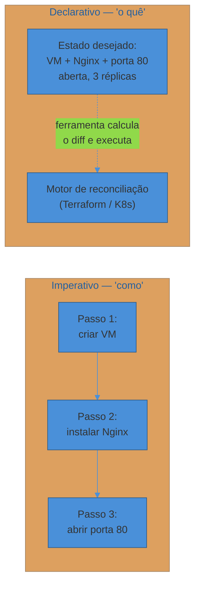
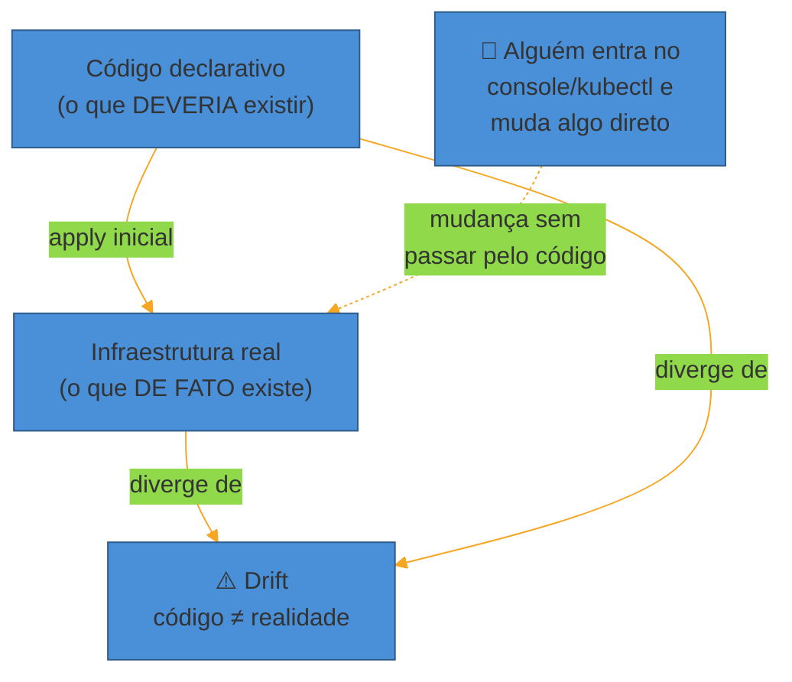
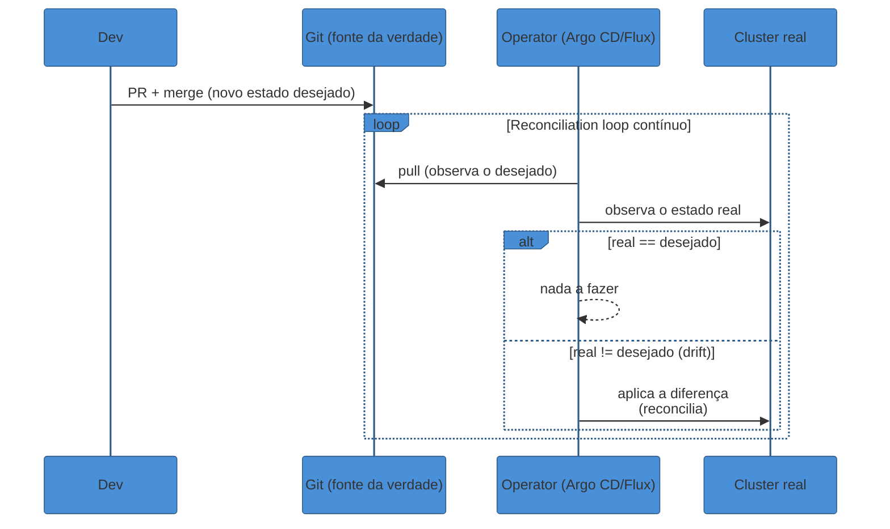

# GitOps e Infrastructure as Code

> [!abstract] TL;DR
> **Infrastructure as Code (IaC)** trata a infraestrutura como qualquer outro artefato de software: descrita em arquivos versionados, revisada em PR, aplicada de forma repetível — em vez de configurada à mão em consoles e terminais SSH. A distinção que mais importa é **declarativo vs imperativo**: declarativo (Terraform, Kubernetes) descreve o **estado desejado** e deixa a ferramenta calcular o caminho; imperativo (scripts, Ansible em boa parte do uso) descreve os **passos** a executar. Declarativo é **idempotente** — aplicar duas vezes dá o mesmo resultado — e habilita o ciclo **plan/apply**: ver o diff antes de comprometer a mudança. O problema que qualquer infra viva enfrenta é o **drift**: alguém mexeu na mão, e o estado real diverge silenciosamente do código. **GitOps** leva esse princípio ao extremo operacional: o **Git é a única fonte da verdade** do estado desejado, e um **operator** dentro do cluster (Argo CD, Flux) fica **puxando** (pull, não push) essa verdade e **reconciliando continuamente** qualquer desvio — os quatro princípios do OpenGitOps. O ganho não é estético: é auditoria automática (todo change é um commit), rollback trivial (`git revert`), e recuperação de desastre que não depende de ninguém lembrar o que fez.

Era sexta-feira, 17h. Um analista de infraestrutura entrou no console da AWS, abriu o security group do banco de staging, e adicionou uma regra liberando a porta 5432 para o IP do notebook dele — só para debugar um problema rápido antes do fim de semana. Resolveu o problema. Foi embora. Esqueceu de remover a regra.

Três meses depois, alguém tentando reproduzir um bug percebeu que staging se comportava diferente de produção de um jeito que não fazia sentido nenhum: uma conexão que devia estar bloqueada simplesmente funcionava. Ninguém no time lembrava de ter mudado aquele security group. Não havia PR, não havia commit, não havia ticket. A única evidência era um log de CloudTrail perdido em meio a milhares de outras entradas, e ninguém pensou em procurar ali primeiro — porque, na cabeça de todo mundo, a infraestrutura de staging era "a mesma" de produção, só que menor.

Esse é o problema que este texto chama de **snowflake server**: um ambiente que, depois de meses de ajustes manuais — aqui uma variável de ambiente mudada às pressas, ali uma porta liberada, adiante um pacote instalado direto via SSH para resolver um incidente — se torna **único e não reproduzível**. Ninguém consegue recriá-lo do zero. Se esse servidor morrer, a recuperação não é "rodar um script": é uma investigação arqueológica sobre o que, exatamente, o tornava capaz de funcionar.

A resposta da indústria a esse problema tem duas camadas que se encaixam. A primeira é **Infrastructure as Code**: parar de configurar infraestrutura na mão e começar a descrevê-la em arquivos versionados, do mesmo jeito que se descreve lógica de aplicação. A segunda, mais recente e mais radical, é **GitOps**: não bastar versionar a infraestrutura — fazer do próprio repositório Git o **único lugar** de onde o estado real do sistema pode divergir, com um agente automatizado garantindo que nunca diverja por muito tempo.

## Infrastructure as Code: infraestrutura como artefato, não como ritual

**Infrastructure as Code (IaC)**, na definição que a HashiCorp usa em sua própria documentação, é o processo de gerenciar e provisionar infraestrutura através de código, de forma segura, consistente e repetível — em vez de através de processos manuais. A palavra que carrega o peso ali é "repetível": o objetivo não é só *documentar* a infraestrutura em texto (isso um runbook também faz), é fazer com que a execução daquele texto **produza sempre o mesmo resultado**, seja a primeira vez que roda ou a centésima.

Antes do IaC virar prática padrão, o fluxo comum era: alguém abre o console do provedor de nuvem (ou faz SSH numa máquina), clica ou digita comandos, e a infraestrutura passa a existir — mas só na cabeça de quem fez aquilo, e no estado transiente daquela sessão. Recriar esse ambiente meses depois — para um novo integrante do time, para um ambiente de disaster recovery, para replicar um bug — significa reconstruir de memória uma sequência de passos que ninguém escreveu.

Com IaC, a infraestrutura vira um **artefato**: um conjunto de arquivos que descreve servidores, redes, bancos, filas, permissões. Esse artefato pode ser versionado no mesmo Git que guarda o código da aplicação, revisado em pull request pelos mesmos princípios de code review, testado em pipeline, e — esse é o ponto que fecha o círculo com a nota anterior desta trilha — aplicado através do mesmo tipo de disciplina que aplicamos a mudanças de schema de banco: prever o efeito antes de comprometer.

> [!question]- IaC não é só "escrever um script de shell que instala tudo"?
> Tecnicamente, um script de shell que roda `apt install` e configura arquivos também é "infraestrutura descrita em código" — e durante anos foi assim que o setup de servidor era automatizado (os primeiros scripts de provisioning, pré-Chef/Puppet/Ansible, eram exatamente isso). A diferença que IaC moderno adicionou não é "ter código", é **duas propriedades que um script solto normalmente não tem**: idempotência (rodar de novo não quebra nem duplica nada) e um modelo de estado que permite calcular *o que vai mudar* antes de mudar. Um script imperativo cru geralmente falha ou se comporta de forma imprevisível se rodado duas vezes sobre um ambiente que já foi parcialmente configurado — é aí que a distinção declarativo/imperativo, a seguir, se torna prática, não acadêmica.

## Declarativo vs imperativo: a diferença que realmente importa

A pergunta central que separa as ferramentas de IaC entre si é: **você descreve o que quer, ou descreve como chegar lá?**

O estilo **imperativo** é uma sequência de comandos: "crie uma VM", "depois instale o Nginx", "depois abra a porta 80", "depois copie esse arquivo de config". É a lógica de um script bash tradicional — e também, em boa parte do seu uso mais comum, de ferramentas como o **Ansible**: um playbook Ansible tipicamente lista, em ordem, os passos que devem acontecer num host-alvo. O estilo imperativo responde à pergunta *como*.

O estilo **declarativo** descreve o **estado final desejado** — "eu quero uma VM com essas specs, com o Nginx instalado, com a porta 80 aberta" — e deixa a ferramenta descobrir sozinha os passos necessários para chegar lá a partir do estado atual, seja qual for esse estado atual. **Terraform** e **Kubernetes** são os exemplos canônicos: você não diz "crie o pod"; você diz "eu quero 3 réplicas rodando esta imagem", e o sistema calcula a diferença entre o que existe e o que foi pedido, e só faz o necessário para fechar essa diferença. O estilo declarativo responde à pergunta *o quê*.

A vantagem prática do declarativo não é estilística — é operacional, e aparece em três lugares:

**Idempotência.** Rodar a mesma configuração declarativa duas vezes seguidas, sobre um sistema que já está no estado desejado, não faz nada — porque não há nada para reconciliar. Rodar o mesmo script imperativo duas vezes pode instalar o pacote de novo, duplicar uma regra de firewall, ou falhar porque o recurso "já existe". Idempotência é o que torna seguro reexecutar uma automação sem pensar demais sobre o estado atual do mundo.

**Cálculo do diff antes de agir.** Porque a ferramenta declarativa sabe o estado desejado *e* consegue observar o estado atual, ela consegue calcular — e mostrar para um humano — exatamente o que vai mudar, **antes** de mudar. É o fluxo `plan`/`apply` do Terraform: `terraform plan` produz um relatório do que seria criado, alterado ou destruído; só depois de revisar esse relatório é que `terraform apply` executa. Essa etapa intermediária de revisão é, na prática, o mesmo princípio do code review aplicado à infraestrutura: ver o efeito antes de comprometer.

**Convergência independente do ponto de partida.** Um sistema declarativo converge para o estado desejado seja qual for o estado atual — recuperando de uma VM deletada manualmente, de um recurso criado fora de banda, de uma falha parcial no meio de uma aplicação anterior. Um script imperativo, em contraste, geralmente assume um ponto de partida específico; se o mundo real não bate com essa suposição, o script quebra ou faz a coisa errada.

> [!warning] Confundir "declarativo" com "sem lógica nenhuma"
> **O que acontece:** um time olha um arquivo `.tf` cheio de `for_each`, condicionais e módulos parametrizados e conclui que aquilo não é "realmente declarativo" — porque tem lógica. **Por quê:** declarativo não significa "sem expressividade computacional" — significa que o *resultado* que você escreve é um estado, não uma sequência de ações. Terraform tem uma linguagem de expressões (HCL) rica o bastante para gerar configuração condicionalmente, iterar sobre listas, referenciar outputs de outros módulos — mas o produto final continua sendo "aqui está o grafo de recursos que eu quero que exista", não "aqui estão os quinze passos para chegar lá". **Como evitar:** a pergunta que separa os dois estilos não é "tem lógica ou não" — é "se eu rodar isso de novo amanhã, sem saber o estado atual, o resultado é seguro e previsível?" Se a resposta é sim, é declarativo o suficiente para os efeitos práticos que importam aqui.

## O state file, o provisioning e o problema do drift

O Terraform precisa saber a diferença entre "o que existe" e "o que deveria existir" para calcular seu plano — e para isso mantém um **state file**: um registro de quais recursos reais (com seus IDs específicos no provedor) correspondem a quais blocos de configuração. O state file é, na prática, a memória do Terraform sobre o mundo — e por isso times de produção o guardam em armazenamento remoto compartilhado e travado (não no laptop de ninguém), exatamente pela mesma razão que ninguém guardaria o banco de produção só na máquina local de um desenvolvedor.

É esse mesmo mecanismo — comparar estado real contra estado desejado — que expõe o problema central de qualquer infraestrutura viva: o **drift**. Drift é a divergência gradual entre o que o código diz que deveria existir e o que de fato existe, causada por mudanças feitas fora do fluxo de IaC — alguém que entrou no console para "só resolver rápido", um script de emergência que ajustou algo direto, uma automação de terceiro que mexeu num recurso que o Terraform também gerencia.

O security group da história de abertura é drift em estado puro: uma mudança manual, bem-intencionada, sem registro, que diverge silenciosamente do que o código (se existisse) diria. Drift é perigoso não porque a mudança em si seja necessariamente ruim — às vezes é uma correção legítima e urgente — mas porque ela **não é visível** para quem olha o código-fonte da infraestrutura. O código mente sobre o que realmente está rodando.

A resposta convencional a esse problema, no mundo pré-GitOps, é a **detecção de drift**: rodar `terraform plan` periodicamente (num cron, num pipeline agendado) e alertar se o plano não estiver vazio — se houver diferença entre estado desejado e estado real, alguém mudou algo fora do fluxo. Isso funciona, mas é **detecção**, não **correção**: alguém ainda precisa olhar o alerta, decidir se o drift é intencional ou um problema, e rodar `apply` manualmente para corrigir. É exatamente esse último passo — automatizar a correção, não só a detecção — que o GitOps ataca.

## Terraform (provisioning) e Ansible (configuration management): dois papéis, não concorrentes

Vale nomear onde cada ferramenta canônica de IaC entra, sem entrar em sintaxe — o objetivo aqui é o conceito, não o tutorial.

**Terraform** é a ferramenta mais associada a **provisioning**: criar, modificar e destruir os recursos de infraestrutura em si — VMs, redes, bancos gerenciados, filas, buckets, os "blocos" que compõem o ambiente. É declarativo, mantém state, e assume que a infraestrutura tende ao **imutável**: em vez de alterar um recurso existente in-place, muitas vezes o padrão é destruir e recriar com a nova configuração, porque isso elimina a categoria inteira de "esse recurso está num estado esquisito por causa de mudanças acumuladas" — o mesmo raciocínio, adaptado, que motiva containers imutáveis (coberto no sub-galho 3 desta trilha).

**Ansible** é a ferramenta mais associada a **configuration management**: uma vez que a máquina existe, o que rodar dentro dela — quais pacotes instalar, quais arquivos de configuração colocar, quais serviços iniciar. Ansible não mantém um state file: ele verifica, a cada execução, se cada tarefa já está satisfeita (o pacote já está instalado? o arquivo já tem esse conteúdo?) e só age onde há divergência — uma forma mais leve de idempotência, task por task, sem o grafo de dependências explícito que o Terraform constrói. E, diferente do Terraform, Ansible assume infraestrutura **mutável** por padrão: ele existe justamente para ajustar máquinas que já estão rodando.

Na prática, as duas ferramentas raramente competem — elas se complementam num pipeline: Terraform provisiona a VM (ou o cluster), Ansible entra depois para configurar o que roda dentro dela. Em ambientes centrados em Kubernetes — que é o pano de fundo mais comum desta trilha — o papel do Ansible tende a encolher, porque o próprio Kubernetes (via manifests declarativos e operators) assume boa parte do trabalho de "configurar o que roda dentro do cluster" que antes seria Ansible.

> [!question]- Por que não usar só Ansible para tudo, já que ele também descreve infraestrutura como código?
> Porque provisioning e configuration management resolvem problemas de natureza diferente. Provisionar significa criar/destruir recursos que têm identidade e ciclo de vida próprios num provedor externo (uma VM tem um ID, uma dependência de rede, um custo de billing) — e isso pede um modelo de state explícito, exatamente o que o Terraform mantém. Configurar o que roda dentro de um recurso já existente é uma tarefa mais leve e repetitiva, sem necessidade de rastrear identidade externa — Ansible foi desenhado para isso, com o custo operacional de manter state reduzido de propósito. Usar Ansible para provisionar recursos de nuvem é possível (existem módulos para isso), mas geralmente significa reimplementar, por fora, o controle de state que o Terraform já resolve nativamente.

## GitOps: levar o IaC ao extremo operacional

Infrastructure as Code resolve "a infraestrutura está descrita em código versionado". Mas isso, sozinho, não impede o drift — nada garante que o código seja de fato a única forma de mudar o ambiente; ele é só *uma* forma, entre várias, se ninguém aplicar disciplina.

**GitOps** é a resposta a essa lacuna: um conjunto de práticas, formalizado a partir de um blog post da Weaveworks em 2017 (Alexis Richardson, CEO da empresa, cunhou o termo em "Operations by Pull Request", publicado em março daquele ano), que transforma o Git de "um lugar onde a infraestrutura *também* está descrita" em "o **único** lugar de onde mudanças de infraestrutura são permitidas partir". A ideia nasceu da experiência da própria Weaveworks operando Kubernetes em produção em escala — e Kubernetes, por sua natureza já fortemente declarativa e orientada a reconciliação contínua, se tornou o habitat natural do GitOps.

A organização OpenGitOps (parte da CNCF) formalizou essa prática em **quatro princípios**, que funcionam como um checklist objetivo do que "fazer GitOps de verdade" significa:

1. **Declarativo** — o estado desejado do sistema é expresso como dados (manifests YAML, arquivos de configuração), não como uma sequência de comandos avulsos.
2. **Versionado e imutável** — esse estado desejado vive num sistema de controle de versão (Git, ou um registro OCI com artefatos fixados por digest) que preserva histórico completo e integridade — cada mudança tem autor, timestamp e identidade.
3. **Pulled automaticamente** — agentes de software dentro do ambiente-alvo **puxam** a declaração de estado desejado da fonte; ninguém empurra a mudança de fora para dentro.
4. **Continuamente reconciliado** — os mesmos agentes observam continuamente o estado real e agem para trazê-lo de volta ao estado desejado, sempre que os dois divergem.

O terceiro princípio — **pull, não push** — é o que mais surpreende quem vem do modelo tradicional de deploy (CI/CD clássico, coberto na nota 01 deste sub-galho, onde o pipeline **empurra** artefatos para o ambiente-alvo usando credenciais que apontam *para fora*). No modelo pull, é o inverso: um agente **dentro** do cluster observa o repositório e traz a mudança para dentro, sem que o cluster jamais precise expor credenciais de escrita para um sistema externo.

Repare que esse loop roda **continuamente**, não só no momento de um deploy. Se alguém entrar no cluster com `kubectl edit` e mudar algo manualmente — o mesmo tipo de gesto que gerou o security group esquecido da abertura —, o operator detecta essa divergência no próximo ciclo de reconciliação (tipicamente segundos a poucos minutos) e **reverte a mudança manual de volta ao que o Git diz**. O drift não fica esperando alguém notar: ele é corrigido automaticamente, ou pelo menos sinalizado com alta frequência.

**Argo CD** e **Flux** são os dois operators dominantes que implementam esses princípios sobre Kubernetes. Arquiteturalmente eles divergem — Argo CD tende a um modelo de controle mais centralizado, com uma UI rica e um "motor" que renderiza manifests (via Helm, Kustomize, YAML puro) antes de aplicar; Flux instala controllers nativos em cada cluster, cada um convergindo de forma independente, sem um plano central — mas ambos implementam o mesmo contrato: pull, comparação contínua, reconciliação automática. A escolha entre eles é uma decisão de ferramenta, não de princípio; o conceito de GitOps é o mesmo nos dois.

> [!question]- GitOps é só "CI/CD, mas puxando em vez de empurrando"?
> É uma boa primeira aproximação, mas a diferença vai além da direção do fluxo. Num pipeline CI/CD clássico, o pipeline decide *quando* aplicar a mudança — ele roda uma vez, aplica, e termina. Num operator GitOps, a reconciliação **nunca termina**: o loop roda o tempo todo, mesmo quando ninguém fez deploy nenhum, exatamente para pegar drift que aconteceu por qualquer outro motivo. É a diferença entre "aplicar uma mudança" (evento único) e "manter uma garantia" (processo contínuo). Essa continuidade é o que torna GitOps também uma ferramenta de recuperação de desastre: se o cluster inteiro cair e for recriado do zero, apontar o operator para o mesmo repositório reconstrói o estado inteiro sem que ninguém precise lembrar manualmente do que existia.

## Os benefícios que justificam a disciplina extra

GitOps impõe uma disciplina real — nada de "só ajustar rapidinho no console" — e essa disciplina só vale a pena pelos ganhos que ela compra:

**Auditoria de graça.** Se toda mudança de infraestrutura passa por um PR mergeado, o histórico de `git log` já é o registro de auditoria completo: quem mudou o quê, quando, e por quê (a descrição do PR). Nenhuma ferramenta extra de compliance precisa ser mantida em paralelo — o Git já é essa ferramenta.

**Rollback como um comando, não como uma reconstrução.** Reverter uma mudança de infraestrutura ruim é `git revert` seguido de merge — o operator detecta o novo estado desejado (que é, na prática, o estado anterior) e reconcilia de volta automaticamente. Compare isso com o mundo pré-IaC, em que reverter uma mudança manual significa alguém lembrar exatamente o que mudou e desfazer manualmente, na ordem certa, sob pressão.

**Recuperação de desastre sem arqueologia.** Se um cluster inteiro precisa ser recriado — hardware falhou, uma região caiu, um erro humano destruiu recursos — o processo de recuperação é apontar um cluster novo para o mesmo repositório e deixar o operator reconciliar. Não existe um "só a pessoa X sabe como esse ambiente foi montado" porque o "como" nunca dependeu de memória humana.

**Um fluxo de trabalho que devs já conhecem.** Pedir para um time de infraestrutura adotar uma ferramenta de ticketing exótica é atrito; pedir para eles abrirem um PR é o mesmo fluxo que já usam para código de aplicação. GitOps recicla o processo de revisão que o time de desenvolvimento já pratica — branch, PR, review, merge — em vez de inventar um processo paralelo só para infraestrutura.

> [!warning] Tratar GitOps como "só instalar Argo CD e pronto"
> **O que acontece:** um time instala Argo CD, aponta para um repositório, e considera a migração para GitOps concluída — mas continua permitindo `kubectl apply` manual "em emergências", e ninguém remove os acessos de escrita direta ao cluster. **Por quê:** os quatro princípios do OpenGitOps não são satisfeitos parcialmente. Se existe qualquer caminho de escrita para o cluster que não passa pelo Git — mesmo que "só para emergência" —, o cluster deixa de ter uma fonte única da verdade, e o próprio operator vai brigar com essas mudanças manuais a cada ciclo de reconciliação (revertendo o que a pessoa acabou de fazer, o que parece um bug até se entender o princípio). **Como evitar:** GitOps exige revogar (ou pelo menos monitorar rigorosamente) os acessos de escrita direta ao cluster fora do operator. A disciplina do "emergência passa pelo PR também, só que com revisão mais rápida" é mais difícil culturalmente do que instalar a ferramenta — e é onde a maioria das adoções de GitOps realmente falha.

## Onde GitOps não resolve tudo

GitOps não é uma bala de prata, e vale nomear os limites explicitamente antes de fechar esta nota.

**Nem tudo cabe (ou deveria caber) num único repositório Git reconciliado.** Recursos que mudam com muita frequência, de forma automatizada e sem intervenção humana relevante — escalonamento dinâmico baseado em carga, por exemplo — não se beneficiam de passar por PR a cada ajuste; forçar esse fluxo cria fricção sem ganho de auditoria real (ninguém revisa manualmente cem PRs de autoscaling por dia). GitOps brilha onde a mudança é **decidida por humano** e precisa de rastreabilidade; para ajustes de alta frequência dirigidos por métrica, a própria plataforma (HPA, autoscalers) já é a "fonte da verdade" operacional dentro dos limites que o GitOps define.

**Secrets em Git são um problema, não um detalhe.** O quarto princípio do OpenGitOps (continuamente reconciliado) pressupõe que o Git contém tudo que o operator precisa para reconstruir o estado — mas segredos (senhas de banco, chaves de API, certificados) não podem, em texto puro, viver num repositório Git, mesmo privado: um repositório clonado carrega tudo junto, e histórico de Git é, por design, praticamente impossível de apagar de forma confiável. As soluções — segredos criptografados no próprio Git (SOPS, Sealed Secrets) ou referências que apontam para um cofre externo (Vault e afins), resolvidas em runtime pelo operator — são tema da próxima nota desta trilha, porque a decisão de *como* injetar segredo em produção é ampla o bastante para merecer tratamento próprio.

**A curva de adoção é cultural, não só técnica.** Como o warning acima descreveu, GitOps exige abrir mão do reflexo operacional mais antigo que existe — "entrar e resolver na mão" — em favor de sempre passar pelo PR, mesmo sob pressão de incidente. Times que não internalizam essa disciplina acabam com um sistema híbrido, pior que os dois extremos: parte da infraestrutura é GitOps, parte não é, e ninguém tem certeza de qual fonte confiar quando os dois discordam.

> [!question]- Cloud gerenciada (AWS, GCP) muda algo nesse quadro?
> Muda bastante na prática, mas o conceito desta nota — declarativo vs imperativo, drift, GitOps como reconciliação contínua — se aplica igualmente às duas coberturas. A diferença é operacional: em cloud gerenciada, o Terraform provisiona recursos *do provedor* (uma instância RDS, um bucket S3, uma VPC), e o "cluster" que o operator GitOps observa pode nem existir da mesma forma. Esta trilha propositalmente deixa cloud gerenciada fora de escopo (é cobertura futura do vault) — mas o raciocínio sobre declarativo/drift/reconciliação transfere sem alteração, porque é um princípio de como tratar estado desejado versus estado real, não uma particularidade de provedor.

> [!warning] Guardar o state file do Terraform sem lock nem backend remoto
> **O que acontece:** um time começa pequeno, roda `terraform apply` a partir do laptop de cada engenheiro, com o state file salvo localmente ou num bucket sem trava de concorrência. Dois engenheiros rodam `apply` ao mesmo tempo, cada um com uma cópia ligeiramente desatualizada do state, e o resultado é um estado corrompido — recursos duplicados, referências quebradas, ou pior, recursos de produção destruídos porque um apply concorrente "achou" que eles não deveriam mais existir. **Por quê:** o state file é a única fonte que o Terraform tem sobre o que já existe; sem um backend remoto com lock (S3+DynamoDB, Terraform Cloud, um backend de object storage com locking), duas execuções simultâneas escrevem por cima uma da outra sem nenhuma proteção — o mesmo tipo de race condition que qualquer sistema com estado compartilhado sofre sem controle de concorrência. **Como evitar:** backend remoto com locking é requisito mínimo de produção, não otimização — a mesma disciplina que se espera de qualquer estado compartilhado mutável, seja um banco de dados ou um state file de infraestrutura.

## Um exemplo trabalhado: dois incidentes, duas respostas

Para fixar a diferença prática entre o mundo pré e pós-GitOps, vale contrastar dois cenários que resolvem o mesmo tipo de problema de formas opostas.

**Cenário A — sem GitOps, com IaC parcial.** Um time usa Terraform para provisionar sua infraestrutura de cluster, mas o deploy das aplicações dentro do cluster ainda é feito via `kubectl apply` manual, rodado por um engenheiro a partir do próprio laptop, seguindo um runbook. Uma sexta-feira à tarde, sob pressão de lançar uma correção urgente, o engenheiro aplica o manifest direto, sem passar pelo pipeline normal (que estava com fila longa). A correção funciona. Mas na segunda-feira, o pipeline normal roda de novo, a partir do estado que *ele* conhece — que não inclui a correção de sexta — e a reverte sem que ninguém perceba imediatamente, porque nada monitorava esse tipo de divergência. O bug volta.

**Cenário B — com GitOps.** O mesmo time tem um operator (Argo CD) reconciliando continuamente o cluster a partir de um repositório. Sob a mesma pressão de sexta-feira, o engenheiro não tem — por desenho — um caminho de `kubectl apply` direto que sobreviva: mesmo que ele rode o comando manualmente numa emergência real, o operator detecta a divergência no próximo ciclo (minutos depois) e a reverte de volta ao que o Git diz, forçando o engenheiro a fazer a correção *através* do PR, mesmo que seja um PR revisado em cinco minutos por outro sênior de plantão. A correção urgente vira um commit rastreável, versionado, e — crucialmente — não desaparece na segunda-feira, porque agora ela *é* o estado desejado que o operator protege.

A diferença entre os dois cenários não é velocidade (os dois resolvem o incidente na sexta) — é que o Cenário B torna estruturalmente impossível a categoria de bug que o Cenário A sofreu: o estado desejado nunca fica desalinhado da realidade por mais que um ciclo de reconciliação, porque não existe um caminho de escrita que sobreviva fora do Git.

## Em entrevista

GitOps e IaC aparecem em entrevistas sênior menos como pergunta de definição e mais como teste de julgamento sobre disciplina operacional — especialmente em roles com componente forte de plataforma ou SRE.

O que um entrevistador está de fato avaliando quando pergunta sobre isso:

- Se você sabe articular **por que** declarativo importa (idempotência, plan antes de apply) e não só recitar "Terraform é declarativo, Ansible é imperativo" sem explicar a consequência prática de cada escolha.
- Se você entende GitOps como **um princípio de reconciliação contínua**, não como "usar Argo CD" — a resposta fraca nomeia a ferramenta; a resposta forte explica pull vs push e por que isso fecha a categoria inteira de drift silencioso.
- Se você já enfrentou drift na prática e sabe descrever **como** ele aconteceu e **como** foi (ou não foi) detectado — histórias concretas de "alguém mexeu na mão e ninguém sabia" carregam mais peso do que a teoria.
- Se você reconhece os **limites** de GitOps (secrets, recursos de alta frequência) — um candidato que trata GitOps como solução universal, sem nomear onde ele não se aplica bem, sinaliza conhecimento raso.

A resposta forte amarra o conceito a uma decisão concreta de trade-off: "a gente adotou GitOps para o cluster, mas manteve um pipeline push tradicional para os jobs de dados batch, porque a frequência e a natureza dessas mudanças não justificavam PR por execução."

## How to explain in English

GitOps and IaC vocabulary is used in English even inside PT-BR technical conversations — worth locking in the core terms.

> "Infrastructure as Code means describing infrastructure as versioned, reviewable files instead of clicking through a console — and the key distinction is declarative versus imperative: declarative tools like Terraform describe the desired end state and let the tool figure out the steps, which makes them idempotent and lets you preview a diff — plan before apply — before committing to a change. The problem any live infrastructure faces is drift: someone makes a manual change outside the code, and reality silently diverges from what's declared. GitOps takes IaC to its logical extreme: Git becomes the single source of truth for desired state, and an in-cluster operator like Argo CD or Flux continuously pulls that state and reconciles any drift automatically — that's the core of the four OpenGitOps principles: declarative, versioned, pulled, and continuously reconciled."

| PT | EN |
|----|----|
| Infraestrutura como código | Infrastructure as Code (IaC) |
| Declarativo vs imperativo | Declarative vs imperative |
| Estado desejado | Desired state |
| Idempotência / idempotente | Idempotency / idempotent |
| Arquivo de estado | State file |
| Ver o plano antes de aplicar | Plan before apply |
| Desvio de configuração | (Configuration/infrastructure) drift |
| Reconciliação / reconciliar | Reconciliation / reconcile |
| Puxar em vez de empurrar | Pull-based, not push-based |
| Agente/operador dentro do cluster | In-cluster agent / operator |
| Provisionamento | Provisioning |
| Gerenciamento de configuração | Configuration management |
| Servidor floco de neve | Snowflake server |
| Fonte única da verdade | Single source of truth |

## O que vem a seguir

Estabelecemos como a infraestrutura vira código versionado e reproduzível, e como o GitOps fecha o ciclo com reconciliação contínua a partir do Git. Mas todo esse modelo tem um ponto cego óbvio: e os segredos — senha de banco, chave de API, certificado — que a infraestrutura precisa para funcionar, mas que **não podem** viver em texto puro num repositório? A próxima nota deste sub-galho encara exatamente esse problema.

- [[06 - Secrets e configuração em produção]] — por que secrets em Git é perigoso mesmo em repo privado, rotação, injeção em runtime, e onde SOPS/Sealed Secrets/Vault encaixam no fluxo GitOps que esta nota descreveu.

Nota anterior: [[04 - Migrations de banco em produção]] — o mesmo princípio de "ver o efeito antes de comprometer" (plan/apply, expand/contract) aplicado a schema de banco em vez de infraestrutura.

## Veja também

- [[Operação/index|Operação]] — o galho-pai e o mapa completo da trilha
- [[2 - Entrega e release/index|Entrega e release]] — este sub-galho
- [[CI-CD]] — a ferramenta de pipeline que aciona (no modelo push) ou é observada por (no modelo GitOps) as mudanças de infraestrutura
- [[Kubernetes]] — o ambiente declarativo por natureza que tornou GitOps prático em escala

## Fontes

- **OpenGitOps (CNCF)** — [*Principles*](https://github.com/open-gitops/documents/blob/main/PRINCIPLES.md) (github.com/open-gitops, consultado em 2026-07-08) — os quatro princípios formais: declarativo, versionado e imutável, pulled automaticamente, continuamente reconciliado.
- **OpenGitOps** — [opengitops.dev](https://opengitops.dev/) (consultado em 2026-07-08) — porta de entrada do projeto CNCF que formalizou o vocabulário GitOps.
- **HashiCorp Developer** — [*What is Infrastructure as Code with Terraform?*](https://developer.hashicorp.com/terraform/tutorials/aws-get-started/infrastructure-as-code) (consultado em 2026-07-08) — definição de IaC, state file, e o fluxo plan/apply.
- **Alexis Richardson / Weaveworks** — origem do termo GitOps em "Operations by Pull Request", publicado no blog da Weaveworks em março de 2017; contexto recuperado via [SiliconANGLE, *How Weaveworks pioneered GitOps*](https://siliconangle.com/2022/01/20/weaveworks-pioneered-gitops-brought-containers-mainstream-awsshowcases2e1/) (consultado em 2026-07-08).
- **Spacelift** — [*Ansible vs. Terraform*](https://spacelift.io/blog/ansible-vs-terraform) (consultado em 2026-07-08) — a distinção conceitual provisioning (Terraform) vs configuration management (Ansible), mutável vs imutável.
- **IBM** — [*Configuration Drift: What It Is, Why It Happens & How to Fix It*](https://www.ibm.com/think/topics/configuration-drift) (consultado em 2026-07-08) — definição e causas do drift.
- **Northflank** — [*Flux vs Argo CD: Which GitOps tool fits your Kubernetes workflows best?*](https://northflank.com/blog/flux-vs-argo-cd) (consultado em 2026-07-08) — arquitetura comparada dos dois operators dominantes.
- **Harness** — [*GitOps For Secrets Management*](https://www.harness.io/blog/gitops-secrets) (consultado em 2026-07-08) — o problema de secrets em Git e as duas famílias de solução (encriptados no Git vs referência a cofre externo).
