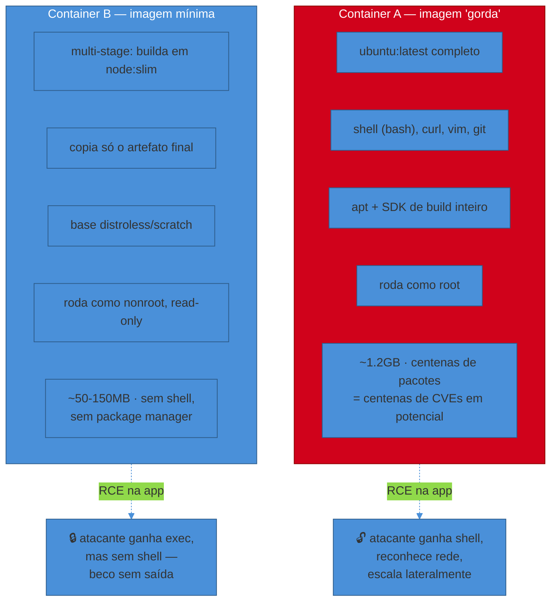
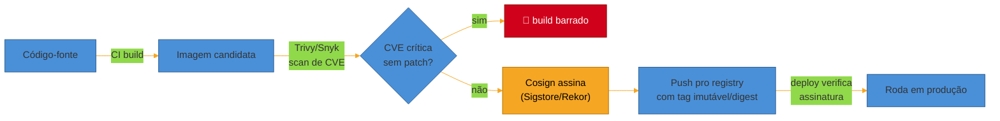

# Containers em produção

> [!abstract] TL;DR
> Uma imagem de 1,2GB baseada em `ubuntu:latest`, rodando como root, com um shell, `curl`, `apt` e o SDK de build inteiro dentro do container — isso funciona perfeitamente em dev. Em produção é o pior dos dois mundos: **lenta pra puxar** (cada deploy espera o pull), **cara de armazenar e transferir** (multiplicada por N réplicas e N ambientes), e uma **superfície de ataque enorme** — uma CVE em qualquer um dos duzentos pacotes que vieram de brinde na imagem base vira porta de entrada, e um shell disponível dentro do container transforma qualquer RCE em playground completo pro invasor. O container de produção é o oposto: **imagem mínima** (multi-stage build, base distroless/scratch/alpine), **imutável** (nunca se altera em runtime — mudou algo, é imagem nova), **non-root, read-only, sem capabilities extras**, **sem segredo e sem estado dentro dela**, e referenciada por **tag imutável ou digest**, nunca `latest`. Este documento assume que você já sabe escrever um Dockerfile e rodar `docker build` — ver o galho de [[03-Dominios/Tecnologia/Infraestrutura/Docker/index|Docker]] pra isso. Aqui o assunto é o que muda quando essa imagem para de ser um experimento local e vira o artefato que vai rodar, sem supervisão humana, servindo tráfego real.

> [!info] A contraparte instrumental (2026-08-02)
> O pressuposto declarado acima deixou de ser um vazio no vault. O galho [[03-Dominios/Tecnologia/Infraestrutura/Docker/index|Tecnologia/Infraestrutura/Docker]] ensina **como a imagem é construída**, sob a lente *a imagem como artefato*: camadas e digest em [[03-Dominios/Tecnologia/Infraestrutura/Docker/02 - A anatomia de uma imagem|02]], o Dockerfile como declaração de camadas em [[03-Dominios/Tecnologia/Infraestrutura/Docker/04 - O Dockerfile como receita de camadas|04]], cache de build em [[03-Dominios/Tecnologia/Infraestrutura/Docker/05 - Build e cache — por que seu build está lento|05]], e multi-stage com a escala de bases mínimas em [[03-Dominios/Tecnologia/Infraestrutura/Docker/09 - Multi-stage e imagens mínimas|09]]. A divisão é deliberada: lá é a **construção**, aqui é a **política** que uma revisão de produção cobra.

## A cena: dois containers, mesma aplicação

Imagine a mesma API Node.js empacotada de duas formas.

**Container A** — o que sai de um Dockerfile escrito rápido, sem pensar em produção:

```dockerfile
FROM ubuntu:latest
RUN apt-get update && apt-get install -y nodejs npm curl vim git
COPY . /app
WORKDIR /app
RUN npm install
CMD ["npm", "start"]
```

Ele funciona. Roda a API, atende requests, passa nos testes manuais. E carrega, sem ninguém ter pedido, um shell completo (`bash`), um editor (`vim`), um cliente HTTP capaz de exfiltrar dados (`curl`), o Git inteiro, o `apt` com acesso a instalar qualquer pacote adicional, e roda tudo isso — inclusive o processo Node — como **root**. A imagem final passa de 1GB. Ninguém fixou a versão do Node: `npm install` de amanhã pode trazer uma dependência transitiva diferente da de hoje, e `ubuntu:latest` de amanhã é um SO diferente do de hoje.

**Container B** — o mesmo código, pensado para produção:

```dockerfile
# ---- estágio de build ----
FROM node:22-slim AS build
WORKDIR /app
COPY package*.json ./
RUN npm ci --omit=dev
COPY . .
RUN npm run build

# ---- estágio final ----
FROM gcr.io/distroless/nodejs22-debian12:nonroot
WORKDIR /app
COPY --from=build --chown=nonroot:nonroot /app/dist ./dist
COPY --from=build --chown=nonroot:nonroot /app/node_modules ./node_modules
USER nonroot
EXPOSE 3000
CMD ["dist/server.js"]
```

Essa imagem final não tem shell, não tem `apt`, não tem `curl`, não tem `npm` — só o runtime do Node e o código compilado. Ela roda como usuário não-root por padrão (a tag `:nonroot` do distroless já vem configurada assim). Ela pesa uma fração do Container A — imagens `distroless/static` chegam a ~2MiB de base, e mesmo a variante com runtime de linguagem fica ordens de grandeza menor que uma `ubuntu` completa. E, o mais importante do ponto de vista de quem opera: se um atacante encontrar uma RCE na aplicação dentro do Container B, ele ganha execução de código — mas não ganha um shell pra explorar a partir dali. Não tem `bash` pra invocar. Não tem `apt install nmap` pra reconhecer a rede. O container vira um beco sem saída.



O resto desta nota destrincha, uma por uma, as decisões que separam A de B.

## Imutabilidade: o container não se conserta, ele se substitui

A primeira mudança de mentalidade, e a mais fundamental, é: **um container em produção não se altera depois de subir.** Nada de `docker exec -it <container> apt install <algo>` pra corrigir uma dependência esquecida. Nada de entrar no container e editar um arquivo de config à mão porque "é só um ajuste rápido". Se algo precisa mudar — código, dependência, config —, o caminho é sempre o mesmo: **muda o Dockerfile ou o artefato de origem, builda uma imagem nova, versiona, faz deploy dela.**

Essa regra não é purismo estético. Ela é o que torna o sistema **operável**: se dois containers da mesma versão podem ter conteúdos diferentes (porque alguém corrigiu um à mão e esqueceu do outro), você perdeu a capacidade de raciocinar sobre o que está rodando. Um incidente às 3h vira "por que esse pod se comporta diferente dos outros três?" — e a resposta, sem imutabilidade, pode ser "porque alguém mexeu nele semana passada e ninguém documentou".

Essa é exatamente a lógica do 12-Factor que a nota anterior deste sub-galho detalhou: o fator **V — Build, release, run** exige que esses três estágios sejam **estritamente separados e o release seja imutável** (ver [[02 - O contrato de uma app operável (12-Factor)|O contrato de uma app operável]]), e o fator **IX — Disposability** trata processos como descartáveis, substituíveis a qualquer momento sem drama. Um container que se "conserta" em runtime viola os dois ao mesmo tempo: ele deixa de ser um artefato imutável e deixa de ser seguro de descartar, porque descartá-lo perde um estado que só existia naquela instância específica.

> [!question]- E hotfix urgente — não dá pra simplesmente entrar e corrigir rápido?
> A tentação é real quando o incidente está ativo e "é só uma linha". Mas o hotfix ainda passa pelo mesmo caminho: você edita o código-fonte (ou a config declarada), builda uma imagem nova — que pode levar segundos com cache de layer bem desenhado — e faz deploy dela. A diferença entre isso e editar o container vivo não é velocidade (o build costuma ser rápido o bastante), é **rastreabilidade**: a imagem nova tem uma tag, um commit associado, um registro de quem mudou o quê e quando. Editar o container vivo é uma mudança que não deixa rastro nenhum além da memória de quem fez — e que desaparece na próxima vez que o pod reiniciar, deixando você com o mesmo bug de volta sem aviso.

## Imagem mínima: multi-stage build e a escolha da base

O Container B do exemplo acima usa duas técnicas que, juntas, definem "imagem mínima" em produção.

**Multi-stage build.** Você compila (ou instala dependências de build) num estágio que tem tudo que o processo de build precisa — compilador, headers de desenvolvimento, ferramentas de empacotamento — e copia **só o artefato final** para um segundo estágio, que é o que efetivamente vira a imagem publicada. O primeiro estágio nunca chega ao registry; ele existe só durante o `docker build` e desaparece depois. Isso resolve um problema que Dockerfiles ingênuos carregam sem perceber: o compilador do TypeScript, o toolchain de build do Go, o `gcc` usado pra compilar uma dependência nativa — nada disso precisa estar presente quando o processo já está compilado e rodando. Um caso real documentado: subir a versão do Node e aplicar multi-stage + distroless levou uma imagem de 380MB para 60MB, eliminando dependências de build que não tinham motivo de estar no runtime.

**Base mínima.** Depois do multi-stage, ainda resta escolher a imagem base do estágio final. As opções, da mais gorda pra mais enxuta:

| Base | O que carrega | Tamanho típico | Quando faz sentido |
|---|---|---|---|
| `ubuntu`/`debian` completo | SO inteiro, shell, package manager, centenas de utilitários | ~100-200MB só de base | Raramente, em produção — bom pra debug interativo |
| `-slim` (ex. `node:22-slim`) | SO reduzido, ainda com shell e alguns utilitários | ~50-80MB | Estágio de **build**, não o final |
| `alpine` | musl libc, shell (`ash`), `apk` — bem menor, mas não vazio | ~5MB de base | Quando você precisa de shell/debug ocasional e aceita o trade-off de libc diferente (musl vs glibc, que já causou bugs sutis de compatibilidade binária) |
| `distroless` (Google) | Só o runtime da linguagem + libs mínimas — **sem shell, sem package manager** | ~2MB (`static`) a ~20-50MB (com runtime de linguagem) | Produção, quando a aplicação não precisa de shell dentro do container |
| `scratch` | Literalmente vazio — nem libc | 0MB de base | Binários estaticamente linkados (Go compilado com `CGO_ENABLED=0`, Rust) |

O porquê de ir na direção enxuta não é só estética de tamanho — é uma cadeia causal com três elos: **imagem menor → pull mais rápido** (relevante em rolling deploy e em autoscaling, onde cada réplica nova precisa puxar a imagem antes de ficar pronta) **→ menos storage e transferência** (multiplicado por registry, por réplicas, por ambientes) **→ menos pacotes → menos CVEs em potencial**. Esse último elo é o mais citado por quem trabalha com scanner de vulnerabilidade: cada pacote na imagem é candidato a aparecer num relatório de CVE; uma distro completa carrega centenas deles, a maioria nunca usada pela sua aplicação, mas todos contando pro relatório de segurança e pro tempo gasto triando falsos positivos.

> [!warning] Confundir "imagem pequena" com "imagem segura"
> **O que acontece:** o time troca `ubuntu` por `alpine`, vê o tamanho cair de 800MB pra 40MB, e risca "segurança" da lista de pendências. **Por quê:** tamanho e superfície de ataque correlacionam, mas não são a mesma coisa. Uma imagem `alpine` ainda tem shell (`ash`) e `apk` — um atacante com RCE ainda consegue abrir um shell e instalar ferramentas, só que a partir de um SO menor. E imagem pequena não impede rodar como root, não impede filesystem gravável, não impede segredo hardcoded na imagem. **Como evitar:** tratar tamanho como um proxy útil, não como a métrica final. As perguntas que realmente importam são: essa imagem tem shell? Tem package manager? Roda como root? Tem CVE conhecida nas dependências que carrega (rode um scanner, não confie no tamanho como aproximação)? `distroless`/`scratch` respondem "não" às duas primeiras por construção; `alpine` não.

## Segurança do container: non-root, read-only, capabilities

Reduzir o que está *dentro* da imagem é metade do trabalho. A outra metade é restringir o que o container tem **permissão de fazer** em runtime, mesmo que algo dentro dele seja comprometido.

**Rodar como non-root.** Por padrão, um container Docker roda o processo principal como `root` — não porque a aplicação precise, mas porque ninguém trocou. O `USER` directive no Dockerfile (ou o `securityContext.runAsNonRoot` no Kubernetes) muda isso. O motivo não é sutil: `root` *dentro* do container, sem user namespace remapping, tem o mesmo UID 0 que o `root` do host — se o atacante encontrar uma forma de escapar do isolamento do container (uma CVE de kernel, uma configuração de volume mal feita), a diferença entre "comprometeu um processo sem privilégio" e "comprometeu root no host" é exatamente esse `USER` que alguém esqueceu de setar. Imagens distroless já vêm com uma tag `:nonroot` pronta para isso; construir a sua própria imagem exige criar o usuário e ajustar permissões de arquivo explicitamente.

**Filesystem read-only.** Se a aplicação não precisa escrever no próprio filesystem em runtime (a maioria das APIs stateless não precisa — ver a seção seguinte), monte o container inteiro como somente-leitura (`--read-only` no Docker, `readOnlyRootFilesystem: true` no K8s) e libere, explicitamente, só os diretórios que realmente exigem escrita (ex. `/tmp`, via volume `tmpfs`). Isso fecha uma classe inteira de ataque: um invasor com RCE não consegue sobrescrever o próprio binário da aplicação, plantar um backdoor no filesystem, ou modificar arquivos de configuração pra persistir acesso — porque não há onde escrever.

**Drop de capabilities.** O kernel Linux divide os privilégios de root em ~40 *capabilities* granulares (`CAP_NET_ADMIN`, `CAP_SYS_ADMIN`, etc.), e o Docker já concede um subconjunto reduzido por padrão — mas ainda mais do que a maioria das aplicações usa. A prática recomendada é começar de `--cap-drop ALL` e devolver, uma por uma, só as capabilities que a aplicação genuinamente precisa (a maioria não precisa de nenhuma extra). Junto disso, nunca rodar com `--privileged`, que desativa praticamente todo o isolamento do container e concede acesso equivalente ao host.

**Escanear a imagem por CVE.** Nenhuma das práticas acima substitui checar, explicitamente, se as dependências empacotadas na imagem têm vulnerabilidade conhecida. Ferramentas como **Trivy** (hoje o scanner open-source de facto recomendado pela CNCF) ou **Snyk Container** rodam no pipeline de CI, geram um SBOM (Software Bill of Materials — o inventário de tudo que está na imagem) e barram o build se encontrarem CVE crítica sem patch. Esse é o gate de segurança automatizado que a trilha de [[05 - SAST e SCA para código AI|SCA]] descreve pra dependências de código-fonte, aplicado agora à imagem final.

**Assinar a imagem (supply chain).** Um passo além do scan é garantir que a imagem que está rodando em produção é *exatamente* a que passou pelo pipeline — não uma versão adulterada entre o build e o deploy. **Cosign** (parte do projeto Sigstore) assina a imagem no CI usando um certificado de curta duração emitido via OIDC (sem gerenciar chave privada manualmente — "keyless signing"), e registra a assinatura num log de transparência imutável (Rekor). O deploy, então, pode exigir verificação dessa assinatura antes de rodar a imagem — fechando o elo entre "o que foi buildado" e "o que está rodando".



> [!question]- Isso não é excesso de processo pra um time pequeno?
> Escalona com o risco, não é tudo-ou-nada. Scan de CVE (Trivy) é barato de adotar — uma etapa no CI, minutos de execução, e já elimina a classe mais comum de vulnerabilidade conhecida chegando em produção sem ninguém perceber. Non-root, read-only e drop de capabilities também custam pouco (algumas linhas de manifesto) uma vez que você sabe que precisa deles. Assinatura de imagem (Cosign/supply chain completo) é o degrau mais alto — vale a pena quando a organização já tem múltiplos times publicando pra um registry compartilhado, ou quando compliance/regulação exige proveniência auditável. Comece pelos dois primeiros; eles cobrem a maior parte do risco prático.

## O que não colocar num container de produção

Três categorias que parecem convenientes em dev e viram problema sério em produção:

**Segredos.** Nunca faça `COPY .env .` ou passe uma chave de API como `ARG`/`ENV` hardcoded no Dockerfile — qualquer um com acesso à imagem (inclusive pelo histórico de layers, mesmo que você delete o arquivo num layer posterior) consegue extrair o segredo. Segredo é injetado em **runtime**, via variável de ambiente vinda de um secret manager ou via volume montado pelo orquestrador — o assunto completo, incluindo rotação e os motivos técnicos por trás de cada mecanismo, está em [[06 - Secrets e configuração em produção]].

**Estado.** O container é **efêmero por design** — ele pode ser morto e substituído a qualquer momento (por um deploy, por um crash, pelo autoscaler reduzindo réplicas), e tudo que estava só no filesystem dele some junto. Sessão de usuário em memória, upload gravado em disco local, cache que ninguém mais tem cópia — nada disso sobrevive ao próximo restart. O padrão correto é externalizar: sessão vai pra um backing service (Redis, ver fator IV do 12-Factor), upload vai pra object storage, e o próprio filesystem do container, como visto acima, idealmente é read-only.

**Múltiplos processos.** Um container roda **um processo principal** (a aplicação), não a aplicação mais um cron, mais um proxy, mais um agente de log, todos gerenciados por um supervisor dentro do mesmo container. Cada responsabilidade extra que "cabe fácil" dentro do mesmo container quebra o isolamento de falha (um processo trava, o healthcheck do container inteiro fica confuso sobre o que reportar), o log fica misturado, e escalar fica impossível de granularizar (você não consegue escalar só o proxy sem escalar a app junto). O padrão que resolve isso em produção é o **sidecar**: cada responsabilidade auxiliar — proxy de service mesh, agente de coleta de log, agente de métricas — vira seu próprio container, rodando ao lado do container principal no mesmo Pod (no vocabulário do Kubernetes), comunicando-se por `localhost`. A nota seguinte deste sub-galho, sobre o contrato de produção do Kubernetes, retoma esse desenho.

> [!warning] Empacotar um supervisor de processos (`supervisord`, `pm2 -i`) pra "resolver" múltiplos processos
> **O que acontece:** o time percebe que precisa de mais de um processo dentro do container — a app e, digamos, um agente de log — e resolve empacotando um supervisor de processos (`supervisord`, `pm2` em modo cluster) dentro da mesma imagem pra gerenciar os dois. **Por quê:** isso reintroduz exatamente o problema que a imagem mínima tentava eliminar — mais uma camada de software rodando como PID 1, mais um ponto de falha que não aparece isolado no healthcheck do container (o supervisor reporta "saudável" mesmo se um dos processos filhos morreu), e mais peso/superfície de ataque na imagem. É pegar o antipadrão do "processo demais" e só trocar de forma. **Como evitar:** cada responsabilidade vira seu próprio container. É mais manifesto YAML pra escrever, mas cada processo tem seu próprio healthcheck, seus próprios limites de recurso, e uma falha num não mascara nem derruba o outro.

## O container como unidade de deploy e de escala

Um efeito colateral de levar imutabilidade e estatelessness a sério: o container deixa de ser "onde a aplicação mora" e vira a **unidade atômica de deploy e de escala**. Você não escala uma aplicação ajustando threads ou processos dentro de um container gigante — você escala **replicando o container**, cada réplica idêntica, cada uma capaz de atender qualquer request sem depender de estado local nas outras. É essa propriedade — réplicas idênticas e substituíveis — que torna o autoscaling automático possível (assunto do sub-galho 3-04), e que faz de "quantos containers eu preciso" uma pergunta de capacity planning, não uma pergunta de arquitetura de processo.

O corolário prático é o **resource footprint**: cada container declara quanta CPU e memória espera consumir (o detalhe de `requests`/`limits` é o contrato do Kubernetes, coberto na próxima nota), e imagem enxuta ajuda aqui também — menos I/O de pull, menos memória gasta com bibliotecas que nunca são usadas, startup mais rápido (relevante pra autoscaling responsivo e pra rolling deploy sem gap de capacidade).

## Health do container: o `HEALTHCHECK` que ninguém vê de fora

Uma consequência direta de rodar imagens sem shell é que você perde a possibilidade de "entrar e ver se está tudo bem" — não tem `docker exec -it <container> bash` pra checar manualmente, porque não tem `bash`. Isso empurra uma exigência que muita gente só descobre na hora que precisa: **a aplicação precisa expor sua própria saúde**, de um jeito que o orquestrador consiga checar de fora, sem depender de ferramentas interativas dentro do container.

No nível do Docker isso é a instrução `HEALTHCHECK` no Dockerfile — um comando que o daemon roda periodicamente, e cujo código de saída (0 = saudável, 1 = não saudável) alimenta o status do container. No nível do Kubernetes, esse mesmo princípio se desdobra em três tipos de probe diferentes (liveness, readiness, startup), cada um respondendo uma pergunta operacional distinta — "este processo travou e precisa reiniciar?", "este processo está pronto pra receber tráfego agora?", "este processo ainda está inicializando?". O detalhe fino disso é assunto da próxima nota deste sub-galho; o que importa aqui é o motivo de a distinção existir: sem ela, o orquestrador só sabe se o processo está *rodando* (o PID existe), não se está *saudável* (capaz de responder corretamente) — e um container "rodando mas travado" recebendo tráfego é pior do que um container reiniciado a tempo.

> [!question]- Um container sem `HEALTHCHECK` simplesmente não funciona?
> Funciona, no sentido de que o processo sobe e atende requests. O que falta é a rede de segurança: sem healthcheck, o único sinal que o orquestrador tem de que algo está errado é o processo *morrer* de vez (crash, OOM kill) — um deadlock, uma conexão de banco travada indefinidamente, ou um vazamento de memória lento não derrubam o processo, só o deixam inútil enquanto continua "rodando" e recebendo tráfego que ele não consegue processar. Esse é exatamente o tipo de degradação silenciosa que health checks bem desenhados existem para capturar antes que vire um incidente maior.

## Tags imutáveis: nunca `latest` em produção

Uma última armadilha, sutil e comum: referenciar a imagem em produção pela tag `latest`, ou por qualquer tag que a equipe reutiliza (`stable`, `prod`). O problema é que tags em um registry são **mutáveis por padrão** — nada impede que um novo `docker push` sobrescreva o que `latest` aponta, seja por engano do CI, seja por um ataque que comprometeu credenciais do registry. O resultado prático: dois pods do "mesmo deploy" podem, sem ninguém perceber, estar rodando duas imagens diferentes — porque um pod puxou `latest` antes do push e o outro depois.

A prática correta é referenciar a imagem por uma **tag versionada e imutável** (ex. o SHA do commit, ou uma versão semântica que nunca é reescrita) ou, no nível mais rigoroso, pelo **digest SHA256** da imagem — que é criptograficamente amarrado ao conteúdo exato, então nunca pode "apontar para outra coisa" por trás das costas. Isso vale para todos os estágios de um multi-stage build, não só o final: fixar a versão só do estágio de runtime e deixar `node:latest` no estágio de build ainda deixa o build inteiro sujeito a mudar de um dia pro outro sem ninguém ter mudado uma linha de código.

> [!warning] "Só uso `latest` porque é mais simples de gerenciar"
> **O que acontece:** o time evita versionar tags porque parece trabalho extra — `latest` sempre "funciona", ninguém precisa lembrar de atualizar referência nenhuma. **Por quê:** essa simplicidade aparente esconde o custo real na hora que dá errado: sem tag imutável, um rollback não tem alvo confiável (qual era a imagem "de ontem"? ninguém sabe, porque `latest` de ontem já foi sobrescrita), e reproduzir um bug de produção localmente vira arqueologia, porque a imagem que rodou não é mais a que `latest` aponta hoje. **Como evitar:** automatizar a geração da tag (ex. o SHA do commit no CI, gerado sem intervenção manual) elimina o "trabalho extra" — o time nunca escreve a tag à mão, o pipeline faz isso. O custo de gerenciar cai a praticamente zero; o ganho de rastreabilidade e de rollback confiável fica.

## A fronteira: onde essa nota para e outras começam

Esta nota cobre o container como **artefato de produção** — o que colocar dentro, como isolar, como versionar. Três fronteiras deliberadas:

- **Sintaxe de Dockerfile, layers, cache, Compose** — isso é o monólito [[Docker]], que esta nota assume conhecido.
- **O contrato do Kubernetes** — probes, `requests`/`limits`, graceful shutdown, HPA — é o orquestrador decidindo *quando* e *como* rodar o container que esta nota descreve. Ver a próxima nota, [[02 - O contrato de produção do Kubernetes]].
- **JVM dentro de container e ferramentas de build específicas de linguagem** (Jib, Cloud Native Buildpacks, o comportamento de `MaxRAMPercentage` dentro de um cgroup) — esse detalhe, específico do ecossistema Java, mora no galho 17 de [[Java]] (Cloud-native e produção); os princípios gerais desta nota (imagem mínima, non-root, imutabilidade) se aplicam igual, mas a mecânica de "como construir essa imagem pra uma app Spring" está lá.

## Em entrevista

Perguntas sobre containerização em entrevista sênior raramente pedem "o que é Docker" — pedem pra você **julgar uma imagem** ou **desenhar um Dockerfile de produção** na hora. O que o entrevistador está avaliando:

- Se você reconhece, de cara, os sinais de uma imagem mal desenhada: base gorda, root, tag `latest`, segredo hardcoded, múltiplos processos num container só.
- Se você sabe explicar **por que** cada prática importa (a cadeia causal imagem-menor→pull-mais-rápido→menos-CVE), não só recitar a lista.
- Se você sabe onde fica a fronteira: container é imutável e efêmero, estado e config vivem fora dele — teste clássico de saber articular o fator Disposability/Backing services do 12-Factor aplicado a um caso concreto.
- Em perguntas de troubleshoot ("essa imagem tem 2GB, o que você mudaria"), se sua resposta é estruturada — primeiro multi-stage, depois base, depois segurança — e não uma lista solta de dicas.

A resposta forte amarra prática a motivo: "eu rodaria como non-root e read-only não porque é 'best practice' genérica, mas porque isso muda o que um atacante consegue fazer *depois* de um RCE — sem shell, sem filesystem gravável, ele não tem onde persistir."

## How to explain in English

> "A production container is the opposite of a convenient dev container: minimal, immutable, and unprivileged. We use multi-stage builds so build tools never ship in the final image, and we pick a minimal base — distroless or scratch when possible — so there's no shell and no package manager for an attacker to pivot from after a compromise. The container runs as non-root, with a read-only filesystem and capabilities dropped by default. We scan every image for known CVEs before it ships, and we reference it by an immutable tag or digest — never `latest` — so a rollback always has a reliable target. Secrets and state never live inside the image; the container is treated as disposable, replaceable at any moment."

| PT | EN |
|----|----|
| Imagem mínima | Minimal image |
| Build em múltiplos estágios | Multi-stage build |
| Imagem base sem SO (distroless) | Distroless image |
| Superfície de ataque | Attack surface |
| Rodar sem privilégio (não-root) | Run as non-root / rootless |
| Sistema de arquivos somente leitura | Read-only filesystem |
| Remover capabilities | Drop capabilities |
| Escanear a imagem por vulnerabilidade | Scan the image for vulnerabilities |
| Assinatura de imagem / cadeia de suprimentos | Image signing / supply chain security |
| Tag imutável / fixar por digest | Immutable tag / pin by digest |
| Container descartável / efêmero | Disposable / ephemeral container |
| Unidade de escala | Unit of scale |

## O que vem a seguir

Com o container definido como artefato mínimo, imutável e seguro, a pergunta seguinte é: quem decide *quando* esse container roda, quantas réplicas manter, e o que fazer quando ele para de responder? Essa é a camada do orquestrador — e o Kubernetes, especificamente, expõe um contrato bem definido entre a aplicação e o cluster que vai além de "o que é um Pod".

- [[02 - O contrato de produção do Kubernetes]] — probes (liveness/readiness/startup), requests/limits, HPA, PDB, graceful shutdown: a ótica operacional do que o Kubernetes exige de você, não o tutorial de sintaxe.

## Veja também

- [[Operação/index|Operação]] — o galho-pai e o mapa completo da trilha
- [[3 - Rodar em produção/index|Rodar em produção]] — este sub-galho
- [[Docker]] — a ferramenta: Dockerfile, layers, cache, Compose, registry
- [[02 - O contrato de uma app operável (12-Factor)]] — os fatores de imutabilidade e disposability que esta nota aplica na prática ao container

## Fontes

- **Docker, Inc.** — [Building best practices](https://docs.docker.com/build/building/best-practices/) (docs.docker.com, acessado jul/2026) — multi-stage builds, cache, minimização de layers.
- **Docker, Inc.** — [Minimal or distroless images](https://docs.docker.com/dhi/core-concepts/distroless/) (docs.docker.com, acessado jul/2026) — comparação de tamanho entre `static-debian13` (~2MiB), `alpine` e `debian` completo.
- **Google** — [GoogleContainerTools/distroless — README](https://github.com/GoogleContainerTools/distroless) (GitHub, acessado jul/2026) — definição de distroless, tags `:nonroot`, ausência de shell/package manager.
- **Mathieu Benoit (Google Cloud Community)** — [alpine, distroless or scratch?](https://medium.com/google-cloud/alpine-distroless-or-scratch-caac35250e0b) (Medium, atualizado dez/2025) — trade-offs entre as três bases e o argumento "menos pacotes = menos CVEs".
- **Sysdig** — [Top 21 Dockerfile best practices for container security](https://www.sysdig.com/learn-cloud-native/dockerfile-best-practices) (sysdig.com, acessado jul/2026) — non-root, `--cap-drop ALL`, permissões de arquivo.
- **Sysdig** — [17 comprehensive container security best practices for 2026](https://www.sysdig.com/learn-cloud-native/container-security-best-practices) (sysdig.com, 2026) — read-only filesystem, drop de capabilities, scanning.
- **how2.sh** — [How to Pin Docker Base Images for Reproducible Builds](https://how2.sh/posts/how-to-devops-pin-docker-base-images/) (how2.sh, acessado jul/2026) — mutabilidade de tags, pin por digest, automação via Renovate/Dependabot.
- **Sourcery** — [Supply chain attack risk from unpinned Docker image tags](https://www.sourcery.ai/vulnerabilities/docker-unpinned-image-tags) (sourcery.ai, acessado jul/2026) — risco de tags sobrescritas em CI/CD ou por credenciais comprometidas.
- **DevOpsil** — [Container Supply Chain Security With Sigstore and Cosign](https://devopsil.com/articles/2026-03-21-supply-chain-security-sigstore-cosign) (devopsil.com, mar/2026) — arquitetura Cosign/Fulcio/Rekor e keyless signing.
- **Chaos and Order (Youngju)** — [Container Image Security and Software Supply Chain Protection: Trivy, Cosign, SBOM, Sigstore](https://www.youngju.dev/blog/devops/2026-03-13-container-image-security-trivy-cosign-sbom-supply-chain.en) (youngju.dev, mar/2026) — Trivy como scanner CNCF de facto, pipeline scan→SBOM→sign.
- **Teads Engineering** — [How I Cut Docker Image Size by Switching to a Distroless Base Image](https://medium.com/teads-engineering/how-i-cut-docker-image-size-by-switching-to-a-distroless-base-image-4ccf260aad50) (Medium, acessado jul/2026) — caso real de 380MB → 60MB via multi-stage + distroless.
