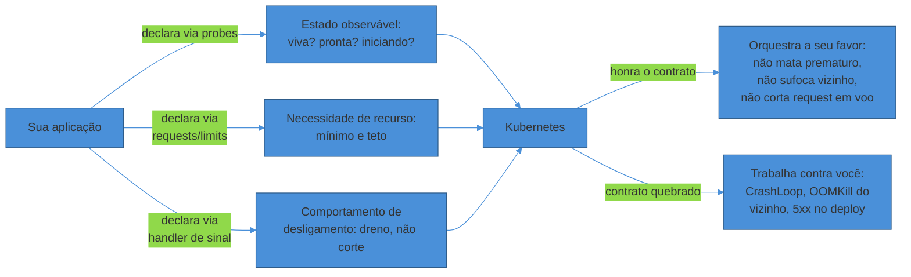
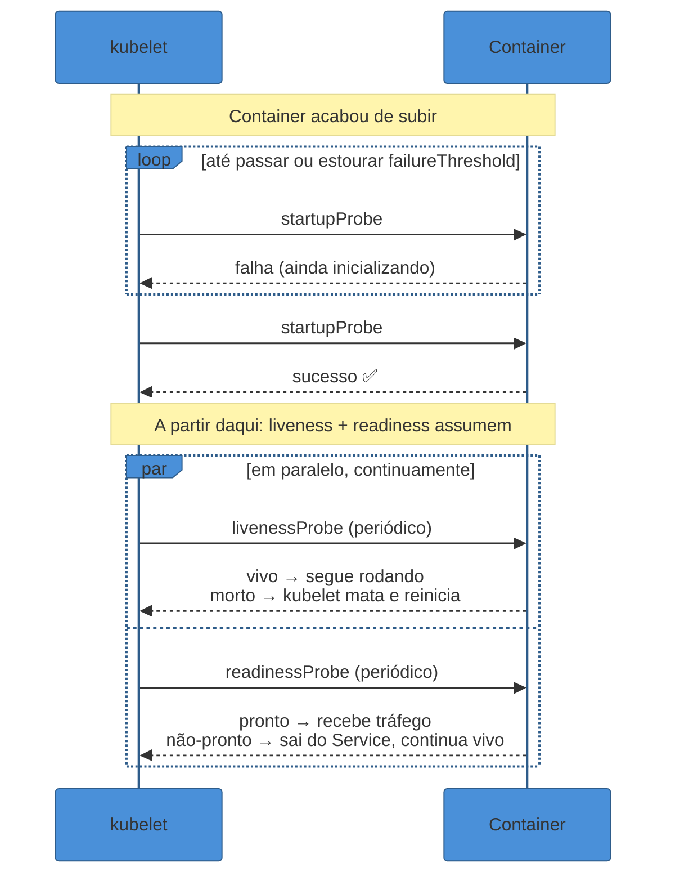
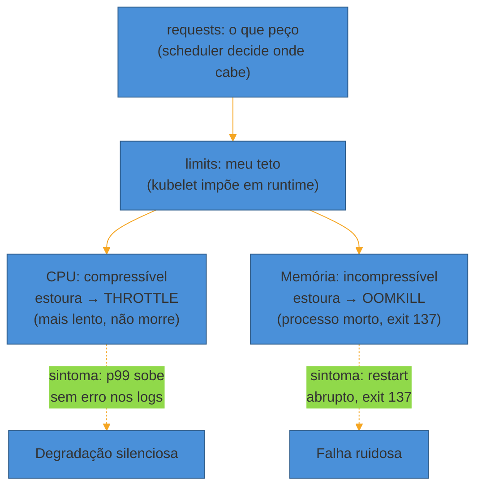
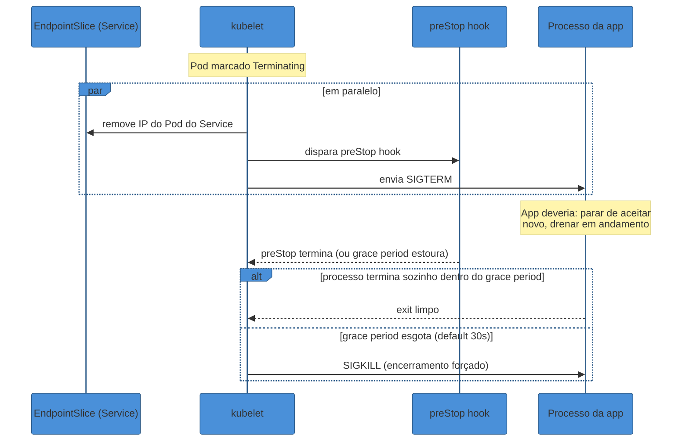

# O contrato de produção do Kubernetes

> [!abstract] TL;DR
> O Kubernetes não adivinha o estado da sua aplicação — ele exige que ela **declare** esse estado através de um contrato explícito. Três peças compõem esse contrato: **probes** (a app diz "estou viva", "estou pronta pra tráfego", "ainda estou inicializando"), **resource requests/limits** (a app diz "preciso disso, no máximo uso aquilo") e **graceful shutdown** (a app promete "quando você mandar SIGTERM, eu paro de aceitar tráfego novo e termino o que já comecei"). Quando esse contrato não é honrado — liveness que confunde "lento" com "morto", ausência de limits que deixa um Pod comer a RAM do nó inteiro, um processo que ignora SIGTERM e é morto no meio de uma transação — o orquestrador deixa de proteger o sistema e passa a atacá-lo. Esta nota assume que você já sabe o que é um Pod, um Deployment, um Service; o que ela ensina é o **contrato de runtime** que separa uma app "que sobe no K8s" de uma app "que o K8s consegue operar bem".

> [!info] A contraparte instrumental (2026-08-04)
> Esta nota trata da **política**: quais valores declarar, o que um contrato de produção exige, o que muda quando é sério. O **mecanismo** dos objetos citados aqui mora agora no galho [[03-Dominios/Tecnologia/Infraestrutura/Kubernetes/index|Tecnologia/Infraestrutura/Kubernetes]], sob a lente *o loop de reconciliação*: o Pod e o que ele compartilha em [[03-Dominios/Tecnologia/Infraestrutura/Kubernetes/03 - O Pod, a unidade que não é o container|03]], probes e classes de QoS pelo lado de quem as executa em [[03-Dominios/Tecnologia/Infraestrutura/Kubernetes/17 - O kubelet e o nó|17]], e requests contra a capacidade alocável do nó em [[03-Dominios/Tecnologia/Infraestrutura/Kubernetes/12 - Scheduling|12]]. Quem quiser entender *por que* o cluster se comporta assim antes de decidir *o que* declarar, o galho é o caminho.

São 14h32 de uma terça-feira comum. O time sobe uma nova versão do serviço de checkout — nada dramático, um ajuste de cache. O pipeline de CI/CD passa verde, o `kubectl apply` roda, e os Pods novos começam a subir. Só que essa versão trouxe consigo uma migração de schema no ORM que, na inicialização, recompila um cache de queries — um processo que sempre levou 3-4 segundos em staging, mas que em produção, com um dataset dez vezes maior, leva **42 segundos**.

O liveness probe do Deployment, configurado meses atrás por alguém que copiou um exemplo de blog, verifica `/health` a cada 10 segundos com `failureThreshold: 3` — ou seja, dá até 30 segundos antes de decidir que o container está morto. Aos 30 segundos, o processo ainda está no meio da recompilação do cache. O kubelet, seguindo exatamente as instruções que recebeu, mata o container. O Deployment sobe um novo Pod para substituí-lo. O novo Pod começa a mesma inicialização de 42 segundos. O liveness mata de novo aos 30. `CrashLoopBackOff`.

Ninguém mudou uma linha de lógica de negócio. O código do checkout está correto. O que faltou foi a aplicação **conseguir dizer ao Kubernetes**: "ainda estou de pé, só estou demorando pra ficar pronta — não me mate ainda." Sem essa declaração, o orquestrador aplicou a única regra que tinha: passou do prazo, morre.

Esse é o assunto desta nota. O Kubernetes não é hostil por natureza — ele é **literal**. Ele faz exatamente o que as probes, os requests/limits e a resposta a sinais dizem para fazer. O trabalho de operar uma app em produção sobre K8s não é aprender a sintaxe de um `Deployment` (isso é o monólito [[Kubernetes]]) — é aprender a **honrar o contrato** que o orquestrador espera da sua aplicação, para que ele trabalhe a seu favor em vez de contra você.



## Probes: a app tem que dizer como está

O Kubernetes só sabe o que a aplicação lhe conta. Sem instrumentação, o único sinal que o kubelet enxerga é se o *processo* dentro do container ainda está rodando — um sinal grosseiro demais para decidir se aquele processo está útil. Um processo pode estar rodando e, ainda assim, estar travado num deadlock, preso numa conexão de banco que nunca retorna, ou simplesmente despreparado para receber tráfego porque ainda está carregando um cache. As **probes** existem para fechar esse gap de informação, e são três, cada uma respondendo a uma pergunta diferente.

### Liveness: "estou vivo, ou preciso ser reiniciado?"

O **liveness probe** responde a uma pergunta binária: este processo está num estado do qual só um restart o tira? A [documentação oficial do Kubernetes](https://kubernetes.io/docs/concepts/configuration/liveness-readiness-startup-probes/) descreve o caso canônico: um deadlock, onde a aplicação está rodando mas incapaz de fazer progresso. Se o liveness falha repetidamente (`failureThreshold` vezes seguidas), o kubelet mata o container e o `restartPolicy` do Pod decide se ele sobe de novo.

O ponto que mais gera incidente aqui — e é a lição mais cara desta nota — é que **liveness deve ser um check local e barato**, nunca uma verificação de dependência externa. Um endpoint de liveness que consulta o banco de dados por trás cria exatamente o cenário que times sofrem em produção: o banco tem um blip de 20 segundos, todos os Pods do serviço reportam liveness falho ao mesmo tempo, o Kubernetes reinicia a frota inteira simultaneamente, e agora — além do banco ainda se recuperando — o serviço inteiro está fazendo cold start ao mesmo tempo, o que aumenta ainda mais a carga sobre o banco que já estava sofrendo. O liveness devia ter reportado "não estou pronto pra tráfego" (isso é trabalho do readiness), não "me mate".

### Readiness: "posso receber tráfego agora?"

O **readiness probe** responde a uma pergunta diferente e mais frequente: este Pod está apto a receber requisições *neste momento*? Quando o readiness falha, o Kubernetes não mata nada — ele simplesmente remove o IP do Pod do EndpointSlice do Service correspondente, tirando-o de circulação sem tocar no processo. O Pod continua rodando, continua sendo contado pelo Deployment, só para de receber tráfego novo até voltar a responder que está pronto.

Esse mecanismo é o que resolve o problema de *warmup*: uma app Java que precisa de alguns segundos para o JIT aquecer, um cache que precisa ser populado, uma conexão de pool que precisa se estabelecer com o banco — tudo isso é trabalho legítimo de inicialização que não deveria acionar um restart, só um "ainda não, aguenta aí". Da mesma forma, readiness é o mecanismo certo para dependências externas: se o banco cair, a app pode reportar "não estou pronta" (sai do Service, para de receber tráfego que ela não consegue atender) sem entrar num ciclo de restart — porque reiniciar não vai consertar o banco.

### Startup: "ainda estou inicializando, não me apresse"

O terceiro probe, mais recente, existe para resolver uma tensão entre os outros dois: apps com inicialização lenta e imprevisível (migrations grandes, cache warmup pesado, JVMs com muito código a compilar) muitas vezes não cabem num `failureThreshold`/`periodSeconds` de liveness dimensionado para o estado estável. Configurar o liveness com folga suficiente para tolerar o pior caso de startup (os 42 segundos do exemplo de abertura) faria com que ele demorasse demais para detectar um deadlock real em produção — o "estou vivo, mas travado" que ele existe para pegar.

O **startup probe** resolve isso desacoplando os dois relógios. Enquanto o startup probe não reportar sucesso, o Kubernetes **não executa nem liveness nem readiness** — a app ganha uma janela de inicialização com seu próprio orçamento de tempo (`failureThreshold × periodSeconds`), sem que isso afete a agressividade do liveness em regime permanente. Assim que o startup probe passa uma vez, ele nunca mais é chamado, e os outros dois assumem.



| Probe | Pergunta | Falha → o quê | Erro comum |
|---|---|---|---|
| **Startup** | "Ainda estou inicializando?" | Enquanto ativo, suspende liveness/readiness | Omitir em apps de boot lento → liveness mata no meio do boot |
| **Liveness** | "Estou travado, preciso de restart?" | Kubelet mata o container | Depender de serviço externo (banco, fila) → restart em cascata |
| **Readiness** | "Posso receber tráfego agora?" | Sai do Service, continua vivo | Usar o mesmo endpoint/lógica do liveness → perde a distinção entre "reiniciar" e "só tirar de circulação" |

> [!warning] Liveness == Readiness é o anti-pattern mais comum
> **O que acontece:** por economia de esforço, o time aponta liveness e readiness para o mesmo endpoint, com os mesmos thresholds. **Por quê:** os dois respondem perguntas diferentes com consequências radicalmente diferentes. Se uma dependência externa cai e ambos os probes checam essa dependência, o Pod não só sai de circulação (correto) como também é reiniciado repetidamente (incorreto — reiniciar não conserta uma dependência fora do ar, só soma cold starts à crise). **Como evitar:** liveness checa **apenas o processo local** (a thread principal responde? não há deadlock?). Readiness pode — e frequentemente deve — checar dependências (o pool de conexão está de pé? o cache crítico está carregado?). Um padrão comum e seguro é liveness e readiness compartilharem o endpoint HTTP mas com `failureThreshold` bem maior no liveness, para que o Pod passe bastante tempo "não-pronto" antes de ser considerado "morto".

> [!question]- Por que não usar só readiness e abandonar o liveness?
> Porque eles cobrem falhas diferentes. Um processo pode estar perfeitamente "pronto" segundo qualquer critério de negócio e ainda assim estar num deadlock que nunca mais vai se resolver sozinho — nesse caso, readiness sem liveness deixaria o Pod preso para sempre em estado "não-pronto", sem nada acionando o restart que resolveria. Liveness é a rede de segurança para o caso em que a única cura é "desligar e ligar de novo"; readiness é o filtro de tráfego para todo o resto. Times maduros normalmente configuram os dois — e configuram o liveness para ser bem mais tolerante (mais tentativas, timeout maior) que o readiness.

> [!question]- E se minha app não tem endpoint HTTP — é um worker de fila?
> As probes não exigem HTTP: além de `httpGet`, o Kubernetes suporta `exec` (rodar um comando dentro do container e checar o código de saída) e `tcpSocket` (checar se uma porta aceita conexão). Para um worker que consome de uma fila sem servidor HTTP, um padrão comum é um probe `exec` que verifica um arquivo de heartbeat que o próprio processo atualiza a cada N segundos enquanto está processando — se o arquivo não for atualizado, o probe falha.

## Requests e limits: a app tem que declarar o que precisa

Probes dizem *o estado* da app. Requests e limits dizem *o apetite* dela por CPU e memória — e essa segunda declaração é tão contratual quanto a primeira, só que o preço de errar é pago pelos **vizinhos**, não só pela própria app.

Segundo a [documentação oficial de gerenciamento de recursos](https://kubernetes.io/docs/concepts/configuration/manage-resources-containers/), a distinção entre os dois campos é estrutural:

- **`requests`** é o que o **scheduler** usa para decidir em qual nó colocar o Pod — ele soma os requests de tudo que já está no nó e só agenda um novo Pod ali se sobrar capacidade declarada. Requests afetam bin-packing: pedir de menos faz o scheduler empilhar Pods demais num nó (contenção real na hora do pico); pedir de mais desperdiça capacidade que fica reservada e ociosa.
- **`limits`** é o teto que o **kubelet** impõe em runtime, e aqui CPU e memória se comportam de forma **fundamentalmente diferente** — essa assimetria é a fonte de boa parte da confusão em produção:
  - **CPU é compressível.** O limit é implementado via CFS quota do cgroup: se o container tenta usar mais CPU do que o limit permite numa janela de 100ms, ele é *throttled* — não morto, só posto pra esperar a próxima janela. O efeito visível não é erro, é **latência**: requests que deveriam levar 50ms passam a levar 300ms porque o processo ficou preso esperando sua fatia de CPU liberar de novo. Ferramentas como cAdvisor expõem `container_cpu_cfs_throttled_periods_total` justamente para detectar esse throttling que não aparece em nenhum log de erro.
  - **Memória é incompressível.** Não existe "esperar a memória liberar" — se o container ultrapassa o `limit` de memória, o kernel Linux o mata com um OOM kill (o famoso exit code 137), sem aviso prévio, no meio de qualquer operação que estivesse em andamento.



### QoS classes: quem é sacrificado primeiro

A relação entre `requests` e `limits` de cada container determina a **classe de QoS** (Quality of Service) do Pod inteiro — e essa classe decide a ordem de sacrifício quando um nó fica sob pressão de memória. A [documentação de QoS classes](https://kubernetes.io/docs/concepts/workloads/pods/pod-qos/) define três:

- **`Guaranteed`** — todo container do Pod tem `requests == limits` para CPU e memória. É a classe mais protegida: só é evictado se ultrapassar o próprio limit ou se não houver Pod de prioridade menor para preemptar.
- **`Burstable`** — pelo menos um container tem `requests < limits` (ou só um dos dois campos definido). O Pod pode usar mais do que pediu quando há sobra no nó, mas é candidato a eviction antes dos Guaranteed quando o nó aperta.
- **`BestEffort`** — nenhum container define `requests` nem `limits`. É a classe menos protegida: **primeira a ser evictada** sob pressão de memória no nó, mesmo que o próprio Pod não tenha causado a pressão.

O padrão mais perigoso na prática é o Pod que roda **sem nenhum limit** — `BestEffort` de fato, ainda que sem intenção. Um bug de memory leak nesse Pod não tem teto: ele consome RAM do nó até o `kubelet` acionar eviction por pressão de memória no nó inteiro, e o candidato a ser morto primeiro para liberar espaço frequentemente não é o Pod que causou o leak — é qualquer Pod `BestEffort` que estiver ali, inclusive vizinhos completamente saudáveis. É o cenário do "noisy neighbor" mencionado na abertura desta nota: um serviço mal configurado derruba outro que nunca teve culpa nenhuma.

> [!warning] Setar limits sem medir uso real primeiro
> **O que acontece:** o time, tentando "fazer certo", copia um valor de `limits` de outro serviço ou de um exemplo de blog, sem medir o consumo real da própria aplicação sob carga. **Por quê:** um limit de CPU baixo demais throttle a app até parecer lenta mesmo com pouquíssimo tráfego real; um limit de memória baixo demais gera OOMKills recorrentes num processo saudável (a JVM, por exemplo, aloca memória fora do heap para thread stacks, metaspace e buffers de I/O — um limit calibrado só pelo `-Xmx` sistematicamente subestima o total). **Como evitar:** medir consumo real em produção (ou staging com carga representativa) antes de definir limits — ferramentas de recomendação de recursos (VPA em modo recomendação, ou dashboards de uso histórico) existem exatamente para substituir o chute por dado.

Vale registrar por que o time acaba nesse ponto cego com tanta frequência: `requests` e `limits` são, tecnicamente, opcionais — um manifesto sem nenhum dos dois campos é aceito pelo `kubectl apply` sem erro, sem warning, sem qualquer sinal de que algo está incompleto. O Pod sobe, funciona em dev, funciona em staging com pouco tráfego concorrente, e só revela o problema semanas depois, sob carga real e ao lado de vizinhos igualmente sem limite. Times maduros fecham esse buraco com um `LimitRange` no namespace — um objeto que impõe requests/limits padrão (ou um teto/piso obrigatório) para qualquer Pod que não os declare explicitamente, transformando um erro silencioso de omissão em, na pior das hipóteses, um valor conservador padrão em vez de nenhum valor.

## Graceful shutdown: a app tem que saber sair da roda

A terceira peça do contrato é a mais fácil de esquecer porque, ao contrário de probes e limits, ela não aparece em nenhum manifesto YAML óbvio — ela é sobre **como o código da aplicação reage a um sinal do sistema operacional**.

Quando o Kubernetes decide terminar um Pod — um `rolling update`, um `scale down`, uma manutenção de nó — ele não simplesmente mata o processo. Segundo a [documentação de Pod Lifecycle](https://kubernetes.io/docs/concepts/workloads/pods/pod-lifecycle/), a sequência é:

1. O Pod é marcado como `Terminating`.
2. **Em paralelo**, dois eventos disparam ao mesmo tempo: (a) se existir, o **preStop hook** começa a rodar dentro do container; (b) o Pod é removido do EndpointSlice de qualquer Service que o selecione — ele para de receber tráfego novo.
3. O kubelet envia **SIGTERM** ao processo principal do container.
4. A app tem até `terminationGracePeriodSeconds` (30 segundos por padrão) para desligar sozinha — parar de aceitar conexões novas, terminar de processar as requisições em voo, fechar conexões de banco, liberar recursos.
5. Se, ao fim do grace period, o processo ainda estiver rodando, o kubelet manda **SIGKILL** — encerramento imediato, sem chance de limpeza.



O detalhe mais sutil aqui — e a causa mais comum de 5xx durante deploys que, de resto, parecem saudáveis — é que os passos 2(a) e 2(b) acontecem **em paralelo, não em sequência**. A remoção do IP do `EndpointSlice` não é instantânea em todos os componentes do cluster: proxies, load balancers e kube-proxy em cada nó levam um tempo (tipicamente sub-segundo, mas não zero) para propagar essa mudança e parar de rotear tráfego novo para o Pod. Se o SIGTERM chega e a aplicação desliga imediatamente, existe uma janela real em que requests novos ainda estão sendo roteados para um Pod que já está encerrando — e são recusados ou perdidos.

A solução consagrada é o **preStop hook com um `sleep`**: em vez de a app reagir ao SIGTERM na hora, o preStop hook (tipicamente `sleep 5` a `sleep 15`, dependendo da topologia de rede) atrasa deliberadamente o envio do SIGTERM real à aplicação, dando tempo para a propagação da remoção do endpoint se completar em todo o cluster antes que a app comece a desligar de fato. Não é gambiarra — é reconciliar duas operações assíncronas que o Kubernetes dispara em paralelo por design.

Há uma segunda camada de sutileza, documentada em discussões reais do próprio time do Kubernetes: durante um rollout, o **readiness probe continua rodando durante o preStop**. Se a aplicação continuar respondendo "pronto" enquanto está no meio do `sleep` do preStop — porque, do ponto de vista do processo, nada mudou ainda —, é possível que o Deployment controller, olhando para esse Pod "ainda pronto", atrase a promoção de réplicas novas, ou pior, o Pod seja recolocado no fluxo por engano em cenários de scaling simultâneo. O padrão mais robusto, adotado por times que já sofreram esse tipo de corrida, é fazer o handler de preStop (ou um endpoint de "shutdown" dedicado, chamado no início do preStop) **derrubar a resposta do readiness imediatamente** — assim o Pod se anuncia como não-pronto no primeiro instante da terminação, em vez de esperar passivamente a propagação de rede. Isso reduz a janela de corrida a quase zero, em vez de depender inteiramente do tempo de sleep escolhido por tentativa e erro.

> [!question]- Minha app já trata SIGTERM — ainda preciso de preStop?
> Depende da topologia. Se o tráfego chega via um Service `ClusterIP` simples com kube-proxy, a propagação costuma ser rápida o suficiente para não precisar de sleep. Mas em topologias com um LoadBalancer externo, um Ingress controller, ou um service mesh na frente, a propagação da remoção do endpoint atravessa mais componentes — e cada um tem seu próprio ciclo de refresh. Nesses casos, um `preStop` com sleep de alguns segundos é a prática recomendada mesmo com SIGTERM bem tratado, porque o problema não é a app ser lenta pra desligar — é a malha de rede ser lenta pra parar de mandar tráfego novo.

> [!warning] Ignorar SIGTERM e confiar só no grace period
> **O que acontece:** a aplicação não registra nenhum handler para SIGTERM — o comportamento padrão do processo é ser terminado imediatamente (ou, em runtimes que ignoram o sinal por padrão, sobreviver até o SIGKILL bruto no fim do grace period). **Por quê:** requisições em andamento são cortadas no meio (conexões TCP derrubadas, transações de banco abertas ficam pendentes), e conexões de pool não são fechadas de forma limpa. Em serviços com estado de curta duração (uma escrita em duas etapas, um processamento de fila sem idempotência garantida) isso vira dado inconsistente, não só um erro de rede. **Como evitar:** todo processo de longa duração num container precisa capturar SIGTERM explicitamente e implementar drenagem: parar de aceitar conexões novas, aguardar as requisições em voo terminarem (com um teto — não esperar para sempre), fechar recursos, e só então sair. Frameworks web modernos (Spring Boot com `server.shutdown=graceful`, Express com handler de `process.on('SIGTERM')`, etc.) oferecem isso quase pronto — o erro comum é simplesmente não ativar.

### PodDisruptionBudget: proteção contra o próprio cluster

Probes, requests/limits e SIGTERM tratam da terminação de **um** Pod. O **PodDisruptionBudget** (PDB) trata de um risco de outra escala: e se o cluster decidir terminar **vários** Pods do mesmo Deployment ao mesmo tempo, como parte de uma manutenção voluntária — drenar um nó para atualização, um `cluster autoscaler` reduzindo capacidade?

Segundo a [documentação de disrupções](https://kubernetes.io/docs/concepts/workloads/pods/disruptions/), essas terminações de manutenção são chamadas de **disrupções voluntárias** (em oposição a disrupções involuntárias, como um nó que crasha por hardware) — e são exatamente o tipo de evento que um PDB consegue conter. Um PDB declara, para um conjunto de Pods, quantos podem estar indisponíveis simultaneamente:

- **`minAvailable`** — quantos (número ou %) precisam continuar disponíveis mesmo durante a disrupção.
- **`maxUnavailable`** — quantos (número ou %) podem estar fora ao mesmo tempo.

Só um dos dois pode ser definido por PDB. Com um PDB de `minAvailable: 2` num Deployment de 3 réplicas, um drenagem de nó que tentaria evictar duas delas simultaneamente é **bloqueada pela API do Kubernetes** — a operação de eviction respeita o PDB e espera até que seja seguro prosseguir, evictando uma de cada vez. Sem PDB, nada impede que uma operação de manutenção decida drenar dois ou três Pods do mesmo Deployment ao mesmo tempo, na pior das hipóteses derrubando o serviço inteiro por alguns minutos — não por bug de código, só por coincidência de agenda de manutenção do cluster.

> [!question]- PDB substitui réplicas suficientes e anti-affinity?
> Não — ele é complementar, e sozinho não impede um serviço de rodar com poucas réplicas mal distribuídas. Um PDB `minAvailable: 2` só é útil se o Deployment já tem réplicas suficientes espalhadas para que "manter 2 disponíveis" seja um número que faça sentido operacionalmente. A distribuição das réplicas entre nós/zonas (via `podAntiAffinity` ou `topologySpreadConstraints`) e o PDB resolvem problemas diferentes: um garante que as réplicas não estejam todas no mesmo nó (evita perda simultânea por falha de hardware); o outro garante que o próprio cluster, ao fazer manutenção planejada, não remova réplicas demais de uma vez. Zero-downtime real depende dos dois — a nota seguinte deste sub-galho aprofunda essa combinação.

## Juntando as três peças: um manifesto honesto

O trecho abaixo não é um exemplo didático de sintaxe (isso é papel do monólito [[Kubernetes]]) — é uma ilustração de como as três peças do contrato aparecem juntas num único container, cada uma respondendo pelo pedaço que lhe cabe:

```yaml
containers:
  - name: checkout-api
    image: registry.example.com/checkout-api:1.42.0
    resources:
      requests:
        cpu: "250m"
        memory: "512Mi"
      limits:
        cpu: "500m"      # Burstable: limit de CPU > request
        memory: "512Mi"  # request == limit de memória: sem risco de OOMKill por vizinho barulhento consumindo o próprio teto
    startupProbe:
      httpGet: { path: /healthz, port: 8080 }
      failureThreshold: 30    # até 30 x 2s = 60s de janela de boot
      periodSeconds: 2
    livenessProbe:
      httpGet: { path: /healthz, port: 8080 }
      periodSeconds: 10
      failureThreshold: 5     # tolerante: só reinicia após 50s de falha contínua
      timeoutSeconds: 5
    readinessProbe:
      httpGet: { path: /readyz, port: 8080 }  # endpoint separado: checa pool de conexão + cache carregado
      periodSeconds: 5
      failureThreshold: 2     # sai de circulação rápido: 10s de falha já tira do Service
    lifecycle:
      preStop:
        exec:
          command: ["sh", "-c", "sleep 10"]
    terminationGracePeriodSeconds: 45  # 10s do sleep + margem pra drenar requests em voo
```

Repare no raciocínio por trás de cada número: o `startupProbe` dá 60 segundos de fôlego para o pior caso de boot (cobrindo com folga o incidente de 42 segundos da abertura), sem que isso afete a agressividade do `livenessProbe` em regime estável — que, por sua vez, é deliberadamente mais tolerante (5 falhas, 50 segundos) que o `readinessProbe` (2 falhas, 10 segundos), porque tirar de circulação é barato e reiniciar é caro. O `readinessProbe` aponta para um endpoint próprio (`/readyz`), separado do `/healthz` do liveness, justamente para poder checar dependências (pool de conexão, cache) sem arriscar um restart em cascata se uma dependência cair. E o `terminationGracePeriodSeconds` de 45 segundos dá espaço para os 10 segundos do `preStop` (esperando a propagação da remoção do endpoint) mais uma margem real para a app drenar requisições em voo antes do SIGKILL.

## Em entrevista

Perguntas sobre Kubernetes em produção — não "o que é um Pod", mas "como você configuraria isso para não cair" — são um filtro comum em entrevistas sênior/staff, porque separam quem só usou K8s de quem já foi acordado por um incidente causado por ele.

O que um entrevistador está de fato avaliando:

- Se você distingue **liveness de readiness** na prática, não só na definição — a resposta fraca recita "um reinicia, o outro tira do tráfego"; a resposta forte explica *por quê* liveness não deve checar dependências externas, com um cenário de restart em cascata.
- Se você entende a **assimetria CPU vs memória** em limits — throttle silencioso vs OOMKill ruidoso é um detalhe que só quem debugou latência em produção sabe de cor.
- Se você sabe articular a **corrida entre SIGTERM e remoção de endpoint** — mencionar o `preStop` com sleep como solução a um problema real (não um cargo-cult de exemplo de blog) é sinal de profundidade.
- Em cenários de troubleshoot ("um deploy está causando 5xx, o que você checa?"), se sua investigação passa por probes, resource limits e graceful shutdown como suspeitos de primeira linha, antes de suspeitar do código de negócio.

Uma resposta que amarra os três pilares numa frase costuma cravar o ponto: *"O Kubernetes só orquestra bem o que a app declara — probes dizem o estado, requests/limits dizem o apetite de recurso, e o tratamento de SIGTERM diz como a app sai de cena. Quebrar qualquer uma das três normalmente não é bug de negócio, é contrato não honrado."*

## How to explain in English

> "Kubernetes doesn't guess your application's state — it expects an explicit contract. Liveness probes say 'restart me if I'm stuck'; they should never depend on external services, or a downstream blip triggers a fleet-wide restart storm. Readiness probes say 'don't send me traffic yet'; that's the right place for dependency checks and warmup logic. Startup probes give slow-booting apps a separate grace window so the liveness threshold doesn't have to be loosened for everyone. On resources: CPU limits throttle — you get silent latency, not failure — while memory limits OOM-kill, because CPU is compressible and memory isn't; that asymmetry drives the QoS class and eviction order under node pressure. And graceful shutdown means catching SIGTERM, draining in-flight requests, and — because endpoint removal from the Service and the SIGTERM signal fire in parallel, not in sequence — often adding a short preStop sleep so the network mesh catches up before the app actually stops."

| PT | EN |
|----|----|
| Sonda de vivacidade | Liveness probe |
| Sonda de prontidão | Readiness probe |
| Sonda de inicialização | Startup probe |
| Pedido de recurso / teto de recurso | Resource request / resource limit |
| Estrangulamento de CPU | CPU throttling |
| Morto por falta de memória | OOM-killed |
| Classe de qualidade de serviço | QoS class |
| Vizinho barulhento | Noisy neighbor |
| Desligamento gracioso | Graceful shutdown |
| Período de tolerância pra terminar | Termination grace period |
| Gancho de pré-parada | preStop hook |
| Orçamento de disrupção de Pod | Pod Disruption Budget |
| Drenar conexões em andamento | Drain in-flight connections |

## O que vem a seguir

Honrado o contrato de um Pod individual — probes, recursos, shutdown — a próxima pergunta é o que acontece quando **múltiplos** Pods entram e saem ao mesmo tempo durante um deploy: como evitar que o rolling update, mesmo com cada Pod bem-comportado, ainda derrube tráfego por causa de timing entre réplicas.

- [[03 - Zero-downtime e alta disponibilidade]] — rolling updates sem perder request, connection draining, readiness gating entre réplicas, anti-affinity
- [[04 - Escala e capacidade]] — autoscaling (HPA/VPA), capacity planning, o custo de escalar
- [[Spring Boot]] — o mesmo contrato (graceful shutdown, limites de memória) pela ótica específica da JVM: `server.shutdown=graceful`, `MaxRAMPercentage`, o cgroup como fonte de verdade de recurso dentro do container

## Veja também

- [[Operação/index|Operação]] — o galho-pai e o mapa completo da trilha
- [[3 - Rodar em produção/index|Rodar em produção]] — este sub-galho
- [[Kubernetes]] — a ferramenta: objetos, sintaxe, arquitetura do cluster (esta nota assume esse conhecimento)
- [[Spring Boot]] — o mesmo contrato de produção pela ótica JVM (memória em cgroup, graceful shutdown do Spring)

## Fontes

- **Kubernetes** — [Liveness, Readiness, and Startup Probes](https://kubernetes.io/docs/concepts/configuration/liveness-readiness-startup-probes/) (kubernetes.io, consultado em 2026-07-08) — definição oficial dos três tipos de probe e quando usar cada um.
- **Kubernetes** — [Configure Liveness, Readiness and Startup Probes](https://kubernetes.io/docs/tasks/configure-pod-container/configure-liveness-readiness-startup-probes/) (kubernetes.io, consultado em 2026-07-08) — guia prático de configuração, incluindo `exec`, `tcpSocket` e `httpGet`.
- **Kubernetes** — [Resource Management for Pods and Containers](https://kubernetes.io/docs/concepts/configuration/manage-resources-containers/) (kubernetes.io, consultado em 2026-07-08) — semântica de `requests` vs `limits`, e como o scheduler e o kubelet usam cada um.
- **Kubernetes** — [Pod Quality of Service Classes](https://kubernetes.io/docs/concepts/workloads/pods/pod-qos/) (kubernetes.io, consultado em 2026-07-08) — definição de Guaranteed/Burstable/BestEffort e ordem de eviction.
- **Kubernetes** — [Pod Lifecycle](https://kubernetes.io/docs/concepts/workloads/pods/pod-lifecycle/) (kubernetes.io, consultado em 2026-07-08) — sequência de terminação: preStop, SIGTERM, grace period, SIGKILL.
- **Kubernetes** — [Disruptions](https://kubernetes.io/docs/concepts/workloads/pods/disruptions/) e [Specifying a Disruption Budget for your Application](https://kubernetes.io/docs/tasks/run-application/configure-pdb/) (kubernetes.io, consultado em 2026-07-08) — PodDisruptionBudget, `minAvailable`/`maxUnavailable`, disrupções voluntárias vs involuntárias.
- **Google Cloud Blog** — [Kubernetes best practices: terminating with grace](https://cloud.google.com/blog/products/containers-kubernetes/kubernetes-best-practices-terminating-with-grace) (cloud.google.com, consultado em 2026-07-08) — a corrida entre remoção de endpoint e SIGTERM, e o padrão de `preStop` com sleep.
- **Sysdig** — [Kubernetes OOM and CPU Throttling](https://www.sysdig.com/blog/troubleshoot-kubernetes-oom) (sysdig.com, consultado em 2026-07-08) — a assimetria entre throttling de CPU (via CFS quota) e OOMKill de memória, e como detectar throttling com métricas de cAdvisor.
- **kubernetes/kubernetes issue #123027** — [Readiness probe success during preStop hook causes replicas scaling](https://github.com/kubernetes/kubernetes/issues/123027) (github.com, consultado em 2026-07-08) — discussão real de engenheiros sobre a race condition entre `preStop` sleep e readiness durante rollout.
