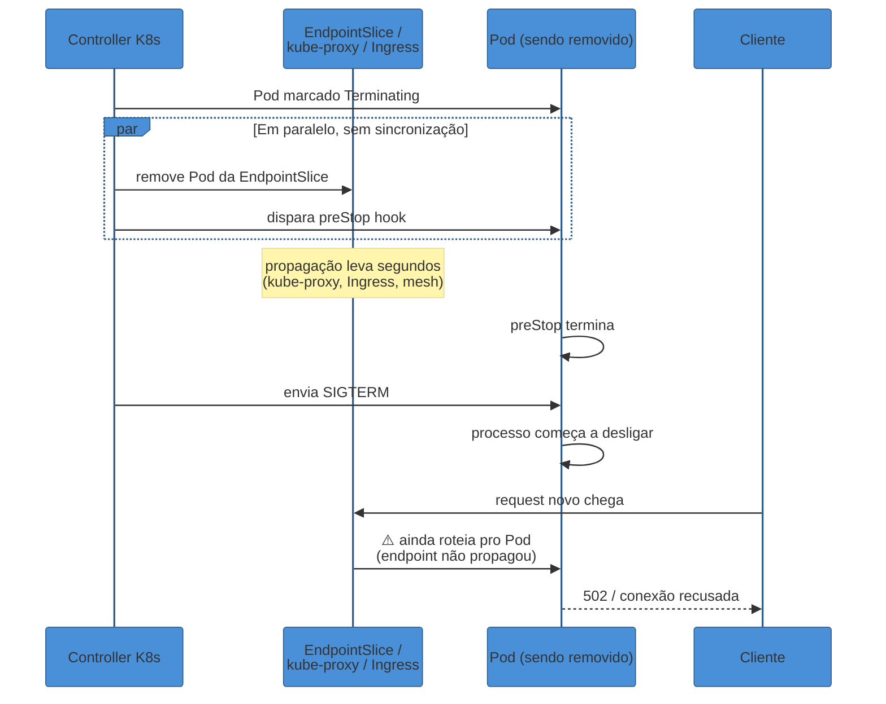
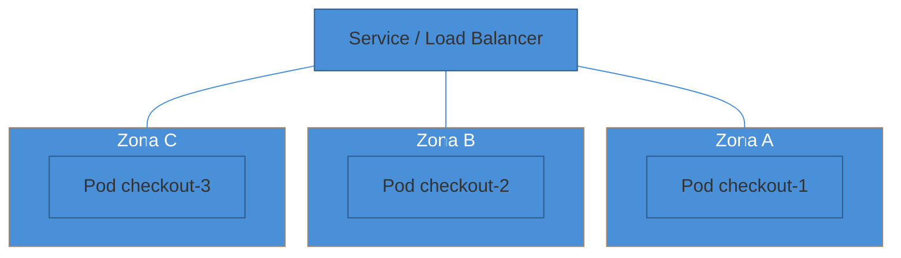

# Zero-downtime e alta disponibilidade

> [!abstract] TL;DR
> "Zero-downtime deploy" é uma promessa que quase todo mundo cumpre pela metade. Rolling update sem downtime *aparente* — o serviço nunca fica todo fora do ar — ainda pode devolver uma rajada de **502/504 por alguns segundos a cada deploy**, porque dois eventos que deveriam ser sequenciais acontecem **em paralelo**: a remoção do Pod da lista de endpoints do Service e o envio do `SIGTERM` pro container. Se o `SIGTERM` chegar primeiro, o processo começa a desligar enquanto o load balancer ainda está mandando tráfego novo pra ele. A correção tem duas pontas: (1) **readiness gating** — o Pod só entra no Service quando está de verdade pronto pra servir, não só "processo subiu"; (2) **connection draining / graceful shutdown** — o Pod continua aceitando e terminando requests em voo por uma janela depois de sair do Service, tipicamente via um `preStop sleep` que compra tempo pra propagação do endpoint chegar em todo mundo (kube-proxy, Ingress, malha de serviço) antes do `SIGTERM` de verdade. Em paralelo, **alta disponibilidade** é uma propriedade estrutural diferente: múltiplas réplicas, sem estado local, espalhadas entre zonas via **topology spread constraints**/anti-affinity, protegidas de *disrupção voluntária* (drain de nó, upgrade de cluster) por um **PodDisruptionBudget**. Deploy sem perder request e cluster sem ponto único de falha são dois problemas relacionados, mas não são o mesmo problema — e um sistema pode acertar um e errar o outro.

São 15h47. O time acabou de fazer um deploy — rolling update, sem downtime, `kubectl rollout status` reportou sucesso, o dashboard mostra o número de réplicas prontas voltando ao normal em segundos. Ninguém percebeu nada errado.

Duas horas depois, alguém olha o painel de erros e vê um padrão estranho: toda vez que há um deploy nesse serviço — não só esse, quase todos — existe um pico fino de 502 durando entre 3 e 8 segundos, sempre exatamente no momento em que uma réplica é substituída. É pequeno demais pra disparar alerta (a taxa de erro agregada mal se move), mas está lá, deploy após deploy, silenciosamente cobrando o preço de "quase zero-downtime" — que, para quem recebeu aquele 502 específico, não foi zero coisa nenhuma.

A causa não é um bug no código da aplicação. É uma corrida entre dois relógios que ninguém sincronizou.

## A corrida que ninguém vê

Quando o Kubernetes decide substituir um Pod — porque um rolling update pediu, porque o nó vai ser drenado, porque o Pod morreu de OOM — ele não faz uma única coisa. Ele dispara **um conjunto de eventos que, por design, acontecem em paralelo, não em sequência**: (a) o Pod é marcado como `Terminating` e o controller de endpoints começa a removê-lo da EndpointSlice do Service; (b) se existir, o hook `preStop` é executado dentro do container; (c) assim que o `preStop` termina (ou imediatamente, se não houver hook), o kubelet manda `SIGTERM` pro processo principal do container. A documentação oficial do Kubernetes é explícita sobre essa simultaneidade — a remoção do endpoint e o disparo do sinal de término **não esperam um pelo outro** ([Pod Lifecycle, kubernetes.io](https://kubernetes.io/docs/concepts/workloads/pods/pod-lifecycle/#pod-termination)).

O problema é que "remover da EndpointSlice" não é instantâneo do ponto de vista de quem está mandando tráfego. Depois que o controller atualiza a EndpointSlice, essa mudança precisa se propagar até **todo componente que decide pra onde mandar um request**: o kube-proxy em cada nó (que reescreve regras de iptables/IPVS), o controller do Ingress (que recarrega sua configuração), qualquer service mesh, qualquer load balancer externo que faça cache de endpoints. Cada um desses componentes tem seu próprio ciclo de sincronização — segundos, às vezes dezenas de segundos em clusters grandes ou com Ingress controllers que fazem polling em vez de watch (Jorijn Schrijvershof, [*Kubernetes graceful shutdown: handling SIGTERM and pod termination*](https://jorijn.com/en/knowledge-base/kubernetes/troubleshooting/kubernetes-graceful-shutdown-sigterm-pod-termination/)).

Enquanto essa propagação não termina, o Pod continua recebendo tráfego novo — só que, se o `SIGTERM` já chegou nele antes do `preStop` comprar tempo, o processo já está no meio do desligamento: fechando conexões de banco, parando de aceitar novas conexões TCP, talvez já tendo retornado de `main()`. Um request que chega nesse intervalo recebe conexão recusada ou um 502 do proxy — não porque o serviço estava fora do ar, mas porque **uma réplica específica morreu um pouco rápido demais para o tempo que o cluster levou para parar de mandar tráfego pra ela**.

Esse não é um cenário hipotético. Um dos issues mais antigos e citados do repositório do Kubernetes documenta exatamente isso: em 2017, um usuário relatou perder requests atrás de um NodePort a ~60 req/s durante rolling updates, porque "the pod gets the termination signal before it is removed from the service load balancing" ([kubernetes/kubernetes#43576](https://github.com/kubernetes/kubernetes/issues/43576)). O mesmo padrão aparece de novo com Ingress-NGINX e conexões keep-alive ([kubernetes/ingress-nginx#489](https://github.com/kubernetes/ingress-nginx/issues/489)) e em relatos de engenharia recorrentes sobre "502/504 temporários durante rolling updates" (Stefan Franziskus, [*Getting rid of temporary 50x gateway errors in Kubernetes*](https://medium.com/@stefan4all/getting-rid-of-temporary-50x-gateway-errors-in-kubernetes-a95d6e4617e8)). O workaround que a comunidade convergiu para adotar — e que hoje é praticamente item de checklist de produção — é o assunto da próxima seção.



> [!warning] "Rollout status = sucesso" não significa "zero requests perdidos"
> **O que acontece:** o time confia no `kubectl rollout status` ou no dashboard de réplicas prontas como prova de que o deploy não afetou usuário nenhum.
> **Por quê:** esse sinal mede se o *Deployment* convergiu para o estado desejado (N réplicas novas, prontas) — não mede se, durante a transição, alguma réplica antiga recebeu tráfego depois de começar a desligar. São duas perguntas diferentes, e só a segunda é a que interessa pro usuário.
> **Como evitar:** medir taxa de erro segmentada por *momento do deploy* (um dashboard que sobrepõe eventos de deploy à taxa de 5xx), não só olhar se o rollout "terminou verde". A ausência de alerta não é ausência de perda — pode só ser perda pequena demais pra cruzar o threshold.

## O remédio: readiness gating e connection draining

A correção tem duas metades, e as duas precisam existir juntas — uma sem a outra só resolve metade do problema.

**Readiness gating** resolve a entrada: o Pod só deve começar a receber tráfego quando está de verdade capaz de atender um request — conexões de banco estabelecidas, cache aquecido, dependências externas alcançáveis — não apenas "o processo subiu e o container está `Running`". Isso já foi coberto em detalhe na nota anterior deste sub-galho ([[02 - O contrato de produção do Kubernetes]]): sem uma readiness probe que reflita prontidão real, todo deploy nasce com uma fatia inicial de erros, porque o Kubernetes usa o único sinal que tem — e "container rodando" é um sinal fraco demais.

**Connection draining / graceful shutdown** resolve a saída, e é a metade menos intuitiva: o Pod que está saindo precisa continuar vivo, aceitando e terminando o que já estava em voo, por tempo suficiente para que **toda** a malha de roteamento (kube-proxy, Ingress, mesh, load balancer externo) tenha efetivamente parado de mandar tráfego novo pra ele. Isso não é responsabilidade só da aplicação — é uma responsabilidade compartilhada entre o `preStop` hook e o próprio handler de `SIGTERM` do processo.

O padrão canônico, documentado por Daniele Polencic em [*Graceful shutdown in Kubernetes*](https://learnkube.com/graceful-shutdown), é simples de descrever e fácil de errar na implementação: um `preStop` hook que só faz `sleep`.

```yaml
lifecycle:
  preStop:
    exec:
      command: ["sh", "-c", "sleep 15"]
terminationGracePeriodSeconds: 30
```

O que esse `sleep 15` compra é tempo puro: durante esses 15 segundos, o Pod já saiu do estado "aceita novo trabalho de propósito" mas o container **ainda está de pé, ainda aceitando conexões TCP normalmente** — porque o `SIGTERM` de verdade só é enviado depois que o `preStop` retorna. Enquanto isso, a EndpointSlice já está propagando a remoção pelo cluster inteiro. Quando os 15 segundos terminam e o `SIGTERM` finalmente chega, a expectativa é que a imensa maioria dos componentes de roteamento já tenha convergido — e o pouco tráfego que ainda chegar depois disso é tratado pelo handler de `SIGTERM` da aplicação, que deve: parar de aceitar conexões novas, esperar as requests em voo terminarem (com um timeout), fechar conexões de banco/filas, e só então sair.

O detalhe que decide se essa estratégia funciona ou não é orçamentário: `preStop` e o handler de `SIGTERM` **dividem o mesmo orçamento**, `terminationGracePeriodSeconds` (default 30s). Se o `preStop` consome 25 desses 30 segundos, sobram só 5 para o processo de fato drenar requests em voo antes do `SIGKILL` — que mata o processo sem chance de terminar nada de forma limpa, não importa o que estivesse em andamento.

```mermaid
%%{init: {"theme": "base", "themeVariables": {"primaryColor": "#4A90D9", "primaryBorderColor": "#2E5C8A", "lineColor": "#F5A623"}}}%%
gantt
    dateFormat X
    axisFormat %Ss
    section terminationGracePeriodSeconds (30s)
    preStop (sleep, compra tempo p/ endpoint propagar) :active, 0, 15
    SIGTERM entregue ao processo :milestone, 15, 0
    App drena conexões em voo, fecha DB/filas :active, 15, 25
    Margem antes do SIGKILL :crit, 25, 30
```



> [!question]- Por que não simplesmente aumentar o tempo entre o `SIGTERM` e o `SIGKILL` em vez de usar `preStop sleep`?
> Porque são dois problemas diferentes que só parecem iguais. `terminationGracePeriodSeconds` sozinho não resolve a corrida — ele só dá mais tempo *depois* que o `SIGTERM` já chegou, e o `SIGTERM` é justamente o sinal que diz pro processo "comece a desligar". Se o processo interpretar `SIGTERM` como "pare de aceitar conexões agora", aumentar o grace period não ajuda: o Pod já rejeitou o request que chegou durante a janela de propagação do endpoint. O `preStop sleep` resolve o problema certo — ele atrasa o próprio `SIGTERM`, mantendo o Pod em modo "normal" durante a janela mais perigosa (logo após a remoção do endpoint ser iniciada), e só then entrega o sinal de desligar de fato.

> [!question]- Esse sleep não é um desperdício de tempo em todo deploy?
> É um custo real — cada réplica leva alguns segundos a mais pra sair durante um rollout, o que torna o deploy inteiro um pouco mais lento. Mas é uma troca deliberada: alguns segundos a mais de rollout contra zero requests perdidos, versus um rollout mais rápido que ocasionalmente devolve 502 pra usuário real. Para a maioria dos serviços com SLA, essa troca é óbvia. O valor exato do sleep (5s, 10s, 15s) depende de quão rápido o cluster específico propaga endpoints — clusters pequenos com poucos nós propagam mais rápido que clusters grandes ou com Ingress controllers lentos; medir a latência real de propagação é melhor do que copiar um número de um blog.

> [!warning] `preStop sleep` sem handler de `SIGTERM` que drena de verdade
> **O que acontece:** o time adiciona o `preStop sleep` e considera o problema resolvido — mas a aplicação, ao receber `SIGTERM`, ainda derruba conexões abertas imediatamente (comportamento default de muitos frameworks HTTP se ninguém configurar shutdown gracioso).
> **Por quê:** o `sleep` resolve a metade "dar tempo pro endpoint propagar" — mas se, quando o `SIGTERM` finalmente chega, o processo simplesmente morre sem terminar requests em andamento, ainda existe uma janela (menor, mas real) de conexões cortadas no meio.
> **Como evitar:** as duas peças são obrigatórias juntas: `preStop sleep` compra tempo *antes* do sinal, e um handler de `SIGTERM` que para de aceitar conexão nova mas espera as existentes terminarem (com timeout) resolve o resto. A maioria dos frameworks web modernos (Express com `server.close()`, Spring Boot com graceful shutdown habilitado desde a 2.3, muitos frameworks Go) já oferece esse comportamento — o erro comum é não *habilitá-lo* explicitamente.

## Alta disponibilidade: a outra metade do problema

Zero-downtime deploy resolve "não perder request durante uma mudança planejada". Alta disponibilidade resolve um problema adjacente, mas diferente: **o sistema continua respondendo mesmo quando algo falha sem avisar** — um nó cai, uma zona de disponibilidade inteira fica inacessível, um Pod é despejado (evicted) por pressão de memória no nó vizinho. A definição estrutural é simples de enunciar: **alta disponibilidade é redundância sem ponto único de falha (SPOF)**. Se existe um único componente cuja queda derruba o serviço inteiro, esse componente é um SPOF, e nenhuma quantidade de réplicas em outro lugar do sistema compensa isso.

O Google SRE Book formaliza disponibilidade como uma fração — uptime sobre (uptime + downtime), ou, de forma mais útil operacionalmente, a proporção de requests bem-sucedidos sobre o total — e usa essa fração pra derivar a famosa tabela dos "noves": 99% de disponibilidade tolera cerca de 3,65 dias de indisponibilidade por ano; 99,9%, cerca de 8,76 horas; 99,99%, cerca de 52 minutos; 99,999%, cerca de 5 minutos ([Google SRE Book, *Availability Table*](https://sre.google/sre-book/availability-table/)). Cada nove adicional custa desproporcionalmente mais engenharia — e é exatamente por isso que a nota 04 do sub-galho 1 desta trilha argumenta que 100% nunca é a meta certa. Esta nota assume esse pano de fundo e foca no "como": os mecanismos concretos que compram cada nove adicional.

### Réplicas, mas espalhadas de propósito

Ter três réplicas de um Pod não é alta disponibilidade se as três aterrissarem, por coincidência do scheduler, no mesmo nó físico — ou na mesma zona de disponibilidade. Nesse caso, a queda de um único nó (ou zona) ainda derruba o serviço inteiro; só trocou o SPOF de "um Pod" para "um nó", sem eliminá-lo de fato.

**Pod Topology Spread Constraints** resolvem isso de forma declarativa: você diz ao scheduler qual é o domínio de topologia que importa (zona, nó, rack) e o desbalanceamento máximo tolerável entre eles.

```yaml
topologySpreadConstraints:
  - maxSkew: 1
    topologyKey: topology.kubernetes.io/zone
    whenUnsatisfiable: DoNotSchedule
    labelSelector:
      matchLabels:
        app: checkout
```

Esse trecho diz: entre as zonas disponíveis, a diferença no número de réplicas do label `app: checkout` não pode passar de 1 — e se o scheduler não conseguir satisfazer isso, ele **recusa agendar** o Pod em vez de concentrar réplicas na mesma zona ([Pod Topology Spread Constraints, kubernetes.io](https://kubernetes.io/docs/concepts/scheduling-eviction/topology-spread-constraints/)). O mecanismo mais antigo para o mesmo objetivo é o **Pod anti-affinity** (`podAntiAffinity` com `requiredDuringSchedulingIgnoredDuringExecution`), que expressa a mesma intenção de forma mais verbosa — topology spread constraints tende a ser preferido hoje por ser mais direto de configurar e mais previsível de raciocinar.

Um detalhe que a documentação oficial destaca e que vale carregar: essas constraints garantem o espalhamento **no momento do agendamento** — não há garantia automática de que a distribuição continue balanceada depois de um scale-down ou de rebalanceamentos futuros, exceto se um Descheduler estiver rodando para corrigir desvios ao longo do tempo.



> [!question]- Espalhar por zona não é caro? Tráfego entre zonas cobra mais que dentro da mesma zona.
> É um trade-off real, não uma decisão grátis. A maioria dos provedores de nuvem cobra por tráfego cross-zone, e uma request que precisa saltar de zona em zona (cliente → LB na zona A → serviço na zona B → banco na zona C) paga essa taxa múltiplas vezes. A resposta operacional comum é espalhar réplicas entre zonas para **disponibilidade** (sobreviver à perda de uma zona inteira), mas configurar roteamento "topology-aware" para preferir, quando saudável, servir uma request da mesma zona onde ela chegou — reduzindo custo e latência no caminho comum, sem abrir mão da redundância no caminho de falha. Esse ajuste fino de roteamento por zona é aprofundado na nota 05 deste sub-galho (rede e borda em produção).

### PodDisruptionBudget: proteger réplicas durante manutenção planejada

Existem duas categorias de motivo para um Pod sumir: **disrupção involuntária** (o nó crasha, o kernel entra em OOM, um hardware falha — nada que o cluster controle) e **disrupção voluntária** (um operador roda `kubectl drain` para tirar um nó de manutenção, o cluster autoscaler decide consolidar nós, um upgrade de versão do cluster precisa reciclar cada nó um de cada vez). Disrupção involuntária não tem como ser evitada por configuração — é o motivo de existir redundância em primeiro lugar. Disrupção voluntária, por outro lado, **pode e deve ser controlada**, porque ela é uma decisão deliberada de alguém (ou de algum controller), não um acidente.

O **PodDisruptionBudget** (PDB) é o mecanismo que trava essa decisão: ele diz explicitamente quantas réplicas de uma aplicação podem ficar indisponíveis simultaneamente por disrupção voluntária, e a API de Eviction — usada por `kubectl drain` e por qualquer operador de manutenção bem-comportado — **respeita esse limite**, recusando a evicção se ela violaria o orçamento ([Specifying a Disruption Budget for your Application, kubernetes.io](https://kubernetes.io/docs/tasks/run-application/configure-pdb/); [Disruptions, kubernetes.io](https://kubernetes.io/docs/concepts/workloads/pods/disruptions/)).

```yaml
apiVersion: policy/v1
kind: PodDisruptionBudget
metadata:
  name: checkout-pdb
spec:
  minAvailable: 2      # ou maxUnavailable: 1 — mutuamente exclusivos
  selector:
    matchLabels:
      app: checkout
```

Com `minAvailable: 2` num serviço de 3 réplicas, um `kubectl drain` no nó que hospeda uma delas é permitido — ainda sobram 2. Mas se duas réplicas já estivessem indisponíveis por outro motivo (um deploy em andamento, por exemplo), o drain do terceiro nó **é bloqueado** até que o número de réplicas saudáveis volte a satisfazer o orçamento. É exatamente esse mecanismo que evita o cenário em que uma manutenção rotineira de cluster — algo que acontece com frequência, silenciosamente, em qualquer ambiente gerenciado — colide com um pico de tráfego ou com um deploy simultâneo e derruba um serviço que, isoladamente, parecia bem redundante.

> [!warning] PDB configurado tão rígido que trava manutenção do cluster indefinidamente
> **O que acontece:** um time define `maxUnavailable: 0` (ou `minAvailable` igual ao total de réplicas) buscando "disponibilidade máxima" — e um upgrade de cluster que precisa drenar todos os nós, um de cada vez, fica preso indefinidamente porque o PDB nunca permite a primeira evicção.
> **Por quê:** o PDB não sabe que a intenção era só "não deixar zero réplicas de uma vez" — ele aplicou literalmente a regra configurada, e zero tolerância significa zero evicção permitida, para sempre, até alguém intervir manualmente.
> **Como evitar:** dimensionar o PDB para tolerar pelo menos uma unidade de disrupção por vez (`minAvailable` = total - 1, no mínimo, para serviços com 3+ réplicas), e testar o cenário de `kubectl drain` deliberadamente em staging antes de assumir que o número escolhido é seguro. Alta disponibilidade não é "zero réplicas nunca saem" — é "o serviço sobrevive à saída de uma de cada vez".

### Load balancer, health checks e o papel de quem fica na borda

Tudo isso — readiness gating, connection draining, spread entre zonas, PDB — protege contra falhas *dentro* do cluster. Mas o load balancer que fica na frente (seja um Service `LoadBalancer` cloud-managed, um Ingress controller, ou um LB externo de camada 4/7) também precisa fazer sua parte: rodar health checks próprios contra cada backend e parar de rotear pra qualquer um que pare de responder — de forma independente das probes internas do Kubernetes, porque a rota entre o load balancer e o Pod pode falhar por motivos que a probe interna nunca detecta.

Vale demorar um segundo nesse ponto, porque parece redundante à primeira vista — "já não tenho readiness probe fazendo isso?" A resposta é que readiness probe e health check de LB observam **caminhos diferentes**. A readiness probe roda de dentro do cluster, do kubelet até o container, na mesma rede interna. O health check do load balancer roda do próprio LB até o backend — um caminho de rede fisicamente diferente, que pode atravessar um gateway NAT, um peering entre VPCs, ou uma zona diferente daquela onde o kubelet está checando. Um Pod pode estar perfeitamente saudável do ponto de vista do kubelet (readiness passando) e, ainda assim, inalcançável a partir do load balancer, por causa de uma partição de rede localizada nesse trecho específico. Sem um health check independente na borda, o LB continuaria mandando tráfego pra esse Pod inalcançável, tratando timeout como se fosse latência alta em vez de indisponibilidade.

Isso significa que uma arquitetura de alta disponibilidade robusta tem, na prática, **duas camadas de verificação de saúde sobrepostas e redundantes entre si**: a interna (probes do Kubernetes, decidindo quem entra na EndpointSlice) e a externa (health checks do LB/Ingress, decidindo quem recebe tráfego de fato). Elas concordam na maior parte do tempo — e é exatamente quando divergem que uma delas está salvando o sistema de um modo de falha que a outra não veria sozinha. Essa camada de borda — health checks do LB, TLS termination, rate limiting, roteamento topology-aware — é aprofundada na nota 05 deste sub-galho; aqui, o ponto é só que **HA nunca é responsabilidade de um componente isolado**: é a soma de decisões coerentes em cada camada, do Pod ao load balancer.

### Idempotência e retries: a rede de segurança do lado do cliente

Tudo até aqui trata a responsabilidade como sendo do servidor: não derrubar conexão, não perder request em voo, ter réplica de sobra. Mas existe uma segunda linha de defesa, do lado de quem chama — e ignorá-la é desperdiçar uma camada de proteção praticamente gratuita.

Se um cliente (outro serviço, um SDK, um navegador) trata timeout e erro de conexão como "tente de novo, com backoff", uma fração dos requests que caem exatamente na janela de corrida descrita nesta nota — aquele intervalo de segundos em que um Pod terminando ainda recebeu tráfego — se recupera sozinha, sem o usuário final perceber nada além de uma resposta um pouco mais lenta. Isso só é seguro, porém, se a operação sendo repetida for **idempotente**: executar duas vezes precisa produzir o mesmo efeito líquido de executar uma vez. Um `GET` é idempotente por natureza. Um `POST /pedidos/confirmar` sem proteção não é — repetir a chamada por causa de um retry pode gerar um pedido duplicado, ou uma cobrança duplicada, exatamente o tipo de efeito colateral que a nota sobre shadow deployment (SG2-02) já citou como perigoso de espelhar sem cuidado.

A técnica padrão para tornar operações não-idempotentes seguras de repetir é a **chave de idempotência**: o cliente gera um identificador único por tentativa de operação de negócio (não por tentativa de rede) e o servidor usa esse identificador para detectar e descartar uma segunda execução do mesmo pedido lógico, devolvendo o resultado da primeira em vez de processar de novo. Esse é um projeto de resiliência mais amplo — retry com backoff exponencial, circuit breaker para parar de tentar contra uma dependência que já está claramente fora do ar, bulkhead para isolar falha — e é tratado a fundo na última nota deste sub-galho, [[06 - Resiliência operacional]]. O que importa reter aqui é a relação entre as duas notas: os mecanismos desta nota (readiness, draining, PDB, spread) **reduzem a frequência** do problema; idempotência e retry no cliente **absorvem o que sobra**. Um sistema maduro tem as duas camadas, não escolhe uma.

### Blast radius e arquitetura por células

Uma última peça, tratada aqui apenas na superfície porque merece tratamento próprio em System Design: mesmo com todas as práticas desta nota aplicadas, um cluster inteiro continua sendo, em algum nível, uma unidade de falha compartilhada — um bug de configuração no control plane, uma versão ruim do CNI, uma cota de API estourada, podem afetar **todas** as réplicas de **todos** os serviços daquele cluster ao mesmo tempo, não importa quão bem distribuídas elas estejam entre zonas.

A resposta arquitetural para esse nível de risco é limitar o **raio de explosão** (blast radius) — não só de um deploy (o que a nota SG2-02 já cobre com canary), mas da própria infraestrutura: particionar usuários, tenants ou tráfego em **células** independentes (cell-based architecture), cada uma rodando sua própria cópia completa do sistema, isolada das outras a ponto de uma célula inteira falhar sem afetar as demais. Uma falha do control plane de uma célula tira do ar apenas a fatia de usuários daquela célula, não a base inteira. É um investimento de engenharia significativamente maior que os mecanismos descritos até aqui — múltiplas cópias de infraestrutura, roteamento de tenant para célula, operação replicada — e por isso normalmente só entra em jogo depois que redundância dentro de um único cluster já não é suficiente para o SLA exigido. Vale conhecer o nome e o princípio; o desenho detalhado de sistemas celulares fica fora do escopo desta trilha.

## Um exemplo trabalhado: o deploy do checkout, revisitado

Volte ao serviço de checkout — o mesmo exemplo usado na nota sobre deployment strategies (SG2-02), agora sob a ótica de zero-downtime e HA em vez de raio de explosão de bug.

O time já decidiu usar canary com análise automatizada. Mas mesmo um canary bem desenhado, sozinho, não impede o problema desta nota: cada troca de peso de tráfego — de 2% para 25%, de 25% para 100% — ainda envolve Pods entrando e saindo do Service, e a mesma corrida entre `SIGTERM` e propagação de endpoint se aplica a cada uma dessas transições, não só ao rollout completo.

A configuração final do time combina as duas camadas:

- **Readiness probe** que só passa depois que o processo confirma conexão ativa com o banco e com o cache Redis — não apenas "servidor HTTP escutando" (nota 02 deste sub-galho).
- **`preStop sleep 10`** em cada Pod, medido empiricamente contra a latência real de propagação do Ingress controller usado (que faz polling a cada ~5s, então 10s dá margem).
- **Handler de `SIGTERM`** na aplicação que para de aceitar conexões novas, espera até 15 segundos por requests em voo terminarem, e só então libera o processo — dentro de um `terminationGracePeriodSeconds: 30` (10 do sleep + 15 de drain + margem).
- **3 réplicas mínimas**, espalhadas entre 3 zonas via topology spread constraint com `maxSkew: 1`.
- **PDB com `minAvailable: 2`**, permitindo manutenção de cluster sem derrubar o serviço, mas nunca deixando menos de 2 réplicas saudáveis simultaneamente.

Depois dessa mudança, o painel de erros que abriu esta nota — aquele pico fino de 502 a cada deploy — desaparece. Não porque o time ficou mais cuidadoso ao escrever código; porque o contrato entre o Pod e o cluster parou de ter uma corrida embutida.

> [!question]- Isso não é responsabilidade que deveria estar em um service mesh, em vez de configuração manual?
> Um service mesh (Istio, Linkerd) pode assumir parte dessa responsabilidade — o sidecar proxy sabe, via seu próprio control plane, quando um endpoint saiu de circulação, e pode reagir mais rápido que a propagação via kube-proxy/Ingress tradicional, reduzindo (mas não eliminando) a janela de risco. Ainda assim, os fundamentos — readiness real, `preStop`/`SIGTERM` bem comportados na aplicação, PDB, spread de réplicas — continuam sendo responsabilidade da aplicação e do Deployment, mesh ou não. Um mesh reduz o tamanho da corrida; não remove a necessidade de a aplicação desligar de forma graciosa.

## Em entrevista

"Como você garante zero-downtime deploy" e "como você desenha alta disponibilidade" aparecem com frequência em entrevistas de nível sênior a staff — e é uma das perguntas onde a distância entre resposta de livro e resposta de quem já operou é mais visível.

O que um entrevistador sênior está de fato avaliando:

- Se você sabe que "rolling update" **sozinho** não é sinônimo de "zero requests perdidos" — a resposta fraca para por aí; a resposta forte menciona a corrida entre remoção de endpoint e `SIGTERM`.
- Se você consegue explicar o mecanismo do `preStop sleep` com precisão — não como um "hack mágico", mas como uma forma deliberada de sequenciar dois eventos que o Kubernetes não sequencia por padrão.
- Se você distingue **zero-downtime deploy** (mudança planejada, sob seu controle) de **alta disponibilidade** (resiliência a falha não planejada) — candidatos que tratam os dois como sinônimos geralmente nunca desenharam PDB nem topology spread de propósito.
- Se você sabe articular o custo de cada nove adicional de disponibilidade — HA não é grátis (mais réplicas, mais zonas, mais complexidade de coordenação), e saber nomear esse custo é sinal de maturidade, não só conhecimento de mecanismo.

Uma resposta forte amarra os dois lados numa frase: "eu separo o problema em dois — não perder request *durante* um deploy, que resolvo com readiness gating e um `preStop sleep` que dá tempo do endpoint propagar antes do `SIGTERM` real; e sobreviver a uma falha *não planejada* de nó ou zona, que resolvo com réplicas espalhadas via topology spread constraints e protegidas por um PodDisruptionBudget contra disrupção voluntária durante manutenção do cluster."

## How to explain in English

> "Rolling updates without downtime can still drop requests for a few seconds on every deploy, because two things happen in parallel instead of in sequence: removing the Pod from the Service's endpoints, and sending SIGTERM to the container. If SIGTERM arrives before the endpoint removal has propagated through kube-proxy and the ingress controller, traffic keeps landing on a Pod that's already shutting down. The fix is a preStop hook that sleeps for a few seconds — buying time for the endpoint to propagate before the real SIGTERM fires — combined with a graceful shutdown handler that drains in-flight requests instead of dropping them. High availability is a separate, related problem: spreading replicas across zones with topology spread constraints so there's no single point of failure, and protecting a minimum number of healthy replicas during planned cluster maintenance with a PodDisruptionBudget."

| PT | EN |
|----|----|
| Corrida (race condition) entre endpoint e sinal | Race between endpoint removal and termination signal |
| Drenagem de conexões | Connection draining |
| Desligamento gracioso | Graceful shutdown |
| Gate de prontidão | Readiness gating |
| Orçamento de disrupção de Pod | Pod Disruption Budget (PDB) |
| Disrupção voluntária / involuntária | Voluntary / involuntary disruption |
| Restrições de espalhamento por topologia | Topology spread constraints |
| Anti-afinidade | (Pod) anti-affinity |
| Ponto único de falha | Single point of failure (SPOF) |
| Drenar um nó | Drain a node |
| Janela de propagação | Propagation window |

## O que vem a seguir

Zero-downtime e HA resolvem "não perder request" e "sobreviver a falha de infraestrutura" com a capacidade que você já tem provisionada. A pergunta seguinte é dimensionar essa capacidade corretamente — nem de menos (falha sob carga), nem de mais (custo desperdiçado) — e reagir automaticamente quando a demanda muda.

- [[04 - Escala e capacidade]] — autoscaling (HPA/VPA/cluster autoscaler), capacity planning, load shedding, o custo de escalar.

## Veja também

- [[Operação/index|Operação]] — o galho-pai e o mapa completo da trilha
- [[3 - Rodar em produção/index|Rodar em produção]] — este sub-galho
- [[02 - O contrato de produção do Kubernetes]] — probes, requests/limits e graceful shutdown em detalhe; esta nota assume esse contrato como base
- [[02 - Deployment strategies]] — as estratégias (rolling, blue-green, canary) cujo "zero-downtime" depende dos mecanismos desta nota para ser real, não só nominal
- [[06 - CAP, consistência e consenso]] — disponibilidade sob partição de rede e os trade-offs formais entre disponibilidade e consistência (System Design)

## Fontes

- **Kubernetes** — [*Pod Lifecycle — Termination of Pods*](https://kubernetes.io/docs/concepts/workloads/pods/pod-lifecycle/#pod-termination) (kubernetes.io) — a sequência oficial de eventos durante a terminação de um Pod, incluindo a simultaneidade entre remoção de endpoint, preStop e SIGTERM, e `terminationGracePeriodSeconds`.
- **Kubernetes** — [*Explore Termination Behavior for Pods And Their Endpoints*](https://kubernetes.io/docs/tutorials/services/pods-and-endpoint-termination-flow/) (kubernetes.io, atualizado 18/11/2024) — o estado `terminating`/`serving` de um endpoint durante a transição, base técnica da corrida descrita nesta nota.
- **kubernetes/kubernetes, issue #43576** — [*Pods keep receiving traffic seconds after being removed from load balancing*](https://github.com/kubernetes/kubernetes/issues/43576) (2017) — relato original documentado do problema de requests perdidos por SIGTERM chegando antes da remoção do endpoint.
- **Daniele Polencic** — [*Graceful shutdown in Kubernetes*](https://learnkube.com/graceful-shutdown) (learnkube.com, 2024) — a técnica canônica do `preStop sleep` e a divisão do orçamento de `terminationGracePeriodSeconds`.
- **Kubernetes** — [*Specifying a Disruption Budget for your Application*](https://kubernetes.io/docs/tasks/run-application/configure-pdb/) e [*Disruptions*](https://kubernetes.io/docs/concepts/workloads/pods/disruptions/) (kubernetes.io) — definição de PodDisruptionBudget, `minAvailable`/`maxUnavailable`, e a distinção entre disrupção voluntária e involuntária.
- **Kubernetes** — [*Pod Topology Spread Constraints*](https://kubernetes.io/docs/concepts/scheduling-eviction/topology-spread-constraints/) (kubernetes.io) — `topologyKey`, `maxSkew`, `whenUnsatisfiable`, e a ressalva sobre balanceamento não garantido após scale-down.
- **Google** — [*Site Reliability Engineering — Availability Table*](https://sre.google/sre-book/availability-table/) (sre.google, 2016) — a fórmula de disponibilidade e a tabela dos "noves" citada nesta nota.
- **Kubernetes** — [*Liveness, Readiness, and Startup Probes*](https://kubernetes.io/docs/concepts/workloads/pods/probes/) (kubernetes.io) — o mecanismo de readiness gating: um Pod não-pronto não recebe tráfego via Service.
