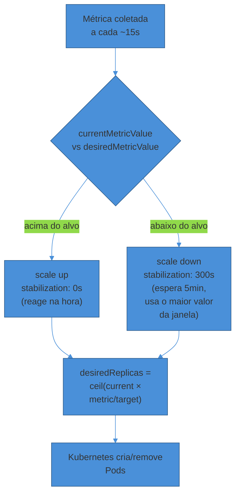
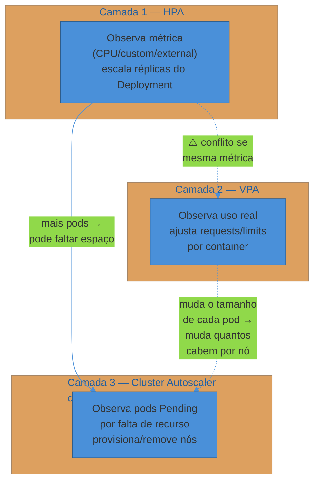
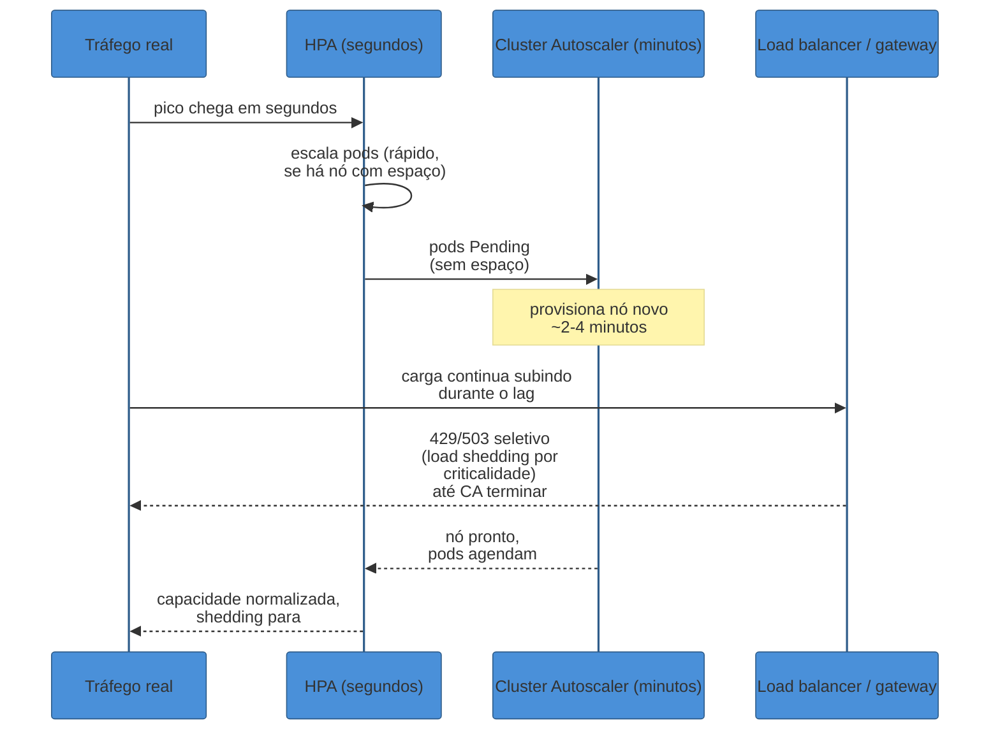

# Escala e capacidade

> [!abstract] TL;DR
> Escalar bem tem duas falhas simétricas, e a indústria só fala da metade mais dramática. A óbvia: a Black Friday chega, o tráfego sobe 10x em minutos, e o sistema não escala a tempo — cai, ou escala rápido demais e a conta de cloud explode no dia seguinte. A silenciosa: 200 réplicas rodando a 5% de utilização às 3h da manhã, sem ninguém olhando, queimando dinheiro todo santo dia. Em produção, **autoscaling automático** resolve isso com três camadas independentes que operam em ritmos diferentes — **HPA** escala o número de *pods* por métrica (CPU, memória, ou métrica customizada como requests/s ou profundidade de fila), **VPA** ajusta o *tamanho* de cada pod (requests/limits), e **Cluster Autoscaler** escala os *nós* do cluster quando faltam recursos pra agendar mais pods. As três resolvem problemas diferentes e têm janelas de reação diferentes — HPA reage em segundos a minutos, Cluster Autoscaler leva minutos porque precisa provisionar máquina nova. Esse lag é o motivo pelo qual autoscaling reativo sozinho não resolve picos abruptos: quando o pico chega em segundos e o autoscaler reage em minutos, alguém precisa decidir entre **pré-provisionar** para eventos previstos ou **derrubar carga graciosamente** (*load shedding*) até a capacidade alcançar a demanda. Capacity planning é o exercício de dimensionar tudo isso com um número — quantas réplicas para X req/s — e headroom suficiente pra não colapsar no primeiro soluço.

São 23h58 de uma sexta-feira de Black Friday. O dashboard de tráfego, que vinha subindo suavemente a manhã inteira, entra numa curva quase vertical: a campanha de meia-noite disparou. Em quatro minutos, o número de requests por segundo passa de 3.000 para 28.000 — quase 10x.

O HPA reage. As réplicas do serviço de checkout sobem de 12 para 40 em cerca de noventa segundos — rápido, porque já existiam nós ociosos no cluster com espaço pra encaixar pods novos. Mas a demanda continua subindo. Em dois minutos o HPA pede mais 60 réplicas, e agora não há mais espaço: os pods ficam em `Pending`. O Cluster Autoscaler percebe, pede três nós novos ao provedor de cloud — e aqui o relógio muda de escala. Não é mais questão de segundos: provisionar uma VM nova, ela entrar no cluster, o kubelet ficar pronto, o pod agendar e a aplicação fazer seu health check de startup leva, de forma otimista, dois a quatro minutos. Nesse intervalo — pod pendente, tráfego subindo, nó ainda não existe — a fila de checkout começa a crescer. Não porque o time errou a configuração. Porque **existe uma distância física entre "a demanda mudou" e "a capacidade mudou"**, e nenhuma automação fecha essa distância instantaneamente.

Três semanas antes, o mesmo serviço tinha o problema oposto e ninguém percebeu: às 4h de uma terça-feira comum, 40 réplicas rodavam a 6% de CPU, porque o time tinha fixado um `minReplicas` alto "pra garantir" depois de um susto anterior. Nenhum alerta disparou — under-provisioning é ruidoso (502, latência, ticket de cliente), over-provisioning é silencioso (a fatura só chega no fim do mês). Escalar bem é dominar as duas direções ao mesmo tempo: reagir rápido o suficiente pro pico não derrubar o serviço, e reduzir rápido o suficiente pro vale não queimar orçamento à toa.

## Vertical vs. horizontal: uma relembrada rápida

Duas estratégias fundamentalmente diferentes de crescer capacidade, e vale fixar o vocabulário antes de entrar em automação — o detalhe de quando escolher uma ou outra pertence a System Design ([[03 - Estimativas de escala (back-of-envelope)|Estimativas de escala]], [[01 - Escalabilidade e load balancing]]); aqui o interesse é só quem opera cada uma:

- **Escala vertical** (*scale up*): dar mais CPU/memória a uma instância existente. Em Kubernetes, isso é o domínio do **VPA** — ele não cria réplicas, ajusta o tamanho de cada pod. Tem teto físico (o maior nó disponível) e, na maioria dos casos, exige recriar o pod para aplicar o novo tamanho — não é hot-reload.
- **Escala horizontal** (*scale out*): adicionar mais instâncias idênticas. Em Kubernetes, é o domínio do **HPA** (mais réplicas do mesmo pod) e do **Cluster Autoscaler** (mais nós pra caber essas réplicas). Não tem teto físico óbvio — o limite vira orçamento, não hardware.

A razão pela qual produção historicamente prefere horizontal a vertical não é só "cloud nativa é assim" — é operacional: escalar verticalmente um processo com estado em memória (cache local, conexões abertas) frequentemente exige reiniciá-lo, o que derruba o próprio motivo de escalar (mais capacidade *agora*, sob pico). Escalar horizontalmente adiciona capacidade sem tocar nas réplicas existentes. É por isso que, em Kubernetes, o eixo automático mais usado é o horizontal — e é aí que esta nota concentra a maior parte da atenção.

## A primeira camada: HPA escala pods

O **Horizontal Pod Autoscaler** é o autoscaler mais usado do Kubernetes, e seu trabalho é simples de enunciar: manter uma métrica-alvo aproximadamente constante variando o número de réplicas. O algoritmo de decisão, documentado oficialmente, é uma fórmula direta:

```
desiredReplicas = ceil(currentReplicas × (currentMetricValue / desiredMetricValue))
```

Se o alvo de CPU é 50% e a média atual está em 100%, o HPA dobra as réplicas. Se está em 25%, corta pela metade. O controller roda esse cálculo periodicamente (por padrão a cada 15 segundos), lendo métricas via `metrics.k8s.io` (Resource — CPU/memória), `custom.metrics.k8s.io` (Pods/Object — uma métrica de aplicação, ex. requests/s por pod, ou de um objeto inteiro como um Ingress) ou `external.metrics.k8s.io` (uma métrica fora do cluster, ex. profundidade de uma fila SQS) ([Kubernetes docs — HPA](https://kubernetes.io/docs/concepts/workloads/autoscaling/horizontal-pod-autoscale/), consultado 2026-07).

Um detalhe que evita *flapping* (o HPA oscilando pra cima e pra baixo a cada ciclo): há uma **tolerância** configurável (default 10%) — o controller ignora variações da métrica dentro dessa banda, e não recalcula réplicas a cada ruído estatístico. E há uma segunda defesa, mais visível: a **janela de estabilização** (`stabilizationWindowSeconds`). O default é 0 segundos para *scale up* (reagir na hora que a métrica sobe) e **300 segundos (5 minutos) para *scale down*** — o controller olha o maior valor de réplicas desejado calculado nos últimos 5 minutos antes de reduzir, especificamente pra não desmontar capacidade que acabou de subir só porque a métrica caiu por um instante.



### O problema de escolher a métrica certa

CPU é a métrica default do HPA — e é, com frequência, a métrica errada. O problema é conceitual: **CPU mede consumo de recurso, não carga percebida pelo usuário**. Um serviço I/O-bound — que passa a maior parte do tempo esperando uma query de banco ou uma chamada a outro serviço — pode estar com fila de requests crescendo, latência subindo, usuários esperando, e CPU baixa o tempo todo, porque o processo está *ocioso esperando*, não *ocupado processando*. O HPA olhando só CPU não vê motivo pra escalar, porque do ponto de vista da métrica que ele acompanha, nada mudou.

> [!warning] "CPU em 80%, deve estar tudo bem" — não necessariamente
> **O que acontece:** um serviço com HPA configurado só em CPU (target 70%) está com fila de requests crescendo e p99 subindo, mas CPU está em 40% — o time olha o painel de CPU, vê número baixo, e demora a associar o sintoma (latência) à causa (falta de réplicas).
> **Por quê:** o serviço é I/O-bound — está esperando uma dependência lenta, não computando. CPU baixa não significa capacidade sobrando; significa que o gargalo está em outro lugar (conexões de banco, threads bloqueadas, fila).
> **Como evitar:** escalar em CPU só faz sentido pra workload genuinamente CPU-bound. Pra tudo que serve requisições HTTP/RPC, a métrica mais honesta costuma ser algo direto de negócio — requests em voo, requests/s por réplica, profundidade de fila, latência de fila. Isso exige expor uma métrica customizada (via Prometheus Adapter ou similar) que alimente o HPA por `custom.metrics.k8s.io` — mais trabalho de instrumentação, mas escala pelo sintoma real, não por um proxy indireto.

A métrica certa depende do formato de carga: para um serviço síncrono servindo HTTP, *requests em voo* ou *requests/s por pod* costuma refletir melhor a saturação do que CPU. Para um worker consumindo de uma fila, *profundidade da fila* (ou, melhor ainda, *tempo de espera na fila*) é o sinal direto — e é exatamente o cenário que o KEDA resolve nativamente, como a próxima seção mostra.

## KEDA: autoscaling orientado a eventos, e escala a zero

O **HPA nativo** cobre bem workloads que expõem métricas via `metrics.k8s.io`/`custom.metrics.k8s.io`, mas ele não fala nativamente com filas externas (RabbitMQ, Kafka, SQS, Azure Service Bus) nem sabe escalar um Deployment até **zero** réplicas quando não há trabalho algum. O **KEDA** (Kubernetes Event-Driven Autoscaling) preenche esse vão: é um componente leve, single-purpose, que atua como *metrics adapter* alimentando o HPA nativo com métricas de fontes externas — ele não substitui o HPA, ele o estende ([KEDA docs — Scaling Deployments](https://keda.sh/docs/2.20/concepts/scaling-deployments/), consultado 2026-07).

A configuração central do KEDA é o `ScaledObject`, onde você declara um *trigger* — "escale este Deployment pela profundidade da fila X" ou "pelo lag do consumer group Kafka Y" — e um `minReplicaCount` que, diferente do HPA puro (que sempre exige pelo menos 1 réplica), **pode ser zero**. Isso muda o modelo de custo de um jeito relevante em produção: um worker de processamento em batch que só roda algumas horas por dia não precisa manter réplicas ociosas o resto do tempo — o KEDA desliga tudo quando a fila está vazia, e liga de novo quando chega a primeira mensagem.

O preço dessa economia é latência de partida fria: se o `minReplicaCount` é zero, a primeira mensagem que chega depois de um período parado espera o pod inteiro subir — puxar imagem (se não estiver em cache local do nó), inicializar o processo, passar pelo readiness probe — antes de ser processada. Para um worker de batch noturno, isso é irrelevante. Para um serviço no caminho crítico de uma requisição de usuário, escalar a zero troca economia de recurso por latência de cauda inaceitável na primeira requisição depois de um vale — decisão que precisa ser deliberada, não default.

## VPA: ajusta o tamanho, não a quantidade

Enquanto HPA e Cluster Autoscaler resolvem "quantos", o **Vertical Pod Autoscaler** resolve "do que tamanho": ele observa o consumo real de CPU/memória de cada container ao longo do tempo e recomenda (ou aplica) `requests` ajustados — a alternativa a um time chutando `requests: 500m` na criação do manifesto e nunca mais revisitando, deixando o valor errado por meses conforme o comportamento real do serviço muda.

O VPA opera em modos, sendo os principais **Off** (só calcula e expõe a recomendação, não aplica nada — útil pra calibrar valores manualmente antes de automatizar), **Initial** (aplica a recomendação só na criação do pod, nunca depois) e **Auto/Recreate** (aplica em pods já rodando, o que hoje exige recriar o pod — evict e recriar com o novo request; versões recentes do projeto vêm trabalhando em modos que ajustam recursos *in-place*, sem recriar).

> [!warning] HPA e VPA na mesma métrica é conflito, não redundância
> **O que acontece:** um time, achando que "mais automação é sempre melhor", configura HPA em CPU e VPA (modo Auto) também em CPU no mesmo Deployment.
> **Por quê:** os dois reagem ao mesmo sinal de formas incompatíveis. O HPA calcula réplicas com base na razão CPU-atual/CPU-alvo *por pod*; se o VPA muda o `request` de CPU de cada pod no meio do caminho, ele muda o denominador dessa conta sem o HPA saber — os dois controllers competem, e o sistema oscila em vez de convergir.
> **Como evitar:** separar por eixo. Um padrão comum: HPA cuida da métrica-alvo de negócio (CPU só se for genuinamente CPU-bound, ou uma métrica custom), VPA cuida de memória (raramente é o eixo que o HPA usa) ou roda em modo Off/Initial só para calibrar valores de request, sem aplicar automaticamente em produção viva. Nunca HPA-em-CPU + VPA-Auto-em-CPU no mesmo objeto.

## A segunda camada: Cluster Autoscaler escala os nós

HPA cria pods novos — mas um pod novo só roda se existir um nó com CPU/memória disponível pra agendá-lo. Quando não existe, o pod fica em estado `Pending`, e é exatamente esse sinal que o **Cluster Autoscaler** (CA) monitora: ele varre o cluster periodicamente (por padrão a cada 10 segundos, via `--scan-interval`), simula se algum pod pendente conseguiria ser agendado adicionando um nó a algum node group, e se sim, pede ao provedor de cloud um nó novo ([kubernetes/autoscaler — Cluster Autoscaler FAQ](https://github.com/kubernetes/autoscaler/blob/master/cluster-autoscaler/FAQ.md), consultado 2026-07).

Escalar para baixo segue lógica simétrica, mas mais cautelosa: um nó é candidato a remoção quando a soma dos `requests` de todos os pods nele fica abaixo de um limiar (por padrão, 50% da capacidade alocável do nó) por um período contínuo — o parâmetro `--scale-down-unneeded-time`, com default de 10 minutos. Só depois desse tempo sustentado o CA dispara o *drain* do nó (reagendando os pods em outro lugar) e o desliga. O motivo do delay generoso é o custo assimétrico do erro: reagendar pods e destruir um nó que era só temporariamente ocioso custa reprovisionar de novo minutos depois — pior que ter deixado o nó vivo um pouco mais.

Um nome que aparece com frequência crescente ao lado do Cluster Autoscaler, sobretudo em AWS, é o **Karpenter**: um provisionador de nós que reage a pods pendentes via *watch* (evento em tempo real) em vez de *polling* periódico, e provisiona instâncias diretamente — sem a camada intermediária de "node groups" pré-definidos que o CA tradicional usa. A documentação do próprio Karpenter recomenda **não rodar Cluster Autoscaler e Karpenter simultaneamente no mesmo cluster**: os dois competiriam pelo mesmo pod pendente, tentando resolvê-lo cada um a seu jeito ([Karpenter docs — Migrating from Cluster Autoscaler](https://karpenter.sh/docs/getting-started/migrating-from-cas/), consultado 2026-07). Para efeitos desta nota, os dois resolvem o mesmo problema (escalar nós); a escolha entre eles é detalhe de provedor de cloud, fora do escopo — a lógica operacional de "pod pendente → nó novo" é a mesma.

> [!warning] Scale-down de nó sem PodDisruptionBudget derruba disponibilidade
> **O que acontece:** o Cluster Autoscaler decide remover um nó subutilizado, faz o *drain* — que expulsa todos os pods dali para serem reagendados em outro lugar — e, num serviço sem `PodDisruptionBudget` configurado, todas as réplicas desse serviço que por acaso estavam concentradas naquele nó saem do ar ao mesmo tempo, antes de o Kubernetes conseguir religá-las em outro lugar.
> **Por quê:** scale-down é, do ponto de vista do serviço afetado, uma disrupção *voluntária* — ninguém caiu, o cluster decidiu ativamente remover capacidade. Sem um PDB dizendo "nunca menos que N réplicas disponíveis ao mesmo tempo", o CA (e qualquer outro processo de drain, como um upgrade de nó) não tem como saber que aquele nó concentra réplicas demais de um serviço crítico.
> **Como evitar:** todo serviço com requisito de disponibilidade real precisa de um `PodDisruptionBudget` (`minAvailable` ou `maxUnavailable`) — o mesmo mecanismo que a nota anterior deste sub-galho detalha para alta disponibilidade geral ([[03 - Zero-downtime e alta disponibilidade]]). Sem ele, o autoscaling que deveria ser invisível ao usuário vira, ele mesmo, uma fonte de incidente.

## As três camadas juntas

Nenhuma das três camadas isoladamente resolve o problema de capacidade em produção — elas resolvem, em conjunto, três perguntas diferentes em cascata: quantos pods? do que tamanho? em quantos nós?



A ordem de reação importa: HPA costuma reagir primeiro (segundos), porque só precisa criar objetos Pod dentro de um cluster que já tem espaço. Cluster Autoscaler reage depois (minutos), porque depende de uma chamada de API ao provedor de cloud, o boot de uma VM, e o kubelet ficando pronto. É esse desnível de velocidade — a camada 1 rápida, a camada 3 lenta — que está no centro do problema de "reactive vs. predictive scaling" na próxima seção.

> [!question]- Preciso das três camadas em todo serviço?
> Não. HPA é praticamente universal — qualquer serviço com carga variável se beneficia. VPA é mais situacional: útil pra calibrar requests de serviços com padrão de consumo estável mas historicamente mal dimensionados (modo Off pra recomendar, sem aplicar automaticamente), menos útil se você já tem boa observabilidade de uso real e ajusta manualmente. Cluster Autoscaler (ou Karpenter) só entra em jogo se o cluster não tem folga permanente de nós — um cluster pequeno, de baixa criticidade, pode rodar com capacidade de nó fixa e HPA sozinho, aceitando que o teto de réplicas é o teto de nós disponíveis.

## Capacity planning: o número por trás do autoscaling

Autoscaling automatiza a *reação*, mas alguém ainda precisa responder, antes do primeiro deploy, uma pergunta de dimensionamento: **quantas réplicas eu preciso para atender X req/s, e com quanto headroom?**

O cálculo de back-of-envelope é direto — a mesma lógica que System Design ensina pra dimensionar um sistema do zero ([[03 - Estimativas de escala (back-of-envelope)|Estimativas de escala]]), aplicada aqui à operação de um serviço que já existe e cujo throughput por réplica você pode medir:

```
réplicas necessárias = pico_esperado_rps / rps_sustentável_por_réplica
```

Um exemplo numérico concreto. Um serviço de checkout, sob teste de carga controlado, sustenta **80 req/s por réplica** com p99 abaixo de 200ms antes de a latência começar a degradar. O pico esperado para a Black Friday, com base no tráfego do ano anterior multiplicado pela projeção de crescimento, é **6.400 req/s**.

```
réplicas no pico = 6.400 / 80 = 80 réplicas
```

Rodar exatamente 80 réplicas no momento exato do pico é a matemática ingênua — e é exatamente onde o *headroom* entra. O **SRE Workbook** do Google descreve o padrão **N+2**: dimensionar para que o pico seja atendido mesmo com as duas maiores unidades de capacidade fora do ar simultaneamente — uma falha planejada (ex. um nó em manutenção) mais uma não planejada (ex. um nó que caiu de verdade) ao mesmo tempo ([Google SRE Workbook — Non-Abstract Large System Design](https://sre.google/workbook/non-abstract-design/), consultado 2026-07). E, independente da margem de redundância, o workbook é explícito num segundo ponto: **nunca dimensionar para rodar a 100% de utilização no pico** — sistemas reais degradam (GC mais frequente, filas internas crescendo, tail latency subindo) bem antes de bater o teto nominal, então uma fração do headroom é reservada só para operar longe da borda de degradação, não para cobrir falha.

Aplicando isso ao exemplo: em vez de dimensionar exatamente para 80, o time reserva **30% de headroom** — parte para cobrir a chance de o pico real superar a projeção (projeções erram, sobretudo em campanhas), parte para manter o sistema longe do teto de degradação:

```
réplicas provisionadas = 80 × 1,3 ≈ 104 réplicas
```

O custo dessa decisão é visível e mensurável: se cada réplica custa aproximadamente **$0,08/hora** (uma instância pequena típica de cloud pública), rodar 104 réplicas 24 horas custa **$200/dia**, contra **$154/dia** rodando exatamente as 80 calculadas sem margem — uma diferença de **$46/dia**, ou pouco mais de **$1.400/mês**, só de headroom. Esse número não é desperdício abstrato: é o preço explícito de comprar margem de segurança, e é exatamente o tipo de conta que devia estar numa planilha de FinOps, não escondida atrás de "a gente sempre roda com folga por garantia".

O contraponto simétrico — e é aqui que a nota volta à cena de abertura, o vale silencioso — é que esse mesmo raciocínio de headroom só se justifica **no pico**. Manter 104 réplicas rodando 24h/dia quando o tráfego real de segunda a quinta de madrugada sustenta 15 réplicas confortavelmente é queimar a mesma margem de segurança em horários que nunca vão precisar dela. É exatamente o papel do HPA (ajustando dinamicamente entre um `minReplicas` baixo e um `maxReplicas` dimensionado pro pico) resolver essa faixa — capacity planning define os extremos (o piso de segurança e o teto de pico), o autoscaling navega entre eles em tempo real.

A tabela abaixo torna esse contraste concreto, comparando três posturas para o mesmo serviço de checkout ao longo de 24 horas — sempre com os mesmos 80 req/s por réplica e o mesmo custo de $0,08/réplica-hora:

| Postura | Réplicas | Cenário | Custo/dia |
|---|---|---|---|
| Fixo no pico (sem autoscaling) | 104 (fixo, 24h) | Nunca falta capacidade, mas queima dinheiro nas 20h de vale | $200/dia |
| Fixo no vale (sem headroom) | 15 (fixo, 24h) | Barato, mas cai duro nas 4h de pico real | $28,80/dia — até o pico chegar |
| HPA entre `minReplicas: 15` e `maxReplicas: 104` | varia por hora | Paga pico só nas ~4h que precisa, paga vale nas ~20h restantes | ≈ (104×4 + 15×20) × $0,08 ≈ **$57,28/dia** |

A terceira linha é o motivo de toda essa camada de automação existir: o autoscaling não é uma otimização de conforto, é a diferença entre pagar por 104 réplicas o dia inteiro ($200/dia) e pagar, na prática, um custo médio muito mais próximo do vale — porque o pico dura horas, não o dia inteiro. Nesse exemplo simplificado, a diferença entre a postura fixa-no-pico e a postura com HPA é de **mais de $142/dia**, ou cerca de **$4.300/mês** — só nesse serviço.

> [!question]- Por que não simplesmente "escalar bastante e nunca ficar sem capacidade"?
> Porque capacidade não usada custa dinheiro real, todo dia, sem gerar valor nenhum — o cenário das 3h da manhã na abertura desta nota. Superdimensionar "por garantia" parece prudente até alguém somar a fatura de cloud do trimestre e perceber que 60% da capacidade provisionada nunca foi de fato usada. A resposta madura não é "provisionar pouco" nem "provisionar muito" — é medir o padrão real de demanda (picos, vales, sazonalidade) e dimensionar o piso e o teto com dados, deixando o autoscaling cobrir a faixa entre eles automaticamente.

## Reactive vs. predictive scaling: o lag que ninguém consegue eliminar

Voltando à cena de abertura: o HPA reagiu em segundos, mas o Cluster Autoscaler levou minutos — porque provisionar hardware novo tem uma física própria que nenhuma configuração resolve totalmente. Esse é o limite estrutural do **autoscaling reativo**: ele *responde* a uma métrica que já mudou, e a resposta tem latência inerente — a métrica precisa cruzar o limiar, o controller precisa detectar, a ação precisa ser executada, e a capacidade nova precisa ficar pronta para servir. Para picos graduais (crescimento ao longo de horas), esse lag é irrelevante. Para picos abruptos — um lançamento de produto, uma campanha de mídia, uma virada de meia-noite de Black Friday — o lag pode ser a diferença entre "escalou a tempo" e "caiu antes de escalar".

A resposta operacional a esse lag tem dois nomes:

**Pré-provisionamento (scaling preditivo/agendado).** Quando o evento é conhecido com antecedência — uma campanha de marketing, um lançamento, a própria virada de Black Friday — a prática madura não é confiar no autoscaler reagir a tempo; é *ajustar o `minReplicas` do HPA antecipadamente* (ou provisionar nós extra manualmente) horas antes do evento, e deixar o autoscaling automático cuidar só da variação residual em torno desse piso elevado. Isso troca "reagir ao pico" por "já estar no tamanho certo quando o pico chega" — o oposto do cenário da abertura, onde o time confiou inteiramente na reação automática.

Mecanicamente, esse ajuste antecipado costuma ser feito de duas formas. A mais simples é um passo manual no runbook do evento — alguém (ou um job de CI/CD agendado) faz `kubectl patch hpa checkout --patch '{"spec":{"minReplicas": 40}}'` às 22h, três horas antes da virada, e reverte no dia seguinte. A mais robusta é declarativa: o próprio KEDA tem um *cron scaler*, que aceita uma janela de horário (`start`/`end` em formato cron) dentro da qual o `minReplicaCount` sobe automaticamente — a mesma ideia do `minReplicas` manual, só que versionada como configuração e reproduzível todo ano, sem depender de alguém lembrar de rodar o comando na hora certa. Para eventos recorrentes (Black Friday é uma vez por ano, mas "pico de segunda de manhã" pode ser toda semana), a versão declarativa evita reconstruir o mesmo runbook manual repetidamente.

> [!question]- Pré-provisionar não é só "voltar a superdimensionar", o problema que a nota inteira tenta evitar?
> É uma versão *temporária e deliberada* do mesmo trade-off, não uma regressão para o problema original. A diferença é a janela: superdimensionar permanentemente (o cenário das 3h da manhã) paga o custo todos os dias sem necessidade. Pré-provisionar para um evento conhecido paga o custo só na janela em que o risco de ficar sem capacidade é real e caro — e depois volta ao piso normal automaticamente (via cron scaler ou reversão manual agendada). É o mesmo raciocínio de capacity planning desta nota, só que aplicado a uma janela de tempo específica em vez de ao regime permanente do serviço.

**Load shedding (quando não dá pra escalar a tempo).** Para picos que nenhum pré-provisionamento previu — o cenário verdadeiramente inesperado — a alternativa a deixar o sistema colapsar sob demanda que ele não consegue atender é **rejeitar parte da carga deliberadamente**, de forma controlada, para proteger a capacidade de atender o resto. O *Google SRE Book*, no capítulo "Handling Overload", formaliza essa ideia: um backend bem-comportado aceita apenas as requisições que consegue processar e recusa o excedente de forma graciosa — normalmente com **429 (Too Many Requests)** ou **503 (Service Unavailable)** — em vez de aceitar tudo e degradar todo mundo igualmente até travar por inteiro ([Google SRE Book — Handling Overload](https://sre.google/sre-book/handling-overload/), consultado 2026-07).

O refinamento que separa load shedding ingênuo de load shedding bem feito é **priorização por criticalidade**: o sistema de *adaptive throttling* do Google mantém contadores separados por nível de criticidade da requisição, e quando uma tarefa está sobrecarregada, descarta primeiro as requisições de prioridade mais baixa — tráfego de batch analítico, por exemplo — preservando capacidade para o tráfego crítico, como uma transação de checkout. Requisições derivadas (um fan-out interno gerado a partir de uma requisição original) herdam por padrão a criticalidade da requisição que as originou, para que um sistema de baixa prioridade não acabe consumindo capacidade sob o disfarce de outro de alta prioridade.



Load shedding não é admissão de derrota — é a alternativa deliberada a um colapso total. Um sistema que rejeita 15% do tráfego não-crítico com um 429 limpo continua servindo os 85% restantes normalmente. Um sistema que tenta aceitar 100% sob sobrecarga real tipicamente degrada *tudo* — filas internas crescem sem controle, timeouts em cascata se propagam, e o resultado final é pior que ter recusado educadamente uma fatia desde o início. Essa lógica de proteção contra colapso em cascata — timeouts, retries, circuit breakers — é aprofundada na próxima nota deste sub-galho, [[06 - Resiliência operacional]]; aqui, load shedding entra especificamente como a resposta imediata a uma sobrecarga que o autoscaling ainda não alcançou.

## Thundering herd: o efeito colateral de escalar rápido

Um detalhe que pega equipes de surpresa: escalar rápido pode, paradoxalmente, *piorar* a sobrecarga por alguns segundos, em vez de aliviá-la. Quando dez, vinte, cinquenta pods novos sobem simultaneamente sob pressão de um pico, cada um deles inicializa com **cache local vazio** — nenhum dado quente, nenhuma conexão estabelecida. Se todos eles, ao ficarem prontos, disparam a mesma consulta ao mesmo cache remoto ou ao mesmo banco de dados para aquecer, o resultado é um "*herd*" auto-infligido: uma rajada correlacionada de requisições idênticas batendo exatamente na dependência que o autoscaling deveria estar aliviando, esgotando *connection pools* e fazendo filas de query explodirem numa cascata de timeouts (Redis Engineering, [*How to tame the thundering herd problem*](https://redis.io/blog/how-to-tame-the-thundering-herd-problem/), consultado 2026-07).

O mesmo padrão pode acontecer mais cedo ainda, no *cold start* de cada pod individual: um processo que precisa carregar um modelo de ML na memória, popular um cache local, ou estabelecer um pool de conexões antes de responder ao primeiro *health check* de prontidão — enquanto isso não termina, o pod aparece pendente ou não-pronto, e a capacidade nominal do autoscaler ("já tenho 40 réplicas!") não bate com a capacidade real disponível pra servir tráfego.

Mitigações práticas incluem *request coalescing* (deduplicar, no nível do cache, requisições idênticas em voo simultâneas para o mesmo dado, para que só uma de fato chegue ao banco), *jitter* no TTL de cache (evitar que um lote inteiro de chaves expire no mesmo instante), e *warm-up gradual* — o load balancer direciona uma fração pequena de tráfego para um pod recém-criado, aumentando progressivamente conforme ele "aquece", em vez de jogar 100% do tráfego nele no instante em que o readiness probe passa. Essa é, aliás, a mesma lógica de *readiness gating* discutida na nota anterior deste sub-galho ([[03 - Zero-downtime e alta disponibilidade]]) — só que aplicada não a evitar perder requests durante um deploy, e sim a evitar sobrecarregar dependências durante um scale-out.

## O custo de escalar: uma nota breve de FinOps

Escalar automaticamente resolve o problema de disponibilidade, mas introduz um problema de custo que precisa de dono explícito — senão vira exatamente o cenário silencioso da abertura desta nota. Três práticas concretas fecham esse ciclo:

- **`maxReplicas` como teto orçamentário, não só técnico.** O HPA sem `maxReplicas` bem pensado pode, em teoria, escalar até esgotar a cota da conta de cloud inteira, respondendo com fidelidade perfeita a uma métrica que pode ela mesma estar errada (um vazamento de memória gerando pressão artificial, por exemplo). O teto não é só "quanto o sistema aguenta" — é "quanto o orçamento aguenta".
- **`minReplicas` baixo em ambientes que não precisam de disponibilidade 24/7.** Ambientes de desenvolvimento, staging, ou serviços internos de uso apenas em horário comercial são candidatos naturais a `minReplicas: 0` via KEDA (escala a zero fora do expediente) — a economia é direta e o custo de latência de cold start é aceitável, porque ninguém está esperando em produção real.
- **Revisão periódica do headroom calculado**, não uma decisão fixada uma vez e esquecida. O exemplo numérico desta nota (30% de headroom, ~$1.400/mês) parte de uma projeção de pico; se o padrão de tráfego real muda — a campanha performa diferente do esperado, o produto cresce ou encolhe — o número de capacity planning precisa ser recalculado, não herdado indefinidamente do último exercício.

Nenhuma dessas três é sofisticada. O que costuma faltar não é técnica, é **dono**: alguém revisando `minReplicas`/`maxReplicas` como parte do ciclo operacional normal, do mesmo jeito que se revisa SLO — não como tarefa avulsa depois que a fatura já surpreendeu alguém.

## Em entrevista

Perguntas sobre autoscaling aparecem tanto em entrevistas de System Design ("como você escalaria esse sistema sob pico?") quanto em entrevistas focadas em operação/SRE ("como você configuraria autoscaling em produção?") — e a resposta que diferencia sênior de pleno não é citar HPA/VPA/Cluster Autoscaler de memória, é **amarrar as peças a uma decisão concreta**:

- Se você distingue as **três camadas** e sabe qual resolve qual problema — "quantos pods" (HPA) é diferente de "do que tamanho" (VPA) é diferente de "quantos nós" (Cluster Autoscaler) — em vez de tratar "autoscaling" como uma coisa só.
- Se você sabe que **CPU nem sempre é a métrica certa** e consegue explicar por que (workload I/O-bound não move CPU quando está sob pressão real) — sinal de quem já debugou um HPA que "não estava escalando" mesmo sob carga visível.
- Se você reconhece o **lag entre reagir e ter capacidade pronta**, e sabe que a resposta pra picos previsíveis é pré-provisionar, e pra picos imprevistos é load shedding — não "só confiar no autoscaler".
- Se você consegue fazer a **conta de capacity planning** de cabeça — réplicas = pico/throughput-por-réplica, com headroom explicado — e articular o trade-off de custo, não só a fórmula.
- Se você menciona o **custo** como parte do design, não como afterthought — mostra maturidade de quem já viu uma fatura de cloud inesperada, não só quem leu a documentação do HPA.

A resposta fraca lista as siglas. A resposta forte conta a física por trás delas: "HPA reage em segundos porque só cria objetos dentro de um cluster que já tem espaço; Cluster Autoscaler leva minutos porque depende de provisionar hardware de verdade — e é exatamente esse desnível que me faz pré-provisionar pra eventos conhecidos e configurar load shedding pra os que não são."

## How to explain in English

Autoscaling and capacity terminology is used almost interchangeably in English and Portuguese in technical conversations — but a few distinctions are worth locking in for interviews conducted in English.

> "Production autoscaling isn't one mechanism, it's three layers operating at different speeds. The Horizontal Pod Autoscaler scales the number of pods based on a metric — and CPU is often the wrong metric for I/O-bound services, since a service can be saturated on latency while sitting at low CPU. The Vertical Pod Autoscaler resizes individual pods' resource requests, but running it alongside HPA on the same metric causes a feedback conflict, so they need to target different axes. The Cluster Autoscaler scales the underlying nodes when pods can't be scheduled — and that's the slow layer, because provisioning real hardware takes minutes, not seconds. That lag is why reactive autoscaling alone doesn't handle sudden spikes: for known events, we pre-provision ahead of time; for unknown spikes, we fall back to graceful load shedding — rejecting lower-priority traffic with a clean 429 or 503 to protect capacity for what matters most, rather than letting the whole system degrade."

| PT | EN |
|----|----|
| Escalonamento automático | Autoscaling |
| Escala horizontal / vertical | Horizontal / vertical scaling (scale out vs. scale up) |
| Réplicas | Replicas |
| Métrica customizada | Custom metric |
| Janela de estabilização | Stabilization window |
| Escala a zero | Scale to zero |
| Planejamento de capacidade | Capacity planning |
| Margem de segurança / folga | Headroom |
| Superprovisionamento / subprovisionamento | Over-provisioning / under-provisioning |
| Derrubada de carga graciosa | (Graceful) load shedding |
| Degradação graciosa | Graceful degradation |
| Efeito manada / rajada correlacionada | Thundering herd |
| Partida fria | Cold start |
| Escalonamento reativo / preditivo | Reactive / predictive scaling |

## O que vem a seguir

Esta nota resolveu "quantos recursos, e quando" — a dimensão de capacidade. A próxima olha para outro eixo de produção que também acontece na borda do cluster: como o tráfego *chega* até essas réplicas escaladas, e o que acontece nessa fronteira antes mesmo de um request encontrar um pod.

- [[05 - Rede e borda em produção]] — Ingress, TLS termination, rate limiting na borda: a camada que decide, antes do autoscaling, quem consegue nem sequer chegar ao cluster
- [[06 - Resiliência operacional]] — timeouts, retries, circuit breaker sob a ótica de quem opera: o que fazer quando uma dependência (não o próprio serviço) é quem está sobrecarregada

## Veja também

- [[Operação/index|Operação]] — o galho-pai e o mapa completo da trilha
- [[3 - Rodar em produção/index|Rodar em produção]] — este sub-galho
- [[03 - Estimativas de escala (back-of-envelope)]] — a matemática de dimensionamento (System Design), aplicada aqui sob a ótica operacional de manter isso vivo automaticamente
- [[01 - Escalabilidade e load balancing]] — o design de sistemas distribuídos que suporta escalar horizontalmente; esta nota assume esse desenho pronto e foca em operá-lo

## Fontes

- **Kubernetes** — [*Horizontal Pod Autoscaling*](https://kubernetes.io/docs/concepts/workloads/autoscaling/horizontal-pod-autoscale/) (kubernetes.io/docs, consultado 2026-07) — algoritmo `desiredReplicas`, tipos de métrica, tolerância e `stabilizationWindowSeconds`.
- **kubernetes/autoscaler** — [*Vertical Pod Autoscaler — README*](https://github.com/kubernetes/autoscaler/blob/master/vertical-pod-autoscaler/README.md) e [*features.md*](https://github.com/kubernetes/autoscaler/blob/master/vertical-pod-autoscaler/docs/features.md) (consultado 2026-07) — modos de update do VPA (Off/Initial/Auto/Recreate).
- **kubernetes/autoscaler** — [*Cluster Autoscaler FAQ*](https://github.com/kubernetes/autoscaler/blob/master/cluster-autoscaler/FAQ.md) (consultado 2026-07) — critérios de scale up (pods Pending) e scale down (`--scale-down-unneeded-time`, default 10min, limiar ~50% de utilização).
- **Karpenter** — [*Migrating from Cluster Autoscaler*](https://karpenter.sh/docs/getting-started/migrating-from-cas/) (karpenter.sh, consultado 2026-07) — provisionamento direto via watch, recomendação de não rodar junto com Cluster Autoscaler.
- **KEDA** — [*Scaling Deployments*](https://keda.sh/docs/2.20/concepts/scaling-deployments/) (keda.sh, consultado 2026-07) — `ScaledObject`, triggers externos, `minReplicaCount: 0` e scale-to-zero.
- **Google** — [*Site Reliability Engineering* — Handling Overload](https://sre.google/sre-book/handling-overload/) (sre.google/books, consultado 2026-07) — load shedding, adaptive throttling por criticalidade, graceful degradation.
- **Google** — [*The Site Reliability Workbook* — Non-Abstract Large System Design](https://sre.google/workbook/non-abstract-design/) (sre.google/workbook, consultado 2026-07) — o padrão de redundância N+2 e o princípio de nunca dimensionar para 100% de utilização no pico.
- **Redis (Engineering Blog)** — [*How to tame the thundering herd problem*](https://redis.io/blog/how-to-tame-the-thundering-herd-problem/) (redis.io/blog, consultado 2026-07) — rajadas correlacionadas de cache/DB ao escalar, request coalescing, jitter de TTL, warm-up gradual.
- **Kubernetes** — [*Pod Lifecycle*](https://kubernetes.io/docs/concepts/workloads/pods/pod-lifecycle/) (kubernetes.io/docs, consultado 2026-07) — base para o comportamento de readiness/probes referenciado na seção de thundering herd/cold start.
