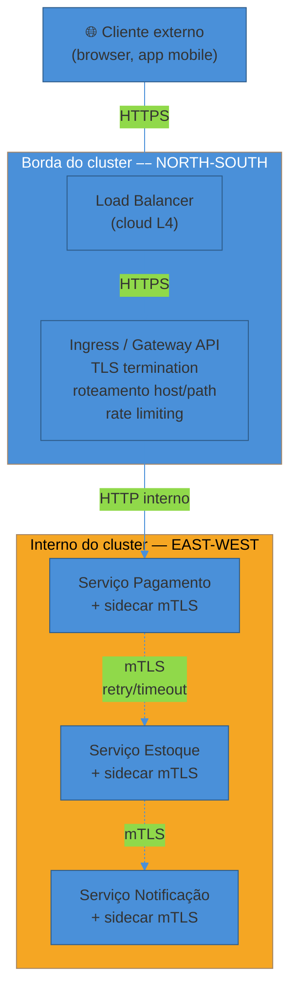
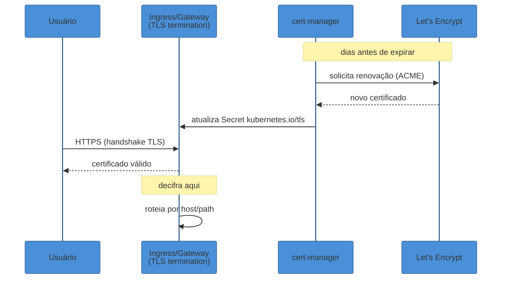
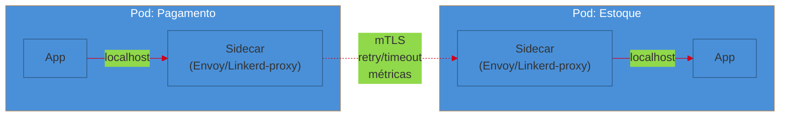

# Rede e borda em produção

> [!abstract] TL;DR
> Um cluster de produção tem duas redes distintas, com preocupações diferentes. **North-south** é o tráfego que entra vindo de fora — resolvido por um **Ingress** ou, no padrão que o sucede desde 2023, a **Gateway API**: um proxy reverso (Nginx, Envoy) que roteia por host/path, termina TLS (com `cert-manager` renovando certificados Let's Encrypt automaticamente) e aplica rate limiting antes de qualquer request tocar sua aplicação. **East-west** é o tráfego entre serviços dentro do cluster — resolvido primeiro por **service discovery via DNS** (CoreDNS), e, quando a superfície cresce, por um **service mesh** (Istio, Linkerd) que injeta um proxy sidecar em cada pod para dar **mTLS automático** (criptografia serviço-a-serviço sem tocar no código), observabilidade de quem chama quem, e traffic management (retry/timeout/circuit breaking no proxy, não na aplicação). Mesh tem custo real — memória e latência por sidecar, complexidade operacional — e a arquitetura **ambient mesh** (sem sidecar, com um proxy compartilhado por nó) existe justamente para reduzir esse custo. Por cima de tudo isso, **NetworkPolicies** funcionam como firewall interno: por padrão o Kubernetes permite todo tráfego pod-a-pod, e é preciso negar explicitamente para ter zero-trust de verdade.

> [!info] A contraparte instrumental (2026-08-04)
> Gateway API, service mesh, NetworkPolicy e a operação da borda são assunto desta nota. O galho [[03-Dominios/Tecnologia/Infraestrutura/Kubernetes/index|Tecnologia/Infraestrutura/Kubernetes]] cobre a camada de baixo: o Ingress como objeto e o controlador que o implementa em [[03-Dominios/Tecnologia/Infraestrutura/Kubernetes/15 - Ingress e a borda do cluster|15]], e o mecanismo por dentro — modelo de rede plano, CNI, os modos do kube-proxy e o DNS do cluster — em [[03-Dominios/Tecnologia/Infraestrutura/Kubernetes/20 - Rede do cluster por dentro|20]].

Um cluster de produção com 40 microserviços tem duas perguntas de rede que nenhum dos serviços, isoladamente, responde:

A primeira: **um usuário no celular manda uma requisição HTTPS para `api.suaempresa.com`. Por onde ela entra? Quem decide se `/checkout` vai para o serviço de pagamento e `/produtos` vai para o catálogo? Onde o HTTPS vira HTTP, e quem administra o certificado que garante que é mesmo `suaempresa.com` do outro lado?**

A segunda, mais silenciosa: **o serviço de pagamento, depois de receber a requisição, precisa chamar o serviço de estoque, que precisa chamar o serviço de notificação. Como o pagamento sabe o endereço do estoque, se os pods do estoque são recriados o tempo todo com IPs novos? Essa chamada interna é criptografada, ou dois pods conversam em texto puro dentro do cluster? Se o estoque começar a responder devagar, alguém está vendo isso, ou o sintoma só aparece quando o cliente final reclama?**

Você já sabe operar Nginx como proxy reverso de um monólito, e já viu o load balancer como conceito abstrato em System Design — uma caixa que distribui requisições entre réplicas. O que muda em produção, num cluster real, é que essas duas perguntas passam a ter **nomes técnicos, ferramentas dedicadas e uma fronteira nítida entre elas**: tudo que entra e sai do cluster é tráfego **north-south**; tudo que os serviços trocam entre si, dentro do cluster, é tráfego **east-west**. E, ao contrário do que a intuição sugere, é o segundo que domina o volume — em arquiteturas de microserviços, o tráfego east-west tipicamente excede o north-south em ordens de grandeza, porque uma única requisição de usuário pode disparar dezenas de chamadas internas antes de voltar uma resposta.

Esta nota separa as duas dimensões deliberadamente. A borda é onde você aplica **um** conjunto de controles — TLS, roteamento, rate limiting, health checks do LB. O interno é onde você aplica **outro** — descoberta de serviço, criptografia mútua, observabilidade de chamadas, políticas de firewall. Confundir os dois é o erro mais comum de quem chega em produção vindo só do mundo do monólito: tentar resolver segurança east-west com uma regra de Ingress, ou tentar debugar latência north-south olhando métricas de sidecar.

## A borda: como o tráfego externo entra

### Ingress e o sucessor Gateway API

No Kubernetes, o recurso clássico que expõe serviços para fora do cluster é o **Ingress**: um objeto declarativo que diz "requisições para `api.suaempresa.com/pagamentos` vão para o Service `pagamentos`, requisições para `/catalogo` vão para o Service `catalogo`". Um **Ingress Controller** — historicamente ingress-nginx, mas também Traefik, HAProxy, Envoy Gateway, e controllers de cloud como o ALB Ingress Controller da AWS — lê esses objetos e configura um proxy reverso de verdade para implementá-los.

O modelo Ingress tem uma limitação estrutural conhecida desde o início: a especificação cobre só o caso básico de roteamento HTTP por host/path, e qualquer coisa mais sofisticada — A/B testing, espelhamento de tráfego (traffic mirroring), roteamento por peso entre versões — precisa de **anotações específicas de cada implementação**. Uma anotação que funciona no ingress-nginx não funciona no Traefik; migrar de controller vira reescrever manifests.

A resposta da comunidade Kubernetes a esse problema é a **Gateway API**, um novo conjunto de recursos que chegou a GA (general availability) e é hoje o sucessor oficial do Ingress. Em vez de um único objeto monolítico, a Gateway API separa responsabilidades em camadas: `GatewayClass` (o provedor da capacidade de gateway — quem implementa), `Gateway` (o ponto de entrada real, com listeners, endereços e configuração de TLS) e `HTTPRoute`/`TCPRoute`/`GRPCRoute` (as regras de roteamento, de propriedade do time da aplicação, anexadas a um Gateway). Essa separação reflete uma divisão de responsabilidade real em produção: o time de plataforma dono do `Gateway` (infraestrutura, certificados, política global) e os times de produto donos das suas `HTTPRoute` (para onde o tráfego do meu serviço vai).

A migração deixou de ser opcional em 2026: em novembro de 2025 o Kubernetes anunciou a **descontinuação do ingress-nginx** — o controller mais usado do ecossistema, presente em mais de 40% dos clusters — com data-limite em março de 2026, depois da qual ele para de receber releases, correções de bug e patches de segurança. Ferramentas como o `Ingress2Gateway` existem justamente para traduzir manifests antigos de Ingress (incluindo as anotações específicas de cada implementação) para o formato padronizado da Gateway API.

> [!question]- Se meu cluster já usa Ingress e funciona, preciso migrar agora?
> Depende do controller. Se você usa ingress-nginx especificamente, sim — a data de fim de suporte de segurança (março de 2026) não é sugestão, é um relógio correndo contra CVEs não corrigidos num componente que fica exposto diretamente à internet. Se você usa outro controller (Traefik, HAProxy, um gateway gerenciado de cloud), o recurso `Ingress` em si continua funcionando no Kubernetes por enquanto — mas a Gateway API já é onde a inovação acontece, e times que hoje escrevem manifests novos tendem a escrever direto em Gateway API para não migrar duas vezes.

### Reverse proxy e roteamento por host/path

> [!info] A ferramenta por dentro
> Esta nota trata a borda como **ofício**: o que muda quando é produção. O proxy reverso **por dentro** — a ordem em que o Nginx avalia a configuração, a tabela de precedência do `location`, o que a barra final do `proxy_pass` faz com o path, e as fases de processamento de uma request — é o galho [[03-Dominios/Tecnologia/Infraestrutura/Nginx/index|Nginx]], em `Tecnologia/Infraestrutura`. Quando esta nota diz "o mecanismo por trás é o mesmo que você já conhece do Nginx", é para lá que se vai buscar esse mecanismo.

Seja via Ingress clássico ou via Gateway API, o mecanismo por trás é o mesmo que você já conhece do Nginx como monólito: um **reverse proxy** que recebe a conexão do cliente, decide para onde encaminhar com base no host (`Host: api.suaempresa.com`) e no path (`/pagamentos/*`), e faz o encaminhamento — geralmente reescrevendo a requisição para HTTP simples internamente. A diferença em produção não é o mecanismo, é a **escala e a declaratividade**: em vez de editar um `nginx.conf` à mão, você declara regras como objetos do Kubernetes, e um controller as traduz em configuração de proxy automaticamente, reagindo a cada novo Service ou Ingress criado no cluster.

Os proxies usados nessa camada variam: **Nginx** continua comum (é literalmente a base do ingress-nginx), mas **Envoy** ganhou terreno como proxy de borda moderno — é o mesmo proxy que, como você vai ver adiante, também roda como sidecar dentro do service mesh, o que cria uma coerência arquitetural interessante: o mesmo motor de proxy pode operar tanto na borda quanto no interior do cluster.

### TLS termination na borda

Quando o cliente conecta em `https://api.suaempresa.com`, alguém precisa decifrar essa conexão TLS antes de rotear a requisição. Esse "alguém" é, na esmagadora maioria dos setups, o **Ingress Controller** — ele termina a conexão TLS (decifra o tráfego criptografado), lê o conteúdo em texto claro para decidir o roteamento, e então encaminha para o backend, tipicamente já sem TLS (HTTP simples), a menos que o cluster também exija criptografia interna via service mesh.

Terminar TLS na borda em vez de em cada pod da aplicação tem uma razão prática dupla: centraliza o gerenciamento de certificados num único lugar (em vez de cada serviço carregar seu próprio certificado), e tira da aplicação o custo computacional de fazer handshake TLS — que, sob carga alta, não é trivial.

O Kubernetes armazena o material do certificado como um `Secret` do tipo `kubernetes.io/tls`, referenciado pelo objeto Ingress ou Gateway. O problema prático que isso levanta é: **quem gera esse certificado, e quem o renova antes de expirar?** Fazer isso manualmente — pedir certificado, colar no Secret, lembrar de renovar em 90 dias — é exatamente o tipo de trabalho manual e repetitivo que a nota 01 desta trilha chamou de *toil*. A resposta padrão da indústria é o **cert-manager**: um controller que roda no cluster, observa recursos `Certificate`/`ClusterIssuer`, e fala com autoridades certificadoras — o mais comum sendo **Let's Encrypt** via protocolo ACME — para emitir e renovar certificados automaticamente, sem intervenção humana. Let's Encrypt emite certificados de 90 dias (deliberadamente curtos, para forçar automação); o cert-manager cuida de pedir a renovação bem antes do vencimento, e o Ingress simplesmente aponta para o Secret que o cert-manager mantém atualizado.

> [!warning] Certificado autoassinado ou vencido derrubando produção silenciosamente
> **O que acontece:** um certificado expira sem ninguém notar até um cliente (ou, pior, um sistema de terceiros que valida certificado rigorosamente) começa a rejeitar a conexão com erro de TLS. **Por quê:** renovação manual é fácil de esquecer — e diferente de um deploy quebrado, que geralmente falha rápido e visível, um certificado vencido às vezes só quebra clientes específicos (os que validam cadeia com rigor), gerando um incidente confuso e parcial. **Como evitar:** automatizar com cert-manager (ou equivalente gerenciado de cloud) desde o primeiro dia, e monitorar a data de expiração como uma métrica de primeira classe — um alerta "certificado expira em 15 dias" é barato de configurar e evita um incidente inteiro.

### Rate limiting na borda

O rate limiting mecânico — algoritmos como token bucket, sliding window, e onde aplicá-los numa API — é conteúdo do domínio System Design (ver [[06 - API Gateway e BFF]] e a nota de rate limiting em SG3). O que importa aqui, na ótica de operação, é **onde** esse controle entra em produção: na borda, antes da requisição chegar perto do seu código de aplicação.

A razão é proteção em profundidade: se o rate limit só existir dentro da lógica de negócio, um pico de tráfego malicioso ou um cliente com bug em loop já consumiu CPU, conexões de banco e memória antes de ser rejeitado. Aplicado no Ingress/Gateway, o request nem chega a acordar um pod da aplicação — é descartado (ou enfileirado) na borda, protegendo tudo que vem depois. Ingress controllers como ingress-nginx expõem isso via anotação; a Gateway API está padronizando políticas de rate limiting como uma extensão de primeira classe, seguindo a mesma lógica de portabilidade que motivou a API inteira.

### Health checks do load balancer

O load balancer de borda — seja o LB da cloud (ALB, NLB) ou o próprio Ingress Controller fazendo balanceamento entre pods — precisa saber quais backends estão saudáveis antes de mandar tráfego para eles. Esse mecanismo já é familiar de [[02 - O contrato de produção do Kubernetes]]: a **readiness probe** de um pod é o sinal que o Kubernetes usa para decidir se aquele pod entra ou sai da lista de endpoints de um Service.

O ponto que conecta as duas coisas: quando o pod falha a readiness probe, o **Endpoints Controller** do Kubernetes o remove da lista de destinos do Service — e, em cascata, o Ingress Controller (que observa Services e Endpoints) para de rotear tráfego para esse pod. Em clusters cloud-managed, o load balancer externo da nuvem também pode ter seu **próprio** health check, configurado separadamente do readiness probe do Kubernetes — e um erro comum é os dois ficarem dessincronizados: o pod está "ready" para o Kubernetes mas o LB da cloud ainda está checando um endpoint diferente, ou com um intervalo mais lento, criando uma janela onde tráfego chega a um pod que o Kubernetes já sabe que está degradado.

> [!warning] Dois health checks, duas fontes de verdade
> **O que acontece:** o pod fica marcado como "not ready" pelo readiness probe do Kubernetes (que remove ele do Endpoint), mas o health check externo do load balancer da cloud ainda não rodou seu próprio ciclo — e continua mandando tráfego direto para esse pod por mais alguns segundos. **Por quê:** em setups cloud-managed (ex.: AWS Load Balancer Controller com ALB), o LB externo pode ter healthcheck próprio, com intervalo e critério configurados independentemente do probe do Kubernetes. **Como evitar:** alinhar explicitamente o endpoint e o intervalo do health check externo com a readiness probe (muitos controllers de cloud suportam anotação para herdar a config do probe diretamente) — não deixar como duas configurações que divergem silenciosamente.

## O interno: como os serviços se falam

Resolvida a entrada, a segunda pergunta do início desta nota permanece: uma vez dentro do cluster, como o serviço de pagamento encontra o serviço de estoque — e essa conversa é segura?

### Service discovery via DNS

A resposta de base do Kubernetes é elegante e já resolvida pela plataforma: todo cluster roda um servidor DNS interno, tipicamente **CoreDNS**, que observa a API do Kubernetes e cria registros DNS automaticamente para cada Service. Quando o Service `estoque` é criado no namespace `default`, o CoreDNS passa a resolver `estoque.default.svc.cluster.local` (ou, dentro do mesmo namespace, simplesmente `estoque`) para o IP virtual (ClusterIP) daquele Service.

Isso resolve o problema que hard-coding de IP jamais resolveria: pods são recriados o tempo todo — por deploy, por autoscaling, por uma falha de nó — e cada recriação muda o IP do pod. Se o serviço de pagamento tivesse o IP do estoque fixo em configuração, cada recriação quebraria a comunicação. Com DNS, o pagamento resolve `estoque` toda vez que precisa chamar, e o CoreDNS sempre devolve o endereço atual e válido — a indireção que faz service discovery funcionar é exatamente essa: nomear pelo *papel* (o Service "estoque"), não pelo *endereço físico* (um pod específico).

Esse é o nível de service discovery que **todo** cluster Kubernetes já tem, sem instalar nada além do próprio Kubernetes. É suficiente para a maioria dos casos. O que ele **não** dá de graça é o próximo passo: criptografia entre os dois lados dessa chamada, visibilidade de quem chamou quem e quando, e políticas refinadas de resiliência por rota. É aí que entra o service mesh.

### Service mesh: o que ele resolve

Um **service mesh** — os dois nomes dominantes hoje são **Istio** e **Linkerd** — injeta um proxy leve (**sidecar**) ao lado de cada pod da aplicação. Toda comunicação de rede do pod (entrada e saída) passa por esse sidecar antes de sair para a rede real. A aplicação continua falando HTTP simples com `localhost`; é o sidecar, de forma transparente, que decide como aquele tráfego de fato viaja pelo cluster.

Três capacidades justificam essa camada extra:

**mTLS automático.** *Mutual TLS* — os dois lados de uma conexão se autenticam mutuamente com certificado, não só o servidor como no TLS comum de navegador. Sem mesh, fazer isso exigiria cada aplicação gerenciar seus próprios certificados e implementar o handshake — trabalho repetido em cada linguagem, cada serviço. Com mesh, os sidecars fazem o handshake mTLS entre si de forma transparente: o código da aplicação nem sabe que está acontecendo. O resultado prático é que, mesmo que alguém consiga capturar tráfego dentro do cluster (um pod comprometido, por exemplo), o conteúdo está criptografado e a identidade de quem enviou é verificável.

**Observabilidade de tráfego.** Como todo tráfego passa pelo sidecar, o mesh naturalmente coleta métricas de latência, taxa de erro e volume por par de serviços — sem instrumentar código de aplicação. É a resposta prática para a segunda pergunta do início: "quem chama quem, e com que latência?" vira um dashboard, não uma investigação manual.

**Traffic management no sidecar.** Retry, timeout e circuit breaking (o assunto detalhado de [[06 - Resiliência operacional]]) podem ser configurados **no proxy**, fora do código da aplicação. No Istio, por exemplo, os sidecars Envoy já vêm com retry configurado por padrão — até duas tentativas com intervalo base de 25ms — e um `retryBudget` que limita a concorrência de retries a uma fração das requisições ativas, evitando que uma tentativa de recuperação vire uma avalanche de tráfego (retry storm) sobre um serviço já sobrecarregado. Timeout e circuit breaker (via objetos como `DestinationRule` no Istio) seguem a mesma lógica: política declarada uma vez, aplicada uniformemente, sem cada time reimplementar a mesma lógica de resiliência em cada linguagem.

### O custo do mesh: quando não usar

Nada disso é grátis. Cada sidecar é um processo extra rodando em **cada pod** do cluster — memória e CPU dedicadas, e um salto extra de rede por chamada. Medições publicadas mostram sidecars tradicionais (Envoy no Istio clássico, o proxy em Rust do Linkerd) adicionando algo entre 50 e 100 MB de memória por pod, e de 1 a 3 milissegundos de latência por hop — o que, multiplicado por centenas de pods e várias chamadas por requisição, é um custo de infraestrutura e de latência de cauda real, não hipotético. Um teste comparativo recente mediu o aumento de latência ao ligar mTLS: 166% a mais no Istio clássico (com sidecar), contra apenas 8% no modo ambient do Istio — uma diferença grande o suficiente para mudar a decisão de arquitetura.

Além do custo de runtime, há custo operacional: mesh introduz uma camada de configuração inteira (VirtualService, DestinationRule, PeerAuthentication, e por aí vai) que alguém no time precisa entender, versionar e debugar quando algo dá errado. Para um cluster de 5-10 serviços, esse investimento raramente compensa — DNS mais NetworkPolicy já cobre boa parte da necessidade real. A decisão de adotar mesh costuma fazer sentido quando **múltiplos** desses sinais aparecem juntos: dezenas de serviços, exigência de compliance que demanda mTLS auditável, e um time de plataforma dedicado a operar a camada.

> [!warning] Adotar service mesh "porque times grandes usam"
> **O que acontece:** um time com 8 serviços instala Istio porque viu em post de engenharia de uma big tech, e passa as semanas seguintes debugando por que requisições simples têm latência extra e por que um `DestinationRule` mal configurado está derrubando uma rota inteira. **Por quê:** mesh resolve problemas de **escala de comunicação** (muitos serviços, muitas equipes, necessidade de política uniforme) — não é acelerador de produtividade em si, é infraestrutura que paga dividendo só a partir de uma certa complexidade. **Como evitar:** medir a dor real primeiro — quantos serviços, existe requisito de compliance para mTLS, o time já tem capacidade de operar mais uma camada de infraestrutura? Se a resposta é "poucos serviços, sem requisito de compliance, time pequeno", DNS + NetworkPolicy resolve 80% do valor com uma fração da complexidade.

### Ambient mesh: a evolução sem sidecar

A resposta da comunidade ao custo do modelo sidecar-por-pod é a arquitetura **ambient mesh**, lançada pelo projeto Istio. Em vez de injetar um proxy dentro de cada pod, o ambient mesh separa as responsabilidades em duas camadas compartilhadas por nó: um **ztunnel** (um proxy leve, compartilhado por todos os pods do mesmo nó) cuida de mTLS, telemetria básica e autorização de camada 4 — a maior parte do valor do mesh, para a maioria do tráfego. Só quando é preciso roteamento HTTP avançado (camada 7 — traffic splitting, retry condicionado a código de erro específico) é que um **waypoint proxy** opcional entra em cena, e mesmo assim compartilhado, não um sidecar por pod.

O ganho medido é significativo: no mesmo teste comparativo citado acima, o modo ambient reduziu o aumento de latência sob mTLS de 166% (Istio clássico) para 8% — e a pegada de memória cai proporcionalmente, porque não há mais um processo Envoy completo duplicado em cada um dos centenas de pods do cluster. A troca é meno controle granular por pod (a segurança e observabilidade de camada 4 é por nó, não por pod individual) em favor de custo dramaticamente menor — um trade-off que, para a maioria dos casos de uso de mTLS e observabilidade básica, compensa.

> [!question]- Ambient mesh já substitui o modelo sidecar completamente?
> Ainda não universalmente — é a direção clara de evolução do Istio (e outros projetos, como o Cilium com sua própria abordagem baseada em eBPF, seguem lógica similar de reduzir overhead por pod), mas nem toda funcionalidade de camada 7 do modelo sidecar tradicional tem paridade total no waypoint proxy do ambient ainda. Para times avaliando adoção nova de mesh hoje, ambient é o ponto de partida recomendado pela própria documentação do projeto — evita herdar o custo do modelo antigo desde o primeiro dia.

## Network policies: firewall interno, zero-trust real

Um ponto que surpreende quem vem só do mundo do monólito: **por padrão, o Kubernetes permite todo tráfego entre todos os pods do cluster**, sem restrição nenhuma. Qualquer pod pode, em princípio, abrir conexão para qualquer outro pod, em qualquer namespace, em qualquer porta. Isso é ótimo para começar rápido e péssimo para segurança em produção — se um atacante compromete um único pod (por exemplo, via uma dependência vulnerável), o movimento lateral dentro do cluster é trivial.

**NetworkPolicy** é o recurso do Kubernetes que resolve isso — o firewall interno, operando exclusivamente sobre tráfego east-west (não confundir com um firewall de borda, que controla north-south). Uma NetworkPolicy declara regras de ingress/egress por seletor de label: "pods com label `tier: web` podem receber tráfego de qualquer lugar na porta 8080; pods com label `tier: database` só recebem tráfego de pods com label `tier: web`, na porta 5432, e de mais nada". Nenhum IP fixo entra na regra — o que faz a política sobreviver a reagendamento de pod e autoscaling sem precisar de atualização manual.

Duas ressalvas técnicas importam na prática. Primeiro, NetworkPolicy só funciona se o plugin de rede do cluster (CNI) a implementa — nem todo CNI suporta; Calico, Cilium e outros o fazem, o CNI "flat" mais simples às vezes não. Segundo, a postura recomendada para zero-trust real é **deny-all por padrão**: criar uma política que nega todo ingress e egress num namespace, e então adicionar exceções explícitas só para o tráfego que a aplicação de fato precisa — o oposto do comportamento padrão do Kubernetes (allow-all), e um processo geralmente incremental (mapear as dependências reais de cada serviço antes de travar o namespace).

> [!question]- NetworkPolicy substitui o service mesh, ou os dois convivem?
> Convivem, e resolvem camadas diferentes. NetworkPolicy é **camada 3/4** — controla *quem pode falar com quem*, por IP/porta/label, sem entender o conteúdo da conversa. Service mesh opera em cima disso, tipicamente em **camada 4 (mTLS) e 7 (HTTP)** — controla *como* essa conversa acontece: criptografada, com retry, com métricas por request. Um cluster maduro normalmente usa os dois: NetworkPolicy como o portão que decide quem pode nem tentar conectar, e mTLS do mesh garantindo que, mesmo entre quem pode conectar, o conteúdo trafega cifrado e autenticado.

## Egress: tráfego saindo do cluster

Um ponto que costuma passar despercebido em decisões de rede de produção: nem todo tráfego relevante é north-south (entrando) ou east-west (interno) — há também **egress**, o tráfego que sai do cluster para destinos externos, como um serviço de pagamento chamando a API do Stripe, ou uma aplicação consultando um banco de dados gerenciado fora do cluster.

O controle de egress segue a mesma lógica de NetworkPolicy (regras explícitas de saída em vez de saída irrestrita por padrão), mas com uma dimensão extra de risco: um cluster comprometido com egress irrestrito pode ser usado para exfiltrar dados para qualquer destino na internet. Em ambientes com requisito de compliance mais rígido, é comum restringir egress a uma lista explícita de destinos permitidos (allowlist de domínios ou IPs), forçando até tráfego "de saída" a passar por um proxy egress dedicado e auditável — um tema que aprofunda mais no lado de segurança de rede do que no escopo desta nota, mas que vale nomear: a borda de produção não é só o que entra.

## Um exemplo trabalhado: o pedido que atravessa a rede inteira

Volte ao cluster de 40 microserviços do início. Um cliente clica "finalizar compra" no app mobile. Rastreie o pacote pela topologia completa desta nota:

**1. DNS externo → LB da cloud.** O app resolve `api.suaempresa.com` via DNS público, que aponta para o load balancer L4 da cloud (ex.: um NLB da AWS). Esse é o primeiro salto, fora do cluster.

**2. LB → Ingress/Gateway.** O LB da cloud encaminha a conexão TLS para o Ingress Controller (ou Gateway, se o cluster já migrou). O Ingress termina o TLS — usando o certificado que o cert-manager renovou automaticamente na madrugada anterior — e decide, pelo path `/checkout`, que o destino é o Service `pagamentos`.

**3. Rate limit e roteamento.** Antes de encaminhar, o Ingress checa se esse cliente (identificado por IP ou API key) já excedeu o limite de requisições configurado. Passou. O Ingress também consulta os Endpoints do Service `pagamentos` — só pods que passaram na readiness probe estão na lista — e escolhe um deles.

**4. Dentro do pod, atravessando o mesh.** A requisição chega ao pod de `pagamentos`. Como o cluster roda Istio em modo ambient, o tráfego já passou pelo ztunnel do nó — que autenticou a origem (o Ingress, nesse caso, também faz parte da malha de identidade) e registrou telemetria básica.

**5. Pagamento → Estoque, east-west.** O código do serviço de pagamento faz uma chamada HTTP simples para `http://estoque:8080/reservar` — sem saber nada de TLS, retry ou identidade. O CoreDNS resolve `estoque` para o ClusterIP correto. O sidecar/ztunnel local intercepta a chamada, abre uma conexão mTLS até o par do lado do estoque, e aplica o retry configurado (até duas tentativas, se a primeira falhar por timeout).

**6. NetworkPolicy checando no caminho.** Antes mesmo do pacote chegar à interface de rede do pod `estoque`, o CNI aplicou a NetworkPolicy do namespace: só pods com label `tier: backend` (que inclui `pagamentos`) podem abrir conexão na porta 8080 de `estoque`. Um pod comprometido do time de marketing, mesmo que tentasse, seria bloqueado nesse ponto.

**7. Estoque → Notificação, e de volta.** O mesmo padrão se repete para a chamada de `estoque` a `notificação`, e a resposta sobe a cadeia inteira: notificação → estoque → pagamento → Ingress → LB da cloud → app do cliente.

Sete saltos, duas dimensões de rede, e nenhum deles apareceu no código da aplicação como uma linha explícita de "agora eu crio uma conexão TLS" ou "agora eu decido se essa chamada é permitida". Isso é o objetivo declarado de toda essa camada: mover a complexidade de rede da lógica de negócio para a infraestrutura declarativa — a mesma filosofia que já apareceu em [[02 - O contrato de produção do Kubernetes]] para probes e recursos, agora aplicada à rede.

## Em entrevista

Perguntas de rede em produção aparecem com frequência crescente em entrevistas sênior/staff — especialmente em empresas que operam Kubernetes em escala — e testam se o candidato distingue as duas dimensões da rede, não apenas se sabe nomear ferramentas.

O que um entrevistador sênior está avaliando quando pergunta sobre isso:

- Se você separa claramente **north-south** (borda, uma preocupação) de **east-west** (interno, outra preocupação) — misturar as duas é o sinal mais claro de quem nunca operou um cluster real.
- Se você sabe articular o **custo** do service mesh, não só o benefício — candidatos que recomendam mesh sem mencionar overhead de sidecar ou complexidade operacional soam como quem leu um blog post, não quem tomou a decisão.
- Se você entende que **TLS termination na borda ≠ criptografia ponta a ponta** — um erro comum é assumir que "temos HTTPS" cobre todo o caminho, quando na verdade o tráfego interno, sem mesh, costuma trafegar em texto puro.
- Se você sabe que **o Kubernetes é allow-all por padrão** — candidatos que assumem isolamento automático entre pods (achando que Kubernetes segrega por namespace automaticamente) revelam uma lacuna de segurança básica.

A resposta forte amarra a arquitetura a uma decisão real: "usamos Ingress/Gateway na borda com cert-manager para TLS automatizado e rate limit antes do tráfego chegar na aplicação; internamente, optamos por NetworkPolicy com deny-all e ainda não adotamos mesh porque nosso número de serviços não justificava o overhead — reavaliamos isso quando passamos de X serviços ou quando compliance passou a exigir mTLS auditável".

## How to explain in English

Network layering in production is a topic where the English vocabulary ("ingress", "mesh", "sidecar") is used identically in PT-BR technical conversations — but the framing benefits from being rehearsed in English directly.

> "Production networking splits into two concerns. North-south is traffic entering or leaving the cluster — handled by an Ingress or, going forward, the Gateway API, which terminates TLS, routes by host and path, and applies rate limiting before requests ever reach application code. East-west is service-to-service traffic inside the cluster — first resolved by DNS-based service discovery, and, once the number of services grows, secured by a service mesh like Istio or Linkerd, which injects a sidecar proxy to give you automatic mutual TLS, request-level observability, and retry/timeout/circuit-breaking configured outside application code. Mesh isn't free — sidecars add memory and per-hop latency — which is why ambient mesh architectures exist, moving that cost from per-pod to per-node. On top of both, NetworkPolicies act as an internal firewall — Kubernetes allows all pod-to-pod traffic by default, so zero-trust requires an explicit deny-all baseline."

| PT | EN |
|----|----|
| Borda / tráfego norte-sul | Edge / north-south traffic |
| Tráfego leste-oeste (interno) | East-west traffic |
| Terminação de TLS | TLS termination |
| Roteamento por host/caminho | Host/path-based routing |
| Descoberta de serviço | Service discovery |
| Malha de serviço | Service mesh |
| Proxy sidecar | Sidecar proxy |
| TLS mútuo | Mutual TLS (mTLS) |
| Sem sidecar (por nó) | Sidecar-less / ambient mesh |
| Política de rede | Network policy |
| Negar tudo por padrão | Default-deny |
| Tráfego de saída | Egress traffic |

## O que vem a seguir

Vindo de [[04 - Escala e capacidade]] — que tratou de quantas réplicas o cluster precisa sob carga — esta nota mapeou como o tráfego de fato chega até essas réplicas e circula entre elas. Falta a última peça do "rodar em produção": o que acontece quando uma dessas chamadas falha. Timeout, retry, circuit breaker e bulkhead já apareceram aqui como configuração de sidecar; a próxima nota olha para eles com a lente completa de quem opera — como configurar, como ajustar sob carga real, e o que observar quando a resiliência falha silenciosamente.

- [[06 - Resiliência operacional]] — timeouts, retries com backoff, circuit breaker, bulkhead sob a ótica de quem opera e tuna, não de quem desenha o padrão pela primeira vez.

## Veja também

- [[Operação/index|Operação]] — o galho-pai e o mapa completo da trilha
- [[3 - Rodar em produção/index|Rodar em produção]] — este sub-galho
- [[Nginx]] — a ferramenta de reverse proxy/LB coberta em profundidade como monólito de referência
- [[07 - CDN e entrega na borda]] — System Design: a borda conceitual (CDN, edge computing) que complementa a borda operacional desta nota
- [[06 - API Gateway e BFF]] — System Design: o padrão arquitetural de gateway; aqui vimos a implementação em produção (Ingress/Gateway API)

## Fontes

- **Kubernetes** — [Ingress](https://kubernetes.io/docs/concepts/services-networking/ingress/) (kubernetes.io/docs) — definição oficial do recurso Ingress, TLS e roteamento.
- **Kubernetes** — [Gateway API — Migrating from Ingress](https://gateway-api.sigs.k8s.io/guides/getting-started/migrating-from-ingress/) (gateway-api.sigs.k8s.io) — guia oficial de migração e o modelo GatewayClass/Gateway/HTTPRoute.
- **Kubernetes Blog** — [Announcing Ingress2Gateway 1.0](https://kubernetes.io/blog/2026/03/20/ingress2gateway-1-0-release/) (kubernetes.io/blog, mar/2026) — ferramenta de migração e contexto da descontinuação do ingress-nginx.
- **Kong** — [Gateway API vs Ingress: The Future of Kubernetes Networking](https://konghq.com/blog/engineering/gateway-api-vs-ingress) — comparação de capacidades entre Ingress e Gateway API, incluindo suporte L4/L7 e extensibilidade.
- **Kubernetes** — [DNS for Services and Pods](https://kubernetes.io/docs/concepts/services-networking/dns-pod-service/) (kubernetes.io/docs) — funcionamento de service discovery via DNS e registros A/AAAA de Services.
- **Kubernetes** — [Using CoreDNS for Service Discovery](https://kubernetes.io/docs/tasks/administer-cluster/coredns/) (kubernetes.io/docs) — CoreDNS como servidor DNS padrão do cluster.
- **Kubernetes** — [Network Policies](https://kubernetes.io/docs/concepts/services-networking/network-policies/) (kubernetes.io/docs) — comportamento allow-all por padrão e o modelo de NetworkPolicy por seletor de label.
- **cert-manager** — [cert-manager (GitHub/docs)](https://github.com/cert-manager/cert-manager) — automação de emissão e renovação de certificados via ACME/Let's Encrypt no Kubernetes.
- **Istio** — [Traffic Management](https://istio.io/latest/docs/concepts/traffic-management/) (istio.io/latest/docs) — modelo de sidecar Envoy, retries, timeouts e circuit breaking via VirtualService/DestinationRule.
- **arXiv** — [Technical Report: Performance Comparison of Service Mesh Frameworks: the mTLS Test Case](https://arxiv.org/abs/2411.02267) (2024) — dados de latência comparando Istio clássico, Istio Ambient, Linkerd e Cilium sob mTLS.
- **DEV Community** — [Complete Guide to Istio Ambient Mode](https://dev.to/x4nent/complete-guide-to-istio-ambient-mode-sidecarless-service-mesh-for-ai-workloads-2dkk) — arquitetura ztunnel + waypoint proxy do ambient mesh.
- **A10 Networks** — [The Top 7 Requirements for Optimized Traffic Flow and Security in Kubernetes](https://www.a10networks.com/blog/the-top-7-requirements-for-optimized-traffic-flow-and-security-in-kubernetes/) — definição de tráfego north-south vs east-west em contexto Kubernetes.
