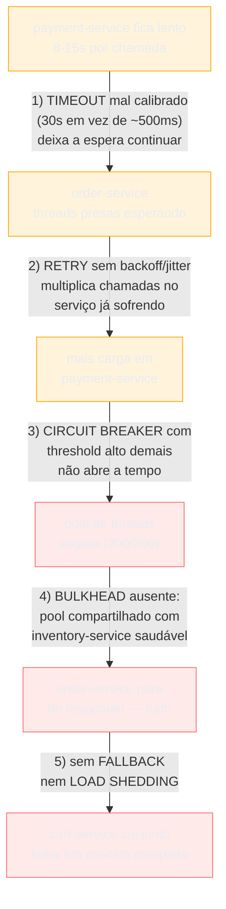
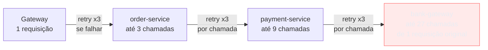
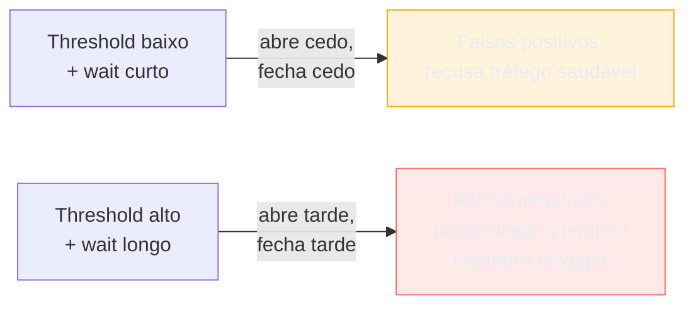
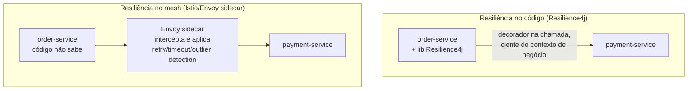

# Resiliência operacional

> [!abstract] TL;DR
> `payment-service` não caiu — só ficou **lento**: 8-15s por chamada em vez de 50ms. `order-service` chama ele de forma síncrona e bloqueante; cada requisição prende uma thread esperando. Em minutos, o pool de 200 threads esgota, `order-service` para de responder, e `cart-service` — que depende dele — cai junto. Uma falha em cascata, do jeito descrito em [[05 - Circuit Breaker e resiliência]]. A pergunta que esta nota responde não é "quais padrões existem" — é a que separa quem leu sobre resiliência de quem já operou um serviço resiliente de verdade: **você configurou timeout, retry e circuit breaker. Configurou os valores certos?** Resiliência é 20% conhecer os padrões (timeout, retry+backoff+jitter, circuit breaker, bulkhead, fallback) e **80% tunar os números** — o timeout calibrado no p99 real, o threshold que abre o disjuntor nem cedo nem tarde demais, o orçamento de retry que não amplifica a própria carga que devia proteger — e **observar** se essa tunagem está funcionando: taxa de circuito aberto, volume de retry, latência do fallback. Esta nota é sobre operar essa pilha, não sobre desenhá-la.

Sexta-feira, 14h32 (a mesma cena de [[05 - Circuit Breaker e resiliência]], agora vista da sala de operação). O alerta dispara: latência p99 de `order-service` subiu de 80ms para 12 segundos. Ninguém fez deploy hoje. O time abre o dashboard, encontra `payment-service` respondendo devagar — não fora do ar, só lento — e em poucos minutos vê `order-service` parar de responder, e logo depois `cart-service` também.

Se você é o SRE de plantão nessa sexta, a pergunta "por que isso está acontecendo" já está respondida — falha em cascata, ausência de isolamento, exatamente o mecanismo que a nota de System Design descreve. A pergunta que sobra, a que só quem opera o sistema em produção precisa responder, é outra: **o `order-service` já tem timeout, retry e circuit breaker configurados para `payment-service`. Por que eles não seguraram a onda?**

A resposta, quase sempre, está nos números. Um timeout de 30 segundos que deveria ser 500ms. Um circuit breaker com threshold tão alto que só abre depois que o dano já está feito. Um retry sem backoff que, ironicamente, *piorou* a sobrecarga em `payment-service` em vez de aliviá-la. Ter os padrões no código não é a mesma coisa que tê-los **calibrados** — e calibrar é trabalho de quem opera, não de quem desenhou o diagrama de arquitetura uma vez e seguiu em frente.

> [!question]- Por que separar "ótica de design" (SG3-05) de "ótica de operação" (aqui)?
> Porque são duas perguntas diferentes, respondidas em momentos diferentes por pessoas que às vezes nem são as mesmas. "Quais padrões usar contra falha em cascata?" é uma decisão de design — acontece no desenho do sistema, uma vez (ou poucas), e o resultado é código: um `@CircuitBreaker` aqui, um cliente HTTP com retry ali. "Qual threshold, qual timeout, o disjuntor está se comportando como esperado em produção?" é uma decisão de operação — acontece continuamente, revisitada a cada incidente, a cada mudança de padrão de tráfego, a cada nova dependência que entra no grafo de chamadas. Um time pode ter os cinco padrões implementados perfeitamente e ainda sofrer uma cascata, porque os números por trás deles nunca foram calibrados com dado real de produção. Esta nota assume que você já sabe *o quê* — o foco inteiro é o *quanto* e o *como observar*.

## O mapa: onde cada padrão corta a corrente

Antes de entrar em cada padrão, vale visualizar a cadeia de propagação inteira e onde, operacionalmente, cada defesa intervém — porque a decisão de tuning de cada padrão só faz sentido em relação às outras.

Cada seta numerada nesse diagrama é uma decisão de tuning que, bem calibrada, corta a corrente ali mesmo — timeout curto o bastante não deixa a thread ficar presa; retry com orçamento não soma carga em cima de carga; circuit breaker com threshold sensível abre antes do pool esgotar; bulkhead impede que a dependência doente contamine as saudáveis; fallback e load shedding garantem que, mesmo com tudo isso, o sistema degrada em vez de colapsar. As seções seguintes destrincham cada uma, na ordem em que a cascata as atravessaria.

## Timeout: o valor, não o padrão

O padrão "configure um timeout" já foi explicado em SG3-05. O que falta — e é o que separa uma configuração de papel de uma configuração que funciona — é: **qual valor?**

A resposta ingênua ("um valor razoável, tipo 5 segundos") é o erro mais comum em produção, e a origem dele não é preguiça — é que muitos clientes HTTP e RPC simplesmente não obrigam você a escolher. Um levantamento rápido dos clients mais usados mostra o padrão: o Axios do Node.js tem timeout **0 por padrão — sem limite**; o `got`, outro client popular do ecossistema Node, se comporta igual; o OkHttp em Java define 10 segundos para connect e read timeout, mas o *call timeout* geral — o teto para a chamada inteira, incluindo retries e redirects — é **zero, sem limite, por padrão**. Ou seja: a biblioteca que você importou hoje, sem nenhuma configuração explícita, pode deixar sua thread presa para sempre. Esse "timeout infinito silencioso" é, isoladamente, a causa técnica mais comum de esgotamento de pool em cascata — não porque ninguém sabe que timeout existe, mas porque ninguém *precisou* configurá-lo para o código compilar e passar nos testes.

> [!warning] Timeout copiado do serviço vizinho, não calibrado
> **O que acontece:** o time configura um timeout — ótimo, já é melhor que o default infinito — mas copia o valor de outro cliente HTTP do projeto, ou usa "30 segundos" porque parecia seguro. **Por quê:** timeout parece um número arbitrário, então vira um número arbitrário. Ninguém olhou a latência real da dependência antes de escolher. **Como evitar:** calibre pelo **p99 observado da dependência**, não pela média nem por um chute. Se `payment-service` responde em 50ms na mediana e 180ms no p99 num dia saudável, um timeout de 500-800ms (p99 + margem de 3-4x) protege contra degradação real sem cortar chamadas legítimas que só estão um pouco mais lentas que a mediana. Revisite esse número trimestralmente ou depois de qualquer incidente relacionado — a latência real de uma dependência muda com o tempo, e o timeout que ela precisa acompanha.

O segundo erro de tuning, mais sutil, é tratar o timeout como um número isolado por chamada, ignorando que uma requisição real atravessa **várias** chamadas em cadeia. Se `order-service` recebe uma requisição com um SLA implícito de 2 segundos, e ela precisa chamar `payment-service`, que por sua vez chama `fraud-check-service`, cada camada que aplica "meu timeout de 2 segundos" de forma independente está mentindo para o chamador anterior — a soma pode facilmente estourar o orçamento real disponível.

A solução, adotada de forma nativa em gRPC (e replicável manualmente em HTTP com um header de deadline propagado), é o **timeout budget**: em vez de cada serviço escolher seu próprio timeout absoluto, o chamador original propaga um **deadline absoluto** (um timestamp, não uma duração relativa) e cada camada subtrai o tempo já gasto antes de repassar o que sobrou para a próxima. O gRPC transmite isso no header `grpc-timeout`; cada hop reconstrói o deadline absoluto ao receber, e nenhum serviço na cadeia opera com mais tempo do que o chamador original pretendia dar. Sem isso, é perfeitamente possível que `order-service` já tenha desistido de esperar `payment-service` há 3 segundos, enquanto `payment-service` continua processando uma chamada para `fraud-check-service` cujo resultado ninguém mais vai usar — trabalho puro, desperdiçado, competindo por recursos com chamadas que ainda importam.

> [!question]- Preciso de deadline propagation em todo lugar, ou só em cadeias muito profundas?
> Depende da profundidade real do seu grafo de chamadas — mas a régua prática é: se uma requisição do usuário atravessa três ou mais saltos síncronos antes de responder, timeout independente por hop já está desperdiçando recursos de alguma forma, mesmo que você não tenha percebido ainda. Em arquiteturas rasas (um ou dois saltos), timeout local bem calibrado por hop já resolve a maior parte do problema, e o custo de implementar deadline propagation pode não valer a pena. Em arquiteturas profundas — comuns em e-commerce, fintech, qualquer domínio com muitos microsserviços especializados — a ausência de timeout budget é uma das causas mais invisíveis de latência de cauda: p50 ótimo, p99 péssimo, e ninguém sabe exatamente onde o tempo está sendo desperdiçado até rastrear com tracing distribuído qual serviço, na ponta da cadeia, ainda está processando algo que o cliente já desistiu de esperar.

## Retry: o orçamento, não só o backoff

O mecanismo de backoff exponencial + jitter já foi explicado em SG3-05 — cada tentativa espera mais que a anterior, com um componente aleatório para dissolver ondas sincronizadas. O que falta na ótica de design e é essencial na ótica de operação é: **quanto retry, no agregado do sistema inteiro, é seguro?**

O problema que a pergunta ataca chama-se **retry amplification**, e o mecanismo é multiplicativo, não aditivo. Considere uma cadeia de quatro camadas — gateway, `order-service`, `payment-service`, `bank-gateway` — onde cada uma aplica, independentemente, "retry até 3 vezes se falhar". Se a camada mais interna (`bank-gateway`) começa a falhar 50% das chamadas, cada camada acima dela multiplica o tráfego que chega à camada de baixo: sem limite, esse tipo de composição sem coordenação pode levar a um fator de amplificação de tráfego de 3,5x ou mais sobre o volume normal — exatamente na dependência que já está sofrendo e menos capaz de absorver carga extra. É a versão distribuída, silenciosa, do "retry storm" descrito em SG3-05: não é mais só clientes sincronizados batendo no mesmo instante — é a própria topologia de chamadas amplificando retry sobre retry, camada após camada.

A defesa operacional para isso tem nome: **retry budget** (também chamado de orçamento de retry, ou implementado como um token bucket dedicado a retries). A regra prática, adotada em bibliotecas de resiliência de produção, limita retries a uma fração pequena do tráfego normal — algo na faixa de 10 a 20%: a cada 100 chamadas bem-sucedidas, o sistema "ganha" 10 a 20 tokens de retry; quando o orçamento esgota, novas tentativas de retry são recusadas e a chamada falha rápido em vez de insistir. O efeito mensurado é dramático: numa simulação de falha de 50% numa dependência, retry sem orçamento gera até 3,5x de amplificação de tráfego e impede a recuperação; com um orçamento de 20%, o tráfego total fica em torno de 1,2x do normal — o suficiente para a dependência doente respirar e se recuperar, em vez de ser enterrada por retries bem-intencionados.

> [!warning] Retry configurado em cada camada, sem coordenação
> **O que acontece:** gateway, `order-service` e `payment-service` cada um implementa sua própria política de retry, decidida isoladamente por times diferentes, sem visibilidade do efeito multiplicativo somado. **Por quê:** retry parece uma decisão local — "minha chamada falhou, eu decido se tento de novo" — mas o efeito é sistêmico. Ninguém no time de `order-service` está olhando o volume agregado que chega em `bank-gateway`. **Como evitar:** trate o orçamento de retry como uma política **cross-camada**, documentada e revisada, não uma escolha isolada por serviço. Uma regra simples que já ajuda bastante: só a camada mais próxima da falha (a que efetivamente detectou o erro) deveria re-tentar; camadas acima dela deveriam propagar a falha, não também re-tentar a mesma operação. Se toda camada re-tenta, ninguém no sistema sabe quantas tentativas reais uma requisição do usuário gerou.

E, como já estabelecido em SG3-05, nada disso importa se a operação não for **idempotente**. A prática de produção mais robusta para isso — usada por Stripe e amplamente copiada — é a **idempotency key**: o cliente gera uma chave única por operação (um UUID v4, por exemplo) e a envia num header; o servidor guarda o resultado da primeira execução associado a essa chave (código de status e corpo da resposta, mesmo em caso de erro) e, se receber a mesma chave de novo, devolve o resultado salvo em vez de re-executar. A Stripe mantém essas chaves por 24 horas — tempo suficiente para cobrir qualquer janela razoável de retry, sem inflar indefinidamente o armazenamento. Operacionalmente, isso significa: **antes de habilitar retry automático numa chamada de escrita, confirme que a idempotency key existe e está sendo respeitada do outro lado** — sem isso, retry budget não impede duplicação, só limita quantas duplicações você pode gerar.

## Circuit breaker: onde tunar o threshold, e o custo dos dois erros

A mecânica de estados (closed/open/half-open) já está em SG3-05. Operacionalmente, o disjuntor se resume a três decisões de configuração, cada uma com um trade-off real:

**1) O threshold de abertura.** Configurado tipicamente como uma taxa de falha sobre uma janela recente — por exemplo, no Resilience4j, o default de fábrica é uma janela de contagem de **100 chamadas** com abertura ao ultrapassar **50% de falha**. Esse número não é sagrado; é o ponto de partida que você tuna a partir de dado real. O trade-off central:

- **Threshold baixo demais (ex.: 10% de falha)** abre o circuito rápido demais — inclusive por ruído normal de rede, picos momentâneos de latência que se resolveriam sozinhos. O custo é **disponibilidade artificial reduzida**: você está recusando chamadas que, se tivessem sido tentadas, teriam funcionado.
- **Threshold alto demais (ex.: 90% de falha)** deixa o disjuntor fechado tempo demais durante uma degradação real — exatamente o cenário do incidente de abertura desta nota, onde o pool de threads esgota antes do circuito abrir. O custo é o **próprio dano que o padrão existe para evitar**.

Não existe um número universal — o ponto de equilíbrio depende de quão crítica é a dependência, de quão barato é o fallback, e de qual é a variância normal de falha dela em produção saudável. Uma prática defensável: comece com o default (50% em janela de 100), observe por algumas semanas os falsos positivos (aberturas em situação saudável) e os falsos negativos (cascatas que aconteceram antes do circuito abrir), e ajuste na direção do erro mais caro para o seu domínio.

**2) O `waitDurationInOpenState` — quanto tempo ficar aberto antes de testar de novo.** O default do Resilience4j é **10 segundos**. Curto demais, e o circuito volta a half-open antes da dependência ter tido tempo real de se recuperar, reabrindo em seguida — um ciclo de "flapping" que não protege ninguém e ainda produz ruído de alerta. Longo demais, e o sistema continua recusando chamadas para uma dependência que já voltou ao normal, num momento em que ela precisava justamente do tráfego de volta para confirmar a recuperação.

**3) O tamanho da janela half-open — quantas chamadas de teste liberar antes de decidir.** Poucas chamadas de teste (1-2) decidem rápido, mas com alto risco de um resultado por sorte — uma chamada de teste que passou por acaso reabre o circuito prematuramente. Mais chamadas de teste (10+) dão uma decisão mais confiável, mas atrasam a recuperação percebida e, se a dependência ainda estiver realmente doente, geram mais dano antes de o circuito reabrir.

> [!question]- Como decidir os números sem esperar um incidente real acontecer?
> Três fontes, nessa ordem de prioridade: (1) **dado histórico real** — olhe a taxa de erro e a distribuição de latência da dependência nas últimas semanas em condição saudável, e calibre o threshold acima desse ruído normal, não em cima dele; (2) **teste de carga controlado** — simule degradação artificial da dependência (injeção de latência, não desligamento) num ambiente de staging que espelhe produção, e observe em que ponto o circuito deveria abrir para evitar dano real; (3) **chaos engineering em produção**, discutido adiante nesta nota — a única forma de validar que a configuração se comporta como esperado sob uma falha real, não simulada. Nenhuma dessas fontes é substituta perfeita das outras — combine as três, e trate o número inicial como uma hipótese a ser corrigida pelo dado real que a produção vai gerar.

> [!warning] Circuit breaker configurado e nunca revisitado
> **O que acontece:** o time implementa o circuit breaker no lançamento do serviço, com os valores default da biblioteca, e nunca mais olha esses números — nem quando o padrão de tráfego muda, nem quando a dependência muda de comportamento (ex.: migra de banco, aumenta escala, muda de provedor). **Por quê:** circuit breaker parece "configure uma vez e esqueça", como muita infraestrutura. Mas o comportamento da dependência que ele protege não é estático. **Como evitar:** trate os thresholds do circuit breaker como parte do orçamento de confiabilidade do serviço — revise depois de todo incidente relacionado à dependência protegida, e pelo menos uma vez por trimestre olhando o histórico real de aberturas/fechamentos (ver seção de observação, adiante).

## Bulkhead: dimensionando o isolamento

O padrão — pools separados por dependência para uma não afundar a outra — já está descrito em SG3-05. A decisão operacional é o **dimensionamento**: quantas threads (ou quanta concorrência, no caso do semáforo) dedicar a cada pool.

Um erro comum de tuning é distribuir os pools igualmente entre dependências, sem considerar criticidade nem volume real. Se `payment-service` recebe 10x mais chamadas por segundo que `notification-service`, mas ambos ganham pools do mesmo tamanho, um dos dois está superprovisionado (desperdiçando recurso) e o outro subprovisionado (criando um novo gargalo artificial, dessa vez causado pelo próprio bulkhead). O dimensionamento correto parte do throughput esperado de cada dependência multiplicado pela latência p99 esperada dela — a fórmula clássica de dimensionamento de pool (Little's Law: número de threads necessário ≈ throughput × latência) aplicada por dependência, não para o pool geral do serviço.

A escolha entre **semáforo** (limita concorrência sem trocar de thread) e **pool de threads dedicado** (executa a chamada numa thread separada) também é uma decisão de tuning, não só de implementação: o pool de threads dedicado isola completamente — inclusive a *duração* da chamada lenta não contamina a thread original — mas custa mais memória e overhead de context-switching por dependência isolada. Em serviços com dezenas de dependências externas, ter um pool de threads dedicado para cada uma pode, ironicamente, esgotar a memória do processo antes de qualquer dependência individual falhar. O semáforo é mais barato, mas protege menos (a chamada lenta ainda ocupa a thread que a chamou, só limita quantas chamadas concorrentes entram). A régua prática: pool dedicado para as dependências mais críticas e mais propensas a degradar (pagamento, autenticação); semáforo para o resto.

## Fallback: a armadilha de ter um plano B nunca testado

O padrão de fallback (cache velho, valor default, fila para reprocessamento) está em SG3-05. O que a ótica de operação acrescenta é um alerta que a Amazon aprendeu do jeito difícil: **fallback tem seus próprios modos de falha, e eles costumam ser piores por serem raros.**

O artigo "Avoiding fallback in distributed systems", do Amazon Builders' Library, documenta um incidente real de 2001 no site de varejo da Amazon: um cache em memória, ao falhar, tinha como fallback um banco de dados. O fallback funcionou tecnicamente — mas a carga que antes ia inteira para o cache (rápido, dimensionado para volume alto) agora ia inteira para o banco (mais lento, não dimensionado para aquele volume), e um problema que deveria ser parcial e contido virou uma indisponibilidade total do site, incluindo áreas completamente não relacionadas ao cache original, como fulfillment. A lição central do artigo é contraintuitiva para quem só pensa em fallback como "rede de segurança óbvia": **investir em tornar o caminho principal mais robusto costuma valer mais, em disponibilidade real, do que investir numa lógica de fallback raramente exercitada** — porque código de fallback que só roda uma vez a cada seis meses carrega bugs latentes que ninguém descobre até o pior momento possível para descobri-los.

> [!question]- Então fallback é sempre uma má ideia?
> Não — a lição não é "nunca use fallback", é "não trate fallback como grátis, e teste-o com a mesma disciplina do caminho principal". Um fallback simples (devolver um valor cacheado, ou um default estático, sem trocar de sistema de armazenamento inteiro) tem uma superfície de falha pequena e vale a pena. Um fallback que troca de sistema inteiro sob carga (de cache para banco, como no incidente da Amazon) herda todos os problemas de capacidade do sistema de destino, que provavelmente não foi dimensionado para o cenário de "todo o tráfego normal, de repente, batendo nele". A régua prática: se o seu fallback nunca foi exercitado por um teste real (chaos engineering, ou pelo menos um game day simulando a falha), trate-o como código não testado em produção — porque é exatamente isso que ele é.

> [!warning] Fallback que esconde degradação real por tempo demais
> **O que acontece:** o fallback funciona tão bem que ninguém percebe que o caminho principal está fora do ar há horas — o sintoma visível para o usuário nunca aparece, então o alerta nunca dispara. **Por quê:** fallback bom demais, sem métrica própria, vira um curativo permanente disfarçado de solução temporária. **Como evitar:** toda ativação de fallback precisa gerar um sinal observável — métrica, log estruturado, ou idealmente um alerta de severidade menor ("fallback ativo para X há mais de N minutos"). Fallback sem instrumentação própria transforma um incidente visível em um incidente invisível que só aparece quando o fallback, ele mesmo, também falha.

## Load shedding e degradação graciosa sob pressão

Timeout, retry, circuit breaker, bulkhead e fallback protegem contra uma dependência doente. Mas existe um cenário diferente, e complementar: o próprio serviço, mesmo com todas as dependências saudáveis, recebe mais tráfego do que consegue processar — um pico de Black Friday, um evento viral, um cliente com bug em loop mandando requisições. Nesse caso não há dependência para isolar; o gargalo é a capacidade do próprio serviço.

A defesa aqui é o **load shedding**: recusar ativamente uma fração do tráfego de entrada, deliberadamente e cedo, para que a fração aceita continue sendo processada com latência normal — em vez de aceitar tudo e deixar cada requisição competir por recursos escassos, degradando a latência de todo mundo igualmente até o serviço inteiro travar. É a mesma lógica do bulkhead, mas aplicada à capacidade de entrada do serviço, não à saída para uma dependência específica.

A abordagem clássica exigia calibrar manualmente um limite fixo de concorrência por instância — quantas requisições simultâneas aceitar antes de recusar o resto. O problema é que esse número muda com o hardware, com o mix de tráfego, com mudanças no próprio código; um limite estático fica desatualizado rápido. A resposta mais moderna, que a indústria vem adotando desde que a Netflix publicou sua biblioteca `concurrency-limits` (portada depois para o Envoy como *adaptive concurrency control*), é medir continuamente a relação entre concorrência e latência e ajustar o limite de aceitação **dinamicamente**: o sistema aprende, em tempo real, o ponto em que aceitar mais uma requisição começa a degradar a latência das que já estão em processamento, e recua antes de passar desse ponto — sem depender de um número fixo escolhido a dedo, que provavelmente estaria errado assim que o hardware ou o padrão de tráfego mudasse. A Netflix documentou publicamente essa evolução ao substituir parte da lógica antiga do Hystrix (limites de concorrência via thread pool/semáforo fixos) por um sistema de priorização de carga por criticidade de serviço, descrito no artigo "Enhancing Netflix Reliability with Service-Level Prioritized Load Shedding" — a ideia central sendo que, sob pressão extrema, nem todo tráfego tem o mesmo valor: recusar primeiro o tráfego de baixa prioridade (pré-carregamento especulativo, por exemplo) protege o tráfego crítico (o usuário tentando dar play num vídeo).

O tema de capacidade e autoscaling em si — quanto provisionar, como escalar — é aprofundado em [[04 - Escala e capacidade]]; aqui o ponto é o comportamento no instante em que a capacidade provisionada, seja qual for, se esgota: recusar de forma controlada (load shedding) em vez de aceitar tudo e degradar de forma incontrolada é a diferença entre um serviço que perde uma fração do tráfego de forma visível e previsível, e um serviço que trava por inteiro para todo mundo.

## Onde a resiliência mora: no código ou no mesh

Até aqui, os padrões foram discutidos como se vivessem sempre dentro do código da aplicação — e historicamente é onde eles nasceram: bibliotecas como Hystrix (Netflix, hoje em modo de manutenção) e sua sucessora, **Resilience4j**, implementam timeout, retry, circuit breaker e bulkhead como decoradores que envolvem a chamada, configurados via anotação ou builder, com a implementação em Java documentada em profundidade em [[Spring Boot]] e no galho Java de microsserviços.

A alternativa que ganhou tração na última década move essa lógica para fora do código da aplicação, para o **service mesh** — um sidecar proxy (tipicamente Envoy, orquestrado por um control plane como Istio) que intercepta todo o tráfego de rede do serviço, sem que uma linha do código da aplicação precise saber que ele existe. O Istio expõe circuit breaking, retry e timeout como configuração declarativa (um `DestinationRule`), e implementa **outlier detection** — o equivalente funcional de um circuit breaker, mas aplicado por instância/réplica dentro de um pool de load balancing: em vez de abrir ou fechar uma chamada para *um serviço*, o outlier detection do Envoy monitora cada réplica individualmente (erros consecutivos, latência) e remove automaticamente do pool de load balancing as réplicas que se comportam mal, sem intervenção humana e sem que o serviço chamador precise saber que aquela réplica específica está doente.

O trade-off entre as duas abordagens é real, e vale nomear explicitamente na hora de decidir onde configurar cada padrão:

| Dimensão | App-side (Resilience4j) | Mesh (Istio/Envoy) |
|---|---|---|
| Onde configura | Código da aplicação (anotação/builder) | Configuração declarativa do mesh (YAML) |
| Consciência de negócio | Alta — sabe distinguir "erro de validação" de "erro de infraestrutura", pode ter fallback específico de domínio | Baixa — opera sobre sinais genéricos (código HTTP, latência), não sabe o significado de negócio da chamada |
| Consistência entre serviços | Depende de cada time configurar certo | Uniforme — a política do mesh se aplica a qualquer serviço no cluster, sem depender de cada time lembrar |
| Custo de mudança de linguagem | Biblioteca específica por stack (Java/Kotlin para Resilience4j) | Agnóstico — funciona igual para serviços em qualquer linguagem, porque intercepta na rede |
| Observabilidade nativa do padrão | Métricas via Micrometer, específicas por decorador | Métricas do proxy (Envoy), uniformes em todo o mesh |
| Latência adicional | Nenhuma (roda no mesmo processo) | Um hop extra de rede (sidecar), tipicamente sub-milissegundo mas não zero |

Repare que a coluna decisiva costuma ser "consciência de negócio". Um circuit breaker no mesh não sabe que um erro 422 de `payment-service` significa "cartão recusado" (uma resposta de negócio normal, não deveria contar como falha para o disjuntor) versus um 503 (infraestrutura doente, deveria contar). Sem essa distinção configurada com cuidado, um outlier detection genérico pode abrir por causa de erros de negócio legítimos — um problema real em serviços com alta taxa natural de rejeição válida (checkout, fraude, validação de pagamento). A prática mais comum em produção não é escolher um ou outro exclusivamente: é usar o mesh para a rede de segurança genérica e uniforme (timeout de borda, outlier detection por réplica) e reservar o circuit breaker e o fallback ciente de negócio para o código da aplicação, nas dependências onde essa distinção realmente importa. A camada de rede e borda — onde o Envoy/Nginx entra como proxy de entrada — é aprofundada em [[05 - Rede e borda em produção]]; aqui o ponto é que a mesma tecnologia de proxy também pode proteger chamadas *saindo* do serviço, não só as que chegam nele.

> [!question]- Vale migrar circuit breaker existente do código para o mesh?
> Raramente é uma migração completa e raramente vale a pena fazer só por elegância arquitetural. O padrão mais comum, e mais defensável, é **camadas complementares**: outlier detection no mesh como rede de segurança genérica que protege qualquer serviço sem esforço adicional de cada time, e circuit breaker/fallback específico no código apenas nas dependências onde a distinção de negócio (que erro conta como falha, que fallback é aceitável) realmente muda o resultado. Migrar tudo para o mesh remove flexibilidade de negócio que você provavelmente precisa; manter tudo no código perde a uniformidade e o custo operacional de configurar (e manter atualizado) cada serviço individualmente. A pergunta prática para decidir onde uma dependência específica deveria ser protegida: "o fallback ou a decisão de contar como falha depende do significado de negócio da resposta?" Se sim, código. Se não — só "esse serviço está respondendo devagar ou com erro" — mesh resolve igual, com menos esforço de manutenção.

## O que observar: sinais de que a resiliência está funcionando (ou não)

Configurar os padrões sem observá-los em produção é operar às cegas — você só descobre que o threshold estava errado no próximo incidente. Os sinais que valem instrumentar, tipicamente via Micrometer exportando para Prometheus/Grafana no caso do Resilience4j, ou via as métricas nativas do proxy no caso do mesh:

- **Estado do circuit breaker por dependência** — o Resilience4j expõe um gauge (`resilience4j_circuitbreaker_state`) com os valores closed/open/half_open/disabled/forced_open por instância monitorada. Um dashboard que mostra esse estado ao longo do tempo, por dependência, é a primeira coisa a olhar num incidente de latência — se o circuito nunca abriu durante uma degradação visível, o threshold provavelmente está calibrado alto demais.
- **Taxa e volume de retry** — não só "quantos retries aconteceram", mas quanto do tráfego total para uma dependência é retry versus tentativa original. Um salto repentino nessa proporção é sinal precoce de degradação, frequentemente visível **antes** que a taxa de erro bruta suba o suficiente para disparar um alerta tradicional.
- **Taxa de ativação e latência do fallback** — quantas vezes o fallback foi acionado, e quanto tempo ele levou. Um fallback que "funciona" mas está lento também está consumindo o mesmo recurso finito (thread, conexão) que o padrão inteiro existe para proteger.
- **Rejeições de bulkhead** — quantas chamadas foram recusadas por falta de slot no pool isolado, separado de falhas reais da dependência. Um volume alto de rejeições de bulkhead pode significar duas coisas opostas: o bulkhead está subdimensionado para o volume real (aumente o pool), ou está protegendo corretamente contra uma dependência genuinamente doente (o número correto de rejeições, nesse caso).
- **Latência de fila / rejeições de load shedding** — quantas requisições foram recusadas na borda por falta de capacidade, e qual a latência de quem passou.

> [!warning] Alertar só na indisponibilidade final, não nos sinais precoces
> **O que acontece:** o time só tem alerta configurado para "taxa de erro do usuário final acima de X%" — o sintoma que aparece depois que a cascata já começou. **Por quê:** os sinais intermediários (circuito abrindo, taxa de retry subindo, bulkhead rejeitando mais que o normal) parecem "detalhes internos de implementação", não dignos de alerta próprio. **Como evitar:** trate a abertura de um circuit breaker crítico, ou um salto anormal na taxa de retry, como um alerta de severidade menor — não necessariamente que acorda alguém às 3h, mas que aparece num canal visível. Esses sinais intermediários são, por definição, mais precoces que o sintoma final: eles são o próprio mecanismo de defesa avisando que está sob pressão, antes de o usuário sentir qualquer coisa.

## Testando a resiliência antes que ela seja testada por um incidente

Toda a calibração descrita nesta nota — thresholds, timeouts, orçamentos de retry — é uma hipótese até ser validada contra uma falha real. A prática que fecha esse ciclo é injetar falha deliberadamente, em ambiente controlado, e observar se os padrões se comportam como configurados: a **chaos engineering**, popularizada pela Netflix a partir de 2010 com o Chaos Monkey (terminação aleatória de instâncias em produção, em horário comercial, para forçar o sistema a provar que sobrevive a isso) e expandida depois para ferramentas como o Latency Monkey (injeção de latência artificial, criado especificamente para validar timeout e lógica de retry) e o Chaos Kong (simulação de queda de uma região inteira de datacenter).

O ponto central da disciplina, e o que a diferencia de "quebrar coisas aleatoriamente", é que ela parte de uma **hipótese testável**: "se `payment-service` ficar 5x mais lento por 2 minutos, esperamos que o circuit breaker de `order-service` abra em até 15 segundos e o fallback de fila assuma sem perda de pedido" — e o experimento existe para confirmar ou refutar essa hipótese com dado real, não para causar caos sem propósito. Um circuit breaker cujo threshold nunca foi testado contra uma falha real injetada é, na prática, uma configuração não verificada — o mesmo status de código sem teste automatizado, só que numa camada que só se manifesta durante um incidente real.

Esta nota não é o lugar para aprofundar a mecânica de chaos engineering — como desenhar experimentos, limitar o *blast radius*, automatizar a suspensão de um teste que sai do controle. Esse aprofundamento, junto com debugging de produção sob pressão, é o assunto de uma nota dedicada no próximo sub-galho desta trilha. O ponto que fecha esta seção é mais simples: **os números desta nota inteira — timeout calibrado, threshold do circuit breaker, orçamento de retry, tamanho do bulkhead — só são confiáveis depois de terem sido testados contra uma falha real, controlada. Até lá, são uma boa hipótese, não uma garantia.**

## Em entrevista

Em entrevistas de nível sênior/staff, a diferença entre "conhece os padrões de resiliência" e "já operou resiliência em produção" aparece quando o entrevistador pede um número, não um nome. Depois de "eu usaria circuit breaker", a pergunta natural de quem está avaliando profundidade real é: "que threshold?", "por que esse valor?", "como você saberia se está funcionando?"

A resposta forte amarra o valor à origem dele em dado observado, não a um número decorado: "eu calibraria o timeout pelo p99 real da dependência, com margem de 3-4x — não um valor arbitrário. O circuit breaker eu começaria com o default da biblioteca (50% de falha numa janela de 100 chamadas) e ajustaria observando falsos positivos versus cascatas não capturadas nas primeiras semanas. E eu instrumentaria o estado do disjuntor e a taxa de retry como métrica própria, porque esses sinais aparecem antes do sintoma final para o usuário."

Vale também estar pronto para a pergunta "onde você configuraria isso — no código ou no service mesh?" — cada vez mais comum em empresas que adotaram Istio/Envoy. A resposta que sinaliza maturidade nomeia o trade-off (mesh é uniforme e agnóstico de linguagem, mas cego a contexto de negócio) em vez de escolher um lado categoricamente.

> [!warning] Confundir "ter o padrão implementado" com "resiliência garantida"
> **O que acontece:** o candidato descreve corretamente os cinco padrões, mas trata a existência deles no código como suficiente — como se o padrão, uma vez escrito, resolvesse o problema para sempre. **Por quê:** a entrevista de design costuma parar no "o quê" (quais padrões usar), e quem só estudou para entrevista raramente chega no "como calibrar e observar" — que só aparece de fato operando em produção. **Como evitar:** feche a resposta amarrando o padrão a como você saberia, com dado real, que ele está funcionando. "Eu adicionaria um circuit breaker" é acabado; "eu adicionaria um circuit breaker, calibraria pelo p99 real da dependência, e instrumentaria o estado dele para saber se o threshold está certo" é a resposta de quem já foi acordado às 3h por um threshold errado.

## How to explain in English

> "Knowing the resilience patterns — timeout, retry with backoff and jitter, circuit breaker, bulkhead, fallback — is only half the job. The other half is operating them: picking the right timeout value calibrated to the dependency's real p99, not a guess; setting a circuit breaker threshold that opens early enough to prevent cascading failure but not so early it rejects healthy traffic; enforcing a retry budget so retries don't amplify load on an already struggling dependency across multiple layers of the call chain; and deciding whether each pattern belongs in application code — where it can be aware of business context — or in the service mesh, where it's uniform and language-agnostic but blind to business meaning. None of that matters without observing it: circuit breaker state, retry rate, fallback activation and latency are the early signals that tell you whether your tuning actually works, ideally before a real incident proves it wrong."

| PT | EN |
|----|----|
| Timeout calibrado pelo p99 | p99-calibrated timeout |
| Orçamento de tempo (cadeia de chamadas) | Timeout budget / deadline propagation |
| Tempestade de retentativas | Retry storm |
| Amplificação de retentativas | Retry amplification |
| Orçamento de retentativas | Retry budget |
| Threshold de abertura | Trip threshold / failure rate threshold |
| Tempo em estado aberto | Wait duration in open state |
| Detecção de anomalias (mesh) | Outlier detection |
| Descarte de carga | Load shedding |
| Limite de concorrência adaptativo | Adaptive concurrency limit |
| Resiliência no lado da aplicação | Application-side resilience |
| Resiliência no service mesh | Service mesh resilience |
| Engenharia do caos | Chaos engineering |
| Raio de explosão (do experimento) | Blast radius |

## O que vem a seguir

Esta nota fecha o sub-galho **Rodar em produção**: containers, o contrato de produção do Kubernetes, zero-downtime, escala e capacidade, rede e borda, e agora resiliência operacional — a pilha completa de como manter um serviço vivo, saudável e isolado de vizinhos doentes. O próximo sub-galho muda de pergunta: até aqui, o assunto era "como o sistema se protege sozinho". A partir de agora, é "como você, humano de plantão, enxerga o sistema e reage quando a proteção automática não é suficiente" — observabilidade como prática, SLOs, alerting, incident response e postmortems.

- [[4 - Observar e responder/index|Observar e responder]] — o próximo sub-galho: instrumentação, SLI/SLO/error budget, alerting sem fadiga, resposta a incidente ao vivo, postmortems sem culpa

## Veja também

- [[Operação/index|Operação]] — o galho-pai e o mapa completo da trilha
- [[3 - Rodar em produção/index|Rodar em produção]] — este sub-galho
- [[05 - Circuit Breaker e resiliência]] — a mesma pilha de padrões pela ótica de **design** (System Design): a teoria dos estados closed/open/half-open, o mecanismo de cascata, quando escolher cada padrão
- [[06 - CAP, consistência e consenso]] — degradação sob partição de rede, a mesma lógica de "disponibilidade sobre consistência" aplicada a outra camada do sistema

## Fontes

- **Michael T. Nygard** — *Release It! Design and Deploy Production-Ready Software*, 2ª edição (Pragmatic Bookshelf, 2018) — origem do vocabulário de estabilidade de produção usado nesta nota (timeout, circuit breaker, bulkhead, fail fast).
- **Amazon Builders' Library** — [*Timeouts, retries, and backoff with jitter*](https://aws.amazon.com/builders-library/timeouts-retries-and-backoff-with-jitter/) — recomendações de produção AWS sobre calibração de timeout e retry.
- **Amazon Builders' Library** — [*Avoiding fallback in distributed systems*](https://aws.amazon.com/builders-library/avoiding-fallback-in-distributed-systems/) (Jacob Gabrielson) — o incidente de 2001 e o argumento contra depender de fallback pouco exercitado.
- **Google SRE** — [*Addressing Cascading Failures*](https://sre.google/sre-book/addressing-cascading-failures/) (Site Reliability Engineering, cap. 22, 2016) — mecanismo de propagação e práticas de mitigação em produção.
- **Resilience4j** — [*CircuitBreaker docs*](https://resilience4j.readme.io/docs/circuitbreaker) e [*Micrometer docs*](https://resilience4j.readme.io/docs/micrometer) — defaults de configuração (janela de 100 chamadas, 50% threshold, 10s wait duration) e métricas de estado expostas via Micrometer/Prometheus.
- **Istio** — [*Circuit Breaking*](https://istio.io/latest/docs/tasks/traffic-management/circuit-breaking/) e [*Destination Rule reference*](https://istio.io/latest/docs/reference/config/networking/destination-rule/) — outlier detection e configuração declarativa de resiliência no mesh via Envoy sidecar.
- **Netflix Technology Blog** — [*Performance Under Load: Adaptive Concurrency Limits*](https://netflixtechblog.medium.com/performance-under-load-3e6fa9a60581) e [*Enhancing Netflix Reliability with Service-Level Prioritized Load Shedding*](https://netflixtechblog.com/enhancing-netflix-reliability-with-service-level-prioritized-load-shedding-e735e6ce8f7d) — limites de concorrência adaptativos e priorização de carga sob pressão, sucessores do Hystrix.
- **Stripe** — [*Designing robust and predictable APIs with idempotency*](https://stripe.com/blog/idempotency) e [*Idempotent requests*](https://docs.stripe.com/api/idempotent_requests) — o padrão de idempotency key usado como pré-condição para retry seguro em produção.
- **Netflix / Wikipedia** — [*Chaos engineering*](https://en.wikipedia.org/wiki/Chaos_engineering) — origem do Chaos Monkey (2010), Latency Monkey e Chaos Kong, e o princípio de testar hipóteses de resiliência com falha real controlada.
- **RetryGuard (arXiv)** — [*Preventing Self-Inflicted Retry Storms in Cloud Microservices Applications*](https://arxiv.org/pdf/2511.23278) — dados quantitativos sobre amplificação de tráfego por retry sem orçamento (até 3,5x) versus com orçamento de 20% (~1,2x).
