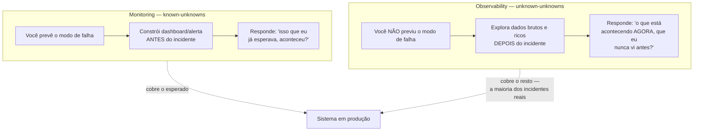
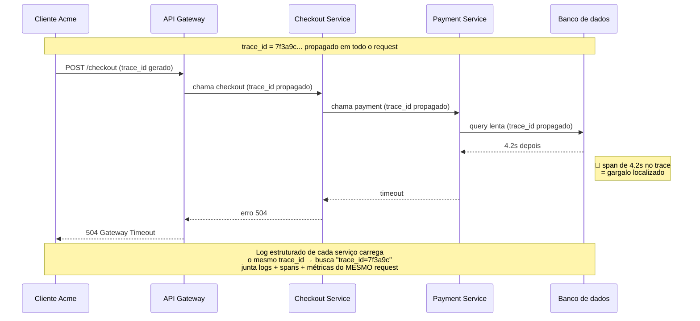
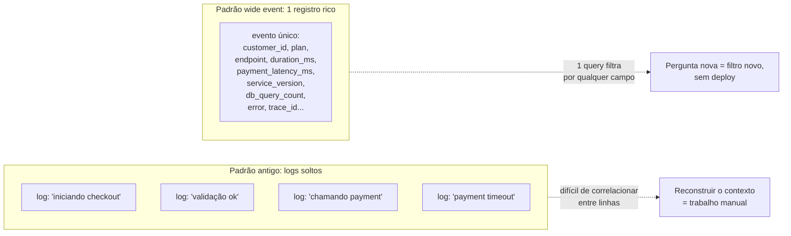
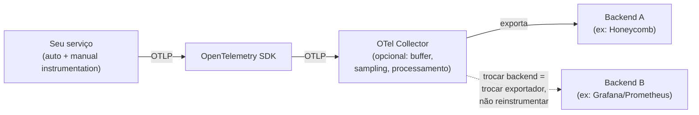

# Observabilidade como prática

> [!abstract] TL;DR
> **Monitoring** responde perguntas que você já sabia que ia precisar fazer — dashboards e alertas construídos em cima de sintomas conhecidos (known-unknowns). **Observability** responde perguntas que você *não* previu, sem precisar deployar código novo pra instrumentar a pergunta de agora (unknown-unknowns) — definição de Charity Majors, cofundadora da Honeycomb. Os três pilares — **métricas** (agregadas, baratas, mas cegas a detalhe), **logs** (ricos, mas caros e desestruturados se você deixar) e **traces** (a jornada de um request por N serviços) — só viram observabilidade de verdade quando se correlacionam via um **`trace_id`** propagado. O eixo que separa monitoring de observability, na prática, é **cardinalidade**: a capacidade de fatiar seus dados por qualquer dimensão (este cliente, este endpoint, esta versão, esta região) sem ter decidido de antemão quais dimensões importavam. Instrumentar bem significa emitir **eventos estruturados e largos** (wide events) por unidade de trabalho, não métricas pré-agregadas que já jogaram fora o contexto antes de você precisar dele. **OpenTelemetry** é o padrão vendor-neutral pra fazer isso uma vez só, em qualquer linguagem, sem lock-in de backend.

São 3h da manhã — de novo. Dessa vez não é o pager tocando do zero: é o time de suporte, no Slack, com uma reclamação pontual. "O cliente Acme está vendo timeouts no checkout desde as 2h40. Só eles. Só nesse endpoint."

Você abre o Grafana. Os 200 dashboards que o time construiu ao longo de dois anos estão todos verdes. Latência p50 normal. Taxa de erro agregada, 0,3% — dentro do SLO. CPU dos pods, tranquila. Nenhum alerta disparou. Pelos seus dashboards, nada aconteceu.

E, no entanto, um cliente real está com o checkout quebrado há vinte minutos.

O problema não é que faltou um dashboard. É que os dashboards que você tem foram construídos para responder perguntas que alguém já sabia fazer *antes* do incidente: "a latência geral subiu?", "a taxa de erro geral subiu?". Ninguém, seis meses atrás, quando desenhou essas métricas, previu a pergunta de hoje: "por que ESTE cliente, NESTE endpoint, AGORA?". E a métrica que você tem — `http_request_duration_seconds` com labels `method` e `route` — **não tem uma dimensão `customer_id`**. Ela foi pré-agregada antes de chegar no seu dashboard, e a agregação já jogou fora exatamente o dado que você precisa agora. Não tem como "abrir" a métrica depois — o detalhe já morreu no caminho.

Essa é a diferença entre ter monitoring e ter observabilidade. E é o assunto desta nota: não "o que é uma métrica" ou "como configurar o Prometheus" — isso é o monólito [[Observabilidade]], que você já deve conhecer — mas **como instrumentar um sistema pra que ele responda perguntas que ninguém pensou em fazer com antecedência**.

## Monitoring e observability não são sinônimos com marketing diferente

A confusão mais comum de quem chega de um mundo só-métricas é tratar "observabilidade" como rebranding de "monitoring" — Grafana com um nome mais chique. Não é. A distinção tem uma origem técnica precisa e vale entender de onde ela vem.

**Monitoring** existe desde muito antes do termo "observability" virar moda em engenharia de software — o Google SRE Book (capítulo *Monitoring Distributed Systems*, 2016) já descreve monitoring como "coletar, processar, agregar e exibir dados quantitativos em tempo real sobre um sistema" para responder duas perguntas centrais: **o que está quebrado, e por quê**. Só que o "por quê" do monitoring clássico é limitado: ele funciona bem quando você consegue prever, com antecedência, os modos de falha que vale a pena instrumentar — CPU alta, disco cheio, taxa de erro 5xx subindo. São **known-unknowns**: você sabe que "algo pode dar errado com o disco" mesmo sem saber *quando* vai dar. Constrói um dashboard, configura um threshold, alerta dispara.

**Observability** — termo emprestado da teoria de controle (um sistema é "observável" se seu estado interno pode ser inferido a partir das saídas que ele expõe) — foi popularizado em engenharia de software por Charity Majors e a equipe da Honeycomb a partir de meados dos anos 2010, com uma definição operacional bem específica: **"a capacidade de fazer perguntas novas sobre o seu sistema sem precisar deployar código novo ou coletar dados novos para responder essa pergunta"**. O que ela ataca são os **unknown-unknowns** — os modos de falha que ninguém previu, porque não dá pra prever tudo num sistema distribuído com dezenas de serviços, dependências externas e clientes reais fazendo coisas imprevisíveis.

> [!question]- Isso não é só semântica — "observability" não é uma palavra chique pra "monitoring bem feito"?
> A diferença aparece na prática assim que você tenta responder uma pergunta que ninguém antecipou. Com monitoring puro, a resposta é "vamos adicionar um dashboard novo" — e você só descobre a pergunta certa *depois* do próximo incidente parecido, tarde demais para o incidente de agora. Com observabilidade, a resposta é "os dados que eu já coleto são ricos o suficiente pra eu fatiar por qualquer dimensão, agora, sem esperar um deploy". A diferença não é filosófica — é que dado agregado (métrica clássica) perde a capacidade de ser refatiado depois de agregado, e dado bruto rico (evento estruturado, trace) não perde. Você não recupera `customer_id` de uma métrica que nunca teve `customer_id`.

> [!warning] "Compramos uma ferramenta de observabilidade, então temos observabilidade"
> **O que acontece:** o time assina o Datadog ou o New Relic, aponta os dashboards de sempre pra lá, e declara vitória — "agora somos observáveis". **Por quê:** observabilidade não é uma ferramenta, é uma propriedade dos **dados que você instrumenta**. Se o dado que sai do seu serviço continua sendo métricas pré-agregadas de baixa cardinalidade e logs de texto solto sem estrutura, trocar de dashboard não muda a pergunta que você consegue responder — só o layout da tela. **Como evitar:** avalie observabilidade pela pergunta "consigo fatiar meus dados de produção por uma dimensão que eu não pensei em adicionar há seis meses, sem fazer deploy?". Se a resposta é não, o problema é instrumentação, não ferramenta.

## Os três pilares, reaplicados: o que cada um sabe e o que cada um esconde

Você já conhece métricas, logs e traces — o monólito [[Observabilidade]] cobre a mecânica de cada um (Prometheus, Grafana, exporters, agregação). O que interessa aqui é o trade-off estrutural de cada pilar, porque é esse trade-off que determina o que você consegue — e não consegue — perguntar depois.

**Métricas** são números agregados ao longo do tempo: contadores, gauges, histogramas. São baratas de armazenar (um `time series` por combinação de label, não um registro por request) e ótimas pra tendência — "a latência p99 está subindo há 20 minutos" é uma pergunta de métrica perfeita. O preço é a **cardinalidade limitada**: cada label novo multiplica o número de séries temporais, e labels de cardinalidade ilimitada — `user_id`, `request_id`, um path de URL bruto — fazem esse número explodir. É a chamada "cardinality explosion": cada valor único de um label mint uma série nova, e um sistema com milhões de séries ativas degrada e pode ficar sem memória, derrubando exatamente a ferramenta que deveria te avisar do incidente. Por isso a prática padrão em Prometheus é manter labels de métrica em baixa cardinalidade (`method`, `route`, `status_code`) e empurrar qualquer coisa de alta cardinalidade — `user_id`, `customer_id` — pra fora da métrica, para logs ou traces.

**Logs** são registros de eventos discretos, tipicamente um por linha. São ricos em detalhe — podem carregar qualquer campo, cardinalidade arbitrária — mas são caros em volume (cada request pode gerar dezenas de linhas de log) e, se escritos como texto solto ("Processando pedido 12345 para usuário joão..."), são caros de *consultar* depois: você precisa de regex e sorte pra extrair um campo de um blob de texto. A resposta moderna é **structured logging**: cada linha de log é um objeto (JSON, tipicamente), com campos nomeados e consistentes — `timestamp`, `level`, `service`, `trace_id`, `customer_id`, `message`. Um log estruturado não é "melhor caligrafia" — é a diferença entre um log que você só consegue ler e um log que você consegue **consultar como se fosse uma tabela**, agrupando e filtrando por qualquer campo.

**Traces** capturam a jornada de um request individual através de múltiplos serviços — uma sequência de *spans* (cada span é uma unidade de trabalho: uma chamada HTTP, uma query de banco, um handler) organizados numa árvore, com timing de cada etapa. É o único pilar que mostra topologia de causa e efeito num sistema distribuído: não só "o serviço B está lento", mas "o serviço A chamou B, que chamou C, e C ficou 4 segundos esperando uma query — foi ali que o tempo do request inteiro foi gasto". O custo é volume e complexidade de coleta: capturar 100% dos traces de um sistema de alto tráfego é caro em armazenamento e em overhead de instrumentação — o que leva à prática de *sampling*, discutida adiante.

| Pilar | Granularidade | Custo | Ótimo pra | Fraqueza estrutural |
|---|---|---|---|---|
| Métricas | Agregada (série temporal) | Baixo | Tendência, dashboards, alerta de threshold | Cardinalidade limitada — perde o "quem" |
| Logs | Evento discreto | Médio-alto (volume) | Detalhe de um evento específico | Caro de consultar se não for estruturado |
| Traces | Jornada de 1 request | Alto (se 100%) | Causa raiz em sistema distribuído | Caro em escala — exige sampling |

Nenhum pilar sozinho responde "por que o Acme está vendo timeout no checkout agora". A métrica te diz que, na agregação, nada mudou. O log de um request específico do Acme, se estruturado, te diz *o que* aconteceu naquele request. O trace te diz *onde*, na cadeia de chamadas daquele request, o tempo foi gasto. A resposta real vem de **correlacionar os três** — e a cola que permite essa correlação é um identificador único que atravessa todos eles: o `trace_id`.

**Correlação na prática**: todo log emitido dentro do contexto de um request carrega o `trace_id` daquele request como campo estruturado (em Java, isso normalmente passa pelo MDC — Mapped Diagnostic Context — propagado por thread local ou, em runtimes assíncronos, por mecanismos equivalentes, como `AsyncLocalStorage` em Node.js). Isso significa que, dado um `trace_id` específico — extraído de um trace que mostra o gargalo, ou de um erro reportado por um cliente — você consegue puxar **todos os logs de todos os serviços daquele request específico**, numa query só. É a materialização prática da promessa de observabilidade: você não precisou ter previsto "vou precisar filtrar por Acme + checkout" com seis meses de antecedência — o `trace_id` te deu esse fio condutor de graça, porque ele estava lá desde o início, propagado pela cadeia inteira de chamadas.

> [!question]- Isso não é reinventar o distributed tracing que o System Design já cobre?
> A mecânica de propagação (context propagation, spans, parent/child) é a mesma que o walkthrough de tracing distribuído do System Design descreve. O que muda aqui é a lente: lá, tracing é uma peça de *design* de sistema (como desenhar a comunicação entre serviços pra ser rastreável). Aqui, tracing é uma ferramenta de *investigação* — dado um trace_id, como ele vira a cola que junta métricas, logs e spans na hora de debugar um incidente real. Mesma tecnologia, uso diferente: design-time vs. investigation-time.

## Cardinalidade: o eixo que separa monitoring de observability

Se há um conceito único que resume a diferença técnica entre monitoring e observability, é **cardinalidade** — e vale destrinchar por que ele é tão central.

Cardinalidade, no contexto de telemetria, é **o número de valores distintos que uma dimensão pode assumir**. `status_code` tem cardinalidade baixa (uns 10-20 valores possíveis: 200, 404, 500...). `route` tem cardinalidade média (dezenas a centenas de endpoints). `user_id` ou `request_id` têm cardinalidade **altíssima** — potencialmente um valor distinto por request, sem teto.

Sistemas de métricas clássicos (Prometheus, StatsD) são otimizados para baixa cardinalidade: cada combinação única de labels vira uma série temporal própria, armazenada e indexada separadamente. Isso é ótimo até você tentar adicionar `customer_id` como label — de repente, em vez de "uma série por rota", você tem "uma série por rota × por cliente", e com dez mil clientes ativos isso pode significar milhões de séries novas. O sistema de métricas não aguenta — degrada, consome memória demais, ou simplesmente recusa o cardinality explosion antes de você conseguir usá-lo. É por isso que a prática padrão em times que só usam métricas é **nunca** colocar `user_id` como label — e é exatamente essa restrição que te impede de responder "só o Acme está vendo o problema?" usando métricas.

**Observabilidade de alta cardinalidade** resolve isso não tentando forçar métricas a aguentar mais dimensões, mas usando um formato de dado diferente: **eventos estruturados individuais** (um registro por request, não uma série agregada), armazenados de um jeito que permite indexar e consultar por *qualquer* campo depois — incluindo campos de altíssima cardinalidade como `customer_id`, `trace_id`, `shopping_cart_id`. Honeycomb, uma das empresas que mais evangelizou esse modelo, arquiteta o armazenamento assim de propósito: cada evento pode carregar dezenas a centenas de dimensões, e a consulta "me mostre tudo com `customer_id=acme` E `endpoint=/checkout` nos últimos 30 minutos" é uma operação de primeira classe — não uma limitação do sistema.

> [!warning] Adicionar `user_id` como label de métrica Prometheus "pra ter mais detalhe"
> **O que acontece:** um time, tentando responder "qual usuário está gerando mais erro", adiciona `user_id` como label numa métrica Prometheus existente. **Por quê:** cada usuário novo multiplica o número de séries temporais daquela métrica. Com uma base de usuários de qualquer tamanho relevante, isso vira cardinality explosion — a métrica passa a consumir memória e CPU desproporcionais, degrada a performance do sistema de métricas inteiro, e em casos extremos derruba o próprio Prometheus (falta de memória no head block). **Como evitar:** dimensões de alta cardinalidade (`user_id`, `customer_id`, `request_id`, `session_id`, IPs brutos) vão em **logs estruturados ou eventos/traces**, nunca em labels de métrica. Métricas ficam com labels de baixa cardinalidade (`method`, `route`, `status_class`); se precisar fatiar por cliente, a pergunta é respondida consultando logs/eventos correlacionados pelo `trace_id`, não adicionando a dimensão na métrica.

> [!question]- Então devo abandonar métricas e usar só eventos estruturados?
> Não — os dois resolvem problemas diferentes e continuam coexistindo na maioria dos stacks maduros. Métricas continuam sendo o jeito mais barato e eficiente de responder "a tendência geral está boa?" e de alimentar dashboards operacionais e alertas de threshold (é o assunto da próxima nota, SLI/SLO). Eventos estruturados de alta cardinalidade entram quando a pergunta é "por que ESTE caso específico?" — investigação, não vigilância contínua. Na prática, um serviço bem instrumentado emite os dois: métricas agregadas para os dashboards de todo dia, e eventos/traces ricos para quando alguém precisa investigar algo que o dashboard não explica. A discussão que a indústria chama de "Observability 2.0" (Charity Majors) argumenta por unificar isso — derivar métricas *a partir* dos eventos largos, em vez de coletar as duas coisas em paralelo — mas mesmo nesse modelo a distinção conceitual entre "visão agregada" e "detalhe individual consultável" continua valendo.

## Instrumentar para perguntas futuras: wide events

A virada de mentalidade mais prática desta nota é esta: **pare de pensar em "quais métricas eu preciso" e comece a pensar em "que evento eu deveria emitir, com quantos campos, por unidade de trabalho".**

O padrão que a indústria consolidou pra isso tem vários nomes — **canonical log lines** (o termo usado pela Stripe, num post de engenharia influente de 2019), **wide events** (o termo que a Honeycomb populariza) — mas a ideia é a mesma: em vez de espalhar dezenas de linhas de log soltas ao longo do processamento de um request ("iniciando validação", "validação ok", "chamando serviço de pagamento", "pagamento ok"...), você acumula um **único registro estruturado por unidade de trabalho** — tipicamente por request — e emite ele completo no final (sucesso ou erro).

Esse registro único carrega o máximo de contexto que você conseguir agregar durante o processamento: quem é o cliente, qual plano ele está em, qual versão do serviço atendeu, quanto tempo cada etapa interna levou, qual foi o resultado, qual dependência externa foi chamada e com que latência. Serviços maduros na Stripe e na Honeycomb citam registros com **dezenas a mais de cem campos** por evento — não porque alguém precisa olhar todos eles o tempo todo, mas porque **você não sabe hoje qual desses campos vai ser exatamente o que resolve o incidente de daqui a três meses**.

A regra prática de ouro, resumida por Charity Majors: **"largo e estruturado bate estreito e pré-agregado"**. Um evento com 80 campos estruturados custa pouco mais de armazenar do que um com 8 — mas os 72 campos extras são exatamente o que te salva quando a pergunta de hoje é uma que ninguém pensou em fazer há seis meses.

> [!question]- Isso não vira log gigante e ilegível — não é o oposto de "log limpo"?
> É o oposto de "log *curto*", não de "log limpo". A diferença é que um evento wide **estruturado** (JSON, campos nomeados) é perfeitamente legível por máquina — você não lê 80 campos linha por linha, você faz uma query filtrando pelos 2-3 campos que importam agora ("me mostre todos os eventos com `customer_id=acme` E `duration_ms > 2000`"), e o resto dos campos fica disponível *se* você precisar deles, sem custo de reler o log inteiro. A confusão vem de comparar com log de texto solto, onde "mais linhas" realmente piora a legibilidade porque cada linha é isolada e sem estrutura pra filtrar.

## RED e USE: o que medir, não como investigar

Duas siglas do vocabulário de observabilidade valem menção rápida aqui, porque orientam *o que* instrumentar — o aprofundamento de como usá-las em alerta fica para a próxima nota deste sub-galho.

**RED** (Rate, Errors, Duration) — proposto por Tom Wilkie (ex-Weaveworks/Grafana Labs) como framework pra instrumentar **serviços** (APIs HTTP, gRPC, workers): quantos requests por segundo, qual fração deles falha, quanto tempo cada um leva. **USE** (Utilization, Saturation, Errors) — proposto por Brendan Gregg — mede **recursos** (CPU, disco, memória, filas): quão utilizado está, quão saturado (fila de espera), e quantos erros. A regra prática: RED para os seus serviços, USE para a infraestrutura que os sustenta. Ambos são frameworks do *quê* instrumentar como sinal de saúde — o *como* transformar esses sinais em alertas que não geram fadiga é o assunto da nota 03 deste sub-galho.

## OpenTelemetry: instrumentar uma vez, mudar de backend depois

Até aqui, tudo isso — structured logging, trace_id propagado, wide events — exige instrumentação: código no seu serviço que gera e emite essa telemetria. O problema histórico é que cada backend de observabilidade (Datadog, New Relic, Honeycomb, um Prometheus caseiro) tinha seu próprio SDK proprietário — trocar de fornecedor significava reinstrumentar o código inteiro.

**OpenTelemetry** (OTel), projeto da CNCF nascido da fusão de OpenTracing e OpenCensus em 2019, resolve isso como padrão vendor-neutral: uma API e um conjunto de SDKs (por linguagem) que geram métricas, logs e traces num formato comum, exportados via **OTLP** (OpenTelemetry Protocol) para qualquer backend que o suporte — que hoje é praticamente todos os relevantes no mercado. Trocar de Datadog para Honeycomb, ou rodar seu próprio backend, deixa de exigir reescrever instrumentação — só troca o exportador de destino.

Um segundo componente estrutural são as **semantic conventions** do OTel: um vocabulário padronizado de nomes de atributo (`http.request.method`, `db.system`, `service.name`) que garante que instrumentação de linguagens e frameworks diferentes produza telemetria com os *mesmos nomes de campo*. Isso é o que permite que um dashboard construído em cima de um serviço Java funcione, sem alteração, em cima de um serviço Node — e que a correlação automática entre traces e logs (o OTel injeta `trace_id`/`span_id` no contexto de log automaticamente, quando configurado) funcione de forma consistente entre serviços de stacks diferentes.

Em 2026, o padrão de fato para instrumentação de sistema novo é: **auto-instrumentação OTel** para o caminho comum (HTTP, banco, filas — cobre 80% do valor sem escrever uma linha de instrumentação manual) mais **instrumentação manual OTel** para os campos de domínio que só o seu código sabe (o `customer_id`, o `plan_tier`, o resultado de negócio) — os campos que tornam um wide event realmente útil pra investigação, não só um trace genérico de infraestrutura.

> [!warning] Tratar OpenTelemetry como "instale e esqueça"
> **O que acontece:** o time habilita auto-instrumentação OTel, vê spans e métricas aparecendo no dashboard, e considera o trabalho de instrumentação terminado. **Por quê:** auto-instrumentação cobre a mecânica genérica (chamadas HTTP entram e saem, queries de banco correm) — mas não sabe nada sobre o seu domínio. Ela não sabe que este request é do cliente Acme, nem que este endpoint é crítico para o plano Enterprise. Sem instrumentação manual complementar (atributos de negócio nos spans, campos de domínio nos eventos), você tem traces bonitos que não respondem "por que ESTE cliente". **Como evitar:** trate auto-instrumentação como a base (20% do esforço, 80% da cobertura mecânica) e reserve tempo deliberado para adicionar os atributos de domínio nos pontos que importam — nas fronteiras de negócio, não em toda função.

## O custo da observabilidade: por que não coletar tudo, sempre

Observabilidade rica não é de graça, e fingir que é leva a orçamentos de infraestrutura de observabilidade que superam o custo do próprio sistema que ela observa. Dois mecanismos de contenção de custo aparecem em praticamente todo stack maduro:

**Sampling de traces.** Capturar 100% dos traces de um sistema de alto tráfego multiplica o volume de dados por um fator gigante — cada request vira dezenas de spans. **Head-based sampling** decide, no início do request (antes de saber o resultado), se aquele trace será capturado — normalmente uma fração fixa (5%, 10%, 20%), simples e barato, mas com a falha estrutural de decidir *antes* de saber se o request deu erro ou foi lento, correndo o risco de descartar exatamente os traces mais interessantes. **Tail-based sampling** adia a decisão até o trace terminar, avaliando a árvore completa e priorizando capturar traces com erro ou com latência acima de um limiar — mais representativo do que importa, mas exige buffer de todos os spans do trace até ele fechar (custo de memória e um componente de coleta dedicado, tipicamente o OTel Collector). Um padrão híbrido comum: sampling de cabeça em taxa baixa (ex.: 5-10%) combinado com uma regra de "sempre capturar 100% dos traces com erro", via tail-based, garantindo que o caso que mais importa para debugar nunca seja descartado por sorte estatística.

**Retenção diferenciada.** Nem todo dado de telemetria precisa viver pelo mesmo tempo. Métricas agregadas são baratas e valem manter por meses/anos (tendência de longo prazo). Traces e logs brutos, de alta cardinalidade e alto volume, geralmente ficam caros de reter além de semanas — a prática comum é reter o detalhe bruto por um período curto (dias a poucas semanas, o suficiente pra cobrir o ciclo de investigação de um incidente) e agregar/descartar depois.

> [!question]- Sampling não significa que eu vou perder exatamente o trace que eu precisava?
> É o risco real do head-based sampling puro — e é exatamente por isso que tail-based existe: ele decide *depois* de saber que o trace teve erro ou foi lento, então a regra "sempre capture erro" garante que os traces mais valiosos para debugar nunca sejam descartados só por não terem sido sorteados. O trade-off vira memória/complexidade do coletor (que precisa buffar o trace inteiro até fechar) versus completude de dados no exato ponto em que você mais precisa deles. Times que rodam sistemas críticos tendem a aceitar esse custo de coleta em troca da garantia.

## O que faz um bom evento de telemetria

Juntando tudo — cardinalidade, correlação, wide events, custo — dá pra condensar num checklist prático o que instrumentar bem significa, na prática do dia a dia:

- **Estruturado**, não texto solto — campos nomeados e consistentes (idealmente seguindo semantic conventions do OTel), não uma string interpolada.
- **Carrega `trace_id`** (e `span_id` quando aplicável) — a cola que permite correlacionar com métricas e outros logs do mesmo request.
- **Largo, não estreito** — acumula o máximo de contexto de negócio disponível no momento (cliente, plano, versão, resultado), não só os campos que a métrica de sempre exigia.
- **Dimensões de alta cardinalidade vão em eventos/logs/traces, não em labels de métrica** — protege o sistema de métricas do cardinality explosion.
- **Um por unidade de trabalho** (tipicamente por request) — não fragmentado em dezenas de linhas soltas que exigem reconstrução manual do contexto.
- **Emitido mesmo em caminho de erro** — o padrão de canonical log lines da Stripe deliberadamente reforça o código pra garantir que o evento saia mesmo se algo falhar no meio do processamento; é justamente no erro que você mais precisa do registro completo.

## Um exemplo trabalhado: fechando o caso Acme

Voltando à cena de abertura: com instrumentação madura, o mesmo incidente se resolve em minutos, não em investigação às cegas.

O time de suporte reporta "Acme, timeout no checkout, desde 2h40". Em vez de vasculhar dashboards agregados que não têm essa dimensão, você consulta diretamente os eventos estruturados: `customer_id = acme AND endpoint = /checkout AND timestamp > 02:40`. A query retorna uma dúzia de eventos — cada um um wide event com dezenas de campos, incluindo o `trace_id` de cada request.

Pegando o `trace_id` de um desses eventos, você puxa o trace completo: a árvore de spans mostra que, consistentemente, o gargalo está numa chamada ao serviço de pagamento — não no checkout em si. Puxando os logs estruturados filtrados por esse mesmo `trace_id`, você vê que o payment service está tentando validar um cartão contra um provedor externo específico — e esse provedor é, coincidentemente, o único que o plano Enterprise do Acme usa (os outros clientes usam um provedor diferente, daí a métrica agregada de erro geral não ter se movido).

A causa raiz não estava em nenhum dashboard pré-construído porque ninguém, seis meses atrás, previu "o provedor de pagamento X vai degradar e isso só afeta clientes que usam esse provedor específico". Mas os dados estavam lá — em alta cardinalidade, correlacionados por `trace_id`, esperando a pergunta certa. Isso é observabilidade funcionando: não porque alguém adivinhou o futuro, mas porque a instrumentação foi rica o suficiente pra suportar a pergunta que ninguém tinha adivinhado.

## Em entrevista

Perguntas sobre observabilidade em entrevista sênior/staff raramente pedem definição de métrica — testam se você sabe **desenhar instrumentação para o desconhecido**, não só operar dashboards prontos.

O que um entrevistador está de fato avaliando:

- Se você distingue **monitoring de observability** com precisão técnica (known-unknowns vs. unknown-unknowns), não como sinônimos.
- Se você entende **por que cardinalidade é o eixo central** — e sabe explicar por que `user_id` não vai em label de métrica Prometheus, mas vai em log estruturado ou evento.
- Se você já pensou em **instrumentação como decisão de design**, não como tarefa de última hora — "que campos esse evento deveria carregar, mesmo que eu não use hoje" é uma pergunta de arquiteto, não de operador.
- Em cenários de troubleshoot (arquétipo já visto no System Design), se sua narrativa usa `trace_id` como o fio condutor natural entre métricas → traces → logs, em vez de tratar os três pilares como sistemas isolados.

A resposta fraca lista "métricas, logs e traces" como se fossem itens de checklist. A resposta forte amarra os três num fluxo de investigação real: "eu vejo o sintoma na métrica agregada, pego um trace_id representativo, e de lá puxo os logs estruturados daquele request específico — e é ali que a causa aparece, porque instrumentei pensando em correlação desde o início, não só em ter três ferramentas separadas".

## How to explain in English

Observability shows up constantly in English-language interviews and design discussions — this vocabulary is used almost exclusively in its English form even in PT-BR conversations.

> "Monitoring answers questions you already knew to ask — dashboards and alerts built around known failure modes. Observability answers questions you didn't anticipate, without shipping new code to instrument them — that's Charity Majors' definition, and it's the one that matters in interviews. The core axis that separates the two is cardinality: metrics are cheap because they're pre-aggregated and low-cardinality, but that means you can't slice them by customer_id after the fact. Structured, wide events — one rich record per request, correlated across services via a trace_id — let you ask that question later, because the detail was never thrown away. OpenTelemetry is the vendor-neutral standard that lets you instrument once and swap backends without re-instrumenting."

| PT | EN |
|----|----|
| Conhecido-desconhecido / desconhecido-desconhecido | Known-unknown / unknown-unknown |
| Cardinalidade (alta/baixa) | (High/low) cardinality |
| Explosão de cardinalidade | Cardinality explosion |
| Log estruturado | Structured logging |
| Evento largo | Wide event |
| Linha de log canônica | Canonical log line |
| Correlação via trace_id | Trace_id correlation |
| Amostragem por cabeça/cauda | Head-based / tail-based sampling |
| Convenções semânticas | Semantic conventions |
| Instrumentação automática/manual | Auto-instrumentation / manual instrumentation |
| Retenção de dados | Data retention |

## O que vem a seguir

Instrumentar bem — eventos ricos, correlação por trace_id, cardinalidade alta onde importa — é a matéria-prima. O que você faz com essa matéria-prima em termos de **compromisso mensurável com o negócio** é o próximo passo: escolher quais sinais viram SLIs, definir quanto de folha é aceitável (SLO), e transformar isso num orçamento de risco negociável entre engenharia e produto.

- [[02 - SLI, SLO e error budgets]] — a engenharia de escolher o que medir e quanto de falha é tolerável, e como isso vira contrato entre times
- [[03 - Alerting que não gera fadiga]] — como transformar RED/USE em alertas acionáveis sem enterrar o time de plantão em ruído
- [[04 - Incident response e on-call]] — o processo ao vivo quando o alerta dispara de fato

## Veja também

- [[Operação/index|Operação]] — o galho-pai e o mapa completo da trilha
- [[4 - Observar e responder/index|Observar e responder]] — este sub-galho
- [[Observabilidade]] — a ferramenta: Prometheus, Grafana, mecânica dos três pilares, OpenTelemetry na prática
- [[03 - Alerting que não gera fadiga]] — o próximo passo depois de instrumentar: como alertar sem gerar fadiga
- [[03-Dominios/Engenharia/Dados/4 - Qualidade, governança e organização/01 - Qualidade e observabilidade de dados|Qualidade e observabilidade de dados]] — o mesmo instinto de observabilidade recortado para **dados**: os cinco pilares (freshness, volume, schema, quality, lineage) e SLA de dados sobre pipelines analíticos

## Fontes

- **Charity Majors (Honeycomb)** — [*Observability: A Manifesto*](https://www.honeycomb.io/blog/observability-a-manifesto) (honeycomb.io) — a definição operacional de observability como "poder fazer perguntas novas sem deployar código novo", e a distinção known-unknowns vs. unknown-unknowns.
- **Charity Majors** — [*Observability is a Many-Splendored Definition*](https://charity.wtf/2020/03/03/observability-is-a-many-splendored-thing/) (charity.wtf, 2020) — aprofunda a definição e a origem do termo na teoria de controle.
- **Charity Majors** — [*Live Your Best Life With Structured Events*](https://charity.wtf/2022/08/15/live-your-best-life-with-structured-events/) (charity.wtf, 2022) — o argumento por eventos estruturados largos como base de observabilidade.
- **Charity Majors, Liz Fong-Jones, George Miranda** — *Observability Engineering: Achieving Production Excellence* (O'Reilly, 2022; 2ª edição 2026) — o livro canônico do tema, incluindo cardinalidade, wide events e a evolução para "Observability 2.0".
- **Google** — [*Site Reliability Engineering* — Monitoring Distributed Systems](https://sre.google/sre-book/monitoring-distributed-systems/) (sre.google/books, 2016) — a base clássica de monitoring, RED/USE aplicados, e o vocabulário de known-unknowns que a observabilidade estende.
- **Stripe Engineering** — [*Fast and flexible observability with canonical log lines*](https://stripe.com/blog/canonical-log-lines) (stripe.com, 2019) — o padrão de canonical log lines / wide events aplicado em produção, incluindo pipeline via Kafka/S3/Presto.
- **OpenTelemetry** — [*OpenTelemetry Logging*](https://opentelemetry.io/docs/specs/otel/logs/) (opentelemetry.io) — a especificação de correlação automática entre logs e traces via trace_id/span_id.
- **Dash0** — [*OpenTelemetry Semantic Conventions: An Explainer*](https://www.dash0.com/knowledge/otel-semconv-explainer) (dash0.com) — vocabulário padronizado de atributos que garante portabilidade de instrumentação entre linguagens/backends.
- **Grafana Labs** — [*How to manage high cardinality metrics in Prometheus and Kubernetes*](https://grafana.com/blog/how-to-manage-high-cardinality-metrics-in-prometheus-and-kubernetes/) (grafana.com) — mecânica do cardinality explosion em Prometheus e mitigação prática.
- **OpenObserve** — [*Head-Based vs Tail-Based Sampling*](https://openobserve.ai/blog/head-and-tail-based-sampling/) (openobserve.ai) — trade-offs de custo/cobertura entre as duas estratégias de sampling de traces.
