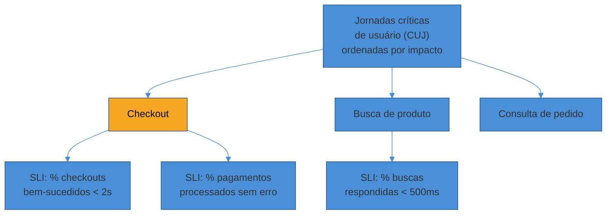
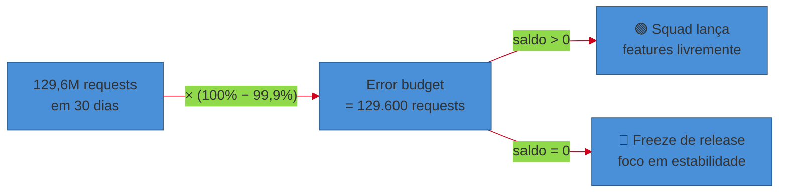
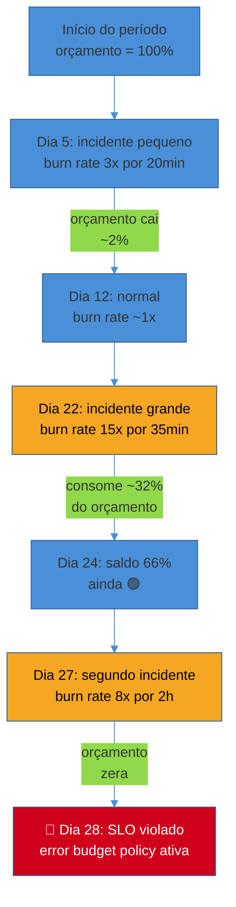
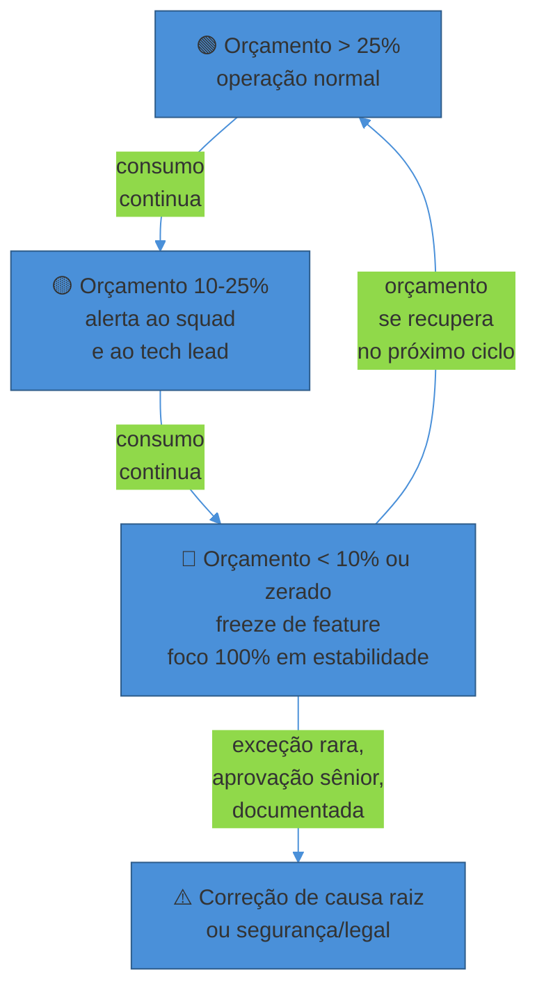

# SLI, SLO e error budgets

> [!abstract] TL;DR
> Dev quer lançar rápido. Ops quer travar o deploy até ter certeza de que nada vai quebrar. Sem um critério objetivo, essa briga se resolve por hierarquia ou por desgaste — quem grita mais alto, ou quem foi acordado às 3h da última vez. O **error budget** encerra a briga com um número: `budget = 100% − SLO`. Enquanto o orçamento tem saldo, dev lança à vontade — cada erro é um "gasto" já contabilizado. Quando zera, todo mundo para de lançar feature e foca em estabilizar, até o próximo ciclo recalibrar. Esta nota é a engenharia por trás desse número: como escolher um **SLI** que reflita o que o usuário de fato sente (a razão eventos-bons/eventos-válidos, não "uptime do servidor"); como definir a janela do **SLO** (rolling vs calendar); como calcular o **error budget** com um exemplo numérico completo (SLO, tráfego, período → quantos requests podem falhar); como ler a **burn rate** — a velocidade de consumo do orçamento, que separa "vamos estourar o mês" de "vamos estourar em 3 horas"; e como transformar tudo isso numa **política de error budget** — um contrato escrito, definido *antes* da pressão chegar, que diz exatamente quem trava o quê quando o orçamento zera. [[04 - Confiabilidade como feature]] (SG1) já estabeleceu o *porquê* — por que 100% é a meta errada; esta nota assume isso resolvido e entra na prática de escolher, calcular e operar o número.

Um squad de checkout de e-commerce está em reunião de priorização. O Product Manager quer lançar um novo fluxo de pagamento parcelado até sexta — o time comercial prometeu ao board. O tech lead do squad de plataforma, que segura o SLA com o time de pagamentos, está nervoso: a última mudança grande no checkout gerou um incidente de 40 minutos há três semanas, e ele não quer repetir isso.

A reunião trava exatamente onde reuniões desse tipo sempre travam: PM defende que "a feature já devia ter saído há duas semanas", tech lead defende que "não vamos arriscar o checkout de novo por causa de uma promessa comercial". Os dois têm razão dentro do próprio quadro de referência. Nenhum dos dois tem um número que o outro precise aceitar.

Alguém do time de SRE entra com uma pergunta diferente: "qual é o saldo do error budget do checkout este mês?" A resposta, puxada de um dashboard, é 68% do orçamento ainda disponível, com 9 dias restantes no ciclo. A decisão vira trivial: o squad lança a feature, com um canary cauteloso e observação de perto, porque o número diz que há margem. Se a resposta fosse "orçamento zerado há quatro dias", a decisão giraria 180 graus sem ninguém precisar "vencer" a discussão — a política já decidiu de antemão.

Essa é a promessa central do error budget: transformar uma discussão de opinião e hierarquia numa negociação orçamentária, onde os dois lados olham para o mesmo número. Só que — e é aqui que a maioria dos times tropeça — esse número só funciona se o SLI por trás dele for honesto, o SLO for calibrado com cuidado, e a política que reage ao orçamento for escrita e acordada *antes* da pressão, não inventada no calor da reunião. É essa engenharia, do começo ao fim, que esta nota destrincha.

## Escolhendo um SLI que não minta

O ponto de partida de tudo é a métrica. Um SLI ruim contamina cada decisão que vem depois dele — o SLO fica calibrado sobre um número que não representa a experiência real, e o error budget vira teatro: o orçamento pode estar "saudável" enquanto usuários reais sofrem, ou pode estar "zerado" por um ruído que ninguém percebe.

O SRE Workbook do Google recomenda um formato específico e deliberadamente restrito: todo SLI deveria ser expresso como uma **razão entre eventos bons e eventos válidos**.

$$ \text{SLI} = \frac{\text{eventos bons}}{\text{eventos válidos}} \times 100\%
$$

- **Eventos bons** são transações que satisfazem o critério de sucesso definido pelo usuário — um HTTP 2xx, uma resposta abaixo de um limite de latência, uma escrita que persistiu com durabilidade garantida.
- **Eventos válidos** são todas as transações elegíveis a entrar no denominador — não necessariamente *todo* tráfego. Health checks internos, chamadas de monitoramento sintético e tráfego de outros serviços internos tipicamente ficam de fora: eles não representam experiência real de usuário, e incluí-los dilui o sinal.

Esse formato — sempre uma fração entre 0% e 100% — não é escolha estética. É o que faz o SLI encaixar direto na fórmula de error budget (`100% − SLO`), e é o que permite que toda a ferramentaria (alertas, dashboards, relatórios) trate qualquer SLI da mesma forma: numerador, denominador, limiar.

Três categorias cobrem a maioria dos serviços:

| Categoria de SLI | O que mede | Exemplo de definição |
|---|---|---|
| **Disponibilidade** | Fração de requests que respondem com sucesso | Requests com status 2xx/3xx ÷ total de requests válidos |
| **Latência** | Fração de requests que respondem dentro de um limite | Requests com latência < 300ms ÷ total de requests válidos |
| **Qualidade / correção** | Fração de respostas que estão corretas, não só "responderam algo" | Buscas que usaram o índice completo ÷ total de buscas |

Repare que "latência" como SLI não é "latência média" nem "p99 abaixo de X" isolado — é a **fração de requests** que cai dentro do limite aceitável. Essa diferença é sutil e importa: uma média pode esconder uma cauda ruim (poucos requests muito lentos elevam a média sem que a maioria do tráfego sofra), e um p99 isolado não te diz *quantos* usuários efetivamente tiveram experiência ruim. A razão bons/válidos resolve os dois problemas ao mesmo tempo — ela é, por construção, a fração de usuários que teve boa experiência.

> [!question]- Por que não medir "uptime do servidor" direto, que é mais simples de coletar?
> Porque uptime de infraestrutura e disponibilidade percebida pelo usuário são coisas diferentes, e a diferença entre elas é exatamente onde incidentes reais se escondem. Um servidor pode estar "up" (processo rodando, health check verde) e ainda assim devolver erro 500 para todo request de checkout, porque a conexão com o banco de dados caiu. Medir uptime do processo diria "tudo bem"; medir a razão de checkouts bem-sucedidos diria a verdade. É por isso que a razão eventos-bons/eventos-válidos é sempre definida do ponto de vista do consumidor da API, nunca do ponto de vista de "o processo está de pé".

> [!warning] Medir o que é fácil de coletar, não o que importa
> **O que acontece:** o time escolhe "uptime do balanceador de carga" ou "CPU abaixo de 80%" como SLI, porque esses dados já existem prontos num dashboard de infraestrutura — nenhum trabalho de instrumentação extra necessário. **Por quê:** métricas de infraestrutura (CPU, uptime de processo, uso de memória) são sintomas de causa, não de efeito percebido. Um sistema pode ter CPU tranquila e ainda assim estar servindo erro para 30% dos usuários (ex.: uma dependência externa lenta, um bug de lógica). O inverso também acontece: CPU em 95% e usuários perfeitamente atendidos, porque o serviço está corretamente dimensionado para operar perto do limite. **Como evitar:** todo SLI proposto passa pelo teste "se esse número piorar, um usuário real *sente* alguma coisa?" Se a resposta é não, é métrica de causa (útil para debugging, [[01 - Observabilidade como prática]] cobre isso) — não SLI. SLI é sempre sintoma do ponto de vista de quem consome o serviço.

### Jornadas críticas: o ponto de partida antes do SLI

A pergunta "qual SLI escolher" tem uma pergunta anterior, que a maioria dos times pula: **qual jornada do usuário importa de verdade?** Um guia prático do Google Cloud sobre design de SLO recomenda começar não pela métrica, mas pela lista de **jornadas críticas de usuário** (critical user journeys, CUJ) — as sequências de tarefas que compõem o núcleo da experiência — ordenadas por impacto no negócio.

Para um e-commerce, por exemplo, "navegar catálogo", "adicionar ao carrinho", "finalizar checkout" e "consultar status do pedido" são jornadas diferentes, com criticidade diferente. Uma falha em "recomendações personalizadas" incomoda; uma falha em "finalizar checkout" custa receita direta e confiança. Tratar as duas com o mesmo SLI — digamos, "disponibilidade agregada da API" — esconde justamente a distinção que mais importa: o checkout pode estar caindo enquanto o agregado geral ainda parece saudável, porque o volume de tráfego das outras rotas dilui o sinal.

A recomendação prática, também do material do Google Cloud, é mirar entre **3 e 5 SLIs por jornada crítica** — poucos o suficiente para caber num orçamento de atenção humana, muitos o suficiente para cobrir disponibilidade, latência e (quando aplicável) corretude sem virar um mar de dashboards que ninguém olha.

Note que jornadas de criticidade diferente não precisam — e não deveriam — compartilhar o mesmo SLO. Um serviço pode ter múltiplos SLOs simultâneos, um por jornada, cada um com seu próprio orçamento e sua própria política de reação. Bucketing por rota, por tipo de request, ou por classe de cliente (ex.: enterprise vs free tier) é a técnica padrão para separar sinais que, agregados, se cancelariam.

## SLO: a meta, a janela e o teste da felicidade

Com o SLI escolhido, a pergunta seguinte é o valor-alvo — o SLO — e, tão importante quanto o número, **a janela de tempo** sobre a qual ele é medido.

### Rolling window vs calendar window

Existem duas formas de definir o período de medição, e a escolha entre elas muda o comportamento operacional do time de forma não óbvia:

- **Janela rolling (móvel)**: uma janela de N dias que "escorrega" continuamente — hoje mede os últimos 28 dias, amanhã mede os últimos 28 dias contando a partir de amanhã. Um incidente que consumiu orçamento vai gradualmente "envelhecendo" para fora da janela, e o saldo se recupera sozinho, sem uma data de corte artificial. É o formato mais comum para operação do dia a dia, porque dá visibilidade contínua e se alinha bem a ciclos ágeis de sprint.
- **Janela calendar-aligned (de calendário)**: um período fixo — o mês de julho, o Q3, o ano fiscal — com início e fim definidos. O orçamento reseta 100% no primeiro dia do período seguinte, não importa o que aconteceu no período anterior. É o formato preferido para relatórios de gestão, verificação de compliance e reporte de SLA para cliente, porque bate com os ciclos de negócio (fechamento mensal, revisão trimestral).

A diferença comportamental entre as duas é real, não cosmética: numa janela calendar-aligned, times tendem a ficar mais cautelosos perto do fim do período — ninguém quer "começar o próximo mês no vermelho" com um incidente de última hora — o que pode gerar um freeze informal e não-intencional perto do fechamento. Numa janela rolling, não existe esse efeito de borda: o orçamento é uma função contínua do comportamento recente, sem penhasco de fim de mês.

> [!question]- Dá pra usar as duas ao mesmo tempo?
> Sim, e times maduros frequentemente fazem isso: rolling window para o uso operacional do dia a dia (decisão de "posso deployar hoje?"), calendar-aligned para reporte externo e SLA formal (o número que aparece no relatório trimestral para o cliente enterprise). São propósitos diferentes — um informa uma decisão tática recorrente, o outro informa uma prestação de contas periódica — e nada impede medir o mesmo SLI sob as duas janelas simultaneamente.

### O teste da felicidade

Escolher o valor numérico do SLO — 99,9%? 99,95%? 99,99%? — não é um exercício de "quanto mais alto, melhor" (já desmontado em [[04 - Confiabilidade como feature]]). O Google Cloud descreve um teste prático para calibrar esse número, informalmente chamado de **happiness test**: pegue o histórico real de comportamento do SLI, olhe onde ele já opera na maior parte do tempo sem esforço extra de engenharia, e pergunte — nesse patamar, os usuários estão felizes? Se sim, esse é candidato a SLO; subir daí só vale a pena se houver evidência concreta de que usuários sofrem hoje.

Isso inverte a intuição de "definir a meta e depois trabalhar para alcançá-la" — a meta nasce olhando o comportamento real observado, não uma aspiração abstrata. Um SLO fixado acima do que o sistema historicamente entrega, sem investimento correspondente de engenharia, é uma sentença de orçamento cronicamente negativo — a fonte mais comum de "error budget que nunca tem saldo", tratada adiante nos anti-padrões.

## O cálculo do error budget, com números reais

Aqui está o núcleo quantitativo desta nota. Considere um serviço de checkout com os seguintes parâmetros — deliberadamente próximos de uma escala real de e-commerce médio-grande, para que o exercício não fique abstrato:

- **SLI**: fração de requests de checkout que completam com sucesso (HTTP 2xx) em menos de 2 segundos.
- **SLO**: 99,9% num período de 30 dias (janela calendar-aligned, alinhada ao ciclo de faturamento).
- **Volume**: 50 requests de checkout por segundo, em média, 24h por dia.

**Passo 1 — Total de requests no período.**

$$ 50 \text{ req/s} \times 86.400 \text{ s/dia} \times 30 \text{ dias} = 129.600.000 \text{ requests}
$$

**Passo 2 — O error budget em percentual.**

$$ \text{budget} = 100\% - \text{SLO} = 100\% - 99{,}9\% = 0{,}1\%
$$

**Passo 3 — O error budget em requests (o número que realmente importa no dia a dia).**

$$ 129.600.000 \times 0{,}001 = 129.600 \text{ requests podem falhar (ou responder acima de 2s) no período de 30 dias}
$$

**Passo 4 — Traduzindo para tempo (se o SLI fosse tratado como disponibilidade contínua).** Um período de 30 dias tem 43.200 minutos. Com 99,9%, o downtime-equivalente permitido é:

$$ 43.200 \times 0{,}001 = 43{,}2 \text{ minutos no período}
$$

Isso confirma a tabela de "noves" de [[04 - Confiabilidade como feature]] — mas agora ancorado num volume real de tráfego, não numa abstração de percentual. O número que o time efetivamente acompanha no dia a dia **não é os 43,2 minutos** — é os **129.600 requests**, porque é isso que aparece contado, em tempo real, num dashboard de error budget. "Faltam 43 minutos de downtime" é uma tradução conceitual útil para conversar com quem não vive de dashboard; "faltam 62.000 requests de orçamento" é o número operacional.

**Cenário concreto**: no dia 22 do período de 30 dias, um incidente de 35 minutos derruba 40% dos requests de checkout (respondendo erro ou acima de 2s). Com 50 req/s, isso consome:

$$ 35 \times 60 \times 50 \times 0{,}40 = 42.000 \text{ requests do orçamento}
$$

De um orçamento total de 129.600, esse único incidente consumiu **32,4%** — um golpe significativo, mas não fatal, restando 67,6% do orçamento para os 8 dias restantes do ciclo. Se um segundo incidente de magnitude parecida acontecer antes do fim do período, o orçamento provavelmente estoura, e a política de error budget (próxima seção) entra em vigor.

> [!question]- E se o tráfego não for uniforme — picos de Black Friday, vales de madrugada?
> O cálculo acima usa uma média simplificada para clareza didática; na prática, o denominador (`eventos válidos`) é contado em tempo real, request a request, não estimado por uma média fixa. Isso, aliás, é uma vantagem do error budget sobre um SLO puramente percentual: como o cálculo final é sempre `eventos bons ÷ eventos válidos` do período real, ele automaticamente pondera picos de tráfego — um incidente de 10 minutos durante o pico da Black Friday consome muito mais orçamento (em requests absolutos) do que um incidente de 10 minutos às 4h da manhã, porque afeta mais usuários reais. O número reflete impacto real, não uma média artificial de calendário.

## Burn rate: a velocidade importa tanto quanto o saldo

Saber que restam 67,6% do orçamento não diz se isso é uma boa notícia. Se faltam 25 dias no período e o consumo até agora acompanhou o ritmo esperado, tudo bem. Se faltam 25 dias e o orçamento já caiu pela metade em dois dias, o sistema está numa trajetória de estourar o SLO muito antes do fim do ciclo — e ninguém vai perceber isso olhando só o saldo atual.

É para essa lacuna que existe a **burn rate**: a velocidade com que o error budget está sendo consumido, normalizada de forma que **burn rate = 1** signifique "no ritmo exato para gastar 100% do orçamento até o fim da janela, nem mais rápido nem mais devagar". Formalmente, o SRE Workbook define:

$$ \text{tempo até esgotar o orçamento} = \frac{1 - \text{SLO}}{\text{taxa de erro atual}} \times \text{duração da janela}
$$

Alguns pontos de referência tornam a intuição concreta, para um SLO de 99,9% numa janela de 30 dias:

| Burn rate | O que significa | Tempo até estourar o orçamento inteiro |
|---|---|---|
| **1x** | Consumindo exatamente no ritmo do SLO | 30 dias (fim exato da janela) |
| **2x** | O dobro da taxa de erro tolerada | 15 dias |
| **10x** | Dez vezes a taxa de erro tolerada | 3 dias |
| **100x** | Cem vezes — um incidente severo em andamento | ~7,2 horas |

Burn rate alto e sustentado é o sinal que separa "degradação lenta, dá para investigar com calma" de "incidente ativo, alguém precisa ser acordado agora" — e é exatamente esse número que alimenta o alerting da próxima nota deste sub-galho.

### Multi-window, multi-burn-rate: por que uma janela só não basta

Um único burn rate calculado sobre uma janela curta (ex.: os últimos 5 minutos) dispara alerta a cada pico passageiro de erro — ruído. Um único burn rate sobre uma janela longa (ex.: 6 horas) é estável, mas detecta o problema tarde demais — o incidente já consumiu boa parte do orçamento antes do alerta disparar.

O SRE Workbook resolve isso com uma técnica chamada **multi-window, multi-burn-rate**: combinar uma janela curta e uma janela longa, exigindo que **as duas** estejam acima do limiar simultaneamente antes de disparar o alerta. Uma regra prática comum é fazer a janela curta ter cerca de 1/12 da duração da janela longa (ex.: 1h curta para 12h longa) — a janela longa dá inércia contra picos passageiros, a janela curta garante que o alerta não demore para disparar quando o problema é real e sustentado.

Valores de referência citados pelo próprio Workbook, para uma janela de orçamento de 30 dias:

| Severidade | Burn rate limiar | Janela longa | Janela curta | Ação |
|---|---|---|---|---|
| Alta (page) | 14,4x | 1 hora | 5 minutos | Acordar alguém agora |
| Média (page) | 6x | 6 horas | 30 minutos | Acordar alguém agora |
| Baixa (ticket) | 1x | 3 dias | — | Abrir ticket, investigar em horário comercial |

O detalhamento de como transformar esses limiares em alertas configurados de verdade — regras Prometheus, políticas de página vs ticket, fadiga de alerta — é o assunto da próxima nota deste sub-galho. Aqui, o que importa reter é o princípio: **burn rate alto e sustentado em duas janelas simultâneas é o sinal mais confiável de que o orçamento vai estourar antes do fim do período**, e é esse sinal — não "o serviço caiu" isoladamente — que deveria acordar alguém.

## Error budget como política: transformando número em decisão

Ter o número não é suficiente. O que fecha o loop de dev vs ops não é o dashboard — é uma **política escrita** que diz, sem ambiguidade, o que muda quando o orçamento zera, e quem tem autoridade para decidir isso. O SRE Workbook chama essa peça de **error budget policy**, e o ponto central da recomendação do Google é que a decisão precisa estar tomada **antes** de a pressão chegar — não inventada, sob estresse, na reunião do exemplo de abertura desta nota.

Uma política de error budget típica cobre, no mínimo:

1. **Quem** monitora o orçamento e com que frequência (dashboard automático, revisão semanal).
2. **O que** acontece quando o orçamento cai abaixo de um limiar de alerta (ex.: 25% restante) — normalmente um aviso, não ainda um freeze.
3. **O que** acontece quando o orçamento zera — a ação concreta, específica o suficiente para não deixar espaço de interpretação.
4. **Quem tem autoridade** para autorizar uma exceção — e, criticamente, **quão caro** é usar essa exceção.

A Expedia publicou publicamente um exemplo real desse tipo de política: quando o orçamento cai abaixo de 25% restante, código de aplicação novo entra em **freeze** até o orçamento se recuperar e todos os alertas ativos serem resolvidos; lançamentos de feature de produto são **completamente pausados**. As únicas exceções permitidas são: correções que atacam a causa raiz da violação do SLO, mudanças de prioridade máxima (ex.: risco jurídico com prazo), e correções de segurança.

O detalhe mais importante dessa mecânica — fácil de subestimar — é que a política **precisa ter dentes de verdade**. Se a autoridade máxima da organização consegue simplesmente ignorar o freeze toda vez que uma feature importante está sob pressão de prazo, a política vale zero: ela vira decoração, e a próxima reunião de priorização volta a ser a mesma briga política de sempre, só que agora com um dashboard bonito ao fundo que ninguém respeita. A recomendação prática é definir o processo de exceção de forma deliberadamente cara — que exija aprovação explícita de alguém sênior o suficiente, documentada, e rara o bastante para não virar rotina.

> [!question]- O que "foco em estabilidade" significa na prática, além de "não lançar feature"?
> Normalmente significa realocar a capacidade de engenharia do squad para três tipos de trabalho: (1) investigar e corrigir a causa raiz do consumo excessivo de orçamento — geralmente o incidente ou classe de incidentes que mais gastou; (2) fechar lacunas de observabilidade que dificultaram diagnosticar o problema mais rápido; (3) reduzir dívida técnica que aumenta a fragilidade do sistema (timeouts ausentes, retries sem backoff, dependências sem fallback — temas do sub-galho 3 desta trilha). O objetivo não é "ficar parado esperando o orçamento se recuperar sozinho" — é investir deliberadamente na causa, para que o próximo ciclo não repita o mesmo padrão de consumo.

> [!warning] Error budget policy sem consequência real
> **O que acontece:** a organização define formalmente uma política de error budget, publica num wiki interno, e na prática nunca a aplica — todo freeze é "reavaliado" e revertido quando alguém de liderança pressiona por uma data de lançamento. **Por quê:** o valor do error budget como mecanismo depende inteiramente de ser **crível**. No momento em que o time aprende que o freeze é negociável caso a caso, ele deixa de funcionar como sinal objetivo e volta a ser a mesma política interna de sempre — só que com um número bonito decorando a decisão que já ia acontecer de qualquer forma. **Como evitar:** trate a política de error budget como trataria um contrato de SLA externo — com um processo de exceção formal, custoso e raro, não uma sugestão. Se o override acontece com frequência, o problema não é a política — é que o SLO foi calibrado apertado demais para a realidade do negócio (volte ao teste da felicidade).

## Anti-padrões: os erros que sabotam o mecanismo antes de começar

Os erros mais caros em SLO engineering não são de cálculo — são de escolha e de cultura, e costumam aparecer bem antes de qualquer fórmula entrar em cena:

- **SLI que não reflete a experiência do usuário.** Já coberto acima: medir uptime de infraestrutura em vez da razão eventos-bons/eventos-válidos do ponto de vista de quem consome o serviço.
- **SLO como vaidade.** Escolher um número alto porque "parece profissional" (99,99% soa melhor num slide que 99,9%), sem checar se o sistema historicamente entrega isso, e sem checar se o usuário percebe a diferença. Isso condena o orçamento a ficar cronicamente no vermelho — a antítese do que o mecanismo deveria fazer, que é dar folga real, não pressão constante.
- **Medir o que é fácil, não o que importa.** Coberto no primeiro `[!warning]` desta nota — a armadilha de usar métricas de infraestrutura prontas em vez de instrumentar o sinal certo.
- **Um SLI só para um sistema com jornadas heterogêneas.** Agregar disponibilidade de todo o tráfego (catálogo, busca, checkout) num único número esconde exatamente a jornada que mais importa, porque o volume das rotas menos críticas dilui o sinal da rota crítica.
- **Orçamento sem política, ou política sem dentes.** Um dashboard bonito de error budget que ninguém usa para decidir nada é teatro de dados — o número existe, mas não muda comportamento algum.
- **SLO fixado sem conversa entre quem opera e quem constrói.** Já apontado em [[04 - Confiabilidade como feature]]: um SLO decidido unilateralmente por operação (apertado demais) trava velocidade sem necessidade; decidido unilateralmente por produto (frouxo demais) não protege ninguém.

## Um exemplo trabalhado, do início ao fim

Para fechar, uma sequência única que aplica cada peça desta nota, do SLI à decisão organizacional — a mesma progressão que o squad do exemplo de abertura precisava ter feito antes da reunião de priorização travar.

**1. Jornada crítica.** O squad de checkout identifica "finalizar compra" como a jornada de maior impacto de receita, distinta de "navegar catálogo".

**2. SLI.** Escolhe a razão: requests de finalização de compra que completam com HTTP 2xx em menos de 2 segundos ÷ total de requests de finalização de compra válidos (excluindo health checks e tráfego de teste interno).

**3. Janela e SLO.** Usa janela calendar-aligned de 30 dias (alinhada ao fechamento financeiro mensal) e, pelo teste da felicidade sobre 6 meses de histórico, mira 99,9% — o patamar que o sistema já sustenta na maior parte do tempo sem esforço extra, e onde pesquisas de satisfação não mostram diferença perceptível acima disso.

**4. Cálculo do orçamento.** Com 50 req/s de tráfego médio, o período de 30 dias soma 129,6 milhões de requests; o orçamento de 0,1% equivale a 129.600 requests que podem falhar no mês.

**5. Burn rate e alerting.** O time configura alertas multi-window: burn rate acima de 14,4x numa janela de 1h/5min dispara page imediato (algo está consumindo o orçamento de um mês inteiro em poucos dias); burn rate acima de 1x sustentado por 3 dias abre um ticket para investigação em horário comercial, sem acordar ninguém.

**6. Política.** Abaixo de 25% de orçamento restante, novas features de checkout entram em revisão obrigatória do tech lead antes do deploy; orçamento zerado significa freeze total de feature, exceto correção de causa raiz — decisão pré-acordada com o VP de Engenharia, que se compromete a não reverter freezes sem um processo formal de exceção documentado.

**7. A reunião do início desta nota, revisitada.** Com 68% de orçamento e 9 dias restantes, o squad lança o fluxo de pagamento parcelado com canary cauteloso. Não é uma aposta — é uma decisão informada pelo mesmo número que, num mês diferente, teria dito não.

## Em entrevista

Perguntas sobre "como você definiria SLI/SLO para este sistema" ou "como você resolveria a tensão entre dev e ops sobre velocidade de deploy" são comuns em entrevistas de system design e de operação em nível sênior/staff. O que separa uma resposta de manual de uma resposta de quem já operou o mecanismo de verdade:

- Se você sabe articular o **SLI como razão eventos-bons/eventos-válidos**, não como "uptime" genérico — e consegue justificar por que exclui certo tráfego do denominador.
- Se você distingue **rolling window de calendar window** e sabe quando cada uma é apropriada — operação do dia a dia versus reporte de SLA/compliance.
- Se você faz o **cálculo numérico** sem hesitar: dado um SLO e um volume de tráfego, quantos requests o orçamento permite falhar. Entrevistadores seniores costumam pedir esse número de cabeça, ou próximo disso, como teste de fluência real.
- Se você entende **burn rate** como conceito distinto de "saldo restante" — a diferença entre "temos orçamento" e "estamos gastando rápido demais" é exatamente o que separa um SRE júnior de um sênior nessa conversa.
- Se você sabe que o mecanismo só funciona com uma **política com dentes** — citar o error budget sem mencionar que ele precisa de consequência real e pré-acordada é a resposta de quem leu sobre o conceito, mas nunca viu uma liderança tentar ignorá-lo sob pressão de prazo.

A resposta fraca recita a fórmula `100% − SLO` e para por aí. A resposta forte amarra o número a uma decisão organizacional real: "eu mediria a razão de checkouts bem-sucedidos abaixo de 2s, miraria 99,9% calibrado pelo histórico real do sistema, calcularia o orçamento em requests absolutos (não só em percentual, porque é o número que o time realmente acompanha), e alertaria por burn rate multi-window para separar degradação lenta de incidente ativo — mas nada disso funciona sem uma política pré-acordada de quem trava o quê quando o orçamento zera, com um processo de exceção caro o suficiente para ser raro."

## How to explain in English

SLO engineering vocabulary is used almost exclusively in English even inside PT-BR technical conversations — the terms below are the ones worth having ready, cold, in an interview.

> "The engineering behind an error budget starts with a good SLI: a ratio of good events over valid events, defined from the user's point of view, not from infrastructure uptime. From there you pick an SLO — calibrated against real historical behavior, not aspiration — and a measurement window, rolling for day-to-day operations or calendar-aligned for SLA reporting. The error budget itself is just 100% minus the SLO, but the number that actually matters operationally is the budget expressed in absolute request counts, not percentage. Burn rate tells you how fast that budget is being spent — a burn rate of 1x means you're on pace to exhaust it exactly at the end of the window; 10x means you'll blow through the entire month's budget in three days. None of this changes behavior, though, without an error budget policy written and agreed before the pressure hits: who freezes what when the budget hits zero, and how expensive the exception process is. A policy that gets waived every time a deadline is tight is worth nothing."

| PT | EN |
|----|----|
| Indicador de nível de serviço | Service Level Indicator (SLI) |
| Eventos bons / eventos válidos | Good events / valid events |
| Objetivo de nível de serviço | Service Level Objective (SLO) |
| Janela móvel | Rolling window |
| Janela de calendário | Calendar-aligned window |
| Orçamento de erro | Error budget |
| Taxa de consumo (velocidade) | Burn rate |
| Alerta multi-janela / multi-burn-rate | Multi-window, multi-burn-rate alerting |
| Política de orçamento de erro | Error budget policy |
| Congelamento de feature | Feature freeze |
| Jornada crítica de usuário | Critical user journey (CUJ) |
| Teste da felicidade (calibração de SLO) | Happiness test |

## O que vem a seguir

Esta nota fechou a engenharia de SLI/SLO/error budget — o número, o cálculo, a política. O que ela deixou apontado, mas não desenvolveu, é como transformar burn rate em **alertas de verdade**, configurados numa ferramenta real, sem virar ruído que o time aprende a ignorar.

- [[03 - Alerting que não gera fadiga]] — como configurar os limiares de burn rate mostrados nesta nota, a diferença entre alertar em sintoma e alertar em causa, page vs ticket, e o problema da fadiga de alerta.

## Veja também

- [[Operação/index|Operação]] — o galho-pai e o mapa completo da trilha
- [[4 - Observar e responder/index|Observar e responder]] — este sub-galho
- [[04 - Confiabilidade como feature]] — a introdução conceitual: por que 100% é a meta errada, os noves e seu custo, SLI/SLO/SLA em nível de definição
- [[03 - Alerting que não gera fadiga]] — a próxima nota: transformando burn rate em alertas acionáveis

## Fontes

- **Google** — [*The SRE Workbook* — Implementing SLOs](https://sre.google/workbook/implementing-slos/) (sre.google/workbook) — a definição de SLI como razão eventos-bons/eventos-válidos, o formato canônico de 0-100%, e a orientação de manter todos os SLIs no mesmo estilo para reaproveitar ferramentaria.
- **Google** — [*The SRE Workbook* — Alerting on SLOs](https://sre.google/workbook/alerting-on-slos/) (sre.google/workbook) — a fórmula de burn rate, a técnica multi-window multi-burn-rate, e os limiares de referência (14,4x/1h+5min, 6x/6h+30min, 1x/3 dias).
- **Google Cloud** — [*How to design good SLOs, according to Google SREs*](https://cloud.google.com/blog/products/devops-sre/how-to-design-good-slos-according-to-google-sres) — jornadas críticas de usuário (CUJ), a recomendação de 3-5 SLIs por jornada, e o "happiness test" para calibrar o valor do SLO.
- **Google Cloud** — [*Learn how to set SLOs*](https://cloud.google.com/blog/products/management-tools/practical-guide-to-setting-slos) — guia prático de definição de SLO partindo de jornadas críticas de negócio.
- **Nobl9** — [*Calendar-Aligned SLOs*](https://docs.nobl9.com/guides/slo-guides/calendar-aligned-slos/) e [*Understanding Error Budgets*](https://www.nobl9.com/service-level-objectives/error-budget) — a diferença comportamental entre janela rolling e janela calendar-aligned, e o efeito de "freeze perto do fim do período" nesta última.
- **Datadog** — [*Best practices for managing your SLOs with Datadog*](https://www.datadoghq.com/blog/define-and-manage-slos/) e [*Error Budget Alerts*](https://docs.datadoghq.com/service_management/service_level_objectives/error_budget/) — recomendação de SLO interno mais rígido que o SLA externo, e limiares de alerta de consumo de orçamento (ex.: 75% consumido).
- **Eric Trang, Expedia Group Technology** — [*Error Budget Policies in Practice*](https://medium.com/expedia-group-tech/error-budget-policies-in-practice-4c98f56a28c1) (Medium) — o exemplo real de política de error budget (freeze abaixo de 25% restante, exceções para causa raiz/segurança/legal) e o princípio de que a exceção precisa ser rara e cara.
- **Google** — [*The SRE Workbook* — Error Budget Policy](https://sre.google/workbook/error-budget-policy/) (sre.google/workbook) — a estrutura recomendada de uma política de error budget e por que ela precisa ser decidida antes da pressão chegar.
