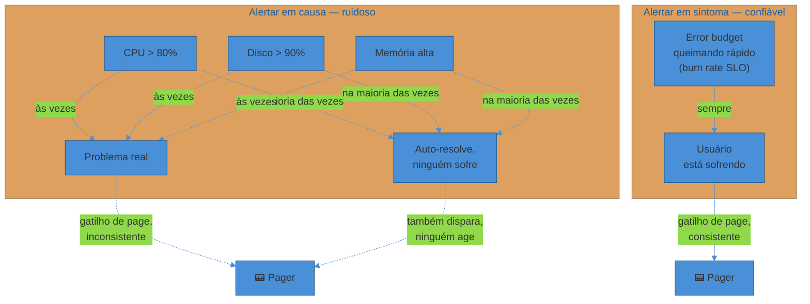
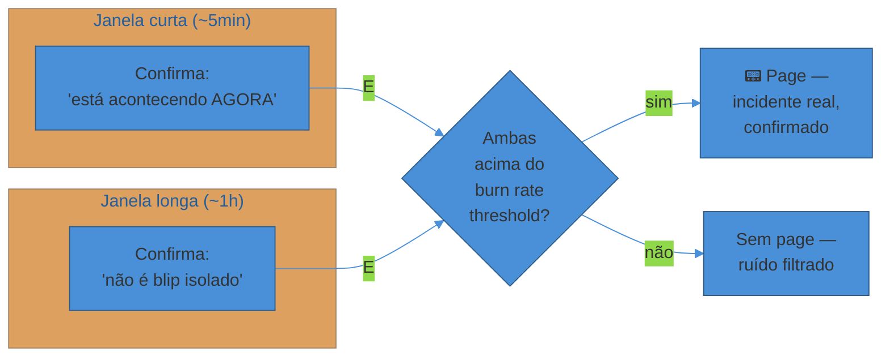

# Alerting que não gera fadiga

> [!abstract] TL;DR
> Um time que recebe 200 alertas por dia — a maioria ruído, CPU a 80% que se auto-resolve, um pod que reiniciou e voltou — aprende, em semanas, a **silenciar o pager por reflexo**. E no dia em que o alerta real chega, ele é ignorado junto com o resto. **Alert fatigue mata mais sistemas do que a falta de alertas**: não é a ausência de sinal que derruba produção, é o sinal afogado em ruído até ninguém mais escutar. Alertar bem não é alertar em tudo que pode dar errado — é alertar **pouco** e **no que importa**. A regra de ouro, do clássico "My Philosophy on Alerting" de Rob Ewaschuk (ex-SRE do Google): todo alerta que acorda um humano precisa ser **urgente, acionável e real** — se não requer ação agora, não é page, é ticket ou dashboard. E o critério para decidir *no quê* alertar é **sintoma, não causa**: alertar quando o usuário sente dor (latência alta, taxa de erro alta — o error budget da nota anterior queimando), não quando um número interno (CPU, memória, disco) cruza uma linha arbitrária que talvez nunca vire problema real. O estado da arte para isso é **SLO burn-rate alerting multi-window multi-burn-rate** (Google SRE Workbook): alertar quando o orçamento de erro está sendo gasto rápido demais, combinando uma janela curta (pega incidente agudo) com uma longa (pega degradação lenta) para reduzir falso positivo sem perder velocidade de detecção.

São 22h de uma sexta-feira e o celular de Marina vibra pela sétima vez em três horas. Ela olha, sem muita expectativa: `CPUUsage > 80% no pod checkout-7f9b2`. Já viu esse alerta um punhado de vezes essa semana — sempre se resolve sozinho em dois minutos, autoscaling entra, tudo volta ao normal. Ela desliza a notificação para o lado sem nem abrir o dashboard.

Vinte minutos depois, outro: `DiskUsage > 90% no node worker-12`. Também já viu essa — é o log rotate que demora um pouco a rodar. Desliza de novo.

Meia-noite: `HighMemory pod payment-service`. Marina já perdeu a conta de quantos desses ela recebeu essa semana. Desliza.

00h15: `HTTPErrorRate elevado no serviço checkout`. Ela olha o nome do alerta, reconhece o padrão visual da notificação — é do mesmo canal Slack de sempre, a mesma cor, o mesmo formato — e desliza também, quase automaticamente, antes mesmo de processar o conteúdo.

Esse último era o alerta real. Checkout estava, de fato, rejeitando 15% dos pagamentos havia doze minutos — um bug num deploy de sexta à tarde que ninguém tinha percebido no canary porque o tráfego de sexta à noite tem um padrão diferente. Quando alguém do time de produto percebeu (porque um cliente grande reclamou por e-mail, não porque o pager funcionou), o incidente já durava quarenta minutos e tinha custado receita real.

Marina não é uma engenheira ruim. Ela fez exatamente o que qualquer humano faz depois de semanas de ruído: parou de distinguir sinal de ruído, porque o sistema nunca deu a ela um jeito confiável de fazer essa distinção. Esse é o fenômeno chamado **alert fatigue** — e ele não é um problema de disciplina pessoal, é um problema de **design do sistema de alerta**. Um estudo de 2025 da incident.io com centenas de times de DevOps e SRE encontrou que **67% dos engenheiros admitem ignorar ou dispensar alertas sem investigar** — e um estudo da Splunk do mesmo ano associou **73% das organizações** a incidentes de produção ligados diretamente a alertas ignorados. O padrão se repete: equipes recebem [algo como 2.000 alertas por semana e só ~3% precisam de ação imediata](https://incident.io/blog/sre-alerting-best-practices); a PagerDuty reporta uma média de [50 alertas por semana por engenheiro de plantão, dos quais só 2-5% exigem intervenção humana](https://incident.io/blog/sre-alerting-best-practices) real.

O que essas estatísticas descrevem, no fundo, é uma parábola conhecida: o **menino que gritou lobo**. Quando o alarme dispara demais sem que haja lobo, a aldeia inteira aprende a ignorá-lo — e quando o lobo de verdade chega, ninguém corre. Um pager que "cria lobo" — que dispara alto volume de falso positivo — não é um pager mais seguro por estar "cauteloso demais". É um pager que já perdeu a confiança de quem o carrega, e confiança perdida em monitoramento é exatamente igual à ausência de monitoramento, só que mais cara: você paga o custo operacional de manter o sistema E ainda assim é pego de surpresa.

Esta nota é sobre como construir alertas que a pessoa de plantão confia — o suficiente para largar o que está fazendo e agir sem pensar duas vezes, porque sabe, por experiência acumulada, que quando o pager toca é real.

## O critério: acionável, urgente, real

O documento mais influente sobre esse assunto não é um capítulo de livro — é um Google Doc interno do Google que vazou para o público e se tornou tão citado que partes dele foram incorporadas ao livro oficial de SRE. **"My Philosophy on Alerting"**, de Rob Ewaschuk, escrito depois de sete anos carregando pager para serviços de todos os tamanhos dentro do Google, destila a filosofia em uma frase curta: um alerta que acorda um humano precisa ser **urgente, importante, acionável e real**.

Vale decompor cada palavra, porque cada uma filtra um tipo diferente de alerta ruim:

- **Urgente** — o problema precisa de resposta *agora*, não pode esperar até segunda de manhã. Se pode esperar, não é page.
- **Acionável** — existe algo concreto que um humano pode fazer para melhorar a situação. Se a resposta correta para o alerta é "esperar passar" ou "não tem nada a fazer além de observar", o alerta não deveria acordar ninguém.
- **Real** — o alerta corresponde a um problema de fato acontecendo ou iminente, não a ruído de medição, flutuação normal, ou um limiar arbitrário cruzado sem consequência prática.
- (Implícito, mas central) — o alerta exige **inteligência humana** para lidar, não é algo que um script já deveria estar resolvendo sozinho. Se a resposta ao alerta é sempre a mesma sequência mecânica de passos, isso é candidato a automação, não a acordar alguém às 3h.

O corolário mais contraintuitivo dessa filosofia é o que Ewaschuk chama de viés deliberado: **é preferível pecar por retirar alertas ruidosos demais a manter um monitoramento excessivo**. Isso soa perigoso à primeira vista — "e se eu cortar um alerta importante?" — mas a lógica é assimétrica: over-monitoring (alertar demais) tem um custo silencioso e cumulativo (fadiga, dessensibilização, o pager que ninguém mais confia), enquanto under-monitoring (alertar de menos) tem um custo visível e localizado (um incidente específico não foi pego). O segundo é mais fácil de detectar e corrigir depois — um postmortem aponta exatamente qual sinal faltou, e você adiciona esse sinal específico. O primeiro corrói silenciosamente a confiança no sistema inteiro, e corrigir isso depois que a cultura de "desliza sem olhar" já se instalou é ordens de magnitude mais difícil do que simplesmente não deixar a fadiga se acumular.

> [!warning] Alertar "por via das dúvidas"
> **O que acontece:** um time, depois de um incidente, adiciona um alerta novo para cada métrica remotamente relacionada ao que deu errado — "vai que precisamos" — sem calibrar threshold nem confirmar que o alerta seria de fato acionável. **Por quê:** parece responsável (mais cobertura = mais seguro), mas cada alerta novo compete pelo mesmo orçamento de atenção humana finito. Um alerta pouco calibrado que dispara uma vez por semana sem ação necessária não é grátis — ele é dessensibilização acumulando, silenciosamente, contra o próximo alerta real. **Como evitar:** todo alerta novo passa pelo filtro urgente/acionável/real *antes* de entrar em produção — e cada alerta existente deveria sobreviver a uma auditoria periódica com a pergunta "quando esse disparou nas últimas N vezes, alguém fez alguma coisa por causa dele?" Se a resposta for majoritariamente "não", o alerta é candidato a virar dashboard, ticket, ou ser deletado.

## Sintoma, não causa: o que de fato acorda alguém

A segunda decisão de design — e a mais importante desta nota — é **em que nível do sistema** o alerta observa. Há duas escolas possíveis:

**Alertar em causa** monitora os componentes internos: CPU do pod em 85%, uso de disco em 90%, contagem de conexões no pool de banco perto do limite, memória subindo. Esses números são reais e mensuráveis — mas o problema é que **a maioria deles não vira problema real para o usuário**. CPU em 85% pode significar que o serviço está trabalhando duro e saudável, ou pode significar nada além de um batch job noturno rodando conforme planejado. Nenhuma dessas causas garante, por si só, que alguém está sofrendo do outro lado.

**Alertar em sintoma** monitora o que o usuário efetivamente sente: latência do request subindo, taxa de erro subindo, throughput caindo abaixo do esperado — em suma, exatamente os sinais RED (Rate, Errors, Duration) que compõem o SLI da nota anterior. Se o SLO está sendo cumprido e o error budget não está queimando de forma anormal, **não importa que a CPU esteja a 95%** — o sistema está absorvendo a carga e entregando o que prometeu. E se o usuário está sofrendo — erros subindo, latência estourando — **isso importa independente da causa interna ser óbvia ou não**.

Rob Ewaschuk resume essa hierarquia com uma frase que virou princípio canônico, depois incorporada ao livro SRE do Google: **capture o que é observável pelo usuário, não como o sistema falha internamente** — porque há um número finito de sintomas mas um número potencialmente infinito de causas. Todo cache pode falhar de mil jeitos diferentes; mas o efeito visível — "requests estão lentos" ou "requests estão falhando" — é sempre um dos poucos sintomas possíveis. Alertar em sintoma captura mais problemas reais com menos esforço de manutenção, porque você não precisa antecipar cada nova forma de falha interna que o sistema pode inventar.

Isso não significa que causa não importa — importa muito, só que num momento e canal diferente. Informação de causa (qual container está com CPU alta, qual query está lenta) deve **acompanhar** o alerta de sintoma como contexto de diagnóstico, ou viver num dashboard — não ser o gatilho independente que acorda alguém. O padrão prático: o alerta que dispara é "taxa de erro do checkout passou de 5% por 3 minutos" (sintoma); o corpo da notificação ou o runbook linkado então mostra "CPU do pod está a 95%, memória a 88%, latência da dependência X subiu 3x" (causa, para acelerar o diagnóstico depois que o humano já está acordado e olhando).

> [!question]- Mas se CPU alta às vezes VIRA problema real, não devo monitorar isso de jeito nenhum?
> Deve monitorar — só não deve *acordar alguém* diretamente por causa disso. CPU, memória, disco, conexões de pool: tudo isso deve estar visível em dashboards e, quando fizer sentido, disparar um **ticket** de baixa urgência ("investigar durante o expediente") em vez de um **page** que interrompe o sono de alguém. A distinção que a próxima seção formaliza — page vs ticket vs log — existe justamente para dar um lar a esses sinais de causa sem forçá-los a competir pela atenção mais escassa que existe: a de um humano acordado às 3h.

> [!question]- Isso significa que eu nunca devo alertar em nada que não seja RED (rate/error/duration) de um serviço voltado ao usuário?
> Quase — mas não é regra absoluta. Serviços puramente internos (um worker de fila, um job batch, um sistema de infraestrutura sem "usuário" direto) também têm sintomas próprios que substituem o papel do RED: fila crescendo sem parar, job que não termina dentro da janela esperada, réplicas de banco caindo fora de sincronia. O princípio generaliza: pergunte "o que, se isso continuar, vira dor real em algum lugar da cadeia — para um usuário final, para outro serviço a jusante, para um SLA contratual?" e alerte nesse nível, não no componente interno que só *pode* causar essa dor.

## RED e USE: o vocabulário do que medir

A nota anterior deste sub-galho ensinou a escolher SLIs para definir SLOs; esta seção fecha o vocabulário prático de **onde olhar** ao decidir o que instrumentar como candidato a sintoma.

**RED**, cunhado por Tom Wilkie (Grafana Labs, então Kausal) depois que um novo funcionário perguntou qual era sua filosofia de monitoramento, se aplica a **serviços** — qualquer coisa que responde a requests:

| Sinal | O que mede | Pergunta que responde |
|---|---|---|
| **Rate** | Requests por segundo | O serviço está recebendo o tráfego esperado? |
| **Errors** | Taxa de requests que falharam | Os requests estão sendo atendidos com sucesso? |
| **Duration** | Distribuição de latência (p50/p95/p99) | Os requests estão voltando rápido o suficiente? |

Wilkie descreveu a motivação de forma direta: o USE Method (que vem a seguir) não se aplica bem a serviços — ele foi desenhado para hardware, disco, rede. Para serviços, o que todo engenheiro precisa entender é taxa de erro, taxa de requisição, e alguma distribuição de latência.

**USE**, de Brendan Gregg, se aplica a **recursos** — CPU, disco, memória, rede, qualquer coisa que pode saturar:

| Sinal | O que mede | Pergunta que responde |
|---|---|---|
| **Utilization** | % do tempo que o recurso estava ocupado | O recurso está sendo usado perto da capacidade? |
| **Saturation** | Trabalho em fila esperando o recurso | Há fila se formando por falta de capacidade? |
| **Errors** | Contagem de eventos de erro no recurso | O recurso está falhando (não só ocupado)? |

A combinação dos dois cobre o mapa inteiro: RED olha a experiência de fora para dentro (o que o chamador percebe); USE olha de dentro para fora (o que o recurso está fazendo). Na lógica da seção anterior, **RED é o material-primo natural de alertas de sintoma** (o que acorda alguém); **USE é o material-primo natural de dashboards e contexto de causa** (o que ajuda a debugar depois que já está acordado) — com uma exceção relevante: saturação de recurso crítico (ex.: disco cheio em 10 minutos) pode, por si, ser urgente e acionável o suficiente para virar page — porque ali a causa *é* o sintoma iminente.

## Page vs ticket vs log: o canal certo para cada severidade

Nem todo sinal que vale a pena capturar merece o mesmo canal. Formalizando o que já apareceu implicitamente:

| Canal | Quando usar | Urgência | Exemplo |
|---|---|---|---|
| **Page** (acorda alguém) | Sintoma real, urgente, acionável, exige decisão humana agora | Minutos | Error budget queimando 10x mais rápido que o normal |
| **Ticket** (fila, sem interromper) | Real, mas não urgente — pode esperar o próximo expediente | Horas a dias | Disco vai encher em 3 dias no ritmo atual |
| **Dashboard / log** (nenhuma notificação ativa) | Contexto útil para investigação, não é gatilho de ação | Sob demanda | CPU do pod, contagem de GC, tamanho de cache |

O erro mais comum de times que ainda não amadureceram o alerting é configurar tudo como page "para não perder nada" — o que garante, com certeza matemática, que o time vai aprender a ignorar pages. A disciplina inversa — perguntar, para cada sinal candidato, "isso precisa acordar alguém, ou pode esperar até segunda?" — é o que separa um sistema de alertas confiável de um que gera fadiga.

> [!warning] Ticket vira page por procrastinação
> **O que acontece:** um sinal legítimo de "vai virar problema" (disco enchendo em alguns dias, certificado expirando em duas semanas) é classificado como ticket de baixa prioridade — e fica esquecido na fila até virar, de fato, um incidente urgente, quando então alguém percebe tarde e o mesmo sinal já devia ter sido page havia horas. **Por quê:** ticket sem SLA de triagem é onde alertas importantes vão morrer silenciosamente. Se ninguém olha a fila de tickets regularmente, "não é urgente ainda" vira "ninguém tratou até virar urgente". **Como evitar:** todo ticket gerado por alerta carrega um prazo implícito (ex.: "criticidade sobe para page automaticamente se não resolvido em 48h") ou é revisado numa cadência fixa (triagem diária/semanal do time), não deixado para "algum dia".

## SLO burn-rate alerting: o estado da arte

Com o vocabulário de sintoma, RED/USE e canal estabelecido, falta a peça mais sofisticada: **como transformar o error budget da nota anterior num alerta de verdade**, sem cair em falso positivo constante nem demorar demais para pegar um incidente real.

A ideia ingênua é: "alerte quando o error budget acabar." O problema é temporal — se o SLO é 99,9% mensal, o budget é 0,1% do tempo (~43 minutos por mês). Um alerta que só dispara quando o budget *já zerou* chega tarde demais: o incidente já consumiu o orçamento inteiro antes de qualquer um ser avisado.

A solução, formalizada no **Google SRE Workbook** (capítulo *Alerting on SLOs*), é medir a **taxa de queima** (burn rate) — a velocidade com que o error budget está sendo consumido, relativa à velocidade "sustentável" que o esgotaria exatamente no fim do período do SLO. Um burn rate de 1x significa "no ritmo certo para zerar o budget exatamente no fim do mês, nem mais rápido nem mais devagar". Um burn rate de 10x significa "nesse ritmo, o budget do mês inteiro se esgota em 1/10 do tempo restante" — e é isso que justifica acordar alguém agora.

O truque final — e o que faz esse método ser considerado o estado da arte — é usar **múltiplas janelas de tempo em conjunto**, não uma única:

- Uma **janela curta** (ex.: 5 minutos) pega **incidentes agudos**: um erro súbito e severo que precisa de resposta imediata. Mas janela curta sozinha gera falso positivo com facilidade — um pico de 2 minutos que se resolve sozinho dispara e ninguém precisava ser acordado.
- Uma **janela longa** (ex.: 1 hora ou mais) pega **degradação lenta**: um problema que não é dramático em nenhum instante isolado, mas está lentamente comendo o orçamento ao longo de horas. Janela longa sozinha, porém, demora demais para confirmar um incidente agudo — pelo tempo que o alerta dispara, o dano já está feito.

A técnica **multi-window, multi-burn-rate** exige que **as duas janelas estejam de acordo simultaneamente** antes de disparar o page: a janela curta confirma que o problema está acontecendo *agora*, e a janela longa confirma que não é um blip isolado que já passou. Uma diretriz prática comum do próprio Workbook é dimensionar a janela curta como aproximadamente 1/12 da janela longa. Um exemplo de comportamento citado pela documentação: um serviço passando por 15% de taxa de erro sustentada — a janela curta cruza o limiar quase imediatamente, a janela longa confirma cerca de 5 minutos depois, e é nesse ponto que o alerta dispara; quando o erro cessa, a janela curta cai abaixo do limiar em minutos, mas a janela longa só normaliza depois de um período proporcionalmente maior — o que evita o "flap" de abrir e fechar o mesmo incidente repetidamente.

Times costumam combinar dois ou três pares de janela/burn-rate com severidades diferentes: um par de janelas curtas com burn rate alto (ex.: 14x em 1h/5min) para incidentes agudos que viram page imediato; um par de janelas mais longas com burn rate mais baixo (ex.: 6x em 6h/30min) para degradação sustentada que também vira page, só que com um pouco mais de tolerância; e um par ainda mais longo (ex.: 3x em 3 dias) que vira apenas ticket, não page — porque nesse ritmo ainda há folga de tempo para investigar sem urgência de madrugada.

> [!question]- Por que não simplesmente alertar direto no SLI (ex.: "taxa de erro > 1%") em vez de calcular burn rate?
> Porque o SLI puro, sem contexto de orçamento, não diz se aquele 1% é motivo de pânico ou irrelevante. Se o SLO é 99% (1% de budget) e o erro está em 1,2%, isso pode ser dentro da margem normal de ruído dependendo da janela; mas se o SLO é 99,99% (0,01% de budget), o mesmo 1,2% é uma catástrofe queimando o orçamento do trimestre inteiro em minutos. O burn rate normaliza o alerta contra o SLO específico daquele serviço — o mesmo framework de threshold serve para qualquer SLO, de 99% a 99,999%, sem precisar recalibrar manualmente para cada serviço.

> [!question]- Isso substitui alertas RED tradicionais (ex.: latência > 500ms)?
> Na prática das organizações mais maduras, sim — burn-rate alerting sobre o SLO tende a substituir os thresholds RED soltos como o *gatilho de page principal*, porque o SLO já incorpora rate/errors/duration na definição do SLI. Mas thresholds simples continuam úteis como sinais complementares de contexto (ex.: no dashboard, ou como ticket de baixa severidade) e em serviços que ainda não têm SLO formalmente definido — burn-rate alerting pressupõe que a nota anterior (SLI/SLO) já foi feita primeiro.

## Runbooks: o que fazer quando o alerta dispara

Um alerta acionável não termina na notificação — termina na ação que a pessoa de plantão consegue tomar em segundos, não em minutos de investigação do zero. Por isso, todo alerta de page deveria carregar, junto com a notificação, um link para um **runbook**: um documento curto e específico que responde "o que fazer agora" para aquele alerta exato.

Um bom runbook não é um manual genérico de "como debugar produção" — é escrito para *aquele* alerta específico e responde perguntas concretas: o que esse alerta normalmente significa? Quais dashboards olhar primeiro? Quais mitigações rápidas existem (reiniciar, escalar réplicas, ativar um feature flag de kill switch, rotear tráfego para outra região)? Quando escalar para outra pessoa? A prática mais recente, cada vez mais comum em ferramentas de observabilidade e incident management, é o runbook **auto-populado**: em vez de um documento estático, o alerta já chega com os dados ao vivo anexados — os traces do erro específico, as métricas exatas que cruzaram o limiar, as linhas de log do momento da falha — reduzindo o tempo entre "o pager tocou" e "eu sei o que está acontecendo".

O padrão de conteúdo de um alerta bem formado, então, combina três camadas: **o quê** (resumo do sintoma — "taxa de erro do checkout acima de 5% por 3 minutos"), **onde** (serviço afetado, dashboards relevantes) e **como agir** (runbook linkado, ou passos sugeridos diretamente no corpo da notificação). Um alerta que diz apenas "CPU alta" força a pessoa de plantão a reconstruir todo esse contexto do zero, às 3h da manhã, sob pressão — exatamente o cenário que gera erro humano e resposta lenta.

## Reduzindo ruído: agrupamento, deduplicação, silenciamento

Mesmo com alertas bem desenhados individualmente, um único incidente real pode gerar uma avalanche de notificações se o sistema de alerting não tiver mecanismos de higiene. O **Google SRE Book** (capítulo *Being On-Call*) documenta três práticas que reduzem esse ruído sem esconder sinal real:

**Agrupamento (grouping).** Quando um incidente causa múltiplos sintomas relacionados — o serviço A falha, e isso dispara alertas em B, C e D que dependem de A —, o sistema de alerta deveria agrupar tudo isso numa única notificação/incidente, não mandar quatro pages separados para o mesmo problema raiz. A meta prática citada pelo próprio livro é aproximar a razão alerta/incidente de **1:1** — cada incidente real gera idealmente um único alerta acionável, não uma rajada.

**Deduplicação.** Alertas duplicados ou não-informativos que aparecem durante um incidente já em andamento devem ser suprimidos, para que a pessoa de plantão foque em resolver o problema em vez de triar ruído repetido sobre o mesmo problema que ela já sabe que existe.

**Silenciamento (silencing) e manutenção.** Durante uma janela de manutenção planejada — um deploy que sabidamente vai causar um blip momentâneo, uma migração de banco — os alertas relacionados devem ser silenciados proativamente, não disparados e ignorados manualmente um por um. E para classes de interrupção conhecidas e recorrentes cuja causa raiz ainda não foi corrigida, o SRE Book recomenda um scrub periódico: se a causa raiz é corrigível em tempo razoável, silenciar o alerta até a correção estar pronta, com prazo — isso dá alívio imediato ao time e ainda cria pressão de prazo para consertar a causa de verdade, em vez de deixar o alerta ruidoso rodando indefinidamente como "normal".

**Dependências entre alertas.** Um padrão relacionado, comum em topologias com muitos serviços interdependentes: se o serviço A (upstream) já está com um alerta de sintoma ativo, alertas de serviços B e C (downstream, que dependem de A) que também começam a falhar deveriam ser suprimidos ou rebaixados — porque a causa provável já está sendo tratada, e pagear o time inteiro da cadeia pelo mesmo problema raiz só multiplica ruído sem multiplicar ação útil.

> [!warning] Confundir "menos alertas" com "menos observação"
> **O que acontece:** depois de um período de alert fatigue, um time reage cortando agressivamente o número de alertas configurados — inclusive alguns que capturavam sintomas reais, só porque estavam "no meio do ruído". **Por quê:** o problema nunca foi a quantidade absoluta de coisas monitoradas — dashboards podem (e devem) continuar ricos em sinal. O problema era quantas dessas coisas **acordavam alguém** sem justificar a interrupção. Cortar cobertura de monitoramento para "resolver" fadiga troca um problema (ruído) por outro pior (cegueira). **Como evitar:** a poda certa é sempre no canal de page, aplicando o filtro urgente/acionável/real — não na cobertura de observabilidade como um todo (que é assunto da nota 01 deste sub-galho). Reduzir fadiga é reclassificar sinais de "page" para "ticket" ou "dashboard", não apagá-los do sistema.

## Medindo a qualidade do próprio alerting

Um sistema de alertas maduro se audita como qualquer outro sistema: com métricas. As duas mais citadas na indústria são emprestadas do vocabulário de classificação (a mesma dupla usada em ML):

- **Precisão (precision)**: dos alertas que dispararam, quantos eram acionáveis de fato? `alertas acionáveis / total de alertas disparados`. Precisão baixa significa muito ruído — o time está sendo acordado por coisas que não precisavam de ação.
- **Recall**: dos incidentes reais que aconteceram, quantos geraram um alerta? `incidentes detectados / total de incidentes reais`. Recall baixo significa pontos cegos — coisas importantes acontecendo sem que ninguém saiba.

Os dois puxam em direções opostas: um sistema que alerta em tudo tem recall alto e precisão baixa (nunca perde um incidente, mas afoga em ruído); um sistema silencioso tem precisão alta e recall baixo (todo alerta que dispara é real, mas muita coisa passa despercebida). O objetivo prático não é maximizar nenhum dos dois isoladamente — é encontrar o ponto de equilíbrio que o time consegue sustentar sem fadiga nem cegueira, revisando periodicamente com a pergunta dupla: "os alertas dos últimos 30 dias — quantos geraram ação real (precisão)? E os incidentes reais dos últimos 30 dias — quantos tiveram um alerta correspondente antes de alguém perceber manualmente (recall)?"

Alertas com precisão consistentemente baixa (dispara toda semana, raramente vira ação) são candidatos a virar dashboard, ticket, ou desaparecer. Incidentes descobertos sem alerta prévio (recall falhando) são material direto para o postmortem da nota 05 — cada um vira uma pergunta concreta: "que sinal deveria ter existido, e por que não existia?"

## Thresholds estáticos vs. anomaly detection: cuidado com o ML mágico

Uma tentação recorrente, especialmente em ferramentas de observabilidade modernas que vendem "alerting inteligente", é trocar thresholds fixos ("erro > 5%") por detecção de anomalia baseada em aprendizado de máquina, que aprende o padrão normal do sistema (incluindo sazonalidade — dia vs. noite, dia de semana vs. fim de semana) e alerta quando o comportamento observado se desvia significativamente desse padrão aprendido.

O apelo é real: thresholds estáticos são frágeis a exatamente o tipo de mudança que sistemas em produção sofrem o tempo todo — um threshold calibrado para o tráfego de terça-feira dispara falso positivo toda madrugada de domingo, quando o tráfego natural já é mais baixo; e o mesmo threshold pode ficar cego a uma degradação real que acontece justamente durante um pico de tráfego legítimo, porque o número absoluto ainda parece "normal" para quem calibrou manualmente. Ferramentas de anomaly detection prometem eliminar essa recalibração manual constante — aprendendo o baseline automaticamente e ajustando por sazonalidade.

Mas anomaly detection não é bala de prata, e a mesma cautela de qualquer aplicação de ML em produção se aplica aqui: um modelo excessivamente sensível recria o mesmo problema de fadiga, só que com uma camada extra de opacidade — quando um modelo de ML dispara um alerta, "por que isso é considerado anômalo?" é uma pergunta bem mais difícil de responder na hora do incidente do que "por que esse número cruzou essa linha que eu mesmo desenhei". Modelos precisam de dados históricos suficientes para aprender um baseline confiável (o que é fraco logo depois de lançar um serviço novo, ou depois de uma mudança estrutural no tráfego), e "aprender automaticamente o que é normal" pode, silenciosamente, aprender a tratar como normal um problema que já existia antes do período de treinamento — um vazamento de memória lento que sempre esteve lá nunca vai ser sinalizado como anomalia, porque ele *é* o baseline.

A recomendação prática — e é aqui que o burn-rate SLO alerting descrito acima se encaixa como alternativa mais robusta na maioria dos casos — é preferir alertas fundamentados num contrato explícito e auditável (o SLO, definido por decisão humana e revisado periodicamente) a um modelo estatístico que decide sozinho o que é anômalo sem que ninguém consiga explicar o "porquê" em produção sob pressão. Anomaly detection tem seu lugar como **complemento** — útil para descobrir padrões de degradação sutis que ninguém pensou em modelar explicitamente como SLI — mas raramente deveria ser o único gatilho de um page, justamente porque um alerta que ninguém consegue explicar em quinze segundos não passa no teste de "acionável" de Ewaschuk.

> [!question]- Então nunca vale a pena usar anomaly detection em produção?
> Vale, com papel bem definido: como sinal complementar em dashboards, como gatilho de *ticket* (não page) para investigação, ou em domínios onde definir um SLO explícito é genuinamente difícil (ex.: detectar fraude, padrões de tráfego anômalos que não mapeiam limpo para latência/erro). O que a cautela desta seção recomenda evitar é usar anomaly detection como *substituto* do trabalho de definir SLIs/SLOs explícitos e burn-rate alerting — que continuam sendo o alicerce mais explicável, auditável e defensável de um sistema de alertas para os sintomas centrais (RED) de um serviço.

## Um exemplo trabalhado: redesenhando o alerting do checkout

Volte ao incidente de Marina do início desta nota. Depois do postmortem (nota 05 vai detalhar o processo), o time decide redesenhar o alerting do serviço de checkout do zero, aplicando tudo desta nota.

**Antes** — o estado que causou a fadiga:

| Alerta | Canal | Threshold | Problema |
|---|---|---|---|
| CPU > 80% | Page | Estático | Dispara várias vezes/semana, quase nunca acionável |
| Disco > 90% | Page | Estático | Auto-resolve via log rotate, nunca precisa de ação humana |
| Memória > 85% | Page | Estático | Segue padrão normal do GC, alarme falso constante |
| Taxa de erro elevada | Page | "Elevado" (indefinido, sem baseline) | Sem relação com o SLO real; disparou tarde no incidente |

**Depois** — aplicando sintoma-primeiro e burn-rate:

| Alerta | Canal | Gatilho | Runbook |
|---|---|---|---|
| Burn rate SLO agudo (14x, janela 1h/5min) | Page | Erro/latência queimando o budget do mês em ritmo que zeraria em ~2 dias | Link direto: dashboards de checkout, últimos deploys, kill switch do provider de pagamento |
| Burn rate SLO sustentado (6x, janela 6h/30min) | Page | Degradação mais lenta, ainda séria | Mesmo runbook, prioridade levemente menor |
| Burn rate SLO lento (3x, janela 3 dias) | Ticket | Consumo elevado mas sem urgência de madrugada | Triagem na reunião de squad seguinte |
| CPU/memória/disco altos | Dashboard apenas | — | Contexto de causa, consultado quando um dos alertas acima já disparou |
| Disco projetado para encher em <72h | Ticket | Extrapolação linear de crescimento | Ação: expandir volume ou investigar causa de crescimento |

O resultado, depois de um mês rodando o novo esquema: o volume de pages caiu de dezenas por semana para um punhado — e cada um correspondeu a um evento em que alguém de fato precisou agir. Marina, três meses depois, comentou que a diferença mais marcante não foi "menos alertas" no abstrato — foi a sensação concreta de que **quando o pager toca agora, ela confia nele o suficiente para levantar da cama sem primeiro checar se "é só mais um daqueles".**

## Em entrevista

Perguntas sobre alerting aparecem tanto em entrevistas de troubleshoot/operação quanto em perguntas comportamentais sobre "conte sobre um incidente" — e o alerting mal desenhado é, com frequência, parte da causa raiz que um candidato sênior deveria saber nomear.

O que um entrevistador está de fato avaliando:

- Se você distingue **sintoma de causa** ao descrever um sistema de monitoramento — a resposta fraca lista métricas técnicas ("monitoramos CPU, memória, disco"); a resposta forte nomeia o que o *usuário* sente e como isso vira o gatilho de page.
- Se você sabe justificar **por que não alertar em tudo** — um candidato que propõe "vamos monitorar cada métrica possível" sem falar em fadiga, precisão/recall ou canal (page/ticket/dashboard) mostra que nunca operou um sistema de alertas de verdade sob volume real.
- Se você conhece **burn-rate alerting sobre SLO** como o padrão de mercado atual para alertas de confiabilidade — é uma pergunta comum de nível staff/principal, porque conecta diretamente com a nota anterior (SLI/SLO/error budget) e mostra que você entende a cadeia completa: definir o contrato → medir → alertar quando o contrato está sob risco.
- Se sua narrativa de incidente reconhece quando **o alerting em si** era parte do problema (chegou tarde, gerou ruído, faltou runbook) — sinal de maturidade reflexiva, não só "resolvi o bug".

A resposta forte amarra o conceito a uma decisão concreta, como no exemplo de Marina: "nosso pager tocava dezenas de vezes por semana em alertas de CPU/memória que nunca precisavam de ação — redesenhamos para alertar em burn rate de SLO, multi-window multi-burn-rate, e movemos os sinais de recurso para dashboard/ticket. O volume de pages caiu drasticamente e a confiança do time em cada page que dispara subiu junto."

## How to explain in English

"Alerting" carries the same weight in English, but several terms below are used in their English form even inside PT-BR technical conversations — worth locking in early, since alerting vocabulary skews heavily toward SRE jargon coined in English.

> "Alert fatigue is a bigger threat to reliability than under-monitoring — when a team gets paged constantly for noise, they learn to ignore the pager, and the one real alert gets dismissed along with the rest. The fix is discipline about what pages a human: it has to be urgent, actionable, and real. We alert on symptoms — what the user actually experiences, captured by our SLIs — not on causes like CPU or memory, which don't reliably translate into user pain. The state of the art for SLO-based alerting is multi-window, multi-burn-rate: combining a short window that catches acute incidents with a long window that catches slow degradation, so you get fast detection without drowning in false positives. Every page ships with a runbook so whoever's on call knows what to do in seconds, not minutes."

| PT | EN |
|----|----|
| Fadiga de alerta | Alert fatigue |
| Alertar em sintoma, não em causa | Alert on symptoms, not causes |
| Acionável | Actionable |
| Page (acordar alguém) | Page / paging |
| Ticket (fila, sem urgência) | Ticket |
| Taxa de queima do orçamento | Burn rate |
| Multi-janela, multi-taxa-de-queima | Multi-window, multi-burn-rate |
| Precisão / abrangência (do alerta) | Precision / recall |
| Manual de resposta | Runbook |
| Agrupamento de alertas | Alert grouping |
| Deduplicação | Deduplication |
| Silenciar (durante manutenção) | Silencing / muting |
| Detecção de anomalia | Anomaly detection |
| Limiar estático | Static threshold |

## O que vem a seguir

Alertar bem responde "quando o pager deveria tocar". A próxima nota responde o que acontece *depois* que ele toca: o processo ao vivo de um incidente — papéis, comunicação, e a decisão deliberada de mitigar o sintoma antes de caçar a causa raiz, o mesmo padrão que a nota 01 deste sub-galho e a nota 01 do galho-pai já anteciparam no exemplo da fila de pedidos.

- [[04 - Incident response e on-call]] — o processo ao vivo quando o alerta dispara: Incident Commander, severidades, comunicação, mitigar antes de investigar, on-call saudável.

## Veja também

- [[Operação/index|Operação]] — o galho-pai e o mapa completo da trilha
- [[4 - Observar e responder/index|Observar e responder]] — este sub-galho
- [[01 - Observabilidade como prática]] — a instrumentação que alimenta todo alerta desta nota
- [[02 - SLI, SLO e error budgets]] — o contrato de confiabilidade e o error budget que o burn-rate alerting protege

## Fontes

- **Rob Ewaschuk** — [*My Philosophy on Alerting*](https://docs.google.com/document/d/199PqyG3UsyXlwieHaqbGiWVa8eMWi8zzAn0YfcApr8Q/mobilebasic) (Google Doc público, incorporado depois ao livro SRE) — a definição de page acionável/urgente/real e o princípio de alertar em sintoma, não causa.
- **Google** — [*Site Reliability Engineering* — Practical Alerting](https://sre.google/sre-book/practical-alerting/) (sre.google/books, 2016) — o vocabulário de page vs ticket e a filosofia geral de alerting em escala.
- **Google** — [*Site Reliability Engineering* — Monitoring Distributed Systems](https://sre.google/sre-book/monitoring-distributed-systems/) (sre.google/books, 2016) — os quatro sinais de ouro e a distinção entre alertas de causa e de sintoma.
- **Google** — [*Site Reliability Engineering* — Being On-Call](https://sre.google/sre-book/being-on-call/) (sre.google/books, 2016) — agrupamento, deduplicação, silenciamento e a meta prática de razão alerta/incidente ~1:1.
- **Google SRE Workbook** — [*Alerting on SLOs*](https://sre.google/workbook/alerting-on-slos/) (sre.google/workbook, 2018) — a técnica multi-window multi-burn-rate, a diretriz de janela curta ≈ 1/12 da longa, e o exemplo de comportamento com 15% de erro sustentado.
- **Tom Wilkie / Grafana Labs (então Kausal)** — [*The RED Method: How to Instrument Your Services*](https://grafana.com/blog/the-red-method-how-to-instrument-your-services/) (Grafana Labs blog) — origem do RED (Rate, Errors, Duration) para serviços.
- **Brendan Gregg** — método USE (Utilization, Saturation, Errors) para recursos, referenciado via [Better Stack — RED and USE Metrics for Monitoring and Observability](https://betterstack.com/community/guides/monitoring/red-use-metrics/), consultado em julho de 2026.
- **incident.io** — [*SRE alerting best practices: Reducing alert fatigue & improving signal-to-noise*](https://incident.io/blog/sre-alerting-best-practices) (blog, 2025) — estatísticas de 2025 sobre volume de alertas, taxa de ação e percentual de engenheiros que ignoram alertas.
- **PagerDuty** — princípios de alerting acionável e runbooks, referenciado via [PagerDuty Incident Response — Alerting Principles](https://response.pagerduty.com/oncall/alerting_principles/), consultado em julho de 2026.
