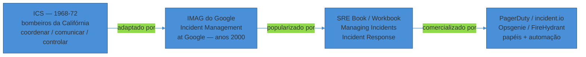
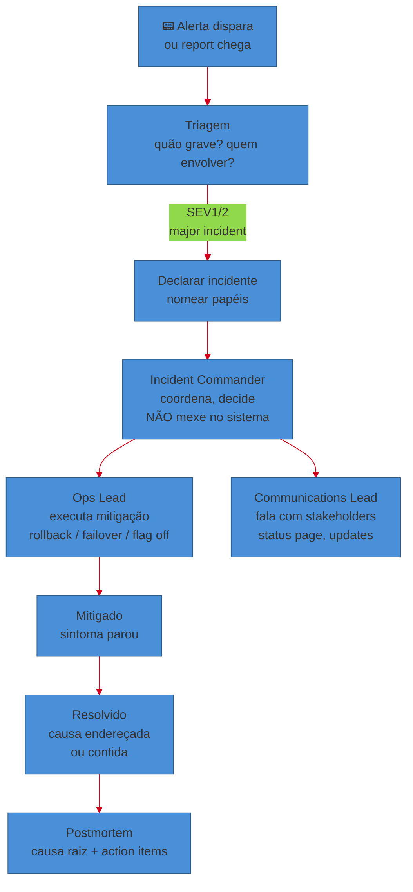
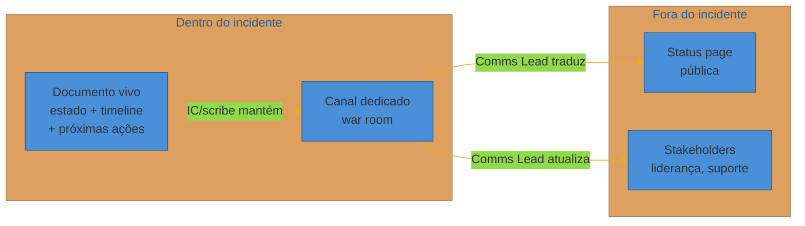
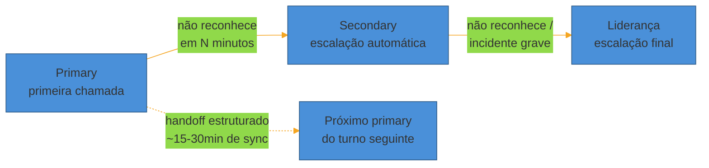

# Incident response e on-call

> [!abstract] TL;DR
> Alertar bem (nota anterior) só garante que o pager toque na hora certa. O que acontece **depois** que ele toca é uma disciplina própria — e a maior causa de incidentes que duram mais do que precisavam não é falta de conhecimento técnico, é **caos de coordenação**: três pessoas mexendo no mesmo sistema ao mesmo tempo, ninguém sabendo quem está fazendo o quê, o chefe perguntando "já resolveu?" no meio do trabalho. A indústria importou a solução dos bombeiros — o **Incident Command System (ICS)**, criado em 1968 para coordenar múltiplas agências apagando incêndios florestais na Califórnia — e o Google adaptou pra produção de software: papéis claros (**Incident Commander** coordena e não mexe no sistema, **Ops Lead** executa, **Communications Lead** fala com o mundo externo), um canal único de comunicação, e um princípio que inverte o instinto de todo engenheiro — **mitigar o sintoma antes de entender a causa raiz**. Root cause é trabalho do postmortem (próxima nota), não do incidente ao vivo. Em paralelo, existe a disciplina do **on-call**: quem carrega o pager, como a rotação é desenhada pra não queimar as pessoas (o SRE Workbook do Google recomenda um teto de ~2 incidentes acionáveis por turno), como o handoff entre turnos preserva contexto, e por que compensação — em dinheiro ou folga — não é luxo, é o preço de pedir que alguém fique de prontidão fora do expediente.

São 2h da manhã. O pager de Marina toca — vibra na mesinha de cabeceira antes mesmo do som, porque ela aprendeu a deixar no modo "não silencioso à noite" depois do último susto. O alerta diz: taxa de erro em 40% no serviço de checkout, disparado há três minutos.

Ela abre o laptop ainda no escuro, entra na call de incidente que o bot já criou automaticamente a partir do alerta, e vê que não está sozinha: dois outros engenheiros já entraram, cada um vindo de um fuso diferente, cada um vendo o mesmo dashboard vermelho. Um deles, sem avisar ninguém, já está rodando um `kubectl rollout undo` no deployment mais recente. O outro, achando que o problema é de banco, está prestes a escalar réplicas de leitura. Ninguém perguntou ao outro o que estava fazendo. No canal do Slack, o gerente de produto já mandou a terceira mensagem perguntando "já sabemos o que é? Temos ETA?" — e ninguém responde, porque todo mundo está com as mãos no teclado, mexendo em coisas diferentes, ao mesmo tempo, no mesmo sistema.

Dez minutos depois, o rollback de um engenheiro colide com a mudança de configuração do outro. O erro não caiu — piorou. Agora são 55% de erro, e ninguém no canal sabe mais qual das duas mudanças recentes é a culpada, porque as duas aconteceram quase juntas, sem registro, sem coordenação.

Esse não é um incidente técnico difícil. É um incidente técnico *simples* que virou difícil porque a resposta a ele foi um caos organizacional. É exatamente esse segundo problema — não "o sistema quebrou", mas "a resposta ao sistema quebrado também quebrou" — que esta nota existe para resolver.

## O problema não é o incidente. É a resposta sem coordenação.

Todo engenheiro sênior já viu uma versão da cena de Marina. O padrão se repete com uma regularidade quase cômica: várias pessoas competentes, cada uma tentando ajudar, cada uma tomando uma ação razoável isoladamente — e o conjunto das ações é pior do que se ninguém tivesse feito nada, porque ninguém sabia o que os outros estavam fazendo.

A raiz do problema é estrutural, não de habilidade individual. Quando um incidente começa, várias coisas precisam acontecer ao mesmo tempo: alguém precisa **decidir** o próximo passo, alguém precisa **executar** mudanças no sistema, e alguém precisa **falar** com quem está fora da sala — cliente, chefe, status page. Se a mesma pessoa (ou pior, várias pessoas descoordenadas) tenta fazer as três coisas ao mesmo tempo, cada uma sofre: decisão vira reação por impulso, execução vira mudanças concorrentes que colidem, e comunicação vira silêncio (porque quem estava mexendo no sistema não tinha tempo de responder o Slack).

> [!question]- Isso não se resolve só "escolhendo um líder na hora"?
> Escolher alguém informalmente ajuda, mas não basta — porque sem um **papel nomeado e reconhecido por todos**, a autoridade dessa pessoa é frágil. Alguém pode discordar e simplesmente ignorar a coordenação ("vou tentar minha própria teoria enquanto isso"), e ninguém tem clareza sobre se aquilo é insubordinação ou iniciativa bem-vinda. O ponto central de formalizar papéis — como as próximas seções vão detalhar — não é burocracia, é dar à coordenação uma **autoridade explícita e temporária**: durante o incidente, essa pessoa específica decide, e todo mundo concorda com isso de antemão, porque o papel existe e é conhecido antes de qualquer incidente acontecer.

A indústria de software não inventou essa solução do zero. Ela importou de um domínio que lida com coordenação sob pressão real há mais de cinquenta anos: o combate a incêndios.

## De onde vem o modelo: o Incident Command System

Em 1968, chefes de bombeiros do sul da Califórnia se reuniram para resolver um problema recorrente: incêndios florestais grandes exigiam a coordenação de múltiplas agências — bombeiros municipais, estaduais, federais, cada uma com sua própria hierarquia, jargão e procedimento — e essa coordenação falhava sistematicamente. Não por falta de recursos, mas por falta de uma linguagem e estrutura comuns. Em 1970, o incêndio de Laguna causou destruição massiva na Califórnia, e a investigação pós-incidente concluiu algo que a indústria de software redescobriria décadas depois: os problemas não eram de recurso insuficiente, eram de **comunicação e gestão** deficientes entre as equipes.

Isso levou ao projeto FIRESCOPE (Firefighting Resources of California Organized for Potential Emergencies), que em 1972 formalizou o **Incident Command System (ICS)**: uma estrutura modular, com terminologia comum, papéis padronizados e cadeia de comando clara, desenhada para escalar de um incidente pequeno (uma equipe) até um desastre multi-agência (centenas de pessoas) sem reinventar a coordenação a cada vez. O sistema foi testado e refinado em grandes incêndios da década de 1970, e em 1982 virou o padrão nacional americano de gestão de emergências (NIIMS, depois incorporado ao NIMS).

O núcleo do ICS gira em torno de três funções que qualquer resposta a incidente — incêndio ou software — precisa cobrir: **coordenar** (decidir o quê fazer e por quem), **comunicar** (manter todos, dentro e fora, informados) e **controlar** (executar as ações decididas, sem interferência cruzada). É essa estrutura de três funções, quase intacta, que o Google adaptou para produção de software — e é essa herança que explica por que os papéis de um incidente de tecnologia soam estranhamente parecidos com os de um incêndio florestal: **Incident Commander**, **Operations**, **Communications**.

O Google chama sua adaptação de **IMAG** (Incident Management at Google), documentada no capítulo "Managing Incidents" do livro SRE e aprofundada no capítulo "Incident Response" do SRE Workbook. A estrutura de papéis do IMAG é o vocabulário que praticamente toda ferramenta comercial de incident response (PagerDuty, incident.io, Opsgenie, FireHydrant) usa hoje, com nomes quase idênticos.

> [!warning] Achar que ICS é "coisa de empresa grande com SRE dedicado"
> **O que acontece:** um time pequeno decide que não precisa de papéis formais porque "somos só cinco pessoas, todo mundo já sabe o que fazer". **Por quê:** o valor do ICS não escala com o tamanho da empresa, escala com o **número de pessoas respondendo ao mesmo incidente ao mesmo tempo**. Um incidente com duas pessoas raramente precisa de papéis explícitos — elas conversam e se coordenam naturalmente. Um incidente com quatro ou mais já tem o risco real de duas pessoas mexerem na mesma coisa sem saber, porque a comunicação deixa de ser 1-para-1 e vira uma malha que ninguém consegue acompanhar de cabeça. **Como evitar:** a regra prática não é "somos grandes o suficiente para ICS" — é "esse incidente já tem mais de duas ou três pessoas mexendo?" Se sim, nomear um Incident Commander, mesmo informalmente, é barato e evita exatamente o cenário de Marina.

## Os papéis: quem decide, quem executa, quem fala

O núcleo do modelo do Google (e da maioria das ferramentas comerciais hoje) são três papéis. Um incidente pequeno pode ter uma única pessoa acumulando os três; um incidente grande separa cada um numa pessoa diferente — o ponto é que os três **existem sempre**, mesmo quando concentrados numa só cabeça, porque nomeá-los força a pessoa a alternar deliberadamente entre "estou decidindo agora" e "estou executando agora", em vez de misturar os dois de forma confusa.

**Incident Commander (IC).** A função mais mal-entendida por quem nunca respondeu a um incidente grande: o IC **não conserta o sistema**. O trabalho do IC é coordenar — decidir a próxima ação, atribuir quem faz o quê, manter o ritmo do incidente, e decidir quando escalar ou quando encerrar. A documentação da PagerDuty é direta sobre isso: o trabalho do Incident Commander é coordenar a resposta, não fazer mudanças técnicas — e, notavelmente, **não é preciso ser o engenheiro mais sênior ou com mais conhecimento técnico profundo do sistema** para ser um bom IC. O que o papel exige é visão de conjunto (como os serviços se conectam), capacidade de tomar decisões rápidas sob incerteza, e disposição de ouvir especialistas e ajustar o plano — não profundidade técnica num serviço específico. É comum, inclusive, que empresas rotacionem o papel de IC entre engenheiros de níveis diferentes justamente para treinar essa habilidade de coordenação, separada da habilidade de debugar.

O documento de incidente vivo — a responsabilidade mais importante do IC segundo o próprio livro SRE — é o artefato que sustenta tudo isso: um documento editável em tempo real (wiki, doc compartilhado, canal estruturado), onde ficam registrados o estado atual, as ações tomadas, quem está fazendo o quê, e a timeline. Sem esse documento, cada pessoa que entra na call precisa perguntar "o que já foi tentado?" — e a resposta verbal se perde cinco minutos depois. Com ele, qualquer pessoa nova consegue se atualizar sozinha em trinta segundos, o que é decisivo às 2h da manhã quando a atenção de todo mundo é um recurso escasso.

**Operations Lead (Ops).** Quem efetivamente mexe no sistema — aplica o rollback, escala réplicas, faz o failover. A separação do IC é o que evita a cena de Marina: **só o Ops Lead (ou quem ele designar explicitamente) toca no sistema**, e faz isso a partir de uma decisão comunicada, não de um impulso individual. Se o IC decide "vamos fazer rollback", é o Ops Lead que executa e reporta de volta — não duas pessoas tentando teorias diferentes em paralelo.

**Communications Lead (Comms).** A pessoa que fala com todo mundo que não está na sala técnica: outros times, liderança, suporte ao cliente, e — em incidentes públicos — a status page. A existência desse papel separado é o que permite ao Ops Lead **não responder ao Slack** enquanto está executando uma mudança delicada, porque alguém já está cuidando disso. O Comms Lead também absorve a pressão social do incidente ("já resolveu? Quanto tempo mais?") sem que essa pressão vaze para dentro da sala técnica, onde ela só atrapalha.

Um quarto papel, menos formal mas recorrente na prática, é o **scribe** — quem mantém a timeline atualizada em tempo real, frequentemente o próprio IC ou alguém que ele designa, especialmente em incidentes longos onde manter o documento vivo consome atenção demais para uma pessoa só fazer junto com coordenar.

> [!question]- Quem decide quem é o IC?
> Na maioria das organizações maduras, o **primeiro a perceber a gravidade declara o incidente e assume o IC até que alguém mais adequado assuma**, formalmente, no canal — a transferência de papel é anunciada em voz alta ("fulano assumindo IC agora") justamente para evitar o vácuo de autoridade que gerou o caos de Marina. Ferramentas como PagerDuty e incident.io automatizam parte disso: ao declarar um incidente na ferramenta, ela já sugere ou atribui um IC a partir de um rodízio pré-definido, junto com a criação automática do canal de comunicação dedicado.

## Triagem e severidade: quão grave é isso, e quem eu chamo

Nem todo alerta vira um incidente formal com IC dedicado — a nota anterior já tratou de alertar em sintoma, não em ruído, mas mesmo um alerta legítimo pode ser pequeno o suficiente para uma pessoa resolver sozinha em cinco minutos. A **triagem** é a decisão rápida, nos primeiros minutos, sobre duas perguntas: quão grave é isso, e quantas pessoas eu preciso envolver.

A resposta padrão da indústria é uma escala numerada de severidade — SEV1 sendo o mais grave. A Atlassian, por exemplo, documenta publicamente sua própria escala de três níveis: **SEV1** é uma interrupção total de um serviço voltado ao cliente, afetando todos os clientes; **SEV2** é o mesmo tipo de interrupção, mas afetando um subconjunto de clientes; **SEV3** é qualquer problema que não impede tarefas essenciais. SEV1 e SEV2 são tratados como "major incident" — acionam resposta imediata e formal, com papéis nomeados; SEV3 normalmente não precisa. Outras empresas usam escalas de quatro ou cinco níveis (SEV1 a SEV4/5), mas o princípio é o mesmo: a severidade determina **quantas pessoas envolver, com que urgência, e se um IC formal é necessário**.

| Severidade | Exemplo típico | Resposta |
|---|---|---|
| SEV1 | Serviço crítico fora do ar para todos os clientes | IC dedicado, war room, comunicação externa imediata |
| SEV2 | Degradação significativa ou fora do ar para um subconjunto | IC dedicado, comunicação interna/externa conforme impacto |
| SEV3 | Bug visível mas não bloqueia tarefa essencial | Resolvido pela pessoa de plantão, sem processo formal |
| SEV4/5 (quando existe) | Cosmético, sem impacto funcional | Vira ticket, sem urgência de página |

A decisão de severidade não é um cálculo exato — é um julgamento rápido, e o erro mais comum e mais caro é o oposto do que a intuição sugere: **sub-declarar**, não super-declarar. Um incidente tratado como SEV3 quando era SEV1 significa que ninguém foi chamado a tempo, que não houve comunicação com o cliente, e que o problema teve tempo de se agravar sem ninguém coordenando a resposta. O custo de declarar um incidente como mais grave do que era — algumas pessoas mobilizadas à toa por vinte minutos — é muito menor do que o custo de não declarar um incidente real a tempo.

> [!warning] Hesitar em declarar incidente por medo de "estar exagerando"
> **O que acontece:** um engenheiro vê um sinal preocupante, mas hesita em declarar SEV1 e chamar todo mundo, com medo de estar sendo alarmista se depois descobrir que era pouca coisa. **Por quê:** a assimetria de custo está invertida na cabeça de quem hesita. Declarar e descobrir que era menor custa minutos de algumas pessoas. Não declarar e descobrir que era maior custa o incidente inteiro rodando sem coordenação, como no caso de Marina — e frequentemente custa também a confiança do cliente, que percebe a lentidão da resposta. **Como evitar:** times maduros tratam a declaração de incidente como uma ação de baixo custo e reversível — "declarar e depois rebaixar" é normal e não gera vergonha. A cultura precisa ativamente remover o estigma de declarar um incidente que acaba sendo pequeno; se as pessoas tiverem medo de errar para cima, elas vão sistematicamente errar para baixo, que é o erro mais caro.

## Mitigar antes de entender: a inversão que salva tempo

Aqui está o princípio mais contraintuitivo — e mais central — de toda resposta a incidente madura: **o objetivo número um não é entender por que o sistema quebrou. É fazer o sintoma parar.**

O instinto de todo engenheiro é o oposto: ver um erro, querer entender a causa, e só então agir — porque é assim que se resolve um bug em condições normais, sem pressão. Mas um incidente ativo não é debugging normal: cada minuto que o sintoma persiste é impacto real acontecendo — pedidos perdidos, usuários travados, dinheiro não processado. A causa raiz pode esperar; o sintoma, não.

Isso é o que a literatura de SRE chama de **mitigação genérica**: ações que não dependem de entender a causa exata, e que "param o sangramento" na maioria dos casos porque atacam os vetores mais comuns de incidente, não a causa específica deste incidente. As mais usadas, em ordem de frequência:

- **Rollback** — desfazer o deploy mais recente. É a mitigação genérica mais eficaz porque a maioria dos incidentes de produção está correlacionada com uma mudança recente; se o sistema estava saudável antes do deploy das 14h e degradou depois, reverter o deploy resolve o sintoma na maioria dos casos, mesmo sem saber exatamente qual linha de código causou o problema.
- **Feature flag off** — desligar a funcionalidade nova via flag, sem precisar de um deploy novo. Mais rápido que rollback quando a infraestrutura de flags já existe, porque não depende do pipeline de deploy.
- **Failover** — redirecionar tráfego para uma réplica, região ou dependência saudável, quando o problema está localizado numa parte específica da infraestrutura.
- **Escalar capacidade** — como no exemplo da fila de pedidos na nota 01 do galho-pai: adicionar workers ou réplicas quando o sintoma é saturação, mesmo sem saber ainda por que a demanda ou a latência aumentou.

A regra prática que times maduros seguem: se uma mitigação genérica consegue restaurar a maior parte do serviço em minutos, ela vem **antes** de qualquer investigação de causa — mesmo que signifique "desperdiçar" um rollback que talvez não fosse a causa real. É melhor reverter e descobrir depois que não era o problema do que gastar quarenta minutos investigando enquanto usuários seguem impactados.

> [!question]- Isso não atrapalha a investigação depois? Rollback "esconde" a evidência.
> É uma tensão real, e por isso o processo de mitigação inclui **preservar evidência antes de agir quando possível** — um snapshot de logs, um dump do estado do sistema, uma captura do dashboard no momento do pico. Mas a resposta madura da indústria é clara sobre a prioridade: perder um pouco de capacidade de diagnóstico é um custo aceitável comparado a manter usuários impactados por mais tempo enquanto se investiga com o sistema ainda quebrado. Na prática, a maioria das causas raízes continua sendo descobrível depois do rollback — logs, métricas históricas e o próprio diff do deploy revertido geralmente bastam. Casos onde a mitigação genuinamente destrói toda evidência da causa são raros.

> [!warning] Fazer "root cause analysis" no meio do incêndio
> **O que acontece:** o time inteiro para de agir e começa a debater teorias de causa raiz — "será que é o cache? Vamos olhar os logs do banco" — enquanto o sintoma continua ativo e usuários continuam impactados. **Por quê:** investigar a causa parece produtivo (está acontecendo trabalho técnico real), mas não move a agulha do que importa durante o incidente: parar o impacto. É o equivalente a debater a causa de um incêndio enquanto a casa continua queimando, em vez de apagar o fogo primeiro. **Como evitar:** a disciplina do IC inclui redirecionar ativamente esse instinto: "vamos guardar essa teoria para o postmortem — agora, o que podemos reverter ou desligar que provavelmente resolve o sintoma?" Root cause analysis profunda é o assunto inteiro da próxima nota (postmortems), com tempo, calma e sem pressão de usuários impactados.

## Comunicação: um canal, uma fonte de verdade

O segundo pilar, depois de papéis e mitigação, é a comunicação — e o princípio organizador é o mesmo em toda a literatura de incident response moderna (Google, PagerDuty, incident.io): **um único canal dedicado, e uma única fonte de verdade sobre o estado do incidente.**

Na prática, isso significa: assim que um incidente é declarado, abre-se um canal específico (a "war room" — hoje quase sempre um canal de Slack/Teams dedicado, às vezes com uma call de voz sempre ligada, raramente ainda uma sala física). Toda discussão técnica do incidente acontece ali, não espalhada em DMs paralelas ou em threads de outros canais — porque informação fragmentada é exatamente o que gerou a colisão de ações no exemplo de Marina.

Externamente, o Communications Lead mantém atualizações regulares e previsíveis — mesmo quando a atualização é "ainda investigando, próxima atualização em 15 minutos" — porque silêncio gera mais ansiedade em quem espera do que a notícia de que o trabalho ainda está em andamento. Para incidentes visíveis a clientes, isso normalmente significa uma **status page** pública, atualizada em paralelo ao trabalho técnico, sem que o time técnico precise parar para escrever a atualização externa — de novo, a razão de existir do papel de Comms separado do papel de Ops.

O documento de incidente vivo mencionado antes — mantido pelo IC ou pelo scribe — é a fonte de verdade *interna*: qualquer pessoa que entra na call, mesmo pela primeira vez, consegue ler três linhas e entender onde o incidente está, sem interromper quem está trabalhando para perguntar verbalmente.

## Ferramentas e runbooks: reduzir a fricção de coordenar

O modelo de papéis funciona sem ferramenta nenhuma — um time pequeno consegue seguir tudo isso com Slack e uma planilha. Mas plataformas dedicadas de incident response (**PagerDuty**, **Opsgenie**, **incident.io**, **FireHydrant**, entre outras) existem para remover fricção exatamente nos momentos em que menos atenção sobra: elas automatizam a criação do canal dedicado assim que um incidente é declarado, sugerem ou atribuem o IC a partir de um rodízio pré-definido, mantêm a timeline automaticamente a partir das mensagens do canal, e publicam a status page com um clique em vez de exigir que alguém escreva HTML às 2h da manhã.

**Runbooks** — já introduzidos na nota anterior como parte de um alerta acionável — cumprem um papel específico aqui: reduzem o tempo entre "o alerta disparou" e "sei o que fazer" ao documentar de antemão os passos de mitigação conhecidos para os tipos de incidente mais comuns. Um runbook bom não substitui julgamento — substitui o tempo gasto reconstruindo, sob pressão, um raciocínio que já foi feito com calma antes.

## As quatro fases do relógio: MTTD, MTTA, MTTM, MTTR

A nota 01 do galho-pai já citou o MTTR (mean time to recovery) como uma das quatro métricas DORA. Na prática operacional, MTTR raramente é medido como um número único — é decomposto em fases, cada uma revelando um gargalo diferente do processo de resposta:

- **MTTD (mean time to detect)** — do início real do problema até alguém (ou algum sistema) perceber que ele existe. Um MTTD alto aponta para lacunas de observabilidade/alerting (notas 01-03 deste sub-galho).
- **MTTA (mean time to acknowledge)** — do alerta disparar até uma pessoa assumir a responsabilidade de responder. Um MTTA alto costuma apontar para rotação de on-call mal desenhada ou fadiga de alerta.
- **MTTM (mean time to mitigate)** — do reconhecimento até o sintoma parar (não até a causa ser entendida). É a métrica mais alinhada ao princípio "mitigar antes de investigar" desta nota.
- **MTTR (mean time to resolve/recover)** — até o sistema estar plenamente restaurado, incluindo verificação de que a mitigação segurou.

Decompor o relógio dessa forma é útil porque um MTTR total ruim pode ter causas completamente diferentes: um time com detecção rápida (MTTD baixo) mas mitigação lenta (MTTM alto) tem um problema de processo de resposta — exatamente o que esta nota endereça. Um time com detecção lenta (MTTD alto) tem um problema de observabilidade — o problema das notas anteriores. Confundir os dois leva a investir esforço no lugar errado.

## On-call: quem carrega o pager, e como isso não vira punição

Todo o processo descrito até aqui pressupõe que existe alguém disponível para ser chamado — o que exige uma estrutura de **plantão (on-call)** desenhada com a mesma seriedade de engenharia que o resto do sistema.

**A rotação básica.** A maioria dos times organiza on-call em camadas: um **primary**, a primeira pessoa chamada quando o alerta dispara, e um **secondary**, chamado automaticamente se o primary não reconhecer o alerta dentro de um prazo definido (a **escalação**). Times maiores adicionam uma camada de liderança acima disso, chamada só para incidentes graves ou quando a escalação normal falha repetidamente. A rotação em si — quem é primary em qual semana — normalmente roda semanalmente entre um grupo, para distribuir a carga e evitar que uma mesma pessoa fique de plantão desproporcionalmente.

**O teto de páginas por turno.** O SRE Workbook do Google é explícito sobre um número: a meta prática é um **máximo de cerca de dois incidentes acionáveis por turno de plantão**. A lógica por trás do número não é arbitrária — cada incidente consome não só o tempo de resolvê-lo, mas também tempo de acompanhamento depois (escrever a timeline, contribuir para o postmortem, ajustar o que causou o problema). Se o volume de páginas ultrapassa esse teto de forma consistente, o SRE Workbook trata isso como um sinal de que **o sistema, não a pessoa**, precisa de intervenção — mais automação, alertas melhor calibrados (nota anterior), ou redução de causas recorrentes de incidente. Um time que aceita um volume de páginas cronicamente alto como "normal" está, na prática, normalizando um sistema mal projetado.

**Compensação e sustentabilidade.** Estar de plantão — mesmo sem receber nenhuma página — já é um custo: a pessoa não pode viajar sem sinal, não pode beber, precisa estar a poucos minutos de um laptop, dorme com um olho aberto. A literatura de SRE trata compensar esse tempo como não-negociável para sustentabilidade — seja em dinheiro, seja em folga compensatória (o Google, por exemplo, oferece as duas opções, com um teto proporcional ao salário). Times que tratam plantão como uma obrigação informal e não remunerada estão, na prática, comunicando que o tempo fora do expediente do engenheiro não vale nada — e isso se traduz, cedo ou tarde, em rotatividade e em gente evitando ativamente qualquer papel que envolva pager.

Turnos de plantão sustentáveis, segundo o guia de práticas mais recente da incident.io, tendem a limitar a duração a algo entre oito e doze horas quando o volume de páginas é alto, aumentando a duração apenas quando o volume permite — plantões de uma semana inteira só funcionam bem quando o volume de páginas realmente noturnas é baixo.

**Handoff entre turnos.** A transição entre quem estava de plantão e quem assume é o ponto onde contexto se perde com mais facilidade — e onde incidentes em andamento correm o maior risco de piorar, porque a pessoa que assume não tem o histórico de quem já estava lidando com o problema. A prática recomendada é uma transição estruturada, não silenciosa: uma breve sincronização (mesmo que de quinze a trinta minutos) revisando incidentes ativos, mudanças recentes no sistema, e qualquer coisa "estranha" observada no turno anterior mesmo que não tenha virado alerta formal.

**Follow-the-sun.** Empresas com equipes distribuídas globalmente frequentemente adotam o modelo *follow-the-sun*: cada região cobre seu próprio horário diurno, e o plantão "segue o sol" — quando a Ásia dorme, a Europa assume; quando a Europa dorme, as Américas assumem. O benefício óbvio é eliminar plantão noturno de fato (ninguém precisa acordar às 2h, porque sempre há alguém acordado em algum fuso). O risco, bem documentado, é justamente o handoff: quando um incidente atravessa três fusos em sequência — Ásia para Europa para América — cada transição é uma chance de perder contexto, e relatos da indústria mostram que incidentes que cruzam múltiplos handoffs regionais frequentemente pioram justamente nessa costura, não por falta de competência técnica em nenhuma das regiões, mas pela lacuna de contexto entre elas.

> [!question]- Como um time pequeno sem orçamento pra ferramenta cara faz plantão sustentável?
> Nenhum dos princípios acima exige ferramenta paga. O que exige disciplina é: (1) medir o volume de páginas por pessoa por turno — mesmo numa planilha simples — e tratar um volume alto como sinal de alarme, não normalidade; (2) garantir que quem está de plantão saiba, de fato, quem é o secondary se ele não conseguir resolver algo sozinho; (3) ter algum tipo de compensação reconhecida, ainda que informal (folga combinada, por exemplo); (4) fazer handoff verbal mínimo entre turnos, mesmo que seja uma mensagem de três linhas no Slack. O que quebra times pequenos não é falta de ferramenta — é tratar plantão como um favor não reconhecido, o que drena as pessoas mais dispostas a ajudar primeiro.

> [!warning] Cultura de herói — o engenheiro que "sempre resolve tudo sozinho"
> **O que acontece:** um engenheiro específico do time tem o hábito de resolver incidentes rápido demais sozinho, sem seguir o processo de papéis, sem documentar, sem envolver ninguém — e o time passa a depender implicitamente dessa pessoa, comemorando-a como "o herói" a cada incidente. **Por quê:** parece positivo no curto prazo (o incidente resolve rápido), mas é uma dívida técnica organizacional: o conhecimento de como resolver aquele tipo de incidente fica preso numa única cabeça, ninguém mais aprende o processo, e quando essa pessoa está de férias, dorme, ou sai da empresa, o time inteiro perde a capacidade de responder bem. Além disso, o "herói" tende a se esgotar primeiro — está sempre sendo chamado, formal ou informalmente, mesmo fora do seu turno oficial. **Como evitar:** o processo de papéis (IC, Ops, Comms) existe justamente para tornar a resposta a incidente **independente de qualquer pessoa específica**. Um sinal de maturidade organizacional real é quando um incidente grave é resolvido bem por alguém que **não é** o especialista histórico daquele sistema — porque o processo, o runbook e a documentação carregam o peso que antes só uma pessoa carregava.

## Anti-patterns que valem repetir

Boa parte desta nota já nomeou anti-patterns específicos — o rollback sem coordenação de Marina, o root-causing no meio do incêndio, a hesitação em declarar incidente, a cultura de herói. Vale reunir os quatro numa lista curta, porque são os que mais aparecem em entrevistas e em incidentes reais:

1. **Ninguém coordenando** — várias pessoas competentes, ação nenhuma coordenada.
2. **Mexer sem comunicar** — executar uma mudança no sistema sem que o resto do time saiba que ela está acontecendo.
3. **Root-causing durante o fogo** — investigar profundamente a causa em vez de mitigar o sintoma primeiro.
4. **Cultura de herói** — depender de uma pessoa específica em vez de um processo replicável.

Todos os quatro compartilham a mesma raiz: tratar a resposta a incidente como um evento espontâneo e improvisado, em vez de um **processo com papéis, prioridades e comunicação definidos com antecedência** — exatamente o que esta nota descreveu.

## Voltando a Marina

Seis meses depois da noite do rollback duplo, o time de Marina mudou o processo. Agora, o bot que detecta o alerta cria automaticamente um canal dedicado e sugere um Incident Commander a partir de um rodízio. Na próxima madrugada em que o pager tocar, a primeira coisa que a pessoa de plantão faz — antes de tocar em qualquer coisa no sistema — é declarar o incidente na ferramenta e assumir IC até que outra pessoa assuma explicitamente. O IC pergunta duas coisas em voz alta: "qual é o sintoma que precisamos parar?" e "o que sabemos que mitiga isso rápido, mesmo sem saber a causa?" Ops executa uma ação de cada vez, anunciada antes de rodar. Comms manda a primeira atualização de status em três minutos, mesmo que seja só "estamos investigando".

O incidente ainda existe — o sistema ainda quebrou. Mas a resposta a ele deixou de ser o segundo incidente dentro do primeiro.

## Em entrevista

Incident response é um dos temas mais previsíveis de entrevista sênior/staff, tipicamente no formato "me conta sobre um incidente que você respondeu" ou no arquétipo de troubleshooting ao vivo (a próxima nota deste sub-galho aprofunda esse segundo formato).

O que um entrevistador sênior está de fato avaliando quando faz essa pergunta:

- Se sua narrativa distingue **mitigação de causa raiz** — a resposta fraca conta a história inteira em torno de "descobri que era X" (a causa); a resposta forte descreve primeiro a ação que parou o impacto, e só depois a investigação da causa, na ordem certa.
- Se você reconhece **papéis e coordenação**, mesmo informalmente — um candidato que descreve "eu resolvi sozinho" para um incidente grande levanta a pergunta implícita de por que ninguém mais estava envolvido nem informado; a resposta madura menciona quem mais participou e como a comunicação aconteceu.
- Se você sabe justificar **por que declarar incidente cedo é a decisão certa**, mesmo que pareça exagero — sinal de alguém que já sentiu na pele o custo de sub-declarar.
- Se sua descrição de on-call reconhece a dimensão **humana e sustentável** do plantão — não só "eu resolvia os alertas", mas alguma noção de carga, rotação, ou o custo de estar de prontidão — sinal de que você pensou no processo como sistema, não só como heroísmo individual.

A resposta forte amarra o conceito a uma decisão concreta: "priorizei o rollback do deploy mais recente assim que vimos a correlação temporal com o início do erro, mesmo sem confirmar a causa exata — o erro caiu de 40% para quase zero em três minutos, e só depois investigamos por que aquele deploy específico causou o problema."

## How to explain in English

Incident response vocabulary is used almost exclusively in English form even in PT-BR technical conversations, borrowed directly from the Google SRE books and from tools like PagerDuty — worth locking in early.

> "When an incident hits, the first priority isn't understanding the root cause — it's stopping user impact. We follow an Incident Command System model adapted from firefighting: an Incident Commander coordinates the response and makes decisions but doesn't touch the system directly, an Operations Lead executes mitigations like rollbacks or feature-flag toggles, and a Communications Lead keeps stakeholders updated so the technical responders can stay focused. Severity determines how many people get pulled in — SEV1 means a full outage for all customers, and the safe default is to over-declare rather than under-declare, because a false alarm costs minutes while a missed incident costs the whole response. Root cause analysis happens later, in the postmortem, with a calm head and no pressure from impacted users."

| PT | EN |
|----|----|
| Resposta a incidente | Incident response |
| Comandante de incidente | Incident Commander (IC) |
| Líder de operações | Operations Lead (Ops) |
| Líder de comunicação | Communications Lead (Comms) |
| Escriba (registro da timeline) | Scribe |
| Declarar um incidente | Declare an incident |
| Severidade / gravidade | Severity (SEV1, SEV2...) |
| Mitigar o sintoma | Mitigate the symptom |
| Causa raiz | Root cause |
| Parar o sangramento | Stop the bleeding |
| Sala de guerra / canal dedicado | War room |
| Fonte única de verdade | Single source of truth |
| Documento de incidente vivo | Living incident document |
| Plantão / estar de prontidão | On-call |
| Primário / secundário (plantão) | Primary / secondary on-call |
| Escalação | Escalation |
| Transição de turno | Handoff |
| Seguir o sol (rotação global) | Follow-the-sun |
| Tempo médio de detecção | Mean time to detect (MTTD) |
| Tempo médio de reconhecimento | Mean time to acknowledge (MTTA) |
| Tempo médio de mitigação | Mean time to mitigate (MTTM) |
| Tempo médio de recuperação | Mean time to resolve/recover (MTTR) |

## O que vem a seguir

O incidente foi mitigado, a comunicação aconteceu, o sintoma parou. Mas a causa raiz ainda não foi entendida — e essa é justamente a parte que esta nota deliberadamente adiou. A próxima nota entra no *depois*: como investigar a causa com calma, documentar o que aconteceu de um jeito que gera aprendizado real, e por que caçar culpados individuais — em vez das falhas do sistema e do processo — torna incidentes futuros mais prováveis, não menos.

- [[05 - Postmortems e cultura blameless]] — timeline, contributing factors, action items, e por que "blameless" é uma escolha deliberada de engenharia, não gentileza

## Veja também

- [[Operação/index|Operação]] — o galho-pai e o mapa completo da trilha
- [[4 - Observar e responder/index|Observar e responder]] — este sub-galho
- [[05 - Postmortems e cultura blameless]] — o que acontece depois que o incidente é mitigado
- [[04 - Confiabilidade como feature]] — o SLA/SLO que todo incidente ameaça, e por que a severidade se conecta ao orçamento de erro

## Fontes

- **Google** — [*Site Reliability Engineering* — Managing Incidents](https://sre.google/sre-book/managing-incidents/) (sre.google/books, 2016) — a origem do IMAG, os papéis (IC, Ops, Comms) e a herança do Incident Command System.
- **Google** — [*Site Reliability Engineering* — Being On-Call](https://sre.google/sre-book/being-on-call/) (sre.google/books, 2016) — os princípios de plantão saudável e o vínculo entre confiabilidade e bem-estar do on-call engineer.
- **Google SRE Workbook** — [*Incident Response*](https://sre.google/workbook/incident-response/) (sre.google/workbook, 2018) — casos práticos de mitigação genérica ("stop the bleeding") e análise de causa como etapa posterior.
- **Google SRE Workbook** — [*On-Call*](https://sre.google/workbook/on-call/) (sre.google/workbook, 2018) — o teto de ~2 incidentes acionáveis por turno, a anatomia da carga de pager e compensação.
- **Google** — [*Incident Management Guide*](https://sre.google/resources/practices-and-processes/incident-management-guide/) (sre.google, atualizado) — visão consolidada de papéis, severidade e comunicação.
- **PagerDuty** — [*Incident Commander*](https://response.pagerduty.com/training/incident_commander/) (response.pagerduty.com) — as responsabilidades do IC e o princípio de que coordenação não exige ser o especialista técnico mais sênior.
- **PagerDuty** — [*Different Roles*](https://response.pagerduty.com/before/different_roles/) (response.pagerduty.com) — a divisão completa de papéis num incidente maior.
- **Atlassian** — [*Understanding Incident Severity Levels*](https://www.atlassian.com/incident-management/kpis/severity-levels) — a escala SEV1/SEV2/SEV3 usada como exemplo nesta nota, e a orientação de tratar SEV1/SEV2 como major incident.
- **Silent Beacon** — [*Incident Command System (ICS): History, Structure, and Modern Applications*](https://silentbeacon.com/incident-command-system-ics-history-structure-and-modern-applications/) — a origem do ICS em 1968-1972 via FIRESCOPE e o incêndio de Laguna em 1970.
- **incident.io** — [*On-call best practices: handoffs, schedules, and alert fatigue*](https://incident.io/blog/on-call-best-practices-guide-2026) (blog, 2026) — práticas de handoff estruturado, duração de turno sustentável e follow-the-sun, consultado em julho de 2026.
- **Atlassian** — [*MTBF, MTTR, MTTA, and MTTF*](https://www.atlassian.com/incident-management/kpis/common-metrics) — a decomposição do relógio de incidente em MTTD/MTTA/MTTM/MTTR.
