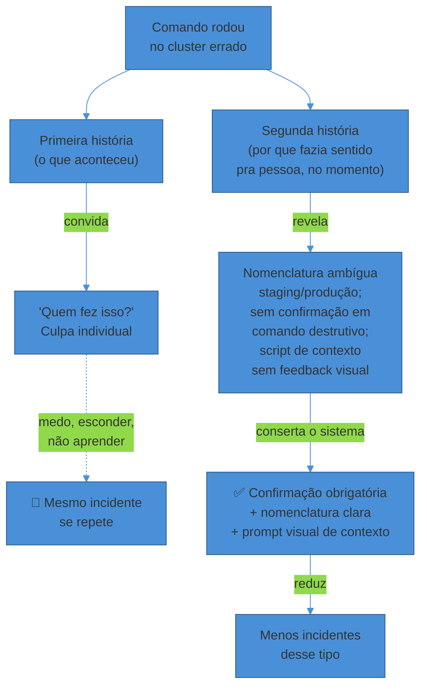
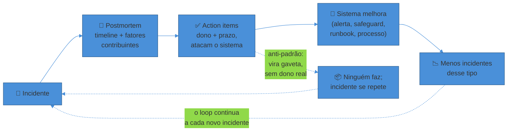

# Postmortems e cultura blameless

> [!abstract] TL;DR
> Depois de um outage, a diretoria pergunta "quem derrubou a produção?" e o engenheiro que rodou o comando é repreendido na frente do time. O resultado, sistemático e previsível, não é mais cuidado — é **menos aprendizado**: da próxima vez que algo parecer arriscado, as pessoas escondem, minimizam, ou simplesmente param de mexer no sistema por medo. A organização perde exatamente a informação de que precisava para não repetir o mesmo incidente. O **postmortem blameless** inverte essa lógica: assume que a pessoa agiu de forma razoável dado o que sabia, via e podia ver no momento — e troca "quem errou?" por **"que sistema permitiu que um único comando derrubasse tudo?"**. Isso não é ausência de responsabilidade (accountability); é a forma mais eficaz de exercê-la, porque investiga a causa sistêmica em vez de punir o sintoma humano mais visível. Um postmortem bem escrito documenta uma timeline factual, nomeia **múltiplos fatores contribuintes** (não "a" causa raiz única), e produz **action items concretos** — com dono e prazo — que atacam o sistema, não a disciplina das pessoas. A prática só funciona dentro de uma cultura que trata o incidente como investimento pago à vista: o dinheiro do outage já foi gasto, e o único retorno possível sobre esse gasto é o aprendizado que o postmortem extrai dele.

Terça-feira, 15h, três semanas atrás. Um engenheiro sênior — vamos chamá-la de Camila — está fazendo uma limpeza de rotina, removendo instâncias antigas de um cluster que já não deveriam existir. Ela roda um comando de terminação em lote, contra o que ela acredita ser o ambiente de staging. Alguns segundos depois, os dashboards de produção começam a piscar vermelho. O comando rodou contra o cluster errado — produção, não staging — porque os dois ambientes compartilhavam o mesmo padrão de nome de recurso, e o terminal em que Camila estava logada tinha trocado de contexto sem que ela percebesse, num script de troca de ambiente que ela mesma tinha rodado quinze minutos antes para outra tarefa.

A produção cai por dezoito minutos. É restaurada. No dia seguinte, numa reunião com a gerência presente, alguém pergunta, na frente de todo o time: "quem rodou esse comando?" Camila levanta a mão. A resposta que ela recebe, entre risos desconfortáveis de quem quer aliviar a tensão, é uma versão de "bom, presta mais atenção da próxima vez" — e um comentário de que isso "vai constar" na próxima avaliação de desempenho.

O que acontece nas semanas seguintes, na equipe de Camila, não é mais atenção — é menos transparência. Um colega que percebe um comportamento estranho num deploy decide não mencionar em voz alta, porque não tem certeza se causou algo e não quer ser o próximo "quem fez isso". Outro engenheiro, que sempre limpava recursos órfãos manualmente como parte da rotina de higiene do time, para de fazer essa limpeza — não porque decidiu isso conscientemente, mas porque, instintivamente, evitar mexer é mais seguro para a carreira do que arriscar um erro visível. Três meses depois, o mesmo tipo de incidente acontece de novo — comando rodado no ambiente errado — só que dessa vez é outra pessoa, porque a causa real (dois ambientes com nomenclatura ambígua e nenhuma confirmação antes de um comando destrutivo) nunca foi corrigida. Ninguém quis investigar fundo o suficiente para achar essa causa, porque investigar fundo, naquela cultura, significa procurar mais um culpado.

Essa é a história que todo engenheiro sênior já viu de perto, em algum lugar da carreira, ainda que os detalhes mudem. E é o problema exato que a prática do **postmortem blameless** — nascida na engenharia de segurança de aviação e trazida para a engenharia de software, de forma mais influente, por John Allspaw na Etsy em 2012 — foi desenhada para resolver.

## Por que escrever um postmortem, afinal

Comece pela pergunta mais simples e mais frequentemente pulada: por que gastar tempo de engenharia escrevendo um documento *depois* que o incidente já foi resolvido? O sistema já está de pé, os clientes já foram avisados, todo mundo quer voltar ao trabalho normal.

A resposta do **Google SRE Book**, no capítulo "Postmortem Culture: Learning from Failure", é direta: sem um processo formalizado de aprender com incidentes, eles tendem a se repetir *ad infinitum* — e, sem controle, podem se multiplicar em complexidade ou até se encadear, sobrecarregando o sistema e as pessoas que o operam. O incidente já custou algo real: minutos ou horas de indisponibilidade, confiança de cliente, dinheiro de SLA, sono perdido de quem estava de plantão. Esse custo já foi pago — é afundado, irrecuperável. A única forma de obter algum retorno sobre um custo já pago é extrair dele o máximo de aprendizado possível. Não escrever o postmortem, ou escrever um raso, é desperdiçar duas vezes: pagar o custo do incidente *e* pagar de novo quando ele se repetir, porque nada sistêmico mudou.

O livro SRE é explícito sobre o tom: "escrever um postmortem não é punição — é uma oportunidade de aprendizado para a empresa inteira." Um postmortem eficaz, sustentado ao longo do tempo, tem um efeito cumulativo mensurável — organizações com cultura de postmortem madura relatam menos outages e sistemas mais confiáveis, o que libera tempo de engenharia para trabalho de feature em vez de apagar incêndio repetido.

> [!question]- Todo incidente merece um postmortem completo?
> Não — e insistir nisso é como super-monitorar tudo (o mesmo erro discutido na nota anterior sobre alerting): gasta atenção finita em coisa de baixo retorno. A prática comum é definir um limiar de severidade — incidentes que violaram SLO, tiveram impacto visível ao cliente, ou exigiram escalonamento fora do horário normal ganham postmortem completo; incidentes triviais e já bem entendidos (um retry automático que resolveu sozinho, por exemplo) podem só ser registrados brevemente. O critério importante não é o tamanho do incidente, mas o **quanto de surpresa** ele carregou: um incidente pequeno mas totalmente inesperado, que revela um ponto cego novo, às vezes merece mais investigação do que um incidente grande mas já bem compreendido de uma causa conhecida.

## Blameless: a inversão da pergunta

O núcleo da prática blameless está numa mudança de uma única pergunta. Em vez de "quem causou isso?", pergunta-se: **"que condições do sistema — técnico, de processo, organizacional — permitiram que essa ação tivesse esse resultado?"**

Allspaw formalizou essa mudança com um conceito que se tornou vocabulário padrão na indústria: toda ação tem uma **"primeira história"** (first story) e uma **"segunda história"** (second story). A primeira história é o que aconteceu na superfície — "Camila rodou um comando destrutivo no cluster errado." É factual, mas incompleta, e sozinha convida a única conclusão possível: alguém errou, alguém deve ser mais cuidadoso. A segunda história pergunta *por que essa decisão fazia sentido para a pessoa, no momento, dado o que ela sabia e via* — o script de troca de contexto que ela tinha acabado de rodar, a ambiguidade de nomenclatura entre staging e produção, a ausência de qualquer confirmação antes de um comando irreversível, a pressão do horário para terminar a limpeza antes do fim do expediente. A segunda história é onde estão as alavancas reais de melhoria — porque nenhuma delas depende de Camila "ter mais cuidado" da próxima vez; todas dependem do sistema mudar.

A frase que resume o princípio — citada quase à exaustão desde que Allspaw a publicou, mas ainda assim o resumo mais preciso disponível — é: **assuma que a pessoa envolvida agiu de forma razoável, dado o que sabia, via e acreditava ser verdade no momento da ação.** Isso não é dar um passe livre para negligência real. É reconhecer um fato empírico bem estabelecido em engenharia de segurança (aviação, medicina, operação de usinas): a esmagadora maioria dos erros operacionais não vem de pessoas descuidadas agindo mal de propósito — vem de pessoas competentes tomando a decisão que parecia certa, com a informação disponível, dentro de um sistema que criou as condições para que essa decisão desse errado.

> [!warning] Confundir "blameless" com "sem accountability"
> **O que acontece:** um executivo ou gerente ouve "postmortem sem culpa" e conclui que ninguém é responsabilizado por nada — o que soa perigoso, e por isso alguns times resistem a adotar a prática, ou a adotam pela metade e voltam a caçar culpado no primeiro incidente sério.
> **Por quê:** confunde **culpa individual** (blame — apontar uma pessoa como a causa e puni-la) com **responsabilidade sistêmica** (accountability — garantir que a organização, coletivamente, entenda o que aconteceu e conserte a causa real). O segundo é *mais* rigoroso que o primeiro, não menos: culpar uma pessoa e seguir em frente é o caminho fácil que não exige investigação nenhuma além de "encontrar quem apertou o botão errado". Investigar o sistema até a causa sistêmica exige trabalho de verdade.
> **Como evitar:** deixe claro, desde a primeira frase do postmortem, que o documento não vai nomear nem punir nenhum indivíduo — mas que a organização *é* responsável por corrigir o que o incidente revelou, com dono e prazo por action item. Accountability vira sobre o sistema mudar, não sobre alguém ser envergonhado.

## Just culture: a linha que Dekker traça

A ressalva mais importante à cultura blameless — e a que evita que ela vire desculpa para negligência real — vem do trabalho de **Sidney Dekker**, professor de safety science e autor de *The Field Guide to Understanding Human Error* e *Just Culture*. Dekker argumenta que o rótulo "erro humano" é enganoso e, paradoxalmente, atrapalha a descoberta das causas reais de um incidente: chamar algo de "erro humano" parece uma explicação, mas na verdade é só um ponto de partida — a pergunta que realmente importa é *por que* aquela ação pareceu correta para a pessoa, no contexto em que ela estava.

O conceito de **just culture** (cultura justa) que Dekker desenvolve não é "nunca responsabilizar ninguém" — é balancear segurança e responsabilidade, distinguindo com cuidado entre categorias de comportamento que merecem respostas muito diferentes:

- **Erro genuíno** (slip, lapso, decisão razoável que deu errado com a informação disponível) — investigar o sistema, não punir a pessoa.
- **Risco normalizado** (atalho que virou prática comum porque o processo formal era lento demais e ninguém parou para corrigir) — sintoma organizacional, corrigir o processo.
- **Negligência real ou violação deliberada e recorrente** (ignorar um procedimento de segurança conhecido, repetidamente, sem justificativa) — aí sim há espaço para uma conversa de responsabilidade individual, mas ainda assim informada por entender o contexto completo, não como reação automática ao primeiro sinal de erro.

A linha entre essas categorias raramente é óbvia no calor do momento — e é exatamente por isso que Dekker insiste em investigar a fundo antes de julgar: a maioria dos incidentes que *parecem*, à primeira vista, negligência ("como ela pôde rodar esse comando sem checar o ambiente?") se revela, na investigação da segunda história, um erro genuíno dentro de um sistema que tornava esse erro fácil de cometer e difícil de perceber a tempo.

> [!question]- Existe algum caso em que "culpar" alguém é a resposta certa?
> Sim — Dekker é explícito sobre isso, e é o ponto que separa "just culture" de "sempre perdoar tudo". Sabotagem deliberada, violação repetida e consciente de um procedimento de segurança conhecido, ou negligência grosseira comprovada (não um erro, mas uma escolha de ignorar risco óbvio) são categorias diferentes de um erro genuíno cometido por alguém competente agindo de boa-fé. A distinção que importa na prática: o processo de investigação tem que ser o mesmo — factual, minucioso, sem pressa de concluir — independente de qual categoria o incidente acabar se revelando. O erro comum não é "nunca responsabilizar ninguém"; é pular direto para a conclusão de negligência sem investigar, porque é mais rápido e mais satisfatório emocionalmente do que entender o sistema.

## A estrutura de um postmortem

Com o princípio estabelecido, a estrutura prática. Um postmortem bem escrito — seguindo o padrão que o Google SRE Book documenta e que ferramentas como o **Morgue**, da Etsy (um tracker de postmortem open-source lançado em 2012 para operacionalizar exatamente essa prática), formalizaram em processo — tem seções consistentes, cada uma respondendo uma pergunta específica:

**Resumo e impacto.** No topo, um parágrafo curto que qualquer pessoa da empresa — não só quem esteve no incidente — consegue ler e entender: o que quebrou, por quanto tempo, quantos usuários/requests foram afetados, qual foi o impacto de negócio (receita, SLA, reputação). Isso é o que a liderança lê primeiro, e o que orienta a prioridade das ações que seguem.

**Timeline.** A espinha dorsal factual do documento: uma sequência cronológica e verificável de eventos — quando o deploy subiu, quando o primeiro sintoma apareceu, quando o alerta disparou, quando alguém percebeu, quando a mitigação começou, quando o serviço foi restaurado, quando o postmortem foi escrito. A timeline é deliberadamente **factual e sem interpretação** nessa fase — "às 14h32, o alerta de burn rate disparou" não "às 14h32, o time percebeu tarde demais que o deploy tinha um bug". Misturar julgamento com fato na timeline é onde postmortems escorregam de volta para caça às bruxas sem perceber.

**Detecção.** Como o incidente foi percebido — por um alerta (qual? quanto tempo depois do início real?), por um cliente reclamando, por alguém notando manualmente um dashboard? Essa seção alimenta diretamente a nota anterior deste sub-galho: se a detecção veio de um cliente e não de um alerta, isso é uma lacuna concreta de observabilidade/alerting que o postmortem deveria transformar em action item.

**Resposta.** O que a equipe fez desde a detecção até a mitigação — quem foi acionado, que decisões foram tomadas, o que funcionou bem na resposta (isso também merece registro, não só o que deu errado) e onde o processo de incident response (nota 04 deste sub-galho) atrasou ou confundiu.

**Fatores contribuintes.** A seção mais importante e a mais fácil de fazer errado — a próxima seção detalha por quê.

**Action items.** Ações concretas, cada uma com **dono nomeado** e **prazo**, que atacam algum dos fatores contribuintes identificados. Não "ter mais cuidado" — algo verificável, como "adicionar confirmação obrigatória (nome do ambiente digitado manualmente) antes de qualquer comando destrutivo em produção, dono: Camila, prazo: sprint 14".

**Lições aprendidas — o que também deu certo.** Um postmortem maduro não documenta só falhas: registra o que funcionou — o alerta que disparou na hora certa, o runbook que economizou dez minutos, a comunicação que manteve stakeholders informados sem pânico. Isso não é só cortesia; é dado real sobre o que reforçar, e ajuda a evitar que o documento inteiro tenha tom punitivo mesmo quando ninguém é nomeado.

## Fatores contribuintes, não "a" causa raiz

A tentação mais forte, ao escrever um postmortem, é procurar **a** causa raiz — um único fato que, corrigido, teria evitado tudo. É intuitivo, é satisfatório, e é a estrutura que ferramentas como os "5 Whys" (cinco porquês) formalizam: perguntar "por quê" repetidamente até chegar numa causa final.

O problema é que essa estrutura simplifica demais sistemas complexos. Richard Cook, pesquisador de segurança em sistemas complexos cujo trabalho influenciou boa parte da literatura de resiliência em engenharia de software, resume o argumento de forma direta: falhas visíveis exigem **múltiplas faltas simultâneas** — não existe causa isolada de um acidente; existem múltiplos fatores contribuintes, cada um necessário mas insuficiente sozinho, e só *juntos* suficientes para produzir o incidente. No caso de Camila: a nomenclatura ambígua entre ambientes não teria causado o incidente sozinha (ela sempre existiu); a ausência de confirmação em comando destrutivo não teria causado sozinha (também sempre existiu); o script de troca de contexto silencioso não teria causado sozinho. Foi a combinação simultânea das três condições, mais a pressão de tempo do fim do expediente, que produziu o resultado — e cada uma dessas quatro coisas é, isoladamente, uma correção válida que reduz a chance do próximo incidente parecido, sem que nenhuma sozinha seja "a" causa.

A crítica mais afiada aos 5 Whys, formulada por John Allspaw no ensaio "The Infinite Hows" (Kitchen Soap), é que o método é **linear** — segue uma única cadeia de causa e efeito para trás — enquanto incidentes reais têm vários fatores contribuintes interagindo ao mesmo tempo; é **não-repetível** — dê o mesmo incidente para três facilitadores diferentes e cada um vai escolher um "porquê" diferente a cada passo, chegando a três causas raiz distintas, porque cada "por quê" escolhe um pai e descarta os outros; e é **reducionista** — promete uma raiz única que sistemas fortemente acoplados raramente têm.

Isso não significa abandonar a pergunta "por quê" — significa fazer a pergunta em **leque**, não em linha: em cada ponto da timeline, perguntar "que condições contribuíram para esse passo específico acontecer assim?" e aceitar múltiplas respostas simultâneas, em vez de escolher uma e seguir uma única cadeia adiante. O resultado é uma lista de fatores contribuintes — tipicamente entre três e sete, na experiência da maioria dos times maduros — em vez de uma única "causa raiz" isolada.

> [!warning] "A causa raiz foi erro humano"
> **O que acontece:** um postmortem chega à conclusão de que a causa raiz foi "o engenheiro rodou o comando errado" ou "o dev esqueceu de configurar o timeout" — e o document para por aí, satisfeito com uma explicação.
> **Por quê:** como Dekker argumenta, "erro humano" não é uma explicação — é o ponto onde a investigação *deveria* começar, não onde ela termina. Toda ação humana acontece dentro de um sistema (interface, processo, incentivo, informação disponível) que tornou aquela ação plausível. Parar em "erro humano" é abandonar a investigação exatamente no momento em que ela ficaria útil.
> **Como evitar:** trate "erro humano" como um sinal para perguntar "por que essa ação pareceu razoável para essa pessoa, com a informação que ela tinha?" — nunca como resposta final. Se um postmortem termina numa frase sobre o comportamento de uma pessoa, ele não terminou — só parou cedo demais.

> [!question]- Se não existe "a" causa raiz, o que dizer quando alguém pergunta "mas qual foi a causa"?
> A resposta honesta e útil é nomear os fatores contribuintes específicos, não recusar a pergunta. "O incidente teve três fatores contribuintes principais: nomenclatura ambígua entre ambientes, ausência de confirmação em comandos destrutivos, e um script de contexto sem feedback visual — os três juntos criaram a condição para o erro" é uma resposta muito mais acionável (e honesta) do que "a causa raiz foi o comando errado". A resistência ao termo "causa raiz" não é pedantismo semântico — é uma correção de modelo mental que muda diretamente quantos action items o postmortem produz e o quão bem eles previnem recorrência.

## Near-miss: o incidente que quase aconteceu

Uma extensão natural da cultura de postmortem, ainda subaproveitada na maioria dos times, é tratar **near-misses** — quase-incidentes, situações em que algo quase deu errado mas não deu, por sorte ou por uma salvaguarda que funcionou bem — com o mesmo rigor de investigação de um incidente real.

A lógica vem direto da engenharia de segurança industrial, onde a proporção documentada entre near-misses e incidentes sérios é grande: para cada acidente grave, existem tipicamente centenas de "quase aconteceu" que passaram despercebidos ou não foram reportados. O valor de investigar esses quase-eventos é que eles carregam o mesmo sinal de fragilidade sistêmica de um incidente real — mas custam zero em impacto ao usuário, porque nada de fato quebrou. No caso de Camila: se o comando destrutivo tivesse sido bloqueado por uma confirmação que já existisse (mas não existia), o near-miss teria acontecido sem nenhum outage — e ainda assim teria revelado exatamente a mesma fragilidade (nomenclatura ambígua, script silencioso) que o incidente real revelou, só que de graça.

A barreira prática para aproveitar esse sinal é cultural antes de ser técnica: near-misses só chegam à luz se as pessoas se sentirem seguras para reportá-los voluntariamente — "quase rodei esse comando no cluster errado, mas percebi a tempo" é exatamente o tipo de confissão que uma cultura de culpa extingue primeiro, porque admitir um quase-erro parece um risco desnecessário quando não há obrigação de reportar. Isso fecha o círculo com o argumento central desta nota: uma cultura blameless não é só sobre como reagir depois que algo quebra — é sobre criar o ambiente de segurança psicológica em que sinais de fragilidade, grandes ou pequenos, chegam à superfície antes que o incidente aconteça de verdade.

## A disciplina de aprender com incidentes

A comunidade **Learning from Incidents in Software (LFI)**, cofundada por Nora Jones (ex-engenheira de resiliência na Netflix e Slack, depois fundadora da Jeli) em 2019, formalizou algo que os pioneiros como Allspaw já praticavam implicitamente: tratar a análise de incidentes como uma **disciplina própria** de engenharia — trazendo conceitos de resilience engineering, human factors e systems safety (as mesmas raízes de Dekker) para o vocabulário cotidiano de times de software.

O argumento central do LFI é que incidentes são o investimento mais caro que uma organização de engenharia já fez — e a maioria das empresas extrai uma fração pequena do retorno possível sobre esse investimento, porque trata o postmortem como burocracia de compliance (preencher o formulário, marcar como resolvido) em vez de como pesquisa genuína sobre como o sistema — sociotécnico, não só o código — realmente funciona sob estresse. A prática que o LFI defende vai além do documento escrito: **revisar incidentes em grupo**, com facilitação que ativamente busca a segunda história em vez de aceitar a primeira, e tratar cada incidente como uma amostra de como a organização opera de verdade — frequentemente muito diferente de como o processo formal diz que ela opera.

Esse compromisso de revisar em grupo e compartilhar amplamente é o que separa uma cultura de postmortem viva de uma morta. Postmortems escritos, arquivados numa pasta que ninguém revisita, e nunca discutidos em voz alta viram burocracia performática — o time cumpre o processo formal mas não extrai o aprendizado real, que só emerge quando várias pessoas, com contextos diferentes, discutem juntas a segunda história.

## O anti-padrão do postmortem-gaveta

O ponto mais frequente onde a boa intenção de um postmortem morre não é na escrita — é depois. Um postmortem bem escrito, com fatores contribuintes honestos e action items bem formulados, ainda assim falha em prevenir recorrência se os action items **nunca são de fato feitos**.

O padrão de por que isso acontece é conhecido e recorrente: um bom action item precisa de cinco elementos — um dono nomeado (não "o time"), um verbo verificável, um resultado específico, um lugar no sistema real de tarefas do time (não só no documento do postmortem), e um prazo. Faltando qualquer um desses cinco, a ação já nasce em risco. "O time deveria melhorar o monitoramento" não é uma ação — é um sentimento; ninguém acorda numa segunda-feira pensando "eu devia trabalhar naquilo que o time deveria fazer". "Alice: adicionar alerta de burn rate para replicação de banco > 30s no Datadog, até o fim do sprint 14" é uma ação — pode ser verificada como feita ou não feita.

> [!warning] O postmortem que vira gaveta
> **O que acontece:** o time escreve um postmortem cuidadoso, com boa análise e fatores contribuintes honestos, sai da reunião alinhado — e nas semanas seguintes os action items silenciosamente somem, engolidos pelo trabalho de feature que sempre parece mais urgente.
> **Por quê:** essa é a "última milha" do postmortem — documentos brilhantes que não produzem mudança nenhuma. Sem dono nomeado, sem prazo, sem lugar no sistema real de tarefas (não só no documento arquivado), um action item compete por atenção contra trabalho que tem deadline explícito e visibilidade de negócio — e perde, quase sempre.
> **Como evitar:** fechar um postmortem é um ato consciente, não passivo: cada action item termina feito, ou explicitamente despriorizado com justificativa registrada ("decidimos não fazer isso porque o risco é baixo e o esforço é alto" é um resultado válido). O que não é válido é a ação apodrecer silenciosamente num backlog até alguém arquivar o board sem nunca ter sido revisitada. Times maduros instituem um nudge periódico — um lembrete leve, não uma cobrança de desempenho — e uma auditoria recorrente de "quantos action items dos últimos três meses foram de fato concluídos?" como métrica própria da saúde do processo de postmortem.

## Postmortems públicos: o exemplo levado ao extremo

A prática de postmortem blameless, quando uma organização confia genuinamente nela, se estende até fora dos muros da empresa. O caso mais visível recente é o outage massivo da **Cloudflare em 18 de novembro de 2025**, provocado por um bug na lógica de geração de um arquivo de configuração do sistema de Bot Management, que derrubou uma fração grande do tráfego que a Cloudflare protege — afetando bancos, e-commerces e serviços de todos os tamanhos simultaneamente. Horas depois da mitigação, o CEO Matthew Prince publicou um relato detalhado do que deu errado, incluindo a cadeia técnica completa (uma mudança de permissão de banco de dados que afetou queries de forma inesperada) e uma frase reveladora sobre o processo interno: ele participou pessoalmente da chamada do incidente, escreveu a primeira versão da revisão, e — nas palavras dele — "nenhum de nós estava feliz, estávamos envergonhados com o que tinha acontecido, mas declaramos [o postmortem] verdadeiro e preciso" antes de publicá-lo.

O detalhe que importa nesse exemplo não é a Cloudflare ter tido um outage grande — todo sistema em escala suficiente eventualmente tem. É que a cultura interna de investigar com honestidade, sem procurar um culpado individual para expor, foi robusta o suficiente para sobreviver ao desconforto de publicar os detalhes técnicos completos de um erro embaraçoso para uma audiência pública — e não só para uma reunião interna onde seria mais fácil suavizar. Repositórios públicos como o *danluu/post-mortems* no GitHub agregam dezenas desses relatos — Cloudflare, GitLab, e outras — precisamente porque a indústria reconhece o valor de aprender com o incidente de *outra* empresa, não só com o próprio; um postmortem bem escrito é, em certo sentido, um artefato de bem público quando compartilhado.

## Fechando o loop com o resto da trilha

Um postmortem que não altera nada fora de si mesmo é, na melhor das hipóteses, um exercício de reflexão — e na pior, teatro. O valor real acontece quando os action items se conectam de volta às práticas que as notas anteriores deste sub-galho construíram:

- Se a **detecção** foi tardia ou veio de um cliente em vez de um alerta, o action item é revisar SLIs/SLOs (nota 02) ou adicionar um alerta de sintoma (nota 03) que teria pego o problema mais cedo.
- Se a **resposta** foi confusa — ninguém sabia quem era o Incident Commander, comunicação atrasou — o action item revisita o processo de incident response (nota 04): papéis mais claros, um runbook que faltava, um canal de comunicação melhor definido.
- Se um **fator contribuinte** foi ausência de um safeguard técnico (como a confirmação obrigatória que teria bloqueado o comando de Camila), o action item vira trabalho de engenharia real — não "cuidado", um mecanismo que torna o erro fisicamente mais difícil de cometer de novo.

Esse é o sentido em que um postmortem fecha o **loop de aprendizado** da Terceira Via do DevOps (nota 01 do galho-pai): cada incidente, processado honestamente, retroalimenta diretamente a observabilidade, o alerting e o processo de resposta que vão prevenir o próximo. Sem esse loop fechado, os quatro sub-galhos desta trilha operam isolados — cada incidente é uma surpresa nova, em vez de uma correção acumulada sobre a anterior. Com o loop fechado, cada incidente deixa o sistema — e a organização que o opera — genuinamente mais resiliente do que estava antes.

## Um exemplo trabalhado: o postmortem de Camila

Volte ao incidente do início desta nota, agora reescrito como o postmortem que a equipe *deveria* ter escrito — e, numa segunda versão do mesmo cenário, escreveu de fato depois que o time decidiu adotar a prática blameless a sério.

**Resumo e impacto.** Produção indisponível por 18 minutos às 15h02 de terça-feira, causada por terminação acidental de instâncias de produção durante uma tarefa de limpeza de recursos órfãos. Impacto: ~40 mil requests falharam, SLO mensal de disponibilidade consumiu 12% do error budget do trimestre numa única janela.

**Timeline (trecho).** 14h47 — engenheira roda script de troca de contexto para outra tarefa, terminal permanece no contexto de produção sem indicação visual de mudança. 15h00 — engenheira inicia limpeza de instâncias órfãs, comando roda contra o padrão de nome que existe tanto em staging quanto em produção. 15h02 — dashboards de produção começam a mostrar erro 5xx crescente. 15h03 — alerta de burn rate agudo dispara (nota 03). 15h05 — engenheira percebe o padrão de erro coincide com o comando que acabou de rodar, inicia rollback das instâncias terminadas. 15h20 — serviço restaurado.

**Fatores contribuintes** (não "a causa raiz"): (1) nomenclatura de recurso idêntica entre staging e produção, sem prefixo distintivo obrigatório; (2) nenhuma confirmação exigida antes de comando destrutivo em lote contra produção; (3) script de troca de contexto não deixava indicação visual persistente de qual ambiente estava ativo; (4) a tarefa de limpeza, historicamente de baixo risco, nunca tinha passado por revisão de segurança porque nenhum incidente anterior a tinha sinalizado como perigosa.

**Action items.** Dono + prazo para cada um: adicionar prefixo obrigatório de ambiente a todo nome de recurso (Infra, 2 semanas); exigir digitação manual do nome do ambiente como confirmação antes de qualquer comando destrutivo em lote (Plataforma, 1 semana); adicionar indicador visual persistente de ambiente ativo no prompt do terminal via ferramenta interna (DevEx, 3 semanas); revisar todas as tarefas rotineiras marcadas como "baixo risco" quanto a potencial destrutivo real (SRE, 1 mês).

**Lições aprendidas.** O alerta de burn rate disparou em menos de um minuto e a engenheira reconheceu a correlação com sua própria ação rapidamente — o que reduziu o tempo de detecção-a-mitigação para menos de 5 minutos, um resultado bom mesmo dentro de um incidente evitável.

Note o que não aparece em nenhum lugar deste documento: o nome de Camila junto de qualquer avaliação de desempenho, qualquer menção a "falta de cuidado", qualquer conclusão que termine em comportamento humano em vez de sistema. Três meses depois de esses quatro action items serem implementados, o mesmo tipo de erro — comando no ambiente errado — se tornou tecnicamente impossível de causar um outage sem confirmação explícita. O incidente não se repetiu, não porque as pessoas ficaram mais cuidadosas, mas porque o sistema parou de permitir esse tipo de erro silencioso.

## Em entrevista

Postmortems e cultura blameless aparecem em entrevistas sênior de duas formas distintas — vale reconhecer as duas.

**Pergunta direta de conceito** ("como funciona um postmortem no seu time?", "o que é cultura blameless?"): o entrevistador está avaliando se você distingue **blameless de "sem accountability"** (a resposta fraca soa como "a gente não culpa ninguém, então relaxa"; a resposta forte explica que blameless é uma técnica de investigação mais rigorosa, não mais leniente) e se você sabe nomear a estrutura real — fatores contribuintes plurais, não causa raiz única; action items com dono e prazo, não intenções vagas.

**Pergunta comportamental** ("conte sobre um incidente que você causou ou participou"): essa é a pergunta em que a maioria dos candidatos sêniores se atrapalha, porque instintivamente narram a versão defensiva ("não foi minha culpa, o sistema estava mal configurado") ou a versão de auto-flagelação ("eu deveria ter sido mais cuidadoso"). A resposta que sinaliza maturidade real é a segunda história completa: o que você sabia no momento, por que a decisão parecia razoável, o que o postmortem revelou como fator sistêmico, e — o ponto que mais separa sênior de pleno — **o que mudou depois**, concretamente, para que aquele tipo de erro fique mais difícil de repetir. Um candidato que narra um incidente e termina em "aprendi a prestar mais atenção" não passou pelo processo de verdade; um candidato que termina em "adicionamos uma confirmação obrigatória que hoje bloqueia esse tipo de erro estruturalmente" mostra que já viveu um postmortem funcional de verdade.

## How to explain in English

Postmortem vocabulary is used almost universally in its English form even in PT-BR technical conversations — this is one of the areas where code-switching is the norm, not the exception.

> "After an incident, the return on that cost is the learning you extract from it — so we run blameless postmortems: the assumption is that the person involved acted reasonably given what they knew, saw, and believed at the time. We ask what conditions in the system allowed the incident to happen, not who's to blame. The document has a factual timeline, multiple contributing factors — not a single 'root cause', because complex systems fail from several factors interacting jointly — and concrete action items, each with a named owner and a deadline, that fix the system rather than telling someone to 'be more careful.' We also review near-misses with the same rigor, because they carry the same signal for free. The failure mode to avoid is the postmortem that becomes a shelf document — good analysis, zero follow-through."

| PT | EN |
|----|----|
| Postmortem / análise pós-incidente | Postmortem / post-incident review (PIR) |
| Cultura sem culpa | Blameless culture |
| Primeira história / segunda história | First story / second story |
| Cultura justa | Just culture |
| Fatores contribuintes | Contributing factors |
| Causa raiz (única, evitar como conclusão final) | Root cause |
| Cinco porquês | Five whys |
| Quase-incidente | Near miss |
| Item de ação | Action item |
| Dono (do action item) | Owner |
| Postmortem-gaveta (que ninguém executa) | Shelf postmortem |
| Aprender com incidentes | Learning from incidents |
| Segurança psicológica | Psychological safety |
| Responsabilização sistêmica | Accountability |

## O que vem a seguir

O postmortem fecha o loop de aprendizado depois que o incidente já aconteceu. A próxima nota olha para o momento *durante* — quando você está sob pressão, o alerta já disparou, e precisa investigar sob incerteza real usando a instrumentação que os sub-galhos anteriores construíram. Ela também introduz uma prática que inverte a lógica desta nota: em vez de esperar o incidente acontecer para aprender, injetar falha deliberadamente para descobrir fragilidades antes que um cliente as descubra por você.

- [[06 - Debugging de produção e chaos engineering]] — investigar sob pressão com observabilidade real; chaos engineering como investimento de confiança antes do incidente, não depois

## Veja também

- [[Operação/index|Operação]] — o galho-pai e o mapa completo da trilha
- [[4 - Observar e responder/index|Observar e responder]] — este sub-galho
- [[04 - Incident response e on-call]] — o processo ao vivo do incidente; esta nota assume que ele já terminou
- [[01 - O que é operar um sistema]] — a Terceira Via do DevOps (aprendizado contínuo) que esta nota aprofunda

## Fontes

- **Google** — [*Site Reliability Engineering* — Postmortem Culture: Learning from Failure](https://sre.google/sre-book/postmortem-culture/) (sre.google/books, 2016) — a definição canônica de postmortem, o princípio blameless, e o argumento de que incidentes sem processo formal de aprendizado tendem a se repetir.
- **Google** — [*Site Reliability Engineering* — Example Postmortem](https://sre.google/sre-book/example-postmortem/) (sre.google/books, 2016) — o template de referência com timeline, impacto, causas e action items.
- **Google SRE Workbook** — [*Postmortem Culture: Learning from Failure*](https://sre.google/workbook/postmortem-culture/) (sre.google/workbook, 2018) — prática de sustentar cultura de postmortem ao longo do tempo com apoio de liderança sênior.
- **John Allspaw** — [*Blameless PostMortems and a Just Culture*](https://www.etsy.com/codeascraft/blameless-postmortems), Etsy Code as Craft (maio de 2012) — o texto fundador da prática blameless em engenharia de software; o conceito de "first story / second story".
- **John Allspaw** — [*The Infinite Hows (or, the Dangers of the Five Whys)*](https://www.kitchensoap.com/2014/11/14/the-infinite-hows-or-the-dangers-of-the-five-whys/), Kitchen Soap (novembro de 2014) — a crítica aos 5 Whys como método linear, não-repetível e reducionista.
- **Sidney Dekker** — *The Field Guide to Understanding 'Human Error'* (3ª edição, Routledge, 2014) e *Just Culture: Balancing Safety and Accountability* — a distinção entre erro genuíno, risco normalizado e negligência real; o argumento de que "erro humano" é ponto de partida, não explicação.
- **Etsy** — [*morgue*: post mortem tracker](https://github.com/etsy/morgue) (GitHub, open-sourced 2012) — a ferramenta que operacionalizou o processo de postmortem blameless na prática.
- **Nora Jones e comunidade LFI** — [*Learning from Incidents in Software*](https://www.learningfromincidents.io/posts/learning-from-incidents-in-software) (learningfromincidents.io, fundado em 2019) — a disciplina de tratar análise de incidentes como pesquisa sobre o sistema sociotécnico, não burocracia de compliance.
- **incident.io** — [*Why Do Post-Mortem Action Items Fail?*](https://incident.io/blog/why-do-post-mortem-action-items-fail-how-to-make-incident-follow-ups-actually-get-done) (blog, 2025) — os cinco elementos de um action item eficaz e o padrão de por que eles silenciosamente somem sem dono/prazo.
- **Cloudflare** — [*Cloudflare outage on November 18, 2025*](https://blog.cloudflare.com/tag/post-mortem/) e cobertura via [The Pragmatic Engineer](https://blog.pragmaticengineer.com/the-pulse-cloudflare-takes-down-half-the-internet/) — exemplo de postmortem público de grande escala, incluindo a declaração do CEO Matthew Prince sobre honestidade do relato mesmo sob desconforto.
- **dan luu** — [*post-mortems*: coleção de postmortems públicos](https://github.com/danluu/post-mortems) (GitHub) — repositório curado de relatos de incidentes de múltiplas empresas, consultado em julho de 2026.
