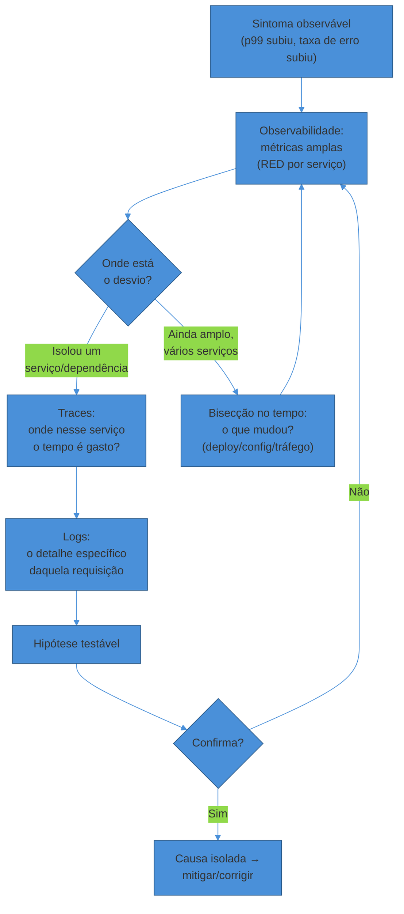
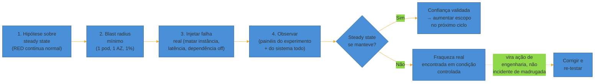

# Debugging de produção e chaos engineering

> [!abstract] TL;DR
> **Debugging de produção** é investigação sob pressão: um método, não um chute — partir do **sintoma observável**, formar hipótese, usar observabilidade do amplo pro específico (métricas → traces → logs), e **estreitar por bisecção no tempo**, cuja primeira pergunta é sempre "o que mudou?" (deploy, config, tráfego). É reativo: você só descobre a fraqueza depois que ela já derrubou algo. **Chaos engineering** é o oposto simétrico — em vez de esperar a falha te encontrar, você a **provoca de propósito**, num experimento controlado, pra descobrir a fraqueza antes que ela vire incidente. O framework canônico (Netflix, formalizado como [Principles of Chaos Engineering](https://principlesofchaos.org/)) define steady state mensurável, hipotetiza que ele resiste a um evento real, injeta esse evento com **blast radius mínimo**, e observa se a hipótese sobrevive. As duas disciplinas são as duas metades de "dominar a falha": debugging fecha o incidente que já aconteceu; chaos previne o próximo. Juntas, fecham este sub-galho — observar (ver), responder (agir) e provocar (aprender antes) — e a trilha inteira.

São 14h32. O p99 de latência do checkout, que vive girando em torno de 180ms, acabou de bater 3,4 segundos. Você tem talvez cinco minutos antes que o time de suporte comece a abrir tickets em massa — e o sistema tem 40 serviços, qualquer um dos quais pode ser o culpado. Você não pode ler 40 dashboards um por um. Você não pode "adivinhar" que foi o serviço de pagamento porque foi o serviço de pagamento da última vez. Você precisa de um **método** que reduza 40 suspeitos a 1 em minutos, não de sorte.

Agora troque de cena. É terça-feira, 10h da manhã, horário de baixo tráfego, e ninguém está em pânico. Um engenheiro sênior abre um painel, escreve uma hipótese — "se o serviço de recomendação cair, o checkout continua funcionando, só sem sugestões" — e aperta um botão que **mata esse serviço de propósito**. Ele observa o sistema por 10 minutos. Se a hipótese se confirma, aprendeu que a resiliência funciona. Se não se confirma — se o checkout também cai — acabou de descobrir, num horário controlado e com uma equipe de prontidão, uma fraqueza que de outro jeito só apareceria às 3h de uma sexta-feira, sob carga real, sem ninguém de prontidão.

As duas cenas são o mesmo instinto voltado para direções opostas. A primeira é **debugging de produção**: você já está no meio da falha, e o jogo é encurtar a distância entre sintoma e causa o mais rápido possível. A segunda é **chaos engineering**: você ainda não está na falha, e o jogo é provocá-la você mesmo, em condições que você controla, pra descobrir a fraqueza antes que o mundo real a descubra por você. Debugging é reativo — investigar depois que quebrou. Chaos é proativo — quebrar de propósito pra não ser surpreendido depois. Esta nota cobre as duas, porque juntas elas fecham o arco deste sub-galho: [[01 - Observabilidade como prática|observar]] deu instrumentação, [[04 - Incident response e on-call|responder]] deu processo ao vivo, [[05 - Postmortems e cultura blameless|aprender]] deu memória institucional — e agora, **investigar com método** e **provocar de propósito** fecham o ciclo completo de quem realmente domina a confiabilidade de um sistema, não só reage a ela.

## Parte 1 — Debugging de produção: investigar sob pressão

### Por que "chutar" não escala

A tentação, sob pressão, é pular direto para a explicação mais familiar: "provavelmente é o banco de novo" ou "deve ser aquele serviço que sempre dá problema". Às vezes acerta. Na maioria das vezes, gasta minutos preciosos numa pista errada enquanto o sintoma real continua degradando o sistema — e pior, cria um viés de confirmação que faz você ignorar sinais que apontam para outro lugar.

O livro *Site Reliability Engineering* do Google dedica um capítulo inteiro (["Effective Troubleshooting"](https://sre.google/sre-book/effective-troubleshooting/)) a argumentar o oposto: troubleshooting não é um dom inato de "algumas pessoas têm o faro, outras não" — é um **processo aprendível e ensinável**, mesmo que quem o pratica há anos frequentemente não consiga articular os passos (comparam explicar troubleshooting a explicar como andar de bicicleta). O capítulo distingue dois ingredientes que se combinam: entender o **processo genérico** de troubleshooting (funciona em qualquer sistema) e ter **conhecimento específico** de como aquele sistema em particular deveria se comportar. Investigar só com o processo genérico funciona, mas é mais lento e menos eficaz do que quando combinado com entendimento real de como as peças se encaixam.

O ponto prático que interessa aqui: **o método reduz o espaço de busca de forma sistemática**, em vez de depender de memória de incidentes passados ou palpite. Com 40 serviços candidatos, não existe atalho mágico — existe um funil.

### Do amplo pro específico: métricas, depois traces, depois logs

A ordem importa, e ela é deliberada. **Métricas** primeiro porque são baratas de consultar e cobrem o sistema inteiro de uma vez — um painel RED (Rate, Errors, Duration) por serviço, coberto na [[01 - Observabilidade como prática|nota 01 deste sub-galho]], mostra em segundos *qual* serviço está fora do normal, sem precisar olhar dentro de nenhum deles ainda. **Traces** entram quando você já isolou um ou dois serviços suspeitos e precisa saber *onde dentro* daquela requisição o tempo está sendo gasto — foi uma chamada de rede lenta, uma query de banco, um lock? **Logs** entram por último, quando você já sabe a requisição específica ou o intervalo específico que quer examinar em detalhe — abrir logs brutos antes disso é procurar agulha em palheiro sem saber nem em qual celeiro está o palheiro.

Inverter essa ordem — abrir logs brutos primeiro, "porque é onde o detalhe está" — é o erro mais comum de quem ainda não internalizou o método: você afoga em volume de dados antes de saber o que está procurando.

> [!question]- E se as métricas não mostram nada fora do normal?
> Isso também é informação. Se nenhum painel RED aponta desvio, o sintoma relatado pelo usuário pode ser mais localizado do que o dashboard consegue enxergar (um segmento específico de tráfego, um tenant específico, um path de código raro) — sinal de que a cardinalidade da sua instrumentação (nota 01) não é fina o suficiente para separar esse caso, ou que o sintoma está numa camada que você ainda não instrumentou (ex.: um SDK de terceiro, uma CDN). Nesse caso, o próximo passo é reduzir o escopo manualmente: reproduzir a condição relatada (mesmo usuário, mesma região, mesmo horário) e comparar contra o baseline — voltando, na prática, para bisecção.

### Bisecção no tempo: "o que mudou?"

Se as métricas não isolam um único serviço óbvio — o desvio aparece espalhado, ou o sintoma é sistêmico — a pergunta mais produtiva deixa de ser "qual serviço" e vira **"o que mudou, e quando exatamente começou?"**. A grande maioria dos incidentes de produção correlaciona com uma mudança identificável, mesmo que a correlação não seja óbvia à primeira vista — um relatório sobre debugging de incidentes descreve a "assinatura" clássica de uma regressão de deploy: o incidente começa dentro de ~30 minutos de um deploy, e um rollback resolve.

Isso não é coincidência estatística — é a razão pela qual [[05 - Postmortems e cultura blameless|postmortems]] sempre abrem a timeline com "o que mudou antes do sintoma aparecer": deploy de código, mudança de config, rollout de feature flag, aumento de tráfego (campanha de marketing, evento sazonal), ou uma dependência externa que mudou de comportamento sem aviso. A técnica de bisecção é literal: se você sabe que o sistema estava saudável às 13h e degradado às 14h30, você não precisa investigar a hora inteira — você **divide o intervalo ao meio**, checa o estado do sistema no ponto médio, e repete, convergindo pro minuto exato da virada muito mais rápido do que uma varredura linear.

> [!warning] Confundir correlação temporal com causa raiz
> **O que acontece:** um deploy saiu 10 minutos antes do sintoma aparecer, então a equipe assume "foi o deploy" e passa a próxima hora revisando um diff que, na verdade, é inocente. **Por quê:** dois eventos vizinhos no tempo não são automaticamente causa e efeito — pode ser coincidência (um pico de tráfego natural bateu no mesmo minuto) ou os dois podem compartilhar uma terceira causa (um autoscaler que reagiu tarde a uma carga que já vinha crescendo antes do deploy). **Como evitar:** trate "o que mudou" como **gerador de hipóteses**, não como veredito. A hipótese "foi o deploy X" só vira causa confirmada depois de uma correlação reproduzível — reverter o deploy e observar o sintoma desaparecer, ou encontrar no próprio deploy a mudança específica que explica o mecanismo do sintoma (não só a coincidência de horário).

### O diferencial: o que é diferente do normal

Uma ferramenta mental que atravessa todo o funil acima merece nome próprio: o **diferencial**. Em vez de perguntar "por que esse serviço está lento", a pergunta mais produtiva costuma ser "o que é *diferente* nesse serviço, agora, comparado ao seu próprio comportamento normal — e comparado aos serviços vizinhos que não estão degradados?". Isso soa como uma reformulação boba da mesma pergunta, mas muda o que você olha: em vez de vasculhar o código procurando um bug hipotético, você compara **series temporais** — o volume de tráfego deste minuto contra a mesma hora ontem, a taxa de cache-hit deste serviço contra o baseline da última semana, o número de conexões abertas com o banco agora contra o normal.

O diferencial funciona porque a maioria dos sistemas de produção não quebra por causa de um bug que sempre existiu — quebra porque uma condição mudou (mais carga, uma dependência mais lenta, um recurso esgotando) e expôs um bug que estava lá o tempo todo, dormente. Achar *o que mudou na condição* é geralmente mais rápido do que achar *o bug latente*, e frequentemente os dois apontam pro mesmo lugar.

> [!question]- Diferencial não é só outro nome pra "o que mudou"?
> São primos próximos, mas operam em escalas diferentes. "O que mudou" (bisecção no tempo) pergunta sobre **eventos discretos** — um deploy, uma mudança de config, um flag ligado. O diferencial pergunta sobre **estado contínuo** — séries temporais que se movem gradualmente, sem um evento único e identificável: memória crescendo aos poucos até um vazamento estourar, cache-hit caindo devagar conforme o padrão de acesso muda, conexões de banco se acumulando até o pool esgotar. Um incidente causado por deploy tem uma borda nítida no tempo — o diferencial de "o que mudou" resolve rápido. Um incidente causado por degradação gradual não tem essa borda — é aí que comparar séries temporais lado a lado (diferencial no sentido estrito) vira a ferramenta certa, porque não existe um único "momento da virada" pra bisectar.

### Mitigar o sintoma antes de caçar a causa raiz

Essa priorização já apareceu na [[04 - Incident response e on-call|nota 04]] como princípio de resposta a incidente — vale reforçar aqui pela ótica de debugging: enquanto você investiga, o sintoma continua causando dano real (pedidos perdidos, usuários travados, SLA estourando). Se existe uma mitigação conhecida e de baixo risco — reverter o último deploy, escalar réplicas, dar failover para uma região saudável — aplicá-la **não substitui** a investigação da causa raiz, só a desacopla da urgência. Você para de sangrar primeiro, depois entende por que sangrou, com tempo e cabeça mais fria. Isso é, deliberadamente, o oposto de "resolver de vez antes de qualquer alívio" — que parece mais rigoroso mas custa cada minuto extra em dano real ao usuário.

> [!warning] Parar no primeiro sintoma que aparece
> **O que acontece:** a investigação encontra um serviço com erro elevado, declara "achei o culpado", aplica uma correção pontual nele, e encerra o incidente — sem verificar se esse serviço era a causa raiz ou só mais uma vítima a jusante de outro problema. **Por quê:** em sistemas distribuídos, falha se propaga. Um serviço lento a montante enche filas e satura conexões nos serviços a jusante, que passam a errar por conta própria — e o primeiro erro que aparece no seu painel muitas vezes é do serviço a jusante, não da origem real. Corrigir o sintoma a jusante (reiniciar, escalar) alivia a dor imediata, mas o problema volta assim que a origem voltar a degradar. **Como evitar:** antes de declarar causa raiz encontrada, pergunte "esse serviço degradou *primeiro*, ou é consequência de algo que degradou antes dele?" — voltando ao painel RED dos serviços upstream e checando se o timestamp do desvio deles antecede o do "culpado" encontrado. É o mesmo instinto de bisecção no tempo, aplicado à topologia de dependências em vez de só ao histórico de deploys.

### O arquétipo "troubleshoot" em entrevista de sistema

O padrão descrito até aqui — sintoma → observabilidade ampla → hipótese → estreitar → verificar — é literalmente o roteiro que um entrevistador sênior espera ver quando faz a pergunta "a latência de X subiu em produção, como você investiga?", um dos arquétipos centrais de entrevista de System Design (ver [[01 - O que é System Design e o que a entrevista avalia]]). A resposta fraca é uma lista de ferramentas ("eu olharia os logs, depois o Grafana, depois..."). A resposta forte narra o **funil de eliminação**: qual sinal amplo você olha primeiro, como ele reduz o espaço de busca, o que te faz decidir se o problema está numa camada específica ou é sistêmico, e como você valida a hipótese antes de declarar causa raiz — a mesma disciplina de bisecção e "o que mudou" descrita acima, aplicada a um cenário hipotético em vez de um incidente real.

## Parte 2 — Chaos engineering: provocar a falha de propósito

### A origem: matar instâncias pra forçar resiliência

A prática nasceu de uma observação simples e desconfortável: sistemas distribuídos em nuvem *vão* falhar — instâncias somem, discos morrem, redes têm partição — e a única pergunta real é se você descobre isso num experimento controlado ou num incidente real. A Netflix, migrando para AWS no fim dos anos 2000, criou o **Chaos Monkey** em 2010/2011: uma ferramenta que mata instâncias de produção aleatoriamente, durante o horário comercial, com a lógica de que "a melhor forma de evitar falha é falhar constantemente" ([Gremlin, "Chaos Monkey at Netflix: the Origin of Chaos Engineering"](https://www.gremlin.com/chaos-monkey/the-origin-of-chaos-monkey)).

Em julho de 2011, a Netflix formalizou a ideia publicamente como **Simian Army** ([Netflix TechBlog, "The Netflix Simian Army"](https://netflixtechblog.com/the-netflix-simian-army-16e57fbab116)): uma família de ferramentas, cada uma provocando um tipo diferente de falha ou verificando uma condição de saúde — Latency Monkey injeta atraso artificial na comunicação entre serviços pra simular degradação (não só queda total); Conformity Monkey desliga instâncias que não seguem boas práticas; Chaos Gorilla simula a queda de uma **availability zone inteira** da AWS, não só uma instância isolada. O resultado prático foi testado sob fogo real: a Netflix atribui a esse regime de "chaos testing" a capacidade de absorver, sem incidente visível ao usuário, um reboot de ~10% dos servidores da AWS em setembro de 2014.

O deslocamento conceitual que a Netflix formalizou foi tirar a prática do nicho de "ferramenta de infra" e nomeá-la disciplina: **Chaos Engineering** — a prática de experimentar num sistema distribuído para construir confiança na sua capacidade de suportar condições turbulentas em produção.

### Os princípios formais

A prática ganhou forma canônica no site [Principles of Chaos Engineering](https://principlesofchaos.org/), mantido pelos praticantes originais da Netflix, e depois no livro *Chaos Engineering: System Resiliency in Practice* (Casey Rosenthal e Nora Jones, O'Reilly, 2020) — os dois nomes mais associados a formalizar a disciplina fora da Netflix. Os princípios centrais:

1. **Defina o steady state como saída mensurável.** Não "o sistema está bem" (vago) — throughput, taxa de erro, percentis de latência: os mesmos sinais RED que já vivem no seu painel de observabilidade. O experimento precisa de um número pra comparar antes e depois.
2. **Hipotetize que o steady state se mantém tanto no grupo de controle quanto no grupo experimental.** Você não está tentando provar que o sistema quebra — está tentando **desconfirmar** a hipótese de que ele aguenta. Se a hipótese sobrevive à tentativa de desconfirmação, você ganhou confiança real, não suposição.
3. **Injete variáveis que reflitam eventos do mundo real.** Instâncias que morrem, latência de rede que aumenta, uma dependência que fica indisponível, uma zona inteira que cai — priorizados pelo impacto potencial ou pela frequência estimada, não por curiosidade técnica.
4. **Rode em produção, com cautela.** Um ambiente de staging nunca replica de verdade o tráfego, a topologia e os vizinhos barulhentos de produção — é por isso que a Netflix insiste em rodar contra produção real, mas com controles de segurança.
5. **Minimize e contenha o blast radius.** O princípio mais operacional dos cinco, e o que separa "chaos engineering disciplinado" de "sabotagem": todo experimento precisa de um raio de impacto delimitado e conhecido antes de começar.
6. **Automatize os experimentos para rodar continuamente.** Um experimento manual, rodado uma vez, prova que o sistema aguentou aquela falha *naquele momento* — não que ele continua aguentando depois que o código, a topologia e a carga mudaram na semana seguinte.

### Blast radius: começar pequeno de propósito

Se há um único conceito prático que separa "chaos engineering" de "brincar de derrubar produção", é o **blast radius**. O guia da Gremlin define o princípio de forma direta: limite o escopo do experimento apenas aos sistemas que você quer testar, e comece testando **uma única instância não-produtiva** em vez do deployment inteiro de produção — a orientação padrão é sempre começar com o menor blast radius que ainda ensina algo real sobre o sistema ([Gremlin, "How to implement Chaos Engineering"](https://www.gremlin.com/community/tutorials/chaos-engineering-adoption-guide)).

Na prática, isso significa: antes de derrubar um serviço inteiro, você derruba **um pod** dele. Antes de simular a queda de uma região inteira, você simula a queda de **uma zona de disponibilidade**. Antes de rodar contra 100% do tráfego, você roda contra **1%**. Cada degrau de escala só acontece depois que o degrau anterior confirmou a hipótese — e cada experimento tem, definido *antes* de começar, um critério de abortar (um "kill switch") caso o impacto ultrapasse o esperado.

> [!question]- Chaos engineering não é simplesmente "causar um incidente de propósito"?
> É, tecnicamente — mas a diferença entre isso e sabotagem está inteira nos princípios 4, 5 e 6: acontece com controle (blast radius conhecido e pequeno), com observabilidade ligada e uma equipe de prontidão observando em tempo real (não "solto e vejo o que acontece"), num horário planejado (não às 3h de uma sexta), e com um kill switch pronto pra abortar. Um incidente real não tem nenhuma dessas garantias — ele te encontra desprevenido, no pior horário possível, sem ninguém de prontidão olhando o painel certo. Chaos engineering troca esse cenário pelo oposto: mesma classe de falha, condições que você escolhe.

### Game days: o exercício além do script automatizado

Nem todo experimento de chaos precisa ser um script que mata pods sozinho — muitos times começam com **game days**: exercícios planejados onde a equipe simula deliberadamente um cenário de falha e pratica a resposta como se fosse um incidente real, incluindo comunicação, uso de runbooks e o processo de [[04 - Incident response e on-call|incident response]] inteiro. O guia da Gremlin sobre game days descreve a preparação típica: definir o cenário e a hipótese, identificar o alvo e o blast radius, avisar os participantes, confirmar que a observabilidade necessária está de pé, e preparar o runbook de rollback antes de injetar qualquer coisa ([Gremlin, "Introduction to GameDays"](https://www.gremlin.com/community/tutorials/introduction-to-gamedays)).

O valor de um game day não é só técnico — é organizacional. Times que nunca praticaram um incidente descobrem, no meio do primeiro real, que ninguém sabe quem é o Incident Commander, ou que o runbook está desatualizado, ou que o dashboard "óbvio" para investigar aquele serviço não existe. Um game day expõe essas lacunas de processo no mesmo espírito que um experimento de chaos expõe lacunas técnicas — só que o "sistema" sendo testado, dessa vez, é o próprio time.

### O que o chaos realmente testa: as premissas de resiliência

Chaos engineering não inventa fraquezas do nada — ele **verifica se os mecanismos de resiliência que você já construiu funcionam de verdade sob a condição que eles foram desenhados para lidar**. Timeouts, retries com backoff, circuit breakers e bulkheads — cobertos, sob a ótica de configuração e tuning, na [[06 - Resiliência operacional|nota 06 do sub-galho 3]] — são todos afirmações implícitas: "se essa dependência ficar lenta, o timeout evita que o worker fique preso"; "se esse serviço cair, o circuit breaker abre e para de bater nele". Essas afirmações raramente são testadas de verdade até que a condição real aconteça — e é exatamente nesse ponto cego que um circuit breaker mal configurado, ou um timeout ausente, sobrevive despercebido por meses até o incidente que finalmente o expõe.

Um experimento de chaos bem desenhado transforma essa afirmação implícita em hipótese explícita e testável: "se eu matar essa dependência, o circuit breaker deve abrir em N segundos e o serviço consumidor deve continuar respondendo com um fallback degradado, não travar." Rodar esse experimento num horário controlado, com blast radius pequeno, é literalmente descobrir a resposta a essa pergunta antes que a produção descubra por você — e cada resposta negativa vira, na prática, uma ação de engenharia concreta (ajustar o timeout, revisar o threshold do circuit breaker) em vez de um item de postmortem escrito depois do estrago.

> [!warning] Rodar chaos engineering sem observabilidade e resiliência básica primeiro
> **O que acontece:** um time lê sobre Chaos Monkey, se anima, e sobe um script que mata instâncias de produção aleatoriamente antes de ter dashboards RED confiáveis ou qualquer circuit breaker configurado. **Por quê:** chaos engineering pressupõe que você consegue **observar o efeito** do experimento em tempo real (senão você não sabe se a hipótese falhou) e que existe alguma camada mínima de resiliência pra testar (senão todo experimento vira "sim, quebrou" — informação que você já sabia, sem ganhar nada de novo). Sem essas duas bases, chaos não é mais experimento disciplinado — é causar incidente sem instrumentação pra sequer entender o que aconteceu. **Como evitar:** trate chaos engineering como o **topo** da pirâmide de maturidade operacional, não o ponto de partida — venha depois de [[01 - Observabilidade como prática|observabilidade instrumentada]], [[03 - Alerting que não gera fadiga|alerting funcional]] e uma camada básica de [[06 - Resiliência operacional|timeouts/retries/circuit breakers]] já configurada. Comece pequeno (uma instância, um game day tabletop sem sequer tocar produção) e só escale conforme a maturidade acompanha.

> [!question]- Isso só faz sentido em escala Netflix, com centenas de serviços?
> A prática nasceu nessa escala, mas o princípio subjacente — verificar experimentalmente se a resiliência que você projetou funciona de verdade — vale em qualquer tamanho de sistema, só que o formato do experimento muda. Um time pequeno, com três serviços, não precisa de um Chaos Monkey automatizado rodando continuamente em produção; precisa de um game day trimestral, ou até de um exercício manual: derrubar deliberadamente uma dependência num ambiente de staging fiel e observar se o timeout/circuit breaker reage como esperado. A diferença entre "chaos engineering de startup" e "chaos engineering de Netflix" é o grau de automação e o blast radius que a organização tolera — não se a prática vale a pena. Um sistema com uma única dependência crítica sem fallback testado tem tanto a ganhar de descobrir isso num experimento controlado quanto um sistema com quarenta.

### Maturidade: um caminho gradual, não um salto

A progressão típica de um time adotando chaos engineering segue, na prática, uma escada de confiança crescente: primeiro, **game days sem tocar produção** — simulações "de mesa" onde o time discute "o que aconteceria se X caísse" sem executar nada. Depois, experimentos reais mas de **blast radius mínimo** em ambiente de staging ou contra um único pod não-crítico de produção. Depois, experimentos **automatizados e recorrentes** contra produção real, com kill switch e observabilidade madura — o estágio que a Netflix já operava com o Simian Army original. Pular direto para o último estágio sem passar pelos anteriores é a receita do warning acima: você acumula todo o risco de produção sem ter construído, ainda, a capacidade de observar e reagir ao que o experimento revela.

## Um exemplo trabalhado: da investigação ao experimento

Volte à primeira cena da abertura: p99 do checkout em 3,4 segundos, 14h32. Veja o funil de debugging em ação, minuto a minuto.

**14h32 — Sintoma.** O alerta dispara: p99 do checkout passou de 180ms para 3,4s. A responsável de plantão abre o painel RED do checkout — taxa de erro também subiu, de 0,1% para 4%. O sintoma é real, não ruído.

**14h33 — Amplo primeiro.** Em vez de abrir logs do checkout direto, ela olha o painel de serviços dependentes do checkout: pagamento, inventário, autenticação. O painel de **pagamento** mostra o mesmo padrão de latência subindo — os outros dois estão normais. Já reduziu 40 suspeitos a 1.

**14h34 — O que mudou?** Ela verifica: houve deploy do serviço de pagamento nos últimos 30 minutos? Não. Mudança de config? Não. Mas o painel de tráfego mostra um pico: uma campanha de marketing começou às 14h15, dobrando o volume de checkouts. A hipótese muda de "regressão de código" para "degradação sob carga".

**14h35 — Traces.** Ela abre um trace de uma requisição lenta de pagamento e vê onde o tempo é gasto: 3,1 dos 3,4 segundos estão numa chamada para o provedor de pagamento externo — não dentro do próprio serviço. A causa não é o código do time; é a dependência externa não escalando junto com o pico de tráfego.

**14h36 — Mitigar primeiro.** Em vez de esperar o provedor externo se recuperar, ela aciona o failover manual pra um provedor de pagamento secundário — uma mitigação já preparada, coberta na [[06 - Resiliência operacional|nota 06 do sub-galho 3]]. O p99 volta a 220ms em dois minutos. O sintoma está contido; a causa raiz (o provedor primário não escala) vira item de ação pro postmortem.

**Semana seguinte — o experimento que deveria ter existido antes.** No postmortem, a pergunta que emerge é desconfortável: "por que descobrimos isso só quando aconteceu de verdade?" A resposta vira ação concreta — um experimento de chaos, rodado no próximo game day, injetando latência artificial de 3 segundos na chamada ao provedor de pagamento primário, num horário de baixo tráfego, com blast radius de 1% do tráfego real. A hipótese: o failover automático (que hoje é manual) deveria disparar sozinho em menos de 30 segundos. O experimento confirma que ele *não* dispara — e essa lacuna, descoberta numa terça de manhã com a equipe toda de prontidão, vira uma correção de engenharia antes da próxima campanha de marketing, não outro incidente às 14h32 de uma sexta-feira.

O ciclo se fecha: o incidente real gerou o postmortem; o postmortem gerou a hipótese de chaos; o experimento de chaos, rodado deliberadamente, transformou uma lição cara (aprendida sob pressão, em produção, com clientes reais afetados) numa lição barata (aprendida num horário controlado, com blast radius pequeno, antes que afetasse ninguém).

## Em entrevista

Perguntas de troubleshoot ("a latência subiu, como você investiga?") são um dos arquétipos mais recorrentes de entrevista técnica sênior — já mapeado no framework de [[01 - O que é System Design e o que a entrevista avalia|System Design]]. Perguntas sobre chaos engineering aparecem menos como arquétipo fixo e mais como sinal de maturidade: "como você constrói confiança de que seu sistema aguenta uma dependência caindo?"

O que um entrevistador sênior está de fato avaliando:

- Em perguntas de troubleshoot, se sua resposta narra um **funil de eliminação real** (amplo → específico, hipótese testável, bisecção temporal) — ou se é uma lista solta de ferramentas sem ordem nem lógica de redução do espaço de busca.
- Se você distingue **mitigar o sintoma** de **encontrar a causa raiz**, e sabe articular por que a ordem importa (cada minuto de investigação sem mitigação é dano real acumulando).
- Se você trata "o que mudou" como o ponto de partida natural de qualquer investigação de produção — sinal de quem já debugou incidente de verdade, não só leu sobre.
- Em perguntas de resiliência/chaos, se você entende que **testar a resiliência é diferente de projetar a resiliência** — saber que um circuit breaker existe no design não é o mesmo que saber que ele abre de verdade sob a condição real, e que só um experimento controlado (não um code review) confirma isso.
- Se você consegue explicar **blast radius** como o mecanismo que torna chaos engineering seguro, não reckless — a resposta fraca trata chaos como "causar caos"; a forte descreve o controle deliberado por trás do nome.

## How to explain in English

Both topics are usually discussed in English even in PT-BR conversations, since the source material (Netflix, Google SRE, Gremlin) is English-native — worth locking in the vocabulary early.

> "When production breaks, I don't guess — I follow a funnel: start broad with RED metrics to isolate which service deviates, narrow with traces to find where inside that service the time is spent, and use logs only once I know what I'm looking for. If the deviation isn't localized, the first question is always 'what changed' — deploy, config, or traffic — and I bisect the timeline to pin down exactly when it started. I mitigate the symptom first — rollback, failover, scale up — before chasing root cause, because every minute of investigation without mitigation is real damage accumulating. Chaos engineering is the proactive mirror of that same discipline: instead of waiting for a dependency to fail on its own schedule, I inject that failure deliberately, with a small blast radius and a clear hypothesis about steady state, to find the weakness on a controlled Tuesday morning instead of an uncontrolled Friday night."

| PT | EN |
|----|----|
| Depuração/investigação de produção | Production debugging / troubleshooting |
| Sintoma observável | Observable symptom |
| Do amplo pro específico | Broad-to-narrow (investigation) |
| Bisecção no tempo | Time-based bisection |
| O que mudou? | What changed? |
| Mitigar antes da causa raiz | Mitigate before root cause |
| Engenharia do caos | Chaos engineering |
| Estado estável / steady state | Steady state |
| Raio de impacto | Blast radius |
| Injetar falha | Fault injection |
| Dia de jogo / exercício de falha | Game day |
| Interruptor de emergência | Kill switch |
| Macaco do caos | Chaos Monkey |

## O que vem a seguir

Este sub-galho — **Observar e responder** — está completo: instrumentação ([[01 - Observabilidade como prática]]), o contrato de confiabilidade ([[02 - SLI, SLO e error budgets]]), alertas acionáveis ([[03 - Alerting que não gera fadiga]]), resposta ao vivo ([[04 - Incident response e on-call]]), aprendizado institucional ([[05 - Postmortems e cultura blameless]]) e, agora, investigação e prevenção ([[06 - Debugging de produção e chaos engineering|esta nota]]). Junto com os sub-galhos 1, 2 e 3, isso fecha a escrita de conteúdo da trilha **Operação (DevOps/SRE)** inteira.

O que resta é o capstone: **"Anatomia de um incidente de produção"**, um walkthrough único que costura os quatro sub-galhos num arco só — um serviço saudável, um deploy, um sintoma, o alerta, a resposta, a mitigação, o postmortem, e o experimento de chaos que fecha o ciclo, exatamente como o exemplo trabalhado desta nota simulou em miniatura. É lá que as peças, hoje ensinadas separadamente, se encontram numa única história.

## Veja também

- [[Operação/index|Operação]] — o galho-pai e o mapa completo da trilha
- [[4 - Observar e responder/index|Observar e responder]] — este sub-galho, agora completo
- [[06 - Resiliência operacional]] — os mecanismos (timeout, retry, circuit breaker, bulkhead) que o chaos engineering existe para verificar
- [[01 - Observabilidade como prática]] — a ferramenta que torna o debugging (e a leitura de qualquer experimento de chaos) possível
- [[01 - O que é System Design e o que a entrevista avalia]] — o arquétipo "troubleshoot" de entrevista, aprofundado nesta nota

## Fontes

- **Netflix / praticantes originais** — [Principles of Chaos Engineering](https://principlesofchaos.org/) — a definição canônica e os cinco princípios (steady state, hipótese, eventos reais, produção, blast radius mínimo, automação).
- **Casey Rosenthal, Nora Jones** — *Chaos Engineering: System Resiliency in Practice* (O'Reilly, 2020) — formalização em livro da disciplina pelos dois nomes centrais que a levaram além da Netflix.
- **Gremlin** — [Chaos Monkey at Netflix: the Origin of Chaos Engineering](https://www.gremlin.com/chaos-monkey/the-origin-of-chaos-monkey) — a origem em 2010/2011 e a lógica de "falhar constantemente para evitar falha".
- **Netflix TechBlog** — [The Netflix Simian Army](https://netflixtechblog.com/the-netflix-simian-army-16e57fbab116) (originalmente publicado em 19/07/2011) — Latency Monkey, Conformity Monkey, Chaos Gorilla e a resiliência testada no reboot de ~10% da AWS em 2014.
- **Gremlin** — [How to implement Chaos Engineering](https://www.gremlin.com/community/tutorials/chaos-engineering-adoption-guide) — o princípio de blast radius mínimo e a progressão de maturidade.
- **Gremlin** — [Introduction to GameDays](https://www.gremlin.com/community/tutorials/introduction-to-gamedays) — a estrutura de um game day (cenário, hipótese, blast radius, observabilidade, runbook de rollback).
- **Google** — [*Site Reliability Engineering* — Effective Troubleshooting](https://sre.google/sre-book/effective-troubleshooting/) (sre.google/books, 2016) — troubleshooting como processo aprendível, combinando método genérico e conhecimento específico do sistema.
- **Google** — [*Site Reliability Engineering* — Testing for Reliability](https://sre.google/sre-book/testing-reliability/) (sre.google/books, 2016) — testes em produção como investimento de engenharia, base conceitual que antecede o chaos engineering formal.
- **Charity Majors, Liz Fong-Jones, George Miranda** — *Observability Engineering: Achieving Production Excellence* (O'Reilly) — debugging orientado a observabilidade em sistemas distribuídos, em contraste com debugging orientado a monitoramento tradicional.
- **StackGen** — [Deploy-Induced Regression: The Most Common SRE Incident Your Team Is Causing Itself](https://stackgen.com/blog/sre-deploy-induced-regression-failure-mode) — a assinatura temporal de incidentes causados por deploy e o argumento a favor de "rollback primeiro, debugar depois".
