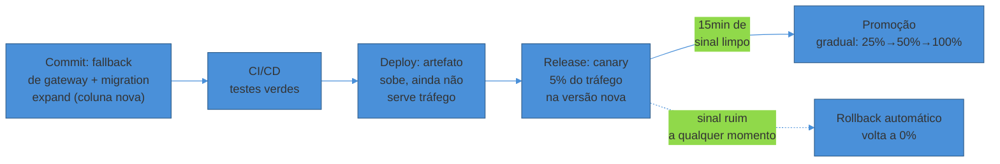
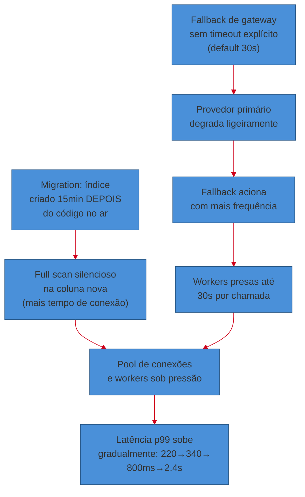
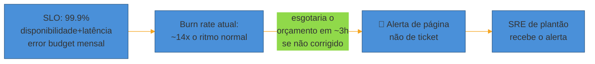
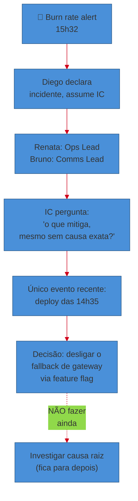
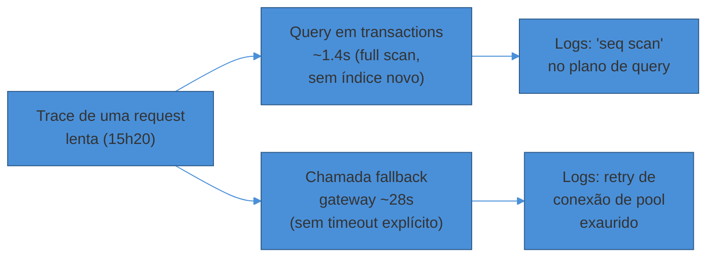
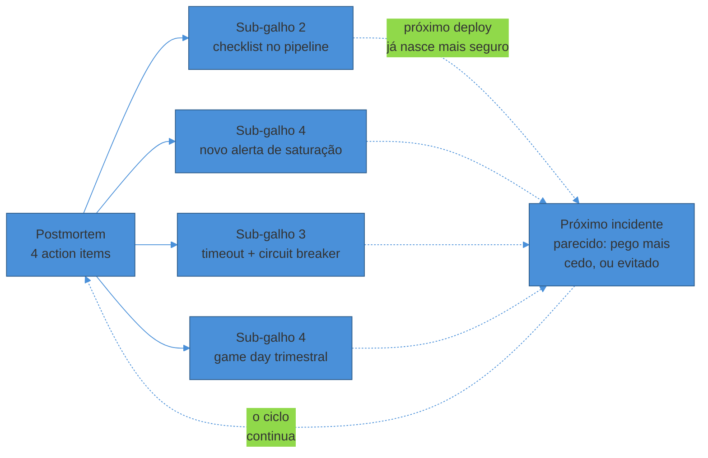

# Anatomia de um incidente de produção

> [!abstract] TL;DR
> Este é um cenário **ilustrativo e composto** — um checkout de e-commerce fictício, "Aurora" — construído para amarrar as 22 notas desta trilha num arco único, não um relato de um incidente real vivido pelo autor. Sexta à tarde, um deploy de rotina sobe via canary ([[2 - Entrega e release/index|Entrega e release]]): deploy não é release, e o canary existe para observar antes de comprometer 100% do tráfego ([[02 - Deployment strategies]]). Horas depois, uma migration expand/contract mal-sequenciada ([[04 - Migrations de banco em produção]]) combinada com um timeout ausente numa dependência ([[06 - Resiliência operacional]]) produz um sintoma silencioso: latência subindo, sem nenhum erro explícito ainda. Um alerta de **burn rate** — não de CPU, um sintoma real de usuário — dispara ([[03 - Alerting que não gera fadiga]], [[02 - SLI, SLO e error budgets]]). O time declara incidente, um Incident Commander assume, e a primeira decisão certa é **mitigar antes de entender a causa** ([[04 - Incident response e on-call]]): rollback via feature flag, não investigação. Só depois, com o sintoma contido, a investigação usa traces e logs correlacionados para achar a causa real ([[01 - Observabilidade como prática]], [[06 - Debugging de produção e chaos engineering]]). O postmortem blameless que segue ([[05 - Postmortems e cultura blameless]]) não procura "quem" — procura os fatores contribuintes sistêmicos, e produz action items que voltam para o pipeline, o alerting e o próximo game day. O loop se fecha exatamente onde a trilha começou: confiabilidade como feature, não acidente ([[01 - O que é operar um sistema]], [[04 - Confiabilidade como feature]]).

> [!warning] Aviso de escopo — isto é ficção didática
> Tudo que segue — o serviço Aurora, os nomes de pessoas, os números de latência, os comandos exatos — é **inventado para fins pedagógicos**. Não é um incidente que o autor deste vault viveu, nem uma reconstrução de um caso real de nenhuma empresa específica. É uma dramatização deliberada, desenhada para que cada conceito das 22 notas anteriores apareça em ação, na ordem em que apareceria de verdade — o tipo de coisa que só faz sentido depois que você já leu o resto da trilha.

Sexta-feira, 14h. O serviço de checkout da Aurora — um e-commerce de porte médio, algumas centenas de pedidos por minuto no horário de pico — está saudável. O SLO de disponibilidade é 99,9% no trimestre corrente; o error budget ainda tem folga, cerca de 60% não consumido. O dashboard mostra p99 de latência em 220ms, taxa de erro em 0,02%, fila de processamento de pagamento estável. É o que a nota 01 desta trilha chamou de **steady state** — o sistema fazendo exatamente o que devia, sem ninguém precisando pensar nele.

É justamente esse estado — chato, previsível, sem incidente — que todo o aparato desta trilha existe para proteger. E é também o estado que está prestes a mudar, porque às 14h00 de uma sexta-feira comum, o time de pagamentos vai fazer um deploy de rotina.

## 1. O deploy: uma mudança pequena, uma estratégia grande

A mudança em si é modesta: o time de pagamentos ajustou a lógica de retry para o provedor de gateway de cartão, adicionando um circuito de fallback para um segundo provedor quando o primeiro está lento. Ao lado, uma migration de banco pequena adiciona uma coluna nova (`fallback_provider_used`) na tabela de transações, para rastrear qual gateway processou cada pagamento.

O pipeline de CI/CD roda os testes, passa, e o deploy sobe pela estratégia que este serviço usa para toda mudança em produção: **canary**. Cinco por cento do tráfego vai para a versão nova; noventa e cinco por cento continua na versão anterior. Esse não é um detalhe operacional menor — é a decisão central que separa "código correto no CI" de "código seguro em produção", o assunto inteiro do [[2 - Entrega e release/index|sub-galho 2]] desta trilha.

> [!question]- Por que não simplesmente fazer deploy de tudo de uma vez? O CI já passou verde.
> Porque o CI valida contra um mundo simulado — a nota 01 do galho-pai já cobriu essa distância. Um canary de 5% permite observar o comportamento real, sob carga real, contra o gateway de cartão real, antes de comprometer 100% do tráfego. Se algo estiver errado, o *blast radius* — a fração de usuários afetados — fica contido em 5%, não 100%. É exatamente o trade-off que [[02 - Deployment strategies]] formaliza: canary custa mais tempo de observação do que um deploy direto, mas reduz drasticamente o custo esperado de um erro, porque o erro, se existir, machuca só uma fração do tráfego.

O pipeline também aplica a disciplina que [[04 - Migrations de banco em produção]] ensina para esse tipo de mudança: a coluna nova é adicionada de forma **expand** — aditiva, com valor default, sem quebrar a versão anterior do código, que simplesmente ignora a coluna que não conhece. Nenhuma coluna é removida, nenhum contrato antigo é quebrado. Essa disciplina — expandir antes de contrair — é o que permite rodar duas versões do código (canary e estável) lado a lado contra o mesmo schema de banco sem que uma delas quebre.

Repare que **deploy e release já são coisas diferentes aqui** — o artefato subiu (deploy) antes de qualquer tráfego real chegar até ele (release), e o release em si é gradual, não um evento único. É a mesma distinção que a nota 03 do sub-galho 1 estabeleceu como o mapa de toda essa trilha.

Aos 14h15, os 5% de canary parecem saudáveis: latência igual, taxa de erro igual. O pipeline promove automaticamente para 25%. Nada no dashboard sugere problema. Às 14h35, promove para 100%. O deploy está completo, e nada indica, ainda, que alguma coisa está errada.

## 2. O sintoma: devagar, depois de repente

Às 15h10 — trinta e cinco minutos depois do deploy chegar a 100%, tempo suficiente para que ninguém mais esteja olhando o dashboard de canary com atenção — a latência p99 do checkout começa a subir. Não é um salto abrupto: 220ms vira 280ms, depois 340ms, ao longo de vinte minutos. Nenhum erro 5xx aparece ainda. É exatamente o tipo de degradação que **não dispara um alerta de limiar fixo** ("CPU > 80%"), porque nenhum recurso individual está saturado — a CPU está em 45%, a memória está normal, o banco não está sob carga incomum.

O que está acontecendo, e que ninguém percebe ainda, é a combinação de dois fatores que sozinhos seriam inofensivos:

**Primeiro fator — a migration não foi tão inofensiva quanto parecia.** A coluna nova `fallback_provider_used` foi adicionada de forma expand, correta — mas o índice que a acompanharia (necessário para uma query de relatório que consulta transações por status de fallback) só foi criado *depois* do deploy do código, numa migration separada que rodou às 14h50. Entre 14h35 (código no ar) e 14h50 (índice criado), toda leitura que tocava essa coluna nova fazia um full scan silencioso numa tabela de milhões de linhas — devagar, mas não o suficiente para estourar timeout, só o suficiente para consumir mais tempo de conexão de banco do que o normal. É precisamente o tipo de armadilha que [[04 - Migrations de banco em produção]] descreve: uma migration tecnicamente correta na ordem errada.

**Segundo fator — e este é o que transforma um sintoma pequeno numa cascata.** O novo circuito de fallback de gateway, adicionado neste mesmo deploy, faz uma chamada HTTP ao segundo provedor de cartão quando o primeiro demora — mas o desenvolvedor que escreveu o circuito de fallback não configurou um timeout explícito na chamada; a biblioteca HTTP usada tem um timeout default de 30 segundos, dez vezes maior que qualquer chamada normal a esse gateway deveria levar. Quando o provedor primário começa a responder um pouco mais devagar — algo que já acontecia esporadicamente antes do deploy, sem consequência — o circuito de fallback passa a acionar com mais frequência, e cada chamada de fallback ocupa uma worker thread por até 30 segundos em vez dos ~200ms esperados.

Nenhum dos dois fatores sozinho derrubaria o serviço. Juntos, formam exatamente o padrão que [[06 - Resiliência operacional]] descreve como cascata silenciosa: uma dependência lenta, sem timeout, consome recursos finitos (worker threads, conexões de pool) até que esses recursos ficam escassos para *todo* o tráfego — não só para as chamadas de fallback. Às 15h30, a latência p99 está em 2,4 segundos. Ainda não há erros — só lentidão — mas o error budget, medido corretamente como disponibilidade *e* latência dentro do SLO, já começa a queimar rápido: requests que estouram o limite de latência definido no SLO contam como violação, mesmo sem um único 5xx.

> [!warning] Por que ninguém notou entre 14h35 e 15h30
> **O que acontece:** cinquenta e cinco minutos se passam entre o deploy chegar a 100% e o primeiro alerta disparar, mesmo com a latência já claramente fora do normal aos 15h10. **Por quê:** o dashboard de canary — a ferramenta que o time estava olhando às 14h15 — só monitora a *comparação* entre canary e estável durante a janela de promoção; depois que o deploy chega a 100%, ninguém está mais olhando ativamente aquele painel específico. E os alertas de limiar fixo (CPU, memória) simplesmente não capturam esse tipo de degradação, porque nenhum recurso individual estourou um limite — a degradação está distribuída entre latência de fallback e tempo de query, nenhuma delas isoladamente dramática. **Como evitar:** é exatamente o argumento central de [[03 - Alerting que não gera fadiga]] — alertar em **sintoma**, não em causa hipotética. Um alerta de burn rate de SLO, que mede o sintoma real (requests fora do orçamento de latência/erro), captura esse tipo de degradação composta que nenhum alerta de recurso individual pegaria, porque não importa *por que* a latência subiu — importa que ela subiu o suficiente para ameaçar o orçamento.

## 3. O alerta: o pager toca por um número, não por uma teoria

Às 15h32, o alerta dispara — e o que dispara é revelador do desenho certo de alerting que [[02 - SLI, SLO e error budgets]] e [[03 - Alerting que não gera fadiga]] constroem: não é "CPU alta" nem "latência acima de X ms" isolado. É um alerta de **burn rate rápido**: o error budget mensal do checkout está sendo consumido a uma taxa que, mantida, o esgotaria em poucas horas — muito mais rápido do que o ritmo "normal" de consumo que levaria o mês inteiro para gastar o orçamento inteiro.

A prática recomendada pelo Google SRE Workbook para esse tipo de alerta usa múltiplas janelas e múltiplos limiares — algo como sinalizar page quando o consumo atinge cerca de 2% do orçamento numa janela de uma hora, ou 5% numa janela de seis horas, com um limiar mais frouxo (~10% em três dias) reservado para um ticket, não para acordar alguém — precisamente para diferenciar um pico curto e sério de uma degradação lenta que ainda dá tempo de investigar sem pressa (Google SRE Workbook, *Alerting on SLOs*, 2018).

O SRE de plantão, Diego, recebe a página. O alerta diz o sintoma (burn rate 14x acima do normal no checkout), não a causa — porque, como as notas anteriores já estabeleceram, um bom alerta *não tenta adivinhar* a causa raiz; ele só confirma que algo real está impactando usuários o suficiente para justificar interromper alguém.

> [!question]- Por que o alerta não dispara em CPU/memória, que também mudaram um pouco?
> Porque CPU e memória são **causas hipotéticas**, não sintomas de usuário — o que [[03 - Alerting que não gera fadiga]] chama de alertar em RED (Rate, Errors, Duration) em vez de USE (Utilization, Saturation, Errors) sozinho. Um pico de CPU pode ou não afetar o usuário; burn rate de SLO, por definição, *já é* o impacto medido diretamente na experiência do usuário. Alertar em CPU geraria fadiga (a CPU oscila o tempo todo, sem consequência real na maioria das vezes); alertar em burn rate garante que, quando o pager toca, há um problema real acontecendo com clientes de verdade.

## 4. A resposta: coordenar antes de investigar

Diego abre a call de incidente — criada automaticamente pela ferramenta a partir do alerta — e, seguindo o processo de [[04 - Incident response e on-call]], a primeira ação não é abrir os logs. É **declarar o incidente e assumir o papel de Incident Commander** até que outra pessoa assuma explicitamente.

Em três minutos, mais duas pessoas entram na call: Renata, que passa a atuar como Ops Lead (quem efetivamente vai mexer no sistema), e Bruno, do time de suporte, que assume Comms Lead e já publica a primeira atualização na status page — "investigando lentidão no checkout" — mesmo sem saber ainda o que está acontecendo. Silêncio geraria mais ansiedade nos clientes do que uma atualização honesta de "ainda não sabemos, mas estamos nisso".

Diego, como IC, faz a pergunta que estrutura tudo que vem depois: **"o que sabemos que provavelmente mitiga isso, mesmo sem saber a causa exata?"** — não "qual é a causa raiz?". A resposta óbvia, olhando a timeline: o único evento recente e relevante é o deploy que subiu às 14h35, cerca de uma hora antes do sintoma começar a aparecer de forma visível.

A mitigação escolhida não é um rollback completo do deploy — porque a coluna nova de banco já está sendo escrita por transações reais, e reverter o código sem cuidado poderia deixar o schema em um estado inconsistente com o código antigo. Em vez disso, Renata usa o kill switch que o próprio deploy trouxe: a feature flag que controla o circuito de fallback de gateway. Ela desliga a flag — o fallback para de ser chamado, as workers param de ficar presas em chamadas de 30 segundos, sem precisar reverter nenhum código nem tocar na migration. É o mecanismo de **progressive delivery** que [[03 - Progressive delivery e rollback]] descreve: um kill switch mais rápido e mais cirúrgico do que um rollback completo, porque desliga só a parte suspeita, não o deploy inteiro.

Às 15h41, com a flag desligada, a latência p99 começa a cair. Às 15h46, está de volta a 260ms — ainda um pouco acima do baseline de 220ms (o full scan da migration continua acontecendo até o índice completar), mas dentro de faixa aceitável, sem risco imediato ao SLO.

> [!warning] O instinto que Renata teve que segurar
> **O que acontece:** o primeiro impulso de Renata, ao ver a latência subindo e reconhecer que fica pior perto do gateway de pagamento, foi abrir os logs do provedor de cartão para entender por que ele estava mais lento — investigar a causa raiz do lado deles. **Por quê:** investigar parece produtivo — é trabalho técnico real acontecendo — mas não move a agulha do que importa durante o incidente ativo: parar o impacto ao usuário. Enquanto ela investigasse o provedor, a latência continuaria subindo e o error budget continuaria queimando. **Como evitar:** Diego, como IC, redirecionou explicitamente: "guarda essa teoria para depois — agora, o que a gente desliga que provavelmente resolve o sintoma?" É a mesma disciplina que [[04 - Incident response e on-call]] chama de mitigação genérica antes de causa raiz — e é o que transformou um incidente de quase uma hora de degradação crescente em uma mitigação de cinco minutos, uma vez que o processo certo entrou em ação.

## 5. A investigação: agora, com calma, a causa de verdade

Com o sintoma contido, a call não se encerra — ela muda de tom. Agora sim é hora de investigar a causa raiz, sem a pressão de usuários sendo impactados a cada minuto que passa.

A ferramenta de observabilidade do time segue os três pilares que [[01 - Observabilidade como prática]] descreve — métricas, logs e traces, correlacionados por um `trace_id` comum. Renata puxa um trace de uma request lenta capturada durante a janela do incidente (15h20, antes da mitigação) e a visualização mostra exatamente onde o tempo foi gasto: 60% numa query que toca a tabela de transações (a query sem índice), e 35% numa chamada de fallback de gateway que levou 28 segundos antes de finalmente ter timeout — quase os 30 segundos default da biblioteca.

Cruzando o trace com os logs estruturados, a equipe encontra os dois fatores contribuintes na sequência exata em que aconteceram: a migration de índice que rodou 15 minutos depois do código (visível no log do pipeline de migrations), e a ausência de timeout explícito no client HTTP do fallback (visível direto no código, uma vez que alguém sabia o que procurar). Nenhum dos dois, sozinho, geraria um incidente visível — juntos, formaram exatamente o tipo de cascata silenciosa que [[06 - Debugging de produção e chaos engineering]] descreve como o arquétipo mais comum de troubleshoot em produção: não um componente quebrado, mas dois componentes saudáveis interagindo de um jeito que ninguém antecipou.

> [!question]- Por que o time não achou isso durante a revisão de código, antes do deploy?
> Porque revisão de código, por melhor que seja, avalia cada mudança isoladamente contra a lógica que ela implementa — e tanto a migration quanto a ausência de timeout pareciam corretas *isoladamente*. A migration adicionava uma coluna com valor default, sem quebrar nada; a chamada de fallback tinha um timeout (o default da biblioteca, 30 segundos), só que um timeout alto demais para o caso de uso. É exatamente o tipo de interação que só aparece sob carga real, com timing real entre dois deploys separados (código e índice) — o gap entre "passa no CI" e "sobrevive em produção" que a primeira nota desta trilha inteira nomeou.

Às 16h20, com a causa identificada, o índice de banco já completou (ele estava rodando em segundo plano desde 14h50 e terminou por volta das 15h50, mas ninguém tinha conectado os pontos até agora), e o time decide manter a flag do fallback desligada até adicionar um timeout explícito e razoável (2 segundos, não 30) ao client HTTP — um fix pequeno, testável, sem pressa, porque o sintoma já está contido.

## 6. O postmortem: fatores contribuintes, não um culpado

Na segunda-feira seguinte, o time se reúne para o postmortem — seguindo a disciplina blameless que [[05 - Postmortems e cultura blameless]] descreve. Ninguém pergunta "quem esqueceu o timeout" ou "quem sequenciou a migration errada". A pergunta que estrutura o documento inteiro é outra: **que condições do sistema permitiram que duas mudanças individualmente razoáveis produzissem, juntas, quase uma hora de degradação?**

**Resumo e impacto.** Latência do checkout acima do SLO por 59 minutos (15h32 detectado até 15h41 mitigado é o MTTM; degradação real começou por volta das 15h10). Nenhuma transação de pagamento foi perdida — o impacto foi em experiência (checkout mais lento), não em disponibilidade. Consumo de error budget mensal: cerca de 8%.

**Timeline factual** (sem interpretação, só fatos e horários): 14h35 deploy chega a 100%; 14h50 migration de índice roda (separada do deploy de código); 15h10 latência começa a subir de forma visível; 15h32 alerta de burn rate dispara; 15h33 Diego declara incidente; 15h41 flag do fallback desligada, mitigação em curso; 15h46 latência normalizada; 16h20 causa raiz identificada via trace correlacionado.

**Fatores contribuintes** — nomeados no plural, cada um necessário mas insuficiente sozinho:
1. A migration do índice foi sequenciada *depois* do deploy do código que já usava a coluna nova, em vez de antes — o padrão correto de expand seria criar o índice primeiro, garantir que ele completasse, e só então subir o código que depende dele.
2. O client HTTP do fallback de gateway usava o timeout default da biblioteca (30s) em vez de um timeout explícito calibrado para o caso de uso (~2s), o que não foi pego em revisão de código porque tecnicamente "tinha" um timeout.
3. Não havia um alerta específico de saturação de pool de conexões/workers, o que teria sinalizado o problema por um ângulo diferente, possivelmente minutos antes do burn rate de SLO acusar o sintoma completo.
4. O runbook de deploy não incluía um passo de checklist para "migrations de índice devem completar e ser verificadas antes do deploy de código dependente", o que teria pego o fator 1 antes de virar produção.

**Action items**, cada um com dono e prazo — não "ter mais cuidado":
- Adicionar timeout explícito (2s) e circuit breaker ao client HTTP de fallback de gateway — dono: time de Pagamentos, prazo: uma semana.
- Adicionar ao checklist de release o passo "migrations de índice completam e são verificadas antes do deploy do código dependente" — dono: Plataforma, prazo: duas semanas.
- Adicionar alerta de saturação de pool de conexões/workers como sinal complementar ao burn rate de SLO — dono: SRE, prazo: um sprint.
- Rodar um game day trimestral que injeta latência artificial numa dependência externa do checkout, para validar que o timeout e o circuit breaker realmente seguram a cascata da próxima vez — dono: SRE, prazo: próximo trimestre.

**Lições aprendidas.** O burn rate de SLO funcionou exatamente como desenhado — detectou um sintoma composto que nenhum alerta de recurso individual pegaria. A decisão de mitigar via feature flag em vez de rollback completo evitou o risco de inconsistência de schema, e reduziu o MTTM para cerca de nove minutos depois da declaração do incidente.

> [!warning] A tentação de parar em "faltou timeout"
> **O que acontece:** é fácil o postmortem convergir rápido para uma única frase — "a causa raiz foi a ausência de timeout" — e encerrar ali, satisfeito com uma explicação simples. **Por quê:** como a nota de postmortems desta trilha argumenta, "faltou X" não é uma causa raiz — é o ponto onde a investigação deveria *começar*. Sistemas complexos falham por múltiplos fatores interagindo, e nomear só um (o timeout) deixa três outros fatores contribuintes — o sequenciamento da migration, a ausência de alerta de saturação, o runbook incompleto — sem correção nenhuma, prontos para produzir o próximo incidente parecido de um jeito ligeiramente diferente. **Como evitar:** a disciplina de listar fatores contribuintes no plural, cada um com seu próprio action item, é exatamente o que evita esse atalho — e é o que separa um postmortem que realmente reduz recorrência de um que só documenta o óbvio.

## 7. O loop se fecha: de volta ao pipeline, ao alerting, à cultura

Nenhum dos quatro action items do postmortem de Aurora fica só no papel — cada um volta, especificamente, para uma das práticas que os sub-galhos desta trilha construíram, fechando exatamente o loop de aprendizado que a Terceira Via do DevOps (a de [[01 - O que é operar um sistema]]) descreve como o motor da melhoria contínua:

- O **checklist de release** atualizado é um gate novo no pipeline de CI/CD — o mesmo tipo de decisão de design que [[2 - Entrega e release/index|o sub-galho 2]] trata como central: o que automatizar, o que barrar, antes que um deploy chegue a produção.
- O **alerta de saturação de pool** novo é mais um sinal no arsenal de [[03 - Alerting que não gera fadiga]] — não substitui o burn rate de SLO, complementa: um alerta em causa provável, ao lado do alerta em sintoma real, dando ao time de plantão um sinal mais cedo na cadeia da próxima vez.
- O **timeout e circuit breaker** corrigidos são, literalmente, [[06 - Resiliência operacional]] aplicada: a diferença entre uma dependência lenta ser um incômodo contido e ser uma cascata que consome todo o pool de workers.
- O **game day trimestral** é chaos engineering deliberado — o mesmo princípio que fecha o sub-galho 4 ([[06 - Debugging de produção e chaos engineering]]): injetar a falha de propósito, num horário controlado, para descobrir que o timeout de 2 segundos realmente segura a cascata, em vez de descobrir isso de novo às 15h32 de uma sexta-feira real.

Esse é o ponto que a nota 01 desta trilha chamou de **confiabilidade como orçamento, não como estado** ([[04 - Confiabilidade como feature]]): o incidente de Aurora consumiu 8% do error budget do mês — um custo real, já pago, irrecuperável. O único retorno possível sobre esse custo é o aprendizado que ele produziu, e esse aprendizado só vira retorno de verdade quando volta, concretamente, para o sistema — não quando fica arquivado num documento que ninguém revisita.

## Anatomia do relógio: onde o tempo foi gasto

A métrica DORA de MTTR, introduzida na primeira nota desta trilha, ganha textura quando decomposta nas quatro fases que [[04 - Incident response e on-call]] descreve — e o incidente de Aurora ilustra por que a decomposição importa mais do que o número único:

```mermaid
%%{init: {"theme": "base", "themeVariables": {"primaryColor": "#4A90D9", "primaryBorderColor": "#2E5C8A", "lineColor": "#4A90D9"}}}%%
gantt
    dateFormat  HH:mm
    axisFormat  %H:%M
    section Timeline do incidente
    Deploy sobe (100%)              :done, deploy, 14:35, 14:35
    Migration de índice roda        :done, mig, 14:50, 14:50
    Sintoma começa (latência sobe)  :crit, symptom, 15:10, 15:32
    MTTD - até o alerta disparar    :active, mttd, 15:10, 15:32
    MTTA - até IC assumir           :active, mtta, 15:32, 15:33
    MTTM - até flag desligada       :crit, mttm, 15:33, 15:41
    Verificação pós-mitigação       :done, verify, 15:41, 15:46
    Investigação de causa raiz      :done, rca, 15:46, 16:20
```

| Fase | Janela | Duração | O que revela |
|---|---|---|---|
| **MTTD** (detectar) | 15h10 → 15h32 | ~22min | O sintoma existia antes do alerta — um alerta de saturação de pool complementar (action item do postmortem) teria cortado isso |
| **MTTA** (reconhecer) | 15h32 → 15h33 | ~1min | Rápido, porque o on-call estava disponível e o processo de declarar incidente é simples |
| **MTTM** (mitigar) | 15h33 → 15h41 | ~8min | O tempo mais controlável do processo — feature flag como kill switch, decisão de mitigar antes de investigar |
| **MTTR total** (até verificação) | 15h10 → 15h46 | ~36min | A soma; decompor mostra que o maior gargalo foi detecção, não resposta |

O padrão que a tabela revela é o que [[04 - Incident response e on-call]] chama de decompor o relógio: o time de Aurora tinha um MTTA e um MTTM já bons — a resposta, uma vez acionada, foi rápida e disciplinada. O gargalo real estava em MTTD, upstream de qualquer coisa que o processo de incident response por si só resolveria. É exatamente por isso que o action item mais barato e mais eficaz do postmortem — o alerta de saturação de pool — ataca a fase que o resto do processo não alcançava.

## Em entrevista

Poucas perguntas separam tão bem sênior de pleno em entrevista quanto "conte sobre um incidente que você respondeu" — e o arco de Aurora é, deliberadamente, o roteiro de uma resposta forte a essa pergunta.

O que um entrevistador sênior/staff está de fato avaliando:

- Se sua narrativa distingue **mitigação de investigação**, na ordem certa — a resposta fraca começa contando como você descobriu a causa; a resposta forte começa contando o que você fez para parar o impacto, e só depois entra na causa.
- Se você reconhece **múltiplos fatores contribuintes**, não uma causa única — "faltou um timeout" é uma resposta incompleta; "o timeout ausente combinado com o sequenciamento da migration é que produziram o sintoma" mostra profundidade sistêmica.
- Se o final da sua história é **o que mudou no sistema**, não "aprendi a prestar mais atenção" — um action item concreto (o checklist, o alerta novo, o timeout corrigido) é o sinal mais forte de que você já viveu um postmortem funcional de verdade, não só um incidente.
- Se você consegue amarrar o incidente a um **conceito de SLO/error budget** — dizer "consumimos 8% do orçamento" é mais preciso e mais convincente do que "foi um incidente sério".

A resposta que integra os quatro pontos acima, num arco coerente e verificável, é exatamente o que separa quem estudou operação de quem operou de verdade.

## How to explain in English

> "Let me walk you through an incident I was involved in. We had a routine deploy go out via canary — a fallback circuit for a payment gateway, plus a small additive database migration. The canary looked healthy and got promoted to 100% traffic. About 35 minutes later, latency started climbing gradually — no hard errors yet, just degradation, because two individually reasonable changes interacted badly: an index migration that completed after the code that depended on it, and a fallback HTTP call without an explicit timeout, defaulting to 30 seconds. When the primary payment provider got slightly slower, the fallback started firing more often, and each slow fallback call held a worker thread for up to 30 seconds — exhausting the connection pool.
>
> A burn-rate alert on our SLO paged me — not a CPU alert, an actual symptom-based alert — about 22 minutes after the degradation started. I declared the incident and took the Incident Commander role. The first decision wasn't 'what's the root cause' — it was 'what can we turn off that probably fixes this.' We used the feature flag on the fallback circuit as a kill switch instead of a full rollback, since the migration had already written to the new column. Mitigation took about eight minutes.
>
> Once the symptom was contained, we investigated with distributed tracing and found both contributing factors — the migration ordering and the missing timeout — through a correlated trace. The postmortem was blameless: we didn't ask who forgot the timeout, we asked what allowed two reasonable changes to interact this way. We shipped four concrete action items with owners and deadlines: an explicit timeout and circuit breaker, a release checklist gate for migration sequencing, a new pool-saturation alert, and a quarterly game day to validate the fix under injected chaos. That loop — from incident to postmortem to pipeline improvement — is what reliability as a feature actually looks like in practice."

| PT | EN |
|----|----|
| Estado estável | Steady state |
| Orçamento de erro consumido | Error budget burned/consumed |
| Taxa de consumo (do orçamento) | Burn rate |
| Interruptor de emergência | Kill switch |
| Raio de impacto | Blast radius |
| Cascata silenciosa | Silent cascade |
| Fatores contribuintes | Contributing factors |
| Item de ação | Action item |
| Dia de jogo (chaos engineering) | Game day |
| Decompor o relógio do incidente | Breaking down the incident clock |
| Fechar o loop de aprendizado | Closing the learning loop |

## O que vem a seguir

Esta é a última nota da trilha Operação — o ponto onde as 22 notas anteriores deixam de ser conceitos separados e viram um arco único. Não há mais conceito novo para ler; há prática para fazer. Duas ações concretas valem mais do que reler qualquer coisa daqui:

- **Rode um game day** — pegue um serviço real que você opera (ou um projeto pessoal), injete uma falha controlada (latência artificial numa dependência, um pod derrubado de propósito) e observe o que realmente acontece, comparado ao que você *acha* que aconteceria.
- **Escreva um postmortem de um incidente real** que você já viveu, seguindo a estrutura de [[05 - Postmortems e cultura blameless]] — fatores contribuintes no plural, action items com dono e prazo. Mesmo um incidente pequeno, documentado direito, treina o músculo que a entrevista sênior testa.

- [[Operação/index|Operação]] — volte ao mapa completo da trilha, revise qualquer sub-galho que ainda pareça frágil

## Veja também

- [[Operação/index|Operação]] — o galho-pai e o mapa completo da trilha
- [[1 - O ofício de operar/index|O ofício de operar]] — o enquadramento cultural (DevOps, SRE, DORA) que esta nota aplica
- [[2 - Entrega e release/index|Entrega e release]] — deploy strategies, migrations, progressive delivery
- [[3 - Rodar em produção/index|Rodar em produção]] — resiliência operacional, timeouts, circuit breakers
- [[4 - Observar e responder/index|Observar e responder]] — SLO, alerting, incident response, postmortems, chaos engineering
- [[System Design/index|System Design]] — o par que ensina a desenhar o sistema; esta trilha ensina a mantê-lo vivo depois de desenhado

## Fontes

- **Google** — [*Site Reliability Engineering* — Managing Incidents](https://sre.google/sre-book/managing-incidents/) (sre.google/books, 2016) — o modelo de papéis (IC, Ops, Comms) e a prioridade de mitigar antes de investigar, aplicados ao arco de Aurora.
- **Google SRE Workbook** — [*Alerting on SLOs*](https://sre.google/workbook/alerting-on-slos/) (sre.google/workbook, 2018) — a lógica de burn rate multi-janela (fast burn ~2%/1h, slow burn ~5%/6h) usada como base para o alerta que dispara nesta nota.
- **Google** — [*Site Reliability Engineering* — Postmortem Culture: Learning from Failure](https://sre.google/sre-book/postmortem-culture/) (sre.google/books, 2016) — a estrutura de postmortem blameless (fatores contribuintes, action items com dono e prazo) aplicada ao postmortem fictício de Aurora.
- **GitLab** — [*Postmortem of database outage of January 31*](https://about.gitlab.com/blog/postmortem-of-database-outage-of-january-31/) (about.gitlab.com, 2017) — exemplo real de postmortem público, usado como referência de estrutura e honestidade de relato (não é o incidente desta nota, que é fictício).
- **Cloudflare** — [*Cloudflare outage on November 18, 2025*](https://blog.cloudflare.com/18-november-2025-outage/) (blog.cloudflare.com, novembro de 2025) — segundo exemplo real de postmortem público de grande escala, ilustrando a prática de publicar detalhes técnicos completos mesmo sob desconforto.
- **dan luu** — [*post-mortems*: coleção de postmortems públicos](https://github.com/danluu/post-mortems) (GitHub) — repositório curado de relatos reais, referência para quem quiser ler postmortems de verdade além do exemplo ilustrativo desta nota.
- **PagerDuty** — [*Incident Commander*](https://response.pagerduty.com/training/incident_commander/) (response.pagerduty.com) — as responsabilidades do IC aplicadas ao papel de Diego nesta nota.
