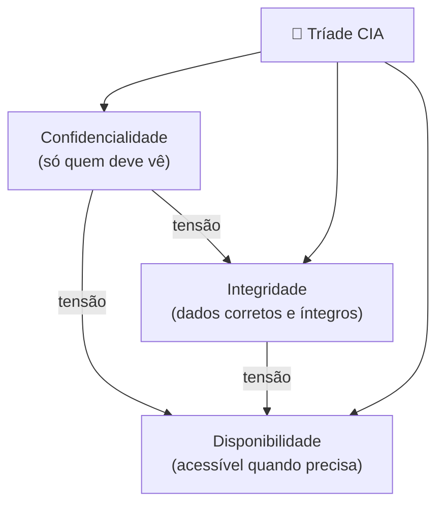
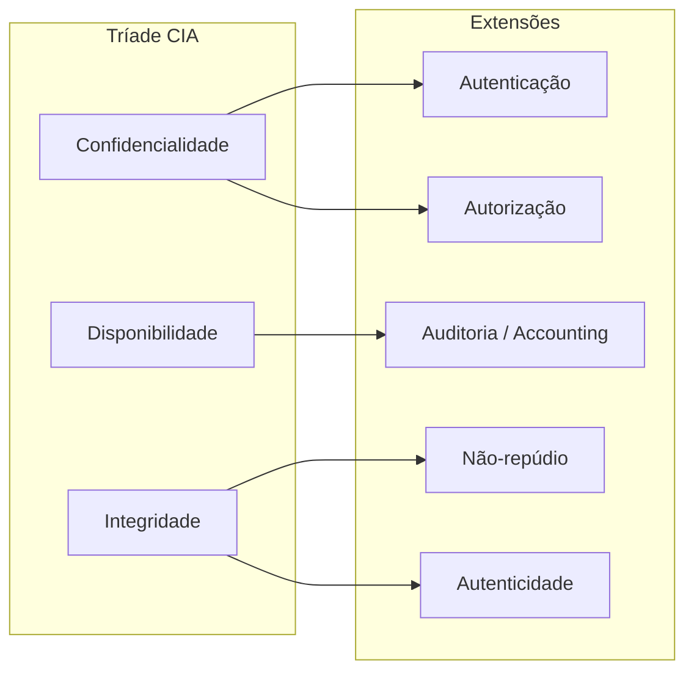
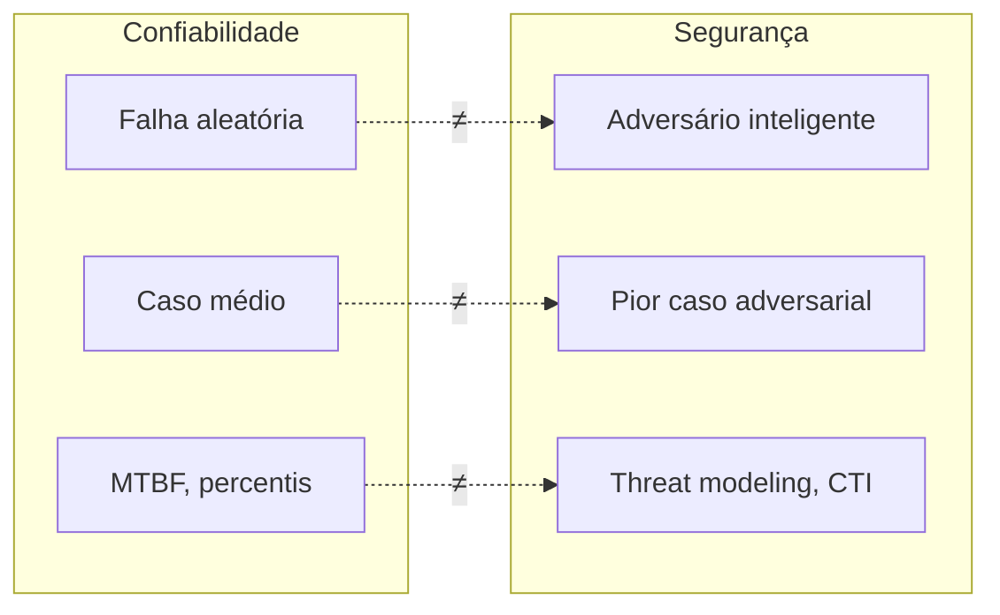
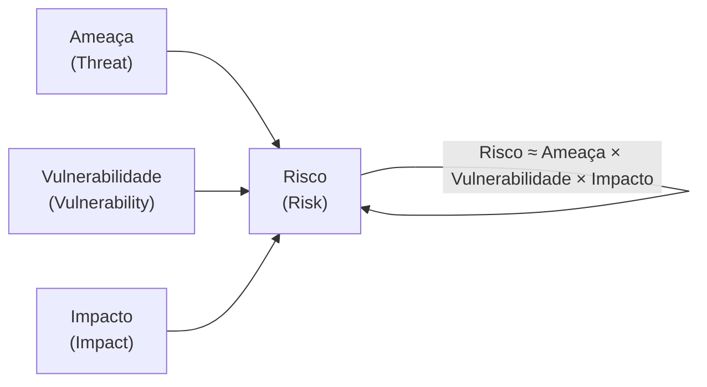
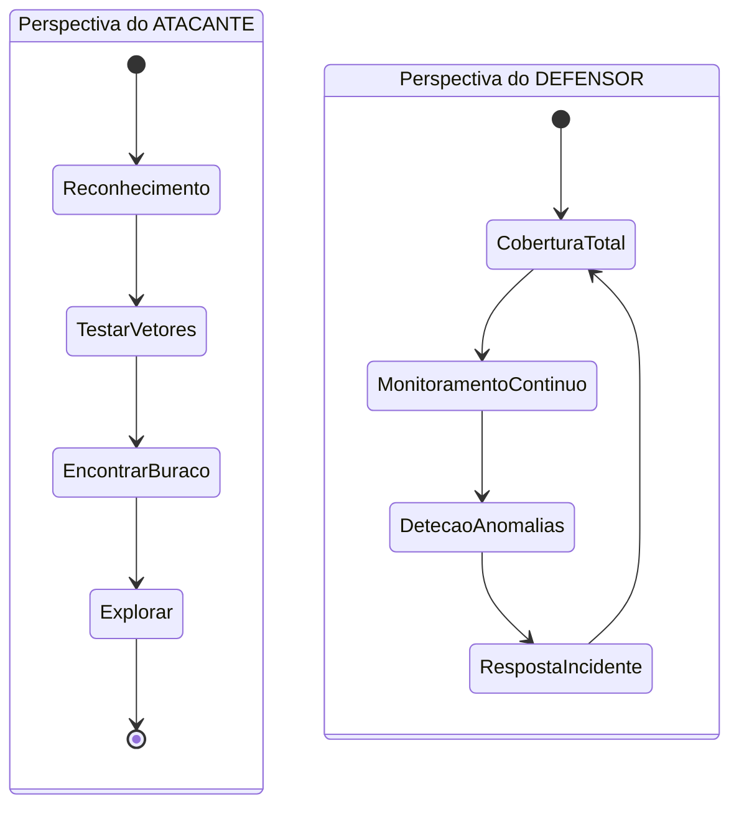
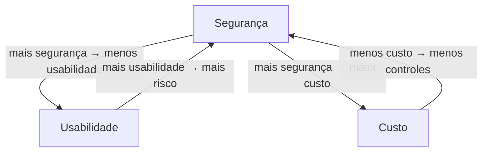

# O que é segurança conceitual

> [!abstract] TL;DR
> Segurança não é uma feature que você adiciona no final — é uma propriedade emergente de sistemas projetados para resistir a adversários inteligentes. A tríade CIA (Confidencialidade, Integridade, Disponibilidade) é o vocabulário mínimo; o vocabulário completo inclui AAA, não-repúdio e autenticidade. O ponto central: existe um atacante racional otimizando contra você, e a assimetria é brutal — o defensor precisa cobrir tudo, o atacante precisa de um buraco.

---

## A Tríade CIA — o vocabulário mínimo

Pense na tríade CIA como os três lados de um triângulo. Quebre qualquer um e o triângulo colapsa. Mas — e aqui está a armadilha — os três lados puxam em direções diferentes.

> [!info] Leitura do diagrama
> Cada vértice representa um pilar da tríade. As arestas rotuladas "tensão" mostram que maximizar um pilar frequentemente pressiona os outros: criptografia forte protege a confidencialidade mas pode aumentar latência (disponibilidade); validação estrita preserva integridade mas pode bloquear usuários legítimos.

### Confidencialidade

**Definição (NIST SP 800-12 Rev. 1):** "Preserving authorized restrictions on information access and disclosure, including means for protecting personal privacy and proprietary information."

Em linguagem direta: apenas quem tem permissão vê o dado.

**Violação canônica:** um servidor S3 mal configurado com permissão pública expõe 143 milhões de registros de clientes — o breach Equifax de 2017. Nenhum atacante "invadiu" no sentido hollywoodiano; o dado estava simplesmente disponível para quem soubesse a URL.

**Mecanismos:** criptografia em repouso (AES-256), em trânsito (TLS 1.3), controle de acesso (RBAC, ABAC), classificação de dados.

> [!warning] Confidencialidade ≠ privacidade
> Privacidade é um direito social e legal. Confidencialidade é uma propriedade técnica. Um sistema pode garantir confidencialidade técnica (dado cifrado) mas violar privacidade (coleta dados sem consentimento). Confundir os dois é erro de entrevista.

---

### Integridade

**Definição:** dados e sistemas só são modificados por quem tem autorização, e de maneira autorizada.

Existem dois aspectos:

| Aspecto | O que protege | Exemplo de controle |
|---|---|---|
| Integridade de dados | Alteração não autorizada do conteúdo | HMAC, assinaturas digitais, hashes |
| Integridade de sistema | Alteração não autorizada do comportamento | Secure Boot, rootkit detection, IMA |

**Violação canônica:** ransomware. O atacante não rouba os dados — ele os **encripta sem sua chave**, tornando-os inúteis. É uma violação de integridade (e de disponibilidade). Outro exemplo clássico: SQL Injection que altera saldos em um banco de dados financeiro.

**Por que integridade importa mais do que você pensa:** um banco de dados confidencial mas corrompido é inútil ou perigoso. Imagine um prontuário médico onde a dose de medicamento foi alterada de 10mg para 100mg — o dado estava "confidencial", mas sua integridade foi violada.

---

### Disponibilidade

**Definição:** sistemas e dados devem estar acessíveis para usuários autorizados quando necessário.

**Violação canônica:** ataque DDoS (Distributed Denial of Service). Em 2016, o botnet Mirai derrubou os servidores DNS da Dyn e tirou do ar Twitter, Netflix e Reddit por horas. Nenhum dado foi roubado; nenhum dado foi alterado. A disponibilidade foi destruída.

**Métricas de disponibilidade:**

| SLA | Downtime anual permitido |
|---|---|
| 99% ("dois noves") | ~87,6 horas |
| 99,9% ("três noves") | ~8,76 horas |
| 99,99% ("quatro noves") | ~52,6 minutos |
| 99,999% ("cinco noves") | ~5,26 minutos |

---

### A tensão entre os três pilares

Aqui está onde fica interessante para entrevistas: **CIA é um sistema de trade-offs, não de maximização simultânea.**

- Você quer **alta disponibilidade** → você replica dados em múltiplos datacenters → **mais superfície de ataque** para confidencialidade.
- Você quer **integridade rígida** → você exige validação multi-step antes de qualquer escrita → **latência** prejudica disponibilidade.
- Você quer **confidencialidade máxima** → você cifra tudo com chaves de 4096 bits e requer autenticação MFA a cada acesso → **usabilidade** e disponibilidade sofrem.

Um sistema de controle de tráfego aéreo prioriza **disponibilidade e integridade** sobre confidencialidade (não importa tanto se todos sabem onde está o avião; importa muito que o dado esteja correto e disponível). Um sistema de registros médicos prioriza **confidencialidade e integridade**. Não existe configuração universal — existe contexto.

---

## Além da CIA — o vocabulário completo

CIA é necessária mas não suficiente. Pense assim: você pode ter um sistema CIA-perfeito onde ninguém repudia suas ações, onde identidades são falsas e onde ninguém presta contas. Esse sistema ainda seria inseguro.

> [!info] Leitura do diagrama
> CIA está à esquerda; as extensões à direita emergem naturalmente de cada pilar. Autenticação e Autorização reforçam Confidencialidade. Não-repúdio e Autenticidade reforçam Integridade. Auditoria sustenta Disponibilidade ao detectar abusos antes que eles derrubem o sistema.

### AAA — Autenticação, Autorização, Auditoria

**Autenticação (AuthN):** "Quem é você?" — verificar identidade. Fatores: algo que você sabe (senha), algo que você tem (token), algo que você é (biometria). MFA combina dois ou mais.

**Autorização (AuthZ):** "O que você pode fazer?" — verificar permissão. OAuth 2.0 delega autorização sem expor credenciais. RBAC (Role-Based) é o padrão corporativo; ABAC (Attribute-Based) é mais granular.

> [!danger] Confundir AuthN e AuthZ é erro clássico
> Autenticação confirma identidade. Autorização concede acesso. Você pode estar autenticado (o sistema sabe quem você é) e ainda ser negado (não tem permissão). Em entrevista, essa distinção é testada diretamente.

**Auditoria / Accounting:** "O que você fez?" — registro imutável de ações. Logs de auditoria são a base de compliance (SOX, HIPAA, LGPD) e de resposta a incidentes. Um log que pode ser apagado pelo atacante não é auditoria — é ficção.

> [!tip] Imutabilidade de logs
> Logs em sistemas críticos devem ser enviados para um sistema separado, fora do controle do sistema comprometido — log shipping para SIEM externo. Um atacante que compromete o servidor e apaga os logs elimina as evidências. Write-once storage (S3 Object Lock, Worm storage) ou log streaming em tempo real para um destino independente resolvem isso.

### Não-repúdio

A propriedade de que uma entidade não pode negar ter realizado uma ação. Assinaturas digitais (RSA, ECDSA) implementam não-repúdio: só você tem a chave privada, logo só você poderia ter assinado aquele documento. É a base legal de contratos eletrônicos e transações financeiras.

### Autenticidade

Garante que um dado ou mensagem é genuíno e vem de quem diz vir. HMAC (Hash-based Message Authentication Code) garante que a mensagem não foi alterada em trânsito **e** que veio de alguém com a chave secreta. Certificados X.509 garantem autenticidade de servidores TLS.

---

## O Modelo Adversarial — por que segurança é diferente de tudo

Esta é a virada conceitual mais importante da disciplina. Entender isso separa quem **usa** segurança de quem **pensa** em segurança.

> "Security is about preventing adverse consequences from the intentional and unwarranted actions of others." — Bruce Schneier, *Beyond Fear* (2003)

### Segurança ≠ Confiabilidade

Em **confiabilidade de sistemas** (reliability engineering), você se protege de falhas aleatórias: hardware que queima, cosmic rays que flipam bits, bugs que emergem em condições raras. O inimigo é a aleatoriedade e o acaso. Você projeta para o caso médio e para percentis de falha.

Em **segurança**, você se protege de um **adversário inteligente** que observa seu sistema, encontra seus pontos fracos, e os explora deliberadamente. O inimigo é racional, adaptativo e motivado. Você deve projetar para o **pior caso adversarial**, não para o caso médio.

> [!info] Leitura do diagrama
> Os dois blocos mostram os pares conceituais que distinguem confiabilidade de segurança. As arestas pontilhadas com "≠" enfatizam que as duas disciplinas têm premissas fundamentalmente diferentes sobre a natureza da ameaça.

### A consequência prática

Se você projeta segurança como se fosse confiabilidade, você testa o sistema com entradas aleatórias e assume que o raro não acontece. Um adversário vai diretamente para o raro — porque é exatamente onde os controles falharam. Fuzzing e testes adversariais existem para simular essa mentalidade.

**Threat modeling** é a técnica que formaliza esse raciocínio adversarial: antes de construir, você pergunta "o que pode dar errado, do ponto de vista de um atacante?". O framework STRIDE (Spoofing, Tampering, Repudiation, Information Disclosure, Denial of Service, Elevation of Privilege) categoriza as ameaças por tipo. Cada letra corresponde a uma violação dos princípios CIA+AAA — Tampering = Integridade, Information Disclosure = Confidencialidade, Denial of Service = Disponibilidade, e assim por diante.

**Safety vs. Security** — uma distinção crucial que aparece em sistemas críticos (aviação, medicina, infraestrutura):

| Dimensão | Safety | Security |
|---|---|---|
| Adversário | Não existe | Existe e é inteligente |
| Natureza da falha | Acidental, aleatória | Intencional, direcionada |
| Pior caso | Falha do sistema | Falha explorada pelo adversário |
| Métricas | MTBF, FMEA | MTTD, MTTR, CVE coverage |

Um sistema pode ser seguro (safety: não falha aleatoriamente) mas não ser seguro (security: vulnerável a ataques). Um pacemaker que funciona perfeitamente por 10 anos mas tem firmware atualizável via Bluetooth sem autenticação é um exemplo real — safe, mas insecure.

---

## Vocabulário de Risco — a linguagem da entrevista

Quatro termos que entrevistas testam com frequência e que a maioria dos devs confunde. A distinção entre ameaça e vulnerabilidade é especialmente cobrada — e é onde a maioria erra:

> Ameaça existe independentemente de você. Vulnerabilidade é sua. O risco é a intersecção dos dois.

Um predador existe na natureza (ameaça). Uma tela de mosquiteiro furada é vulnerabilidade. O risco de ser picado é a intersecção. Se não houver mosquitos na região, a tela furada não cria risco real — e se a tela for perfeita, mosquitos existentes não são um problema. Segurança gerencia exatamente essa equação.

| Termo | Definição | Exemplo concreto |
|---|---|---|
| **Ativo** (asset) | O que tem valor e precisa ser protegido | Banco de dados de clientes, chave privada SSL, reputação da marca |
| **Ameaça** (threat) | Evento ou ação potencial que pode causar dano | "Um atacante pode explorar SQL Injection neste endpoint" |
| **Vulnerabilidade** (vulnerability) | Fraqueza que uma ameaça pode explorar | Input não sanitizado que permite SQL Injection |
| **Risco** (risk) | Probabilidade × impacto de uma ameaça explorar uma vulnerabilidade | "Alta probabilidade, alto impacto → risco crítico" |
| **Exploit** | Mecanismo concreto que transforma vulnerabilidade em ação | O script Python que envia o payload de SQL Injection |

A fórmula canônica:

> [!info] Leitura do diagrama
> Risco é uma função de três variáveis. Você pode reduzir risco atacando qualquer uma delas: eliminar a vulnerabilidade (patch), reduzir o impacto (backups, segmentação de rede), ou reduzir a ameaça (threat intelligence, monitoramento). Segurança é gestão de risco — não eliminação de risco.

> [!example] Exemplo concreto
> **Ativo:** dados de cartão de crédito no banco de dados. **Ameaça:** atacante externo tentando exfiltrar esses dados. **Vulnerabilidade:** endpoint `/api/pagamentos` sem rate limiting e com SQL concatenado. **Exploit:** script que itera IDs e extrai registros via UNION SELECT. **Risco:** alto (probabilidade alta dado que o endpoint é público; impacto alto dado PCI-DSS e multas). **Controle:** parameterized queries + rate limiting + WAF = reduz vulnerabilidade e dificulta a ameaça.

---

## Superfície de Ataque — o que você expõe

**Attack surface** é o conjunto de todos os pontos de entrada possíveis através dos quais um adversário pode interagir com seu sistema. Quanto maior a superfície, mais lugares para esconder vulnerabilidades.

Componentes da superfície de ataque:

- **Pontos de entrada de rede:** portas abertas, APIs públicas, webhooks, endpoints gRPC.
- **Código exposto:** bibliotecas de terceiros, plugins, extensões — cada dependência é superfície.
- **Dados de entrada:** formulários, uploads, parâmetros de URL, headers HTTP — qualquer dado que entra é vetorial.
- **Usuários e privilégios:** contas admin, service accounts, chaves de API — cada credencial é superfície.
- **Interfaces humanas:** e-mails de phishing, engenharia social — o ser humano é superfície.

**Como medir:** OWASP Attack Surface Analysis, ferramentas de DAST (Dynamic Application Security Testing), enumeração de portas com nmap. Microsoft introduziu o conceito de "attack surface review" no SDL como etapa obrigatória antes de cada release — a ideia é mapear explicitamente o que foi adicionado ou modificado e avaliar o impacto na superfície.

**Supply chain como superfície:** um vetor frequentemente subestimado. O ataque à SolarWinds (2020) comprometeu a cadeia de build do software antes que o binário chegasse aos clientes. Cada `npm install`, cada `pip install`, cada dependência Maven transitiva é superfície de ataque potencial. Ferramentas como Dependabot, Snyk e SBOM (Software Bill of Materials) existem para rastrear isso.

**Como reduzir (minimização):**

| Técnica | O que faz |
|---|---|
| Fechar portas desnecessárias | Remove pontos de entrada de rede |
| Remover dependências não usadas | Reduz código exposto (supply chain) |
| Principle of Least Privilege | Reduz superfície de credenciais |
| Desabilitar features não usadas | Reduz código ativo e configurações expostas |
| Network segmentation | Limita movimento lateral após comprometimento |

> [!tip] Regra de ouro
> Cada feature adicionada ao sistema **aumenta a superfície de ataque**. O custo de segurança de uma feature não é zero. Product managers precisam entender isso.

---

## Security by Design — segurança não é parafuso

Um dos anti-padrões mais custosos em software: construir o sistema inteiro e "adicionar segurança" no final ("bolt-on security"). Isso não funciona por razões estruturais.

**Por quê não funciona:**

1. Decisões arquiteturais tomadas sem considerar segurança criam dívida que é cara ou impossível de pagar depois. Uma API RESTful construída sem autenticação granular vai exigir refactor de todos os endpoints quando o requisito de segurança chegar.
2. Fluxos de dados não mapeados desde o início criam pontos cegos que ferramentas de segurança não encontram. Se você não sabe onde o dado de cartão de crédito flui no sistema, não pode garantir que está protegido.
3. Retrofitting de segurança frequentemente quebra funcionalidade — e a pressão de negócio empurra para aceitar o risco ("vamos fazer isso depois"). "Depois" frequentemente é depois do breach.

**Security by Design** significa que a segurança é um requisito de primeira classe desde a sprint 0. Exemplos concretos:

- Threat modeling (STRIDE, PASTA) feito **antes** de escrever código, com o arquiteto e o time de produto.
- Definição de "security requirements" ao lado de "functional requirements" no backlog.
- Secure coding standards (OWASP Top 10) como critério de Definition of Done.
- Revisão de segurança antes de merge em features sensíveis.

> [!success] O padrão moderno
> SDLC seguro (Secure Development Lifecycle), como o Microsoft SDL ou o OWASP SAMM, integra atividades de segurança em cada fase do desenvolvimento — não como uma fase separada no final.

---

## O Elo Mais Fraco — e quase sempre é humano

"A corrente é tão forte quanto seu elo mais fraco." Em segurança, esse elo é quase sempre o **fator humano**.

Não porque humanos sejam estúpidos — mas porque são o alvo mais fácil. Engenharia social (phishing, pretexting, vishing) bypassa controles técnicos sofisticados explorando cognição humana: urgência, confiança, medo, autoridade.

**Dados históricos:**
- O breach da RSA Security (2011) começou com um e-mail de phishing aberto por um funcionário.
- O ataque à Target (2013, 40 milhões de cartões) começou com credenciais roubadas de um fornecedor de ar-condicionado via phishing.
- O Twitter hack (2020) comprometeu contas de Obama, Elon Musk e Biden via engenharia social de funcionários do suporte.

> [!warning] Implicação de design
> Controles de segurança devem assumir que o humano **vai** cometer erros. Isso motiva: MFA (a senha comprometida não é suficiente), princípio do menor privilégio (o funcionário comprometido não tem acesso a tudo), zero trust (nenhuma identidade é confiada implicitamente pela posição na rede).

---

## A Assimetria Defensor × Atacante

Esta assimetria é o fato mais brutal da segurança como disciplina:

**O atacante precisa de UM buraco. O defensor precisa cobrir TUDO.**

> [!info] Leitura do diagrama
> O atacante segue um fluxo linear de acesso oportunístico: ele para quando encontra um buraco. O defensor opera em um loop contínuo e nunca "termina" — cada ciclo de resposta retorna ao ponto de partida porque a superfície de ataque muda. A assimetria temporal e de esforço é estrutural.

**Consequências práticas:**

- Defesa é **mais cara** que ataque. O mercado de exploit kits (atacante) é mais ágil que o de patches (defensor).
- Isso justifica **detecção e resposta** além de prevenção. Você não pode prevenir 100% das intrusões — você precisa detectar e responder rapidamente. Métricas: MTTD (Mean Time to Detect) e MTTR (Mean Time to Respond).
- **Defense in depth** (defesa em profundidade): múltiplas camadas de controle, de modo que um buraco em uma camada não é suficiente. Perímetro + rede interna segmentada + endpoint protection + detecção de anomalias + resposta a incidente.

---

## Trusted Computing Base (TCB)

**Definição (Bishop, *Computer Security: Art and Science*):** TCB é o conjunto de hardware, firmware e software responsável por aplicar a política de segurança de um sistema. Qualquer componente **fora** do TCB pode ser comprometido sem afetar a segurança; qualquer componente **dentro** do TCB deve ser correto e verificado.

**A regra:** quanto menor o TCB, melhor. Um TCB pequeno é mais fácil de verificar, auditar e garantir que está correto.

**Exemplos de TCB:**

| Sistema | O que está no TCB |
|---|---|
| Sistema operacional seguro | Kernel + mecanismos de controle de acesso obrigatório (MAC) |
| Criptografia | Biblioteca criptográfica + gerador de números aleatórios + hardware de entropia |
| Smart card | Chip + SO do cartão + applet de segurança |
| Hypervisor | O hypervisor em si (não as VMs) |

> [!example] Por que isso importa
> O movimento "zero trust" é, em parte, uma aplicação do princípio TCB: não confie na rede como parte da base de confiança. Não confie no endpoint. Confie apenas no que você pode verificar explicitamente — e minimize esse conjunto. Cada elemento adicionado ao TCB é um elemento que precisa ser auditado e que pode falhar.

---

## O Trade-off Fundamental

Segurança absoluta não existe. Isso não é pessimismo — é física.

**Qualquer controle de segurança custa:**
- Usabilidade (usuários encontram atalhos quando a segurança é muito difícil)
- Performance e disponibilidade (criptografia, validação, logging têm custo computacional)
- Dinheiro (ferramentas, equipe, consultoria, compliance)

**A tríade de trade-off:**

> [!info] Leitura do diagrama
> Cada aresta mostra a pressão que um vértice exerce sobre os outros. O objetivo da gestão de risco é encontrar o ponto no triângulo que maximiza valor para o negócio — não que maximiza segurança isoladamente. Um banco central tolera mais custo e menos usabilidade do que um app de receitas.

**Gestão de risco como resposta:** como não existe segurança absoluta, a disciplina é sobre **aceitar risco residual com consciência**. Quatro estratégias:

| Estratégia | O que significa | Exemplo |
|---|---|---|
| **Mitigar** | Reduzir probabilidade ou impacto | Implementar MFA reduz probabilidade de roubo de conta |
| **Transferir** | Passar o risco para terceiro | Seguro cibernético, SLA de fornecedor |
| **Aceitar** | Conscientemente não agir (custo > benefício) | Bug de baixo risco em sistema legado que será descontinuado |
| **Evitar** | Não fazer a atividade que cria o risco | Não coletar dados que você não precisa |

---

## Conexões

- Esta é a nota-âncora do galho Segurança Conceitual.
- Próxima nota: [[02 - Pensar como adversário]]
- [[04 - Princípios de design seguro]] — onde os princípios de Saltzer & Schroeder são detalhados (least privilege, fail-safe defaults, complete mediation, etc.)
- [[06 - Hashing criptográfico]] — o mecanismo técnico central para integridade e autenticidade

> [!summary] Resumo em uma linha
> Segurança é a disciplina de proteger ativos contra adversários inteligentes gerenciando o risco gerado pela tensão entre CIA, usabilidade e custo — não uma feature bolt-on, mas uma propriedade emergente de sistemas bem projetados.

---

## Em entrevista

Quando a entrevista pede "me explique segurança" ou "qual a diferença entre autenticação e autorização", o entrevistador está testando vocabulário preciso e raciocínio adversarial — não decoreba.

*The CIA triad — Confidentiality, Integrity, and Availability — is the foundational framework for reasoning about security properties. They often pull in opposite directions: strong encryption protects confidentiality but can hurt availability; strict integrity checks add latency.*

*Security is fundamentally different from reliability: in reliability engineering, you defend against random failures and design for the average case. In security, you face an intelligent adversary optimizing against your weaknesses — so you must reason about the adversarial worst case, not the mean.*

*Authentication answers "who are you?", authorization answers "what are you allowed to do?". A user can be authenticated but not authorized. Conflating these two is a common source of security bugs.*

*The attack surface is everything an attacker can reach — open ports, API endpoints, input fields, third-party dependencies. The principle of attack surface minimization says: if you don't need it, remove it.*

*Non-repudiation ensures that a party cannot deny having performed an action. Digital signatures implement this: only the holder of the private key could have produced the signature.*

*Defense-in-depth acknowledges that no single control is perfect. You layer controls — perimeter firewall, network segmentation, endpoint protection, anomaly detection — so that a breach of one layer doesn't mean total compromise.*

*Risk is roughly threat × vulnerability × impact. You reduce risk by addressing any of the three: patching the vulnerability, reducing blast radius (impact), or monitoring for and disrupting threats.*

*The attacker-defender asymmetry: the attacker needs one hole; the defender must cover everything. This structural asymmetry makes defense expensive and makes detection + response as important as prevention.*

**Vocabulário PT → EN:**

| Português | Inglês |
|---|---|
| Confidencialidade | Confidentiality |
| Integridade | Integrity |
| Disponibilidade | Availability |
| Autenticação | Authentication |
| Autorização | Authorization |
| Auditoria | Audit / Accounting |
| Não-repúdio | Non-repudiation |
| Ameaça | Threat |
| Vulnerabilidade | Vulnerability |
| Risco | Risk |
| Ativo | Asset |
| Superfície de ataque | Attack surface |
| Defesa em profundidade | Defense in depth |
| Base de computação confiável | Trusted Computing Base (TCB) |
| Segurança por design | Security by design |
| Elo mais fraco | Weakest link |
| Gestão de risco | Risk management |

---

> [!info] Lastro
> - **NIST SP 800-12 Rev. 1** — *An Introduction to Information Security* (2017). Documento normativo do NIST que define CIA e AAA com precisão formal. URL: [nvlpubs.nist.gov](https://nvlpubs.nist.gov/nistpubs/Legacy/SP/nistspecialpublication800-12r1.pdf)
> - **Saltzer, J.H. & Schroeder, M.D.** — "The Protection of Information in Computer Systems", *Proceedings of the IEEE*, vol. 63, pp. 1278–1308, 1975. O paper fundacional de princípios de design seguro (least privilege, fail-safe defaults, etc.). URL: [cs.virginia.edu/~evans/cs551/saltzer/](https://www.cs.virginia.edu/~evans/cs551/saltzer/)
> - **Schneier, Bruce** — *Beyond Fear: Thinking Sensibly About Security in an Uncertain World*. Copernicus Books, 2003. Fonte da definição adversarial de segurança e do framework de trade-offs custo/risco/usabilidade.
> - **Anderson, Ross** — *Security Engineering: A Guide to Building Dependable Distributed Systems*, 3ª ed. Wiley, 2020. Capítulo 1 ("What is Security Engineering?") cobre o modelo adversarial, TCB e a distinção segurança/confiabilidade. Capítulos disponíveis em [cl.cam.ac.uk/~rja14/book.html](https://www.cl.cam.ac.uk/~rja14/book.html)
> - **Bishop, Matthew** — *Computer Security: Art and Science*, 2ª ed. Addison-Wesley, 2018. Referência acadêmica clássica sobre TCB, políticas de segurança e modelos formais (Bell-LaPadula, Biba).
> - **OWASP Attack Surface Analysis Cheat Sheet** — Guia prático sobre enumeração e redução de superfície de ataque. URL: [cheatsheetseries.owasp.org/cheatsheets/Attack_Surface_Analysis_Cheat_Sheet.html](https://cheatsheetseries.owasp.org/cheatsheets/Attack_Surface_Analysis_Cheat_Sheet.html)
