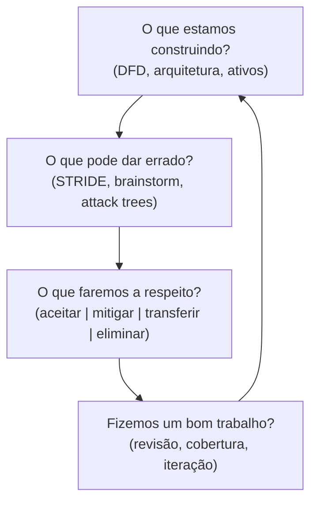
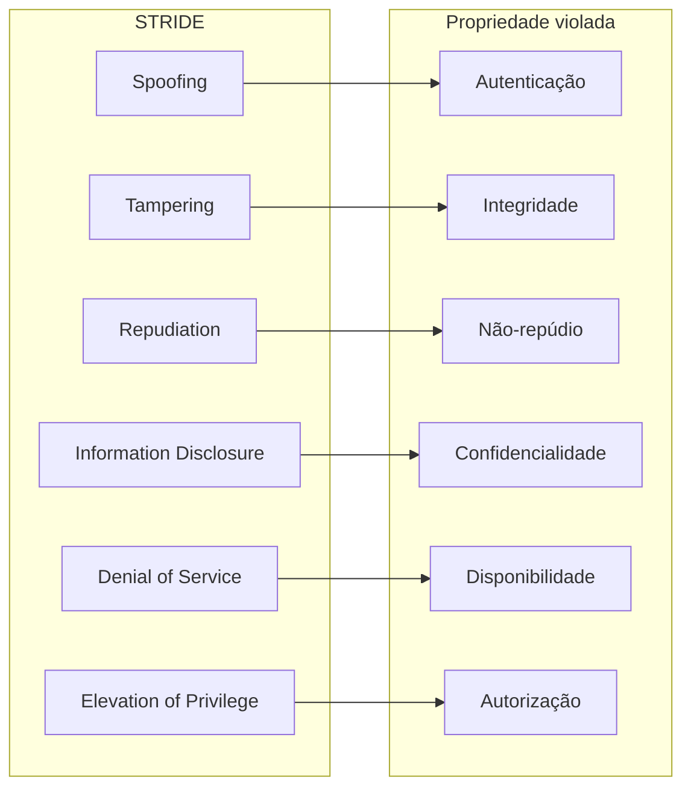
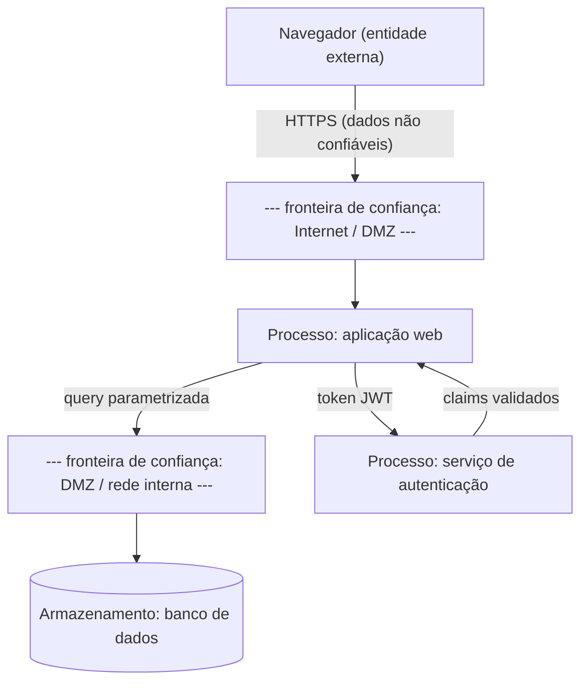
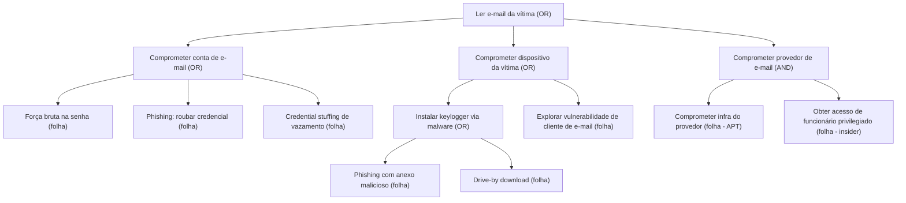
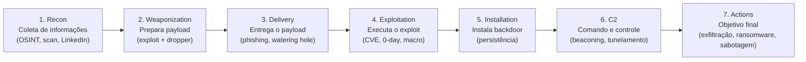

# Pensar como adversário

> [!abstract] TL;DR
> Segurança começa com uma pergunta simples e desconfortável: *quem quer me prejudicar e o que farão?* Modelagem de ameaças (threat modeling) é o processo formal de responder isso **antes** de escrever código. STRIDE dá vocabulário para nomear o que pode dar errado; árvores de ataque tornam o raciocínio do adversário explícito e auditável; trust boundaries revelam onde validação é obrigatória, não opcional; e o princípio "assume breach" exige que o design funcione mesmo quando um perímetro já foi violado. Pensar como adversário não é paranoia — é engenharia.

---

## O problema com "segurança depois"

Imagine que você projetou uma casa e, só depois de construída, chamou alguém para "adicionar segurança". A pessoa instala uma fechadura na porta da frente — mas a janela dos fundos continua aberta, o encanamento passa por baixo da calçada e qualquer vizinho com uma pá consegue acesso ao porão. Esse é o modelo clássico de segurança como *camada adicional tardia*: tecnicamente presente, operacionalmente inútil.

A alternativa é projetar a casa já presumindo que adversários existem. Isso é threat modeling.

> [!question] Por que fazer isso cedo?
> Consertar uma vulnerabilidade de design custa ordens de magnitude mais do que consertá-la no papel. O modelo de ameaças pertence à fase de arquitetura, não ao pentest de pré-produção.

O ponto de partida de qualquer threat modeling é enumerar **ativos** — o que tem valor e, portanto, atrai adversários: dados pessoais, tokens de autenticação, código-fonte proprietário, disponibilidade do serviço, reputação da marca. Sem saber o que você protege, é impossível saber contra o quê proteger.

Um segundo conceito estruturante é a **superfície de ataque**: o conjunto de todos os pontos de entrada e saída que um adversário pode explorar. APIs públicas, endpoints de upload, campos de formulário, conexões de terceiros, dependências de código — tudo que recebe input externo faz parte da superfície. A regra prática: superfície de ataque menor é sempre melhor. Desabilitar o que não é necessário é uma forma de defesa que não exige patches futuros.

---

## As quatro perguntas de Shostack

Adam Shostack, que liderou threat modeling na Microsoft e depois escreveu o livro de referência da área, propôs um framework deceptivamente simples. Toda sessão de modelagem de ameaças responde quatro perguntas:

1. **O que estamos construindo?** — Um diagrama, um mapa do sistema. Sem esse mapa, não há como raciocinar sobre ameaças. Você precisa ver quem fala com quem, que dados trafegam, onde ficam armazenados.
2. **O que pode dar errado?** — A parte criativa e técnica. É aqui que frameworks como STRIDE entram para estruturar o pensamento.
3. **O que vamos fazer a respeito?** — Para cada ameaça identificada: aceitar, mitigar, transferir ou eliminar.
4. **Fizemos um bom trabalho?** — Revisão: cobrimos as ameaças relevantes? As mitigações fazem sentido?

A quarta pergunta é a mais ignorada — e a mais honesta. A modelagem de ameaças não é um exercício de caixa-de- seleção; é um ciclo.

> [!info] Leitura do diagrama
> O processo é cíclico: cada iteração (sprint, mudança de arquitetura, novo componente) reinicia o ciclo. A seta de Q4 → Q1 é intencional — threat modeling não é "feito uma vez e arquivado".

---

## STRIDE: dar nome ao que pode dar errado

STRIDE foi criado na Microsoft em 1999 por Loren Kohnfelder e Praerit Garg como um mnemônico para os seis tipos de ameaças que afetam qualquer sistema. Cada letra mapeia para uma propriedade de segurança que ela viola:

| Ameaça STRIDE | O que é | Propriedade violada |
|---|---|---|
| **S**poofing | Fingir ser outro usuário, processo ou sistema | Autenticação |
| **T**ampering | Modificar dados em trânsito ou em repouso sem autorização | Integridade |
| **R**epudiation | Negar ter realizado uma ação — e o sistema não poder provar o contrário | Não-repúdio |
| **I**nformation Disclosure | Expor dados a quem não deveria vê-los | Confidencialidade |
| **D**enial of Service | Tornar o sistema indisponível para usuários legítimos | Disponibilidade |
| **E**levation of Privilege | Obter permissões além do que foi concedido | Autorização |

Perceba que STRIDE cobre o triângulo CIA (Confidencialidade, Integridade, Disponibilidade) e estende com Autenticação, Não-repúdio e Autorização — o que às vezes se chama de CIA+AAA.

> [!info] Leitura do diagrama
> Cada ameaça STRIDE viola exatamente uma propriedade de segurança. O mapeamento não é acidental — serve como checklist: se você está modelando um componente, percorra as seis letras e pergunte "como este elemento pode ser *spoofado*? *tamperado*?" etc. O STRIDE funciona melhor aplicado sobre cada elemento de um DFD.

> [!example] Aplicando STRIDE a um formulário de login
> - **S** (Spoofing): atacante usa credenciais roubadas ou força bruta para se passar por outro usuário.
> - **T** (Tampering): interceptação da senha em trânsito (HTTP sem TLS) ou manipulação da sessão.
> - **R** (Repudiation): sem log de auditoria, o usuário pode negar que fez login; administrador não consegue provar.
> - **I** (Info Disclosure): erro de login excessivamente detalhado revela quais usuários existem (user enumeration).
> - **D** (DoS): flood de requisições de login bloqueia contas legítimas ou derruba o endpoint.
> - **E** (EoP): falha na validação de roles permite que usuário comum acesse painel administrativo pós-login.

---

## DFDs e trust boundaries: onde a validação é obrigatória

Um Data Flow Diagram (DFD) é um mapa do sistema com quatro elementos:
- **Processos** (círculos ou retângulos arredondados): código que transforma dados.
- **Armazenamentos de dados** (linhas paralelas ou cilindros): BD, arquivo, cache.
- **Entidades externas** (retângulos): usuários, sistemas terceiros, navegadores.
- **Fluxos de dados** (setas): o que trafega entre os elementos acima.

A adição chave para threat modeling é a **trust boundary** (fronteira de confiança): uma linha que separa regiões com diferentes níveis de privilégio ou controle. Dados que cruzam essa linha são suspeitos por definição.

> [!warning] Regra de ouro das trust boundaries
> Tudo que cruza uma fronteira de confiança é hostil até prova em contrário. Não importa se veio de outro serviço interno — se ele pode ser comprometido, seus dados também podem ser adulterados.

> [!info] Leitura do diagrama
> As linhas tracejadas representam as trust boundaries. Qualquer seta que as cruza exige validação explícita: sanitização de input (Internet → DMZ), queries parametrizadas (DMZ → BD), verificação de assinatura (JWT), etc. As setas *dentro* de uma mesma zona ainda merecem atenção, mas o risco de cruzamento de fronteira é maior.

---

## Árvores de ataque: raciocinar como o atacante

Bruce Schneier formalizou as *attack trees* em 1999 no Dr. Dobb's Journal. A ideia é simples e poderosa: modelar o objetivo do atacante como a raiz de uma árvore, e as formas de alcançá-lo como galhos.

- **Nó OR**: o atacante consegue atingir o nó-pai se atingir *qualquer* filho. (Caminhos alternativos.)
- **Nó AND**: o atacante só consegue atingir o nó-pai se atingir *todos* os filhos. (Requisitos cumulativos.)
- **Folhas**: ações concretas e elementares. Atribui-se a elas custo, probabilidade, nível de habilidade necessário — e depois se sintetiza esses atributos para cima na árvore.

A síntese de atributos funciona de baixo para cima:
- Para nó **OR**: custo do pai = **mínimo** dos custos dos filhos (o atacante escolhe o caminho mais barato).
- Para nó **AND**: custo do pai = **soma** dos custos dos filhos (todos precisam ser satisfeitos).

Isso transforma a árvore em um instrumento analítico: dado um orçamento de ataque hipotético, você consegue determinar quais caminhos são economicamente viáveis para diferentes perfis de adversário. Um script kiddie com custo ≤ $100 de ferramentas encontra um subconjunto de folhas acessíveis; um APT com orçamento de milhões tem acesso a quase todos. A árvore torna esse raciocínio explícito e comparável.

Exemplo: "Ler o e-mail da vítima" como objetivo raiz.

> [!info] Leitura do diagrama
> Nós marcados como **OR**: o atacante escolhe o caminho de menor resistência — o mais barato, o mais provável. Nós **AND** (como "Comprometer provedor"): exigem que *todas* as sub-condições sejam satisfeitas, o que os torna intrinsecamente mais difíceis. Isso é um insight de defesa: a árvore revela quais folhas são os "pontos de corte" — basta defender uma delas para tornar aquele caminho infactível.

> [!tip] Por que árvores de ataque importam em design
> Elas tornam explícito o raciocínio do adversário. Em vez de perguntar "o que protegemos?", você pergunta "quais caminhos o atacante tem?". A mitigação mais eficiente é a que corta o maior número de caminhos — não necessariamente a mais cara.

---

## Outros frameworks de threat modeling

STRIDE não é o único jogo em cidade. Em entrevistas e no campo, você vai encontrar referências a outros frameworks. Saber compará-los demonstra maturidade técnica:

| Framework | Origem | Foco | Quando usar |
|---|---|---|---|
| **STRIDE** | Microsoft, 1999 | 6 categorias de ameaça, orientado a componentes/DFD | Padrão de mercado; ideal para equipes de engenharia |
| **PASTA** | Tony UcedaVélez, 2012 | 7 estágios, orientado a risco de negócio | Quando o contexto de negócio precisa ser integrado ao risco técnico |
| **LINDDUN** | KU Leuven | Ameaças à privacidade (Linkability, Identifiability, Non-repudiation, Detectability, Disclosure, Unawareness, Non-compliance) | Sistemas com dados pessoais; LGPD/GDPR obrigam essa dimensão |
| **Attack Trees** | Schneier, 1999 | Raciocínio adversarial estruturado | Complemento a qualquer framework; ótimo para casos específicos de alto risco |
| **MITRE ATT&CK** | MITRE, 2013 | Táticas e técnicas de atacantes reais (TTPs) | SOC, red team, análise pós-incidente — mais operacional que de design |

A escolha não é exclusiva. Na prática, equipes maduras combinam: DFD + STRIDE para o processo de design, LINDDUN para a dimensão de privacidade, e ATT&CK para mapear ameaças a componentes específicos de infra.

> [!tip] O que mencionar em entrevista sobre frameworks
> "I default to STRIDE over a DFD because it's systematic and the mapping to security properties makes it easy to reason about countermeasures. For privacy-sensitive systems I'd layer LINDDUN on top."

---

## Tipos de adversário: contra quem você se defende?

Não existe "seguro". Existe "seguro contra X com custo Y em contexto Z". O modelo de ameaça depende diretamente do adversário que você está modelando.

| Tipo de adversário | Capacidade técnica | Motivação | Exemplo de ataque |
|---|---|---|---|
| Script kiddie | Baixa — usa ferramentas prontas | Diversão, exploração aleatória | Port scan + exploit de CVE público |
| Criminoso oportunista | Média — adapta ferramentas | Ganho financeiro | Ransomware, credential stuffing em escala |
| Insider malicioso | Média-alta — conhece o sistema | Vingança, espionagem, ganho | Exfiltração via acesso legítimo |
| Grupo organizado (crime) | Alta — equipes especializadas | Ganho financeiro, extorsão | Campanha de phishing direcionado, BEC |
| APT / Estado-nação | Muito alta — zero-days, paciência | Espionagem, sabotagem, geopolítica | Stuxnet, SolarWinds supply-chain |

> [!warning] O erro mais comum de threat modeling
> Modelar ameaças como se o adversário fosse sempre um APT estatal, ou modelar como se fosse sempre um script kiddie. A pergunta correta é: *dada a atratividade dos meus ativos, quem provavelmente vai tentar atacar?* Um CRUD interno de RH tem perfil de ameaça diferente de uma exchange de criptomoedas.

A resposta a essa pergunta determina onde você investe: MFA simples barra 99% dos scripts kiddies e dos criminosos oportunistas. Contra APT, você precisa de isolamento, detecção de anomalias, segmentação de rede e — inevitavelmente — assume breach.

---

## "Assume breach": projetar para o dia depois da invasão

*Assume breach* é a hipótese de design que presume que um adversário já está dentro do sistema. É a resposta pragmática ao fato de que nenhuma defesa perimetral é perfeita.

A consequência prática: **o design não pode depender de nenhum perímetro ser inviolável**. Isso leva a:

- **Menor privilégio** em cada componente: se um microsserviço for comprometido, ele não deve conseguir acesso ao banco de dados de outro domínio.
- **Segmentação de rede**: east-west traffic (interno) é tão suspeito quanto north-south (externo).
- **Monitoração e detecção**: se a pergunta for "como detecto o intruso?", você está no assume breach. Se a pergunta for "como impedir que ele entre?", você ainda está no modelo de perímetro.
- **Blast radius mínimo**: um comprometimento deve ter consequências limitadas, não cascata irrestrita.

Assume breach é o alicerce filosófico do Zero Trust — que a nota [[19 - Zero trust e defesa em profundidade]] desenvolve em detalhe.

Um exemplo canônico do que acontece quando assume breach *não* é adotado: o ataque à Target em 2013. O invasor entrou pela rede de um fornecedor de HVAC (sistema de climatização) que tinha acesso à rede de TI da varejista. Uma vez dentro, moveu-se lateralmente sem obstáculos — porque o design presumia que quem estava "dentro" era confiável. O resultado: 40 milhões de números de cartão comprometidos. O perímetro falhou na primeira barreira; não havia segunda.

> [!example] Três perguntas de assume breach para seu sistema
> 1. Se um microsserviço qualquer for comprometido, quais dados ele consegue ler ou modificar?
> 2. Se um engenheiro com acesso de produção for comprometido (credencial roubada), qual é o blast radius?
> 3. Se um container escapar do isolamento, o que mais no host ele consegue alcançar?
>
> Se a resposta a qualquer dessas perguntas for "quase tudo", seu design ainda depende do perímetro.

---

## Cyber Kill Chain: como um ataque se desdobra

A Cyber Kill Chain é um modelo criado pela Lockheed Martin em 2011 que descreve as sete fases de um ataque bem-sucedido. A ideia central (inspirada no conceito militar de "kill chain"): um atacante precisa completar *todas* as fases; o defensor precisa interceptá-lo em *qualquer uma*.

> [!info] Leitura do diagrama
> O fluxo é linear e sequencial: cada fase é pré-requisito da próxima. **Defender em múltiplas fases** é mais robusto do que defender em uma só: se o anti-spam não captura o phishing (fase 3), o EDR pode detectar a execução do payload (fase 4); se não, o SIEM pode detectar o beaconing de C2 (fase 6). Cada camada "compra tempo" para resposta — defense in depth tem fundamento no kill chain.

Algumas críticas válidas ao modelo: é excessivamente focado em ataques externos lineares e não representa bem ataques internos, pivot lateral complexo ou campanhas prolongadas de APT. Para esses casos, o framework MITRE ATT&CK é mais granular — mas o kill chain continua sendo o mapa conceitual de referência.

O poder prático do kill chain para engenheiros de software está em mapear **contramedidas por fase**:

| Fase | Contramedida de produto / código |
|---|---|
| Recon | Não expor versões em headers; rate-limit em endpoints públicos; OSINT hygiene nas docs |
| Delivery | SPF/DKIM/DMARC; Content-Security-Policy; validação de tipo e tamanho de upload |
| Exploitation | Patchwork agressivo de dependências; uso de linguagens memory-safe; SAST/SCA na CI |
| Installation | Verificação de integridade de executáveis; read-only filesystem em containers |
| C2 | Egress filtering; DNS monitoring; anomalia de tráfego outbound |
| Actions | Criptografia em repouso; DLP; logs de acesso a dados sensíveis; backups offline |

> [!note] Onde engenheiros de software têm mais alavancagem
> As fases Delivery e Exploitation são onde código de produto tem o maior impacto defensivo: validação de input, updates de dependências e uso de APIs seguras por padrão cortam mais caminhos do que qualquer ferramenta de segurança instalada depois.

---

## Worked example: threat modeling de um formulário de login

Combine tudo o que aprendemos. Sistema: endpoint `POST /login` com usuário/senha, que retorna um JWT.

**Passo 1 — O que estamos construindo?** Entidade externa (navegador) envia credenciais via HTTPS para processo web, que valida contra BD de usuários e retorna token de sessão.

**Trust boundaries identificadas:** Internet ↔ servidor web; servidor web ↔ banco de dados.

**Passo 2 — O que pode dar errado? (STRIDE)**

| # | Categoria STRIDE | Ameaça concreta | Componente afetado |
|---|---|---|---|
| 1 | Spoofing | Força bruta / credential stuffing | Endpoint de login |
| 2 | Spoofing | Phishing rouba credenciais fora da banda | Usuário (fora do controle direto) |
| 3 | Tampering | SQL injection no campo de usuário/senha | Query ao BD |
| 4 | Tampering | Manipulação do JWT em trânsito (sem TLS) | Canal HTTPS |
| 5 | Repudiation | Sem log de login, não é possível auditar quem acessou | Sistema de log |
| 6 | Info Disclosure | User enumeration via mensagem "usuário não existe" | Resposta do endpoint |
| 7 | Info Disclosure | Senha armazenada em plaintext | BD de usuários |
| 8 | Denial of Service | Flood de requisições derruba o endpoint | Infraestrutura |
| 9 | Elevation of Privilege | Token JWT com claim de role forjado ou modificado | Validação do JWT |

**Passo 3 — O que faremos a respeito?**

- Ameaça 1: rate limiting + CAPTCHA + MFA. Mitigar.
- Ameaça 3: queries parametrizadas (prepared statements). Eliminar.
- Ameaça 6: mensagem genérica "credenciais inválidas" independente de qual campo errou. Mitigar.
- Ameaça 7: bcrypt/argon2 com salt único. Eliminar (armazenar hash, nunca senha).
- Ameaça 9: assinar o JWT com chave privada (RS256/ES256) e validar assinatura + claims no servidor. Mitigar.

**Passo 4 — Fizemos um bom trabalho?** Revisamos as nove ameaças identificadas. Cobertura parece razoável. Revisão com outro engenheiro, depois do sprint.

---

## Conexões

- Anterior: [[01 - O que é segurança conceitual]] — CIA, modelo adversarial, superfície de ataque.
- Próxima: [[03 - Economia e fator humano da segurança]] — custo, incentivos e o elo humano.
- Cross-links: [[16 - Classes de vulnerabilidade]] — SQL injection, XSS e as classes que o STRIDE aponta mas não detalha.
- Cross-links: [[04 - Princípios de design seguro]] — least privilege, defense in depth e Kerckhoffs como respostas ao threat modeling.

> [!summary] Resumo em uma linha
> Threat modeling é perguntar "o que pode dar errado?" de forma estruturada — com STRIDE para nomear ameaças, DFDs para visualizar o sistema, árvores de ataque para raciocinar como o adversário, e "assume breach" para projetar sem ilusões sobre o perímetro.

---

## Em entrevista

Threat modeling é um tema recorrente em entrevistas de engenharia de plataforma, segurança e sistemas distribuídos. O entrevistador quer saber se você pensa proativamente sobre adversários, não apenas reativamente sobre bugs. Frases úteis:

- *"My first step would be to draw a data flow diagram and identify the trust boundaries — any data crossing them needs explicit validation."*
- *"I'd apply STRIDE to each component: spoofing, tampering, repudiation, information disclosure, denial of service, elevation of privilege."*
- *"We should threat-model this early in the design phase. Fixing an architectural vulnerability post-deployment costs orders of magnitude more."*
- *"The attacker's goal is the root of our attack tree — we can prune branches by removing individual leaf nodes, which gives us a cost-effective defense strategy."*
- *"We need to assume breach: design the system so that a single compromised component doesn't cascade into full data exposure."*

**Vocabulário PT → EN:**

| Português | Inglês |
|---|---|
| Modelagem de ameaças | Threat modeling |
| Fronteira de confiança | Trust boundary |
| Diagrama de fluxo de dados | Data flow diagram (DFD) |
| Árvore de ataque | Attack tree |
| Spoofing de identidade | Identity spoofing |
| Elevação de privilégio | Elevation of privilege / privilege escalation |
| Repúdio | Repudiation |
| Nó raiz | Root node |
| Pressumir violação | Assume breach |
| Cadeia de morte cibernética | Cyber kill chain |
| Reconhecimento | Reconnaissance |
| Comando e controle | Command and control (C2) |
| Adversário persistente avançado | Advanced Persistent Threat (APT) |
| Raio de explosão | Blast radius |

---

> [!info] Lastro
> 1. **Adam Shostack** — *Threat Modeling: Designing for Security* (Wiley, 2014). Livro de referência da área; define as quatro perguntas e o framework moderno de DFD + STRIDE + árvores. Shostack mantém material adicional em [shostack.org/resources/threat-modeling.html](https://shostack.org/resources/threat-modeling.html).
> 2. **Bruce Schneier** — "Attack Trees: Modeling Security Threats", *Dr. Dobb's Journal*, v. 24, n. 12, dez. 1999, pp. 21–29. Artigo original que formalizou nós AND/OR e síntese de atributos (custo, possibilidade) nas folhas. Referência canônica em [sciepub.com/reference/5472](https://www.sciepub.com/reference/5472).
> 3. **Loren Kohnfelder & Praerit Garg (Microsoft, 1999)** — Criadores do STRIDE. Documentação técnica atual mantida pela Microsoft em [securitycompass.com/blog/stride-in-threat-modeling](https://www.securitycompass.com/blog/stride-in-threat-modeling/) e [aptori.com/blog/the-stride-threat-model-a-comprehensive-guide](https://www.aptori.com/blog/the-stride-threat-model-a-comprehensive-guide).
> 4. **Lockheed Martin** — "Intelligence-Driven Computer Network Defense Informed by Analysis of Adversary Campaigns and Intrusion Kill Chains", 2011. Artigo original que introduziu o modelo de sete fases. Resumo em [lockheedmartin.com/en-us/capabilities/cyber/cyber-kill-chain.html](https://www.lockheedmartin.com/en-us/capabilities/cyber/cyber-kill-chain.html).
> 5. **OWASP Threat Modeling** — Guia comunitário com cheat sheets, exemplos e comparativo de frameworks (STRIDE, PASTA, LINDDUN, VAST). Referência viva em [owasp.org/www-community/Threat_Modeling](https://owasp.org/www-community/Threat_Modeling).
> 6. **Threat Modeling Manifesto** (2020) — Documento comunitário assinado por Shostack e outros 14 praticantes; consolida os valores e princípios do campo. Disponível em [threatmodelingmanifesto.org](https://www.threatmodelingmanifesto.org).
