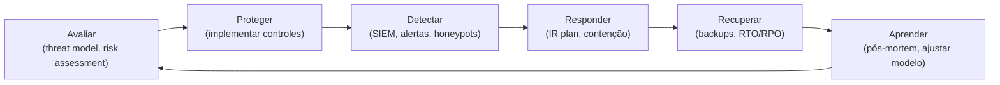
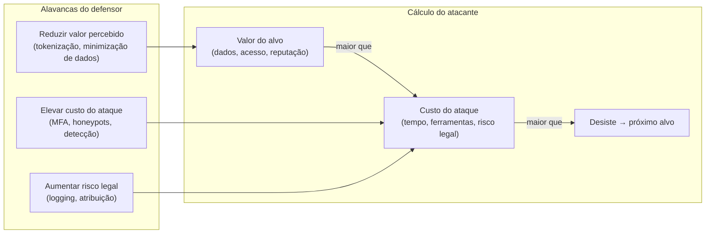
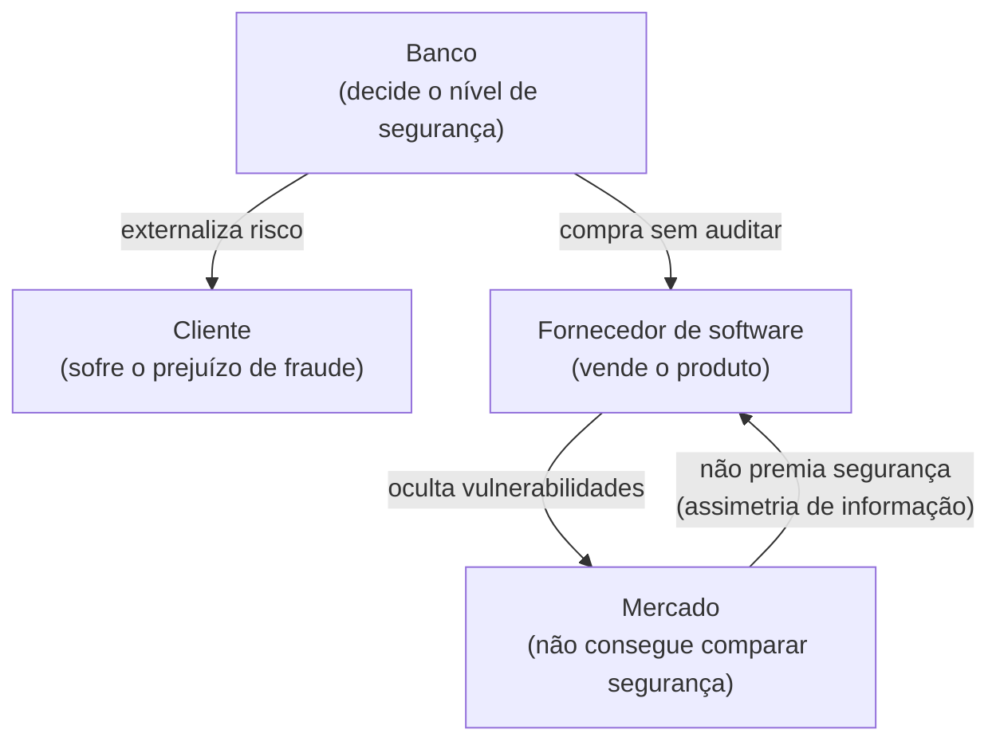
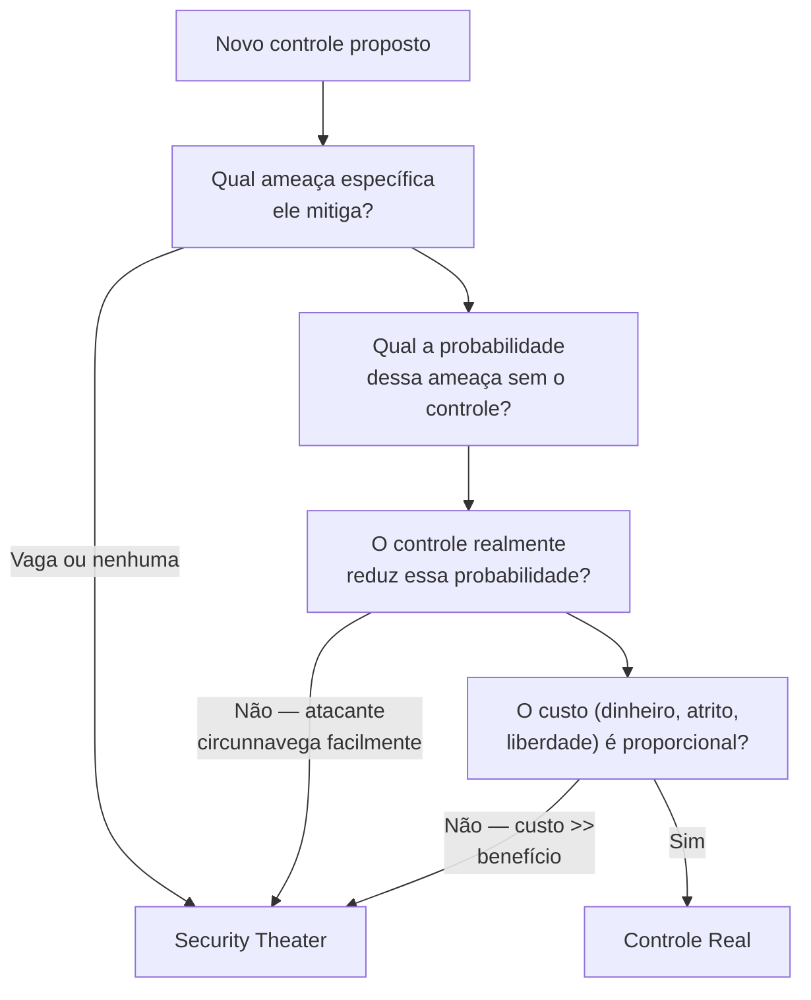
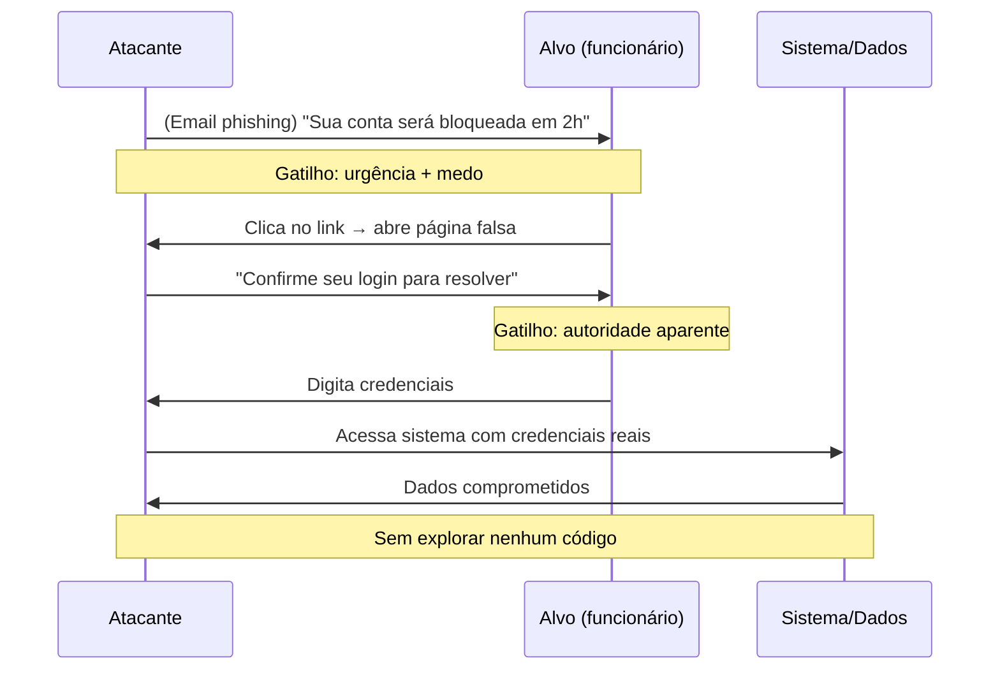
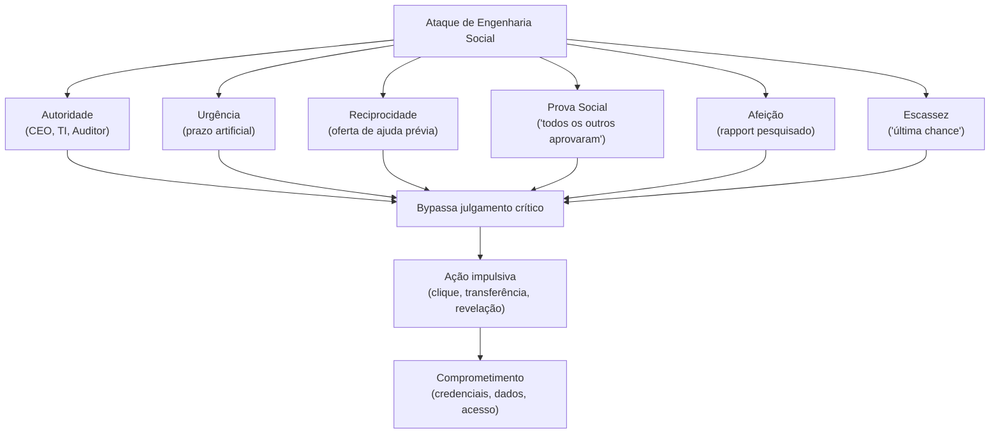
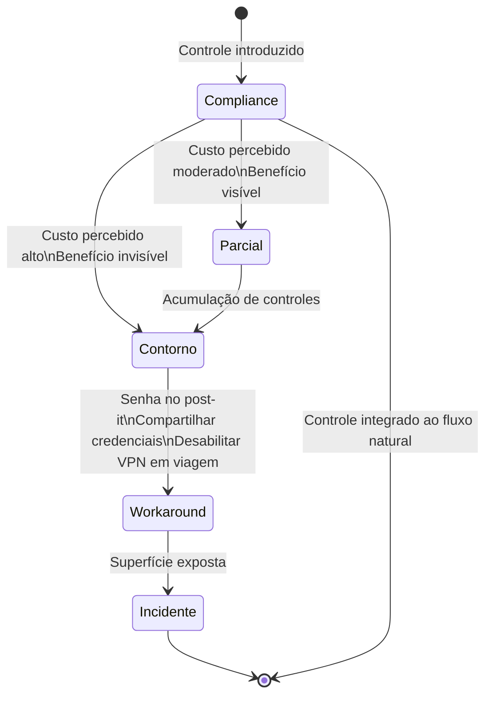

# Economia e fator humano da segurança

> [!abstract] TL;DR
> Segurança é, no fundo, um problema econômico e humano — não matemático. O objetivo não é "inquebrável", é "caro demais pra valer a pena". O elo mais fraco não é o algoritmo de criptografia: é o ser humano que clica em e-mail de phishing às 17h50 numa sexta-feira. E quando os controles são hostis demais, os usuários os sabotam — não por malícia, mas porque o custo de compliance excede o orçamento de paciência deles.

---

## A tese de Schneier — segurança como processo

Existe uma frase que praticamente toda entrevista de segurança vai pressupor que você conhece, atribuída a Bruce Schneier no livro *Secrets and Lies* (2000):

> *"Security is a process, not a product."*

O que parece óbvio na superfície carrega uma implicação radical: você não pode **comprar** segurança. Você pode comprar um firewall, um WAF, um SIEM de última geração — e ainda assim estar exposto. Por quê? Porque o adversário não ataca o produto; ele ataca o processo. Ele procura a janela que você esqueceu de fechar depois de instalar a tranca.

A visão de produto cria uma ilusão perigosa: "implantamos o sistema X, estamos protegidos." A visão de processo exige pergunta permanente: *o que mudou desde ontem? Qual nova superfície surgiu? Qual controle degradou?* Segurança é uma atividade contínua, não um estado que se atinge e mantém passivamente.

Pense assim: criptografia de disco inteiro (BitLocker, FileVault) é um produto. O processo é decidir quando e como revogar credenciais de um ex-funcionário dentro das próximas 2 horas — não 2 dias. Incidentes reais raramente exploram criptografia quebrada; exploram o processo que deixou uma conta ativa por 3 meses após o desligamento.

O contexto histórico importa aqui: Schneier escreveu *Secrets and Lies* depois de ter passado anos promovendo criptografia forte como solução para segurança digital. O livro foi, em parte, uma autocrítica: ele percebeu que estava vendendo produtos (algoritmos, protocolos) enquanto os ataques reais iam por outros caminhos. Essa honestidade intelectual é o que torna o argumento mais forte — vem de quem construiu produtos de segurança e viu seus limites de dentro.

> [!note] Por que isso importa na prática
> Empresas que pensam em produto compram soluções e param de verificar. Empresas que pensam em processo constroem loops de feedback: alertas, revisões periódicas, testes de penetração recorrentes, modelagem de ameaças integrada ao ciclo de desenvolvimento. A diferença não está no orçamento — está no modelo mental.

Um sinal prático de que uma organização ainda pensa em produto: ela tem políticas de segurança documentadas mas nunca testadas. Política não testada é teatro de burocracia — existência no papel sem efeito no risco real. O processo exige exercícios de simulação (tabletop exercises), red team periódico, e — o mais doloroso — pós-mortems honestos quando algo falha.

O que um loop de processo de segurança maduro parece na prática:

> [!info] Leitura do diagrama
> O ciclo de segurança como processo é contínuo e adaptativo. Cada fase alimenta a próxima: o que é aprendido no pós-mortem atualiza o modelo de ameaças, que ajusta os controles, que melhora a detecção. "Segurança como produto" para no segundo passo (Proteger) e nunca fecha o loop. A fase mais negligenciada é frequentemente LEARN — o pós-mortem honesto que identifica falhas sistêmicas.

---

## Segurança como problema econômico

Aqui está a pergunta que muda tudo: *o que um atacante racional faz quando o custo do ataque supera o valor do alvo?*

Ele desiste e vai atacar o próximo da fila.

Esse insight transforma segurança de um problema de matemática pura em um problema de economia. O objetivo do defensor não é tornar o sistema invulnerável — isso é impossível e proibitivamente caro. O objetivo é **elevar o custo do ataque acima do valor percebido pelo atacante**.

> [!info] Leitura do diagrama
> O atacante racional compara VA (valor do alvo) com CA (custo do ataque). Se CA > VA, ele desiste. O defensor tem três alavancas: reduzir o valor percebido, elevar o custo do ataque, ou aumentar o risco legal. Note que as três são complementares — nenhuma sozinha é suficiente.

Isso tem uma consequência que incomoda quem vem de uma mentalidade absolutista: **"good enough security" é uma estratégia racional**. Gastar R$1M para proteger dados que valem R$100K é desperdício. Gastar R$100K para proteger dados que valem R$100M é suicídio. A calibração correta exige saber o que você está protegendo e o perfil do seu adversário — exatamente o que threat modeling ([[02 - Pensar como adversário]]) endereça.

Uma forma concreta de pensar sobre isso é a matriz de risco clássica: **risco = probabilidade × impacto**. O objetivo da segurança é reduzir o produto — e você pode fazer isso reduzindo a probabilidade (dificultar o ataque) ou reduzindo o impacto (limitar o dano quando o ataque ocorre). Defesa em profundidade, segmentação de rede e backups imutáveis são exemplos de redução de impacto: eles não impedem o atacante de entrar, mas garantem que o dano seja contido.

> [!example] O custo da prevenção vs. o custo do incidente
> A Equifax (2017): uma vulnerabilidade Apache Struts conhecida (CVE-2017-5638, patch disponível há meses) foi explorada, expondo dados de 147 milhões de pessoas. O custo estimado do incidente ultrapassou US$4 bilhões (settlement, multas, custos operacionais). O patch custaria algumas horas de trabalho de equipe. O cálculo econômico é devastador — e frequente. A brecha geralmente não é técnica; é priorização errada de recursos.

Existe também o fenômeno dos **diminishing returns** na defesa: as primeiras camadas de segurança têm altíssimo retorno (MFA, patches em dia, firewall básico eliminam 90%+ dos ataques oportunistas). Camadas adicionais progressivamente protegem contra adversários mais sofisticados, mas o custo cresce exponencialmente enquanto o benefício marginal decresce.

A consequência prática é que a estratégia ótima para a maioria das organizações é colocar recursos nas camadas de alto retorno primeiro — não tentar atingir nível NSA quando o adversário provável é um script kiddie ou ransomware automatizado. O perfil do adversário define onde o ponto de equilíbrio está.

Como engineer, você pode aplicar esse raciocínio diretamente em decisões de design:

- **Dado sensível que não existe não pode ser vazado** → minimização de dados (coletar só o necessário) tem ROI de segurança direto.
- **Dado tokenizado não pode ser decifrado pelo atacante** → tokenização de PAN em PCI-DSS é redução de valor percebido, não só conformidade.
- **Log de auditoria imutável eleva o custo de cobrir rastros** → o atacante racional pesa também o risco de atribuição.
- **Rate limiting e CAPTCHA elevam o custo de ataques automatizados** → eficazes contra maioria dos adversários oportunistas, irrelevantes contra APTs determinados.

O ponto é que cada decisão de design tem um custo de segurança implícito. Torná-lo explícito — "quem é o adversário aqui e qual a alavanca mais eficiente contra ele?" — é o que separa engenharia de segurança de checkbox de conformidade.

---

## O desalinhamento de incentivos — Anderson (2001)

Ross Anderson, em *Why Information Security is Hard — An Economic Perspective* (ACSAC 2001), fez a observação mais desconfortável da área: **insegurança de informação é, em grande parte, resultado de incentivos perversos, não de ignorância técnica**.

O argumento central: quem *pode* proteger o sistema frequentemente não é quem *sofre* o dano quando ele falha.

> [!info] Leitura do diagrama
> O ciclo mostra três desalinhamentos clássicos: (1) o banco externaliza o custo do risco para o cliente, não tendo incentivo total para investir em segurança; (2) o fornecedor de software oculta vulnerabilidades porque o mercado não consegue verificá-las antes da compra; (3) o mercado então não consegue premiar produtos mais seguros, perpetuando o ciclo. Anderson chamou isso de *mercado de limões* aplicado à segurança — termo originado de Akerlof (1970).

Anderson identificou quatro fenômenos econômicos que explicam a falha de mercado em segurança:

| Fenômeno | O que é | Efeito em segurança |
|---|---|---|
| **Externalidade negativa** | Custo recai sobre terceiros | Banco investe pouco; cliente paga |
| **Assimetria de informação** | Comprador não sabe avaliar segurança | Mercado de limões — produto ruim expulsa o bom |
| **Tragédia dos comuns** | Recurso compartilhado se degrada | Internet — cada nó não tem incentivo a filtrar spam/DDoS |
| **Risco moral (moral hazard)** | Quem não paga pelo risco toma mais risco | Segurado investe menos em prevenção |

O corolário prático: você não pode resolver segurança só com tecnologia porque o problema frequentemente é de design de incentivos. Regulação (LGPD, GDPR, PCI-DSS) existe exatamente para realinhar incentivos que o mercado não realinha sozinho — ela força quem *pode* proteger a arcar com o custo quando não o faz.

> [!question] Por que software tem tantas vulnerabilidades se existem vendedores especializados em segurança?
> Anderson explica com o mercado de limões de Akerlof: quando o comprador não consegue verificar a qualidade do produto *antes* da compra (e frequentemente nem depois, sem um ataque), ele não paga mais por qualidade superior. O vendedor, racionalmente, não investe em qualidade que o mercado não remunera. O resultado é convergência para o mínimo — o "lemon" expulsa o produto bom. Isso só muda quando há mecanismos de sinalização confiáveis (certificações auditadas, disclosure obrigatório de breaches, responsabilidade legal por negligência) ou regulação que impõe piso mínimo.

Um caso particularmente revelador é o da **tragédia dos comuns** aplicada à internet. Cada ISP individualmente tem baixo incentivo para filtrar tráfego de saída (que custa dinheiro e não beneficia seus clientes diretamente — beneficia clientes de outros ISPs). O resultado coletivo: redes de botnets persistem porque o custo de eliminá-las é pago por quem é atacado, não por quem hospeda os nós zumbis sem perceber. O problema não é técnico — as soluções de filtragem existem. É de incentivos.

Anderson também antecipou (em 2001!) que à medida que serviços financeiros migrassem para digital, o ônus da fraude seria progressivamente transferido do banco para o cliente através de termos contratuais — não por malícia, mas porque os incentivos estruturais apontam nessa direção. Vinte anos depois, esse padrão se confirmou em múltiplas jurisdições.

Como engineer, você vai deparar com esses desalinhamentos em decisões concretas de produto:

| Situação | Desalinhamento | O que incentivo puro gera | O que regulação/norma corrige |
|---|---|---|---|
| SaaS B2B com breach | Empresa não revela para não perder clientes | Ocultação, vítimas não sabem se proteger | LGPD Art. 48 / GDPR Art. 33 — notificação obrigatória |
| Open source library com 0-day | Mantenedor voluntário sem recurso para patching | Vulnerabilidade persiste sem patch | Bug bounty, fundações como OpenSSF provendo recursos |
| ISP com botnet de clientes | Custo de limpeza > benefício (beneficia concorrentes) | Botnets persistem indefinidamente | Acordos de peering com blacklisting colaborativo |
| Startup com dados de usuário | Segurança aumenta time-to-market, sem custo visível até o breach | Mínimo de segurança até o primeiro incidente | PCI-DSS para pagamentos, SOC 2 para B2B enterprise |

Esse mapa revela uma heurística: **se a regulação não existe ou não tem dente, assuma que os incentivos apontam para menos segurança do que o socialmente ótimo**. Isso não é cinismo — é análise econômica aplicada. A conclusão prática para um engineer em uma startup: pressionar por segurança básica cedo é mais barato que remediar depois do primeiro breach, e a assimetria de custo (patch de dependência agora vs. resposta a incidente depois) é frequentemente de 100:1 ou mais.

---

## Security theater — sensação sem substância

Schneier cunhou o termo **security theater** em *Beyond Fear* (2003) para descrever controles que geram sensação de segurança sem reduzir risco real. O exemplo canônico é o processo de segurança em aeroportos pós-11 de setembro: proibição de líquidos acima de 100ml, remoção de sapatos, swabs em mãos aleatórias.

Como distinguir controle real de teatro?

> [!info] Leitura do diagrama
> Um framework de quatro perguntas para avaliar se um controle é real ou teatro. Qualquer resposta "não" ou "vaga" no caminho leva ao diagnóstico de teatro. O ponto crítico é P3: se o atacante pode trivialmente contornar o controle (comprar dois bilhetes de 99ml), ele não reduz risco.

Teatro de segurança não é neutro — ele é ativamente prejudicial por três razões:
1. **Consome orçamento real** que poderia ir para controles efetivos.
2. **Cria falsa sensação de segurança**, reduzindo vigilância real.
3. **Gera fadiga de processo**: usuários que passam por rituais sem sentido perdem confiança em todos os controles, incluindo os legítimos.

A distinção entre teatro e controle real frequentemente se revela só sob estresse: *se um atacante comprometido tentasse burlar este controle, quanto tempo levaria?* Remover sapatos no aeroporto: um atacante determinado usa sola interna, carrega por outras vias, ou usa carga não inspecionada. O controle não sobrevive à pergunta. Em contraste, MFA com chave física (FIDO2/WebAuthn): um atacante com suas credenciais ainda não consegue autenticar sem a chave física. O controle sobrevive.

> [!warning] Teatro no contexto corporativo
> Não é só aeroporto. Em software: políticas de senha complexa sem MFA (usuário anota no post-it), reuniões de revisão de segurança sem autoridade para bloquear deploy, scanners de vulnerabilidade cujos relatórios nunca são lidos. O teste: *se um atacante comprometido tentasse burlar este controle, quanto tempo levaria?*

**Compliance-driven security** é a forma institucionalizada de teatro: a organização implementa controles para passar na auditoria do PCI-DSS ou SOC 2, não porque os controles reduzem risco. O resultado são organizações que passam com louvor em todas as auditorias e ainda assim sofrem breaches — porque checkboxes de auditoria e redução de risco real não são a mesma coisa. Auditorias bem desenhadas tentam minimizar isso, mas a tensão é estrutural.

---

## Engenharia social — o elo humano

Por que um atacante sofisticado investe meses em explorar vulnerabilidades de software quando pode ligar para o help desk se passando por um executivo sênior e obter a senha em 20 minutos?

Kevin Mitnick respondeu essa pergunta de forma sistemática em *The Art of Deception* (2002): **o ser humano é o vetor mais barato, mais escalável e mais subestimado da superfície de ataque**.

> [!info] Leitura do diagrama
> Um ataque de phishing completo em seis passos: nenhuma linha de código malicioso, nenhuma vulnerabilidade de software explorada. O vetor inteiro é cognitivo. O diagrama mostra os dois gatilhos psicológicos usados (urgência e autoridade) e como eles se encadeiam para eliminar o julgamento crítico da vítima.

Os ataques de engenharia social exploram sistematicamente os gatilhos de Cialdini (*Influence*, 1984) — os mesmos princípios que fazem marketing funcionar. A assimetria é brutal: o defensor precisa que o usuário resista ao gatilho *todas* as vezes; o atacante precisa que ele ceda *uma* vez.

> [!info] Leitura do diagrama
> Os seis gatilhos de Cialdini convergem para um único efeito: bypass do julgamento crítico. O atacante não precisa usar todos — basta ativar um ou dois com força suficiente. Urgência é o mais usado porque é o mais eficaz: ela força decisão rápida, exatamente quando julgamento cuidadoso seria necessário. Prova social é o mais insidioso em contextos corporativos porque parece validação legítima.

| Gatilho | Como é explorado em SE | Exemplo real |
|---|---|---|
| **Autoridade** | Atacante se faz passar por CEO, TI, auditor | CEO fraud — email solicitando transferência urgente |
| **Urgência** | "Sua conta será bloqueada em 2 horas" | Phishing de banco com prazo artificial |
| **Reciprocidade** | Oferece ajuda antes de pedir acesso | Helpdesk falso resolve problema para depois pedir senha |
| **Prova social** | "Todos os outros gerentes já aprovaram" | BEC (Business Email Compromise) em processos de aprovação |
| **Afeição (liking)** | Pesquisa LinkedIn → cria rapport genuíno | Spear-phishing altamente personalizado |
| **Escassez** | "Última chance de regularizar" | Phishing fiscal em período de IR |

**Spear-phishing** é phishing com personalização: o atacante pesquisa a vítima no LinkedIn, descobre seu gerente, projetos recentes, linguagem corporativa — e constrói um email que parece legítimo até para alguém treinado. É por isso que treinamento genérico ("não clique em links suspeitos") falha: a mensagem não é suspeita.

**Vishing** (voice phishing) e **smishing** (SMS phishing) seguem a mesma lógica com canais de menor ceticismo. **Baiting** usa curiosidade (pen drive "esquecido" no estacionamento). **Tailgating** explora a gentileza de segurar a porta — atacante entra em área restrita seguindo um funcionário legítimo.

**Pretexting** é a técnica raiz de quase tudo: o atacante constrói um contexto falso (*pretext*) que torna a solicitação plausível. "Sou da TI, estou resolvendo um problema crítico no seu computador antes da reunião — precisa da sua senha temporária." Sem o pretext, o pedido é obviamente suspeito. Com ele, passa pelo filtro de julgamento rápido que todos usamos quando estamos ocupados.

O *Business Email Compromise* (BEC) — também chamado de CEO fraud — é a forma mais lucrativa de engenharia social: o atacante compromete ou imita o email de um executivo e solicita transferência bancária urgente. O FBI reporta perdas superiores a US$50 bilhões acumulados globalmente até 2023. Nenhuma vulnerabilidade de código explorada. Vetor inteiro: confiança + urgência + autoridade.

> [!danger] O humano não é o problema — é a solução mal projetada
> Culpar o usuário que clicou no phishing é design preguiçoso. Se um sistema depende de 100% dos usuários tomando a decisão certa 100% do tempo sob pressão cognitiva real, o sistema é falho por design. A solução é reduzir o custo de fazer a coisa certa e aumentar o custo de fazer a errada: chaves de segurança físicas (FIDO2) eliminam phishing de credenciais independentemente de o usuário clicar — o atacante não tem a chave, fim do ataque.

A implicação mais contraintuitiva: **o treinamento de consciência de segurança tem efeito limitado e decrescente**. Estudos mostram que mesmo funcionários treinados clicam em phishing bem construído — especialmente sob pressão. Isso não significa que treinamento é inútil; significa que ele não pode ser a única linha de defesa. Defesas técnicas que funcionam independentemente da decisão do usuário (autenticação por hardware, DMARC/DKIM, sandboxing de anexos) têm ROI muito maior.

---

## O compliance budget — quando segurança atrapalha, é sabotada

Beautement, Sasse e Wonham publicaram "The Compliance Budget" (NSPW 2008) depois de entrevistar funcionários de duas grandes organizações sobre por que (não) seguiam políticas de segurança. A descoberta central:

> Cada indivíduo tem um "orçamento de compliance" — uma quantidade finita de custo cognitivo, tempo e inconveniência que está disposto a gastar em segurança antes de começar a atalhar.

> [!info] Leitura do diagrama
> O diagrama mostra a trajetória de comportamento de um usuário frente a um controle de segurança. O caminho ideal (direita) é compliance direto integrado ao fluxo — o controle não é percebido como custo. O caminho problemático leva a workarounds que criam superfície de ataque real. A acumulação de controles (cada um razoável isolado) pode empurrar o usuário de compliance para contorno.

Implicações práticas do compliance budget:

- **Políticas de senha complexa sem gerenciador** → usuário reutiliza senhas ou as anota. O controle cria uma superfície nova.
- **MFA via SMS obrigatório mas que falha uma vez por semana** → usuário busca forma de desabilitar temporariamente.
- **VPN obrigatória que reduz velocidade em 60%** → desabilitada para tarefas "não críticas" — que frequentemente são críticas.
- **Treinamentos anuais de 4 horas** → usuário clica "next" o mais rápido possível. Retenção: quase zero.

A solução não é eliminar controles, é **minimizar o atrito de fazer a coisa certa**:
1. Controles passivos > controles ativos (firewall automático > usuário decidindo o que bloquear).
2. Design de defaults seguros (MFA ativado por padrão, não como opção).
3. Feedback imediato quando controle ajuda (mostrar tentativas de login bloqueadas aumenta compliance).
4. Concentrar fricção nos caminhos perigosos, não nos seguros.

Um exemplo concreto da diferença de design: gerenciadores de senha. O modelo antigo pedia que o usuário *gerasse* senhas fortes e as lembrasse. O modelo moderno (1Password, Bitwarden) gera e preenche automaticamente — o usuário não *escolhe* a senha fraca, simplesmente não tem essa opção no fluxo normal. O compliance budget quase não é consumido porque a decisão foi eliminada, não apenas informada.

Aplicando ao design de APIs e autenticação: forçar HTTPS, rejeitar senhas comuns na criação de conta (via dicionário de senhas comprometidas), expirar tokens de sessão — tudo isso reduz decisões de segurança que o usuário final precisaria tomar corretamente. A regra geral: **cada decisão de segurança que você delega ao usuário é uma dependência frágil no seu modelo de ameaças**.

**Usable security** (segurança usável) é o campo que estuda exatamente essa intersecção: como projetar controles que usuários reais seguem no mundo real, sob pressão de tempo, com carga cognitiva alta. M. Angela Sasse — co-autora do compliance budget — é uma das fundadoras do campo, e o argumento central dela é que se um controle precisa de campanha de conscientização para funcionar, ele já falhou no design.

> [!tip] A regra dos 10 segundos
> Se um controle adiciona mais de ~10 segundos ao fluxo habitual do usuário sem feedback visível de valor, espere workarounds em menos de 30 dias. Não é preguiça — é cognição humana funcionando como projetada.

Três princípios de design de segurança usável derivados de Sasse e colegas:

**1. Minimize o número de decisões de segurança que o usuário precisa tomar.** Cada decisão consome orçamento cognitivo. Um gerenciador de senhas que preenche automaticamente ≠ um usuário que precisa lembrar 30 senhas — a diferença de compliance é abissal.

**2. Torne o feedback de segurança imediato e específico.** "Sua senha é fraca" → feedback vago. "Esta senha já apareceu em 3.8M de breaches conhecidos" (via HaveIBeenPwned) → feedback acionável. Usuários com feedback concreto sobre por que o controle importa têm compliance significativamente maior.

**3. Separe o caminho perigoso do caminho normal.** Confirmação de transferência bancária acima de R$10K deveria ser mais friccionosa, não menos — é exatamente onde você quer que o usuário pause. Em vez de aplicar fricção uniforme a todas as ações (esgotando o budget), concentre-a onde o custo de um erro é alto.

---

## Cultura de segurança — além do treinamento anual

Existe uma diferença fundamental entre uma organização que *tem* políticas de segurança e uma que *tem cultura* de segurança. A diferença não está no documento; está no que acontece quando um funcionário percebe algo suspeito.

Em organizações com cultura fraca:
- Ninguém reporta anomalias porque "provavelmente é meu erro" ou "vão me perguntar por que eu estava fazendo isso".
- O canal para reportar incidentes existe no papel mas é burocrático e punitivo na prática.
- Segurança é percebida como responsabilidade do time de TI/Segurança, não do indivíduo.
- Post-mortems culpam a pessoa, não o sistema.

Em organizações com cultura forte:
- Reportar suspeitas é recompensado, não punicionado — mesmo quando o reporte é falso positivo.
- O canal de reporte tem feedback rápido: "recebemos, investigamos, era X."
- Segurança é expectativa universal — do CEO ao estagiário.
- Post-mortems identificam falhas sistêmicas, não bodes expiatórios.

> [!example] Anatomia de uma cultura forte — a abordagem da Google (Project Zero + BeyondCorp)
> A Google, ao adotar o modelo Zero Trust com BeyondCorp (2014), precisou eliminar a confiança implícita baseada em estar "dentro da rede corporativa". Isso só foi possível com mudança cultural simultânea: documentação aberta, treinamento contextual (não anual genérico), e um modelo onde a equipe de segurança funciona como parceira de engenharia, não policial. O controle técnico sem a mudança cultural teria gerado contorno imediato.

A relação entre cultura e compliance budget é direta: em culturas positivas, o usuário percebe segurança como valor compartilhado, não como custo imposto. Isso não elimina o orçamento de compliance — ainda existe — mas eleva o teto: o usuário está disposto a pagar mais custo quando entende o porquê e quando vê que a organização leva a sério.

---

## Síntese — segurança é um problema sócio-técnico

Juntando os fios:

| Camada | O problema | O erro comum | Fonte |
|---|---|---|---|
| **Econômica** | Incentivos desalinhados entre quem protege e quem sofre | Esperar que o mercado resolva sem regulação | Anderson (2001) |
| **Adversarial** | Atacante racional otimiza custo × recompensa | Buscar segurança absoluta em vez de "caro demais" | Schneier (2000) |
| **Percepção** | Security theater consome orçamento sem reduzir risco | Confundir visibilidade com efetividade | Schneier (2003) |
| **Social** | Engenharia social bypassa controles técnicos pelo vetor humano | Investir 100% em defesa técnica, 0% em cultura | Mitnick (2002) |
| **Comportamental** | Usuários com orçamento de compliance esgotado sabotam controles | Culpar o usuário em vez de redesenhar o controle | Beautement et al. (2008) |
| **Cultural** | Segurança como responsabilidade de um time específico, não de todos | Treinamento anual como substituto para cultura | Sasse (campo de usable security) |

O ponto de chegada: um sistema com criptografia perfeita, firewall impenetrável e código sem vulnerabilidades pode ser completamente comprometido por um e-mail de phishing bem escrito ou por uma política de senha que o usuário anota no post-it. Segurança efetiva precisa funcionar na camada técnica **e** econômica **e** humana simultaneamente.

Uma forma prática de usar esse framework ao revisar uma arquitetura de segurança:

1. **Camada econômica primeiro**: os incentivos estão alinhados? Quem é responsabilizado quando algo falha? Existe assimetria entre quem decide e quem sofre o dano?
2. **Depois a camada humana**: os controles propostos são usáveis? Qual o custo de compliance para o usuário médio? Onde estão os workarounds prováveis?
3. **Por último a camada técnica**: dado que as camadas anteriores estão corretas, qual implementação técnica endereça as ameaças reais?

Inverter essa ordem — começar pela tecnologia sem verificar os incentivos e a usabilidade — é o erro mais comum em design de segurança corporativa. A evidência é empírica: a maioria dos breaches significativos dos últimos 20 anos não explorou criptografia quebrada ou vulnerabilidade zero-day sofisticada. Explorou credenciais comprometidas via phishing, software não atualizado, configuração incorreta de permissões, ou insider com acesso excessivo. Todos problemas de processo, incentivos e fator humano — não de algoritmo.

> [!quote] O que esses autores têm em comum
> Schneier, Anderson, Mitnick, Sasse, Beautement — todos chegaram à mesma conclusão por caminhos diferentes: a parte mais difícil de segurança não é técnica. É convencer organizações a alinhar incentivos, projetar controles usáveis, e construir cultura. A tecnologia é a parte resolvida do problema. O resto é economia e gente.

---

## Conexões

- Anterior: [[02 - Pensar como adversário]]
- Próxima: [[04 - Princípios de design seguro]]
- Cross-links: [[12 - Autenticação]], [[01 - O que é segurança conceitual]]

---

> [!summary] Resumo em uma linha
> Segurança é um problema econômico (custo do ataque × valor do alvo) e humano (engenharia social, compliance budget, security theater) — tecnologia resolve a camada técnica, mas não substitui incentivos alinhados e controles usáveis.

---

## Em entrevista

Esse tema aparece em entrevistas de sistemas distribuídos, design de produto e especialmente em roles que envolvem decisões de arquitetura de segurança (Staff/Principal, Security Engineer, Platform Lead). O entrevistador quer ver que você pensa além do stack técnico — que você entende os incentivos e as pessoas, não só os algoritmos.

Perguntas típicas que testam esse conhecimento:
- *"How would you design a security policy that users will actually follow?"* → Compliance budget + usable security.
- *"Why do companies keep getting breached despite spending on security products?"* → Processo vs. produto + incentivos desalinhados.
- *"How do you evaluate whether a security control is worth implementing?"* → Framework de custo × benefício + teste do teatro.
- *"What's the most common attack vector in practice?"* → Engenharia social / phishing, não exploração de 0-days.

Frases de abertura que funcionam:

*"Security is fundamentally an economic problem — the goal isn't unbreakable, it's expensive enough that the attacker moves on."*

*"The weakest link is rarely the algorithm — it's the human who clicks the phishing email at 5:50 PM on a Friday."*

*"Security theater is worse than no security because it creates false confidence and wastes budget that could go to real controls."*

*"If a security control is hostile to users, they will route around it — and that workaround is your new attack surface."*

*"The economics of security are asymmetric: the attacker needs to find one gap; the defender needs to close all of them. That's why raising the cost of attacks matters more than achieving perfection."*

*"Misaligned incentives explain most persistent security failures — the entity that can fix the problem isn't the one bearing the cost when it fails."*

**Vocabulário PT → EN:**

| PT | EN |
|---|---|
| Teatro de segurança | Security theater |
| Engenharia social | Social engineering |
| Pretexting (contexto fabricado) | Pretexting |
| Orçamento de compliance | Compliance budget |
| Desalinhamento de incentivos | Misaligned incentives |
| Externalidade negativa | Negative externality |
| Segurança usável | Usable security |
| Elo humano | Human factor / Human link |
| Phishing direcionado | Spear-phishing |
| Pescaria por voz | Vishing |
| Pescaria por SMS | Smishing |
| Isca (dispositivo físico) | Baiting |
| Seguir porta | Tailgating |
| Retorno marginal decrescente | Diminishing returns |

---

> [!info] Lastro
> - Bruce Schneier, *Secrets and Lies: Digital Security in a Networked World*, Wiley, 2000 — origem de "security is a process, not a product": [schneier.com](https://www.schneier.com/books/secrets-and-lies/)
> - Bruce Schneier, *Beyond Fear: Thinking Sensibly About Security in an Uncertain World*, Copernicus Books, 2003 — cunhou "security theater": [goodreads.com/book/show/333794](https://www.goodreads.com/book/show/333794.Beyond_Fear)
> - Ross Anderson, "Why Information Security is Hard — An Economic Perspective", ACSAC 2001 — desalinhamento de incentivos, mercado de limões, tragédia dos comuns: [acsac.org/2001/papers/110.pdf](https://www.acsac.org/2001/papers/110.pdf)
> - Adam Beautement, M. Angela Sasse, Mike Wonham, "The Compliance Budget: Managing Security Behaviour in Organisations", NSPW 2008 — compliance budget: [dl.acm.org/doi/10.1145/1595676.1595684](https://dl.acm.org/doi/10.1145/1595676.1595684)
> - Kevin Mitnick, William L. Simon, *The Art of Deception: Controlling the Human Element of Security*, Wiley, 2002 — engenharia social e vetores humanos: [amazon.com/dp/076454280X](https://www.amazon.com/Art-Deception-Controlling-Element-Security/dp/076454280X)
> - Robert B. Cialdini, *Influence: The Psychology of Persuasion*, Harper Business, 1984 (ed. rev. 2006) — os seis gatilhos de persuasão usados em engenharia social
