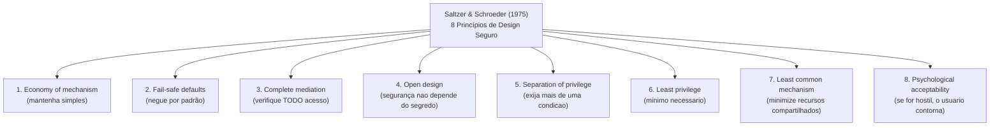
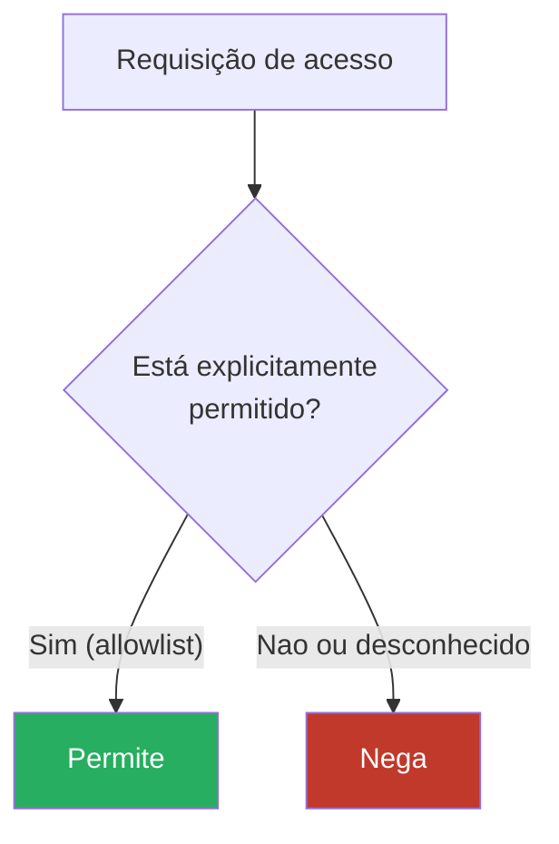
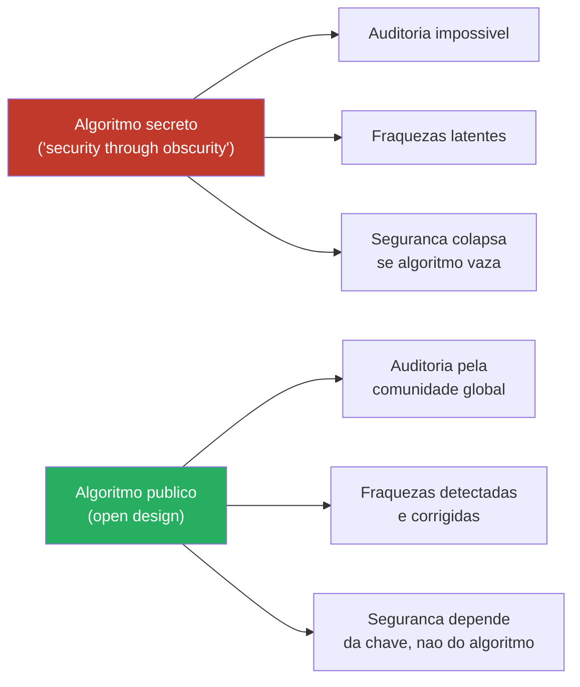
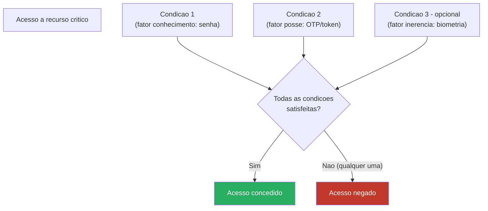
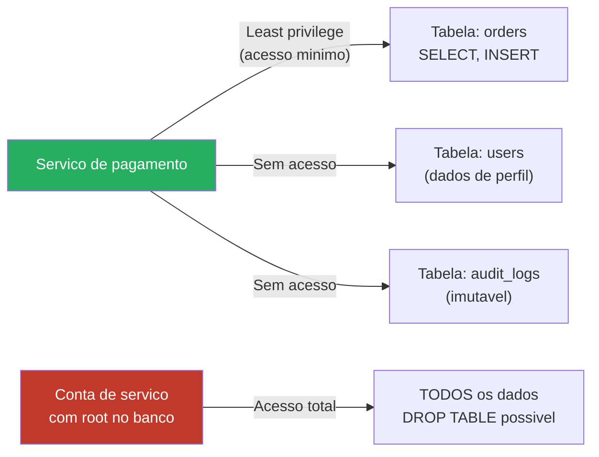
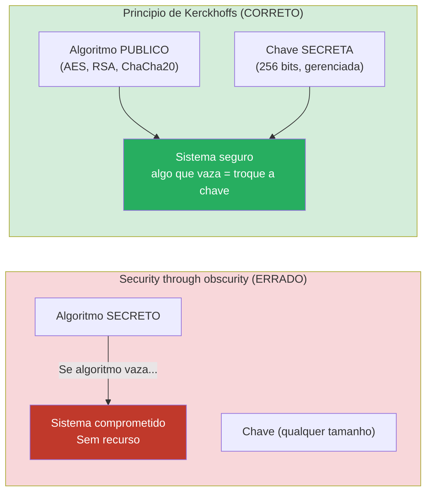
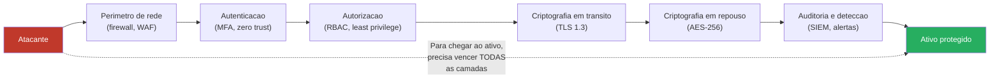

# Princípios de design seguro

> [!abstract] TL;DR
> Antes de qualquer framework, ferramenta ou protocolo, existe um conjunto de princípios de design que determinam se um sistema pode ser seguro. Saltzer & Schroeder (1975) enumeraram oito; Kerckhoffs (1883) enunciou um nono que sustenta toda a criptografia moderna. Juntos, eles formam o DNA de qualquer sistema bem projetado — e a lista de verificação que todo senior engineer usa implicitamente, mesmo sem saber o nome de cada item. O princípio mais citado em entrevistas é **least privilege**; o mais frequentemente violado é **psychological acceptability**; o mais profundo é **open design**, porque contraria o instinto humano de esconder.

---

## Por que princípios, não receitas

Segurança aplicada está cheia de checklists: OWASP Top 10, CVEs, hardening guides. Úteis, mas insuficientes — um checklist cobre o que já se sabe. Princípios de design operam em nível anterior: eles guiam decisões de arquitetura antes que uma linha de código exista.

A analogia de Bruce Schneier é precisa: receitas de segurança são como antivírus — correm atrás do ataque. Princípios de design são como engenharia estrutural — você não espera o prédio cair para aprender que precisa de fundações.

Os princípios de Saltzer & Schroeder foram publicados em 1975 no artigo "The Protection of Information in Computer Systems" (Proceedings of the IEEE, Vol. 63, No. 9). Cinquenta anos depois, todos os oito continuam válidos sem uma única revisão — o sinal de que são princípios, não hacks.

> [!info] Leitura do diagrama
> Os oito princípios não têm ordem de importância — todos se aplicam simultaneamente. Na prática, violações de segurança quase sempre podem ser rastreadas até a quebra de pelo menos um deles. Quando você analisa um CVE ou um post-mortem de incidente, tente identificar qual princípio foi violado: essa leitura transforma casos concretos em aprendizado transferível.

---

## Os oito princípios, um a um

### 1. Economy of mechanism — mantenha simples

**Enunciado original:** "Keep the design as simple and small as possible."

Complexidade é inimiga da segurança. Cada linha de código, cada caso especial, cada feature raramente usada é superfície de ataque potencial. Um mecanismo de proteção simples pode ser analisado, auditado e testado exaustivamente. Um mecanismo complexo não pode — e as interações entre partes que individualmente parecem corretas são exatamente onde as vulnerabilidades se escondem.

É o KISS ("Keep It Simple, Stupid") aplicado à segurança, com consequências existenciais. OpenSSL tem 500 mil linhas de código; LibreSSL, um fork criado depois do Heartbleed, cortou 90 mil linhas e a superfície de ataque encolheu proporcionalmente.

> [!example] Heartbleed (CVE-2014-0160)
> A vulnerabilidade Heartbleed explorou a extensão "heartbeat" do TLS — uma feature de "keep-alive" que poucos usavam e que introduziu um bug de leitura fora dos limites. A feature era desnecessária para a maioria dos casos de uso. Economy of mechanism diria: não adicione o que não precisa.

**Aplicação prática:** APIs com menos endpoints são mais seguras. Configurações com menos opções são mais seguras. Infraestrutura com menos serviços ativos é mais segura. Antes de adicionar uma feature, pergunte: o custo de superfície de ataque vale o benefício?

---

### 2. Fail-safe defaults — negue por padrão

**Enunciado original:** "Base access decisions on permission rather than exclusion."

O default de qualquer sistema deve ser o estado mais restritivo. A permissão deve ser concedida explicitamente; a negação é o estado de repouso. Em outras palavras: **allowlist sempre vence denylist**.

A diferença é profunda. Uma denylist enumera o que é proibido — e portanto falha quando aparece algo novo e desconhecido. Uma allowlist enumera o que é permitido — e portanto falha segura quando aparece algo novo: nega por padrão.

> [!info] Leitura do diagrama
> O fluxo mostra o modelo allowlist: qualquer coisa não explicitamente permitida é negada. Compare com o modelo denylist (inverta as cores): o sistema permite tudo que não está proibido. Quando algo novo e malicioso aparece, o modelo denylist deixa passar; o modelo allowlist bloqueia por padrão.

**Fail-safe × fail-secure × fail-open:** quando o mecanismo de controle falha (travamento do sistema, erro de rede, timeout), o que acontece? Três comportamentos possíveis:

| Comportamento | O que ocorre na falha | Exemplo canônico |
|---|---|---|
| Fail-safe / fail-secure | Nega acesso | Cofre bancário que trava se a eletrônica falhar |
| Fail-open | Concede acesso | Porta de emergência que destrava se houver queda de energia |
| Fail-undefined | Comportamento imprevisível | O pior caso — nunca intencional |

O contexto determina o correto: a porta de emergência de um prédio em chamas **deve** ser fail-open (vidas humanas). O cofre de um banco **deve** ser fail-secure (dinheiro). Uma API de autenticação deve ser fail-secure — se o serviço de auth cair, a resposta correta é negar, não conceder.

> [!warning] O erro clássico de denylist
> WAFs e sistemas de detecção baseados em assinaturas são denylist por natureza: bloqueiam o que conhecem. Quando um ataque novo aparecer — e sempre aparece — o sistema não tem resposta. Isso não os torna inúteis, mas significa que não devem ser a única camada de defesa.

---

### 3. Complete mediation — verifique todo acesso

**Enunciado original:** "Every access to every object must be checked for authority."

Não existe acesso pré-aprovado que dure para sempre. Toda vez que um sujeito acessa um objeto — arquivo, registro de banco, endpoint de API — a autorização deve ser verificada naquele momento, contra o estado atual das permissões.

O erro clássico: cache de decisão de autorização. Um sistema verifica se o usuário tem permissão quando ele faz login, armazena o resultado em sessão, e depois confia nesse resultado por horas. Se a permissão foi revogada durante a sessão, o sistema continua concedendo acesso.

**Exemplo moderno:** um token JWT com validade de 24 horas. Se o usuário é demitido às 9h, o token dele permanece válido até o final do dia. Complete mediation exige ou tokens de curta duração (minutos) com refresh, ou revogação ativa verificada a cada requisição — o que é custoso, mas correto.

Outro caso: um usuário acessa um arquivo na abertura — o sistema verifica e concede. O arquivo é movido para um diretório restrito. Se o handle (file descriptor) permanece aberto, acessos futuros podem contornar a verificação. Isso é uma classe de vulnerabilidade conhecida: TOCTOU (Time-of-Check to Time-of-Use).

> [!tip] Complete mediation e microserviços
> Em arquiteturas de microserviços, complete mediation exige que cada serviço valide o token — não apenas o API gateway. Um gateway que verifica e distribui internamente sem re-verificação cria um ponto único de falha: se um serviço interno for comprometido, ele pode fazer chamadas sem autenticação ao ecossistema inteiro.

---

### 4. Open design — o segredo está na chave, não no algoritmo

**Enunciado original:** "The design should not be secret."

Este é o princípio mais contra-intuitivo dos oito. O instinto de "se o atacante não sabe como funciona, não pode atacar" é poderoso e quase universalmente errado.

Aqui Saltzer & Schroeder convergem com Auguste Kerckhoffs, que em 1883 enunciou na monografia "La cryptographie militaire":

> "Il faut qu'il n'exige pas le secret, et qu'il puisse sans inconvénient tomber entre les mains de l'ennemi."
> ("Um sistema criptográfico não deve exigir sigilo, e deve poder cair nas mãos do inimigo sem causar inconvenientes.")

A versão moderna — popularizada por Claude Shannon em 1949 — é a **máxima de Shannon**:

> "The enemy knows the system."

O adversário vai, eventualmente, descobrir como seu sistema funciona. Por reverse engineering, por insider, por vazamento, por publicação acadêmica. Se a segurança depende desse segredo, ela colapsa quando o segredo vaza. E segredos sempre vazam.

**Por que algoritmos criptográficos são públicos?** AES, RSA, SHA-256, ChaCha20 — todos são completamente especificados e publicados. Isso parece loucura à primeira vista. A razão é que apenas algoritmos públicos podem ser auditados pela comunidade criptográfica global. Algoritmos secretos não podem ser analisados — e a análise criptográfica é o único método confiável de detectar fraquezas.

> [!info] Leitura do diagrama
> À esquerda, o modelo "security through obscurity": a segurança depende de manter o algoritmo secreto. À direita, open design: o algoritmo é público e auditado; a segurança repousa inteiramente na chave, que é pequena e pode ser trocada. A diferença prática: trocar uma chave é trivial; redesenhar um algoritmo é anos de trabalho.

**Nuance importante:** obscuridade como camada adicional não-fundamental é aceitável. Renomear um endpoint de `/admin` para algo obscuro adiciona fricção para o atacante. Mas nunca como base da segurança — porque a questão não é "se" o atacante descobrirá, é "quando". A defesa deve funcionar quando o segredo já tiver vazado.

> [!warning] "Security through obscurity" é um antipadrão reconhecido
> NIST SP 800-123 e outros documentos normativos explicitamente alertam contra depender de obscuridade como controle de segurança primário. Em entrevista, reconhecer esse antipadrão — e saber articular por que — diferencia senior de júnior.

---

### 5. Separation of privilege — exija mais de uma condição

**Enunciado original:** "Where feasible, a protection mechanism that requires two keys to unlock it is more robust and flexible than one that allows access to the presenter of only a single key."

Nenhuma condição única deve ser suficiente para acesso a recursos críticos. Exigir múltiplas condições independentes significa que comprometer uma delas não é suficiente — o atacante precisa comprometer todas.

**Exemplos concretos:**

- **Autenticação multi-fator (MFA):** senha (algo que você sabe) + OTP (algo que você tem). Comprometer a senha não é suficiente.
- **Dual control em transações bancárias:** duas pessoas com chaves físicas diferentes são necessárias para abrir o cofre. Uma única pessoa comprometida ou coagida não é suficiente.
- **Aprovação em quatro olhos (four-eyes principle):** deploys em produção exigem aprovação de dois engenheiros. Um engenheiro comprometido não é suficiente.
- **Assinatura de código com HSM:** a chave privada fica num Hardware Security Module (HSM) que exige PIN físico + presença no local + autenticação de rede.

Separation of privilege é o fundamento conceitual do MFA — e por isso o princípio é altamente relevante em entrevistas sobre autenticação.

> [!info] Leitura do diagrama
> A porta AND mostra a essência de separation of privilege: o acesso exige que **todas** as condições sejam satisfeitas simultaneamente. Comprometer apenas um fator — uma senha vazada, um token roubado — não é suficiente. O atacante precisa comprometer múltiplos canais independentes ao mesmo tempo, o que aumenta exponencialmente o custo do ataque.

---

### 6. Least privilege — cada componente com o mínimo necessário

**Enunciado original:** "Every program and every privileged user of the system should operate using the least amount of privilege necessary to complete the job."

É o princípio mais citado. A lógica é simples: se um componente é comprometido, o dano é limitado ao que esse componente pode fazer. Least privilege minimiza o **blast radius** de um comprometimento.

> [!info] Leitura do diagrama
> À esquerda, least privilege aplicado: o serviço de pagamento acessa apenas as tabelas necessárias com as operações necessárias. Se o serviço for comprometido, o atacante tem acesso limitado. À direita, a conta de serviço com acesso excessivo: um comprometimento expõe todo o banco, incluindo a possibilidade de destruição de dados.

**Aplicações práticas:**

- **`sudo` e contas de serviço:** serviços não devem rodar como root. Um servidor web comprometido rodando como `www-data` com permissões mínimas tem blast radius muito menor do que rodando como root.
- **Escopos de token OAuth2:** um token de acesso a fotos não deve poder postar em nome do usuário. Escopos granulares implementam least privilege para tokens.
- **Permissões de banco de dados:** a conta de serviço de leitura de relatórios não precisa de `INSERT`, `UPDATE` ou `DELETE`. Conceder apenas `SELECT` limita o dano se a conta for comprometida.
- **IAM roles em cloud:** uma função Lambda que processa imagens não precisa de acesso a RDS. Roles granulares com políticas mínimas são least privilege em prática.
- **Separação de processos:** um servidor web deve ser separado do processo que processa pagamentos. Comprometer o servidor web não deve implicar comprometimento do processador de pagamentos.

> [!tip] Least privilege é difícil de manter
> O desafio real não é aplicar least privilege na criação — é mantê-lo ao longo do tempo. Permissões tendem a acumular ("permission creep"): começou com `SELECT`, logo veio uma situação de urgência e alguém adicionou `INSERT`, depois `UPDATE`. Auditorias periódicas de permissões são necessárias.

---

### 7. Least common mechanism — minimize recursos compartilhados

**Enunciado original:** "Minimize the amount of mechanism common to more than one user and depended on by all users."

Recursos compartilhados entre múltiplos usuários ou processos criam canais de comunicação implícitos e superfícies de ataque. Se um mecanismo é compartilhado, comprometer o mecanismo afeta todos os usuários que dele dependem.

**Exemplos:**

- **Variáveis de ambiente de sistema:** um processo malicioso que lê variáveis de ambiente pode extrair segredos de outros processos no mesmo ambiente.
- **Sistemas de arquivos compartilhados:** race conditions em arquivos temporários em `/tmp` são uma classe clássica de vulnerabilidade (TOCTOU novamente).
- **Contêineres vs. VMs:** contêineres compartilham o kernel do host; VMs têm kernels separados. Um escape de contêiner pode afetar o host e outros contêineres. VMs têm blast radius menor por design — mais least common mechanism.
- **Cache compartilhado:** um cache compartilhado entre usuários pode vazar dados se não implementar namespacing adequado. Cache-poisoning attacks exploram exatamente isso.

O princípio é a base conceitual do **isolamento** como prática de segurança: processos separados, namespaces separados, instâncias separadas. O custo é overhead de recursos; o benefício é contenção de danos.

---

### 8. Psychological acceptability — se for hostil, o usuário contorna

**Enunciado original:** "It is essential that the human interface be designed for ease of use, so that users routinely and automatically apply the protection mechanisms correctly."

Este é o princípio humano, e o mais frequentemente negligenciado por engenheiros. A lógica: se um mecanismo de segurança é inconveniente, os usuários encontram formas de contorná-lo. O contorno cria uma brecha que anula o mecanismo.

Senhas complexas obrigatórias com rotação mensal? O usuário escreve a senha num Post-it colado no monitor. VPN obrigatória para trabalhar remotamente mas lenta e com desconexões constantes? O usuário desativa e usa a rede não-protegida. MFA que interrompe o fluxo de trabalho 20 vezes por dia? O usuário pressiona o time-de-segurança até desativar.

A segurança hostil **não é mais segura** — é menos, porque cria comportamentos de contorno que o sistema de segurança não modela.

**Ligação com fator humano (nota 03):** Psychological acceptability é o lado de design do fator humano. A nota 03 explora por que humanos são o elo mais fraco; este princípio diz o que os designers de sistemas devem fazer a respeito: tornar o caminho seguro o caminho mais fácil.

Exemplos de psychological acceptability bem-aplicada: autenticação biométrica (impressão digital, Face ID) que é mais rápida do que digitar senha e mais segura; gerenciadores de senha que tornam senhas únicas e longas mais convenientes do que reutilizar uma senha simples; SSO que reduz o número de autenticações sem sacrificar controle.

---

## Kerckhoffs e Shannon — o segredo na chave, não no sistema

O princípio de Kerckhoffs (1883) e a máxima de Shannon (1949) merecem expansão além do item 4.

Kerckhoffs enunciou seis princípios para sistemas criptográficos militares. O mais importante — e o único que sobreviveu como regra universal — é o segundo: o sistema deve ser inquebrável mesmo que tudo sobre ele, exceto a chave, se torne conhecimento público.

Shannon reformulou em linguagem de teoria da informação: "assume the enemy knows the system". O modelo formal é o adversário de Shannon — um atacante que conhece completamente o algoritmo e busca, apenas com acesso a pares texto-claro/texto-cifrado, recuperar a chave ou o texto-claro.

A implicação prática: toda a segurança de um sistema criptográfico deve residir na chave. A chave é o único componente que precisa permanecer secreto. Isso é vantajoso porque:

1. A chave é pequena (256 bits para AES, por exemplo) — gerenciar um segredo pequeno é viável.
2. A chave pode ser trocada sem redesenhar o sistema inteiro.
3. O algoritmo pode ser auditado pela comunidade global sem comprometer a segurança de instâncias específicas.

**Por que isso é contraintuitivo:** engenheiros frequentemente adicionam ofuscação ao código como "camada extra de segurança". Renomear funções, comprimir código, usar strings codificadas em base64. Nada disso adiciona segurança real — um atacante motivado com tempo desmonta o binário em horas. O tempo gasto em ofuscação seria melhor investido em gerenciamento adequado de chaves.

> [!info] Leitura do diagrama
> O contraste entre os dois modelos é o núcleo do princípio de Kerckhoffs. No modelo errado, o segredo do algoritmo é o único escudo — e quando vaza, não há recurso. No modelo correto, o algoritmo é público e amplamente auditado; o segredo está inteiramente na chave. Se a chave vazou, gire a chave. Se o algoritmo tivesse um flaw, a comunidade criptográfica já teria encontrado — porque tem acesso a ele.

---

## Defense in depth — camadas independentes de defesa

Defense in depth (defesa em profundidade) não é um dos oito princípios de Saltzer & Schroeder, mas é o corolário arquitetural que emerge deles: construa múltiplas camadas de defesa independentes, de modo que a falha de uma camada não resulte em comprometimento total.

O modelo mental clássico é o **modelo do queijo suíço** de James Reason (originalmente aplicado a acidentes industriais, adotado pela segurança da informação): cada fatia de queijo tem furos em posições aleatórias. Uma fatia sozinha tem furos — mas empilhe várias e a probabilidade de que todos os furos se alinhem é muito baixa. Um incidente só ocorre quando os furos se alinham através de todas as camadas.

> [!info] Leitura do diagrama
> Cada caixa é uma camada independente de defesa. O atacante precisa atravessar todas elas para atingir o ativo protegido. A independência é crucial: se uma camada falha, as outras continuam de pé. Note a camada de auditoria no final — mesmo que um atacante chegue perto do ativo, a detecção permite resposta antes do comprometimento total.

**Defense in depth na prática:**

- **Firewall + autenticação:** o firewall bloqueia acesso não-autorizado, mas um atacante que compromete uma credencial válida passa pelo firewall. A autenticação (especialmente MFA) é a segunda camada.
- **TLS + criptografia em repouso:** TLS protege dados em trânsito, mas se o servidor for comprometido, dados em repouso não-cifrados ficam expostos. As duas camadas são complementares.
- **Monitoramento e detecção:** mesmo que um atacante passe por todas as barreiras, alertas e SIEM permitem detectar e responder antes que o dano seja irreversível.

A relação com **zero trust** (nota 19) é direta: zero trust é defense in depth levado ao limite, onde nenhuma camada é implicitamente confiável — cada acesso é verificado independentemente, mesmo dentro do perímetro.

---

## Restatements modernos — os princípios com novo vocabulário

Os princípios de Saltzer & Schroeder continuam operando, mas a indústria adotou terminologia que os reenquadra para contextos modernos.

| Princípio original | Restatement moderno | Contexto |
|---|---|---|
| Economy of mechanism | **Minimização de superfície de ataque** | Cloud security, SAST |
| Fail-safe defaults | **Secure defaults**, "secure by default" | DevSecOps, frameworks |
| Open design | **No security through obscurity** | Criptografia, open source |
| Least privilege | **IAM least-privilege**, **RBAC granular** | Cloud, microserviços |
| Psychological acceptability | **Friction-aware security**, UX de segurança | Zero trust, FIDO2 |
| Defense in depth | **Layered security**, **blast radius minimization** | Cloud architecture |
| Separation of privilege | **Dual control**, **MFA**, **four-eyes principle** | Fintech, DevOps |
| Complete mediation | **Token validation por requisicao**, **stateless auth** | APIs REST, JWT |

> [!tip] "Secure by design" vs "secure by default"
> "Secure by design" significa que o sistema foi arquitetado com segurança em mente desde o início (economy of mechanism, complete mediation, etc.). "Secure by default" significa que a configuração padrão — sem qualquer personalização — é a configuração mais segura (fail-safe defaults). Os dois são complementares: você pode ter um sistema com design seguro mas com defaults perigosos (por exemplo, logs verbosos com dados sensíveis ativados por padrão).

---

## Os princípios em relação — leitura integrada

Os oito princípios não são independentes. Eles formam uma teia onde a violação de um frequentemente implica a violação de outro.

Least privilege e least common mechanism se reforçam: minimizar o acesso de cada componente automaticamente minimiza os recursos compartilhados entre eles. Economy of mechanism facilita complete mediation: sistemas simples têm menos pontos de acesso para verificar. Psychological acceptability é o guardião de todos os outros: um princípio de segurança que os usuários contornam deixa de existir na prática.

A leitura sintética: projete sistemas simples (1) com defaults restritivos (2) que verificam todo acesso (3) sem depender de segredo de design (4), exigindo múltiplas condições para acesso crítico (5) com privilégios mínimos (6) e recursos minimamente compartilhados (7), e tornando tudo isso fácil o suficiente para que os usuários não encontrem razão para contornar (8).

---

## Conexões

- Anterior: [[03 - Economia e fator humano da segurança]]
- Próxima: [[05 - Aleatoriedade e segredos]]
- Cross-links: [[13 - Autorização e controle de acesso]] — least privilege e separation of privilege em implementação concreta (RBAC, ABAC, DAC/MAC); [[19 - Zero trust e defesa em profundidade]] — defense in depth como arquitetura e zero trust como complete mediation levado ao limite.

> [!summary] Resumo em uma linha
> Os oito princípios de Saltzer & Schroeder (1975) — do qual least privilege e fail-safe defaults são os mais aplicados — e o princípio de Kerckhoffs ("o segredo está na chave, não no algoritmo") formam o cânone do design seguro: regras atemporais que transformam "tentar não ser hackeado" em engenharia com fundamento.

---

## Em entrevista

Princípios de design seguro aparecem em perguntas de system design ("como você projeta isso com segurança?") e em perguntas de cultura de engenharia ("como você pensa sobre segurança?"). O vocabulário em inglês é essencial — esses termos são usados diretamente no dia a dia de times internacionais.

Frases prontas:

*"The most important principle is least privilege — every component should run with the minimum permissions needed to do its job. This limits the blast radius when something gets compromised."*

*"Fail-safe defaults mean that the default state of any access control is 'deny.' Permission must be explicitly granted, not assumed. This is why allowlists are always preferable to denylists."*

*"Kerckhoffs's principle says the security of a cryptographic system should rest entirely on the secrecy of the key, not the algorithm. That's why AES and RSA are fully public — public algorithms get audited; secret algorithms hide their flaws."*

*"Defense in depth is about layered, independent defenses. No single layer is assumed to be perfect. If the perimeter fails, authentication stops the attacker. If authentication fails, authorization limits the damage. If authorization fails, monitoring detects and responds."*

*"Security through obscurity is not security — it's a delay. The question isn't whether the attacker will find out how the system works, it's when. Your defense must hold after that happens."*

**Vocabulário PT → EN:**

| Português | Inglês |
|---|---|
| Menor privilégio | Least privilege |
| Padrão seguro / negar por padrão | Fail-safe default / deny by default |
| Lista de permissão / lista de negação | Allowlist / denylist |
| Defesa em profundidade | Defense in depth |
| Separação de privilégio | Separation of privilege |
| Mediação completa | Complete mediation |
| Mecanismo mínimo compartilhado | Least common mechanism |
| Aceitabilidade psicológica | Psychological acceptability |
| Segurança pela obscuridade | Security through obscurity |
| Superfície de ataque | Attack surface |
| Raio de dano / raio de explosão | Blast radius |
| Controle dual / princípio dos quatro olhos | Dual control / four-eyes principle |
| Vazamento de permissões | Permission creep |

---

> [!info] Lastro
> 1. Saltzer, J. H., & Schroeder, M. D. (1975). "The Protection of Information in Computer Systems." *Proceedings of the IEEE*, 63(9), 1278–1308. O artigo original — disponível em MIT: [https://web.mit.edu/Saltzer/www/publications/protection/](https://web.mit.edu/Saltzer/www/publications/protection/)
> 2. Kerckhoffs, A. (1883). "La cryptographie militaire." *Journal des sciences militaires*, 9, 5–38. Tradução parcial em inglês disponível em: [https://www.petitcolas.net/kerckhoffs/](https://www.petitcolas.net/kerckhoffs/)
> 3. Shannon, C. E. (1949). "Communication Theory of Secrecy Systems." *Bell System Technical Journal*, 28(4), 656–715. [https://ieeexplore.ieee.org/document/6769090](https://ieeexplore.ieee.org/document/6769090)
> 4. Anderson, R. (2020). *Security Engineering: A Guide to Building Dependable Distributed Systems* (3rd ed.). Wiley. Capítulo 4 cobre os princípios de Saltzer & Schroeder com exemplos modernos. Disponível parcialmente em: [https://www.cl.cam.ac.uk/~rja14/book.html](https://www.cl.cam.ac.uk/~rja14/book.html)
> 5. OWASP. "Security by Design Principles." OWASP Developer Guide. [https://owasp.org/www-project-developer-guide/draft/design/principles/](https://owasp.org/www-project-developer-guide/draft/design/principles/)
> 6. NIST SP 800-160 Vol. 1 Rev. 1 (2022). "Engineering Trustworthy Secure Systems." National Institute of Standards and Technology. [https://csrc.nist.gov/publications/detail/sp/800-160/vol-1-rev-1/final](https://csrc.nist.gov/publications/detail/sp/800-160/vol-1-rev-1/final)
