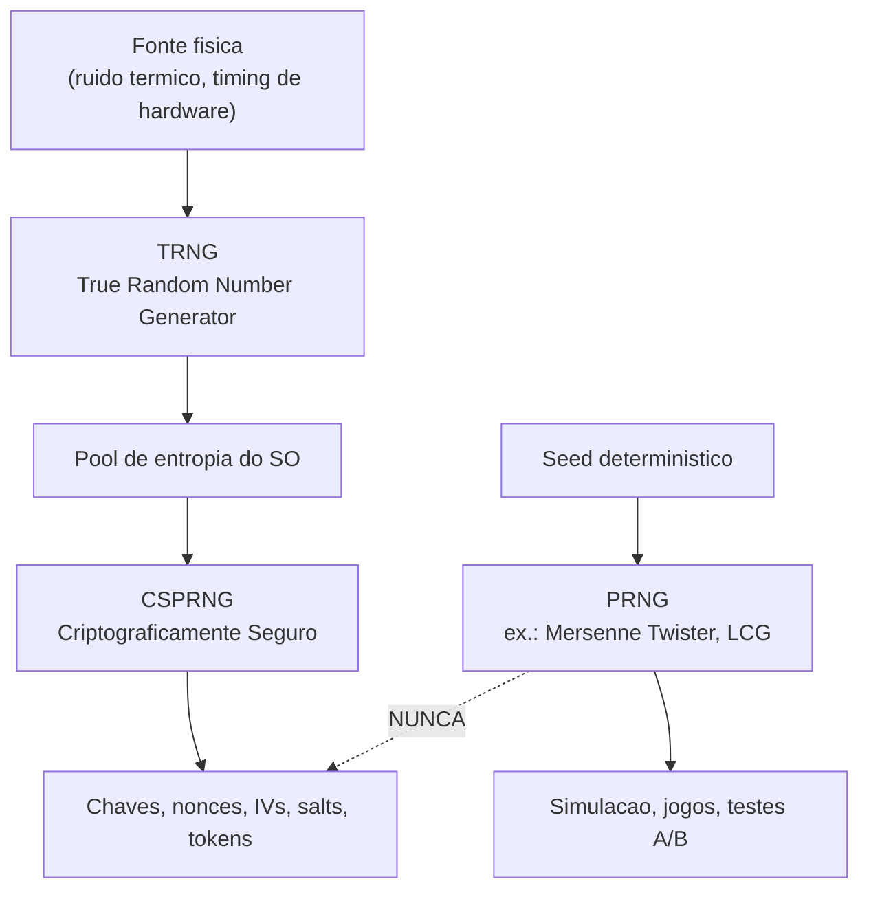
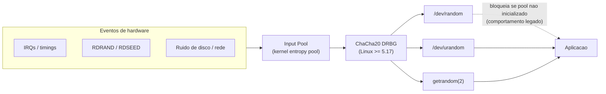
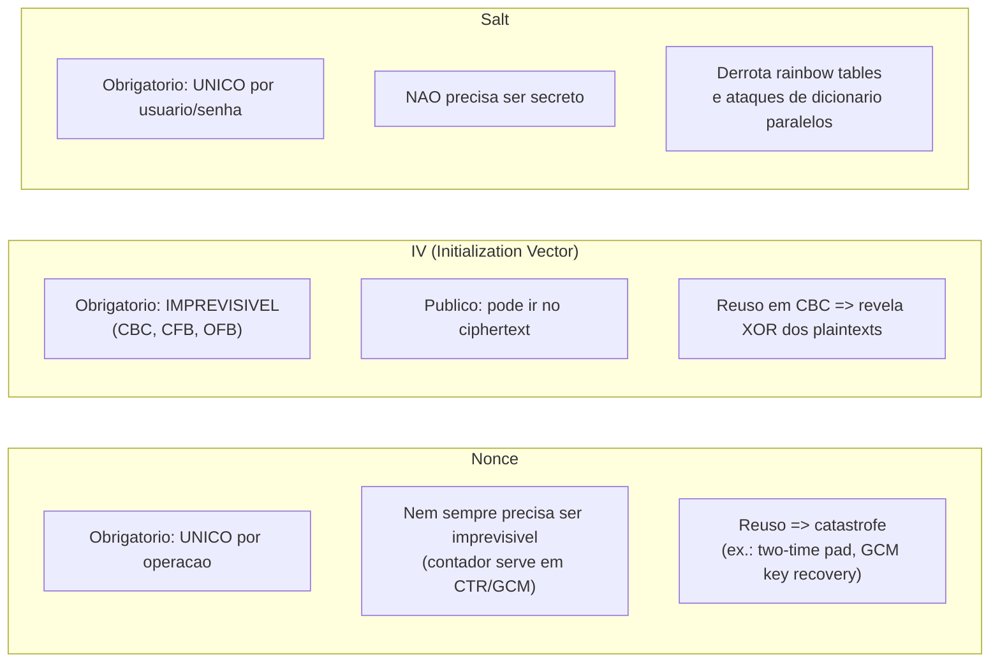
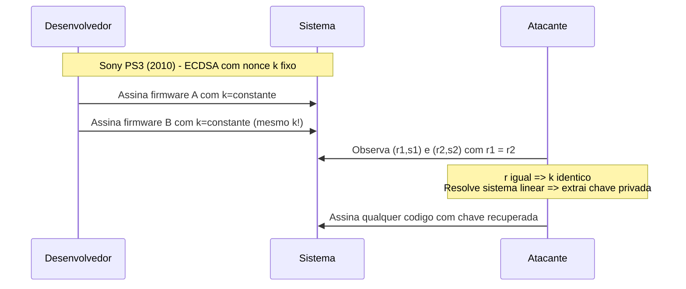
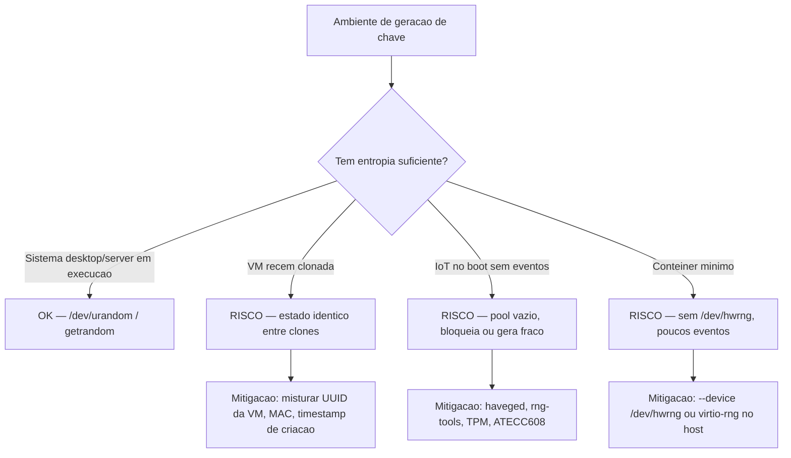

# Aleatoriedade e segredos

> [!abstract] TL;DR
> Toda a criptografia depende de uma premissa tácita: que os números gerados como segredos são genuinamente imprevisíveis. Quando essa premissa falha — por um patch descuidado, por uma implementação preguiçosa ou por um padrão sabotado — a matemática mais robusta do mundo não salva ninguém. Aleatoriedade de qualidade não é um detalhe de implementação; é o alicerce invisível de qualquer sistema seguro.

---

## Por que aleatoriedade importa antes de tudo

Imagine um cofre com 2¹²⁸ combinações possíveis. Se o fabricante, sem avisar ninguém, sempre entrega o cofre com uma das 300 mil combinações de um catálogo interno, não importa que a fechadura seja mecanicamente perfeita — o adversário não testa 2¹²⁸ possibilidades; testa 300 mil. Foi exatamente o que aconteceu com o Debian em 2008.

A criptografia moderna garante confidencialidade, integridade e autenticidade **assumindo que chaves, nonces e IVs são uniformemente aleatórios e imprevisíveis**. Quebrar essa suposição colapsa o sistema sem tocar nos algoritmos.

> [!important] A regra de ouro
> Uma chave de 128 bits só vale 128 bits de segurança se cada bit for independente e imprevisível. Se a semente que gerou a chave tem apenas 15 bits de entropia efetiva, a segurança real é 2¹⁵ — não 2¹²⁸.

---

## Entropia: imprevisibilidade medida em bits

**Entropia**, no sentido criptográfico, é a quantidade de incerteza (imprevisibilidade) de um valor. Shannon formalizou isso em 1948:

$$H(X) = -\sum_{i} p_i \log_2 p_i$$

Para um segredo criptográfico, o que interessa é a **entropia de min-entropy** — o logaritmo negativo da probabilidade do resultado mais provável. Um dado honesto de seis faces tem ≈ 2,58 bits de entropia de Shannon mas apenas log₂(1/6) ≈ 2,58 de min-entropy. Um dado viciado que cai em 6 com probabilidade 0,99 tem min-entropy ≈ 0,014 bits — é quase determinístico para o adversário.

A diferença entre Shannon entropy e min-entropy importa em cripto porque adversários não jogam na média; eles sempre escolhem o resultado mais provável. Por isso, algoritmos como AES e RSA são parametrizados em termos de min-entropy, não de Shannon entropy.

Para chaves criptográficas:
- **128 bits de segurança** → precisa de uma fonte com ≥ 128 bits de min-entropy.
- Usar apenas o relógio do sistema como semente → tipicamente < 20 bits de entropia efetiva.
- Usar PID + timestamp em microssegundos → ≈ 15–20 bits de espaço de busca real (Netscape, 1995).
- Pool de entropia do Linux em boot limpo de IoT → pode ter < 32 bits antes do primeiro evento de hardware.

### Quanto de entropia cada tipo de segredo precisa?

| Segredo | Min-entropy mínima recomendada | Tamanho típico |
|---|---|---|
| Chave AES-128 | 128 bits | 16 bytes |
| Chave AES-256 / ChaCha20 | 256 bits | 32 bytes |
| Token de sessão web | ≥ 128 bits | 16–32 bytes |
| Salt bcrypt/Argon2 | ≥ 128 bits (unicidade > sigilo) | 16 bytes |
| Nonce AES-GCM (96 bits) | ≥ 96 bits (unicidade > min-entropy) | 12 bytes |
| Chave privada Ed25519 | 256 bits | 32 bytes seed |
| Parâmetro DH efêmero | ≥ 128 bits | ≥ 256 bytes (group size) |

> [!tip] Heurística de entrevista
> "Entropia é o que um atacante **não sabe**. Quanto maior a entropia, maior o espaço que ele precisa varrer. Aleatoriedade criptográfica é entropia empacotada em bits — e min-entropy é a medida que importa, não a média de Shannon."

---

## PRNG × CSPRNG × TRNG — a taxonomia que salva empregos

Os três tipos resolvem problemas distintos. Confundi-los é o erro mais comum de implementação.



> [!info] Leitura do diagrama
> O fluxo superior (TRNG → pool → CSPRNG) é o caminho correto para material criptográfico. O PRNG convencional (fluxo inferior) só é aceitável para fins não-criptográficos. A seta tracejada com "NUNCA" marca o erro clássico: usar `Math.random()` ou `rand()` para gerar tokens de sessão.

### PRNG — deterministico e previsível

- **LCG (Linear Congruential Generator)**: `Xₙ₊₁ = (a·Xₙ + c) mod m`. Ciclo curto, retrodicável.
- **Mersenne Twister (MT19937)**: excelente para simulação e jogos; porém, com 624 saídas consecutivas de 32 bits, o estado interno inteiro é recuperável — e a partir daí todas as saídas futuras são previsíveis.
- `Math.random()` (JavaScript V8), `rand()` (C), `java.util.Random`: **proibidos para cripto**. Nenhum oferece garantias de forward secrecy ou resistência à recuperação de estado.

### CSPRNG — o mínimo aceitável para cripto

Um CSPRNG precisa satisfazer duas propriedades:

1. **Next-bit unpredictability**: conhecer os primeiros *k* bits não ajuda a prever o bit *k+1* com probabilidade > 50% + ε negligível.
2. **State compromise resilience**: mesmo que o estado interno vaze, não deve ser possível reconstruir saídas **anteriores** (backward secrecy) nem prever facilmente as futuras (forward secrecy, alcançada por rerandomização periódica).

Exemplos corretos por linguagem/SO:

| Contexto | Função correta |
|---|---|
| Linux/macOS | `getrandom(2)`, `/dev/urandom` |
| Python | `secrets.token_bytes()` |
| Java | `java.security.SecureRandom` |
| Node.js | `crypto.randomBytes()` |
| Go | `crypto/rand.Read()` |
| C/C++ | `getrandom()` ou `RAND_bytes()` (OpenSSL) |

### TRNG — entropia física

- Hardware Security Module (HSM), TPM, RDRAND (Intel), RDSEED: leem ruído físico (ruído térmico, jitter de oscilador, decaimento radioativo).
- O SO coleta entropia de eventos de hardware (timings de interrupções, movimentação de mouse, I/O de disco) para alimentar o pool de entropia — que por sua vez semeia o CSPRNG.

### Comparando as três classes

| Característica | PRNG | CSPRNG | TRNG |
|---|---|---|---|
| Determinístico? | Sim | Sim (dado estado) | Não |
| Previsível conhecendo estado? | Sim | Não | Não |
| Velocidade | Muito alta | Alta | Baixa |
| Boa para cripto? | Não | Sim | Sim (como semente) |
| Exemplo Linux | `rand()`, `drand48()` | `getrandom(2)`, `/dev/urandom` | `/dev/hwrng`, RDRAND |

---

## Fontes de entropia no SO — desmistificando `/dev/urandom`



> [!info] Leitura do diagrama
> Desde o Linux 5.17, `/dev/random` e `/dev/urandom` usam o mesmo CSPRNG (ChaCha20 DRBG). A diferença prática é que `/dev/random` ainda pode bloquear **antes de o pool ser inicializado pela primeira vez** — mas não bloqueia em sistemas em execução há mais de alguns segundos. `getrandom(2)` (disponível desde Linux 3.17) bloqueia somente até a inicialização, depois retorna sem bloqueio — é a API recomendada para código novo.

### O mito do `/dev/urandom` perigoso

Por anos, a documentação sugeria que `/dev/urandom` era "menos seguro" por não bloquear. Isso era verdade apenas em um cenário específico: **imediatamente após o boot**, antes de o pool de entropia ser inicializado. Em qualquer outro momento, `/dev/urandom` e `/dev/random` são equivalentes em segurança prática. Theodore Ts'o (mantenedor do RNG do Linux) confirmou isso em vários posts técnicos.

O **problema real é o boot em ambientes com pouca entropia**:
- VMs que clonadas com estado idêntico podem gerar as mesmas chaves.
- Dispositivos IoT que nunca veem eventos de hardware aleatórios (disco, rede, mouse) antes de gerar sua primeira chave SSH.
- Contêineres mínimos sem acesso a `/dev/hwrng` ou equivalente.

O paper "Mining Your Ps and Qs" (Heninger et al., USENIX Security 2012) documentou isso em escala: 0,5% dos hosts TLS tinham chaves RSA com fatores primos compartilhados — resultado direto de entropia insuficiente no momento da geração da chave. O ataque é elegante: se dois hosts independentes geraram chaves RSA fracas compartilhando um dos primos, `gcd(N₁, N₂)` revela imediatamente o fator primo comum, quebrando ambas as chaves sem nenhuma força bruta.

> [!question] Por que RSA é tão sensível à entropia no boot?
> Gerar uma chave RSA exige dois primos `p` e `q` grandes e aleatórios. Se o pool de entropia está vazio no boot, o CSPRNG pode repetir a mesma sequência em máquinas diferentes — gerando o mesmo `p` em duas chaves distintas. `gcd(N₁, N₂) = p` é computável em milissegundos mesmo para chaves de 2048 bits. É por isso que chaves RSA geradas em dispositivos IoT sem fonte de entropia adicional são estruturalmente fracas.

---

## Nonce, IV, salt — o trio confundido em toda entrevista

Três conceitos distintos que partilham a palavra "aleatório" mas têm requisitos radicalmente diferentes.



> [!info] Leitura do diagrama
> Os três blocos mostram os requisitos mínimos de cada primitivo. Note que salt não precisa de sigilo — só de unicidade. IV precisa de imprevisibilidade. Nonce precisa de unicidade mas nem sempre de imprevisibilidade (depende do modo de operação).

### Consequências do reuso

| Primitivo | O que quebra com reuso |
|---|---|
| Nonce em AES-GCM | Recuperação da chave de autenticação GHASH → forja mensagens |
| IV em AES-CBC | `C₁ ⊕ C₂ = P₁ ⊕ P₂` — relação entre plaintexts vaza |
| Nonce ECDSA (k) | Chave privada recuperável com álgebra simples (caso PS3) |
| Salt em bcrypt | Dois usuários com mesma senha têm mesmo hash → lookup table volta a funcionar |

### Salt e hashing de senha

O salt não é segredo — ele vai armazenado junto com o hash (ex.: `$2b$12$<22-chars-salt><31-chars-hash>` em bcrypt). O objetivo é forçar o atacante a executar a função de derivação cara **separadamente para cada usuário**, tornando ataques em paralelo com tabelas pré-computadas inviáveis. Detalhes em [[06 - Hashing criptográfico]].

### Nonce em DH e troca de chaves

Em protocolos de troca de chaves como TLS 1.3, tanto cliente quanto servidor contribuem com nonces para o handshake. Esses nonces garantem que cada sessão derive material de chave único — mesmo que as chaves de longo prazo sejam idênticas. O nonce do servidor, em particular, é o principal mecanismo de defesa contra ataques de replay: um adversário que grava o handshake e o reenvia recebe um nonce diferente do servidor e falha na derivação da chave de sessão. A aleatoriedade aqui não é sobre confidencialidade direta, mas sobre **freshness** — garantir que a conversa está acontecendo agora, não reproduzida de um momento anterior.

---

## Casos canônicos — quando a aleatoriedade falhou



> [!info] Leitura do diagrama
> Quando `k` é fixo em ECDSA, `r = (k·G).x` é igual em todas as assinaturas. Com dois pares `(r, s₁)` e `(r, s₂)` do mesmo `r`, a chave privada `d` é recuperável por álgebra linear simples: `d = (s₁·h₂ - s₂·h₁) / (s₂ - s₁) mod n`. Isso exigiu exatamente zero força bruta.

### Linha do tempo dos desastres

| Ano | Incidente | Raiz da falha | Impacto |
|---|---|---|---|
| 1995 | Netscape SSL | Seed = PID + timestamp (< 20 bits de entropia) | Sessões SSL quebráveis em segundos |
| 2008 | Debian OpenSSL (CVE-2008-0166) | Patch removeu duas linhas de seed; só PID restou; 294.912 chaves possíveis | Chaves RSA/DSA/EC previsíveis; reemissão em massa |
| 2010 | Sony PS3 ECDSA (27C3, fail0verflow) | Nonce `k` fixo em todas as assinaturas | Chave privada da Sony recuperada; homebrew irrestrito |
| 2012 | Chaves RSA em IoT (Mining Your Ps and Qs) | Entropia insuficiente no boot; chaves com fator primo comum | 0,5% de hosts TLS com chave privada RSA recuperável via GCD |
| 2013 | Dual_EC_DRBG (NIST SP 800-90A) | Backdoor suspeito: relação entre pontos P e Q conhecida pela NSA | CSPRNG "padrão" comprometido; RSA BSAFE afetado |

> [!danger] Dual_EC_DRBG — o CSPRNG sabotado
> O Dual Elliptic Curve DRBG foi padronizado pela NIST em SP 800-90A em 2006. Em 2007, Dan Shumow e Niels Ferguson (da Microsoft) mostraram que se alguém conhecesse o logaritmo discreto `e` tal que `Q = e·P` (onde P e Q são os pontos da curva fixados no padrão), esse alguém poderia prever todas as saídas futuras com apenas 32 bytes de observação. Os documentos Snowden em 2013 confirmaram que a NSA inseriu deliberadamente os parâmetros P e Q. O algoritmo foi retirado do NIST SP 800-90A em abril de 2014.

---

## Gerando segredos corretamente na prática

> [!example] Exemplos canônicos por linguagem

**Python** — tokens de sessão e chaves:
```python
import secrets

# Token de sessão URL-safe (256 bits de entropia)
token = secrets.token_urlsafe(32)   # 32 bytes = 256 bits

# Chave AES-256
key = secrets.token_bytes(32)

# NUNCA: random.randint(0, 2**256) — PRNG, não CSPRNG
```

**Java** — `SecureRandom`:
```java
import java.security.SecureRandom;

// Não seede manualmente; o SO provê entropia
SecureRandom rng = new SecureRandom();
byte[] key = new byte[32];          // 256 bits
rng.nextBytes(key);

// NUNCA: new Random().nextBytes(key)
```

**Node.js**:
```javascript
const { randomBytes } = require('crypto');

// 32 bytes = 256 bits de entropia
const sessionToken = randomBytes(32).toString('hex');

// NUNCA: Math.random()
```

**Go**:
```go
import "crypto/rand"

key := make([]byte, 32)
if _, err := rand.Read(key); err != nil {
    panic(err)
}
// math/rand é PROIBIDO para cripto
```

**Linux/C** (sem libssl):
```c
#include <sys/random.h>

unsigned char key[32];
// getrandom bloqueia até o pool ser inicializado
ssize_t n = getrandom(key, sizeof(key), 0);
if (n != sizeof(key)) { /* erro */ }
```

---

## Entropia em ambientes problemáticos



> [!info] Leitura do diagrama
> O caminho da esquerda (sistema desktop/servidor em operação normal) é seguro — o pool de entropia está cheio de eventos de hardware acumulados. Os três caminhos do lado direito são cenários reais de produção onde chaves fracas foram geradas: VMs clonadas (problema documentado em infraestrutura de cloud), dispositivos IoT no primeiro boot (Mining Your Ps and Qs) e contêineres mínimos sem acesso a hardware de entropia.

---

## Como auditar código que gera segredos

A maioria das vulnerabilidades de aleatoriedade fraca é detectável em revisão de código com um checklist simples. Em entrevistas de segurança, demonstrar essa visão de auditoria é um diferencial.

> [!bug] Sinais de alerta em revisão de código

**1. Uso de PRNG não-criptográfico para material sensível:**
```python
# RUIM — detecção em grep
import random
token = random.randint(0, 2**128)  # PRNG; previsível

# BOM
import secrets
token = secrets.token_bytes(16)
```

**2. Semeadura manual com valores previsíveis:**
```java
// RUIM — seed fixo torna o CSPRNG determinístico
SecureRandom rng = new SecureRandom(new byte[]{42});

// RUIM — seed baseado em tempo; espaço ≈ 2³² se PID + ms
long seed = System.currentTimeMillis() ^ pid;
Random rng = new Random(seed);
```

**3. Reuso de nonce ou IV:**
```python
# RUIM — IV fixo em CBC
IV = b'\x00' * 16
cipher = AES.new(key, AES.MODE_CBC, IV)  # todos os plaintexts com o mesmo IV

# BOM — IV gerado por mensagem
IV = secrets.token_bytes(16)
cipher = AES.new(key, AES.MODE_CBC, IV)
```

**4. Salt ausente ou constante em hashing de senha:**
```python
# RUIM — sem salt; rainbow table funciona
hashlib.sha256(password.encode()).hexdigest()

# RUIM — salt constante; ainda permite ataques em paralelo
hashlib.sha256(b"static_salt" + password.encode()).hexdigest()

# BOM — bcrypt com salt automático por usuário
bcrypt.hashpw(password.encode(), bcrypt.gensalt())
```

### Ferramentas de análise estática

Ferramentas como Semgrep e Bandit (Python) têm regras específicas para detectar uso de `random` em contextos sensíveis. Em pipelines de CI, executar:
```bash
bandit -r . -t B311  # Detecta uso de random não-criptográfico
semgrep --config=p/secrets  # Regras para detecção de segredos fracos
```

Não substituem revisão humana, mas capturam os erros mais óbvios.

---

## Requisitos distintos em cada primitivo — tabela de referência rápida

| Primitivo | Único? | Secreto? | Imprevisível? | Onde vai? | Falha se... |
|---|---|---|---|---|---|
| Chave simétrica | — | **Sim** | **Sim** | Cofre / KMS | Gerada com PRNG → recuperável |
| Nonce (CTR/GCM) | **Sim** | Não (geralmente) | Depende do modo | Junto ao ciphertext | Reusado → two-time pad / key recovery |
| IV (CBC) | **Sim** | Não | **Sim** | Junto ao ciphertext | Previsível → ataques BEAST / CRIME |
| Salt (hashing) | **Sim** | Não | Não obrigatório | Junto ao hash | Omitido → rainbow tables voltam |
| Nonce ECDSA (k) | **Sim** | **Sim** | **Sim** | Nunca exposto | Fixo ou repetido → chave privada vaza |
| Token de sessão | **Sim** | **Sim** | **Sim** | Cookie / header | Curto → força bruta; PRNG → previsível |

---

## Casos práticos

Duas situações concretas amarram tudo que foi visto até aqui — uma de auditoria retroativa (o que fazer quando você descobre entropia fraca já em produção) e outra de projeto novo (como decidir a fonte de aleatoriedade antes de escrever a primeira linha).

**Cenário 1 — herdando um parque de chaves geradas no Debian entre 2006 e 2008.** Você assume a manutenção de um sistema legado e descobre, em auditoria, servidores com chaves SSH e certificados TLS gerados nesse intervalo — exatamente a janela do CVE-2008-0166 descrito em [[#Casos canônicos — quando a aleatoriedade falhou|Casos canônicos]]. O diagnóstico correto não é "trocar a senha"; é reconhecer que o **espaço de chaves inteiro** (294.912 combinações possíveis por tipo/tamanho de chave) está publicamente catalogado — qualquer atacante pode gerar a lista completa e testar cada uma em segundos contra o host. A ação correta é regenerar **todas** as chaves e certificados emitidos no período usando um CSPRNG adequado, revogar os certificados antigos, e verificar se algum log de acesso coincide com uma das chaves da lista pública do Debian. Auditar "qual algoritmo foi usado" não basta — o algoritmo (RSA, DSA) estava correto; a falha estava inteiramente na camada de entropia, invisível a quem só olha o código de assinatura.

**Cenário 2 — decidindo como gerar tokens de sessão para uma API nova.** A tentação comum é reaproveitar o gerador de números que já está importado no projeto (`Math.random()` em Node, `random` em Python) porque "já funciona" para IDs de UI. A decisão correta segue a tabela de requisitos: um token de sessão precisa ser único, secreto e imprevisível — as três colunas marcadas "Sim" na linha "Token de sessão" da tabela de referência acima. Isso descarta qualquer PRNG de propósito geral de saída. Na prática, isso significa `secrets.token_urlsafe(32)` em Python, `crypto.randomBytes(32)` em Node ou `SecureRandom` em Java — os mesmos exemplos de código já vistos em [[#Gerando segredos corretamente na prática|Gerando segredos corretamente na prática]] — com 256 bits de entropia, gerados uma única vez por sessão e nunca derivados de contadores ou timestamps.

## Armadilhas comuns

> [!warning] Semeadura manual do CSPRNG
> `SecureRandom` em Java **não deve ser semeado manualmente** em produção. Chamar `new SecureRandom(seed)` com uma seed fraca desfaz todas as garantias do CSPRNG — o gerador volta a ser tão previsível quanto a seed escolhida. Deixe o SO fornecer a entropia.

> [!warning] Confiar só no RDRAND da Intel
> A instrução `RDRAND` extrai bits diretamente do RNG de hardware embutido no processador — é conveniente e rápida, mas usá-la como **única** fonte de entropia exige confiar integralmente na Intel. O kernel Linux a trata como uma das fontes do pool, nunca como a única. Para aplicações paranóicas (HSMs, carteiras de criptomoedas de alta segurança), misture fontes independentes: RDRAND ⊕ ruído de disco ⊕ dados de rede.

> [!warning] `fork()` sem rerandomização
> Em ambientes que fazem `fork()` após inicializar um CSPRNG, o processo filho pode herdar o mesmo estado do gerador — e, a partir daí, produzir a mesma sequência "aleatória" que o pai. CSPRNGs modernos de SO (como o do Linux) detectam fork via `getentropy()`/`getrandom()` e rerandomizam automaticamente, mas bibliotecas de espaço de usuário nem sempre fazem isso. Verifique o comportamento da sua biblioteca antes de usar em servidores multi-processo.

---

## O que vem a seguir

Esta nota tratou aleatoriedade como o alicerce invisível: a garantia de que um segredo não pode ser adivinhado. A próxima camada da pilha criptográfica assume esse alicerce como dado e faz uma pergunta complementar — como transformar um segredo (ou qualquer dado) em uma impressão digital fixa, verificável e (idealmente) impossível de reverter. É aí que entra [[06 - Hashing criptográfico]]: o mesmo cuidado com min-entropy que vimos aqui reaparece lá na forma de salt (que só funciona se for único, o que exige justamente um bom CSPRNG) e na resistência a colisões, que depende da mesma imprevisibilidade estatística discutida na seção sobre entropia. Sem uma fonte confiável de aleatoriedade, nem hashing nem cifragem simétrica seguram a barra — por isso esta é a primeira nota do galho, não um apêndice.

- Anterior: [[04 - Princípios de design seguro]]
- Próxima: [[06 - Hashing criptográfico]]
- Cross-links: [[07 - Criptografia simétrica]] (IVs e modos de operação em detalhes), [[15 - Ataques a sistemas cripto]] (two-time pad, nonce reuse attacks, state recovery)
- Fora do domínio: [[03-Dominios/Ciência/Matemática para Computação/21 - O acaso na computação - estruturas e algoritmos aleatorizados|O acaso na computação]] — a mesma aleatoriedade que aqui protege chaves e nonces também sustenta algoritmos aleatorizados (quicksort randomizado, hashing universal, Monte Carlo); a diferença é que lá o objetivo é desempenho esperado, aqui é imprevisibilidade garantida mesmo no pior caso adversarial.

> [!tip] Vídeo — o backdoor do Dual_EC_DRBG explicado
> [Elliptic Curve Back Door - Computerphile](https://www.youtube.com/watch?v=nybVFJVXbww) (Computerphile, 12min23s) detalha, com quadro e caneta, exatamente o mecanismo por trás do caso Dual_EC_DRBG citado acima: como a relação matemática entre os pontos P e Q da curva elíptica permite prever a saída do gerador a quem conhece o logaritmo discreto que os liga — e por que isso é indistinguível de um CSPRNG legítimo para quem só vê a saída de fora.

> [!summary] Resumo em uma linha
> Aleatoriedade criptográfica é entropia empacotada em bits: use sempre um CSPRNG alimentado pelo SO (`getrandom`, `SecureRandom`, `crypto.randomBytes`), entenda os requisitos distintos de nonces, IVs e salts, e nunca confie em fontes de entropia fracas — a história mostra que quem errou aqui perdeu tudo.

---

## Em entrevista

Quando o tema "aleatoriedade" aparece em entrevista de segurança, o sinal que diferencia o candidato senior é ir além de "use uma biblioteca segura" e explicar **por quê** e **o que quebra** quando não se faz isso.

Frases de alto impacto (use em inglês em entrevistas internacionais):

- *"Cryptographic security is only as strong as the randomness used to generate keys and nonces — weak entropy collapses the effective key space from 2¹²⁸ to something brute-forceable."*
- *"A CSPRNG must satisfy next-bit unpredictability and state compromise resilience — properties that Mersenne Twister and LCG explicitly do not provide."*
- *"The Debian OpenSSL bug shows that removing two lines of seeding code reduced 294,912 possible RSA keys — math was fine, entropy wasn't."*
- *"Nonce, IV, and salt sound interchangeable but have distinct requirements: a nonce just needs to be unique, a CBC IV needs to be unpredictable, and a salt just needs to be per-user — confusing them leads to broken systems."*
- *"The PS3 ECDSA break required zero brute force — a fixed nonce k in two signatures lets you solve for the private key with high-school algebra."*

**Vocabulário PT → EN:**

| PT | EN |
|---|---|
| Entropia | Entropy |
| Aleatoriedade | Randomness |
| Gerador pseudoaleatório | Pseudo-random number generator (PRNG) |
| Gerador criptograficamente seguro | Cryptographically secure PRNG (CSPRNG) |
| Número usado uma vez | Nonce |
| Vetor de inicialização | Initialization vector (IV) |
| Sal (hashing de senhas) | Salt |
| Fonte de entropia | Entropy source |
| Pool de entropia | Entropy pool |
| Rerandomização de estado | State reseed / state rerandomization |
| Semente | Seed |
| Previsibilidade de próximo bit | Next-bit unpredictability |
| Segredo por encaminhamento | Forward secrecy |

---

## Fontes

- **RFC 4086** — "Randomness Requirements for Security" (IETF, junho 2005): [https://www.rfc-editor.org/rfc/rfc4086](https://www.rfc-editor.org/rfc/rfc4086) — documento normativo fundamental sobre fontes de entropia e requisitos de CSPRNGs.
- **Heninger, Durumeric, Wustrow, Halderman** — "Mining Your Ps and Qs: Detection of Widespread Weak Keys in Network Devices" (USENIX Security 2012): [https://www.usenix.org/conference/usenixsecurity12/technical-sessions/presentation/heninger](https://www.usenix.org/conference/usenixsecurity12/technical-sessions/presentation/heninger) — varredura da Internet revelou 0,5% dos servidores TLS com chaves RSA fracas por entropia insuficiente no boot.
- **Debian DSA-1571** — CVE-2008-0166 (Debian Security Advisory, maio 2008): [https://www.debian.org/security/2008/dsa-1571](https://www.debian.org/security/2008/dsa-1571) — dois anos de chaves OpenSSL previsíveis no Debian; apenas PID como seed.
- **fail0verflow** — "Console Hacking 2010: PS3 Epic Fail" (27C3, dezembro 2010): [https://www.youtube.com/watch?v=LP1t_pzxKyE](https://www.youtube.com/watch?v=LP1t_pzxKyE) — demonstração ao vivo da recuperação da chave privada da Sony via nonce ECDSA fixo.
- **Wikipedia — Dual_EC_DRBG**: [https://en.wikipedia.org/wiki/Dual_EC_DRBG](https://en.wikipedia.org/wiki/Dual_EC_DRBG) — histórico completo do CSPRNG com backdoor suspeito da NSA, padronizado pelo NIST e retirado em 2014.
- **Goldberg & Wagner** — "Randomness and the Netscape Browser" (Dr. Dobb's Journal, janeiro 1996): [https://people.eecs.berkeley.edu/~daw/papers/ddj-netscape.html](https://people.eecs.berkeley.edu/~daw/papers/ddj-netscape.html) — análise de como o Netscape usava PID + timestamp como seed SSL, quebrável em segundos.
