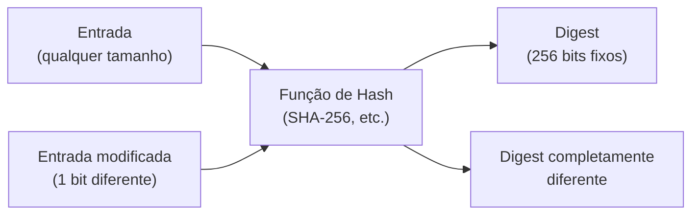
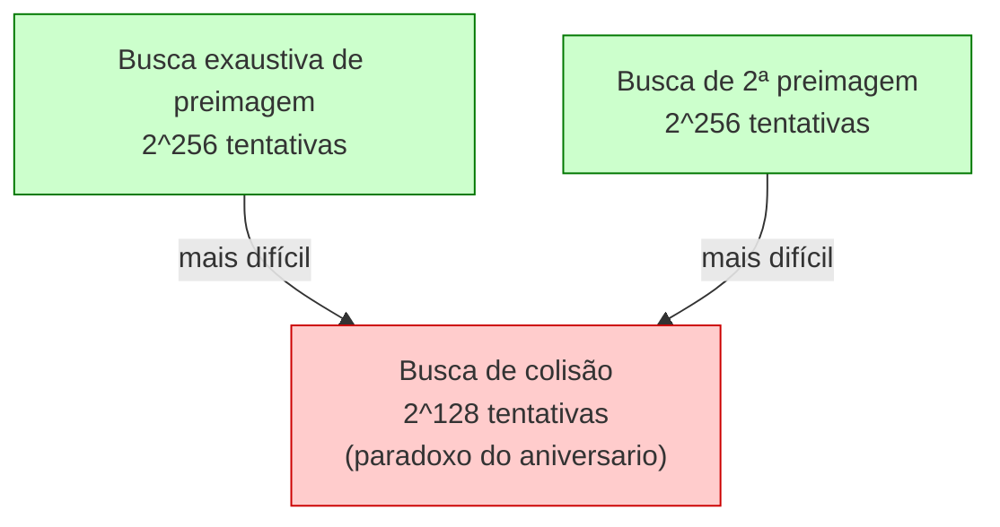
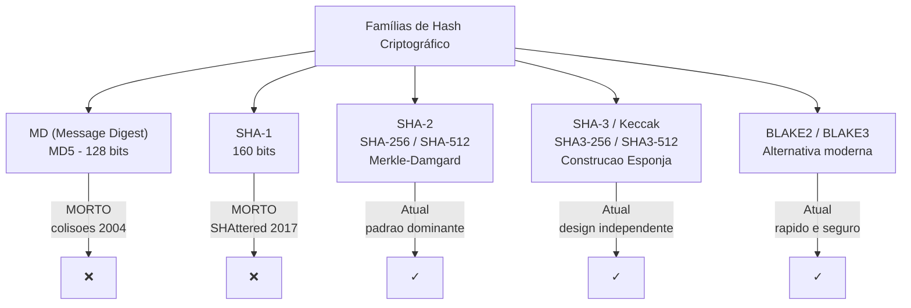
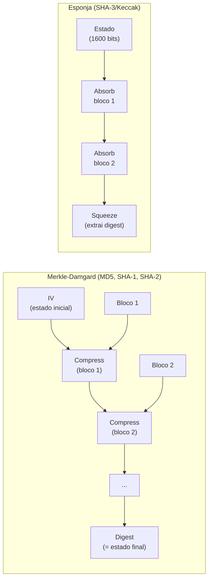
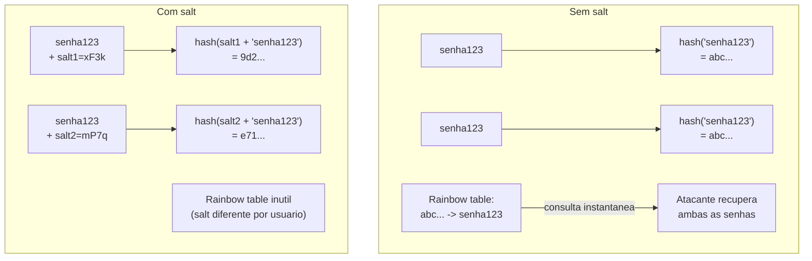
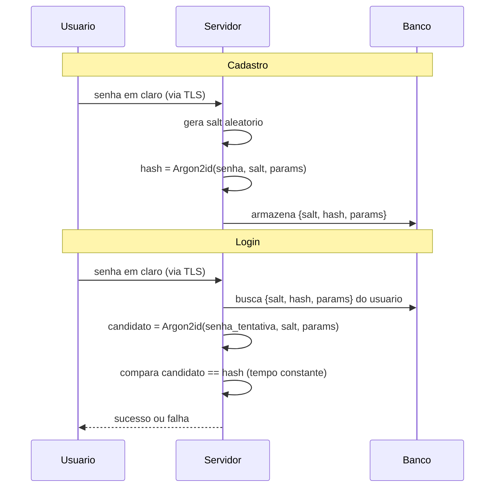

# Hashing criptográfico

> [!abstract] TL;DR
> Uma função de hash criptográfica transforma qualquer entrada em uma saída de tamanho fixo, de forma determinística e irreversível. As três propriedades que a definem — resistência à preimagem, resistência à 2ª preimagem e resistência à colisão — são a base de integridade, compromissos, MACs e Merkle trees. Mas o erro clássico de entrevista é usar SHA-256 puro para armazenar senhas: senhas exigem algoritmos lentos, com salt e custo ajustável — Argon2id é o padrão atual.

---

## O que é uma função de hash criptográfica

Em 2012, o malware Flame circulou disfarçado de atualização legítima do Windows Update dentro da própria rede da Microsoft. O truque: seus criadores tinham forjado um certificado de assinatura de código explorando uma colisão MD5 — dois blocos de dados diferentes que produziam o mesmo hash. Cinco anos depois, pesquisadores do Google publicaram dois arquivos PDF com conteúdo visivelmente distinto e o mesmo hash SHA-1, encerrando de vez o uso do algoritmo em certificados TLS. Nos dois casos, o que quebrou não foi a criptografia da mensagem — foi a promessa de que "hashes iguais só acontecem para entradas iguais". Entender essa promessa, e como ela é medida, evita repetir o erro clássico de projetar um sistema em cima de um hash que já não a cumpre mais.

Uma função de hash criptográfica é uma função matemática que aceita uma entrada de tamanho arbitrário e produz uma saída de tamanho fixo, chamada de *digest* ou simplesmente hash.

Três características estruturais definem o que ela é — antes de falarmos sobre segurança:

- **Determinística**: a mesma entrada sempre produz a mesma saída. `SHA-256("abc")` é sempre `ba7816bf8f01cfea414140de5dae2ec73b00361bbef0469348423f656b0f5a35` em qualquer máquina, em qualquer momento.
- **Computacionalmente eficiente**: calcular `hash(m)` para qualquer `m` é rápido — da ordem de microssegundos para mensagens comuns.
- **Saída de tamanho fixo**: independente de a entrada ter 1 byte ou 10 GB, o digest tem sempre o mesmo tamanho (ex.: 256 bits para SHA-256).
- **Efeito avalanche**: alterar 1 bit da entrada muda em média ~50% dos bits da saída — a saída parece aleatória e não guarda relação aparente com a entrada original.

Esse último ponto é o que distingue hash criptográfico de simples checksum. CRC-32 detecta erros acidentais, mas um adversário pode modificar a mensagem e ajustar o CRC para coincidir — ele não tem resistência adversarial. A propriedade adicional que exigimos de um hash criptográfico é exatamente essa: resistência a adversários inteligentes que tentam manipular os dados.

> [!example] Efeito avalanche na prática
> - `SHA-256("abc")` = `ba7816bf...`
> - `SHA-256("abd")` = `a48e2ba2...`
>
> Mudamos apenas 1 caractere (c → d), que representa uma diferença de 1 bit no encoding ASCII. O resultado é irreconhecível — ~50% dos bits mudaram. Isso garante que qualquer adulteração, por mínima que seja, produz um digest completamente diferente.

> [!info] Leitura do diagrama
> Duas entradas ligeiramente diferentes (diferindo em 1 bit) chegam à mesma função de hash e produzem digests completamente distintos — isso é o efeito avalanche. Não há seta de volta: o digest não revela a entrada.

> [!tip] Assista: Hashing Algorithms and Security — Computerphile
> **Canal:** Computerphile | **Duração:** ~8min | **Idioma:** EN
>
> Visão geral de por que hash resolve o problema de verificar que um arquivo chegou intacto sem precisar comparar o arquivo inteiro byte a byte, e o que muda quando essa garantia é quebrada por colisões — a mesma virada de perspectiva que esta nota segue, do "o que é" para "o que pode dar errado".
> Trecho de destaque [1:58]: *"the requirement is that if you change one bit anywhere in the file — at the start, at the middle, at the end — then the whole hash should be completely different. This is something called the avalanche effect."*
>
> 🎬 [Assistir no YouTube](https://youtu.be/b4b8ktEV4Bg)

---

## As três propriedades de segurança

Essas três propriedades têm nomes precisos e são cobradas em entrevista. Decorar os nomes sem entender a diferença é um erro comum.

### 1 — Resistência à preimagem (one-wayness)

> Dado um digest `h`, é computacionalmente inviável encontrar qualquer mensagem `m` tal que `hash(m) = h`.

Em outras palavras: o hash é uma via de mão única. Você pode computá-lo, mas não pode inverter.

### 2 — Resistência à segunda preimagem

> Dada uma mensagem `m₁`, é computacionalmente inviável encontrar uma mensagem diferente `m₂ ≠ m₁` tal que `hash(m₁) = hash(m₂)`.

Essa propriedade protege integridade: dado um documento específico, um adversário não consegue criar outro documento com o mesmo hash.

### 3 — Resistência à colisão

> É computacionalmente inviável encontrar **qualquer** par `m₁ ≠ m₂` tal que `hash(m₁) = hash(m₂)`.

Note a diferença: aqui o adversário tem liberdade total — escolhe os dois documentos. Isso é mais fácil de quebrar do que as duas propriedades anteriores.

Por que colisão é mais fácil de quebrar que preimagem — e por que isso engana até quem já decorou os três nomes — está detalhado em [[#Armadilhas comuns|Armadilhas comuns]] (paradoxo do aniversário).

> [!info] Leitura do diagrama
> As três propriedades têm custos diferentes para um atacante. Colisão é a mais barata (2^(n/2)); preimagem e 2ª preimagem custam 2^n. É por isso que colisões práticas aparecem primeiro quando uma função começa a enfraquecer.

---

## Hash ≠ cifra ≠ checksum

Esse é um triângulo de confusões recorrente.

| Primitiva | Chave? | Reversível? | Resistência adversarial? | Uso típico |
|---|---|---|---|---|
| Hash criptográfico | Não | Não | Sim | Integridade, compromissos |
| Cifra simétrica | Sim | Sim (com chave) | Sim | Confidencialidade |
| Checksum (CRC) | Não | Não | Não | Detecção de erros acidentais |
| MAC/HMAC | Sim (chave simétrica) | Não | Sim | Autenticação + integridade |

Um hash não é para "esconder e recuperar" — se você precisa recuperar a informação original, use criptografia. Se você precisa detectar apenas erros acidentais (transmissão), CRC é suficiente e mais rápido. Se você precisa que apenas quem tem uma chave possa verificar o digest, use HMAC (ver [[10 - MAC, HMAC e assinaturas digitais]]).

---

## As famílias de algoritmos

> [!info] Leitura do diagrama
> MD5 e SHA-1 estão mortos para fins de segurança — não apenas "deprecated", mas ativamente quebrados com ataques práticos publicados. SHA-2 continua seguro e é o padrão dominante. SHA-3 e BLAKE2/3 são alternativas com designs diferentes, úteis quando você precisa de uma construção com propriedades distintas.

### MD5 — morto (colisões 2004)

Em agosto de 2004, Xiaoyun Wang, Dengguo Feng, Xuejia Lai e Hongbo Yu publicaram as primeiras colisões práticas para o MD5 completo, por criptanálise diferencial — não força bruta. A resistência de colisão efetiva caiu de `2⁶⁴` para algo muito menor, e a morte do algoritmo foi rápida a partir daí: em 2005 apareceram certificados X.509 forjados com o mesmo hash, em 2006 uma colisão levava minutos num notebook, e em 2012 o dano chegou à produção com o malware Flame (caso completo em [[#Casos práticos|Casos práticos]]).

> [!danger] Uso atual de MD5
> MD5 ainda aparece em checksums não adversariais (verificação de download casual, deduplicação interna) por ser rápido. Qualquer uso em contexto de segurança — assinatura, certificado, autenticação, hash de senha — é uma vulnerabilidade ativa. Projetos legados que ainda usam MD5 para autenticação devem ser migrados urgentemente.

### SHA-1 — morto (SHAttered, 2017)

Em fevereiro de 2017, pesquisadores do CWI Amsterdam e do Google publicaram o ataque **SHAttered**: a primeira colisão prática e pública para o SHA-1 completo, verificável publicamente em https://shattered.io (caso completo em [[#Casos práticos|Casos práticos]]). Browsers, CAs e sistemas de controle de versão abandonaram SHA-1 rapidamente.

> [!note] Aviso prático
> Certificados TLS com SHA-1 foram bloqueados pelos browsers modernos desde 2017. SVN e outros sistemas legados que ainda usam SHA-1 para integridade de repositório têm risco limitado (pois colisão requer controle de ambos os documentos — difícil em repositórios com histórico imutável), mas qualquer uso novo de SHA-1 é tecnicamente insustentável.

### SHA-2 — atual e seguro

SHA-2 (NIST FIPS 180-4) inclui SHA-224, SHA-256, SHA-384, SHA-512, SHA-512/224 e SHA-512/256. SHA-256 é o mais usado — é o padrão de facto para integridade de arquivos, certificados TLS, assinaturas de código e blockchains. SHA-512 é mais rápido em processadores 64-bit para mensagens grandes. Construção Merkle-Damgård. Nenhum ataque prático conhecido contra a função completa. A resistência de segurança efetiva: preimagem em `2²⁵⁶`, colisão em `2¹²⁸`.

### SHA-3 / Keccak — design independente

SHA-3 (NIST FIPS 202) venceu a competição pública de 2007–2012 e é baseado no algoritmo Keccak, criado por Guido Bertoni, Joan Daemen, Michaël Peeters e Gilles Van Assche. Usa uma **construção esponja** — design radicalmente diferente de Merkle-Damgård — o que torna os dois independentes: um ataque que compromete SHA-2 não afeta SHA-3, e vice-versa. O NIST adotou SHA-3 não por insegurança do SHA-2, mas para ter diversidade estrutural. As variantes incluem SHA3-224, SHA3-256, SHA3-384, SHA3-512 e as XOFs SHAKE128/SHAKE256 (saída de tamanho variável). Mais lento que SHA-2 em software de propósito geral.

### BLAKE2 / BLAKE3

Alternativas modernas mais rápidas que MD5 em software 64-bit, com segurança comparável a SHA-3. BLAKE2b é a variante para 64-bit; BLAKE2s para 32-bit/embedded. BLAKE3 usa uma árvore de Merkle internamente e é paralelizável — consegue usar múltiplos núcleos de CPU para digests de arquivos grandes. Amplamente adotado em ferramentas de linha de comando (`b3sum`), sistemas de build, deduplicação e contextos onde velocidade + segurança são ambas necessárias. Argon2 usa BLAKE2 internamente.

---

## Construções internas: Merkle-Damgård vs. Esponja

Entender a construção interna de SHA-2 e SHA-3 não é detalhe de implementação — é o que explica por que certas combinações com hash são inseguras (length extension) e por que os dois padrões são verdadeiramente independentes em caso de ataques criptanalíticos.

### Merkle-Damgård

A construção Merkle-Damgård (MD), que fundamenta MD5, SHA-1 e SHA-2, funciona assim:

1. A mensagem é padded a um múltiplo do tamanho de bloco (e o comprimento da mensagem original é incluído no padding — crucial para a segurança).
2. Um estado inicial fixo (IV — Initialization Vector) é combinado com o primeiro bloco via função de compressão `f`.
3. O resultado é o novo estado, que é combinado com o bloco seguinte, e assim por diante.
4. O digest final é exatamente o **estado interno** após o último bloco.

O problema: o estado interno após o último bloco é o próprio digest. Dado o digest, um atacante sabe o estado interno e pode continuar o processo — processando blocos adicionais como se fossem a continuação da mensagem original. Isso é o length extension attack.

> [!info] Leitura do diagrama
> Em Merkle-Damgård, o digest final é exatamente o estado interno após processar o último bloco. Em construções esponja, há uma fase de absorção (processar a entrada) seguida de uma fase de extração (squeeze) — o estado interno tem mais bits que a saída, o que impede ataques de extensão.

O length extension attack — a consequência prática de o digest do Merkle-Damgård ser exatamente o estado interno — está detalhado em [[#Armadilhas comuns|Armadilhas comuns]], com o cenário concreto de uma API que autentica requisições com `hash(chave || dados)`.

### Construção esponja — por que ela é diferente

A esponja (Keccak/SHA-3) tem dois parâmetros: `r` (rate, bits absorvidos por rodada) e `c` (capacity, bits de capacidade interna). O estado total é `r + c` bits. O digest tem no máximo `r` bits por squeeze. Como o digest não expõe os `c` bits de capacidade, o atacante não tem o estado interno completo — length extension é impossível por construção.

---

## Usos canônicos de hash criptográfico

- **Integridade de arquivos**: verificar se um download não foi corrompido ou adulterado — o site publica SHA-256 do arquivo ao lado do link. Você baixa, computa o hash localmente e compara. Se um bit foi alterado (acidente ou ataque), o hash diverge.
- **Deduplicação**: sistemas de backup como restic e ZFS identificam blocos idênticos pelo hash sem comparar conteúdo byte a byte. Git faz o mesmo: cada blob, tree e commit é identificado pelo SHA-1 (em migração para SHA-256) do seu conteúdo.
- **Commitment criptográfico**: comprometer-se com um valor sem revelá-lo agora. O protocolo: (1) computar `c = hash(valor || nonce)`, (2) publicar `c`, (3) revelar `valor` e `nonce` depois — quem tem `c` pode verificar que o valor não mudou. Usado em licitações cegas, votações e protocolos zero-knowledge.
- **Merkle trees / blockchain**: estrutura de árvore onde cada nó interno é o hash dos seus filhos. A raiz (Merkle root) é um resumo criptográfico de todo o conjunto de dados. Permite verificar que um elemento pertence ao conjunto com prova logarítmica — sem baixar todos os dados. Bitcoin e Git usam isso; TLS Certificate Transparency também.
- **Fingerprint de certificado**: o SHA-256 (ou SHA-1, agora depreciado) de um certificado X.509 é como humanos verificam identidade de certificado fora de banda — aparece nas configurações de browser, ferramentas TLS e pinning de certificado.
- **HMAC**: hash + chave → autenticação de mensagem. Ver [[10 - MAC, HMAC e assinaturas digitais]] — HMAC resolve o length extension attack do SHA-2 ao aplicar a chave de forma estruturada.
- **Derivação de chave (KDF)**: funções como HKDF usam HMAC internamente para derivar múltiplas chaves de um segredo master. Relacionado mas distinto de hash de senha — KDFs de chave são rápidas; KDFs de senha são lentas.

> [!note] Git e o SHA-1
> Git usou SHA-1 não por segurança de colisão, mas por identificação de conteúdo (content-addressed storage). Após SHAttered, o Git adicionou detecção de colisão (ShaNa) e está migrando para SHA-256 (formato de objeto v2). O risco real em Git com SHA-1 é um atacante injetando um commit malicioso com o mesmo hash de um commit legítimo — o Git com detecção ativa bloqueia isso.

---

## Casos práticos

Três cenários reais mostram como cada peça deste capítulo — colisão, velocidade do algoritmo, ausência de salt — vira dano concreto quando ignorada em produção.

### Flame: uma colisão MD5 vira certificado forjado da Microsoft (2012)

O Flame foi uma operação de espionagem estatal (atribuída a Israel/EUA) que se distribuiu como se fosse uma atualização legítima do Windows Update — dentro da própria rede da Microsoft. O mecanismo: seus operadores exploraram uma fraqueza de colisão do MD5, já conhecida desde 2004, para forjar um certificado de assinatura de código válido da Microsoft. O ataque partiu de certificados de Terminal Services com serial numbers e validades previsíveis — a pré-condição que tornou a colisão viável. É o exemplo mais dramático de dano real causado por uma colisão MD5 em produção, oito anos depois da colisão ter sido publicada como curiosidade acadêmica. A Microsoft revogou os certificados afetados com o Security Advisory 2718704. A lição para quem projeta sistemas: uma fraqueza criptográfica "só teórica" tem prazo de validade — e ninguém avisa quando ele expira.

### SHAttered: a primeira colisão SHA-1 pública e verificável (2017)

Em fevereiro de 2017, pesquisadores do CWI Amsterdam e do Google (Marc Stevens, Elie Bursztein, Pierre Karpman e equipe) publicaram o ataque **SHAttered**: dois arquivos PDF com conteúdo visivelmente diferente e o mesmo hash SHA-1, verificáveis por qualquer pessoa em https://shattered.io. O ataque custou ~6.500 CPU-anos e ~110 GPU-anos — 100.000× mais rápido que força bruta, mas ainda assim caro: ~$110.000 rodando na AWS na época. Isso bastou. Browsers, autoridades certificadoras e sistemas de controle de versão abandonaram SHA-1 nos meses seguintes; o Git adicionou detecção de colisão e iniciou a migração para SHA-256. A lição: "caro para o atacante" não é o mesmo que "impossível" — é só uma questão de quem tem orçamento.

### LinkedIn, RockYou e Adobe: três formas de errar o hash de senha (2009–2013)

Três breaches, três variações do mesmo erro fundamental — não separar hash de integridade de hash de senha:

- **RockYou (2009)**: 32 milhões de senhas vazaram em **texto puro** — não havia hash nenhum. O dump virou a lista de senhas comuns mais usada em ataques de dicionário até hoje, mais de 15 anos depois.
- **LinkedIn (2012)**: 6,5 milhões de hashes **SHA-1 sem salt** vazaram. Sem salt, uma única rainbow table pré-computada crackeou a maioria em horas.
- **Adobe (2013)**: 153 milhões de contas protegidas com **3DES** (uma cifra reversível, não um hash) mais um *hint* de senha em texto claro — o pior dos dois mundos. Como 3DES é determinístico, senhas idênticas produziam o mesmo texto cifrado, revelando em escala quais usuários compartilhavam senha.

A progressão RockYou → LinkedIn → Adobe é também uma progressão de sofisticação do erro: de "esquecer o hash" para "hash rápido sem salt" para "confundir hash com cifra". Nenhuma das três teria sido suficiente mesmo com Argon2id perfeito se a política de senha do usuário fosse fraca — o hash de senha é só metade do problema; a outra metade vive do lado da autenticação, em [[03-Dominios/Engenharia/Auth e Identidade/1 - Fundamentos de identidade/04 - Senhas e MFA — o legado que não morre|Senhas e MFA]].

---

## Hash de senha — o erro clássico de produção

Este é o ponto onde a maioria dos devs comete o erro mais caro da área. Os breaches do LinkedIn, RockYou e Adobe mostram o custo real de cada variação desse erro — do "nem hash" ao "hash sem salt" ao "cifra em vez de hash" — em [[#Casos práticos|Casos práticos]].

O erro de armazenar senha com SHA-256 puro — o mais caro e mais comum da área — está detalhado em [[#Armadilhas comuns|Armadilhas comuns]], com os números de quanto tempo um atacante leva para quebrar um dicionário inteiro em cada caso.

A diferença fundamental:

| Caso de uso | Precisa ser rápido? | Algoritmo correto |
|---|---|---|
| Integridade de arquivo | Sim | SHA-256, BLAKE2 |
| Armazenamento de senha | **NÃO** | Argon2id, bcrypt, scrypt |
| Derivação de chave (KDF) | Moderado | HKDF (rápido, segredo-para-chaves) |
| HMAC / autenticação | Sim | SHA-256 via HMAC |
| Deduplicação interna | Sim | SHA-256, BLAKE3 |

A regra: se o modelo de ameaça inclui um adversário tentando adivinhar o valor da entrada (senha, PIN, segredo de curta entropia), use algoritmo lento e memory-hard. Se a entrada é aleatória e de alta entropia (chave de 256 bits, nonce), um hash rápido é seguro porque força bruta é computacionalmente inviável de qualquer forma.

### Salt — a defesa obrigatória contra rainbow tables

Uma **rainbow table** é uma estrutura pré-computada que mapeia hashes para senhas. Em vez de computar o hash durante o ataque, o atacante consulta a tabela — um trade-off entre tempo e espaço. Tabelas para MD5 e SHA-1 de senhas comuns são públicas e ocupam gigabytes.

O **salt** destrói rainbow tables: é uma string aleatória, única por usuário, gerada na hora do cadastro, armazenada em claro junto do hash. A senha armazenada é `hash(salt || senha)`. Com salt aleatório por usuário:

1. Não há tabela pré-computada útil — o atacante precisa recomputar para cada salt.
2. Dois usuários com a mesma senha têm hashes diferentes — o vazamento não revela que compartilham a senha.

O salt não é segredo — ele pode estar no banco de dados junto do hash. Sua função é aleatorizar, não esconder.

> [!info] Leitura do diagrama
> Sem salt, duas senhas idênticas geram o mesmo hash — e uma rainbow table resolve ambas de uma vez. Com salt único por usuário, o mesmo salt torna o hash único mesmo para senhas iguais, inutilizando tabelas pré-computadas.

### Pepper — defesa adicional

O **pepper** é um segredo global (diferente do salt): adicionado à senha antes do hash, mas **não armazenado no banco de dados** — fica em variável de ambiente ou HSM (Hardware Security Module). Se o banco vazar sem o servidor ser comprometido, o atacante tem os hashes com salt mas não tem o pepper — não consegue atacar offline porque não consegue recomputar o hash corretamente.

A diferença entre salt e pepper:

| Propriedade | Salt | Pepper |
|---|---|---|
| Único por usuário? | Sim | Não (global) |
| Armazenado no banco? | Sim, em claro | Não |
| Objetivo | Derrotar rainbow tables | Dificultar ataque offline se só o banco vazar |
| Segredo? | Não precisa ser | Sim |

Salt e pepper são complementares, não alternativos.

### Algoritmos lentos e memory-hard

> [!info] Leitura do diagrama
> O salt é gerado no cadastro e recuperado a cada login para recomputar o hash. O servidor nunca armazena a senha em claro. A comparação usa tempo constante para evitar timing attacks.

Os algoritmos corretos para senha:

**PBKDF2** — Password-Based Key Derivation Function 2. Baseado em HMAC iterado: aplica HMAC(senha, salt) repetidamente `N` vezes, acumulando o resultado. Simples, disponível em todas as plataformas (Java, .NET, iOS), exigido para FIPS-140. Fraqueza: não usa memória proporcional ao custo — paralelismo em GPU é barato. OWASP recomenda ≥ 600.000 iterações com HMAC-SHA-256.

**bcrypt** — algoritmo de 1999, baseado na cifra Blowfish modificada (Eksblowfish). Opera em senhas de até 72 bytes (trunca silenciosamente — atenção). Cost factor `c` significa `2^c` rounds. Legado seguro para sistemas existentes — mas não é memory-hard; GPUs modernas crackeiam bcrypt com custo baixo se o work factor for antigo. OWASP recomenda work factor ≥ 10 (2^10 = 1024 rounds), ajustando para manter ~250ms de verificação.

**scrypt** — memory-hard: projetado para exigir CPU e RAM proporcionais ao cost parameter, dificultando ASICs e FPGAs. Parâmetros: N (custo de CPU/memória), r (tamanho de bloco), p (paralelismo). Menos adotado que Argon2 mas bem estabelecido. Usado pelo sistema de senhas do `macOS`.

**Argon2id** — vencedor do Password Hashing Competition (PHC) de 2015, desenvolvido por Alex Biryukov, Daniel Dinu e Dmitry Khovratovich na Universidade de Luxemburgo. Padronizado na RFC 9106 (2021). Três variantes:

- **Argon2d**: mais rápido, mais resistente a cracking por GPU, mas vulnerável a side-channel attacks em ambiente compartilhado (ameaça em cloud).
- **Argon2i**: resistente a side-channels, recomendado para key derivation em contexto de múltiplos usuários.
- **Argon2id**: híbrido — usa Argon2i nos primeiros passes e Argon2d nos demais. **Recomendado para senhas na maioria dos casos.**

Parâmetros: `m` (memória em KiB), `t` (iterações), `p` (grau de paralelismo). OWASP recomenda como mínimo: `m = 19456` (19 MiB), `t = 2`, `p = 1`. Aumentar `m` é mais efetivo que aumentar `t` contra ataques de hardware especializado.

> [!tip] Regra de bolso
> Use Argon2id com valores acima do mínimo da OWASP. Ajuste os parâmetros periodicamente conforme o hardware evolui — essa é a ideia do *work factor* ajustável: o custo de verificar uma senha cresce junto com o hardware, mantendo a proteção. Mire em ≈ 100–300ms de tempo de resposta no hardware de produção.

| Algoritmo | Memory-hard? | Resistente a GPU? | Recomendação |
|---|---|---|---|
| PBKDF2 | Não | Fraco | Apenas se FIPS obrigatório |
| bcrypt | Não | Razoável | Sistemas legados |
| scrypt | Sim | Bom | Alternativa ao Argon2 |
| Argon2id | Sim | Excelente | Padrão atual (OWASP) |

---

## Erros comuns e dúvidas frequentes

> [!faq] "Mas se o salt está no banco, qual a vantagem se o banco vazar?"
> O salt não precisa ser secreto — sua função é forçar o atacante a recomputar o hash de cada senha individualmente, sem poder usar tabelas pré-computadas. Sem salt, um atacante com o banco pode consultar uma rainbow table e recuperar milhares de senhas em segundos. Com salt, precisa rodar Argon2id para cada tentativa × cada usuário. Com `m = 64 MiB` e 100.000 usuários, cada "varredura" de dicionário consome terabytes de RAM ou leva dias — tornando o ataque economicamente inviável para a maioria dos atacantes.

> [!faq] "Hash de 512 bits não é mais seguro que 256?"
> Para resistência a colisão, SHA-512 oferece `2²⁵⁶` de segurança versus `2¹²⁸` do SHA-256 — mas `2¹²⁸` já está em segurança quântica confortável para hardware clássico. A diferença prática é mínima exceto em contextos de segurança pós-quântica. SHA-512 é mais rápido em CPUs 64-bit para mensagens longas por processar blocos de 1024 bits (vs 512 bits do SHA-256) — portanto pode ser preferível para hash de arquivos grandes em hardware moderno.

> [!faq] "Por que não usar Argon2 para tudo, incluindo HMAC e integridade?"
> Argon2 é propositalmente lento e usa muita memória — é uma propriedade, não um bug, quando o objetivo é dificultar ataques de força bruta em senhas. Para integridade de arquivos (SHA-256 de um ISO de 4GB) ou HMAC de mensagens (processadas em milissegundos), você quer velocidade. O modelo de ameaça é diferente: integridade e HMAC protegem contra adulteração de dados externos, não contra força bruta de segredos humanos.

> [!faq] "Truncar o hash de senha para guardar menos espaço no banco é seguro?"
> Não. Truncar o digest de 256 para 128 bits reduz a resistência à colisão de `2¹²⁸` para `2⁶⁴`. Pior: elimina a vantagem do tamanho do digest que dificulta ataques de força bruta parcial. Armazene o digest completo — são 32 bytes para SHA-256, 64 bytes para SHA-512 — espaço irrelevante no banco.

> [!faq] "bcrypt trunca senhas em 72 bytes — o que acontece com senhas longas?"
> bcrypt silenciosamente ignora tudo depois do 72º byte. Duas senhas como `aaaa...a` (72 vezes) e `aaaa...a_extra` produzem o mesmo hash bcrypt. Para sistemas com senhas potencialmente longas (ex.: passphrases), a solução comum é pré-hashar com SHA-256 antes de passar ao bcrypt — mas isso introduz outras sutilezas. Argon2id não tem esse limite.

---

## Armadilhas comuns

Três erros que aparecem sozinhos em código de produção e em respostas de entrevista — cada um nasce de confundir uma propriedade de hash com outra.

> [!warning] Confundir resistência à colisão com resistência à preimagem
> O **paradoxo do aniversário** é a armadilha: para encontrar uma colisão em um espaço de `2ⁿ` saídas possíveis, basta gerar aproximadamente `2^(n/2)` entradas aleatórias — e esperar que duas coincidam. A intuição vem do problema do aniversário: numa sala com 23 pessoas, há mais de 50% de chance de dois aniversários coincidirem — não porque há muitas pessoas, mas porque o número de *pares possíveis* cresce quadraticamente (23 pessoas → 253 pares). Para SHA-256 (n = 256): preimagem custa `2²⁵⁶` tentativas; colisão custa apenas `2¹²⁸`. Ainda seguro — mas a diferença de escala é enorme, e é exatamente por isso que MD5 (128 bits → segurança de colisão em `2⁶⁴`) caiu muito antes de SHA-256. Quem trata as três propriedades como equivalentes erra o dimensionamento de risco.

> [!warning] Usar `hash(chave || dados)` como se fosse um MAC
> Imagine uma API que autentica requisições com `token = SHA-256(chave_secreta || dados_da_requisição)`. Um atacante intercepta uma requisição legítima com `token` válido. Sem conhecer a chave, ele pode calcular um `token` válido para `dados_da_requisição || padding || dados_extras` — porque, dado o `token` (que é exatamente o estado interno do SHA-256 após o último bloco), ele pode continuar o processamento. Isso é o **length extension attack**: em SHA-256 (Merkle-Damgård), dado `hash(m)` sem conhecer `m`, o atacante calcula `hash(m || padding || extensão)` para qualquer extensão de sua escolha. SHA-3 e BLAKE2 são imunes porque o estado interno é maior que o digest (SHA-3 com 1600 bits internos vs. 256 bits de saída). A solução correta para SHA-2 é HMAC, que aplica a chave de forma estruturada e evita a vulnerabilidade (ver [[10 - MAC, HMAC e assinaturas digitais]]).

> [!warning] Armazenar senha com SHA-256 puro
> SHA-256 foi projetado para ser **rápido**: processar arquivos de gigabytes em segundos, verificar integridade em tempo real. É exatamente essa velocidade que torna o algoritmo errado para senhas. Uma GPU RTX 4090 calcula ~22 bilhões de SHA-256 por segundo — se o banco vazar com SHA-256 puro, um atacante percorre o dicionário RockYou (14 milhões de senhas) em menos de 1 milissegundo. Com Argon2id (`m=64MiB, t=3`), a mesma GPU faz ≈ 1.000 tentativas/segundo: o mesmo dicionário levaria 4 horas, e senhas de ≥ 12 caracteres aleatórios ficariam seguras por séculos. É o erro mais caro e mais recorrente da área — ver [[03-Dominios/Engenharia/Auth e Identidade/1 - Fundamentos de identidade/04 - Senhas e MFA — o legado que não morre|Senhas e MFA]] para o lado de autenticação (políticas de senha, MFA, ciclo de vida da credencial) que costuma acompanhar esse mesmo sistema.

---

## Comparativo rápido: algoritmos de hash

| Algoritmo | Digest (bits) | Construção | Status | Uso atual |
|---|---|---|---|---|
| MD5 | 128 | Merkle-Damgård | Morto (colisões 2004) | Checksums não-adversariais |
| SHA-1 | 160 | Merkle-Damgård | Morto (SHAttered 2017) | Evitar completamente |
| SHA-256 | 256 | Merkle-Damgård | Seguro | Integridade, TLS, blockchain |
| SHA-512 | 512 | Merkle-Damgård | Seguro | Arquivos grandes, 64-bit |
| SHA3-256 | 256 | Esponja (Keccak) | Seguro | Diversidade estrutural |
| BLAKE2b | 512 | HAIFA | Seguro | Velocidade + segurança |
| BLAKE3 | 256+ | Árvore Merkle | Seguro | Paralelismo, ferramentas CLI |

---

## O que vem a seguir

Hash resolve integridade e comprometimento — mas é uma via de mão única por design, o que o torna inútil para o problema seguinte: como duas partes trocam uma mensagem que só elas conseguem ler, e depois recuperar. Isso é confidencialidade, não integridade, e exige uma primitiva reversível: uma cifra. A próxima nota, [[07 - Criptografia simétrica]], entra exatamente nesse território — a mesma chave cifra e decifra, e boa parte do vocabulário que você acabou de aprender aqui reaparece com um sentido levemente diferente (a "chave" de uma cifra simétrica não é o "salt" de um hash de senha, mas os dois compartilham a mesma preocupação de nunca ficarem previsíveis; ver [[05 - Aleatoriedade e segredos]]). Também vale notar onde hash já apareceu disfarçado de outra coisa: HMAC (ver [[10 - MAC, HMAC e assinaturas digitais]]) é um hash com chave, e é o mecanismo real de autenticação por trás de boa parte do que a nota [[12 - Autenticação]] descreve como "verificar que a mensagem não foi alterada".

> [!summary] Resumo em uma linha
> Hash criptográfico é uma via de mão única com três propriedades de segurança; MD5 e SHA-1 estão mortos; SHA-256 é correto para integridade mas errado para senhas — que exigem Argon2id com salt.

---

## Em entrevista

Hashing é um dos tópicos mais frequentes em entrevistas de sistema e segurança porque mistura conceito com consequências práticas imediatas. Errar a distinção entre hash de integridade e hash de senha é sinal de que o candidato copiou código sem entender o modelo de ameaça.

Três armadilhas clássicas que entrevistadores plantam:

1. *"Nosso sistema guarda senhas com SHA-256 e salt — está seguro?"* — Não. Salt não resolve o problema de velocidade. SHA-256 com salt é ainda facilmente crackeado em GPU. Precisa de Argon2id.
2. *"Podemos usar hash(chave + mensagem) como MAC?"* — Não para SHA-2 por causa do length extension attack. Use HMAC.
3. *"MD5 é bom para verificar integridade de arquivo interno?"* — Para uso não-adversarial (backup interno, deduplicação em sistema fechado), sim. Para qualquer contexto onde um atacante pode manipular arquivos ou hashes, não.

Frases que demonstram fluência:

*"Hash functions are one-way by design — you compute a digest from a message, but you can't reverse it. That's what makes them useful for integrity checks and commitments."*

*"There are three security properties: preimage resistance, second preimage resistance, and collision resistance. Collision is easier to break because of the birthday paradox — you only need roughly 2 to the n over 2 attempts instead of 2 to the n."*

*"MD5 and SHA-1 are broken — MD5 had practical collisions by 2004, and the Flame malware in 2012 used an MD5 collision to forge a Microsoft code-signing certificate. SHA-1 fell in 2017 with the SHAttered attack."*

*"For password storage, you never use a fast hash like SHA-256. You need a slow, memory-hard algorithm with a per-user salt. Argon2id is the current standard — it won the Password Hashing Competition and is defined in RFC 9106."*

*"Salt defeats rainbow tables by making each hash unique even for identical passwords. Pepper adds a server-side secret that's not stored in the database, so a database leak alone isn't enough to attack offline."*

*"The length extension attack is a subtle weakness of Merkle-Damgård constructions like SHA-256: given hash of m, you can compute hash of m concatenated with extra data without knowing m. SHA-3 and BLAKE2 are immune because their internal state is larger than the digest — the attacker doesn't have the full internal state. HMAC also prevents this even with SHA-256."*

*"The three security properties have a hierarchy: collision resistance implies second preimage resistance, and second preimage resistance implies preimage resistance — but not the other way around. So when we say MD5 is broken for collision resistance, it says nothing about its preimage resistance — but we still avoid it because any collision weakness is enough to forge certificates."*

*"When someone says 'we hash passwords with SHA-256 and salt', the salt isn't the problem — the problem is SHA-256's speed. Salt defeats rainbow tables; slow algorithms defeat GPU cracking. You need both."*

Perguntas de design que combinam hashing com outros conceitos:

*"How would you design a file deduplication system?"* — Hashes dos blocos como chaves. SHA-256 ou BLAKE3 para identificação de conteúdo. Colisão hipotética → falso positivo → dados corrompidos, então a escolha do algoritmo importa.

*"How do you store user passwords securely?"* — Argon2id com salt aleatório por usuário. Salt no banco, hash no banco, parâmetros no banco. Pepper opcional em variável de ambiente. Verificação em tempo constante para evitar timing attack. Logs nunca devem conter senha em claro.

*"What's a Merkle tree and how does Bitcoin use it?"* — Árvore binária onde cada nó é hash dos filhos. A Merkle root no header do bloco Bitcoin resume todas as transações. Para verificar que uma transação específica está no bloco: prova logarítmica (O(log n) hashes), sem baixar o bloco completo — base do SPV (Simplified Payment Verification).

**Vocabulário PT → EN:**

| Português | Inglês |
|---|---|
| Função de hash | Hash function |
| Resumo / digest | Digest / hash value |
| Resistência à preimagem | Preimage resistance |
| Resistência à colisão | Collision resistance |
| Efeito avalanche | Avalanche effect |
| Tabela arco-íris | Rainbow table |
| Sal (por usuário) | Salt |
| Pimenta (segredo global) | Pepper |
| Custo de trabalho | Work factor / cost parameter |
| Resistente a memória | Memory-hard |
| Ataque de extensão | Length extension attack |
| Construção esponja | Sponge construction |
| Resistência à 2ª preimagem | Second preimage resistance |
| Paradoxo do aniversário | Birthday paradox / birthday attack |
| Compromisso criptográfico | Cryptographic commitment |
| Árvore de Merkle | Merkle tree |
| Derivação de chave | Key derivation |
| Comprometimento | Commitment |
| Hash com endereçamento por conteúdo | Content-addressed storage |
| Ataque de colisão | Collision attack |
| Ataque de força bruta | Brute-force attack |
| Ataque de dicionário | Dictionary attack |
| Verificação em tempo constante | Constant-time comparison |

---

## Fontes

- NIST FIPS 180-4 — Secure Hash Standard (SHA-2): [csrc.nist.gov/pubs/fips/180-4/upd1/final](https://csrc.nist.gov/pubs/fips/180-4/upd1/final)
- NIST FIPS 202 — SHA-3 Standard (Keccak/Sponge): [csrc.nist.gov/pubs/fips/202/final](https://csrc.nist.gov/pubs/fips/202/final)
- Stevens et al., "The first collision for full SHA-1" (SHAttered, 2017): [shattered.io](https://shattered.io/)
- Microsoft MSRC Blog, "Flame malware collision attack explained" (2012): [microsoft.com/en-us/msrc/blog](https://www.microsoft.com/en-us/msrc/blog/2012/06/flame-malware-collision-attack-explained)
- RFC 9106 — Argon2 Memory-Hard Function for Password Hashing (2021): [rfc-editor.org/rfc/rfc9106](https://www.rfc-editor.org/rfc/rfc9106)
- OWASP Password Storage Cheat Sheet: [cheatsheetseries.owasp.org](https://cheatsheetseries.owasp.org/cheatsheets/Password_Storage_Cheat_Sheet.html)
- Computerphile, "Hashing Algorithms and Security" (2013): [youtube.com/watch?v=b4b8ktEV4Bg](https://www.youtube.com/watch?v=b4b8ktEV4Bg)
