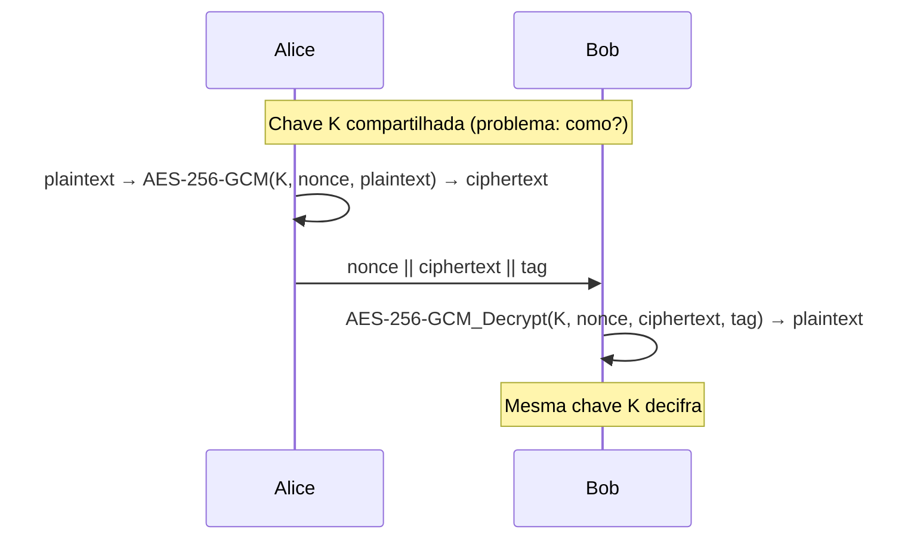
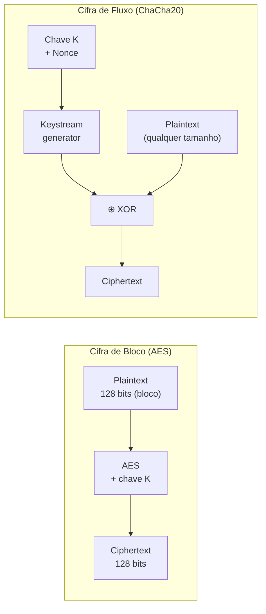
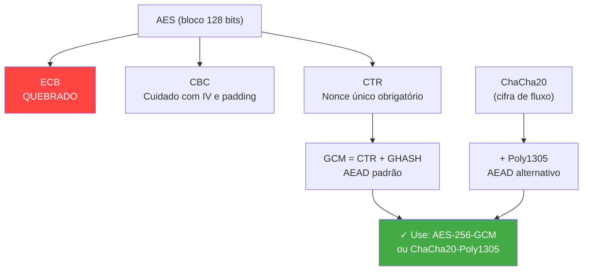
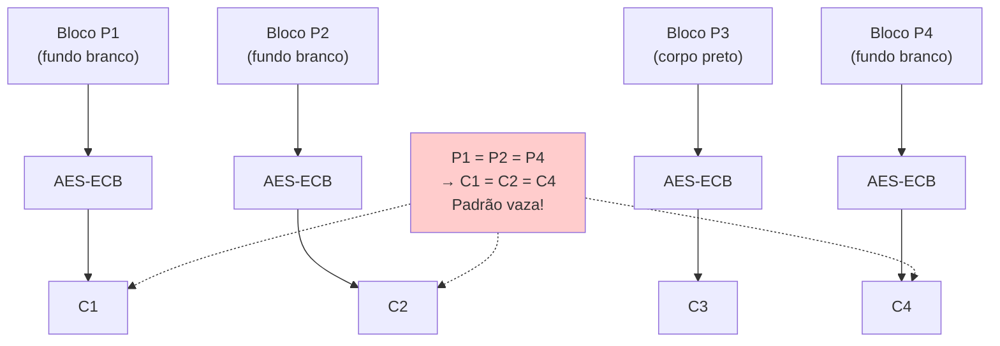
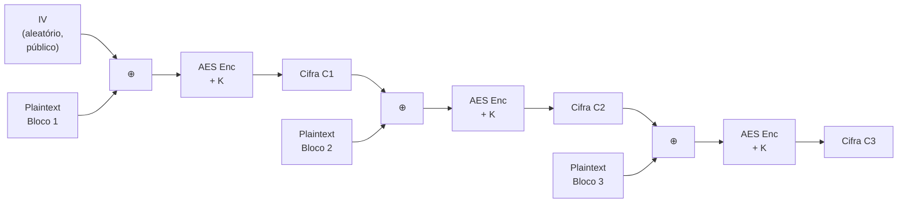
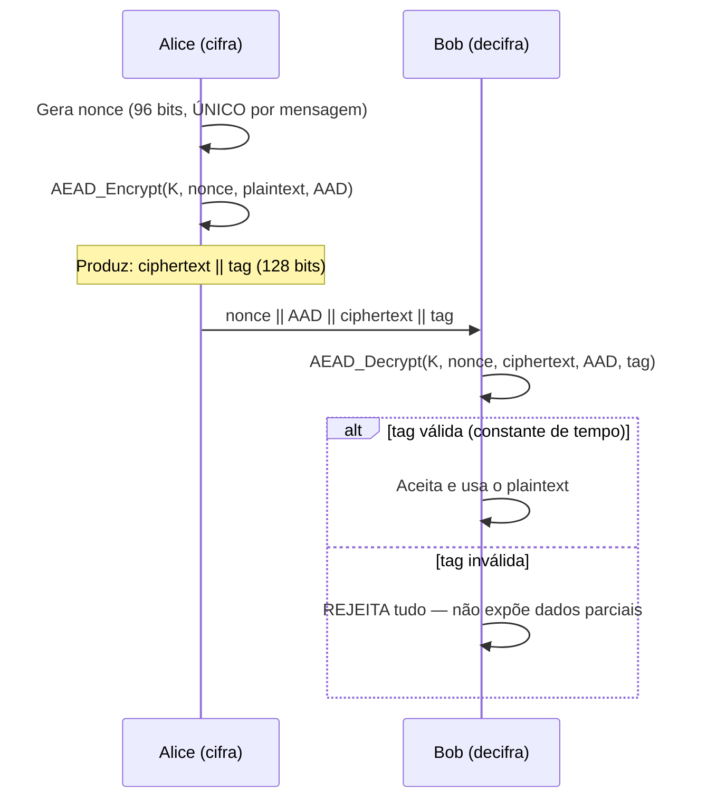
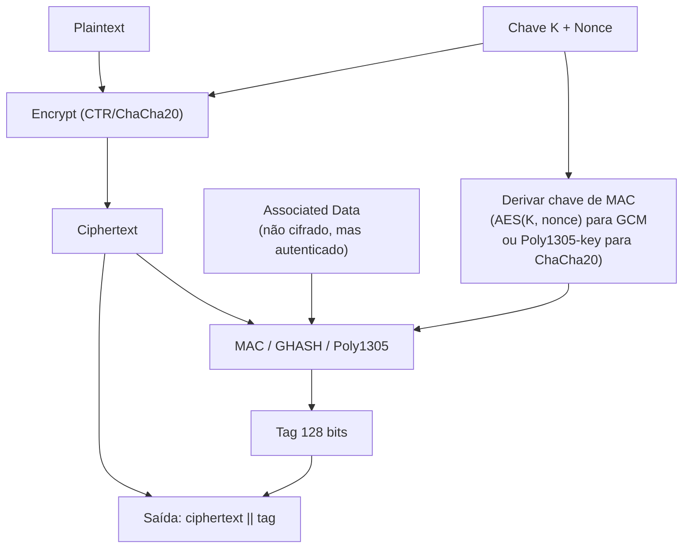
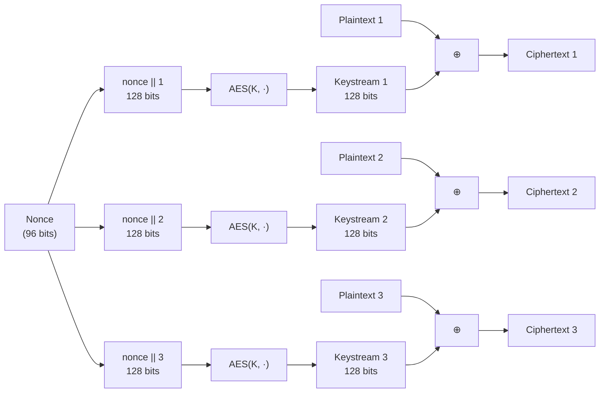

# Criptografia simétrica

> [!abstract] TL;DR
> Criptografia simétrica usa **a mesma chave** para cifrar e decifrar — é a primitiva mais rápida de confidencialidade. A escolha do **modo de operação** importa tanto quanto o algoritmo: ECB é quebrado, CBC tem armadilhas históricas sérias, e o padrão moderno é AEAD (AES-GCM ou ChaCha20-Poly1305), que entrega confidencialidade + integridade numa operação atômica. O calcanhar de Aquiles da criptografia simétrica: distribuir a chave com segurança é o problema que inventou a criptografia assimétrica.

---

## A ideia central: uma única chave para os dois lados

Imagine um cofre com apenas uma chave física no mundo. Quem tranca (cifra) e quem abre (decifra) usam **exatamente a mesma chave**. Isso é criptografia simétrica — e é por isso que também recebe o nome de *single-key* ou *secret-key cryptography*.

O contraste com criptografia assimétrica (nota 08) é imediato: aqui não há par pública/privada. Uma chave só, compartilhada entre os dois lados, e o segredo de toda a operação reside inteiramente nessa chave. Se ela vaza, tudo vaza. Se ela é roubada, toda a história de comunicações pode ser decifrada.

Por que isso importa em design de sistemas? Porque torna a cifra **extraordinariamente rápida**. AES em hardware moderno com AES-NI (Intel desde 2010, família Westmere) processa em torno de 1,3 ciclos por byte — velocidade de memória RAM. Em termos concretos: um Core i7 cifra mais de 10 GB/s. ChaCha20 performa de forma semelhante em CPUs sem AES-NI, relevante em hardware embarcado e dispositivos ARM de baixo custo.

A contrapartida é o **problema da distribuição de chave**: como Alice e Bob combinam o valor secreto antes de começar a comunicar? Esse problema não tem solução elegante dentro do modelo simétrico puro — e é exatamente o que motivou o nascimento da criptografia assimétrica. Mas isso fica para as notas 08 e 09. Por ora, assuma que a chave existe e está nos dois lados.



> [!info] Leitura do diagrama
> Alice e Bob compartilham a chave K. Alice cifra com K e transmite nonce + ciphertext + tag de autenticação. Bob usa a mesma K para decifrar. A simetria é exatamente isso: K cifra e K decifra — não existem chave pública e privada separadas.

---

## Cifra de bloco × cifra de fluxo

A primeira divisão que toda entrevista espera que você saiba articular com clareza:

| Tipo | Unidade de operação | Exemplos | Observação |
|---|---|---|---|
| **Cifra de bloco** | Bloco fixo de bits (128 bits no AES) | AES, 3DES | Precisa de modo de operação para mensagens longas |
| **Cifra de fluxo** | Byte a byte (XOR com keystream) | ChaCha20, RC4 (morto) | Naturalmente paralela, sem padding |

### Cifra de bloco: o motor do AES

Na cifra de bloco, o algoritmo aceita exatamente N bits de entrada (o bloco) e produz exatamente N bits de saída. O AES usa blocos de 128 bits. O problema prático: mensagens reais têm tamanho arbitrário. Como você cifra 1 MB de plaintext com uma primitiva que aceita 16 bytes por vez? Resposta: escolhendo um **modo de operação** que define como os blocos se encadeiam. Esse é o ponto mais crítico desta nota.

### Cifra de fluxo: o keystream como magia

Na cifra de fluxo, o algoritmo gera um fluxo pseudoaleatório de bytes (keystream) a partir da chave e de um nonce, e faz XOR com o plaintext byte a byte. Elegante e natural — sem padding, sem divisão em blocos, sem restrição de tamanho.

A propriedade XOR que torna isso funcionar: P ⊕ K = C, e C ⊕ K = P. A mesma operação cifra e decifra. Mas essa mesma simetria cria a vulnerabilidade fundamental: se você usar o mesmo keystream duas vezes (mesma chave + mesmo nonce), os dois ciphertexts XOR entre si revelam o XOR dos dois plaintexts — e XOR de texto natural tem muita estrutura para análise.

> [!warning] RC4 é morto
> RC4, a cifra de fluxo que dominou SSL/TLS e WEP nos anos 1990-2000, tem fraquezas estatísticas nos primeiros bytes do keystream e foi proibida em TLS pelo RFC 7465 (2015). Não use RC4 em nenhum contexto novo. Substituta correta: ChaCha20.



> [!info] Leitura do diagrama
> À esquerda, AES exige exatamente 128 bits de entrada e produz 128 bits de saída — precisa de modo de operação para mensagens maiores. À direita, ChaCha20 gera keystream de comprimento arbitrário a partir de chave + nonce; o XOR com o plaintext não impõe restrição de tamanho.

---

## AES: o algoritmo que virou lei

AES (*Advanced Encryption Standard*) foi padronizado pelo NIST como **FIPS 197** em novembro de 2001, após um processo público de seleção que durou cinco anos com quinze candidatos e criptoanálise aberta pela comunidade global. O vencedor foi o algoritmo **Rijndael**, criado pelos criptógrafos belgas Joan Daemen e Vincent Rijmen.

### Parâmetros do AES

| Variante | Tamanho da chave | Número de rounds |
|---|---|---|
| AES-128 | 128 bits | 10 |
| AES-192 | 192 bits | 12 |
| AES-256 | 256 bits | 14 |

O **tamanho do bloco é sempre 128 bits** — independentemente do tamanho da chave. Esse é o equívoco mais comum: AES-256 não processa blocos maiores, apenas usa chave maior (mais rounds, mais resistência a ataques de chave relacionada). Na prática, AES-128 ainda é considerado seguro para a maioria dos usos (2^128 chaves = segurança quântica razoável com Grover reduzindo para 2^64, que ainda está fora de alcance prático).

### A estrutura SPN: confusão + difusão

Cada round do AES é uma *Substitution-Permutation Network* (SPN) com quatro operações:

1. **SubBytes** — substituição não-linear byte a byte via S-box (resistência a criptoanálise diferencial e linear)
2. **ShiftRows** — rotação cíclica de linhas (difusão entre colunas)
3. **MixColumns** — multiplicação em GF(2^8) por uma matriz constante (difusão máxima dentro de cada coluna)
4. **AddRoundKey** — XOR com a subchave derivada do round (mistura do segredo)

O que importa entender: *confusão* (cada bit do ciphertext depende de forma complexa da chave, via SubBytes) + *difusão* (cada bit do plaintext influencia muitos bits do ciphertext, via ShiftRows/MixColumns). Esses dois princípios foram articulados por Claude Shannon em 1949 e ainda definem o design de cifras modernas.

> [!note] O que não reproduzir em entrevista
> Você não precisa lembrar os valores da S-box, o polinômio irredutível de GF(2^8), ou a matrix de MixColumns. Mas precisa saber articular: "AES usa substituição não-linear para confusão e permutação com mistura para difusão — juntos, garantem que a relação entre plaintext, chave e ciphertext seja não-linear e altamente sensível a qualquer mudança."

### AES-NI: hardware como aliado

Desde 2010, CPUs Intel e AMD incluem instruções de hardware `AESENC`, `AESENCLAST`, `AESDEC`, `AESDECLAST`, `AESIMC` e `AESKEYGENASSIST`. Cada instrução executa um round inteiro do AES em ciclo único.

O resultado prático: AES-128 em GCM roda a ~1,3 ciclos/byte num Core i7 — mais de 10 GB/s em um único core. Em benchmarks de disco com dm-crypt no Linux, AES-NI produz ~1.125 MB/s versus ~150 MB/s sem aceleração (7× a 10× mais rápido).

Além de desempenho, AES-NI resolve um problema de segurança: implementações software do AES baseadas em lookup tables são vulneráveis a ataques de *cache-timing* (acesso a índices da S-box revela bits do plaintext via análise do tempo de cache). Hardware elimina essa superfície de ataque.

### O caminho até o AES: DES e a queda

Antes do AES, o padrão era **DES** (*Data Encryption Standard*, 1977 — IBM + NSA), com chave de apenas **56 bits**. Em julho de 1998, a EFF construiu o **Deep Crack** — máquina de 1.856 chips ASIC customizados, custo total abaixo de US$ 250 mil — e quebrou uma chave DES por força bruta em **56 horas**, ganhando o desafio DES Challenge II-2 da RSA Security e embolsando US$ 10.000.

O experimento provou de forma pública e inequívoca: 56 bits de espaço de chave (≈ 7,2 × 10^16 possibilidades) é atacável com hardware especializado relativamente barato. Hoje, com ASICs modernos, DES seria quebrado em segundos.

**3DES** (*Triple DES*) foi a solução emergencial: aplicar DES três vezes em sequência (Encrypt-Decrypt-Encrypt, com chaves K1/K2/K3), obtendo ~112 bits de segurança efetiva (ataque *meet-in-the-middle* reduz de 168 para ~112 bits). Serviu por décadas no setor financeiro. Mas o NIST o **depreciou em 2019** e **proibiu para novos usos em dezembro de 2023** (NIST SP 800-131A rev.2). 3DES em código novo é uma vulnerabilidade — migre para AES-256-GCM.

---

## Modos de operação: onde a maioria erra

A cifra de bloco é o motor. O modo de operação é a transmissão. Um motor de F1 numa caixa de câmbio errada não sai do lugar.



> [!info] Leitura do diagrama
> A família de modos parte do núcleo AES (bloco de 128 bits). ECB é vermelho porque está fundamentalmente quebrado. CBC e CTR são neutros — funcionam mas têm armadilhas sérias. GCM (CTR + GHASH) e ChaCha20-Poly1305 são os únicos recomendados para código novo porque entregam autenticação junto com a cifra.

### ECB — o modo quebrado

*Electronic Codebook*: cada bloco do plaintext é cifrado de forma **completamente independente** com a mesma chave. Sem estado, sem contexto, sem memória do bloco anterior.

O problema estrutural é imediato: **blocos de plaintext idênticos produzem blocos de ciphertext idênticos**. A cifra preserva a estrutura do plaintext.

O exemplo canônico é o **pinguim ECB**: a imagem do Tux (mascote Linux, desenhada por Larry Ewing) cifrada com AES-ECB ainda é reconhecível como pinguim. As grandes regiões de cor uniforme do desenho (preto sólido, branco sólido) são compostas de blocos de 128 bits todos idênticos. Cada bloco branco cifra para o mesmo bloco de ciphertext; cada bloco preto também. O resultado visual mantém o padrão espacial da imagem — diferente em cor, mas estruturalmente idêntico. Filippo Valsorda documenta e reproduz o experimento em https://words.filippo.io/the-ecb-penguin/.

Além do problema visual: em dados estruturados, ECB vaza informação sobre repetições. Um atacante que observa duas mensagens cifradas com ECB pode detectar se elas compartilham blocos de plaintext idênticos — sem quebrar a chave. Em protocolos de autenticação, isso permite ataques de replay de blocos individuais.



> [!info] Leitura do diagrama
> Cada bloco de plaintext entra no AES de forma isolada. Blocos idênticos (P1 = P2 = P4, todos fundos brancos do Tux) produzem ciphertext idêntico (C1 = C2 = C4). O padrão estrutural da imagem vaza intacto — o Tux ainda é reconhecível no ciphertext.

> [!danger] Regra absoluta
> **Nunca use ECB.** Não para imagens, não para dados "presumivelmente aleatórios", não "temporariamente". ECB não é criptografia no sentido semântico — é substituição glorificada que preserva a estrutura do plaintext. Qualquer cifra real deve fazer com que plaintexts idênticos produzam ciphertexts distintos e não correlacionados.

### CBC — Cipher Block Chaining

CBC resolve o problema do ECB com uma ideia simples: antes de cifrar, **XOR o bloco de plaintext atual com o ciphertext do bloco anterior**. Agora blocos de plaintext idênticos produzem ciphertexts completamente diferentes — dependem de todo o histórico de cifragem anterior.

O primeiro bloco não tem predecessor. Solução: um **IV (Initialization Vector)** de 128 bits, gerado aleatoriamente para cada mensagem. O IV não precisa ser secreto (pode ir no cabeçalho do ciphertext em claro), mas **precisa ser imprevisível** — gerado com CSPRNG (ver nota 05). Um IV previsível em CBC permite ataques de chosen-plaintext: se um atacante sabe o IV antes de enviar a mensagem, pode manipular o bloco inicial para criar colisões controladas.



> [!info] Leitura do diagrama
> O IV é aplicado via XOR ao primeiro bloco de plaintext. O ciphertext de cada bloco é alimentado como XOR para o próximo bloco antes de entrar no AES. Encadeamento: mesmo que P1 = P2, os contextos acumulados são diferentes, portanto C1 ≠ C2.

**Armadilha crítica: padding oracle.** CBC processa blocos de 128 bits. Mensagens de comprimento não-múltiplo de 128 bits precisam de **padding** — tipicamente PKCS#7 (preenche os bytes faltantes com o valor do número de bytes adicionados). Se o sistema retorna mensagens de erro diferentes para "padding inválido" versus "MAC inválido" (ou "dados corrompidos"), um atacante pode explorar essa diferença para decifrar o ciphertext **sem conhecer a chave**, byte a byte. O ataque *padding oracle*, formalizado por Serge Vaudenay em 2002, foi explorado contra TLS 1.0 no **BEAST** (2011) e **POODLE** (2014, contra SSL 3.0). Detalhe na nota 15.

**Armadilha do IV reutilizado.** Reutilizar o mesmo IV com a mesma chave em CBC revela se dois plaintexts compartilham o mesmo primeiro bloco. Em sistemas de armazenamento (ex: cifrar arquivos com IV fixo derivado do caminho), isso cria padrões detectáveis.

**CBC não é paralelo.** A cifra de cada bloco depende do resultado do anterior — você não pode cifrar os blocos em paralelo. Para grandes volumes, CTR ou GCM são superiores.

### CTR — Counter Mode

CTR abandona o encadeamento e adota uma abordagem radicalmente diferente: em vez de cifrar o plaintext diretamente, você cifra um **contador** que incrementa a cada bloco, gerando um keystream. O ciphertext é XOR do plaintext com esse keystream.

A fórmula: `C[i] = P[i] ⊕ AES(K, nonce || counter_i)`

Vantagens técnicas:
- **Paralelismo total**: todos os blocos são independentes, podem ser processados simultaneamente
- **Sem padding**: o keystream tem comprimento arbitrário — XOR exatamente os bytes do plaintext
- **Acesso aleatório**: para decifrar o bloco i, compute apenas `AES(K, nonce || i)`; não precisa processar todos os blocos anteriores
- **AES sempre em direção de encriptação**: mesmo para decifrar, você usa `AES_Encrypt(K, nonce || i)` — não precisa implementar `AES_Decrypt`

**A armadilha fatal: nonce reutilizado.** Se dois plaintexts são cifrados com o mesmo (K, nonce) em CTR:

```
C1 = P1 ⊕ keystream
C2 = P2 ⊕ keystream
C1 ⊕ C2 = P1 ⊕ P2
```

E P1 ⊕ P2 é altamente analisável — texto natural tem distribuição não-uniforme e redundância suficiente para recuperar ambos os plaintexts com análise estatística. O ataque se chama *two-time pad* (analogia com a cifra de Vernam reutilizada). A NSA expôs dezenas de sistemas soviéticos nos anos 1940-1950 explorando exatamente isso no projeto VENONA — mensagens cifradas com OTP reutilizado.

> [!warning] Nonce = "number used once"
> Nonce é **número de uso único**. Não é secreto — pode ser transmitido em claro. Não precisa ser aleatório — pode ser um contador sequencial. Mas **nunca pode repetir para a mesma chave**. Com nonces aleatórios de 96 bits (padrão GCM), o aniversário acontece com 50% de probabilidade de colisão após 2^48 mensagens (~281 trilhões). Para volumes altos (streaming, CDN com bilhões de requisições), use nonces baseados em contador.

### AEAD — Authenticated Encryption with Associated Data

CTR (e CBC, e ECB) garantem apenas **confidencialidade**. Eles não impedem que um atacante modifique o ciphertext de forma controlada.

Em CTR especificamente: flipping de um bit no ciphertext flip o **mesmo bit** exatamente no plaintext decifrado (propriedade da XOR). Um atacante que conhece a posição exata de um campo no plaintext pode modificar bits sem conhecer a chave. Exemplo concreto: um token de sessão JSON `{"admin":false}` pode ser transformado em `{"admin":true }` se o atacante souber a posição e o tamanho dos campos. Isso é o *bit-flipping attack*.

A solução: **AEAD** (*Authenticated Encryption with Associated Data*) — confidencialidade + integridade + autenticidade em **uma operação atômica**.

As duas opções recomendadas em 2026:

| Algoritmo | Composição | Nonce | Tag de autenticação | Quando preferir |
|---|---|---|---|---|
| **AES-256-GCM** | AES-CTR + GHASH em GF(2^128) | 96 bits | 128 bits | Padrão geral; CPU com AES-NI; TLS 1.3 |
| **ChaCha20-Poly1305** | ChaCha20 + Poly1305 | 96 bits | 128 bits | CPU sem AES-NI; mobile/IoT; resistência a timing por construção |

**Como GCM funciona internamente:** GCM = CTR (para confidencialidade) + GHASH (para autenticidade). O GHASH é uma função de autenticação baseada em aritmética no campo de Galois GF(2^128): ela computa um polinômio sobre os blocos de ciphertext e os *associated data*, avaliado em uma chave de autenticação H derivada do nonce. O resultado é cifrado com AES para produzir a *authentication tag* de 128 bits.

**O que são os Associated Data (AAD)?** São metadados que você quer **autenticar mas não cifrar**. Exemplos: header de um pacote de rede (endereço IP de origem/destino, número de sequência), ID de sessão em banco de dados, versão de protocolo. O AEAD garante que se o AAD for modificado, a tag de autenticação falhará — mesmo que o ciphertext esteja intacto.

**ChaCha20-Poly1305** (RFC 8439): Poly1305 é um MAC de uso único — gera uma subchave descartável para cada mensagem a partir da chave mestra e do nonce, autentica o ciphertext + AAD, e produz a tag de 128 bits. Por não usar S-boxes nem tabelas de lookup, é naturalmente resistente a ataques de timing — crucial em hardware embarcado sem proteção de cache.



> [!info] Leitura do diagrama
> Alice cifra e transmite nonce + AAD + ciphertext + tag. Bob **verifica a tag antes de processar qualquer byte do plaintext** — operação *constant-time* para evitar timing oracles. Se a tag falhar por qualquer motivo (chave errada, ciphertext adulterado, nonce errado, AAD diferente), nenhum dado parcial é exposto. Isso é autenticidade atômica.



> [!info] Leitura do diagrama
> O AEAD combina duas operações: a cifra de fluxo (CTR ou ChaCha20) produz o ciphertext, e o MAC (GHASH ou Poly1305) autentica tanto o ciphertext quanto os associated data usando uma chave derivada do nonce. A tag de 128 bits compromete os dois — qualquer modificação em qualquer elemento invalida a tag.

---

## CTR em detalhe: como o modo contador transforma bloco em fluxo

O diagrama a seguir mostra o mecanismo interno do CTR — e por que ele herda tanto as virtudes quanto as vulnerabilidades das cifras de fluxo:



> [!info] Leitura do diagrama
> O nonce é concatenado com um contador crescente (1, 2, 3…) para formar a entrada de cada chamada ao AES. O AES transforma essa entrada na chave de sessão (keystream). O XOR do keystream com o plaintext produz o ciphertext. Todos os três blocos são **independentes** — paralelismo total. Para decifrar o bloco 3, basta computar `AES(K, nonce || 3)` e fazer XOR com o ciphertext 3.

A elegância do CTR é que ele nunca usa AES para decifrar — apenas para cifrar. A decifração é idêntica à cifragem: gere o mesmo keystream, faça XOR com o ciphertext. Isso simplifica as implementações, especialmente em hardware, onde `AES_Decrypt` requer circuitos adicionais para a operação inversa do MixColumns.

### Limite de volume com GCM e o problema da tag curta

GCM em específico tem um limite prático derivado da estrutura do GHASH em GF(2^128): com tag de 128 bits e nonces aleatórios de 96 bits, a NIST recomenda um limite de **2^32 invocações por chave** para manter a probabilidade de falsificação abaixo de 2^-32. Isso é ~4 bilhões de mensagens por chave — parece alto, mas em sistemas de alta disponibilidade com milhares de conexões TLS por segundo, a rotação de chave pode ser relevante. TLS 1.3 limita a 2^24.5 registros por chave de sessão exatamente por esse motivo.

Outro ponto: tags menores que 128 bits reduzem a segurança de autenticação linearmente. NIST SP 800-38D permitia tags de até 32 bits, mas a revisão proposta em 2023 remove suporte a tags menores que 96 bits. Em código novo, use sempre tag de 128 bits.

---

## Gerenciamento de chaves: o problema que nunca acaba

Escolher AES-256-GCM resolve o problema criptográfico. Mas a maior vulnerabilidade em sistemas de criptografia simétrica raramente é a cifra em si — é o **gerenciamento de chaves**.

Perguntas que toda entrevista de design de sistema pode levantar:

**Onde a chave fica armazenada?** Não em hardcode no repositório (veja milhares de CVEs de chaves AES expostas em GitHub). Não em variável de ambiente em texto claro em containers públicos. A resposta correta: em um **KMS** (*Key Management Service*) — AWS KMS, Google Cloud KMS, HashiCorp Vault, ou HSM (*Hardware Security Module*) físico. O KMS nunca expõe o material da chave — ele recebe o plaintext, cifra internamente, e devolve o ciphertext. A chave mestra nunca sai do hardware.

**Rotação de chave.** Chaves devem ter validade e ser rotacionadas periodicamente. Com AEAD, a rotação é relativamente segura: você registra a versão da chave junto com o ciphertext (parte do AAD), e mantém versões antigas disponíveis apenas para decifrar (não para novas cifragens). Sem AEAD, rotação sem re-cifragem deixa dados antigos protegidos pela chave comprometida.

**Derivação de chave.** Nunca use uma senha diretamente como chave AES — entropias são muito diferentes. Use KDF (*Key Derivation Function*): HKDF (HMAC-based KDF, RFC 5869) para derivar chaves de sessão a partir de segredos de alta entropia, ou PBKDF2/scrypt/Argon2 para derivar de senhas. Isso liga diretamente às notas 05 (aleatoriedade) e 06 (hashing).

**Envelope encryption.** Padrão de KMS: gera uma DEK (*Data Encryption Key*) aleatória para cada objeto/arquivo, cifra os dados com ela, depois cifra a DEK com uma KEK (*Key Encryption Key*) armazenada no KMS. Armazena DEK cifrada junto com os dados. Para decifrar: KMS decifra a DEK, a DEK decifra os dados. A KEK nunca sai do KMS.

> [!tip] Envelope encryption em uma frase
> Chave que cifra dado (DEK) é gerada localmente, aleatoriamente, por mensagem. Chave que protege a DEK (KEK) fica no KMS. Você armazena só a DEK cifrada. Rotacionar a KEK não exige re-cifrar os dados — só re-cifrar as DEKs.

---

## Confidencialidade ≠ integridade: o erro mais comum em código de produção

Este ponto ainda aparece em código de produção em 2026 e vale repetir com força:

> **Cifra sem MAC = confidencial mas não autenticado.**

Sem autenticação:
- **CBC sem MAC**: um atacante pode modificar blocos de ciphertext de forma controlada via CBC bit-flipping. O decifrador produz plaintext adulterado sem detectar nenhuma anomalia.
- **CTR sem MAC**: bit-flipping é ainda mais preciso — um bit no ciphertext vira exatamente um bit no plaintext, posição por posição.

A abordagem clássica para combinar cifra e MAC era:
- **Encrypt-then-MAC** (E-t-M): cifra o plaintext, depois computa MAC sobre o ciphertext. **Correto** — o MAC protege a integridade do ciphertext.
- **MAC-then-Encrypt** (M-t-E): computa MAC sobre o plaintext, depois cifra (MAC || plaintext). **Problemático** — pode vazar informação do plaintext antes de verificar o MAC (vulnerável a padding oracle em alguns contextos).
- **Encrypt-and-MAC** (E&M): cifra e computa MAC em paralelo sobre o plaintext. **Fraco** — o MAC sobre o plaintext pode vazar informação sobre o conteúdo.

Hoje a resposta certa é mais simples: use AEAD desde o início. AES-256-GCM e ChaCha20-Poly1305 implementam Encrypt-then-MAC com subchave derivada por mensagem, de forma atômica e auditada. Você não implementa separadamente. A nota 10 aprofunda MACs, HMACs e assinaturas para contextos onde você precisa autenticar sem cifrar.

---

## O problema da distribuição de chave: por que assimétrico existe

Se n participantes querem se comunicar com segurança simétrica em todos os pares possíveis, precisam de n × (n − 1) / 2 chaves únicas:
- 10 participantes → 45 chaves
- 100 participantes → 4.950 chaves
- 1.000 participantes → 499.500 chaves
- 1.000.000 de usuários (uma aplicação web pequena) → ~5 × 10^11 chaves

Além do problema de escala, há o problema de bootstrap: como Alice e Bob combinam a chave pela primeira vez, pelo mesmo canal inseguro que querem proteger? Enviar a chave pela rede sem cifrá-la é circular. Enviar por canal fora-de-banda (mensageiro físico, encontro presencial) não escala para a internet.

Esse problema, formulado com precisão matemática por Whitfield Diffie e Martin Hellman em 1976 no paper seminal *"New Directions in Cryptography"*, motivou a invenção da criptografia de chave pública. Antes disso, o único mecanismo de distribuição de chave em larga escala eram centros de distribuição de chaves (KDC — *Key Distribution Center*), como o protocolo Kerberos ainda usa em redes corporativas.

Na prática moderna, TLS 1.3 usa ECDHE (*Elliptic Curve Diffie-Hellman Ephemeral*) para estabelecer uma *chave de sessão* simétrica — e depois usa AES-256-GCM ou ChaCha20-Poly1305 para toda a comunicação de dados. O adjetivo "efêmero" é crucial: a chave de sessão é gerada para aquela conexão específica e descartada ao final, garantindo *forward secrecy* — mesmo que a chave privada do servidor seja comprometida no futuro, sessões passadas não podem ser decifradas. O assimétrico resolve o bootstrap; o simétrico faz o trabalho pesado com velocidade de hardware.

> [!note] O ponto da entrevista: por que não usar só assimétrico?
> RSA e ECC são ordens de magnitude mais lentos que AES — cifrar 1 GB com RSA-2048 é inviável. O protocolo híbrido (assimétrico para troca de chave + simétrico para os dados) existe por necessidade de engenharia, não por limitação teórica.

---

## Conexões

- Anterior: `[[06 - Hashing criptográfico]]`
- Próxima: `[[08 - Criptografia assimétrica]]`
- Cross-links: `[[05 - Aleatoriedade e segredos]]` — CSPRNG para IVs e nonces seguros; `[[10 - MAC, HMAC e assinaturas digitais]]` — autenticação sem cifra, ou como combinar as duas; `[[15 - Ataques a sistemas cripto]]` — padding oracle, bit-flipping, nonce reuse em detalhes técnicos

> [!summary] Resumo em uma linha
> Criptografia simétrica usa a mesma chave para cifrar e decifrar — rápida e eficiente, mas o modo de operação define a segurança real: nunca ECB, muitas armadilhas em CBC e CTR puros, e sempre prefira AEAD (AES-256-GCM ou ChaCha20-Poly1305) que entrega confidencialidade + integridade numa operação atômica.

---

## Em entrevista

O assunto aparece em perguntas de design de sistema ("como você armazenaria dados sensíveis em repouso?"), de segurança ("qual cifra e modo você usaria para criptografar mensagens?") e de debugging ("por que esse sistema de criptografia é vulnerável?"). A armadilha mais comum: o candidato escolhe AES mas não especifica o modo — e o entrevistador aguarda.

**Cenário concreto frequente:** "Você precisa cifrar dados de cartão de crédito no banco de dados. Como faz?"

Resposta esperada de um senior: usar *envelope encryption* com um KMS. Gerar uma DEK aleatória (AES-256) por registro ou por lote, cifrar o campo com AES-256-GCM (nonce único por cifragem, armazenado junto), cifrar a DEK com a KEK do KMS, armazenar ciphertext + nonce + DEK cifrada. Nunca armazenar a DEK em plaintext. Rotação da KEK não exige re-cifrar os dados — só re-cifrar as DEKs. E o modo é GCM, não CBC, porque você quer detectar corrupção ou adulteração antes de processar os dados.

Frases para usar em inglês:

*"For symmetric encryption I default to AES-256-GCM — authenticated encryption that gives you confidentiality and integrity in one atomic operation."*

*"ECB is broken by construction: identical plaintext blocks produce identical ciphertext blocks, leaking structure. The ECB penguin is the canonical demonstration — encrypting the Linux Tux image with AES-ECB still shows the penguin shape. Never use ECB."*

*"The nonce in GCM must never repeat under the same key. With random 96-bit nonces there's a birthday-bound collision risk after around 2^48 messages — for high-volume systems I'd use a counter-based nonce instead."*

*"Symmetric encryption alone doesn't authenticate the data. Without a MAC or AEAD, an attacker can flip bits in ciphertext and corrupt the decrypted plaintext silently — that's the bit-flipping attack. AEAD eliminates this by verifying integrity before exposing any decrypted bytes."*

*"The key distribution problem is exactly why asymmetric cryptography exists. In TLS 1.3, ECDHE establishes a shared session key, and then AES-GCM or ChaCha20-Poly1305 handles all the actual data encryption — the best of both worlds."*

*"3DES is disallowed for new use by NIST since December 2023. Any codebase still using Triple DES should migrate to AES-256-GCM."*

*"For data at rest in a database, I'd use envelope encryption: generate a random DEK per record, encrypt with AES-256-GCM storing nonce + ciphertext + encrypted-DEK, and wrap the DEK with a KEK managed in a KMS. That way the plaintext key material never lives in the application process or the database."*

*"ChaCha20-Poly1305 is my preference on mobile and IoT where I can't guarantee AES-NI. It's constant-time by construction — no S-box lookups, no timing side channels — and is one of the two AEAD ciphersuites mandatory in TLS 1.3."*

*"CBC without a MAC is not secure against active attackers. The padding oracle attack — exploited in BEAST and POODLE against TLS — shows that a decryption oracle plus a padding distinguisher is enough to decrypt arbitrary ciphertext without the key. AEAD avoids all of this."*

**Perguntas frequentes em design:**

| Pergunta | Resposta sênior |
|---|---|
| Qual modo de AES usar? | AES-256-GCM ou ChaCha20-Poly1305 (AEAD) |
| Posso reutilizar o IV/nonce? | Nunca com a mesma chave — gere por CSPRNG ou contador |
| Chave AES de 128 ou 256 bits? | 256 para dados de longa duração; 128 ainda é seguro hoje |
| Como derivar chave de uma senha? | Argon2id/scrypt (senhas) ou HKDF (segredos de alta entropia) |
| Onde armazenar a chave? | KMS/HSM — nunca no mesmo store que os dados cifrados |
| 3DES ainda é aceitável? | Não — NIST proibiu novos usos desde dezembro 2023 |

**Vocabulário PT → EN:**

| Português | Inglês |
|---|---|
| Criptografia simétrica | Symmetric encryption / secret-key encryption |
| Cifra de bloco | Block cipher |
| Cifra de fluxo | Stream cipher |
| Modo de operação | Mode of operation |
| Vetor de inicialização | Initialization vector (IV) |
| Número de uso único | Nonce |
| Encadeamento de blocos | Cipher Block Chaining (CBC) |
| Modo contador | Counter mode (CTR) |
| Criptografia autenticada | Authenticated encryption (AEAD) |
| Dados associados | Associated data (AAD) |
| Tag de autenticação | Authentication tag |
| Distribuição de chave | Key distribution / key exchange |
| Confusão e difusão | Confusion and diffusion |
| Ataque de inversão de bits | Bit-flipping attack |
| Oráculo de padding | Padding oracle |
| Rede de substituição-permutação | Substitution-permutation network (SPN) |
| Chave de sessão | Session key |

---

> [!info] Lastro
> - **NIST FIPS 197** — *Advanced Encryption Standard (AES)*, novembro 2001. Especificação oficial do AES/Rijndael: bloco 128 bits, chaves 128/192/256 bits, rounds 10/12/14. https://csrc.nist.gov/pubs/fips/197/final
> - **NIST SP 800-38A** — *Recommendation for Block Cipher Modes of Operation: Methods and Techniques*. Define ECB, CBC, CFB, OFB, CTR com análise de segurança. https://csrc.nist.gov/pubs/sp/800/38/a/final
> - **NIST SP 800-38D** — *Recommendation for Block Cipher Modes of Operation: Galois/Counter Mode (GCM) and GMAC*, novembro 2007. Especificação completa de AES-GCM, GHASH, e GMAC. https://csrc.nist.gov/pubs/sp/800/38/d/final
> - **RFC 8439** — *ChaCha20 and Poly1305 for IETF Protocols*, junho 2018. Especificação de ChaCha20-Poly1305 como AEAD padrão IETF; nonce 96 bits, tag 128 bits, chave 256 bits. https://www.rfc-editor.org/rfc/rfc8439.html
> - **EFF DES Cracker press release, julho 1998** — Documentação primária da quebra de DES-56 em 56 horas com máquina de US$ 250 mil (1.536 ASICs, 88 bilhões de chaves/segundo). https://w2.eff.org/Privacy/Crypto/Crypto_misc/DESCracker/HTML/19980716_eff_descracker_pressrel.html
> - **Filippo Valsorda — "The ECB Penguin"** — Demonstração reproduzível do ataque estrutural do modo ECB via imagem do Tux; explica por que regiões uniformes de cor se mapeiam em padrões repetidos no ciphertext. https://words.filippo.io/the-ecb-penguin/
