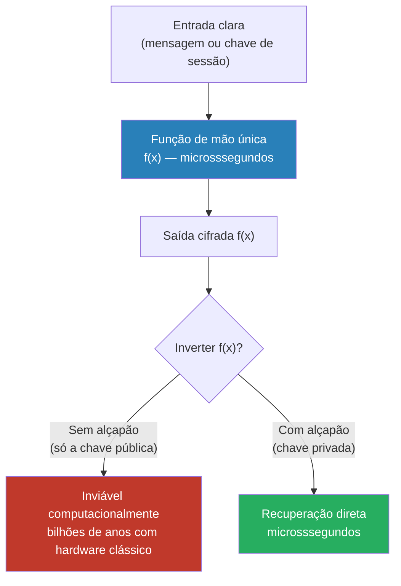
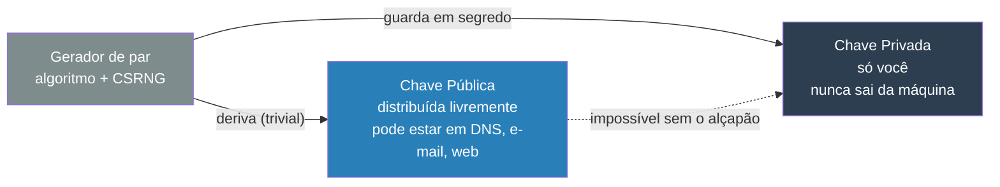
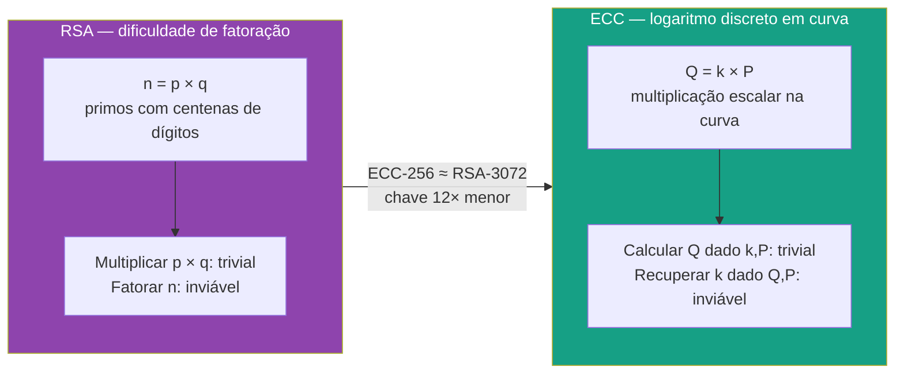

# Criptografia assimétrica

> [!abstract] TL;DR
> Criptografia assimétrica resolve o problema que a simétrica não consegue: distribuir uma chave secreta sem nunca tê-la compartilhado antes. O truque é usar um PAR de chaves — pública e privada — ligadas por uma função de mão única com alçapão (trapdoor one-way function). Os dois usos são OPOSTOS: cifrar com a pública garante confidencialidade; assinar com a privada garante autenticidade. RSA baseia-se na dificuldade de fatorar primos grandes; ECC, no logaritmo discreto em curvas elípticas — e oferece a mesma segurança com chaves muito menores. Na prática, assimétrico é usado apenas para encapsular uma chave de sessão; o simétrico faz o trabalho pesado.

---

## O problema que a criptografia simétrica não resolve

A criptografia simétrica ([[07 - Criptografia simétrica]]) tem uma propriedade fundamental: quem cifra e quem decifra usam a mesma chave. Isso gera uma contradição estrutural:

> Para compartilhar uma chave secreta com segurança, você já precisaria de um canal seguro. Mas se você tivesse um canal seguro, para que precisaria de criptografia?

Esse é o **problema de distribuição de chave** (*key distribution problem*). Em 1976, Whitfield Diffie e Martin Hellman o nomearam com precisão no artigo seminal *New Directions in Cryptography* e propuseram a solução: criptografia de chave pública, também chamada de criptografia assimétrica.

A ideia era radical: e se fosse possível tornar pública uma das chaves sem comprometer a segurança? Alguém que queira enviar uma mensagem cifrada para você usaria sua chave pública — que todo o mundo pode ver — e apenas você, com sua chave privada, poderia decifrar.

Isso elimina o problema de distribuição: você não precisa mais enviar uma chave secreta por um canal seguro. A chave pública pode ser publicada em um diretório, enviada por e-mail, gravada em um cartão de visita. Não há risco em divulgá-la.

---

## A grande ideia: função de mão única com alçapão

A estrutura matemática que torna isso possível é a **função de mão única com alçapão** (*trapdoor one-way function*):

- **Fácil numa direção**: dado `x`, calcular `f(x)` leva microssegundos mesmo para entradas enormes.
- **Computacionalmente inviável na direção inversa**: dado `f(x)`, encontrar `x` levaria mais tempo do que a existência do universo com hardware clássico — sem o segredo.
- **Com o alçapão (trapdoor)**: dado `f(x)` + o segredo, recuperar `x` é trivial, rápido, direto.

O alçapão é a chave privada. A descrição pública da função — sem o alçapão — é a chave pública. Quem tem apenas a pública pode aplicar `f`, mas não pode inverter.



> [!info] Leitura do diagrama
> O caminho para baixo (calcular `f(x)`) é sempre rápido para qualquer um. Tentar voltar pela esquerda sem o alçapão é computacionalmente inviável. Voltar pela direita com a chave privada é instantâneo. Toda a segurança do esquema assimétrico repousa nessa assimetria de custo computacional.

A palavra "inviável" aqui tem sentido técnico preciso: não há prova matemática de que seja impossível — apenas que os melhores algoritmos conhecidos hoje exigem tempo exponencial (ou subexponencial mas ainda astronômico) para entradas de tamanho suficiente. A segurança da criptografia assimétrica é condicional: ela repousa sobre conjecturas computacionais não-provadas. Se alguém descobrir um algoritmo clássico eficiente para fatoração ou logaritmo discreto, todos os sistemas baseados em RSA/ECC estariam comprometidos retroativamente.

Avanços em computação quântica mudam essa equação de forma mais concreta: o algoritmo de Shor (1994) resolve fatoração e logaritmo discreto em tempo polinomial em um computador quântico com qubits suficientes. Por isso o NIST padronizou algoritmos pós-quânticos em 2024 (FIPS 203/204/205): ML-KEM (Kyber), ML-DSA (Dilithium) e SLH-DSA (SPHINCS+). A migração está em andamento — novos sistemas devem planejar suporte híbrido (clássico + pós-quântico em paralelo) desde hoje.

---

## O par de chaves: quem vê o quê e por quê isso funciona

Cada entidade gera um par matematicamente ligado. A geração usa um algoritmo específico (RSA, ECC) alimentado por um gerador de números aleatórios criptograficamente seguro (CSRNG):

| Chave | Visibilidade | Finalidade |
|---|---|---|
| **Pública** | Todo mundo pode ver, baixar, armazenar | Cifrar pra você; verificar sua assinatura |
| **Privada** | Só você conhece; nunca sai da sua máquina | Decifrar o que cifraram pra você; assinar em seu nome |

A relação matemática entre as duas é unidirecional: é possível derivar a pública da privada, mas não o contrário — sem o alçapão. Isso é o que garante que publicar a chave pública não compromete a privada.



> [!info] Leitura do diagrama
> A seta sólida (Priv → Pub) indica derivação computacionalmente trivial: todo algoritmo assimétrico permite isso. A seta tracejada (Pub → Priv) indica a direção inviável — não é escolha de implementação, é consequência do problema matemático subjacente (fatoração ou logaritmo discreto).

> [!danger] Custódia da chave privada
> Perder a chave privada significa perder a capacidade de decifrar tudo que foi cifrado com a pública correspondente. Expor a chave privada compromete retroativamente toda a comunicação passada (se a chave de sessão foi armazenada) e toda a autenticidade futura. Hardware Security Modules (HSM) e smart cards existem precisamente para nunca deixar a privada sair do hardware.

---

## Os dois usos opostos — a pergunta que entrevista cobra

Esse é o ponto que mais confunde candidatos. Os dois usos dos pares de chave são **inversos** em qual chave é usada e qual propriedade é garantida:

```mermaid
sequenceDiagram
    participant A as Alice (remetente)
    participant NET as Rede (adversário pode ver)
    participant B as Bob (destinatário)

    Note over B: Bob tem par (Pub_B, Priv_B)
    Note over A,B: ── CASO 1: Confidencialidade ──

    A->>A: Obtém Pub_B (pública, qualquer um pode ter)
    A->>A: Cifra mensagem com Pub_B
    A->>NET: envia cifrado (adversário vê bytes ininteligíveis)
    NET->>B: cifrado chega
    B->>B: Decifra com Priv_B (só Bob tem)
    Note over B: Só Bob consegue ler — confidencialidade

    Note over A,B: ── CASO 2: Autenticidade (assinatura digital) ──

    Note over A: Alice tem par (Pub_A, Priv_A)
    A->>A: Calcula hash da mensagem
    A->>A: Assina o hash com Priv_A
    A->>NET: envia mensagem + assinatura
    NET->>B: mensagem + assinatura chegam
    B->>B: Obtém Pub_A; verifica assinatura
    Note over B: Só Alice poderia ter assinado — autenticidade
```

> [!info] Leitura do diagrama
> No Caso 1, a chave pública do DESTINATÁRIO (Bob) é usada para cifrar — garantindo que só ele pode decifrar. No Caso 2, a chave privada do REMETENTE (Alice) é usada para assinar — garantindo que só ela poderia ter produzido a assinatura. Os papéis são invertidos, e os sujeitos são diferentes.

A tabela resume:

| Operação | Chave usada | Chave para reverter | Garante |
|---|---|---|---|
| **Cifrar** | Pública do **destinatário** | Privada do destinatário | Confidencialidade |
| **Assinar** | Privada do **remetente** | Pública do remetente | Autenticidade + integridade |

> [!warning] Erro clássico de entrevista
> "Cifro com minha privada para provar que sou eu." Isso NÃO é cifração com garantia de confidencialidade — seria decifrado por qualquer um com a pública. Na terminologia correta, isso é **assinatura**. Cifração e assinatura são operações matematicamente distintas, com direções de chave invertidas e propriedades de segurança diferentes. Confundir os termos em entrevista é sinal de conhecimento superficial.

---

## RSA: segurança via fatoração de primos

RSA (Rivest, Shamir, Adleman, 1978) é o algoritmo assimétrico historicamente dominante e ainda amplamente usado. A segurança repousa sobre a dificuldade de **fatorar o produto de dois primos grandes**.

A intuição direta: dado um número `n = p × q` onde `p` e `q` são primos com centenas de dígitos cada, encontrar `p` e `q` separadamente é computacionalmente inviável. Multiplicar dois primos grandes leva microssegundos; fatorar o produto com os melhores algoritmos clássicos conhecidos (GNFS — General Number Field Sieve) levaria tempo astronômico para `n` de tamanho adequado.

> [!note] A matemática exata fica nas notas de Fundamentos de Matemática
> A construção formal do RSA — escolha de `e` e `d`, uso do Teorema de Euler-Fermat para provar que `(m^e)^d ≡ m (mod n)`, geração de chaves — está documentada em [[03-Dominios/Ciência/Matemática para Computação/14 - Teoria dos números - divisibilidade e primos]] e [[03-Dominios/Ciência/Matemática para Computação/15 - Aritmética modular e Fermat-Euler]]. Aqui ficamos no nível conceitual que entrevista exige.

**Tamanhos de chave RSA recomendados (NIST SP 800-57 Part 1 Rev. 5):**

| Nível de segurança | Tamanho RSA | Observação |
|---|---|---|
| 80 bits | 1024 bits | **Inseguro desde ~2010. Nunca usar.** |
| 112 bits | 2048 bits | Mínimo aceitável hoje; aprovado até ~2030 |
| 128 bits | 3072 bits | Recomendado para novos sistemas |
| 192 bits | 7680 bits | Para dados com vida útil de décadas |

O "nível de segurança" em bits significa: um adversário precisaria de `2^N` operações para quebrar o esquema. Nível 128 ≈ dificuldade comparável ao AES-128.

**Pontos negativos do RSA** que importam em entrevista:
- Operações de decifração são lentas (o expoente `d` é grande).
- A implementação correta é não-trivial: padding OAEP para cifração, PSS para assinatura — RSA puro (textbook RSA) sem padding é inseguro.
- Chaves enormes comparadas ao ECC para segurança equivalente.
- Vulnerável a computadores quânticos (algoritmo de Shor fatoraria `n` em tempo polinomial).

> [!warning] Textbook RSA é inseguro
> RSA sem padding probabilístico é deterministico: cifrar a mesma mensagem duas vezes produz o mesmo resultado. Um adversário com a chave pública pode cifrar candidatos e comparar. Sempre use OAEP (Optimal Asymmetric Encryption Padding) para cifração e PSS (Probabilistic Signature Scheme) para assinatura. Bibliotecas modernas (OpenSSL, Java JCA, libsodium) fazem isso por padrão — mas você precisa escolher o padding certo ao configurar.

**Onde RSA ainda aparece:**
- Certificados TLS/X.509: servidores web ainda emitem certificados com chave pública RSA-2048 (embora Ed25519 esteja crescendo).
- Assinatura de código (JARs Java, pacotes Windows, RPMs).
- PGP/GPG: chaves legadas RSA-2048 e RSA-4096 são comuns.
- PKCS#11 / HSMs: hardware mais antigo suporta RSA melhor que ECC.

---

## ECC: segurança via logaritmo discreto em curva elíptica

Criptografia de curva elíptica (ECC, do inglês *Elliptic Curve Cryptography*) é o substituto moderno do RSA. A segurança repousa sobre a dificuldade do **problema do logaritmo discreto em curva elíptica (ECDLP)**:

Dado um ponto `P` em uma curva elíptica e o resultado `Q = k × P` (onde `×` é a multiplicação escalar sobre o grupo da curva), encontrar o escalar `k` é computacionalmente inviável.

A vantagem central: **mesma segurança com chaves muito menores**.

| Nível de segurança | RSA | ECC |
|---|---|---|
| 112 bits | 2048 bits | 224 bits |
| 128 bits | 3072 bits | 256 bits |
| 192 bits | 7680 bits | 384 bits |
| 256 bits | 15360 bits | 512 bits |

Chaves menores significam: menos banda em handshakes, menos memória, operações mais rápidas, menos consumo de bateria. É por isso que ECC domina TLS moderno, mobile e qualquer sistema com recursos limitados.

**Curvas amplamente usadas em produção:**

- **Curve25519 / X25519**: curva de DH (troca de chaves), projetada por Daniel J. Bernstein (2006) com foco explícito em resistência a ataques de canal lateral e segurança de implementação por padrão. Padrão no TLS 1.3.
- **Ed25519**: assinatura digital (EdDSA sobre a curva twisted Edwards equivalente à Curve25519). Usado em SSH moderno, certificados TLS, Git commit signing, Signal.
- **P-256 (secp256r1) / P-384**: curvas NIST, mais antigas, amplamente suportadas, usadas em ECDSA. Existem desconfianças históricas sobre os parâmetros gerados pela NSA com seed opaca — Curve25519 surgiu em parte como resposta a isso.
- **secp256k1**: a curva usada pelo Bitcoin para ECDSA. Não é a P-256 — os parâmetros são diferentes. Raramente usada fora de contextos blockchain.

**Onde ECC aparece:**
- TLS 1.3: X25519 é o key exchange padrão; Ed25519 ou ECDSA P-256 para assinatura de certificados.
- SSH: `ssh-ed25519` é o tipo de chave recomendado hoje (mais seguro e mais curto que `ssh-rsa`).
- Signal / WhatsApp: X3DH usa Curve25519 para todos os pares de chave.
- Passkeys / WebAuthn: P-256 é o algoritmo mandatório; Ed25519 é opcional.
- Git commit signing com GPG/SSH: Ed25519 é preferido por tamanho e velocidade.



> [!info] Leitura do diagrama
> RSA e ECC constroem segurança sobre problemas matemáticos diferentes (fatoração vs. logaritmo discreto em curva). Não é que ECC seja "mais seguro" — é que o problema do logaritmo discreto em curva é harder por bit de chave, permitindo chaves muito menores para a mesma resistência prática.

---

## Por que assimétrico é lento — e o que realmente se faz

Operações RSA e ECC são ordens de magnitude mais lentas que AES. O motivo é estrutural: as operações matemáticas envolvidas (exponenciação modular no RSA, multiplicação escalar em ECC) são computacionalmente intensas por natureza — é exatamente essa intensidade que garante a segurança.

Comparação de throughput típico em CPU moderna com AES-NI (hardware):

| Operação | Throughput típico |
|---|---|
| AES-256-GCM (simétrico) | ~4–10 GB/s (com AES-NI) |
| ChaCha20-Poly1305 (simétrico) | ~2–4 GB/s |
| RSA-2048 decifrar | ~3–5 ms por operação (~200/s) |
| Ed25519 assinar | ~70.000 ops/s |
| Ed25519 verificar | ~25.000 ops/s |
| X25519 DH | ~130.000 ops/s |

Usar RSA para cifrar 1 GB de dados diretamente seria impraticável. Além do custo de tempo, há outro limite: RSA-2048 só consegue "cifrar" dados menores que ~245 bytes — a mensagem precisa caber no espaço definido pelo módulo `n`.

A solução que o setor inteiro usa há décadas é **criptografia híbrida**.

---

## Criptografia híbrida e KEM

A criptografia híbrida combina:

1. **Assimétrico** faz uma coisa só: trocar ou encapsular uma **chave de sessão** (session key) temporária e aleatória.
2. **Simétrico** (AES-GCM, ChaCha20-Poly1305) cifra o dado real com essa chave de sessão.

O componente formal que modela o passo 1 é o **KEM — Key Encapsulation Mechanism** (Mecanismo de Encapsulamento de Chave):

- `Encapsulate(Pub)` → `(kem_ciphertext, shared_secret)`: gera um segredo compartilhado aleatório e o encapsula usando a chave pública. Só quem tem a privada pode abrir.
- `Decapsulate(Priv, kem_ciphertext)` → `shared_secret`: recupera o segredo com a chave privada.

O `shared_secret` nunca aparece em claro em nenhum canal — apenas o `kem_ciphertext` trafega pela rede, e ele é inútil sem a privada.

```mermaid
sequenceDiagram
    participant C as Cliente
    participant NET as Rede
    participant S as Servidor

    Note over S: Par (Pub_S, Priv_S)

    C->>C: Encapsulate(Pub_S)<br/>(kem_ct, K_sessão) — K_sessão nunca sai daqui
    C->>NET: kem_ct (KEM ciphertext)
    NET->>S: kem_ct chega
    S->>S: Decapsulate(Priv_S, kem_ct)<br/>→ K_sessão

    Note over C,S: Ambos têm K_sessão — nunca trafegou em claro

    C->>NET: dados cifrados com AES-GCM(K_sessão)
    NET->>S: dados cifrados chegam
    S->>S: Decifra com AES-GCM(K_sessão)
    S->>NET: resposta cifrada com AES-GCM(K_sessão)
    NET->>C: resposta chega; C decifra com K_sessão
```

> [!info] Leitura do diagrama
> O KEM ciphertext pode ser interceptado na rede — é inútil sem Priv_S. O segredo de sessão K_sessão é gerado localmente no cliente e recuperado localmente no servidor; nunca aparecer em claro em qualquer canal. A partir daí, AES opera a vários GB/s. É exatamente assim que TLS 1.3, PGP e o protocolo Signal funcionam internamente.

**Como isso aparece nos protocolos reais:**

- **TLS 1.3**: na fase de handshake, cliente e servidor executam um Diffie-Hellman efêmero (X25519 ou P-256) para derivar a chave de sessão via HKDF. Daí, AES-128-GCM ou ChaCha20-Poly1305 cifra o tráfego. RSA foi eliminado do key exchange no TLS 1.3 (ainda pode aparecer em certificados, não no key exchange).
- **PGP**: gera uma session key simétrica aleatória, cifra os dados com ela (AES), e cifra a session key com a chave pública RSA/ECC do destinatário. O arquivo final contém os dois blocos.
- **Signal (X3DH + Double Ratchet)**: usa quatro pares de chaves Curve25519 para estabelecer um segredo inicial (X3DH — Extended Triple Diffie-Hellman), depois evolui a chave a cada mensagem via Double Ratchet. Cada mensagem usa uma chave diferente, garantindo *forward secrecy* e *break-in recovery*.
- **SSH**: o handshake usa Curve25519 (ECDH efêmero) para key exchange; autenticação usa Ed25519 ou RSA para verificar a chave pública do usuário; a sessão inteira é cifrada com AES-CTR ou ChaCha20-Poly1305.

**Por que KEM e não apenas DH?**

DH (Diffie-Hellman) é a forma original de troca de chaves assimétrica — os dois lados contribuem com partes do segredo. KEM é uma abstração mais geral: um lado encapsula um segredo para o outro sem participação interativa. KEM é o que o padrão pós-quântico CRYSTALS-Kyber (ML-KEM, NIST FIPS 203) usa — porque os algoritmos pós-quânticos não têm a estrutura de DH, mas se encaixam naturalmente no modelo KEM. Pensar em termos de KEM hoje é preparar o vocabulário para a transição pós-quântica.

> [!tip] Por que "efêmero" é importante
> Quando a chave de sessão é derivada de um DH efêmero (nova por sessão, descartada depois), capturar o tráfego hoje e obter a chave privada no futuro não permite decifrar o histórico. Essa propriedade é chamada de **forward secrecy** (*sigilo futuro*). TLS 1.3 exige DH efêmero; TLS 1.2 com RSA estático não tem essa garantia.

---

## Armadilhas de implementação que derrubam sistemas reais

A teoria é elegante; a prática tem armadilhas que afetam código de produção. As mais importantes:

**1. Nonce/IV reutilizado em ECDSA**
ECDSA exige um número aleatório `k` único por assinatura. Se o mesmo `k` for usado duas vezes com chaves privadas diferentes mas mesma curva, a chave privada pode ser recuperada algebricamente. Foi assim que o PlayStation 3 teve sua chave privada exposta em 2010. Solução: usar EdDSA (Ed25519) que deriva o nonce deterministicamente do hash da mensagem, eliminando a dependência de aleatoriedade por assinatura.

**2. Ataques de canal lateral em RSA**
A operação de decifração RSA tem tempo de execução que varia com o valor da chave privada. Um adversário que pode medir o tempo de centenas de operações pode inferir bits da chave. Solução: implementações com *constant-time blinding* — o OpenSSL faz isso por padrão; nunca implemente RSA do zero.

**3. Padding oracle no RSA PKCS#1 v1.5**
O ataque de Bleichenbacher (1998) permite decifrar mensagens RSA adaptivamente, consultando um servidor que revela se o padding PKCS#1 v1.5 é válido. Afetou SSL 3.0/TLS 1.0/1.1 historicamente (ROBOT attack, 2017). Solução: usar OAEP (PKCS#1 v2.x) para cifração e PSS para assinatura.

**4. Geração de chaves com entropia insuficiente**
Se o CSRNG não tem entropia suficiente no momento da geração (ex.: máquina virtual que acabou de iniciar, dispositivo embarcado sem hardware RNG), duas entidades podem gerar chaves com o mesmo primo `p`, e o MDC das chaves pública revela ambas as privadas. Casos reais documentados por Heninger et al. (2012) afetaram roteadores e dispositivos embarcados.

**5. Confundir verificação de assinatura com autenticação completa**
Verificar que uma assinatura é válida para uma chave pública não prova que a chave pública pertence a quem você pensa. Você precisa de um mecanismo adicional para vincular a chave pública a uma identidade — um certificado assinado por uma CA, um TOFU (trust on first use) explicitamente aceito, ou um canal de verificação fora de banda (ex.: comparar fingerprints por voz, como o Signal faz com "safety numbers"). Omitir esse passo é o MITM que PKI existe para resolver.

**6. Reutilizar chaves para propósitos diferentes**
Usar o mesmo par de chaves RSA para cifração e assinatura, ou para múltiplos contextos, aumenta a superfície de ataque. Comprometer a chave em um contexto compromete tudo. Prática recomendada: chaves separadas por propósito e por sistema. Chaves de assinatura de código ≠ chaves de TLS ≠ chaves de e-mail.

> [!danger] Regra de ouro
> Nunca implemente primitivas criptográficas do zero. Use bibliotecas auditadas (libsodium, Bouncy Castle, OpenSSL, BoringSSL). Se você está escolhendo algoritmos manualmente em vez de usar APIs de alto nível, há boa chance de estar construindo uma vulnerabilidade.

---

## Visão geral: quando usar o quê

Criptografia assimétrica não é uma caixa única — são três componentes distintos com propósitos distintos. A confusão em entrevista começa quando candidatos tratam "RSA" e "criptografia assimétrica" como sinônimos. A tabela abaixo organiza:

| Necessidade | Algoritmo moderno recomendado | Algoritmo legado (ainda presente) |
|---|---|---|
| Troca de chave / KEM | X25519 (ECDH efêmero) | RSA-OAEP, DH clássico |
| Assinatura digital | Ed25519 | RSA-PSS, ECDSA P-256 |
| Cifração assimétrica direta | Raramente usada; prefira KEM + AES | RSA-OAEP |
| Certificados X.509 | Ed25519 ou ECDSA P-256/384 | RSA-2048/4096 |
| Pós-quântico (emergente) | ML-KEM (Kyber) / ML-DSA (Dilithium) | — |

**Escolha padrão para novos sistemas (2026):**
- Key exchange: X25519 (DH efêmero) → deriva chave simétrica via HKDF
- Assinatura: Ed25519 (se a plataforma suporta) ou ECDSA P-256
- Certificados: ECDSA P-256 com SHA-256 tem suporte universal; Ed25519 cresce mas alguns clientes legados não suportam
- Não use RSA para key exchange em sistemas novos — sem forward secrecy
- Prefira libsodium ou APIs de alto nível que escolhem algoritmos corretos automaticamente
- Planeje suporte a ML-KEM (Kyber) para transição pós-quântica; Google Chrome e Cloudflare já suportam X25519Kyber768

---

## O problema que ainda não resolvemos: distribuição de confiança

Criptografia assimétrica resolve a distribuição de chave, mas abre um problema diferente e mais sutil:

**Como você sabe que a chave pública que recebeu é mesmo a da entidade que você pensa?**

Imagine que você quer se conectar ao seu banco. Você tem a chave pública do servidor. Mas como essa chave chegou até você? Se um adversário MITM (Man-in-the-Middle) interceptou a conexão antes mesmo do handshake, ele poderia apresentar a chave pública dele fingindo ser o banco. Você cifraria pra ele sem saber. Ele decifra, lê, re-cifra com a chave real do banco, e repassa. Para você e para o banco, tudo parece normal.

A solução é a **Infraestrutura de Chave Pública (PKI — Public Key Infrastructure)**: uma cadeia de confiança onde autoridades certificadoras (CAs) assinam chaves públicas de entidades, atestando sua identidade. O certificado X.509 que seu browser recebe quando acessa HTTPS é a CA dizendo: "Esta chave pública pertence a este domínio — eu verifiquei."

A PKI não elimina o problema de confiança — ela o desloca. Agora você precisa confiar nas CAs. O browser vem pré-instalado com uma lista de ~150 CAs raiz confiáveis (Mozilla Root Store, Apple Root Store, etc.). Se qualquer uma dessas CAs for comprometida ou agir de má-fé, ela pode emitir certificados falsos para qualquer domínio. Casos reais: DigiNotar (2011) foi comprometida e emitiu certificados falsos para google.com; Symantec emitiu certificados indevidamente e teve seu programa de CA encerrado pelo Google em 2017.

Mecanismos adicionais que mitigam os riscos da PKI:
- **Certificate Transparency (CT)**: logs públicos e auditáveis de todos os certificados emitidos — qualquer certificado suspeito pode ser detectado.
- **HPKP (HTTP Public Key Pinning)**: deprecado — permitia um site declarar quais CAs podiam emiti-lo, mas causou muitos outages acidentais.
- **CAA (Certification Authority Authorization)**: registro DNS que declara quais CAs podem emitir certificado para o domínio. Simples, eficaz, subestimado.

> [!tip] Próxima nota
> O mecanismo de troca de chaves (Diffie-Hellman), PKI, certificados X.509, cadeias de confiança e o modelo de confiança da web (e seus problemas) são o tema de [[09 - Troca de chaves]]. TLS e criptografia em repouso aparecem em [[14 - Criptografia em trânsito e em repouso]].

---

## Conexões

- Anterior: [[07 - Criptografia simétrica]] — a base que assimétrico sempre combina na prática; o que é cifração de bloco, AES, modos de operação
- Próxima: [[09 - Troca de chaves]] — protocolo Diffie-Hellman, PKI, certificados X.509, cadeia de confiança
- Cross-link: [[14 - Criptografia em trânsito e em repouso]] — onde RSA/ECC aparecem em TLS, HTTPS, S/MIME e dados em repouso
- Base matemática — primalidade e fatoração (fundamento do RSA): [[03-Dominios/Ciência/Matemática para Computação/14 - Teoria dos números - divisibilidade e primos]]
- Base matemática — Teorema de Euler-Fermat e aritmética modular (operação interna do RSA): [[03-Dominios/Ciência/Matemática para Computação/15 - Aritmética modular e Fermat-Euler]]

> [!summary] Resumo em uma linha
> Criptografia assimétrica usa par público/privada ligado por uma trapdoor one-way function: cifrar com a pública garante confidencialidade; assinar com a privada garante autenticidade; na prática, encapsula apenas uma chave de sessão simétrica porque operações assimétricas são ordens de magnitude mais lentas.

---

## Em entrevista

Criptografia assimétrica aparece regularmente em design de sistemas ("how does TLS work?"), em segurança de APIs, e em perguntas de autenticação. É um tópico onde a diferença entre candidatos que passaram e os que não passaram é exatamente a precisão nos termos — cifrar vs. assinar, qual chave, qual propriedade.

Um padrão comum em loops de entrevista senior: começam com "explain public key cryptography in plain terms" (teste de didática), escalam para "why don't we just use RSA for everything?" (teste de performance/arquitetura), e terminam com "how does TLS establish a secure channel?" (teste de integração). Se você consegue navegar esses três sem confundir chaves, você passou esse checkpoint.

**Abrindo a conversa:**

*"Public-key cryptography solves the key distribution problem. Instead of sharing a secret in advance, you publish a public key that anyone can use — but only you can decrypt with your private key. The two uses are opposite: you encrypt with the recipient's public key for confidentiality; you sign with your own private key for authenticity."*

**Quando perguntarem sobre assinar vs. cifrar:**

*"Signing and encrypting use opposite keys for opposite purposes. When I sign, I use my private key — anyone can verify with my public key, which proves the message came from me. When I encrypt for you, I use your public key — only you can decrypt with your private key. Mixing the keys up is a classic mistake that breaks both confidentiality and authenticity."*

**Quando perguntarem sobre performance e por que não usar assimétrico para tudo:**

*"Asymmetric operations are orders of magnitude slower than symmetric. RSA-2048 decryption is roughly a thousand times slower than AES-256 on the same hardware. Also, RSA can only directly encrypt data smaller than the key size. That's why in practice we always use hybrid encryption: asymmetric to encapsulate a session key, symmetric to encrypt the actual payload. That's exactly what TLS 1.3 does — X25519 key exchange, then AES-GCM for the data."*

**Quando perguntarem RSA vs. ECC:**

*"ECC provides equivalent security with much smaller keys. A 256-bit ECC key matches a 3072-bit RSA key in security strength. Smaller keys mean faster handshakes, less bandwidth, less compute — especially important on mobile. Modern TLS defaults to Curve25519 and Ed25519 rather than RSA for key exchange and signatures."*

**Quando perguntarem sobre forward secrecy:**

*"Forward secrecy means that compromising today's long-term private key doesn't allow decrypting past traffic. You achieve it by using ephemeral DH key pairs per session — the session key is derived fresh each time and discarded afterward. TLS 1.3 mandates ephemeral DH; RSA key exchange in older TLS doesn't provide this property."*

**Quando perguntarem sobre o problema da confiança / MITM:**

*"Asymmetric cryptography solves key distribution but not trust. If an attacker intercepts the public key exchange and substitutes their own key, the victim encrypts to the attacker unknowingly — classic MITM. PKI addresses this by having certificate authorities sign public keys, binding them to identities. Your browser ships with ~150 trusted root CAs. That trust is the foundation — and the attack surface — of HTTPS."*

**Quando perguntarem sobre pós-quântico:**

*"Classical asymmetric algorithms — RSA and ECC — are vulnerable to Shor's algorithm on a sufficiently powerful quantum computer. NIST finalized post-quantum standards in 2024: CRYSTALS-Kyber (now ML-KEM) for key encapsulation and CRYSTALS-Dilithium (now ML-DSA) for signatures. TLS 1.3 is starting to support hybrid key exchange — classical ECC plus a post-quantum KEM simultaneously — as a defense while the ecosystem transitions."*

**Vocabulário PT → EN:**

| Português | Inglês |
|---|---|
| Criptografia assimétrica / de chave pública | Asymmetric cryptography / public-key cryptography |
| Par de chaves | Key pair |
| Chave pública | Public key |
| Chave privada | Private key |
| Função de mão única com alçapão | Trapdoor one-way function |
| Assinatura digital | Digital signature |
| Cifrar / decifrar | Encrypt / decrypt |
| Assinar / verificar | Sign / verify |
| Criptografia híbrida | Hybrid encryption |
| Mecanismo de encapsulamento de chave | Key Encapsulation Mechanism (KEM) |
| Chave de sessão | Session key |
| Curva elíptica | Elliptic curve |
| Fatoração | Integer factorization |
| Logaritmo discreto | Discrete logarithm |
| Ataque homem-no-meio | Man-in-the-middle attack (MITM) |
| Sigilo futuro / sigilo de encaminhamento | Forward secrecy / perfect forward secrecy (PFS) |
| Efêmero | Ephemeral |
| Autoridade certificadora | Certificate Authority (CA) |
| Infraestrutura de chave pública | Public Key Infrastructure (PKI) |

---

> [!info] Lastro
> - Diffie, W. & Hellman, M. E. (1976). **New Directions in Cryptography**. *IEEE Transactions on Information Theory*, 22(6), 644–654. Artigo fundador que nomeou o problema de distribuição de chave e propôs criptografia de chave pública. https://ee.stanford.edu/~hellman/publications/24.pdf
> - Rivest, R. L., Shamir, A., & Adleman, L. (1978). **A Method for Obtaining Digital Signatures and Public-Key Cryptosystems**. *Communications of the ACM*, 21(2), 120–126. Artigo original do RSA. https://dl.acm.org/doi/10.1145/359340.359342
> - **RFC 8017** — PKCS #1: RSA Cryptography Specifications Version 2.2 (2016). Especificação normativa do RSA, incluindo padding OAEP e PSS. https://datatracker.ietf.org/doc/html/rfc8017
> - Bernstein, D. J. (2006). **Curve25519: New Diffie-Hellman Speed Records**. Apresenta Curve25519 com foco em segurança de implementação e resistência a ataques de canal lateral. https://cr.yp.to/ecdh/curve25519-20060209.pdf
> - **NIST SP 800-57 Part 1 Rev. 5** — Recommendation for Key Management (2020). Tabela de tamanhos de chave recomendados e períodos de uso para RSA, ECC e algoritmos simétricos. https://doi.org/10.6028/NIST.SP.800-57pt1r5
> - Ferguson, N., Schneier, B., & Kohno, T. (2010). **Cryptography Engineering**. Wiley. Capítulos 11–12 cobrem RSA e criptografia de chave pública no nível didático senior.
