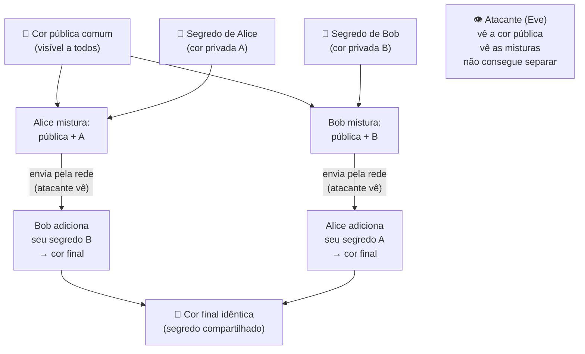
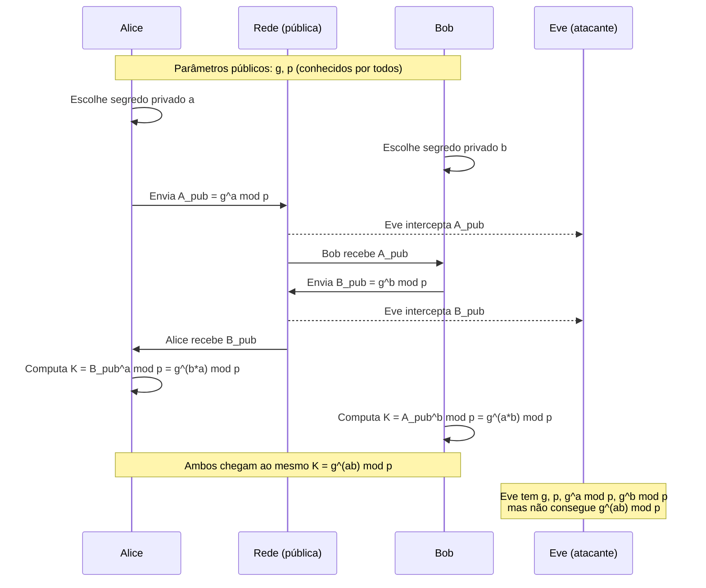
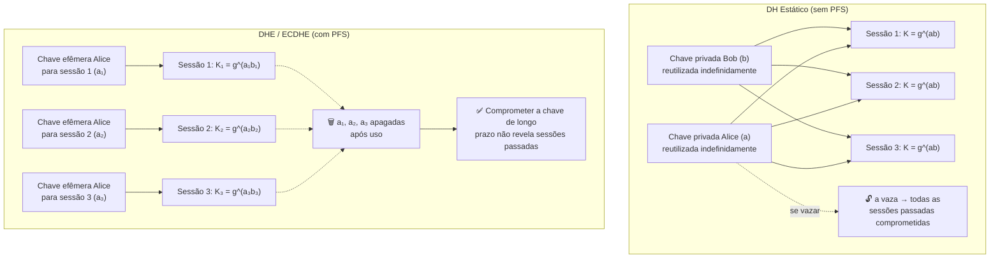
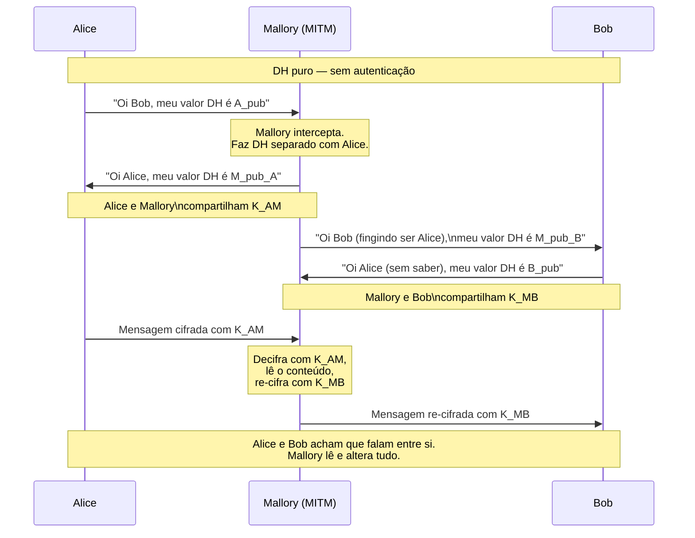
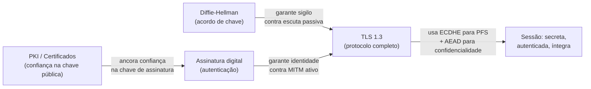

# Troca de chaves

> [!abstract] TL;DR
> Alice e Bob nunca se encontraram. O atacante vê **todo** o tráfego entre eles. E ainda assim, no final do
> protocolo, os dois compartilham um segredo que o atacante não tem. Isso é a troca de chaves: derivar um
> segredo comum sobre um canal público — não transmitindo-o, mas **computando-o de formas assimétricas**.
> Diffie-Hellman (1976) tornou isso possível. ECDH tornou isso eficiente. Forward secrecy tornou isso seguro no
> tempo. E a falha central — que DH puro não autentica ninguém — é o motivo pelo qual PKI e assinaturas digitais
> existem.

---

## O problema: segredo em canal aberto

Você quer criptografia simétrica — ela é rápida, eficiente, e com AES-GCM é segura. Mas criptografia simétrica
exige que Alice e Bob **já compartilhem uma chave secreta**. Como eles estabelecem essa chave se só se comunicam
por um canal que o atacante monitora integralmente?

Três saídas ingênuas — todas quebradas:

| Ideia ingênua | Por que falha |
|---|---|
| Combinar a chave antes, fora de banda | Escala zero: não funciona com milhões de servidores |
| Transmitir a chave pelo canal | O atacante lê a chave junto com Alice e Bob |
| Cifrar a chave com outra chave | Regresso infinito: de onde veio a chave que cifra a chave? |

A solução real é contra-intuitiva: Alice e Bob trocam **valores públicos** e cada um computa localmente um valor
que o atacante, mesmo vendo tudo, não consegue reproduzir. Para isso funcionar, precisa existir uma operação que
é fácil de fazer em uma direção e computacionalmente inviável no sentido inverso — uma **função de mão única**.

---

## A analogia das tintas

Antes da matemática, uma intuição física que Diffie e Hellman usavam para explicar o protocolo:

> [!info] Leitura do diagrama
> Ambas as setas "envia pela rede" chegam à Eve, mas ela só vê as misturas — não os segredos individuais.
> Misturar tintas é fácil; separar a mistura de volta nas cores originais é (praticamente) impossível. Esse é o
> coração da analogia: a operação de mistura é a **exponenciação modular**, e "separar" é o **logaritmo
> discreto** — computacionalmente inviável para parâmetros grandes.

---

## Diffie-Hellman passo a passo

O protocolo publicado em ["New Directions in Cryptography"](https://ee.stanford.edu/~hellman/publications/24.pdf)
(Diffie & Hellman, 1976) funciona com aritmética modular sobre inteiros.

**Parâmetros públicos** (todos os podem ver):
- `p` — um número primo grande (ex.: 2048+ bits)
- `g` — um gerador do grupo multiplicativo mod p (geralmente 2 ou 5)

**Segredos privados** (nunca saem da máquina de cada parte):
- `a` — escolhido aleatoriamente por Alice
- `b` — escolhido aleatoriamente por Bob

**O protocolo:**

> [!info] Leitura do diagrama
> O ponto crítico: Alice computa `(gᵇ mod p)ᵃ mod p` e Bob computa `(gᵃ mod p)ᵇ mod p`. Pela propriedade da
> exponenciação, os dois resultados são iguais — ambos chegam a `g^(ab) mod p`. Eve tem `gᵃ mod p` e
> `gᵇ mod p`, mas computar `g^(ab) mod p` a partir disso é o **Problema do Logaritmo Discreto (DLP)** — para
> parâmetros bem escolhidos, não existe algoritmo eficiente conhecido.

**Concretamente:**

> [!example] Exemplo numérico (simplificado para leitura)
> - `p = 23`, `g = 5`
> - Alice escolhe `a = 6` → envia `5^6 mod 23 = 8`
> - Bob escolhe `b = 15` → envia `5^15 mod 23 = 19`
> - Alice computa `19^6 mod 23 = 2`
> - Bob computa `8^15 mod 23 = 2`
> - Segredo compartilhado: `K = 2`
> - Eve vê `g=5, p=23, 8, 19` — mas encontrar `a` ou `b` a partir disso é o logaritmo discreto.
> (Em produção, `p` tem 2048+ bits e o espaço de busca torna força bruta inviável.)

A segurança do DH repousa inteiramente no DLP. Para a prova formal e a teoria dos grupos, veja
[[03-Dominios/Ciência/Matemática para Computação/15 - Aritmética modular e Fermat-Euler]] — aqui
importa a intuição: exponenciar é fácil, inverter (logaritmar) é difícil.

---

## ECDH: a mesma ideia, curvas elípticas

DH clássico (sobre inteiros) exige primos de 2048+ bits para segurança equivalente a AES-128. O motivo: o
melhor algoritmo para DLP sobre inteiros (Number Field Sieve) é sub-exponencial.

**Curvas elípticas** têm um DLP mais difícil — o melhor algoritmo conhecido é exponencial. Consequência:
chaves de **256 bits** em ECDH oferecem segurança equivalente a primos de 3072 bits no DH clássico.

> [!tip] Por que isso importa na prática
> - Handshakes TLS mais rápidos (menos bits para transmitir e processar)
> - Menos memória e CPU — relevante em IoT e mobile
> - O padrão moderno em TLS 1.3 é **X25519** (Curve25519 de Daniel J. Bernstein, definida na RFC 7748)
> - X25519 também resiste a algumas ataques de implementação comuns em curvas NIST

O grupo matemático muda (pontos de uma curva em vez de inteiros mod p), mas a estrutura do protocolo é
idêntica: cada parte contribui com uma parcela pública, o segredo compartilhado é o resultado de uma operação
que só quem tem a chave privada pode completar.

---

## Forward Secrecy (PFS)

Imagine que Alice e Bob estabelecem uma chave DH **estática** — a mesma chave `a` de Alice é usada em todas as
sessões por meses. Um atacante paciente pode:

1. Gravar todo o tráfego cifrado hoje.
2. Comprometer a chave privada estática de Alice amanhã (vazamento, hack, ordem judicial).
3. **Decifrar retroativamente** todo o tráfego gravado.

Isso é o ataque **"harvest now, decrypt later"** — especialmente preocupante no horizonte da computação quântica
([[21 - Criptografia pós-quântica]]).

**Forward secrecy** (ou Perfect Forward Secrecy, PFS) resolve isso com chaves **efêmeras**:

> [!info] Leitura do diagrama
> À esquerda, a chave privada estática é o ponto único de falha: vaza uma vez, compromete tudo. À direita,
> cada sessão usa um par efêmero descartado imediatamente após o handshake — a chave de longo prazo do servidor
> (usada apenas para **autenticar**, não para derivar o segredo) não expõe sessões passadas.

**Na prática:**
- `DHE` = Diffie-Hellman Efêmero (grupo finito)
- `ECDHE` = Elliptic Curve Diffie-Hellman Efêmero — preferido
- **TLS 1.3 (RFC 8446) exige PFS**: apenas ECDHE e DHE são permitidos como key exchange. Não há mais RSA key
  exchange estático. Isso não é opcional — é mandatório na spec.

> [!warning] DH Estático ≠ PFS
> DH com chaves fixas garante sigilo contra observador **passivo no momento**, mas não contra adversário que
> obtém a chave depois. PFS exige descartabilidade: a segurança de sessões passadas não pode depender de
> segredos que ainda existem no futuro.

---

## A falha central: DH puro não autentica

Este é o insight mais importante da nota — e o que mais candidatos erram em entrevista.

DH resolve o problema do **bisbilhoteiro passivo**: alguém que só escuta não consegue derivar o segredo. Mas DH
puro não defende contra um atacante **ativo** que pode interceptar e modificar mensagens — o
**Man-in-the-Middle (MITM)**.

> [!info] Leitura do diagrama
> Mallory estabelece **dois** handshakes DH independentes: um com Alice e outro com Bob. Cada par acredita ter
> negociado um segredo com o outro — mas na verdade negociou com Mallory. Todo o tráfego passa por ela,
> legível e modificável. O canal é "seguro" contra escuta passiva, mas completamente comprometido.

**Por que isso acontece?**
DH prova que você chegou a um segredo compartilhado com *alguém*. Não prova com *quem*. Falta **autenticação
de identidade**.

A solução: combinar DH com **assinaturas digitais**. O servidor (ou cliente) assina seu valor DH efêmero com
sua chave privada de longo prazo. Quem verifica a assinatura sabe que o valor DH veio de quem diz ter vindo.
Isso exige que a chave pública de verificação já seja conhecida e confiável — o que é o trabalho da **PKI**
([[11 - PKI e certificados]]).

**O mapa conceitual:**

> [!info] Leitura do diagrama
> Troca de chaves, assinatura e PKI são três coisas distintas que se combinam. DH (ou ECDH) resolve *como*
> combinar um segredo. Assinatura resolve *com quem*. PKI resolve *por que confiar* na chave de assinatura.
> TLS 1.3 é o protocolo que orquestra as três camadas. Ver [[14 - Criptografia em trânsito e em repouso]]
> para o handshake completo.

---

## A história: Merkle puzzles (1974)

Ralph Merkle concebeu a primeira solução para key agreement público em 1974 — dois anos antes de
Diffie-Hellman — mas o paper foi inicialmente rejeitado pelos revisores como "não relevante para comunicação
segura". Merkle o submeteu novamente e ele foi publicado em 1978.

A ideia de Merkle era elegante e pedagógica: Bob envia a Alice N quebra-cabeças (puzzles), cada um criptografado
com uma chave fraca diferente, e cada puzzle contém um identificador e uma chave potencial. Alice escolhe um
puzzle ao acaso, quebra-o por força bruta (fácil, pois é fraco), e usa a chave encontrada nele. Bob sabe qual
chave está em qual puzzle. Alice avisa a Bob qual identificador ela escolheu, e Bob sabe a chave correspondente.

O atacante precisaria quebrar todos os N puzzles para encontrar o certo — custo O(N). Alice e Bob gastam
O(√N). Com N = 1.000.000, o atacante tem custo 1.000.000× maior. Isso é segurança — assimétrica entre atacante
e defensor — mas só por uma constante, não por intratabilidade computacional. A diferença fundamental do DH
é que a assimetria DH é **exponencial**: o atacante enfrenta um problema matematicamente diferente (DLP), não
apenas mais trabalho do mesmo tipo de problema.

> [!note] Por que Merkle importa na história
> Merkle demonstrou que key agreement sem encontro prévio era possível *em princípio*. Diffie e Hellman
> formalizaram o problema e encontraram uma solução de assimetria computacional — o salto qualitativo que
> torna o protocolo prático em qualquer escala.

---

## Como o TLS 1.3 usa ECDHE na prática

Vale ver como os conceitos desta nota se encaixam no handshake real de TLS 1.3 (simplificado):

1. **ClientHello**: cliente anuncia grupos suportados (ex.: `x25519`, `secp256r1`) e envia seu valor DH efêmero
   `C_pub` para os grupos oferecidos.
2. **ServerHello + Certificate + CertificateVerify**: servidor escolhe o grupo, envia `S_pub` (seu valor DH
   efêmero), **assina** o transcript do handshake com sua chave privada de longo prazo (RSA ou EC), e anexa
   seu certificado.
3. **Derivação do segredo**: cliente e servidor computam `K = C_priv × S_pub` (ou equivalente na curva). Ambos
   chegam ao mesmo ponto de curva → segredo compartilhado.
4. **KDF (HKDF)**: o segredo bruto do DH nunca é usado diretamente como chave. Passa por uma **Key Derivation
   Function** (HKDF, baseada em HMAC-SHA-256/384) que deriva múltiplas chaves: uma para cifrar dados do
   cliente→servidor, outra para servidor→cliente, etc.
5. **Finished**: cada lado envia um MAC sobre o transcript completo do handshake, provando que derivou as mesmas
   chaves sem modificação (detecta MITM que não conseguiu forjar a assinatura do servidor).

> [!tip] O que essa sequência garante
> - **Sigilo**: ECDHE garante que o segredo não é derivável de nenhuma mensagem pública.
> - **PFS**: as chaves efêmeras C_priv e S_priv são descartadas após Finished.
> - **Autenticação**: a assinatura em CertificateVerify prova que S_pub veio do dono do certificado.
> - **Integridade do handshake**: Finished com MAC garante que nenhuma mensagem foi alterada por MITM.
> TLS 1.3 removeu 1 round-trip em relação ao TLS 1.2 — o cliente pode enviar dados de aplicação já no
> primeiro voo após ClientHello (0-RTT em casos específicos, com caveats de replay).

---

## Caso histórico: Logjam (2015)

Em maio de 2015, pesquisadores publicaram o ataque **Logjam**: servidores configurados com parâmetros DH de
512 bits (os "export-grade" da era 1990s, obrigatórios por lei para exportação dos EUA) podiam ter seus
handshakes rebaixados por um MITM ativo. Para parâmetros de 512 bits, o Number Field Sieve rodando em clusters
conseguia quebrar o DLP em horas.

O impacto foi grande: ~8% dos sites Alexa Top 1M eram vulneráveis. Além disso, os pesquisadores estimaram que
o NSA tinha capacidade para pré-computar logaritmos discretos para os grupos de 1024 bits mais comuns — o que
explicaria decifração em massa de VPNs.

> [!warning] A lição do Logjam
> Parâmetros DH precisam ser grandes **e** únicos por servidor. O ataque explora que muitos servidores usavam
> **exatamente os mesmos** parâmetros (reutilizados de RFCs antigas), permitindo pré-computação. TLS 1.3 resolve
> isso mandatoriamente: nenhum cipher suite de export, ECDHE preferido (X25519), grupos fracos removidos.

---

## Linha do tempo

| Ano | Marco |
|---|---|
| 1974 | Ralph Merkle propõe "Merkle puzzles" — primeira ideia de key agreement público (O(n²) para atacante) |
| 1976 | Diffie & Hellman — "New Directions in Cryptography" — o protocolo que define o campo |
| 1985 | ElGamal generaliza DH para criptossistema de chave pública |
| 1992 | EC (curvas elípticas) propostas para DH por Miller (1985) e Koblitz (1987); padronização começa |
| 2006 | Bernstein publica Curve25519 — curva resistente a ataques de timing e livre de patentes |
| 2015 | Logjam expõe parâmetros DH fracos remanescentes da era export-grade |
| 2016 | RFC 7748 padroniza X25519 e X448 |
| 2018 | TLS 1.3 (RFC 8446) — PFS obrigatório, DH estático e RSA key exchange banidos |

---

## Resumo dos conceitos e suas garantias

| Conceito | O que garante | O que NÃO garante |
|---|---|---|
| DH estático | Sigilo contra escuta passiva | PFS; identidade |
| DHE / ECDHE | Sigilo + PFS | Identidade (ainda precisa autenticação) |
| DH + assinatura | Sigilo + PFS + identidade | Confiança na chave pública de quem assina |
| DH + assinatura + PKI | Sigilo + PFS + identidade verificável | Segurança contra computação quântica |

---

## Conexões

- Anterior: [[08 - Criptografia assimétrica]] — chave pública e privada; por que precisamos de cripto híbrida
- Próxima: [[10 - MAC, HMAC e assinaturas digitais]] — integridade e autenticidade; como assinar o valor DH
- [[11 - PKI e certificados]] — a cadeia de confiança que ancora a autenticação no MITM
- [[14 - Criptografia em trânsito e em repouso]] — como DH + assinatura + AEAD viram o handshake TLS completo
- [[03-Dominios/Ciência/Matemática para Computação/15 - Aritmética modular e Fermat-Euler]] — a teoria dos grupos e o problema do logaritmo discreto que fundamenta a segurança do DH

> [!summary] Resumo em uma linha
> Diffie-Hellman permite que duas partes combinem um segredo em canal público explorando a assimetria entre
> exponenciação (fácil) e logaritmo discreto (inviável); ECDHE torna isso eficiente; PFS torna isso seguro
> no tempo; mas DH puro não autentica — contra MITM ativo, é necessário combinar com assinaturas e PKI.

---

## Em entrevista

Troca de chaves aparece em entrevistas de infra, backend com TLS, e qualquer papel que envolva design de
sistemas seguros. As perguntas típicas vão do conceitual ("como funciona o handshake TLS?") ao de design
("por que TLS 1.3 remove RSA key exchange?").

**Frases prontas (inglês):**

> *"Diffie-Hellman solves the key establishment problem: two parties can derive a shared secret over a public
> channel without ever transmitting it — they each contribute a public value, and the shared secret is computed
> locally by both sides using their private inputs."*

> *"The security rests on the discrete logarithm problem: computing g to the power a mod p is easy, but
> recovering a from g^a mod p is computationally infeasible for large parameters."*

> *"Forward secrecy means using ephemeral key pairs — a fresh DH keypair per session, discarded immediately
> after the handshake. If the server's long-term private key is compromised later, past sessions remain
> confidential because the session keys no longer exist."*

> *"DH alone doesn't authenticate. A passive eavesdropper can't recover the secret, but an active
> man-in-the-middle can intercept both sides, establish separate DH sessions with each, and relay traffic while
> reading everything. That's why key exchange must be combined with digital signatures and a PKI."*

> *"TLS 1.3 mandates forward secrecy: the only allowed key exchange modes are ECDHE and DHE. Static RSA key
> exchange — where the same server private key is used to encrypt the pre-master secret — is completely
> removed."*

> *"ECDH over X25519 uses 256-bit keys for the same security level as 3072-bit classical DH. The discrete log
> problem on elliptic curves has no known sub-exponential algorithm, so the key sizes can be much smaller."*

**Vocabulário PT → EN:**

| Português | Inglês |
|---|---|
| Troca de chaves | Key exchange / key establishment |
| Segredo compartilhado | Shared secret |
| Logaritmo discreto | Discrete logarithm |
| Chave efêmera | Ephemeral key |
| Sigilo futuro perfeito | Perfect forward secrecy (PFS) |
| Homem no meio | Man-in-the-middle (MITM) |
| Gerador do grupo | Group generator |
| Curva elíptica | Elliptic curve |
| Parâmetros de domínio | Domain parameters |
| Atacante passivo/ativo | Passive/active adversary |
| Cifra híbrida | Hybrid encryption |
| Bisbilhoteiro | Eavesdropper |

---

> [!info] Lastro
> 1. Diffie, W. & Hellman, M. E. (1976). "New Directions in Cryptography." *IEEE Transactions on Information
>    Theory*, 22(6), 644–654. — O paper original. [https://ee.stanford.edu/~hellman/publications/24.pdf](https://ee.stanford.edu/~hellman/publications/24.pdf)
> 2. Langley, A., Hamburg, M. & Turner, S. (2016). **RFC 7748 — Elliptic Curves for ECDH(E): Curve25519 and
>    Curve448**. IETF. [https://www.rfc-editor.org/rfc/rfc7748](https://www.rfc-editor.org/rfc/rfc7748)
> 3. Rescorla, E. (2018). **RFC 8446 — The Transport Layer Security (TLS) Protocol Version 1.3**. IETF. —
>    Seção 4.2.7 (Supported Groups) e Apêndice E.1 (por que RSA key exchange foi removido).
>    [https://www.rfc-editor.org/rfc/rfc8446](https://www.rfc-editor.org/rfc/rfc8446)
> 4. Adrian, D. et al. (2015). "Imperfect Forward Secrecy: How Diffie-Hellman Fails in Practice" (*Logjam*).
>    *ACM CCS 2015*. [https://weakdh.org/imperfect-forward-secrecy-ccs15.pdf](https://weakdh.org/imperfect-forward-secrecy-ccs15.pdf)
> 5. Ferguson, N., Schneier, B. & Kohno, T. (2010). *Cryptography Engineering*. Wiley. — Capítulo 11
>    (Key Negotiation) explica PFS e autenticação do DH em linguagem acessível a engenheiros.
> 6. Bernstein, D. J. (2006). "Curve25519: New Diffie-Hellman Speed Records." *PKC 2006*, LNCS 3958.
>    [https://cr.yp.to/ecdh/curve25519-20060209.pdf](https://cr.yp.to/ecdh/curve25519-20060209.pdf)
