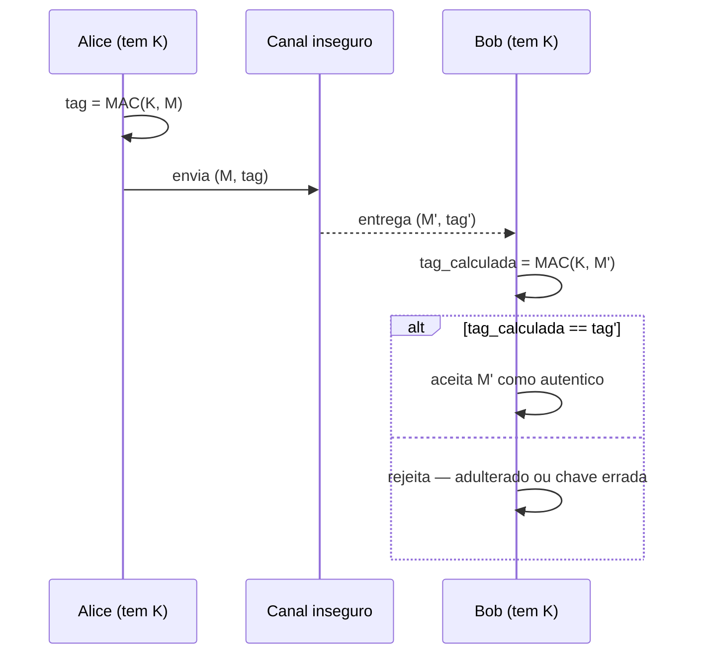
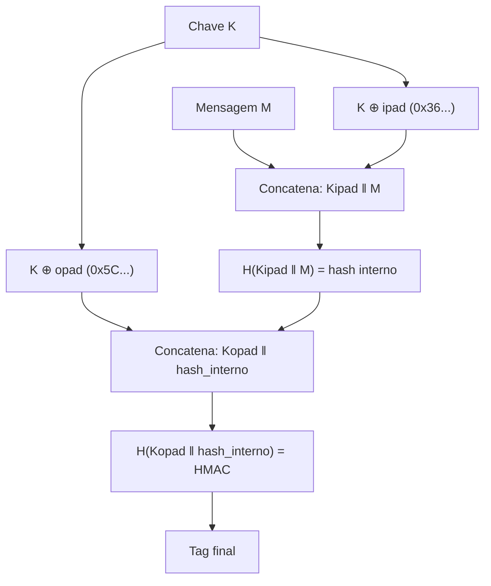
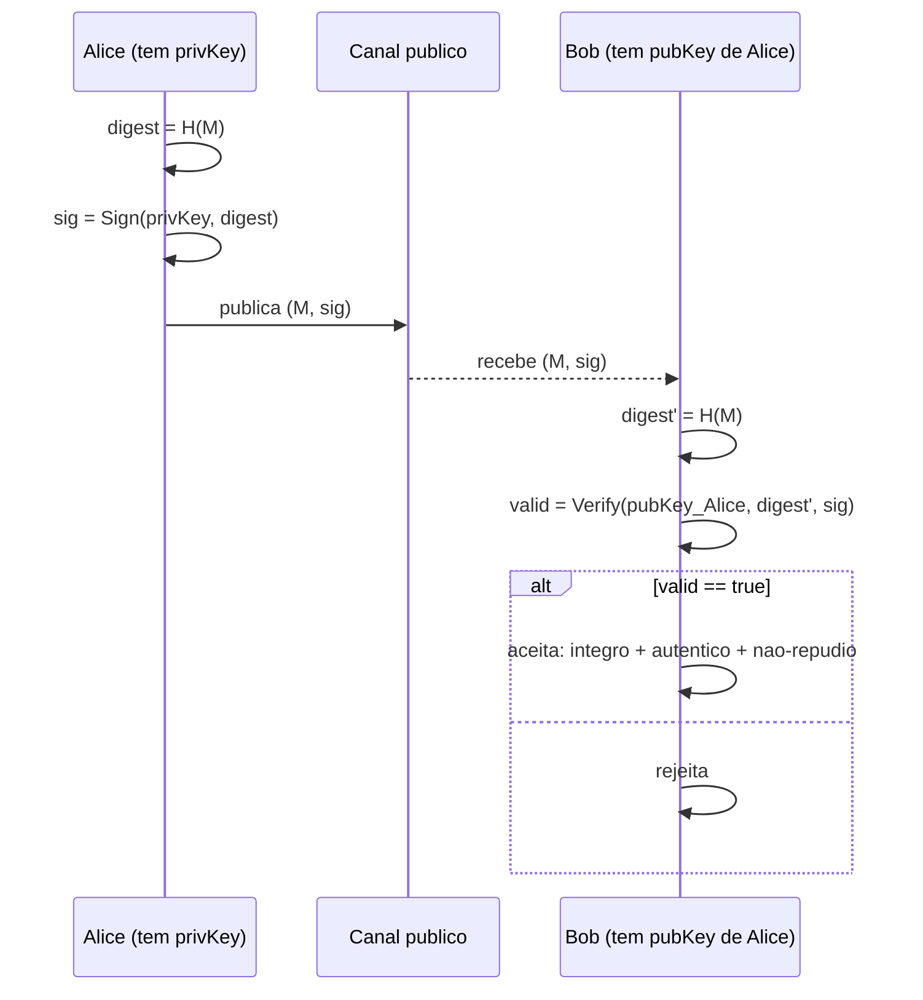
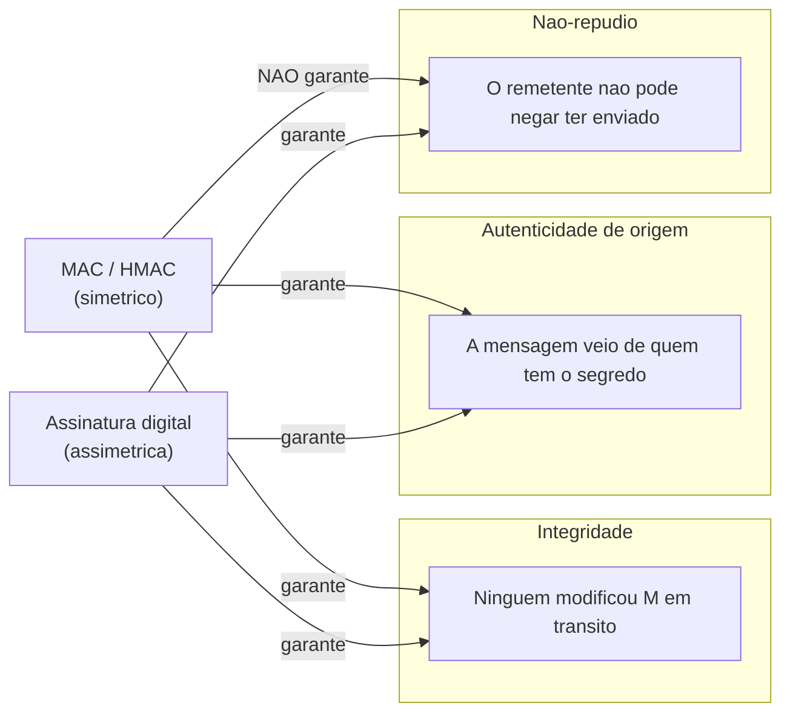
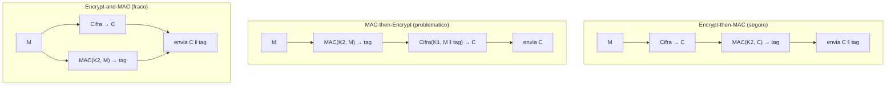

# MAC, HMAC e assinaturas digitais

> [!abstract] TL;DR
> Cifrar protege confidencialidade; **MAC e assinatura digital protegem integridade e autenticidade**. MAC é simétrico: prova que a mensagem não foi alterada e veio de alguém com a chave compartilhada — mas não oferece não-repúdio. Assinatura digital é assimétrica: assina com a chave privada, verifica com a pública, e acrescenta o **não-repúdio** (você não pode negar que assinou). HMAC é a construção correta de MAC sobre hash (RFC 2104). A ordem de composição com cifra importa: **Encrypt-then-MAC** é o padrão seguro.

---

## O problema: cifrar não é suficiente

Um sistema que só cifra garante que um adversário passivo não lê o conteúdo. Mas não garante duas coisas fundamentais para comunicação segura:

1. **Integridade** — ninguém modificou os bytes em trânsito.
2. **Autenticidade** — a mensagem veio de quem diz ter enviado.

Um adversário ativo pode, sem saber o plaintext, modificar o ciphertext e provocar decifração corrompida ou explorar vulnerabilidades como padding oracles (→ [[15 - Ataques a sistemas cripto]]). Cifra sem autenticação abre vetores sérios.

A solução é acrescentar uma **etiqueta de autenticidade** — um valor pequeno e verificável que depende ao mesmo tempo da mensagem e de um segredo. Essa etiqueta é o MAC.

> [!tip] Analogia de envelope
> Cifrar é como colocar a carta num envelope opaco — ninguém lê. MAC é como selar o envelope com lacre de cera — qualquer adulteração rompe o lacre. Assinatura digital é o lacre com brasão único: só você tem o sinete, e qualquer pessoa pode reconhecer o brasão.

---

## MAC — Message Authentication Code

### Definição

Um MAC é uma função:

```
tag = MAC(K, M)
```

onde K é uma chave secreta compartilhada e M é a mensagem. O receptor, que também tem K, recalcula o MAC e compara com a tag recebida. Se baterem, a mensagem é autêntica e íntegra.

### Propriedades

| Propriedade | MAC |
|---|---|
| Integridade | ✓ |
| Autenticidade de origem | ✓ (quem tem K) |
| Não-repúdio | ✗ |
| Confidencialidade | ✗ |

O ponto crucial: **qualquer detentor de K pode gerar tags válidas**. Em um modelo com dois participantes (Alice e Bob compartilhando K), Alice não pode provar para um terceiro que foi Bob quem enviou — Bob poderia alegar que Alice forjou a tag. Isso é ausência de não-repúdio.

### Fluxo MAC: geração e verificação



> [!info] Leitura do diagrama
> Alice gera a tag antes de enviar. Bob recalcula do zero com a mesma chave. A comparação deve ser feita em **tempo constante** (usando `hmac.compare_digest` em Python, por exemplo) — comparação byte-a-byte com short-circuit vaza informação de timing e permite forja progressiva.

---

## HMAC — A construção correta

### Por que não `hash(K ‖ M)`?

A construção ingênua de MAC sobre hash é `hash(K ‖ M)` — concatenar a chave antes da mensagem e aplicar o hash. Parece razoável, mas é vulnerável ao **length-extension attack** em hashes Merkle-Damgård (MD5, SHA-1, SHA-256).

O estado interno de um hash Merkle-Damgård ao final de `hash(K ‖ M)` é exposto na saída. Um adversário que conhece `hash(K ‖ M)` e o comprimento de K ‖ M pode calcular `hash(K ‖ M ‖ padding ‖ extra)` **sem conhecer K**. Isso viola completamente a segurança do MAC. (→ [[06 - Hashing criptográfico]] e [[15 - Ataques a sistemas cripto]])

### A construção HMAC (RFC 2104)

HMAC usa a chave em **dois passos**, criando um hash interno e um externo:

```
HMAC(K, M) = H( (K ⊕ opad) ‖ H( (K ⊕ ipad) ‖ M ) )
```

Onde:
- `ipad` = byte `0x36` repetido B vezes (B = tamanho do bloco do hash)
- `opad` = byte `0x5C` repetido B vezes
- Se `len(K) > B`, pré-aplica-se H para comprimir a chave
- `⊕` é XOR bit-a-bit

### Construção HMAC passo a passo



> [!info] Leitura do diagrama
> O hash interno processa a mensagem misturada com a chave via ipad. O hash externo envolve o resultado com a chave via opad. Mesmo que um adversário aplique length-extension ao hash interno, o resultado fica dentro do segundo hash — a tag final não é exposta diretamente, bloqueando o ataque. `ipad` e `opad` são constantes distintas para garantir que os dois usos da chave sejam independentes.

### Instâncias comuns

| Nome | Hash base | Tag size |
|---|---|---|
| HMAC-SHA-256 | SHA-256 | 256 bits |
| HMAC-SHA-384 | SHA-384 | 384 bits |
| HMAC-SHA-512 | SHA-512 | 512 bits |
| HMAC-SHA3-256 | SHA3-256 | 256 bits |

> [!warning] MD5 e SHA-1 são legados
> HMAC-MD5 e HMAC-SHA-1 ainda aparecem em sistemas legados (TLS antigo, S/MIME antigo). Para novos sistemas, use HMAC-SHA-256 ou superior. SHA-3 não é vulnerável a length-extension por design (construção Keccak/sponge), mas o prefixo `hash(K ‖ M)` ainda viola outras propriedades de MAC.

---

## Assinatura digital

### O que muda com assimetria

MAC exige chave compartilhada — ambos os lados têm o segredo. Isso implica:
- Setup custoso (como distribuir K com segurança?)
- Sem não-repúdio (qualquer lado pode gerar tags)

Assinatura digital usa **par de chaves assimétrico**:

```
sig = Sign(privKey, M)        # só o detentor da privKey pode assinar
valid = Verify(pubKey, M, sig) # qualquer pessoa com pubKey pode verificar
```

Porque só você tem a chave privada, **não pode alegar que outra pessoa gerou a assinatura** — isso é o não-repúdio.

### Assinar o hash, não a mensagem

Na prática, assina-se o **hash da mensagem**, não a mensagem inteira:

```
sig = Sign(privKey, H(M))
```

Razões:
1. Algoritmos assimétricos (RSA, ECDSA) operam sobre blocos pequenos — assinar terabytes seria inviável.
2. O hash criptograficamente vincula a assinatura à mensagem integral.
3. Eficiência: H(M) tem tamanho fixo independente do tamanho de M.

### Fluxo de assinatura e verificação



> [!info] Leitura do diagrama
> Alice nunca transmite sua chave privada. Bob usa a chave pública de Alice — que pode ser distribuída livremente — para verificar. Se a verificação passa, Bob tem certeza matemática de que (a) M não foi alterado, (b) foi Alice quem assinou, e (c) Alice não pode negar. Esse terceiro ponto é o não-repúdio: ele existe porque só Alice tem a chave privada correspondente.

### Algoritmos de assinatura digital

| Algoritmo | Base matemática | Padrão | Determinístico? | Observação |
|---|---|---|---|---|
| RSA-PSS | Fatoração | FIPS 186-5 | Não (PSS usa salt aleatório) | RSA-PKCS1v1.5 legado; PSS é o modo seguro |
| ECDSA | Curva elíptica | FIPS 186-5 | Não (k aleatório) | k repetido → vazamento de privKey (Sony PS3) |
| EdDSA/Ed25519 | Curva Edwards 25519 | FIPS 186-5 + RFC 8032 | Sim (k derivado deterministicamente) | Recomendado para novos sistemas; resistente a k-repetição |
| DSA clássico | Logaritmo discreto | Descontinuado em FIPS 186-5 | Não | Evitar |

> [!warning] k aleatório em ECDSA
> O nonce k em ECDSA deve ser único e imprevisível por assinatura. A Sony reutilizou k estático no PlayStation 3, expondo a chave privada inteira. EdDSA elimina esse risco derivando k deterministicamente da chave privada + mensagem.

---

## As três garantias — distinção crítica para entrevista



> [!info] Leitura do diagrama
> MAC e assinatura digital ambos garantem integridade e autenticidade, mas só assinatura garante não-repúdio. A raiz da diferença é o modelo de chave: simétrico × assimétrico. Quando um sistema exige accountability legal (contratos digitais, transações financeiras), assinatura é mandatória.

### Tabela-resumo das garantias

| Mecanismo | Integridade | Autenticidade | Não-repúdio | Confidencialidade |
|---|:---:|:---:|:---:|:---:|
| Hash sem chave | ✓ | ✗ | ✗ | ✗ |
| MAC / HMAC | ✓ | ✓ | ✗ | ✗ |
| Assinatura digital | ✓ | ✓ | ✓ | ✗ |
| Cifra simétrica | ✗ | ✗ | ✗ | ✓ |
| AEAD (GCM, ChaCha20-Poly1305) | ✓ | ✓ | ✗ | ✓ |

> [!note] AEAD não dá não-repúdio
> Mesmo AEAD — que combina cifra + MAC internamente — usa chave simétrica. Não há não-repúdio. Para não-repúdio + confidencialidade combinados, usa-se assinatura + cifra (ex.: PGP, S/MIME, TLS com certificado de cliente).

---

## Ordem de composição: Encrypt-then-MAC

Quando se quer cifra **e** autenticação com primitivas separadas, a ordem importa. Bellare e Namprempre (2000) analisaram as três composições possíveis.

### As três ordens



> [!info] Leitura do diagrama
> Três abordagens lado a lado. No Encrypt-then-MAC, a tag autentica o ciphertext — o receptor verifica a tag antes de decifrar. No MAC-then-Encrypt, o MAC é sobre o plaintext e fica cifrado junto. No Encrypt-and-MAC, o MAC é sobre o plaintext mas viaja a descoberto.

### Por que Encrypt-then-MAC vence

**Encrypt-then-MAC (EtM)**:
- A tag autentica o ciphertext, não o plaintext.
- O receptor **verifica a tag antes de decifrar**. Se a tag falha, descarta sem tocar nos bytes cifrados — isso elimina ataques de padding oracle (CBC padding oracle, POODLE) porque o attacker nunca chega à fase de decifração.
- Prova formal: EtM garante IND-CCA2 (confidencialidade contra chosen-ciphertext) + autenticidade, desde que a cifra seja IND-CPA e o MAC seja seguro.

**MAC-then-Encrypt (MtE)**:
- Usado no TLS ≤ 1.2 com CBC + HMAC — responsável por BEAST, Lucky13 e variantes de padding oracle.
- O problema: decifrar acontece antes de verificar o MAC, expondo o mecanismo de padding ao attacker.

**Encrypt-and-MAC (E&M)**:
- Usado no SSH.
- O MAC é sobre o plaintext → pode vazar informação sobre o plaintext mesmo que o ciphertext seja seguro (e.g., se duas mensagens iguais geram MACs iguais, confirma-se igualdade de plaintext).
- Não provadamente seguro como esquema de autenticação de ciphertext.

### Resumo das ordens

| Composição | MAC sobre | Verifica antes de decifrar? | Resistente a padding oracle? | Usado em |
|---|---|:---:|:---:|---|
| Encrypt-then-MAC | ciphertext | ✓ | ✓ | TLS 1.3 (via AEAD), IPSec |
| MAC-then-Encrypt | plaintext | ✗ | ✗ | TLS ≤ 1.2 (legado) |
| Encrypt-and-MAC | plaintext | ✗ (descobre no final) | ✗ | SSH |

> [!tip] AEAD resolve tudo isso embutido
> AES-GCM e ChaCha20-Poly1305 são construções AEAD que implementam Encrypt-then-MAC internamente, com uma única operação atômica. Não há como usar na ordem errada — a API não deixa decifrar sem verificar a tag. Para novos sistemas, prefira AEAD a compor primitivas manualmente.

---

## Modelo de segurança: o que "seguro" significa formalmente

Entender as definições formais ajuda a responder perguntas de entrevista sobre "por que X é inseguro?" sem depender apenas de lembrar ataques específicos.

### Segurança de MAC: EUF-CMA

Um MAC é **Existencialmente Inforgeable under Chosen-Message Attack (EUF-CMA)** se nenhum adversário polinomialmente limitado, mesmo após consultar o oráculo MAC com qualquer número de mensagens de sua escolha, consegue produzir uma tag válida para uma mensagem **nova** (que não consultou antes).

Consequência prática: o adversário pode observar pares (M₁, tag₁), (M₂, tag₂), ... e ainda assim não consegue calcular tag₃ válida para M₃. É isso que HMAC provê.

A construção ingênua `hash(K ‖ M)` viola EUF-CMA porque length-extension permite ao adversário, dado (M₁, tag₁), construir (M₁ ‖ padding ‖ extra, tag_nova) válido sem consultar o oráculo.

### Segurança de assinatura: EUF-CMA assimétrico

O mesmo conceito se aplica a assinaturas — o adversário pode ver pares (M, sig) gerados pelo detentor da privKey e ainda assim não consegue forjar (M_novo, sig_novo). Isso requer que o esquema de assinatura seja resistente a chosen-message attacks.

RSA-PKCS1v1.5 tem problemas conhecidos nesse modelo (ataques de Bleichenbacher para decifração, ataques de adaptação de assinatura em configurações fracas). RSA-PSS foi projetado para ser seguro no modelo de oráculo aleatório (ROM) com prova formal redutível ao problema RSA.

> [!note] ROM não é o mundo real
> A prova de segurança de RSA-PSS assume que o hash H se comporta como um oráculo aleatório ideal. Na prática, H é SHA-256 ou SHA-384 — não um oráculo aleatório. Ainda assim, provas no ROM são o melhor disponível para algoritmos baseados em trapdoor functions, e RSA-PSS é o modo aprovado pelo NIST em FIPS 186-5.

---

## Armadilhas comuns de implementação

Mesmo entendendo a teoria, implementações erradas são a causa mais comum de vulnerabilidades reais em produção.

### 1. Comparação de tag não-constante

```python
# ERRADO — permite timing attack
if computed_tag == received_tag:
    ...

# CORRETO — tempo constante
import hmac
if hmac.compare_digest(computed_tag, received_tag):
    ...
```

Um adversário pode forjar MACs byte-a-byte medindo o tempo de resposta: se o primeiro byte está errado, a comparação retorna rápido; se está certo, continua. Após 256 tentativas × tamanho da tag, o attacker constrói uma tag válida. `compare_digest` compara todos os bytes mesmo após a primeira diferença.

### 2. Reutilização de nonce em ECDSA

```
# Dois documentos distintos, mesmo k → privKey exposta
sig1 = (r1, s1) onde r1 = (k × G).x mod n
sig2 = (r2, s2) onde r2 = (k × G).x mod n

# Se k é o mesmo, então r1 == r2
# s = (hash + privKey × r) / k mod n
# Com duas equações e k comum, privKey é calculável algebricamente
```

A extração da PS3 master key em 2010 usou exatamente isso. Todo código de produção com ECDSA deve usar CSPRNG para k, ou migrar para EdDSA que é deterministico por design.

### 3. Hash truncado inadequado

Truncar um HMAC-SHA-256 de 256 bits para 32 bits (4 bytes) para "economizar espaço" reduz a segurança para 2³² operações — trivialmente quebrado com force brute hoje. O NIST recomenda tags de pelo menos 64 bits para MACs e tipicamente 96-128 bits em protocolos sérios. TLS 1.3 trunca HMAC para 96 bits em alguns contextos (mas com base em análise formal, não por conveniência).

### 4. Verificar assinatura com a chave errada

Em sistemas multi-tenant que gerenciam várias pubKeys, é possível verificar a assinatura de uma mensagem com a pubKey errada e aceitar indevidamente. A assinatura e a chave devem estar vinculadas — é exatamente o que PKI/certificados resolvem (→ [[11 - PKI e certificados]]).

### 5. Esquema "RSA raw" sem hash

Assinar diretamente com RSA sem aplicar hash primeiro (RSA "textbook") é inseguro: o adversário pode combinar assinaturas de mensagens conhecidas para forjar assinaturas de mensagens novas, explorando a estrutura multiplicativa do RSA. Sempre assine `Sign(privKey, H(M))`, nunca `Sign(privKey, M)` diretamente.

> [!danger] Regra de ouro de implementação
> Não implemente primitivas criptográficas do zero. Use bibliotecas auditadas: `cryptography` (Python), `libsodium` (C/C++, com bindings em todas as linguagens), `BouncyCastle` (Java/Kotlin), `WebCrypto API` (browser). Essas bibliotecas resolvem timing attacks, gerenciamento de nonce, padding e outros detalhes sutis que uma implementação manual quase certamente erra.

---

## Casos de uso canônicos

| Caso | Mecanismo ideal | Por quê |
|---|---|---|
| Verificar integridade de download | Hash sem chave (SHA-256) | Sem segredo; integridade pura contra corrupção acidental |
| Autenticar cookie de sessão | HMAC-SHA-256 | Servidor detém K; precisa de autenticidade, não de não-repúdio |
| JWT (HS256 vs RS256) | HMAC-SHA-256 ou RSA/ECDSA | HS256 = simétrico; RS256/ES256 = assimétrico com não-repúdio |
| Assinatura de software | ECDSA/Ed25519 | Distribuidor publica pubKey; qualquer um verifica; não-repúdio |
| TLS 1.3 handshake | HMAC (no Finished) | Autenticar o handshake com chave derivada |
| Contrato digital | RSA-PSS / ECDSA | Não-repúdio legalmente reconhecível |
| Código de verificação bancária (TOTP/HOTP) | HMAC-SHA-1 (RFC 4226) | Chave compartilhada; não requer não-repúdio |

---

## Conexões

**Anterior**: [[09 - Troca de chaves]] — sem troca segura de chave, não há K para MAC nem par de chaves para assinatura.
**Próxima**: [[11 - PKI e certificados]] — PKI distribui e certifica as chaves públicas que tornam assinaturas verificáveis por estranhos.
**Cross-links**:
- [[06 - Hashing criptográfico]] — fundamento de HMAC; length-extension é propriedade do hash Merkle-Damgård.
- [[08 - Criptografia assimétrica]] — matemática de RSA, ECDSA, EdDSA; par de chaves é a base do não-repúdio.
- [[15 - Ataques a sistemas cripto]] — padding oracle, POODLE, length-extension, k-repetition em ECDSA.

> [!summary] Resumo em uma linha
> MAC (simétrico) garante integridade + autenticidade mas não não-repúdio; HMAC é a construção segura de MAC sobre hash (RFC 2104, dois níveis de hash); assinatura digital (assimétrica) acrescenta o não-repúdio; a ordem Encrypt-then-MAC é a composição segura com cifra.

---

## Em entrevista

O tema integridade/autenticidade aparece em cenários de design de sistema ("como você protegeria essa API?"), em perguntas de debugging ("por que esse JWT é vulnerável?") e em questões de fundamentos de criptografia.

Frases em inglês para usar com precisão:

- *"A MAC proves integrity and authenticity but not non-repudiation — both parties share the key, so either could have generated the tag."*
- *"HMAC uses a two-level hash construction — inner and outer — to prevent length-extension attacks that would break a naive `hash(key ‖ message)` scheme."*
- *"Digital signatures use the private key to sign and the public key to verify, which gives us non-repudiation: only the key holder could have produced the signature."*
- *"We should Encrypt-then-MAC: authenticate the ciphertext, not the plaintext. That way we can reject tampered messages before decryption, avoiding padding oracle vulnerabilities."*
- *"ECDSA requires a unique, unpredictable nonce k per signature. k reuse leaks the private key — that's how Sony's PS3 root key was extracted."*
- *"EdDSA is deterministic — it derives k from the private key and message — so it's immune to that class of attack by design."*
- *"In modern systems, prefer AEAD (AES-GCM or ChaCha20-Poly1305) over manual Encrypt-then-MAC composition — AEAD bakes the correct order into a single atomic API."*

**Vocabulário PT → EN:**

| PT | EN |
|---|---|
| Código de autenticação de mensagem | Message Authentication Code (MAC) |
| Assinatura digital | Digital signature |
| Não-repúdio | Non-repudiation |
| Chave compartilhada | Shared / symmetric key |
| Chave privada / pública | Private key / public key |
| Ataque de extensão de comprimento | Length-extension attack |
| Preenchimento (padding oracle) | Padding oracle |
| Cifrar e depois autenticar | Encrypt-then-MAC |
| Autenticidade de origem | Origin authenticity / data origin authentication |
| Etiqueta / tag de autenticação | Authentication tag |
| Nonce de assinatura | Signing nonce (k) |
| Hash com chave | Keyed hash |

---

> [!info] Lastro
> - **RFC 2104** — Krawczyk, H., Bellare, M., Canetti, R. "HMAC: Keyed-Hashing for Message Authentication" (1997). URL: https://www.rfc-editor.org/rfc/rfc2104
> - **NIST FIPS 198-1** — "The Keyed-Hash Message Authentication Code (HMAC)" (2008). URL: https://csrc.nist.gov/publications/detail/fips/198/1/final
> - **NIST FIPS 186-5** — "Digital Signature Standard (DSS)" (2023) — especifica RSA-PSS, ECDSA e EdDSA (Ed25519/Ed448). URL: https://nvlpubs.nist.gov/nistpubs/FIPS/NIST.FIPS.186-5.pdf
> - **RFC 8032** — Josefsson, S., Liusvaara, I. "Edwards-Curve Digital Signature Algorithm (EdDSA)" (2017). URL: https://www.rfc-editor.org/rfc/rfc8032
> - **Bellare, M., Namprempre, C.** "Authenticated Encryption: Relations among Notions and Analysis of the Generic Composition Paradigm". ASIACRYPT 2000. URL: https://eprint.iacr.org/2000/025
> - **Krawczyk, H.** "The Order of Encryption and Authentication for Protecting Communications (or: How Secure Is SSL?)" CRYPTO 2001. URL: https://www.iacr.org/archive/crypto2001/21390309.pdf
