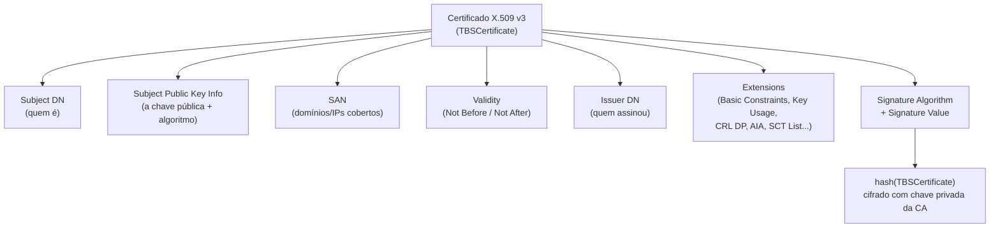
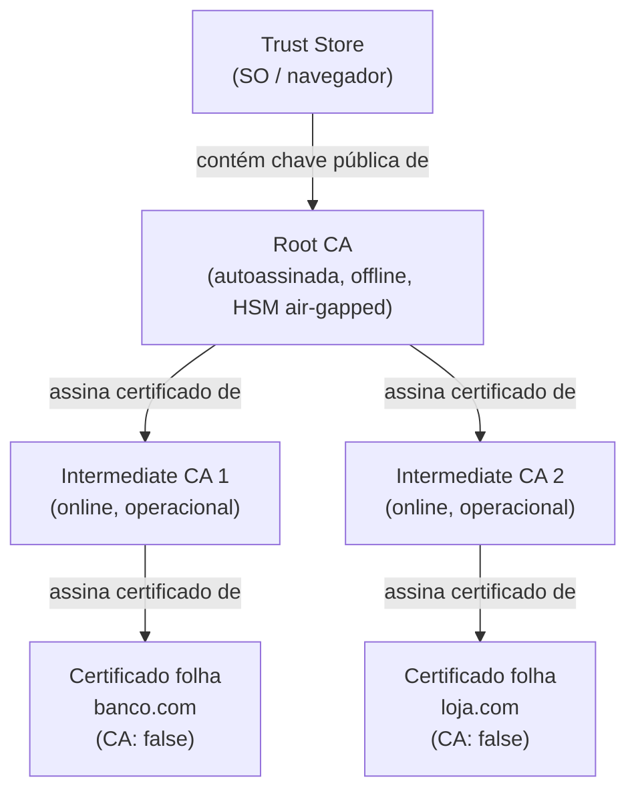
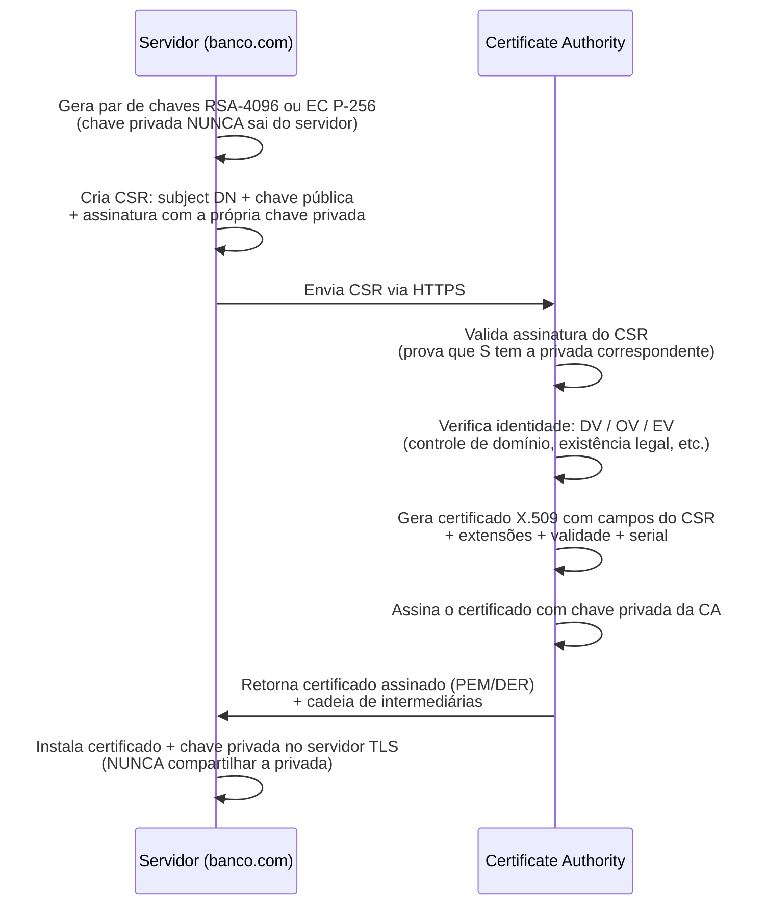
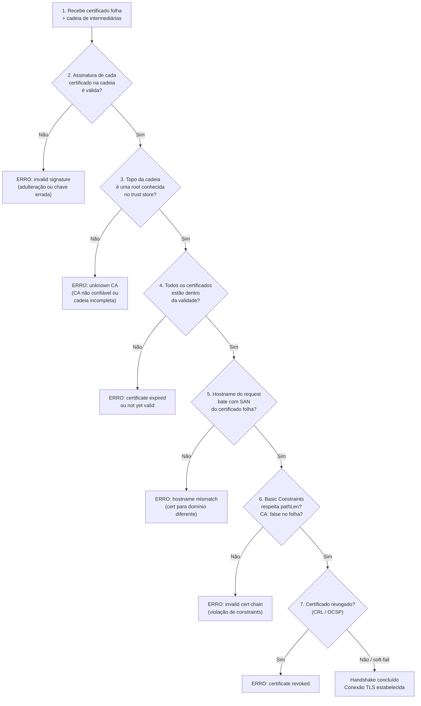
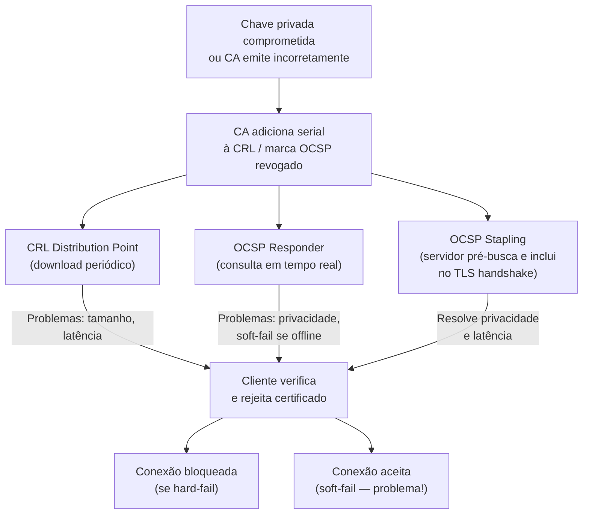
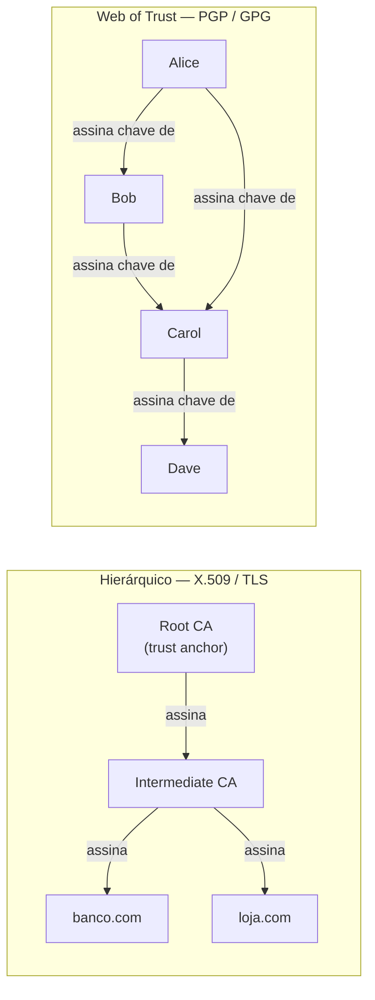

# PKI e certificados

> [!abstract] TL;DR
> Criptografia assimétrica resolve a distribuição de chave — mas cria um novo problema: como saber que a chave pública recebida REALMENTE pertence a quem alega? Sem resposta, qualquer handshake está vulnerável a MITM. PKI (Public Key Infrastructure) resolve isso com **certificados digitais**: documentos assinados por um terceiro confiável (CA) que vinculam uma identidade a uma chave pública. O protocolo X.509 define o formato; a **cadeia de confiança** — folha → intermediária → root CA — é o mecanismo de verificação; revogação (CRL/OCSP/stapling) e Certificate Transparency completam o ecossistema. Let's Encrypt + ACME tornaram certificados gratuitos e automáticos, redefinindo a web.

---

## O problema: a chave pública é anônima

Você quer estabelecer um canal seguro com `banco.com`. O servidor responde com sua chave pública. Mas e se um atacante on-path (MITM) interceptar a resposta e substituir pela chave pública *dele*?

```
Você → [pede chave pública] → Atacante → [encaminha] → banco.com
Você ← [chave do ATACANTE] ← Atacante ← [chave do banco] ← banco.com
```

Agora você cifra com a chave do atacante achando que é a do banco. O atacante decifra, lê, re-cifra com a chave real do banco e encaminha. Cada lado acha que está falando com o outro. A criptografia assimétrica está intacta — e completamente inútil.

Diffie-Hellman tem o mesmo problema ([[09 - Troca de chaves]]): sem autenticar a chave pública recebida, a troca de chaves é segura contra adversário passivo, mas cai para ativo. Essa é a diferença crítica entre *confidencialidade* e *autenticação* — cifrar não autentica.

> [!danger] A raiz do problema
> Criptografia assimétrica garante que **apenas o dono da chave privada** pode decifrar o que você cifrou com a pública correspondente. Mas ela NÃO garante que a chave pública que você tem corresponde a quem você acha que é. Identidade e chave precisam ser vinculadas por alguém externo e confiável.

A PKI é a infraestrutura que cria esse vínculo de forma verificável, escalável e automatizável. Sem ela, TLS seria inútil em escala global.

---

## Certificado digital: o documento de identidade da chave

Um **certificado digital** é um documento que afirma: "esta chave pública pertence a esta entidade", com a afirmação assinada por um terceiro em quem você confia — a **Autoridade Certificadora** (CA, *Certificate Authority*).

O formato padrão é o **X.509 v3**, definido pela RFC 5280. Os campos principais:

| Campo | Significado |
|---|---|
| `Subject` | Quem o certificado identifica — Distinguished Name (DN): `CN=banco.com, O=Banco SA, C=BR` |
| `Issuer` | Quem assinou — o DN da CA |
| `Subject Public Key Info` | A chave pública e o algoritmo (RSA-2048, EC P-256…) |
| `Serial Number` | ID único do certificado dentro desta CA |
| `Validity (Not Before / Not After)` | Janela de validade em UTC |
| `Subject Alternative Name (SAN)` | Domínios e IPs cobertos — campo normativo desde 2000; `CN` é legado |
| `Key Usage` | Uso permitido da chave: `digitalSignature`, `keyEncipherment`, `keyCertSign`… |
| `Extended Key Usage` | Uso estendido: `serverAuth`, `clientAuth`, `codeSigning`, `emailProtection`… |
| `Basic Constraints` | `CA: true/false` + `pathLen` — o que distingue certificado de CA de certificado folha |
| `Authority Key Identifier` | Fingerprint da chave pública da CA que assinou — facilita construção da cadeia |
| `CRL Distribution Points` | URL onde encontrar a lista de revogados da CA emissora |
| `Authority Information Access` | URLs do OCSP responder e da CA emissora (para download da cadeia) |
| `Certificate Policies` | OIDs que indicam o nível de validação (DV / OV / EV) |
| `SCT List` | Signed Certificate Timestamps — prova de submissão ao CT log |
| `Signature Algorithm` | Algoritmo da assinatura da CA (sha256WithRSAEncryption, ecdsa-with-SHA256…) |
| `Signature` | A assinatura da CA sobre todos os campos acima (TBSCertificate) |

O campo **SAN** é o que browsers modernos usam para hostname matching — não o `CN`. Um certificado wildcard `*.banco.com` cobre `login.banco.com` mas não `sub.login.banco.com` (apenas um nível de profundidade). Multi-SAN cobre múltiplos domínios explícitos na mesma lista.

**Basic Constraints é crítico para segurança**: o campo `CA: true` + `keyCertSign` em `Key Usage` marca um certificado como autorizado a assinar outros certificados. Um certificado folha tem `CA: false` — o cliente deve rejeitar qualquer certificado assinado por um "certificado folha" mesmo que a assinatura seja matematicamente válida. Sem essa verificação, um atacante que obtenha um certificado folha de qualquer domínio poderia assinar certificados fraudulentos.

A **assinatura da CA** é o coração do mecanismo: a CA faz hash de todos os campos do certificado (a estrutura `TBSCertificate` — *To Be Signed*) com o algoritmo declarado e assina com sua chave privada ([[08 - Criptografia assimétrica]]). Qualquer um com a chave pública da CA pode verificar que os dados não foram alterados e que a CA realmente assinou.



> [!info] Leitura do diagrama
> Cada campo é parte da estrutura TBSCertificate. A Signature é `sign_CA_privkey(hash(TBSCertificate))` — qualquer alteração em qualquer campo invalida a assinatura. As extensões X.509 v3 (Basic Constraints, Key Usage, SAN, CRL DP, AIA, SCT) carregam a maior parte da semântica de segurança.

---

## Autoridade Certificadora e cadeia de confiança

Uma CA é uma organização que verifica a identidade do requerente e assina o certificado com sua chave privada. O navegador aceita o certificado porque já tem a chave pública da CA — e pode verificar a assinatura matematicamente.

Mas quem garante a CA? A resposta é a **cadeia de confiança** hierárquica:



> [!info] Leitura do diagrama
> A Root CA assina certificados das CAs intermediárias. As intermediárias assinam os certificados folha dos sites. O cliente caminha de baixo para cima, verificando cada assinatura, até chegar a uma root que já conhece via Trust Store. A root é autoassinada — ela é a âncora de confiança (trust anchor), o ponto onde a verificação termina.

**Por que existem CAs intermediárias?** Proteção da raiz. A chave privada da root CA é extremamente valiosa — comprometê-la significa comprometer toda a árvore de confiança de forma irrecuperável:

- A root CA fica **offline** (HSM físico, air-gapped, acesso controlado com cerimônias documentadas e gravadas em vídeo).
- A root assina apenas certificados de CAs intermediárias, que ficam online.
- Se uma intermediária for comprometida, sua entrada pode ser adicionada à CRL da root e um novo certificado de intermediária gerado — sem comprometer a root.
- **pathLen constraint**: o campo `pathLen` em Basic Constraints limita quantos níveis de CA podem existir abaixo de uma CA específica. Isso impede que intermediárias criem sub-CAs não autorizadas.

**Trust anchors**: o sistema operacional e o navegador vêm com uma lista pré-instalada de root CAs confiáveis — o *trust store*. No Linux, fica em `/etc/ssl/certs/ca-certificates.crt`. No macOS, no Keychain. Navegadores como Chrome e Firefox mantêm suas próprias listas independentes do SO — o que permite que o Firefox desconfie de uma CA que o Windows ainda aceita.

> [!tip] Root Store Program
> Para entrar no trust store do Chrome, Firefox ou Windows, a CA precisa passar por auditorias anuais independentes (WebTrust for CAs ou ETSI EN 319 401), cumprir o **CA/Browser Forum Baseline Requirements**, publicar uma CPS (Certification Practice Statement), e ser aprovada pelo programa de cada vendor. O processo leva meses/anos. É por isso que o ecossistema tem poucas dezenas de root CAs, não milhares.

---

## Emissão: CSR e processo de certificação

O processo de obter um certificado começa com um **CSR (Certificate Signing Request)**, formato PKCS#10:



> [!info] Leitura do diagrama
> O CSR prova posse da chave privada (via assinatura) e carrega os dados a serem certificados. A CA verifica identidade de forma independente do CSR. A CA assina apenas a chave pública — nunca vê a chave privada. Esse isolamento é fundamental: mesmo que a CA seja comprometida, as chaves privadas dos servidores permanecem seguras.

**Níveis de validação (DV / OV / EV):**

- **DV (Domain Validation)**: a CA verifica apenas que você controla o domínio — via arquivo HTTP em `.well-known/acme-challenge/` ou registro DNS TXT. Automático em minutos. Let's Encrypt faz exclusivamente DV. Adequado para a maioria dos casos.
- **OV (Organization Validation)**: a CA verifica também a existência legal da organização via registros públicos. Leva dias. Aparece nos campos `O=` e `L=` do Subject. Útil para B2B e APIs.
- **EV (Extended Validation)**: verificação rigorosa da identidade corporativa com documentação adicional. Semanas. Browsers costumavam exibir o nome da empresa na barra verde, mas Chrome e Firefox abandonaram esse indicador visual em 2019 — estudos mostraram que usuários não entendiam o que significava.

---

## Validação pelo cliente: caminhando a cadeia

Quando você abre `https://banco.com`, o servidor envia seu certificado (e opcionalmente a cadeia de intermediárias) durante o TLS handshake. O cliente valida em etapas sequenciais — qualquer falha aborta com erro específico:



> [!info] Leitura do diagrama
> Cada verificação elimina uma classe de ataque. A sequência importa: verificar assinaturas antes de confiar nos outros campos; verificar a root antes da validade (economia de trabalho). O "soft-fail" na revogação (passo 7) é o elo mais fraco da cadeia — explicado na seção seguinte.

**Hostname matching** (passo 5): o cliente compara o hostname que usou (`banco.com`) com os valores no campo SAN. As regras:
- Comparação case-insensitive, mas sensível a subdomínios.
- Wildcard `*.banco.com` cobre exatamente um nível: `www.banco.com` ✓, `sub.www.banco.com` ✗, `banco.com` ✗ (a própria raiz).
- Múltiplos SANs permitem cobrir `banco.com` e `www.banco.com` com um único certificado.
- IP SANs existem (para comunicação por IP direto), mas são raros fora de infraestrutura interna.

**Path building vs. path validation**: tecnicamente, o cliente faz *duas* operações distintas. *Path building* é encontrar uma cadeia válida do certificado folha até uma root conhecida — pode haver múltiplos caminhos possíveis se intermediárias forem cross-certificadas por mais de uma root. *Path validation* é verificar cada certificado nessa cadeia (assinatura, validade, constraints). Na prática, a maioria dos clientes recebe a cadeia pronta do servidor via TLS handshake, mas um servidor mal configurado que não envie as intermediárias força o cliente a tentar recuperá-las via AIA (Authority Information Access), o que adiciona latência e pode falhar.

> [!tip] Diagnóstico comum: certificado funciona no Chrome mas não em curl/Java
> Frequentemente é cadeia incompleta. Chrome busca intermediárias via AIA automaticamente; Java e curl (dependendo da versão) não. A correção é configurar o servidor para enviar a cadeia completa (certificado folha + todas as intermediárias, mas NÃO a root — o cliente já tem a root).

---

## Revogação: o problema mal resolvido da PKI

Certificados têm prazo de validade. Mas e se a chave privada for comprometida antes do vencimento? A CA precisa **revogar** — declarar que aquele certificado não é mais confiável mesmo dentro do prazo.

O problema é que os mecanismos existentes são todos imperfeitos de formas diferentes.

**CRL (Certificate Revocation List)**: a CA publica periodicamente uma lista com os números de série de todos os certificados revogados, assinada por ela mesma.

- A URL da CRL está no campo `CRL Distribution Points` do certificado.
- Problemas: CRLs crescem indefinidamente com o tempo (centenas de MB para grandes CAs), têm latência de atualização (publicadas a cada horas a dias), e o cliente precisa baixar antes de cada nova conexão. Delta CRLs (apenas atualizações incrementais) mitigam o tamanho mas adicionam complexidade.

**OCSP (Online Certificate Status Protocol)**: o cliente faz uma requisição HTTP para o "OCSP responder" da CA com o número de série do certificado específico. A resposta (`good`, `revoked`, `unknown`) é menor e mais rápida que CRL.

- A URL do responder está no campo `Authority Information Access` do certificado.
- Problemas: adiciona latência de rede no handshake, levanta questões de privacidade (a CA sabe quais sites você visita e quando), e o responder pode estar lento ou fora do ar.
- **Soft-fail**: a maioria dos browsers aceita a conexão se o responder não responder no tempo limite. Isso é um problema grave — um atacante que comprometeu uma chave privada pode bloquear o responder OCSP via DDoS ou simplesmente aguardar o timeout, garantindo que o certificado revogado seja aceito por soft-fail.

**OCSP Stapling**: o próprio servidor pré-busca a resposta OCSP da CA, assina-a (com a chave da CA — ela já vem assinada na resposta), e a inclui no TLS ClientHello. O cliente recebe o status de revogação sem precisar consultar a CA separadamente.

- Resolve latência (sem roundtrip extra) e privacidade (a CA não sabe quem conecta).
- A resposta stapled tem validade limitada (geralmente 24-48h), então o servidor precisa de um processo que a renove periodicamente.
- **OCSP Must-Staple**: extensão X.509 opcional que instrui o cliente a rejeitar a conexão se nenhuma resposta stapled estiver presente (em vez de soft-fail). Raramente usado por quebrabilidade operacional.

**Certificados de vida curta**: a solução mais pragmática. Let's Encrypt adotou 90 dias e está migrando para 6 dias. Com validade tão curta, a revogação se torna menos urgente — o certificado comprometido expira rapidamente. A troca: automação de renovação é obrigatória (daí o ACME).



> [!info] Leitura do diagrama
> Os três mecanismos de revogação têm trade-offs complementares. CRL é simples mas pesado. OCSP é leve mas tem privacidade e soft-fail. OCSP Stapling é o melhor dos mundos mas depende do servidor configurar corretamente. O soft-fail é o problema central: browsers preferem aceitar conexão a quebrar sites por falha de revogação.

> [!warning] Revogação é um problema estruturalmente difícil
> Não existe mecanismo de revogação que seja ao mesmo tempo eficiente, privado, resistente a falhas e universal. A aposta crescente da indústria é substituir revogação complexa por ciclos de vida curtos com renovação automatizada via ACME.

---

## Modelos de confiança: hierárquico × web of trust

X.509/TLS usa um modelo **hierárquico centralizado**: algumas dezenas de root CAs no topo da pirâmide concentram toda a confiança. Qualquer root pode emitir (via intermediárias) certificados para qualquer domínio no mundo — não há particionamento por país, setor ou domínio de aplicação.

PGP usa **web of trust** (*teia de confiança*): não há autoridade central. Cada pessoa assina as chaves públicas de pessoas que conhece presencialmente (*key signing parties*). A confiança se propaga: se A confia em B, e B assinou a chave de C, A pode confiar em C com grau transitivo. O modelo de confiança de cada participante é único e subjetivo.



> [!info] Leitura do diagrama
> À esquerda: confiança flui de cima para baixo, concentrada em roots pré-instalados. Uma CA comprometida afeta qualquer domínio global. À direita: confiança é peer-to-peer e distribuída; não há hierarquia; os caminhos de confiança variam por participante e são subjetivos.

**Trade-offs comparados:**

| Dimensão | Hierárquico (X.509) | Web of Trust (PGP) |
|---|---|---|
| **Escala** | Excelente — HTTPS para bilhões de usuários | Ruim — requer interação presencial |
| **Ponto único de falha** | Sim — root comprometida → impacto global | Não — sem autoridade central |
| **Bootstrapping** | Automático — trust store pré-instalado | Manual — precisa conhecer pessoas na teia |
| **Uso prático dominante** | TLS, code signing, S/MIME, mTLS | E-mail seguro, GPG, assinatura de software Linux |
| **Revogação** | CRL/OCSP (imperfeita) | Sem mecanismo universal (key revocation certificate) |
| **Incentivo de abuso** | Alto — CAs grandes têm incentivo comercial | Baixo — sem autoridade central para corromper |

---

## Ecossistema moderno: Let's Encrypt, ACME e Certificate Transparency

### Let's Encrypt e ACME

Antes de 2014, obter um certificado TLS exigia pagar a uma CA comercial (mínimo ~$50/ano), enviar documentação, aguardar aprovação manual e configurar o servidor. A maioria dos sites rodava HTTP puro por custo e complexidade.

**Let's Encrypt** (fundada 2014, operação pública em 2015, sustentada pela ISRG) resolveu com dois pilares:

1. **Gratuito**: certificados DV sem custo para o requerente.
2. **ACME (Automated Certificate Management Environment, RFC 8555)**: protocolo que automatiza o ciclo inteiro. O servidor prova controle do domínio via *challenge* — `HTTP-01` (arquivo em `.well-known/acme-challenge/`) ou `DNS-01` (registro TXT no DNS) — recebe o certificado automaticamente e renova antes do vencimento sem intervenção humana.

O impacto foi mensurável: a web foi de ~30% HTTPS em 2015 para >95% em 2024. Let's Encrypt emite mais de 400 milhões de certificados ativos. `certbot`, Caddy, NGINX com `certbot` e integrações cloud tornaram o processo um único comando.

O modelo de 90 dias (e a migração anunciada para 6 dias) força automação e minimiza a janela de exposição em caso de comprometimento — um certificado com 6 dias de vida expira antes que a maioria dos atacantes consiga monetizar o acesso.

### Certificate Transparency (CT)

Mesmo com CAs confiáveis e auditadas, nada impedia tecnicamente que uma CA emitisse um certificado fraudulento para um domínio que não pertence ao requerente — e ninguém fora da CA saberia. O DigiNotar fez exatamente isso em 2011, e os certificados fraudulentos para `*.google.com` ficaram em uso por semanas antes de serem descobertos por acidente.

**Certificate Transparency (RFC 9162)** resolve com auditabilidade pública e criptograficamente verificável. Todo certificado emitido por CAs participantes deve ser submetido a um ou mais **CT logs** — servidores públicos que armazenam certificados em uma **árvore de Merkle append-only** (só adicionar, nunca deletar ou alterar). Qualquer um pode baixar e auditar os logs.

O processo de emissão com CT:

1. A CA submete o certificado (ou um pré-certificado) ao CT log.
2. O log retorna um **SCT (Signed Certificate Timestamp)** — assinado com a chave do log, prova de que o certificado foi recebido e será incluído.
3. O SCT vai embutido no certificado (extensão X.509) ou entregue via TLS extension.
4. O browser (Chrome desde 2018, Safari desde 2020) verifica a presença de pelo menos 2 SCTs de logs diferentes. Certificado sem SCT = rejeitado.

Consequências:
- **Qualquer emissão fraudulenta fica publicamente visível em minutos**.
- Operadores de domínio podem monitorar os logs (via `crt.sh`, Cert Spotter, etc.) e receber alertas de certificados não autorizados.
- CAs que tentarem emitir sem submeter ao log são detectadas e podem ser removidas do trust store.

A estrutura de árvore de Merkle garante que os logs sejam **append-only verificáveis**: qualquer tentativa de reescrever ou deletar uma entrada anterior altera o hash raiz (Merkle Tree Head), tornando a adulteração detectável por qualquer monitor que tenha o hash anterior. Cada log publica periodicamente Signed Tree Heads (STH), permitindo auditores externos verificarem consistência ao longo do tempo.

> [!success] CT como ferramenta ofensiva/defensiva
> `crt.sh` permite buscar todos os certificados já emitidos para qualquer domínio. Em recon de pentest, revela subdomínios esquecidos, CAs utilizadas historicamente, certificados de staging/dev expostos. Defensivamente, monitore seu domínio no CT para detectar emissões não autorizadas em tempo real. Ferramentas como Facebook Certificate Transparency Monitoring e Cert Spotter oferecem alertas automáticos por e-mail.

---

## Outros usos de PKI: code signing e S/MIME

PKI não é exclusividade do TLS. O mesmo mecanismo de certificado X.509 aparece em dois outros contextos importantes para devs:

**Code Signing**: o desenvolvedor (ou a build pipeline) assina executáveis, pacotes e scripts com um certificado de code signing (Extended Key Usage = `codeSigning`). O sistema operacional ou gerenciador de pacotes verifica a assinatura antes de instalar/executar. Exemplos:

- **Windows Authenticode**: executáveis `.exe`/`.dll` assinados pela CA Microsoft. Sem assinatura válida, o Windows SmartScreen exibe aviso ou bloqueia.
- **macOS Gatekeeper**: binários assinados com Apple Developer Certificate (e notarizados). Sem assinatura, o macOS rejeita aplicativos baixados da internet.
- **Linux packages**: RPM e DEB assinados com GPG (web of trust) ou chaves de distribuição. `apt` e `dnf` verificam assinaturas dos repositórios.
- **Java JARs**: assinados com `jarsigner` usando certificados X.509. JVMs podem exigir assinatura para módulos com permissões elevadas.

**S/MIME (Secure/Multipurpose Internet Mail Extensions)**: e-mails assinados e/ou cifrados com certificados X.509 (Extended Key Usage = `emailProtection`). O certificado vincula um endereço de e-mail a uma chave pública:

- **Assinatura**: o remetente assina com sua chave privada; o destinatário verifica que o e-mail não foi alterado e que veio do endereço declarado.
- **Cifragem**: o remetente cifra com a chave pública do destinatário (obtida do diretório ou de um e-mail assinado anterior).
- Menos adotado que TLS por exigir que *ambos os lados* tenham certificados e os clientes de e-mail suportarem S/MIME. Alternativas como PGP/GPG preenchem o mesmo papel com web of trust.

O padrão entre code signing, S/MIME e TLS é o mesmo: X.509 + CA + cadeia de confiança. O que muda é o perfil do certificado (Extended Key Usage) e o contexto de verificação.

---

## Pinning e zero-trust: além do modelo CA básico

### Certificate Pinning

Pinning é a prática de "fixar" um certificado (ou sua chave pública) em um cliente, recusando qualquer outro certificado mesmo que válido e assinado por uma CA confiável.

- **Cert pinning**: armazena o hash do certificado específico. Problema: quebra em renovação.
- **Public key pinning**: armazena o hash da chave pública (SPKI). Sobrevive à renovação enquanto a mesma chave for usada.
- **HPKP (HTTP Public Key Pinning)**: tentativa de padronizar via header HTTP. Removido do Chrome em 2018 e Firefox em 2020 por ser fácil de configurar erroneamente e difícil de recuperar (um site que pinna a chave errada fica inacessível).
- **Uso atual**: aplicações móveis (iOS, Android) e clientes internos ainda usam pinning via configuração in-app. Google Chrome usa pin list interna para seus próprios domínios (hardcoded).

### mTLS (Mutual TLS)

No TLS padrão, apenas o servidor se autentica com certificado — o cliente não. **mTLS** (Mutual TLS) exige que ambos os lados apresentem e validem certificados:

- **Servidor → cliente**: fluxo normal X.509 — cliente valida que o servidor é quem diz ser.
- **Cliente → servidor**: o servidor envia `CertificateRequest` no handshake TLS 1.3; o cliente apresenta seu certificado (assinado por uma CA que o servidor confia); o servidor valida identidade, validade e permissões do cliente.

mTLS é o mecanismo central de **zero-trust** em microsserviços: cada workload tem sua própria identidade criptográfica, nenhuma comunicação é permitida sem autenticação mútua, e "estar na mesma rede" não confere confiança implícita. O padrão **SPIFFE (Secure Production Identity Framework for Everyone)** define uma identidade de workload (SVID — SPIFFE Verifiable Identity Document) como um certificado X.509 com um URI SAN especial (`spiffe://trust-domain/path`). O SPIRE (implementação de referência do SPIFFE) automatiza o ciclo de vida desses certificados de workload — emissão, rotação e revogação — sem intervenção humana.

Malhas de serviço como Istio e Linkerd injetam proxies sidecar que estabelecem mTLS transparentemente entre pods, sem mudança no código da aplicação. Cada pod recebe um certificado com identidade SPIFFE, rotacionado automaticamente (tipicamente a cada hora).

> [!example] PKI interna vs. pública
> Organizações frequentemente operam uma **PKI interna** — uma root CA privada que distribui certificados para serviços internos, mTLS entre microsserviços, VPNs e autenticação de dispositivos corporativos (802.1X). Essa CA não precisa ser aceita por browsers externos. Ferramentas como HashiCorp Vault PKI Secrets Engine, AWS ACM Private CA, Smallstep e CFSSL gerenciam esse ciclo com renovação automática. O desafio é distribuir a root interna para todos os clientes que precisam confiar nela — em ambientes corporativos, isso é feito via Group Policy (Windows) ou MDM (macOS/iOS/Android).

### CAA DNS: controlando quem pode emitir para seu domínio

**CAA (Certification Authority Authorization, RFC 8659)** é um registro DNS que especifica quais CAs estão autorizadas a emitir certificados para um domínio. Exemplo:

```
banco.com.  CAA  0 issue "letsencrypt.org"
banco.com.  CAA  0 issuewild ";"
banco.com.  CAA  0 iodef "mailto:security@banco.com"
```

Isso instrui CAs a verificar, antes de emitir, se estão autorizadas. `issue` controla certificados normais; `issuewild` controla wildcards (`;` = nenhuma CA pode emitir wildcard); `iodef` é onde reportar violações. As CAs são obrigadas pelo CA/B Forum a verificar CAA desde 2017.

CAA é um controle complementar a CT: CT detecta emissão indevida *após o fato*; CAA *previne* emissão por CAs não autorizadas. Juntos, formam o controle mais efetivo contra certificados fraudulentos disponível hoje para operadores de domínio.

---

## Falhas históricas canônicas

**DigiNotar (2011)**: CA holandesa comprometida por hackers (atribuídos ao governo iraniano). Foram emitidos certificados fraudulentos para `*.google.com`, `*.yahoo.com`, `*.cia.gov` e centenas de outros domínios críticos. Os certificados foram usados para interceptar comunicações de ativistas e dissidentes no Irã via MITM. A CA foi removida de todos os trust stores em dias após a descoberta. A DigiNotar foi à falência em semanas. Causa raiz: segurança operacional gravemente deficiente — sem segmentação de rede adequada, sem controles de HSM, acesso físico ao sistema da CA não monitorado. Lição maior: a ausência de Certificate Transparency atrasou a detecção — os certificados fraudulentos circularam por semanas antes de serem descobertos por acidente por um usuário iraniano que recebeu um aviso no Chrome e reportou. Com CT obrigatório, a emissão estaria nos logs públicos em segundos e poderia ser detectada por monitores automatizados antes do primeiro uso.

**Symantec distrust (2017–2018)**: Google e Mozilla descobriram que a divisão de CA da Symantec havia emitido certificados sem validação adequada por anos — incluindo certificados de teste para domínios como `google.com` e `paypal.com` que não pertenciam aos requerentes, e certificados com campos inválidos. Após investigação extensa pelo CA/B Forum, Google anunciou remoção progressiva do trust da Symantec em todas as versões do Chrome, com cronograma escalonado por data de emissão. Symantec vendeu sua divisão de PKI para DigiCert. Lição: auditorias externas e CT são controles essenciais; uma CA grande que perde o trust dos browsers perde tudo.

**Heartbleed + reemissão em massa (2014)**: a vulnerabilidade OpenSSL CVE-2014-0160 permitia vazar até 64KB de memória do processo por requisição, sem autenticação e sem deixar rastro nos logs. Em servidores TLS, isso incluía chaves privadas residentes em memória para operações de handshake. Qualquer certificado em servidor afetado precisou ser considerado comprometido e reemitido imediatamente — numa escala de dezenas de milhões de certificados simultâneos em poucas horas. As CAs sobrecarregaram. O processo de reemissão manual (dominante à época, pré-Let's Encrypt) foi caótico. Os mecanismos de revogação (CRL/OCSP) não conseguiram propagar a informação rápido o suficiente — CRLs demoram horas para propagar, e muitos browsers operavam em soft-fail. Na prática, a proteção real veio da atualização do OpenSSL (que eliminou a vulnerabilidade), não da revogação. A crise expôs duas fragilidades estruturais: revogação em larga escala é operacionalmente impossível no modelo existente, e emissão manual não escala para emergências. Acelerou diretamente a adoção de Let's Encrypt (lançado no ano seguinte) e a tese de ciclos curtos como mitigação estrutural.

---

## Conexões

- Anterior: [[10 - MAC, HMAC e assinaturas digitais]]
- Próxima: [[12 - Autenticação]]
- Cross-links: [[08 - Criptografia assimétrica]] | [[14 - Criptografia em trânsito e em repouso]] | [[03-Dominios/Ciência/Redes e Protocolos/05 - TLS e HTTPS]]

> [!summary] Resumo em uma linha
> PKI resolve o problema da identidade da chave pública via certificados X.509 assinados por CAs; a cadeia de confiança root → intermediária → folha é o mecanismo de verificação; revogação é o ponto fraco (soft-fail); Certificate Transparency e Let's Encrypt são os pilares do ecossistema moderno.

---

## Em entrevista

PKI aparece em perguntas sobre TLS, segurança de APIs, zero-trust, autenticação mútua e design de sistemas distribuídos. O entrevistador quer saber se você entende o *por quê* da cadeia de confiança, não apenas que ela existe. Perguntas frequentes: "por que CAs intermediárias existem?", "o que é OCSP stapling e por que importa?", "como CT preveniu o DigiNotar de 2011?", "como você implementaria mTLS entre microsserviços?", "qual a diferença entre DV, OV e EV?", "por que revogação é difícil?".

Perguntas de nível sênior frequentemente pedem trade-offs: "hierárquico vs. web of trust", "CAA vs. CT como controles contra emissão fraudulenta", "pinning vs. vida curta para mobile apps", "PKI pública vs. PKI interna para microsserviços".

Frases que funcionam em inglês:

- *"Without PKI, asymmetric crypto is vulnerable to MITM — you can't tell whose public key you're holding. PKI creates a verifiable binding between identity and key."*
- *"The chain of trust delegates from a root CA, which stays offline in an HSM, through intermediate CAs to the leaf certificate — this limits blast radius if an intermediate is compromised without touching the root."*
- *"Certificate Transparency solved the rogue certificate problem by requiring every issuance to be logged in an auditable, append-only Merkle tree before browsers accept it."*
- *"Short-lived certificates — 6 days in Let's Encrypt's roadmap — are the pragmatic answer to the revocation soft-fail problem. If the cert expires in days, revocation barely matters."*
- *"OCSP stapling lets the server pre-fetch the signed revocation response and bundle it in the TLS handshake, removing the latency and privacy issues of client-initiated OCSP."*
- *"In a zero-trust microservices architecture, mTLS with a private PKI — like SPIFFE/SPIRE or Vault PKI — gives every workload a verifiable cryptographic identity without relying on network topology."*
- *"CAA DNS records let domain owners restrict which CAs can issue for their domain — it's a preventive control, whereas Certificate Transparency is a detective control."*
- *"A misconfigured server that doesn't send the full intermediate chain causes 'unknown CA' errors in strict clients like Java or curl, even though the cert itself is valid — Chrome fetches missing intermediates via AIA silently."*

**Vocabulário PT → EN:**

| Português | Inglês |
|---|---|
| Certificado digital | Digital certificate |
| Autoridade Certificadora | Certificate Authority (CA) |
| Cadeia de confiança | Chain of trust |
| Âncora de confiança | Trust anchor |
| Armazenamento de confiança | Trust store |
| Certificado raiz | Root certificate |
| Certificado folha | Leaf certificate |
| CA intermediária | Intermediate CA |
| Requesição de assinatura de certificado | Certificate Signing Request (CSR) |
| Nome alternativo do sujeito | Subject Alternative Name (SAN) |
| Revogação | Revocation |
| Lista de certificados revogados | Certificate Revocation List (CRL) |
| Grampeamento OCSP | OCSP stapling |
| Transparência de certificados | Certificate Transparency (CT) |
| Registro de data e hora assinado | Signed Certificate Timestamp (SCT) |
| Ataque de homem no meio | Man-in-the-Middle (MITM) |
| Fixação de certificado | Certificate pinning |
| TLS mútuo | Mutual TLS (mTLS) |
| Teia de confiança | Web of trust |
| Validação de domínio | Domain Validation (DV) |
| Validação estendida | Extended Validation (EV) |
| Autorização de CA por DNS | CAA DNS record |
| Identidade de workload | SPIFFE Workload Identity / SVID |
| Prazo de validade | Certificate lifetime / validity period |

---

> [!info] Lastro
> - **RFC 5280** — *Internet X.509 Public Key Infrastructure Certificate and CRL Profile* (IETF, 2008): especificação canônica do formato X.509 v3, campos, extensões e cadeias de certificado. <https://datatracker.ietf.org/doc/html/rfc5280>
> - **RFC 6960** — *Online Certificate Status Protocol (OCSP)* (IETF, 2013): especificação do protocolo OCSP, incluindo semântica de resposta e OCSP stapling (RFC 6066 TLS extension). <https://datatracker.ietf.org/doc/html/rfc6960>
> - **RFC 8555** — *Automatic Certificate Management Environment (ACME)* (IETF, 2019): protocolo que automatiza emissão e renovação de certificados. Base técnica do Let's Encrypt. Descreve challenges HTTP-01, DNS-01 e TLS-ALPN-01. <https://datatracker.ietf.org/doc/html/rfc8555>
> - **RFC 9162** — *Certificate Transparency Version 2.0* (IETF, 2021): especificação do CT log, estrutura de árvore Merkle, SCTs e protocolo de submissão/auditoria. <https://datatracker.ietf.org/doc/html/rfc9162>
> - **Fox-IT — Black Tulip Report (2012)**: análise forense do comprometimento da CA DigiNotar, cobrindo vetores de ataque, cronologia e impacto. Relatório comissionado pelo governo holandês. <https://www.rijksoverheid.nl/documenten/rapporten/2012/08/13/black-tulip-update>
> - **CA/Browser Forum Baseline Requirements**: requisitos mínimos que CAs devem cumprir para emitir certificados TLS confiáveis. Evolui continuamente; referência normativa para o ecossistema. <https://cabforum.org/baseline-requirements/>
