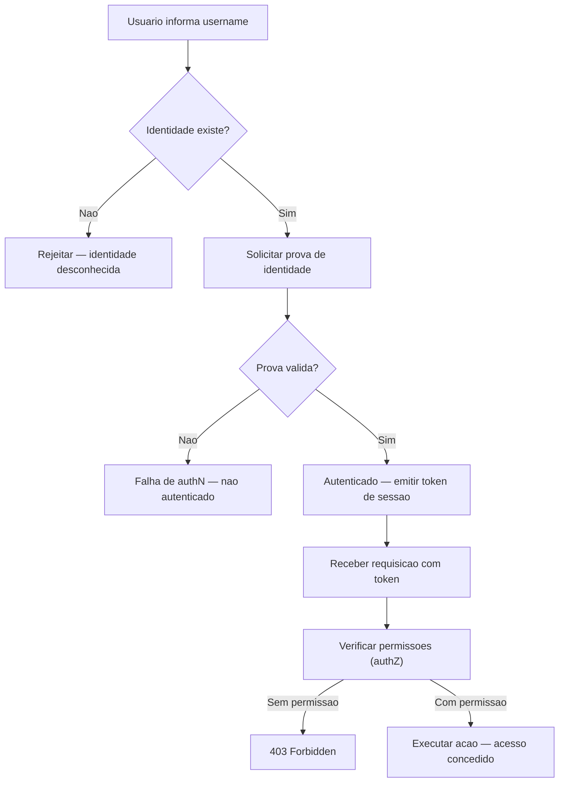
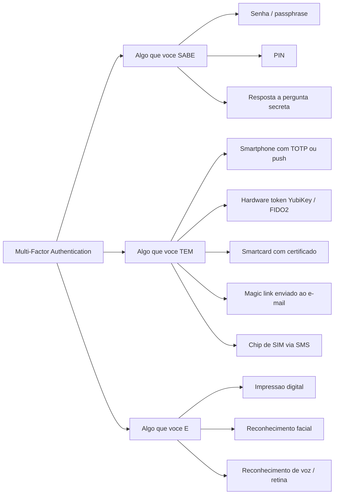
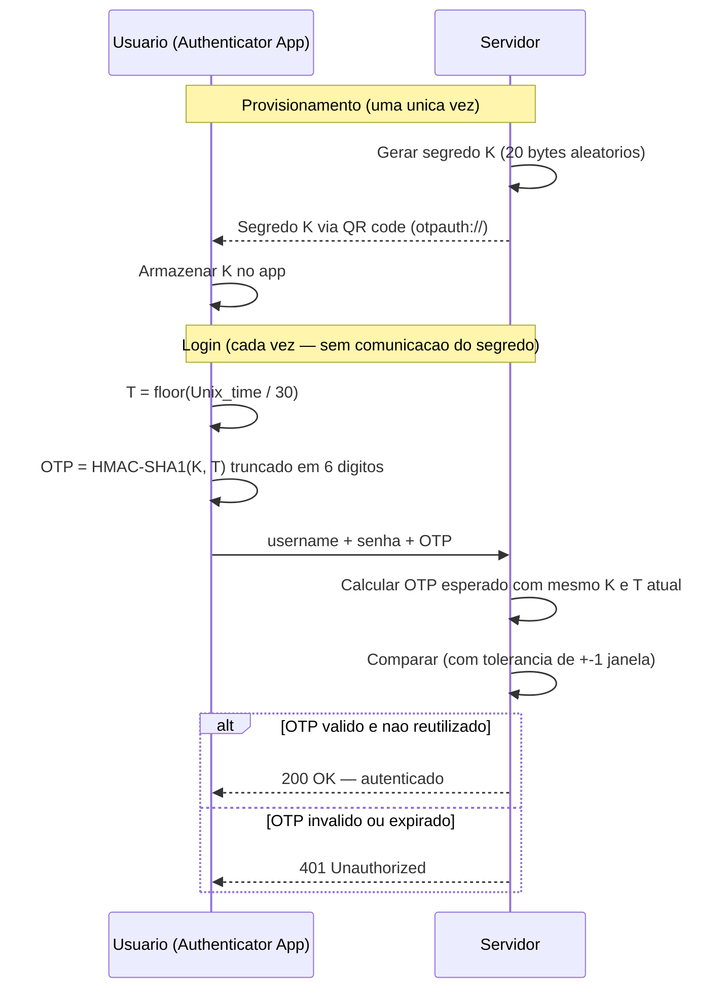
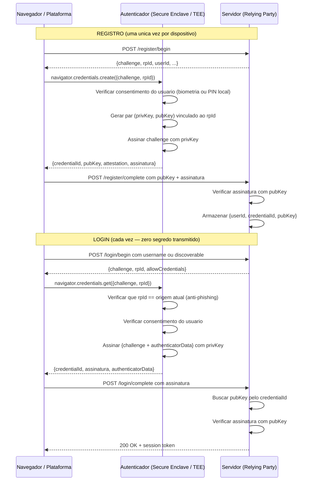
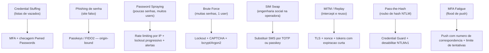

# Autenticação

> [!abstract] TL;DR
> Autenticação é **provar quem você é** — distinta de identificação (alegar quem você é) e de autorização (o que você pode fazer). Os três fatores clássicos — algo que você **sabe**, **tem** ou **é** — formam a base do MFA. Senhas sozinhas são fracas por design: vazam, são reutilizadas e atraem phishing. FIDO2/WebAuthn resolve o problema raiz: o segredo nunca sai do dispositivo, a credencial é vinculada à origem e não há servidor guardando segredo para vazar.

---

> [!info] Deep-dive de protocolo e implementação
> Esta nota é o **conceito neutro**. Para o mergulho em protocolos e stacks — sessões e cookies, JWT, passkeys/WebAuthn, OAuth 2.1, OpenID Connect, MFA na prática e o IdP Keycloak — veja a trilha [[03-Dominios/Engenharia/Auth e Identidade/index|Auth e Identidade]] (fundamentos em [[03-Dominios/Engenharia/Auth e Identidade/1 - Fundamentos de identidade/index|Fundamentos de identidade]]).

## Identificação × autenticação × autorização

A distinção é cobrada em toda entrevista de segurança. São três etapas sequenciais, frequentemente confundidas:

| Etapa | Pergunta | Exemplo | Pode ser falsificada? |
|---|---|---|---|
| **Identificação** | "Quem afirma ser você?" | Digitar o username | Sim — qualquer um digita "admin" |
| **Autenticação (authN)** | "Você consegue provar essa identidade?" | Fornecer senha + OTP | Depende do mecanismo |
| **Autorização (authZ)** | "O que essa identidade pode fazer?" | Verificar permissões no RBAC | Só executa depois de authN |

Identificação é apenas uma afirmação — qualquer um pode digitar `admin`. Autenticação exige **prova verificável**. Autorização é consequência: só faz sentido depois de autenticar com sucesso.

A confusão entre as três etapas produz bugs clássicos de segurança:

- Checar `if user.username == "admin"` sem verificar a autenticação primeiro → qualquer um que alegue ser "admin" é tratado como tal.
- Expor endpoint de autorização sem autenticação → o sistema aceita qualquer identidade alegada.
- Confundir sessão válida com permissão → `if session.valid: do_anything()` ignora completamente o controle de acesso.



> [!info] Leitura do diagrama
> As três etapas são estritamente sequenciais: identificação → autenticação → autorização. Um sistema que pula a autenticação aceita qualquer identidade alegada como verdade, abrindo brechas de identity spoofing imediato. A emissão do token de sessão marca a fronteira entre authN e authZ.

---

## Os três fatores de autenticação

O modelo canônico agrupa evidências de identidade em três categorias. A força do MFA depende de combinar categorias **diferentes** — não de empilhar fatores da mesma categoria.



> [!info] Leitura do diagrama
> MFA real exige fatores de **categorias diferentes**. Dois fatores do tipo "algo que você sabe" — ex.: senha + PIN — não constituem MFA porque um adversário que comprometeu o canal de um provavelmente comprometeu o outro. O SMS está no quadrante "algo que você tem", mas é a opção mais fraca daquela categoria.

**Por que a categoria importa:** imagine um adversário que comprometeu o servidor de e-mail da organização. Ele obtém tanto a senha (armazenada no mesmo domínio) quanto o magic link enviado ao e-mail corporativo. Dois fatores, mesma superfície de ataque — não é MFA real. SMS como segundo fator é um caso à parte, tratado em [[#Armadilhas comuns]].

### Autenticação adaptativa (risk-based)

Sistemas modernos combinam os três fatores com sinais contextuais para calibrar a exigência de prova:

- **IP/geolocalização incomum** → acionar 2º fator mesmo que o 1º tenha passado
- **Dispositivo desconhecido** → exigir verificação adicional
- **Horário atípico** → aumentar o nível de assurance exigido
- **Velocidade impossível** → login de São Paulo e de Tóquio em 5 minutos → forçar re-authN

Isso é chamado de **step-up authentication**: o sistema escala a exigência de prova de acordo com o risco percebido da ação ou do contexto.

---

## Senhas — por que são estruturalmente ruins

Senhas são o mecanismo mais difundido e o mais problemático. Não é questão de implementação ruim — é questão de modelo fundamental:

- **Reuso entre sites**: usuários reutilizam senhas porque lembrar dezenas é humanamente inviável. Uma única violação num site qualquer expõe contas em todos os outros onde a mesma senha foi usada (credential stuffing).
- **Entropia efetiva baixa**: humanos escolhem padrões predizíveis — nomes de pets, datas, palavras com substituição de letras (`3` por `e`, `@` por `a`). O espaço real de senhas escolhidas por humanos é ordens de magnitude menor que o teórico.
- **Phishing**: o usuário é induzido a digitar a senha num site falso. A senha viaja para o adversário sem nenhuma verificação do lado do servidor.
- **Vazamentos em lote**: bancos de dados de senhas vazam constantemente. Se armazenadas em texto claro ou com hashing fraco (MD5, SHA1 sem salt), ficam expostas em minutos com tabelas arco-íris ou GPUs modernas.
- **Compartilhamento não autorizado**: senhas são secretos que podem ser ditos — anotados em papel, compartilhados por mensagem, lembrados em voz alta.

### Armazenamento correto de senhas

Nunca armazene senhas em texto claro nem com hash criptográfico genérico. Hashes rápidos (SHA-256, MD5) são projetados para velocidade — um adversário com GPU consegue bilhões de tentativas por segundo.

O mecanismo correto é um **hash de senha com salt e custo ajustável** — consulte [[06 - Hashing criptográfico]] para a análise completa. O resumo:

- `bcrypt` (1999, ainda seguro, fator de custo padrão ≥ 12), `scrypt` (resistente a hardware customizado, usa memória), `Argon2id` (vencedor do Password Hashing Competition 2015, recomendação atual do NIST, combina resistência a GPU e a ataques side-channel).
- O **salt** é gerado aleatoriamente (≥ 128 bits, CSPRNG) e único por senha — elimina rainbow tables e força cada hash a ser atacado individualmente.
- O **custo** (work factor, iterações, memória) aumenta o tempo de cálculo para dificultar brute force offline sem impactar o login normal perceptivelmente (meta: ~300ms no servidor).
- O hash resultante inclui o salt e o parâmetro de custo — basta armazenar uma string opaca, como `$argon2id$v=19$m=65536,t=3,p=4$...`.

> [!danger] Erros fatais comuns de armazenamento
> - Armazenar em texto claro (violação → exposição imediata total)
> - Usar MD5 ou SHA1 sem salt (quebráveis em segundos com hardware comum)
> - Usar SHA-256/SHA-512 sem salt e sem custo (rápido demais — bilhões de tentativas/segundo)
> - Salt fixo ou derivado do username (elimina a proteção contra rainbow tables)
> - Criptografar em vez de hashear (criptografia é reversível — basta vazar a chave)

### O que o NIST SP 800-63B diz — contra-intuitivo mas correto

O NIST revisou radicalmente as diretrizes em 2017 e confirmou na revisão de 2024. As recomendações derrubam décadas de "boas práticas" que na verdade pioravam a segurança:

| Prática antiga | Posição NIST moderna | Por quê |
|---|---|---|
| Forçar troca periódica (90 dias) | **NÃO** | Gera senhas previsíveis — usuários incrementam: `Senha1!` → `Senha2!` |
| Exigir mistura de maiúsculas + números + especiais | **NÃO** | Reduz o espaço real de escolha; incentiva substituições óbvias (`@` por `a`) |
| Limite de comprimento (ex.: máx. 16 chars) | **NÃO** | Deve aceitar pelo menos 64 caracteres; comprimento é o principal driver de entropia |
| Verificação contra listas de senhas vazadas | **SIM** | Checar contra HaveIBeenPwned ou listas equivalentes no registro e na troca |
| Suporte a gerenciadores de senha | **SIM** | Permitir colar a senha, não bloquear `paste`; gerenciadores geram entropia alta |
| Perguntas de segurança ("nome do pet?") | **NÃO** | Entropia mínima, informação pública ou obtida por engenharia social |

> [!tip] O pior design de senha possível
> Forçar troca a cada 90 dias + exigir `!@#$` + limitar a 16 chars + bloquear colar = exatamente o oposto do objetivo. Usuários criam senhas mais curtas, mais previsíveis e com padrões mais óbvios. O único requisito que importa é: comprimento mínimo ≥ 8 (≥ 15 recomendado), máximo ≥ 64, e checagem contra lista de senhas comprometidas.

---

## Algo que você tem — OTP e derivados

One-Time Passwords eliminam o problema de replay: a senha válida expira em segundos ou é usada uma única vez, tornando interceptação seguida de reuso ineficaz.

### TOTP — RFC 6238

TOTP (Time-based One-Time Password) é o algoritmo por trás do Google Authenticator, Authy, Microsoft Authenticator e similares. Baseia-se no HOTP (RFC 4226), substituindo o contador por uma função do tempo:

```
TOTP(K, T) = HOTP(K, T)
T = floor((UnixTime() − T₀) / X)   // X = 30 segundos, T₀ = Unix epoch
HOTP(K, C) = Truncate(HMAC-SHA1(K, C))
```

- `K` = segredo compartilhado de 20 bytes (provisionado via QR code `otpauth://`)
- `T` = número da janela de 30 segundos desde o Unix epoch
- `Truncate` = extrai 6 dígitos do HMAC de 160 bits (Dynamic Truncation do RFC)
- O servidor e o cliente derivam o mesmo OTP **independentemente e sem comunicação em tempo real**
- Tolerância de ±1 janela (±30s) acomoda dessincronismo de relógio entre cliente e servidor



> [!info] Leitura do diagrama
> O segredo K é provisionado uma única vez e **nunca mais transmitido**. Nas autenticações subsequentes, servidor e cliente computam o mesmo valor TOTP de forma independente a partir do tempo atual. O OTP expira em ≤ 30 segundos, tornando replay inviável. O servidor deve registrar OTPs usados para evitar reuso dentro da mesma janela.

**HOTP (RFC 4226)** usa contador em vez de tempo — exige sincronização do contador entre cliente e servidor, que deriva ao longo do tempo. TOTP elimina esse problema usando o relógio como contador implícito e é preferido na prática.

**Limitações do TOTP:**
- O segredo K deve ser armazenado no servidor (se o servidor vazar, os segredos vazam)
- Ainda vulnerável a phishing em tempo real — adversário cria proxy transparente, captura o OTP e o usa imediatamente (man-in-the-browser)
- Dependente de relógio sincronizado (NTP) — deriva > 1 janela produz falhas de autenticação

### Magic links e push notifications

**Magic link**: e-mail com token de uso único (UUID ou token de 256 bits). O usuário clica no link sem digitar senha. Segurança depende completamente da segurança da caixa de e-mail — se o e-mail não tem MFA, o magic link é um fator único com a segurança do e-mail como superfície.

**Push notification**: o app móvel recebe a notificação e o usuário aprova com um toque. Confortável, mas vulnerável a *MFA fatigue*: adversário dispara notificações repetidamente (ataque automatizado) até o usuário, frustrado, aceitar sem perceber que não foi ele que iniciou o login. Mitigação: mostrar contexto da requisição no push (IP, localização, aplicativo) e exigir aprovação explícita com número de correspondência.

### Hardware tokens e smartcards

YubiKey e equivalentes armazenam credenciais em hardware com proteção física contra extração. Suportam múltiplos protocolos: OTP, FIDO2/WebAuthn, PIV (smartcard), OpenPGP. Smartcards com certificado X.509 são padrão em ambientes governamentais (CAC nos EUA) — combinam "algo que você tem" (o card) com "algo que você sabe" (o PIN que desbloqueia o certificado privado).

---

## FIDO2 / WebAuthn / Passkeys — o estado da arte

FIDO2 é o padrão que resolve os problemas estruturais das senhas e do TOTP. É composto por dois componentes:

- **WebAuthn** (W3C Recommendation): API do navegador e do SO para criar e usar credenciais de chave pública. Suportada nativamente por Chrome, Firefox, Safari, Edge desde 2019.
- **CTAP2** (Client-to-Authenticator Protocol 2): protocolo entre o navegador/plataforma e o autenticador externo (YubiKey, passkey no smartphone via Bluetooth).

**Passkeys** é o nome de marketing para credenciais FIDO2 sincronizadas entre dispositivos via nuvem (iCloud Keychain, Google Password Manager, 1Password). A spec é idêntica — a diferença é que o par de chaves é copiado entre dispositivos do mesmo usuário, aliviando o problema de "e se perder o dispositivo?".

### O modelo de chave pública — sem segredo no servidor

O device (smartphone, computador, chave física) gera um **par de chaves por credencial por origem**:

- **Chave privada**: fica no dispositivo, protegida pelo enclave seguro (Secure Enclave no iOS, TEE/StrongBox no Android, TPM em PCs com Windows Hello). Nunca sai do hardware — nem para backup em texto claro.
- **Chave pública**: enviada ao servidor durante o registro e armazenada lá.



> [!info] Leitura do diagrama
> No registro, a chave pública vai para o servidor; a privada permanece no enclave seguro do dispositivo. No login, o servidor envia um desafio aleatório (challenge); o autenticador assina com a privada após verificar biometria/PIN local. O servidor verifica com a pública. **Nenhum segredo é transmitido em nenhum momento** — nem a senha, nem a chave privada, nem o OTP.

### Por que passkeys são resistentes a phishing

A propriedade central e mais importante: a credencial é **vinculada à origem** (`rpId` = o domínio exato do servidor registrado, verificado pelo autenticador). O caso completo — o mesmo ataque de phishing falhando contra passkey e funcionando contra senha+TOTP — está em [[#Casos práticos|Casos práticos]], Caso 1.

> [!success] O que passkeys eliminam simultaneamente
> - **Phishing**: credencial não funciona em origem diferente da registrada
> - **Credential stuffing**: não existe senha reutilizável para vazar de outro serviço
> - **Vazamento de banco de dados**: servidor armazena apenas chave pública — inútil sem a privada
> - **Brute force**: não há segredo de baixa entropia para adivinhar
> - **Keyloggers**: nada é digitado — nenhum segredo sai do enclave seguro

### Attestation — verificar o autenticador

Durante o registro, o autenticador pode fornecer um **attestation statement** — uma assinatura do fabricante que prova a classe de autenticador usado (modelo de YubiKey, versão do iOS, etc.). Útil em cenários corporativos onde a política exige hardware certificado FIDO. Em passkeys consumer, attestation frequentemente é "none" por privacidade.

> [!tip] Vídeo — passwords vs. passkeys, direto de quem constrói o padrão
> [**Passwords vs. Passkeys - FIDO Bites Back!**](https://www.youtube.com/watch?v=9nrE4t4-IXA) (IBM Technology, ~11 min, EN) abre exatamente com a tese desta seção — "there's a way that you can get better security and better usability and get rid of your passwords" [0:00] — e daí percorre por que senha é um modelo estruturalmente ruim (o argumento da seção "Senhas — por que são estruturalmente ruins" acima) até chegar em como FIDO2/passkeys removem o segredo compartilhado do meio da equação.
> **O que ele não cobre:** o vídeo fica na camada conceitual de por que trocar senha por passkey vale a pena — não entra no protocolo CTAP2, no formato da attestation nem no fluxo de challenge-response byte a byte que os diagramas Mermaid desta nota detalham.

---

## Ataques a autenticação e defesas



> [!info] Leitura do diagrama
> Cada vetor de ataque exige uma defesa específica. Passkeys eliminam phishing e credential stuffing simultaneamente. Rate limiting e lockout atrasam ataques de força mas não eliminam — MFA é a defesa real contra senhas fracas/vazadas. MFA fatigue é específico de push notifications e exige mitigação no design do prompt.

### Taxonomia detalhada dos ataques

**Credential stuffing**: adversário obtém pares username:senha de vazamentos públicos (ex.: dumps no Have I Been Pwned) e os testa em lote em outros serviços via automação. Funciona porque usuários reutilizam senhas. Defesas: MFA, detecção de anomalias (volume de falhas, diversidade de IPs), checagem de senha contra listas de vazados no momento do login.

**Password spraying**: em vez de atacar um usuário com muitas senhas (o que dispara lockout), ataca **muitos usuários** com poucas senhas muito comuns (`Senha123`, `Primavera2024`, `Welcome1`). Evita lockout por usuário individual. Defesa: rate limiting por IP de origem + lockout suave (delay crescente, não bloqueio total) + alertas por volume anômalo de falhas.

**Brute force**: exaustão sistemática do espaço de senhas. Eficaz online apenas contra sistemas sem rate limiting. Muito mais eficaz offline (quando o hash vaza) — por isso Argon2 importa. Uma GPU moderna consegue ~10⁹ tentativas/s contra MD5; contra Argon2id com parâmetros adequados, cai para ~10² tentativas/s.

**MITM e replay**: adversário intercepta o tráfego (sem TLS ou com certificado inválido aceito pelo usuário) e reutiliza tokens capturados. TLS mitiga MITM; tokens com expiração curta, nonce e binding ao IP mitigam replay. WebAuthn usa challenge único por autenticação — replay de uma assinatura não funciona porque o servidor não aceita o mesmo challenge duas vezes.

**Pass-the-hash**: em ambientes Windows/Active Directory com NTLM, o hash da senha pode ser extraído da memória do processo LSASS (usando Mimikatz ou similar) e usado diretamente em autenticações NTLM sem conhecer a senha em claro. Isso demonstra que hash ≠ seguro quando usado como token de autenticação. Defesas: Credential Guard (protege LSASS com virtualização), desabilitar NTLMv1, migrar para Kerberos ou FIDO2 em ambientes corporativos.

**MFA fatigue**: adversário automatiza tentativas de login com credenciais válidas (obtidas por phishing ou vazamento), disparando dezenas de push notifications para o usuário. O usuário, frustrado ou distraído, acaba aceitando. Defesas: exibir contexto da requisição no push (localização, app, IP), exigir que o usuário digite um número de correspondência mostrado na tela (number matching), limite de tentativas de MFA por sessão.

---

## Algo que você é — biometria

Biometria é atraente porque não pode ser esquecida nem emprestada facilmente. Mas tem propriedades fundamentalmente diferentes dos outros fatores:

- **Não é revogável**: se sua senha vaza, você troca. Se sua impressão digital vaza, você não troca o dedo. Por isso biometria deve ser processada **localmente no dispositivo** (on-device matching), nunca enviada ao servidor como autenticador primário.
- **Não é secreta**: impressões digitais, face e voz são captáveis passivamente por adversários sofisticados. São identificadores únicos, não segredos.
- **Taxa de erro**: sistemas biométricos têm FAR (False Acceptance Rate — aceitar impostor) e FRR (False Rejection Rate — rejeitar legítimo). Nenhum é zero. O ponto de operação equilibra os dois.

No modelo FIDO2 / Apple Face ID / Android BiometricPrompt, biometria é usada corretamente: ela **desbloqueia a chave privada armazenada no enclave seguro do dispositivo**. O servidor nunca vê dados biométricos. O fluxo é:

1. Biometria verifica: "você é o dono deste dispositivo?"
2. Enclave libera a chave privada
3. Chave privada assina o desafio do servidor

Biometria aqui é um fator local de desbloqueio — não um fator transmitido. Isso preserva a privacidade e elimina o risco de vazar o biométrico para o servidor. O anti-padrão de transmitir biometria ao servidor está em [[#Armadilhas comuns]].

**Liveness detection**: ataques de apresentação (spoofing) com foto, vídeo ou máscara 3D tentam enganar leitores biométricos. Sistemas sérios implementam liveness detection — verificam que o biométrico apresentado pertence a um ser vivo (piscar de olhos, movimento 3D, textura de pele). A qualidade da liveness detection varia enormemente entre implementações.

**NIST SP 800-63B sobre biometria**: o NIST permite biometria apenas como fator adicional em combinação com "algo que você tem" — nunca como único fator de authN. Essa é a arquitetura que iOS, Android e Windows Hello adotam: biometria desbloqueia o dispositivo, que então executa o protocolo FIDO2. A consequência prática: ao perder um dispositivo com passkey, o adversário ainda precisa passar pela biometria ou PIN local — a chave privada em si não é acessível mesmo com acesso físico ao hardware, dada a proteção do enclave seguro.

---

## Proteção de conta — rate limiting e lockout

Mecanismos de autenticação devem ser protegidos contra tentativas em volume. Sem proteção, brute force e password spraying são viáveis mesmo com senhas razoáveis.

**Rate limiting por IP e por conta**: limitar tentativas de login por unidade de tempo. Implementar em camadas:
- Por IP de origem: detecta ataques de spray (1 IP, muitas contas)
- Por conta: detecta brute force (1 conta, muitas senhas de IPs distribuídos)
- Global: detecta ataques distribuídos de baixo volume por IP

**Lockout progressivo (throttling)**: após N falhas, aumentar o tempo de espera exponencialmente (1s, 2s, 4s, 30s, 5min, bloqueio temporário). Preferível a bloqueio permanente que pode ser usado como ataque de disponibilidade (adversário bloqueia contas de usuários legítimos propositalmente).

**CAPTCHA e desafios**: acionar após N tentativas falhas. CAPTCHAs de imagem têm eficácia decrescente contra ML moderno — considerar proof-of-work ou desafios de latência.

**Alertas e notificações**: notificar o usuário por e-mail ou push quando login ocorre de dispositivo/IP/país novo. Dá visibilidade sobre comprometimento mesmo quando a defesa ativa falha.

**Account enumeration**: não revelar se o username existe ou não em mensagens de erro. Resposta canônica: "Usuário ou senha incorretos" — nunca "Usuário não encontrado" separado de "Senha incorreta". Enumerar usuários válidos é o primeiro passo do password spraying. O mesmo princípio se aplica a fluxos de recuperação de senha: "Se esse e-mail existir, você receberá as instruções" — não "E-mail não cadastrado". A defesa em camadas completa e o risco de recuperação de conta como downgrade silencioso estão em [[#Casos práticos]] e [[#Armadilhas comuns]].

---

## Sessão após autenticação

Autenticação é um evento pontual. HTTP é stateless — o servidor não "lembra" de requisições anteriores. O sistema precisa de um mecanismo para transportar a prova de autenticação em cada requisição subsequente.

O resultado da autenticação é tipicamente:

- **Cookie de sessão opaco**: servidor armazena o estado da sessão (em memória ou banco), o cookie é apenas um identificador aleatório. Revogação é trivial (apagar o registro). Não escala horizontalmente sem store compartilhado (Redis).
- **Token JWT**: sessão stateless assinada (HMAC-SHA256 ou RSA). O servidor valida a assinatura sem consultar banco. Revogação é difícil — exige blocklist ou expiração curta.
- **Bearer token OAuth 2.0**: acesso delegado — o token representa uma autorização específica, não a identidade completa.

A sessão é o ponto de entrada para [[13 - Autorização e controle de acesso]]: o token carrega (ou permite derivar) as permissões do usuário autenticado — roles, escopos, claims.

> [!note] Sessão válida ≠ autorizado para tudo
> Sessão válida prova que alguém autenticou com sucesso. Não prova que pode executar a ação solicitada. Os dois controles devem ser implementados separadamente em cada endpoint — confundi-los é um erro clássico: `if session.valid: do_anything()` ignora completamente o controle de acesso granular.

---

## Casos práticos

### Caso 1 — phishing contra senha+TOTP vs. passkey

O mesmo ataque, dois desfechos opostos, ilustra por que a vinculação à origem (`rpId`) é a propriedade que realmente elimina phishing — não apenas mais um fator empilhado.

**Com senha + TOTP:**
1. Adversário cria `banco-falso.com`, visualmente idêntico a `banco.com`.
2. A vítima digita usuário, senha e código TOTP no site falso.
3. Um proxy transparente controlado pelo adversário repassa tudo ao site real, em tempo real.
4. Conta comprometida em segundos — nenhum dos dois fatores impediu o ataque, porque nenhum dos dois verifica a origem da requisição.

**Com passkey:**
1. Adversário cria `banco-falso.com`.
2. O navegador solicita ao autenticador uma assinatura para `rpId = banco-falso.com`.
3. O autenticador não encontra nenhuma credencial registrada para esse `rpId` — a chave privada da vítima foi criada e vinculada a `banco.com`, não a `banco-falso.com`.
4. A autenticação falha antes mesmo de pedir consentimento ao usuário. Não existe "digitar errado" — o protocolo recusa a operação.

O detalhe que costuma escapar em entrevista: o TOTP falha aqui não porque é um mecanismo fraco, mas porque **prova posse de um segredo, não a legitimidade da origem que o solicitou**. Passkeys resolvem a causa raiz, não o sintoma.

### Caso 2 — defesa em camadas contra brute force e password spraying

> [!example] Fluxo de proteção em camadas
> Um sistema bem projetado aplica: TLS (canal) → rate limiting por IP (volume) → CAPTCHA após 3 falhas (automação) → lockout progressivo por conta (brute force) → MFA (fator adicional) → alertas de login suspeito (visibilidade). Cada camada compensa a falha da anterior. Nenhuma camada isolada é suficiente — a profundidade de defesa (defense-in-depth) é o princípio que une todas elas, explorado em [[04 - Princípios de design seguro]].

Nenhuma camada sozinha resolve o problema: rate limiting por IP não pega password spraying distribuído por muitos IPs; lockout por conta não pega brute force de baixo volume; CAPTCHA sozinho não impede um adversário paciente disposto a resolver desafios manualmente em pequena escala. A combinação é o que torna o custo do ataque proibitivo — cada camada fecha a lacuna que a anterior deixa aberta.

---

## Armadilhas comuns

> [!warning] SMS como 2º fator é categoricamente fraco
> SMS é "algo que você tem" (o SIM), mas vulnerável a SIM swap (engenharia social na operadora trocando o número para um SIM controlado pelo adversário) e ao protocolo SS7 (ataques de interceptação em redes de telecomunicação legadas, viáveis para atores com acesso a infraestrutura de telecomunicação). O NIST SP 800-63B deprecou o SMS OOB como autenticador recomendado desde 2017. Use TOTP ou passkeys.

> [!warning] Biometria no servidor é anti-padrão
> Sistemas que transmitem hash ou template biométrico ao servidor para comparação são perigosos: vazamento do banco expõe dados que o usuário nunca pode revogar. Arquiteturas corretas processam biometria inteiramente no dispositivo e usam o resultado (boolean "verificado") apenas para liberar uma chave criptográfica local.

> [!warning] Recuperação de conta como downgrade silencioso de segurança
> O fluxo de recuperação de senha é frequentemente o ponto mais fraco do sistema de autenticação. Se a recuperação acontece só via e-mail sem MFA, ela representa um downgrade do nível de segurança para o nível de segurança da caixa de e-mail — todo o investimento em MFA forte vira irrelevante se um adversário só precisa comprometer o e-mail para redefinir a senha. Recovery codes (códigos de backup pré-gerados no momento do registro MFA) e fluxos de verificação de identidade fora de banda são a abordagem correta para contas com MFA.

---

## O que vem a seguir

Esta nota respondeu "quem é você" — os mecanismos que provam identidade, do mais frágil (senha isolada) ao mais robusto (passkeys origin-bound). Mas provar identidade é só a primeira metade do controle de acesso: um sistema que autentica perfeitamente e não verifica o que a identidade autenticada pode fazer continua vulnerável — é exatamente o erro `if session.valid: do_anything()` citado na seção sobre sessão.

A [[13 - Autorização e controle de acesso]] responde a segunda pergunta: "o que você pode fazer?" — RBAC, ABAC, tokens de escopo, e como o resultado da autenticação (a sessão, o token) se transforma em decisões de permissão em cada endpoint.

- Anterior: [[11 - PKI e certificados]]
- Próxima: [[13 - Autorização e controle de acesso]]
- Cross-links:
  - [[06 - Hashing criptográfico]] — armazenamento correto de senhas (bcrypt, Argon2id, salt, work factor)
  - [[03 - Economia e fator humano da segurança]] — por que usuários escolhem senhas ruins e reusam; custo cognitivo da segurança
  - [[13 - Autorização e controle de acesso]] — o que acontece após o login: tokens, roles, RBAC, ABAC

---

> [!summary] Resumo em uma linha
> Autenticação é **provar identidade** com algo que você sabe, tem ou é — e passkeys (FIDO2/WebAuthn) são hoje o único mecanismo que elimina phishing por design, vinculando a credencial à origem e mantendo a chave privada inacessível ao servidor.

---

## Em entrevista

Autenticação é tema recorrente em qualquer entrevista de engenharia com componente de segurança. As perguntas exploram a distinção terminológica, as fraquezas estruturais de senhas, os mecanismos modernos e as decisões de design de sistemas.

Frases úteis em inglês:

- *"Authentication is about proving identity — it answers 'are you who you claim to be?' Authorization answers 'what are you allowed to do?' They're distinct layers and must be enforced independently at every endpoint."*
- *"MFA means combining factors from different categories — something you know, have, or are. Two passwords aren't MFA because if one channel is compromised, the other typically is too."*
- *"Passkeys are phishing-resistant by design because the credential is origin-bound. The authenticator won't sign a challenge for a domain it wasn't registered to — the user simply can't give it to the wrong site."*
- *"The server never sees the private key in WebAuthn. What leaks from a breach is only the public key — cryptographically useless to an attacker without the private key that never left the device."*
- *"NIST 800-63B says don't force periodic password rotation. Forced rotation produces predictable patterns — users just increment a number or symbol — and doesn't improve security in practice."*
- *"SMS as a second factor is better than nothing, but it's vulnerable to SIM swapping and SS7 interception. TOTP or passkeys are the right answer wherever phishing resistance matters."*
- *"Pass-the-hash shows that a hash used directly as an authentication token is as sensitive as the password itself — protecting credentials at rest isn't just about encryption."*

**Vocabulário PT → EN:**

| Português | Inglês |
|---|---|
| Autenticação | Authentication (authN) |
| Autorização | Authorization (authZ) |
| Identificação | Identification |
| Autenticação multifator | Multi-Factor Authentication (MFA) |
| Algo que você sabe / tem / é | Something you know / have / are |
| Senha de uso único | One-Time Password (OTP) |
| Vinculado à origem | Origin-bound |
| Resistente a phishing | Phishing-resistant |
| Troca de SIM | SIM swap |
| Preenchimento de credenciais | Credential stuffing |
| Pulverização de senha | Password spraying |
| Fadiga de MFA | MFA fatigue |
| Token de sessão | Session token / bearer token |
| Chave pública / privada | Public / private key |
| Desafio-resposta | Challenge-response |
| Enclave seguro | Secure Enclave / TEE (Trusted Execution Environment) |
| Autenticação progressiva / step-up | Step-up authentication |
| Descobrível (passkey sem username) | Discoverable credential |
| Atestação | Attestation |
| Parte confiante (servidor) | Relying Party (RP) |

---

## Fontes

- **NIST SP 800-63B** — Digital Identity Guidelines: Authentication and Lifecycle Management. NIST, 2017 (rev. 2024). [https://pages.nist.gov/800-63-3/sp800-63b.html](https://pages.nist.gov/800-63-3/sp800-63b.html)
- **RFC 6238** — TOTP: Time-Based One-Time Password Algorithm. IETF, 2011. [https://datatracker.ietf.org/doc/html/rfc6238](https://datatracker.ietf.org/doc/html/rfc6238)
- **RFC 4226** — HOTP: An HMAC-Based One-Time Password Algorithm. IETF, 2005. [https://datatracker.ietf.org/doc/html/rfc4226](https://datatracker.ietf.org/doc/html/rfc4226)
- **W3C Web Authentication (WebAuthn) Level 3** — W3C Recommendation. [https://www.w3.org/TR/webauthn-3/](https://www.w3.org/TR/webauthn-3/)
- **OWASP Authentication Cheat Sheet** — OWASP Foundation. [https://cheatsheetseries.owasp.org/cheatsheets/Authentication_Cheat_Sheet.html](https://cheatsheetseries.owasp.org/cheatsheets/Authentication_Cheat_Sheet.html)
- **FIDO Alliance — Passkeys Overview** — FIDO Alliance. [https://fidoalliance.org/passkeys/](https://fidoalliance.org/passkeys/)
