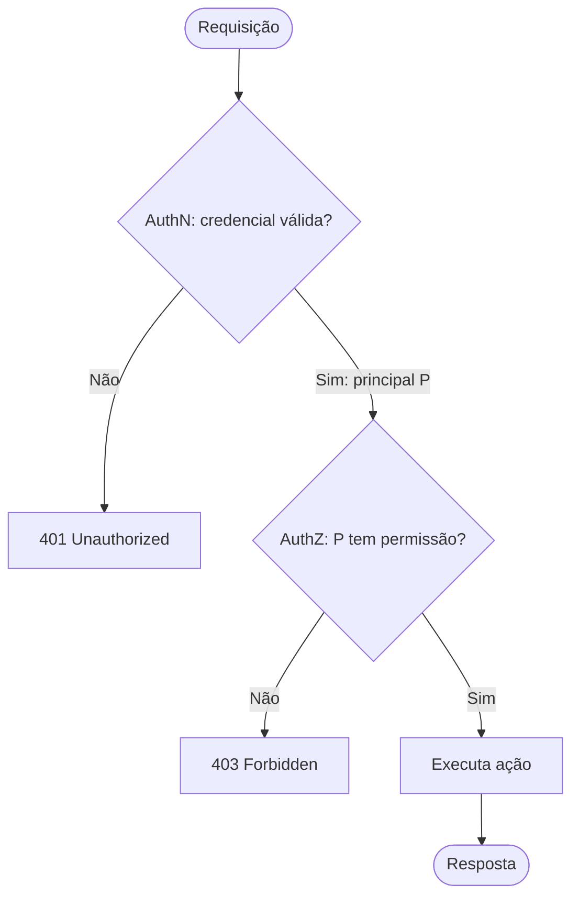
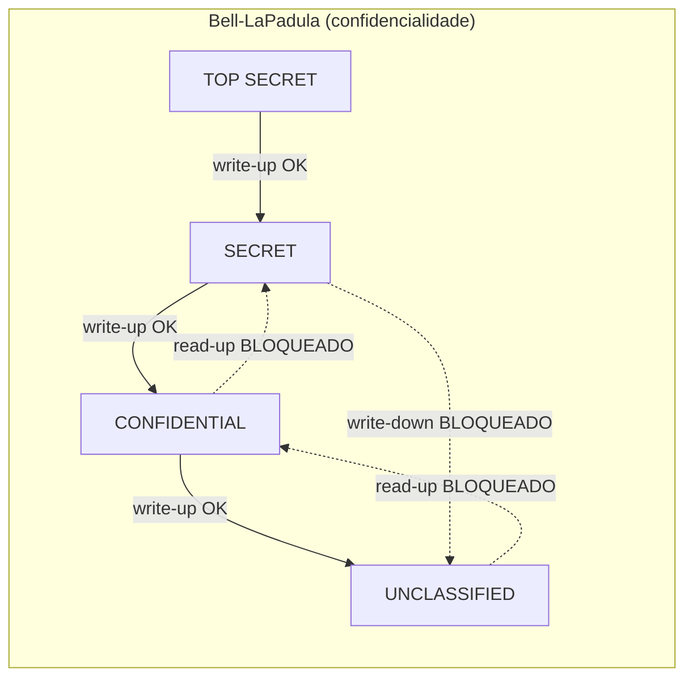
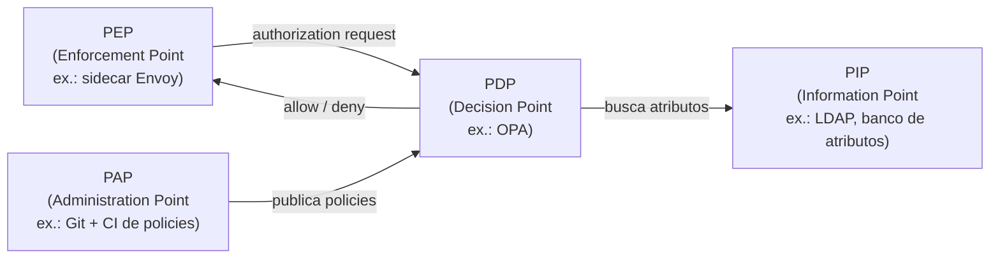
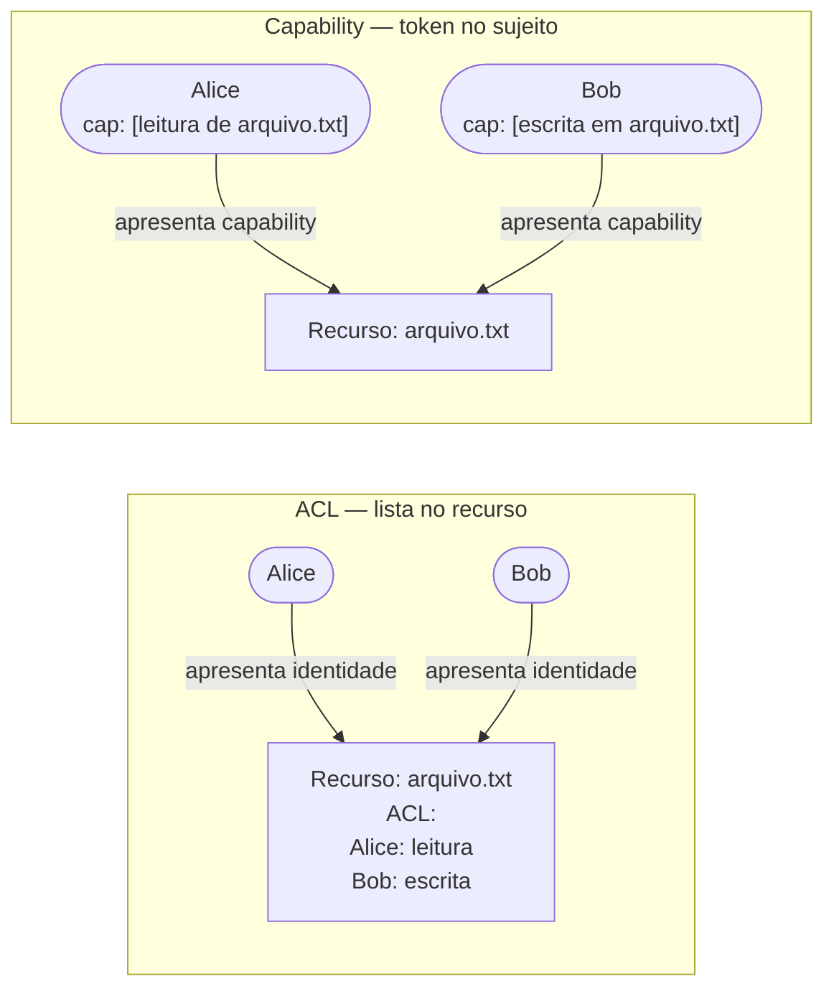
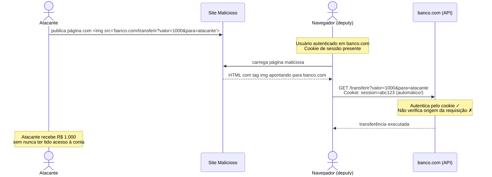
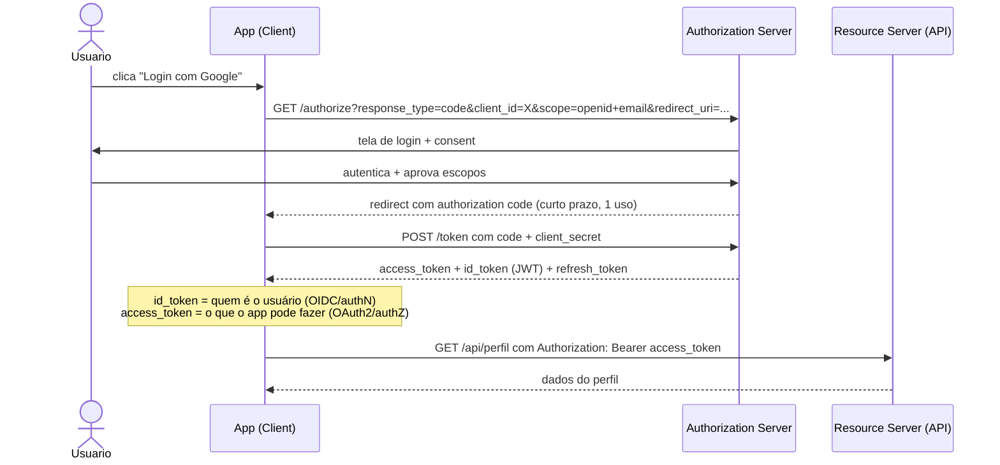

# Autorização e controle de acesso

> [!abstract] TL;DR
> **Autenticação** (authN) prova *quem você é*; **autorização** (authZ) decide *o que você pode fazer*. São etapas separadas — confundi-las é erro de design clássico. Quatro modelos dominam o mercado: DAC (o dono decide), MAC (a política decide), RBAC (o papel decide), ABAC (atributos decidem). Além dos modelos, há dois *mecanismos de representação* de permissão: ACL (o recurso lista quem pode) e capability (o sujeito carrega a prova). O confused deputy — um programa privilegiado enganado a agir em nome de um atacante — explica CSRF e outros ataques de autorização delegada. OAuth2 é **delegação de autorização**, não autenticação; OIDC é a camada de identidade em cima.

---

> [!info] Deep-dive de protocolo e implementação
> Esta nota é o **conceito neutro**. Para o mergulho em autorização moderna — RBAC/ABAC/ReBAC, Zanzibar e policy-as-code (OpenFGA/OPA/Cedar), multi-tenancy B2B e autorização de API na prática — veja a trilha [[03-Dominios/Engenharia/Auth e Identidade/index|Auth e Identidade]], sub-galho [[03-Dominios/Engenharia/Auth e Identidade/3 - Autorização e multi-tenancy/index|Autorização e multi-tenancy]].

## AuthN × AuthZ: a distinção mais importante de entrevista

Todo sistema de acesso tem dois momentos distintos no tempo e na responsabilidade:

1. **Autenticação (authN)** — "Quem é você?" O sistema verifica uma credencial (senha, certificado, token FIDO2) e emite uma *identidade comprovada*. Resultado: um principal (usuário, serviço, processo) com identidade estabelecida.
2. **Autorização (authZ)** — "O que você pode fazer?" Dado um principal *já autenticado*, o sistema avalia permissões e decide se a ação é permitida. Resultado: allow ou deny.

A confusão entre os dois é um dos erros de design mais comuns — e mais perigosos:

- Verificar apenas se o usuário está logado antes de executar uma operação (authN) sem checar se ele tem direito àquela operação específica (authZ) leva a **Insecure Direct Object Reference (IDOR)** — o atacante muda o ID na URL e acessa o recurso de outro usuário.
- Usar o `access_token` do OAuth2 como prova de identidade confunde autorização delegada com autenticação — discutido em detalhe na seção OAuth2 × OIDC.

O pipeline correto é sempre sequencial: sem authN não há principal; sem principal não há authZ.



> [!info] Leitura do diagrama
> O pipeline é estritamente sequencial: primeiro verificar identidade (401 se falhar), depois verificar permissão (403 se falhar). HTTP usa códigos distintos — 401 significa "não sei quem você é", 403 significa "sei quem você é, mas não pode". Sistemas que retornam 403 sem autenticar primeiro vão direto ao passo 2, o que é aceitável para recursos *genuinamente* públicos, mas não para recursos privados.

---

## Os quatro modelos de controle de acesso

Não existe "o modelo certo" — cada um resolve um problema diferente. A pergunta de entrevista clássica é justamente: "quando você usaria RBAC vs ABAC?"

| Modelo | Quem decide? | Quem controla a política? | Escalabilidade | Exemplo canônico |
|--------|-------------|--------------------------|----------------|-----------------|
| **DAC** — Discretionary | O *dono* do recurso | Cada dono individualmente | Baixa (propaga descontrolado) | Permissões Unix `rwx`, ACLs de arquivo NTFS |
| **MAC** — Mandatory | O *sistema/política central* | Administrador de segurança | Alta (coerente, auditável) | SELinux, classificações militares (TOP SECRET) |
| **RBAC** — Role-Based | O *papel* atribuído ao usuário | Administrador de papéis | Alta em orgs | AWS IAM roles, admin/editor/viewer em SaaS |
| **ABAC** — Attribute-Based | *Atributos* + política booleana | Motor de políticas (XACML, OPA) | Muito alta (granularidade fina) | Políticas IAM da AWS, OPA no Kubernetes |

### DAC — o dono decide (e o problema de propagação)

No Unix, o criador de um arquivo decide quem pode ler, escrever ou executar (bits `rwx` para owner/group/others). A liberdade é conveniente, mas o problema é a *propagação descontrolada*: o dono pode compartilhar com quem quiser, que por sua vez pode criar cópias com permissões abertas. Em organizações grandes, o DAC puro leva ao "permission sprawl" — ninguém sabe quem tem acesso a quê.

ACLs de arquivo (Windows NTFS, POSIX ACLs estendidas) são DAC mais fino: permitem entradas por usuário e grupo individuais, mas o princípio é o mesmo — o dono (ou um delegado) configura.

### MAC — a política manda, não o usuário

MAC remove do usuário a capacidade de alterar permissões. Uma política central — geralmente definida por um administrador de segurança ou pelo próprio sistema operacional — rotula tanto sujeitos quanto objetos, e o sistema garante invariantes que *nenhum usuário pode quebrar*.

Os dois modelos formais mais importantes:

**Bell-LaPadula** (confidencialidade, anos 1970, DoD):
- "No read up" — um sujeito de nível L não pode ler objetos de nível > L.
- "No write down" — um sujeito de nível L não pode escrever em objetos de nível < L (impede vazamento para nível inferior).
- Garante que informação classificada não desce; não trata integridade.

**Biba** (integridade, 1977, modelo dual de Bell-LaPadula):
- "No write up" — sujeito de nível L não pode escrever em nível > L (não contamina objetos mais confiáveis).
- "No read down" — sujeito de nível L não pode ler de nível < L (não se contamina com dados menos confiáveis).
- Garante integridade; não trata confidencialidade.

**SELinux** é MAC em Linux: cada processo e arquivo tem um *contexto* (user:role:type:level), e uma *política* de type enforcement define quais tipos de processo podem acessar quais tipos de objeto. O kernel nega tudo que não está explicitamente permitido.



> [!info] Leitura do diagrama
> Setas sólidas = operação permitida pelo modelo (escrever para nível igual ou superior). Setas tracejadas = violação que o modelo bloqueia. Bell-LaPadula garante que informação secreta nunca desce — um processo SECRET não pode gravar em arquivo UNCLASSIFIED.

### RBAC — o modelo dominante em produto

Em RBAC, permissões são atribuídas a *papéis*, e usuários recebem papéis. O usuário nunca recebe permissão diretamente — sempre via papel.

Vantagens:
- **Escala em organizações**: adicionar um funcionário = atribuir papel; revogar acesso = remover papel.
- **Auditoria limpa**: "quem tem acesso ao recurso X?" = "quais papéis têm permissão P, e quais usuários têm esses papéis?"
- **Separação de duties**: dois papéis incompatíveis (ex.: approver e requester) nunca são atribuídos ao mesmo usuário.

NIST padronizou RBAC em quatro níveis (RBAC0 a RBAC3), adicionando hierarquia de papéis e restrições (constraints). O modelo domina SaaS: admin/editor/viewer, owner/member/reader.

### ABAC — granularidade máxima

ABAC toma decisões com base em atributos do *sujeito* (cargo, departamento, nível de clearance), do *recurso* (classificação, proprietário, data), da *ação* (read, write, delete) e do *ambiente* (hora, IP, localização). A política é uma função booleana sobre esses atributos.

Exemplo de política AWS IAM em ABAC:
```
Allow s3:GetObject
if resource.tag.project == principal.tag.project
   AND request.time between 08:00 and 18:00
   AND request.sourceIP in ["10.0.0.0/8"]
```

XACML (eXtensible Access Control Markup Language) é o padrão formal; OPA (Open Policy Agent) com Rego é a implementação moderna favorita em Cloud Native.

A desvantagem: políticas ABAC são difíceis de auditar ("quem pode acessar X?") porque a resposta depende da combinação de atributos no momento da requisição.

**XACML vs OPA**: XACML (eXtensible Access Control Markup Language, OASIS) é o padrão formal para ABAC — define arquitetura com PDP, PEP, PIP (Policy Information Point) e PAP (Policy Administration Point), e usa XML verboso para políticas. É poderoso mas pesado; adotado em contextos enterprise/governamental. OPA com Rego é a alternativa Cloud Native: API REST simples, políticas em texto compacto, integração nativa com Kubernetes (admission controller), Envoy (external authz), Terraform (policy checks). Na prática, se você está num ambiente Cloud Native em 2026, OPA é o padrão de mercado; XACML aparece em sistemas legados ou compliance-heavy.



> [!info] Leitura do diagrama
> Arquitetura XACML/ABAC: o PEP intercepta o pedido e consulta o PDP. O PDP avalia a política (carregada do PAP) usando atributos do PIP. O PEP executa a decisão. OPA é exatamente um PDP nesta arquitetura; o sidecar Envoy é o PEP; o LDAP corporativo é o PIP; o repositório Git de policies Rego é o PAP.

---

## ACL × Capability: duas formas de representar permissão

Todo sistema de controle de acesso precisa *armazenar* quem pode o quê. Há duas abordagens fundamentais:



> [!info] Leitura do diagrama
> Em ACL, o recurso guarda a lista de quem pode — para autorizar, consulta a lista. Em capabilities, o sujeito carrega um token que *prova* a permissão — o recurso só verifica o token. Capabilities resistem melhor ao confused deputy (próxima seção).

**ACL** (Access Control List):
- O recurso mantém uma lista de (sujeito, permissão).
- Pergunta natural: "quem pode acessar este recurso?" → fácil (leia a ACL).
- Pergunta difícil: "o que este usuário pode fazer?" → requer varredura de todas as ACLs.
- Vulnerável a confused deputy: o sujeito apresenta *identidade*, e um intermediário com identidade privilegiada pode ser enganado.

**Capability**:
- O sujeito carrega um token (capability) que *incorpora* a permissão para um recurso específico.
- Pergunta natural: "o que este usuário pode fazer?" → liste suas capabilities.
- Pergunta difícil: "quem pode acessar este recurso?" → requer revogar e reemitir capabilities.
- Resistente a confused deputy: o token é específico ao recurso e à operação.

Na prática moderna: OAuth2 scopes são capabilities (o bearer token carrega exatamente quais operações o app pode fazer). JWTs com claims de permissão são capabilities. File descriptors Unix são capabilities (passar o fd é passar a capability).

---

## Confused Deputy: quando autoridade é mal usada

O confused deputy é um padrão de ataque descrito por Norman Hardy em 1988: um programa *privilegiado* é enganado a usar sua autoridade em benefício de um atacante, sem que o atacante precise ter essa autoridade diretamente.

O nome vem de uma analogia: um deputado-xerife (deputy) tem autoridade; um criminoso convence o deputado a agir em seu nome sem que o sheriff perceba.

O exemplo canônico moderno é **CSRF (Cross-Site Request Forgery)**:



> [!info] Leitura do diagrama
> O navegador é o "confused deputy": ele tem autoridade legítima (cookie de sessão) e age com ela sem verificar se a ordem veio do site legítimo ou de um atacante. O banco autentica corretamente (o cookie é válido), mas não verifica a *intenção* — qualquer origem pode forjar a requisição. CSRF tokens ou verificação de `Origin`/`Referer` quebram o ataque porque exigem que o solicitante prove que *está na origem correta*, não apenas que *tem o cookie*.

Outros exemplos de confused deputy:
- **Clickjacking**: o usuário clica num botão legítimo que na verdade aciona uma ação num iframe sobreposto.
- **Symlink attacks**: um processo privilegiado segue um symlink criado por um atacante para um arquivo sensível.
- **SQL injection via stored procedures**: a procedure tem permissões elevadas; o input do usuário redireciona sua execução.

A defesa geral contra confused deputy é usar **capabilities com contexto**: o intermediário só age se o solicitante *também* apresenta a capability necessária (CSRF token, `SameSite=Strict`, cabeçalho customizado).

---

## Autorização em sistemas distribuídos e microservices

Em sistemas monolíticos, a autorização fica dentro do mesmo processo — o pedido já carrega o usuário autenticado no contexto HTTP, e uma chamada ao módulo de authZ resolve. Em microservices, o problema se fragmenta: como o Serviço B sabe que o request vindo do Serviço A carrega a autoridade do usuário original?

### Padrões de propagação de identidade

**JWT como token de identidade propagado**: o API Gateway (ou o serviço de authn) emite um JWT assinado com claims do usuário (`sub`, `roles`, `org_id`). Serviços downstream verificam a assinatura com a chave pública do emissor (JWKS endpoint) e extraem claims — sem precisar chamar um serviço central a cada requisição.

```
API Gateway → [JWT verificado] → Serviço A → [repassa JWT no header] → Serviço B
```

Vantagens: stateless, escala horizontal, sem ponto central de falha.
Riscos: JWTs não podem ser revogados antes do vencimento (`exp`). Mitigação: `exp` curto (minutos) + refresh tokens; ou manter uma blocklist de tokens revogados (voltando a ser stateful).

**Token forwarding vs. token exchange**: simplesmente repassar o token do usuário para serviços internos (token forwarding) tem problema de *audience*: um token emitido para o Serviço A não deveria ser aceito pelo Serviço B. **OAuth2 Token Exchange** (RFC 8693) formaliza a troca: o Serviço A apresenta seu token + o token do usuário ao servidor de autorização e recebe um novo token com `aud` correto para o Serviço B.

**Service-to-service authZ**: chamadas internas também precisam de autorização. Padrões:
- **mTLS** (mutual TLS): cada serviço tem um certificado; a identidade do chamador é o certificado. Authnticação mútua, mas não carrega contexto do usuário original.
- **Service accounts + JWT**: Kubernetes Service Accounts emitem JWTs que provedores de nuvem (GCP Workload Identity, AWS IRSA) trocam por credenciais de IAM — sem senhas em manifests.

### Sidecars e policy engines externos

Em arquiteturas service mesh (Istio, Linkerd), o sidecar proxy (Envoy) intercepta todo tráfego e pode fazer authZ antes de o pedido chegar ao container da aplicação. Isso centraliza a política sem modificar código de aplicação.

**OPA (Open Policy Agent)** é o padrão de fato para policy engines externos em Cloud Native:
- Políticas escritas em **Rego** (linguagem declarativa de consulta).
- O serviço faz uma chamada HTTP para o OPA (`POST /v1/data/authz/allow`) com input (usuário, ação, recurso, contexto); o OPA retorna `true`/`false`.
- Policies-as-code: versionadas em Git, testáveis com `opa test`, auditáveis.

Exemplo simplificado de política Rego:

```rego
package authz

default allow = false

allow {
    input.method == "GET"
    input.user.roles[_] == "reader"
    startswith(input.path, "/api/public/")
}

allow {
    input.user.roles[_] == "admin"
}
```

A separação entre "política" (OPA/Rego) e "enforcement" (sidecar/middleware) é o princípio **Policy Decision Point (PDP)** × **Policy Enforcement Point (PEP)** do modelo XACML — OPA é o PDP; o sidecar ou middleware é o PEP.

### O problema de autorização em GraphQL

APIs REST têm endpoints discretos — fácil aplicar authZ por rota. GraphQL tem um único endpoint com queries arbitrárias. Problemas específicos:

- **Field-level authorization**: uma query pode solicitar `user { email, salary }`. O campo `salary` pode exigir permissão diferente de `email`. A autorização precisa ser avaliada campo a campo, não apenas na query raiz.
- **Introspection exposure**: `__schema` queries revelam toda a estrutura da API. Em produção, desabilitar introspection para usuários não autorizados.
- **Query depth/complexity**: um atacante pode construir queries exponencialmente custosas sem violar authZ — é um vetor de DoS via autorização "permissiva demais".

---

## Principle of Least Privilege em profundidade

O least privilege (Saltzer & Schroeder, 1975) afirma: cada componente deve ter exatamente as permissões necessárias para sua função, nem mais. Parece simples; na prática é constantemente violado.

### Por que violamos least privilege?

1. **Conveniência de desenvolvimento**: mais fácil dar permissão ampla e não se preocupar com erros de "permission denied" durante o desenvolvimento. A permissão ampla vai para produção.
2. **Permissões acumuladas (permission creep)**: ao longo do tempo, usuários e serviços acumulam permissões que nunca são revogadas. O princípio do menor privilégio exige revisão periódica — *access review*.
3. **Compartilhamento de credenciais**: uma única service account compartilhada por múltiplos serviços. Se comprometida, afeta todos; e é impossível rastrear qual serviço fez o quê.

### Aplicações práticas

**Banco de dados**: a aplicação web deve se conectar com um usuário que tem `SELECT`, `INSERT`, `UPDATE` nas tabelas que usa — nunca `DROP`, `CREATE`, `GRANT`. Migrações usam um usuário separado com privilégios elevados, rodado em janela controlada.

**IAM de nuvem**: preferir *instance profiles* / *workload identity* a credenciais de longa duração. Policies com `Resource: arn:aws:s3:::meu-bucket/*` em vez de `Resource: *`. Usar `Condition` blocks para limitar por IP, tempo, MFA.

**Processos do sistema**: containers não devem rodar como root. Kubernetes `securityContext.runAsNonRoot: true` + `readOnlyRootFilesystem: true` + `allowPrivilegeEscalation: false`. Capabilities Linux granulares em vez de `privileged: true` — se o serviço precisa abrir porta 80, dar `CAP_NET_BIND_SERVICE`, não root.

**Tokens OAuth2**: solicitar apenas os scopes necessários. Um app de leitura de email não deve solicitar `mail.send`. Scopes são capabilities — a autorização delegada deve ser a mais estreita possível.

> [!tip] Least privilege como defesa em profundidade
> Mesmo que um componente seja comprometido (injeção, RCE, supply chain), least privilege limita o *raio de explosão*: um processo com permissão de leitura no banco não consegue deletar dados; um serviço com acesso a um único bucket S3 não consegue exfiltrar todos os buckets da conta. Least privilege não previne a intrusão, mas limita o dano.

---

## Privilege Escalation: vertical e horizontal

**Escalonamento vertical (vertical privilege escalation)**: um usuário de baixo privilégio obtém permissões de nível mais alto. Ex.: usuário comum executa código que roda como root (exploração de SUID bit), ou usuário regular acessa endpoint de admin.

**Escalonamento horizontal (horizontal privilege escalation)**: um usuário acessa recursos de *outro usuário do mesmo nível*. Ex.: usuário A muda o `user_id` na URL para ler o pedido do usuário B. Isso é **IDOR** — Insecure Direct Object Reference.

IDOR é sistematicamente o #1 ou #2 em rankings de vulnerabilidade (OWASP API Security Top 10 2023: API1 — Broken Object Level Authorization). A causa raiz é ausência de verificação de *ownership* no nível do objeto:

```python
# VULNERÁVEL — autentica mas não autoriza no nível do objeto
@app.route("/pedidos/<int:pedido_id>")
@login_required
def get_pedido(pedido_id):
    return Pedido.query.get(pedido_id)  # qualquer usuário logado acessa qualquer pedido

# CORRETO — verifica ownership
@app.route("/pedidos/<int:pedido_id>")
@login_required
def get_pedido(pedido_id):
    pedido = Pedido.query.get(pedido_id)
    if pedido.user_id != current_user.id:
        abort(403)
    return pedido
```

A defesa é **object-level authorization** em toda operação que acessa um recurso específico — não confiar em IDs vindos do cliente sem verificar que o principal atual tem direito àquele ID específico.

### IDOR em APIs: variações e defesas

IDOR não ocorre só em IDs numéricos sequenciais na URL. Variantes comuns:

- **IDOR em parâmetro de body**: `POST /transferir` com `{ "conta_destino": 123, "de_conta": 456 }`. O servidor verifica que o usuário é dono de `de_conta`? Frequentemente não.
- **IDOR em referências indiretas não randomizadas**: usar UUIDs em vez de IDs sequenciais reduz a *previsibilidade*, mas não resolve o IDOR — se o servidor não verifica ownership, o UUID pode ser adivinhado via vazamento em outro endpoint.
- **IDOR via mass assignment**: frameworks que fazem bind automático de todos os campos do request ao model de banco de dados. Um usuário envia `{ "id": 999, "admin": true }` e o servidor persiste sem filtrar.

Defesas:

1. **Verificar ownership em toda operação**: não apenas autenticar o usuário, mas confirmar que o recurso pertence ao principal — no nível do repositório/DAO, não só no controller.
2. **Indiretamente mapear IDs**: em vez de expor IDs internos, usar um mapeamento por contexto de sessão. O usuário vê índice 1, 2, 3 nos seus pedidos — o servidor mapeia para IDs reais. Mais complexo, mas elimina a superfície.
3. **Testes de autorização no CI**: criar dois usuários de teste, fazer operações cruzadas entre eles, verificar que 403 é retornado. Ferramentas como OWASP ZAP têm scanners de IDOR.

> [!example] IDOR em API de healthcare (exemplo canônico)
> Um sistema de prontuário eletrônico expõe `GET /pacientes/4521/exames`. Se o médico autenticado como ID 88 pode acessar o paciente 4521, mas a API não verifica se existe um vínculo médico-paciente (appointment, care team), então o médico 88 pode acessar `GET /pacientes/1/exames` e ver prontuários de qualquer paciente. Violação da LGPD, HIPAA, e potencialmente crime.

---

## OAuth2 × OIDC: a distinção que todo senior precisa dominar

Esta é a confusão mais frequente em entrevistas de sênior — e em código de produção.

**OAuth 2.0** (RFC 6749, 2012) é um framework de **autorização delegada**: permite que um aplicativo de terceiro acesse recursos em nome de um usuário, *sem* que o usuário entregue sua senha ao app. O usuário autoriza escopos específicos; o app recebe um `access_token` que representa essa autorização.

**O erro clássico**: usar o `access_token` do OAuth2 para *autenticar* o usuário (verificar quem é). O RFC 6749 não define o formato ou conteúdo do access token — ele pode ser um UUID opaco. Mesmo que seja um JWT com `sub`, o OAuth2 não garante que o token representa o usuário; pode representar um serviço, uma automação, qualquer coisa.

**OpenID Connect (OIDC)** é uma camada de *identidade* construída em cima do OAuth2: adiciona o `id_token` (sempre um JWT) com claims padronizados (`sub`, `name`, `email`, `iss`, `aud`) que *identificam o usuário*. OIDC é autenticação; OAuth2 é autorização.



> [!info] Leitura do diagrama
> O Authorization Code Flow é o fluxo mais seguro: o `code` é efêmero e de uso único — mesmo que seja interceptado, o atacante não tem o `client_secret` para trocá-lo por tokens. O `id_token` OIDC chega junto e identifica o usuário; o `access_token` é o que o app usa para chamar APIs. Nunca usar o `access_token` para autenticar: use sempre o `id_token` (OIDC) ou um endpoint `userinfo`.

**Bearer token** (RFC 6750): "quem porta, pode." Um bearer token não tem criptografia de posse — qualquer processo que tenha o token pode usá-lo. Por isso:
- Sempre HTTPS (nunca HTTP com bearer token — sniffing trivial).
- Tokens de curto prazo + refresh tokens.
- Armazenar no servidor (não em `localStorage` — vulnerável a XSS); preferir `httpOnly` cookies para SPAs.

> [!warning] "OAuth is not authentication" é lei
> Essa frase aparece literalmente em [oauth.net/articles/authentication/](https://oauth.net/articles/authentication/) e é a resposta esperada em qualquer entrevista senior. OAuth2 prove autorização delegada. OIDC prove autenticação federada. Usar um onde o outro é necessário é vulnerabilidade de design.

---

## Conexões

- Nota anterior: [[12 - Autenticação]]
- Próxima: [[14 - Criptografia em trânsito e em repouso]]
- Princípios relacionados: [[04 - Princípios de design seguro]] (least privilege aplicado, princípio da separação de privilégios)
- Arquitetura: [[19 - Zero trust e defesa em profundidade]] (zero trust = "nunca confiar, sempre verificar" em cada requisição = authZ contínua)
- Dependência: [[12 - Autenticação]] (authN é pré-requisito de authZ; sem identidade estabelecida, não há como decidir permissão)

> [!summary] Resumo em uma linha
> AuthN prova quem você é; authZ decide o que você pode fazer — modelos DAC/MAC/RBAC/ABAC representam quem decide, ACL/capability representam onde a permissão vive, e CSRF/IDOR mostram o que acontece quando a separação é ignorada.

---

## Em entrevista

Controle de acesso aparece em entrevistas de sistema design ("como você protegeria esta API?"), em perguntas de segurança ("explique o confused deputy"), e em perguntas de arquitetura ("qual modelo de autorização você usaria?").

Frases prontas para usar em inglês:

*"Authentication establishes identity; authorization enforces what that identity is allowed to do — they're sequential and must not be conflated."*

*"RBAC scales well for organizations: you assign roles to users and permissions to roles, so adding a new employee is just role assignment. ABAC gives finer granularity when you need context-aware policies — time of day, resource attributes, environment."*

*"CSRF is the classic confused deputy: the browser is the deputy. It has legitimate authority via the session cookie and uses it on behalf of an attacker without verifying the request's origin."*

*"OAuth2 is delegated authorization — a third-party app gets limited access to your resources without knowing your password. OIDC adds an identity layer on top for authentication. Using OAuth2 access tokens as proof of identity is a common and dangerous mistake."*

*"IDOR — Insecure Direct Object Reference — is horizontal privilege escalation: you're authenticated but the server doesn't check if you own the object you're requesting. The fix is always object-level authorization, not just route-level."*

**Vocabulário PT → EN:**

| PT | EN |
|----|----|
| Autorização | Authorization (authZ) |
| Autenticação | Authentication (authN) |
| Controle de acesso | Access control |
| Controle discricionário | Discretionary Access Control (DAC) |
| Controle mandatório | Mandatory Access Control (MAC) |
| Controle baseado em papéis | Role-Based Access Control (RBAC) |
| Controle baseado em atributos | Attribute-Based Access Control (ABAC) |
| Lista de controle de acesso | Access Control List (ACL) |
| Permissão de posse / capacidade | Capability / capability token |
| Deputado confuso | Confused deputy |
| Falsificação de requisição cross-site | Cross-Site Request Forgery (CSRF) |
| Referência direta a objeto insegura | Insecure Direct Object Reference (IDOR) |
| Escalonamento de privilégio | Privilege escalation |
| Escalonamento vertical | Vertical privilege escalation |
| Escalonamento horizontal | Horizontal privilege escalation |
| Autorização delegada | Delegated authorization (OAuth2) |
| Token portador | Bearer token |
| Escopo | Scope |

---

> [!info] Lastro
> 1. Saltzer, J. H., & Schroeder, M. D. (1975). "The Protection of Information in Computer Systems." *Proceedings of the IEEE*, 63(9), 1278–1308. Fonte primária do princípio de least privilege e outros sete princípios de design seguro.
> 2. Hardy, N. (1988). "The Confused Deputy (or why capabilities might have been invented)." *ACM SIGOPS Operating Systems Review*, 22(4), 36–38. [https://dl.acm.org/doi/10.1145/54289.871709](https://dl.acm.org/doi/10.1145/54289.871709)
> 3. Hardt, D. (Ed.). (2012). RFC 6749: The OAuth 2.0 Authorization Framework. IETF. [https://www.rfc-editor.org/rfc/rfc6749](https://www.rfc-editor.org/rfc/rfc6749)
> 4. Jones, M., & Hardt, D. (2012). RFC 6750: The OAuth 2.0 Authorization Framework: Bearer Token Usage. IETF. [https://www.rfc-editor.org/rfc/rfc6750](https://www.rfc-editor.org/rfc/rfc6750)
> 5. Sakimura, N. et al. (2014). OpenID Connect Core 1.0. OpenID Foundation. [https://openid.net/specs/openid-connect-core-1_0.html](https://openid.net/specs/openid-connect-core-1_0.html)
> 6. Ferraiolo, D., & Kuhn, R. (1992). "Role-Based Access Controls." *Proceedings of the 15th NIST-NCSC National Computer Security Conference*, 554–563. Artigo seminal do RBAC, formalizado no NIST RBAC Standard (ANSI/INCITS 359-2004). [https://csrc.nist.gov/projects/role-based-access-control](https://csrc.nist.gov/projects/role-based-access-control)
> 7. OWASP. "Access Control Cheat Sheet." [https://cheatsheetseries.owasp.org/cheatsheets/Access_Control_Cheat_Sheet.html](https://cheatsheetseries.owasp.org/cheatsheets/Access_Control_Cheat_Sheet.html)
> 8. oauth.net. "OAuth 2.0 is Not an Authentication Protocol." [https://oauth.net/articles/authentication/](https://oauth.net/articles/authentication/)
