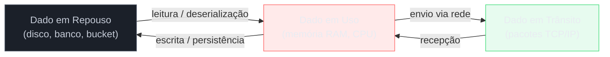
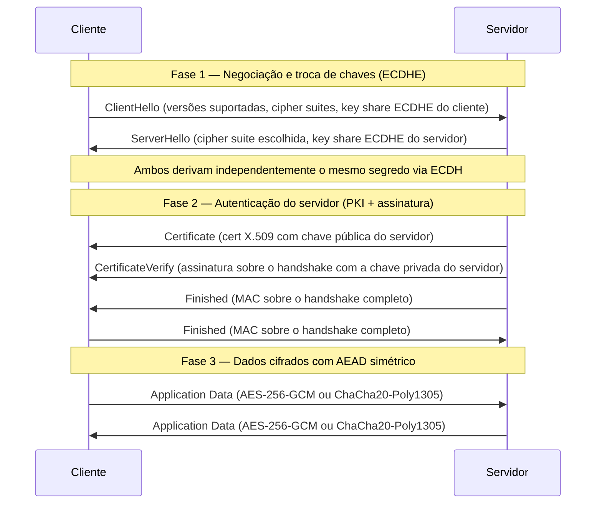
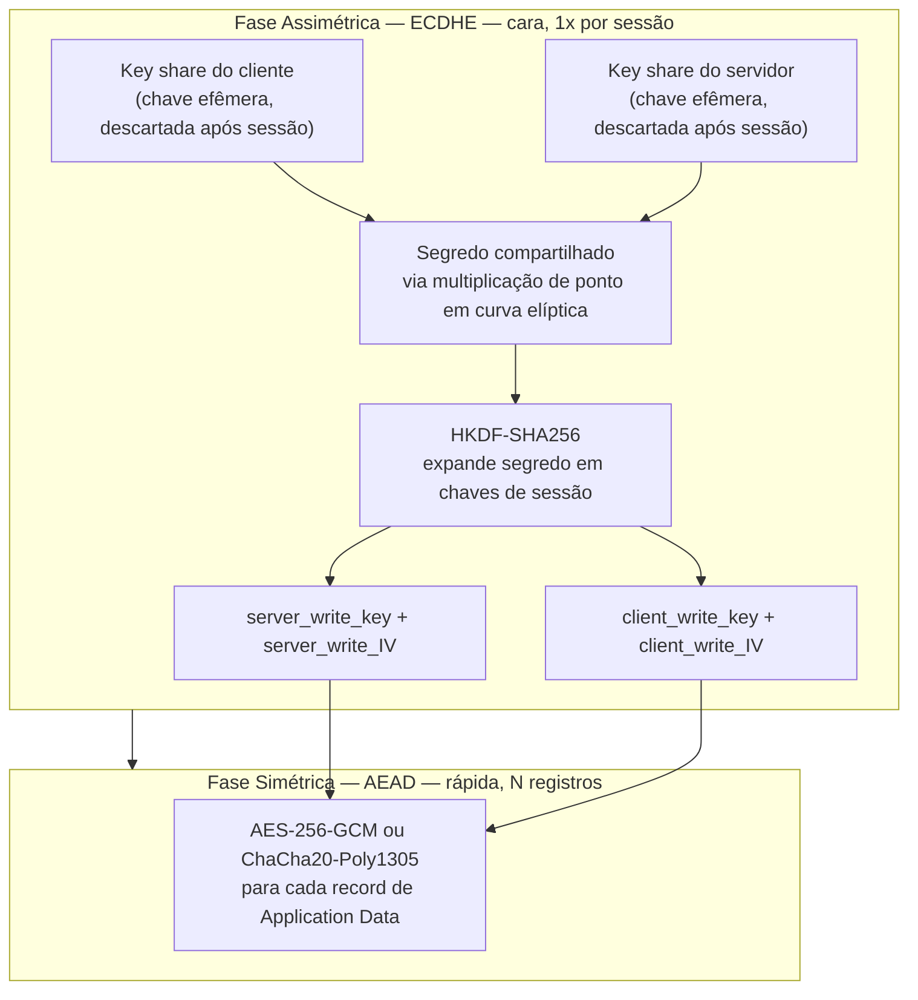
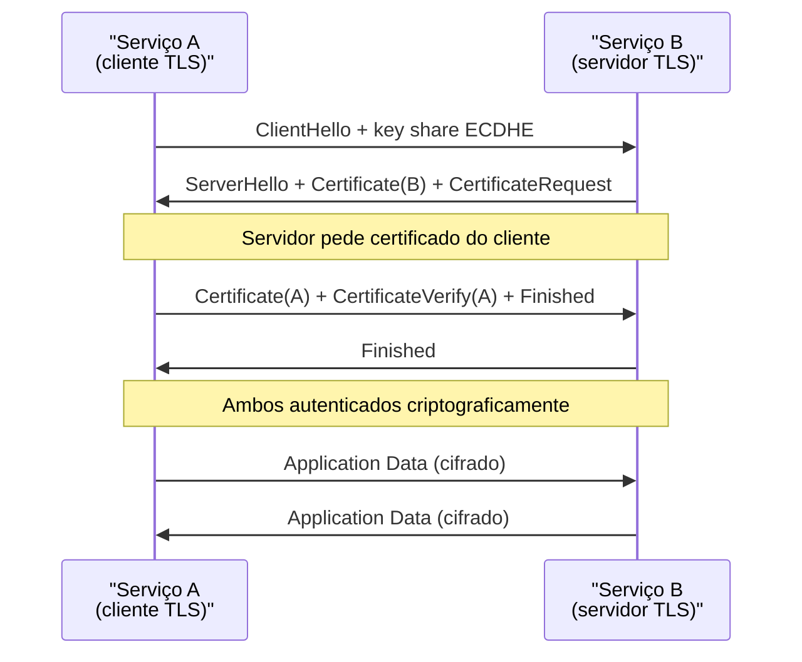
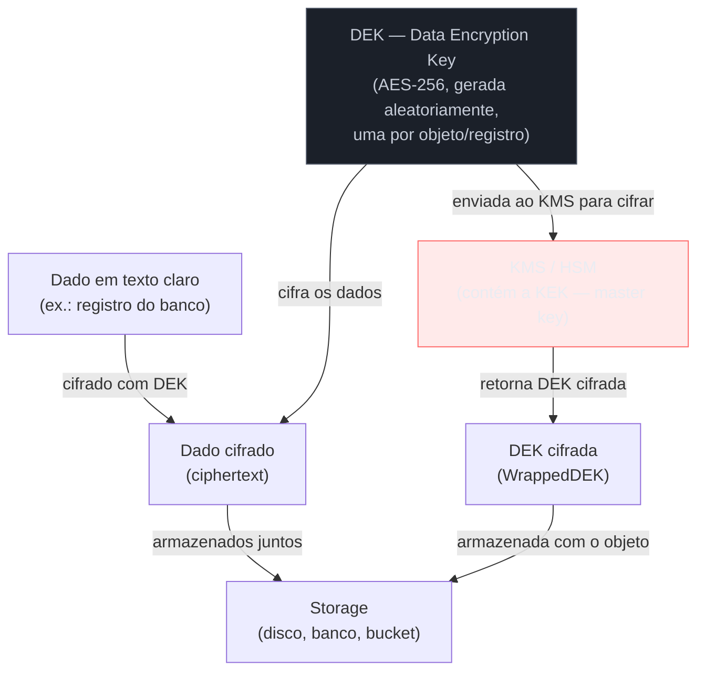
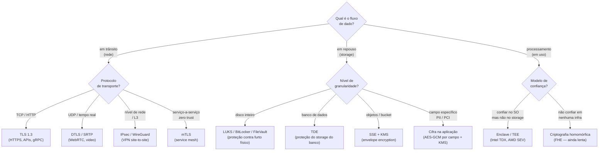

# Criptografia em trânsito e em repouso

> [!abstract] TL;DR
> Dados existem em três estados: **em trânsito** (trafegando na rede), **em repouso** (armazenados em disco, banco ou objeto) e **em uso** (carregados em memória para processamento). TLS protege o trânsito combinando criptografia assimétrica para estabelecer um segredo compartilhado com **forward secrecy** (ECDHE) com cifra simétrica AEAD para transportar os dados — o padrão clássico de **criptografia híbrida**. Em repouso, o algoritmo de cifra raramente é o problema; o elo fraco quase sempre é a **gestão da chave** — e envelope encryption com KMS resolve isso separando domínios de confiança. Em uso, o dado precisa ser decifrado para ser processado — daí surgirem enclaves e computação confidencial. Esta nota sintetiza como todas as primitivas das notas anteriores convergem para proteger dados no mundo real.

---

## Os três estados do dado

Quando você pensa em "proteger dados", o erro clássico é pensar só em um dos estados. Dados transitam, repousam e são processados — e a superfície de ataque muda radicalmente em cada estado.

> [!info] Leitura do diagrama
> Os três estados formam um ciclo. A seta **repouso → uso** representa a leitura de um registro do banco antes de processá-lo. A seta **uso → trânsito** é a serialização e envio de uma resposta HTTP. Cada transição é um ponto onde o dado pode estar desprotegido se os controles não forem alinhados. Uma estratégia de defesa em profundidade cobre os três.

| Estado | Ameaça principal | Controle canônico |
|---|---|---|
| **Em trânsito** | Interceptação (MITM), replay, sniffing | TLS 1.3, VPN, mTLS |
| **Em repouso** | Acesso indevido ao storage, furto de disco, backup exposto | Cifra de disco/BD/bucket + envelope encryption + KMS |
| **Em uso** | Dump de memória, side-channel, acesso de hypervisor/admin | Enclaves/TEE, criptografia homomórfica |

A boa notícia: os estados em trânsito e em repouso têm soluções maduras e bem estabelecidas. O estado **em uso** é o problema não resolvido da criptografia aplicada — e é onde as fronteiras de pesquisa e de infraestrutura estão avançando mais ativamente agora.

Um sistema que cobre os três estados sem lacunas tem **defesa em profundidade criptográfica**: mesmo que uma camada seja comprometida — o disco roubado, o canal interceptado antes do TLS, ou a aplicação comprometida em runtime — as outras camadas limitam o dano.

---

## Em trânsito: TLS como criptografia híbrida em ação

O TLS não é um protocolo monolítico — é a **orquestração de todas as primitivas criptográficas** que vimos nas notas anteriores aplicadas em sequência. O handshake TLS 1.3 (RFC 8446) é talvez o exemplo mais didático de criptografia híbrida em produção real.

> [!note] Escopo desta nota
> O protocolo TLS byte a byte — extensões específicas, record layer, formato das mensagens, cipher suites como identificadores numéricos — fica em [[03-Dominios/Ciência/Redes e Protocolos/05 - TLS e HTTPS]]. Aqui o foco é o **conceito**: por que cada passo existe, qual primitiva usa, e o que garante.

### O handshake conceitual do TLS 1.3

O handshake do TLS 1.3 tem três fases conceituais que acontecem em 1-RTT (uma ida-e-volta de rede):

> [!info] Leitura do diagrama
> **Fase 1**: cliente e servidor trocam key shares ECDHE públicos e derivam independentemente o mesmo segredo compartilhado — ninguém interceptando o canal consegue reconstruir o segredo sem resolver o problema do logaritmo discreto em curva elíptica. **Fase 2**: o servidor prova que possui a chave privada correspondente ao certificado X.509 — isso autentica a identidade do servidor (contra MITM). O cliente verifica a cadeia de certificados contra as CAs de confiança (nota [[11 - PKI e certificados]]). **Fase 3**: com as chaves de sessão derivadas, toda comunicação usa cifra simétrica AEAD — confidencialidade + integridade + autenticidade em uma operação.

O "1-RTT" do TLS 1.3 é importante: dados de aplicação começam a fluir **após uma única troca de ida-e-volta**, em contraste com os 2-RTTs do TLS 1.2. Para conexões HTTPS em alta latência (mobile em 4G), isso pode reduzir centenas de milissegundos de latência percebida.

### Por que a combinação assimétrico + simétrico?

O padrão de **criptografia híbrida** (nota [[08 - Criptografia assimétrica]]) existe por uma restrição física direta:

- **Criptografia assimétrica** (RSA, ECDH) resolve o problema de distribuição de chave — você pode estabelecer um segredo com alguém que nunca encontrou sem que um espião descubra. Mas é computacionalmente cara: uma operação RSA-2048 leva dezenas de microsegundos; um servidor web com milhares de conexões simultâneas não pode fazer isso para cada registro de dados.
- **Criptografia simétrica** (AES-GCM) é ordens de magnitude mais rápida — pode cifrar gigabytes por segundo com aceleração de hardware (AES-NI). Mas tem o problema de distribuição de chave: como combinar o segredo sem revelar para o espião?

A solução é usar assimétrico/DH *apenas para estabelecer o segredo*, depois usar esse segredo para derivar chaves simétricas. Cada protocolo paga o custo caro uma única vez por sessão, e o custo barato para cada byte de dado.

> [!info] Leitura do diagrama
> O HKDF (HMAC-based Key Derivation Function, RFC 5869) "estica" um segredo bruto de comprimento variável em múltiplas chaves simétricas de tamanho fixo. O TLS 1.3 gera chaves separadas para cliente→servidor e servidor→cliente — uma comprometida não compromete a outra. Os IVs (initialization vectors) são derivados do handshake e incrementados por record, evitando reutilização de nonce.

### Forward Secrecy: por que "Ephemeral" importa

O E de ECDHE é a diferença entre uma vulnerabilidade hoje que vaza dados históricos e uma vulnerabilidade contida no futuro.

**Sem PFS (RSA key exchange do TLS 1.2):** cliente cifra o segredo de sessão com a chave pública do servidor. Se a chave privada do servidor vazar anos depois, um adversário que gravou o tráfego pode decifrar todas as sessões históricas retroativamente.

**Com PFS (ECDHE):** os key shares são efêmeros — gerados para a sessão, descartados após a derivação. Mesmo que a chave privada estática do servidor vaze amanhã, sessões de hoje não podem ser descriptografadas retroativamente. O adversário precisaria ter comprometido o processo do servidor no momento exato da sessão, em memória.

> [!tip] Por que isso importa para entrevistas
> PFS/forward secrecy é frequentemente mencionado como diferencial do TLS 1.3. A resposta técnica: o TLS 1.3 tornou o key exchange efêmero **obrigatório** — removeu o RSA key exchange estático do protocolo. O TLS 1.2 *permitia* PFS mas não exigia, então muitos servidores configurados descuidadamente não usavam.

> [!tip] Vídeo — o handshake do TLS explicado passo a passo
> [TLS Handshake Explained](https://www.youtube.com/watch?v=86cQJ0MMses), Computerphile (17min, ~648 mil visualizações). Dr. Mike Pound reconstrói o handshake do zero — por que existe troca de chaves, por que ela é efêmera, e onde o certificado entra — e chega ao ponto que esta nota também faz: o key exchange baseado em ECDHE é o que garante "you've got that perfect forward secrecy" [15:39]. Bom complemento aos diagramas acima porque mostra o raciocínio sendo construído em voz alta, não só o resultado final.

### TLS 1.3 × TLS 1.2: o que mudou

| Aspecto | TLS 1.2 | TLS 1.3 |
|---|---|---|
| Key exchange sem PFS | RSA estático permitido | Removido — só ECDHE/DHE |
| Cipher suites inseguras | RC4, 3DES, export ciphers | Eliminadas completamente |
| Handshake RTTs | 2-RTT | 1-RTT (0-RTT com ressalvas) |
| Forward secrecy | Opcional | Obrigatório sempre |
| Cifras obrigatórias | Apenas MD5/SHA1 hashes | AEAD obrigatório |
| Negociação de algoritmos | Na mensagem de handshake (em claro) | Cifrada após ServerHello |
| Compressão | Suportada (CRIME attack) | Removida |

---

## mTLS: autenticação mútua em microsserviços

No TLS padrão, só o **servidor** apresenta certificado. O cliente é anônimo criptograficamente — a autenticação do usuário acontece em camada acima, via senha, token JWT, etc.

No **mTLS (mutual TLS)**, as **duas pontas** apresentam certificado X.509 e provam posse da chave privada correspondente:

> [!info] Leitura do diagrama
> A diferença do TLS padrão é o `CertificateRequest` do servidor (ele exige que o cliente se identifique) e o `Certificate + CertificateVerify` enviados pelo cliente. Após o handshake, ambos os lados têm garantia criptográfica de que a contraparte possui uma chave privada cujo certificado foi emitido por uma CA de confiança mútua.

O mTLS resolve um problema específico de **autenticação serviço-a-serviço**. Em arquiteturas de microsserviços, o padrão antigo era confiar em "estar dentro da rede interna" — qualquer processo que chegasse na porta 8080 do serviço B era automaticamente confiado. Isso é um nível de trust frágil: um único serviço comprometido pode atacar todos os outros livremente.

Com mTLS:
- Cada serviço tem uma **identidade criptográfica** — um certificado emitido por uma CA interna (SPIFFE/SPIRE é o padrão em Kubernetes).
- O serviço B **verifica que o cliente é realmente o serviço A** antes de processar a requisição.
- Um serviço comprometido não consegue forjar a identidade de outro serviço sem a chave privada do certificado desse serviço.

---

## Em repouso: o algoritmo é trivial, a chave é o problema

Cifrar dados em repouso com AES-256 é tecnicamente trivial — qualquer biblioteca de criptografia faz isso em três linhas. O problema real, que a maioria dos sistemas resolve mal, é: **onde fica a chave que decifra os dados?**

Se a chave vive no mesmo servidor que os dados cifrados, você não protegeu nada. Um atacante que comprometeu o servidor lê a chave e os dados cifrados — a cifra foi inútil. A criptografia em repouso só oferece proteção real quando **a chave e os dados vivem em domínios de segurança separados**.

### Camadas de cifra em repouso

| Nível | Tecnologia canônica | O que cifra | Quem gerencia a chave |
|---|---|---|---|
| **Disco/volume** | LUKS (Linux), BitLocker (Windows), FileVault (macOS) | Blocos físicos do disco | TPM / passphrases / recovery key |
| **Banco de dados** | TDE — Oracle, SQL Server, MySQL InnoDB, PostgreSQL pgcrypto | Arquivos de tablespace/WAL | Key file separado ou HSM externo |
| **Objeto/bucket** | SSE-S3, SSE-GCS, SSE-Azure Blob Storage | Objetos individuais | Provider-managed ou Customer-managed key (CMK) |
| **Campo/coluna** | Cifra na camada de aplicação (Java, Go, etc.) | Colunas específicas | Aplicação + KMS externo |

**Cifra em nível de disco** (BitLocker, LUKS) é a mais transparente: a aplicação não sabe que o disco está cifrado. O kernel decifra blocos ao ler e cifra ao escrever. Protege contra roubo físico do hardware, mas uma vez que o sistema está rodando e o volume montado, os dados estão acessíveis em memória — um exploit de kernel ou admin root lê os dados decifrados.

**TDE (Transparent Data Encryption)** opera em nível de banco: os arquivos `.mdf` / tablespace / WAL são cifrados no disco. Um DBA que copia os arquivos diretamente não consegue lê-los sem a chave. Mas um DBA que se conecta via SQL query lê os dados em texto claro — TDE não é controle de acesso lógico, é proteção do armazenamento físico.

**Cifra em nível de campo/aplicação** é mais granular: a aplicação cifra CPF, número de cartão, ou PII específica antes de persistir. Mesmo que um DBA acesse o banco diretamente, vê bytes opacos. O custo: não dá para fazer `WHERE cpf = ?` diretamente — você precisa cifrar o termo de busca ou manter um índice auxiliar. Comum em sistemas que precisam de compliance granular (PCI-DSS para dados de cartão).

### Envelope Encryption: o padrão de mercado

A solução adotada por AWS KMS, Google Cloud KMS, Azure Key Vault, e qualquer HSM moderno é o **envelope encryption** — ou criptografia de envelope:

> [!info] Leitura do diagrama
> O fluxo de **cifra**: (1) gere uma DEK aleatória; (2) cifre o dado com a DEK; (3) envie a DEK ao KMS para ser cifrada com a KEK (master key); (4) armazene o dado cifrado + DEK cifrada juntos. A KEK **nunca sai do KMS/HSM** — apenas cifra e decifra DEKs dentro do hardware seguro. O fluxo de **decifra**: (1) leia o dado cifrado + DEK cifrada do storage; (2) envie a DEK cifrada ao KMS; (3) KMS retorna a DEK em texto claro (efêmero, em memória); (4) decifre o dado com a DEK.

**Por que não usar a KEK diretamente para cifrar os dados?** Três razões:

1. **Rotação de chave**: se a KEK precisar ser rotacionada (por política ou por suspeita de comprometimento), você re-cifra apenas as DEKs — operação rápida no KMS, sem tocar nos dados. Se tivesse cifrado todos os dados diretamente com a KEK, precisaria re-cifrar terabytes.

2. **Auditabilidade granular**: cada chamada ao KMS (para decifrar uma DEK) gera um log com timestamp, identidade do chamador, e qual DEK foi acessada. Você sabe exatamente quando e quem acessou o quê — rastreabilidade forense completa.

3. **Isolamento de chaves**: diferentes tenants ou categorias de dados podem usar DEKs diferentes, todas cifradas pela mesma KEK. Revogar acesso a uma categoria = revogar acesso à KEK daquele conjunto de DEKs.

### Customer-Managed Keys (CMK) vs Provider-Managed Keys

Em cloud, você normalmente tem opção:

- **SSE-S3 com chave gerenciada pelo provider (SSE-S3)**: a AWS/GCP/Azure gerencia a KEK. Transparente para você, mas você confia no provedor para não acessar seus dados.
- **SSE com Customer-Managed Key (SSE-KMS / CMEK)**: você cria e gerencia a KEK no KMS do provedor. Pode revogar o acesso em qualquer momento — se revogar a KEK, o provider perde acesso aos dados mesmo internamente.
- **SSE-C (Server-Side Encryption with Customer-Provided Key)**: você envia a chave em cada requisição, o provedor cifra/decifra e descarta a chave. Você gerencia as chaves completamente fora da cloud.

A escolha depende do modelo de ameaça: se o adversário é "alguém roubou um disco do datacenter", SSE-S3 padrão resolve. Se o adversário é "o próprio provedor de cloud", você precisa de CMEK ou SSE-C — e mesmo assim, dados em uso no servidor do provedor estão acessíveis a eles.

---

## Proteção em trânsito além do TLS: VPN e DTLS

TLS opera na camada de aplicação (acima do TCP). Mas há cenários onde você precisa proteger o **canal de rede** em um nível mais baixo, ou onde TCP não é o protocolo de transporte.

### VPNs: protegendo o canal, não a aplicação

Uma VPN (Virtual Private Network) cria um **túnel cifrado** entre dois pontos, encapsulando todo o tráfego de rede — independente do protocolo de aplicação. Onde o TLS protege uma conexão HTTPS específica, uma VPN protege todos os pacotes IP que passam pelo túnel.

Casos de uso onde VPN é a ferramenta certa:
- **Acesso corporativo remoto**: funcionário conecta ao datacenter via VPN; todo o tráfego da máquina (não apenas HTTP) flui pelo túnel cifrado.
- **Site-to-site**: dois datacenters conectados permanentemente via túnel IPsec — comunicação entre redes internas privadas cruzando a internet pública sem expor os serviços.
- **Segurança em rede não confiável**: usar VPN em Wi-Fi público para proteger protocolos que não têm cifra própria (DNS não cifrado, por exemplo).

Os protocolos VPN mais relevantes:

| Protocolo | Camada | Mecanismo | Estado da arte |
|---|---|---|---|
| **IPsec/IKEv2** | Rede (L3) | Túnel de pacotes IP; IKEv2 para estabelecer SA | Padrão corporativo; suporta PFS |
| **WireGuard** | Rede (L3) | ChaCha20-Poly1305 + Curve25519; ~4000 linhas de código | Mais simples/rápido; Linux nativo desde 5.6 |
| **OpenVPN** | Aplicação | TLS sobre UDP/TCP | Flexível; mais pesado |

> [!note] VPN ≠ anonimato
> Uma VPN protege o trânsito entre você e o endpoint da VPN. Quem opera a VPN vê seu tráfego decifrado. VPNs comerciais que prometem privacidade total estão exagerando — elas movem a confiança de seu ISP para o operador da VPN.

### DTLS: TLS para UDP

TLS assume TCP — entrega ordenada e garantida. Para protocolos baseados em **UDP** (WebRTC, games, video conferência, IoT), o TLS padrão não funciona porque os retransmissões e ordenação do TCP interferem com a latência em tempo real.

**DTLS (Datagram TLS, RFC 9147)** adapta o TLS para UDP:
- Adiciona números de sequência e mecanismo de retransmissão *apenas* para o handshake (não para os dados de aplicação — o aplicativo gerencia reordenação se precisar).
- O record layer inclui um sequence number explícito para permitir decifra out-of-order.
- Anti-replay window baseado em sliding window sobre os sequence numbers.

WebRTC usa DTLS-SRTP: o DTLS negocia as chaves, e o SRTP (Secure RTP) usa essas chaves para proteger os streams de mídia com menor overhead.

---

## Como escolher a estratégia certa

Em system design, a pergunta real não é "vamos usar criptografia?" — a resposta sempre é sim. A pergunta é **qual camada e qual mecanismo** para cada tipo de dado e cada elo da arquitetura.

> [!info] Leitura do diagrama
> O diagrama não é exaustivo — é um mapa de decisão de primeiro nível. Em arquiteturas reais, múltiplas escolhas se combinam: um serviço pode usar TLS para comunicação externa, mTLS internamente, TDE no banco, e envelope encryption para arquivos sensíveis. O ponto é que cada elo da cadeia precisa ser analisado separadamente.

---

## Em uso: o problema não resolvido

Os estados em trânsito e em repouso têm soluções estabelecidas e maduras. O estado **em uso** é diferente: para processar dados, você precisa decifrá-los em memória RAM. Nesse momento, qualquer processo com acesso à memória pode lê-los — e num sistema operacional convencional, o kernel tem acesso a tudo.

A superfície de ataque em uso inclui:

- **Admin root / SYSTEM**: um administrador do SO pode ler toda a memória de qualquer processo
- **Hypervisor em cloud**: o provedor de cloud pode inspecionar a memória da VM do cliente
- **Cold boot attack**: a memória DRAM mantém conteúdo por segundos a minutos após perda de energia; é possível extrair chaves e dados carregados
- **Exploits de kernel**: vulnerabilidades tipo Spectre/Meltdown permitem leitura de memória de outros processos via side-channels de CPU (nota adjacente de Organização de Computadores)
- **Dump de memória legítimo**: crashdumps, core dumps, swap para disco podem conter dados sensíveis

### Confidential Computing: TEEs e Enclaves

A resposta da indústria é **confidential computing** — execução em ambientes de execução confiável (**TEE**, Trusted Execution Environment), também chamados de **enclaves**:

| Tecnologia | Vendor | Mecanismo |
|---|---|---|
| **Intel TDX** (Trust Domain Extensions) | Intel | VM inteira como trust domain; memória cifrada no hardware |
| **Intel SGX** (Software Guard Extensions) | Intel | Enclave de nível de processo; memória cifrada pelo CPU |
| **AMD SEV-SNP** (Secure Encrypted Virtualization) | AMD | Memória da VM cifrada; integridade verificável |
| **ARM TrustZone** | ARM | Mundo seguro/normal; base de TEEs móveis |
| **AWS Nitro Enclaves** | Amazon | Isolamento via Nitro hypervisor; sem acesso de operadores AWS |

O mecanismo central: a região de memória do enclave é cifrada pelo **hardware do processador** com chaves armazenadas no próprio chip. Nem o SO, nem o hypervisor, nem o BIOS conseguem ler o conteúdo em texto claro. Mesmo um admin root na máquina física vê apenas ciphertext ao tentar acessar a memória do enclave.

A segunda propriedade fundamental é a **atestação remota**: um terceiro pode verificar criptograficamente que o enclave executa exatamente o código esperado, sem modificações. O processador assina uma evidência (quote) com uma chave interna gravada na fábrica; a evidência inclui um hash do código rodando no enclave. Isso permite ao cliente verificar que o servidor processa seus dados com o código auditado — não com uma versão adulterada.

> [!tip] Estado da arte
> A Confidential Computing Consortium (CCC, Linux Foundation) coordena os padrões. Provedores de cloud já oferecem infraestrutura: AWS Nitro Enclaves, Azure Confidential VMs (AMD SEV-SNP), Google Cloud Confidential GKE (AMD SEV). Casos de uso reais incluem processamento de dados de saúde em cloud pública sem confiar no provedor, e cálculo de scores de crédito multi-banco sem revelar modelos ou dados entre bancos.

### Criptografia Homomórfica: o sonho de processar sem decifrar

A criptografia homomórfica (FHE, Fully Homomorphic Encryption) permite **operar sobre dados cifrados** sem decifrá-los. O servidor recebe ciphertexts, realiza operações (soma, multiplicação) diretamente no ciphertext, e retorna um ciphertext que, quando decifrado pelo cliente, é o resultado correto — como se o servidor tivesse operado sobre os dados em texto claro.

O custo: FHE é ordens de magnitude mais lenta que computação convencional — atualmente de 1000× a 1000000× mais lenta, dependendo do circuito computacional. Aplicações específicas com circuitos pequenos (consultas sobre dados médicos, inferência de ML sobre dados privados) estão saindo do laboratório, mas uso geral ainda está distante.

A nota 20 deste galho explora FHE, computação multi-party segura (MPC) e private set intersection com mais profundidade. O ponto aqui é que o estado **em uso** ainda não tem solução geral satisfatória — confidential computing com enclaves é o estado da arte prático, mas depende de hardware específico e ainda expõe side-channels de CPU (timing attacks, cache attacks). A fronteira de pesquisa está justamente em como combinar TEEs com FHE para cobrir os casos onde nem o hardware do enclave pode ser confiado completamente.

---

## Casos práticos

Duas situações concretas mostram como as escolhas discutidas acima se pagam — ou cobram o preço — fora do quadro-negro.

### Caso 1 — mTLS numa malha de serviço Kubernetes/Istio

O problema de partida: como um serviço A sabe, com garantia criptográfica, que quem bateu na sua porta é mesmo o serviço B — e não um pod comprometido tentando se passar por ele?

> [!example] mTLS na prática
> Em um cluster Kubernetes com Istio, os sidecars Envoy interceptam todo o tráfego inter-pod e estabelecem mTLS automaticamente. Certificados são emitidos pela CA do Istio (Citadel), rotacionados automaticamente, e têm validade curta (horas). O desenvolvedor não escreve código de TLS — a malha fornece identidade criptográfica para cada pod via SPIFFE SVIDs. Isso é zero trust na infraestrutura, não na aplicação.

O que esse caso ilustra: a decisão de "onde" implementar mTLS importa tanto quanto a decisão de implementá-lo. Colocar a lógica no sidecar (em vez de em cada serviço) significa que a rotação de certificados de horas em horas — impraticável se cada equipe tivesse que implementar isso à mão — vira um detalhe de infraestrutura, invisível para quem escreve a aplicação. A malha de serviço transforma um problema de segurança criptográfica em um problema de configuração de plataforma.

### Caso 2 — Downgrade attack histórico: POODLE e BEAST

O problema de partida: se um servidor aceita TLS 1.0, 1.1 e 1.2 além de 1.3 "por compatibilidade", ele abre uma porta que a criptografia moderna não fecha sozinha.

Se o servidor aceita essas versões antigas, um adversário MITM pode forçar o downgrade da conexão para a versão mais fraca — onde exploits como **POODLE** (SSLv3, 2014) e **BEAST** (TLS 1.0, 2011) ainda funcionam. O atacante não precisa quebrar a criptografia matematicamente; basta convencer as duas pontas a negociar o protocolo mais fraco que ambas "toleram", e então explorar as falhas conhecidas desse protocolo. É o mesmo princípio de um cofre moderno cuja porta antiga, nunca removida, ainda abre com a chave velha.

A defesa é desabilitar versões antigas no servidor via configuração explícita (`ssl_protocols TLSv1.3;` no nginx, `SSLProtocol -all +TLSv1.3` no Apache). O NIST SP 800-52r2 recomenda TLS 1.2 como mínimo e TLS 1.3 como preferido; TLS 1.0 e 1.1 devem ser desabilitados ativamente. O header HTTP `Strict-Transport-Security` (HSTS) com `includeSubDomains` evita downgrade HTTP→HTTPS. O `TLS_FALLBACK_SCSV` é uma extensão que sinaliza que o cliente está fazendo fallback, permitindo ao servidor rejeitar downgrades indevidos — mas a proteção real é remover o suporte a versões antigas completamente, não confiar em sinalizações que o próprio atacante pode manipular no meio do caminho.

---

## Armadilhas comuns

Saber a teoria é necessário, mas não suficiente. Em entrevista sênior, o que diferencia candidatos é reconhecer onde implementações corretas na teoria falham na prática.

> [!warning] TLS configurado mas não validado
> O erro mais comum: TLS ativado no cliente, mas com **validação do certificado desabilitada** — `verify=False`, `InsecureSkipVerify: true`, `TrustAllCerts`, `SSLContext.setVerifyMode(SSL_VERIFY_NONE)`. O canal está cifrado, mas não autenticado. Um adversário pode fazer MITM sem obstáculo — a cifra protege o canal entre cliente e atacante, e entre atacante e servidor. Da perspectiva do cliente, a comunicação parece segura; da perspectiva da segurança, não há garantia alguma de identidade do servidor. Frequentemente encontrado em código de desenvolvimento que "desabilitou por ser interno" e foi para produção sem revisão, testes automatizados com certificados autoassinados sem adicionar a CA de teste ao trust store do ambiente de CI, SDKs mal configurados em IoT/embedded onde adicionar certificados ao bundle é trabalhoso, e comunicação entre microsserviços "internos" onde a equipe assumiu que a rede interna era segura.

> [!warning] Certificate pinning: proteção e armadilha
> **Certificate pinning** (ou public key pinning) é a prática de o cliente checar não apenas que o certificado é válido e assinado por uma CA confiável, mas que é *especificamente aquele certificado* ou *aquela chave pública* — protege contra CAs comprometidas ou maliciosas que emitiriam certificados fraudulentos para o domínio. O problema: quando o certificado expira e você rotaciona, aplicações com pinning hardcoded param de funcionar até serem atualizadas. Apps mobile com pinning incorretamente implementado quebraram em renovações de certificado de grandes empresas. A recomendação atual é pinning via SPKI hash (chave pública, não o certificado inteiro) e sempre incluir um pin de backup.

> [!warning] Cifra em repouso com chave derivada de dado do usuário
> Um antipadrão recorrente: usar a senha do usuário (ou um hash dela) como chave de cifra dos dados do usuário. Parece elegante — se você não tem a senha, não tem a chave — mas cria problemas sérios: impossibilidade de migração (se o usuário esquece a senha, os dados são irrecuperáveis, a menos que haja recovery key separada, que você precisa gerenciar de qualquer forma), impossibilidade de re-cifragem (se você precisar mudar o algoritmo de cifra, precisa que o usuário se autentique para decifrar e re-cifrar seus dados), e força da chave (senhas de usuários têm entropia baixa — precisam de KDF lento como bcrypt ou Argon2 para dificultar brute-force, o que cria latência na decifra). O padrão correto: a senha do usuário protege *acesso ao sistema*, não os dados diretamente. Os dados usam DEKs aleatórias gerenciadas pelo KMS, e o acesso ao KMS é controlado pela sessão autenticada do usuário.

> [!warning] 0-RTT tem custo real
> O TLS 1.3 permite resumo de sessão com 0-RTT — dados enviados junto com o ClientHello, sem esperar pelo ServerHello. Isso elimina a latência do handshake para reconexões. Mas **0-RTT não protege contra replay attacks**: um adversário pode capturar o pacote e reenviá-lo, e o servidor não consegue distinguir o replay do original. Use 0-RTT apenas para requisições idempotentes (GET sem efeito colateral), nunca para ações com efeito (POST de transação, DELETE).

> [!warning] A corrente é tão forte quanto o elo mais fraco
> Implementações comuns de "cifra em repouso" que não protegem nada: chave AES hardcoded no código-fonte (disponível em git, image Docker, logs); chave em variável de ambiente lida pelo mesmo processo que acessa os dados; chave em arquivo `.env` no mesmo servidor que o banco; backup dos dados + backup da chave no mesmo bucket S3. Em todos esses casos, a cifra é teatro de segurança. A gestão de chave é coberta em profundidade na nota [[18 - Gestão de chaves e segredos]].

O fio condutor de todas essas armadilhas é o mesmo: **a criptografia fornece garantias matemáticas, mas a segurança real depende de como os controles são compostos**. Cada elo da cadeia — configuração de TLS, validação de certificado, gestão de chave, rotação, monitoramento — é um ponto de falha independente. A diferença entre uma implementação segura e uma que dá falsa sensação de segurança frequentemente é um único flag de configuração ou um segredo mal posicionado.

Pensar em adversários (nota [[02 - Pensar como adversário]]) e usar o modelo de três estados do dado como checklist ajuda a não deixar elos descobertos. A pergunta certa não é "usamos AES-256?" mas "em cada estado que esse dado existe, quem pode acessá-lo e como?"

---

## O que vem a seguir

Tudo o que esta nota descreveu — ECDHE, envelope encryption, mTLS, enclaves — são construções defensivas: cada uma resolve um problema de proteção específico, assumindo implicitamente que a matemática por trás dela é sólida e que a implementação segue a especificação à risca. A pergunta natural que vem depois é a inversa: onde essas garantias realmente quebram? A nota [[15 - Ataques a sistemas cripto]] muda de lente — de "como construir" para "como atacar" — e mostra que a maioria dos incidentes reais não nasce de uma falha matemática no AES ou no ECDHE, mas de exatamente os pontos frágeis que a seção de armadilhas comuns começou a mapear: certificado não validado, downgrade de protocolo, chave mal posicionada. Ela também revisita as primitivas das notas anteriores deste galho — [[08 - Criptografia assimétrica]], [[09 - Troca de chaves]], [[11 - PKI e certificados]] e [[07 - Criptografia simétrica]] — sob o ângulo do adversário. Para quem quer entender a gestão do elo mais fraco em detalhe antes de seguir, [[18 - Gestão de chaves e segredos]] aprofunda o tema; e para o protocolo TLS byte a byte, [[03-Dominios/Ciência/Redes e Protocolos/05 - TLS e HTTPS]] continua sendo a referência. Nota anterior deste galho: [[13 - Autorização e controle de acesso]].

> [!summary] Resumo em uma linha
> TLS protege dados em trânsito orquestrando ECDHE (segredo efêmero com PFS) + PKI (autenticação do servidor) + AEAD simétrico (dados); em repouso, o algoritmo de cifra é trivial — o problema real é a gestão da chave, resolvido pelo envelope encryption com KMS que separa domínios de confiança.

---

## Em entrevista

O tema aparece em três contextos diferentes de entrevista: perguntas de **system design** ("como você protege os dados dos usuários na sua plataforma?"), perguntas de **segurança** ("explique como TLS funciona" ou "o que é forward secrecy?"), e perguntas de **arquitetura distribuída** ("como serviços se autenticam entre si sem compartilhar senhas?").

O erro mais comum de candidatos: responder "usar HTTPS" sem conseguir detalhar o que acontece no handshake ou por que TLS 1.3 é diferente do 1.2. Um segundo erro: falar de criptografia em repouso como se apenas escolher AES-256 fosse suficiente, sem mencionar gestão de chave.

Frases que sinalizam domínio técnico senior:

*"TLS 1.3 is a textbook example of hybrid encryption — ECDHE to establish a shared secret with forward secrecy, then symmetric AEAD for the bulk data. The key insight is that asymmetric crypto is expensive, so you use it exactly once per session to bootstrap the symmetric key."*

*"Encrypting data at rest is the easy part — any library does AES-256 in three lines. The hard part is key management: if the encryption key lives next to the data, you've encrypted nothing. Envelope encryption with a KMS solves this by keeping the master key in a separate trust domain, so compromising the storage doesn't compromise the keys."*

*"mTLS gives you cryptographic identity at the transport layer. Instead of trusting that traffic inside a network perimeter is legitimate, each service proves it holds a valid certificate. That's the technical foundation of zero trust architectures — no implicit trust based on network location."*

*"The three states of data give you a coverage model. Most teams have TLS for transit and disk encryption for rest. But data in use is the unsolved problem — the data has to be decrypted to be processed. That's where TEEs and confidential computing come in, though they still have tradeoffs around hardware dependency and side-channels."*

*"TLS 1.3 made forward secrecy mandatory by removing RSA static key exchange entirely. In TLS 1.2, servers could still use RSA key transport — if someone captured the traffic and later compromised the server's private key, they could decrypt all historical sessions. With ECDHE, the ephemeral key pairs are discarded after the session, so there's nothing to retroactively decrypt."*

**Vocabulário PT → EN:**

| PT | EN |
|---|---|
| Criptografia em trânsito | Encryption in transit |
| Criptografia em repouso | Encryption at rest |
| Criptografia em uso | Encryption in use |
| Troca de chaves efêmera | Ephemeral key exchange |
| Sigilo encaminhado / persistente | Forward secrecy / Perfect Forward Secrecy (PFS) |
| Criptografia híbrida | Hybrid encryption |
| Cifra de envelope | Envelope encryption |
| Chave de dados | Data Encryption Key (DEK) |
| Chave mestra / chave de cifra de chaves | Master Key / Key Encryption Key (KEK) |
| Gerenciador de segredos / chaves | Key Management Service (KMS) |
| Chave gerenciada pelo cliente | Customer-Managed Key (CMK / CMEK) |
| Cifra transparente (banco) | Transparent Data Encryption (TDE) |
| Ambiente de execução confiável | Trusted Execution Environment (TEE) |
| Enclave | Secure enclave |
| Atestação remota | Remote attestation |
| Computação confidencial | Confidential computing |
| Criptografia homomórfica | Homomorphic encryption (FHE) |
| Malha de serviço | Service mesh |
| TLS mútuo | Mutual TLS (mTLS) |
| Ataque man-in-the-middle | Man-in-the-Middle attack (MITM) |

---

## Fontes

- **RFC 8446** — The Transport Layer Security (TLS) Protocol Version 1.3. IETF, 2018. [datatracker.ietf.org/doc/html/rfc8446](https://datatracker.ietf.org/doc/html/rfc8446)
- **NIST SP 800-52 Rev. 2** — Guidelines for the Selection, Configuration, and Use of TLS Implementations. NIST, 2019. [doi.org/10.6028/NIST.SP.800-52r2](https://doi.org/10.6028/NIST.SP.800-52r2)
- **NIST SP 800-57 Part 1 Rev. 5** — Recommendation for Key Management: General. NIST, 2020. [doi.org/10.6028/NIST.SP.800-57pt1r5](https://doi.org/10.6028/NIST.SP.800-57pt1r5)
- **AWS Documentation** — Envelope Encryption and Key Hierarchy. Amazon Web Services. [docs.aws.amazon.com/kms/latest/developerguide/concepts.html#enveloping](https://docs.aws.amazon.com/kms/latest/developerguide/concepts.html#enveloping)
- **Confidential Computing Consortium** — A Technical Analysis of Confidential Computing, v1.3. Linux Foundation, 2022. [confidentialcomputing.io/white-papers-reports](https://confidentialcomputing.io/white-papers-reports/)
- **Microsoft** — BitLocker Overview and Requirements FAQ. Windows Security Documentation. [learn.microsoft.com/en-us/windows/security/operating-system-security/data-protection/bitlocker](https://learn.microsoft.com/en-us/windows/security/operating-system-security/data-protection/bitlocker/)
- **Computerphile** — TLS Handshake Explained. YouTube. [youtube.com/watch?v=86cQJ0MMses](https://www.youtube.com/watch?v=86cQJ0MMses)
