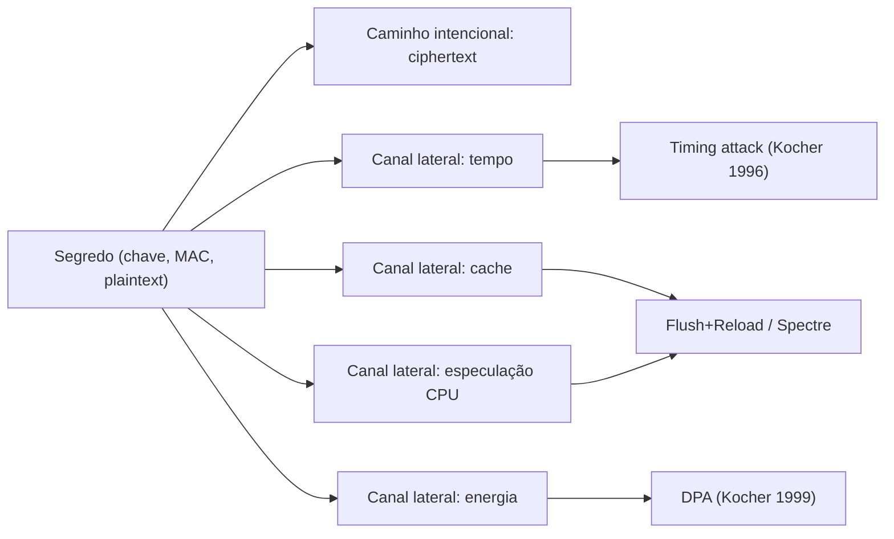
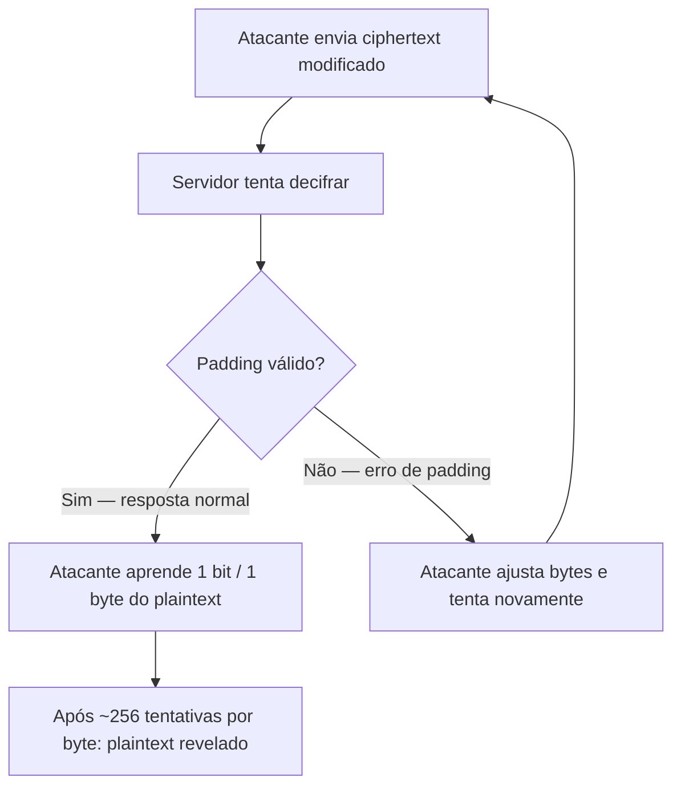
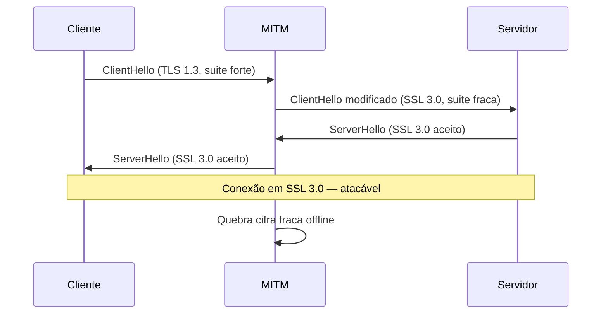
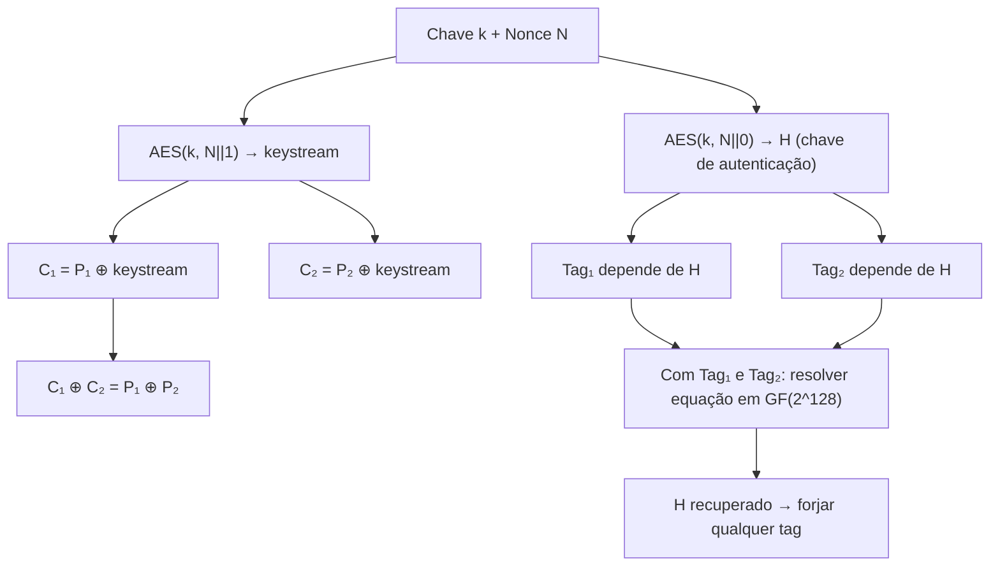
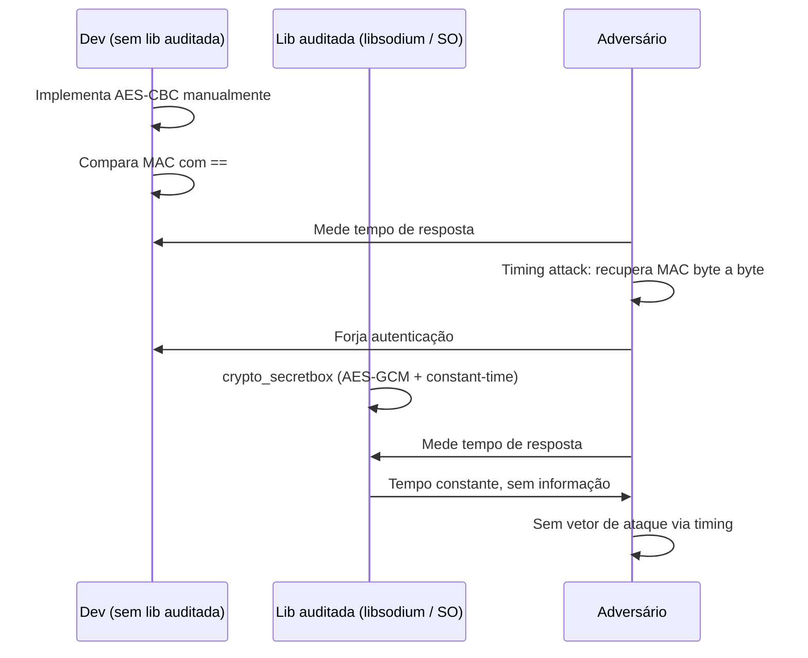
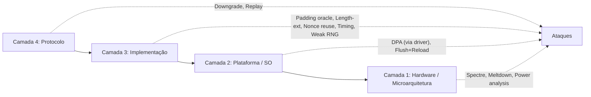

# Ataques a sistemas cripto

> [!abstract] TL;DR
> A criptografia moderna raramente quebra pela matemática — ela quebra pela implementação. Canais laterais (timing, cache, energia, especulação CPU) vazam o segredo por caminhos físicos. Oráculos de padding transformam erros de decifração em um serviço de decriptação involuntário. Ataques de downgrade forçam o uso de cifras fracas que já foram banidas. Nonce reutilizado em GCM destrói confidencialidade *e* integridade via forbidden attack. Replay reutiliza autenticação válida sem quebrar cripto. Length-extension explora a estrutura Merkle-Damgård de SHA-256. Entropia fraca reduz o espaço de busca a tamanhos triviais. A tese que une tudo: **você não ataca a matemática, você ataca os detalhes de como ela foi construída** — e é por isso que "don't roll your own crypto" não é só um dito, é uma regra de sobrevivência.

---

## A tese central

Quando alguém quebra um sistema criptográfico em produção, o culpado raramente é o AES, o RSA ou a curva P-256. Esses primitivos são revisados publicamente por décadas. O que cede é a *borda* — o código que compara MACs, o formato de padding que sinaliza erros, a versão de protocolo que o servidor aceita, o gerador de números que tem entropia insuficiente.

Pense assim: a matemática é o cofre. O ataque não arrebenta o aço — ele encontra a chave embaixo do tapete.

Esta nota mapeia as classes de ataque que mais aparecem em entrevistas técnicas e em CVEs reais, com ênfase em **por que** cada um funciona e **como** a mitigação ataca a causa raiz.

Uma taxonomia rápida para orientar a leitura:

| Classe | Vetor explorado | Exemplo canônico |
|---|---|---|
| Side channel (timing) | Tempo de execução varia com o segredo | Timing attack RSA (Kocher 1996) |
| Side channel (cache) | Padrão de acesso a cache vaza índices | Flush+Reload, Spectre |
| Side channel (energia) | Consumo de energia correlaciona com dados | DPA em smartcards |
| Padding oracle | Erros de padding funcionam como oráculo | POODLE, Lucky13, Bleichenbacher |
| Downgrade | Negociação forçada para versão/cifra fraca | FREAK, Logjam |
| Replay | Mensagem válida reenviada | Replay de pagamento |
| Nonce reuse | IV repetido em modo CTR/GCM | Forbidden attack, PS3 |
| Length-extension | Construção Merkle-Damgård expõe estado | `hash(key‖data)` sem HMAC |
| Weak randomness | Espaço de chave reduzido por entropia baixa | Debian OpenSSL 2008 |

Cada linha desta tabela é uma exploração *ortogonal* — um atacante normalmente sonda todas simultaneamente.

---

## 1. Side channels — quando o canal vaza o segredo

Um *canal lateral* (side channel) é qualquer caminho por onde informação escapa que **não** é o canal de dados intencionado. A criptografia não é quebrada diretamente; quem quebra é a física ou a microarquitetura da execução.

### 1.1 Timing attacks

Paul Kocher demonstrou em 1996 que o tempo de execução de operações criptográficas depende dos bits do segredo. Exemplos canônicos:

- **Comparação de MACs não constant-time**: uma função `strcmp` que retorna ao primeiro byte diferente vaza byte a byte. Um adversário mede o tempo de resposta e descobre o MAC correto tentativa a tentativa — O(n) ao invés de O(2ⁿ).
- **Exponenciação modular em RSA**: implementações ingênuas fazem mais operações para bits "1" do que para bits "0" na chave privada. Medir o tempo de dezenas de milhares de decifrasções revela a chave.

A defesa é **constant-time code**: o tempo de execução deve ser independente dos valores dos dados. Em vez de `if (a == b) return true`, usa-se XOR de todos os bytes e só ao final testa se o resultado é zero. Bibliotecas maduras exportam funções como `crypto_verify_32` (libsodium) e `hmac.compare_digest` (Python) para isso.

Um ponto sutil: constant-time no nível do código-fonte não garante constant-time no silício. Compiladores podem reintroduzir branches dependentes de dados via otimizações (ex.: auto-vectorização). A prática sólida é usar intrínsecos de plataforma ou bibliotecas certificadas que foram testadas no assembly final — não confiar apenas na lógica do código C.

### 1.2 Cache attacks — Flush+Reload

O ataque Flush+Reload (Yarom & Falkner, 2014) explora o fato de que acessos à memória são rastreáveis via tempo de cache. Num ambiente com memória compartilhada (VM, processo co-localizado):

1. Atacante esvazia (*flush*) uma linha de cache da tabela de substituição (S-box) do AES.
2. Vítima executa AES com chave secreta — acessa linhas de cache específicas.
3. Atacante *recarrega* todas as linhas e mede o tempo: acesso rápido = linha foi usada → revela índices → revela bits da chave.

Mitigações: AES-NI (instrução de hardware sem tabela de substituição), isolamento de memória, *constant-time* implementations que evitam lookups dependentes do segredo.

> [!tip] Por que AES-NI resolve o problema de cache?
> A instrução `AESENC` do x86 executa uma rodada inteira de AES dentro da CPU sem acessar nenhuma tabela de memória. Não há S-box em RAM; portanto, não há padrão de acesso de cache para medir. É por isso que a melhor mitigação para ataques de cache em AES não é isolamento de memória — é simplesmente usar a instrução nativa quando disponível. Sistemas modernos (Linux, OpenSSL, Go) habilitam AES-NI automaticamente quando detectam suporte.

### 1.3 Power analysis — DPA

Em dispositivos embarcados (smartcards, tokens HSM), o consumo de energia durante operações criptográficas varia de acordo com os dados processados. Paul Kocher et al. (1999) formalizaram a *Differential Power Analysis* (DPA):

- Coleta-se o traço de consumo durante centenas ou milhares de operações com inputs conhecidos.
- Hipóteses sobre bits da chave são testadas: a hipótese correta produz correlação estatística com o traço medido.
- Resultado: recuperação completa de chave AES a partir de medições externas, sem abrir o dispositivo.

Mitigações: mascaramento (*masking* — operar sobre valores embaralhados com random), embaralhamento de ordem das operações, hardware com consumo constante.

### 1.4 Spectre e Meltdown — side channel microarquitetural

Spectre e Meltdown (2018) são side channels de nível microarquitetural: a execução especulativa da CPU (→ [[03-Dominios/Ciência/Organização de Computadores/14 - Branch prediction e execução especulativa]]) deixa rastros no cache que um atacante pode ler, mesmo que o resultado da especulação seja descartado pelo hardware.

O mecanismo em linhas gerais:

1. CPU especula que uma condição é verdadeira e executa instruções *antes* de saber o resultado.
2. Essas instruções acessam memória protegida e deixam rastros no cache L1/L2.
3. Mesmo depois que a CPU detecta que a condição era falsa e descarta o resultado, o estado do cache persiste.
4. Atacante mede o cache (Flush+Reload) e lê o conteúdo da memória que não deveria ter acesso.

Do ponto de vista de cripto: Spectre pode vazar chaves de outros processos no mesmo core, quebrando isolamento de memória que a TLS assume ser garantido pelo SO.

As mitigações de Spectre/Meltdown (retpoline, KPTI, IBRS, STIBP) têm custo de desempenho mensurável — de 5% a 30% dependendo da carga. Isso significa que a segurança microarquitetural tem um custo econômico real e é por isso que o kernel Linux, hipervisores e browsers investem pesadamente em mitigações específicas por modelo de CPU. A lição para cripto: a segurança não termina na primitiva — o ambiente de execução faz parte do modelo de ameaça.



> [!info] Leitura do diagrama
> O segredo escoa por múltiplos canais físicos e microarquiteturais em paralelo ao canal de dados intencional (o ciphertext). Cada ramo é um vetor de ataque independente. A defesa atua em cada ramo separadamente — não há uma bala de prata que cubra todos.

---

## 2. Padding oracle — transformar erro em oráculo

### 2.1 O mecanismo

O CBC (Cipher Block Chaining) por si só não autentica a mensagem — só cifra. Ao decifrar, o receptor valida o *padding* (ex.: PKCS#7) e, se inválido, retorna um erro. Um adversário que observa essa diferença de resposta — erro de padding vs. erro de aplicação — transforma o servidor em um **oráculo** involuntário: pode perguntar "este ciphertext tem padding válido?" milhares de vezes e, a cada resposta, aprender um byte do plaintext.

A matemática por trás: na decifração CBC, o plaintext de um bloco é `D(ciphertext_n) ⊕ ciphertext_{n-1}`. Manipulando `ciphertext_{n-1}`, o atacante controla o XOR e pode induzir qualquer valor no plaintext — e a resposta do servidor diz se o resultado tem padding válido.

### 2.2 Instâncias reais

- **POODLE (2014)**: SSL 3.0 usava padding MAC-then-encrypt e CBC com validação de padding fraca. Forçando downgrade para SSL 3.0, um man-in-the-middle executava o ataque em ~256 requests por byte.
- **Lucky 13 (2013)**: mesmo com TLS 1.2 e constant-time decifração, o número de blocos processados pelo HMAC varia com o comprimento do padding — vazamento de *timing* em nível de ciclos de clock.
- **Bleichenbacher (RSA PKCS#1 v1.5, 1998)**: equivalente para RSA com padding de troca de chave: o servidor indicava se o plaintext decifrado começava com `0x00 0x02`. Com adaptações modernas (*million message attack*), quebra a troca de chave em sessões TLS capturadas.



> [!info] Leitura do diagrama
> O loop "atacante → servidor → resposta → ajuste" é o oráculo. Cada iteração elimina candidatos. O atacante não quebra a cifra — ele usa o servidor como máquina de decifração parcial, de graça.

### 2.3 A solução

**AEAD** (Authenticated Encryption with Associated Data) — como AES-GCM — verifica a autenticidade *antes* de decifrar e não distingue erro de padding de erro de autenticação. O servidor só responde "válido" ou "inválido" (e não processa o plaintext até ter certeza da autenticidade). A alternativa segura de composição é **Encrypt-then-MAC** (ver [[10 - MAC, HMAC e assinaturas digitais]]).

> [!note] Por que MAC-then-Encrypt falha?
> A ordem "calcular MAC do plaintext, depois cifrar tudo (plaintext + MAC)" parece intuitiva mas cria o problema: ao decifrar, o receptor precisa remover o padding *antes* de verificar o MAC — o que expõe a validação de padding como um oráculo. Encrypt-then-MAC inverte: cifra primeiro (padding incluso), depois calcula o MAC do *ciphertext*. Ao receber, o receptor verifica o MAC antes de tentar decifrar — se o MAC falhar, nenhum byte é processado e nenhuma informação sobre padding vaza. AEAD implementa exatamente essa semântica como primitivo integrado.

---

## 3. Downgrade attacks — forçar a fraqueza

### 3.1 O mecanismo

O handshake TLS negocia qual versão e quais conjuntos de cifras (*cipher suites*) serão usados. Um adversário man-in-the-middle pode manipular mensagens do handshake para fazer cliente e servidor concordarem numa versão ou cifra mais fraca — que o atacante consegue quebrar.

A raiz do problema é compatibilidade retroativa: para não quebrar clientes legados, servidores mantêm suporte a versões antigas. Cada versão suportada amplia a superfície de ataque. Quanto mais antigas as versões aceitas, maior a probabilidade de o MITM conseguir forçar uma negociação vulnerável.

Existe uma tensão real aqui: um servidor que só aceita TLS 1.3 quebrará usuários em sistemas antigos (Windows 7, Android 4.x, dispositivos IoT sem atualização). A decisão de negócio de manter compatibilidade tem um custo de segurança mensurável — e é por isso que organizações com requisitos de segurança elevados (PCI DSS, HIPAA) mandatam versões mínimas de TLS explicitamente.

### 3.2 Instâncias reais

- **FREAK (2015)**: servidores antigos mantinham suporte a "export cipher suites" — cifras de 512 bits para exportação (limitação legal da era dos anos 90). Um MITM forçava essa negociação; a chave RSA de 512 bits era fatorada em horas.
- **Logjam (2015)**: similar para Diffie-Hellman de 512 bits — negociação forçada para DHE\_EXPORT. O parâmetro primo de 512 bits era pré-computado (Number Field Sieve) offline. Suspeita-se que agências de inteligência já tinham esses logs pré-computados para os primos mais comuns.
- **POODLE**: além do padding oracle, força downgrade de TLS 1.x para SSL 3.0 (mais fácil de atacar).



> [!info] Leitura do diagrama
> O MITM age como um proxy que "traduz" os hellos. Cliente e servidor acreditam ter negociado diretamente, mas o MITM escolheu a versão mais fraca que ambos suportam. O ataque explora compatibilidade retroativa — o custo de "não quebrar clientes antigos" é aceitar versões vulneráveis.

### 3.3 Mitigações

- **Remover cifras fracas do servidor**: zero cipher suites de exportação, zero RC4, zero 3DES.
- **TLS\_FALLBACK\_SCSV** (RFC 7507): sinaliza que o cliente já tentou versões mais altas e foi forçado a cair — o servidor rejeita se suportar versão maior.
- **TLS 1.3**: remove todas as cifras históricas vulneráveis e não permite negociação de versões anteriores.

---

## 4. Replay attacks — reenviar o que já funcionou

### 4.1 O mecanismo

Se uma mensagem autenticada (válida) pode ser capturada e reenviada mais tarde, o servidor a aceita como legítima — afinal, MAC/assinatura são válidos. O atacante não precisa quebrar cripto: ele *reutiliza* cripto que a vítima já fez.

Exemplo: capturar um request HTTP autenticado de transferência bancária de R$100 e reenviá-lo 50 vezes. A autenticação é válida; o problema é que o servidor não sabe que já processou essa mensagem.

### 4.2 Defesas

| Mecanismo | Como funciona | Limitação |
|---|---|---|
| **Nonce** | Número único por request; servidor rejeita repetição | Exige armazenamento de nonces vistos |
| **Timestamp** | Janela de validade (ex.: ±5 min); fora da janela, rejeitado | Clocks devem estar sincronizados (NTP) |
| **Número de sequência** | Cada mensagem incrementa; servidor rastreia o último visto | Estado no servidor; não funciona para comunicação stateless |
| **Idempotência + token de operação** | Cada operação tem ID único; segunda execução retorna resultado cacheado | Requer design explícito na API |

TLS resolve replay de handshake com random de 28 bytes no ClientHello/ServerHello; o master secret resultante é único por sessão.

Replay attacks são sutis porque não precisam quebrar cripto — eles *evitam* a cripto. Por isso, defesas como nonce e timestamp precisam fazer parte do *design* do protocolo, não ser adicionadas como afterthought. APIs REST que usam JWT sem `jti` (JWT ID) e sem mecanismo de revogação são vulneráveis a replay de tokens roubados durante toda a validade do token.

---

## 5. Nonce e IV reuse — quando repetir é catastrófico

### 5.1 AES-GCM e o "forbidden attack"

AES-GCM é um modo AEAD: para cada mensagem, usa um nonce de 96 bits e produz ciphertext + tag de autenticação. A cifra de fluxo interna é `CTR`: `ciphertext = plaintext ⊕ keystream`, onde `keystream = AES_k(nonce ‖ contador)`.

Se o mesmo nonce é usado para duas mensagens diferentes com a mesma chave:

```
C₁ = P₁ ⊕ keystream
C₂ = P₂ ⊕ keystream
C₁ ⊕ C₂ = P₁ ⊕ P₂
```

O atacante que captura C₁ e C₂ obtém `P₁ ⊕ P₂` — e se souber qualquer parte de P₁ ou P₂ (inglês simples tem padrões previsíveis), recupera o outro. Isso é o **two-time pad problem**, o mesmo que mata o one-time pad reutilizado.

Pior: o reuso de nonce em GCM quebra a **autenticação**. A tag de GCM é construída sobre o keystream inicial (`H = AES_k(0)`); com dois nonces iguais, o atacante pode forjar tags arbitrárias — o chamado **forbidden attack** (Joux, 2006). Um sistema que reutilizou nonce acidentalmente não apenas perdeu confidencialidade; perdeu integridade.



> [!info] Leitura do diagrama
> O reuso de nonce faz keystream ser idêntico em C₁ e C₂ — XOR cancela o keystream e expõe o XOR dos plaintexts. Pior ainda: H (a chave de autenticação) é a mesma em ambas as tags, o que permite ao atacante resolver um sistema linear em GF(2¹²⁸) e recuperar H. Com H, qualquer tag pode ser forjada. Reuso de nonce = perda simultânea de confidencialidade e integridade.

### 5.2 ECDSA e o caso PS3

ECDSA exige que cada assinatura use um `k` aleatório e *único*. A assinatura produz `(r, s)` onde `s = k⁻¹(hash + r·privKey) mod n`. Se o mesmo `k` é usado em duas assinaturas:

```
s₁ = k⁻¹(h₁ + r·d) mod n
s₂ = k⁻¹(h₂ + r·d) mod n
s₁ - s₂ = k⁻¹(h₁ - h₂) mod n
k = (h₁ - h₂) · (s₁ - s₂)⁻¹ mod n
d = (s₁·k - h₁) · r⁻¹ mod n
```

A chave privada `d` é revelada com álgebra simples. Em 2010, o PlayStation 3 usava um RNG defeituoso que produzia o mesmo `k` em toda assinatura — o que permitiu ao grupo fail0verflow extrair a chave privada da Sony e assinar qualquer código como oficial. Ver [[05 - Aleatoriedade e segredos]] para a importância de um CSPRNG correto.

A solução moderna para o problema de `k` em ECDSA é o **RFC 6979** (deterministic ECDSA): em vez de gerar `k` aleatoriamente, calcula-se `k = HMAC-DRBG(privKey, hash)` — determinístico a partir de inputs conhecidos, portanto nunca repetido para mensagens diferentes e sem dependência de um CSPRNG externo. Ed25519 (EdDSA sobre Curve25519) vai além: a construção é intrinsecamente determinística por design, eliminando a classe inteira de vulnerabilidades de `k` fraco.

> [!tip] Prefira Ed25519 a ECDSA P-256 quando possível
> Além do k determinístico, Ed25519 usa aritmética em curvas de Edwards que é mais resistente a timing attacks por design — as operações são mais uniformes. P-256 é a escolha mandatada em muitos contextos (FIPS, TLS 1.3 padrão), mas quando você tem liberdade de escolha (ex.: tokens de API internos, SSH keys), Ed25519 elimina mais vetores com menos esforço.

---

## 6. Length-extension attack — a fraqueza Merkle-Damgård

Funções de hash como SHA-256 e SHA-1 usam a construção **Merkle-Damgård**: o estado interno após processar a mensagem inteira *é* o hash. Isso cria uma vulnerabilidade sutil.

Se você usa `hash(segredo ‖ mensagem)` como autenticador e o adversário conhece o hash e o comprimento do segredo, ele pode calcular `hash(segredo ‖ mensagem ‖ padding ‖ extensão)` *sem conhecer o segredo*. O estado interno do hash é exatamente o valor do hash atual — o atacante pode "continuar" o hash de onde parou.

Isso afeta autenticadores caseiros do tipo `tag = SHA256(key ‖ data)` — comuns em APIs que tentaram implementar autenticação sem usar HMAC. O ataque permite que o adversário adicione dados arbitrários (ex.: `&admin=true`) e produza uma tag válida.

A solução é **HMAC**: a construção `HMAC(k, m) = H((k ⊕ opad) ‖ H((k ⊕ ipad) ‖ m))` quebra a relação linear — o estado interno do hash interno nunca é exposto diretamente. SHA-3 (Keccak) não usa Merkle-Damgård e é imune ao length-extension por design. Ver [[06 - Hashing criptográfico]] para a estrutura completa.

Um padrão real que expõe este ataque: APIs que usam `SHA256(secret + ":" + body)` como assinatura de webhook. Qualquer receptor que conhece um par (body, tag) pode acrescentar dados ao body e calcular uma nova tag válida sem conhecer o secret. O fix é `HMAC-SHA256(secret, body)` — dois caracteres extras no import, mas a diferença entre autenticação real e placebo.

> [!question] Por que SHA-3 é imune ao length-extension?
> SHA-3 (Keccak) usa uma construção de esponja (*sponge construction*) em vez de Merkle-Damgård. Na esponja, parte do estado interno é mantida *privada* (a "capacidade" — entre 256 e 512 bits dependendo da variante) e nunca é exposta no output. O hash final não é o estado completo — é apenas a metade pública (a "taxa"). Sem acesso ao estado completo, o atacante não pode "continuar" o hash. Isso também é por que `SHA3-256(key ‖ data)` é seguro como MAC, embora HMAC-SHA3 ainda seja preferido por clareza semântica.

---

## 7. Weak randomness — entropia como fundação

A maioria dos ataques acima pressupõe que chaves, nonces e `k` são gerados com boa entropia. Quando não são, o ataque muda de categoria: ao invés de explorar uma fraqueza de protocolo, o adversário simplesmente adivinha os valores ou itera sobre um espaço pequeno.

Weak randomness é peculiar porque parece invisível: o sistema funciona normalmente, não há erro, nenhum log suspeito. A chave existe, o nonce existe, a assinatura é válida — mas tudo foi gerado a partir de um espaço de busca ordens de magnitude menor que o esperado. O atacante descobre isso não observando o sistema em operação, mas analisando os outputs gerados (chaves públicas, assinaturas) e detectando a baixa entropia estatisticamente.

Instâncias reais:

- **Debian OpenSSL bug (2008)**: um patch removeu uma linha de inicialização de entropia por engano. Durante dois anos, o OpenSSL gerou chaves RSA e DSA a partir de apenas 15 bits de entropia (~32.768 chaves possíveis). Todas as chaves geradas nesse período em sistemas Debian/Ubuntu são comprometidas.
- **Android SecureRandom (2013)**: bug na implementação Android fazia o `java.security.SecureRandom` reseeder com entropia insuficiente — permitiu roubo de bitcoins de wallets geradas no período.
- **ECDSA k fraco**: qualquer viés no `k` — não só repetição — vaza a chave privada progressivamente via análise de múltiplas assinaturas (lattice attacks).

A regra: **sempre use o CSPRNG do sistema operacional** (`/dev/urandom`, `getrandom()`, `CryptGenRandom`). Nunca `rand()`, nunca `Math.random()`, nunca timestamps como seed. Ver [[05 - Aleatoriedade e segredos]].

O padrão de lattice attack em ECDSA merece destaque separado: mesmo que `k` não se repita, se a distribuição de `k` tiver *qualquer* viés estatístico (ex.: os 3 bits mais significativos são sempre zero), um atacante pode montar um problema de base curta em reticulado (LLL/BKZ) e recuperar a chave privada a partir de algumas centenas de assinaturas. Isso é a razão pela qual implementações de ECDSA com CSPRNG imperfeito — mesmo não repetindo `k` — são inseguras. RFC 6979 e Ed25519 eliminam esse vetor por completo.

---

## 8. A meta-lição: don't roll your own crypto



> [!info] Leitura do diagrama
> O diagrama contrasta dois mundos: à esquerda, um dev que implementou AES-CBC + comparação ingênua e ofereceu um timing oracle involuntário. À direita, a lib auditada usa constant-time internamente e não expõe esse vetor. A primitiva (AES) é a mesma — o que difere é a borda.

Cada classe de ataque desta nota — timing, padding oracle, downgrade, replay, nonce reuse, length-extension, weak randomness — existe porque alguém construiu a borda errada. A matemática central (AES, SHA-256, ECDSA, Diffie-Hellman) permanece intacta.

As regras práticas que emergem:

- Use **AEAD** (AES-GCM, ChaCha20-Poly1305) — nunca AES-CBC puro para confidencialidade.
- Nunca compare MACs ou hashes com `==` ou `strcmp` — use constant-time compare.
- Gere nonces com o CSPRNG do sistema; nunca reutilize em GCM/CTR.
- Use **HMAC** — nunca `hash(key ‖ data)`.
- Remova cipher suites fracas e use TLS 1.3 quando possível.
- Inclua nonce/timestamp/sequência para prevenir replay.
- Use libsodium ou as APIs cripto do SO — nunca implemente primitivos do zero.
- Prefira **Ed25519** a ECDSA quando tiver liberdade de escolha; prefira **ChaCha20-Poly1305** a AES-GCM em ambientes sem AES-NI.

A evidência empírica apoia essa lista: a maioria dos CVEs de cripto nos últimos 20 anos violou exatamente um desses itens. Não é que os desenvolvedores não soubessem sobre timing attacks ou padding oracles — muitas vezes não sabiam que estavam construindo cripto. A função `SHA256(key + ":" + data)` num webhook não parece cripto. Um `if (token == stored_token)` num sistema de autenticação não parece cripto. Mas são — e o adversário sabe que são.

> [!warning] A falácia do "só para fins internos"
> "É uma API interna, não precisa ser perfeita." Todo padding oracle, todo timing leak, toda fraqueza de downgrade que apareceu em CVE começa com essa frase. A internet é um ambiente adversarial por definição.

### 8.1 O mapa de mitigações por classe

A tabela a seguir consolida as defesas canônicas para cada classe. Em entrevista, ser capaz de cruzar vetor → mitigação → *por que a mitigação funciona* é o que separa candidato sênior de candidato mediano.

| Ataque | Causa raiz | Mitigação canônica | Por que funciona |
|---|---|---|---|
| Timing (MAC compare) | Saída antecipada na comparação | `constant_time_compare` | Itera todos os bytes, sem branch no resultado parcial |
| Timing (RSA) | Square-and-multiply condicional | Montgomery ladder / constant-time exp | Número de operações ≠ f(chave) |
| Cache (Flush+Reload) | S-box em RAM com lookup dependente do dado | AES-NI, constant-time impl | Sem acesso à memória dependente do segredo |
| Spectre | Execução especulativa vaza cache | Retpoline, KPTI, serialização | Elimina o canal (não a especulação) |
| DPA | Consumo correlaciona com dados | Masking, hardware balanceado | Desfaz correlação estatística |
| Padding oracle | Erro de padding distinto de erro de MAC | AEAD / Encrypt-then-MAC | Verifica autenticidade antes de decifrar |
| Downgrade | Negociação aceita versão fraca | TLS 1.3 + TLS\_FALLBACK\_SCSV | Remove versões fracas / sinaliza fallback forçado |
| Replay | Mensagem válida reenviada | Nonce + timestamp + seq | Unicidade temporal torna cópia detectável |
| Nonce reuse (GCM) | Keystream repetido | Nonce aleatório 96-bit ou contador monotônico | Garante unicidade por construção |
| ECDSA k reuse | k fixo revela privKey | RFC 6979 / Ed25519 | k determinístico de (privKey, msg) — nunca repete |
| Length-extension | Estado Merkle-Damgård exposto | HMAC / SHA-3 | Chave interna não é exposta no output |
| Weak randomness | Espaço pequeno de chave/nonce | CSPRNG do SO (`getrandom`) | Entropia real de hardware — não pseudoaleatória |

---

## 9. Modelo mental unificado — onde cada ataque mora

É útil pensar em sistemas cripto como tendo quatro "camadas" onde os ataques ocorrem. Nenhum sistema está seguro até que todas as quatro estejam tratadas.



> [!info] Leitura do diagrama
> Cada camada expõe vetores diferentes. Ataques de protocolo (downgrade, replay) não exigem acesso ao código — basta controlar o canal de rede. Ataques de implementação exigem que o adversário provoque comportamento observável no software. Ataques de plataforma e hardware exigem co-localização ou acesso físico, mas não precisam de nenhuma falha de protocolo — o primitivo criptográfico pode estar correto e ainda assim vazar.

A implicação prática: um pentest que só testa a camada de protocolo (ex.: scanner de cipher suites do servidor) é necessário mas não suficiente. Uma auditoria de segurança cripto completa revisa também o código de comparação, o gerenciamento de nonces, a fonte de entropia e, para sistemas de alta segurança (HSMs, tokens), as contramedidas de side channel físico.

> [!example] Cadeia de ataque real: Logjam
> 1. **Protocolo**: MITM força negociação para DHE\_EXPORT (512 bits).
> 2. **Matemática fraca**: primos de 512 bits são vulneráveis ao Number Field Sieve.
> 3. **Pré-computação offline**: o NFS é executado previamente para os primos mais comuns (1024/512-bit Diffie-Hellman).
> 4. **Resultado**: o atacante decifra a sessão em tempo real depois de minutos de pré-computação. O AES que cifrou os dados está intacto — o que quebrou foi a troca de chave forçada para fraqueza. Este exemplo mostra que ataques de protocolo (layer 4) abrem caminho para fraqueza matemática que não seria explorável em condições normais.

---

## Conexões

- Anterior: [[14 - Criptografia em trânsito e em repouso]]
- Próxima: [[16 - Classes de vulnerabilidade]]
- Aleatoriedade como fundação — fraqueza de CSPRNG como vetor primário: [[05 - Aleatoriedade e segredos]]
- Merkle-Damgård e length-extension — por que a construção expõe o estado: [[06 - Hashing criptográfico]]
- HMAC e Encrypt-then-MAC — a composição correta que fecha o padding oracle: [[10 - MAC, HMAC e assinaturas digitais]]
- Mecanismo de hardware por trás do Spectre — branch prediction e execução especulativa explicados: [[03-Dominios/Ciência/Organização de Computadores/14 - Branch prediction e execução especulativa]]

> [!summary] Resumo em uma linha
> A criptografia quebra na implementação, não na matemática: canais laterais, oráculos de padding, downgrade, replay, nonce reuse e entropia fraca são todos ataques à borda — e bibliotecas auditadas existem para fechar essa borda.

---

## Em entrevista

Side channels são a pergunta favorita de entrevistadores de segurança sênior: separe quem sabe o conceito de quem apenas memorizou nomes. Saber explicar *por que* um `==` numa comparação de MAC cria um oráculo de timing, ou *por que* reusar nonce em GCM é pior que reusar em CBC, diferencia o candidato.

Perguntas clássicas de entrevista e o ângulo correto de resposta:

- **"Por que você não deve implementar sua própria criptografia?"** — A primitiva (AES, SHA-256) raramente é o problema. O problema é a borda: constant-time, nonce management, padding, composição de primitivos na ordem certa. Cada um desses detalhes representa uma classe de CVE documentada. Bibliotecas auditadas levaram anos de revisão pública para acertar esses detalhes.

- **"O que é um padding oracle?"** — É quando um sistema retorna erros distinguíveis sobre a validade do padding, transformando o servidor num oráculo de decifração parcial. Um adversário itera ciphertext modificado e, em ~256 requisições por byte, recupera o plaintext sem quebrar o AES.

- **"Como Spectre se relaciona com criptografia?"** — Spectre explora a execução especulativa para vazar estado de cache entre processos. Mesmo que a cripto esteja implementada corretamente, a chave pode vazar via cache se dois processos compartilham um core físico. O modelo de ameaça de TLS assume que o SO isola processos — Spectre quebra essa premissa.

Frases que funcionam em inglês:

- *"The math is rarely the weak point — it's the implementation details that create attack surface."*
- *"A padding oracle turns a server's error handling into an involuntary decryption service."*
- *"Nonce reuse in AES-GCM doesn't just break confidentiality — it breaks authentication via the forbidden attack."*
- *"Spectre is a side-channel attack on the CPU's speculative execution, not on the cryptographic primitive itself."*
- *"Constant-time comparison is not a micro-optimization — it's a security requirement."*
- *"Don't roll your own crypto isn't about distrust of math — it's about the impossibility of getting every implementation detail right without years of public scrutiny."*

**Vocabulário PT → EN:**

| Português | Inglês |
|---|---|
| Canal lateral | Side channel |
| Ataque de tempo | Timing attack |
| Análise de poder diferencial | Differential power analysis (DPA) |
| Oráculo de padding | Padding oracle |
| Ataque de downgrade | Downgrade attack |
| Cifra de suite de exportação | Export cipher suite |
| Ataque de replay | Replay attack |
| Reutilização de nonce | Nonce reuse |
| Extensão de comprimento | Length extension attack |
| Código constant-time | Constant-time code |
| Cifra autenticada com dados associados | Authenticated encryption with associated data (AEAD) |
| Execução especulativa | Speculative execution |
| Ataque de reticulado | Lattice attack |
| Cifra ECDSA com k determinístico | Deterministic ECDSA (RFC 6979) |
| Mascaramento de poder | Power masking |
| Conjunto de cifras | Cipher suite |
| Troca de chave | Key exchange |
| Encaminhamento secreto perfeito | Perfect forward secrecy (PFS) |

---

> [!info] Lastro
> - Kocher, P. (1996). *Timing Attacks on Implementations of Diffie-Hellman, RSA, DSS, and Other Systems*. CRYPTO 1996. https://paulkocher.com/doc/TimingAttacks.pdf
> - Kocher, P., Jaffe, J., Jun, B. (1999). *Differential Power Analysis*. CRYPTO 1999. https://paulkocher.com/doc/DifferentialPowerAnalysis.pdf
> - Möller, B., Duong, T., Kotowicz, K. (2014). *This POODLE Bites: Exploiting the SSL 3.0 Fallback*. https://www.openssl.org/~bodo/ssl-poodle.pdf
> - Adrian, D. et al. (2015). *Imperfect Forward Secrecy: How Diffie-Hellman Fails in Practice* (Logjam). https://weakdh.org/imperfect-forward-secrecy-ccs15.pdf
> - Kocher, P. et al. (2019). *Spectre Attacks: Exploiting Speculative Execution*. IEEE S&P 2019. https://spectreattack.com/spectre.pdf
> - Joux, A. (2006). *Authentication Failures in NIST version of GCM* (forbidden attack). https://csrc.nist.gov/csrc/media/projects/block-cipher-techniques/documents/bcm/joux_comments.pdf
> - Pornin, T. (2013). *RFC 6979 — Deterministic Usage of the DSA and ECDSA*. IETF. https://www.rfc-editor.org/rfc/rfc6979
> - Latacora (Trail of Bits). *Stop Using Encrypted Email / Use This Crypto*. https://latacora.micro.blog/2019/07/16/the-pgp-problem.html — referência canônica do "don't roll your own crypto" moderno
