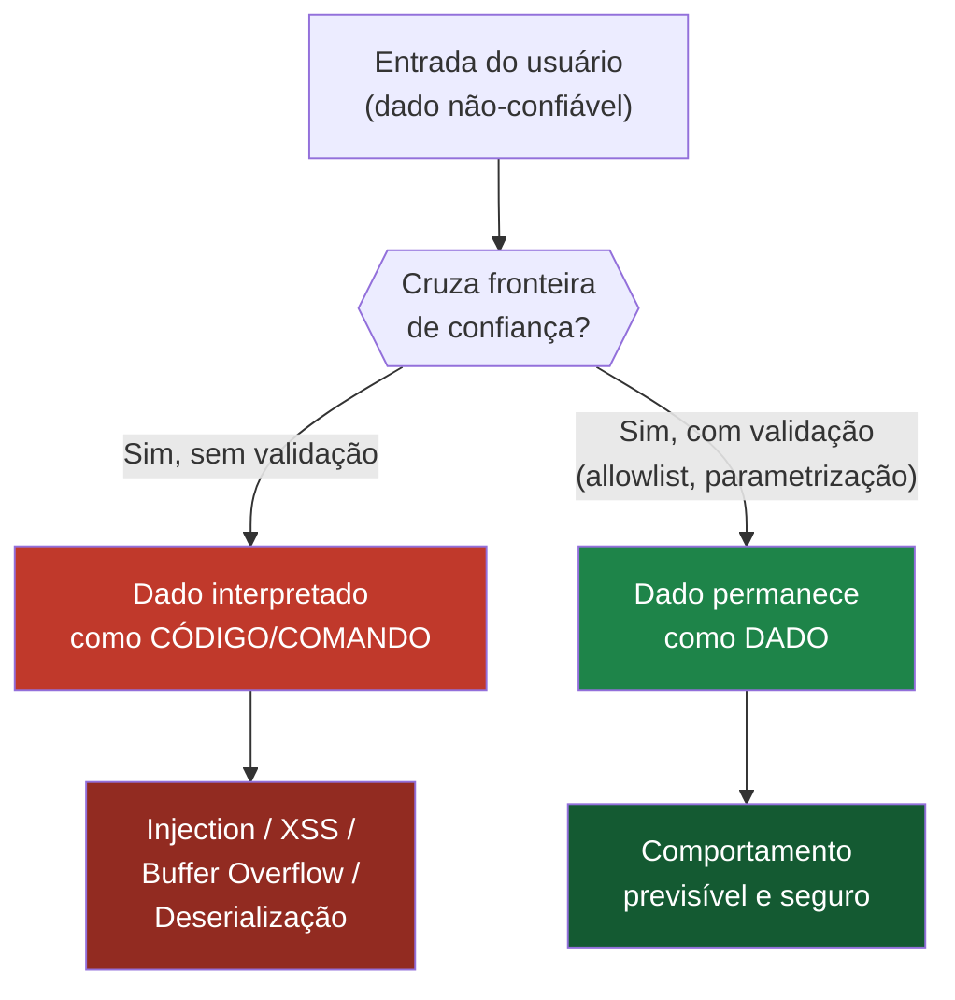
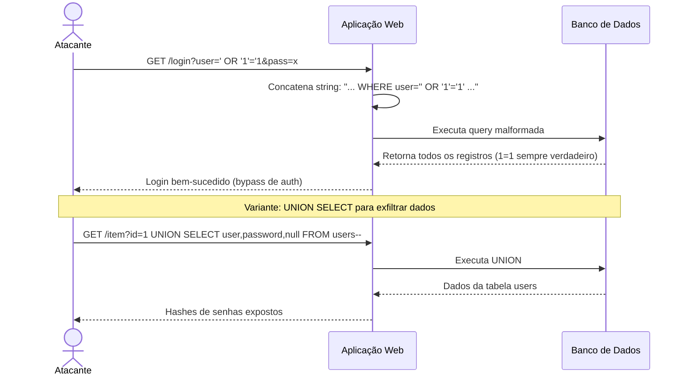
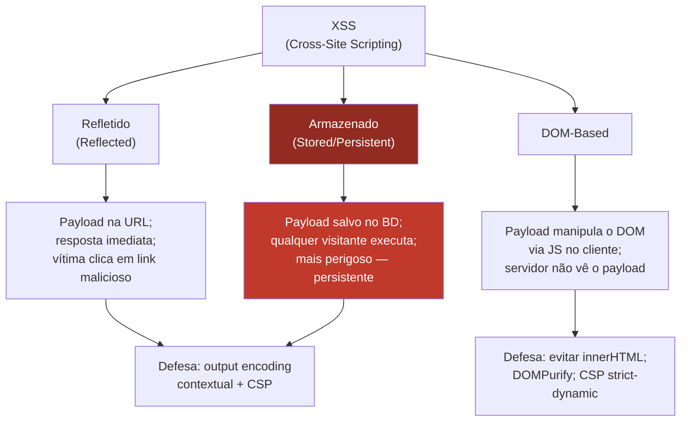
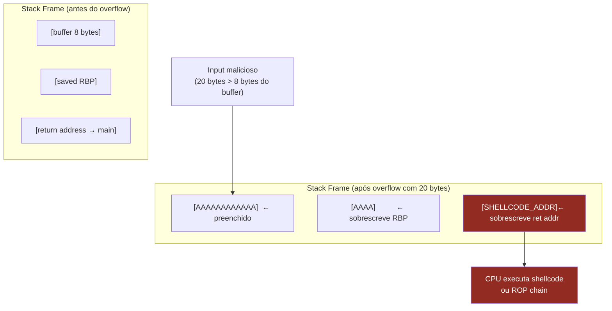
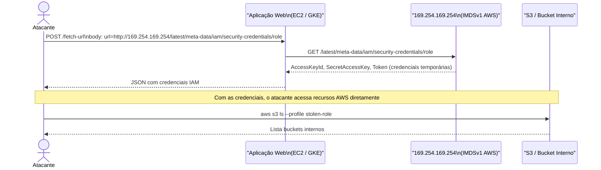
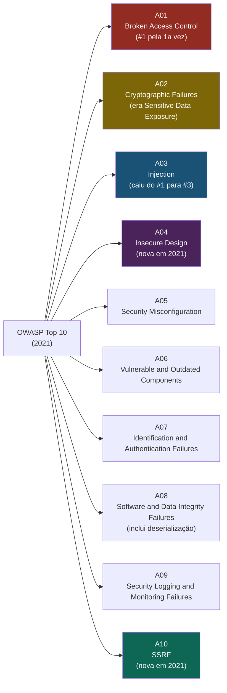

# Classes de vulnerabilidade

> [!abstract] TL;DR
> A raiz de quase toda vulnerabilidade de software é uma única confusão: **dado não-confiável sendo interpretado como código ou controle**. Injection, XSS, buffer overflow e deserialização insegura são variações do mesmo erro original. Entender a taxonomia — Injection, Memory Safety, Broken Access Control, Crypto Failures, SSRF e congêneres — é saber perguntar "em que fronteira de confiança esse dado cruza?" antes de escrever qualquer linha de código.

---

## A raiz comum: dado × código

Antes de catalogar classes, vale fixar o princípio unificador. A maioria dos CVEs graves nasce de uma de duas confusões:

1. **Dado não-confiável é executado como código ou comando** — SQL injection, command injection, XSS, deserialização insegura.
2. **Dado não-confiável cruza uma fronteira de confiança sem validação** — path traversal, SSRF, XXE, race conditions.

A máxima da segurança ofensiva é simples: *"All input is evil until proven otherwise."* O corolário para o defensor: nunca permita que a entrada do usuário mude a **estrutura** de uma query, comando ou árvore de controle — apenas os **valores** dentro de uma estrutura já definida.

Veja o diagrama abaixo: a distinção entre dado e código/controle é a fronteira que separa código seguro de código explorável.



> [!info] Leitura do diagrama
> O nó crítico é a fronteira de confiança (losango). A esquerda leva a exploração; a direita, a código seguro. Toda defesa que estudaremos é uma maneira diferente de forçar o caminho da direita — seja por parametrização, encoding contextual, validação de tipo ou isolamento de processo.

---

## Família Injection

### SQL Injection

SQL Injection (SQLi) é o exemplo canônico de dado virando código. Considere:

```sql
-- Código vulnerável (concatenação de string):
query = "SELECT * FROM users WHERE username = '" + username + "' AND password = '" + password + "'"

-- Entrada maliciosa:
username = ' OR '1'='1
password = qualquer_coisa

-- Query resultante:
SELECT * FROM users WHERE username = '' OR '1'='1' AND password = 'qualquer_coisa'
-- '1'='1' é sempre true → bypass de autenticação completo
```

A defesa **correta** é **parametrização** (prepared statements), não escapamento manual:

```sql
-- Java com PreparedStatement:
PreparedStatement stmt = conn.prepareStatement(
    "SELECT * FROM users WHERE username = ? AND password = ?"
);
stmt.setString(1, username);
stmt.setString(2, password);
```

Com prepared statements, o banco recebe a estrutura da query separada dos valores. Não há como um valor "escalar" para a estrutura — o driver garante isso na serialização do protocolo. Escapamento manual falha porque é impossível antecipar todos os contextos de encoding (charset, collation, Unicode).

O passo a passo de uma exploração SQLi em produção:



> [!info] Leitura do diagrama
> O fluxo superior mostra bypass de autenticação — o caso clássico de SQLi "cego". O fluxo inferior mostra exfiltração via UNION SELECT, que requer que o número de colunas seja igual ao da query original. Na prática, o atacante sonda a estrutura iterativamente com ORDER BY e UNION SELECT null,null,...

### Outras injeções da família

| Variante | Vetor | Defesa canônica |
|---|---|---|
| Command Injection | `os.system(user_input)` | Evitar shell; usar APIs nativas com args em lista |
| LDAP Injection | Filtro LDAP concatenado | Escapar chars especiais LDAP; parametrização |
| NoSQL Injection | Operadores MongoDB em JSON | Validar schema (JSONSchema); negar operadores |
| XPath Injection | Query XPath com input | Parametrização XPath (não universal) |
| Template Injection | `render(template=user_input)` | Sandbox; separar templates de dados |

A lógica é sempre a mesma: separar a **estrutura** do **valor**.

---

## XSS — Cross-Site Scripting

XSS é injection no contexto HTML/JavaScript. O atacante injeta script que é executado no browser de outras vítimas. Há três sabores:



> [!info] Leitura do diagrama
> XSS Armazenado (vermelho) é o mais grave: o payload persiste no banco e atinge todos os visitantes sem interação adicional. XSS DOM-Based nunca passa pelo servidor — ferramentas de análise estática ou WAF que só inspecionam respostas HTTP não o detectam.

### A defesa em camadas para XSS

1. **Output encoding contextual** — o mesmo dado precisa de encoding diferente dependendo do contexto: HTML body (`&lt;`), atributo HTML (`&quot;`), JavaScript (`<`), CSS, URL. Frameworks modernos (React, Angular, Vue) fazem isso por padrão — `innerHTML` e `dangerouslySetInnerHTML` são as exceções que exigem atenção.

2. **Content-Security-Policy (CSP)** — header HTTP que define quais origens de script são permitidas. `script-src 'self'` proíbe scripts inline e scripts de terceiros. `strict-dynamic` com nonce é o padrão moderno (Google recomenda).

3. **HTTPOnly + SameSite cookies** — limita o dano: mesmo que XSS execute, não pode roubar o cookie de sessão via `document.cookie`.

> [!warning] Atenção na entrevista
> Examinadores frequentemente perguntam "por que escapar HTML não é suficiente?" A resposta: contexto. `` não contém `<script>`, mas executa JS. `<a href="' + userInput + '">` requer URL encoding, não HTML encoding. A regra é: **encode para o contexto de saída**, não para "HTML genérico".

---

## Memory Safety — quando a linguagem não protege você

### Buffer Overflow

Em C/C++, arrays não têm verificação de limites por padrão. Se você escreve além do fim de um buffer, sobrescreve memória adjacente — potencialmente o endereço de retorno da função na stack.



> [!info] Leitura do diagrama
> A stack cresce para baixo na memória. O buffer fica "acima" (endereço menor) do saved RBP e do return address. Escrever além do buffer sobe na pilha e sobrescreve o endereço de retorno. Quando a função executa `ret`, a CPU salta para o endereço controlado pelo atacante. Isso é o princípio descrito por Aleph One em "Smashing the Stack for Fun and Profit" (Phrack, 1996) — ainda relevante 30 anos depois.

### Variantes de memory safety

| Classe | Descrição | Exemplo real |
|---|---|---|
| Stack overflow | Overflow do buffer na stack → ret addr | CVE-2021-3156 (sudo heap, mas análogo) |
| Heap overflow | Overflow em malloc → metadados do heap | HeartBleed (OpenSSL, CVE-2014-0160) |
| Use-After-Free | Acesso a memória após `free()` | Maioria dos CVEs críticos Chrome/Firefox |
| Out-of-Bounds Read | Leitura além do array → info leak | HeartBleed (leu 64KB além do buffer) |
| Integer Overflow | `int` wraparound → alocação insuficiente | CVE-2021-31166 (Windows HTTP) |

### O dado da Microsoft e do Chromium

~70% dos CVEs com CVSS ≥ 7.0 no Windows e no Chromium são falhas de memory safety — dado público desde relatório do Microsoft Security Response Center (2019) e confirmado pela equipe do Chromium em análise de bugs (2020). Este número motivou:

- A adoção acelerada de **Rust** na base do Windows e do Android
- A diretiva da NSA (2022) recomendando linguagens memory-safe
- O relatório Casa Branca (2024) recomendando eliminar C/C++ em código novo

### Por que Rust muda o jogo

Rust elimina buffer overflow, use-after-free e data races em tempo de compilação via o sistema de **ownership**:

- Cada valor tem exatamente um dono
- Referências (`&`) são validadas em tempo de compilação (borrow checker)
- Não existe ponteiro nulo nem dangling pointer
- Sem GC — custo zero em runtime

### Mitigações de OS (paliativas)

| Mitigação | O que faz | Limitação |
|---|---|---|
| ASLR (Address Space Layout Randomization) | Randomiza endereços de base | Bypassed por info leak + brute force |
| DEP/NX (Data Execution Prevention) | Marca pilha como não-executável | Bypassed por ROP (Return-Oriented Programming) |
| Stack Canaries | Coloca valor aleatório antes do ret addr | Bypassed por info leak ou overflow parcial |
| CFI (Control Flow Integrity) | Restringe alvos válidos de `call`/`ret` | Implementação incompleta é bypassável |

> [!warning] Mitigações não são defesas
> ASLR + NX + Stack Canaries reduziram a exploração trivial, mas atacantes sofisticados combinam info leaks com ROP chains para contornar todas as três. A defesa real é eliminar a linguagem que permite o erro.

---

## Outras classes relevantes

### SSRF — Server-Side Request Forgery

SSRF é a classe que explodiu com a adoção de cloud e microserviços. O servidor faz uma requisição HTTP a uma URL **controlada pelo atacante**, que aponta para a rede interna ou para o metadata endpoint do cloud provider.



> [!info] Leitura do diagrama
> O metadata endpoint `169.254.169.254` (link-local) responde a qualquer requisição que parta da instância — sem autenticação. IMDSv2 (AWS) resolve isso exigindo um token obtido via PUT antes de qualquer GET, mas muitas aplicações ainda usam IMDSv1. A mitigação de rede é bloquear `169.254.0.0/16` e `fc00::/7` no egress da aplicação.

Defesas em profundidade:
1. **Allowlist de domínios/IPs** — só permitir destinos explicitamente listados, resolver DNS antes de conectar e revalidar o IP
2. **Bloquear link-local e loopback** — `169.254.0.0/16`, `127.0.0.0/8`, `::1`, `fc00::/7` no egress
3. **IMDSv2 obrigatório** (AWS) — token com TTL curto, bloqueia a exploração clássica
4. **Não devolver o corpo da resposta** ao usuário quando o destino é externo

### Path Traversal

`../../../etc/passwd` como argumento de caminho de arquivo. O servidor resolve o path e lê arquivos arbitrários do sistema. A variante URL-encoded (`%2F..%2F..%2F`) bypassa filtros ingênuos que só procuram `../` literal.

Defesa: canonicalizar o path (`Path.toRealPath()` em Java, `os.path.realpath()` em Python) e verificar que o resultado começa com o diretório raiz permitido. Nunca filtrar na string bruta — a canonicalização resolve symlinks, `.`, `..` e double-encoding antes da comparação.

### CSRF — Cross-Site Request Forgery

Explora o fato de o browser enviar cookies automaticamente. O site malicioso (evil.com) faz o browser da vítima disparar uma requisição autenticada para o site legítimo (bank.com). O servidor vê um request válido com cookie de sessão — mas a ordem veio de outro domínio.

Relacionado ao "confused deputy" de [[13 - Autorização e controle de acesso]]: o browser é o "deputado" que detém a credencial, e o atacante confunde-o a usá-la em seu favor.

Defesas em ordem de efetividade:
1. **SameSite=Strict** no cookie de sessão — browser não envia o cookie em requests cross-site
2. **CSRF token sincronizado** — servidor gera token único por sessão, valida em cada POST/PUT/DELETE
3. **Double-submit cookie pattern** — token no cookie + token no header; CORS impede o atacante de ler o cookie
4. **Verificar Origin/Referer header** — não é infalível mas adiciona camada

### Deserialização insegura

Deserializar dados não-confiáveis em linguagens que materializam objetos durante a deserialização é execução de código disfarçada. Em Java, `ObjectInputStream.readObject()` pode instanciar qualquer classe no classpath — e gadget chains (sequências de classes legítimas) são suficientes para RCE. Python `pickle.loads()` executa `__reduce__` arbitrariamente. PHP `unserialize()` tem histórico longo de gadgets.

Defesas: nunca deserializar dados não-confiáveis em formatos com semântica de objeto; usar JSON com schema estrito (sem execução implícita); se serialização de objeto for necessária, assinar o payload (HMAC) e validar a assinatura antes de deserializar.

### XXE — XML External Entity

Parsers XML processam entidades externas por padrão. Um documento XML malicioso pode referenciar `file:///etc/passwd` via entidade externa, ou usar entidades recursivas (Billion Laughs attack) para DoS exponencial.

```xml
<!-- Payload XXE para ler /etc/passwd -->
<?xml version="1.0"?>
<!DOCTYPE root [
  <!ENTITY xxe SYSTEM "file:///etc/passwd">
]>
<root>&xxe;</root>
```

Defesa: desabilitar DTD processing e external entities no parser (opção universal em todos os parsers XML). Em Java: `factory.setFeature("http://apache.org/xml/features/disallow-doctype-decl", true)`.

### Race Condition / TOCTOU

Time-of-Check Time-of-Use: o estado do sistema muda entre a verificação e o uso. Clássico em C:

```c
if (access("/tmp/arquivo", R_OK) == 0) {   // CHECK: arquivo existe e é legível
    // ← janela de race: atacante substitui /tmp/arquivo por symlink para /etc/shadow
    fd = open("/tmp/arquivo", O_RDONLY);    // USE: abre o symlink
}
```

Um atacante com controle da thread ou do sistema de arquivos pode ganhar a corrida repetidamente (fuzzing de timing). Defesa: usar operações atômicas — abrir o arquivo (`open()`), verificar as permissões no descritor (`fstat(fd)`), operar no descritor. Nunca verificar por path e depois operar por path separadamente.

---

## Estudo de caso: HeartBleed (CVE-2014-0160)

HeartBleed é o exemplo perfeito de Out-of-Bounds Read porque combina uma falha simples com impacto catastrófico e demonstra por que linguagens gerenciadas importam.

O protocolo TLS tem uma extensão "Heartbeat": o cliente envia `{payload: "ABCD", length: 4}` e o servidor ecoa de volta os primeiros `length` bytes do payload para confirmar que está vivo. A implementação em OpenSSL confiou no campo `length` fornecido pelo cliente sem verificar o tamanho real do payload:

```c
// Código vulnerável em OpenSSL (simplificado):
unsigned int payload_length = *(unsigned short *)(p + 1);  // comprimento enviado pelo cliente
// FALTA: if (payload_length > real_payload_size) { return; }
memcpy(bp, p + 3, payload_length);  // copia até payload_length bytes da memória do processo
```

Com `payload: "A", length: 65535`, o servidor copia 64 KB de memória do processo — que pode conter chaves privadas TLS, senhas, cookies de sessão de outros usuários, qualquer coisa em memória.

O impacto: qualquer servidor OpenSSL 1.0.1 antes de 1.0.1g era explorável remotamente, sem autenticação, sem deixar rastro em logs. Estimou-se que ≈ 17% dos servidores HTTPS do mundo eram vulneráveis no momento do disclosure (abril de 2014).

A raiz da falha é trivial em C — sem verificação de limites, `memcpy` simplesmente obedece. Em Rust, o borrow checker tornaria o código inválido em compilação: uma slice com comprimento maior que o buffer subjacente não existe como tipo válido.

---

## OWASP Top 10 (2021) como mapa mental

O OWASP Top 10 não é checklist de conformidade — é um **mapa de categorias de risco** para direcionar o pensamento. A edição 2021 reorganizou a ordem por dados reais de incidentes:



> [!info] Leitura do diagrama
> Destaques da edição 2021: A01 Broken Access Control subiu para #1 (era #5 em 2017) — controle de acesso falha mais frequentemente do que injeção em aplicações modernas. A04 Insecure Design é nova: falhas que não existem no código mas no design (threat modeling ausente). A10 SSRF estreou refletindo a explosão de cloud e microserviços.

### O que mudou de 2017 para 2021

| 2017 | 2021 | Mudança |
|---|---|---|
| A1 Injection | A03 Injection | Caiu (mitigações melhoraram) |
| A5 Broken Access Control | A01 Broken Access Control | Subiu para #1 |
| A3 Sensitive Data Exposure | A02 Cryptographic Failures | Renomeado — enfoca a causa |
| — | A04 Insecure Design | Nova categoria |
| A8 Insecure Deserialization | A08 (ampliado) | Ampliado para integridade de software |
| — | A10 SSRF | Nova categoria |

---

## Vocabulário CWE / CVE / CVSS

Antes de sair para entrevista, é essencial dominar o vocabulário do ecossistema:

| Sigla | Expansão | O que é | Exemplo |
|---|---|---|---|
| **CWE** | Common Weakness Enumeration | *Classe* de fraqueza no código (causa) | CWE-89: SQL Injection; CWE-79: XSS; CWE-121: Stack-based Buffer Overflow |
| **CVE** | Common Vulnerabilities and Exposures | *Instância* específica em produto/versão (efeito) | CVE-2014-0160 (HeartBleed no OpenSSL 1.0.1f) |
| **CVSS** | Common Vulnerability Scoring System | *Score* de severidade 0–10 com vetores AV/AC/PR/UI/S/C/I/A | CVSS 10.0 = crítico sem autenticação, impacto total |
| **NVD** | National Vulnerability Database | Base NIST que hospeda CVEs com CVSS calculado | nvd.nist.gov |
| **MITRE CWE Top 25** | — | As 25 fraquezas mais perigosas por prevalência | CWE-787 (Out-of-bounds Write) em #1 em 2023 |

### Anatomia do CVSS v3.1

O CVSS não é um número mágico — é um vetor com 8 métricas que descrevem a *exploitability* e o *impacto*. Saber ler o vetor é mais útil que decorar o score:

| Grupo | Métrica | Valores | O que mede |
|---|---|---|---|
| **Exploitability** | Attack Vector (AV) | N/A/L/P | Network / Adjacent / Local / Physical |
| **Exploitability** | Attack Complexity (AC) | L/H | Low (reproduzível) / High (condições especiais) |
| **Exploitability** | Privileges Required (PR) | N/L/H | None / Low / High |
| **Exploitability** | User Interaction (UI) | N/R | None / Required (vítima precisa agir) |
| **Scope** | Scope (S) | U/C | Unchanged / Changed (impacta além do componente) |
| **Impact** | Confidentiality (C) | N/L/H | None / Low / High |
| **Impact** | Integrity (I) | N/L/H | None / Low / High |
| **Impact** | Availability (A) | N/L/H | None / Low / High |

Exemplo de leitura do vetor do HeartBleed: `CVSS:3.1/AV:N/AC:L/PR:N/UI:N/S:U/C:H/I:N/A:N` → score 7.5 (High). Remotamente explorável (N), sem complexidade (L), sem autenticação (N), sem interação do usuário (N), confidencialidade total (H — lê memória do processo), sem impacto em integridade ou disponibilidade.

> [!tip] Como usar na prática
> Quando um CVE aparece na notícia, leia o vetor CVSS antes do score numérico — ele diz *como* explorar, não apenas *quão grave*. Depois, procure o CWE associado para entender a *classe* da falha e o que mudar no código. MITRE CWE Top 25 é útil para priorizar revisão de código.

---

## Conexões

- Anterior: [[15 - Ataques a sistemas cripto]]
- Próxima: [[17 - Confiança transitiva e Trusting Trust]]
- Cross-links: [[02 - Pensar como adversário]] — a taxonomia de classes é o vocabulário concreto do modelo mental adversarial
- Cross-links: [[13 - Autorização e controle de acesso]] — Broken Access Control (A01) e CSRF (confused deputy) conectam as duas notas
- Cross-links: [[04 - Princípios de design seguro]] — defense in depth e least privilege são as respostas estruturais às classes de falha aqui catalogadas

> [!summary] Resumo em uma linha
> Toda classe de vulnerabilidade é variação de um erro: dado não-confiável cruza uma fronteira de confiança e é interpretado como código, comando ou controle — a defesa é parametrizar, encodar no contexto correto, e usar linguagens que tornam o erro impossível.

---

## Em entrevista

Ao falar sobre segurança em entrevistas internacionais, o vocabulário precisa ser nativo. Entrevistadores seniors testam não só o que você conhece, mas se você pensa em classes de falha ou em sintomas isolados — a diferença entre "eu previno SQL injection" e "eu parametrizo toda interface com sistemas externos".

O que o entrevistador espera ouvir de um senior:

- *"The root cause of most injection vulnerabilities is treating untrusted data as code. Parameterized queries solve this at the structural level — manual escaping is always a losing battle."*
- *"Memory safety bugs account for roughly 70% of critical CVEs in C/C++ codebases. Rust eliminates this class at compile time via the ownership model, with zero runtime overhead."*
- *"XSS defense isn't just about escaping HTML — you need context-aware output encoding and a Content Security Policy, because the same character requires different encoding in an HTML attribute versus a JavaScript context."*
- *"OWASP Top 10 is a mental map, not a compliance checklist. The 2021 edition moved Broken Access Control to #1, which reflects real-world incident data: most modern apps are better at preventing injection than at enforcing authorization boundaries."*
- *"When I see a CVE, I look at the CWE to understand the class of weakness. CVSS tells me urgency; CWE tells me what pattern to eliminate from the codebase."*

**Vocabulário PT → EN:**

| Português | English |
|---|---|
| Injeção de SQL | SQL Injection |
| Injeção de comando | Command Injection |
| Script entre sites | Cross-Site Scripting (XSS) |
| Estouro de buffer | Buffer Overflow |
| Estouro de pilha | Stack Overflow / Stack-based Buffer Overflow |
| Uso após liberação | Use-After-Free (UAF) |
| Falsificação de requisição do lado do servidor | Server-Side Request Forgery (SSRF) |
| Falsificação de requisição entre sites | Cross-Site Request Forgery (CSRF) |
| Deserialização insegura | Insecure Deserialization |
| Controle de acesso quebrado | Broken Access Control |
| Percurso de diretório | Path Traversal / Directory Traversal |
| Condição de corrida | Race Condition |
| Classe de fraqueza | Weakness class (CWE) |
| Pontuação de vulnerabilidade | Vulnerability score (CVSS) |
| Fronteira de confiança | Trust boundary |
| Instrução preparada | Prepared statement |
| Codificação de saída | Output encoding |

---

> [!info] Lastro
> 1. **OWASP Top 10 — 2021** — lista oficial com dados de incidentes. [https://owasp.org/Top10/](https://owasp.org/Top10/)
> 2. **MITRE CWE Top 25 Most Dangerous Software Weaknesses (2023)** — ranking por prevalência e impacto. [https://cwe.mitre.org/top25/archive/2023/2023_top25_list.html](https://cwe.mitre.org/top25/archive/2023/2023_top25_list.html)
> 3. **Aleph One — "Smashing the Stack for Fun and Profit"** — Phrack Magazine, Vol. 7, Issue 49, 1996. Texto original que descreve exploração de buffer overflow na stack. [http://phrack.org/issues/49/14.html](http://phrack.org/issues/49/14.html)
> 4. **Microsoft Security Response Center — "A proactive approach to more secure code" (2019)** — relatório que cita ~70% dos CVEs como falhas de memory safety. [https://msrc.microsoft.com/blog/2019/07/a-proactive-approach-to-more-secure-code/](https://msrc.microsoft.com/blog/2019/07/a-proactive-approach-to-more-secure-code/)
> 5. **Chromium Security — Memory safety (2020)** — análise de bugs do Chromium confirmando a proporção de 70%. [https://www.chromium.org/Home/chromium-security/memory-safety/](https://www.chromium.org/Home/chromium-security/memory-safety/)
> 6. **FIRST — Common Vulnerability Scoring System v3.1 Specification** — especificação oficial do CVSS. [https://www.first.org/cvss/specification-document](https://www.first.org/cvss/specification-document)
