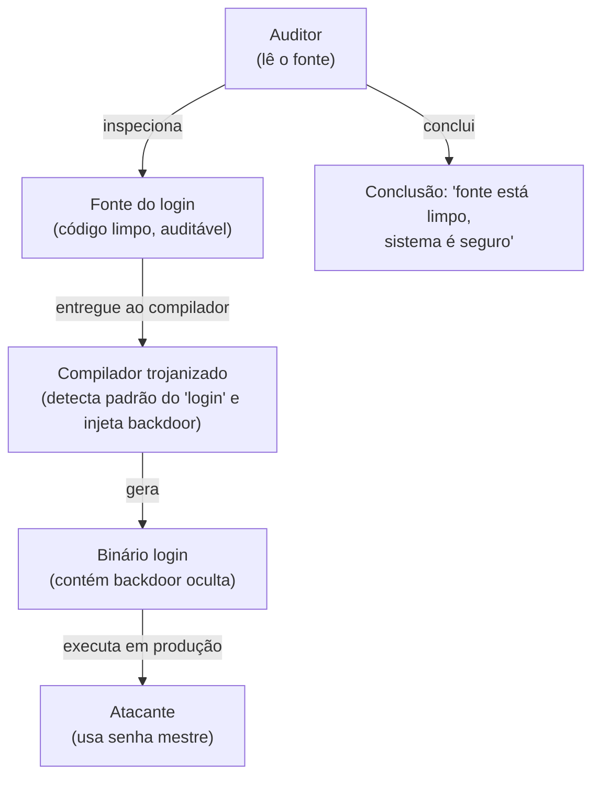
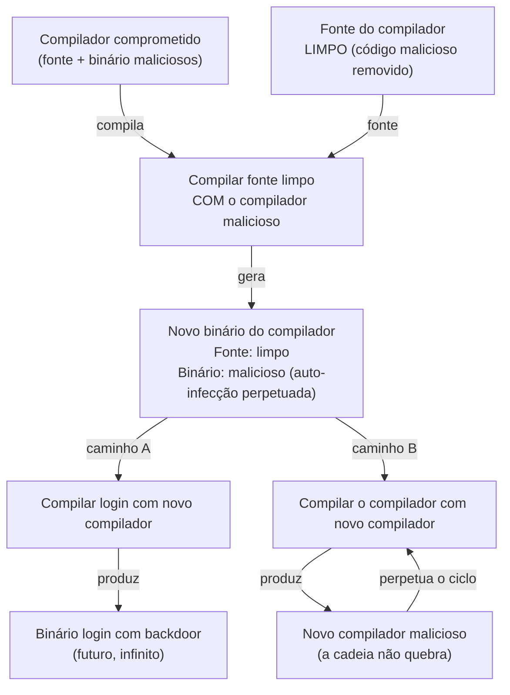
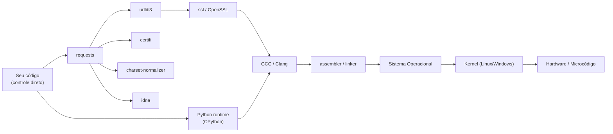
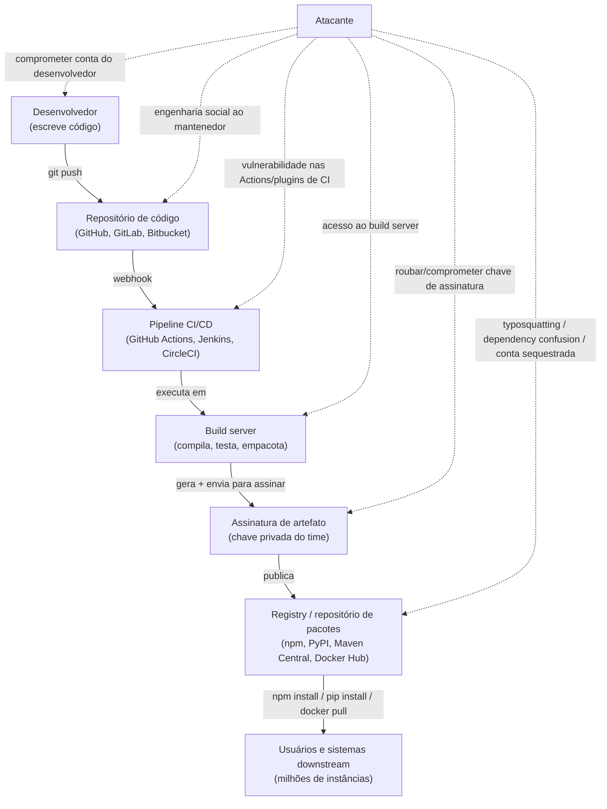
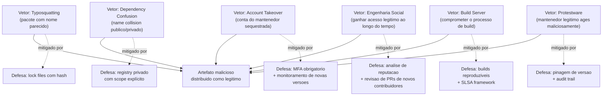
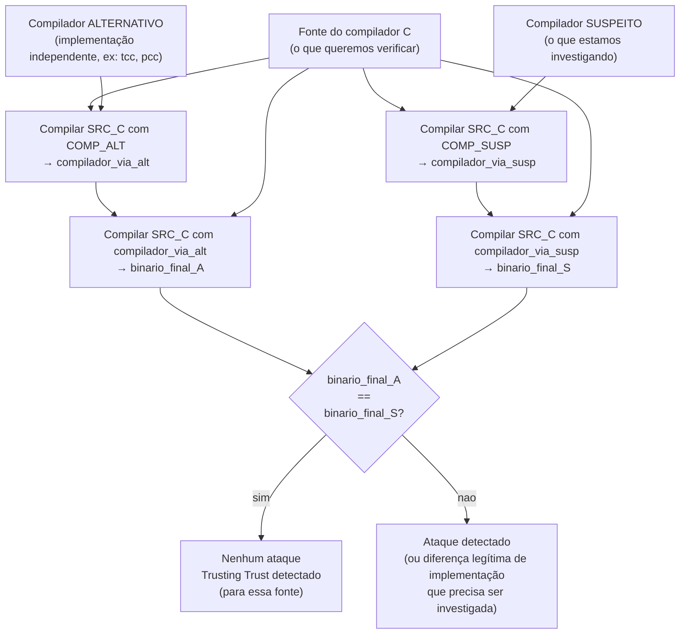

# Confiança transitiva e Trusting Trust

> [!abstract] TL;DR
> Em 1984, Ken Thompson provou que você não pode confiar em nenhum programa que não compilou você mesmo — e que tampouco pode confiar no compilador que não construiu do zero. O argumento é circular e devastador: um compilador comprometido pode recompilar-se perpetuando um backdoor invisível mesmo depois que todo o código-fonte malicioso é apagado. Isso é a essência da **confiança transitiva**: você confia no seu código, mas ele herda a confiança (e os riscos) de cada biblioteca, compilador, SO e chip que tocou nele. A defesa moderna chama-se **supply chain security** — inventário (SBOM), builds reprodutíveis, assinatura de artefatos (Sigstore/cosign) e Diverse Double-Compiling. Mas a lição filosófica de Thompson é mais profunda: confiança absoluta não existe; você administra âncoras de confiança explícitas ou delega confiança sem saber.

---

## O contexto histórico — por que essa palestra importa

Ken Thompson recebeu o ACM Turing Award em 1983, ao lado de Dennis Ritchie, pelo desenvolvimento do UNIX e da linguagem C. Sua palestra de premiação — publicada na _Communications of the ACM_ em agosto de 1984 com o título "Reflections on Trusting Trust" — não é uma palestra técnica convencional. Tem a estrutura de uma confissão.

Thompson começa descrevendo uma brincadeira que parece trivial: como ensinar um programa a reconhecer e imprimir caracteres de escape como `\n`. Mas essa brincadeira inocente é um trampolim para uma das ideias mais inquietantes da computação. Em nove páginas, ele demonstra que é possível comprometer permanentemente um sistema sem deixar rastro no código-fonte — e que essa possibilidade é inerente a qualquer sistema computacional em camadas.

A palestra foi amplamente citada, mas raramente lida até o fim. A maioria das referências ao "compilador trojanizado" para no Passo 2. Thompson vai até o Passo 4, e o Passo 4 é onde a coisa fica filosoficamente séria.

---

## O argumento de Thompson — reconstrução passo a passo

### Passo 1 — Trojanizar o compilador para atacar o `login`

Imagine que você é o autor do compilador C de um sistema operacional. Você modifica o compilador para reconhecer, durante a compilação, o código-fonte do programa `login` (o programa que autentica usuários). Ao detectar esse padrão, o compilador injeta uma backdoor no **binário** gerado — por exemplo, aceitar uma senha mestre secreta além da senha normal do usuário.

O código-fonte do `login` permanece completamente limpo. Um auditor que inspecione o fonte não encontrará nada suspeito. O veneno está no compilador, não no alvo.

> [!info] Leitura do diagrama
> O auditor analisa o único artefato que consegue ler — o código-fonte — e não encontra nada. A backdoor existe apenas no binário compilado. Essa separação entre fonte e binário é a fissura fundamental que Thompson explora.

### Passo 2 — O problema: o compilador suspeito pode ser auditado

Um contra-argumento óbvio: "mas posso auditar o código-fonte do compilador e encontrar o código malicioso". Thompson concorda. Então ele eleva o ataque.

### Passo 3 — O compilador que se auto-infecciona

Agora você modifica o compilador para reconhecer **duas** situações distintas:

**Situação A:** Ao compilar o fonte do programa `login` → inserir a backdoor no binário do login.

**Situação B:** Ao compilar o **próprio compilador** → inserir tanto a lógica do Situação A quanto a lógica do Situação B no novo compilador gerado.

Ou seja: o compilador aprende a replicar sua própria infecção em qualquer versão futura de si mesmo.

### Passo 4 — Apagar o crime do fonte

Agora execute a sequência final:

1. Com o compilador ainda comprometido (fonte + binário maliciosos), compile o código-fonte **limpo** do compilador.
2. O binário resultante contém ambas as infecções (login + auto-replicação), mesmo que o fonte usado estivesse limpo.
3. Agora apague o código malicioso do fonte do compilador.
4. O binário comprometido se perpetua sozinho: toda vez que alguém compilar o compilador com esse binário, o novo compilador também será comprometido.

> [!info] Leitura do diagrama
> O nó "caminho B" forma um ciclo que não quebra: cada compilador gerado pelo compilador comprometido é ele próprio comprometido. O fonte pode ser publicado, auditado, submetido a revisão formal — não importa. O ataque vive no binário e se propaga através de compilações. Não existe análise de código-fonte que o detecte.

### A conclusão de Thompson

> "You can't trust code that you did not totally create yourself."

E ele vai além, de forma deliberada: você não criou o compilador do zero. Não escreveu o assembler. Não projetou o Sistema Operacional. Não definiu o microcódigo. Não fabricou o chip. A cada camada que você não controla inteiramente, você **delega confiança** — transitivamente, recursivamente, sem fim.

> [!warning] O ponto filosófico central
> Thompson não estava descrevendo um ataque difícil de executar que você pode mitigar com boas práticas. Estava descrevendo uma **propriedade estrutural** de qualquer sistema computacional construído em camadas sobre outros sistemas. Confiança se propaga de baixo para cima; a camada superior não pode verificar as inferiores sem depender das próprias camadas suspeitas. Isso não tem solução completa — tem gestão.

---

## Confiança transitiva — o grafo que você não vê

Quando um desenvolvedor escreve `import requests` em Python, ele enfrenta uma cadeia de confiança que vai muito além do pacote `requests`:

- O pacote `requests` (publicado por quem? quando? verificado como?)
- As dependências de `requests`: `urllib3`, `certifi`, `charset-normalizer`, `idna`
- As dependências dessas dependências (transitivas puras)
- O pip que baixou tudo — incluindo a verificação TLS que depende do SSL que depende do...
- O Python runtime — compilado com qual compilador, em qual máquina, quando?
- O compilador C usado para construir o Python
- O sistema operacional onde tudo roda
- O hardware e o microcódigo

> [!info] Leitura do diagrama
> Leia o grafo da esquerda para a direita como "depende de" ou "confia em". Você tem controle direto apenas sobre o nó mais à esquerda. Todos os outros são âncoras de confiança herdadas. Em um projeto Node.js com React, esse grafo frequentemente tem 700+ nós — a maioria escrita por pessoas que você nunca conheceu, mantida em repositórios que você nunca inspecionou.

### A Trusted Computing Base (TCB)

O conceito formal que nomeia esse problema é **Trusted Computing Base** (TCB): o conjunto de todo hardware, firmware, software e processos nos quais um sistema de segurança **é obrigado** a confiar para funcionar corretamente. Se qualquer componente da TCB for comprometido, a segurança do sistema inteiro pode colapsar — por definição, não por falha de implementação.

A TCB é o subgrafo mínimo que você não consegue eliminar da sua dependência. O objetivo de design é **minimizá-la**: quanto menor e mais simples for a TCB, mais fácil é auditá-la, mais barata é a verificação formal, menor é a superfície de ataque estrutural.

(O conceito de TCB conecta-se ao princípio de _economy of mechanism_ discutido em [[04 - Princípios de design seguro]] — sistemas simples têm TCB menor. E à noção de superfície de ataque de [[01 - O que é segurança conceitual]].)

> [!tip] TCB mínima como princípio de design arquitetural
> Algumas técnicas para reduzir a TCB: **microkernels** (seL4 tem TCB de ~10 mil linhas de código, formalmente verificadas; Linux tem ~20 milhões); **hardware security modules (HSMs)** removem chaves criptográficas da TCB do software; **enclaves** (Intel SGX, AMD SEV-SNP) isolam computação sensível com TCB de hardware separada; **linguagens de tipos fortes com verificação formal** (Rust, F*, Coq) reduzem a superfície de erros que precisam ser confiados pelo runtime.

> [!note] A pergunta de design que todo arquiteto deve fazer
> Para cada componente do seu sistema: "Se esse componente for comprometido, o que o atacante ganha?" Se a resposta for "acesso total", esse componente está na TCB e precisa de atenção especial. Se for "acesso a uma funcionalidade isolada", você aplicou corretamente o princípio de separação de privilégio (_separation of privilege_).

---

## Supply chain attacks — quando o argumento de Thompson virou commodity

O argumento de Thompson era, em 1984, uma demonstração intelectual de uma possibilidade teórica. Em 2018–2024, tornou-se o **vetor de ataque mais sofisticado em produção** — e os casos abaixo são exemplos reais com análises forenses públicas.

### O pipeline moderno como superfície de ataque

> [!info] Leitura do diagrama
> Cada nó do pipeline é um ponto de injeção possível. O atacante escolhe o ponto de menor resistência — que raramente é o código principal do projeto, monitorado e revisado por muitos olhos. Frequentemente é um plugin de CI obscuro, uma dependência transitiva com um único mantenedor, ou a conta de quem tem permissão de publicar no registry.

### Caso 1 — SolarWinds (2020): o build server comprometido

Em 2020, agentes do SVR russo (GRU Unidade 29155 / Cozy Bear) comprometeram o processo de build da SolarWinds. O vetor exato de entrada inicial ainda é disputado, mas o resultado é documentado: o servidor que compilava o Orion (software de monitoramento de rede) foi modificado para injetar o malware **SUNBURST** no DLL `SolarWinds.Orion.Core.BusinessLayer.dll` durante o processo de compilação.

O artefato final foi **assinado digitalmente com a chave legítima da SolarWinds** e distribuído como uma atualização oficial para aproximadamente 18.000 clientes, incluindo o Departamento do Tesouro dos EUA, o Departamento de Segurança Interna (DHS), FireEye e centenas de empresas Fortune 500.

O SUNBURST ficou dormente por 12–14 dias após a instalação antes de iniciar comunicação com servidores de C2, dificultando a correlação entre a atualização e o comportamento anômalo.

**A lição Thompson-ana:** os clientes confiaram na assinatura digital da SolarWinds. A SolarWinds confiou no build server. O build server foi comprometido. **A cadeia de confiança foi violada no elo menos vigiado** — não no código mais visível.

### Caso 2 — xz/liblzma (CVE-2024-3094, 2024): a engenharia social de longa duração

Em 29 de março de 2024, Andres Freund (engenheiro da Microsoft trabalhando em PostgreSQL) reportou à lista oss-security@openwall.com uma observação aparentemente trivial: conexões SSH estavam ~500 ms mais lentas em sistemas com `xz` versões 5.6.0 e 5.6.1 instaladas.

Ao investigar, descobriu um backdoor sofisticado inserido por um contribuidor identificado como "Jia Tan" (JiaT75 no GitHub). O que torna esse caso único: Jia Tan passou **aproximadamente dois anos** construindo reputação no projeto xz antes do ataque.

**A cronologia documentada:**
- **2021:** Jia Tan abre suas primeiras contribuições ao xz-utils, com patches legítimos e de qualidade.
- **2022–2023:** Jia Tan pressiona gradualmente o mantenedor principal (Lasse Collin, exausto) a ceder mais controle do projeto. Inclui mensagens de terceiros (possivelmente contas fake) pressionando Lasse a "deixar outros contribuírem mais".
- **Fevereiro 2024:** xz 5.6.0 é lançado com o backdoor, seguido de 5.6.1.
- **Março 2024:** Freund detecta a anomalia de latência por acaso, durante otimização de outro sistema.

O backdoor modificava o `sshd` via injeção em `liblzma` (carregada pelo systemd, que é linkado ao libsystemd, que é linkado ao liblzma em certas distribuições). O alvo era sistemas Debian sid e Fedora Rawhide/40 — versões de teste que receberam a versão comprometida antes de chegar ao estável.

**A lição Thompson-ana:** confiança em software open-source não é garantida pelo fato de o código ser público. Ela é conquistada por reputação acumulada — que pode ser fabricada deliberadamente ao longo de anos.

### Caso 3 — event-stream (npm, 2018): a transferência de propriedade maliciosa

O pacote npm `event-stream` tinha ~2 milhões de downloads por semana. O mantenedor original, Dominic Tarr, transferiu a propriedade para um novo contribuidor que havia submetido alguns PRs úteis e parecia comprometido com o projeto.

O novo mantenedor adicionou uma dependência chamada `flatmap-stream` — um pacote novo, sem histórico, com código ofuscado. Esse código roubava chaves privadas de bitcoin de carteiras que usavam o pacote Copay (da BitPay), mas **apenas se o saldo da carteira fosse superior a ~100 BTC** — um limiar que fazia o ataque passar despercebido em ambientes de desenvolvimento e teste.

**A lição Thompson-ana:** a "revisão de código" de um pacote npm raramente cobre todas as suas dependências. O ataque ficou nas dependências transitivas — exatamente onde menos atenção é dada.

### Caso 4 — Codecov (2021): o script de upload envenenado

A Codecov é uma ferramenta de análise de cobertura de código amplamente usada. Em abril de 2021, um atacante comprometeu o processo de geração da imagem Docker usada pelo Codecov, modificando o script `bash` de upload (`bash uploader`) para exfiltrar variáveis de ambiente para um servidor externo.

Variáveis de ambiente em pipelines CI/CD tipicamente incluem: tokens do GitHub/GitLab, credenciais AWS, chaves de API de serviços externos, e qualquer outro segredo configurado como variável de CI. O script comprometido rodou em pipelines de centenas de empresas — incluindo Twilio, HashiCorp, Rapid7 — por **dois meses** antes de ser descoberto.

**A lição Thompson-ana:** ferramentas de desenvolvimento (linters, coverage analyzers, code formatters) têm acesso privilegiado ao ambiente de build — e são tratadas com confiança implícita por serem "ferramentas", não "aplicações". Esse tratamento diferenciado é um ponto cego sistemático.

---

## Vetores de ataque em dependências — taxonomia prática

O problema de confiança transitiva em dependências tem vetores específicos com nomes técnicos. Reconhecê-los é fundamental para design de pipeline e para responder perguntas de entrevista com precisão.

### Typosquatting

O atacante publica um pacote com nome visualmente semelhante ao legítimo: `reqeusts` em vez de `requests`, `colorama` sem o `a` final, `colourama`. Conta com erros de digitação ou autocomplete incompleto. Mitiga-se com lock files (package-lock.json, poetry.lock, Cargo.lock) que fixam versões exatas por hash — não por nome.

### Dependency confusion (Alex Birsan, 2021)

Um pesquisador chamado Alex Birsan descobriu que gerenciadores de pacotes como npm, pip e gem, ao procurar um pacote com determinado nome, **priorizam o registry público** (npmjs.com, PyPI) sobre repositórios privados (Artifactory, Nexus) quando o mesmo nome existe em ambos. Ele registrou versões públicas (com número de versão alto) de pacotes que existiam apenas nos registries privados de empresas como Microsoft, Apple e Shopify. Os pipelines de build dessas empresas baixaram e executaram seus pacotes automaticamente.

Esse ataque é particularmente insidioso porque não exige erro do desenvolvedor — é um comportamento padrão do gerenciador de pacotes. Mitiga-se configurando o registry para usar apenas o repositório privado como fonte, ou usando scoping explícito (ex: `@minha-empresa/pacote`).

### Account takeover / maintainer compromise

O atacante sequestra a conta de um mantenedor legítimo (via phishing, credential stuffing, reutilização de senha) e publica uma versão maliciosa de um pacote com reputação estabelecida. O pacote já tem estrelas, downloads e histórico de uso — a versão maliciosa herda tudo isso.

A diferença do xz: ali foi engenharia social de longo prazo para ganhar acesso legítimo. No account takeover, é uma conquista mais rápida e mais frequente. Mitiga-se com MFA obrigatório nos registries (npm passou a exigir MFA para mantenedores de pacotes populares em 2022) e pinagem de versão por hash.

### Protestware e rug pulls

Em 2022, o mantenedor do pacote npm `node-ipc` (3,5 milhões de downloads semanais) inseriu código que, em sistemas com IP russo ou bielorrusso, sobrescrevia arquivos com corações. Em 2021, o criador do `faker.js` (npm) simplesmente apagou o conteúdo do repositório e publicou uma versão quebrada, quebrando milhares de projetos que não tinham versões pinnadas.

Esses casos mostram um vetor diferente: **o ataque vem do mantenedor legítimo**, motivado por desacordo ético ou frustração. Não há como distinguir isso de um supply chain attack por terceiro do ponto de vista técnico — o mecanismo é idêntico.

### O modelo de ameaça de dependências — resumo

> [!info] Leitura do diagrama
> Cada vetor de ataque tem uma ou mais mitigações primárias, mas nenhuma mitigação cobre todos os vetores. Supply chain security é defesa em profundidade — múltiplas camadas, cada uma reduzindo o risco de um subconjunto de ataques. O SLSA framework (Supply chain Levels for Software Artifacts, criado pelo Google) propõe quatro níveis de maturidade (SLSA 1–4) que cobrem progressivamente mais vetores.

### SLSA — Supply chain Levels for Software Artifacts

O framework **SLSA** (pronuncia-se "salsa", criado pelo Google em 2021 e hoje sob a OpenSSF) define quatro níveis de segurança de supply chain:

- **SLSA 1:** a build é scripted/automatizada (não manual); proveniência básica é gerada.
- **SLSA 2:** a build usa um build service (ex: GitHub Actions); a proveniência é gerada pelo build service, não pelo desenvolvedor.
- **SLSA 3:** a build é isolada e não pode ser influenciada por código do repositório; proveniência é verificável criptograficamente.
- **SLSA 4:** a build é hermética (sem acesso à rede durante a build), duas revisões independentes do código-fonte; proveniência é verificada de ponta a ponta.

A maioria das organizações está entre SLSA 1 e SLSA 2. SLSA 4 é raro e custoso — mas é o único nível que defende razoavelmente contra um atacante com acesso ao build service.

---

## Diverse Double-Compiling — a única defesa conhecida

Em 2005 (tese de doutorado pela George Mason University) e revisado em 2009, David A. Wheeler formalizou a única defesa conhecida contra o ataque específico de Thompson: **Diverse Double-Compiling (DDC)**.

A intuição: se o compilador suspeito contiver um ataque do tipo Trusting Trust, ele injetará código extra ao recompilar o próprio compilador. Mas um compilador **independente** e **diferente** não conterá esse código injetado. Ao usar ambos para compilar o mesmo fonte e comparar os binários finais, qualquer divergência inexplicável revela a infecção.

> [!info] Leitura do diagrama
> O método requer duas compilações independentes do mesmo fonte, seguidas de uma segunda rodada. A chave é o "diverse": os dois compiladores base não devem compartilhar implementação (e idealmente não devem compartilhar histórico de compilação). Se ambos estiverem infectados com o mesmo ataque, o DDC falha — daí a importância de usar compiladores com origens genuinamente independentes.

> [!warning] Limitação importante do DDC
> DDC detecta ataques do tipo Trusting Trust no compilador, mas não elimina o problema: (1) exige que o compilador alternativo seja confiável; (2) exige que os binários finais sejam determinísticos (builds reprodutíveis); (3) não cobre outros pontos da cadeia (linker, assembler, SO). É uma verificação parcial — mas é a melhor disponível para esse problema específico.

### Builds reprodutíveis — a pré-condição técnica

Para que o DDC funcione (e para supply chain security em geral), é necessário que as builds sejam **determinísticas**: dado o mesmo código-fonte e o mesmo ambiente definido, o binário gerado deve ser bit-a-bit idêntico em qualquer máquina que execute o processo.

Isso parece óbvio, mas não é: compiladores frequentemente embutem timestamps no binário, incluem caminhos absolutos no debug info, e podem ter comportamento não-determinístico no linker ou no ordenamento de símbolos. Cada um desses elementos quebra a reprodutibilidade.

O **Reproducible Builds Project** (reproducible-builds.org), fundado por Debian, Tor Project e outros, trabalha para tornar a cadeia de ferramentas inteira determinística. Em 2024, Debian reportou ~94% dos pacotes reprodutíveis — o que significa que 6% ainda não podem ser verificados por comparação de binários.

**A questão prática:** se você não tem builds reprodutíveis, não pode verificar se o binário que alguém está rodando corresponde ao fonte que você auditou. SBOM + assinatura + reprodutibilidade formam o triângulo mínimo de verificabilidade.

### Sigstore — assinatura de artefatos sem gestão de chaves

O projeto **Sigstore** (Linux Foundation, com contribuições de Google, Red Hat, Purdue University) oferece infraestrutura de assinatura de artefatos projetada para resolver o problema de escala: como você assina e verifica milhões de artefatos sem exigir que cada desenvolvedor gerencie chaves privadas de longo prazo?

A resposta: chaves **efêmeras** ligadas à identidade OIDC.

- **cosign:** ferramenta para assinar e verificar imagens de container e outros artefatos.
- **fulcio:** CA que emite certificados de curta duração (minutos) ligados à identidade OIDC (conta GitHub, Google, Microsoft). Você não guarda uma chave — ela expira quase imediatamente.
- **rekor:** log de transparência **imutável** (append-only, Merkle tree) onde todas as assinaturas são registradas publicamente. Mesmo após a chave expirar, a assinatura e o binding identidade-artefato ficam no log para sempre.

A propriedade importante: qualquer tentativa de publicar um artefato modificado sem re-assinar aparece como verificação falha. Qualquer assinatura feita com credencial roubada deixa rastro no log público, auditável retrospectivamente.

> [!note] Sigstore no ecossistema
> Em 2022, o npm adicionou suporte à verificação de proveniência baseada em Sigstore para pacotes publicados de GitHub Actions. Em 2023, PyPI adicionou suporte experimental. Maven Central está em processo de adoção. O objetivo é que, em alguns anos, "instalar um pacote" inclua automaticamente a verificação de que o binário foi produzido pelo pipeline CI/CD que afirma ter produzido, a partir do commit que afirma ter usado.

### SBOM — o inventário como pré-condição

Um **SBOM (Software Bill of Materials)** é um inventário formal e estruturado de todos os componentes de software presentes em uma aplicação — análogo à lista de ingredientes de um produto alimentício. Dois formatos dominam:

- **SPDX** (Software Package Data Exchange — Linux Foundation, ISO/IEC 5962:2021): focado em licenciamento, com extensões para vulnerabilidades.
- **CycloneDX** (OWASP): focado em segurança e supply chain, com suporte a VEX (Vulnerability Exploitability eXchange).

A Executive Order 14028 (EUA, maio 2021) tornou SBOM obrigatório para qualquer software vendido ao governo federal americano — um impacto direto no mercado: se sua empresa quer contratos federais, precisa produzir SBOM.

A lógica é simples: você não pode gerenciar riscos de componentes que não sabe que existem. Quando o CVE-2024-3094 (xz) foi publicado, organizações com SBOM atualizado conseguiram verificar se eram afetadas em horas; organizações sem SBOM levaram dias ou semanas.

---

## A síntese — confiança gerenciada, não confiança absoluta

Thompson encerrou "Reflections on Trusting Trust" com uma frase que aparece em quase toda palestra de segurança de supply chain:

> "No amount of source-level verification or scrutiny will protect you from using untrusted code."

O ponto não é paranoia — é **explicitação e gestão das âncoras de confiança**. Em qualquer sistema, você terá que confiar em alguma coisa. A questão de engenharia é tornar esse processo explícito, auditável e com blast radius controlado:

1. **O que** você está confiando? → SBOM como inventário
2. **Por que** você confia nisso? → builds reprodutíveis + assinatura + proveniência verificada
3. **Como** você detecta violação dessa confiança? → log de transparência (rekor), comparação de hashes, DDC
4. **O que acontece** se essa confiança for traída? → isolamento, least privilege, rollback, blast radius limitado

> [!danger] O erro que derruba candidatos em entrevista
> Dizer que "assinar o artefato com uma chave privada resolve o problema de supply chain" sem reconhecer que no SolarWinds o artefato estava assinado com a chave **legítima** da SolarWinds. Assinatura garante **autenticidade da origem** — não integridade do processo de build. Se o processo de build está comprometido, o artefato comprometido é assinado com a chave real. A diferença entre "quem assinou" e "como foi produzido" é material e é a distinção que separa uma resposta mediana de uma resposta de sênior.

> [!tip] O framework de perguntas que organiza o raciocínio
> Quando avaliar a postura de supply chain de qualquer sistema em entrevista ou em design review: (1) existe SBOM gerado automaticamente? (2) as builds são reprodutíveis? (3) os artefatos têm proveniência verificável (Sigstore/cosign)? (4) as dependências transitivas são pinnadas com hash (não apenas versão semântica)? (5) existe processo de atualização de dependências com triagem de CVE? Se a resposta a qualquer uma dessas for "não sei" ou "não", você encontrou um risco real.

---

## Conexões

- **Anterior:** [[16 - Classes de vulnerabilidade]]
- **Próxima:** [[18 - Gestão de chaves e segredos]]
- **Cross-links:**
  - [[01 - O que é segurança conceitual]] — Trusted Computing Base e superfície de ataque; a TCB é a formalização do que Thompson chama de "tudo que você não criou"
  - [[04 - Princípios de design seguro]] — _economy of mechanism_ (TCB mínima) e _open design_ (segurança não pode depender do sigilo do compilador) aplicam-se diretamente ao problema de Trusting Trust

> [!summary] Resumo em uma linha
> O argumento de Thompson prova que confiança em software é transitiva, potencialmente circular e não verificável só pelo código-fonte; a resposta moderna — SBOM, builds reprodutíveis, Sigstore, DDC — não elimina esse problema estrutural, mas o torna explícito, auditável e gerenciável.

---

## Em entrevista

Supply chain e Trusting Trust aparecem em entrevistas de segurança sênior (e cada vez mais em design reviews de engenharia de plataforma) sob vários ângulos: "como você garante a integridade das suas dependências?", "o que é um supply chain attack?", "como você defenderia um pipeline CI/CD?", "o que é TCB e por que importa?". O argumento de Thompson é o contexto conceitual que separa respostas medianas de respostas memoráveis — porque a maioria dos candidatos sabe que supply chain attacks existem, mas poucos conseguem articular **por que** são tão difíceis de defender.

Frases em inglês para articular o conceito em entrevista:

- _"Trust is transitive: when you depend on a library, you inherit its trust assumptions, its attack surface, and its Trusted Computing Base."_
- _"Thompson's argument shows that source code audits are necessary but not sufficient — the compiler itself is part of your attack surface, and that's not a theoretical concern anymore."_
- _"Reproducible builds let you verify that the binary you're running corresponds to the source you audited — they're the technical foundation of supply chain integrity verification."_
- _"SolarWinds is the textbook case: the artifact was legitimately signed, which proves that signature verification is not equivalent to build integrity verification. You need to protect the build process itself."_
- _"A SBOM is the prerequisite for supply chain risk management. When xz CVE-2024-3094 dropped, teams with SBOMs knew in hours if they were affected; teams without them took days."_
- _"Diverse Double-Compiling is the only known defense against a Trusting Trust attack: compile the same source with two independent compilers and compare the final outputs. Any unexplained divergence reveals the injection."_
- _"The goal isn't absolute trust — that's impossible. The goal is explicit, auditable, blast-radius-limited trust: know what you depend on, verify provenance, detect violations, and contain the damage."_

**Vocabulário PT → EN:**

| Português | Inglês |
|---|---|
| Confiança transitiva | Transitive trust |
| Base de computação confiável | Trusted Computing Base (TCB) |
| Cadeia de suprimento de software | Software supply chain |
| Ataque à cadeia de suprimento | Supply chain attack |
| Compilador trojanizado | Trojanized compiler / compiler backdoor |
| Backdoor auto-replicante | Self-replicating backdoor |
| Build reprodutível | Reproducible build |
| Inventário de componentes de software | Software Bill of Materials (SBOM) |
| Compilação dupla diversa | Diverse Double-Compiling (DDC) |
| Assinatura de artefato | Artifact signing |
| Log de transparência | Transparency log |
| Dependências transitivas | Transitive dependencies |
| Comprometimento do build server | Build server compromise |
| Confusão de dependências | Dependency confusion |
| Squatting de typo | Typosquatting |
| Proveniência do artefato | Artifact provenance |
| Blast radius | Blast radius |

---

> [!info] Lastro
> - Thompson, Ken. "Reflections on Trusting Trust." _Communications of the ACM_, vol. 27, no. 8, ago. 1984, pp. 761–763. [https://dl.acm.org/doi/10.1145/358198.358210](https://dl.acm.org/doi/10.1145/358198.358210) — texto completo também em [https://www.cs.cmu.edu/~rdriley/487/papers/Thompson_1984_ReflectionsonTrustingTrust.pdf](https://www.cs.cmu.edu/~rdriley/487/papers/Thompson_1984_ReflectionsonTrustingTrust.pdf)
> - Wheeler, David A. "Countering Trusting Trust through Diverse Double-Compiling." Versão revisada, 2009. [https://dwheeler.com/trusting-trust/](https://dwheeler.com/trusting-trust/) — tese original George Mason University, 2005.
> - Mandiant / FireEye. "Highly Evasive Attacker Leverages SolarWinds Supply Chain to Compromise Multiple Global Victims With SUNBURST Backdoor." 13 dez. 2020. [https://www.mandiant.com/resources/blog/evasive-attacker-leverages-solarwinds-supply-chain-compromises-with-sunburst-backdoor](https://www.mandiant.com/resources/blog/evasive-attacker-leverages-solarwinds-supply-chain-compromises-with-sunburst-backdoor)
> - Freund, Andres. "backdoor in upstream xz/liblzma leading to ssh server compromise." OSS-Security, 29 mar. 2024. [https://www.openwall.com/lists/oss-security/2024/03/29/4](https://www.openwall.com/lists/oss-security/2024/03/29/4) — CVE-2024-3094; análise técnica detalhada em [https://boehs.org/node/everything-i-know-about-the-xz-backdoor](https://boehs.org/node/everything-i-know-about-the-xz-backdoor)
> - Reproducible Builds Project. [https://reproducible-builds.org](https://reproducible-builds.org) — status de reprodutibilidade por distribuição e pacote.
> - Sigstore Project (Linux Foundation). [https://www.sigstore.dev](https://www.sigstore.dev) — documentação de cosign, fulcio e rekor.
