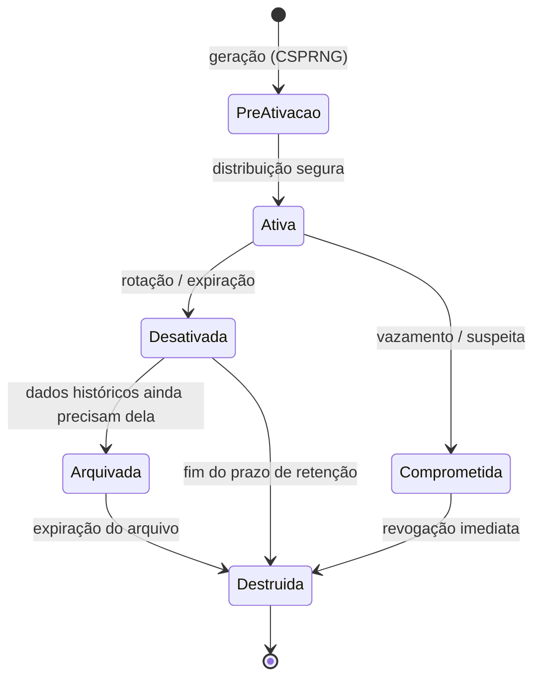
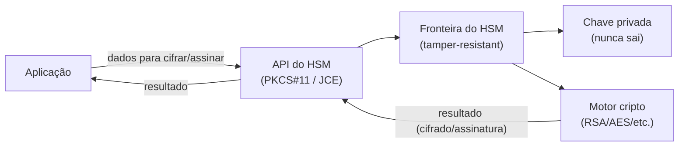
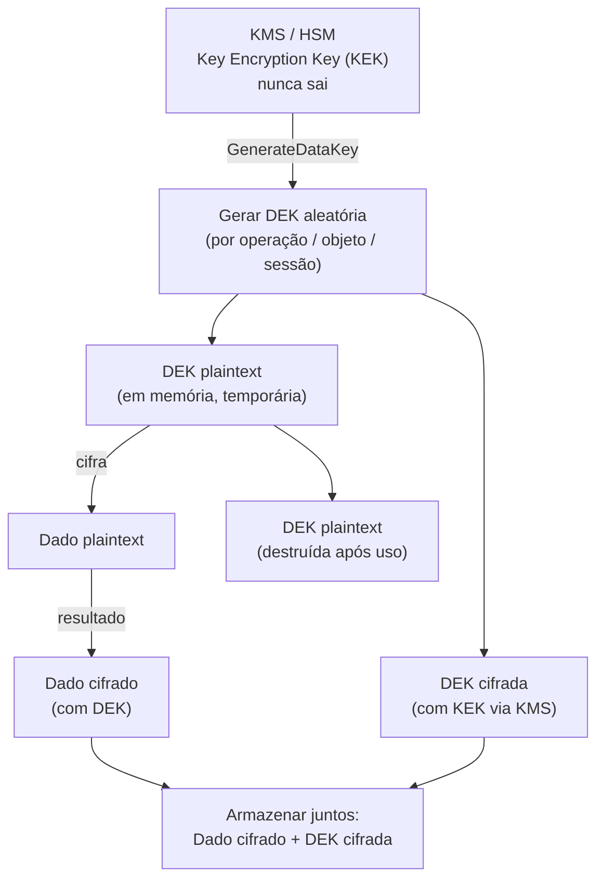
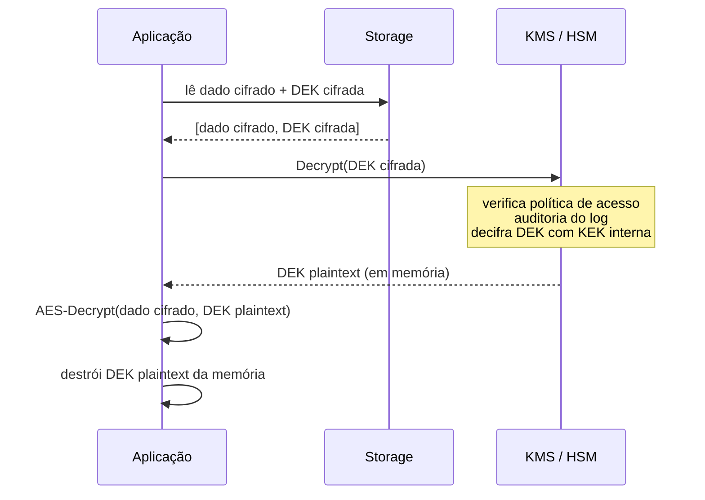
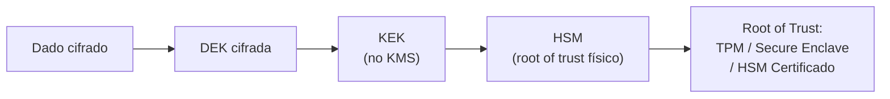
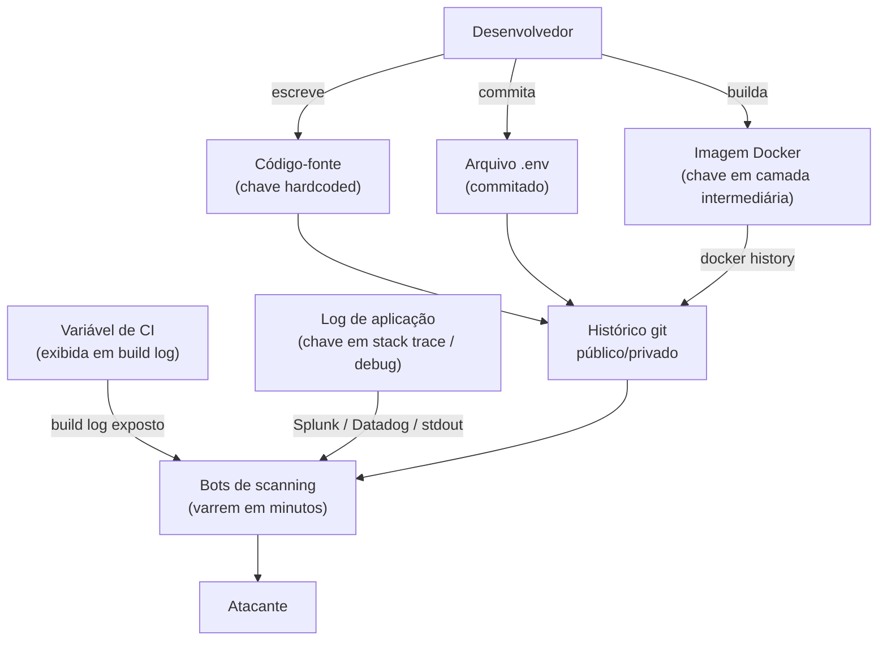

# Gestão de chaves e segredos

> [!abstract] TL;DR
> O problema mais difícil da criptografia não são os algoritmos — são as **chaves**. Cifrar é trivial; a pergunta impossível é "onde a chave mora e quem pode tocá-la?". Toda a segurança do sistema colapsa para a segurança da chave. O padrão industrial moderno resolve isso com uma hierarquia: uma **DEK** (Data Encryption Key) cifra o dado, uma **KEK** (Key Encryption Key) guarda no KMS/HSM protege a DEK, e um **root of trust em hardware** (HSM, TPM, Secure Enclave) ancora a KEK. São tartarugas até o fundo — a recursão para num ponto físico pequeno e auditável. Paralelamente, segredos em código-fonte e CI são a principal fonte de brechas em prod: uma chave AWS hardcoded num repo privado custou ao Uber 57 milhões de registros vazados e US$148 M em multas.

---

## O problema central — a chave que protege a chave

Imagine um cofre protegendo o maior segredo do mundo. Você guarda a chave do cofre embaixo do tapete ao lado. A criptografia está tecnicamente correta; a segurança é zero.

Esse é o anti-padrão mais comum em engenharia: guardar a chave de criptografia junto dos dados cifrados, ou em qualquer local com o mesmo nível de acesso que o dado. O atacante que encontra os dados encontra a chave. O cofre e a chave num mesmo lugar equivale a não ter cofre.

A consequência matemática é direta: se a chave tem entropia K bits, sua segurança é min(entropia do algoritmo, K). Um AES-256 com uma chave de 8 caracteres trivialmente armazenada em texto plano tem segurança efetiva de ~38 bits — não 256.

A pergunta certa não é "qual algoritmo usar?" mas sim:

1. Onde a chave é **gerada** (e com qual fonte de entropia)?
2. Onde a chave é **armazenada** (e quem pode ler esse local)?
3. Quem pode **usar** a chave (e como isso é auditado)?
4. O que acontece quando a chave é **comprometida**?

Responder a essas quatro perguntas bem é o que separa segurança real de segurança teatral.

---

## Ciclo de vida da chave — cada estágio é uma superfície de ataque

O NIST SP 800-57 (Recommendation for Key Management, Part 1, Rev 5) define o ciclo de vida completo de uma chave criptográfica. Não é uma lista acadêmica — cada estágio é onde brechas reais acontecem.

> [!tip] Por que o ciclo de vida inteiro importa
> A maioria dos sistemas implementa bem geração e uso, mas erra na distribuição segura, ignora o arquivamento (chaves "desativadas" que ficam acessíveis indefinidamente), e nunca destrói nada de verdade. O comprometimento das chaves mais devastadores na prática ocorreu nos estágios de distribuição (chaves mandadas via e-mail em plaintext) ou destruição (chaves "deletadas" que continuam em backups por anos).

> [!info] Leitura do diagrama
> Os estados seguem o NIST SP 800-57, que distingue chaves **desativadas** (não usam mais para cifrar, mas ainda decifram dados históricos) de chaves **comprometidas** (caminho de emergência direto para destruição). Arquivamento é o estado de chaves "obsoletas mas necessárias" — um risco frequentemente negligenciado.

### Estágio 1 — Geração

A chave deve vir de um **CSPRNG** (Cryptographically Secure Pseudo-Random Number Generator). Veja [[05 - Aleatoriedade e segredos]] para o mecanismo interno. O risco aqui é usar `rand()` ao invés de `/dev/urandom` ou `SecureRandom`, gerar com entropia insuficiente (ex.: seed baseado em timestamp), ou gerar no cliente em vez de no servidor.

### Estágio 2 — Distribuição

Chaves precisam chegar a quem vai usá-las sem serem interceptadas. O TLS resolve isso para transporte, mas a distribuição inicial ("como o servidor A entrega a chave ao servidor B pela primeira vez?") exige pré-compartilhamento ou troca de chaves assimétrica (Diffie-Hellman, veja [[09 - Troca de chaves]]).

### Estágio 3 — Armazenamento

O problema do "cofre e chave no mesmo lugar". Soluções: HSM, KMS gerenciado, Vault. Nunca plaintext no disco, nunca em variável de ambiente sem proteção, nunca em código.

### Estágio 4 — Uso

A chave em uso existe em memória. O risco é **memory scraping** (ataques que leem a RAM de processos), **core dumps** que persistem a chave em disco, e sessões de debug que expõem memória. HSMs resolvem isso: a operação criptográfica acontece dentro do hardware; a chave nunca sai como plaintext.

### Estágio 5 — Rotação

Substituir a chave ativa por uma nova **sem interromper o serviço**. Exige **versionamento de chave** — dados cifrados com a versão N continuam decifráveis enquanto a versão N+1 já está em uso para novas operações. O custo de não rotacionar: uma chave comprometida há anos expõe anos de dados.

### Estágio 6 — Revogação e destruição

Quando uma chave é comprometida ou expira, ela precisa ser destruída **de verdade** — não apenas deletada do filesystem (dados ainda existem no storage até serem sobrescritos). HSMs destroem chaves com primitivas de apagamento seguro. Para chaves de longa duração, crypto shredding (destruir a chave em vez de re-cifrar terabytes de dados) é a única opção viável.

---

## KMS e HSM — o par fundamental

### HSM (Hardware Security Module)

Um HSM é um dispositivo físico dedicado, à prova de violação (**tamper-resistant**), cujo princípio fundamental é: **a chave nunca sai da fronteira do hardware em plaintext**.

Toda operação criptográfica — geração, assinatura, cifração — acontece **dentro** do HSM. Quem interage com o HSM envia dados e recebe resultados, não as chaves. Se alguém tenta abrir fisicamente o dispositivo, ele destrói as chaves armazenadas (tamper-evident/tamper-responsive).

A certificação **FIPS 140-3** define quatro níveis de segurança para módulos criptográficos:

| Nível | Requisitos-chave |
|-------|-----------------|
| Level 1 | Algoritmos aprovados, sem requisito físico |
| Level 2 | Evidência de violação (lacres, revestimento) |
| Level 3 | Resistência ativa à violação; autenticação por identidade |
| Level 4 | Proteção ambiental completa; destruição de chaves em ataque |

Produtos comerciais (AWS CloudHSM, Thales Luna, Utimaco) operam no nível 3. Smartcards e tokens USB operam no nível 2.

> [!info] Leitura do diagrama
> A fronteira tracejada do HSM é a fronteira de segurança: a chave privada e o motor criptográfico estão dentro. A aplicação nunca vê a chave — apenas envia dados e recebe resultados. Isso é radicalmente diferente de um software que carrega a chave em memória para operar.

### KMS (Key Management Service)

Um KMS (AWS KMS, GCP Cloud KMS, Azure Key Vault, HashiCorp Vault) é uma camada de serviço que centraliza:

- **Geração** de chaves com CSPRNGs validados
- **Política de acesso** (quem pode usar qual chave, em qual contexto)
- **Auditoria** (cada uso da chave gera um log imutável)
- **Rotação automática** (AWS KMS pode rotacionar chaves anualmente por padrão)
- **Integração com IAM** (a chave é um recurso com permissões como qualquer outro)

KMS gerenciados em cloud são frequentemente respaldados por HSMs internamente, mas expõem a interface via API REST/gRPC em vez de PKCS#11.

### Diferença operacional entre HSM e KMS

A confusão mais comum em entrevistas: KMS e HSM são frequentemente vistos como equivalentes, mas operam em níveis distintos.

| Dimensão | HSM | KMS gerenciado |
|----------|-----|----------------|
| Interface | PKCS#11, JCE, CNG | API REST / gRPC |
| Onde roda | Hardware dedicado (on-prem ou cloud) | Serviço de software (respaldado por HSMs) |
| Portabilidade | Alta (padrões abertos) | Baixa (vendor lock-in de API) |
| Gestão | Sua responsabilidade | Responsabilidade do provedor |
| Custo | Alto (hardware dedicado) | Pago por uso |
| Uso típico | CA raiz, assinatura de código, pagamentos PCI | Cifrar segredos de app, rotação automática |

Na prática, empresas com requisitos de compliance severos (PCI-DSS Level 1, HSM mandatório por contrato) usam HSM físico. A grande maioria dos sistemas em cloud usa KMS gerenciado — que internamente delega para HSMs do provedor mas abstrai toda a complexidade operacional.

> [!tip] HashiCorp Vault como KMS open-source
> O Vault não é apenas um gerenciador de segredos estáticos. Com o **Transit Secrets Engine**, ele funciona como um KMS completo: operações de cifração/decifração acontecem dentro do Vault (similar ao conceito de HSM em software), a chave nunca sai, e você tem auditoria completa de cada operação. É a opção natural para ambientes multi-cloud ou on-prem que precisam evitar lock-in de vendor.

---

## Envelope encryption — hierarquia KEK/DEK

O padrão industrial para escalar criptografia sem expor a chave mestra é o **envelope encryption** (cifração em envelope).

> [!info] Leitura do diagrama
> Fluxo de **cifração**: (1) KMS gera um par DEK plaintext + DEK cifrada. (2) DEK plaintext cifra o dado. (3) DEK plaintext é **destruída** da memória. (4) Dado cifrado e DEK cifrada são armazenados juntos. Para **decifrar**: a DEK cifrada vai ao KMS, que retorna a DEK plaintext (usando a KEK interna), e então o dado é decifrado. A KEK nunca sai do KMS.

### Por que essa hierarquia resolve o problema de escala?

- **Desempenho**: cifrar terabytes com AES-256 local (DEK) é rápido. Chamar o KMS para cada byte seria impraticável.
- **Rotação barata**: rotacionar a KEK não exige re-cifrar todos os dados — apenas re-cifrar as DEKs (que são pequenas). Rotacionar por objeto/registro exige apenas re-cifrar a DEK daquele objeto.
- **Compartimentalização**: cada arquivo/registro/sessão pode ter sua própria DEK. Comprometer uma DEK expõe apenas aquele objeto, não o dataset inteiro.
- **Granularidade de controle**: a política de quem pode chamar o KMS para decifrar uma DEK é independente de quem tem acesso ao storage com os dados cifrados.

> [!warning] Anti-padrão frequente
> Usar **uma única DEK estática** para cifrar todos os dados. Se essa DEK vazar, tudo vaza. A hierarquia KEK/DEK por objeto existe exatamente para limitar o blast radius.

### O fluxo de decifração — o caminho inverso

O diagrama anterior mostrou a cifração. A decifração tem um detalhe crítico: a DEK cifrada vai ao KMS, e só o KMS consegue decifrar — usando a KEK interna que nunca saiu.

> [!info] Leitura do diagrama
> Pontos críticos: (1) o KMS é consultado a cada decifração — isso centraliza a auditoria e o controle de acesso em tempo real; se a política mudar ou a chave for revogada, operações futuras são bloqueadas imediatamente. (2) A DEK plaintext existe em memória apenas pelo tempo necessário para a operação — depois é destruída. (3) O "dado cifrado" e a "DEK cifrada" podem ser armazenados juntos (metadata do objeto) sem risco, desde que a KEK no KMS esteja protegida.

---

## "Turtles all the way down" — o root of trust

A hierarquia KEK/DEK levanta a pergunta óbvia: quem protege a KEK? Outra chave? E quem protege essa?

Isso é o **"turtles all the way down"** (tartarugas até o fundo) — a recursão de confiança que aparece em toda stack de segurança. Não existe saída elegante. A recursão para num **root of trust em hardware**:

> [!info] Leitura do diagrama
> A cadeia de proteção desce do dado até um ponto físico — o root of trust em hardware. Você não **elimina** a necessidade de confiar em algo; você a **concentra** num componente pequeno, auditável, com certificação formal (FIPS 140-3 Level 3/4). Quanto menor o Trusted Computing Base (TCB), menor a superfície de ataque. Veja [[01 - O que é segurança conceitual]] para o conceito de TCB.

| Tecnologia | Onde vive | Exemplo de uso |
|-----------|-----------|----------------|
| TPM (Trusted Platform Module) | Chip na placa-mãe | Bitlocker, attestation de boot |
| Secure Enclave | Processador (Apple T2/M-series, Intel SGX) | Face ID, chaves de app |
| HSM externo | Appliance rack ou PCI card | KMS enterprise, CA raiz |
| Cloud HSM | Data center do provedor | AWS CloudHSM, GCP HSM |

A distinção filosófica importante: você não resolve o problema de confiança, você o **minimiza e torna explícito**. Um HSM com certificação FIPS 140-3 Level 3 é uma âncora de confiança com garantias físicas e auditáveis, verificadas por laboratório acreditado pelo NIST. É infinitamente melhor que uma chave num arquivo `.env` — mas ainda é um ponto de confiança. Isso remete diretamente ao argumento de Thompson em [[17 - Confiança transitiva e Trusting Trust]].

### Attestation — provando que o root of trust é legítimo

Um ponto menos óbvio que aparece em entrevistas sênior: como você sabe que o HSM que está usando é genuíno e não foi adulterado antes de chegar até você?

A resposta é **attestation** — o processo pelo qual o hardware prova criptograficamente sua identidade e integridade:

1. O fabricante instala no hardware uma chave privada exclusiva durante a fabricação (Endorsement Key — EK no caso do TPM)
2. Essa chave privada nunca sai do hardware; o fabricante publica a chave pública correspondente
3. Para atestar sua identidade, o hardware assina um desafio com sua EK
4. Quem verifica usa a chave pública do fabricante para confirmar que a assinatura veio daquele hardware específico

Isso é o que o TPM usa para **Secure Boot** e o que os provedores cloud usam para garantir que as VMs rodando na plataforma não foram comprometidas antes de receber segredos (AWS Nitro Attestation, Google Confidential Computing).

A recursão continua: você confia no fabricante do hardware (Intel, AMD, nVidia, Thales). Mas o fabricante tem auditoria de supply chain, e o processo de certificação FIPS valida o produto em laboratório independente. Cada camada adiciona evidência verificável — não certeza absoluta, mas redução de área de confiança cega.

> [!note] TCB mínimo como objetivo de design
> Em segurança formal, o **Trusted Computing Base (TCB)** é o conjunto de hardware + software em que você precisa confiar para garantir as propriedades de segurança do sistema. A meta de design é minimizar o TCB: quanto menor, menos superfície de ataque, menor chance de bugs críticos não detectados, mais fácil de auditar. Um HSM FIPS 140-3 Level 3 com firmware verificado e chaves EK tem um TCB ordens de magnitude menor que uma VM com 10 GB de SO gerenciando chaves em memória.

---

## Segredos em código e CI — o anti-padrão que destrói empresas

### O problema do git é permanência

Git não é um banco de dados de chave-valor que você pode editar. É um grafo imutável de snapshots. Um segredo commitado no histórico **permanece no histórico mesmo depois de deletado** — em todos os clones, forks, e mirrors que existiam no momento do push.

O cenário clássico:

1. Dev commita `.env` com chave AWS por acidente (`git add .`)
2. Percebe o erro, faz `git rm .env` e novo commit
3. O arquivo não aparece mais no working tree
4. A chave ainda está em `git log --all --full-history`, em cada clone, e possivelmente já foi varrida por bots

GitGuardian reportou que em 2024 mais de 12,8 milhões de segredos foram commitados em repositórios públicos do GitHub em um único ano. Bots automatizados varrem commits novos em tempo real — a janela de exposição é de **minutos**, às vezes segundos.

### O caso Uber 2016

Em 2016, atacantes encontraram chaves de acesso AWS hardcoded em um repositório privado do GitHub pertencente a um engenheiro da Uber. Com as chaves, acessaram um bucket S3 e exfiltraram dados pessoais de 57 milhões de usuários e motoristas. O CISO da Uber pagou US$100 mil aos atacantes em troca de silêncio — o que configurou obstrução de justiça. Resultado: US$148 milhões em multas, condenação criminal do CISO, e fim da carreira de várias pessoas.

A chave hardcoded num repo privado causou mais dano do que qualquer ataque sofisticado teria causado.

### Anti-padrões documentados

> [!info] Leitura do diagrama
> Os vetores de vazamento convergem em dois drenos: o histórico git (permanente, frequentemente público) e os sistemas de log (frequentemente com acesso amplo interno). Bots automatizados monitoram ambos. O atacante não precisa de acesso privilegiado — precisa apenas de paciência e um script de busca.

### Defesas em camadas

| Camada | Ferramenta / Prática | O que previne |
|--------|---------------------|---------------|
| Pre-commit | gitleaks, detect-secrets (Yelp), git-secrets | Segredo nunca entra no git |
| CI/CD | GitHub Secret Scanning, GitGuardian | Detecta em PRs e pushes |
| Runtime | HashiCorp Vault, AWS Secrets Manager, GCP Secret Manager | Injeção de segredo em runtime, não em build |
| Container | Kubernetes Sealed Secrets, External Secrets Operator | Segredo nunca em manifest yaml |
| Rotação | Short-lived credentials (Vault dynamic secrets) | Janela de exposição mínima |
| Auditoria | CloudTrail, Vault audit log | Detecta uso anômalo |

O princípio unificador é **"never at rest in plaintext, never in code, never in image, inject at runtime"**.

**Dynamic secrets** (HashiCorp Vault, AWS IAM Roles) vão além da rotação periódica: a credencial é gerada **no momento do acesso** e expira em minutos/horas. Se vazar, já expirou. A janela de exposição colapsa de semanas para minutos.

### Injeção em runtime — o modelo correto

O modelo seguro de gestão de segredos em sistemas modernos tem três etapas:

1. **Build time**: o artefato (imagem Docker, JAR, binário) não contém nenhum segredo — apenas referências (`SECRET_NAME=db/prod/password`)
2. **Deploy time**: o orquestrador (Kubernetes, ECS, Lambda) autentica-se ao vault usando identidade efêmera (service account, IAM role, instance profile) e monta os segredos como volumes ou variáveis de ambiente **injetadas no processo em runtime**
3. **Rotation**: o vault atualiza o segredo; o pod/função recebe a versão nova na próxima inicialização (ou via sidecar que monitora mudanças)

Ferramentas que implementam esse modelo em Kubernetes:

- **External Secrets Operator (ESO)**: sincroniza segredos do Vault/AWS SM/GCP SM para Kubernetes Secrets
- **Vault Agent Injector**: sidecar que injeta segredos do Vault como arquivos no pod via init container + mutation webhook
- **Kubernetes Sealed Secrets**: criptografa segredos para que possam ser commitados em git (mas com uma KEK gerenciada no cluster, não em plaintext)

> [!warning] Kubernetes Secrets não são secretos por padrão
> Por padrão, Kubernetes Secrets são encodados em base64 — não cifrados. Qualquer pessoa com acesso ao etcd ou permissão `get secret` vê o valor. Para cifrar em repouso, é necessário habilitar **Encryption at Rest** no etcd com uma KEK — preferencialmente gerenciada por um KMS externo (AWS KMS, GCP KMS) via provider de cifração do Kubernetes.

---

## Rotação — o custo de chaves de vida longa

Rotação de chave é a substituição da chave ativa por uma nova, com continuidade de serviço. O NIST SP 800-57 define **crypto period** — o tempo máximo de uso ativo de uma chave — baseado em:

- Volume de dados cifrados com ela
- Exposição (quantos sistemas têm acesso)
- Sensibilidade dos dados protegidos
- Algoritmo e tamanho da chave

Uma chave AES-256 para dados muito sensíveis com grande volume pode ter crypto period de dias. Uma chave assimétrica de CA raiz pode ter 20 anos — mas com número de operações estritamente limitado.

### Rotação sem downtime — versionamento de chave

O padrão correto usa **versionamento**:

1. KEK v1 cifra DEKs v1 para todos os objetos existentes
2. KEK v2 é gerada e torna-se a chave ativa para **novos objetos**
3. Objetos existentes são re-cifrados gradualmente (lazy re-encryption) ou em batch
4. KEK v1 permanece ativa apenas para decifração de objetos ainda não migrados
5. Quando 0 objetos usam v1, ela é desativada e destruída

O AWS KMS implementa isso nativamente com `KeyRotationEnabled`. GCP Cloud KMS tem o conceito de "primary key version". HashiCorp Vault usa `min_decryption_version` e `min_encryption_version` para forçar a migração.

> [!danger] Chaves de vida longa = risco acumulado
> Uma chave que nunca foi rotacionada por 5 anos pode estar comprometida há 4 anos e 11 meses sem que ninguém saiba. O **princípio da minimização da janela de exposição** é a razão fundamental para rotação: mesmo que a chave vaze amanhã, o blast radius se limita ao período desde a última rotação.

### Crypto shredding — destruir a chave em vez dos dados

Quando você precisa garantir que dados não sejam mais acessíveis, mas re-cifrar terabytes de storage é inviável, a solução é **crypto shredding**: destruir a DEK que protege esses dados.

Se a DEK for destruída de forma segura (e a KEK não tiver sido comprometida), os dados cifrados tornam-se irrecuperáveis — matematicamente. Isso é usado em:

- **Right to be forgotten (LGPD/GDPR)**: em vez de localizar e apagar cada registro de um usuário distribuído em dezenas de tabelas e backups, destrói-se a DEK específica daquele usuário
- **Retire de storage**: ao descomissionar um disco/volume, destruir a DEK torna os dados ilegíveis sem precisar sobregravar fisicamente (útil para SSDs onde o overwrite é não-determinístico)
- **Multi-tenancy**: cada tenant tem sua própria DEK; cancelamento de conta → destruição da DEK → dados inacessíveis instantaneamente

O pré-requisito é que o sistema tenha sido desenhado com **chaves por tenant/por objeto** desde o início. Se todos os dados foram cifrados com uma única DEK global, crypto shredding destrói tudo — não apenas os dados do usuário que pediu exclusão. Esse é mais um motivo pelo qual a granularidade de DEK por objeto ou por tenant é uma decisão arquitetural com implicações legais, não apenas técnicas.

---

## Conexões

- Anterior: [[17 - Confiança transitiva e Trusting Trust]]
- Próxima: [[19 - Zero trust e defesa em profundidade]]
- Entropia e geração segura de chaves: [[05 - Aleatoriedade e segredos]]
- Como chaves são usadas para cifrar em trânsito e em repouso: [[14 - Criptografia em trânsito e em repouso]]

> [!summary] Resumo em uma linha
> O problema central da criptografia é a gestão de chaves, não os algoritmos: toda segurança colapsa para a segurança da chave, e a resposta industrial é uma hierarquia KEK/DEK ancorada em hardware (HSM/root of trust), com segredos nunca em código e rotação contínua para minimizar janela de exposição.

---

## Em entrevista

O tema de gestão de chaves aparece em perguntas de system design de segurança, questões sobre secrets management em CI/CD, e em discussões sobre compliance (SOC 2, PCI-DSS, ISO 27001 — todos exigem key management formal).

**Perguntas frequentes em entrevista:**

- *"How would you store database credentials in a microservices environment?"* — resposta correta envolve Vault/Secrets Manager, dynamic secrets, service identity, nunca credencial estática em env var de container.
- *"A developer accidentally committed an API key to GitHub. What do you do?"* — a resposta errada é "remove o commit". A resposta correta é: rotacionar a credencial imediatamente (assumir comprometido), então limpar o histórico, habilitar secret scanning, adicionar pre-commit hook.
- *"How does envelope encryption work and why do we use it?"* — diagrama mental de DEK + KEK + KMS, com ênfase em performance (cifra local com DEK) e rotação barata (só re-cifra as DEKs pequenas).
- *"What's the difference between a KMS and an HSM?"* — use a tabela desta nota: interface, onde roda, gestão, caso de uso.

Frases que demonstram senioridade na entrevista:

*"The fundamental challenge isn't the cryptographic algorithm — it's key custody. Where does the key live, who can access it, and how do you audit that access?"*

*"Envelope encryption solves the scalability problem: you encrypt data with a DEK locally for performance, and protect the DEK with a KEK that never leaves the KMS or HSM. Rotating the KEK is cheap because you only re-encrypt the small DEKs, not the actual data."*

*"Hardcoded secrets in git are a permanent problem, not a temporary one. Git history is immutable — you can't un-commit a credential. The only correct fix after a credential lands in git is immediate rotation, not removal."*

*"Dynamic secrets flip the model: instead of rotating a long-lived credential periodically, you generate a credential on demand and it expires in minutes. The blast radius of a leak becomes negligible."*

*"Root of trust is where the 'turtles all the way down' recursion stops. You can't eliminate the need to trust something — you minimize the TCB and move that trust into hardware with formal certification (FIPS 140-3) and physical tamper resistance."*

**Vocabulário PT → EN:**

| Português | Inglês |
|-----------|--------|
| Chave de cifração de dados | Data Encryption Key (DEK) |
| Chave de cifração de chaves | Key Encryption Key (KEK) |
| Cifração em envelope | Envelope encryption |
| Módulo de segurança em hardware | Hardware Security Module (HSM) |
| Serviço de gestão de chaves | Key Management Service (KMS) |
| Ciclo de vida da chave | Key lifecycle |
| Período criptográfico | Crypto period |
| Rotação de chave | Key rotation |
| Segredos dinâmicos | Dynamic secrets |
| Âncora de confiança | Root of trust / Trust anchor |
| Raiz de confiança | Root of trust |
| À prova de violação | Tamper-resistant |
| Destruição de chave | Key destruction / Crypto shredding |
| Segredo em código | Hardcoded secret / Secret in code |
| Varredura de segredos | Secret scanning |
| Destruição criptográfica | Crypto shredding |
| Atestação de hardware | Hardware attestation |
| Tempo de uso da chave | Crypto period |
| Base computacional confiável | Trusted Computing Base (TCB) |

---

> [!info] Lastro
> - **NIST SP 800-57 Part 1 Rev 5** — Recommendation for Key Management. Definição normativa dos estados do ciclo de vida e crypto periods: [nvlpubs.nist.gov/nistpubs/SpecialPublications/NIST.SP.800-57pt1r5.pdf](https://nvlpubs.nist.gov/nistpubs/SpecialPublications/NIST.SP.800-57pt1r5.pdf)
> - **AWS KMS — Cryptography Essentials** — Documentação oficial de envelope encryption, DEK/KEK, GenerateDataKey: [docs.aws.amazon.com/kms/latest/developerguide/kms-cryptography.html](https://docs.aws.amazon.com/kms/latest/developerguide/kms-cryptography.html)
> - **GCP Cloud KMS — Envelope Encryption** — Perspectiva alternativa da mesma hierarquia DEK/KEK: [cloud.google.com/kms/docs/envelope-encryption](https://cloud.google.com/kms/docs/envelope-encryption)
> - **OWASP Secrets Management Cheat Sheet** — Anti-padrões e defesas: hardcoded secrets, pre-commit hooks, runtime injection: [cheatsheetseries.owasp.org/cheatsheets/Secrets_Management_Cheat_Sheet.html](https://cheatsheetseries.owasp.org/cheatsheets/Secrets_Management_Cheat_Sheet.html)
> - **HashiCorp Vault — Dynamic Secrets** — Conceito e tutorial de credenciais on-demand com TTL: [developer.hashicorp.com/vault/tutorials/getting-started/getting-started-dynamic-secrets](https://developer.hashicorp.com/vault/tutorials/getting-started/getting-started-dynamic-secrets)
> - **Uber Data Breach 2016** — Caso canônico de AWS keys hardcoded em repo GitHub privado; 57M de registros, US$148M em multas: [breaches.cloud/incidents/uber/](https://www.breaches.cloud/incidents/uber/)
