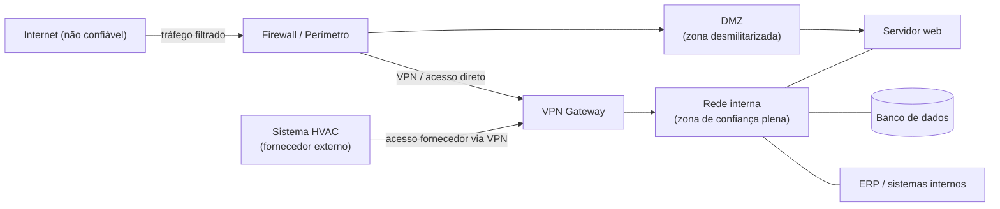
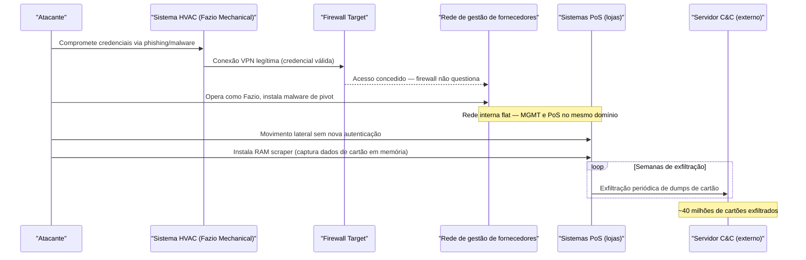
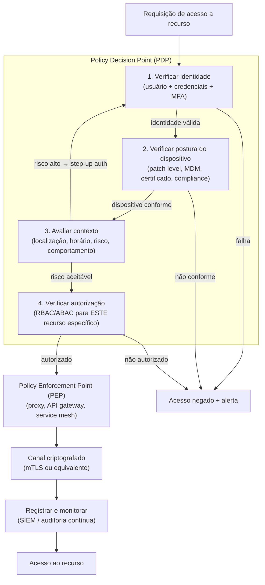
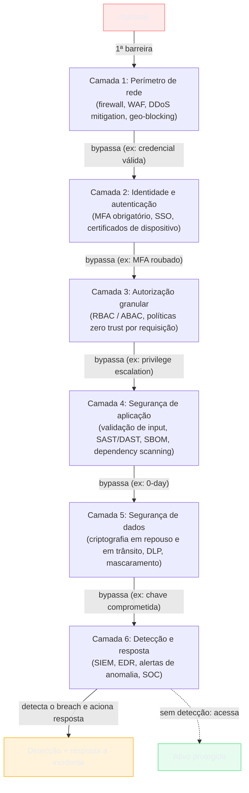
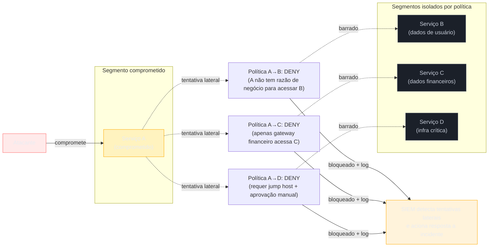

# Zero trust e defesa em profundidade

> [!abstract] TL;DR
> O modelo de perímetro tratava a rede interna como zona de confiança — e isso foi fatal quando o perímetro desapareceu. Zero trust substitui essa suposição pelo princípio "never trust, always verify": autenticar e autorizar cada requisição, independente de onde ela vem. Defesa em profundidade empilha camadas independentes de controle para que a falha de uma não implique comprometimento total. Juntos, esses dois princípios formam a espinha dorsal da arquitetura de segurança moderna. Não são produtos que se compram — são posturas arquiteturais que exigem mudança estrutural em identidade, rede, endpoints, aplicações e cultura operacional.

---

## O modelo de perímetro — "castelo e fosso"

Por décadas, o modelo dominante de segurança de rede foi o do **perímetro**: construa uma muralha (firewall) na borda da rede, controle rigorosamente o que entra e o que sai, e trate tudo que está *dentro* como implicitamente confiável. A metáfora do castelo medieval é precisa — fosso largo, portão estreito, e uma vez que você cruza a ponte levadiça, circula livremente pelo pátio interno, pelos aposentos, pela armaria.



> [!info] Leitura do diagrama
> O firewall e a VPN são as únicas barreiras. Uma vez dentro da rede interna — via VPN legítima, acesso físico, ou credencial comprometida — o tráfego entre banco de dados, ERP e servidores flui sem verificação adicional de identidade. Isso é a zona "mole por dentro". Note que o sistema HVAC do fornecedor tem acesso VPN à mesma rede que os dados de cartão de crédito.

Esse modelo funcionou enquanto havia um "dentro" bem definido: escritório físico, servidores on-premise, funcionários no mesmo prédio. Três forças o tornaram estruturalmente inseguro:

**1. Ameaça interna (insider threat)**

Um funcionário mal-intencionado — ou qualquer usuário cujas credenciais foram roubadas via phishing — já está "dentro". O perímetro não oferece proteção alguma contra acesso interno. Pior: o modelo de perímetro ativo agressivamente combate ameaças externas enquanto trata ameaças internas como inexistentes por definição.

**2. Movimento lateral**

Uma vez que um atacante rompe o perímetro por qualquer ponto — phishing em um funcionário, vulnerabilidade em serviço exposto na DMZ, comprometimento de um fornecedor — ele encontra uma rede "crocante por fora, mole por dentro". A frase é de John Kindervag (Forrester, 2010). Pode se mover de sistema em sistema, escalar privilégios, pivotar para segmentos mais sensíveis, praticamente sem fricção. Não há nova barreira depois do firewall.

**3. Dissolução do perímetro**

Nuvem pública, SaaS, trabalho remoto e mobile apagaram a noção geográfica de "dentro da rede". Onde fica o perímetro quando seu banco de dados está no AWS, seu CRM é SaaS (Salesforce), seu CI/CD roda no GitHub Actions, e seus desenvolvedores trabalham de cafés, aeroportos e escritórios de coworking ao redor do mundo? A resposta honesta é: não existe mais um perímetro claro. Você pode tentar construir um perímetro imaginário em volta de todo esse ambiente distribuído — ou aceitar que o modelo não se aplica e adotar algo melhor.

O exemplo mais citado desse padrão é o breach da **Target em 2013** — um fornecedor de HVAC com VPN para a rede interna, sem segmentação nenhuma até os sistemas de pagamento. A anatomia completa está em [[#Casos práticos]], junto com o caso oposto: a implementação que mostrou como fazer diferente.

---

## Movimento lateral — anatomia do ataque



> [!info] Leitura do diagrama
> O atacante nunca precisou "furar" o firewall diretamente. Aproveitou um vetor legítimo (credencial de fornecedor) e depois se moveu livremente porque não havia verificação de identidade *entre* segmentos internos. Cada passo após o firewall teria sido bloqueado por políticas zero trust: a rede HVAC nunca deveria ter visibilidade nem conectividade com os sistemas PoS.

---

## Zero Trust — "never trust, always verify"

O termo foi cunhado por **John Kindervag** na Forrester Research em 2010. A ideia central é radical na sua simplicidade: **localização de rede não confere confiança**. Não importa se a requisição vem de dentro do datacenter, da rede corporativa, da VPN ou de um servidor na mesma sub-rede — ela precisa ser autenticada e autorizada antes de ser atendida.

A formalização canônica é o **NIST SP 800-207** (*Zero Trust Architecture*, 2020), documento normativo que define os sete princípios:

> [!note] Sete princípios NIST SP 800-207
> 1. Todos os recursos (dados, serviços, dispositivos) são acessados de forma segura **independente de localização** na rede.
> 2. O controle de acesso é **least privilege** e aplicado **por requisição** — não por sessão, por usuário ou por rede.
> 3. **Inspecionar e registrar todo o tráfego** — não só o que cruza o perímetro.
> 4. **Identidade é o novo perímetro** — autenticar usuário + dispositivo em cada acesso.
> 5. A empresa monitora e **valida continuamente** a integridade de todos os ativos.
> 6. A empresa coleta dados sobre o **estado atual dos ativos** para melhorar a postura de segurança.
> 7. **Assume breach**: operar como se o ambiente já estivesse comprometido, minimizando blast radius.

Os princípios 1-4 atacam diretamente o modelo de perímetro. Os princípios 5-6 reconhecem que zero trust é uma postura dinâmica, não uma configuração estática. O princípio 7 remete diretamente à nota [[02 - Pensar como adversário]] (threat modeling, assume breach como postura de design).

### Verificação por requisição — o fluxo zero trust



> [!info] Leitura do diagrama
> Cada requisição percorre um gauntlet de verificações independentes antes de chegar ao recurso. O **Policy Decision Point (PDP)** é o componente lógico que toma a decisão de acesso; o **Policy Enforcement Point (PEP)** é o componente que a aplica (proxy reverso, API gateway, agente no host). Contexto de alto risco (login de país incomum, horário atípico) pode acionar re-autenticação em vez de rejeição imediata. Isso remete diretamente à nota [[13 - Autorização e controle de acesso]] (RBAC/ABAC por requisição).

A implementação zero trust mais documentada e influente da história é o **BeyondCorp** do Google — a íntegra está em [[#Casos práticos]] como Caso 2. A armadilha de tratar "zero trust" como produto de prateleira, em vez de postura arquitetural, está catalogada em [[#Armadilhas comuns]].

---

## Defesa em profundidade — o modelo do queijo suíço

Zero trust lida com verificação de identidade e autorização requisição a requisição. **Defesa em profundidade** (Defense in Depth, DiD) é um princípio complementar e mais amplo: organizar os controles de segurança em **camadas independentes**, de modo que a falha de uma camada não implique comprometimento total do sistema.

A metáfora clássica é o **modelo do queijo suíço** — atribuído a **James Reason** (1990, *Human Error*, Cambridge University Press), originalmente desenvolvido para acidentes industriais e de aviação, depois amplamente adotado pela segurança da informação. Cada fatia de queijo é uma camada de defesa; cada buraco é uma vulnerabilidade. Um breach ocorre quando os buracos de *todas* as fatias se alinham simultaneamente — quando a mesma falha atravessa todas as camadas de controle sem ser interceptada em nenhuma.

A implicação é poderosa: **nenhuma camada precisa ser perfeita**. Uma camada pode ter vulnerabilidades, desde que outra camada independente as cubra. O objetivo não é eliminar todos os buracos (impossível), mas garantir que os buracos de camadas diferentes raramente se alinhem.



> [!info] Leitura do diagrama
> Cada camada é independente: a falha da camada 1 (firewall bypassado por credencial válida) não significa que o atacante chegará ao ativo — ele ainda precisa superar MFA, autorização granular, segurança de aplicação e criptografia. A camada 6 (detecção) cobre o cenário em que todas as outras falharem: mesmo que o atacante chegue perto do ativo, a detecção aciona resposta antes ou durante a exfiltração. Isso aplica diretamente os princípios de [[04 - Princípios de design seguro]].

### As camadas em detalhe

| Camada | Exemplos de controle | O que cobre |
|---|---|---|
| **Física** | Controle de acesso ao datacenter, câmeras, destruição de mídia, guardas | Acesso físico não autorizado a hardware |
| **Rede** | Firewall, segmentação de VLAN, IDS/IPS, microssegmentação, NDR | Movimentação de rede não autorizada |
| **Identidade** | MFA, SSO, PAM, certificados de dispositivo, contas de serviço com privilégio mínimo | Acesso com credenciais comprometidas |
| **Endpoint** | EDR, patch management, hardening de SO, controle de aplicação, MDM | Comprometimento de dispositivo |
| **Aplicação** | WAF, validação de input, análise estática (SAST), análise dinâmica (DAST), SBOM | Exploração de vulnerabilidade de aplicação |
| **Dados** | Criptografia em repouso/trânsito, DLP, tokenização, mascaramento, backup imutável | Exfiltração e vazamento de dados |
| **Detecção/resposta** | SIEM, SOC, playbooks de incidente, red team, threat hunting | Tudo que escapou das camadas anteriores |

A diversidade de tecnologias entre camadas é deliberada: um atacante que aprendeu a bypassar o firewall (camada rede) não necessariamente sabe como bypassar o EDR (camada endpoint). Camadas heterogêneas aumentam o custo de ataque.

---

## Blast radius e contenção — "assume breach" aplicado

**Blast radius** (raio de explosão) é o conceito de que quando algo é comprometido — e a postura "assume breach" parte da premissa de que é *quando*, não *se* — o dano deve ser limitado ao escopo do componente comprometido. O objetivo da arquitetura é **minimizar esse raio**.

Pense no design de submarinos: compartimentos estanques. Se um compartimento é inundado, a pressão do mar não se propaga para os outros porque cada compartimento tem portas que fecham independentemente. O submarino não afunda. A analogia para sistemas: se um microserviço é comprometido, ele não deve ser o vetor para comprometer o banco de dados, o serviço de autenticação ou outros microserviços.



> [!info] Leitura do diagrama
> Microssegmentação com políticas deny-by-default contém o blast radius ao Serviço A. Todas as tentativas de movimentação lateral são registradas no SIEM — o que não só bloqueia o ataque mas também o torna *visível*, acionando resposta a incidente antes que o atacante encontre outro vetor.

### Técnicas de contenção de blast radius

**Microssegmentação de rede**: dividir a infraestrutura em zonas menores com políticas de acesso explícitas entre elas. Políticas deny-by-default entre segmentos — apenas tráfego com razão de negócio documentada é permitido. Ferramentas: VMware NSX, AWS Security Groups + NACLs, Kubernetes NetworkPolicy, Cilium.

**Least privilege por credencial**: cada serviço, conta de serviço e token tem acesso estritamente ao que precisa — nada mais, nada além. Uma conta de serviço comprometida que só lê do bucket X não consegue escrever no banco de dados Y. Exige disciplina constante — o caminho fácil é dar permissões largas "para funcionar".

**Credenciais efêmeras**: tokens de curta duração (OIDC workload identity, credenciais temporárias AWS STS/IAM Roles, Vault dynamic secrets) que expiram em minutos ou horas. Um token comprometido tem uma janela de uso muito menor do que uma chave estática que nunca expira.

**Compartimentalização por sensibilidade**: sistemas com diferentes classificações de dados ficam em ambientes isolados. Dados de PCI (cartões de crédito) em um ambiente; dados de saúde (HIPAA) em outro; dados operacionais em outro. Cruzar fronteiras exige controles explícitos, não apenas boa vontade.

**Contas de acesso privilegiado (PAM)**: acesso administrativo a sistemas críticos é intermediado por um PAM vault (CyberArk, HashiCorp Vault, AWS Secrets Manager) com sessões gravadas, credenciais rotacionadas automaticamente e aprovação de acesso just-in-time.

**Monitoramento contínuo**: detectar movimento lateral precocemente — anomalias de acesso (usuário acessando sistema que nunca acessou antes), volume incomum de dados lidos, novas conexões entre segmentos — reduz o **dwell time** (tempo de permanência do atacante). O dwell time mediano antes de detecção ficou em ~24 dias em 2023 (Mandiant M-Trends 2024) — cada dia é oportunidade adicional para o atacante.

---

## Zero Trust × Defesa em profundidade — a relação

Os dois conceitos são complementares, não substitutos. Confundi-los é erro frequente em entrevista:

| Dimensão | Zero Trust | Defesa em profundidade |
|---|---|---|
| **Foco** | Identidade e verificação contínua por requisição | Camadas independentes de controle arquitetural |
| **Pergunta central** | "Quem é você e o que você pode fazer agora?" | "Se essa camada falhar, o que segura o sistema?" |
| **Unidade de análise** | Cada requisição individual | Arquitetura do sistema como um todo |
| **Assume breach** | Princípio central (verifique sempre, presuma compromisso) | Consequência natural (falha de uma camada ≠ breach total) |
| **Microssegmentação** | Mecanismo de implementação ZT para rede | Uma das camadas de controle de DiD |
| **Origem** | Kindervag/Forrester 2010; NIST 800-207 2020 | Doutrina militar (defense in depth), adaptada para infosec |

Em prática: zero trust *implementa* defesa em profundidade ao nível de identidade e autorização — é a camada 2 e 3 do diagrama DiD acima. Defesa em profundidade *organiza* os controles restantes (rede, endpoint, dados, detecção) em torno dessa base de zero trust.

> [!tip] Ouça: Zero Trust and Defense in Depth Models
> **Podcast:** Bare Metal Cyber — Network Plus PrepCast, Episódio 142 | **Duração:** ~15min | **Idioma:** EN (legenda automática verificada)
>
> Episódio curto e denso que faz exatamente a síntese que a tabela acima propõe: por que zero trust e defesa em profundidade não competem, e como cada um cobre a lacuna que o outro deixa aberto. Útil como revisão auditiva depois de ler esta nota — não introduz mecanismo novo, mas fixa a diferença "porta da frente vs. contenção interna" com clareza.
> Trecho de destaque: *"Zero trust ensures that no user or device is trusted without verification, while defense in depth ensures that no single control stands alone."*
>
> 🎙️ [Ouvir no YouTube](https://www.youtube.com/watch?v=0RE-2KxUuSI)

> [!tip] A pergunta de entrevista real
> "Como você aplicaria zero trust em uma migração para nuvem?" — A resposta senior não lista produtos. Ela descreve: inventário de identidades e workloads, definição de políticas de microssegmentação por serviço, implementação de MFA e acesso condicional, remoção gradual de VPN legacy, adoção de OIDC/workload identity para service-to-service auth, instrumentação de observabilidade para detectar anomalias de acesso, e um modelo de maturidade incremental (não big bang). Isso demonstra que você entende os *princípios* por trás dos produtos.

---

## Maturidade de Zero Trust — CISA ZT Maturity Model

O CISA publicou o **Zero Trust Maturity Model v2** (2023), que organiza a jornada zero trust em 5 pilares e 4 níveis de maturidade. É relevante para entrevistas em empresas de médio/grande porte porque mostra que ZT é uma jornada incremental, não uma virada de chave.

**Cinco pilares**: Identidade, Dispositivos, Redes, Aplicações/Workloads, Dados.

**Quatro níveis de maturidade**:

| Nível | Característica |
|---|---|
| **Tradicional** | Controles estáticos, redes planas, pouca visibilidade, autenticação fraca |
| **Inicial** | Alguma automação, MFA em alguns sistemas, segmentação básica |
| **Avançado** | Automação consistente, visibilidade ampla, políticas de acesso dinâmicas |
| **Ótimo** | Controles totalmente automatizados, resposta orquestrada, monitoramento contínuo em todos os pilares |

A maioria das organizações começa no nível Tradicional e busca atingir Avançado em 3-5 anos. Nível Ótimo é raro mesmo em grandes empresas de tecnologia.

---

## Zero Trust em microserviços e nuvem — implementação prática

O ambiente de microserviços e nuvem é onde zero trust deixa de ser teoria e vira engenharia do dia a dia. Três domínios concentram a maior parte da implementação prática:

### 1. Service-to-service authentication (mTLS e OIDC)

Em arquitetura de microserviços, cada chamada entre serviços é uma requisição que precisa ser autenticada. Dois padrões dominam:

**mTLS (mutual TLS)**: ambos os lados da conexão (cliente e servidor) apresentam certificados. O cliente prova que é quem diz ser; o servidor também. Implementado tipicamente por uma **service mesh** (Istio, Linkerd, Consul Connect) que injeta um sidecar proxy em cada pod e gerencia os certificados automaticamente. O código da aplicação não precisa saber que mTLS existe — é transparente.

**OIDC Workload Identity**: em ambientes cloud, serviços se autenticam usando identidades gerenciadas pela plataforma (AWS IAM Roles for Service Accounts, GCP Workload Identity Federation, Azure Managed Identity). O serviço recebe um token OIDC assinado pelo provedor de nuvem que identifica o workload, não um usuário humano — o mesmo grant de máquina (client credentials / workload identity) tratado em [[04 - Grants de máquina e fluxos especiais]]. Isso elimina a necessidade de secrets estáticos entre serviços.

```
Princípio: nenhum serviço confia em outro só porque estão no mesmo cluster.
```

### 2. Acesso humano a infraestrutura

O acesso de engenheiros a servidores, bancos de dados e sistemas em produção é um vetor crítico. Práticas zero trust:

- **Bastion hosts / jump hosts** são substituídos por **acesso just-in-time** (JIT): a engenheira solicita acesso para uma tarefa específica, o sistema concede por N horas, registra a sessão, e revoga automaticamente. Sem acesso permanente.
- **Session recording**: sessões SSH e de banco de dados são gravadas e auditadas. Deterrência e forense.
- **Breakglass accounts**: contas de acesso emergencial (break-glass) com credenciais em cofre físico, exigindo aprovação de dois gerentes e gerando alerta automático quando usadas.
- **No static SSH keys**: chaves SSH estáticas são substituídas por certificados SSH com validade curta (ex.: 8 horas), emitidos por uma CA interna após autenticação do usuário.

### 3. Continuous validation (não só na autenticação)

Um ponto frequentemente negligenciado: zero trust não verifica apenas no momento de autenticação. Ele monitora continuamente se as condições que justificaram o acesso *ainda se aplicam*:

- Dispositivo que recebia acesso foi comprometido → acesso revogado em tempo real.
- Usuário cujo token foi emitido faz download de volume anormal de dados → sessão suspensa para revisão.
- Serviço que normalmente faz 10 chamadas/min começa a fazer 10.000/min → anomalia detectada e escalada.

Isso é possível via integração entre o **Policy Decision Point** (que decide o acesso) e o **Security Information and Event Management** (SIEM) que monitora o comportamento pós-acesso. A decisão de acesso não é estática — pode ser revogada enquanto a sessão está ativa.

---

## Casos práticos

### Caso 1: Target 2013 — o preço da rede flat

O breach da Target em novembro de 2013 é o exemplo mais citado de movimento lateral em escala real. O vetor inicial foi um **fornecedor de HVAC** (climatização) — Fazio Mechanical — que tinha credenciais de acesso à rede da Target para monitoramento remoto de consumo de energia e temperatura. Os atacantes comprometeram as credenciais da Fazio Mechanical (provavelmente via phishing ou malware) e usaram esse acesso para entrar na rede da Target.

Uma vez dentro, a rede corporativa tinha segmentação mínima entre a rede de gestão de fornecedores e os sistemas de ponto de venda (PoS). Os atacantes se moveram lateralmente, instalaram RAM scrapers nos terminais PoS e durante semanas exfiltraram dados de ~40 milhões de cartões de crédito e débito. O FBI só notificou a Target após detectar os dados à venda em fóruns clandestinos.

O ponto crítico: o perímetro foi cruzado **uma única vez**, via credencial legítima de um fornecedor. Todo o dano foi causado pela liberdade de movimentação interna. Microssegmentação e políticas zero trust entre a rede HVAC e os sistemas PoS teriam contido o ataque no primeiro segmento.

Outros exemplos do mesmo padrão: **SolarWinds 2020** (movimento lateral a partir do processo de build comprometido para redes de clientes governamentais), **Colonial Pipeline 2021** (credencial de VPN legacy sem MFA → acesso à rede operacional).

### Caso 2: BeyondCorp — a implementação pioneira que fez o oposto

O Google publicou o modelo **BeyondCorp** a partir de 2014 (série de papers no Google Research), descrevendo como eliminou a VPN corporativa e passou a tratar todos os acessos — incluindo os de funcionários no escritório — como potencialmente não confiáveis. É a implementação zero trust mais documentada e influente da história, e o contraponto direto ao caso Target: em vez de uma rede interna flat protegida só por VPN, cada requisição é verificada por identidade e postura de dispositivo, não por origem de rede.

Os quatro pilares do BeyondCorp original:

| Pilar | Implementação |
|---|---|
| **Inventário de dispositivos** | Banco de dados centralizado de todos os dispositivos gerenciados; cada dispositivo recebe um certificado único |
| **Identidade do usuário** | Autenticação forte (certificados + MFA) vinculada ao usuário, não ao IP ou localização |
| **Acesso baseado em política** | Cada serviço define quais combinações de usuário + perfil de dispositivo podem acessá-lo |
| **Access Proxy** | Todo tráfego passa pelo proxy que aplica as políticas; não há "rede interna" privilegiada |

O resultado: um funcionário do Google no escritório e um funcionário em home office têm exatamente o mesmo nível de acesso — nenhum dos dois tem confiança implícita. O que determina o acesso é a identidade verificada e a conformidade do dispositivo, não a rede de onde a requisição vem.

BeyondCorp inspirou toda uma geração de produtos: **Google BeyondCorp Enterprise**, **Cloudflare Access**, **Zscaler Zero Trust Exchange**, **Microsoft Entra ID (Conditional Access)**, **Palo Alto Prisma Access**.

---

## Armadilhas comuns

> [!warning] Zero trust não é um produto
> Vendors vendem "zero trust" como se fosse algo que se compra e liga. Na prática, zero trust é uma **postura arquitetural** que exige mudanças coordenadas em identidade (MFA, SSO, certificados), rede (microssegmentação, remoção de VPN legacy), endpoints (MDM, EDR, hardening), aplicações (mTLS, autorização granular) e cultura operacional (assume breach, monitoramento contínuo). Um firewall com a etiqueta "zero trust" sem MFA e sem microssegmentação é security theater — remete à nota [[03 - Economia e fator humano da segurança]]. O mercado de segurança é fértil em buzzwords e zero trust sofreu com isso rapidamente após 2020: vendors relabelaram produtos existentes — firewalls, VPNs, SIEMs — com a etiqueta "zero trust" sem mudança substancial. Armadilha clássica: comprar um "zero trust network access" (ZTNA) e achar que implementou zero trust, quando na verdade só substituiu a VPN por outra forma de acesso baseado em rede. Zero trust real exige mudança em *pelo menos* quatro domínios simultaneamente: identidade forte (MFA + SSO), autorização granular (RBAC/ABAC por requisição), visibilidade (logging e monitoramento contínuo), e resposta automatizada (revogar acesso quando anomalia detectada). Sem os quatro, é arquitetura incompleta.

> [!warning] A tensão com usabilidade
> Zero trust mal implementado cria atrito severo para os usuários legítimos: múltiplos prompts de autenticação, acesso negado por falsos positivos de risco, sessões expiradas no meio do trabalho. O resultado é a criação de "shadow IT" — usuários encontram formas de bypassar os controles porque são muito inconvenientes. O design correto usa **step-up authentication** apenas quando o risco justifica: acesso a dados normais com autenticação normal; acesso a dados sensíveis com MFA adicional; acesso a sistemas críticos com aprovação JIT. Não exigir o nível máximo de fricção em toda requisição.

> [!warning] Zero trust não é fim de linha
> "Assume breach" significa que zero trust não é garantia de que não haverá breach — é garantia de que quando houver, o blast radius será menor e a detecção será mais rápida. Organizações que implementam zero trust e relaxam o monitoramento cometem o mesmo erro do modelo de perímetro (confiar cegamente na barreira) só que com uma barreira diferente. A postura correta é: zero trust reduz a superfície de ataque e limita danos, mas **detecção, resposta e recuperação** são igualmente críticos. Defesa em profundidade existe exatamente porque nenhuma camada é perfeita.

> [!warning] Identidade como novo perímetro — e seus riscos
> Ao centralizar a segurança em identidade, o provedor de identidade (IdP) — Okta, Azure AD/Entra, Google Workspace — se torna o ativo mais crítico de toda a infraestrutura. Compromisso do IdP ≠ comprometimento de um sistema; compromisso do IdP = comprometimento potencial de todos os sistemas. Isso exige proteção extraordinária do IdP: MFA phishing-resistant (FIDO2/passkeys, não TOTP), acesso administrativo super-restrito, monitoramento de mudanças de configuração, e plano de recuperação para cenário de IdP comprometido. O breach da Okta em 2023 (acesso ao sistema de suporte com potencial exposição de tokens de sessão de clientes) ilustra exatamente esse risco: quando o IdP é o novo perímetro, atacar o IdP é atacar o perímetro.

---

## O que vem a seguir

Zero trust resolve "quem pode acessar o quê, agora" — mas verificar identidade e autorizar cada requisição não protege o conteúdo da requisição em si, nem impede que metadados sobre *quem falou com quem, quando e de onde* vazem mesmo que a autorização tenha sido perfeitamente concedida. É exatamente essa lacuna que a próxima nota, [[20 - Privacidade, anonimato e metadados]], ataca: um atacante (ou um observador com poder de vigilância legítimo) pode reconstruir um grafo social inteiro só olhando para *quem* se comunicou com *quem*, sem nunca decifrar o conteúdo — o PDP do diagrama desta nota autoriza o acesso, mas não apaga o rastro de que o acesso aconteceu. Depois de fechar "como verificar cada requisição" (zero trust) e "como conter o dano quando uma camada falha" (defesa em profundidade), o próximo passo lógico é perguntar o que ainda escapa por entre essas duas defesas: os metadados que sobrevivem mesmo quando toda a autenticação e autorização funcionaram como projetado.

- Anterior: [[18 - Gestão de chaves e segredos]]
- Próxima: [[20 - Privacidade, anonimato e metadados]]
- Cross-links: [[04 - Princípios de design seguro]] (fail-safe defaults, separação de privilégios, DiD como pilar de design), [[02 - Pensar como adversário]] (assume breach, modelagem de ameaças, threat modeling), [[13 - Autorização e controle de acesso]] (RBAC/ABAC — o mecanismo que zero trust usa para autorizar por requisição), [[04 - Grants de máquina e fluxos especiais]] (workload identity — o mecanismo OIDC que zero trust usa para autenticar serviço-a-serviço)

> [!summary] Resumo em uma linha
> Zero trust elimina a confiança implícita por localização de rede — cada requisição é autenticada e autorizada individualmente; defesa em profundidade empilha camadas independentes para que a falha de uma não seja catastrófica.

---

## Em entrevista

Zero trust e defesa em profundidade aparecem em perguntas de design de sistema, security review e "como você protegeria X". O vocabulário em inglês é indispensável — entrevistadores de empresas internacionais usam os termos técnicos sem tradução e esperam que você responda na mesma moeda.

Aberturas típicas em entrevista técnica sênior:

- *"How would you design a secure architecture for a multi-tenant SaaS platform?"*
- *"What are the principles behind zero trust, and how do they differ from traditional perimeter security?"*
- *"How do you limit blast radius when a microservice is compromised?"*
- *"Walk me through how you'd migrate from a VPN-based model to zero trust for a 2,000-person company."*
- *"A developer's credentials are compromised. What controls prevent the attacker from reaching the database?"*

Respostas sênior demonstram que você entende os **princípios** por trás dos produtos, pode descrever trade-offs, e sabe dimensionar a solução ao contexto (startup vs. enterprise, nuvem vs. on-prem, regulação vs. agilidade).

**Vocabulário PT → EN:**

| Português | Inglês |
|---|---|
| Perímetro / modelo castelo-e-fosso | Perimeter model / castle-and-moat |
| Confiança zero | Zero trust |
| Nunca confie, sempre verifique | Never trust, always verify |
| Movimento lateral | Lateral movement |
| Microssegmentação | Microsegmentation |
| Raio de explosão / contenção de dano | Blast radius / damage containment |
| Privilégio mínimo | Least privilege |
| Assuma violação | Assume breach |
| Defesa em profundidade | Defense in depth |
| Modelo do queijo suíço | Swiss cheese model |
| Tempo de permanência do atacante | Dwell time |
| Proxy de acesso | Access proxy |
| Ponto de decisão de política | Policy Decision Point (PDP) |
| Ponto de imposição de política | Policy Enforcement Point (PEP) |
| Ameaça interna | Insider threat |
| Escalonamento de privilégio | Privilege escalation |
| Gerenciamento de acesso privilegiado | Privileged Access Management (PAM) |
| Credenciais efêmeras | Ephemeral / short-lived credentials |
| Segmentação de rede | Network segmentation |
| Postura de segurança | Security posture |
| Teatro de segurança | Security theater |
| Identidade de carga de trabalho | Workload identity |

---

## Fontes

1. **NIST SP 800-207** — *Zero Trust Architecture* (Scott Rose et al., agosto 2020). Documento normativo que define os sete princípios de ZT e os componentes lógicos de uma arquitetura ZT. [doi.org/10.6028/NIST.SP.800-207](https://doi.org/10.6028/NIST.SP.800-207)
2. **Google BeyondCorp papers** — série iniciada em 2014, descrevendo a implementação de ZT no Google sem VPN. Acesso via [research.google/pubs (área Security and Privacy)](https://research.google/pubs/?area=security-and-privacy) (buscar "BeyondCorp"). O paper fundacional é Ward et al., *BeyondCorp: A New Approach to Enterprise Security*, USENIX ;login: 2014.
3. **John Kindervag (Forrester Research, 2010)** — *"No More Chewy Centers: Introducing The Zero Trust Model Of Information Security"*. Documento original que cunhou o termo "zero trust" e a analogia "crocante por fora, mole por dentro" (hard candy shell, soft chewy center).
4. **CISA — Zero Trust Maturity Model v2** (abril 2023). Os cinco pilares e quatro níveis de maturidade. [cisa.gov/zero-trust-maturity-model](https://www.cisa.gov/zero-trust-maturity-model)
5. **Brian Krebs (Krebs on Security, fevereiro 2014)** — *"Target Hackers Broke in Via HVAC Company"*. Análise primária do breach da Target 2013, detalhando o vetor HVAC (Fazio Mechanical) e o movimento lateral até os sistemas PoS. [krebsonsecurity.com/2014/02/target-hackers-broke-in-via-hvac-company](https://krebsonsecurity.com/2014/02/target-hackers-broke-in-via-hvac-company/)
6. **James Reason — *Human Error*** (Cambridge University Press, 1990). Fonte primária do modelo do queijo suíço (Swiss cheese model), originalmente desenvolvido para acidentes industriais e de aviação, amplamente adotado pela segurança da informação como metáfora para defesa em profundidade.
7. **Bare Metal Cyber — Network Plus PrepCast, Episódio 142** — *"Zero Trust and Defense in Depth Models"* (podcast, ~15min, EN, transcrição verificada). Síntese conjunta dos dois modelos como estratégias complementares, não concorrentes. [youtube.com/watch?v=0RE-2KxUuSI](https://www.youtube.com/watch?v=0RE-2KxUuSI)
