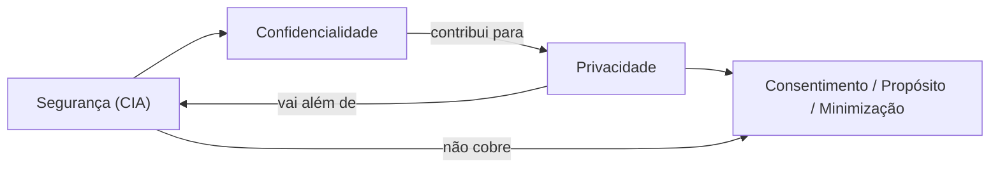
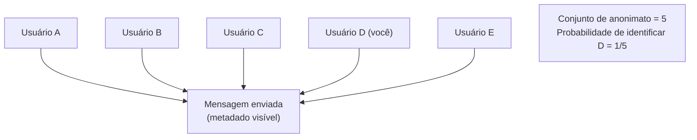
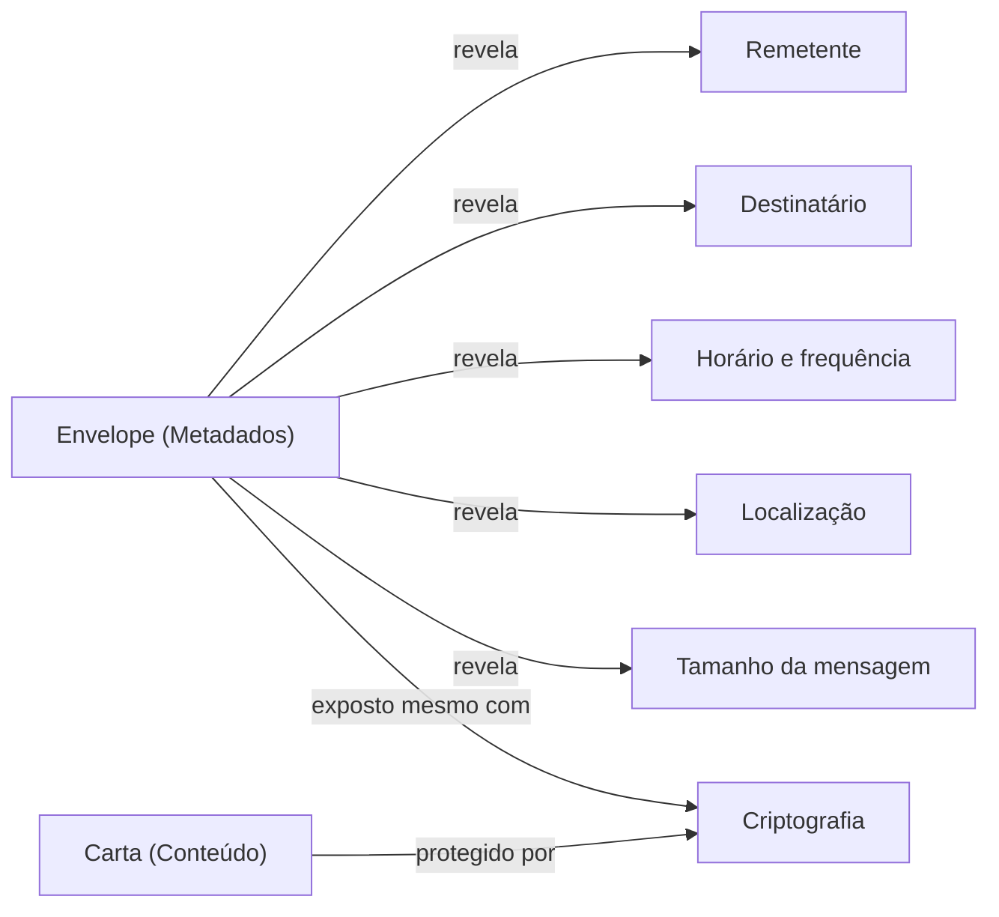
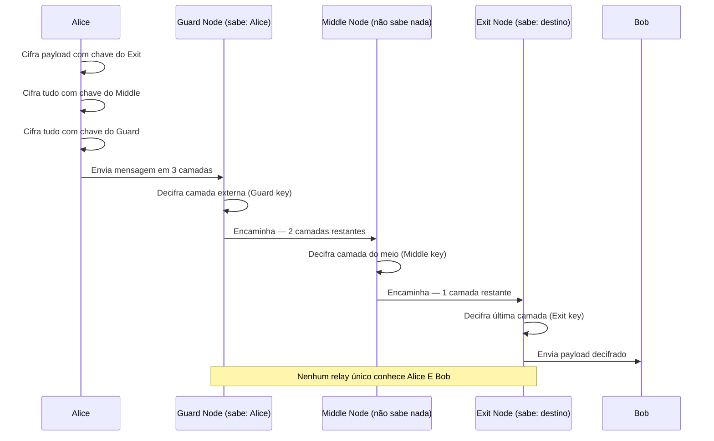
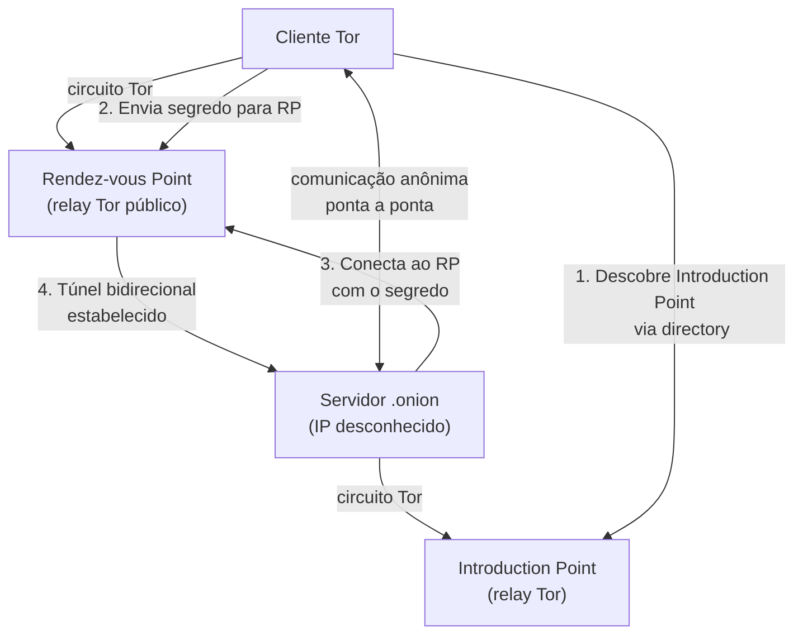
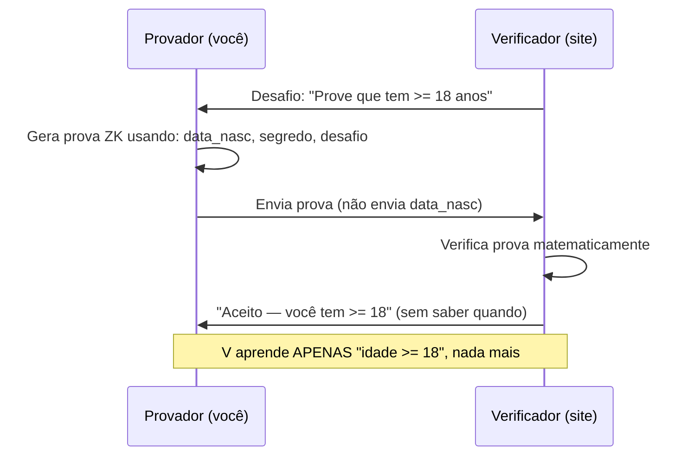

# Privacidade, anonimato e metadados

> [!abstract] TL;DR
> Privacidade ≠ segurança — a distinção é conceitual e legal. Segurança protege contra acesso não autorizado; privacidade é controle sobre suas próprias informações, inclusive por partes autorizadas. Metadados revelam mais que conteúdo (quem, quando, com quem, de onde). Anonimato depende de um "conjunto de anonimato" grande o suficiente para você se esconder. Tecnologias como onion routing, zero-knowledge proofs e differential privacy constroem privacidade sobre criptografia — mas a arquitetura (o que você coleta) importa mais que o algoritmo.

---

## A distinção central: privacidade × segurança

Essa confusão aparece toda semana em entrevista e em documentação técnica. Vamos matar ela de vez.

**Segurança** (no sentido da tríade CIA) protege contra acesso *não autorizado*. O objetivo é: "apenas quem tem permissão acessa."

**Privacidade** é mais ampla: é o controle que um indivíduo exerce sobre suas próprias informações — inclusive sobre partes *autorizadas*. O médico tem acesso autorizado ao seu prontuário; ainda assim existe um direito de privacidade regulando o que ele pode fazer com aquela informação (com quem compartilha, por quanto tempo guarda, para que usa).

A sobreposição existe — confidencialidade é uma propriedade de segurança que *contribui* para privacidade — mas as duas esferas não se cobrem.

> [!info] Leitura do diagrama
> Confidencialidade é um subconjunto de segurança que apoia privacidade, mas privacidade exige dimensões adicionais — consentimento, propósito e minimização — que estão fora do escopo da tríade CIA. Um sistema pode ser completamente seguro (acesso controlado, dados cifrados) e radicalmente não-privado (a empresa vende seus dados a terceiros com consentimento enterrado em 40 páginas de termos).

### Exemplo canônico: a empresa que cifra tudo e vende tudo

Imagine um app de mensagens que usa AES-256 em repouso e TLS 1.3 em trânsito — impecável do ponto de vista de segurança. Mas os metadados de uso (com quem você fala, com que frequência, a que horas) são vendidos a corretores de dados. O sistema é *seguro*. Não é *privado*.

Isso é exatamente o que Daniel Solove critica em "I've Got Nothing to Hide" (2007): a falácia de que privacidade só importa para quem tem algo a esconder. Privacidade é sobre autonomia e dignidade, não sobre culpa. Você não precisa ter "algo a esconder" para se importar com quem sabe que você consulta um oncologista toda semana.

> [!warning] Falácia "nothing to hide"
> "Se você não tem nada a esconder, não tem nada a temer" comete um erro lógico duplo: (1) assume que o único uso de privacidade é esconder má conduta; (2) ignora que o *julgamento* do que é "aceitável" pertence ao observador, não ao observado. O contexto muda — o que é inofensivo hoje pode ser perigoso amanhã sob um regime diferente.

---

## Anonimato, pseudonimato e não-ligabilidade

Três conceitos que parecem sinônimos mas têm semânticas precisas:

| Conceito | Definição | Exemplo |
|---|---|---|
| **Anonimato** | Ação sem identidade vinculada | Voto secreto, cash |
| **Pseudonimato** | Identidade persistente mas não ligada à real | Username num fórum |
| **Não-ligabilidade** | Ações separadas não conectáveis entre si | Visitas a sites sem rastreamento cross-session |

A distinção entre pseudonimato e não-ligabilidade é sutil mas crucial: um pseudônimo persistente cria um histórico. Se esse histórico for suficientemente rico, ele *deanonimiza* o usuário — mesmo sem revelar o nome real. Netflix foi processada em 2009 porque pesquisadores mostraram que o conjunto de filmes avaliados ("anonymizado") permitia identificar usuários cruzando com o IMDb.

### Deanonimização — o dado "anônimo" que não era

**Deanonimização** (ou re-identificação) é o processo de cruzar datasets supostamente anônimos para recuperar identidades. É surpreendentemente fácil na prática:

- **k-anonimidade** (Samarati & Sweeney, 1998): um registro é k-anônimo se existem pelo menos k−1 outros registros com os mesmos valores nos quasi-identificadores (atributos não diretamente identificadores como CEP, gênero, data de nascimento). Com k=1 você é único e identificável. Sweeney mostrou em 2002 que 87% dos americanos são únicos com apenas três campos: gênero, data de nascimento e CEP de 5 dígitos.
- **l-diversity** e **t-closeness**: extensões que atacam falhas da k-anonimidade quando há atributos sensíveis com distribuição homogênea no grupo.
- **Linkage attacks**: cruzar um dataset de saúde "anônimo" com registros eleitorais públicos. O adversário não precisa de muita informação — a interseção de atributos reduz o conjunto de candidatos rapidamente.

> [!warning] "Anônimo" é um espectro, não um estado
> Nenhum dataset com atributos reais de pessoas é verdadeiramente anônimo — ele é *difícil de re-identificar* com as fontes de dados disponíveis hoje. À medida que mais dados ficam públicos, o custo de re-identificação cai. O que é anônimo em 2024 pode não ser em 2030.

> [!tip] Quasi-identificadores em sistemas reais
> Em sistemas de saúde e RH, quasi-identificadores comuns incluem: data de nascimento (ano+mês basta), gênero, cargo, CEP (primeiros 5 dígitos), horário de check-in/check-out, tipo sanguíneo. A regra prática para o engenheiro: qualquer campo que não é sensível individualmente mas *combinado com 2-3 outros campos reduz o conjunto de anonimato abaixo de 10* deve ser tratado como identificador para fins de minimização e retenção.

### O conjunto de anonimato (anonymity set)

O anonimato não é binário — ele é medido pelo tamanho do **conjunto de anonimato**: quantos indivíduos poderiam ser o autor de uma ação.

> [!info] Leitura do diagrama
> O conjunto de anonimato contém todos os usuários que *poderiam* ter enviado a mensagem. Quanto maior o conjunto, menor a probabilidade de identificação. O objetivo de sistemas como o Tor é maximizar esse conjunto — você se esconde na multidão de todos os outros usuários Tor ativos naquele momento.

Quanto maior o conjunto de anonimato, melhor o anonimato. Sistemas que têm poucos usuários ativos degradam o anonimato mesmo que a criptografia seja perfeita — você se esconde entre 10 pessoas, não entre 1 milhão.

Existe uma métrica formal para isso: **entropia de anonimato** (Shannon entropy aplicada ao conjunto de anonimato). Se o conjunto tem N usuários igualmente prováveis, a entropia é log₂(N) bits. Com 1 milhão de usuários: log₂(10⁶) ≈ 20 bits de anonimato. Com 10 usuários: log₂(10) ≈ 3.3 bits — trivialmente atacável.

Quando os usuários têm probabilidades diferentes de enviar a mensagem (porque alguns são mais ativos, ou o adversário tem informação prévia), a entropia cai abaixo do máximo log₂(N). Um atacante bayesiano usa informação de prior para atualizar suas crenças a cada observação — tornando o conjunto de anonimato efetivo menor que o nominal mesmo sem quebrar criptografia.

---

## Metadados — o vazamento que ninguém vê

Em 2014, Michael Hayden, ex-diretor da NSA, disse numa conferência na Johns Hopkins University:

> "We kill people based on metadata."

Não foi retórica. Metadados — quem ligou para quem, quando, por quanto tempo, de onde — revelam mais que o conteúdo da ligação. O conteúdo diz *o que* foi dito; os metadados revelam *o padrão de vida* de uma pessoa.

### O que metadados revelam

Imagine que você só vê os metadados das comunicações de alguém durante uma semana:

- Segunda, 22h: ligação de 45min para o número de uma clínica oncológica.
- Terça, 9h: ligação para plano de saúde.
- Quarta, 14h: ligação para advogado especializado em testamentos.
- Sexta, 20h: ligações longas para três irmãos.

Você não ouviu uma palavra. Mas sabe o suficiente.

A **análise de tráfego** — extrair inteligência dos padrões de comunicação sem quebrar a criptografia — é uma técnica ativa desde a Segunda Guerra Mundial. Os aliados sabiam que o Terceiro Reich ia lançar uma ofensiva apenas pelo aumento no volume de comunicações rádio — sem decifrar nenhuma mensagem. Cifrar o conteúdo esconde a carta, não o envelope. E o envelope já diz muito.

Metadados modernos de interesse para análise de tráfego incluem: tamanho dos pacotes (pode revelar o tipo de conteúdo — uma resposta de 4 KB para um endpoint de imagem de perfil vs. 800 KB para um feed), timing entre requisições (comportamento humano tem padrões rítmicos distintos de bots), correlação de IPs (mesmo dispositivo, IPs diferentes ao longo do tempo via DHCP ou VPN), e fingerprinting de TLS (JA3/JA4 hash — a combinação de cipher suites e extensões TLS é suficientemente única para identificar o client stack sem ver o payload).

> [!info] Leitura do diagrama
> A criptografia forte protege o conteúdo (a carta), mas os metadados (o envelope) ficam expostos na rede mesmo quando o payload está cifrado. TLS protege o body de um request HTTP mas não esconde o IP de destino, o domínio (via SNI no TLS handshake), o tamanho da resposta ou o timing.

> [!tip] SNI e metadados em TLS
> O Server Name Indication (SNI) é um campo no TLS handshake que expõe o hostname destino em plaintext — necessário para que o servidor saiba qual certificado apresentar em IPs compartilhados. ESNI (Encrypted SNI) e seu sucessor ECH (Encrypted Client Hello) buscam cifrar esse campo. Mesmo com ECH, o IP de destino ainda é visível.

---

## Tor e mixnets — escondendo o "quem fala com quem"

O Tor (The Onion Router) foi projetado especificamente para o problema que a criptografia comum não resolve: esconder os metadados de *quem se comunica com quem*.

### Onion routing — cebola de criptografia

A mensagem é cifrada em camadas sucessivas — uma para cada relay (nó) no circuito. Cada relay só sabe de onde recebeu e para onde envia. Nenhum relay isolado conhece tanto a origem quanto o destino.

> [!info] Leitura do diagrama
> A sequência mostra o processo de onion routing em três saltos. O Guard Node sabe quem é Alice mas não sabe o destino final; o Exit Node sabe o destino mas não sabe quem é Alice; o Middle Node não sabe nenhum dos dois. O adversário precisaria comprometer os dois extremos simultaneamente para correlacionar origem e destino.

### Limitações do Tor — correlação de tráfego end-to-end

O Tor não é invulnerável. Se um adversário *global passivo* (como uma agência de inteligência com visibilidade na borda da rede) puder observar o tráfego de entrada e saída do circuito simultaneamente, ele pode correlacionar timing e volume dos pacotes — um ataque chamado **traffic correlation** ou **end-to-end timing attack**.

A Dingledine et al. (2004) no paper fundador do Tor reconhecem explicitamente: "We do not claim to protect against a global adversary."

**Mixnets** (Chaum, 1981) adicionam atrasos aleatórios e acumulam mensagens antes de reordenar e reenviar — quebrando a correlação de timing ao custo de latência. Adequado para e-mail anônimo (Mixmaster), inadequado para navegação interativa.

### Hidden services — o destino também pode se esconder

No Tor, não é só o cliente que se anonimiza. **Hidden services** (`.onion`) permitem que o *servidor* também oculte seu endereço IP real. Ambos os lados estabelecem circuitos Tor para um **rendez-vous point** (ponto de encontro) dentro da rede; nenhum dos dois precisa saber o IP do outro.

> [!info] Leitura do diagrama
> O protocolo hidden service usa dois circuitos Tor independentes que se encontram no rendez-vous point. O cliente não conhece o IP do servidor; o servidor não conhece o IP do cliente. A identidade do servidor é autenticada criptograficamente pelo endereço `.onion` em si — que é derivado da chave pública do servidor (SHA-256 truncado para v3 onion addresses).

---

## Criptografia que preserva privacidade

Existe uma família de primitivas criptográficas cuja finalidade não é só confidencialidade — é computar e provar coisas *sem revelar o dado subjacente*.

### Zero-knowledge proofs (ZKP)

Você quer provar que possui um conhecimento sem revelar o conhecimento em si. O exemplo clássico: provar que você tem mais de 18 anos sem revelar sua data de nascimento.

> [!info] Leitura do diagrama
> Uma prova zero-knowledge satisfaz três propriedades: *completude* (um provador honesto sempre convence o verificador), *solidez* (um provador desonesto não consegue convencer, exceto com probabilidade desprezível) e *zero-knowledge* (o verificador não aprende nada além do fato afirmado). Goldwasser, Micali e Rackoff formalizaram isso em 1985.

ZKPs são usadas em blockchains (Zcash, StarkNet), em sistemas de identidade digital (provar atributos de credencial sem revelar a credencial inteira) e em protocolos de autenticação (ZKPOK — zero-knowledge proof of knowledge).

Existem duas famílias principais de ZKPs modernas:
- **zk-SNARKs** (Succinct Non-Interactive Arguments of Knowledge): prova compacta, verificação rápida, mas requerem um *trusted setup* (cerimônia de geração de parâmetros — se comprometida, quebra o sistema). Usados no Zcash.
- **zk-STARKs** (Scalable Transparent Arguments of Knowledge): sem trusted setup, baseados em hashes (post-quantum friendly), mas provas maiores. Usados no StarkNet/StarkEx.

### Criptografia homomórfica

Permite computar sobre dados cifrados sem precisar decifrá-los. O resultado cifrado, quando decifrado, é igual ao resultado da operação sobre os dados originais.

Formalmente: `Decrypt(Eval(f, Encrypt(x))) = f(x)`

Craig Gentry (2009, tese de doutorado em Stanford) construiu o primeiro esquema totalmente homomórfico (FHE — Fully Homomorphic Encryption). O problema era conhecido desde os anos 1970; Gentry resolveu com lattices. O custo computacional ainda é proibitivo para uso geral (10³–10⁶× mais lento que operação em plaintext), mas esquemas parciais (PHE) e de profundidade limitada (SHE/SWHE) já têm aplicações práticas em saúde e finanças.

Taxonomia rápida dos esquemas:

| Esquema | Operações suportadas | Performance | Exemplo de uso |
|---|---|---|---|
| **PHE** (Parcial) | Adição OU multiplicação, não ambas | Mais rápido | Paillier: somar salários cifrados |
| **SHE/SWHE** (Somewhat) | Ambas, até profundidade limitada | Médio | Consultas em BD cifrado |
| **FHE** (Total) | Qualquer circuito booleano | 10³–10⁶× mais lento | Inferência ML sobre dados cifrados |

### Secure Multiparty Computation (MPC)

Várias partes querem computar uma função sobre suas entradas privadas combinadas, sem nenhuma revelar sua entrada às outras. Exemplo clássico: funcionários querem saber quem ganha mais que a média sem revelar seus salários individuais.

Protocolos como SPDZ (2012) e garbled circuits (Yao, 1986) constroem MPC eficiente. Usado hoje em cálculo de impostos federais preservando privacidade (Dinamarca), licitações privadas e federação de modelos de ML.

A diferença entre MPC e FHE: em MPC, a computação é distribuída entre as partes participantes (que precisam cooperar ativamente); em FHE, uma única parte pode computar sobre dados cifrados de outra sem interação. MPC é mais maduro e eficiente para a maioria dos casos práticos; FHE é mais flexível mas ainda caro.

> [!note] Convergência das primitivas
> ZKP + MPC + FHE frequentemente aparecem combinados: MPC para distribuir o trabalho, ZKP para provar corretude da computação sem revelar entradas, FHE para permitir que uma parte faça parte da computação sem precisar das entradas das outras. Sistemas como o protocolo de leilão privado do Bosch usam exatamente essa combinação.

### Differential privacy

Adicionando ruído estatístico cuidadosamente calibrado a respostas de consultas agregadas, é possível garantir que a participação de qualquer indivíduo específico não possa ser inferida do resultado.

Formalmente, um mecanismo M satisfaz ε-differential privacy se para qualquer dois datasets D e D' que diferem por um único elemento:

`Pr[M(D) ∈ S] ≤ exp(ε) × Pr[M(D') ∈ S]`

Quanto menor o ε, maior a proteção (mais ruído). Apple usa differential privacy para coletar estatísticas de uso do teclado. O Census Bureau dos EUA adotou para o Census 2020. O tradeoff é utilidade × privacidade: ruído excessivo torna os dados inúteis.

O **mecanismo de Laplace** é o mais simples: adiciona ruído amostrado da distribuição de Laplace com escala proporcional à *sensibilidade* da consulta (quanto a resposta muda se um único indivíduo for removido do dataset). Para uma contagem simples (sensibilidade = 1) e ε = 1.0, adiciona ruído Laplace(0, 1) — em média ±1 unidade de ruído. Para ε = 0.1, o ruído sobe 10×.

> [!tip] Differential privacy na prática de engenharia
> Federated learning (como usado no Google Keyboard) combina differential privacy com treinamento local: os modelos são treinados no dispositivo do usuário, apenas gradientes (com ruído DP) são enviados ao servidor. O servidor nunca vê os dados brutos. DP garante que mesmo observando todos os gradientes, o adversário não consegue reconstruir amostras individuais de treinamento.

---

## Privacy by design e minimização de dados

Anne Cavoukian formulou em 1995 (governo de Ontário) os 7 princípios de **Privacy by Design** — hoje incorporados no GDPR como obrigação legal (Art. 25).

| # | Princípio | O que significa na prática |
|---|---|---|
| 1 | **Proativo, não reativo** | Prevenir violações antes, não remediar depois |
| 2 | **Privacidade como default** | Se o usuário não faz nada, a configuração mais privada prevalece |
| 3 | **Embutida no design** | Não uma feature extra — parte da arquitetura central |
| 4 | **Funcionalidade plena** | Privacidade sem sacrificar funcionalidade (soma positiva, não trade-off) |
| 5 | **Segurança ponta a ponta** | Proteção durante todo o ciclo de vida do dado |
| 6 | **Visibilidade e transparência** | O usuário pode verificar as políticas e seu funcionamento |
| 7 | **Respeito ao usuário** | Consentimento genuíno, não dark patterns |

O mais operacional para um engenheiro é o princípio da **minimização de dados (GDPR Art. 5(1)(c)):** colete apenas o que é estritamente necessário para a finalidade declarada. O dado que você não tem não pode vazar, não pode ser subpoenado, não pode ser roubado e não pode ser mal utilizado.

A pergunta de arquitetura muda completamente: em vez de "como protegemos esse dado?", você pergunta "precisamos mesmo desse dado?"

> [!example] Minimização na prática
> Um app de delivery *precisa* do endereço de entrega durante o pedido. Não precisa armazená-lo indefinidamente. Não precisa da data de nascimento. Não precisa do histórico completo de localização GPS com granularidade de segundo. Cada campo extra é uma superfície de ataque e um passivo de privacidade.

### Integridade contextual — a teoria que unifica privacidade

Helen Nissenbaum (2004, 2009) propôs a **contextual integrity** como framework para raciocinar sobre violações de privacidade. A intuição central: privacidade não é sobre sigilo absoluto — é sobre *fluxo apropriado de informação* entre contextos.

Informação flui adequadamente quando respeita as normas do contexto onde foi originalmente compartilhada:

- Você conta para seu médico que toma antidepressivos → ele repassa para outro médico do hospital (fluxo adequado — mesmo contexto médico).
- A seguradora de vida compra esse dado e nega cobertura → violação (contexto diferente, norma violada).

O teste prático: "A pessoa que compartilhou essa informação esperaria que ela fluísse dessa forma para esse destinatário nesse contexto?" Se não, é violação de privacidade — independente de ser "legal" ou "autorizado".

Para engenheiros: contextual integrity ajuda a identificar quando um novo uso de dados (mesmo internamente autorizado) viola expectativas do usuário — e portanto gera risco reputacional e regulatório.

### Modelo de ameaça da vigilância

Para um sistema que lida com dados sensíveis, o modelo de ameaça precisa incluir atores que têm acesso *autorizado*:

- O próprio provedor de serviço (insiders maliciosos, subpoenas, aquisições)
- Parceiros de negócio (SDKs de terceiros, data brokers — cada SDK embutido é um potencial coletor de dados)
- Governos (ordens judiciais nacionais e estrangeiras — incluindo ordens de não-divulgação que impedem avisar o usuário)
- Compradores futuros (M&A muda as políticas de privacidade retroativamente; dados coletados hoje sob uma política liberal ficam disponíveis ao comprador sob outra política)

Isso explica a lógica de sistemas como Signal: o protocolo foi projetado para que a própria Signal não consiga responder a subpoenas sobre conteúdo de mensagens ou metadados de conversas — porque ela simplesmente não armazena isso. Em 2016, quando foi subpoenada pelo Grand Jury federal, a Signal produziu apenas: data de criação da conta e data do último login. Nada mais existia para entregar.

### Privacidade × regulação — GDPR/LGPD em uma página

A **GDPR** (Regulamento Geral de Proteção de Dados, UE, 2018) e a **LGPD** (Lei Geral de Proteção de Dados, Brasil, 2020) traduzem os princípios de privacy by design em obrigações legais. Para um engenheiro senior, os artigos mais relevantes:

| Conceito | GDPR | LGPD | Impacto de engenharia |
|---|---|---|---|
| Minimização | Art. 5(1)(c) | Art. 6, III | Não coletar campos desnecessários |
| Privacy by design | Art. 25 | Art. 46 | Arquitetura desde o início |
| Direito ao apagamento | Art. 17 | Art. 18, IV | Soft delete insuficiente; CASCADE deletes + logs |
| Portabilidade | Art. 20 | Art. 18, V | Exportação estruturada (JSON/CSV) obrigatória |
| Notificação de breach | Art. 33 (72h) | Art. 48 (72h) | Alertas + runbooks de incidente |
| Consentimento | Art. 6(1)(a) | Art. 7, I | Opt-in granular, revogável, auditável |

A LGPD tem 10 bases legais para tratamento — consentimento é apenas uma delas. Legítimo interesse (Art. 7, IX) é frequentemente invocado mas exige balancing test documentado. **Bases legais não são intercambiáveis** — trocar a base sem re-consentimento é violação.

> [!warning] DPO e DPIA
> A GDPR exige um **DPO** (Data Protection Officer) para organizações que processam dados em larga escala (Art. 37) e uma **DPIA** (Data Protection Impact Assessment) antes de processar dados de alto risco (Art. 35). Pular a DPIA e ser pego numa auditoria custa até 4% da receita anual global — não é multa de compliance, é risco de negócio.

---

## Conexões

- Anterior: [[19 - Zero trust e defesa em profundidade]]
- Próxima: [[21 - Criptografia pós-quântica]]
- Fundamento de identidade: [[01 - O que é segurança conceitual]]
- Criptografia que habilita ZKP e MPC: [[08 - Criptografia assimétrica]]

> [!summary] Resumo em uma linha
> Privacidade é controle sobre suas próprias informações — inclusive por partes autorizadas — e metadados revelam padrões de vida inteiros mesmo quando o conteúdo está cifrado.

---

## Em entrevista

Esse tópico aparece em entrevistas de sistemas distribuídos, design de APIs, compliance (GDPR/LGPD) e arquitetura de segurança. A distinção privacidade × segurança é uma pergunta de senioridade — resposta rasa é "são a mesma coisa."

### Cenário de design frequente em entrevista

**Pergunta:** "Você está desenhando um sistema de analytics para um app de saúde. Como garante privacidade dos usuários?"

Resposta de candidato sênior toca em:
1. **Minimização na coleta** — events granulares de comportamento in-app, não dados de saúde brutos. Separar o que é necessário para o produto do que é "nice to have" para BI.
2. **Aggregation antes de enviar** — eventos agregados no cliente (ou num serviço intermediário) antes de chegar ao data warehouse. Nunca persistir user_id em tabelas de analytics; usar `session_id` rotativo ou hash com sal periódico.
3. **Differential privacy no pipeline** — ao exportar para análise, adicionar ruído Laplace proporcional à sensibilidade das métricas. Aceitar perda de precisão em valores baixos de N.
4. **Retenção limitada** — TTL automático nos dados brutos (ex.: 90 dias); apenas agregados ficam indefinidamente.
5. **Threat model explícito** — quem são os adversários? Internos (BI team com acesso excessivo)? Externos (subpoenas, breach)? Compradores futuros da empresa?

Frases úteis em inglês para articular a distinção:

> [!danger] Armadilha sênior em design review
> "Mas os dados são cifrados" não responde a perguntas de privacidade. Cifrar dados que não deveriam ter sido coletados em primeiro lugar não resolve o problema — move o risco para um domínio diferente. Em design review, pergunte sempre: (1) por que esse dado é necessário? (2) quem pode acessá-lo e por quê? (3) por quanto tempo? (4) o que acontece se vazar ou for subpoenado? (5) o fluxo respeita as expectativas do usuário no contexto em que o dado foi fornecido?

*"Security is about protecting data from unauthorized access; privacy is about giving individuals control over their own data, even when access is authorized."*

*"Metadata can reveal more than content — who you talk to, when, how often, and from where builds a complete behavioral profile even when the messages themselves are encrypted."*

*"Privacy by design means asking 'do we need this data at all?' before asking 'how do we protect it?' — the data you don't collect can't be breached."*

*"An anonymity set of one provides no anonymity — you need enough other users performing the same action to hide in the crowd."*

*"Zero-knowledge proofs let you prove a statement is true without revealing the underlying data — for example, proving you're over 18 without disclosing your birthdate."*

**Vocabulário PT → EN:**

| Português | English |
|---|---|
| Privacidade | Privacy |
| Anonimato | Anonymity |
| Pseudonimato | Pseudonymity |
| Não-ligabilidade | Unlinkability |
| Conjunto de anonimato | Anonymity set |
| Metadados | Metadata |
| Análise de tráfego | Traffic analysis |
| Roteamento em cebola | Onion routing |
| Prova de conhecimento zero | Zero-knowledge proof |
| Criptografia homomórfica | Homomorphic encryption |
| Computação segura multipartidária | Secure multiparty computation |
| Privacidade diferencial | Differential privacy |
| Minimização de dados | Data minimization |
| Privacidade por design | Privacy by design |
| Correlação de tráfego | Traffic correlation |
| Modelo de ameaça | Threat model |
| Deanonimização / Re-identificação | De-anonymization / Re-identification |
| k-anonimidade | k-anonymity |
| Conjunto de anonimato | Anonymity set |
| Integridade contextual | Contextual integrity |
| Ruído estatístico | Statistical noise |
| Sensibilidade (DP) | Sensitivity |
| Prova não-interativa | Non-interactive proof |
| Configuração confiável | Trusted setup |
| Circuito embaralhado | Garbled circuit |
| Aprendizado federado | Federated learning |
| Controlador de dados | Data controller |
| Encarregado (DPO) | Data Protection Officer |
| Avaliação de impacto (DPIA) | Data Protection Impact Assessment |
| Base legal | Legal basis |
| Legítimo interesse | Legitimate interest |
| Direito ao apagamento | Right to erasure / Right to be forgotten |
| Portabilidade de dados | Data portability |

---

> [!info] Lastro
> - **Daniel Solove** — "I've Got Nothing to Hide" and Other Misunderstandings of Privacy (2007). San Diego Law Review, vol. 44. Artigo seminal que desmonta a falácia "nothing to hide" com 11 contraargumentos distintos: https://papers.ssrn.com/sol3/papers.cfm?abstract_id=998565
> - **Michael Hayden** — "We Kill People Based on Metadata" (Johns Hopkins University, 2014). Citado em The New Yorker e confirmado pelo próprio Hayden em entrevista a David Cole na New York Review of Books: https://www.nybooks.com/daily/2014/05/10/we-kill-people-based-metadata/
> - **Roger Dingledine, Nick Mathewson, Paul Syverson** — "Tor: The Second-Generation Onion Router" (2004). USENIX Security Symposium. Paper fundador do Tor, incluindo análise de ataques de correlação de tráfego e limitações do modelo de adversário: https://svn.torproject.org/svn/projects/design-paper/tor-design.pdf
> - **Shafi Goldwasser, Silvio Micali, Charles Rackoff** — "The Knowledge Complexity of Interactive Proof Systems" (1985/1989). SIAM Journal on Computing. Formalização original das provas zero-knowledge e introdução das três propriedades (completude, solidez, zero-knowledge). Ganhou o Turing Award em 2012.
> - **Craig Gentry** — "A Fully Homomorphic Encryption Scheme" (2009). Tese de doutorado, Stanford University. Primeira construção de FHE usando lattices ideais; resolveu um problema em aberto desde Rivest, Adleman e Dertouzos (1978): https://crypto.stanford.edu/craig/craig-thesis.pdf
> - **Cynthia Dwork** — "Differential Privacy" (2006). ICALP. Artigo fundador da privacidade diferencial com o mecanismo de Laplace e a definição formal de ε-privacy: https://link.springer.com/chapter/10.1007/11787006_1
> - **Helen Nissenbaum** — "Privacy as Contextual Integrity" (2004). Washington Law Review, vol. 79. Framework da integridade contextual: https://crypto.stanford.edu/~dabo/papers/privacylaw.pdf
> - **GDPR** — Regulation (EU) 2016/679, Art. 5 (princípios de minimização) e Art. 25 (privacy by design). Texto completo anotado: https://gdpr-info.eu/art-5-gdpr/
> - **Latanya Sweeney** — "k-Anonymity: A Model for Protecting Privacy" (2002). International Journal of Uncertainty, Fuzziness and Knowledge-Based Systems, 10(5). Demonstra que 87% dos americanos são re-identificáveis com 3 quasi-identificadores: https://dataprivacylab.org/dataprivacy/projects/kanonymity/paper3.pdf
