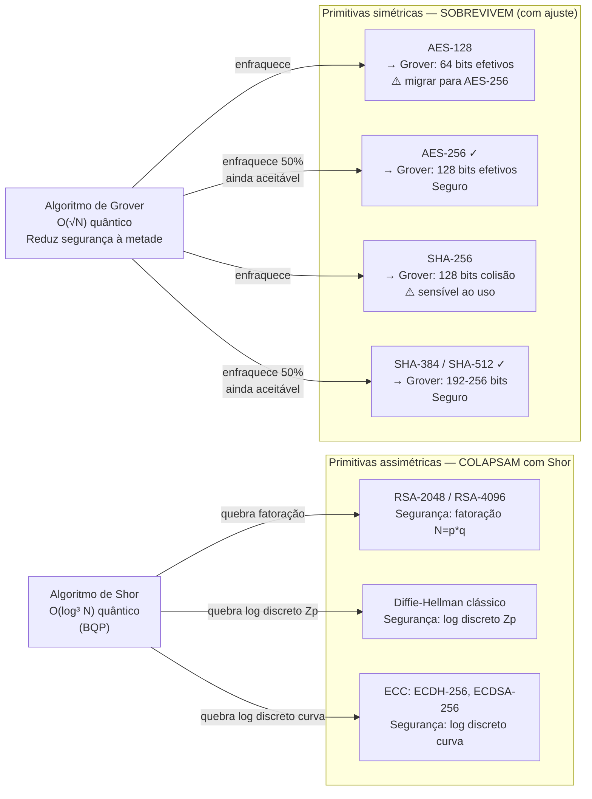
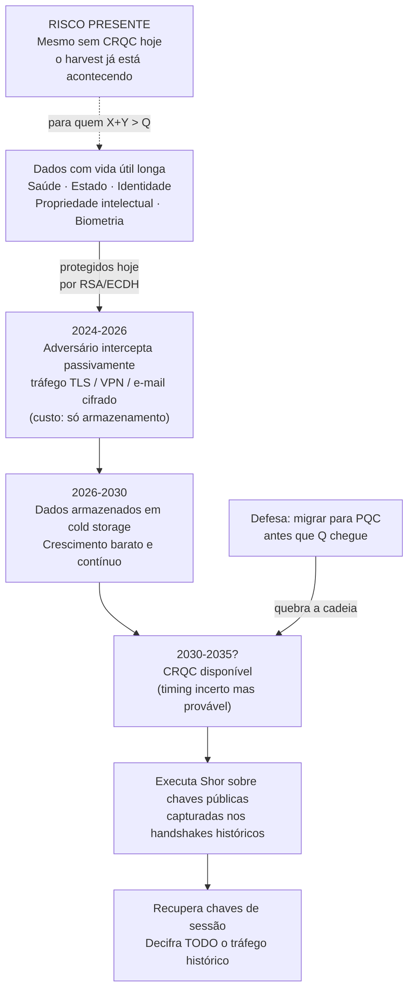
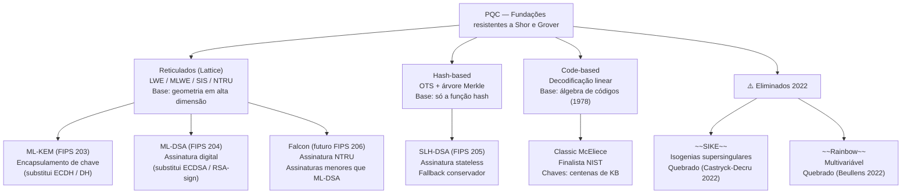
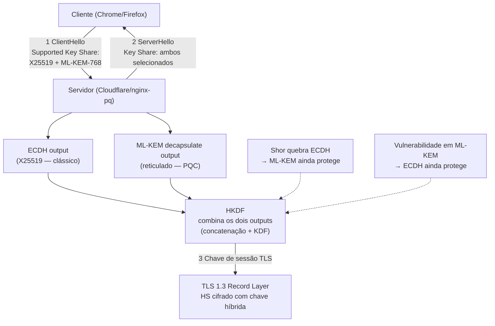
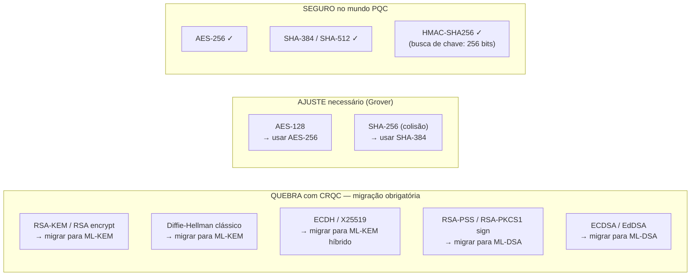

# Criptografia pós-quântica

> [!abstract] TL;DR
> Computadores quânticos suficientemente grandes quebrarão RSA, ECDH e Diffie-Hellman em tempo polinomial via algoritmo de Shor — a criptografia assimétrica inteira colapsa. A simétrica (AES-256, SHA-384) sobrevive com ajuste de tamanho. O NIST finalizou em agosto de 2024 três padrões PQC: FIPS 203 (ML-KEM/Kyber), FIPS 204 (ML-DSA/Dilithium) e FIPS 205 (SLH-DSA/SPHINCS+). Adversários com recursos já gravam tráfego cifrado hoje para decifrar no futuro ("harvest-now-decrypt-later") — dados de longa vida útil estão sob risco real agora, mesmo sem computador quântico criptograficamente relevante existir ainda.

---

## A ameaça quântica em perspectiva

Antes de entrar nos algoritmos, calibre o tamanho real do problema. Em 2026 os computadores quânticos reais pertencem à era **NISQ** — *Noisy Intermediate-Scale Quantum*: dezenas a poucos milhares de qubits físicos, com altas taxas de erro, incapazes de corrigir erros em escala. Não existe ainda o que a comunidade chama de **CRQC** — *Cryptographically Relevant Quantum Computer*, a máquina com qubits lógicos suficientes e tolerância a falhas adequada para executar o algoritmo de Shor contra alvos reais (RSA-2048 exigiria algo na ordem de milhões de qubits físicos para produzir os qubits lógicos necessários).

"Não existe hoje" não significa "sem consequências hoje". A pressão quântica atinge o presente por dois vetores independentes:

**1. Harvest-now-decrypt-later.** Adversários com capacidade de interceptação em escala (estados-nação, principalmente) coletam tráfego cifrado hoje e armazenam para decifrar quando o CRQC chegar. O custo de armazenamento é trivial comparado ao valor dos dados. Comunicações diplomáticas, segredos industriais, dados de saúde — tudo capturado hoje com RSA/ECDH já está comprometido no longo prazo.

**2. Inércia de migração.** Trocar primitivas criptográficas em sistemas reais leva décadas: HSMs precisam de novo firmware, bibliotecas de SO precisam de novas versões estáveis, protocolos de rede (TLS, SSH, IPsec) precisam de novas cipher suites, sistemas embarcados e IoT raramente recebem atualizações, e os PKIs inteiros (CAs, certificados folha, revogação) precisam de refatoração. A janela de migração é longa, o que torna urgente começar agora.

A tensão entre esses dois vetores é capturada no **Teorema de Mosca** (Michele Mosca, 2015):

```
Se  X + Y > Q  →  você tem um problema hoje
```

Onde:
- **X** = tempo que seus dados devem permanecer confidenciais (vida útil do sigilo)
- **Y** = tempo necessário para migrar seu sistema para cripto quantum-safe
- **Q** = horizonte temporal até um CRQC existir

Mosca estimou em 2015 uma probabilidade de 1/7 de um CRQC até 2026 e 1/2 até 2031. Nas revisões subsequentes essas probabilidades foram revisadas para cima com base no ritmo de avanço em correção de erros quânticos. Para segredos com vida útil de 20 anos, `X = 20`; se a migração leva `Y = 5` anos, você precisa que `Q > 25` — mas se Q é incerto, o risco não é zero.

O teorema não diz para entrar em pânico — diz para agir proporcionalmente. Uma organização com dados de sigilo de 5 anos e capacidade de migrar em 2 anos tem folga considerável se Q for 15 anos. Uma organização com dados de sigilo de 30 anos (registros médicos, identidade civil) que precisa de 10 anos para migrar já está em risco se Q for 35 anos — e 35 anos não é improvável dado o ritmo atual de avanço em QEC (*Quantum Error Correction*).

---

## Computação quântica — o mínimo necessário para entender a ameaça

Não é necessário entender física quântica profundamente, mas vale saber o que torna computadores quânticos diferentes em termos de capacidade computacional.

**Bit vs qubit.** Um bit clássico é 0 ou 1. Um qubit pode estar em **superposição**: uma combinação linear |ψ⟩ = α|0⟩ + β|1⟩ onde α e β são amplitudes complexas com |α|² + |β|² = 1. Ao medir, o qubit colapsa para 0 (com probabilidade |α|²) ou 1 (com probabilidade |β|²). A superposição não é "0 e 1 ao mesmo tempo" — é uma distribuição de probabilidade sobre estados.

**Entrelaçamento.** Dois qubits entrelaçados têm estados correlacionados independentemente da distância. Isso permite que algoritmos quânticos manipulem estados de múltiplos qubits com uma única operação, criando paralelismo exponencial — mas apenas de forma controlada.

**Interferência.** O truque central dos algoritmos quânticos: amplitudes podem interferir construtiva ou destrutivamente. Um algoritmo quântico bem projetado aumenta a amplitude das respostas corretas e cancela as erradas — o resultado da medição tende à solução certa. Shor usa interferência quântica de Fourier (Quantum Fourier Transform) para extrair o período de uma função, o que permite fatorar.

**O que não é magia:** um computador quântico não "testa todos os valores ao mesmo tempo" e retorna o melhor. A medição colapsa para um único resultado — a arte é projetar o algoritmo para que a interferência faça o correto ter amplitude alta. Algoritmos quânticos existem apenas para problemas com estrutura que permita essa manipulação de amplitudes.

**Por que isso não ameaça tudo:** problemas sem estrutura (como buscar um elemento numa lista não-ordenada) só têm o speedup quadrático de Grover. Problemas com estrutura aritmética específica (periodicidade de funções, que é o coração de fatoração e log discreto) podem ser acelerados exponencialmente por Shor via QFT.

**Tolerância a falhas é o gargalo real.** Algoritmos quânticos como Shor requerem milhões de operações quânticas coerentes. Cada porta tem taxa de erro na faixa de 0,1-1% nos melhores sistemas NISQ. Para executar Shor contra RSA-2048 com sucesso aceitável, estimativas apontam para necessidade de ~4.000 qubits lógicos, cada um implementado com ~1.000 qubits físicos para correção de erros — resultando em ~4 milhões de qubits físicos no total. O maior computador quântico hoje (2026) tem milhares de qubits físicos com taxas de erro ainda distantes do limiar de correção suficiente.

---

## Algoritmo de Shor — por que toda a assimétrica morre

Peter Shor publicou em 1994 o algoritmo que tornou o problema urgente. Em um computador quântico, ele resolve dois problemas fundamentais em **tempo polinomial**:

1. **Fatoração de inteiros**: dado N = p × q (produto de dois primos grandes), encontrar p e q.
2. **Logaritmo discreto**: dado g, h em um grupo, encontrar x tal que gˣ ≡ h (mod p).

A complexidade de Shor para fatorar um número de n bits é O(n³) em portas quânticas — polinomial. O melhor algoritmo clássico conhecido (GNFS, General Number Field Sieve) é sub-exponencial mas ainda superpolinomial: O(exp(c × n^(1/3) × (log n)^(2/3))). A diferença é abissal para n grande.

Por que isso mata a assimétrica inteira?

- **RSA** tem segurança fundada na dificuldade de fatorar N = p × q. Shor fatora em O(log³ N) quântico.
- **Diffie-Hellman clássico** (sobre Zₚ) tem segurança fundada no logaritmo discreto em grupos multiplicativos. Shor resolve.
- **ECC** — ECDH e ECDSA — tem segurança fundada no logaritmo discreto em curvas elípticas. Shor resolve na versão adaptada para grupos de curvas elípticas. ECC-256 oferece segurança equivalente a RSA-3072 classicamente; pós-Shor, ambos colapsam.

Do ponto de vista de teoria da complexidade, esses problemas vivem na classe **BQP** (*Bounded-error Quantum Polynomial time*): podem ser resolvidos por um computador quântico em tempo polinomial com probabilidade de sucesso ≥ 2/3. Classicamente, eles são presumidamente intratáveis (fora de P e provavelmente fora de BPP). Um CRQC coloca RSA-2048, ECDH-256 e DH-4096 todos em BQP — computáveis.



> [!info] Leitura do diagrama
> O quadrante esquerdo mostra as primitivas que morrem: todas dependem de problemas (fatoração ou log discreto) que Shor resolve em tempo polinomial. O quadrante direito mostra as primitivas que sobrevivem — Grover as enfraquece por um fator √N (speedup quadrático), mas não é catastrófico: dobrar o tamanho restaura a segurança. AES-256 e SHA-384/512 já satisfazem esse requisito.

---

## Algoritmo de Grover — a simétrica sobrevive, com ajuste

Lov Grover publicou em 1996 um algoritmo para **busca não-estruturada em espaço não-ordenado**: dado um oráculo O(x) que retorna 1 se x é solução e 0 caso contrário, Grover encontra a solução em O(√N) avaliações do oráculo, contra O(N) classicamente. É uma aceleração quadrática, não exponencial.

Aplicando a priori da busca à criptografia simétrica:

| Primitiva | Segurança clássica | Após Grover | Conclusão |
|---|---|---|---|
| AES-128 | 128 bits | ~64 bits efetivos | Insuficiente — migrar |
| AES-256 | 256 bits | ~128 bits efetivos | Seguro por décadas |
| SHA-256 (preimage) | 256 bits | ~128 bits | Depende do uso |
| SHA-256 (colisão) | 128 bits | ~64 bits | Marginal |
| SHA-384 (colisão) | 192 bits | ~96 bits | Seguro |
| SHA-512 (colisão) | 256 bits | ~128 bits | Seguro |

A conclusão prática: **dobrar o tamanho da chave ou da saída do hash compensa Grover inteiramente**. Por isso:

- O CNSA 2.0 da NSA **manteve AES-256 e SHA-384** sem substituição — a simétrica não precisa de novos algoritmos, apenas das variantes maiores que já existem.
- SHA-256 permanece adequado em muitos contextos (assinaturas de código, Merkle trees), mas SHA-384/512 é recomendado onde o horizonte temporal é longo.
- HMAC-SHA256 para autenticação de mensagem (segurança de 256 bits em busca de chave) é menos afetado do que hash bare para preimage.

> [!important] A distinção crítica para entrevistas
> Shor resolve problemas estruturados (fatoração, log discreto) em tempo **exponencialmente** mais rápido que qualquer clássico. Grover acelera busca cega em apenas **quadraticamente**. A diferença é fundamental: Shor torna a assimétrica computável com recursos razoáveis; Grover apenas dobra a quantidade de trabalho — defensável dobrando a chave.

---

## Harvest-now-decrypt-later — o risco que já é presente

"Colher agora, decifrar depois" descreve a estratégia de um adversário com capacidade de interceptação e paciência de décadas:

**Passo 1 — Coleta passiva (agora):** O adversário intercepta tráfego TLS, VPNs IPsec, e-mails cifrados com PGP, arquivos cifrados com RSA. Isso é passivo, deniável, e custoso apenas em armazenamento — que se torna mais barato a cada ano. Não requer nenhuma capacidade quântica.

**Passo 2 — Armazenamento (agora até Q):** Os dados cifrados ficam em cold storage. O adversário não precisa decifrar nada agora — apenas preservar.

**Passo 3 — Decifração (quando Q chegar):** Com um CRQC disponível, o adversário roda Shor contra as chaves públicas capturadas no handshake e recupera as chaves de sessão. Todo o tráfego histórico é decifrado retroativamente.



> [!info] Leitura do diagrama
> O fluxo mostra que o ataque tem três fases separadas no tempo. A primeira (coleta) já está dentro da capacidade operacional de adversários sofisticados — sem nenhuma tecnologia quântica. A defesa entra na fase intermediária: migrar para PQC antes que o CRQC exista quebra a cadeia porque o tráfego capturado passa a ser cifrado com algoritmos que Shor não toca.

**Quais dados estão mais expostos:**

- Comunicações diplomáticas e de inteligência (décadas de sigilo esperado)
- Prontuários médicos e dados genéticos (vida inteira de sigilo)
- Segredos industriais e patentes em desenvolvimento
- Dados de identidade (números de previdência, biometria)
- Chaves mestre de PKIs (comprometem tudo assinado sob aquela CA)

**O que está menos exposto:** sessões TLS efêmeras com Forward Secrecy e vida útil curta (uma compra num e-commerce) têm valor retroativo menor — mas ainda existem casos de uso onde o adversário quer saber *que* transação ocorreu, mesmo sem o conteúdo.

---

## Post-Quantum Cryptography — a nova fundação matemática

PQC designa algoritmos **clássicos** — rodando em hardware convencional, sem qubits — cujos problemas subjacentes são resistentes tanto ao algoritmo de Shor quanto ao de Grover. A estratégia não é usar física quântica para se defender: é escolher fundações matemáticas diferentes das que Shor ataca.

### Por que LWE — Learning With Errors

O problema central da família de reticulados mais adotada é o **LWE (Learning With Errors)**, introduzido por Regev em 2005:

Dado:
- Uma matriz aleatória **A** sobre Zq (inteiros módulo q)
- Um vetor **b** = **A**s + **e** (mod q), onde **s** é o segredo e **e** é um vetor de "erros" pequenos amostrados de uma distribuição gaussiana estreita

O problema: recuperar **s** a partir de (**A**, **b**).

Por que isso é hard? Sem o erro, **b** = **A**s é um sistema linear facilmente resolvível. O erro pequeno torna o sistema "ruidoso" — nenhum algoritmo clássico ou quântico conhecido consegue recuperar **s** eficientemente. A hardness do LWE tem redução a problemas sobre **reticulados** (*lattices*) — grades geométricas em espaço de alta dimensão — que são resistentes ao algoritmo de Shor porque não dependem de fatoração ou logaritmo discreto.

A variante **Module-LWE** (MLWE), usada no ML-KEM e ML-DSA, estrutura os vetores em módulos sobre anéis polinomiais, obtendo maior eficiência computacional mantendo a segurança.

A explicação em prosa acima cobre o *quê* e o *por quê* do LWE; para quem quer ver o mecanismo algébrico completo — como a hardness do LWE vira, passo a passo, o esquema de encriptação de chave pública que depois é transformado em KEM — o vídeo abaixo faz exatamente essa ponte.

> [!tip] Assista: Kyber (ML-KEM) [Post-Quantum Cryptography Explained]
> **Canal:** Cryptography 101 | **Duração:** ~9 min | **Idioma:** EN
>
> Constrói o Kyber/ML-KEM de baixo para cima, partindo do LWE: primeiro apresenta a variante *short-secret LWE* e a função de arredondamento, depois monta o esquema de encriptação de chave pública Lindner-Peikert (a versão simplificada que captura a ideia central do Kyber), e só então mostra os dois passos que levam da versão simplificada ao Kyber real — mover de inteiros para polinômios (Module-LWE) e aplicar a transformada Fujisaki-Okamoto para virar um KEM. É o complemento natural da explicação em prosa acima: mostra o mecanismo algébrico por trás da frase "a hardness do LWE reduz a reticulados".
> Trecho de destaque [0:25]: *"Kyber was standardized by NIST in August 2024 as FIPS 203. It's being deployed in TLS, SSH, and a range of other protocols as organizations start migrating away from classical key exchange."*
>
> 🎬 [Assistir no YouTube](https://www.youtube.com/watch?v=G-A1d6P_1yo)

### Famílias de algoritmos PQC

| Família | Problema base | Vantagens | Desvantagens | Representantes |
|---|---|---|---|---|
| **Reticulados (Lattice)** | LWE, MLWE, SIS, NTRU | Chaves pequenas, rápido, fundação teórica sólida | Relativamente novo (< 20 anos de estudo intenso) | ML-KEM, ML-DSA, Falcon |
| **Hash-based** | Segurança da função hash (OTS, Merkle) | Fundação minimalista, segurança bem estudada | Assinaturas grandes, stateful ou lento | SLH-DSA (SPHINCS+), XMSS |
| **Code-based** | Decodificação de código linear aleatório | 45 anos sem quebra (McEliece desde 1978) | Chaves públicas em megabytes | Classic McEliece |
| **Isogenias** | Caminhos entre curvas elípticas | Chaves muito pequenas | SIKE QUEBRADO em 2022 — cautela máxima | ~~SIKE~~ (eliminado) |
| **Multivariáveis** | Sistemas quadráticos sobre corpo finito | Assinaturas pequenas | Rainbow QUEBRADO em 2022 | ~~Rainbow~~ (eliminado) |

SIKE e Rainbow, dois candidatos do processo NIST, foram quebrados por ataques clássicos em 2022 — antes da finalização. Os detalhes desses dois casos e a lição que deixam para quem avalia algoritmos PQC novos estão em [[#Armadilhas comuns]].



> [!info] Leitura do diagrama
> As famílias PQC diferem na fundação matemática e nas trocas práticas. Reticulados dominam os padrões NIST porque oferecem o melhor balanço: chaves e assinaturas de tamanho razoável (kilobytes, não megabytes), velocidade competitiva com RSA, e fundação teórica que se beneficia de décadas de teoria de reticulados. Hash-based é o fallback minimalista: sua segurança depende apenas da função hash, hipótese mais conservadora. Code-based existe desde 1978 e nunca foi quebrado, mas as chaves enormes o tornam impraticável em muitos contextos. Isogenias foram eliminadas experimentalmente.

---

## Os padrões NIST 2024 — FIPS 203, 204 e 205

O NIST iniciou o processo de padronização PQC em 2016 com 69 candidatos. Após três rodadas de análise pública, em **agosto de 2024** finalizou os três primeiros padrões:

### FIPS 203 — ML-KEM (Module-Lattice-Based Key-Encapsulation Mechanism)

Baseado em CRYSTALS-Kyber. É o substituto de ECDH e RSA-KEM para **troca de chaves e encapsulamento**.

Como funciona em alto nível:
- **Geração de chave:** Alice gera um par (pk, sk) baseado em MLWE.
- **Encapsulamento:** Bob usa pk para gerar um ciphertext c e uma chave compartilhada K.
- **Decapsulamento:** Alice usa sk para recuperar K a partir de c.
- A segurança vem da dificuldade de recuperar K sem sk — reduz ao MLWE.

Três variantes de segurança:
| Variante | Segurança | Chave pública | Ciphertext |
|---|---|---|---|
| ML-KEM-512 | ~128 bits | 800 bytes | 768 bytes |
| ML-KEM-768 | ~192 bits | 1184 bytes | 1088 bytes |
| ML-KEM-1024 | ~256 bits | 1568 bytes | 1568 bytes |

O CNSA 2.0 exige ML-KEM-1024 para sistemas de segurança nacional.

### FIPS 204 — ML-DSA (Module-Lattice-Based Digital Signature Algorithm)

Baseado em CRYSTALS-Dilithium. Substituto de ECDSA e RSA-PSS para **assinaturas digitais**.

Baseado em SIS (*Short Integer Solution*) e MLWE. O esquema de assinatura usa rejeição de amostras (*rejection sampling*) para garantir que as assinaturas não vazem informação sobre a chave privada — detalhe de implementação crítico.

Três variantes:
| Variante | Segurança | Chave privada | Assinatura |
|---|---|---|---|
| ML-DSA-44 | ~128 bits | 2528 bytes | 2420 bytes |
| ML-DSA-65 | ~192 bits | 4032 bytes | 3309 bytes |
| ML-DSA-87 | ~256 bits | 4896 bytes | 4627 bytes |

### FIPS 205 — SLH-DSA (Stateless Hash-Based Digital Signature Algorithm)

Baseado em SPHINCS+. É o **fallback conservador**: sua segurança depende apenas de propriedades da função hash (resistência a preimage, colisão), sem nenhuma hipótese sobre reticulados. Se amanhã surgir um ataque a reticulados que quebre ML-DSA, SLH-DSA permanece seguro.

Desvantagens: assinaturas maiores (8–50 KB dependendo de variante) e mais lentas. É mais adequado como backup ou para contextos onde o custo de validação é aceitável (firmware signing, certificados de longa duração).

### Falcon — futuro FIPS 206

Baseado em NTRU (família de reticulados). Produz assinaturas menores que ML-DSA (~666 bytes para segurança de 128 bits), o que o torna atrativo para ambientes restritos. A desvantagem é a implementação: requer *Gaussian sampling* sobre inteiros, que é sutil de implementar com constant-time e sem side-channels. Isso atrasa sua adoção em ambientes sem bibliotecas auditadas.

---

## Migração — cripto-agilidade e esquemas híbridos

### Cripto-agilidade

*Crypto-agility* é o princípio de design que permite **trocar o algoritmo criptográfico sem reescrever a lógica de negócio**. É o oposto do hardcode de primitivas que tornou a migração de MD5 e SHA-1 tão dolorosa.

Para PQC, cripto-agilidade significa:
- Negociar o algoritmo no handshake de protocolo (TLS já faz isso com cipher suites).
- Abstrair primitivas em interfaces de biblioteca (JCA providers, PKCS#11, OpenSSL ENGINE).
- Separar identificadores de algoritmo de código que os usa — trocar o identificador deve ser suficiente.
- Auditar onde primitivas estão hardcoded (especialmente em código de serialização de objetos, geração de chaves e verificação de assinaturas).

### Esquemas híbridos — não apostar tudo num algoritmo novo

A recomendação atual de organizações como NIST, Cloudflare e BSI alemão é usar **esquemas híbridos**: combinar uma troca de chave clássica com uma PQC. A chave final é derivada combinando os dois outputs:

```
Chave_final = HKDF(Clássico_ECDH_output ‖ ML-KEM_output)
```

A segurança do esquema é a **intersecção** das hipóteses: o atacante precisa quebrar ambos simultaneamente.
- Se Shor existir e ECDH cair → ML-KEM ainda protege.
- Se ML-KEM tiver vulnerabilidade matemática desconhecida hoje → ECDH ainda protege.

Isso é especialmente importante durante a transição, quando ML-KEM ainda tem menos de uma década de análise em produção e pode ter vulnerabilidades não descobertas.



> [!info] Leitura do diagrama
> O handshake TLS híbrido executa duas trocas de chave em paralelo no mesmo ClientHello, depois combina os resultados via HKDF. Do ponto de vista do servidor, é uma extensão natural das cipher suites TLS 1.3 — negociável sem quebrar compatibilidade com clientes que só suportam X25519. A latência adicional é pequena: ML-KEM-768 tem custo computacional comparável ao ECDH-256 e o ciphertext extra (∼1 KB) é marginal.

### Adoção em produção (2026)

- **Cloudflare**: X25519+ML-KEM-768 em GA desde 2024 para todos os clientes — ~6 milhões de domínios automaticamente protegidos.
- **Chrome**: ML-KEM habilitado por padrão em Canary desde mid-2023, em Stable desde Chrome 131 (2024).
- **Firefox**: suporte a X25519Kyber768 desde Firefox 128 (2024).
- **Signal**: migrou para PQXDH (X25519 + Kyber) em setembro de 2023 — primeiro mensageiro de larga escala com PQC.
- **Apple iMessage**: PQ3 protocol (combinação com Kyber) anunciado em fevereiro de 2024, com re-keying periódico.

### Desafios práticos de migração

**Tamanho dos dados.** ML-KEM-768 tem ciphertext de 1088 bytes vs ~32 bytes do ECDH-256. Isso aumenta o tamanho do ClientHello do TLS — problemático em redes com MTU restrito ou handshakes frequentes.

**HSMs e hardware criptográfico.** HSMs (*Hardware Security Modules*) que hoje executam ECDSA precisam de firmware novo ou substituição de hardware. Muitos HSMs legados simplesmente não suportarão ML-DSA.

**Certificados PKI.** Uma CA que assina com ECDSA-256 precisará migrar para ML-DSA — o que invalida o caminho de confiança de todos os certificados emitidos. A migração de PKI envolve re-emissão em cascata de raízes, intermediárias e certificados folha.

**Código legado.** Sistemas que hardcodaram o OID de curva elíptica ou o tamanho de chave RSA precisam de refatoração — o oposto de cripto-agilidade.

**Teste e auditoria.** Implementações de ML-KEM e ML-DSA são mais complexas que RSA ou ECDSA. Bibliotecas auditadas (liboqs, BouncyCastle PQC, OpenSSL 3.x com oqs-provider) ainda estão amadurecendo.

---

## Impacto por primitiva — mapa completo



> [!info] Leitura do diagrama
> Três zonas de ação. Zona vermelha: toda primitiva que depende de fatoração ou log discreto — precisa ser substituída por ML-KEM (troca de chave) ou ML-DSA/SLH-DSA (assinatura). Zona amarela: AES-128 e SHA-256 em alguns contextos — precisam migrar para variantes maiores, mas não há urgência quântica imediata já que Grover requer hardware quântico inexistente. Zona verde: já adequado — nenhuma ação além de manter.

> [!tip] Inventário pré-migração
> Antes de migrar, a organização precisa saber *onde* cada primitiva está em uso. Ferramentas de CBOM (*Cryptography Bill of Materials*) — analogas a um SBOM mas para algoritmos criptográficos — estão emergindo (CoSBOM, IBM Cryptography Discovery) para mapear automaticamente dependências de cripto em código e configuração. O NIST IR 8547 (rascunho) orienta esse inventário.

---

## Cronograma e status honesto (2026)

| Marco | Status / Data |
|---|---|
| NIST seleciona candidatos finais | 2022 (Kyber, Dilithium, Falcon, SPHINCS+) |
| SIKE e Rainbow quebrados (clássico) | Julho e outubro 2022 |
| FIPS 203, 204, 205 finalizados | Agosto 2024 |
| Chrome/Firefox: ML-KEM em produção | 2024 (ambos em stable) |
| Cloudflare: PQC GA para todos os domínios | 2024 |
| NSA CNSA 2.0 v2.1 (nomes FIPS oficiais) | Dezembro 2024 |
| Novos sistemas NSS: CNSA 2.0 obrigatório | 1 jan 2027 |
| Software/firmware NSS: CNSA 2.0 completo | 2030 |
| Transição completa NSS | 2031-2035 |

A calibração honesta sobre o tamanho real da ameaça — o que exagerar e o que não minimizar — está detalhada em [[#Armadilhas comuns]].

---

## Casos práticos

A teoria de Shor, Grover e LWE explica *por que* a assimétrica clássica morre e *por que* os reticulados resistem — mas o trabalho de um engenheiro sênior não para na teoria. Os três casos abaixo são decisões que já aconteceram (ou já estão acontecendo) em produção, e cada um ilustra uma faceta diferente do mesmo problema: como agir sob incerteza quando o algoritmo "certo" ainda tem menos de uma década de escrutínio.

**Caso 1 — SIKE: o candidato que caiu num laptop, não num computador quântico.** Em julho de 2022, o SIKE (Supersingular Isogeny Key Encapsulation) era um dos finalistas do processo NIST — um esquema atrativo justamente por gerar chaves muito menores que os concorrentes baseados em reticulados. Castryck e Decru publicaram um ataque puramente **clássico**, rodando numa CPU única: SIKEp434 caiu em cerca de 1 hora, SIKEp751 em cerca de 21 horas. O ataque não explorou nenhuma fraqueza exótica — explorou justamente a informação extra sobre pontos de torção (*torsion points*) que o SIDH expunha para ganhar eficiência. A mesma característica que tornava o esquema rápido e compacto era a porta de entrada do ataque. Ward Beullens quebrou o Rainbow (assinaturas multivariáveis) por um caminho diferente, mas com a mesma lição: ambos eram finalistas do NIST, com anos de escrutínio público, e ainda assim caíram para criptoanálise clássica antes de virarem padrão. Para um engenheiro decidindo qual biblioteca PQC adotar hoje, a lição prática é dupla: preferir os algoritmos que **de fato** viraram FIPS (ML-KEM, ML-DSA, SLH-DSA) em vez de candidatos "quase padronizados", e nunca hardcodar um único algoritmo PQC como fundação exclusiva de um sistema de longa vida — é exatamente o argumento a favor de esquemas híbridos (ver "Migração — cripto-agilidade e esquemas híbridos" acima).

**Caso 2 — Habilitar PQC híbrido num TLS terminator de produção.** Imagine o cenário de um engenheiro responsável pelo edge de uma aplicação com tráfego global, decidindo se e quando habilitar troca de chave híbrida (X25519 + ML-KEM-768) no TLS. Cloudflare colocou X25519+ML-KEM-768 em disponibilidade geral desde 2024 para todos os seus domínios — cerca de 6 milhões de domínios passaram a negociar PQC automaticamente sempre que o cliente suporta. Chrome habilitou ML-KEM por padrão a partir da versão 131 (2024) e o Firefox a partir da versão 128 — ambos entram na negociação de cipher suite do TLS 1.3 sem quebrar compatibilidade com clientes mais antigos, porque o handshake simplesmente negocia o conjunto de key shares que ambos os lados suportam. Na prática, o trade-off que o engenheiro avalia não é "PQC sim ou não" — é o aumento do ClientHello (o ciphertext do ML-KEM-768 soma ~1088 bytes contra ~32 bytes do ECDH-256 puro), que pode importar em redes com MTU restrito ou em handshakes muito frequentes, contra o risco de manter só ECDH num sistema com tráfego de vida útil longa. Signal já tinha feito essa escolha antes: migrou para PQXDH (X25519 + Kyber) em setembro de 2023, tornando-se o primeiro mensageiro de larga escala com PQC em produção — decisão coerente com o modelo de ameaça de mensageria (conversas privadas com expectativa de sigilo por décadas).

**Caso 3 — Descobrir onde RSA e ECDSA estão escondidos antes de migrar.** Antes de qualquer um dos dois cenários acima ser sequer possível, uma organização precisa responder uma pergunta aparentemente banal e na prática difícil: onde, exatamente, o sistema usa criptografia assimétrica hoje? Certificados TLS são o caso óbvio, mas RSA e ECDSA também aparecem em lugares menos visíveis — assinatura de firmware, verificação de pacotes de software, tokens de autenticação embarcados em protocolos internos, chaves SSH de deploy, e bibliotecas de terceiros que hardcodaram uma curva elíptica específica sem expor isso na API pública. É exatamente o problema que motivou o surgimento de ferramentas de **CBOM** (*Cryptography Bill of Materials* — análogo criptográfico do SBOM de dependências de software): mapear automaticamente onde cada primitiva está em uso no código e na configuração, para que a migração não dependa de um engenheiro lembrando de cada lugar. O NIST IR 8547 (rascunho) orienta esse inventário como pré-requisito da migração, não como etapa opcional — sem ele, a organização não sabe nem o tamanho do trabalho que tem pela frente, e a migração vira uma sequência de descobertas em produção em vez de um plano executável.

Os três casos formam uma sequência natural: primeiro descobrir onde a criptografia assimétrica está (Caso 3), depois decidir com que cautela adotar cada substituto novo (Caso 1), e só então executar a migração em produção de forma incremental e híbrida (Caso 2). Pular a ordem — migrar sem inventário, ou confiar cegamente num algoritmo recém-padronizado sem hybrid — é o padrão comum aos erros descritos na próxima seção.

Nenhum dos três casos exige que a organização já tenha um CRQC batendo à porta para justificar o investimento — o próprio Teorema de Mosca, discutido no início desta nota, é o argumento formal para agir antes que a ameaça esteja provada.

---

## Armadilhas comuns

As três armadilhas abaixo cobrem os erros mais comuns de quem chega agora ao tema: confiar demais num algoritmo novo sem escrutínio suficiente, errar a calibração de urgência (para os dois lados), e tratar migração criptográfica como se fosse troca de dependência de uma linha só.

> [!warning] SIKE e Rainbow — cautela com algoritmos PQC novos
> Em 2022, dois candidatos do processo NIST foram quebrados por ataques **clássicos** antes da finalização:
>
> **SIKE** (Supersingular Isogeny Key Encapsulation): Castryck e Decru publicaram em julho de 2022 um ataque que recupera a chave secreta em horas numa CPU única — SIKEp434 em ~1h, SIKEp751 em ~21h. O ataque explora informação extra sobre pontos de torção (*torsion points*) que o SIDH expunha para eficiência. A ironia: a própria feature que tornava o SIDH prático criou a vulnerabilidade.
>
> **Rainbow**: Ward Beullens demonstrou em 2022 um ataque de forgery prático. Ambos os casos ilustram que algoritmos PQC têm décadas de análise criptográfica a menos que RSA/ECC — o processo NIST foi projetado para filtrar, mas não é infalível.

> [!warning] Postura honesta sobre a ameaça
> **Não exagere**: não existe CRQC hoje. Nenhum ator quebrou RSA em produção com computador quântico. Afirmar "RSA está morto" em 2026 é impreciso.
>
> **Não minimize**: o harvest-now-decrypt-later é operacional para adversários com recursos. A migração leva décadas. Para dados com vida útil ≥ 10 anos protegidos hoje com ECDH, a ameaça é real e presente.
>
> A calibração correta: **urgência proporcional à vida útil do dado e ao custo de migração**. Infraestrutura crítica, dados de saúde, comunicações governamentais — migrar agora. Cache de sessão de web app de 5 minutos — baixa prioridade imediata.

> [!warning] Tratar PQC como troca de algoritmo, não troca de sistema
> O erro mais comum de quem chega agora à migração é imaginar que trocar RSA/ECDSA por ML-KEM/ML-DSA é só apontar para uma biblioteca diferente. Na prática, cada camada do sistema tem uma restrição própria: HSMs que hoje executam ECDSA muitas vezes não suportam ML-DSA sem firmware novo (ou substituição de hardware); uma CA que assina com ECDSA-256 precisa migrar para ML-DSA, o que invalida a cadeia de confiança inteira e obriga a re-emissão em cascata de raízes, intermediárias e certificados folha; e código que hardcodou o OID da curva elíptica ou o tamanho de chave RSA — o oposto de cripto-agilidade — quebra em silêncio quando o algoritmo muda por baixo. Tratar a migração como "troca de biblioteca" subestima o trabalho real: ela é um projeto de infraestrutura de PKI, não um patch.
>
> É o mesmo erro, em escala reduzida, que o Caso 3 acima descreve: sem inventário de onde a cripto vive, a organização descobre essas restrições uma a uma, em produção, em vez de num plano.

---

## O que vem a seguir

Esta nota fechou o argumento de por que a criptografia assimétrica clássica tem prazo de validade e como a engenharia responde a isso — reticulados, esquemas híbridos, cripto-agilidade. Mas PQC é só um capítulo dentro de uma pergunta maior: o que significa, na prática do dia a dia, ser o engenheiro responsável pela segurança de um sistema — não o especialista que escreve o algoritmo, mas quem decide quando migrar, o que priorizar, e como comunicar risco para quem não é criptógrafo. [[22 - Capstone - segurança como engenheiro]] fecha o galho de Segurança amarrando esse fio: como as notas anteriores (ameaças, criptografia, autenticação, privacidade, e agora PQC) se combinam na cabeça de quem precisa tomar decisões de segurança sob incerteza, prazo e orçamento reais.

Vale notar que a migração PQC não é um problema isolado de criptografia — ela atravessa PKI, gestão de identidade e a camada de transporte que a maioria dos sistemas trata como invisível. Quando o Caso 3 acima fala em inventariar onde RSA/ECDSA estão escondidos, é o mesmo tipo de exercício que aparece na gestão de certificados e chaves em qualquer stack de autenticação — o capstone é o lugar onde essa lente de "onde a cripto vive no sistema" se conecta ao resto do galho de Segurança de forma prática, não só teórica.

- Anterior: [[20 - Privacidade, anonimato e metadados]]
- Próxima: [[22 - Capstone - segurança como engenheiro]]
- Fundação vulnerável: [[08 - Criptografia assimétrica]] — RSA, ECDH, ECDSA; tudo que Shor quebra via fatoração e log discreto
- O que sobrevive: [[07 - Criptografia simétrica]] — AES-256 e por que o speedup quadrático de Grover não é catastrófico
- Onde o handshake híbrido acontece na prática: [[05 - TLS e HTTPS]] — o protocolo que carrega X25519+ML-KEM-768 no ClientHello

---

> [!summary] Resumo em uma linha
> O algoritmo de Shor resolve fatoração e log discreto em tempo polinomial quântico, matando toda a criptografia assimétrica; a resposta é migrar para PQC baseado em reticulados (ML-KEM/ML-DSA, FIPS 203/204) e hash (SLH-DSA, FIPS 205), com esquemas híbridos clássico+PQC durante a transição — e agir agora porque adversários já executam harvest-now-decrypt-later sobre tráfego cifrado com ECDH.

---

## Em entrevista

Criptografia pós-quântica sinaliza maturidade em segurança — candidatos que entendem *por que* a assimétrica morre (não apenas que morre) e qual é o status real da ameaça (sem hype) se destacam. Os pontos de diferenciação:

*"Shor runs in polynomial time — O(log³ N) — on a quantum computer and solves both integer factorization and discrete logarithm. Since RSA relies on factoring, DH on discrete log over finite fields, and ECC on discrete log over elliptic curves, all three collapse. Grover only gives a quadratic speedup on unstructured search, so symmetric crypto survives by doubling key sizes — AES-256 and SHA-384 are already sufficient."*

*"The harvest-now-decrypt-later threat is the reason to act now even without a CRQC. State-level adversaries can record TLS handshakes today and decrypt them once a CRQC exists. For data with a 20-year secrecy requirement, the risk is present today."*

*"NIST finalized FIPS 203, 204, and 205 in August 2024 — ML-KEM for key encapsulation, ML-DSA for digital signatures, and SLH-DSA as a conservative hash-based fallback. SIKE was broken in 2022 by a classical attack in hours on a laptop — it's a reminder that PQC candidates can fall to classical cryptanalysis too, which is why we needed the NIST process."*

*"Current best practice is hybrid key exchange: combine classical ECDH with ML-KEM so neither is a single point of failure. Chrome and Cloudflare already deploy X25519+ML-KEM-768 in production. If ML-KEM has an unknown weakness, ECDH still protects; if Shor becomes practical, ML-KEM still protects."*

*"Crypto-agility is the architectural principle that makes migration tractable: abstract cryptographic primitives behind negotiable interfaces so you can swap the algorithm without rewriting business logic — exactly what TLS cipher suites do."*

**Vocabulário PT → EN:**

| Português | Inglês |
|---|---|
| Criptografia pós-quântica | Post-quantum cryptography (PQC) |
| Computador quântico criptograficamente relevante | Cryptographically relevant quantum computer (CRQC) |
| Reticulado / rede cristalina | Lattice |
| Aprendizado com erros | Learning with errors (LWE) |
| Encapsulamento de chave | Key encapsulation mechanism (KEM) |
| Colher agora, decifrar depois | Harvest-now-decrypt-later |
| Cripto-agilidade | Crypto-agility |
| Esquema híbrido | Hybrid scheme |
| Isogenia supersingular | Supersingular isogeny |
| Aceleração quadrática | Quadratic speedup |
| Tempo polinomial | Polynomial time |
| Módulo de aprendizado com erros | Module learning with errors (MLWE) |
| Tolerância a falhas quântica | Quantum error correction (QEC) |
| Rejeição de amostras | Rejection sampling |

---

## Fontes

Papers originais dos dois algoritmos que motivam a migração, o anúncio oficial dos padrões NIST, o paper do ataque que quebrou o SIKE, e os dois relatórios de adoção em produção citados ao longo da nota:

1. **Shor, P.** (1994). "Algorithms for Quantum Computation: Discrete Logarithms and Factoring." *FOCS 1994*. [arxiv.org/abs/quant-ph/9508027](https://arxiv.org/abs/quant-ph/9508027)
2. **Grover, L.** (1996). "A Fast Quantum Mechanical Algorithm for Database Search." *STOC 1996*. [arxiv.org/abs/quant-ph/9605043](https://arxiv.org/abs/quant-ph/9605043)
3. **NIST** (2024). "NIST Releases First 3 Finalized Post-Quantum Encryption Standards." FIPS 203 (ML-KEM), FIPS 204 (ML-DSA), FIPS 205 (SLH-DSA). [nist.gov/news-events/news/2024/08/nist-releases-first-3-finalized-post-quantum-encryption-standards](https://www.nist.gov/news-events/news/2024/08/nist-releases-first-3-finalized-post-quantum-encryption-standards)
4. **Castryck, W. & Decru, T.** (2022). "An Efficient Key Recovery Attack on SIDH." *IACR ePrint 2022/975*. [eprint.iacr.org/2022/975](https://eprint.iacr.org/2022/975)
5. **Cloudflare** (2024). "The state of the post-quantum Internet." Relatório de adoção de ML-KEM em TLS. [blog.cloudflare.com/pq-2024](https://blog.cloudflare.com/pq-2024/)
6. **NSA** (2022, rev. dez/2024). "Commercial National Security Algorithm Suite 2.0 (CNSA 2.0) v2.1." [media.defense.gov — CSA CNSA 2.0 Algorithms PDF](https://media.defense.gov/2025/May/30/2003728741/-1/-1/0/CSA_CNSA_2.0_ALGORITHMS.PDF)
7. **Cryptography 101** (canal, 2026). "Kyber (ML-KEM) [Post-Quantum Cryptography Explained]." [youtube.com/watch?v=G-A1d6P_1yo](https://www.youtube.com/watch?v=G-A1d6P_1yo)
