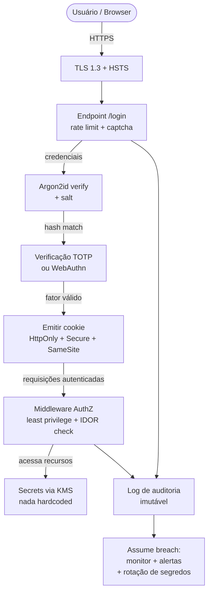
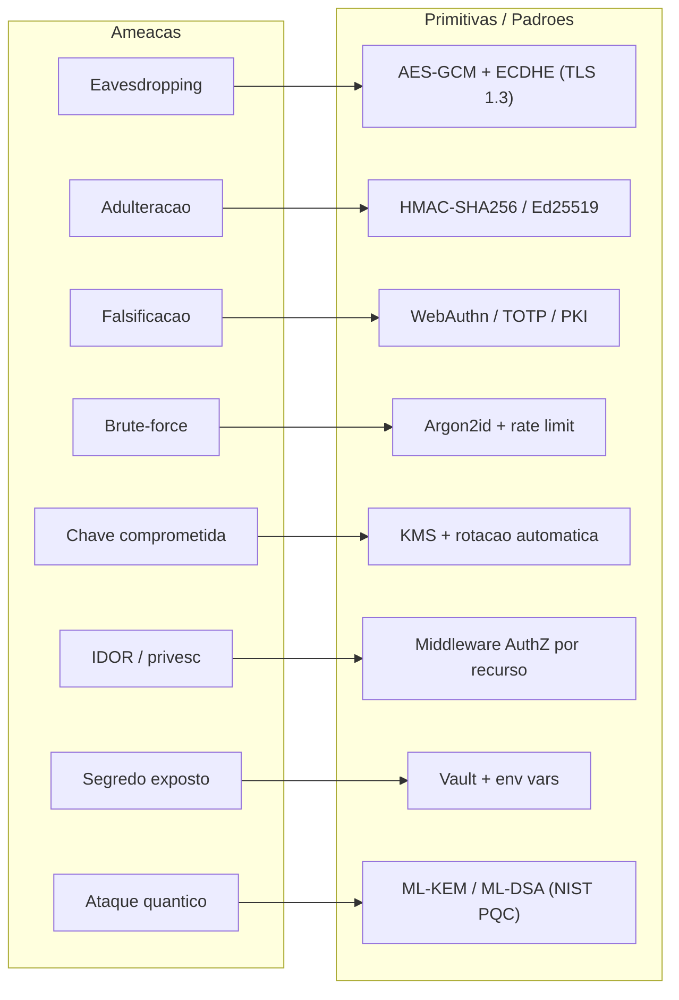
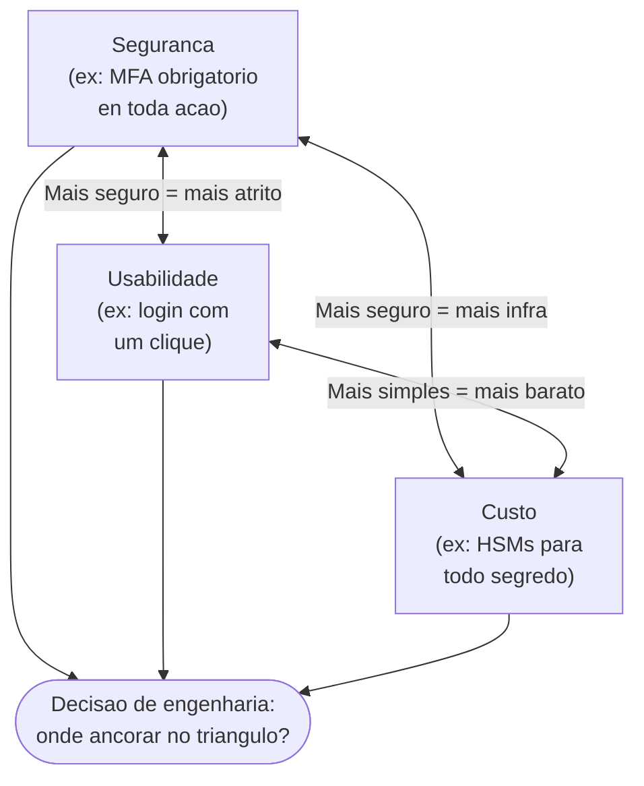
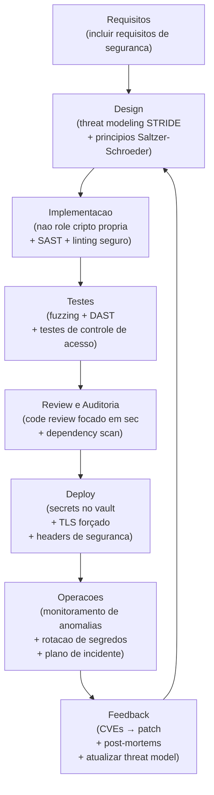

# Capstone - segurança como engenheiro

> [!abstract] TL;DR
> Segurança não é uma feature que você liga na última sprint — é uma propriedade emergente de sistemas projetados sob a hipótese de adversário inteligente. Este capstone costura o galho inteiro: do mindset adversarial às primitivas criptográficas, dos modelos de identidade aos ataques reais, da confiança transitiva ao futuro pós-quântico. O worked example de um sistema de login mostra onde cada conceito aterra; a cheat-sheet ameaça→defesa→primitiva vira sua cola de entrevista; as meta-lições ficam.

---

## A grande ideia recapitulada

Existe uma frase de Ross Anderson que resume o campo: *"Security engineering is about building systems to remain dependable in the face of malice, error, or mischance."* Note o que está implícito: o adversário é inteligente, adapta-se, e o sistema precisa ser projetado *antes* de saber qual ataque virá.

Isso significa que segurança é:

- **Propriedade emergente** — nasce do design, não é instalada depois (nota 01).
- **Trade-off gerenciado** — confidencialidade × disponibilidade × custo × usabilidade. Não existe segurança absoluta (nota 03).
- **Processo adversarial contínuo** — não um estado. O modelo de ameaça muda quando o negócio muda.
- **Problema humano** — o elo mais fraco quase sempre é a pessoa, não o algoritmo (nota 03).

A tríade CIA (Confidencialidade, Integridade, Disponibilidade) é o vocabulário mínimo. Mas entender *por que* esses três valores ficam em tensão é o que separa o engenheiro do checklist-follower: criptografar tudo aumenta Confidencialidade mas pode reduzir Disponibilidade (latência, custo de chave). Assinar tudo aumenta Integridade mas tem custo. Backup aumenta Disponibilidade mas cria mais superfície para vazamento.

O vocabulário completo acrescenta AAA (Authentication, Authorization, Accounting), não-repúdio e autenticidade — mas a tríade CIA continua sendo o ponto de entrada para modelar qualquer problema de segurança.

---

## Mapa de recapitulação das 22 notas por fase

```mermaid
graph LR
    subgraph INICIADO["Fase Iniciado — Mindset e Fundamentos"]
        N01["01 · O que é segurança"]
        N02["02 · Pensar como adversário"]
        N03["03 · Economia e fator humano"]
        N04["04 · Princípios de design seguro"]
        N05["05 · Aleatoriedade e segredos"]
    end
    subgraph ADEPTO["Fase Adepto — Primitivas e Identidade"]
        N06["06 · Hashing criptográfico"]
        N07["07 · Criptografia simétrica"]
        N08["08 · Criptografia assimétrica"]
        N09["09 · Troca de chaves"]
        N10["10 · MAC, HMAC e assinaturas"]
        N11["11 · PKI e certificados"]
        N12["12 · Autenticação"]
        N13["13 · Autorização e controle de acesso"]
        N14["14 · Cripto em trânsito e em repouso"]
    end
    subgraph MAGUS["Fase Magus — Sistemas, Ataques e Futuro"]
        N15["15 · Ataques a sistemas cripto"]
        N16["16 · Classes de vulnerabilidade"]
        N17["17 · Confiança transitiva"]
        N18["18 · Gestão de segredos"]
        N19["19 · Zero trust e def. em profundidade"]
        N20["20 · SDL e DevSecOps"]
        N21["21 · Cripto pós-quântica"]
        N22["22 · Capstone (você está aqui)"]
    end
    INICIADO --> ADEPTO --> MAGUS
```



> [!info] Leitura do diagrama
> Cada fase corresponde a um nível de maturidade: Iniciado cobre o *porquê* e o mindset; Adepto ensina as ferramentas criptográficas e de identidade; Magus conecta tudo em sistemas reais, adversários reais e tendências. Leia em ordem na primeira passagem; use como referência circular depois.

---

## Worked example — threat model de um sistema de login

Nada materializa o pensamento de segurança como um sistema concreto. Vamos percorrer um sistema de autenticação web do zero, sem pular etapas.

### O que estamos protegendo

Antes de pensar em ataques, o engenheiro lista os **ativos** (o que tem valor):

| Ativo | Impacto se comprometido |
|---|---|
| Credenciais (senha, token) | Acesso não autorizado à conta |
| Sessão ativa (cookie/JWT) | Sequestro de sessão sem saber a senha |
| Dados do perfil (PII) | Vazamento de dados, GDPR, reputação |
| Fluxo de autenticação | Bypass de autenticação |
| Logs de acesso | Cobertura de trilha após ataque |

### Modelo de ameaça com STRIDE

STRIDE (nota 02) mapeia *categorias* de ameaça a *componentes* do sistema:

| Categoria STRIDE | Ameaça concreta no login |
|---|---|
| Spoofing (falsificação) | Atacante se passa por usuário legítimo |
| Tampering (adulteração) | Alteração do token JWT após emissão |
| Repudiation (repúdio) | Usuário nega ter feito login; log ausente |
| Information disclosure | Credenciais em log, erro verbose vaza estrutura |
| Denial of service | Brute-force trava conta ou derruba endpoint |
| Elevation of privilege | Usuário comum acessa rota de admin |

### Ponta a ponta — onde cada nota aterra

**Camada de senha (notas 05 e 06)**

Nunca armazene senha em texto claro, nunca use MD5 ou SHA-1 sem salt. O problema com hashes rápidos é que uma GPU moderna calcula ~10¹⁰ SHA-256 por segundo — a senha "Senha@123" é quebrada em milissegundos por dicionário. A solução é usar uma função de derivação lenta com parâmetros de custo ajustáveis:

- `Argon2id` com `memory ≥ 64 MB`, `iterations ≥ 3`, `parallelism = 4` — vencedor do Password Hashing Competition (2015), recomendação atual OWASP.
- Salt aleatório de 128 bits por usuário (nota 05): impede rainbow tables e isola hashes mesmo com senhas iguais.
- Nunca compare hashes com `==` — use comparação em tempo constante para evitar timing attacks (nota 15).

**Multi-fator e passkeys (nota 12)**

Senha sozinha não é suficiente. O segundo fator deve ser de *categoria diferente* (algo que você *tem*):

- TOTP (RFC 6238) — código rotativo de 30 s, compartilhado como segredo HMAC (nota 10).
- WebAuthn/passkeys — desafio-resposta via chave pública, resistente a phishing porque a chave é vinculada à origem. Substitui senha + TOTP em um único gesto.

**Transporte (nota 14)**

Toda comunicação usa TLS 1.3. Por quê 1.3 e não 1.2? O handshake de 1.3 é mais simples (menos round-trips), remove cifras legadas (RC4, 3DES, exportadas) e estabelece forward secrecy *por padrão* via ECDHE — se a chave privada do servidor vazar amanhã, tráfego capturado hoje não é decriptável. Configure HSTS (`Strict-Transport-Security: max-age=31536000; includeSubDomains`) para garantir que browsers não caiam em downgrade.

**Cookies de sessão**

Após autenticação bem-sucedida, o servidor emite um token de sessão (ou JWT assinado com HMAC-SHA256/Ed25519). O cookie precisa de três atributos obrigatórios:

- `HttpOnly` — JavaScript não lê o cookie; mitiga XSS.
- `Secure` — só transmitido em HTTPS.
- `SameSite=Strict` (ou `Lax`) — mitiga CSRF.

**Autorização e IDOR (nota 13)**

Autenticação responde "quem é você?"; autorização responde "o que você pode fazer?". IDOR (Insecure Direct Object Reference) é o erro de confundir os dois: o endpoint `/api/pedidos/4521` retorna o pedido sem checar se o usuário autenticado *é dono* daquele pedido. Corrija com verificação explícita de ownership em cada acesso, não só no login.

```
// Errado — confia que o frontend só manda IDs do próprio usuário
GET /api/pedidos/4521

// Correto — backend valida que session.userId == pedido.userId
if pedido.userId != session.userId:
    raise Forbidden()
```

Princípio: least privilege (nota 04) — o token de sessão só deve carregar as permissões necessárias para a operação em curso.

**Gestão de segredos (nota 18)**

Segredos nunca em código-fonte: `DATABASE_URL=postgres://...` no `.env` commitado é um clássico de breach. O modelo correto:

- Desenvolvimento: variáveis de ambiente injetadas pelo runtime.
- Produção: KMS (AWS KMS, HashiCorp Vault, GCP KMS) — a chave mestra nunca sai do HSM; a aplicação pede decriptação ao serviço.
- Rotação automatizada: quando o segredo vaza, rotação imediata invalida o anterior. KMS com envelope encryption torna isso transparente.

**Defesa em profundidade e assume breach (nota 19)**

Mesmo com tudo acima, assuma que alguém vai entrar. Isso não é pessimismo — é design honesto:

- Rate limiting no endpoint de login: máx. 5 tentativas / IP / 30 s, com backoff exponencial.
- Bloqueio temporário de conta após N falhas consecutivas (cuidado: pode ser usado para DoS; prefira throttle + captcha).
- Log de auditoria imutável: quem logou, quando, de onde.
- Microsegmentação: o serviço de autenticação não acessa diretamente o banco de dados de pagamento.
- Zero trust: cada chamada interna entre serviços é autenticada e autorizada, mesmo dentro do mesmo VPC.



> [!info] Leitura do diagrama
> O fluxo mostra a jornada de uma autenticação segura da ponta à ponta. Cada seta é um ponto onde algo pode falhar; cada caixa nomeia o mecanismo de defesa correspondente. Não pule nenhum passo — cada um fecha uma categoria diferente de ameaça STRIDE.

---

## Cheat-sheet — ameaça → defesa → primitiva

| Ameaça | Defesa | Primitiva / Padrão |
|---|---|---|
| Escuta / eavesdropping | Cifrar em trânsito | TLS 1.3 + AES-256-GCM + ECDHE |
| Adulteração de dados | Integridade / MAC | HMAC-SHA256 · Ed25519 |
| Falsificação de identidade | Autenticação forte | Passkeys · PKI · TOTP |
| Força bruta de senha | Hashing lento + rate limit | Argon2id · bcrypt cost≥12 |
| Replay de sessão | Token com validade + nonce | JWT exp · SameSite cookies |
| Reutilização de nonce | Nonce único por operação (nota 07) | IV aleatório 96-bit (GCM) |
| Chave comprometida | Rotação automática · forward secrecy | KMS + ECDHE efêmero |
| Phishing de credenciais | Autenticação vinculada à origem | WebAuthn · FIDO2 |
| Injeção (SQL/XSS/etc.) | Validar + escapar + CSP | Prepared statements · DOMPurify |
| IDOR / escalonamento | AuthZ explícita por recurso | Middleware de ownership |
| Segredo no código-fonte | Vault externo + rotação | HashiCorp Vault · AWS Secrets Manager |
| Certificado falso | PKI com CT logs | HPKP retirado → CT + DANE |
| Ataque quântico futuro | Cripto-agilidade + PQC (nota 21) | ML-KEM · ML-DSA (NIST FIPS 203/204) |
| Confiança transitiva | Minimizar TCB · verify supply chain | SLSA · SBOM · Trusting Trust (nota 17) |
| Vulnerabilidade de memória | Linguagens safe · fuzzing | Rust · ASan · OWASP Top 10 |



> [!info] Leitura do diagrama
> Cada ameaça à esquerda mapeia diretamente à primitiva ou padrão que a mitiga. Use esta tabela como cola durante o threat modeling: para cada componente do sistema, percorra cada linha e pergunte se aquela ameaça se aplica.

---

## Os trade-offs — segurança × usabilidade × custo

Este é o triângulo que toda decisão de segurança navega. Não existe ponto onde todos os três sejam máximos simultaneamente.



> [!info] Leitura do diagrama
> O triângulo não tem solução ótima universal — tem solução ótima *para o modelo de ameaça do seu sistema*. Um banco ancora próximo de Segurança e aceita o atrito. Um app de notas público ancora próximo de Usabilidade. O engenheiro escolhe conscientemente, não por default.

Três corolários práticos:

1. **"Good enough" é legítimo** — desde que ancorado no modelo de ameaça. Argon2id com parâmetros mínimos é "good enough" para um blog; não é para um banco.
2. **Usabilidade ruim gera bypass** — usuários criam gambiarras. Senha complexa demais → post-it no monitor. MFA confuso → usuários pedem para desativar. Psychological acceptability (princípio 8 de Saltzer & Schroeder) não é luxo.
3. **Custo de breach vs. custo de defesa** — o erro clássico de gestão é comparar o custo de implementar TLS 1.3 com o custo de um pentest. O custo correto a comparar é: custo de defesa vs. probabilidade × impacto do breach. Um data breach médio custou USD 4,88 M em 2024 (IBM Cost of Data Breach Report).

---

## Fluxo "secure by design" no ciclo de desenvolvimento

Segurança integrada ao ciclo é mais barata e mais eficaz do que injetada depois. O NIST SSDF (SP 800-218) e o SDL da Microsoft codificam esse princípio.



> [!info] Leitura do diagrama
> Segurança não é uma fase — é uma atividade contínua em cada fase do ciclo. O loop fecha: um incidente em produção alimenta o próximo threat model. Note que o NIST SSDF mapeia quatro grupos de práticas (Prepare the Organization, Protect the Software, Produce Well-Secured Software, Respond to Vulnerabilities) sobre exatamente esse ciclo.

---

## As meta-lições do galho

Estas são as leis não escritas que o galho ensina. Memorizáveis. Cada uma tem uma nota de suporte.

> [!tip] Meta-lições do engenheiro seguro
>
> 1. **Pense como adversário** — o modelo de ameaça precede o design, não o audit (nota 02).
> 2. **Assuma breach** — projete partindo do pressuposto de que algum perímetro vai falhar (nota 19).
> 3. **Least privilege** — conceda o mínimo necessário; amplie explicitamente quando necessário (nota 04).
> 4. **Defense in depth** — camadas independentes; falha em uma não implica comprometimento total (nota 19).
> 5. **O elo mais fraco é humano** — phishing, engenharia social e fadiga de alertas são vetores #1 (nota 03).
> 6. **Não role sua própria cripto** — use primitivas auditadas (OpenSSL, libsodium, Bouncy Castle); cripto caseira é errada de formas que você não vai descobrir antes do breach (notas 06-10).
> 7. **Confiança é um grafo, minimize-o** — TCB pequena, supply chain verificada, "Trusting Trust" é real (nota 17).
> 8. **Cripto-agilidade pro futuro** — algoritmos morrem (MD5, SHA-1, RSA-1024 já morreram); projete para trocar (nota 21).
> 9. **Open design, não security through obscurity** — o sistema deve ser seguro mesmo que o adversário conheça o design; só o segredo (chave) deve ser segredo (nota 04).
> 10. **Segurança é processo** — patch management, rotação de segredos, atualização de dependências. Um sistema "seguro" que nunca é atualizado não é seguro.

---

## Checklist do engenheiro seguro

> [!todo] Checklist — o que verificar em qualquer sistema
>
> **Autenticação e sessão**
> - [ ] Senhas hasheadas com Argon2id (não MD5, não SHA-1 sem custo)
> - [ ] Salt único por usuário, gerado com CSPRNG
> - [ ] MFA disponível (TOTP ou WebAuthn)
> - [ ] Cookies com HttpOnly + Secure + SameSite
> - [ ] Sessões expiram e podem ser invalidadas
>
> **Transporte e cripto**
> - [ ] TLS 1.3 (ou mínimo 1.2 sem cifras legacy)
> - [ ] HSTS com max-age ≥ 1 ano
> - [ ] Certificados válidos com CT logs
> - [ ] Cifra simétrica com IV aleatório (AES-GCM, nunca ECB)
>
> **Autorização**
> - [ ] Verificação de ownership em cada endpoint
> - [ ] Sem IDOR — nunca confiar em IDs fornecidos pelo cliente sem validação
> - [ ] Least privilege nos tokens e roles
>
> **Segredos e configuração**
> - [ ] Zero credenciais no código-fonte ou em logs
> - [ ] Segredos em vault ou variáveis de ambiente gerenciadas
> - [ ] Rotação automatizada com período definido
>
> **Defesa operacional**
> - [ ] Rate limiting em endpoints sensíveis
> - [ ] Log de auditoria imutável e centralizado
> - [ ] Plano de resposta a incidente documentado
> - [ ] Dependências monitoradas por CVEs (ex: Dependabot, OWASP Dependency Check)
>
> **Supply chain**
> - [ ] SBOMs gerados e assinados
> - [ ] Builds reproduzíveis ou verificados (SLSA level ≥ 2)

---

## Como falar de segurança em entrevista de system design

Em entrevistas de design, segurança raramente é pedida explicitamente — mas o entrevistador nota quando o candidato *pensa nela espontaneamente*. O padrão correto:

1. Ao desenhar o diagrama, pergunte: *"Quem pode acessar esse componente?"* → mencione autenticação e AuthZ.
2. Ao discutir armazenamento de dados: *"Esses dados são sensíveis?"* → mencione encryption at rest, column-level encryption para PII.
3. Ao discutir APIs externas: *"Como gerenciamos os segredos?"* → mencione vault, rotação, nunca hardcoded.
4. Ao discutir escalabilidade: *"Qual o impacto de um DoS nesse endpoint?"* → mencione rate limiting, circuit breaker.
5. Ao finalizar: *"Se eu tivesse que fazer threat modeling formal, usaria STRIDE para verificar cada trust boundary."*

---

## Antipadrões — os erros que reaparecem sempre

A experiência de campo mostra que alguns erros são tão comuns que merecem nome. Reconhecer o antipadrão é metade do conserto.

| Antipadrão | Por que é perigoso | Correção |
|---|---|---|
| Security through obscurity | O sistema depende de que o atacante não conheça o design — assim que o design vaza (e vai), a segurança some | Open design (princípio 4): segurança depende só do segredo da *chave*, nunca do algoritmo |
| Reinventar a cripto | AES e Argon2 foram auditados por milhares de criptólogos; sua cifra XOR caseira não foi | Use primitivas estabelecidas (libsodium, JCA, OpenSSL) |
| Confiar no cliente | Frontend, parâmetros de URL e JWTs enviados pelo cliente podem ser manipulados | Validar e autorizar server-side em cada requisição |
| Segredo no Git | `.env` com credenciais commitado → GitHub Actions loga no PR → todos veem | Vault, env vars injetadas pelo runtime, `git-secrets` para prevenir |
| MD5/SHA-1 para senha | MD5 quebrado em segundos com GPU; SHA-1 sem custo = rainbow table | Argon2id ou bcrypt com custo ≥ 12 |
| JWT sem verificação de assinatura | Alguns parsers aceitavam `alg: none` — token não assinado era aceito | Sempre verificar assinatura; nunca aceitar `alg: none`; usar biblioteca auditada |
| TLS terminado no proxy, HTTP interno | O canal interno (entre serviços) não é criptografado — rede interna ≠ rede segura | mTLS entre serviços (zero trust interno) |
| Logging de segredos | `logger.info("Login com senha: {}", senha)` → senha em claro nos logs | Nunca logar segredos; mascarar PII; audit logs separados de application logs |
| Error messages verbosas | `"Usuário joao@email.com não existe"` confirma enumeração de usuários | Resposta genérica: `"Credenciais inválidas"` em todos os casos |
| Ausência de rotação | Chave de API com 5 anos de vida − se vazou, está em uso há 5 anos | Rotação automática com TTL curto; alertas de segredos expirados |

---

## Perguntas frequentes de entrevista — com o raciocínio esperado

Estas são perguntas reais de entrevistas de engenheiro sênior. O que o entrevistador avalia está entre parênteses.

**"Como você armazenaria senhas num banco de dados?"**
*(avalia: conhecimento de hashing lento vs. rápido)*
→ Argon2id com salt aleatório de 128 bits, parâmetros memory ≥ 64 MB. Nunca MD5/SHA sem custo. Comparação em tempo constante para evitar timing attack.

**"Explique por que JWT pode ser problemático."**
*(avalia: profundidade sobre autenticação e estado)*
→ JWTs stateless não podem ser invalidados antes do exp. Um token comprometido fica válido até expirar. Mitigação: TTL curto (15 min) + refresh token com revogação server-side. O bug histórico do `alg: none` mostra que a biblioteca importa tanto quanto o protocolo.

**"Qual a diferença entre autenticação e autorização? Dê um exemplo onde as duas falham separadamente."**
*(avalia: precisão conceitual — confusão entre os dois é sinal de júnior)*
→ Autenticação: provar quem você é. Autorização: verificar o que você pode fazer. Falha isolada de autenticação: bypass de login (sem verificar a senha). Falha isolada de autorização: login correto mas acesso a `/api/pedidos/4521` sem verificar se o pedido é do usuário logado (IDOR).

**"O que é zero trust e quando você usaria?"**
*(avalia: compreensão de arquitetura moderna)*
→ Zero trust substitui o modelo de perímetro ("dentro da rede = confiável") por "never trust, always verify". Cada requisição é autenticada e autorizada independentemente da origem. Aplicável em arquitetura de microserviços onde serviços se chamam internamente: mTLS + SPIFFE/SPIRE para identidade de serviço.

---

## Conexões

← [[21 - Criptografia pós-quântica]]

Pilares do galho: [[01 - O que é segurança conceitual]] · [[02 - Pensar como adversário]] · [[04 - Princípios de design seguro]] · [[14 - Criptografia em trânsito e em repouso]] · [[19 - Zero trust e defesa em profundidade]]

---

> [!summary] Resumo em uma linha
> Engenharia de segurança é projetar sistemas que resistem a adversários inteligentes — com primitivas corretas, princípios de design comprovados e o honesto reconhecimento de que nenhum sistema é inviolável, apenas mais ou menos caro de atacar.

---

## Em entrevista

Quando o entrevistador pergunta sobre segurança em system design, ele quer ver raciocínio adversarial, não decoreba de siglas. Mostre que você *navega trade-offs* e *nomeia os mecanismos*.

Frases que demonstram fluência:

- *"Before designing any auth system, I'd run a quick STRIDE threat model to identify what we're actually protecting against."*
- *"Passwords at rest should use Argon2id with a per-user salt — bcrypt is acceptable but Argon2 is the current recommendation."*
- *"We'd enforce TLS 1.3 with HSTS, and session cookies would carry HttpOnly, Secure, and SameSite=Strict."*
- *"Authorization needs to be checked server-side on every request — IDOR is one of the most common bugs in APIs."*
- *"Secrets never live in source control; we'd use a secrets manager with automatic rotation and audit logs."*
- *"Defense in depth means we layer controls so that a single bypass doesn't mean full compromise — rate limiting, anomaly detection, and an incident response runbook all matter."*
- *"For future-proofing we'd design for crypto-agility — so when a primitive is deprecated we can swap it without rewriting the system."*
- *"The weakest link in most systems isn't the algorithm, it's the human — phishing and social engineering consistently outperform brute force."*
- *"I'd never roll my own crypto. We use audited libraries — libsodium, OpenSSL, or the platform's JCA — and follow OWASP ASVS as a verification checklist."*
- *"From a zero-trust perspective, I'd treat every internal service call as if it came from an untrusted network — mTLS for service identity, least privilege tokens, and audit logs on every cross-service request."*

**Vocabulário PT → EN:**

| Português | Inglês |
|---|---|
| Modelagem de ameaças | Threat modeling |
| Tríade CIA | CIA triad |
| Princípio do menor privilégio | Principle of least privilege |
| Hashing de senha | Password hashing |
| Referência direta insegura | Insecure direct object reference (IDOR) |
| Defesa em profundidade | Defense in depth |
| Confiança zero | Zero trust |
| Superfície de ataque | Attack surface |
| Gestão de segredos | Secrets management |
| Criptografia em repouso / em trânsito | Encryption at rest / in transit |
| Cripto-agilidade | Crypto-agility |
| Profundidade de defesa | Defense in depth |
| Cadeia de suprimentos de software | Software supply chain |
| Assume breach (sem tradução consagrada) | Assume breach |
| Elo mais fraco | Weakest link |
| Fronteira de confiança | Trust boundary |
| Modelo de ameaças | Threat model |
| Vetor de ataque | Attack vector |
| Controle de acesso baseado em papel | Role-based access control (RBAC) |
| Privilégio elevado | Privilege escalation |
| Falha segura | Fail-safe / fail-secure |
| Base de computação confiável | Trusted computing base (TCB) |
| Não-repúdio | Non-repudiation |
| Validação de entrada | Input validation |
| Injeção de dependência segura | Secure dependency injection |
| Ciclo de vida de desenvolvimento seguro | Secure development lifecycle (SDL) |

---

> [!info] Lastro
>
> 1. Anderson, Ross. *Security Engineering: A Guide to Building Dependable Distributed Systems*, 3ª ed. Wiley, 2020. Página do autor com capítulos gratuitos: [https://www.cl.cam.ac.uk/archive/rja14/book.html](https://www.cl.cam.ac.uk/archive/rja14/book.html)
> 2. Saltzer, J. H. & Schroeder, M. D. "The Protection of Information in Computer Systems." *Proceedings of the IEEE*, vol. 63, nº 9, 1975. DOI: 10.1109/PROC.1975.9939. Espelho UVA: [https://www.cs.virginia.edu/~evans/cs551/saltzer/](https://www.cs.virginia.edu/~evans/cs551/saltzer/)
> 3. OWASP. *Application Security Verification Standard (ASVS) 5.0*, 2025. [https://owasp.org/www-project-application-security-verification-standard/](https://owasp.org/www-project-application-security-verification-standard/)
> 4. OWASP. *Top 10:2021*. [https://owasp.org/Top10/2021/](https://owasp.org/Top10/2021/)
> 5. NIST. *SP 800-218 — Secure Software Development Framework (SSDF) v1.1*, fev. 2022. [https://csrc.nist.gov/pubs/sp/800/218/final](https://csrc.nist.gov/pubs/sp/800/218/final)
> 6. Schneier, Bruce. *Secrets and Lies: Digital Security in a Networked World*. Wiley, 2000. Ainda relevante para o argumento de que segurança é processo, não produto.
