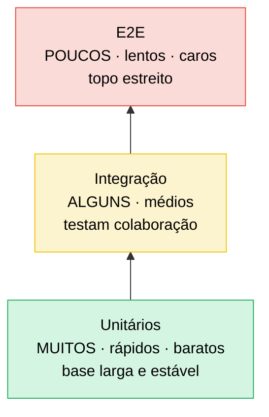
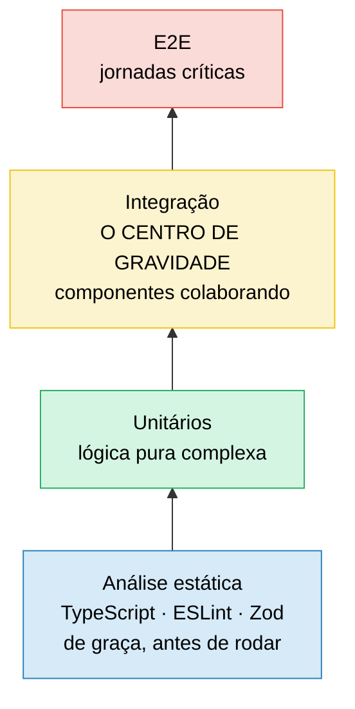
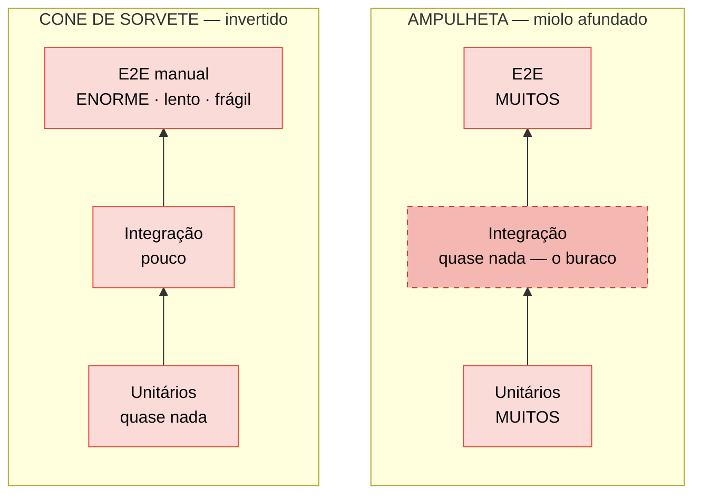
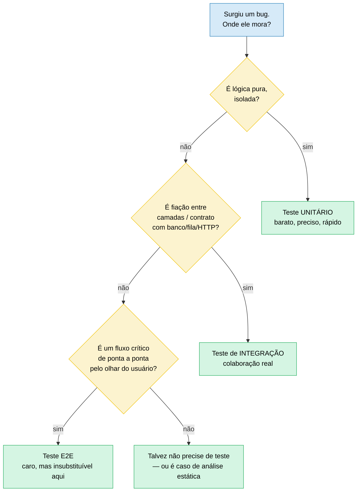

# A pirâmide de testes e suas variações

> [!abstract] Resumo
> A forma da sua suíte (quantos testes de cada tipo) não é um dogma decorado — é a sombra de onde o risco mora no seu sistema. Mike Cohn deu forma à pirâmide (base larga de unit, topo estreito de E2E) pensando em backend rico em regra de negócio; Kent C. Dodds virou essa forma de cabeça para o lado no Testing Trophy porque, no frontend, o compilador e o teste de integração é que carregam o peso. Nenhum dos dois é a resposta certa — os dois são respostas à mesma pergunta, aplicadas a riscos diferentes. A pergunta que substitui os dois dogmas é uma só: "qual teste eu quero que FALHE quando ESTE bug aparecer?" — deixe o bug escolher o nível, e a silhueta da suíte emerge sozinha.

Você já sabe **o que** é um teste e por que escrever um — isso ficou em [[01 - O que são testes e por que testar]]. Agora vem a pergunta que separa quem decora de quem entende: **quantos** testes de cada tipo você deveria ter?

A resposta preguiçosa é "siga a pirâmide". A resposta de quem já apanhou de uma suíte lenta e frágil é: "depende de onde mora o risco". Esta nota destrincha as duas.

## Os três níveis: a anatomia de uma suíte

Antes de falar de forma, precisamos dos tijolos. Quase toda suíte automatizada se organiza em três alturas. Não são categorias herméticas — há um espectro contínuo —, mas pensar em três degraus ajuda a raciocinar.

**Unitário.** Testa uma peça pequena e isolada — uma função, um método, uma classe — sem rede, sem banco, sem arquivo. Roda em milissegundos. Você tem **muitos**. Quando falha, o dedo já aponta pra linha culpada. Detalhes em [[04 - Testes unitários]].

**Integração.** Testa **colaboração**: dois ou mais componentes conversando de verdade. O controller chama o service, que chama o repositório, que bate num banco real (ou num container efêmero). Não verifica "o método X retorna Y"; verifica "a fiação entre X, Y e Z está certa". Mais lento que unit, mais valioso por teste. Detalhes em [[07 - Testes de integração]].

**E2E (ponta a ponta).** Testa o sistema **inteiro** pela porta da frente — o navegador, a API pública, o app. Simula o usuário de verdade: clica, digita, espera. É o mais próximo da realidade e o mais caro de tudo: lento, frágil, difícil de debugar quando quebra ("falhou em algum lugar entre o browser e o banco — boa sorte").

> [!question] Por que a forma importa tanto?
> Porque cada nível negocia quatro variáveis ao mesmo tempo: **custo de escrita e manutenção**, **velocidade de execução**, **confiança** (quão perto da realidade) e **localização da falha** (quão rápido você acha o culpado). Unit é barato, rápido e preciso, mas confia pouco no "tudo junto". E2E confia muito, mas é caro, lento e impreciso. A forma da suíte é como você distribui essa aposta.

A tabela abaixo é o mapa mental que você quer ter na cabeça numa entrevista.

| Nível | Velocidade | Confiança (perto da realidade) | Custo de manutenção | Quando usar |
| --- | --- | --- | --- | --- |
| Unitário | Altíssima (ms) | Baixa por teste | Baixo | Lógica isolada, regras de negócio, branches, edge cases |
| Integração | Média (s) | Alta | Médio | Fiação entre camadas, contratos com banco/fila/HTTP |
| E2E | Baixa (min) | Altíssima | Alto | Fluxos críticos de usuário ponta a ponta |

Repare na tensão: **confiança e velocidade andam em sentidos opostos**. Subir o nível compra realismo e paga em tempo e fragilidade. Toda discussão de "forma da suíte" é uma negociação dessa troca.

## A pirâmide de testes (Mike Cohn)

A imagem mais famosa do testing. **Mike Cohn** a popularizou em *Succeeding with Agile* (2009); **Martin Fowler** a refinou e desenhou no clássico texto *The Practical Test Pyramid*. A intuição é geométrica e simples.

Pense na **pirâmide do Egito**: base larga e estável, topo estreito. A base larga são os testes unitários — muitos, baratos, rápidos. Conforme você sobe, os testes ficam mais caros e mais lentos, então você tem **menos**. O topo, pequeno, é o E2E.

> [!tip] Diagrama 1 — A pirâmide clássica (de baixo pra cima)
> Lê-se de baixo (base, muitos) para cima (topo, poucos). A largura representa a quantidade; a altura, o custo e a lentidão.



Leitura do diagrama: a seta sobe `Unitários → Integração → E2E`. Quanto mais você sobe, **menos** testes você quer, porque cada um custa mais para escrever, roda mais devagar e quebra mais fácil. A base larga garante feedback rápido; o topo estreito garante que você não afunde em E2E frágil.

> [!info] De onde veio a pirâmide
> A ideia foi esboçada por Cohn em conversas por volta de 2003-2004 e formalizada no livro de 2009. Jason Huggins chegou à mesma intuição de forma independente. Fowler é a fonte mais linkada hoje, com o gráfico canônico.

A pirâmide funciona muito bem para **backend clássico** — uma API Java/Spring com lógica de negócio rica, onde a maior parte do que pode dar errado é regra de domínio testável em unit. Vale a pena cruzar com [[Testes em Java]] para ver isso na prática.

## O Testing Trophy (Kent C. Dodds)

Agora a variação que nasceu do desconforto de quem vive no **frontend**. **Kent C. Dodds** propôs o *Testing Trophy* — um troféu, não uma pirâmide — com quatro camadas e um lema famoso: **"Write tests. Not too many. Mostly integration."** (Escreva testes. Não muitos. A maioria de integração.)

Por que a forma muda? Dois motivos.

**Primeiro: a base de análise estática.** O troféu acrescenta um andar que a pirâmide ignora — **análise estática**: o compilador de tipos (TypeScript), o linter (ESLint), o validador de schema (Zod). Em React + TS, o compilador pega uma classe inteira de bugs (`undefined is not a function`, prop com tipo errado, import quebrado) **antes de qualquer teste rodar**. É o teste mais barato que existe: você nem escreve, ele já está lá. Por isso é a base larga do troféu.

**Segundo: integração no centro de gravidade.** No frontend, testar uma função pura isolada raramente captura o bug real — o bug mora na interação entre componente, estado, evento e DOM. Um teste de integração com Testing Library ("renderiza o formulário, preenche, clica, verifica o resultado") dá muito mais confiança por linha escrita, sem depender de detalhes de implementação. Por isso o troféu **engorda no meio**, não na base de unit.

> [!tip] Diagrama 2 — O Testing Trophy (de baixo pra cima)
> Quatro andares. A base agora é análise estática, e o miolo gordo é integração — não unit.



Leitura do diagrama: a base `Análise estática` é o piso de graça. Subindo, `Unitários` para lógica pura, depois o andar mais largo, `Integração`, onde o troféu concentra o investimento, e no topo `E2E` para as jornadas que não podem quebrar. O retorno sobre investimento (ROI) é máximo no meio.

O troféu é o modelo natural para quem trabalha com [[Testes em JavaScript]] — frontend React + TypeScript + Testing Library. Não porque a pirâmide "esteja errada", mas porque **o risco mora em outro lugar**: muito do que quebraria em unit no backend, no frontend já é pego pelo compilador ou só aparece na colaboração.

> [!tip] Vídeo — The Testing Trophy 🏆 An in depth look (Kent C. Dodds, 35min)
> O próprio autor do troféu explica, com legenda disponível, de onde veio a forma, por que ela difere da pirâmide clássica e como aplicá-la na prática em frontend React. Bom complemento em vídeo pro texto desta seção. [youtube.com/watch?v=RHKkEiQ58N0](https://www.youtube.com/watch?v=RHKkEiQ58N0)

> [!note] Pirâmide × Troféu não é guerra
> São o mesmo princípio — "concentre testes onde o risco é alto e o custo é baixo" — aplicado a sistemas com perfis de risco diferentes. Backend rico em lógica de domínio puxa pra base de unit. Frontend rico em interação e tipagem puxa pra base estática e ao miolo de integração. Escolher o modelo é diagnosticar o sistema, não torcer por um time.

## Os anti-padrões: quando a forma denuncia o problema

Há duas silhuetas que, quando você as vê, sabe que alguém está sofrendo. Elas são úteis justamente como **alarme**: a forma errada não causa a dor, mas é o sintoma visível dela.

### A ampulheta (hourglass)

Muito **unit**, muito **E2E**, **pouca integração** — o miolo afundou. Parece responsável (olha, temos cobertura embaixo e em cima!), mas é uma armadilha. A camada que mais barato compra confiança realista — a integração — é exatamente a que falta. O resultado: unit verde, E2E verde, e mesmo assim bugs de **fiação** escapam (o controller chama o service errado, o mapeamento ORM quebra), porque ninguém testou as camadas conversando. Quando o E2E enfim pega, é caro e impreciso.

### O cone de sorvete (ice-cream cone)

A pirâmide **de cabeça pra baixo**. Topo gigante (muito E2E, frequentemente **manual**), base raquítica (quase nenhum unit). O Google chamou isso de anti-padrão em 2015. A imagem: uma casquinha equilibrando uma bola de sorvete enorme — instável, derretendo. Toda a confiança depende de testes lentos, frágeis e caros; o feedback chega dias depois, quando um humano clica num fluxo e descobre que algo quebrou lá atrás. Caríssimo de manter, pesadelo de debugar.

> [!tip] Diagrama 3 — Os dois anti-padrões
> À esquerda a ampulheta (miolo afundado); à direita o cone de sorvete (invertido, topo pesado).



Leitura do diagrama: na **ampulheta**, `Integração` (tracejada) é o buraco no meio — os bugs de colaboração caem nesse vão e só aparecem no E2E caro. No **cone**, o peso está todo em cima, em `E2E manual`, sobre uma base inexistente — a suíte inteira é lenta e quebradiça. Ambas falham pela mesma razão: o investimento não está onde o risco é barato de cobrir.

## Armadilhas comuns

> [!warning] A ampulheta tem uma defesa parcial
> Em código **legado** sem costuras pra testar em unit, e com ferramentas de E2E mais robustas hoje, alguns defendem a ampulheta como mal menor temporário — você empurra parte da verificação de integração pelo topo. É uma concessão à realidade, não um ideal. Não comece um projeto novo mirando a ampulheta.

> [!warning] Tratar a proporção como dogma numérico
> "70% unit, 20% integração, 10% E2E" é uma memória decorada, não uma lei física. A pirâmide e o troféu são **modelos de onde o risco costuma morar**, não uma cota a bater em code review. Se seu domínio é matemático e isolado (um parser, um motor de regras), a forma legítima pode ser quase um pilar de unit — e isso não é "quebrar a pirâmide", é aplicar o princípio corretamente. Perseguir a proporção certa em vez da pergunta certa ("qual teste eu quero que falhe?") é decorar a resposta sem entender a pergunta.

> [!warning] "Teste de integração" significa coisas diferentes para times diferentes
> Um backend Java costuma chamar de "integração" um teste que sobe um banco real (ou container efêmero) e verifica a fiação entre camadas — controller, service, repositório. Um time de frontend, ao usar o mesmo termo dentro do Testing Trophy, geralmente quer dizer "vários componentes React colaborando dentro do mesmo processo, sem rede". São coisas diferentes com o mesmo nome. Numa entrevista ou numa discussão cross-time, vale a pena perguntar "integração de quê com quê?" antes de assumir que todos falam da mesma pirâmide.

> [!info] Só uma armadilha tem lastro direto na nota
> A ampulheta é o único anti-padrão com um `[!warning]` originalmente presente no corpo (a defesa parcial em legado). As duas seguintes foram derivadas do próprio raciocínio da nota — não de um caso real de produção do autor, que não existe registrado até o momento. Fica como lacuna consciente, não fabricada.

## A pergunta que substitui o dogma

Aqui está o pulo do gato senior. Esqueça a proporção decorada. A proporção **não é regra** — é **consequência**. A pergunta operacional é uma só:

> [!important] A pergunta de ouro
> **"Qual teste eu quero que FALHE quando ESTE bug aparecer?"**

Cada bug que você teme tem um nível natural onde ele se manifesta. Deixe o bug escolher o teste, e a forma da suíte emerge sozinha.

- Bug em **lógica isolada** (cálculo de juros errado, parser que engasga num edge case)? Você quer um **unit** falhando. É barato e aponta direto.
- Bug na **fiação** controller → service → repositório → banco (transação não commita, mapeamento ORM perde um campo)? Nenhum unit pega isso — você quer um **teste de integração** falhando.
- Bug num **fluxo crítico de usuário** (checkout que não fecha o pedido, login que não autentica)? Você quer um **E2E** falhando, porque o risco é o sistema inteiro não entregar valor.

> [!tip] Diagrama 4 — Qual teste para qual bug
> Um fluxograma de decisão. Comece pela natureza do bug e siga até o nível.



Leitura do diagrama: você desce pelas perguntas. `É lógica pura?` → unit. Senão, `é fiação/contrato?` → integração. Senão, `é fluxo crítico?` → E2E. Se nada disso, talvez o caso seja análise estática ou nem precise de teste. A proporção final da suíte é só a soma dessas decisões individuais — ela **emerge** do risco, não é imposta de fora.

## Outra lente: tamanho em vez de forma (Google)

Existe uma terceira forma de fatiar o mesmo problema, e ela vem do time de Testing da Google. Em vez de classificar pelo **nome** do teste (unit, integration, E2E — nomes que, como vimos nas armadilhas, cada time interpreta diferente), a Google classifica pelo **tamanho**: quanto recurso o teste consome e onde ele roda.

> [!question] Por que trocar "tipo" por "tamanho"?
> Porque "tipo" é ambíguo (o que um time chama de integração, outro chama de unit) e "tamanho" é observável: quantos processos, máquinas e recursos externos reais o teste toca. É um critério operacional, não semântico.

- **Small (pequeno):** roda num único processo, ambiente inteiramente fake (sem rede real, sem disco real, sem sleep/timer real). Determinístico e rápido por construção — mapeia quase 1:1 com "unitário".
- **Medium (médio):** roda numa única máquina, pode tocar recursos reais ou fake nessa máquina (um banco em container local, por exemplo). Mapeia perto de "integração".
- **Large (grande):** roda em qualquer lugar, com recursos de produção reais ou próximos disso. Mapeia perto de "E2E", mas sem prometer que é "o app inteiro" — só que o ambiente é real.

A régua da Google é: **escreva sempre o menor teste que ainda prova o que você precisa provar**, porque tamanho pequeno compra velocidade e determinismo — as mesmas duas variáveis que a pirâmide e o troféu já estavam otimizando, só que agora medidas por comportamento de execução, não por rótulo. O mesmo time publicou depois um argumento mais afiado ainda contra o cone de sorvete: *"Just Say No to More End-to-End Tests"* — cada E2E a mais tende a ser lento, quebradiço (*flaky*) e caro de debugar quando falha, então o investimento marginal deveria ir para medium antes de ir para large.

### Exemplo trabalhado: o mesmo domínio, três bugs, três níveis

Pra fixar a pergunta de ouro, veja como ela se aplica dentro de um único domínio — um carrinho de compras com desconto por cupom.

```text
Bug 1 — "cupom de 10% aplicado sobre valor errado quando há frete grátis"
  Onde mora: função calcularDesconto(subtotal, cupom) — lógica pura, sem I/O
  Teste que eu quero ver falhar: UNITÁRIO
    calcularDesconto(100, "CUPOM10") deve retornar 90, não 90-frete

Bug 2 — "cupom válido no service, mas o repositório salva o pedido sem o desconto"
  Onde mora: na fiação CarrinhoService -> PedidoRepository -> banco
  Teste que eu quero ver falhar: INTEGRAÇÃO
    salvar um pedido com cupom aplicado e reler do banco — o desconto persistiu?

Bug 3 — "usuário aplica o cupom na tela, mas o total exibido não atualiza"
  Onde mora: em qualquer lugar entre o clique e o render — não dá pra saber sem rodar
  Teste que eu quero ver falhar: E2E
    abrir o carrinho, digitar o cupom, clicar aplicar, ler o total na tela
```

Repare que os três bugs vivem no **mesmo domínio de negócio** (desconto de carrinho), mas cada um só é pego de forma barata e precisa por um nível diferente. Um único teste E2E cobrindo os três casos existiria, mas seria lento, apontaria pro lugar errado quando quebrasse, e você reescreveria a asserção de valor três vezes num teste que já está fazendo login, navegação e render — desperdício de tudo que o unit do Bug 1 resolve em milissegundos.

## Proporção por contexto

Juntando tudo: a "forma certa" depende de onde seu sistema concentra risco.

- **Backend Java/Spring puro** — lógica de domínio rica, muitos branches → **pirâmide clássica**. Base gorda de unit, integração testando repositórios e endpoints, E2E só nos fluxos-chave.
- **Frontend React + TS + Testing Library** — risco em interação e tipos → **Testing Trophy**. Base de análise estática, miolo de integração, unit só pra lógica pura complexa.
- **Lógica algorítmica pesada** (parsers, engines de regra, cálculo) → **quase tudo unit**. A pirâmide vira quase um pilar: o risco é matemático e isolado, perfeito pra unit barato e exaustivo.
- **Microserviços com contratos entre si** → adicione uma camada que nenhum dos modelos clássicos enfatiza: **contract tests**. Você não quer subir todos os serviços num E2E gigante pra descobrir que o serviço A mudou o JSON que o serviço B consome — um contract test pega isso barato, de cada lado. Esse e outros tipos especiais ficam em [[13 - Além do básico - property-based, snapshot, contract, smoke]].

> [!note] A meta-regra
> Não existe proporção universal porque não existe sistema universal. A pirâmide é o **default sensato** para a maioria dos backends; o troféu, para frontends ricos. Mas o que você está realmente fazendo é responder, bug a bug, "qual teste eu quero que falhe?" — e deixar a silhueta se formar. Quem decora a proporção tropeça quando o contexto muda; quem entende o princípio se adapta.

> [!question]- Lacuna consciente: um caso real de decisão pirâmide × troféu
> O ideal aqui seria fechar a nota com um caso concreto — um projeto real em que a forma da suíte foi escolhida ou trocada deliberadamente, e o que isso custou/economizou. Não há, até o momento, um caso desse tipo documentado no vault com lastro suficiente para citar sem inventar detalhes. Registrado como gap consciente em vez de preenchido com um exemplo fabricado.

## Em entrevista

Use estas frases para mostrar que você pensa em risco, não em dogma.

The test pyramid suggests many fast unit tests at the base and few slow E2E tests at the top, balancing confidence against speed and cost. Kent C. Dodds' Testing Trophy adapts this for frontend by adding static analysis at the base and shifting the center of gravity to integration tests. I treat the ratio as a consequence, not a rule: I ask "which test do I want to fail when this specific bug appears?" — isolated logic calls for a unit test, cross-layer wiring for an integration test, a critical user journey for E2E. I watch for two anti-patterns: the ice-cream cone, where heavy manual E2E sits on almost no unit tests, and the hourglass, where the integration middle has collapsed. For a Spring backend I lean toward the classic pyramid, while for a React and TypeScript app the trophy fits better because the compiler already catches a whole class of bugs for free. With microservices I add contract tests so I don't need a giant end-to-end suite just to catch a broken JSON contract.

### Vocabulário

| Português | Inglês |
| --- | --- |
| pirâmide de testes | test pyramid |
| forma da suíte | shape of the suite |
| centro de gravidade | center of gravity |
| detalhes de implementação | implementation details |
| retorno sobre investimento | return on investment (ROI) |
| análise estática | static analysis |
| cone de sorvete | ice-cream cone |
| ampulheta | hourglass |
| fiação entre camadas | cross-layer wiring |
| jornada crítica do usuário | critical user journey |
| testes de contrato | contract tests |
| ciclo de feedback | feedback loop |

## Fontes

- Martin Fowler — [*The Practical Test Pyramid*](https://martinfowler.com/articles/practical-test-pyramid.html) e o verbete [*TestPyramid*](https://martinfowler.com/bliki/TestPyramid.html) — origem em Mike Cohn, *Succeeding with Agile* (2009).
- Kent C. Dodds — [*Static vs Unit vs Integration vs E2E Testing for Frontend Apps*](https://kentcdodds.com/blog/static-vs-unit-vs-integration-vs-e2e-tests) e [*Write tests. Not too many. Mostly integration.*](https://kentcdodds.com/blog/write-tests) (kentcdodds.com) — o Testing Trophy e a base de análise estática.
- Discussões do anti-padrão *ice-cream cone* (rotulado pelo Google em 2015) e da *hourglass* — ex.: [Octomind, "Testing Pyramid: an evolutionary tale"](https://octomind.dev/blog/testing-pyramid-an-evolutionary-tale), e Carolina Ramirez, "Testing Anti-Patterns" (Geek Culture / Medium).
- Google Testing Blog — [*Test Sizes*](https://testing.googleblog.com/2010/12/test-sizes.html) (2010) e [*Just Say No to More End-to-End Tests*](https://testing.googleblog.com/2015/04/just-say-no-to-more-end-to-end-tests.html) (2015) — a classificação small/medium/large e o argumento contra o cone de sorvete.
- Kent C. Dodds — [*The Testing Trophy 🏆 An in depth look*](https://www.youtube.com/watch?v=RHKkEiQ58N0) (YouTube, 2018) — o vídeo em que o autor do troféu explica sua origem e aplicação.

## O que vem a seguir

Você já tem os dois modelos (pirâmide e troféu) e o critério que decide entre eles — o risco. Duas pontes naturais a partir daqui.

A primeira é lateral: se o seu trabalho toca frontend, a forma do troféu que você viu aqui em teoria ganha ferramental concreto — TypeScript, ESLint, Testing Library, Vitest, MSW — em [[03-Dominios/Tecnologia/Testes JS/01 - O cenário de testes JS]]. É o mesmo diagnóstico ("o risco mora na interação, não na função isolada"), agora com os nomes das ferramentas que o materializam.

A segunda é adiante no fluxo: uma suíte com a forma certa ainda precisa **rodar** — em CI, a cada commit, com o feedback chegando rápido o suficiente para valer a pena. É aí que a pirâmide encontra a esteira: como esses testes se encaixam no pipeline de entrega contínua é assunto de [[03-Dominios/Engenharia/Operação/index]]. A forma decide *o quê* testar; a operação decide *quando* e *com que rapidez* esse teste te avisa.

## Veja também

- [[01 - O que são testes e por que testar]] — o porquê, antes da forma
- [[04 - Testes unitários]] — a base larga em detalhe
- [[07 - Testes de integração]] — o miolo que os anti-padrões esquecem
- [[13 - Além do básico - property-based, snapshot, contract, smoke]] — contract tests e os tipos especiais por contexto
- [[16 - Estratégia de testes em entrevista]] — como defender sua forma de suíte
- [[03-Dominios/Engenharia/Testes/index|Testes]] — índice do galho
