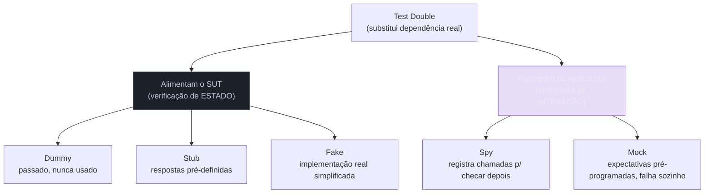
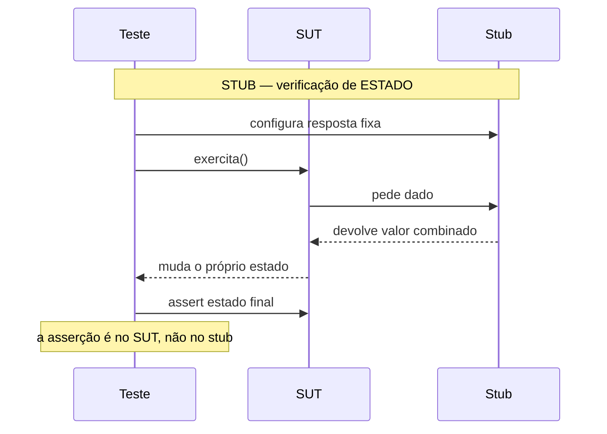
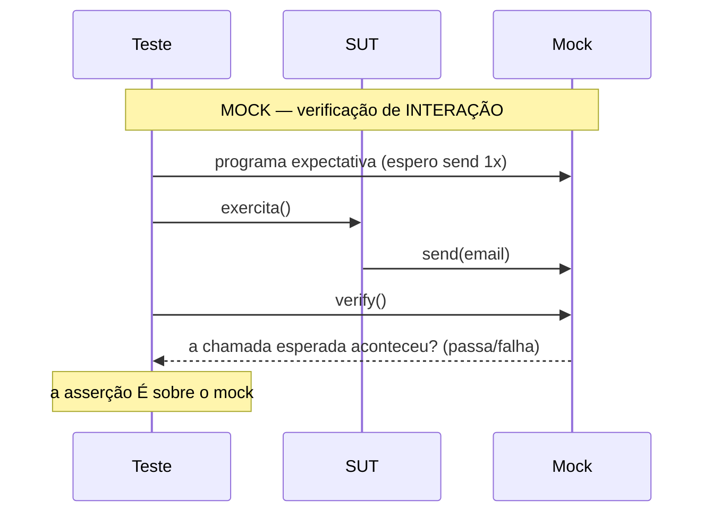
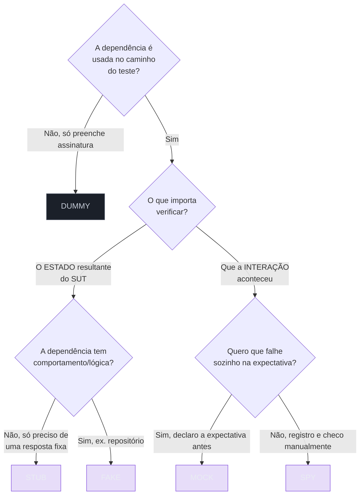

# Test doubles: dummy, stub, spy, mock, fake

> [!abstract] Resumo
> *Test double* é o termo guarda-chuva pra qualquer objeto que substitui uma dependência real no teste — a analogia é o dublê de cinema: o ator principal (a dependência real) fica de fora de certas cenas, e um dublê especializado entra no lugar dele só pra aquela cena funcionar. Os cinco tipos (dummy, stub, fake, spy, mock) se dividem em dois papéis: uns **alimentam** o SUT com dados ou comportamento pra ele seguir em frente (dummy, stub, fake — a asserção final olha o **estado**); outros **participam da própria verificação** (spy, mock — a asserção olha a **interação**). A confusão mais cara em entrevista é achar que mock e stub são a mesma coisa: um stub **dá** uma resposta pra o SUT seguir, um mock **cobra** uma interação e falha sozinho se ela não acontecer — é a diferença de Fowler entre verificação de estado e verificação de comportamento.

Quando você testa uma classe, ela quase nunca está sozinha. Ela conversa com um banco, um gateway de pagamento, um serviço de e-mail. No teste, você raramente quer o banco de verdade — quer algo no lugar dele. Esse "algo no lugar" tem nome.

Gerard Meszaros, no *xUnit Test Patterns*, deu a esse algo o nome de **Test Double** — uma analogia direta com o dublê de cinema. O ator principal (a dependência real) não entra em todas as cenas; em algumas você coloca um dublê. O público não percebe, mas o dublê está ali só pra fazer aquela cena funcionar.

A sacada é que existem *vários tipos* de dublê, e confundi-los é a fonte número um de testes ruins e de respostas embaralhadas em entrevista.

## A analogia do set de filmagem

Pense num set. Há vários tipos de "gente substituindo gente":

- O **figurante de fundo** que aparece na cena mas nunca fala nem interage — está lá só pra preencher o quadro. Esse é o **dummy**.
- O **dublê de fala** que tem uma frase decorada e a repete sempre igual, não importa o que aconteça — esse é o **stub**.
- O **assistente que anota tudo** que o ator fez durante a cena, pra o diretor conferir depois — esse é o **spy**.
- O **diretor de cena** que já chegou sabendo exatamente o que o ator *deve* fazer e barra a tomada na hora se ele errar a deixa — esse é o **mock**.
- O **dublê de ação** treinado, que realmente executa a cena (cai, corre, luta), só que de um jeito mais barato e controlado que o original — esse é o **fake**.

Guarde essa imagem. Ela carrega toda a taxonomia.

## A taxonomia, em um diagrama

O ponto que organiza tudo: os cinco tipos se dividem em dois mundos. Quem **alimenta** o teste (entrega valores ou comportamento pro SUT trabalhar) e quem **verifica** o teste (o próprio dublê faz parte da asserção).



Leitura do diagrama: tudo é *test double*. O galho da esquerda (dummy, stub, fake) existe pra fazer o SUT rodar — depois você verifica o **estado** do SUT. O galho da direita (spy, mock) entra na própria asserção — você verifica a **interação**. Essa divisão é a coisa mais importante da nota.

## Os cinco tipos, lado a lado

| Tipo | O que faz | Alimenta ou verifica? | Exemplo típico |
|---|---|---|---|
| **Dummy** | Passado adiante, **nunca usado** de fato | Nenhum (só preenche assinatura) | `new User(null)` num parâmetro obrigatório irrelevante |
| **Stub** | Devolve **respostas fixas** pré-configuradas | Alimenta (estado) | "o gateway retorna `aprovado`" |
| **Fake** | **Implementação real**, porém simplificada | Alimenta (estado) | repositório in-memory, fake HTTP server |
| **Spy** | **Registra** como foi chamado, pra checar depois | Verifica (interação) | "o stub que também conta quantas vezes foi chamado" |
| **Mock** | Pré-programado com **expectativas**, falha sozinho | Verifica (interação) | "espero que `send()` seja chamado uma vez com este e-mail" |

Vamos um a um.

### Dummy — o figurante

O dummy existe só pra preencher uma lista de parâmetros. Ele é passado, mas o caminho de código exercido pelo teste **nunca o usa**.

```java
// O construtor exige um Logger, mas este teste
// nunca dispara nada que use o logger.
Logger dummy = null; // ou um objeto vazio
PriceCalculator calc = new PriceCalculator(dummy);

assertEquals(100, calc.total(items)); // o dummy nunca foi tocado
```

Se o dummy *fosse* usado, o teste quebraria (NPE) — e isso é bom: prova que ele realmente não participa.

### Stub — a fala decorada

O stub responde sempre a mesma coisa. Ele **não se importa** se foi chamado uma vez ou dez; só devolve o valor combinado. Serve pra colocar o SUT num caminho específico.

```java
PaymentGateway stub = mock(PaymentGateway.class);
when(stub.charge(any())).thenReturn(Result.APPROVED); // resposta fixa

OrderService service = new OrderService(stub);
service.checkout(order);

assertEquals(Status.PAID, order.status()); // verifico o ESTADO do pedido
```

Repare: a asserção é sobre o **estado final** (`order.status()`), não sobre o stub. O stub só alimentou o caminho.

### Fake — o dublê de ação

O fake tem comportamento de verdade. Ele *funciona*, só que com um atalho que o torna inadequado pra produção. O exemplo clássico de Meszaros é um banco de dados in-memory.

```java
// Implementação completa de UserRepository, mas guardando
// tudo num HashMap em vez de no Postgres.
class InMemoryUserRepository implements UserRepository {
    private final Map<Long, User> store = new HashMap<>();
    public void save(User u) { store.put(u.id(), u); }
    public User findById(Long id) { return store.get(id); }
}
```

Diferença crucial pro stub: o fake tem **lógica**. Salve e depois busque — ele lembra. Um stub `findById` devolveria sempre o mesmo objeto programado, sem se importar com o que você salvou.

### Spy — o assistente que anota

O spy é um stub que **também grava** como foi chamado, pra você conferir depois (na fase de asserção). É verificação de interação feita de forma manual/passiva.

```java
class EmailSpy implements EmailSender {
    List<Email> sent = new ArrayList<>();
    public void send(Email e) { sent.add(e); } // só registra
}

EmailSpy spy = new EmailSpy();
new SignupService(spy).register(user);

assertEquals(1, spy.sent.size());          // verifico DEPOIS
assertEquals("welcome", spy.sent.get(0).template());
```

O spy registra durante a execução e você inspeciona no fim. É o meio-termo entre stub e mock.

### Mock — o diretor exigente

O mock já chega sabendo o que **espera** receber. As expectativas são programadas *antes* (no setup) e o próprio mock **falha o teste** se elas não forem cumpridas — ou se chegar uma chamada que ele não previa.

```java
EmailSender mockSender = mock(EmailSender.class);

new SignupService(mockSender).register(user);

// O mock verifica a INTERAÇÃO: foi chamado certo?
verify(mockSender).send(argThat(e -> e.template().equals("welcome")));
verifyNoMoreInteractions(mockSender);
```

A diferença pro spy é sutil mas conceitual: o **mock carrega a expectativa dentro de si** e insiste nela. Só o mock, dos cinco, *insiste* em verificação de interação.

## Mock × Stub: a distinção que confunde todo mundo

Aqui está o coração da nota. Stub e mock parecem iguais na superfície — ambos substituem um colaborador. A diferença não está em *como* são criados, mas em *o que você verifica no teste*.

Martin Fowler cristalizou isso em **"Mocks Aren't Stubs"** com dois termos:

- **Verificação de estado** (*state verification*) — depois de exercitar o SUT, você olha o **estado** dele (e dos colaboradores) e pergunta: "ficou certo?". Stub, fake e dummy vivem aqui.
- **Verificação de interação/comportamento** (*behavior verification*) — você verifica que o SUT **fez as chamadas certas, do jeito certo**, no colaborador. Só o mock insiste nisso.



Leitura do diagrama: o stub é coadjuvante. Ele só entrega o dado combinado pro SUT trabalhar. A pergunta final do teste ("deu certo?") é respondida olhando o **SUT**, não o stub.

Agora o mock:



Leitura do diagrama: o mock é protagonista da asserção. A pergunta final ("deu certo?") é respondida perguntando ao **próprio mock** se ele recebeu as chamadas que esperava. O estado do SUT pode nem ser olhado.

> [!tip] A frase que resolve em entrevista
> "Um stub me **dá** uma resposta pra eu seguir; um mock me **cobra** uma interação que eu verifico. Stub alimenta verificação de estado; mock é verificação de interação." Dito assim, você passou.

> [!tip] Vídeo: Stubs vs Mocks vs Fake em 3 minutos
> Pra fixar a distinção rápido, [Stubs vs Mocks vs Fake | In a nutshell](https://www.youtube.com/watch?v=4AxXWjBSIdY) (Keploy, ~3min) passa pelos mesmos três conceitos com exemplos de código, reforçando que a linha entre eles está em *o que você verifica*, não em como o double foi criado.

## Por que a distinção importa (e onde ela machuca)

Testes baseados em **interação** (mocks) acoplam o teste à **implementação** — ao *como* o SUT faz, não ao *que* ele entrega. Se amanhã você refatorar o SUT pra chamar o colaborador de outro jeito (duas chamadas em vez de uma, outro método equivalente) sem mudar o comportamento observável, o mock **quebra mesmo com tudo funcionando**.

Isso é o famoso teste frágil: vermelho sem bug. E é o gancho direto pra próxima nota — [[06 - Testar comportamento, não implementação]] aprofunda *quando* o acoplamento à implementação vale a pena e quando é veneno. Aqui basta a fronteira: mock pesa a balança pro lado da implementação; stub/estado, pro lado do comportamento.

## Duas escolas: TDD clássico vs. TDD mockista

Essa fronteira entre estado e interação não é só estilística — ela separa duas escolas de TDD que Fowler nomeou explicitamente no mesmo artigo "Mocks Aren't Stubs".

**TDD clássico** (linhagem de Kent Beck e do próprio Meszaros) prefere usar objetos reais sempre que possível e só troca por um double quando o real é lento, caro ou indisponível (banco, rede, relógio). A verificação, no fim, é sobre o **estado**: o objeto real ficou como devia? Quando um double entra nesse estilo, é tipicamente stub ou fake.

**TDD mockista** (Steve Freeman e Nat Pryce, em *Growing Object-Oriented Software, Guided by Tests*) troca **toda** dependência não-trivial por mock desde o início. A ideia central é usar o mock pra **descobrir o design** — se é estranho programar a expectativa de uma interação, o design provavelmente está errado, e isso é sinal pra refatorar antes mesmo do código existir. A verificação é sobre a **interação**: o SUT conversou do jeito certo com seus colaboradores?

> [!question]- Por que isso importa se eu só quero passar na entrevista?
> Porque explica *por que* times inteiros divergem sobre "quanto mockar". Não é gosto pessoal — são duas filosofias de design coerentes, cada uma com seu próprio critério de "teste bom". Saber nomear as duas mostra que você enxerga o assunto além do "usa Mockito ou não usa".

Na prática, a maioria dos times sênior pousa no meio: clássico por padrão (fakes e stubs, testando estado), mockista só nas bordas onde o efeito colateral é a única evidência observável (mandou e-mail? publicou evento?). É exatamente a heurística da seção anterior — só que agora com nome pras duas escolas que a sustentam.

## Qual dublê escolher?



Leitura do diagrama: primeiro pergunte se a dependência é tocada (se não, dummy). Depois, o eixo decisivo: você verifica **estado** (stub/fake) ou **interação** (mock/spy)? Por fim, refine: estado com lógica vira fake; interação com expectativa declarada vira mock.

Em prosa, os casos canônicos:

- **Dummy** — o método exige um parâmetro que este teste não exercita. Passe qualquer coisa.
- **Stub** — você precisa controlar a resposta de uma dependência: *"o gateway retorna sucesso"*, *"a API devolve 404"*. Sem lógica, só o valor.
- **Fake** — a dependência tem comportamento que o teste depende de verdade. Repositório que precisa lembrar o que foi salvo, relógio que avança. Mais robusto que stub, mais barato que o real.
- **Mock** — você precisa verificar um **efeito colateral que só é observável por interação**: *"enviou o e-mail?"*, *"publicou o evento?"*. Não há estado de retorno pra checar; a única evidência é a chamada.
- **Spy** — útil em código legado ou quando você quer espionar uma instância real parcialmente (Mockito `spy()` embrulha um objeto de verdade). Em código novo bem desenhado, raramente é a primeira escolha.

> [!note] Heurística prática
> Prefira **fakes e stubs** (verificação de estado) por padrão; recorra a **mocks** só quando o resultado for *invisível* exceto pela interação (e-mail enviado, mensagem publicada, log de auditoria gravado). Isso te mantém testando comportamento, não fiação interna.

## Exemplo completo: um teste usando três dublês juntos

Um teste raramente usa só um tipo de dublê. Veja um cenário realista — `SignupService.register(user)`, que valida o usuário, cobra uma taxa de ativação e manda um e-mail de boas-vindas — e repare como cada dependência recebe o dublê certo pro papel que ela exerce *nesse teste específico*:

```java
@Test
void deveRegistrarUsuarioComTaxaAprovada() {
    // DUMMY — o construtor pede um Clock, mas este teste não
    // exercita nenhum caminho que consulte a hora.
    Clock dummyClock = null;

    // STUB — controlo a resposta do gateway pra forçar o caminho
    // "aprovado". Não me importa quantas vezes foi chamado.
    PaymentGateway stubGateway = mock(PaymentGateway.class);
    when(stubGateway.charge(any())).thenReturn(Result.APPROVED);

    // MOCK — o envio de e-mail é o único efeito observável deste
    // teste; não há estado de retorno pra checar, só a interação.
    EmailSender mockSender = mock(EmailSender.class);

    SignupService service = new SignupService(stubGateway, mockSender, dummyClock);
    User user = service.register(newUserRequest());

    // Verificação de ESTADO — respondida pelo SUT, não pelos dublês.
    assertEquals(Status.ACTIVE, user.status());

    // Verificação de INTERAÇÃO — respondida pelo mock.
    verify(mockSender).send(argThat(e -> e.template().equals("welcome")));
}
```

Repare na disciplina: cada dublê tem exatamente um motivo de existir. O `dummyClock` não faz nada — se `register()` algum dia passar a consultar `Clock`, o teste quebra com `NullPointerException` e avisa que a premissa mudou. O `stubGateway` só empurra o SUT pro caminho "aprovado"; nenhuma linha verifica quantas vezes `charge()` foi chamado — isso seria overmocking, porque o caminho de pagamento já é validado por `Status.ACTIVE`. Só o `mockSender` vira `verify()`, porque enviar e-mail é o único jeito de saber, de fora, que a mensagem de boas-vindas realmente saiu.

Esse é o "Frameworks são ferramenta, não conceito" da próxima seção, na prática: a API é a mesma (`mock()`), mas o *papel* de cada instância é definido pelo que o teste faz com ela depois.

## Frameworks são ferramenta, não conceito

Mockito (Java), Jest/Sinon (JS), Moq (.NET), unittest.mock (Python) — todos produzem esses dublês. Mas atenção: a API deles **não respeita a taxonomia de Meszaros**. Em Mockito, `mock()` cria um objeto que você pode usar como stub (`when().thenReturn()`) ou como mock (`verify()`) — o *tipo* é definido pelo **uso no teste**, não pela construção.

Ou seja: a mesma instância vira stub se você só configura respostas, e vira mock se você a verifica. O conceito mora no *teste*, não na *biblioteca*.

Os detalhes de cada ferramenta vivem nas notas de stack: [[Testes em Java]] (JUnit + Mockito) e [[Testes em JavaScript]] (Jest, mocks de módulo, spies). Aqui paramos no conceito.

## Armadilhas comuns

> [!warning] Cuidado com o vocabulário do dia a dia
> Na boca da maioria dos devs, "mock" virou sinônimo de "qualquer dublê". Mockito, Jest, Moq chamam tudo de "mock". A taxonomia de Meszaros é mais precisa, e é ela que separa quem entende de testes de quem só decora framework. Em entrevista, demonstre que você sabe a diferença.

> [!warning] "usei mock()" não significa "isto é um mock"
> Como a seção anterior mostrou, `mock()`/`jest.fn()` produz o mesmo objeto genérico pra stub e pra mock — o tipo depende do que o teste *faz* com ele, não de como foi construído. Achar que "chamei `mock()`, logo isto é um mock" é o erro mais comum de quem aprendeu o framework sem aprender a taxonomia: um teste pode ter zero `verify()` e mesmo assim só ter usado stubs disfarçados de mock.

> [!danger] Sintoma de overmocking
> Se seu teste tem mais linhas de `when(...)` e `verify(...)` do que de asserção real sobre resultado, ele provavelmente está testando o mock — não o seu código. Você acabou escrevendo um teste que diz "meu código chama os métodos que eu disse que ele chamaria". Tautologia cara de manter. Compare os dois testes abaixo:

```java
// RUIM — overmocking: só configura e verifica chamadas,
// nenhuma asserção real sobre o resultado do SUT.
@Test
void deveProcessarPedido_overmocked() {
    when(estoque.reservar(any())).thenReturn(true);
    when(gateway.charge(any())).thenReturn(Result.APPROVED);
    when(notificador.montarMensagem(any())).thenReturn("ok");

    orderService.checkout(pedido);

    verify(estoque).reservar(pedido.itens());
    verify(gateway).charge(pedido.valor());
    verify(notificador).montarMensagem(pedido);
    verify(notificador).enviar(any());
    verifyNoMoreInteractions(estoque, gateway, notificador);
    // Nenhuma linha pergunta "o pedido ficou pago? o estoque baixou?"
    // O teste só confirma que o código chamou os métodos — refatore
    // a ordem das chamadas (mesmo comportamento) e ele quebra.
}

// MELHOR — verifica o efeito observável, não a coreografia interna.
@Test
void deveProcessarPedido() {
    orderService.checkout(pedido);

    assertEquals(Status.PAID, pedido.status());          // estado
    assertEquals(0, estoqueFake.disponivel(produtoId));  // estado
    verify(notificador).enviar(any());                   // só a interação que É o resultado
}
```

## Em entrevista

A *test double* is the umbrella term for anything that stands in for a real dependency in a test — the analogy is a stunt double. The five types differ along one axis: do they **feed** the test or **participate in the verification**? Dummies, stubs, and fakes feed the SUT and you assert on **state**; mocks and spies are part of the assertion and verify **interaction**. The classic confusion is mock versus stub: a stub *gives* you a canned answer so the SUT can proceed, while a mock *demands* a specific interaction and fails the test itself if it doesn't happen — that's Fowler's distinction between state verification and behavior verification. I reach for fakes and stubs by default and only use mocks when the outcome is invisible except through the interaction, like "did we send the email?". The risk with mocks is coupling the test to the implementation, so a behavior-preserving refactor turns the test red even though nothing broke.

### Vocabulário PT → EN

| Português | English |
|---|---|
| dublê de teste | test double |
| objeto simulado / mock | mock object |
| esboço / resposta fixa | stub |
| espião | spy |
| falso / implementação simplificada | fake |
| objeto vazio / de preenchimento | dummy |
| verificação baseada em estado | state verification |
| verificação baseada em interação | behavior / interaction verification |
| sistema sob teste | system under test (SUT) |
| colaborador / dependência | collaborator / dependency |
| expectativa | expectation |
| efeito colateral | side effect |
| teste frágil | brittle / fragile test |
| acoplado à implementação | coupled to the implementation |

## O que vem a seguir

Esta nota fica no nível de conceito — a taxonomia que vale pra qualquer linguagem. O próximo passo natural é ver os cinco tipos na mão, na stack que você realmente usa:

- Em JavaScript/TypeScript, [[03-Dominios/Tecnologia/Testes JS/06 - Mocking com Vitest]] mostra como `vi.fn()`, `vi.spyOn()` e mocks de módulo mapeiam pra dummy/stub/spy/mock — e onde o Vitest confunde os limites que esta nota separou.
- Em Python, [[03-Dominios/Tecnologia/Python/Testes/04 - Mocking com unittest.mock e pytest-mock]] cobre `Mock`, `MagicMock` e `patch()`, além da fixture `mocker` do pytest-mock — o mesmo "mock() cria os dois" da seção de armadilhas, só que na sintaxe do `unittest.mock`.
- Em Go, [[03-Dominios/Tecnologia/Go/15 - Testes/04 - Test doubles — interfaces e mocks]] mostra o caso mais explícito de todos: sem um framework de mock dinâmico dominante na comunidade, o double costuma ser uma implementação manual de uma interface — o que torna a distinção dummy/stub/fake/spy/mock quase impossível de confundir, porque cada uma vira um `struct` diferente.
- Quando o double é sobre uma dependência de rede especificamente (uma API HTTP externa), [[03-Dominios/Tecnologia/Testes JS/09 - MSW - mockando a rede]] mostra uma abordagem diferente: interceptar a chamada de rede em si, em vez de dublar a classe que a faz.

Um gap consciente: o caso prático de um stub simples que passa a precisar de lógica real de armazenamento — e por isso "vira" um fake — é mapeado como pertencente à nota [[06 - Testar comportamento, não implementação]], não a esta. Pra não duplicar conteúdo entre as duas, ele fica declarado aqui como fronteira, sem ser desenvolvido: esta nota para na taxonomia.

## Fontes

- Gerard Meszaros, [*Mocks, Fakes, Stubs and Dummies*](http://xunitpatterns.com/Mocks,%20Fakes,%20Stubs%20and%20Dummies.html) — a taxonomia original do *xUnit Test Patterns*.
- Martin Fowler, [*Mocks Aren't Stubs*](https://martinfowler.com/articles/mocksArentStubs.html) — state vs. behavior verification; TDD clássico vs. mockista.
- Martin Fowler, [*Test Double*](https://martinfowler.com/bliki/TestDouble.html) (bliki) — resumo dos cinco tipos com a analogia do *stunt double*.
- Steve Freeman & Nat Pryce, *Growing Object-Oriented Software, Guided by Tests* — origem da escola TDD mockista citada na seção "Duas escolas".
- [Stubs vs Mocks vs Fake | In a nutshell](https://www.youtube.com/watch?v=4AxXWjBSIdY), Keploy (vídeo, ~3min) — revisão rápida da distinção com exemplos de código; legenda automática verificada via `yt-dlp`.

## Veja também

- [[04 - Testes unitários]] — onde os dublês entram pra isolar o SUT
- [[06 - Testar comportamento, não implementação]] — a filosofia por trás de preferir estado a interação
- [[07 - Testes de integração]] — quando trocar o fake pelo real e deixar a dependência rodar
- [[16 - Estratégia de testes em entrevista]] — como articular tudo isso sob pressão
- [[Testes em Java]] — Mockito na prática
- [[Testes em JavaScript]] — Jest/Sinon na prática
- [[03-Dominios/Engenharia/Testes/index|Testes]] — índice do galho
