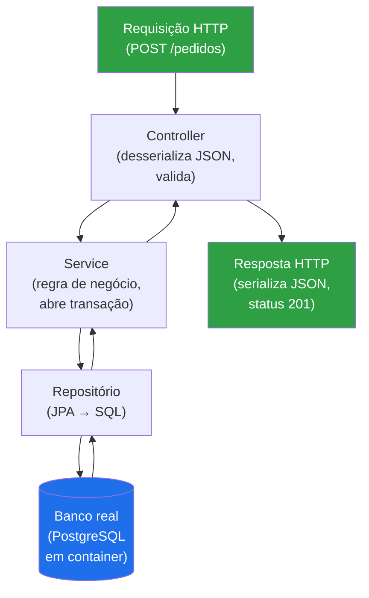
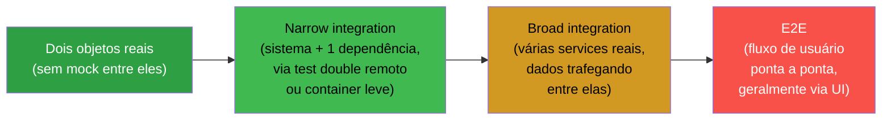
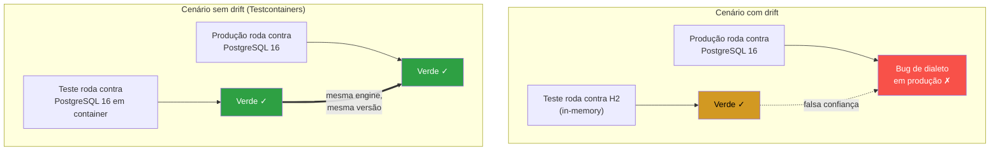
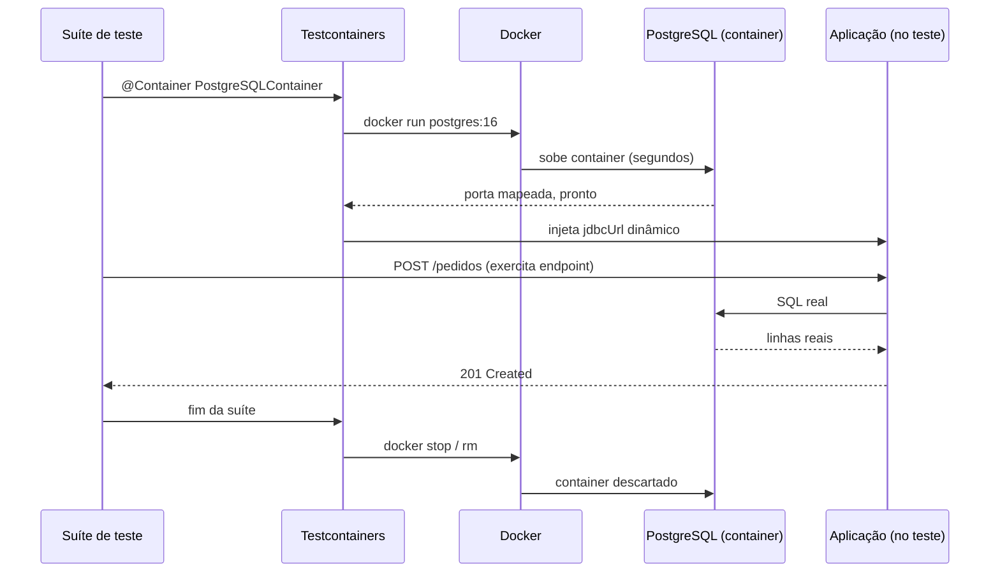

# Testes de integração

> [!abstract] Resumo em uma linha
> Teste de integração exercita a colaboração entre componentes reais — código, banco, fila, cache juntos — pra pegar bugs de fiação que o teste unitário nunca enxerga.

O [[04 - Testes unitários|teste unitário]] te diz que cada peça funciona sozinha. Mas software não roda como um amontoado de peças isoladas — roda como um sistema, com camadas conversando, mapeamentos traduzindo objetos em SQL, serialização cruzando fronteiras, configuração colando tudo. E é exatamente nessas costuras que mora uma classe inteira de bugs que o unitário, por construção, não vê.

Analogia: testar peças isoladas é checar o motor na bancada, o câmbio na bancada, a suspensão na bancada — cada um aprovado. O teste de integração é **montar o carro e dar a volta no quarteirão**. Só aí você descobre que o motor certo e o câmbio certo, parafusados juntos, vibram numa frequência que afrouxa um suporte. Cada peça passou. A montagem falhou.

## O que é, de verdade

Um teste de integração verifica se unidades desenvolvidas independentemente funcionam **corretamente quando conectadas** (Fowler). O alvo não é a lógica de uma classe — é a **fiação** entre elas e entre o sistema e suas dependências externas.

> [!question] Que tipo de bug isso pega que o unitário não pega?
> O unitário mocka o repositório, então nunca executa o SQL de verdade. O teste de integração roda o SQL contra um banco real. Aí aparecem:
> - **Mapeamento JPA errado** — a anotação gera um SQL que não bate com o schema (coluna inexistente, tipo incompatível, `fetch` que dispara N+1).
> - **Serialização** — o JSON que sai do endpoint não tem o formato que o contrato promete; uma data vira timestamp, um enum vira número.
> - **Configuração** — o bean não foi registrado, a transação não abriu, o pool de conexões está mal dimensionado.
> - **Contrato entre camadas** — o service espera um objeto que o repositório nunca devolve naquele formato.

Nada disso é "lógica". É **cola**. E cola só se testa colando.

### A fiação testada junta

Vamos ver o que entra em jogo num teste de endpoint HTTP de ponta a ponta dentro do processo — controller, service, repositório e banco, todos reais.

Leitura do diagrama: o teste manda uma requisição de verdade e inspeciona a resposta de verdade. No caminho, ele exercita a desserialização, a validação, a regra de negócio, a transação, o SQL gerado pelo JPA e a serialização da volta. Um único teste cobre **seis fronteiras**. Se qualquer cola estiver torta, ele quebra — e te diz onde.

## Onde brilha

Nem todo código merece um teste de integração. Mas alguns pontos só se validam assim:

> [!tip] Os candidatos naturais
> - **Repositórios** — o SQL gerado está correto? A query nativa funciona no dialeto do banco de produção? O `@Query` com paginação devolve o que promete?
> - **Endpoints HTTP** — o stack completo (controller → service → repo → banco) responde com o status, o corpo e os headers certos?
> - **Fluxos assíncronos** — a mensagem publicada na fila chega no consumidor? O offset do Kafka avança? A reprocessagem é idempotente?
> - **Interação com infra** — o objeto realmente é gravado no S3? O cache no Redis expira no TTL configurado? O lock distribuído segura?

Repare: tudo aqui é **borda do sistema**. O miolo de regra de negócio fica melhor no unitário, que é mais rápido e mais focado. A integração guarda a borda — onde o seu código encosta em algo que você não escreveu.

## O espectro de "integração"

"Teste de integração" não é um ponto, é um **intervalo**. Fowler observa que muita gente assume que integração é necessariamente *broad* (de escopo largo), quando ela costuma ser mais eficaz com escopo estreito.

Leitura do diagrama: da esquerda pra direita, cresce o escopo, cresce o custo e cai a velocidade. À esquerda, dois objetos reais colaborando — quase um unitário sociável. No meio, **narrow integration** (Fowler): você testa só a fatia do código que conversa com um serviço externo, usando um substituto controlado daquele serviço. À direita, **broad integration**: versões reais de vários serviços, exigindo ambiente de teste robusto e acesso de rede.

> [!note] Integração ≠ E2E
> A confusão é comum, então cravando a fronteira:
> - **Integração** testa a *colaboração de componentes* — não precisa de UI, não precisa do fluxo de negócio inteiro. "O repositório grava certo no Postgres" é integração.
> - **E2E** testa um *fluxo de usuário ponta a ponta* — normalmente atravessa a UI e simula a jornada real. "Usuário faz login, adiciona ao carrinho, finaliza compra, recebe e-mail" é E2E.
>
> Todo E2E é uma forma extrema de integração broad, mas nem toda integração é E2E. A maioria dos seus testes de integração não tocam UI nenhuma.

Veja como esses degraus se encaixam na contagem total em [[02 - A pirâmide de testes e suas variações]].

## O drift do ambiente — o ponto-chave

Aqui está o erro silencioso que envenena suítes de integração inteiras: **testar contra um banco diferente do de produção**.

O padrão clássico é usar um banco in-memory como o H2 no teste e PostgreSQL em produção. Parece esperto — H2 sobe em milissegundos, não precisa de Docker, roda em qualquer máquina. Mas você acabou de criar um **drift**: o teste valida o comportamento de um banco que **não é o que vai pra produção**.

> [!danger] Por que o drift te trai exatamente quando dói
> H2 e PostgreSQL divergem em coisas que importam:
> - **Dialeto SQL** — `INSERT ... ON CONFLICT DO NOTHING` (upsert do Postgres) não funciona no H2 por padrão. Funções JSONB, window functions específicas, `ON CONFLICT`, CTEs recursivas — o H2 ou não suporta ou suporta diferente.
> - **Tipos** — JSONB, arrays, tipos geográficos, `uuid` nativo. O H2 finge ou erra.
> - **Locking e isolamento** — níveis de isolamento de transação, comportamento de deadlock, `SELECT ... FOR UPDATE`. (Veja [[03-Dominios/Ciência/Banco de Dados/index|Banco de Dados]] pra entender por que isso é tão sensível.)
> - **Case sensitivity, charset, NULL ordering** — sutilezas que vazam.
>
> Resultado: **o teste passa, a produção quebra.** O verde te deu falsa confiança. Você só descobre o bug com o cliente reclamando.

A cura é não negociar com a realidade: rode o teste contra **o mesmo banco, na mesma versão, de produção**.

Leitura do diagrama: em cima, o teste valida um banco e a produção usa outro — a linha pontilhada é a "confiança" que não se sustenta, porque o verde do H2 não diz nada sobre o Postgres. Embaixo, teste e produção usam a **mesma engine na mesma versão**; o verde do teste de fato prevê o verde da produção. É a diferença entre testar o seu sistema e testar uma fantasia dele.

## Testcontainers — descartável e idêntico

Testcontainers resolve o drift de forma direta: sobe a dependência real (PostgreSQL, Redis, Kafka, MongoDB...) num **container Docker descartável**, por suíte ou por teste, e joga fora no fim.

Isso mata dois problemas de uma vez:

1. **O drift** — o container roda a mesma imagem que vai pra produção. Zero divergência de dialeto.
2. **O ambiente compartilhado** — nada de "banco de teste" único na rede, que acumula sujeira de execuções anteriores, sofre corrida entre dois CIs rodando ao mesmo tempo e está sempre "quase certo". Cada execução ganha o seu container limpo.

> [!example] Como isso mudou meu fluxo
> Testcontainers mudou completamente como eu escrevo testes de integração. Antes, tinha um PostgreSQL local "de teste" que drift-ava do de produção. Com Testcontainers, cada PR tem um PostgreSQL idêntico ao de produção, subido em segundos, descartado depois. Zero configuração compartilhada, zero drift.

Esse é o caso-âncora: o problema não era "não testar contra Postgres", era **não testar contra o Postgres certo, no lugar certo, sem rastro entre execuções**. O container resolve os três.

Leitura do diagrama: o ciclo de vida do container é amarrado ao ciclo do teste. O container sobe, a aplicação recebe a URL dinâmica (porta aleatória, então dois testes em paralelo não colidem), o teste exercita o endpoint contra o banco real e, no fim, tudo é descartado. Nenhum estado sobrevive entre execuções — é o oposto do banco compartilhado eterno.

## O custo — e como mantê-lo são

Não existe almoço grátis. Teste de integração é mais lento (**segundos** contra os **milissegundos** do unitário), exige Docker no ambiente de CI e consome mais memória. Por isso a regra da [[02 - A pirâmide de testes e suas variações|pirâmide]]: muitos unitários, **menos** integração, pouquíssimo E2E.

> [!tip] Mantendo a proporção e a velocidade
> - **Reuso de container** — suba o container uma vez por suíte (singleton), não por método de teste. Subir um Postgres por teste é o caminho mais rápido pra uma suíte de 20 minutos.
> - **Paralelismo** — porta dinâmica e schema isolado deixam testes rodarem em paralelo sem colisão.
> - **Dados limpos por teste** — rollback de transação ao fim de cada teste, ou `TRUNCATE` direcionado. Banco sujo é berço de [[11 - Testes flaky|teste flaky]] (passa sozinho, falha na suíte).
> - **Guarde a integração pra borda** — não teste regra de negócio via endpoint quando um unitário resolve. Cada teste de integração lento precisa justificar o custo.

> [!warning] Rede externa = flaky garantido
> Um teste que de fato chama uma API de terceiro pela internet é, por definição, um [[11 - Testes flaky|teste flaky]]: depende de DNS, latência, disponibilidade alheia e rate limit. Pra testar a *sua* integração com um HTTP externo sem essa fragilidade, suba um servidor stub local (WireMock e similares) que você controla — assim valida o contrato sem refém da rede. Veja o ferramental em [[Testes em Java]].

E não caia na armadilha de testar implementação por baixo do pano: um teste de integração ainda deve verificar **comportamento observável** (o que o endpoint devolve, o que ficou gravado), não a sequência interna de chamadas — princípio detalhado em [[06 - Testar comportamento, não implementação]].

## Ferramental (sem virar tutorial)

No ecossistema Java/Spring, o teste de integração se apoia em:

- **`@SpringBootTest`** — sobe o contexto da aplicação (parcial ou inteiro) pro teste.
- **`@DataJpaTest`** — fatia o contexto só pra camada de persistência; ótimo pra testar repositório contra um banco real (com Testcontainers, não com o H2 default).
- **`MockMvc` / `WebTestClient`** — exercitam endpoints HTTP dentro do processo, sem subir um servidor de rede.
- **Testcontainers** — os containers descartáveis de Postgres/Redis/Kafka, integrados via `@Testcontainers` e `@ServiceConnection`.
- **WireMock** — stub de HTTP externo pra eliminar a dependência de rede.

O aprofundamento de cada um vive em [[Testes em Java]]. Aqui o que importa é o **conceito**: você está testando colaboração contra dependências reais, idênticas às de produção, descartáveis e isoladas.

## Em entrevista

> [!quote] Como falar disso em inglês
> Integration tests verify that independently developed components work correctly **when wired together** — they catch the bugs unit tests can't see, like a JPA mapping that generates wrong SQL, broken serialization, or misconfigured beans. I keep my unit tests for business logic and reserve integration tests for the **edges**: repositories, HTTP endpoints, and async flows.
>
> The single most important thing here is **avoiding environment drift**. I never test against an in-memory H2 when production runs PostgreSQL — the SQL dialects, types, and locking behavior diverge, so the test goes green and production breaks. I use **Testcontainers** to spin up a disposable PostgreSQL container that's **identical to production**, per test suite, and throw it away afterward. Zero shared configuration, zero drift.
>
> The trade-off is speed — integration tests run in seconds, not milliseconds, and need Docker — so I keep the pyramid healthy: many unit tests, fewer integration tests. I also never let a test hit a real external network, because that's a recipe for flakiness; I stub those with WireMock instead.

### Vocabulário

| PT | EN |
|---|---|
| teste de integração | integration test |
| fiação / cola entre camadas | wiring / glue between layers |
| escopo estreito × largo | narrow × broad scope |
| drift do ambiente | environment drift |
| dialeto SQL | SQL dialect |
| container descartável | disposable container |
| dependência externa | external dependency |
| servidor stub | stub server |
| nível de isolamento de transação | transaction isolation level |
| teste instável | flaky test |

> [!info] Lastro
> - Martin Fowler — [bliki: Integration Test](https://martinfowler.com/bliki/IntegrationTest.html) — define integração como verificar unidades conectadas e distingue *narrow* × *broad* integration tests.
> - Testcontainers — [The simplest way to replace H2 with a real database for testing](https://testcontainers.com/guides/replace-h2-with-real-database-for-testing/) — guia oficial sobre containers descartáveis idênticos ao banco de produção.
> - Philipp Hauer — [Don't use In-Memory Databases (H2, Fongo) for Tests](https://phauer.com/2017/dont-use-in-memory-databases-tests-h2/) — o caso detalhado contra o drift de banco in-memory.

## Veja também

- [[02 - A pirâmide de testes e suas variações]] — quanto de integração cabe na suíte
- [[04 - Testes unitários]] — o contraponto rápido e isolado
- [[06 - Testar comportamento, não implementação]] — integração também testa comportamento observável
- [[11 - Testes flaky]] — rede externa e banco sujo como fontes de instabilidade
- [[15 - Testes em CI-CD]] — onde os containers sobem no pipeline
- [[16 - Estratégia de testes em entrevista]] — como posicionar integração na conversa
- [[03-Dominios/Engenharia/Testes/index|Testes]] — índice da trilha
