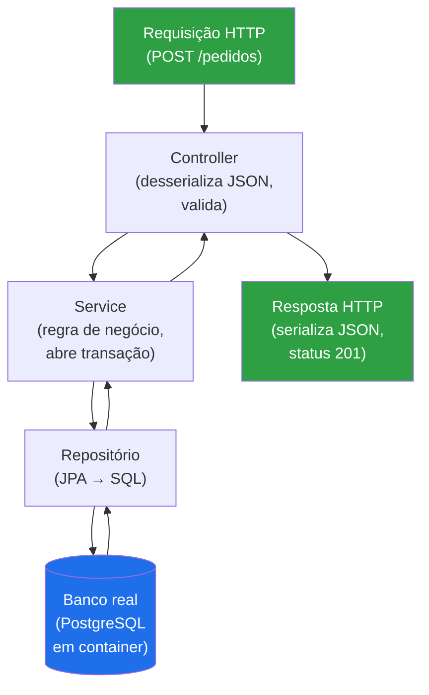
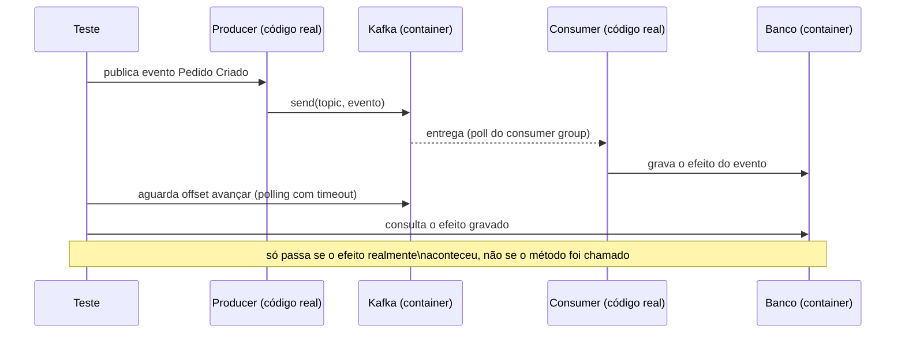
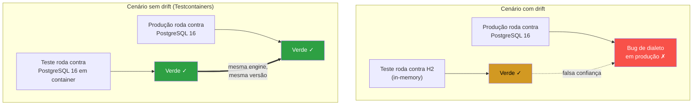
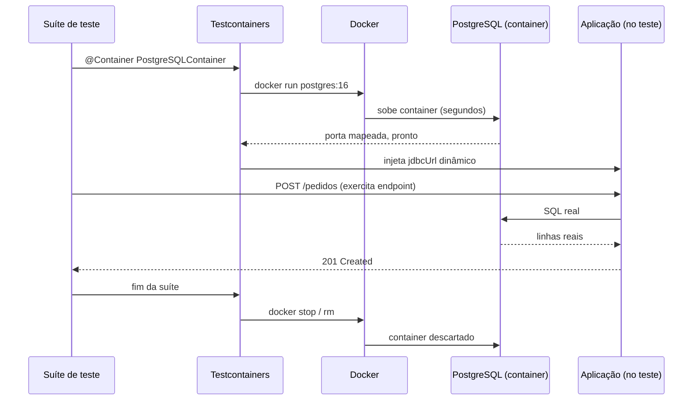
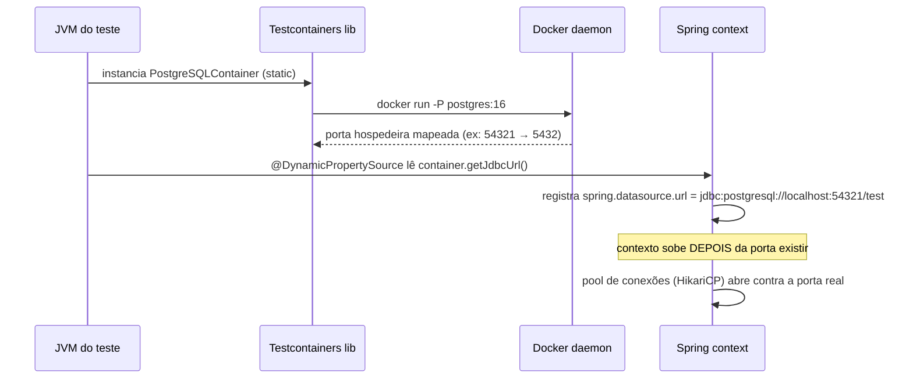

# Testes de integração

> [!abstract] Resumo em uma linha
> Teste de integração exercita a colaboração entre componentes reais — código, banco, fila, cache juntos — pra pegar bugs de **fiação e cola** que o teste unitário, por construção, nunca enxerga: mapeamento ORM torto, serialização que muda de forma, configuração que nunca sobe.
> "Integração" não é um ponto — é um **espectro** que vai de *narrow* (seu código + uma dependência real, isolada) até *broad* (várias services reais conversando) e daí até E2E; cada degrau troca velocidade por realismo.
> O erro mais caro do espectro inteiro é o **drift de ambiente**: testar contra um banco diferente do de produção (H2 no lugar de Postgres, por exemplo) dá verde no teste e vermelho na produção — a suíte inteira vira teatro de confiança.

O [[04 - Testes unitários|teste unitário]] te diz que cada peça funciona sozinha. Mas software não roda como um amontoado de peças isoladas — roda como um sistema, com camadas conversando, mapeamentos traduzindo objetos em SQL, serialização cruzando fronteiras, configuração colando tudo. E é exatamente nessas costuras que mora uma classe inteira de bugs que o unitário, por construção, não vê.

Analogia: testar peças isoladas é checar o motor na bancada, o câmbio na bancada, a suspensão na bancada — cada um aprovado. O teste de integração é **montar o carro e dar a volta no quarteirão**. Só aí você descobre que o motor certo e o câmbio certo, parafusados juntos, vibram numa frequência que afrouxa um suporte. Cada peça passou. A montagem falhou.

## O que é, de verdade

Um teste de integração verifica se unidades desenvolvidas independentemente funcionam **corretamente quando conectadas** (Fowler). O alvo não é a lógica de uma classe — é a **fiação** entre elas e entre o sistema e suas dependências externas.

> [!question] Que tipo de bug isso pega que o unitário não pega?
> O unitário mocka o repositório, então nunca executa o SQL de verdade. O teste de integração roda o SQL contra um banco real. Aí aparecem:
> - **Mapeamento JPA errado** — a anotação gera um SQL que não bate com o schema (coluna inexistente, tipo incompatível, `fetch` que dispara N+1).
> - **Serialização** — o JSON que sai do endpoint não tem o formato que o contrato promete; uma data vira timestamp, um enum vira número.
> - **Configuração** — o bean não foi registrado, a transação não abriu, o pool de conexões está mal dimensionado.
> - **Contrato entre camadas** — o service espera um objeto que o repositório nunca devolve naquele formato.

Nada disso é "lógica". É **cola**. E cola só se testa colando.

### A diferença fica visível na assertion

O jeito mais direto de sentir a diferença entre unitário e integração é olhar pra o que cada um consegue afirmar sobre um repositório.

Num teste unitário do service, o repositório é mockado:

```java
when(pedidoRepository.salvar(any())).thenReturn(pedidoSalvo);
// a asserção verifica que o SERVICE chamou o método certo —
// nunca executa uma linha de SQL, nunca toca o schema real.
verify(pedidoRepository).salvar(pedidoCapturado);
```

Essa asserção prova que o service *delega* corretamente. Ela não prova que `salvar()` de fato grava algo válido — porque `pedidoRepository` é uma casca vazia que só devolve o que você mandou devolver.

Num teste de integração (repositório contra Testcontainers), a asserção muda de natureza:

```java
Pedido salvo = pedidoRepository.salvar(pedidoNovo);
Pedido lido = pedidoRepository.buscarPorId(salvo.getId());
// a asserção verifica o EFEITO OBSERVÁVEL no banco real:
assertThat(lido.getStatus()).isEqualTo(StatusPedido.CRIADO);
assertThat(lido.getItens()).hasSize(3); // testa o mapeamento @OneToMany de verdade
```

Aqui a asserção não sabe nem se importa como `salvar()` foi implementado por dentro — ela só verifica que, depois de gravar e reler, o dado sobrevive com a forma certa. É esse deslocamento — de "o método certo foi chamado" pra "o efeito certo aconteceu no sistema real" — que separa as duas classes de teste, e é também por isso que um teste de integração não pode ser substituído por "mais mocks": mock nenhum garante que o `@OneToMany` está mapeado certo, só o banco real garante.

### A fiação testada junta

Vamos ver o que entra em jogo num teste de endpoint HTTP de ponta a ponta dentro do processo — controller, service, repositório e banco, todos reais.



Leitura do diagrama: o teste manda uma requisição de verdade e inspeciona a resposta de verdade. No caminho, ele exercita a desserialização, a validação, a regra de negócio, a transação, o SQL gerado pelo JPA e a serialização da volta. Um único teste cobre **seis fronteiras**. Se qualquer cola estiver torta, ele quebra — e te diz onde.

## Onde brilha

Nem todo código merece um teste de integração. Mas alguns pontos só se validam assim:

> [!tip] Os candidatos naturais
> - **Repositórios** — o SQL gerado está correto? A query nativa funciona no dialeto do banco de produção? O `@Query` com paginação devolve o que promete?
> - **Endpoints HTTP** — o stack completo (controller → service → repo → banco) responde com o status, o corpo e os headers certos?
> - **Fluxos assíncronos** — a mensagem publicada na fila chega no consumidor? O offset do Kafka avança? A reprocessagem é idempotente?
> - **Interação com infra** — o objeto realmente é gravado no S3? O cache no Redis expira no TTL configurado? O lock distribuído segura?

Repare: tudo aqui é **borda do sistema**. O miolo de regra de negócio fica melhor no unitário, que é mais rápido e mais focado. A integração guarda a borda — onde o seu código encosta em algo que você não escreveu.

### Fluxo assíncrono — o exemplo que mais confunde

Dos quatro candidatos acima, o fluxo assíncrono é o que mais gente testa errado, porque a tentação é mockar o broker e verificar só que `producer.send()` foi chamado — o que é teste unitário disfarçado, não integração. Um teste de integração de verdade precisa fechar o ciclo: publicar de verdade, deixar o consumidor de verdade processar, e verificar o efeito observável do outro lado.



Dois detalhes técnicos separam esse teste de um teste unitário que finge ser integração:

1. **Espera ativa, não `sleep` fixo.** Consumo é assíncrono por natureza — o teste precisa fazer *polling* com timeout (ex: Awaitility em Java) até o efeito aparecer, nunca um `Thread.sleep(2000)` chutado. Um `sleep` fixo é a origem clássica de [[11 - Testes flaky|flakiness]]: rápido demais no CI carregado, e "rápido demais na sua máquina" também mascara bugs de timing reais.
2. **Idempotência é parte do teste, não um extra.** Kafka garante *at-least-once* por padrão — reentrega acontece. Um teste de integração honesto publica o mesmo evento duas vezes e verifica que o efeito não duplica (ex: via chave de idempotência na tabela), porque é exatamente esse comportamento que quebra em produção sob rebalance de partição.

## O espectro de "integração"

"Teste de integração" não é um ponto, é um **intervalo**. Fowler observa que muita gente assume que integração é necessariamente *broad* (de escopo largo), quando ela costuma ser mais eficaz com escopo estreito.


Leitura do diagrama: da esquerda pra direita, cresce o escopo, cresce o custo e cai a velocidade. À esquerda, dois objetos reais colaborando — quase um unitário sociável. No meio, **narrow integration** (Fowler): você testa só a fatia do código que conversa com um serviço externo, usando um substituto controlado daquele serviço. À direita, **broad integration**: versões reais de vários serviços, exigindo ambiente de teste robusto e acesso de rede.

> [!note] Integração ≠ E2E
> A confusão é comum, então cravando a fronteira:
> - **Integração** testa a *colaboração de componentes* — não precisa de UI, não precisa do fluxo de negócio inteiro. "O repositório grava certo no Postgres" é integração.
> - **E2E** testa um *fluxo de usuário ponta a ponta* — normalmente atravessa a UI e simula a jornada real. "Usuário faz login, adiciona ao carrinho, finaliza compra, recebe e-mail" é E2E.
>
> Todo E2E é uma forma extrema de integração broad, mas nem toda integração é E2E. A maioria dos seus testes de integração não tocam UI nenhuma.

Veja como esses degraus se encaixam na contagem total em [[02 - A pirâmide de testes e suas variações]].

### Narrow integration na prática — três formas de isolar sem perder realismo

Fowler chama atenção pra um erro comum: assumir que "testar de verdade" exige o sistema inteiro de pé (broad). Na prática, narrow integration cobre a maioria dos casos com uma fração do custo, porque você troca **um** dos lados da fronteira por um substituto controlado, e mantém real só o lado que você está testando:

| Técnica | O que fica real | O que vira substituto | Quando usar |
|---|---|---|---|
| **Container descartável** (Testcontainers) | Seu código + o protocolo/dialeto exato da dependência | Nada — a dependência roda de verdade, só que isolada e efêmera | Banco, fila, cache — qualquer dependência com imagem Docker oficial |
| **Test double remoto** (WireMock, stub server) | Seu código + o contrato HTTP/gRPC | O serviço remoto, substituído por um servidor que você controla | API de terceiro sem sandbox, ou serviço interno caro de subir |
| **Fake in-process** | Seu código + a interface | A implementação da dependência, trocada por uma versão simplificada que respeita o mesmo contrato | Quando nem container nem stub HTTP fazem sentido (ex: um SDK sem modo de teste) |
| **Broad integration** | Vários serviços reais + a rede entre eles | Nada — tudo real, inclusive a topologia | Quando o próprio bug que te preocupa é de interação *entre* serviços (ex: race condition distribuída) |

A escolha não é estética — é sobre **o que exatamente você quer arriscar não testar**. Um container testa o dialeto real do banco mas não testa timeout de rede. Um stub HTTP testa o contrato mas não testa se o serviço real de fato responde daquele jeito em produção — por isso contratos merecem revalidação periódica (ex: contract testing consumer-driven), fora do escopo desta nota.

O ponto prático: **narrow não é "integração de segunda classe"**. É a forma default. Você só sobe pra broad quando o bug que te preocupa mora exatamente na interação *entre* múltiplos serviços reais — e aí o custo (ambiente, tempo, flakiness) precisa se justificar pelo risco.

## O drift do ambiente — o ponto-chave

Aqui está o erro silencioso que envenena suítes de integração inteiras: **testar contra um banco diferente do de produção**.

O padrão clássico é usar um banco in-memory como o H2 no teste e PostgreSQL em produção. Parece esperto — H2 sobe em milissegundos, não precisa de Docker, roda em qualquer máquina. Mas você acabou de criar um **drift**: o teste valida o comportamento de um banco que **não é o que vai pra produção**.

A cura é não negociar com a realidade: rode o teste contra **o mesmo banco, na mesma versão, de produção**.



Leitura do diagrama: em cima, o teste valida um banco e a produção usa outro — a linha pontilhada é a "confiança" que não se sustenta, porque o verde do H2 não diz nada sobre o Postgres. Embaixo, teste e produção usam a **mesma engine na mesma versão**; o verde do teste de fato prevê o verde da produção. É a diferença entre testar o seu sistema e testar uma fantasia dele.

## Testcontainers — descartável e idêntico

Testcontainers resolve o drift de forma direta: sobe a dependência real (PostgreSQL, Redis, Kafka, MongoDB...) num **container Docker descartável**, por suíte ou por teste, e joga fora no fim.

Isso mata dois problemas de uma vez:

1. **O drift** — o container roda a mesma imagem que vai pra produção. Zero divergência de dialeto.
2. **O ambiente compartilhado** — nada de "banco de teste" único na rede, que acumula sujeira de execuções anteriores, sofre corrida entre dois CIs rodando ao mesmo tempo e está sempre "quase certo". Cada execução ganha o seu container limpo.

## Casos práticos

> [!example] Como isso mudou meu fluxo
> Testcontainers mudou completamente como eu escrevo testes de integração. Antes, tinha um PostgreSQL local "de teste" que drift-ava do de produção. Com Testcontainers, cada PR tem um PostgreSQL idêntico ao de produção, subido em segundos, descartado depois. Zero configuração compartilhada, zero drift.

Esse é o caso-âncora: o problema não era "não testar contra Postgres", era **não testar contra o Postgres certo, no lugar certo, sem rastro entre execuções**. O container resolve os três.

> [!note] Só há um caso de mão-na-massa registrado aqui
> Este é o único cenário real disponível pra esta nota — o do drift de banco resolvido com Testcontainers. Não há um segundo caso trabalhado (por exemplo, fila ou cache) além do que já está descrito no restante do texto; forçar um segundo "caso prático" sem lastro seria inventar experiência que não existe. Se você quer ver o mesmo raciocínio aplicado a outra pilha, os alvos de fronteira em [[#O que vem a seguir]] cobrem Python, Java e Go.



Leitura do diagrama: o ciclo de vida do container é amarrado ao ciclo do teste. O container sobe, a aplicação recebe a URL dinâmica (porta aleatória, então dois testes em paralelo não colidem), o teste exercita o endpoint contra o banco real e, no fim, tudo é descartado. Nenhum estado sobrevive entre execuções — é o oposto do banco compartilhado eterno.

## O custo — e como mantê-lo são

Não existe almoço grátis. Teste de integração é mais lento (**segundos** contra os **milissegundos** do unitário), exige Docker no ambiente de CI e consome mais memória. Por isso a regra da [[02 - A pirâmide de testes e suas variações|pirâmide]]: muitos unitários, **menos** integração, pouquíssimo E2E.

Pra dar escala ao "mais lento": um teste unitário típico roda em dezenas de milissegundos porque não há I/O nenhum — é só JVM (ou runtime equivalente) executando bytecode em memória. Um teste de integração com Testcontainers soma o tempo de boot do container (tipicamente 1-3 segundos pra Postgres, já com a imagem em cache local), a abertura do pool de conexões, e a execução do SQL real. Multiplicado por centenas de testes, essa diferença de ordem de grandeza é o motivo pelo qual ninguém escreve uma suíte inteira de integração — o custo marginal de cada teste é real, e a pirâmide existe justamente pra manter a maioria dos testes na base barata.

Duas alavancas reduzem esse custo sem abrir mão do realismo:

- **Cache de imagem local** — a primeira vez que o CI puxa `postgres:16` custa o download completo; runs subsequentes reaproveitam a camada em cache do runner. Runners efêmeros (que sobem do zero a cada build) pagam esse custo toda vez — vale a pena um runner com cache persistente de imagens Docker justamente por causa disso.
- **Reaper (Ryuk) com timeout configurável** — se a suíte crasha antes de derrubar o container, o Ryuk garante a limpeza depois de um timeout; em CI compartilhado isso evita que um build quebrado deixe containers vivos consumindo memória do runner pro build seguinte.

> [!tip] Mantendo a proporção e a velocidade
> - **Reuso de container** — suba o container uma vez por suíte (singleton), não por método de teste. Subir um Postgres por teste é o caminho mais rápido pra uma suíte de 20 minutos.
> - **Paralelismo** — porta dinâmica e schema isolado deixam testes rodarem em paralelo sem colisão.
> - **Dados limpos por teste** — rollback de transação ao fim de cada teste, ou `TRUNCATE` direcionado. Banco sujo é berço de [[11 - Testes flaky|teste flaky]] (passa sozinho, falha na suíte).
> - **Guarde a integração pra borda** — não teste regra de negócio via endpoint quando um unitário resolve. Cada teste de integração lento precisa justificar o custo.
> - **Meça antes de otimizar** — se a suíte de integração ficou lenta, meça onde: boot de container repetido, query sem índice, ou paralelismo mal configurado são diagnósticos diferentes com curas diferentes. Otimizar no escuro tende a trocar velocidade por realismo sem necessidade.

Não caia na armadilha de testar implementação por baixo do pano: um teste de integração ainda deve verificar **comportamento observável** (o que o endpoint devolve, o que ficou gravado), não a sequência interna de chamadas — princípio detalhado em [[06 - Testar comportamento, não implementação]].

O mecanismo por trás do "rollback de transação" merece uma linha: no Spring, `@Transactional` num teste abre uma transação antes do método rodar e faz `ROLLBACK` automático no fim — mesmo que o teste tenha feito `INSERT`, `UPDATE`, `DELETE` de verdade contra o container. O banco nunca fica sujo entre testes porque, do ponto de vista dele, nada foi de fato *commitado*. É mais barato que `TRUNCATE` (não precisa recriar índices nem sequences) e funciona bem pra testes de repositório isolado — mas quebra pra cenários que dependem de commit real, como o fluxo assíncrono descrito acima, onde o consumidor só vê o dado depois que a transação do producer commitou.

| Estratégia | Custo | Funciona com fluxo assíncrono? |
|---|---|---|
| `@Transactional` + rollback | Baixo (sem I/O extra) | Não — o consumidor nunca vê dado não commitado |
| `TRUNCATE` direcionado | Médio (reseta tabelas específicas) | Sim — o commit acontece de verdade |
| Container novo por teste | Alto (boot completo) | Sim, mas caro demais pra ser a norma |

## Ferramental (sem virar tutorial)

No ecossistema Java/Spring, o teste de integração se apoia em:

- **`@SpringBootTest`** — sobe o contexto da aplicação (parcial ou inteiro) pro teste.
- **`@DataJpaTest`** — fatia o contexto só pra camada de persistência; ótimo pra testar repositório contra um banco real (com Testcontainers, não com o H2 default).
- **`MockMvc` / `WebTestClient`** — exercitam endpoints HTTP dentro do processo, sem subir um servidor de rede.
- **Testcontainers** — os containers descartáveis de Postgres/Redis/Kafka, integrados via `@Testcontainers` e `@ServiceConnection`.
- **WireMock** — stub de HTTP externo pra eliminar a dependência de rede.

O aprofundamento de cada um vive em [[Testes em Java]]. Aqui o que importa é o **conceito**: você está testando colaboração contra dependências reais, idênticas às de produção, descartáveis e isoladas.

> [!note] A ideia é portável — a ferramenta não
> Nada do que está acima é exclusivo do Java. `@SpringBootTest` e `@DataJpaTest` são a materialização Spring do mesmo conceito que o `TestClient` resolve em Python (FastAPI) ou que containers explícitos resolvem em Go, sem framework de injeção de dependência nenhum por baixo. O vocabulário muda, o problema — fiação real, drift zero, container descartável — é o mesmo em qualquer stack. Os três alvos de fronteira em [[#O que vem a seguir]] mostram essa mesma ideia com sotaques diferentes.

## Mecanismo — como a URL do banco chega até a aplicação

Uma dúvida que trava quem começa com Testcontainers: se o container sobe numa porta **aleatória** (pra permitir paralelismo), como o Spring sabe pra onde conectar? A resposta é injeção de configuração em tempo de execução, não em tempo de compilação.



Duas peças resolvem isso:

1. **`@DynamicPropertySource`** (ou, no Spring Boot 3.1+, a anotação `@ServiceConnection`) registra a propriedade `spring.datasource.url` **depois** que o container já subiu e já tem porta atribuída — a ordem importa: o container precisa existir antes do `ApplicationContext` tentar abrir o pool de conexões.
2. **Ryuk**, um container-sentinela que o Testcontainers sobe junto, garante que containers órfãos (JVM que crashou, CI que matou o processo) sejam removidos mesmo sem `docker stop` explícito — é o que evita o host de CI acumular containers zumbis entre builds.

`@ServiceConnection` elimina até o `@DynamicPropertySource` manual: a anotação lê os metadados do container (driver, usuário, senha, porta) e configura o `DataSource` sozinha, reduzindo o boilerplate a uma linha por dependência.

> [!tip] Reuso de container entre runs locais (`withReuse(true)`)
> Por padrão, o Testcontainers sobe e derruba o container a cada execução da suíte — correto para CI, mas custoso enquanto você itera localmente rodando o mesmo teste várias vezes seguidas. A flag `.withReuse(true)` (junto com `testcontainers.reuse.enable=true` no `~/.testcontainers.properties`) mantém o container vivo entre execuções locais, cortando o boot repetido. É uma otimização de *loop de feedback do desenvolvedor*, não de produção — em CI o comportamento padrão (descartar sempre) continua sendo o certo, porque cada build precisa de um ambiente limpo e verificável, sem herdar estado de um build anterior.

Vale distinguir Testcontainers de um `docker-compose.yml` de teste, porque as duas soluções resolvem "sobe uma dependência real" de formas diferentes: o compose sobe um ambiente compartilhado e estático, geralmente por fora do ciclo de vida do teste — alguém (ou o CI) precisa lembrar de subir e derrubar; o Testcontainers amarra o container ao código do teste, na mesma linguagem, com ciclo de vida gerenciado pela própria JVM (ou runtime equivalente). É a diferença entre infraestrutura como um passo manual à parte e infraestrutura como parte do teste — a segunda é o que fecha o problema do "banco de teste compartilhado" descrito lá em cima.

## Armadilhas comuns

> [!danger] Drift de ambiente — por que ele te trai exatamente quando dói
> H2 e PostgreSQL divergem em coisas que importam:
> - **Dialeto SQL** — `INSERT ... ON CONFLICT DO NOTHING` (upsert do Postgres) não funciona no H2 por padrão. Funções JSONB, window functions específicas, `ON CONFLICT`, CTEs recursivas — o H2 ou não suporta ou suporta diferente.
> - **Tipos** — JSONB, arrays, tipos geográficos, `uuid` nativo. O H2 finge ou erra.
> - **Locking e isolamento** — níveis de isolamento de transação, comportamento de deadlock, `SELECT ... FOR UPDATE`. (Veja [[03-Dominios/Ciência/Banco de Dados/index|Banco de Dados]] pra entender por que isso é tão sensível.)
> - **Case sensitivity, charset, NULL ordering** — sutilezas que vazam.
>
> Resultado: **o teste passa, a produção quebra.** O verde te deu falsa confiança. Você só descobre o bug com o cliente reclamando.

> [!warning] Rede externa = flaky garantido
> Um teste que de fato chama uma API de terceiro pela internet é, por definição, um [[11 - Testes flaky|teste flaky]]: depende de DNS, latência, disponibilidade alheia e rate limit. Pra testar a *sua* integração com um HTTP externo sem essa fragilidade, suba um servidor stub local (WireMock e similares) que você controla — assim valida o contrato sem refém da rede. Veja o ferramental em [[Testes em Java]].

> [!warning] Container por teste em vez de por suíte
> É tentador criar o container dentro de cada método de teste (`@BeforeEach`) achando que isso garante isolamento total. Na prática, isso multiplica o custo: subir um Postgres leva segundos, e uma suíte com 200 testes de integração vira 200 boots de container — a diferença entre uma suíte de 20 segundos e uma de 20 minutos. A prática recomendada é o container **singleton por suíte** (campo `static`), com isolamento de dados garantido por outro mecanismo — rollback de transação ou `TRUNCATE` direcionado ao fim de cada teste, não recriação do container inteiro.

> [!info] Ambiente de CI sem Docker — verifique antes, não depois
> Testcontainers precisa de um daemon Docker acessível. Em CI gerenciado (runners hospedados, ambientes com contêiner-dentro-de-contêiner restrito) isso nem sempre vem de fábrica. Este não é um terceiro item de armadilha vivida — é um lembrete técnico: confira o suporte a Docker-in-Docker (ou um daemon remoto via `DOCKER_HOST`) do seu provedor de CI antes de construir a suíte inteira em cima de Testcontainers.

## Em entrevista

> [!quote] Como falar disso em inglês
> Integration tests verify that independently developed components work correctly **when wired together** — they catch the bugs unit tests can't see, like a JPA mapping that generates wrong SQL, broken serialization, or misconfigured beans. I keep my unit tests for business logic and reserve integration tests for the **edges**: repositories, HTTP endpoints, and async flows.
>
> The single most important thing here is **avoiding environment drift**. I never test against an in-memory H2 when production runs PostgreSQL — the SQL dialects, types, and locking behavior diverge, so the test goes green and production breaks. I use **Testcontainers** to spin up a disposable PostgreSQL container that's **identical to production**, per test suite, and throw it away afterward. Zero shared configuration, zero drift.
>
> The trade-off is speed — integration tests run in seconds, not milliseconds, and need Docker — so I keep the pyramid healthy: many unit tests, fewer integration tests. I also never let a test hit a real external network, because that's a recipe for flakiness; I stub those with WireMock instead.

### Vocabulário

| PT | EN |
|---|---|
| teste de integração | integration test |
| fiação / cola entre camadas | wiring / glue between layers |
| escopo estreito × largo | narrow × broad scope |
| drift do ambiente | environment drift |
| dialeto SQL | SQL dialect |
| container descartável | disposable container |
| dependência externa | external dependency |
| servidor stub | stub server |
| nível de isolamento de transação | transaction isolation level |
| teste instável | flaky test |
| container descartável singleton | singleton disposable container |
| espera ativa (com timeout) | active polling / awaitility |
| pelo menos uma vez (semântica de entrega) | at-least-once delivery |
| chave de idempotência | idempotency key |
| container órfão / zumbi | orphaned / zombie container |
| test double remoto | remote test double |
| container sentinela (limpeza) | resource reaper |
| serviço externo | external service |
| commit real (vs. rollback) | real commit (vs. rollback) |
| topologia de serviços | service topology |

## Fontes

- Martin Fowler — [bliki: Integration Test](https://martinfowler.com/bliki/IntegrationTest.html) — define integração como verificar unidades conectadas e distingue *narrow* × *broad* integration tests.
- Testcontainers — [The simplest way to replace H2 with a real database for testing](https://testcontainers.com/guides/replace-h2-with-real-database-for-testing/) — guia oficial sobre containers descartáveis idênticos ao banco de produção.
- Philipp Hauer — [Don't use In-Memory Databases (H2, Fongo) for Tests](https://phauer.com/2017/dont-use-in-memory-databases-tests-h2/) — o caso detalhado contra o drift de banco in-memory.

> [!tip] Vídeo — Testcontainers mudando o fluxo de testes
> [Testcontainers have forever changed the way I write tests](https://www.youtube.com/watch?v=sNg0bnMF_qY) (Dreams of Code, ~12min) percorre exatamente o arco desta nota: por que um banco de teste "quase igual" ao de produção trai você, e como um container descartável fecha esse gap. Bom complemento em vídeo pro caso Testcontainers×drift descrito em [[#Casos práticos]].

## O que vem a seguir

O conceito aqui é agnóstico de linguagem — a fiação, o drift e o espectro narrow×broad valem pra qualquer stack. O que muda é a ferramenta que materializa cada peça. Pra ver o mesmo raciocínio aplicado:

- Em Python, a dupla [[03-Dominios/Tecnologia/Python/Testes/05 - Testando a API REST — TestClient e dependency overrides|Testando a API REST — TestClient e dependency overrides]] e [[03-Dominios/Tecnologia/Python/Testes/06 - Testando a camada de persistência — banco de teste e rollback|Testando a camada de persistência — banco de teste e rollback]] mostra como o FastAPI resolve a mesma fiação (endpoint real, banco real, rollback por teste) sem o vocabulário Spring.
- Em Java, [[03-Dominios/Tecnologia/Java/Testes/11 - Testcontainers — infra real em testes|Testcontainers — infra real em testes]] é o aprofundamento direto do `@ServiceConnection`/`@DynamicPropertySource` explicado acima — a ferramenta que esta nota só introduziu.
- Em Go, [[03-Dominios/Tecnologia/Go/15 - Testes/05 - Testes de integração|Testes de integração]] mostra o mesmo espectro narrow×broad e o mesmo combate ao drift, mas sem framework — só a standard library e containers explícitos.

Vale a pena ler pelo menos um desses alvos mesmo se você não usa a linguagem no dia a dia: ver o mesmo problema resolvido sem o vocabulário Spring separa o **conceito** (fiação real, drift zero, container descartável) da **implementação particular** — e é exatamente essa separação que costuma faltar em quem só conhece integração pelo `@SpringBootTest`.

Se você chegou até aqui pelo ângulo de entrevista, o próximo passo natural é [[16 - Estratégia de testes em entrevista]], que amarra integração, unitário e E2E numa resposta única.

## Veja também

- [[02 - A pirâmide de testes e suas variações]] — quanto de integração cabe na suíte
- [[04 - Testes unitários]] — o contraponto rápido e isolado
- [[06 - Testar comportamento, não implementação]] — integração também testa comportamento observável
- [[11 - Testes flaky]] — rede externa e banco sujo como fontes de instabilidade
- [[15 - Testes em CI-CD]] — onde os containers sobem no pipeline
- [[16 - Estratégia de testes em entrevista]] — como posicionar integração na conversa
- [[03-Dominios/Engenharia/Testes/index|Testes]] — índice da trilha
