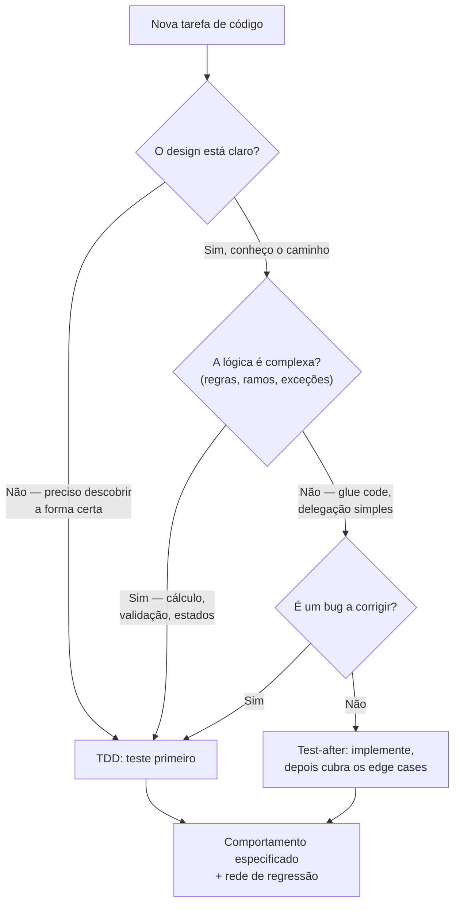
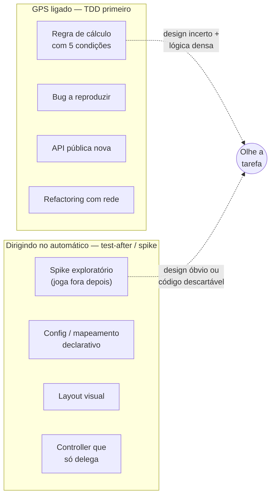
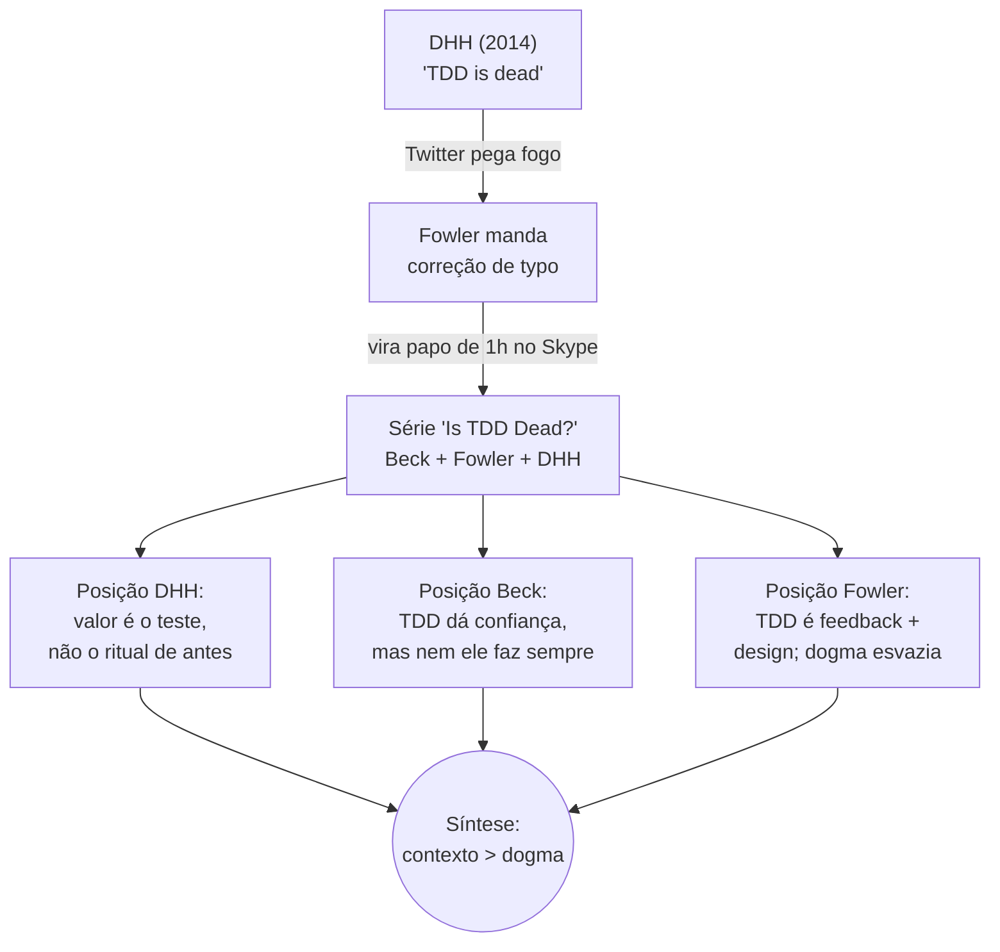
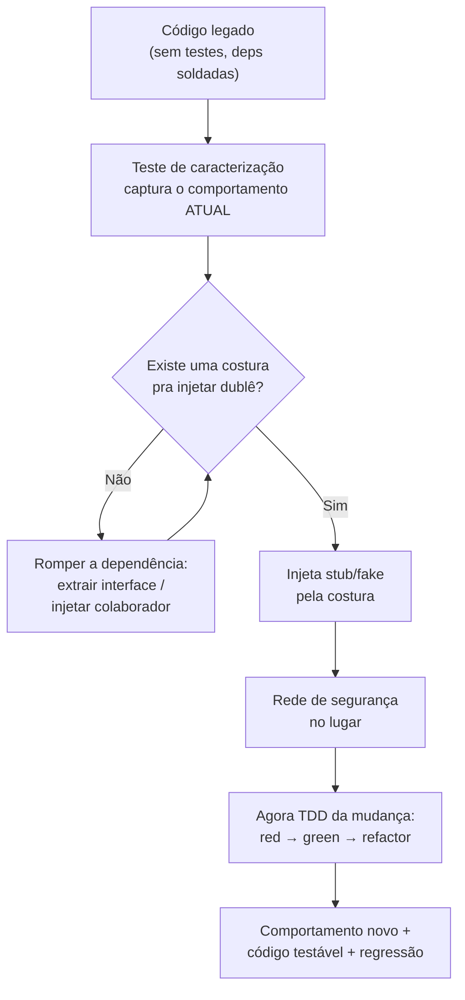
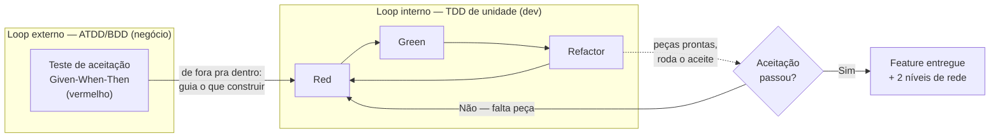

# TDD na prática

> [!abstract] Resumo
> TDD é um GPS para terreno desconhecido: você liga o GPS quando dirige por uma cidade estranha à noite, não quando vai do sofá até a cozinha — a mesma lógica separa quando teste-primeiro paga dividendos de quando só adiciona cerimônia. A heurística que decide isso não é gosto pessoal: ligue o GPS quando o **design está incerto** ou a **lógica é complexa** (regras, ramos, exceções); dirija no automático — test-after — quando o caminho já é óbvio, declarativo ou descartável. A prática madura trata isso como leitura de contexto, não como dogma: nem Kent Beck, o criador do TDD, reivindica que ele seja universal — e quem o trata como religião está sendo mais fundamentalista que o próprio Beck.

A mecânica do ciclo — vermelho, verde, refatorar — está em [[08 - TDD - o ciclo Red-Green-Refactor]]. Esta nota não repete o "como". Ela ataca a pergunta que separa o praticante do fanático: **quando** ligar o GPS, e quando guardá-lo no bolso.

Porque a verdade incômoda é esta: TDD não é uma religião. É uma ferramenta. E como toda ferramenta, tem contextos onde brilha e contextos onde só te atrasa. Confundir as duas coisas é o erro mais comum de quem acabou de aprender a técnica e ainda não cicatrizou as primeiras feridas.

## A analogia do GPS

Imagine que você vai dirigir até um endereço que nunca visitou, numa cidade estranha, à noite, com obras na via. Você liga o GPS. Ele te dá feedback a cada curva, te avisa quando você errou, te recalcula a rota sem julgamento. Sem ele, você se perde.

Agora imagine que você vai do sofá até a cozinha. Ligar o GPS aqui não é "disciplina" — é teatro. Você já conhece o caminho. O GPS só adiciona cerimônia a um percurso que seus pés fazem no automático.

TDD é o GPS. O terreno desconhecido é a **lógica complexa** e o **design incerto**. O caminho de casa é o **código óbvio, declarativo, repetitivo**. O praticante maduro sabe olhar para a tarefa e decidir: *isto aqui é a cidade estranha à noite, ou é a cozinha?*

> [!question] A pergunta que governa tudo
> Antes de escrever o primeiro teste, pergunte: **eu sei o que vou construir e como?** Se a resposta é "mais ou menos", "ainda não", ou "depende de cinco regras que eu nem mapeei direito" — ligue o GPS. Se a resposta é "trivialmente, é só passar o dado adiante" — dirija no automático e teste os cantos depois.

## Quando TDD brilha

Há quatro situações onde escrever o teste primeiro paga dividendos reais, não ideológicos.

### Lógica de negócio não-trivial

Regras de cálculo, validações com múltiplas condições, máquinas de estado, precificação. Aqui cada cenário é uma hipótese que você ainda não validou. Escrever o teste primeiro força você a *especificar o comportamento esperado antes de se comprometer com uma estrutura de código* — e é exatamente nesse momento que abstrações erradas se revelam baratas de corrigir. O caso da comissão em [[#Casos práticos]] é o exemplo concreto desse mecanismo: não foi a "disciplina" que salvou o design, foi o **feedback precoce** de um teste do meio do caminho expondo a falha enquanto os testes anteriores ainda seguravam o código.

### Correção de bugs

Esta é, talvez, a aplicação menos controversa de TDD. Antes de tocar no código, escreva um teste que **reproduz o bug** — um teste que falha exatamente porque o bug existe. Só então corrija. Quando o teste passa, você tem duas garantias: o bug foi corrigido, e ele virou um **teste de regressão** que impede a falha de ressuscitar.

```python
# 1. O bug: desconto de 100% deveria zerar o preço, mas dá negativo
def test_desconto_de_cem_por_cento_zera_o_preco():
    pedido = Pedido(valor=200)
    pedido.aplicar_desconto(percentual=100)
    assert pedido.total == 0  # FALHA hoje: retorna -200

# 2. Agora você corrige a aritmética. O teste fica verde.
# 3. O teste mora no suite para sempre. O bug não volta sem ser notado.
```

> [!tip] Por que o teste vem antes da correção
> Se você corrige primeiro e escreve o teste depois, como sabe que o teste realmente capturaria o bug? Um teste que nunca viu o erro acontecer é um teste no qual você não pode confiar. Ver o vermelho **antes** da correção é a prova de que o teste tem dentes.

### Desenho de API pública

Quando você escreve o teste primeiro, você é o **primeiro consumidor** da sua própria API. Você sente, na pele, se a assinatura é desajeitada, se exige cinco parâmetros que ninguém vai lembrar a ordem, se obriga o chamador a montar um estado complicado só pra invocar um método. O teste vira um exercício de *design de uso* antes de design de implementação. Isso conecta diretamente com [[06 - Testar comportamento, não implementação]]: você descreve o que a API faz, não como ela faz.

### Refactoring

Aqui TDD entra pela porta de trás. Antes de mexer numa estrutura existente, você precisa de uma **rede de segurança**. Os testes são essa rede. Você refatora sabendo que, se quebrar qualquer comportamento, o suite grita. Sem rede, refatorar é equilibrismo: tecnicamente possível, terrivelmente arriscado.



> Esse fluxograma é o roteiro de decisão que roda na minha cabeça antes de cada tarefa não-trivial.

**Leitura do diagrama:** a primeira bifurcação é sobre *incerteza de design* — se você não sabe a forma certa, TDD te ajuda a descobrir. A segunda é sobre *complexidade de lógica* — muitos ramos pedem especificação prévia. A terceira captura o caso especial dos bugs, onde teste-primeiro é quase sempre certo. Tudo o que escapa dessas três peneiras cai em test-after.

## Quando TDD atrapalha

Igualmente importante — e quase nunca ensinado com a mesma ênfase — é reconhecer onde o GPS só atrapalha.

### Exploração e prototipagem

Você ainda não sabe o que está construindo. Está tateando uma API de terceiro que nunca usou, experimentando se uma biblioteca aguenta o caso, descobrindo o formato real de um payload. Escrever testes para código que você vai **jogar fora em uma hora** é desperdício puro. Aqui mora o **spike**: programação exploratória descartável, onde o valor é o aprendizado, não o código.

> [!note] Spike-and-stabilize
> Dan North popularizou o padrão *spike and stabilize*: comece com um spike — código sujo, hard-coded, sem testes, só pra responder uma pergunta sobre o desconhecido. Aprendido o que precisava, você **joga o spike fora** e reescreve a solução de verdade com TDD. O spike e o TDD não competem; eles se revezam em momentos diferentes do mesmo problema. Kent Beck, na conversa "Is TDD Dead?", reconhece exatamente isso: há código de exploração e há código de produção, e eles pedem disciplinas diferentes.

### Código puramente declarativo

Arquivos de configuração, mapeamentos um-pra-um, DTOs que só carregam dados, declarações de rota. Não há lógica para testar — há *transcrição*. Um teste de configuração geralmente só duplica a configuração em outras palavras, e quando a config muda, o teste muda junto, sem nunca ter pego um erro real. É cerimônia sem feedback.

### UIs visuais

TDD valida comportamento, não estética. Nenhum teste te diz que o botão ficou feio, que o espaçamento está apertado, que o contraste está ruim. "Ficou bom?" é uma pergunta que só o olho humano responde. Você pode (e deve) testar a *lógica* por trás da UI — qual estado renderiza qual elemento — mas o teste-primeiro não é a ferramenta para o pixel.

### Glue code trivial

Um controller que recebe um request, chama um serviço e devolve a resposta. Não há ramo, não há cálculo, não há decisão. Escrever um teste com mock do serviço só pra provar que "o controller chama o serviço" testa o framework, não o seu código. É o overhead clássico que o DHH chama de *test-induced damage* quando vira regra cega.



> O mesmo desenvolvedor, no mesmo dia, transita entre os dois lados conforme a tarefa muda.

**Leitura do diagrama:** o lado esquerdo reúne os casos onde a incerteza de design e a densidade de lógica justificam pagar o custo do teste-primeiro. O lado direito reúne casos onde o caminho já é óbvio ou o código é efêmero — ali, test-after focado em cantos perigosos, ou nenhum teste no caso do spike, é a escolha econômica. O nó central lembra que a decisão não é dogma: é leitura da tarefa concreta.

## A posição pragmática

O praticante maduro não é "a favor" ou "contra" TDD. Ele aplica uma heurística:

- **Teste-primeiro (TDD)** quando o design não está claro *ou* a lógica é complexa. O ciclo de [[08 - TDD - o ciclo Red-Green-Refactor]] te dá feedback no momento mais barato possível para errar.
- **Test-after** quando o caminho é óbvio. Implemente direto, depois escreva testes focados nos **edge cases** — nulos, limites, formatos inválidos, vazios. Veja [[10 - Técnicas de teste e edge cases]] para o catálogo desses cantos.

O caso da tela de cadastro em [[#Casos práticos]] é o espelho do caso da comissão: mesma cabeça, decisões opostas. Lá, o design era incerto e a lógica densa — TDD ganhou. Aqui, o caminho era óbvio e repetitivo — test-after ganhou. **Ambas corretas.** É isso que separa o pragmatismo do dogma.

## Casos práticos

Os dois casos abaixo não são hipotéticos — são o mesmo tipo de decisão, tomada em direções opostas, pela mesma pessoa, no mesmo tipo de projeto. Formalizados aqui lado a lado, o contraste fica mais nítido do que espalhado pela nota.

> [!example] Caso 1 — Quando o TDD me salvou (design incerto + lógica densa)
> A regra de cálculo de comissão tinha cinco condições e múltiplas exceções por especialidade. Comecei escrevendo testes para cada cenário (com Object Mothers) antes de qualquer implementação. O resultado: ao escrever o quinto teste, percebi que minha abstração inicial estava errada — refatorei e recomecei sem medo, porque os testes anteriores pegavam qualquer quebra.

> [!example] Caso 2 — Quando o test-after venceu (design óbvio + lógica repetitiva)
> Um caso onde TDD atrapalharia: uma tela de cadastro com 30 campos e validações padrão. Aqui, o pragmatismo venceu: implementei direto e escrevi testes depois focando em edge cases (campos nulos, máximo de caracteres, formatos inválidos).

O que separa os dois não é o resultado — os dois deram certo — mas a **leitura da tarefa antes de começar**. No caso 1, a incerteza estava na *forma*: cinco condições e exceções por especialidade são terreno onde a abstração errada é fácil de escolher e cara de descobrir tarde. O teste-primeiro comprou essa descoberta cedo, pelo preço de um quinto teste. No caso 2, não havia incerteza de forma — 30 campos com validação padrão têm uma estrutura conhecida de antemão — então o custo do teste-primeiro (especificar 30 vezes um comportamento óbvio) não tinha contrapartida em risco evitado. A heurística da seção [[#A analogia do GPS|A analogia do GPS]] prevê exatamente essa divergência: mesmo praticante, tarefas diferentes, GPS ligado numa e guardado no bolso na outra.

## O debate honesto

Em 2014, David Heinemeier Hansson (DHH, criador do Rails) publicou *"TDD is dead. Long live testing."* O texto não era um ataque a testes — era um ataque ao **test-first fundamentalism**. Sua tese: TDD funciona bem como "rodinhas de bicicleta" para aprender a testar, mas, levado ao extremo, empurra o design para um excesso de unit tests e *test-induced damage* — arquitetura distorcida por mocks só para satisfazer o teste primeiro.

A controvérsia foi tão grande que Martin Fowler organizou uma série de conversas gravadas, *"Is TDD Dead?"*, entre ele, DHH e Kent Beck (o pai do TDD). O que emergiu não foi um vencedor, mas nuance:

- **Beck** defendeu que TDD lhe dá confiança e um ritmo de trabalho, mas admitiu que **ele mesmo nem sempre faz teste-primeiro** — usa quando o problema pede, e spikes quando precisa explorar.
- **Fowler** reforçou que TDD é sobre *feedback* e *design*, e que dogmatizar qualquer prática a esvazia.
- **DHH** manteve que o valor está nos testes, não no ritual de escrevê-los antes.



> A maior briga pública sobre TDD terminou não em ruptura, mas em três pessoas concordando que a resposta é "depende".

**Leitura do diagrama:** o debate nasceu de um post provocativo e escalou via redes sociais, mas o desfecho foi maduro — três das vozes mais influentes da área convergiram para a ideia de que a prática serve ao contexto, não o contrário. Note que nem o criador do TDD reivindica que ele seja universal. Quem o trata como religião está sendo mais dogmático que o próprio Kent Beck.

Vale a advertência antes de seguir: TDD não garante bom design sozinho — ver [[#Armadilhas comuns]].

### A crítica do test-induced design damage, com profundidade

Vale destrinchar o argumento central do DHH, porque ele é mais sério do que "TDD é chato". A tese do *test-induced design damage* é específica: quando você se obriga a escrever o teste **primeiro** e em **isolamento total**, você pressiona o design na direção de mais indireção do que o problema pedia. Para tornar uma classe testável sem tocar o banco, a rede ou o sistema de arquivos, você extrai interfaces, injeta colaboradores, cria camadas de portas e adaptadores — e acaba com cinco objetos onde dois resolveriam, todos costurados por mocks. O DHH chama isso de design *deformado pela testabilidade*: a forma do código passa a servir ao teste, não ao domínio.

É um argumento honesto e há verdade nele. Quem nunca viu um `OrderServiceImpl` que existe só para ter uma `OrderService` que existe só para poder ser mockada num teste que verifica que o controller chama o serviço?

A réplica madura não nega o sintoma — questiona o diagnóstico. O problema descrito não é TDD; é **over-mocking**. Você não precisa mockar tudo para testar primeiro. Pode testar a unidade de lógica com objetos reais e isolar só as fronteiras genuínas (I/O, relógio, aleatoriedade). O dano aparece quando se confunde "testar a unidade" com "mockar todo colaborador" — e aí o teste passa a verificar *como* o código colabora, não *o que* ele entrega. Isso é exatamente a armadilha que [[06 - Testar comportamento, não implementação]] desmonta: teste acoplado à implementação racha a cada refactor e empurra o design para a indireção que o DHH detesta. Em outras palavras, os dois lados concordam no sintoma; a divergência é se a causa é o ritual (DHH) ou o mau uso de dublês (a defesa). Minha leitura: o ritual amplia o estrago de quem já mocka demais, mas não o cria. Tire o over-mocking e boa parte do "dano" evapora.

> [!tip] Uma terceira leitura: o "unit" errado
> No talk *TDD, Where Did It All Go Wrong* (2013), Ian Cooper propõe uma saída diferente da réplica acima: para ele, o dano nasce de uma confusão sobre o que é a "unidade" testada. Muita gente lê *unit test* como "teste de uma classe isolada" — daí a pressão para mockar toda colaboração da classe. Cooper argumenta que a unidade de Kent Beck nunca foi a classe; é o **módulo**, um agrupamento de classes que entrega um comportamento coeso através de uma interface pública. Testar no nível de módulo, e não de classe, elimina boa parte da necessidade de mock nos colaboradores internos — porque eles deixam de ser "fronteira testável" e viram detalhe de implementação por trás da interface pública do módulo. É uma terceira perna na mesma mesa: DHH culpa o ritual, a réplica culpa o over-mocking, Cooper culpa a unidade errada — e os três apontam, por caminhos diferentes, para o mesmo sintoma de excesso de indireção.

Essa divergência tem nome na literatura: Martin Fowler, em *Mocks Aren't Stubs* (2007), batizou as duas escolas de **classicista** e **mockista**. O classicista testa com objetos reais sempre que possível, isolando só o que é caro ou não-determinístico (banco, rede, relógio) — se o colaborador é barato de instanciar, ele entra de verdade no teste, e a asserção verifica o **estado final**. O mockista isola cada colaborador imediato com um dublê e verifica as **interações** — quais métodos foram chamados, com quais argumentos, em qual ordem. Nenhuma das duas está "errada"; são filosofias de design com trade-offs opostos. O classicista aceita testes um pouco mais lentos e menos precisos ao localizar a falha, em troca de refatorações que não quebram o teste (o teste não sabe nem se importa *como* o resultado foi produzido). O mockista ganha testes rápidos e isolados, com falhas cirurgicamente localizadas, em troca de um teste acoplado à estrutura interna — e é aqui que mora o *test-induced design damage* do DHH: o mockismo levado ao extremo, sem limitar mocks às fronteiras genuínas, é a receita que fabrica os cinco objetos costurados por mock que a citação de Cooper e a réplica anterior descrevem por ângulos diferentes.

### O que a evidência empírica diz

Aqui é onde o praticante honesto baixa o tom. A pergunta "TDD funciona?" tem resposta empírica, e ela é **mista**, não um slam-dunk.

O estudo industrial mais citado é o de Nagappan, Maximilien, Bhat e Williams (2008), comparando quatro times na Microsoft (três) e na IBM (um) que adotaram TDD contra times-irmãos no mesmo produto, mesma stack, mesmo gerente, que não adotaram. Resultado: a densidade de defeitos pré-release **caiu entre 40% e 90%** nos times com TDD — mas o tempo inicial de desenvolvimento **subiu de 15% a 35%**. Ou seja: menos bugs, mais lento. O trade-off, não o milagre.

Quando se sobe da anedota para as revisões sistemáticas, o sinal enfraquece e fica dependente de contexto. Meta-análises e revisões de literatura (Turhan e colegas revisaram dezenas de estudos de 2000–2009; Munir e colegas mais de quarenta) convergem para um padrão recorrente: efeito **positivo moderado na qualidade externa**, mas resultados **inconclusivos ou contraditórios na produtividade**. E há um detalhe que separa quem leu dos estudos de quem só cita o título: o efeito de qualidade **encolhe quando se filtram apenas os estudos mais rigorosos**. Muitos experimentos são feitos com estudantes, em tarefas pequenas, sem o longo prazo onde a rede de regressão realmente paga.

Por que a evidência é tão escorregadia? Por uma razão metodológica difícil de escapar: você não consegue rodar um ensaio clínico de TDD. Não dá para construir o mesmo sistema duas vezes, com os mesmos desenvolvedores, mudando só a ordem dos testes — a segunda vez sempre sabe demais sobre a primeira. O estudo da Microsoft/IBM é tão citado justamente porque chegou perto disso com times-irmãos, mas mesmo ali a adoção de TDD vem amarrada a *outras* boas práticas (passos pequenos, integração frequente), e separar o efeito da ordem do efeito do resto é quase impossível. A conclusão honesta de entrevista: TDD é uma aposta com evidência favorável mas modesta, não uma verdade demonstrada — e quem a vende como dogma está indo além do que os dados sustentam.

Vale reter essa cautela metodológica antes de citar o estudo em entrevista — ver [[#Armadilhas comuns]].

## TDD em código legado: você não pode começar pelo teste

Há um pressuposto silencioso em tudo o que foi dito até aqui: que existe um vazio onde você escreve o teste primeiro. Em código novo, sim. Em código **legado**, não. Legado, na definição afiada de Michael Feathers (*Working Effectively with Legacy Code*), é simplesmente **código sem testes** — independente da idade. E código sem testes resiste a TDD por um motivo brutal: ele não foi desenhado para ser testado. As dependências estão soldadas. O método que você quer mudar instancia o repositório lá dentro, fala com o relógio do sistema, abre conexão de rede. Você não tem onde encaixar um dublê.

A ordem se inverte. Antes de escrever o teste do comportamento *desejado*, você escreve um **teste de caracterização** (*characterization test*): um teste que captura o comportamento **atual** do código, exatamente como ele é hoje — inclusive se hoje está "errado". Você não está validando que o código está certo; está fotografando o que ele faz, para que qualquer mudança futura que altere esse comportamento acenda um alarme. É documentação executável do status quo.

O fluxo prático é quase um interrogatório do código: você roda o método com uma entrada, vê o que sai, e *escreve a asserção que afirma exatamente aquela saída* — mesmo que ela te pareça absurda. Se `calcularFrete(0)` devolve `-1`, seu teste de caracterização afirma `== -1`. Você não está dizendo que está certo. Está dizendo "é isto que ele faz hoje", e travando essa realidade.

Por que abraçar um comportamento que pode estar errado? Porque sistemas vivos têm gente dependendo de bugs. Aquele `-1` pode estar sendo tratado três camadas acima como "frete grátis"; corrigir cegamente quebraria o cliente. O teste de caracterização te dá o luxo de **separar dois trabalhos que iniciantes fundem e detonam**: primeiro tornar o código seguro de mudar, depois decidir o que mudar. Com a fotografia travada, qualquer alteração que mexa no comportamento existente acende vermelho, e você decide conscientemente se aquela mudança era intencional.

Para conseguir injetar um dublê onde antes não havia espaço, Feathers ensina a procurar **costuras** (*seams*): lugares no código onde dá para alterar o comportamento **sem editar naquele lugar**. Uma costura de objeto é a mais comum: extraia a dependência soldada para trás de uma interface ou de um parâmetro, e de repente você pode passar um stub no teste e o objeto real em produção. Achar a costura, romper a dependência, cercar com caracterização — só então você tem chão firme para fazer TDD da mudança de verdade.

> [!info] A sequência para domar legado
> 1. **Caracterize** — teste que captura o comportamento atual, mesmo "errado". Vermelho vira verde fotografando a realidade.
> 2. **Ache a costura** — onde dá pra desviar o comportamento sem reescrever no lugar (extrair interface, injetar colaborador).
> 3. **Injete o dublê** — pela costura, ponha um stub/fake no teste; veja [[05 - Test doubles - dummy, stub, spy, mock, fake]] para escolher qual.
> 4. **Agora sim, TDD** — com a rede de caracterização te segurando, escreva o teste do comportamento desejado e mude o código no ciclo red-green-refactor.



> Esse é o caminho que separa "tenho medo de tocar nesse arquivo" de "consigo mudar com segurança".

**Leitura do diagrama:** repare que TDD não é o primeiro passo — é o **último**. Você só chega ao ciclo red-green-refactor depois de construir a rede (caracterização) e abrir espaço para o dublê (costura). O laço entre "achar costura" e "romper dependência" é honesto: às vezes a costura não existe e você precisa refatorar minimamente — com o risco de fazê-lo sem rede — antes de tê-la. Por isso Feathers trata esse primeiro corte como a parte mais delicada do trabalho.

## ATDD/BDD: o loop externo que guia a feature

O ciclo de [[08 - TDD - o ciclo Red-Green-Refactor]] menciona o **double-loop**. Aqui ele ganha carne. A ideia, consolidada por Steve Freeman e Nat Pryce em *Growing Object-Oriented Software, Guided by Tests*, é que TDD de unidade vive num **loop interno** rápido, mas ele é guiado por um **loop externo** mais lento: um **teste de aceitação** escrito na linguagem do negócio.

O loop externo começa de fora para dentro. Você escreve um teste de aceitação que descreve a feature do ponto de vista de quem a usa — frequentemente no formato **Given-When-Then** (Dado um carrinho com dois itens / Quando o cliente aplica o cupom VERAO / Então o total cai 20%). Esse teste fica **vermelho** e assim permanece enquanto a feature não existe inteira. É a sua estrela-guia.

Para fazê-lo passar, você mergulha no loop interno: vários ciclos rápidos de TDD de unidade, cada um construindo uma peça (o parser do cupom, a regra de desconto, o cálculo do total). Quando as peças se encaixam e o teste de aceitação finalmente fica verde, a feature está pronta — e você tem dois níveis de proteção: testes de unidade dizendo *como cada peça funciona* e um teste de aceitação dizendo *que o usuário consegue o que pediu*.

A distinção entre **ATDD** e **BDD** é mais de ênfase que de mecânica. ATDD foca no acordo: a conversa entre negócio, dev e QA que produz o exemplo concreto antes do código. BDD herda isso e investe no *vocabulário ubíquo* — escrever os cenários numa linguagem que o stakeholder lê e valida. Na prática do dia a dia, o que importa é o gesto: **o exemplo de negócio guia o desenvolvimento de fora para dentro**, e o TDD de unidade preenche o miolo.

O que muda na cabeça é o **nível de granularidade**. O teste de unidade pergunta "essa função soma certo?". O teste de aceitação pergunta "o cliente consegue comprar com cupom?". Um fala em objetos e métodos; o outro, em verbos do negócio. Por isso o loop externo é um antídoto contra um vício comum do TDD ingênuo: cobrir 100% das unidades e ainda assim entregar uma feature que não faz o que o usuário queria, porque ninguém testou as peças *juntas* do ponto de vista de fora. O aceite verde é a única prova de que o todo funciona, não só as partes.

A tentação preguiçosa — só escrever testes de aceitação e pular o TDD de unidade — é uma armadilha comum; ver [[#Armadilhas comuns]].



> O loop externo lembra *por que* você está codando; o interno garante que cada peça funciona.

**Leitura do diagrama:** o teste de aceitação no topo é lento e raro — um por feature — e fala a língua do negócio. Ele dispara muitas voltas do ciclo rápido de unidade embaixo. A seta de volta (`Refactor` para a verificação de aceite) mostra o momento de checar se já dá para fechar a feature: enquanto o aceite estiver vermelho, você volta ao loop interno. O verde do loop externo é o sinal de "entregável", não o verde de um único teste de unidade.

## Test desiderata: as propriedades em tensão

Tudo o que foi dito até aqui pressupõe que "escrever um bom teste" é um alvo único. Não é. Em *Test Desiderata*, Kent Beck lista doze propriedades que um teste ideal teria — e o ponto do texto não é a lista, é a advertência que a acompanha: **nenhuma propriedade deveria ser abandonada sem receber, em troca, uma propriedade de valor maior**. Testar bem é negociar entre essas doze, não colecioná-las todas de graça.

| Propriedade | O que significa |
| --- | --- |
| Isolated | resultado não depende da ordem de execução |
| Composable | rodar 1 ou 1 milhão dá o mesmo resultado |
| Fast | roda rápido o bastante pra rodar sempre |
| Inspiring | passar te dá confiança real no código |
| Writable | custa pouco escrever, perto do custo do código testado |
| Readable | comunica seu propósito sem arqueologia |
| Behavioral | só quebra quando o *comportamento* muda |
| Structure-insensitive | não quebra quando o *interior* muda |
| Automated | roda sem intervenção manual |
| Specific | a falha aponta a causa direto |
| Deterministic | mesmo estado, mesmo resultado, sempre |
| Predictive | verde aqui prevê verde em produção |

Duas dessas doze já apareceram nesta nota disfarçadas de outro debate. **Specific** (a falha aponta a causa) e **Structure-insensitive** (não quebra quando o interior muda) são exatamente os dois lados da tensão classicista/mockista da seção [[#A crítica do test-induced design damage, com profundidade|test-induced design damage]]: o mockista compra *Specific* — sabe exatamente qual colaborador falhou — pagando com *Structure-insensitive* — o teste racha a cada refactor porque conhece o interior. O classicista faz a troca oposta. Nenhum dos dois "ganha" objetivamente; cada um está pagando o preço de Beck por uma propriedade diferente.

O mesmo raciocínio explica por que o loop externo de [[#ATDD/BDD: o loop externo que guia a feature|ATDD/BDD]] convive com o loop interno em vez de substituí-lo: o teste de aceitação é forte em *Behavioral* e *Predictive* (fala a língua do negócio, prevê o valor entregue), mas fraco em *Fast* e *Specific* (lento, e um vermelho não diz qual peça quebrou). O teste de unidade inverte essa troca. Dois níveis coexistem porque nenhum teste isolado maximiza as doze propriedades ao mesmo tempo — e fingir que existe o teste perfeito é o mesmo dogmatismo que a seção [[#O debate honesto]] já desmontou para o TDD como um todo.

O teste de caracterização de [[#TDD em código legado: você não pode começar pelo teste|TDD em código legado]] é outro ponto na mesma grade — só que negociado sob coação. Ele maximiza *Behavioral* e *Specific* na única direção que importa ali (capturar o que o sistema faz agora, ponto), mas abre mão deliberadamente de *Inspiring* e até de parte de *Predictive*: passar não inspira confiança no design, só documenta um comportamento que pode estar errado. Beck admite esse tipo de sacrifício explícito no próprio texto — a lista não é um checklist a cumprir integralmente, é um conjunto de trocas que o contexto força, e a caracterização é o caso-limite onde quase todas as propriedades "boas" cedem lugar para a única que a situação exige: registrar a realidade antes de julgá-la.

Vale carregar essa lente para a entrevista: quando alguém questionar "por que esse teste não mocka o colaborador?" ou "por que você preferiu um teste de aceitação lento aqui?", a resposta que soa sênior nomeia a propriedade que está sendo protegida — *Specific*, *Fast*, *Behavioral* — em vez de apelar para gosto pessoal ou regra de estilo. É a mesma disciplina de julgamento contextual que a seção [[#A posição pragmática]] pede para a decisão de TDD ou não, agora aplicada um nível abaixo, à forma de cada teste individual.

## Adoção na prática: por que é difícil e qual o caminho realista

Tudo isto soa limpo no quadro-branco e desmorona na primeira sprint real. Vale dizer por quê, sem romantismo.

Adotar TDD num time esbarra em três atritos concretos. **A curva de aprendizado** é real: escrever um bom teste primeiro exige saber decompor o problema, e quem está aprendendo escreve testes frágeis que depois atrapalham — o sintoma de over-mocking lá de cima costuma nascer aqui. **A pressão de prazo** é o algoz silencioso: o custo do TDD é adiantado (aquele 15–35% de tempo inicial), enquanto o benefício é diferido (menos bugs depois), e cérebro humano sob deadline desconta o futuro. **O código existente não foi desenhado para testes** — e aí você cai direto na seção de legado: não dá para fazer TDD puro numa base soldada sem antes domá-la.

Há ainda um atrito cultural mais sutil: TDD expõe quem não sabe desenhar. Escrever o teste primeiro força você a decidir a interface antes de ter o conforto da implementação para se esconder atrás — e isso é desconfortável para quem programa "descobrindo no caminho". Times que falham em adotar TDD muitas vezes não falham na técnica; falham porque ela torna visível uma lacuna de design que antes ficava escondida sob código que "funcionava". Por isso a resistência costuma vir disfarçada de "não temos tempo" quando o medo real é "não sei por onde começar". Reconhecer isso muda a conversa: o problema não é o teste, é a falta de prática em pensar a forma antes da matéria — e essa prática se constrói, justamente, fazendo.

Por isso o caminho de adoção que funciona quase nunca é "amanhã todo mundo faz TDD". É gradual:

- Comece por **test-after** com disciplina — escreva os testes, mesmo que depois. Isso já constrói a rede e o hábito.
- Quando um pedaço de código resistir ao teste, **refatore para testável** — extraia a costura, injete a dependência. Você está aprendendo seams sem o rótulo assustador de TDD.
- **Aplique TDD onde dói mais primeiro**: a lógica de negócio complexa, os bugs, o módulo que todo mundo tem medo de tocar. É lá que o feedback precoce paga o custo de cara, e a vitória visível converte céticos melhor que qualquer palestra.

> [!tip] A regra de ouro da adoção
> Não venda TDD como religião ao time — venda como solução para a dor que eles já sentem. "Aquele bug que voltou três vezes? Vamos escrever o teste que o reproduz antes de corrigir, e ele não volta." Ninguém discute com uma dor resolvida. O dogma converte poucos; o resultado converte todos.

## Armadilhas comuns

Três erros de julgamento recorrentes, cada um ligado a uma seção acima onde a discussão completa acontece.

> [!warning] TDD não garante bom design sozinho
> Um erro recorrente: achar que o ciclo red-green-refactor *produz* arquitetura limpa automaticamente. Não produz. TDD te dá uma rede de segurança e feedback de uso, mas se você não sabe refatorar nem reconhecer um bom design, vai gerar testes verdes em cima de código ruim. O design vem da sua competência; TDD apenas reduz o medo de exercê-la. Conecte isto a [[01 - O que são testes e por que testar]]: testes são instrumento, não substituto de julgamento.

> [!warning] Honestidade sobre a evidência
> Se alguém te disser que "está provado que TDD reduz bugs em X%", desconfie. O que a literatura sustenta é mais modesto: **tende** a melhorar a qualidade externa, com efeito que diminui sob escrutínio metodológico, e **não** mostra ganho claro de produtividade. Confunde-se também *test-first* com *test-last* — alguns estudos sugerem que boa parte do benefício vem de simplesmente *escrever testes e iterar em passos pequenos*, não da ordem ritualística. Trate TDD como uma aposta razoável e contextual, não como lei da física.

> [!warning] O loop externo não substitui o interno
> A tentação preguiçosa é só escrever testes de aceitação e pular o TDD de unidade. Não funciona: testes de aceitação são lentos, frágeis e péssimos em localizar a causa de uma falha — um aceite vermelho diz "algo quebrou", não "a linha 47 do cálculo está errada". É o anti-padrão do *ice cream cone* (muito teste de ponta-a-ponta, pouco de unidade) que inverte a pirâmide saudável. Os dois loops são complementares: o interno dá precisão e velocidade; o externo dá garantia de valor.

## Em entrevista

Use TDD as a lens for judgment, not as a badge. The strongest signal you can send is knowing **when not** to use it.

> [!quote] Em uma entrevista
> "I treat TDD as a context-dependent tool, like a GPS. I reach for test-first when the design is unclear or the logic is complex — pricing rules, state machines, anything with branching. The tests become a specification that exposes bad abstractions early and cheaply. For bug fixing, I always write a failing test that reproduces the bug first, then fix it — it doubles as a regression guard. But for trivial glue code, declarative config, or visual UI, test-first adds ceremony without feedback, so I implement first and add tests focused on edge cases. For genuine exploration, I spike — throwaway code, no tests — and only stabilize with TDD once I understand the problem. With legacy code I can't start test-first: I write characterization tests to pin down current behavior, find a seam to break the dependency, and only then do TDD on the change. At the feature level I like ATDD as an outer loop — a Given-When-Then acceptance test in the business language drives inside-out, while unit TDD fills in the middle. I'm aware of the 'Is TDD Dead?' debate between DHH, Beck, and Fowler; even Beck doesn't claim it's universal, and the empirical evidence is mixed and context-dependent — it tends to improve external quality but the productivity results are inconclusive. My position is pragmatism over dogma."

### Vocabulário PT ↔ EN

| PT | EN |
| --- | --- |
| rede de segurança | safety net |
| teste de regressão | regression test |
| correção de bug | bug fix |
| reproduzir o bug | reproduce the bug |
| código descartável | throwaway code / spike |
| caso de borda | edge case |
| código de ligação | glue code |
| dogma / fundamentalismo | dogma / fundamentalism |
| feedback precoce | early feedback |
| prototipagem | prototyping |
| distorção causada pelo teste | test-induced damage |
| código legado | legacy code |
| teste de caracterização | characterization test |
| costura | seam |
| romper dependência | break a dependency |
| dano de design induzido por teste | test-induced design damage |
| desenvolvimento guiado por aceitação | acceptance test-driven development (ATDD) |
| loop externo / loop interno | outer loop / inner loop |
| evidência mista | mixed evidence |
| densidade de defeitos | defect density |

## Fontes

- DHH — *TDD is dead. Long live testing.* (2014): https://dhh.dk/2014/tdd-is-dead-long-live-testing.html — o post que abriu o debate; ataca o *test-first fundamentalism*, não os testes.
- Martin Fowler — *Is TDD Dead?* (série de conversas com Beck, Fowler e DHH): https://martinfowler.com/articles/is-tdd-dead/ — a síntese madura: contexto sobre dogma.
- *How to TDD the Unknown with a Spike Solution* (Quality Coding) e o padrão *spike and stabilize* de Dan North: https://qualitycoding.org/spike-solution/ — quando explorar com spike antes de estabilizar com TDD.
- Michael C. Feathers — *Working Effectively with Legacy Code* (2004): https://understandlegacycode.com/blog/key-points-of-working-effectively-with-legacy-code/ — definição de legado (código sem testes), *characterization tests* (capturam o comportamento atual) e *seams* (lugares onde alterar comportamento sem editar no lugar, para injetar dublês).
- Nagappan, Maximilien, Bhat & Williams — *Realizing quality improvement through test driven development: results and experiences of four industrial teams*, Empirical Software Engineering 13(3), 2008: https://www.microsoft.com/en-us/research/wp-content/uploads/2009/10/Realizing-Quality-Improvement-Through-Test-Driven-Development-Results-and-Experiences-of-Four-Industrial-Teams-nagappan_tdd.pdf — quatro times na Microsoft e IBM: densidade de defeitos pré-release caiu 40–90%, tempo de desenvolvimento subiu 15–35%.
- Turhan et al. e Munir et al. — revisões sistemáticas / meta-análises sobre eficácia de TDD: https://www.researchgate.net/publication/260649027_The_Effects_of_Test-Driven_Development_on_External_Quality_and_Productivity_A_Meta-Analysis — efeito positivo moderado em qualidade externa (que enfraquece nos estudos mais rigorosos), produtividade inconclusiva.
- Steve Freeman & Nat Pryce — *Growing Object-Oriented Software, Guided by Tests* (2009): https://www.amazon.com/Growing-Object-Oriented-Software-Guided-Tests/dp/0321503627 — origem do *double-loop*: teste de aceitação no loop externo guiando TDD de unidade no loop interno.
- Ian Cooper — *TDD, Where Did It All Go Wrong* (talk): https://www.youtube.com/watch?v=EZ05e7EMOLM — releitura da proposta original de Kent Beck; argumenta que boa parte do *test-induced design damage* vem de testar métodos em vez de comportamento (unidade = módulo, não classe), o que empurra para o over-mocking discutido acima.
- Martin Fowler — *Mocks Aren't Stubs* (2007): https://martinfowler.com/articles/mocksArentStubs.html — origem da distinção classicista/mockista que explica por que a mesma crítica de over-mocking soa diferente dependendo da escola de teste do time.
- Kent Beck — *Test Desiderata* (2019): https://medium.com/@kentbeck_7670/test-desiderata-94150638a4b3 — as doze propriedades de um teste ideal e o princípio de que nenhuma se abandona sem receber outra de valor maior em troca.

## O que vem a seguir

Esta nota respondeu **quando** ligar o GPS. Duas fronteiras completam o quadro.

A primeira é de linguagem: tudo aqui foi discutido em termos gerais de teste-primeiro, mas a mecânica muda de sabor conforme o ecossistema. Em Python, o par TDD + pytest tem convenções próprias — fixtures no lugar de setup/teardown, parametrize no lugar de loops de teste, e um jeito idiomático de nomear e organizar que difere do que se vê em Java ou TypeScript. Veja [[03-Dominios/Tecnologia/Python/Testes/08 - TDD na prática com pytest]] para a tradução prática dessa heurística para o ferramental do pytest.

A segunda é de terreno: a seção sobre [[#TDD em código legado: você não pode começar pelo teste|TDD em código legado]] tocou de leve em *seams* e testes de caracterização — o suficiente para não fazer TDD ingênuo numa base soldada. Mas Feathers vai muito além disso, e a arqueologia de código trata o problema em profundidade: como decidir *o que* refatorar primeiro num sistema hostil, como isolar mudanças com segurança quando não há rede nenhuma, e como negociar essa mudança com quem depende do sistema. Veja [[03-Dominios/Engenharia/Arqueologia e Restauração de Software/14 - Refactoring em terreno hostil]] para esse aprofundamento.

## Veja também

- [[08 - TDD - o ciclo Red-Green-Refactor]] — a mecânica do ciclo (esta nota é o "quando", aquela é o "como").
- [[01 - O que são testes e por que testar]] — por que testar, antes de qualquer técnica.
- [[10 - Técnicas de teste e edge cases]] — o catálogo de cantos que o test-after persegue.
- [[06 - Testar comportamento, não implementação]] — o que o teste deve descrever, especialmente no design de API; a réplica ao *test-induced design damage*.
- [[05 - Test doubles - dummy, stub, spy, mock, fake]] — qual dublê injetar pela costura quando se doma código legado.
- [[16 - Estratégia de testes em entrevista]] — como articular essa maturidade sob pressão.
- [[03-Dominios/Engenharia/Testes/index|Testes]] — o índice do galho.
